# 二十五、ASP.NET AJAX

到目前为止，您已经学会了构建使用*回发*模型的网页。在这种模式下，页面不断地被发送回 web 服务器并重新生成。例如，考虑一下你在第六章中第一次看到的贺卡制作人。当用户选择一种字体、输入一些文本或选择新的颜色时，页面会回发到 web 服务器，从而允许您的代码运行。网页代码进行了必要的调整，ASP.NET 再次将页面呈现为 HTML，浏览器接收(并显示)页面的新版本。

这个过程看起来有些劳动密集型，但实际上并没有那么糟糕。完成整个过程(传输回发的页面、运行代码、呈现页面和返回最终的 HTML)所需的时间出奇地短。然而，这个过程并不是无缝的。当在贺卡制作程序中更新贺卡时，整个页面都会刷新，包括未更改的部分。这会产生令人分心的闪烁。这种浏览器刷新也有一点侵入性，例如，当用户在另一个控件中输入信息时，这个过程可能会打断用户，或者它可能会将用户滚动回页面的开头，即使他们之前正在查看页面的结尾。使用贺卡制作程序的整体体验与使用丰富的 Windows 应用的体验有很大不同，后者没有明显的闪烁，感觉响应速度更快。

如今，新一代的网络应用比传统的网页更像 Windows 应用。这些应用刷新速度很快，没有闪烁，有时还包括动画和拖放等巧妙的新功能。值得注意的例子包括 Gmail 等基于网络的电子邮件应用和谷歌地图等地图工具。其他网站——从脸书到 Flickr——更巧妙地利用丰富的功能来提高响应速度和增加装饰。

这种新型的网络应用使用了一套被称为 Ajax 的设计实践和技术。Ajax 是一套创建响应性更强的动态页面的技术的编程简写。Ajax 的特点之一是能够刷新页面的一部分，而不影响其余部分。

在这一章中，您将了解 Ajax 是如何工作的，以及如何使用它来创建丰富的、响应迅速的网页。您不会深入探究 DIY Ajax 的复杂细节(这需要对 JavaScript 有广泛的理解)，但是您将探索 ASP.NET 的 Ajax 特性。这些特性允许您使用熟悉的 ASP.NET·model—.NET 对象和服务器端控件——以惊人的轻松创建 Ajax 效果。

理解 Ajax

在真正开始使用 Ajax 之前，理解它的功能和局限性是很重要的。只有到那时，你才会知道如何将它融入你的 web 应用。

Ajax:好的

Ajax 的主要好处是响应性。Ajax 应用如果处理得当，可以为用户提供更好的体验。即使用户不能做任何新的事情(或做任何更快的事情)，这种改进的体验可以使您的 web 应用看起来更加现代和复杂。如果你正在创建一个与其他类似网站竞争的网站，你可能会发现 Ajax 让你的工作与众不同。

Ajax 还可以提供传统网页所不具备的真正的新特性。例如，Ajax 页面经常使用 JavaScript 代码来响应客户端事件，比如鼠标移动和按键。这些事件经常发生，因此使用回发模型来处理它们是不实际的。例如，假设您想在用户将鼠标移到文本框上时突出显示该文本框。使用回发方法，您需要将整个页面发送回 web 服务器，重新生成它，并在浏览器中刷新它——此时鼠标可能在完全不同的地方。这种方法显然不切实际。但是，Ajax 页面可以处理这种情况，因为它可以立即做出反应，根据需要更新页面，或者在后台向 web 服务器请求附加信息。在请求过程中，用户可以自由地继续使用页面。事实上，用户甚至不会意识到请求正在发生。

 **注意** Ajax 并不是一项全新的技术。更准确地说，它是一套技术，其中一些扩展了现有的实践。例如，你已经看到不少 ASP.NET 控件使用客户端 JavaScript 来提供更丰富的体验，比如验证控件([第 9 章](09.html))和菜单控件([第 13 章](13.html))。然而，Ajax 页面使用的 JavaScript 比普通页面多得多，它们经常需要控件之间的交互，并且它们经常通过使用一个名为 XMLHttpRequest 的特殊浏览器对象向 web 服务器请求附加信息，客户端 JavaScript 代码可以使用这个对象。

Ajax:坏人

使用 Ajax 有两个主要挑战。首先是复杂性。编写实现 Ajax 应用所需的 JavaScript 代码是一项艰巨的任务。幸运的是，在本章中你将避开这个问题，因为你将使用 ASP。NET 支持 Ajax 的特性。这意味着您将让微软来管理复杂性，而不是自己操心。

使用 Ajax 的另一个挑战是浏览器支持。在过去，这是一个很大的问题，但是今天很难找到不支持必要的 JavaScript 特性的浏览器，即使是在移动设备上。当遇到不支持 Ajax(或者关闭了 JavaScript)的浏览器时，ASP.NET 很聪明地使用了回退。例如，如果您使用 ASP 提供的部分呈现支持。NET 的 UpdatePanel 控件(你将在本章后面了解到)，你的页面将简单地使用完全回发，而不是更简化的部分更新。然而，这种支持有其局限性，如果您使用的是更高级的支持 Ajax 的 web 控件，您可能会发现它在严重受限的浏览器上无法正常工作。知道的唯一方法是实验。

最后，Ajax 应用引入了一些您可能不喜欢的怪癖。使用 Ajax 的网页通常在一个页面上做很多工作。这不同于传统的网页，传统的网页通常将用户从一个页面移动到另一个页面来完成任务。虽然多页方法有点绕弯，但它允许用户沿途放置书签，并使用浏览器的后退和前进按钮来浏览序列。这些技术通常不适用于 Ajax 应用，因为只有一个页面可以添加书签或导航，并且该页面的 URL 不能捕获用户的当前状态。这并不是一个问题的终结，但它可能会让您更仔细地考虑 web 应用的设计。

ASP.NET AJAX

在任何 web 应用中实现 Ajax 都有多种方式，包括 ASP.NET。要自己实现它，您需要彻底了解 JavaScript，因为它是在浏览器中运行的 JavaScript 代码，在需要时从 web 服务器请求新信息并相应地更新页面。尽管 JavaScript 并不十分复杂，但要正确编程却非常困难，原因有二:

*   关键 JavaScript 细节的实现因浏览器而异，这意味着您需要大量的经验来编写一个在所有浏览器上运行良好的可靠的 web 页面(或者借助更高级别的 JavaScript 库，如 jQuery)。
*   众所周知，JavaScript 是一种松散的语言，允许许多小的打字错误和错误。捕捉这些错误并消除它们是一个乏味的过程。更糟糕的是，这些错误在一些浏览器中可能是致命的，而在另一些浏览器中可能是无害的，这使得调试变得复杂。(但是，如果您发现自己处于试图纠正行为不端的 JavaScript 代码的尴尬境地，您可以从 Visual Studio 顶级的 JavaScript 调试器中获得一些帮助。)

在这一章中，你不会直接使用 JavaScript。相反，您将使用一个叫做 ASP.NET AJAX 的高级模型。ASP.NET AJAX 为您提供了一组服务器端组件和控件，您可以在设计网页时使用它们。这些组件自动呈现您需要的所有 JavaScript，以获得您想要的效果。结果是，您可以在使用熟悉的(且更高效的)服务器端对象模型进行编程的同时，创建具有 Ajax 效果的页面。当然，您无法控制定制网页工作方式的每一个细节，但是您可以用最少的努力获得一些很棒的功能。

 **注意**人们普遍认为 Ajax 不是全部大写，因为这个词不是首字母缩写。(从技术上来说，它是异步 JavaScript 和 XML T4 的简称，尽管这种技术现在被认为只是 Ajax web 应用的几个可能特征之一。)然而，微软在命名 ASP.NET·AJAX 的时候选择了用大写字母来写这个术语。因此，在本章中，你会看到 Ajax 的两种用法——*Ajax*在谈论 Ajax 的技术和理念时，以及 *AJAX* 在谈论 ASP.NET Ajax 时，这是微软对这些概念的具体实现。

脚本管理器

要使用 ASP.NET AJAX，您需要在页面上放置一个新的 web 控件。这个控件是脚本管理器，它是 ASP.NET·AJAX 的大脑。

像所有 ASP.NET AJAX 控件一样，ScriptManager 被放置在一个名为 AJAX Extensions 的工具箱选项卡上。当您将 ScriptManager 拖到您的页面上时，您将以下面的声明结束:

```cs
<asp:ScriptManager ID = "ScriptManager1" runat = "server" > </asp:ScriptManager>
```

在设计时，ScriptManager 显示为一个空白的灰色框。但是当您请求使用 ScriptManager 的页面时，您将看不到任何东西，因为 ScriptManager 不生成任何 HTML 标记。相反，ScriptManager 执行一项不同的任务——它将链接添加到 ASP.NET AJAX JavaScript 库。它通过插入如下所示的脚本块来实现这一点:

```cs
<script src = "/ScriptResource.axd?d = RUSU1mI …" type = "text/javascript">
</script>
```

这个脚本块不包含任何代码。相反，它使用 src 属性从一个单独的文件中提取 JavaScript 代码。

然而，ScriptManager 比您想象的要复杂一些。src 属性不使用单独的文件来获取它的 JavaScript(然后需要与应用一起部署)，而是使用一个长而奇怪的 URL 指向 script resource . axd。script resource . axd 不是一个实际的文件，而是一个资源，它告诉 ASP.NET 找到一个 JavaScript 文件，该文件嵌入在一个已编译的。NET 程序集。URL 末尾的长查询字符串参数告诉 ScriptResource.axd 扩展名要将哪个文件发送到浏览器。

ASP.NET·AJAX 使用的 JavaScript 文件包含数百行高度复杂、简洁的代码，这些代码构成了你将在本章看到的所有 AJAX 特性的基础。然而，这些文件非常紧凑，只需要客户端下载不到 200KB 的脚本代码(取决于您使用的特性)。当你访问一个基于 ASP.NET AJAX 的网站时，脚本代码只需下载一次，然后被浏览器缓存，这样它就可以被网站中的不同页面以不同的方式使用。(另外，如果浏览器支持的话，ASP.NET 会发送一个脚本文件的压缩版本。目前，ASP.NET 在接收来自 Internet Explorer 7 或更高版本的请求时使用压缩。)底线是使用 ASP.NET AJAX 特性的页面不需要明显更长的下载时间。

使用 ASP.NET AJAX 特性的每个页面都需要一个 ScriptManager 实例。但是，在一个页面上只能使用一个 ScriptManager。支持 ASP.NET AJAX 的控件可以与 ScriptManager 交互，要求它呈现指向其他 JavaScript 资源的链接。

 **提示**如果你在整个网站中使用 ASP.NET AJAX 特性，你可以选择将 ScriptManager 放在一个母版页中。但是，这偶尔会导致问题，因为不同的内容页面可能希望以不同的方式配置 ScriptManager 的属性。在这种情况下，解决方案是在母版页中使用 ScriptManager，在内容页中使用 ScriptManagerProxy。(您可以在工具箱的同一个 AJAX Extensions 选项卡上找到 ScriptManagerProxy。)每个内容页都可以像配置 ScriptManager 一样配置 ScriptManagerProxy 控件，事实上，在执行页面时，所有 ScriptManagerProxy 设置都将应用于 ScriptManager 控件。

现在，您已经对 Ajax 有了一个简要的概述，是时候开始构建支持 Ajax 的页面了。在本章的下一部分，您将考虑以下主题:

*   使用部分刷新来避免整页回发和页面闪烁
*   使用进度通知处理较慢的更新
*   使用定时刷新来自动更新页面的一部分
*   使用 ASP.NET AJAX 控件工具包获得一系列具有 AJAX 特性的新控件

使用部分刷新

Ajax web 应用中的关键技术是*部分刷新* 。通过部分刷新，整个页面不需要在浏览器中回发和刷新。相反，当有事发生时，网页会向 web 服务器请求更多信息。请求发生在后台，因此网页保持响应。(如果您认为请求可能会花费大量的时间，那么您可以决定是否使用某种进度指示器。)当 web 页面收到响应时，它只更新页面中发生变化的部分，如图[图 25-1](#Fig00251) 所示。

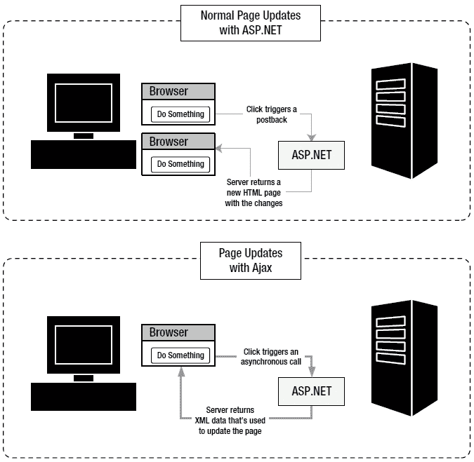

[图 25-1](#_Fig00251) 。普通服务器端页面 vs AjaxT3】

ASP.NET 包含了一个方便的控件，它可以让你获取一个带有服务器端逻辑的普通页面，并通过使用部分更新来确保它以无闪烁的 Ajax 风格刷新自己。该控件是 UpdatePanel。

基本思想是将网页分成一个或多个不同的区域，每个区域都被包装在一个不可见的 UpdatePanel 中。当位于 UpdatePanel 内的控件中发生事件时，并且该事件通常会触发整页回发，UpdatePanel 会截获该事件并执行异步回调。这是一个如何发生的例子:

1.  用户单击 UpdatePanel 中的按钮。
2.  UpdatePanel 拦截客户端的单击。ASP.NET AJAX 执行对服务器的回调，而不是整页回发。
3.  在服务器上，您的正常页面生命周期与所有常见事件一起执行。最后，页面被呈现为 HTML 并返回给浏览器。
4.  ASP.NET AJAX 接收页面上每个 UpdatePanel 的 HTML 内容。然后，客户端脚本代码更新页面，用新内容替换每个面板中的现有 HTML。(如果对 UpdatePanel 之外的内容进行了更改，则会被忽略。)

 **注意**如果你访问一个使用 UpdatePanel 的页面，而它的浏览器不支持 Ajax 或者没有打开 JavaScript，那么这个页面会使用普通的回发而不是部分更新。然而，其他一切仍然正常工作。

简单的 UpdatePanel 测试

为了试用 UpdatePanel，构建一个简单的测试页面是有意义的。下面的例子([图 25-2](#Fig00252) )使用了一个简单的页面，它包括两个部分:一个动画 GIF 图像和一个显示当前时间的阴影框，还有一个刷新时间按钮。当您单击“刷新时间”按钮时，页面从 web 服务器获取当前时间并更新标签。但是，刷新过程使用部分更新。因此，当更新发生时，页面不会闪烁。动画 GIF 有助于说明这一点——即使你点击按钮刷新标签，灯继续冒泡，没有停顿或打嗝。

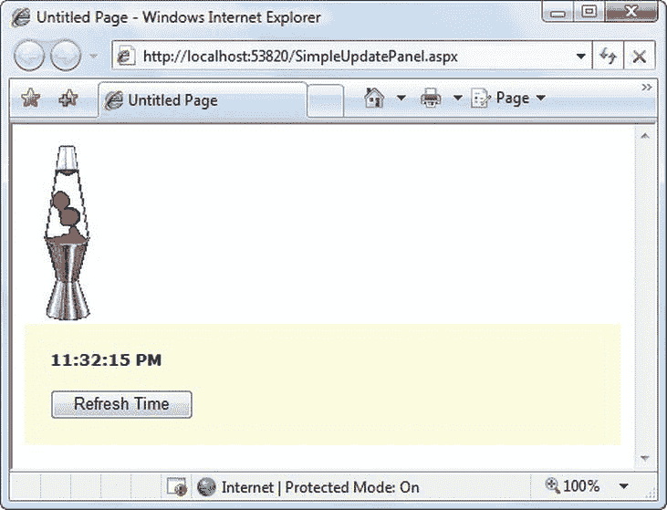

[图 25-2](#_Fig00252) 。使用部分更新刷新标签

构建这个页面很容易。首先，您需要将 ScriptManager 控件添加到页面中。像所有使用 ASP.NET AJAX 的控件一样，UpdatePanel 与 ScriptManager 协同工作。如果您的页面中没有它，UpdatePanel 将无法工作(并且当您运行页面时会收到一个异常)。此外，ScriptManager 需要出现在 UpdatePanel 之前，因为在 UpdatePanel 可以使用它之前，呈现的页面必须有 JavaScript 脚本块。最好总是将 ScriptManager 放在页面的

<form>部分的顶部。</form>

接下来，您需要将内容添加到页面中。动画 GIF 相当简单——你可以使用一个普通的元素来显示它。然而，标签和按钮需要更多的努力。要使用部分刷新来刷新标签，您需要将其包装在 UpdatePanel 中。因此，首先向页面添加一个 UpdatePanel，然后将按钮和标签拖放到其中。

UpdatePanel 在生命中有一个角色—充当您希望异步刷新的内容的容器。有趣的是，UpdatePanel 并不是从 Panel 派生出来的。相反，它直接来自控制。这种设计会引起一些您应该考虑的奇怪现象。

首先，UpdatePanel 是不可见的。与标准的 ASP.NET 面板不同，UpdatePanel 不支持样式设置。如果你想在你的 UpdatePanel 周围显示一个边框或者改变背景颜色，你需要在你的 UpdatePanel 中放置一个普通的面板(或者只是一个普通的

标签)。在图 25-2 所示的例子中，这是如何做到的:

```cs
<asp:ScriptManager ID = "ScriptManager1" runat = "server" > </asp:ScriptManager>
<asp:UpdatePanel ID = "UpdatePanel1" runat = "server" UpdateMode = "Conditional">
 <ContentTemplate>
 <div style = "background-color:LightYellow;padding: 20px">
    <asp:Label ID = "lblTime" runat = "server" Font-Bold = "True" > </asp:Label>
    <br />
    <br />
    <asp:Button ID = "cmdRefreshTime" runat = "server"
    OnClick = "cmdRefreshTime_Click"
    Text = "Refresh Time" />
 </div>
 </ContentTemplate>
</asp:UpdatePanel>
```

该标记揭示了 UpdatePanel 和普通面板之间的另一个区别——UpdatePanel 使用模板。添加到 UpdatePanel 的所有控件都放在名为<contenttemplate>的元素中。当 UpdatePanel 呈现自身时，它将内容从 ContentTemplate 复制到页面中。这似乎是一个相当不重要的低级细节，但它确实有一个重要的副作用。如果要使用代码向 UpdatePanel 动态添加控件，则不能使用 UpdatePanel。控件集合。相反，您需要向 UpdatePanels 添加新的控件。控件集合。</contenttemplate>

现在，您已经拥有了所需的控件，可以开始添加代码了。这一部分很简单——当按钮被单击时，您只需对 Click 事件做出反应并更新标签:

```cs
protected void cmdRefreshTime_Click(object sender, EventArgs e)
{
 lblTime.Text = DateTime.Now.ToLongTimeString();
}
```

值得注意的是，这就是完成这个例子所需要做的全部工作。现在，当您单击“刷新时间”按钮时，标签将刷新，没有完全回发，也没有任何闪烁。

那么这一切是如何运作的呢？下面是对正在发生的事情的详细分析:

*   1.呈现 HTML 时，UpdatePanel 查看其内容，并注意到它包含一个可以触发回发的控件—按钮。UpdatePanel 添加了一些 JavaScript 代码，这些代码将拦截客户端上按钮的 Click 事件，并使用 JavaScript 例程来处理它。
*   2.当您单击刷新时间按钮时，您触发了 JavaScript 例程。
*   3.JavaScript 例程不执行整页回发。相反，它向 web 服务器发送后台请求。这个请求是异步的，这意味着当请求进行时，您的页面保持响应。

 **注意**因为 UpdatePanel 使用异步请求，所以在返回结果和更新时间之前，可以多次单击刷新时间按钮。在这种情况下，将忽略前几个请求的响应，而使用最后一个请求的响应。(这类似于在服务器上处理完回发页面之前多次刷新该页面的情况。)

*   4.后台请求在*中的处理方式与普通回发完全相同。来自所有 web 控件的所有数据连同视图状态信息和任何 cookies 一起被发送回 web 服务器。在 web 服务器上，页面生命周期是相同的—首先是页面。Load 事件触发，随后是触发回发的事件(在本例中为 Button。点击)。如果您使用的是 SqlDataSource 之类的数据源控件，所有正常的查询和数据绑定都会发生。然后，最终的页面被呈现为 HTML，并被发送回页面。*
*   5.当浏览器收到为页面呈现的 HTML 时，它会更新当前视图状态并获取任何返回的 cookies。
*   6.然后，JavaScript 例程替换页面上 HTML 的一部分——只是您在 UpdatePanel 中包装的那部分。页面的 HTML 的其余部分被简单地丢弃。在当前的例子中，这意味着带有动画 GIF 的 HTML 被丢弃了。(这确实没有影响，因为 HTML 的这一部分在新的响应中与原来完全一样。但是，重要的是要明白，如果您在 web 服务器上修改了页面的这一部分，您将不会在 web 浏览器中看到更改的结果，因为页面的这一部分没有被更新。)

UpdatePanel 控件最令人印象深刻的方面是，它允许您的网页以与不使用任何 Ajax 技术时相同的方式运行。这种便利是有代价的——也就是说，由于正在发生的所有额外工作，请求可能会比必要的时间长一点。在更简化的 DIY 方法中，您只需向 web 服务器请求您所需要的内容。在本例中，这意味着您只需询问当前时间，而不是整个 HTML 文档。

然而，在大多数情况下，UpdatePanel 更冗长的方法不会引入任何明显的延迟。更好的是，它让您能够处理更复杂的场景——例如，当您更剧烈地修改网页的一部分时。在本章的后面，当您使用 UpdatePanel 来改进贺卡制作时，您将看到一个示例。

 **注意**当你使用 UpdatePanel 时，你并没有减少使用的带宽量或者从服务器接收响应的时间，因为整个页面仍然被发送。唯一的区别是页面更新时没有令人分心的闪烁。虽然这个优势看起来很小，但它可以对用户的网页“感觉”产生重大影响。

错误处理

如您所见，当 UpdatePanel 执行其回调时，网页代码的运行方式与页面被回发的方式完全相同。唯一的区别是通信方式(页面使用异步调用来获取新数据)和接收数据的处理方式(UpdatePanel 刷新其内部内容，但页面的其余部分不变)。因此，您不需要对服务器端代码进行重大更改，也不需要处理新的错误情况。

也就是说，执行异步回发时可能会出现问题，就像执行同步回发时一样。要了解发生了什么，您可以向页面的事件处理程序中添加类似这样的代码。Load 事件，该事件导致在发生异步回调时发生未处理的异常:

```cs
if (this.IsPostBack)
{
    throw new ApplicationException("This operation failed.");
}
```

当网页引发未处理的异常时，ScriptManager 会捕获该错误并将其传递回客户端。客户端 JavaScript 然后抛出一个 JavaScript 错误。接下来会发生什么取决于您的浏览器设置，但通常浏览器被配置为悄悄地抑制 JavaScript 错误。在 Internet Explorer 中，状态栏中会显示一条“页面错误”消息，指出问题所在。如果双击该通知，会出现一个对话框，显示全部细节，如图[图 25-3](#Fig00253) 所示。

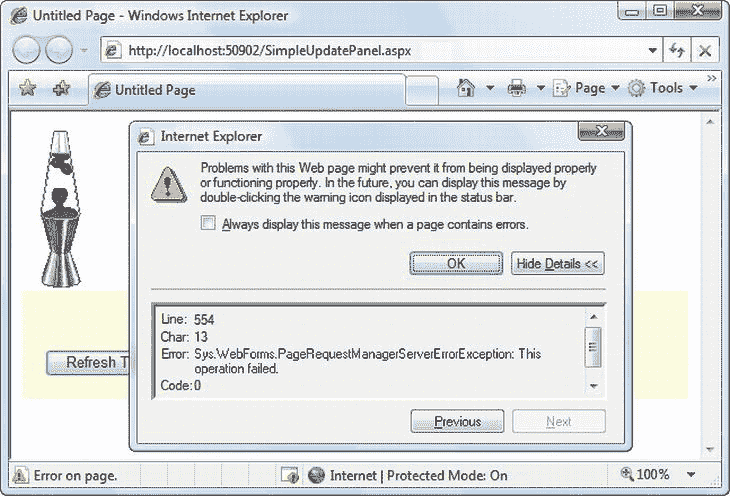

[图 25-3](#_Fig00253) 。显示关于服务器端错误的客户端消息

还有另一种方法来处理异步回发过程中出现的错误。您可以使用自定义错误页面，就像处理普通网页一样。您需要做的就是将<customerrors>元素添加到 web.config 文件中。</customerrors>

例如，这里有一个<customerrors>元素，它将所有错误重定向到名为 ErrorPage.aspx 的页面:</customerrors>

```cs
<configuration>
 ...
 <system.web>
 ...
 <customErrors defaultRedirect = "ErrorPage.aspx" mode = "On" > </customErrors>
 </system.web>
</configuration>
```

现在，当 PageRequestManager 被通知有错误时，它会将浏览器重定向到 ErrorPage.aspx。它还会向 URL 添加一个 aspxerrorpath 查询字符串参数，以指示产生问题的页面的 URL，如下所示:

[http://localhost/Ajax/error page . aspx**？aspserrorpath =/Ajax/update panels . aspx**](http://localhost/Ajax/ErrorPage.aspx)

您可以在 ErrorPage.aspx 中编写读取 aspxerrorpath 信息的代码。例如，您可以包含一个“重试”按钮，将用户重定向到最初请求的页面，如下所示:

`string url` = `Request.QueryString["aspxerrorpath"];`

`if (url !` = `null) Response.Redirect(url);`

如果您的网站使用自定义错误页面，但您不希望它们应用于异步回发，则必须设置 ScriptManager。将 AllowCustomErrorsRedirect 属性设置为 false。

 **注意**几个控件在 UpdatePanel 中不能正常工作，或者在特定场景中不能工作。最值得注意的是，FileUpload 和 HtmlInputFile 控件根本不起作用。Login、PasswordRecovery、ChangePassword 和 CreateUserWizard 控件只有在您将其内容转换为模板后才能工作。如果将 EnableSortingAndPagingCallbacks 设置为 true，GridView 和 DetailsView 控件将失败。如果您已经设置了它们的样式属性，TreeView 和 Menu 控件就不起作用(相反，您可以使用 CSS 样式来格式化它们的项目)。然而，所有这些控件都将在包含 UpdatePanel 控件的页面上工作，只要它们实际上不在 UpdatePanel 中。

条件更新

在复杂的页面中，您可能有多个 UpdatePanel。在这种情况下，当一个 UpdatePanel 触发更新时，所有 UpdatePanel 区域都将被刷新。

但是，如果您有多个 UpdatePanel，并且每个 UpdatePanel 都是完全独立的，则没有必要这样做。在这种情况下，您可以将面板配置为独立更新。只需更改 UpdatePanel。UpdateMode 属性从 Always 改为 Conditional。现在，只有当 UpdatePanel 中的某个控件发生事件时，UpdatePanel 才会刷新自身。

要尝试这一点，请创建一个包含几个 UpdatePanel 控件的页面，每个控件都有自己的时间显示和按钮。然后添加代码，将当前时间放在所有三个控件的标签中:

```cs
protected void Page_Load(object sender, EventArgs e)
{
 lblTime1.Text = DateTime.Now.ToLongTimeString();
 lblTime2.Text = DateTime.Now.ToLongTimeString();
 lblTime3.Text = DateTime.Now.ToLongTimeString();
}
```

当您单击其中一个刷新时间按钮时，只有该面板中的标签会被更新。其他面板将保持不变。

 **注意**这里有一个有趣的怪癖。从技术上讲，当您单击按钮时，所有的标签都会更新，但只有页面的一部分会刷新以显示这一事实。下一次回发页面时，最新的值将从视图状态中取出，并应用于所有标签，包括客户端上没有刷新的标签。

Most of the time, this distinction isn’t important. But if this isn’t the behavior you want in this example, you could use a separate event handler for each button. Each event handler would update just one label—the label that’s in the appropriate UpdatePanel. That way, when the page is posted back, just one label is changed, and you don’t waste time changing parts of the page that won’t be updated in the browser.

这种方法有一个警告。如果执行更新需要很长时间，它可能会被另一个更新中断。如您所知，ASP.NET AJAX 异步回发页面，因此在回发过程中，用户可以随意点击其他按钮。ASP.NET AJAX 不允许并发更新，因为它需要确保其他信息——比如页面视图状态信息、会话 cookie 等——保持一致。相反，当启动新的异步回发时，会放弃以前的异步回发。在大多数情况下，这是您想要的行为。如果希望防止用户中断异步回发，可以添加在异步回发进行过程中禁用控件的 JavaScript 代码，但这需要更多的工作。另一种选择是使用本章稍后讨论的 UpdateProgress 控件。

 **提示**还有一种方法可以更新有条件的 UpdatePanel——你可以调用 UpdatePanel。服务器端代码中的 Update()方法。这允许您动态地决定是否应该刷新某个面板。但是，必须注意不要在使用 Always 更新模式的面板上调用 Update()，也不要在页面呈现后调用 Update()。如果你犯了这些错误中的任何一个，你将会导致一个异常。

触发器

到目前为止，您看到的示例都使用了 UpdatePanel 的内置行为。在下一个示例中，您将在一个稍微复杂一点的页面中使用 UpdatePanel，并且您将学习用触发器控制它的刷新。

在本书的前面，您了解了如何构建一个允许用户动态构建贺卡的网页。该页面允许用户指定一些细节，如文本、字体、颜色、边框选项等，然后更新页面的一部分以显示贺卡。

第 6 章展示了贺卡制作机的两个版本。第一个版本允许用户一次指定多个选项，然后点击一个按钮来更新贺卡。第二个版本使用自动回发事件，因此贺卡在每次更改后都会更新。第二种方法给出了更直接的结果，但代价是用户界面的响应速度较慢，而且会有令人分心的闪烁。如果这个版本的贺卡制作程序运行在一个慢速的 web 服务器上(或者通过一个慢速网络)，问题会变得更糟。这是因为在每次回发后，用户都被迫等待页面更新，然后再进行另一次更改。

UpdatePanel 使您能够获得这两个版本的优点。您可以创建一个贺卡页面，该页面会自动更新其显示，但感觉响应更快，并且不会将用户拒之门外。

最简单的方法是添加一个 ScriptManager，并将整个网页(包括控件和贺卡)包装在一个巨大的 UpdatePanel 中。下面是您要使用的标记:

```cs
<asp:ScriptManager ID = "ScriptManager1" runat = "server" > </asp:ScriptManager>
<asp:UpdatePanel ID = "UpdatePanel1" runat = "server">
 <ContentTemplate>
 <!-- These are the controls for creating the greeting card. -->
 <div style = "…">
    Choose a background color:<br />
    <asp:DropDownList ID = "lstBackColor" runat = "server"
    Width = "194px" AutoPostBack = "True">
    </asp:DropDownList>
    <br /> < br />
    Choose a foreground (text) color:<br />
    <asp:DropDownList ID = "lstForeColor" runat = "server"
    Height = "22px" Width = "194px" AutoPostBack = "True" >
    </asp:DropDownList>
    <br /> < br />
    Choose a font name:<br />
    <asp:DropDownList ID = "lstFontName" runat = "server"
    Height = "22px" Width = "194px" AutoPostBack = "True">
    </asp:DropDownList>
    <br /> < br />
    Specify a font size:<br />
    <asp:TextBox ID = "txtFontSize" runat = "server"
    AutoPostBack = "True">
    </asp:TextBox>
    <br /> < br />
    Choose a border style:<br />
    <asp:RadioButtonList ID = "lstBorder" runat = "server"
    Height = "59px" Width = "177px" Font-Size = "X-Small"
    AutoPostBack = "True" RepeatColumns = "2">
    </asp:RadioButtonList>
    <br /> < br />
    <asp:CheckBox ID = "chkPicture" runat = "server"
    Text = "Add the Default Picture" AutoPostBack = "True">
    </asp:CheckBox>
    <br /> < br />
    Enter the greeting text below:<br />
    <asp:TextBox ID = "txtGreeting" runat = "server"
    Height = "85px" Width = "240px" TextMode = "MultiLine"
    AutoPostBack = "True">
    </asp:TextBox>
 </div>
 <!-- This is the panel that shows the greeting card. -->
 <asp:Panel ID = "pnlCard" runat = "server" … >
    <asp:Label ID = "lblGreeting" runat = "server" Width = "272px"
    Height = "150px" > </asp:Label>
    <br />
    <asp:Image ID = "imgDefault" runat = "server" Width = "212px" Height = "160px"
    Visible = "False" > </asp:Image>
 </asp:Panel>
 </ContentTemplate>
</asp:UpdatePanel>
The greeting card is then generated when the Page.Load event fires:
protected void Page_Load(object sender, EventArgs e)
{
 if (!this.IsPostBack)
 {
    // (Initialize all the controls here.)
 }
 else
 {
    // Refresh the greeting card.
    UpdateCard();
 }
}
```

UpdatePanel 监视其子控件，并截获任何可能触发回发的事件。按钮。Click 事件是一个明显的例子，但在本例中是 TextBox。文本更改和列表框。SelectedItemChanged 事件也触发回发，因为这些控件将 AutoPostBack 属性设置为 true。因此，这些事件也被 UpdatePanel 截获。如果这些控件不使用 AutoPostBack 属性，则它们不会触发回发，UpdatePanel 不会参与其中，并且在另一个控件导致回发之前，贺卡不会更新。

这个解决方案达到了预期的效果。尽管贺卡页面看起来基本上是一样的(参见[图 25-4](#Fig00254) )，但是当你与左边的控件交互时，右边的卡片会在没有回发的情况下更新。如果您在短时间内连续进行了几次更改，您将触发几次回发，并且将使用最后一次回发的结果(带有完全更新的卡)。

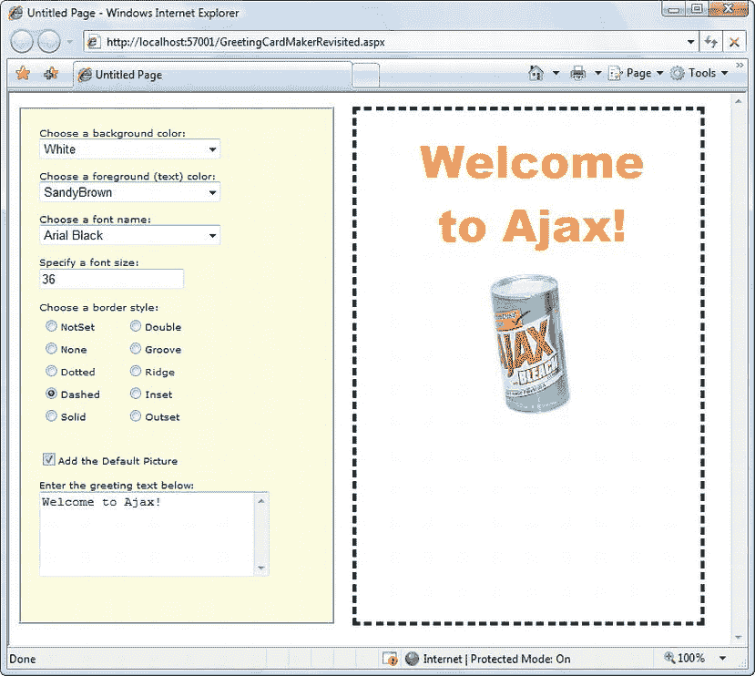

[图 25-4](#_Fig00254) 。Ajax 风格的贺卡制作人

尽管这个例子工作得非常好，但是它做了更多不必要的工作。因为整个页面被包装在 UpdatePanel 中，所以整个页面的 HTML 被刷新。更好的选择是在 UpdatePanel 中只包装代表贺卡的标签和图像。可惜，这是行不通的。在您将其他控件移出 UpdatePanel 后，它们的事件将不再被拦截，并且它们将触发带有常见闪烁的整页回发。

解决方案是显式地告诉 UpdatePanel 监视这些控件，即使它们不在 UpdatePanel 中。您可以通过向 UpdatePanel 添加触发器来实现这一点。为每个按钮添加一个触发器。

下面是您需要的标记:

```cs
<asp:ScriptManager ID = "ScriptManager1" runat = "server" > </asp:ScriptManager>
<!-- The controls for creating the greeting card go here. -->
<asp:UpdatePanel ID = "UpdatePanel1" runat = "server">
 <ContentTemplate>
 <!-- This is the panel that shows the greeting card. -->
 <asp:Panel ID = "pnlCard" runat = "server" … >
    <asp:Label ID = "lblGreeting" runat = "server" Width = "272px"
    Height = "150px" > </asp:Label>
    <asp:Image ID = "imgDefault" runat = "server" Width = "212px" Height = "160px"
    Visible = "False" > </asp:Image>
 </asp:Panel>
 </ContentTemplate>
 <Triggers>
 <asp:AsyncPostBackTrigger ControlID = "lstBackColor" />
 <asp:AsyncPostBackTrigger ControlID = "lstForeColor" />
 <asp:AsyncPostBackTrigger ControlID = "lstFontName" />
 <asp:AsyncPostBackTrigger ControlID = "txtFontSize" />
 <asp:AsyncPostBackTrigger ControlID = "lstBorder" />
 <asp:AsyncPostBackTrigger ControlID = "chkPicture" />
 <asp:AsyncPostBackTrigger ControlID = "txtGreeting" />
 </Triggers>
</asp:UpdatePanel>
```

提示你不需要手动输入你的触发器。相反，您可以使用 Visual Studio 属性窗口。只需选择 UpdatePanel，在“属性”窗口中单击“触发器”属性，然后单击出现在“触发器”框中的省略号(…)。Visual Studio 将打开一个对话框，您可以在其中添加任意数量的触发器，并从下拉列表中选择每个触发器的控件。

这些触发器告诉 UpdatePanel 拦截这七个控件中的默认事件。(您可以通过设置触发器的 EventName 属性来指定要监视的事件，但您不需要这样做，因为您正在为每个事件使用最常用的默认事件。)因此，页面的工作方式和以前一样——它只是在每次异步请求后刷新页面的一小部分。

从技术上讲，UpdatePanel 总是使用触发器。UpdatePanel 中的所有控件都自动成为 UpdatePanel 的触发器。但是，如果控件位于页面中的其他位置，则需要添加触发器。

 **注意**你可以将同一个触发器添加到几个不同的条件 UpdatePanel 控件中，在这种情况下，该事件将更新所有的控件。

您可以用另一种方式使用触发器。您可以使用它们来告诉 UpdatePanel 忽略某些控件，而不是使用它们来监视更多的控件。例如，假设您的 UpdatePanel 中有一个按钮。通常，单击该按钮将触发异步请求和部分更新。如果您希望它触发整页回发，只需添加一个 PostBackTrigger(而不是 AsynchronousPostBackTrigger)。

例如，下面是一个 UpdatePanel，它包含一个触发完全回发而不是异步回发的嵌套按钮:

```cs
<asp:UpdatePanel ID = "UpdatePanel1" runat = "server" UpdateMode = "Conditional">
 <ContentTemplate>
 <asp:Label ID = "Label1" runat = "server" Font-Bold = "True" > </asp:Label>
 <br />
 <br />
 <asp:Button ID = "cmdPostback" runat = "server" Text = "Refresh Full Page" />
 </ContentTemplate>
 <Triggers>
 <asp:PostBackTrigger ControlID = "cmdPostback" />
 </Triggers>
</asp:UpdatePanel>
```

这种技术并不常见，但如果在 UpdatePanel 中有几个执行有限更新的控件(因此使用异步请求)和一个对整个页面执行更重要的更改的控件(因此使用整页回发)，这种技术会很有用。

使用进度通知

如您所知，UpdatePanel 在后台异步执行其工作。因此，用户可以继续使用该页面。这通常是您想要的行为，但是有一个问题。当异步请求正在进行时，用户不一定会意识到发生了什么。如果异步请求需要一些时间，这可能会有点问题。最坏的情况是，用户会认为页面已经损坏，或者多次点击同一个按钮，这给 web 应用带来了不必要的额外工作，并进一步降低了整个过程的速度。

ASP.NET 包含了另一个有用的控件 UpdateProgress 控件。UpdateProgress 控件与 UpdatePanel 一起工作。本质上，UpdateProgress 控件允许您在进行耗时的更新时显示一条消息。

 **注意**更新进度控件有点名不副实。它实际上并不表明进步；相反，它提供了一条等待消息，向用户保证页面仍在工作，上一个请求仍在处理中。

显示模拟进度条

当您将 UpdateProgress 控件添加到页面时，您可以指定一些内容，这些内容将在异步请求开始时出现，并在请求完成时消失。这种内容可以包含固定的消息，但是许多人更喜欢使用动画 GIF，因为它更清楚地表明页面仍然在工作。通常这个动画 GIF 模拟一个进度条。

图 25-5 显示了一个在其生命周期中的三个点使用 UpdateProgress 控件的页面。上图显示了页面第一次出现时的样子，带有一个包含按钮的简单的 UpdatePanel 控件。当单击按钮时，异步回调过程开始。此时，UpdateProgress 控件的内容出现在下方(如中间的图像所示)。在本例中，UpdateProgress 包括一条文本消息和一个以进度条形式出现的动画 GIF，绿色块从左到右永久填充进度条，然后重新开始。回调完成后，UpdateProgress 消失，UpdatePanel 被更新，如下图所示。

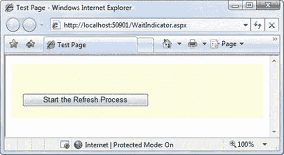

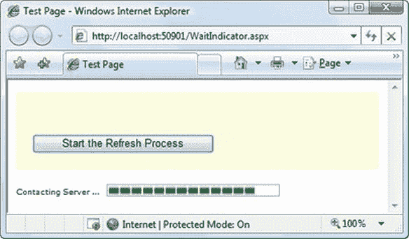

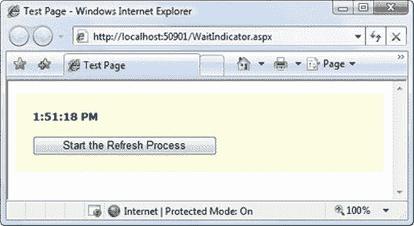

[图 25-5](#_Fig00255) 。等待指示器

此页面的标记定义了一个 UpdatePanel，后跟一个 UpdateProgress:

```cs
<asp:UpdatePanel ID = "UpdatePanel1" runat = "server">
 <ContentTemplate>
 <div style = "background-color:#FFFFE0;padding: 20px">
    <asp:Label ID = "lblTime" runat = "server" Font-Bold = "True" > </asp:Label>
    <br /> < br />
    <asp:Button ID = "cmdRefreshTime" runat = "server"
    OnClick = "cmdRefreshTime_Click"
    Text = "Start the Refresh Process" />
 </div>
 </ContentTemplate>
</asp:UpdatePanel>
<br />
<asp:UpdateProgress ID = "updateProgress1" runat = "server">
 <ProgressTemplate>
 <div style = "font-size: xx-small">
    Contacting Server … < img src = "wait.gif" alt = "Waiting…" />
 </div>
 </ProgressTemplate>
</asp:UpdateProgress>
```

这不是唯一可能的安排。根据所需的布局，可以将 UpdateProgress 控件放在 UpdatePanel 控件内的某个位置。

该页面的代码与前面的示例相比略有不同。由于 UpdateProgress 控件仅在进行异步回调时显示其内容，因此仅将该控件用于耗时的操作是有意义的。否则，UpdateProgress 将只在几分之一秒内显示其 ProgressTemplate。为了模拟一个缓慢的过程，您可以添加一行代码来延迟您的代码 10 秒钟，如下所示:

```cs
protected void cmdRefreshTime_Click(object sender, EventArgs e)
{
 System.Threading.Thread.Sleep(TimeSpan.FromSeconds(10));
 lblTime.Text = DateTime.Now.ToLongTimeString();
}
```

不需要将 UpdateProgress 控件显式链接到 UpdatePanel 控件。每当 *any* UpdatePanel 开始回调时，UpdateProgress 会自动显示其 ProgressTemplate。但是，如果您有一个包含多个 UpdatePanel 的复杂页面，您可以选择将 UpdateProgress 限制为只关注其中一个。为此，只需设置 UpdateProgress。AssociatedUpdatePanelID 属性与相应 UpdatePanel 的 ID。您甚至可以将多个 UpdateProgress 控件添加到同一页面，并将每个控件链接到不同的 UpdatePanel。

启用取消

UpdateProgress 控件支持另一个细节:取消按钮。当用户单击 cancel 按钮时，异步回调将被立即取消，UpdateProgress 内容将消失，页面将恢复到原始状态。

添加取消按钮是一个两步过程。首先，您需要添加一个相当吓人的 JavaScript 代码块，您可以逐字复制它。你应该把这段代码放在页面的末尾，在所有内容之后，在结束标签之前。下面是您需要的代码，在它正确的位置:

```cs
<%@ Page Language = "C#" AutoEventWireup = "true" CodeFile = "WaitIndicator.aspx.cs"
 Inherits = "WaitIndicator" %>
<!DOCTYPE html>
<html>
<head runat = "server">
 ...
</head>
<body>
 <form ID = "form1" runat = "server">
 ...
 </form>
 <script type = "text/javascript">
 var prm = Sys.WebForms.PageRequestManager.getInstance();
 prm.add_initializeRequest(InitializeRequest);
 function InitializeRequest(sender, args)
 {
    if (prm.get_isInAsyncPostBack())
    {
        args.set_cancel(true);
    }
 }
 function AbortPostBack()
 {
    if (prm.get_isInAsyncPostBack()) {
    prm.abortPostBack();
    }
 }
 </script>
</body>
</html>
```

 **提示**您可以从 WaitIndicator.aspx 页面(包含在本章的示例中)剪切并粘贴这段代码到您自己的页面中。

一旦添加了这段代码，就可以使用 JavaScript 代码随时调用它的 AbortPostBack()函数并取消回调。最简单的方法是使用 JavaScript 事件属性将 JavaScript 事件连接到 AbortPostBack()函数。您可以向几乎任何 HTML 元素添加 JavaScript 事件属性。例如，您可以使用 onclick 属性来处理客户端点击。下面是一个基本的 HTML 按钮(不是服务器控件)，它使用这种技术将自己连接到 AbortPostBack()函数:

`<input ID =``"cmdCancel" onclick =``"AbortPostBack()" type =``"button" value =`T4】

如果点击此取消按钮，客户端 AbortPostBack()函数将被触发，回调将被立即取消。通常，你会将这个按钮(或类似这样的元素)放置在 UpdateProgress 控件的 ProgressTemplate 中，如图 25-6 所示。

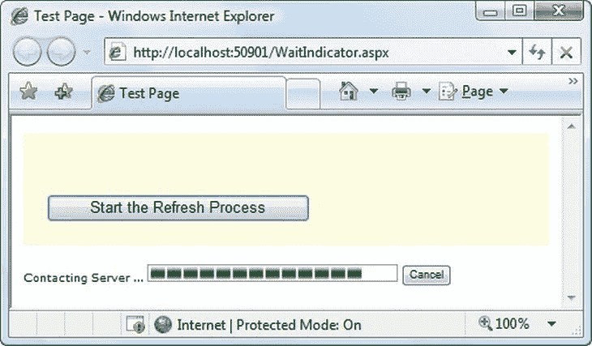

[图 25-6](#_Fig00256) 。带有取消按钮的 UpdateProgress 控件

不要将这种方法与服务器端事件处理混淆，客户端 onclick 属性允许您在浏览器中拦截事件，并使用 JavaScript 代码处理它。服务器根本不参与。事实上，当您取消一个操作时，服务器会继续处理请求，但是浏览器只是关闭连接并停止侦听响应。

 **提示**对于可以安全取消的任务，使用中止按钮是有意义的，因为它们不会改变外部状态。例如，用户应该能够取消从数据库中检索信息的操作。但是，将取消添加到更新数据库的操作中并不是一个好主意，因为即使客户机已经停止了对响应的侦听，服务器仍会继续直到完成更新。

实现定时刷新

使用到目前为止您已经看到的两个控件 UpdatePanel 和 UpdateProgress 控件—您可以在页面上创建自包含区域，当发生某些操作时，这些区域会自行刷新。当然，为了让这项技术发挥作用，用户需要启动一个通常会导致回发的操作，比如单击按钮、选择 AutoPostBack 列表中的一项、选择 AutoPostBack 复选框等等。

在某些情况下，您可能希望在不等待用户操作的情况下强制刷新整个或部分页面。例如，您可能创建了一个包含股票行情自动收录器的页面，并且您可能希望定期(比如说，每五分钟)刷新该行情自动收录器，以确保它不会彻底过时。ASP.NET 包括一个定时器控件，可以让你很容易地实现这个设计。

定时器控制非常简单。您只需将它添加到页面中，并将其 Interval 属性设置为更新前应该经过的最大毫秒数。例如，如果将 Interval 设置为 60000，计时器将在一分钟后强制回发。

`<asp:Timer ID =``"Timer1" runat =``"server" Interval =`T3】

 **注意**显然，计时器有可能大大增加 web 应用的开销，降低其可伸缩性。在引入定时刷新之前要仔细考虑，间隔时间要长而不是短。

计时器控件的工作方式是呈现一段启动 JavaScript 计时器的客户端脚本。当 JavaScript 计时器触发时(以您指定的时间间隔)，客户端脚本触发回发并引发服务器端 Tick 事件。

就其本身而言，这种行为是相当低效的(因为它会导致页面完全自我刷新，可能是在用户正在执行另一个任务的时候)。但是如果您将计时器放在 UpdatePanel 中，结果会好得多。UpdatePanel 将回发转换为无缝回调，并使用部分呈现来更新页面的一部分。与完全回发不同，部分呈现的回调不会导致闪烁，也不会在任务执行过程中打断用户。

若要将计时器用于部分呈现，请在 UpdatePanel 控件中包装页面的可更新部分，并将 UpdateMode 属性设置为 Conditional。然后添加一个触发器，强制 UpdatePanel 在计时器计时时更新自身。滴答事件发生。下面是您需要的标记:

```cs
<asp:UpdatePanel ID = "UpdatePanel1" runat = "server"UpdateMode = "Conditional">
 <ContentTemplate>
 ...
 </ContentTemplate>
 <Triggers>
 <asp:AsyncPostBackTrigger ControlID = "Timer1" EventName = "Tick" />
 </Triggers>
</asp:UpdatePanel>
```

页面的所有其他部分可以保持不变，或者如果您需要更新它们以响应其他操作，可以用不同的触发器将它们包装在有条件的 UpdatePanel 控件中。

 **注意**你必须使用带有定时器控制的触发器。您不能简单地将计时器放在 UpdatePanel 中，并期望它在没有触发器的情况下工作(不像其他控件)。如果不使用触发器，计时器将强制完全回发，并带有闪烁。

要停止计时器，只需在服务器端代码中将 Enabled 属性设置为 false。例如，以下是十次更新后禁用计时器的方法:

```cs
protected void Timer1_Tick(object sender, EventArgs e)
{
 // Update the tick count and store it in view state.
 int tickCount = 0;
 if (ViewState["TickCount"] ! = null)
 {
    tickCount = (int)ViewState["TickCount"];
 }
 tickCount++;
 ViewState["TickCount"] = tickCount;
 // Decide whether to disable the timer.
 if (tickCount > 10)
 {
    Timer1.Enabled = false;
 }
}
```

使用 ASP.NET AJAX 控件工具包

UpdatePanel、UpdateProgress 和 Timer 控件相当有用。然而，它们是你能在 ASP.NET 中找到的唯一支持 ASP.NET AJAX 的控件。尽管它们很有价值，但听过 Ajax 宣传并使用过 Gmail 等高级 Ajax 网站的开发人员可能会期望更多。

其实 ASP。NET 对 Ajax 的支持有点骗人。尽管只有三个控件使用了 ASP.NET AJAX 特性，但 ASP.NET 包含了一个复杂的 JavaScript 函数库，可以用来创建各种高级效果。业务应用开发人员不太可能使用这些库(因为它们相当复杂，需要大量的时间投入)，但是第三方组件开发人员会热情地使用它们。

ASP.NET AJAX 真正能做的第一个也是最好的例子是 ASP.NET AJAX 控制工具包。ASP.NET AJAX 控件工具包是微软和 ASP.NET 社区的联合项目。它由几十个使用 ASP.NET AJAX 库创建复杂效果的控件组成。

ASP.NET AJAX 控件工具包有很多优点:

*   完全免费。
*   它包括完整的源代码，如果你有足够的雄心想要创建自己的使用 ASP.NET AJAX 特性的自定义控件，这是很有帮助的。
*   它使用扩展程序来增强标准的 ASP.NET web 控件。这样，您不必替换网页上的所有控件，而只需插入您需要的新功能。

安装 ASP.NET AJAX 控件工具包

你可以从`http://ajaxcontroltoolkit.codeplex.com`下载 ASP.NET AJAX 控件工具包。单击“下载”选项卡，找到最新版本的. NET 工具包。下载此 ZIP 文件后，您可以将其中包含的文件解压缩到硬盘上更永久的位置。

在撰写本文时，ASP.NET AJAX 控件工具包的最新版本被命名为 AJAX Control Toolkit。Binary.NET4.zip 和 targets。NET 4，但它仍然可以很好地与。净 4.5。如果你需要对 ASP.NET 3.5 的支持，你可以找到一个类似的针对该版本. NET 的下载

在这个 ZIP 文件中，您会发现一个名为 AjaxControlToolkit.dll 的中央程序集和许多支持不同区域性本地化的较小附属程序集。您还会看到一个名为 AjaxControlToolkitSampleSite 的压缩文件夹，其中包含一个演示所有 ASP.NET AJAX 控件工具包组件的大型示例网站，以及一个带有安装说明的 ReadMe.html 文件。

要开始使用 ASP.NET AJAX 控件工具包进行开发，您只需打开 AjaxControlToolkitSampleSite 文件夹(或者将其 Bin 子文件夹的内容复制到您的某个 web 应用的 Bin 子文件夹中)。然而，如果您让 Visual Studio 通过向工具箱添加新组件 来帮助您，生活会容易得多。以下是如何:

1.  确保您已经将 ASP.NET AJAX 控件工具箱的解压缩内容放在硬盘上一个合理的永久位置。(例如，您可以将它们复制到 c:\ASP.NETAjaxControlToolkit 等文件夹中。)如果在完成此过程后移动该文件夹，Visual Studio 将找不到 AjaxControlToolkit.dll 程序集。因此，当您将控件拖动到网页上时，它将无法添加必要的程序集引用。(解决此问题的唯一方法是从工具箱中移除控件，然后重复该过程，从新位置添加它们。)
2.  首先，您需要为控件创建一个新的工具箱选项卡。右键单击工具箱，然后选择添加选项卡。然后输入一个名称(例如，AJAX Toolkit)并按 enter 键。
3.  现在，您需要将控件添加到新选项卡中。右键单击您创建的空白选项卡，然后选择选择项目。
4.  在“选择工具箱项”对话框中，单击“浏览”。找到 AjaxControlToolkit.dll(在你解压 ASP.NET AJAX 控件工具包的文件夹中)并点击 OK。
5.  Visual Studio 可能会警告您该 DLL 是从 Internet 下载的。单击“是”接受此警告并继续。
6.  现在，AjaxControlToolkit.dll 的所有组件都将出现在“选择工具箱项”对话框的列表中。每个都被选中，如复选标记所示。要一步将所有控件添加到工具箱中，只需单击“确定”。

图 25-7 显示了一些将出现在新的工具箱选项卡中的控件。

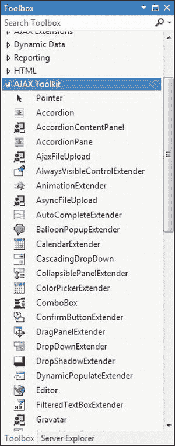

[图 25-7](#_Fig00257) 。将 ASP.NET AJAX 控件工具箱添加到工具箱中

现在你可以在任何网站的任何网页上使用 ASP.NET AJAX 控件工具箱中的组件。首先将 ScriptManager 控件添加到网页中。然后转到您创建的新工具箱选项卡，将您想要的 ASP.NET AJAX 控件拖到页面上。首次从 ASP.NET AJAX 控件工具包添加组件时，Visual Studio 会将 AjaxControlToolkit.dll 程序集与本地化程序集一起复制到 web 应用的 Bin 文件夹中。它还将添加一个 Register 指令，将 AjaxControlToolkit.dll 中的控件映射到名称空间前缀 *asp* ，以便它们在您的代码中可用:

```cs
<%@ Register Assembly = "AjaxControlToolkit" Namespace = "AjaxControlToolkit"
 TagPrefix = "asp" %>
```

ASP.NET AJAX 控件工具包充满了有用的组件。在接下来的几节中，您将通过考虑您将找到的两个控件 Accordion 和 AutoCompleteExtender 来尝试一下。

使用手风琴

Accordion 是一个将多个面板堆叠在一起的容器，允许您一次查看一个面板。每个面板都有一个标题(通常显示部分标题)和一些内容。当您单击其中一个面板的标题时，该面板将被展开，其他面板将被折叠，只留下它们的标题可见。[图 25-8](#Fig00258) 展示了你点击不同标题时看到的效果。

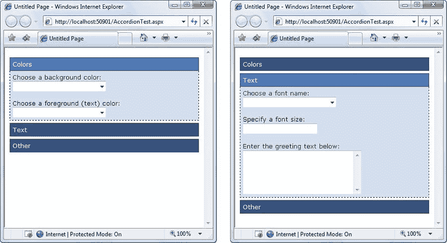

[图 25-8](#_Fig00258) 。在手风琴中选择面板

不言而喻，折叠行为在没有整页回发的情况下发生。事实上，根本不需要联系 web 服务器。第一次生成页面时，所有面板都呈现为 HTML，但它们通过使用 CSS 样式属性隐藏起来。当您单击标题时，会运行一个 JavaScript 例程来更改这些样式属性。(事实上，手风琴的控制要比这复杂一些。当你选择一个新的面板时，它会逐渐展开，这比一步到位更令人印象深刻。此外，当您从一个面板切换到另一个面板时，如果希望面板淡入淡出，可以将 FadeTransitions 属性设置为 true。)

使用手风琴控件有点像使用你在第 10 章中学习的[多视图控件。Accordion 控件包含一组 AccordionPane 控件。每个 AccordionPane 代表 Accordion 中的一个单独的面板。](10.html)

下面的示例通过将两个 AccordionPane 对象放入 Accordion 来说明这种结构:

```cs
<asp:Accordion ID = "Accordion1" runat = "server">
 <Panes>
 <asp:AccordionPane runat = "server">
 ...
 </asp:AccordionPane>
 <asp:AccordionPane runat = "server">
 ...
 </asp:AccordionPane>
 </Panes>
</asp:Accordion>
```

 **提示**要确定哪个 AccordionPane 当前可见(或设置它)，您需要使用 Accordion。SelectedIndex 属性。如果 RequiredOpenedPane 为 true，则至少会有一个展开的面板。如果为 false，则可以折叠所有面板—只需单击当前展开部分的标题(或者在代码中将 SelectedIndex 属性设置为–1)。

每个折叠窗格由两部分组成。标题部分用于面板的可点击标题，而内容包含了详细信息。下面是创建图 25-8 所示的例子所需的标记:

```cs
<asp:Accordion ID = "Accordion1" runat = "server"
 HeaderCssClass = "accordionHeader"
 HeaderSelectedCssClass = "accordionHeaderSelected"
 ContentCssClass = "accordionContent">
 <Panes>
 <asp:AccordionPane ID = "paneColors" runat = "server">
    <Header > Colors</Header>
    <Content>
    Choose a background color:<br />
    <asp:DropDownList ID = "lstBackColor" runat = "server"
    Width = "194px" AutoPostBack = "True">
    </asp:DropDownList>
    <br /> < br />
    Choose a foreground (text) color:<br />
    <asp:DropDownList ID = "lstForeColor" runat = "server"
    Height = "22px" Width = "194px" AutoPostBack = "True" >
 </asp:DropDownList>
 </Content>
</asp:AccordionPane>
<asp:AccordionPane ID = "paneText" runat = "server">
 <Header > Text</Header>
 <Content>
    Choose a font name:<br />
    <asp:DropDownList ID = "lstFontName" runat = "server"
    Height = "22px" Width = "194px" AutoPostBack = "True">
    </asp:DropDownList>
    <br /> < br />
    Specify a font size:<br />
    <asp:TextBox ID = "txtFontSize" runat = "server"
    AutoPostBack = "True">
    </asp:TextBox>
    <br /> < br />
    Enter the greeting text below:<br />
    <asp:TextBox ID = "txtGreeting" runat = "server"
    Height = "85px" Width = "240px" TextMode = "MultiLine"
    AutoPostBack = "True">
    </asp:TextBox>
 </Content>
</asp:AccordionPane>
<asp:AccordionPane ID = "paneExtras" runat = "server">
 <Header > Other</Header>
 <Content>
    Choose a border style:<br />
    <asp:RadioButtonList ID = "lstBorder" runat = "server"
Height = "59px" Width = "177px" Font-Size = "X-Small"
    AutoPostBack = "True" RepeatColumns = "2">
    </asp:RadioButtonList>
    <br /> < br />
    <asp:CheckBox ID = "chkPicture" runat = "server"
    Text = "Add the Default Picture" AutoPostBack = "True">
    </asp:CheckBox>
 </Content>
 </asp:AccordionPane>
 </Panes>
</asp:Accordion>
```

除了内容之外，此示例还添加了三个属性:HeaderCssClass、HeaderSelectedCssClass 和 ContentCssClass。这些属性采用 CSS 样式的名称，Accordion 使用这些样式来格式化适当的区域。样式在单独的样式表中定义，如下所示:

```cs
.accordionHeader
{
 border: 1px solid #2F4F4F;
 color: white;
 background-color: #2E4d7B;
 padding: 5px;
 margin-top: 5px;
 cursor: pointer;
}
.accordionHeaderSelected
{
 border: 1px solid #2F4F4F;
 color: white;
 background-color: #5078B3;
 padding: 5px;
 margin-top: 5px;
 cursor: pointer;
}
.accordionContent
{
 background-color: #D3DEEF;
 border: 1px dashed;
 border-top: none;
 padding: 5px;
}
```

第 12 章有更多关于风格的内容。您不需要将它们与 Accordion 一起使用——毕竟，您可以设置控件的格式属性，或者将每个单独的部分包装在一个格式化的面板或< div >元素中——但是一旦您习惯了这种样式方法，它会非常方便。

您可以通过设置更多的属性来微调 Accordion 使用的显示。TransitionDuration 设置折叠和展开动画持续的毫秒数。帧秒控制过渡动画的平滑程度——较高的值产生较好的质量，但需要浏览器做更多的工作。最后，AutoSize 允许您在显示包含大量内容的面板时控制折叠面板的展开方式。使用“无”值可以让折叠面板根据需要变大(在这种情况下，折叠面板下的其他内容会被简单地删除)。使用“限制”或“填充”将折叠面板限制为您在“高度”属性中设置的任何值(不同之处在于，“限制”允许折叠面板收缩得更小，而“填充”通过将任何未使用的空间留空来保持折叠面板处于最大高度)。使用“限制”或“填充”时，如果折叠面板无法将所有内容放入可用空间，它们将使用滚动。

显然，手风琴是一种易于使用但令人印象深刻的方式来处理密集的数据显示和信息组。如果您想在单个面板上实现类似的折叠和展开效果，您可能需要尝试 ASP.NET AJAX 控件工具包中的另一个组件 CollapsiblePanelExtender。

使用 AutoCompleteExtender

Accordion 是一个全新控件的例子，内置了 ASP.NET AJAX 特性。尽管这是一种将 Ajax 技术与 web 控件模型相集成的非常合理的方法，但它并不是您将在 ASP.NET Ajax 控件工具包中看到的最常见的解决方案。事实上，该工具包只包括几个新的控件，以及一组更大的控件扩展程序。

一个*控件扩展程序*是一个. NET 组件，它向现有的 ASP.NET 控件添加功能。控件扩展程序允许你对无数不同的控件使用相同的 Ajax 效果。这在您处理多用途功能时非常有用，例如自动完成、拖放、动画、调整大小、折叠、遮罩编辑等。

ASP.NET AJAX 控件工具包中的众多控件扩展程序之一是 AutoCompleteExtender，它允许您在用户键入另一个控件(如文本框)时显示建议列表。图 25-9 显示了 AutoCompleteExtender 在一个普通的文本框控件上的工作。当用户键入时，下拉列表会提供建议。如果用户单击列表中的这些项目之一，相应的文本将被复制到文本框中。

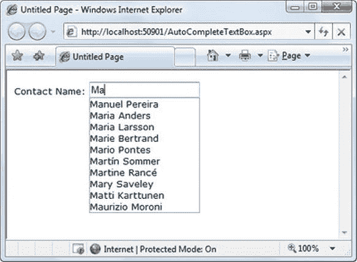

[图 25-9](#_Fig00259) 。提供自动完成的姓名列表

要创建此示例，您需要一个普通的文本框，如下所示:

```cs
Contact Name:<asp:TextBox ID = "txtName" runat = "server" > </asp:TextBox>
```

接下来，您需要添加 ScriptManager 和 AutoCompleteExtender 控件，该控件使用 autocomplete 功能扩展文本框。诀窍在于建议列表需要从名为 *web 方法*的专门代码例程中检索，您需要在页面中创建该方法。

 **注意**你可能听说过 web 方法和 web 服务，它们是可远程调用的代码例程，可以在不同的组织、编程平台和操作系统之间共享数据。您将在 ASP.NET AJAX 中使用的 web 方法没有那么雄心勃勃。虽然它使用一些相同的管道，但它有一个更简单的目标。它实际上只是文本框获取单词建议列表的一种方式，而无需经历整个页面生命周期。

下面是一个如何定义 AutoCompleteExtender 的示例。它使用 TargetControlID 属性将自己绑定到 txtName 文本框，并将 MinimumPrefixLength 属性设置为 2，这意味着在用户输入至少两个字符的文本之前，不会提供自动完成建议。最后，ServiceMethod 属性表明您要使用的 web 方法名为 GetNames()。在运行此页面之前，您需要创建该方法。

```cs
<asp:AutoCompleteExtender ID = "autoComplete1" runat = "server"
 TargetControlID = "txtName" ServiceMethod = "GetNames" MinimumPrefixLength = "2">
</asp:AutoCompleteExtender>
```

下一步是创建 GetNames() web 方法。下面是您需要添加到网页的代码隐藏类中的基本方法:

```cs
[System.Web.Services.WebMethod]
[System.Web.Script.Services.ScriptMethod]
public static List < string > GetNames(string prefixText, int count)
{ ... }
```

web 方法接受两个参数，这两个参数指示用户到目前为止已经键入的文本和期望的匹配数(默认情况下是 10)。它返回建议列表。GetNames()方法 前面的两个属性表明它是一个 web 方法(意味着应该允许客户端通过 HTTP 请求直接调用它)并且它支持 JavaScript 调用(这是 AutoCompleteExtender 所使用的)。

实际上，编写检索或生成建议列表的代码可能非常繁琐。在此示例中，代码从 Northwind 数据库中检索名称建议列表。为了确保这一步只执行一次(而不是每次用户在文本框中击键时)，使用您在第 23 章中学到的技术缓存姓名列表:

```cs
List < string > names = null;
// Check if the list is in the cache.
if (HttpContext.Current.Cache["NameList"] == null)
{
    // If not, regenerate the list. The ADO.NET code for this part
    // isn't shown (but you can see it in the downloadable examples
    // for this chapter).
    names = GetNameListFromDB();
    // Store the name list in the cache for sixty minutes.
    HttpContext.Current.Cache.Insert("NameList", names, null,
    DateTime.Now.AddMinutes(60), TimeSpan.Zero);
}
else
{
    // Get the name list out of the cache.
    names = (List < string>)HttpContext.Current.Cache["NameList"];
}
...
```

有了列表，下一步就是缩减列表，只提供十个最接近的建议。在本例中，列表已经排序。这意味着您只需找到起始位置，即以与前缀文本相同的字母开头的第一个匹配项。下面是查找第一个匹配项的代码:

```cs
...
int index = -1;
for (int i = 0; i < names.Count; i++)
{
 // Check if this is a suitable match.
 if (names[i].StartsWith(prefixText))
 {
    index = i;
    break;
 }
}
// Give up if there isn't a match.
if (index == -1) return new List < string > ();
...
```

然后，搜索代码从索引号位置开始，在列表中移动，试图获得十个匹配项。但是，如果它到达列表的末尾或找到与前缀不匹配的值，搜索就会停止。

```cs
...
List < string > wordList = new List < string > ();
for (int i = index; i < (index + count); i++)
{
    // Stop if the end of the list is reached.
    if (i > = names.Count) break;
    // Stop if the names stop matching.
    if (!names[i].StartsWith(prefixText)) break;
    wordList.Add(names[i]);
}
...

```

最后，返回找到的所有匹配项:

```cs
...
return wordList;

```

现在你已经有了创建图 25-9 所示效果所需的所有代码。

获得更多控制

Accordion 和 AutoCompleteExtender 只是触及了 ASP.NET AJAX 控件工具包的皮毛，该工具包目前包含大约 50 个组件。开始尝试其他控件最简单的方法是浏览`www.asp.net/ajaxlibrary/act_tutorials.ashx`，在那里你会找到描述每个控件的参考资料，并让你在线尝试。

表 25-1 突出显示了 ASP.NET AJAX 控件工具包中一些更有趣的控件扩展程序，[表 25-2](#Tab00252) 列出了这些控件。

[表 25-1](#_Tab00251) 。ASP.NET AJAX 控件工具包中的控件扩展程序

| 名字 | 描述 |
| --- | --- |
| AlwaysVisibleControlExtender | 即使您滚动浏览页面中的内容，此扩展程序也可以将控件固定在特定位置(如网页的左上角)。 |
| 动画集锦 | 这个功能强大且非常灵活的扩展器允许你添加动画效果，例如调整大小、移动、淡入淡出、颜色改变等等，无论是单独添加还是组合添加。 |
| 自动完成扩展程序 | 这个扩展器允许您根据部分用户输入提供建议条目的列表。条目列表由 web 服务方法生成，如前一节所述。 |
| BalloonPopupExtender | 当控件被单击、鼠标悬停或获得焦点时，扩展器显示一个浮动弹出窗口，其中包含您想要的内容。 |
| 日历控件 | 这个扩展程序显示了一个弹出日历，可以附加到一个文本框中，以便更容易地输入日期。当用户选择一个日期时，它被插入到链接的控件中。 |
| CascadingDropDown | 这个扩展器允许您链接下拉列表，而无需手动编码解决方案。 |
| 可折叠面板扩展器 | 这个扩展器允许您折叠和展开页面上的面板。其余的页面内容会自动围绕它们重排。 |
| 调色工 | 这个扩展程序显示了一个弹出式颜色选择器，它可以附加到一个文本框中，以便于颜色选择。 |
| 确认按钮扩展器 | 此扩展程序截获按钮、LinkButton 或 ImageButton 控件上的按钮单击，并显示确认消息。如果用户在确认对话框中选择取消操作，Click 事件将被抑制。 |
| DragPanelExtender | 这个扩展器允许您在页面上拖动面板。 |
| DropDownExtender | 当鼠标移动到控件上时，这个扩展器几乎可以将任何控件变成一个下拉列表。例如，可以将 DropDownExtender 与普通的 Label 控件结合使用。然后，用户可以将鼠标移到标签上，从列表中选择一个不同的项目(从而改变标签中的文本)，然后将鼠标移开(使标签恢复正常外观)。 |
| DropShadowExtender | 该扩展器在面板周围添加图形投影效果。投影可以是部分透明的，您可以控制其角的大小和圆度。 |
| 动态人口扩展器 | 这个简单的扩展程序用 web 服务方法调用的结果替换控件的内容。 |
| FilteredTextBoxExtender | 此扩展程序允许您限制在文本框中输入某些字符(如包含数字数据的文本框中的字母)。这是为了补充验证，而不是取代它，因为恶意用户可以通过篡改呈现的页面或禁用浏览器中的 JavaScript 来规避过滤。 |
| HtmlEditorExtender | 这个非常强大的扩展器可以将一个普通的文本框变成一个完整的 HTML 编辑器，并带有一个命令工具栏。用户可以在源视图和格式化预览之间切换。(这个扩展程序取代了编辑器控件，编辑器控件执行了类似的功能，并且仍然包含在工具包中。) |
| HoverMenuExtender | 当用户悬停在控件上时，此扩展程序允许内容在控件旁边弹出。 |
| 列表搜索扩展器 | 该扩展器允许用户通过键入项目文本的前几个字母来搜索 ListBox 或 DropDownList 中的项目。当用户键入时，控件搜索项目并跳转到第一个匹配项。 |
| MaskedEditExtender | 此扩展程序通过使用掩码来限制可以在文本框中输入的输入类型。(一个*掩码*是一个字符串，它定义了固定长度文本的模式，并提供提示字符来帮助用户输入值。例如，电话号码掩码可能会在文本框中显示(_ _ _)_ _ _ _ _ _-_ _ _ _ _ _。当用户键入时，占位符被有效的数字字符替换，非数字字符被拒绝。)您可以将 MaskedEditExtender 与 MaskedEditValidator 结合使用，以确保用户无法绕过 JavaScript 代码并输入无效值。 |
| 模态对话框 | 该扩展器允许您通过使页面变暗、禁用控件和在顶部显示叠加面板来创建模式对话框的假象。 |
| MultiHandleSliderExtender | 这个扩展程序将一个普通的文本框控件转换成一个滑块。然而，这个滑块的功能超出了标准的 ASP.NET 服务器端等效功能。最值得注意的是，它支持多个拇指，可以沿着滑块轨道独立拖动。当使用滑块来指示值的范围时，这很有用。 |
| mutually exclusivecheckboxextender | 这个扩展器允许您将一个“键”与多个复选框控件相关联。当用户单击以这种方式扩展的复选框时，任何其他具有相同键的复选框都将被自动取消选择。 |
| NumericUpDownExtender | 这个扩展器连接到一个文本框，以提供可配置的上下箭头按钮(在右侧)。这些按钮增加文本框中的数值或日期值。 |
| PagingBulletedListExtender | 这个扩展器附加到一个 BulletedList，并为它提供客户端分页功能，以便它可以将一个长列表分割成更小的部分。 |
| 密码强度 | 此扩展程序附加到文本框。在您键入时，它会对文本框值的加密强度进行排名(排名越高，密码越难破解)。它是用来作为密码创建框的指南。 |
| PopupControlExtender | 该扩展程序提供可以显示在任何控件旁边的弹出内容。 |
| ResizableControlExtender | 此扩展程序允许用户使用出现在右下角的可配置手柄来调整控件的大小。 |
| RoundedCornersExtender | 该扩展器使任何控件的边角变圆，以获得干净、专业的外观。 |
| SliderExtender | 该扩展器将文本框转换为图形滑块，允许用户通过将滑块拖动到轨道上的某个位置来选择数值。 |
| 幻灯片放映扩展器 | 该扩展器附加到图像上，并使其显示一系列图像。图像是使用 web 服务方法提供的，幻灯片放映可以无休止地循环播放，或者使用您创建的播放、暂停、上一个和下一个按钮。 |
| 用法 | 此扩展程序允许您在 TextBox 控件为空时自动更改背景颜色并提供特定文本。例如，您的文本框可能包括在浅蓝色背景上以浅灰色书写的文本*输入值*。当光标位于文本框中或输入值后，此文本会消失。 |
| ToggleButtonExtender | 这个扩展器把普通的 ASP.NET 复选框变成一个图像复选框。 |
| UpdatePanelAnimationExtender | 此扩展器允许您使用与 AnimationExtender 相同的动画。但是，它被设计为与 UpdatePanel 一起工作，并在更新正在进行时或面板刷新后自动执行这些动画。 |
| ValidatorCalloutExtender | 此扩展程序扩展了 ASP.NET 验证控件的客户端逻辑，以便它们使用弹出验证标注，该标注指向具有无效输入的控件。 |

[表 25-2](#_Tab00252) 。ASP.NET AJAX 控件工具箱中的控件

| 名字 | 描述 |
| --- | --- |
| 手风琴 | 该控件堆叠多个内容面板，并允许您一次查看一个面板。当您单击一个面板时，该面板被展开，其他面板被折叠(因此只有标题可见)。附加功能包括自动淡入淡出效果和限制控件大小的选项(在这种情况下，大的内容区域在可见时使用滚动)。 |
| AjaxFileUpload | 该控件类似于 FileUpload web 控件，只是它异步工作，允许用户继续与页面交互，并允许用户一次上载多个文件。在较新的浏览器上，AjaxFileUpload 控件显示每次上传的进度，并提供拖放功能。(该控件是 AsyncFileUpload 控件的更强大的替代品，该控件仍然包含在工具包中。) |
| 组合框 | 这个控件的灵感来自 Windows 组合框，它提供了一个下拉列表(像 ASP.NET 的 DropDownList 控件)*和*允许用户输入任意文本(像 ASP.NET 的文本框控件)。它采用了许多编程接口和它的 Windows 对应物的大多数惯例。 |
| 储存中 | 该控件通过免费的 Gravatar(全球唯一头像)服务显示与电子邮件帐户关联的小图片。通常，您会使用它来显示对应于特定用户的 gravatar(比如，在该用户留下的评论旁边)。要了解更多关于 gravatars 的信息，请访问`http://gravatar.com`。 |
| 无机器人 | 该控件执行几项检查，试图检测访问页面的是自动程序(机器人)还是人。如果 NoBot 确定某个 Bot 正在访问该页面，该请求将被拒绝。这种技术用于防止窃取内容或向博客帖子提交垃圾评论的程序，尽管它显然可以被绕过。例如，NoBot 强制浏览器执行使用 HTML DOM 的 JavaScript 计算并提交结果，目的是捕捉访问页面的非浏览器应用。NoBot 还可以拒绝以极快的速度回发表单的请求，或者在特定时间间隔内多次回发表单的请求。这两种行为都表明是自动化程序在工作，而不是人类。 |
| 评级 | 该控件允许用户通过将鼠标移动到一系列星星上，直到突出显示所需数量的星星，来设置评级。 |
| 重新排序列表 | 该控件创建一个可滚动的模板列表，允许用户通过拖放来重新排列项目的顺序。 |
| 海龙 | 这种先进的控制允许用户放大到一个巨大的放大图像。在幕后，这些图像由一系列小得多的图块组成，这些图块在 web 服务器上进行管理。要创建海龙图像，您需要免费的 Deep Zoom Composer 工具(通过在`www.microsoft.com/en-us/download`搜索找到最新版本)。同样值得注意的是，这些可缩放图像是 Silverlight 内置的一个被大肆宣传的功能。 |
| 属性页 | 该控件类似于 Windows 应用中显示的选项卡。每个选项卡都有一个标题，用户可以通过单击标题从一个选项卡移动到另一个选项卡。 |
| 推特 | 显示一个带有 tweets 列表的面板(来自 Twitter 服务的消息)。您可以显示特定 Twitter 用户发送的最新推文，或者与搜索表达式匹配的最新推文。 |

最后一句话

你将在 ASP.NET Ajax 中发现的 Ajax 支持惊人地强大——而且实用。正如您在本章中看到的，UpdatePanel、UpdateProgress 和 Timer 控件为您提供了一种几乎没有痛苦的方式来处理传统的大量回发的 WebForm，并为它提供一个响应更快的 Ajax 支持的用户界面，通常不需要新代码。如果您想更进一步进入 Ajax 装饰的世界，获得可折叠面板、自动完成文本框和各种动画效果，只需看看 ASP.NET Ajax 控制工具包就行了，它提供了更多的功能。

要了解更多关于 ASP.NET AJAX 的知识，请访问位于`www.asp.net/ajax`的微软 ASP.NET AJAX 网站和位于`www.asp.net/ajaxlibrary/act.ashx`的 ASP.NET AJAX 控制工具包。