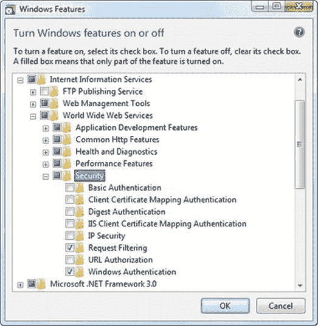
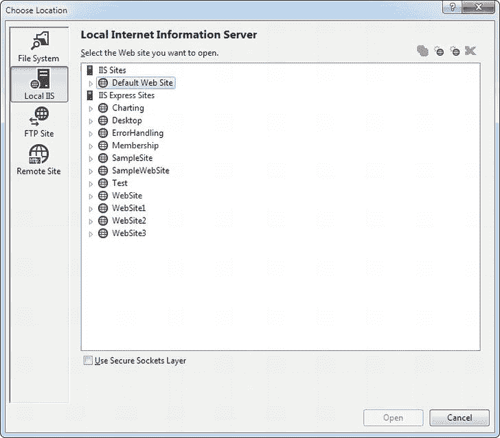
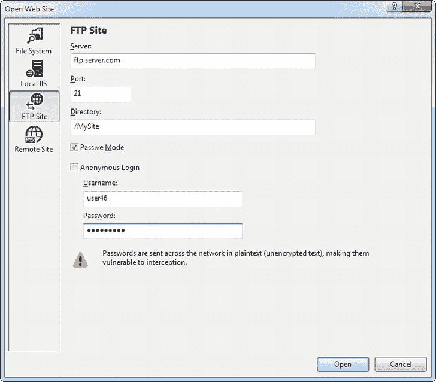

# 二十六、部署 ASP.NET 应用

那个。NET 框架使得部署任何类型的应用几乎没有痛苦，包括 ASP.NET 网站。通常，您只需要将 web 应用目录复制到 web 服务器，然后将其配置为虚拟目录。过去令人头疼的问题——注册组件和解决版本冲突——一去不复返了。这种简单性使得通过手动复制文件来部署网站变得切实可行，而不是依赖于专用的设置工具。

在本章中，您将从了解 Internet 信息服务(IIS)开始，IIS 是 Windows 操作系统中充当 web 服务器的组件。您将探索如何为您的 web 应用创建虚拟目录，使它们对网络或互联网上的其他客户机可用。最后，您将考虑 Visual Studio 中简化网站部署的工具。

ASP.NET 应用和网络服务器

ASP.NET 应用总是与 web 服务器协同工作，web 服务器是一种专门的软件，通过超文本传输协议(HTTP)接受请求并提供内容。当您在 Visual Studio 中运行 web 应用时，您使用一个名为 IIS Express 的测试 web 服务器。但是当你把你的网站部署给更广泛的受众时，你需要使用一个真正的网络服务器。您需要 IIS 的完整版本。

但是在开始使用 IIS 之前，您需要对 web 服务器的工作原理有更多的了解。

网络服务器如何工作

web 服务器最简单的工作就是提供普通的 HTML 页面。当您请求这样一个文件时，web 服务器只需从硬盘上读取它(或者从内存缓存中检索它)，然后将完整的文档发送到浏览器，由浏览器显示它。在这种情况下，web 服务器只是一个美化了的文件服务器，它等待网络请求并输出相应的文档。

当您将 web 服务器与动态内容(如 ASP.NET 页面)结合使用时，会发生更有趣的事情。网络服务器本身不知道如何处理 ASP.NET 标签或运行 C#代码。然而，它能够获得 ASP.NET 引擎的帮助来完成所有繁重的工作。[图 26-1](#Fig00261) 显示了这个过程如何适用于 ASP.NET 页面。例如，当您请求 Default.aspx 页面时，web 服务器会将请求发送到 ASP.NET 引擎(如果需要，它会自动启动)。ASP.NET 引擎加载所请求的页面，运行其中包含的代码，然后创建最终的 HTML 文档，并将其传递回 IIS。然后，IIS 将 HTML 文档发送给客户端。


[图 26-1](#_Fig00261) 。IIS 如何处理请求

此时，您可能想知道 web 服务器如何知道何时需要 ASP.NET 引擎的参与。本质上，web 服务器查看所请求页面的文件扩展名(例如。aspx)来确定内容的类型。web 服务器将该扩展名与列表进行比较，以确定哪个程序拥有该文件类型。例如，web 服务器的列表指示。aspx 扩展名属于 c:\Windows\Microsoft 这样的文件夹中的 aspnet_isapi.dll 组件。NET\Framework64\v4.0.30319 目录(假设您使用的是。64 位系统上的. NET 4.5)。

 **注:**不要被本章的版本号所迷惑。因为 ASP.NET 4.5 是一个就地更新。NET 4 引擎，有些地方还是会看到老的 4.0 版本号。但是只要你的系统。安装了. NET 4.5，就不需要担心这种特质了。您的 web 应用将自动使用最新版本的。NET 4.5 程序集。

所有的网络服务器执行相同的任务，如图 26-1 所示。但是，当您在 Visual Studio 中运行 ASP.NET 应用时，您不需要担心部署和文件类型注册。这是因为 Visual Studio 使用其内置的 web 服务器 IIS Express 自动处理这项工作。这个测试 web 服务器有一个明显的限制:它只接受来自本地计算机的请求。换句话说，其他电脑上的其他人无法访问您的网站。

要在开发环境之外运行您的 web 应用，您需要一个更强大的 web 服务器。web 服务器软件在您的计算机(或者更可能是专用服务器)上持续运行。这意味着它可以随时处理 HTTP 请求，并将您的页面提供给从同一网络或通过互联网连接的客户端。在 Microsoft Windows 操作系统上，您将使用的 web 服务器是 IIS。

在大多数情况下，您不会在托管网站的同一台计算机上进行开发。如果你这样做，你将会妨碍你的 web 服务器的性能，因为它与开发工作捆绑在一起。如果一个错误的测试应用使计算机崩溃并使网站不可用，或者如果您意外地用一个正在进行的工作覆盖了已部署的 web 应用，您也会让客户感到沮丧。通常，您会在另一台计算机上完善您的 web 应用，然后将所有文件复制到 web 服务器。

虚拟主机公司

在本章中，您将学习如何手动完成所有部署工作，包括安装 IIS 和配置您的网站。如果您负责设置 web 服务器(例如，您的公司有一个 web 服务器，或者您正在使用您的 web 应用为本地网络上的少数用户服务)，您将需要这些技能。

然而，许多开发人员并没有密切参与他们 web 应用的部署。相反，他们使用支持 ASP.NET 4.5 的网络托管公司。如果您处于这种情况，您只需使用 FTP 程序或 Visual Studio 内置的支持将您的 web 应用文件复制到 web 服务器上，这将在本章的最后部分进行探讨。在这种情况下，您可能对 IIS 的细节不感兴趣。然而，你可能还是想回顾一下，只是为了更好地理解 web 托管和 IIS 是如何工作的。

虚拟目录

当您将 web 应用部署到 web 服务器时，它通过一个叫做*虚拟目录*的东西公开。虚拟目录仅仅是你的网站目录的公众形象。

例如，您的网站可能位于服务器上名为 c:\MySite 的目录中。要允许远程用户通过他们的浏览器访问该网站，您可以将其公开为虚拟目录。虚拟目录名可能与真实目录名(在本例中是 MySite)匹配，也可能是不同的名称。当用户请求虚拟目录中的页面时(比如说，`http://WebServer/MySite/Checkout.aspx`)，web 服务器在相应的物理目录(c:\MySite\Checkout.aspx)中查找相应的文件。在下一节中，您将了解到关于这个过程的更多信息 web 服务器是如何处理 URL 请求的。

网络应用 URL

您可以在各种环境中使用 ASP.NET 应用，包括局域网(LAN)和互联网。为了理解这种区别，回顾一下 web 服务器如何与网络和 Internet 一起工作会有所帮助。

一个*网络* 被简单地定义为一组通过通信链路连接的设备。传统的 LAN 连接有限区域内的设备，例如公司或个人住宅内的设备。使用各种技术将多个局域网连接成广域网(WAN)。事实上，互联网只不过是一个连接数百万局域网的高速主干。

互联网的基石是互联网协议(IP) 。在 IP 网络上，每台计算机都有一个唯一的号码，称为 *IP 地址*T3。IP 地址通常由句点分隔的 0 到 255 的四个数字(如 192.145.0.1)或冒号分隔的六个十六进制值(如 2001:db8:85a3::8a2e:370:7334)组成。这种差异取决于您使用的 IP 标准的版本，较旧的、更常见的 IPv4 标准使用第一种方法，而较新的 IPv6 使用第二种方法。无论哪种方式，要通过网络访问另一台电脑，您都需要使用它的 IP 地址。

当然，IP 地址不容易记住，也不适合大规模的营销活动。为了让生活更容易，互联网上的网络服务器通常会注册唯一的*域名*，比如`www.microsoft.com`。这个域名通过一个特殊的目录映射到 IP 地址，这个目录由互联网上的服务器网络维护。这个网络被称为域名服务(DNS) ，是互联网基础设施的核心部分。当你在网络浏览器中输入`http://www.microsoft.com`时，浏览器会联系一个 DNS 服务器，查找映射到`www.microsoft.com`的 IP 地址，然后联系它。

那么，这一切对你网站的可访问性有什么影响呢？要通过 Internet 轻松访问，您使用的 web 服务器需要在 DNS 注册表中。要进入 DNS 注册表，你必须有一个固定的 IP 地址。商业互联网服务提供商不会给你一个固定的 IP 地址，除非你愿意支付一笔可观的费用。事实上，大多数会将你置于防火墙或某种类型的网络地址转换(NAT)之后，这将隐藏你的计算机的 IP 地址。大部分公司网络也是如此，与外界屏蔽。

ASP.NET 应用不需要通过互联网访问。许多在内部网络中是有用的。在这种情况下，你不需要担心注册域名的问题。其他电脑可以使用您机器的 IP 地址或更可能使用网络电脑名称来访问您的网站。

例如，假设您将一个应用部署到名为 MyWebApp 的虚拟目录中。在 web 服务器上，您可以这样访问它:

`http://localhost/MyWebApp`

 **提示**记住，localhost 是 URL 的一个特殊部分，叫做*环回别名*。它总是指向当前的计算机，不管它的名字是什么。从技术上讲，环回别名被映射到一个叫做*环回地址*的东西，也就是 IP 地址 127.0.0.1。别名和数字地址可以互换使用。

假设计算机名为 MyWebServer，下面是如何访问同一局域网中另一台计算机上的虚拟 web 目录:

`http://MyWebServer/MyWebApp`

 **提示**如果您不知道计算机的名称，请在桌面或 Windows 资源管理器中右键单击计算机图标，然后选择属性。这将显示一个系统信息页面，其中包括您当前的计算机名称。

现在，假设 MyWebServer 在 DNS 中注册为`www.MyDomain.com`,并暴露于互联网。然后，您可以使用以下 URL:

`http://www.MyDomain.com/MyWebApp`

最后，只要电脑在同一个网络上或者在互联网上可见，您就可以始终使用电脑的 IP 地址。假设 IP 地址是 123.5.123.4，下面是您可以使用的 URL:

`http://123.5.123.4/MyWebApp`

因为内部网络通常使用动态 IP 地址，并且 DNS 注册会发生变化，所以使用计算机名或域名访问网站几乎总是最佳方法。

如果您研究 Visual Studio 中内置的 web 服务器使用的 URL，您会注意到它们与您在网上冲浪时通常看到的略有不同。也就是说，它们包含一个端口号。这意味着不是像这样请求一个页面:

`http://localhost/MyWebApp/Default.aspx`

您可能会请求这样一个页面:

`http://localhost:2040/MyWebApp/Default.aspx`

这是因为 Visual Studio web 服务器在动态选择的端口号上监视请求。(在本例中，端口号是 2040，但是您会发现每次运行 Visual Studio 时它都会改变。)通过使用动态端口号，Visual Studio 确保其内置的 web 服务器不会侵犯计算机上的任何其他 web 服务器软件。

真实的 web 服务器几乎总是被配置为监控端口 80(和端口 443，用于加密流量)。如果您没有键入 URL 的端口号，浏览器会假定您使用端口 80 进行普通 web 访问，使用端口 443 进行安全连接。

网络农场

一些应用运行在*网络农场*上，网络农场是一组分担处理请求责任的服务器计算机。通常，网络农场是为需要能够处理重负载的高性能网络应用保留的，因为多台计算机可以处理比单个网络服务器更多的同时上网者。然而，网络农场对于许多中小型网站来说是多余的。

网络农场的工作方式看似简单。本质上，您不是将 web 应用文件放在一个 web 服务器上，而是将一个副本放在几个独立的 web 服务器上。当收到对您的网站的请求时，它会被定向到这些 web 服务器中的一个(基于哪个负载最轻)。然后，web 服务器处理该请求。显然，如果您决定更新您的应用，为了防止差异，您需要确保您用相同的版本更新 web 场中的每个 web 服务器。

虚拟主机公司使用网络农场来托管多个网站。例如，您的网站可能运行在多个 web 服务器上，但是这些 web 服务器中的每一个也可能托管多个网站。这提供了一个灵活的部署模型，让不同的 web 应用共享资源。然而，网络农场也带来了一些新的挑战。如果您要建立自己的网络场，您需要确保每台电脑都使用相同的机器密钥，如本章后面的“机器密钥”一节所述

**互联网信息服务(IIS)**

您现在可能已经猜到，部署 web 应用就是将您的 web 应用文件复制到 web 服务器的过程。通过采取这一步骤，你完成了三件事:

*   即使 Visual Studio 没有运行，您也可以确保 web 应用可用。
*   您允许其他计算机上的用户运行您的 web 应用。(Visual Studio web 服务器只处理本地请求。)
*   您的 web 应用 URL 将不再需要端口号(假设您的 web 服务器被配置为使用端口 80，这是 HTTP 流量的标准端口)。

根据您的组织，您可能负责部署 web 应用，或者由专门的 web 管理员来处理这个过程。无论哪种方式，学习部署过程都是值得的，这非常简单。

IIS 的多面性

IIS 有几种不同的版本。您使用的 IIS 版本取决于您使用的操作系统:

*   Windows Vista 和 Windows Server 2008 使用 IIS 7。
*   Windows 7 和 Windows Server 2008 R2 版使用 IIS 7.5
*   Windows 8 和 Windows Server 2012 使用 IIS 8。

 **注**好在 IIS 7、IIS 7.5、IIS 8 都很像。特别是，用于配置 IIS 网站的 IIS 管理器工具在所有版本中看起来几乎都是一样的。IIS 的更高版本确实增加了新功能和更好的性能，但是您可以使用其中的任何一个来执行本章中描述的所有任务。(这对于早期版本的 IIS 来说是不正确的——例如，您将在 Windows Server 2003 或 Windows XP 中使用的版本，但这些版本现在已经成为历史了。)

一般来说，当你想发布你的网站时，你应该使用服务器版本的 Windows 来托管它。桌面版本，如 Windows 8，很适合开发测试，但它们不适合大多数现实世界的网站，因为它们有连接限制。大多数 Windows 桌面版将 IIS 限制为 10 个并发连接，尽管有些版本将限制降低到只有 3 个并发请求(如 Windows 7 家庭高级版)，而其他一些版本(Windows 7 家庭普通版和 Windows 8 RT)根本不支持 IIS。

在开始使用 IIS 之前，您需要确保 web 服务器计算机安装了所需的 IIS 软件。以下部分提供了该过程的高级概述。它们会告诉你去哪里找到 IIS 并打开它，这取决于你使用的 Windows 版本。

在桌面版的 WindowsT3 上安装 **IIS**

启用 IIS 8(在 Windows 8 中)、IIS 7.5(在 Windows 7 中)或 IIS 7(在 Windows Vista 中)的过程基本相同。在所有这些版本的 Windows 中，都包含 IIS，但不是初始安装。要打开它，您需要遵循以下步骤:

1.  打开控制面板。在 Windows 7 或 Windows Vista 中，最简单的方法是单击开始，然后单击控制面板。在 Windows 8 中，获得完整控制面板的最佳方式是切换到桌面模式，右键单击新的开始按钮，然后从菜单中选择控制面板。
2.  单击程序。
3.  单击“打开或关闭 Windows 功能”链接。现在，您需要等待 Windows 检查您的系统。
4.  Find the Internet Information Services item near the top of the list (see [Figure 26-2](#Fig00262)), and click it (so that the square next to the item becomes filled in).

    

    [图 26-2](#_Fig00262) 。安装 IIS 7.5

5.  Windows 允许您单独启用许多其他 IIS 功能。要查看它们，请单击 Internet 信息服务项目左侧的加号框。这显示了一个可选项目树(其中一些显示在[图 26-2](#Fig00262) 中)，包括一个 FTP 服务器，额外的管理工具，与 IIS 6 的向后兼容性，性能特性，等等。
6.  Make sure you’ve selected ASP.NET, which appears under Internet Information Services  World Wide Web Services  Application Development Features ∼ ASP.NET. Most of the other optional features are outside the scope of this book (although you’ll use some of the security features later in this chapter). To learn more about these settings and IIS administration in general, consult a dedicated book about IIS.

     **注意**如果你想使用 Visual Studio 的 IIS 支持，它允许你直接从新建网站对话框创建 IIS 虚拟目录，你需要选择 IIS 6 管理兼容性项。你会发现它被列为互联网信息服务网络管理工具 IIS 6 管理兼容性∽IIS 元数据库和 IIS 6 配置兼容性下的可选项目之一。默认情况下不会选择它。(Visual Studio 的 IIS 支持将在“使用 Visual Studio 部署”一节中介绍)

7.  一旦选择了所需的 IIS 选项，请单击“确定”完成配置更改。

 **提示**作为一个快速测试来发现是否安装了 IIS，试着在当前计算机上启动一个浏览器并请求`http://localhost`。您看到的确切欢迎页面取决于 IIS 的版本，但是只要您没有收到错误，您就知道 IIS 已安装。

Windows 8 已经包含了。NET 4.5 运行时，所以一旦你安装了 IIS，你就可以开始了。

在早期版本的 Windows 上，您需要安装。净 4.5。为了获得最佳效果，你应该先安装 IIS 和*，然后*添加。净 4.5。您可以使用 Visual Studio 2012 安装它，也可以从。NET 框架开发者中心位于`http://msdn.microsoft.com/en-us/netframework`。

如果您颠倒这些步骤的顺序，换句话说，您将安装。NET，然后才决定启用 IIS——您会遇到一些配置问题。因为。NET 安装程序将没有机会调整 IIS 配置，它将无法添加。NET 应用池，您将在本章的后面了解到。解决这个问题的最快方法是使用 aspnet_regiis.exe 命令行工具，它强制。NET 来重做其 IIS 配置。

您需要使用附带的 aspnet_regiis.exe 版本。NET 4.5，它通常位于 c:\Windows\Microsoft 文件夹中。NET\Framework\v4.0.30319 .不用担心文件夹里的版本号好像表示。NET 4。因为。NET 4.5 是一个就地更新，它扩展了。NET 4 而不替换它，运行时的版本号不会改变。

如果您安装了 Visual Studio，您可以选择所有程序Microsoft Visual Studio 2012Visual Studio 工具开发人员命令提示符来打开一个命令行窗口，在其路径中包含 aspnet_regiis.exe 文件夹。然后，键入如下命令行:

aspnet_regiis -ir

您将看到一条消息，通知您命令行工具正在注册 IIS 并添加您需要的应用池。

在 Windows Server 2008 上安装 IIS

无论您使用的是 Windows Server 2008 还是 Windows Server 2008 R2，IIS 的设置和配置都是相同的。基本流程如下:

1.  启动服务器管理器。为此，单击开始按钮，选择所有程序管理工具服务器管理器。
2.  在左侧的树中选择“角色”节点。
3.  单击窗口右侧的添加角色链接。这将打开一个向导，允许您向服务器添加新角色。
4.  按照向导中的步骤操作，直到到达“选择服务器角色”步骤。检查角色列表中的 Web 服务器角色，然后单击下一步。可能会提示您安装其他必需的角色，如果是这样，就接受操作并继续。
5.  在安装了所需的任何其他角色后，系统会提示您配置 Web 服务器角色。与 Windows 的桌面版本一样，您可以选择应该启用的 IIS 7 的特定功能。
6.  最终，您将到达一个摘要页面。IIS 现在与一起安装。NET 3.5 运行时。
7.  现在您需要安装。NET 4.5 运行时。最简单的方法是使用 Web 平台安装程序，可以从。NET 框架开发者中心位于`http://msdn.microsoft.com/netframework`。

在 Windows Server 2012 上安装 IIS

Windows Server 2012 中 IIS 的安装过程与 Windows Server 2008 中的安装过程基本相同。主要的区别是用户界面有所改变，即使是经验丰富的系统管理员也会感到困惑。下面是安装的工作原理:

1.  单击开始屏幕上的服务器管理器图标，启动服务器管理器。
2.  在服务器管理器的右上角找到菜单，选择 Manage  Add Roles and Features 启动向导。
3.  选择“基于角色或基于功能的安装”选项，然后单击下一步。
4.  选择您的服务器(默认情况下，它应该已经在列表中被选中),然后单击 Next。
5.  检查角色列表中的 Web 服务器角色，然后单击下一步。您将有机会安装额外的功能(您目前不需要)和角色服务(您可能想要微调)。如果您不确定，现在保留默认设置，并继续单击 Next，直到您到达确认页面。
6.  单击“安装”以使用您的选择执行安装。
7.  完成后，您将看到最终总结。单击关闭。IIS 8 自动包含。NET 4.5，所以您不需要采取任何额外的步骤来安装运行时。

 **提示**要多一点上手，可以参考微软在`http://tinyurl.com/3y5xqyo`(针对 IIS 7 或 7.5)或`http://tinyurl.com/858mnp3`(针对 IIS 8)的走查。尽管细节是相同的，但它包括了许多显示 IIS 安装过程步骤的屏幕截图。

使用 IIS 管理器管理网站

安装 IIS 时，它会自动创建一个名为 c:\inetpub\wwwroot 的目录，该目录代表您的网站。此目录中的任何文件都将显示为位于您的 web 服务器的根目录中。

要向 web 服务器添加更多的网页，可以将 HTML、ASP 或 ASP.NET 文件直接复制到 c:\inetpub\wwwroot 目录。例如，如果您将文件 TestFile.html 添加到这个目录，您可以通过 URL `http://localhost/TestFile.html`在浏览器中请求它。您甚至可以创建子目录来对相关资源进行分组。例如，您可以使用 URL `http://localhost/MySite/MyFile.html`通过浏览器访问文件 c:\ inetpub \ wwwroot \ my site \ my file . html。

使用 wwwroot 目录很简单， 但是它会导致糟糕的组织。要正确使用 ASP 或 ASP.NET，您需要为您创建的每个 web 应用创建自己的虚拟目录。使用虚拟目录，您可以公开 web 服务器上的任何物理目录(在计算机上的任何驱动器上),就像它位于 c:\inetpub\wwwroot 目录中一样。

在开始之前，您需要启动 IIS 管理器。一个快速的方法是搜索“inetmgr”。(在 Windows 8 或 Windows Server 2012 中，你启动一个 App 搜索；在早期版本的 Windows 中，打开“开始”菜单，在搜索框中键入“IIS 管理器”。)当 intemgr 快捷方式出现时，单击它。

关于 IIS 管理器，您首先会注意到左侧的树形结构。最初，此树显示一个项目—您的计算机。下面是两个组，分别命名为应用池和站点。如果您展开“站点”组，然后展开其中的“默认网站”项目，您将看到计算机上当前配置的所有虚拟目录。每一个都代表一个独立的 web 应用。

[图 26-3](#Fig00263) 显示了 IIS 管理器窗口 T3。它分为三个部分:

*   左边是网站树。在[图 26-3](#Fig00263) 中，网站树中有两个 web 应用:EightBall 和 SampleApp。
*   中间是一组有用的图标，允许您使用树中当前选定的项目(通常是一个网站文件夹)执行各种配置任务。这些图标是功能视图的一部分。或者，您可以通过单击窗格底部的内容视图按钮切换到内容视图。在这种情况下，您将只看到所选文件夹的内容。单击功能视图切换回来。
*   右侧是操作窗格，其中包含的链接允许您快速执行一些最常见的任务(同样，基于树中当前选定的项目)。这是几个 Windows 管理工具中使用的标准设计。


[图 26-3](#_Fig00263) 。IIS 管理器

现在您已经第一次看到了 IIS 管理器，您已经准备好开始管理您的网站了。在下一节中，您将学习如何创建您的第一个虚拟目录。

创建虚拟目录

当您准备在安装了 IIS 的计算机上部署网站时，通常采取的第一步是创建存储页面的物理目录(例如，c:\MySite)。第二步是通过 IIS 将这个物理目录公开为虚拟目录。这意味着该网站对连接到您电脑的其他电脑公开可见。通常，不允许远程计算机访问您的 c:\MySite 目录。但是，如果将 c:\MySite 映射到虚拟目录，远程用户将能够通过 IIS 请求目录中的文件。

在进一步操作之前，请选择您想要作为虚拟目录公开的目录。你可以在任何驱动器上使用任何你想要的目录，你可以把它放在任何有意义的深度。您可以使用已有网站文件的目录，也可以在创建虚拟目录后拷贝这些文件。无论哪种方式，第一步都是向 IIS 注册该目录。

创建虚拟目录最简单、最灵活的方法是使用 IIS 管理器实用工具。你需要做的是:

1.  若要为现有的物理目录创建新的虚拟目录，请展开当前计算机的节点，然后展开其下的“站点”节点。
2.  右键单击默认网站项，然后选择“添加应用”。“添加应用”对话框出现，要求提供几条信息([图 26-4](#Fig00264) )。
3.  您需要提供的第一条信息是*别名*——远程客户端将使用这个名称来访问这个虚拟目录中的文件。例如，如果您的别名是 MyApp，而您的计算机是 MyServer，那么您可以使用诸如`http://MyServer/MyApp/MyPage.aspx`之类的 URL 来请求页面。
4.  接下来，您需要选择物理路径。这是您硬盘上的目录，将显示为虚拟目录。例如，c:\inetpub\wwwroot 是用于 web 服务器的根虚拟目录的物理目录。IIS 将提供对该目录中所有允许的文件类型的访问。
5.  接下来，您需要指定*应用池*。应用池是应用于一个或多个 web 应用的一组设置(如下一节所述)。尽管标准的 DefaultAppPool 选项看起来很有吸引力，但它实际上并不是您想要的，因为它依赖于 ASP.NET 2.0。为了让您的虚拟目录能够托管 ASP.NET 4.5，您需要显式地选择名为 ASP.NET 4.5 或 ASP.NET 4.0 的应用池(尽管名称不同，但它们实际上是相同的，您将在下一节中了解到)。为此，单击选择按钮，从“应用池”列表中选择它，然后单击确定。
6.  要完成此过程，请在添加虚拟目录对话框中单击确定。


[图 26-4](#_Fig00264) 。创建 web 应用

完成这些步骤后，您将看到新的虚拟目录出现在 IIS 管理器的列表中。

您可以通过选择现有虚拟目录并按下 Delete 键来删除它，或者您可以通过选择它并使用右侧功能视图中的图标来更改其设置。

一旦你创建了你的虚拟目录，启动一个浏览器以确保它能正常工作。例如，如果您已经创建了别名为 MyApp 的虚拟目录，并且它包含页面 MyPage.aspx，那么您应该能够请求`http://localhost/MyApplication/MyPage.aspx`。

虚拟目录允许访问子目录

假设您在一台名为 MyServer 的计算机上创建了一个名为 MyApp 的虚拟目录。虚拟目录对应于物理目录 c:\MyApp。如果添加子目录 c:\MyApp\MoreFiles，该目录将作为普通文件夹自动包含在 IIS 树中。客户端将能够通过指定文件夹名称来访问该文件夹中的文件，如`http://MyServer/MyApp/MoreFiles/SomeFile.html`所示。

默认情况下，子目录将继承虚拟目录的所有权限。但是，您可以使用 IIS 管理器更改这些设置。这是一种常用的技术，用于将单个应用分成不同的部分(例如，如果某些页面需要增强的安全设置)。

这也是 ASP.NET 部署中一个常见错误的来源。为了理解这个问题，假设您在名为 c:\Applications\WebApps\Site1 的文件夹中有一个网站。这是您在创建虚拟目录时应该使用的目录。但是，如果您不小心为父目录 c:\Applications\WebApps 创建了一个虚拟目录，您可能不会马上意识到这个错误。这是因为您仍然可以访问 Site1 中的文件(因为它是虚拟目录 WebApps 的子目录)。但是，当您尝试请求 Site1 中的某个网页时，您会收到一个错误页面，通知您 web.config 文件中的设置无效。问题是某些设置只在应用级别有效，而在子目录级别无效。要解决这个问题，请删除不正确的虚拟目录，并创建您真正想要的虚拟目录。

了解应用池

网站管理的一个稍微不同寻常的细节是，一些设置是在网站本身上设置的(在虚拟目录上)，而其他设置则通过一个名为*应用池* 的功能来应用。这种由两部分组成的设计允许更有效的管理，因为您不需要为每个新的 web 应用复制应用池设置(很少需要更改)。相反，你可以为你所有的网站重复使用一个应用池。如果以后修改应用池，所有链接的 web 应用都会受到影响。

在研究如何创建和更改应用池之前，您需要理解应用池的范围非常有限。大多数 web 应用配置都是通过虚拟目录执行的。web 应用池设置了一小组仅适用于 ASP.NET 应用的低级设置，例如在向新客户端发送“服务不可用”响应之前可以搁置的请求的最大数量(默认情况下为 1000)，以及在完全关闭之前允许网站灾难性崩溃的次数(默认情况下为 5)。虽然这些设置很有趣，但是除了经验丰富的网络管理员之外，任何人都不应该接触它们。在大多数情况下，默认值是最佳选择。

但是，应用池包括两个设置 ，*非常重要，可能需要您进行定制:*

*   IIS 运行以处理您的网站中的请求的 ASP.NET 版本
*   IIS 用来运行您的网站的 Windows 帐户

要查看在您的计算机上定义的应用池，请展开 IIS 管理器树，并单击嵌套在您的计算机名称下、站点组之前的应用池项目([图 26-5](#Fig00265) )。


[图 26-5](#_Fig00265) 。标准应用池

旧版本号和应用池名称

应用池的命名 可能有点误导。IIS 对不同版本的. NET 使用不同的应用池。NET，您可能看不到预期的版本号。

在新的 Wnidows 8 或 Windows Server 2012 安装中，您会看到应用池被命名为 ASP.NET 4.5 版和 ASP.NET 4.5 版经典版。然而，在使用旧操作系统的稍微不同的设置上，您可能最终得到名为 ASP.NET 4.0 版和 ASP.NET 4.0 经典版的应用池。令人困惑的是，这两者之间没有区别。那是因为。NET 4.5 是对的就地更新。NET 4.0。安装时。NET 4.5，它从。NET 4 以及来自。NET 4.5，并且出于兼容性原因，整个官方运行时版本保持旧值。不过，IIS 说不说也没关系。NET 4 或 4.5——只要你有。NET 4.5 安装在您的计算机上，您将获得您的网站的最新版本。

顺便提一下，ASP.NET 3.5 也有同样的古怪之处，它是 ASP.NET 2 的就地更新，因此在许多地方保留了旧的运行时版本号。如果您的 web 服务器在不同的网站上运行新的 ASP.NET 4.5 应用和旧的 ASP.NET 3.5 应用，这可能对您很重要。

如果您没有看到 ASP.NET 4.0 版或 NET 版应用池，最有可能的原因是您在安装. NET 后安装了 IIS。您可以手动添加您需要的应用池(右键单击列表，选择添加应用池，给它一个名称，并确保您选择 ASP.NET 4.0 运行时版本)。或者，您可以使用 aspnet_regiis.exe 来自动添加应用池，如前面的“在 Windows 桌面版本上安装 iis”一节中所述

当您查看应用池列表时，您可以快速挑选出几个细节，例如。NET，它是以经典模式还是更现代的集成模式运行，以及当前有多少应用被分配给该池。例如，在[图 26-5](#Fig00265) 中，一个应用被分配给 ASP.NET 4.0 版池，而其他池根本没有 web 应用。

 **注意**应用池名称中的“Classic”表示应用使用一种稍微不同的与 IIS 交互的方式(与 IIS 6 和更早的版本相匹配)。通常，使用经典模式的唯一原因是，如果您在旧版本的 IIS 中创建了一个扩展 ASP.NET 请求处理系统的组件，并且您需要向后兼容以确保它在新版本中继续工作。

以下是在 IIS 管理器中查看应用池时可以执行的基本任务 的简要概述:

*更改池的基本设置*:选择池，并在右侧的操作窗格中单击基本设置。基本设置只允许你改变三个细节(见[图 26-6](#Fig00266) )。这些是的版本。NET，池是使用经典模式还是集成模式，以及当计算机启动时池是否自动启动(以防止 web 服务器收到对您的网站的第一个请求时出现不必要的延迟)。

*更改池的高级设置*:选择池，然后在右侧的操作窗格中单击高级设置。将出现“高级设置”窗口，带有选项的属性网格。在下一节中，您将使用“高级设置”窗口来更改应用池帐户。

*创建一个新池*:在操作窗格中点击 Add Application Pool。如果您想要使用新的自定义设置(如不同的 Windows 帐户)创建池，这是最佳方法。这样，您可以将应用池与标准的默认池分开。如果您希望一些应用使用您的池，而其他应用使用标准池之一，这也是有意义的。

*查看池中有哪些应用*:选择池，然后在操作窗格中单击查看应用。这样，如果您决定调整应用池设置，您将知道哪些网站会受到影响。


[图 26-6](#_Fig00266) 。基本应用池设置

ASP.NET 账户

ASP.NET 部署的一些最微妙的问题涉及安全。当 web 服务器运行您的 web 应用时，它会在一个特定的 Windows 用户帐户下执行所有的工作，该帐户拥有一组非常有限的特权。实际使用的帐户取决于您使用的 web 服务器:

*   如果您使用的是 Visual Studio 中的集成测试服务器，该服务器将在您的帐户下运行。这意味着它拥有您的所有权限，因此，在测试您的应用时，您通常不会遇到权限问题。这很容易引起误解，因为您可能没有意识到，一旦部署了应用，就有潜在的权限问题等着您。
*   如果你使用的是 IIS 7，那就是*网络服务*账户。这是 Windows 在您第一次安装时创建的特殊帐户。它不允许做太多，但它可以访问网络位置。
*   如果您使用的是 IIS 7.5 或 IIS 8，它是一个基于应用池的帐户。例如，名为 ASP.NET 4.5 版的应用池将使用名为 *IIS AppPool\ASP 的帐户。NET v4.5* ，IIS 自动生成。

 **注意**网络服务和应用池标识符具有相同的特权和限制。但是，通过添加应用池标识功能，IIS 7.5 使设置承载多个 web 应用的 web 服务器变得更加容易。如果所有这些 web 应用都使用网络服务，它们将获得完全相同的权限，这意味着给予一个应用的附加权限将对所有其他 web 应用可用，即使它可能不适合它们。虽然可以通过显式创建使用不同帐户的单独应用域来避免此问题，但应用池标识功能会自动完成这项工作。

新 ASP.NET 程序员经常问，为什么 ASP.NET 代码不能在另一个账户下运行——比如说，从浏览器发出请求的用户的账户。然而，如果你考虑这种情况，你会很快意识到问题。几乎可以肯定，最终用户没有在 web 服务器上定义 Windows 帐户。即使用户拥有相应的用户帐户，该帐户也不应该拥有与 ASP.NET 引擎相同的权限。

诀窍是使用一个足够有限的帐户，它不会被攻击者滥用，但仍然具有运行您的代码所需的权限。应用池帐户和网络帐户都实现了这个目标，因为它们有一组严格限制的特权。

默认情况下，不允许 ASPNET 帐户执行诸如读取 Windows 注册表、从数据库中检索信息或写入本地硬盘上的大多数位置等任务。另一方面，它将拥有正常运行所必需的权限。例如，ASPNET 帐户*被允许访问 c:\Windows\Microsoft。临时 ASP.NET 文件目录，这样它就可以编译和缓存网页。*

ASPNET 和 network service 帐户的有限安全设置旨在防止对 web 服务器的攻击。在大多数情况下，目标是防止任何攻击，这些攻击可能利用应用中的缺陷，欺骗应用执行技术上允许执行的操作(例如删除文件)，但不应该执行这些操作。尽管这是一个有价值的目标，但您可能会发现，除了授予 ASPNET 和 network service 帐户的权限之外，您的应用还需要一些额外的权限。例如，您可能需要访问特定的文件或数据库。为了实现这一点，您可以像授予任何其他 Windows 用户帐户一样，授予这些帐户额外的权限。然而，这个过程并不总是显而易见的，所以在采取这些步骤之前，您可能需要查阅一本关于 Windows 系统管理的好手册。

或者，您可能希望将用于运行工作进程的帐户更改为具有所需权限的不同帐户。以下部分解释了如何操作。

 **注意**在更改用于运行 ASP.NET 代码的账户之前，请确保您完全了解其影响。如果您使用的帐户权限超出了您的需要，那么您就为各种潜在的黑客和攻击敞开了大门。最好是使用一个专用的帐户来运行 ASP.NET 代码，并把它能做的事情限制到最低限度。

**更改 ASP.NET 账户**

Windows 帐户是与应用池关联的高级设置之一。要更改它，请选择适当的应用池，然后单击右侧操作窗格中的高级设置。您需要更改的设置是身份([图 26-7](#Fig00267) )。


[图 26-7](#_Fig00267) 。高级应用池设置

若要更改标识设置，请选择它，然后单击属性框右侧的省略号(…)按钮。将出现应用池身份窗口([图 26-8](#Fig00268) )。它给你两个选择:

*使用内置帐户*:从“内置帐户”列表中选择一个预定义的帐户类型，包括 ApplicationPoolIdentity(在 IIS 7.5 或 IIS 8 中)、network service(在 IIS 7 中默认使用的低权限帐户)、Local Service(类似于 Network Service，但不能访问网络位置)或 Local System(作为具有广泛权限的管理员运行)。

*使用自定义帐户*:选取“自定义帐户”，点按“设定”，然后提供特定帐户的用户名和密码。如果你采用这种方法，你输入的信息在网络服务器上是加密的，所以它不会被狡猾的黑客挖出来。


[图 26-8](#_Fig00268) 。更改应用池帐户

当您以这种方式进行更改时，会影响所有使用应用池的 web 应用。另一个选项是首先创建一个新的应用池，使用操作窗格中的添加应用池命令。然后，您可以将该应用池配置为使用特定的用户帐户。

**赋予 ASP.NET 帐户更多权限**

改变 ASP.NET 使用的账户是一个冒险的步骤。如果你不小心，你最终会使用一个拥有过多权限的帐户。然后，恶意用户就可以更容易地进行攻击，破坏您的 web 服务器或其数据。

例如，假设您创建了一个允许用户上传文件的网页。如果您没有仔细设计这个页面，用户可能会欺骗您的应用将文件上传到一个不应该上传的位置，比如 c:\Windows 目录。如果您的 web 应用以提升的权限运行，它可能被允许覆盖此目录中的 Windows 系统文件，这使得攻击者能够利用此漏洞造成更大的损害。

出于这个原因，安全专家建议为您的 web 应用提供最小的权限集，但仍允许它们正常运行。实现这种设计的最简单的方法之一是从一个严格受限的帐户(例如网络服务帐户或应用池标识)开始，然后逐渐给予它所需的额外权限(仅此而已)。这种方法没有什么神奇之处，但是您可能需要有经验的 Windows 管理员的帮助，来弄清楚如何为各种 Windows 资源设置权限。

 **提示**通常最好将权限分配给一个组，而不是一个特定的用户。这使得一些管理任务变得更加容易，并且使您的整个设置更加灵活。无论您使用的是什么版本的 IIS，都可以使用 IIS_IUSRS 组。在 IIS 7 中，网络服务是该组的成员。在 IIS 7.5 和 IIS 8 中，所有应用池标识都是该组的成员。

配置网站

应用池允许您修改少量的低级设置。但是绝大多数可调整的选项都是直接在你的网站上设置的。要查看这些，在 IIS 管理器树中选择 web 应用，并查看出现在右侧功能视图中的图标阵列([图 26-9](#Fig00269) )。


[图 26-9](#_Fig00269) 。网站配置图标

网站配置设置分为三大组，按字母顺序排列:split、IIS 和管理。

**ASP.NET 配置图标**

ASP.NET 集团包括 ASP。特定于网络的设置。从技术上讲，这些设置只是 web.config 文件中各个部分的漂亮图形包装。换句话说，您使用 IIS 提供的方便的图形界面，IIS 更新 web.config 文件中相应的配置元素。这类似于网站管理工具允许您在开发 web 应用时修改 web.config 文件的方式。这也意味着您已经熟悉了大多数配置选项，因为您已经在本书中了解了它们(以及相关的 web.config 元素)。

以下是 ASP.NET 小组的亮点:

*   *。NET 授权*:使用这个来添加你在[第 19 章](19.html)中学到的 web.config 授权规则。每个授权规则告诉 ASP.NET 允许或拒绝特定用户或用户角色访问网站。
*   *。NET 编译*:这允许你设置各种底层设置，控制 ASP.NET 在执行之前如何编译网页代码。大多数用户会避开这个图标。
*   *。NET Error Pages* :该设置允许您指定在出现问题时显示的自定义错误页面(例如，当用户请求一个不存在的页面时，或者当服务器太忙而无法处理请求时)。但是，IIS 组中的错误页面图标会覆盖这些设置。
*   *。NET Globalization* :这允许你配置 ASP.NET 如何决定它传递给你的代码的文化信息。(例如，您可以将其配置为从请求浏览器获取区域性信息。)这些设置只有在使用此区域性信息时才有效，例如，改变网页中文本的语言。
*   *。NET Profile* :该功能用于添加或修改 web.config 文件的< profile >部分。元素定义了你希望 ASP.NET 自动存储在数据库中的用户特定数据(如[第 21 章](21.html)所述)。
*   *。NET 信任级别*:这允许你将你的网站锁定在一个较低的信任级别，这样代码就不会被允许执行某些操作，不管你授予 ASP.NET 帐户什么权限。一般来说，这是一个只有虚拟主机公司使用的高级选项。
*   *应用设置*:用于添加或修改自定义信息，这些信息将作为应用设置保存在 web.config 文件中(如[第五章](05.html)所述)。
*   *连接字符串*:用于添加或修改存储在 web.config 文件中的连接字符串。然后你的代码可以使用这些连接字符串中的一个连接到数据库(如[第 14 章](14.html)所述)。
*   *机器密钥*:这允许您设置用于加密任务的惟一 web 服务器密钥(比如签署视图状态字段和加密表单认证 cookie)。您将在本章后面的“机器密钥”一节中了解更多信息。
*   *页面和控件*:这允许您配置<页面>元素并设置各种默认值。例如，您可以设置应用范围的母版页和主题，或者关闭视图状态。通常，你不会使用这个图标。相反，如果您需要应用这些设置，您将在设计和编写 web 应用时实现它们。
*   *会话状态*:用于配置控制会话状态如何工作的< sessionState >元素。例如，您可以设置超时，打开无 cookie 会话，并选择存储会话信息的位置(在服务器内存、单独的进程或自定义数据库中)。[第八章](08.html)有更多关于这些选项的内容。
*   SMTP 电子邮件 :它告诉 IIS 如何处理您从 web 应用内部以编程方式发送的电子邮件。这些邮件可以存储在一个设定的目录中，也可以传递给专用的 SMTP 服务器。

 **注意**尽管到目前为止的讨论都假设您正在配置根网站目录，但是您也可以为单独的子文件夹配置这些设置。例如，您可以给单独的子文件夹不同的授权规则或错误页面。和往常一样，IIS 会考虑该文件夹的 web.config 文件中已经存在的任何信息(如果存在的话)。

**IIS 配置图标**

IIS 设置比 ASP.NET 设置更通用。它们适用于任何虚拟目录，包括那些包含普通 HTML 页面和没有 ASP.NET 内容的目录。但是，许多 IIS 设置对 ASP.NET 的工作方式也有重要影响，例如那些配置安全性的设置。虽然不可能在一章中涵盖所有选项，但这里有一些要点:

*   *身份验证*:如果你的网站使用 Windows 身份验证([第 19 章](19.html))，这将配置 IIS 用来验证用户身份的协议。您将在本章后面的“Windows 身份验证”一节中了解到这一点。
*   *Default Document* :这设置了 IIS 默认返回的页面，如果它接收到一个没有指定页面的虚拟目录请求(例如，`http://localhost/MySite`)。您将在“默认页面”部分了解这是如何工作的。
*   *Directory Browsing*: This allows directory browsing (which is generally appropriate only for a test web server, not a live web server with your deployed application). To turn on directory browsing, double-click this icon, and then click the Enable link in the Actions pane. Now, if you request the virtual directory with no page information (for example, `http://localhost/MySite`) and there’s no default document in that directory, IIS will return an automatically generated HTML page with a directory listing. You can browse the page you want by clicking it (see [Figure 26-10](#Fig002610)). This convenience may make testing easier.

    

    [图 26-10](#_Fig002610) 。允许目录浏览的网站

*   *错误页面*:用于指定 IIS 遇到常见问题时会显示的自定义错误页面。您将在本章后面的“自定义错误页面”一节中看到它们是如何工作的。
*   *请求过滤*:指定 IIS 不提供的文件类型。例如，如果 IIS 收到对。配置，。cs，。vb，或者。mdf 文件，它会根据排除的文件扩展名列表拒绝该文件。您可以添加新的受限文件扩展名或删除不适用的文件扩展名(但是，这必须小心进行，否则您的应用可能会出现安全漏洞)。
*   *SSL 设置*:用于配置您的网站要求安全的 SSL 连接。在本章后面的“SSL 和证书的保密性”一节中，您将了解到更多关于 SSL 的知识。

 **注意**一些 IIS 功能适用于整台电脑。只有当您在 IIS 树中选择您的计算机时，这些功能的图标才会出现。一个例子是“SSL 和证书的机密性”一节中描述的服务器证书图标。

**管理配置图标**

最后，管理组包括其他工具，如配置编辑器(可以锁定 web.config 文件的某些部分)和 web 平台安装程序(可以下载和安装新的 IIS 功能)。有关更多信息，请参考有关 IIS 管理的专门书籍。

默认页面

考虑虚拟目录`http://localhost/MySite`。用户可以使用 URL(如`http://localhost/MySite/MyPage1.aspx`)请求该目录中的特定页面。但是如果用户只是在网络浏览器中输入`http://localhost/MySite`，会发生什么呢？

在这种情况下，IIS 将检查为该虚拟目录定义的默认文档列表。要查看默认文档，请选择虚拟目录，然后双击默认文档图标(在 IIS 部分)。

IIS 从上到下扫描默认文档列表，并返回第一个匹配的页面。使用图 26-11 中的列表，IIS 将首先检查 default.aspx 文件，然后检查 default.aspx、index.htm、index.html、iisstart.htm 和 default.aspx，这是大多数 ASP.NET 应用使用的主页。如果 IIS 没有找到这些页面，它将返回一个错误消息，或者，如果您启用了浏览权限(通常您不会启用)，它将提供一个文件列表。


[图 26-11](#_Fig002611) 。默认文档列表

您可以使用右侧操作窗格中的链接轻松修改默认文档列表。单击“添加”插入新的默认文档，单击“删除”删除现有文档，并使用“上移”和“下移”链接重新排列 IIS 在检查默认文档时使用的顺序。

自定义错误页面

在任何网页请求中，都可能发生许多错误。用户可能试图请求受限制的文件，该文件可能不存在，服务器可能太忙，或者页面本身可能会生成未处理的异常。通常，IIS 以两种方式之一处理这些错误。如果你在本地请求页面(从一个实际运行在网络服务器上的浏览器)，它会返回如图[图 26-12](#Fig002612) 所示的错误页面。如果你从另一台计算机发出请求，IIS 会牢记良好的安全性，并返回一个更简洁的问题描述，如图[图 26-13](#Fig002613) 所示。


[图 26-12](#_Fig002612) 。本地请求的错误


[图 26-13](#_Fig002613) 。远程请求的错误

自定义错误页面允许您用更好的页面替换标准的服务器生成的页面。例如，您可以显示一条带有歉意的、用户友好的错误消息，描述问题，提供一个与管理员联系的电子邮件链接，或者只是看起来不像标准错误消息那样简洁。

要配置自定义错误页，请选择虚拟目录，然后双击错误页图标(在 IIS 部分)。你会看到一个映射到特定 HTML 错误页面的 HTTP 错误列表(如图[图 26-14](#Fig002614) 所示)。您可以添加或删除项目，或者双击错误以选择不同的 HTML 文件。还可以单击操作窗格中的编辑要素设置链接来设置默认错误页面(在没有其他列表条目适用时使用)。


[图 26-14](#_Fig002614) 。IIS 自定义错误

默认情况下，IIS 为本地请求持续显示丰富的错误页面(如图 26-12 中的[所示)。但是如果您想测试丰富的错误页面，您可以关闭这个特性。只需点击编辑特性设置链接，并选择“自定义错误页面”选项，而不是“本地请求的详细错误和远程请求的自定义错误页面”](#Fig002612)

机器键

正如您在本章前面所学的，一些组织使用多组 web 服务器协同工作来托管 web 应用。这种被称为*网络农场*的安排有一些副作用。

例如，如果您决定在 web 场中使用会话状态，您必须使用 StateServer 或 SQLServer 模式，如第 9 章中所述。否则，用户的会话信息可能会被困在一台服务器上。如果后续请求被定向到另一个服务器，信息将会丢失，并且会创建一个新的会话。另一个难题出现在视图状态(在[第 9 章](09.html)中讨论)和表单认证([第 18 章](18.html))中。这两种情况下的问题是相同的:ASP.NET 对一些信息进行编码以防止篡改，并在以后验证这些信息。例如，对于视图状态，ASP.NET 添加了一个哈希代码，它会在下次页面回发时进行双重检查，以确保用户没有更改隐藏的视图状态字段(在这种情况下，请求会被拒绝)。web 场可能出现的问题是，一个 web 服务器创建的哈希代码可能与使用不同密钥的另一个 web 服务器所期望的哈希代码不匹配。因此，如果页面回发到 web 场，并且涉及到不同的 web 服务器，则可能会发生错误。

要解决此问题，必须将 web 场中的每台 web 服务器配置为使用相同的密钥。有了虚拟主机提供商，这个细节应该已经配置好了。如果你有自己的网络场，那就不会了——默认是每台服务器创建自己的随机密钥。所以，很明显，这些钥匙不会匹配。

若要将 web 服务器配置为使用相同的密钥，请选择网站，然后双击“机器密钥”图标(在“ASP.NET”部分)。然后，清除所有四个复选框(它们告诉 IIS 自动生成特定于应用的密钥)。最后，在提供的两个文本框中输入验证密钥和解密密钥([图 26-15](#Fig002615) )，然后单击操作窗格中的应用链接。


[图 26-15](#_Fig002615) 。输入固定键

只要将 web 场中的所有服务器设置为使用相同的密钥，它们就可以共享视图状态并使用其他功能，如表单身份验证。当然，您不能自己创建密钥字符串并让它足够随机。(对于人眼来说，验证密钥和解密密钥看起来就像一长串无意义的字符。)相反，在第一个 web 服务器上，您可以通过单击右侧操作窗格中的生成密钥链接，要求 IIS 生成两个足够随机的密钥。

Windows 认证

在[第 19 章](19.html)中，您学习了两种不同的方法来限制未知用户访问您选择的网站。首选是用 ASP。NET 内置的表单安全系统，它使用登录页面对新用户进行身份验证(通常是通过将用户名和密码与数据库记录进行比较)，并使用身份验证 cookie 来跟踪每个登录的用户。第二种选择是使用 Windows 身份验证来强制每个人提供在 web 服务器(或网络上的另一台服务器)上定义的有效 Windows 帐户的凭据。这种技术更专业，但不太常见，但有时会在小公司内部使用，尤其是在创建拥有少量已知用户的内部 web 应用时。

测试一个使用 Windows 身份验证的网站非常容易，因为 Visual Studio web 服务器会自动在当前 Windows 帐户下登录当前用户。但是在真正的 web 服务器上，您需要配置 IIS，然后它才能执行相同的任务。这是因为当使用 Windows 身份验证对用户进行身份验证时，IIS 支持几种不同的协议。根据您的网络和您想要的安全级别，您需要选择正确的网络。表 26-1 描述了你的选项。

[表 26-1](#_Tab00261) Windows 认证方法

| 方法 | 描述 |
| --- | --- |
| 匿名的 | 从技术上讲，匿名身份验证不是真正的身份验证方法，因为不要求客户端提交任何信息。取而代之的是，用户可以通过一个特殊的用户账户 IUSR 免费访问该网站。匿名身份验证是默认设置。 |
| 基础 | 基本认证是 HTTP 标准的一部分，所有浏览器和 web 服务器都支持它。使用基本身份验证时，浏览器会向用户显示一个登录框，其中包含用户名和密码字段。这些信息随后被传输到 IIS，在 IIS 中与一个 Windows 用户帐户进行匹配。基本身份验证的缺点是密码以明文形式传输，并且在互联网上可见(除非您将它与 SSL 技术相结合)。 |
| 摘要 | 摘要式身份验证弥补了基本身份验证的主要缺点:以纯文本形式发送密码。摘要认证通过网络发送一个*摘要*(也称为*散列*)而不是密码。主要缺点是摘要式身份验证需要使用 Active Directory 或有权访问 Active Directory 服务器。 |
| 完整的 | 集成的 Windows 身份验证(通常简称为 *Windows 身份验证*)是大多数内部网场景的最佳选择。使用集成身份验证时，Internet Explorer 可以使用客户端上当前登录的 Windows 帐户自动发送所需的信息，前提是该帐户位于受信任的域中。大多数其他浏览器支持集成的 Windows 身份验证，但会提示用户提供登录凭据。集成认证不能跨代理服务器工作。 |

IIS 文档中有更多关于这些不同认证方法的信息。然而，选择一个适合您的网络环境可能需要与您友好的邻居网络管理员进行长时间的讨论。

在使用任何类型的 Windows 身份验证之前，您需要安装适当的 IIS 支持。(默认情况下，这是一个不包含在内的可选功能。)若要添加支持，请打开控制面板，选择“程序和功能”，然后单击链接“打开或关闭 Windows 功能”前往互联网信息服务万维网服务安全组，如图[图 26-16](#Fig002616) 所示。您会发现名为基本身份验证、摘要式身份验证和 Windows 身份验证的设置。



[图 26-16](#_Fig002616) 。安装对身份验证方法的支持

 **注意**并非所有操作系统都包含 Windows 身份验证的所有选项。如果您使用的是 Windows Server 2008 或 Windows Server 2012，您将拥有所需的一切。但是，如果您使用的是 Windows 的桌面版本，您可能不支持两种最有用的身份验证方法:摘要式身份验证和集成 Windows 身份验证。(这完全取决于您使用的 Windows 的确切版本。)

一旦安装了所需的身份验证功能，您只需在 IIS 管理器中选择您的网站，然后双击身份验证图标(在 IIS 组中)。现在，您将看到您已经安装的任何身份验证选项。[图 26-17](#Fig002617) 显示了一个支持集成 Windows 认证的 web 服务器的例子。


[图 26-17](#_Fig002617) 。配置 Windows 身份验证

您可以启用多种身份验证方法。在这种情况下，只要匿名访问是*而不是*启用的，客户端将使用它支持的最强认证方法。如果启用了匿名访问，客户端将自动匿名访问网站，除非 web 应用在 web.config 文件中使用此规则明确拒绝匿名用户:

`<deny users =` `"?" />`

SSL 和证书的保密性

证书允许您证明您的站点和组织信息已在证书颁发机构注册和验证。这通常会增强客户的信心，尽管这并不能保证公司或组织的行为是负责任的或公平的。证书有点像驾照——它不能证明你能开车，但它表明第三方(在这种情况下，是政府的一个部门)愿意证明你的身份和资格。您的 web 服务器也需要证书才能使用 SSL，SSL 会自动加密客户端和服务器之间发送的所有信息。

要将证书添加到您的站点，您首先需要从证书颁发机构购买一个证书。以下是一些著名的证书颁发机构:

*   威瑞信(`http://www.verisign.com`)
*   GeoTrust ( `http://www.geotrust.com`)
*   全局设计(123 t0)
*   Thawte ( `http://www.thawte.com`

**创建证书请求**

获取证书过程的第一步是通过电子邮件向您的 web 服务器发送证书申请。IIS 管理器允许您自动创建证书签名请求(CSR)。为此，请在 IIS 管理器树中选择您的计算机，然后双击服务器证书图标。然后，单击操作窗格中的创建证书请求，启动请求证书向导(如图[图 26-18](#Fig002618) 所示)。


[图 26-18](#_Fig002618) 。请求证书

请求证书向导收集一些基本信息，如您的地址、您想要的加密密钥的强度(位长越高，密钥越强)等等。在流程的最后，您将创建一个密钥请求。您可以将生成的文件保存为文本文件，但最终必须通过电子邮件将其发送给证书颁发机构。证书颁发机构将返回一个证书，您可以通过单击“操作”窗格中的“完成证书申请”来安装该证书。

 **提示**如果您不想麻烦地购买证书，您可以创建一个测试证书来与您的应用一起使用。然而，测试证书不适合真实的网站，因为它们会导致大量的浏览器安全警告(这肯定会吓跑你的用户)。要创建自己的测试证书，请查看`http://tinyurl.com/2hndyq`中的说明。

**实施 SSL**

SSL 技术对客户端和网站之间的通信进行加密。虽然它会降低性能，但当需要在经过身份验证的用户和 web 应用之间传输私人或敏感信息时，通常会使用它。如果没有 SSL，任何通过互联网发送的信息，包括密码、信用卡号和员工名单，都很容易被拥有合适网络设备的窃听者看到。

即使有了最好的加密技术，你还有另一个问题要解决:客户端如何确定 web 服务器就是它所声称的那个人呢？例如，考虑一个聪明的攻击者，他使用某种 IP 欺骗伪装成 Amazon.com。即使您使用 SSL 传输您的信用卡信息，另一端的恶意 web 服务器仍然能够无缝地解密您的所有信息。为了防止这种欺骗，SSL 使用证书。证书确定身份，SSL 保护通信。如果恶意用户滥用证书，证书颁发机构可以撤销它。

要使用 SSL，您需要安装有效的证书。然后，您可以设置 IIS 目录设置，指定各个文件夹需要 SSL 连接。为此，请在 IIS 管理器中选择该网站，双击 SSL 设置图标(在 IIS 组中)，然后选中要求 SSL 复选框。

要通过 SSL 访问页面，客户端只需在请求的开头键入 URL，并在前面加上 https，而不是 T2 http。在您的 ASP.NET 代码中，您可以使用如下代码检查用户是否通过安全连接进行连接:

```cs
protected void Page_Load(object sender, EventArgs e)
{
    if (Request.IsSecureConnection)
    {
        lblStatus.Text = "This page is running under SSL.";
    }
    else
    {
        lblStatus.Text = "This page isn't secure. < br />";
        lblStatus.Text + = "Please request it with the ";
        lblStatus.Text + = "prefix https:// instead of http://";
    }
}
```

SSL 是如何工作的？

使用 SSL，客户端和 web 服务器在交流任何信息之前会启动一个安全会话。这个安全会话使用随机生成的加密密钥。

这个过程是这样的:

1.  客户端请求 SSL 连接。
2.  服务器签署其数字证书并将其发送给客户端。
3.  客户端验证证书是由它信任的证书颁发机构颁发的，与它要与之通信的 web 服务器匹配，并查看它是否过期或被吊销。如果证书有效，客户端将继续下一步。
4.  客户端告诉服务器它支持的加密密钥大小。
5.  服务器选择客户端和服务器都支持的最强密钥长度。然后它通知客户这是什么尺寸。
6.  客户端生成一个会话密钥(随机的字节串)。它使用服务器的公钥(通过服务器的数字证书提供)加密该会话密钥。然后，它将这个加密的包发送到服务器。
7.  服务器使用其私钥解密会话密钥。客户端和服务器现在拥有相同的随机会话密钥，可以在会话期间使用该密钥加密通信。

**部署简单站点**

现在，您已经了解了足够的知识来部署一个普通的 ASP.NET 网站。你需要做的就是遵循这两个简单的步骤:

1.  在 web 服务器上创建虚拟目录。
2.  将整个站点(包括子目录)复制到虚拟目录。

如何传输这些文件取决于您使用的互联网托管服务。通常，你需要使用 FTP 程序将文件上传到指定的区域。但是，如果您的计算机和 web 服务器都在同一个内部网络上，您可能只需要使用 Windows 资源管理器或命令提示符来复制文件。

如果你使用的是商业网站主机，虚拟目录已经为你创建好了，你只需要传输文件。

在传输应用文件之前，您应该确保在部署的版本中没有启用调试模式。为此，在编译标记中找到 debug 属性(如果存在)，并将其设置为 false，如下所示:

```cs
<configuration>
 <system.web>
    <compilationdebug = "false"targetFramework = "4.5">
     </compilation>
     <!-- Other settings omitted. -->
 </system.web>
<configuration>
```

启用调试时，编译后的 ASP.NET 网页代码会更大，执行速度会更慢。因此，您应该只在测试 web 应用时使用调试。

网络应用和组件

部署使用其他组件的 web 应用同样简单。这是因为当您在 Visual Studio 中添加引用时，您的网站使用的任何自定义组件都会被复制到 Bin 子目录中。注册程序集或将程序集复制到特定的系统目录不需要额外的步骤。

 **注意**对于需要在同一台计算机上托管数十、数百或数千个 web 应用的 web 托管公司来说，私有程序集是一个相当大的福利。他们的 web 服务器不能仅仅因为一个网站需要就将有风险的组件安装到系统目录中，尤其是当一个网站需要的版本可能与同一台计算机上另一个网站需要的版本冲突时。

当然，如果您使用的是*共享程序集*，这个原则就不成立，共享程序集存储在一个特殊的系统位置，称为全局程序集缓存(GAC)。通常，您不会将组件存储在这个位置，因为这样会使开发变得复杂，并且没有什么好处。核心。NET 程序集位于 GAC 中，因为它们很大，可能会在几乎所有的环境中使用。NET 应用。强迫您部署没有意义。NET 程序集与您创建的每个网站一起使用。然而，这意味着由 web 服务器的管理员来安装。您需要的. NET 框架。这个细节不在你网站的控制范围内。

其他配置步骤

到目前为止，您看到的简单部署模型通常被称为*零接触部署* ，因为您不需要手动配置 web 服务器资源。(它有时也被称为 *XCopy 部署* ，因为转移网站就像复制目录一样简单。)然而，有些应用更难在 web 服务器上安装。以下是一些需要额外配置步骤的常见因素:

*   *数据库* :如果你的 web 应用使用数据库，你需要在 web 服务器上创建数据库。您可以通过生成一个 SQL 脚本来实现这一点，该脚本将自动创建数据库并加载数据。
*   *Windows 账号权限* :通常，web 服务器会在一个受限的账号下运行网页代码。可能不允许此帐户执行您依赖的任务，如写入文件或 Windows 事件日志，或连接到数据库。在这种情况下，管理员需要专门向为您的网站运行 ASP.NET 引擎的帐户授予您所需的权限。
*   *IIS 安全设置* :如果你的网站使用 SSL 加密或 Windows 认证(如[第 18 章](18.html)所述)，虚拟目录设置将需要调整。这也需要管理员的帮助。

为了以最有效的方式解决这些问题，与经验丰富的 Windows 管理员合作会有所帮助。

代码编译

默认情况下，当部署用 Visual Studio 创建的应用时，部署的是未编译的源文件。第一次请求页面时，它会被动态编译并缓存在临时目录中以供重用。这种方法的优点是很容易直接对文件进行最后的修改，而不需要经过任何编译步骤。然而，这种方法有一些明显的缺点:

*   对页面的第一次请求很慢。当一个页面被多次请求后，这个问题就消失了。
*   web 服务器包含您的所有源代码，任何有权访问该服务器的人都可以清楚地看到。即使访问者看不到你的代码，网站管理员也可以看到(他们甚至可以修改它)。

为了提高性能并防止其他人看到您的代码，您还有另一个选择—您可以使用 ASP。NET 的*预编译*特性。本质上，您使用一个名为 aspnet_compiler.exe 的命令行工具，它存储在我们熟悉的 c:\Windows\Microsoft 中。NET \ framework 64 \[版本]目录。在部署应用之前，可以在开发机器上使用这个编译器。它将整个网站编译成二进制文件。

下面是 aspnet_compiler 工具的语法:

`aspnet_compiler -m metabasePath targetDirectory`

本质上，您需要指定源(web 应用所在的位置)和目标目录(应用的编译版本应该复制到的位置)。

要指定源，可以使用-m 选项并以 W3SVC/1/ROOT/[virtual directory name]的形式指定元数据库路径。这里有一个例子:

`aspnet_compiler -m W3SVC/1/ROOT/MyApp C:\MyAppDeploy`

然后，您可以将文件从目标目录复制到您的 web 服务器(或者，如果您真的很聪明，可以使用 aspnet_compiler 将编译后的文件直接发送到目标目录，作为构建过程的一部分)。

如果使用前面显示的命令行，c:\MyAppDeploy 目录将包含所有。aspx 文件，但没有。cs 文件——意味着所有的源代码都被编译成 Bin 目录下的程序集并被隐藏。更有趣的是。aspx 文件也被删除。如果你打开一个网页，你会发现它不包含任何标签。相反，它只包含语句“这是由预编译工具生成的标记文件，不应删除！”所有的标签都被移到 Bin 目录下的编译文件中，同时还有源代码。aspnet_compiler 只保存。aspx 文件，这样你就可以记住有哪些网页。

 **注**aspnet _ compiler 编译 web 应用，为部署做准备。然而，在被转移到网络服务器后，你可以编译一个网站*。这叫做*就地编译*，它不会删除你的代码。相反，它只是创建并缓存您的 web 页面的编译版本，因此第一组请求不会有任何延迟。当您想要优化性能但不想(或不需要)隐藏代码时，就地编译非常有用。若要执行就地编译，请在使用 aspnet_compiler 时省略目标目录。*

**用 Visual Studio 部署**

Visual Studio 旨在简化 web 应用的部署，就像它简化设计富网页的任务一样。尽管为了有效地管理虚拟目录(并修复不可避免的配置问题)，您需要了解 IIS 是如何工作的，但是 Visual Studio 包括了与 IIS 集成的功能，并且允许您在不离开舒适的设计时环境的情况下创建虚拟目录。

Visual Studio 有几个与部署相关的特性:

*   创建新项目时，可以创建虚拟目录。
*   您可以使用复制网站功能将现有网站传输到虚拟目录。
*   您可以使用“发布网站”功能来编译您的网站并将其传输到其他位置。
*   如果使用 web 项目(不是无项目的网站)，可以使用 web 包功能将 IIS 设置、安全证书和 SQL 脚本与应用的实际文件捆绑到一个方便的包中。

在接下来的几节中，您将研究前三个特性。要了解关于 web 项目和 web 包特性的更多信息，请参考 C# 中的*Pro ASP.NET 4.5(a press)。*

为新项目 创建虚拟目录

在 Visual Studio 中创建网站时，可以同时为该网站创建一个虚拟目录。如果您选择这样做，Visual Studio 将不会使用内置的 IIS Express 测试服务器。相反，您的所有请求都将通过完整版本的 IIS。(令人高兴的是，您仍然会看到相同的行为，并且可以使用相同的调试工具。)

要尝试这样做，您必须首先以管理员身份启动 Visual Studio。为此，右键单击 Visual Studio 快捷方式，然后选择“以管理员身份运行”。

现在，从 Visual Studio 菜单中选择 File  New Web Site。在“新建网站”对话框中，选择 HTTP 作为位置(而不是文件系统)。然后，您可以提供一个 URL。例如，如果您提供`http://localhost/MyWebSite`，Visual Studio 将在当前计算机上创建虚拟目录 MyWebSite。虚拟目录创建在 c:\inetpub\wwwroot 目录中。[图 26-19](#Fig002619) 显示了一个例子。


[图 26-19](#_Fig002619) 。创建虚拟目录来保存新项目

 **注意**如果你指定一个已经存在的虚拟目录，Visual Studio 不会创建它——它只会使用现有的目录。这很方便，因为它允许你用你想要的选项提前设置虚拟目录，然后在里面创建网站。如果虚拟目录尚不存在，Visual Studio 将在 c:\Inetpub\wwwroot 目录中创建虚拟目录。

这种方法通常不是创建虚拟目录的最佳方式。它有几个限制:

*   它强制您在第一次创建应用时设置虚拟目录。如果您已经创建了一个应用，就不能使用这种方法来创建虚拟目录。
*   您不能配置其他设置，如默认页面、自定义错误和虚拟目录权限。
*   您所做的任何更改和执行的任何调试都是在 web 服务器上运行的应用的实时版本上进行的。如果您使用的是生产 web 服务器，这是一个不可接受的风险。如果您使用的是测试 web 服务器，您可能已经暴露了潜在的安全问题，因为远程用户可以从其他计算机请求您的应用中的页面。

由于这些原因，开发人员更常见的做法是使用 Visual Studio 中的内置 web 服务器创建他们的应用，然后在准备好将它部署到测试或生产 web 服务器时手动创建一个虚拟目录。

Visual Studio 没有提供 IIS 管理器的全部选项，但是您可以获得更多的控制。在“新建网站”对话框中，键入`http://localhost`(对于当前计算机)，然后单击“浏览”按钮。你会看到所有在 IIS 中定义的虚拟目录，就像在 IIS 管理器中一样(见[图 26-20](#Fig002620) )。您还将看到 IIS Express 的条目，IIS Express 是 Visual Studio 在您从开发环境内部运行 web 应用时使用的测试 web 服务器。这些网站只能从本地电脑访问，并且是在您开始调试网站时自动创建的。



[图 26-20](#_Fig002620) 。在 Visual Studio 中查看虚拟目录

您不能查看或更改它们的属性，但可以选择要在其中创建应用的现有虚拟目录。您也可以使用窗口右上角的“创建新的虚拟目录”按钮(它显示为带地球仪的文件夹图标)。点击此按钮，您将有机会提供虚拟目录别名*和*其物理文件路径(参见[图 26-21](#Fig002621) )。


[图 26-21](#_Fig002621) 。在特定位置创建虚拟目录

复制网站

Visual Studio 还提供了一种快速简便的方法来传输 web 应用文件，而无需使用单独的程序或离开设计环境。你只需要打开你的网络项目，从菜单中选择网站复制网站。这将打开一个新的 Visual Studio 对话框，任何使用过 Dreamweaver 或 Expression Web 等 HTML 设计程序的人都会很熟悉这个对话框(见[图 26-22](#Fig002622) )。


[图 26-22](#_Fig002622) 。复制网站

该窗口包括两个文件列表。左侧是当前项目中的文件(在本地硬盘上)。右边是目标位置(远程 web 服务器)上的文件。当你第一次打开这个窗口时，你不会在右边看到任何东西，因为你没有指定目标。您需要单击窗口顶部的连接按钮来提供此信息。

当您单击“连接”时，Visual Studio 会显示一个熟悉的对话框，它看起来几乎与您为新项目创建虚拟目录时看到的一样。使用此窗口，您可以指定以下位置类型之一:

*   *文件系统*:这是最简单的选择——你只需要浏览驱动器和目录树，或者浏览网络上其他计算机提供的共享。如果您想为您的应用创建一个新目录，只需单击目录树右上角的 Create New Folder 图标。
*   *本地 IIS* :此选项允许您通过 IIS 浏览本地计算机上可用的虚拟目录。要为您的 web 应用创建新的虚拟目录，请单击虚拟目录树右上角的“创建新的 Web 应用”图标或“创建新的虚拟目录”图标，如您之前所学。
*   *FTP Site*: This option isn’t quite as convenient as browsing for a directory—instead, you’ll need to enter all the connection information, including the FTP site, port, directory, and a user name and password before you can connect (see [Figure 26-23](#Fig002623)).

    

    [图 26-23](#_Fig002623) 。设置目标站点

*   *远程 Web 服务器*:此选项使用 HTTP 访问指定 URL 的网站。为此，web 服务器必须安装 FrontPage 扩展。连接时，系统会提示您输入用户名和密码。

选择适当的目的位置后，单击打开。Visual Studio 将尝试连接到远程站点并检索其文件列表。

复制网站功能对于更新 Web 服务器特别有用。这是因为 Visual Studio 会比较本地和远程网站上的文件列表，并标记只存在于一个位置的文件(状态为新)或较新版本的文件(状态已更改)。然后，您可以选择想要传输的文件，并点击其中一个箭头按钮，将它们从一个位置传输到另一个位置(参见[图 26-24](#Fig002624) )。


[图 26-24](#_Fig002624) 。同步远程网站

发布网站

网站复制功能对于将文件传输到测试服务器非常有用。但是，它没有给你预编译代码的选项。如果您正在将应用部署到一个活动的 web 服务器上，并且希望将源代码牢牢锁定，那么您将需要更多的东西。

如本章前面所述，您可以使用 aspnet_compiler 命令行实用工具来编译 aspnet 应用。在 Visual Studio 中，通过网站发布功能也可以使用此功能。虽然网站复制功能旨在让您更新单个文件(这在更新测试服务器时非常理想)，但发布功能旨在通过几次点击以编译的形式传输整个网站。

你需要做的是:

1.  Select Build  Publish Web Site from the menu. The Publish Web Site dialog box will appear (see [Figure 26-25](#Fig002625)).

    

    [图 26-25](#_Fig002625) 。发布网站

2.  在“目标位置”文本框中输入 FTP 站点或启用 FrontPage 的站点的文件路径或 URL。要获得帮助，请单击省略号(。。。)在目标位置文本框旁边。这将打开熟悉的对话框，其中包含选择(或创建)虚拟目录、文件路径、FTP 站点或远程服务器的选项。
3.  不要选中其他复选框。您可以选择允许更新，在这种情况下，将编译代码隐藏文件，但。不编译带有 HTML 和标签的 aspx 文件。这个选项只允许您进行有限的更改(并且它增加了意外更改或篡改的可能性)，所以它不是非常有用。
4.  单击确定。你的网站文件会用 aspnet_compiler 编译，然后传输到目标位置。

**最后一个字**

本章讲述了 IIS(支持 ASP.NET 网站的 web 服务器)和 ASP.NET 的部署模型。您了解了如何使用 IIS 管理器通过调整 ASP.NET 和 IIS 设置来配置 web 服务器。您了解了如何控制执行代码的用户帐户，如何自定义默认页面和错误页面，以及如何设置 Windows 身份验证和 SSL。最后，您考虑了 Visual Studio 为使部署更容易而包含的工具，例如其内置的复制网站和构建网站功能。