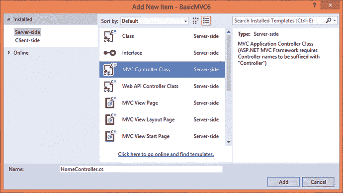

# 一、SOLID 原则和设计模式概述

Electronic supplementary material The online version of this chapter (doi:[10.​1007/​978-1-4842-1848-8_​1](http://dx.doi.org/10.1007/978-1-4842-1848-8_1)) contains supplementary material, which is available to authorized users.

现代编程语言如 C# 本质上是面向对象的。C# 语言允许你根据类和对象来思考和编程。然而，了解 C# 语言的关键字和特性只是故事的一部分。同样重要的是知道如何以最好的方式使用这些特性，从而产生质量更好的代码库，并最终帮助构建健壮、灵活、可维护和可扩展的软件。

为了构建质量更好的代码库，开发人员诉诸集体智慧。这种集体智慧经受住了时间的考验，并提供了解决软件问题的成熟方法，而不是试图发明一种新的解决方案。本章将向你介绍这种集体智慧。具体而言，它将涵盖以下内容:

*   面向对象编程的基本概念
*   什么是 SOLID 原则，以及它们如何帮助设计更好的面向对象系统
*   四人帮(g of)设计模式及其分类
*   什么是企业应用架构模式(EAA 教授)及其分类
*   模式在 JavaScript 世界中也很有用

本章将只涉及上述主题的基础知识。本书的其余部分将详细阐述它们。在这一章中，我打算让你对这本书的范围有一个清晰的了解，这样你就能对后面的章节有所了解。

## 面向对象编程概述

C# 是一种面向对象的编程语言。作为一名了解 C# 的 ASP.NET 开发人员，您可能知道它的特性和功能。因为这本书是关于面向对象设计原则和模式的，所以让我们快速复习一下面向对象编程的基础知识。本节将讨论面向对象编程的特性，如类、对象、抽象、封装、继承、接口和多态。如果您已经熟悉这些概念，请随意跳过或浏览这一部分。如果你不确定你对这些概念的理解，我建议你阅读这一部分，并确保你对这些材料感到满意。这些特性在任何面向对象的系统中都大量使用，本书的其余部分将假设您理解它们。开始吧！

### 类和对象

在 C# 和中，类和对象无处不在。NET 框架。当您创建一个控制台应用时，它的`Main()`方法包含在一个类中。当您创建一个 ASP.NET Web 窗体应用时，每个 Web 窗体只是一个类。当你创建一个 ASP.NET MVC 应用时，控制器也是一个类。

什么是课？简单地说，类是创建类型的蓝图或模板。一个类通常对一种类型的数据和行为进行分组。例如，水果、花、车辆、动物和鸟都是类。一些现实世界中的类的例子是客户、订单、雇员等等。

对象是类的一个特殊实例。例如，桔子是水果的一种。或者 ID 为 1234 的雇员是`Employee`类的一个实例。在 C# 中，您可以创建如下所示的类和对象:

```cs
public class Employee
{
    ...
}

Employee obj = new Employee();

```

您使用`class`关键字来定义一个类。虽然在前面的例子中没有显示，但是一个类通常包含属性、方法和事件。创建后，可以使用`new`关键字实例化一个类。因此，在前面的代码片段中，`Employee`是一个类，`obj`是`Employee`类的一个实例。

### 抽象

你刚刚学习了什么是类和对象。但是谁来识别类，以及如何识别？当然，作为一名开发人员，你有责任识别和创建类。当你读到你的应用应该满足的一些业务需求时，你需要研究场景并确定软件需求。一个场景可能涉及许多信息片段以及许多方式，从简单到复杂，底层业务使用这些信息。根据您对场景的理解，您需要决定哪些信息对您的应用是必不可少的，哪些是不必要的。重要的部分将被放入一个或多个类中。过滤可用信息并得到对应用至关重要的子集的过程称为抽象。

假设您正在构建一个业务联系管理应用。作为开发的一部分，您发现您的应用中需要一个`Person`类。现在，可以获得关于一个人的过多细节——名、姓、电子邮件、电话号码、公司名称、地址、照片、出生日期、直系家庭成员和亲属的数量和细节、他或她完成中学教育的年份、他或她最喜欢的颜色等等。假设您的应用应该处理业务联系，那么您需要捕获刚才提到的所有细节吗？显然不是。您的申请需要详细信息，如名字、姓氏、电子邮件、电话号码、公司名称、地址、照片和出生日期。但是其他个人信息，比如他的直系家庭成员和亲属的数量和详细信息，他或她完成中学教育的年份，以及他或她最喜欢的颜色，都与你的申请无关。因此，在创建`Person`类时，您将跳过这些不需要的信息。抽象的过程如图 [1-1](#Fig1) 所示。


图 1-1。

Process of abstraction in object-oriented programming

总结一下我们刚刚讨论的内容，抽象是一个过滤掉不需要的信息，并根据给定的需求或上下文挑选出对您的应用至关重要的信息的过程。

### 包装

抽象的过程有助于您明确应用需要哪些信息。您通常将这些部分捆绑到一个或多个类中。继续我们在上一节中讨论的例子，您将把一个业务联系人的基本信息放入一个名为`Contact`的类中。虽然您已经确定了所需的部分并将其捆绑到一个类中，但是是否应该允许应用的其他部分直接查看和操作它们呢？还是应该有某种规定的方法来处理这些数据？这些想法构成了一个叫做封装的过程。

假设您创建了一个`Contact`类，它捆绑了一个人的名字、姓氏、电子邮件、电话号码、地址、公司名称、照片和出生日期。如果您只是简单地将这些细节捆绑在一起，而没有任何指定的读写方式，那么应用中使用`Contact`类的其他部分可以自由地以任何方式访问它们。例如，应用的某个部分可能会将值 1234 分配给电子邮件地址。显然，这是不可接受的。因此，您应该设计一些机制，以便只能将有效的电子邮件地址分配给联系人。同样，您可能希望只向应用的一些特殊用户(例如，管理员或付费用户)显示联系人的照片。同样，您需要某种规定的方法来处理这种类型的访问。这就是封装发挥作用的地方。封装是一个过程，通过这个过程，您可以将数据和处理数据的操作(或函数)捆绑到一个类中，还可以建立一种指定的方法来读取、写入和处理数据。

就 C# 而言，你使用类、属性和方法来封装数据。清单 [1-1](#Par26) 展示了封装了所需数据的`Contact`类可能的样子。

```cs
public class Contact
{
    private string fname;
    private string lname;
    private string emailaddr;
    private string phoneno;
    private string addr;
    private string cname;
    private byte[] photo;
    private DateTime dob;

    public string FirstName
    {
        get { return fname; }
        set { fname = value; }
    }

    public string LastName
    {
        get { return lname; }
        set { lname = value; }
    }

    public string EmailAddress
    {
        get { return emailaddr; }
        set
        {
            if(emailaddr.Contains("@") && emailaddr.Contains("."))
            {
                emailaddr = value;
            }
            else
            {
                throw new Exception("Invalid Email address!");
            }
        }
    }

    public string PhoneNo
    {
        get { return phoneno; }
        set { phoneno = value; }
    }

    public string Address
    {
        get { return addr; }
        set { addr = value; }
    }

    public string CompanyName
    {
        get { return cname; }
        set { cname = value; }
    }

    public byte[] Photo
    {
        get { return photo; }
        set { photo = value; }
    }

    public DateTime BirthDate
    {
        get { return dob; }
        set
        {
            if ((DateTime.Today.Year - value.Year) > 18)
            {
                dob = value;
            }
            else
            {
                throw new Exception("Invalid birth date. Age must be greater than 18.");
            }
        }
    }
}

Listing 1-1.Encapsulating Contact Data into a Contact Class

```

`Contact`类将联系信息存储在私有变量中。这些变量对外部世界是隐藏的。通过这种方式，数据不能被直接从`Contact`类外部的代码篡改。对这些私有变量的访问是通过公共属性授予的。注意`EmailAddress`和`BirthDate`属性是如何对分配给各自属性的值进行验证的。它们通过抛出异常来拒绝无效值。当然，您可以编写更复杂的逻辑来验证这些值，但关键是您不仅将数据捆绑在一个类中，而且还建立了一种访问数据的规定方法。这就是封装的意义所在。图 [1-2](#Fig2) 总结了我们的讨论。


图 1-2。

Encapsulating data using class and its properties

从图 [1-2](#Fig2) 中可以看出，您在数据上设置了一个属性“栅栏”,从而对外部世界隐藏了数据并限制了数据的访问方式。根据需求，您还可以使用方法以类似的方式封装数据。

### 遗产

真实世界的应用涉及许多类。有时，这些类有一些共同之处。例如，假设我们的联系人管理器应用需要考虑不同类型的联系人，例如业务联系人(您与之交互的公司)、专业联系人(提供专业服务的医生和税务顾问等个人)、个人联系人(学校朋友、邻居、您的社交网络中的人，等等。显然你需要一个类来代表每种类型的联系，比如说`BusinessContact`、`ProfessionalContact`和`PersonalContact`。正如您可能已经预料到的，这些类有许多共同的属性。例如，他们都有名字、姓氏、地址、电子邮件和电话号码。你能做些什么来避免这种重复吗？这就是遗传的原因。继承允许您将常见的数据和操作分离到一个类中，然后基于该类创建专门的类。包含公共数据和操作的类称为基类，而专用类称为派生类。派生类和基类通过“is-a”关系相互关联。这意味着一个派生类(比如，`BusinessContact`)是一种基类(比如，`Contact`)。派生类可以添加特定于它们自己的数据和操作。他们还可以重新定义由基类定义的操作。为了更进一步，您将创建一个`Contact`基类和从`Contact`类继承的`BusinessContact`、`ProfessionalContact`和`PersonalContact`派生类。继承不仅促进代码重用，还帮助您将代码组织成层次结构。清单 [1-2](#Par27) 展示了这些类的样子。

```cs
public class Contact
{
    ...
}

public class BusinessContact:Contact
{
    ...
}

public class ProfessionalContact : Contact
{
    ...
}

public class PersonalContact : Contact
{
    ...
}

Listing 1-2.Inheriting from a Contact Base Class

```

### 抽象类和接口

在上一节中，您将继承用作重用代码的一种方式。有些时候，类可以有父子关系，但不可能有任何代码重用的可能性。假设您正在构建一个税收系统，该系统应该根据特定的逻辑来计算税收。此外，让我们假设您的应用需要支持三个国家的税收计算—比如美国、英国和印度。现在，一个国家的税收规则和逻辑通常是该国特有的，您可能无法重用这些代码。但是，所有这些都需要运算——计税。在这种情况下，尽管您不能重用任何代码，但是您可以重用“契约”在这种情况下，开发人员求助于抽象类或接口。

抽象类是不能实例化的类。它通常包含属性和方法签名，但没有实现。派生类需要通过重写这些成员来编写它们的实现。因此，有了抽象类，前面的例子可以如清单 [1-3](#Par28) 所示。

```cs
public abstract class CountryTaxCalculator
{
    public abstract decimal CalculateTaxAmount();
}

public class TaxCalculatorForUS : CountryTaxCalculator
{
    public override decimal CalculateTaxAmount()
    {
        ...
    }
}

public class TaxCalculatorForUK : CountryTaxCalculator
{
    public override decimal CalculateTaxAmount()
    {
        ...
    }
}

public class TaxCalculatorForIN : CountryTaxCalculator
{
    public override decimal CalculateTaxAmount()
    {
        ...
    }
}

Listing 1-3.Using an Abstract Class

```

C# 还允许你创建服务于类似目的的接口。与可以包含自己的代码的抽象类不同，接口只是提供一组属性和方法签名，根本没有实现代码。然后，类根据需求实现一个或多个接口。我们刚刚讨论的同一个例子可以使用接口来呈现，如清单 [1-4](#Par29) 所示。

```cs
public interface ICountryTaxCalculator
{
    decimal CalculateTaxAmount();
}

public class TaxCalculatorForUS : ICountryTaxCalculator
{
    public decimal CalculateTaxAmount()
    {
         ...
    }
}

public class TaxCalculatorForUK : ICountryTaxCalculator
{
    public decimal CalculateTaxAmount()
    {
         ...
    }
}

public class TaxCalculatorForIN : ICountryTaxCalculator
{
    public decimal CalculateTaxAmount()
    {
         ...
    }
}

Listing 1-4.Defining and Implementing an Interface

```

在本书中，你将经常需要创建抽象类或接口，作为我们探索 SOLID 原则和设计模式的一部分。所以，花一点时间，确保你对继承、抽象类和接口感到舒适。

Note

我们不会在这里讨论抽象类和接口。可以说，两者都允许我们定义属性和方法的契约，然后由其他类实现。你可以在 MSDN 文档中读到更多关于抽象类和接口的内容。

### 多态性

多态性意味着事物的多种形式。假设你有一台洗衣机和一台吸尘器。两者都是机器，可以使用各自的开关启动和停止。然而，你启动和停止一台机器的命令被不同的机器所执行。而且也导致了不同的结果。洗衣机启动后是用来洗衣服的，而吸尘器启动后是用来清洁地板的。因此，同一个命令“start”根据它被发送到的机器有两种不同的结果。“停止”指令也是如此。

这如何应用于课堂？想象一下前面关于类的真实例子。`WashingMachine`和`VacuumCleaner`类与`Machine`类具有“是-a”关系。`Machine`类、`WashingMachine`类和`VacuumCleaner`类有一个`Start()`方法。但是由于显而易见的原因，每个`Start()`实现都是不同的。因此，同一个方法——`Start()`——有多种形式。多态有不同的风格，比如操作符重载、方法重载、通过继承的多态和通过接口的多态。我们的主要兴趣是最后两种口味。这是因为在本书后面的例子中，你将会广泛地使用这些类型的多态性。所以，让我们试着用代码例子来理解它们。

#### 通过继承的多态行为

假设我们正在构建我们的联系人管理应用，并决定拥有四个名为`Contact`、`BusinessContact`、`ProfessionalContact`和`PersonalContact`的类。为了这个例子，让我们假设您正在控制台应用项目中编写下面的代码。`Contact`类是其余三个类的基类，如下所示:

```cs
public class Contact
{
    public string FirstName { get; set; }
    public string LastName { get; set; }
    public string EmailAddress { get; set; }
    public string PhoneNo { get; set; }

    public virtual string GetDetails()
    {
        return FirstName + " " + LastName + " (" + EmailAddress + "," + PhoneNo + ")";
    }
}

```

`Contact`类由四个属性(`FirstName`、`LastName`、`EmailAddress`、`PhoneNo`)和一个方法(`GetDetails`)组成。属性和方法非常简单。值得注意的是`GetDetails()`被标记为虚方法。这意味着您可以在派生类中重写它。`GetDetails()`方法简单地将`FirstName`、`LastName`、`EmailAddress`和`PhoneNo`返回给它的调用者进行格式化。

接下来，`BusinessContact`类继承了`Contact`类，如下所示:

```cs
public class BusinessContact : Contact
{
    public string CompanyName { get; set; }
    public string Designation { get; set; }

    public override string GetDetails()
    {
        return FirstName + " " + LastName + " (" + Designation + ", " + CompanyName + ")";
    }
}

```

如您所见，`BusinessContact`类增加了另外两个属性(`CompanyName`和`Designation`)。它还覆盖了`GetDetails()`方法，并将其重新定义为向调用者返回`FirstName`、`LastName`、`Designation`和`CompanyName`。

类似地，您将创建继承了`Contact`的`ProfessionalContact`和`PersonalContact`类。这些类别如下所示:

```cs
public class ProfessionalContact : Contact
{
    public string Service { get; set; }
    public string Address { get; set; }
    public string Timing { get; set; }

    public override string GetDetails()
    {
        return FirstName + " " + LastName + " (" + Service + ", " + Timing + ")";
    }
}

public class PersonalContact : Contact
{
    public string Address { get; set; }
    public DateTime BirthDate { get; set; }

    public override string GetDetails()
    {
        return FirstName + " " + LastName + " (" + BirthDate.ToString("dd-MMM-yyyy") + ")";
    }
}

```

现在您已经准备好了所有的四个类，让我们来观察它们的多态行为。向`Program`类(包含`Main()`方法的类)添加一个方法，如下所示:

```cs
public static void ShowDetails(Contact c)
{
    string details = c.GetDetails();
    Console.WriteLine(details);
    Console.ReadLine();
}

```

`ShowDetails()`方法接受`Contact`类的单个参数——其他类的基类。在内部，它只是调用`GetDetails()`方法，然后在控制台窗口上输出细节。

现在，在`Main()`方法中添加以下代码:

```cs
static void Main(string[] args)
{
    BusinessContact c1 = new BusinessContact();
    c1.FirstName = "Nancy";
    c1.LastName = "Davolio";
    c1.EmailAddress = "nancy@localhost";
    c1.PhoneNo = "(206) 555-9857";
    c1.CompanyName = "Northwind Traders Inc.";
    c1.Designation = "Sales Representative";
    ProfessionalContact c2 = new ProfessionalContact();
    c2.FirstName = "Andrew";
    c2.LastName = "Fuller";
    c2.EmailAddress = "andrew@localhost";
    c2.PhoneNo = "(206) 555-9482";
    c2.Service = "Doctor";
    c2.Address = "908 W. Capital Way, Tacoma, USA";
    c2.Timing = "10 AM to 6 PM";
    PersonalContact c3 = new PersonalContact();
    c3.FirstName = "Janet";
    c3.LastName = "Leverling";
    c3.EmailAddress = "janet@localhost";
    c3.PhoneNo = "(206) 555-3412";
    c3.BirthDate = new DateTime(1971, 3, 20);
    ShowDetails(c1);
    ShowDetails(c2);
    ShowDetails(c3);
}

```

前面的代码基本上实例化了`BusinessContact`、`ProfessionalContact`和`PersonalContact`类。它还设置这些对象的各种属性。最后，它通过传递刚刚创建的对象来调用静态的`ShowDetails()`方法。注意，`ShowDetails()`方法接受类型为`Contact`的参数，但是我们分别传递类型为`BusinessContact`、`ProfessionalContact`和`PersonalContact`的对象。这怎么可能？那是因为所有这些类都是从`Contact`类派生出来的。因此，派生类型的对象可以用在需要基类型的地方。更有趣的是，应用的运行将揭示，尽管`ShowDetails()`在`Contact`类上调用`GetDetails()`，但是执行的是单个派生类型的`GetDetails()`方法。图 [1-3](#Fig3) 显示了应用的测试运行。


图 1-3。

Polymorphic behavior through inheritance

如你所见，当你传递一个类型为`BusinessContact`的对象时，执行的是`BusinessContact`的`GetDetails()`，而不是`Contact`的`GetDetails()`。这是因为基类方法被标记为虚拟的，并且派生类重写了它。从`ProfessionalContact`和`PersonalContact`对象可以看出类似的行为。这就是多态性！同样的方法`GetDetails()`，根据底层对象的不同，表现也不同。

只是为了测试，从派生类的所有`GetDetails()`方法中删除`override`关键字。再次运行应用(参见图 [1-4](#Fig4) )。


图 1-4。

Effect of removing virtual and override keywords

会发生什么？对`GetDetails()`的所有调用现在都执行该方法的基类版本，并且只返回`FirstName`、`LastName`、`EmailAddress`和`PhoneNo`。不再有多态行为！这就是虚拟和覆盖关键字的意义。

#### 通过接口的多态行为

现在你知道了如何通过继承实现多态行为，让我们把焦点转移到通过接口的多态行为上。作为一个例子，让我们以我们在学习接口时讨论的税收计算应用的同一个场景为例。您可以将此示例编码为控制台应用项目。看看清单 [1-5](#Par30) 。

```cs
public interface ICountryTaxCalculator
{
    decimal CalculateTaxAmount();
}

public class TaxCalculatorForUS : ICountryTaxCalculator
{
    public decimal CalculateTaxAmount()
    {
        return 10000m;
    }
}

public class TaxCalculatorForUK : ICountryTaxCalculator
{
    public decimal CalculateTaxAmount()
    {
        return 20000m;
    }
}

public class TaxCalculatorForIN : ICountryTaxCalculator
{
    public decimal CalculateTaxAmount()
    {
        return 5000m;
    }
}

Listing 1-5.ICountryTaxCalculator Being Implemented in Three Classes

```

如您所见，`ICountryTaxCalculator`接口定义了一个方法——`CalculateTaxAmount()`——以小数形式返回税额。`ICountryTaxCalculator`由`TaxCalculatorForUS`、`TaxCalculatorForUK`、`TaxCalculatorForIN`三个类实现。这些类中的每一个都实现了`CalculateTaxAmount()`方法，并向调用者返回一些任意的测试值。

`Program`类有一个用于显示税务细节的`ShowDetails()`方法。`ShowDetails()`这里显示的是:

```cs
public static void ShowDetails(ICountryTaxCalculator t)
{
    decimal tax = t.CalculateTaxAmount();
    Console.WriteLine("Tax Amount : " + tax);
    Console.ReadLine();
}

```

注意，这次，`ShowDetails()`接受了一个类型为`ICountryTaxCalculator`的参数。在内部，它调用`CalculateTaxAmount()`方法并在控制台上写入税额。

申请的`Main()`方法如下:

```cs
static void Main(string[] args)
{
    TaxCalculatorForUS t1 = new TaxCalculatorForUS();
    TaxCalculatorForUK t2 = new TaxCalculatorForUK();
    TaxCalculatorForIN t3 = new TaxCalculatorForIN();

    ShowDetails(t1);
    ShowDetails(t2);
    ShowDetails(t3);
}

```

`Main()`方法分别创建了三个类型为`TaxCalculatorForUS`、`TaxCalculatorForUK`和`TaxCalculatorForIN`的对象。然后通过传递这些对象作为参数来调用`ShowDetails()`。因此，这次参数是一个接口类型，您可以传递任何实现该接口的对象。图 [1-5](#Fig5) 显示了该应用的测试运行。


图 1-5。

Polymorphic behavior through interfaces

同样的方法`CalculateTaxAmount()`，行为不同，根据底层对象返回不同的税额。这是通过接口的多态行为。

## SOLID 原理概述

与几十年前可用的其他语言相比，用 C# 编写代码相对容易。C# 作为一种面向对象的语言，使用了我们前面讨论过的所有面向对象的特性，比如封装、类、继承、接口和多态。然而，这些特性本身并不能保证你的代码是以正确的方式编写的。对于初学者来说，以错误或无意的方式使用这些特性并不少见。例如，创建一个包含许多方法和属性的类，而这些方法和属性根本不应该是该类的一部分，或者以错误的方式使用继承层次结构。在面向对象的系统中，根据给定的业务问题，识别类和对象并决定它们如何相互作用会变得复杂。此外，您的设计需要足够灵活，以便将来的扩展很容易。如果您知道一些在编写 C# 代码时可以牢记的标准或准则，那不是很好吗？这就是 SOLID 原则！

Robert C. Martin 和 Micah Martin 在他们的书《敏捷原则、模式和 C# 实践》中阐述了面向对象软件设计的五个原则。这些原则命名如下:

*   单一责任原则
*   开/关原则
*   利斯科夫替代原理
*   界面分离原理
*   从属倒置原则

Michael Feathers 引入了一个首字母缩写词——SOLID——来帮助我们轻松记住这些原则。正如你所看到的，每个原则的第一个字母组成了单词 SOLID，因此它们被统称为 SOLID 原则。

这些原则构成了构建面向对象应用的基本准则。在编写 C# 代码时遵循这些原则将有助于您构建一个健壮的、可扩展的和可维护的代码库。此外，这些原则还形成了一个词汇表，可以用来在其他团队成员之间传达潜在的想法，或者作为技术文档的一部分。

在接下来的段落中，我将简要概述这些原则。在下一章中，你将详细地学习每一个原则，并且还将开发一个工作代码样本来演示它们。

### 单一责任原则

单一责任原则(SRP)建议一个类应该有且只有一个责任。类就像容器。可以向其中添加任意数量的数据、属性和方法。然而，如果你试图通过一个单独的类实现太多，这个类很快就会变得庞大。你需要的任何小的改变都会导致你改变这个类。因为你改变了类，你也需要再次测试它。如果你遵循 SRP，你的班级将会变得紧凑和整洁——每个班级负责一个问题、任务或关注点。这样，系统中的变化需要相应类的变化，并且只有那个类需要再次测试。SRP 是一种将整个问题分成小部分的方法，每个部分将由单独的类来处理。

Note

您可能会遇到面向对象设计的另一个原则，关注点分离(SoC)，它传达了类似的思想。

### 开放/封闭原则(OCP)

开放/封闭原则(OCP)规定一个类应该对扩展开放，对修改封闭。这意味着一旦您创建了一个类，并且应用的其他部分开始使用它，您就不应该更改它。为什么？因为如果您更改了类，您的更改很可能会导致正常工作的系统崩溃。如果你需要一些额外的特性，你应该扩展这个类，而不是修改它。这样，现有系统不会受到新变化的任何影响。此外，您只需要测试新创建的类。

### 利斯科夫替代原理

利斯科夫替换原则(LSP)声明派生类应该可以替换它们的基类。当您创建一个从其他类继承的类时，您可以自由地向派生类中添加新功能。只要你单独使用派生类，它们甚至可以毫无问题地工作。然而，当您通过继承诉诸多态行为时，派生类，如果不遵循 LSP，会在系统中造成问题。那是因为你现在在一个应该是基类的地方使用了它。

### 接口隔离原则(ISP)

接口分离原则，或 ISP，声明你的类的客户不应该被迫依赖他们不使用的方法。假设一个类有十个方法——桌面客户端需要五个，移动客户端需要五个。因此，桌面和移动客户端都使用由十个方法组成的同一个接口。现在，明天如果桌面客户端所需的方法发生变化，您将需要更新应用的两个版本，因为即使移动客户端依赖于相同的界面，即使它没有使用变化的方法。这是不必要的，ISP 建议您避免这种情况。因此，根据 ISP 的要求，您必须创建两个独立的接口——一个包含桌面客户端所需的五种方法，另一个包含移动客户端所需的其余五种方法。

### 从属倒置原则

依赖倒置原则(Dependency Inversion Principle，简称 DIP)指出，高级具体类不应该依赖于其他低级具体类。相反，它们应该依赖于抽象类或接口。这仅仅意味着您不应该在高级类中使用具体的低级类，因为这样高级类就会与那些低级类紧密耦合。明天，如果任何一个低级阶级发生变化，高级阶级就可能崩溃。按照 DIP，高级类应该依赖于抽象(以抽象类或接口的形式)，低级类也应该如此。通过针对接口对两个级别的类进行编码，消除了紧密耦合。

现在您已经对 SOLID 原则有了一些了解，让我们把注意力转移到四人帮(g of)设计模式上来。

## 设计模式

软件设计是指正在考虑的软件所基于的计划、蓝图或布局。作为软件开发的一部分，你要解决这样或那样的问题。从现实世界的角度来看，你的解决方案应该解决一个业务问题。从软件开发的角度来看，你的解决方案应该解决软件问题。什么是软件问题？软件问题基本上是你希望完成的任务。例如，创建一个对象并用数据库中的数据填充它是一个软件问题。这样的问题你会碰到无数。很多时候这些问题是重复出现的，解决方法也是如此。

多年来，软件行业已经形成了一种集体智慧来解决这种重复出现的问题。这种智慧指导我们开发应用。设计模式是这种集体智慧的重要组成部分。简单地说，设计模式是针对已知设计问题的久经考验的解决方案。与其花时间去寻找一个新的解决方案，你可以求助于一个已经被世界上成千上万的开发者使用和测试过的解决方案。这样你就能确定你的方法是给定环境下最好的方法。应该注意的是，设计模式解决已知的问题。如果你遇到一个以前没有处理过的全新问题，很可能没有任何设计模式可以解决这个问题。幸运的是，多年来，软件行业已经收集了丰富的模式集，涵盖了您作为软件开发人员将面临的大多数问题。

为了清楚地了解什么是设计模式，让我们看一个真实世界的类比。假设你想去喜马拉雅山徒步探险，而你以前从未去过那里。你的第一步是什么？显然，你会试着决定一个旅行和徒步旅行计划。你会考虑各种因素，如可用的旅行类型(火车或飞机旅行)，你可能采取的徒步旅行路线，你访问期间可能的天气条件，你的身体健康状况，等等。作为个人，你可以找出所有这些信息，然后自己制定一个计划。但是，有可能你忽略了旅行规划的某个方面(可能是因为你以前没去过，也可能是因为无知)。向去过那里很多次的旅行者或徒步旅行者请教不是很容易吗？或者向有丰富组织这种探险经验的旅游公司查询？如果你采用第一种方法，你的探险可能会以一些打嗝或者甚至一些不愉快的经历而告终。采用第二种方法要明智得多。那是因为一个经验丰富的帮手会在你探险的整个过程中为你提供指导。

我想你现在一定理解了设计模式背后的思想。与其花费(甚至可能是浪费)精力去寻找已知问题的新解决方案，不如利用已知的和经过验证的解决方案。简而言之，您试图重用解决方案，而不是重新发现它们。这样你的开发和测试就会变得顺利。

### 四人组设计模式

在他们的书《设计模式:可重用面向对象软件的元素》中，作者 Erich Gamma、Richard Helm、Ralph Johnson 和 John Vlissides 已经对一组设计模式进行了分类。今天，他们的目录被认为是关于设计模式的最流行的信息源之一。由于目录是由四位作者记录的，其中的模式被称为四人组，或 g of，设计模式。这本书的很大一部分详细讨论了 GoF 模式。

GoF 目录包括 23 种设计模式。作者将这 23 种模式分为三类，即创建模式、结构模式和行为模式。每个模式都用许多信息来描述。一些重要的部分如下:

*   模式名称及其所属的类别
*   模式的意图或目的
*   使用该模式背后的动机
*   模式的适用性
*   模式的结构，通常表示为 UML 图
*   设计模式中的参与者
*   参与者之间的合作
*   使用设计模式在结果、好处和权衡方面的后果
*   关于模式的实现细节

下一节将更详细地讨论前面提到的三个类别。它还将列出 23 种模式各自的类别。

### GoF 模式的分类

23 种 GoF 设计模式分为以下三类:

*   创建模式
*   结构模式
*   行为模式

让我们更详细地检查一下这些类别。

#### 创造性设计模式

创造性设计模式处理如何创建对象。通常在 C# 代码中使用 new 关键字创建新的对象实例。然而，有时实例化一个对象可能不那么简单。可能涉及到一些逻辑或者条件。创建模式旨在从你的代码中去除这种复杂性。这一类别中有五种设计模式:

*   工厂方法
*   抽象工厂
*   建设者
*   原型
*   一个

Note

这个阶段不用担心个别的模式。接下来的章节将详细解释每一个。这里，我们的重点是 23 种 GoF 设计模式的分类。

#### 结构设计模式

结构设计模式处理类和对象的组合。这些模式通过识别对象之间的关系简化了系统的结构。这一类别中有七种设计模式:

*   适配器
*   桥
*   复合材料
*   装饰者
*   做吧
*   享元
*   代理人

#### 行为设计模式

行为设计模式处理各种对象之间的交互和通信。它们试图降低对象相互通信时可能导致的复杂性。这一类别中有 11 种设计模式:

*   解释者
*   模板方法
*   责任链
*   命令
*   迭代程序
*   调解人
*   备忘录
*   观察者
*   状态
*   战略
*   访问者

## 马丁·福勒的企业应用架构模式

在前面的章节中，您了解了 GoF 设计模式。Martin Fowler 编写了另一个模式目录。这个星表叫做`Patterns of Enterprise Application``Architecture`(EAA 的 P)。GoF 模式和 EAA 的 P 有什么区别？毕竟，在构建软件系统时，会用到两个目录中的模式。然而，正如您可能感觉到的，EAA 的产品更适合企业应用。简而言之，企业应用是一个软件系统，与许多其他小系统相比，它是相当大的。这样的应用通常是复杂的、高度可伸缩的，并且本质上是分布式的。因此，Martin Fowler 的目录是为了记住这种大规模应用而安排的。重要的是要记住，没有精确测量这种区别的标尺。作为一名开发人员，你的工作是选择适合解决给定问题的模式。一个应用可能使用 GoF 目录中的一些模式和 EAA 产品目录中的一些模式。

Note

在本书中，我将把这两个目录中的模式统称为模式或设计模式。如果我想提到一个具体的目录，我会明确说明 EAA 的 GoF 或 P。

马丁·福勒在他的书中记录了 EAA 的 P。就像 GoF 模式一样，这个目录中的模式使用了许多信息。其中一些如下:

*   模式的名称
*   意图和模式草图
*   使用模式背后的动机
*   模式是如何工作的
*   何时使用模式
*   代码示例

Fowler 的模式目录将它们分为十类。接下来将讨论这些类别。

### EAA 害虫的分类

Martin Fowler 的《企业应用架构模式》一书将模式分为十类。不同于 GoF 设计模式(按照它们的目的组织)，这些模式是按照它们所属的应用层组织的。以下列表表示这十个类别:

*   领域逻辑模式
*   数据源架构模式
*   对象关系行为模式
*   对象关系结构模式
*   对象关系元数据映射模式
*   Web 表示模式
*   分布模式
*   离线并发模式
*   会话状态模式
*   基本模式

这些类别中的每一个都包含许多模式。我不打算在这里列出所有这些模式，因为我们不会在本书中讨论 EAA P 的整个目录(也是为了节省我们一些空间，避免一次性提到大量的模式名称)。在第 10 章中，你将从 EAA 的 P 目录中学到一些重要的模式。那时我还会提到它们所属的类别，当然还有它们的详细解释。

Note

两个星表——EAA 的 GoF 和 P——以它们自己的方式描述了各自的模式(见前面章节的讨论)。在本书中，我将使用一种标准化和简化的风格来描述每个模式，包括每个模式的名称、目的、解释(必要时使用图表)和代码示例。我的目标是简化模式，以便您可以轻松地学习并在自己的 ASP.NET 应用中使用它们。

## JavaScript 中的设计模式

设计模式的一个很好的特点是它们独立于特定的编程语言。您关于模式的知识可以很容易地在任何编程语言或框架中翻译和重用。大多数现代 web 应用出于各种目的大量使用 JavaScript。像 jQuery 这样的库已经非常流行了。像 AngularJS 这样的框架在 web 开发人员中也越来越受欢迎。有几十个 JavaScript 库可供选择。即将到来的规范，如 ES6 (ECMA 脚本 6)，正试图给 JavaScript 添加许多新特性(例如，类)。这一点很清楚——JavaScript 将主宰未来的 web 开发。

面向对象(OO)原则和模式的概念也可以用于用 JavaScript 编写的代码。如果您的 JavaScript 仅仅是一些鼠标悬停效果或事件处理程序，那么使用设计模式可能会矫枉过正。但是随着您的 JavaScript 代码库的增长(想想单页面应用，或者 SPA，它在客户端代码上做几乎所有的事情，并通过 Web API 和 Ajax 与服务器对话)，应用良好的 OO 原则和模式是完全有意义的。您可以从 JavaScript 代码中获得与服务器端 C# 代码相同的好处。

在第 [11](11.html) 章中，你将学习如何将一些 GoF 模式应用到你的 JavaScript 代码中。您还将学习一些经常用于 JavaScript 代码的代码组织模式——用于整齐地组织您的 JavaScript 代码的模式。

Note

在学习 SOLID 原则和设计模式时，您可能会遇到术语反模式。简单地说，反模式表明软件开发行业中存在的糟糕的编程实践和设计。在某种程度上，反模式与设计模式相反——设计模式促进好的设计实践，反模式促进坏的设计实践。对反模式的讨论超出了本书的范围。

## 应用设计原则和模式

对于初学者来说，设计原则和模式最具挑战性的方面是如何在应用中应用它们。虽然没有直接的技术可以做到这一点，但我将根据我的个人经验提供一些提示，希望您也会发现它们很有用。

*   初学者通常认为每个应用都必须使用设计模式。那没必要。尽管设计模式有助于解决已知的业务问题，但人们需要确定使用它们是否会给项目增加过多的复杂性。例如，如果你正在为一些非关键任务编写一个简单的批处理脚本，应用设计模式可能是多余的。
*   你会意识到你可能会也可能不会在应用中使用设计模式，但至少你会使用一个或多个 SOLID 原则。这是因为这些原则是面向对象设计的基础，即使是一组简单的类也可以在构造或扩展过程中依赖它们。
*   初学者可能犯的另一个错误是在一个应用中塞进太多的模式。这不仅增加了项目的复杂性，还可能增加错误。试着养成一种习惯，识别可以进入系统的模式。您可能会发现，您最终会比其他人更多地使用一些模式。有些模式会成为你个人的最爱。养成这样的习惯需要经常练习，你必须从某个地方开始。基于这种实践，你将在一段时间内积累经验。
*   如果你把 EAA 的 GoF 和 P 目录放在一起考虑，那么你最终会有一个相对较大的设计模式集需要学习。学习它们是一个渐进和持续的过程。我建议你首先熟悉 GoF 模式，然后跳到 EAA 常用的 P。这就是为什么这本书遵循相同的流程——首先是 SOLID 原则，然后是 GoF 模式，然后是 EAA 的 P，最后这本书以 JavaScript 模式结束。
*   初学者面临的另一个困难是在研究项目需求时回忆模式。同样，这需要一些练习。在我作为软件开发人员的早期，我经常做的是创建设计实践和模式的备忘单。你可以在图表、标签和关键词的帮助下记下它们，然后在你有空闲时间的时候看一看——在喝茶休息的时候，在午餐休息的时候，在旅行的时候，以及任何你能挤出时间的时候。这种对模式的不断反思有助于你将它们保持在你的脑海中，并且你对它们的回忆会更好。
*   请记住，SOLID 原则和模式不仅在代码库的初始开发期间有用，而且在扩展或维护现有代码库时也有很大的价值。
*   研究由贵组织的专家编写的代码，这些代码利用了可靠的原则和设计模式。这将帮助您理解经验丰富的开发人员是如何应用它们的，并且您将在这个过程中学习技术。

## 你已经在用模式了！几个例子

到目前为止，您必须对什么是可靠的原则和设计模式有所了解。信不信由你，你已经在你的 ASP.NET 应用中以某种形式使用它们了。让我们看几个例子:

*   作为一名 ASP.NET 开发人员，您可能已经创建了 ASP.NET MVC 应用。您可能已经意识到 MVC 本身就是一种模式。使用 MVC 模式，您可以将应用的整个功能分成三个不同的部分:模型、视图和控制器。每一块都负责一项特定的工作。例如，模型代表应用数据，视图负责用户界面，控制器负责模型和视图之间的交互和流动。在 EAA 产品目录中，MVC 被归类为 Web 表示模式。
*   系统。IO 命名空间定义了几个流类，比如`BufferedStream`和`GZipStream`。给你。NET framework 使用 GoF 目录中概述的装饰设计模式。这些类，比如前面提到的那些，“装饰”了底层的`Stream`对象。例如，您可以将任何`Stream`实例传递给一个`GZipStream`构造函数，然后使用该对象，该对象反过来操纵您传递的`Stream`。
*   看看下面一行代码:

    ```cs
    int i = Convert.ToInt32("1234");

    ```

    代码使用了`Convert`类的`ToInt32()`方法。您向`ToInt32()`方法传递了一个字符串。然后它为你创建了一个新的整数，并将这个新创建的整数分配给`i`。这是工厂模式在起作用。Factory 基本上为您创建了一些东西—在本例中是一个新的整数。GoF 目录中还概述了工厂模式及其变体。
*   遍历集合的 C# 循环是迭代器模式的一个例子。这样的循环基本上是遍历一组对象的`IEnumerable`。迭代器模式允许您顺序访问集合对象。迭代器设计模式在 GoF 目录中列出。
*   实体框架实现了存储库和工作单元模式。存储库模式允许您像处理集合一样处理数据。像`Add()`和`Remove()`这样的方法可以帮你做到。工作单元模式在业务事务中跟踪您的操作(添加/修改/删除)。然后，它将这些操作作为一个单元在数据库上执行。`SaveChanges()`方法将事务中的这些操作作为一个工作单元来执行。这两种模式都在 EAA 的 P。

如您所见，您已经在应用中间接使用了一些模式。另外，请注意，MVC 模式已经应用于整个应用或项目。因此，在某种程度上，它决定了应用的整体架构。另一方面，GoF 设计模式，比如 Decorator、Factory 和 Iterator，更接近于一段特定的代码，而不是整个应用。

## 使用 MVC 6 和 Entity Framework 7 创建 ASP.NET 5 应用

Note

微软最近宣布，ASP.NET 5 现在是 ASP.NET Core 1.0，实体框架 7 现在是实体框架核心 1.0。然而，为了保持一致，本书仍然将这些技术称为 ASP.NET 5、MVC 6 和 EF 7。请阅读本章末尾的部分，了解有关此更改的更多详细信息。

本书中讨论的概念是独立于框架和语言的。然而，为了统一起见，您将使用 Visual Studio 2015、ASP.NET 5、MVC 6、Entity Framework 7 和 C#(任何受支持的 Windows 操作系统都可以)来开发本书中介绍的示例。如果需要，您可以轻松地将大多数示例移植到 MVC 5.x 甚至 WebForm 应用中。使用 ASP.NET 5，您可以构建面向。网芯还是。NET 框架。本书中介绍的许多例子都可以在这两个目标上运行，有些例子只能在。NET 框架。

尽管模型、视图和控制器等概念在 MVC 5.x 和 MVC 6 中保持不变，但是在应用的创建和配置方面却有所不同。我假设你已经熟悉 MVC 6 和 Entity Framework 7 的基础知识。下面几节只是为了快速复习一下你已经知道的东西。MVC 6 和实体框架 7 的详细内容超出了本书的范围。

Note

你可以访问 [`http://www.asp.net`](http://www.asp.net/) 和 [`http://docs.asp.net`](http://docs.asp.net/) 来了解更多关于 ASP.NET 5 和 MVC 6 的内容。

在接下来的部分中，您将开发一个简单的 web 应用，将联系人存储到 SQL Server 数据库中。在这本书里，我会把你引向这些章节，以获取关于创建和配置 MVC 6 应用的信息。所以，你可能会一次又一次地重温这些章节。

您将在本节中开发的应用如图 [1-6](#Fig6) 所示。


图 1-6。

Contact management application

该应用在一个表中显示了现有联系人的列表，并允许您使用 delete 链接删除他们。“添加新联系人”链接会将您带到另一个页面，在该页面中可以输入新的联系人详细信息。该页面如图 [1-7](#Fig7) 所示。


图 1-7。

Adding a new contact

“添加新联系人”页面接受四条信息—名字、姓氏、电子邮件和电话。所有这些部分都是强制性的，基本的验证也被绑定到页面中。单击提交按钮将联系人保存在 SQL Server 数据库中。

下面几节将指导您构建这个示例。

### 使用 Visual Studio 创建 Web 应用

在本节中，您将创建一个使用 MVC 6 的新的 ASP.NET web 应用。首先打开 Visual Studio，然后单击文件➤新➤项目。这样做会打开新项目对话框，如图 [1-8](#Fig8) 所示。


图 1-8。

Creating a new web application

在左侧，展开 Visual C# 节点并选择“Web”。然后在主区域中选择 ASP.NET Web 应用。在“位置”文本框中指定存储项目文件的文件夹。将项目命名为`ContactManager`，取消选中“为解决方案创建目录”复选框，然后单击 OK。

Note

如果您保持选中“为解决方案创建目录”复选框，您的项目结构看起来可能会有点不同。这些差异不会影响我们的讨论，但是请记住，我已经创建了本书示例所需的所有项目，并且没有选中这个复选框。

这将打开项目模板选择对话框，如图 [1-9](#Fig9) 所示。


图 1-9。

Selecting ASP.NET 5 empty template

模板选择对话框分为两部分:ASP.NET 4 . 5 . 2 模板和 ASP.NET 5 模板。因为你想创建一个 MVC 6 应用，在 ASP.NET 5 模板部分选择空模板。此外，取消选中“云中的主机”复选框。现在，单击 OK 按钮创建一个新项目。

Note

您也可以使用 Web 应用项目模板。但是，它包含许多本例不需要的项目。一旦您知道如何使用空项目模板创建和配置项目，您就可以轻松地使用这些知识来处理 Web 应用项目模板。

图 [1-10](#Fig10) 显示了项目创建后的解决方案资源管理器。


图 1-10。

New project structure

正如您所看到的，新创建的项目已经包含了一些条目。让我们列出感兴趣的内容及其目的:

*   引用:列出的引用。项目使用的. NET framework 程序集和 NuGet 包
*   wwwroot:包含静态文件，如 HTML 文件、图像、CSS 文件和 JavaScript 文件
*   包含一个。以 JSON 格式存储的. NET framework 程序集、NuGet 包和项目级配置
*   包含一个 MVC 6 应用的启动配置。这是您告诉框架您的应用需要什么特性和服务的地方。

你可能已经注意到没有`Models`、`Views`和`Controllers`文件夹。当然，只要您的项目需要，您就会添加它们。

在项目根目录下添加一个新文件夹，并将其命名为`Core`。在本书给出的所有示例中，与示例相关的主要类都存储在`Core`文件夹中。这样，您就可以在一个地方轻松地存储和查找它们。类似地，在项目根目录下添加`Controllers`和`Views`文件夹来存储各自的条目。

### 配置项目依赖关系

现在您已经创建了一个新项目，让我们配置应用的依赖项。文件是你这样做的地方。所以，在 Visual Studio 编辑器中打开`Project.json`文件。

然后，修改`Project.json`文件的依赖部分，如清单 [1-6](#Par31) 所示。

```cs
"dependencies": {
  "Microsoft.AspNet.IISPlatformHandler": "1.0.0-rc1-final",
  "Microsoft.AspNet.Server.Kestrel": "1.0.0-rc1-final",
  "Microsoft.AspNet.Mvc": "6.0.0-rc1-final",
  "Microsoft.AspNet.Mvc.TagHelpers": "6.0.0-rc1-final",
  "Microsoft.AspNet.StaticFiles": "1.0.0-rc1-final",
  "Microsoft.AspNet.Tooling.Razor": "1.0.0-rc1-final",
  "Microsoft.Extensions.Configuration.Abstractions": "1.0.0-rc1-final",
  "Microsoft.Extensions.Configuration.Json": "1.0.0-rc1-final",
  "EntityFramework.MicrosoftSqlServer": "7.0.0-rc1-final",
  "EntityFramework.Commands": "7.0.0-rc1-final"
}

Listing 1-6.Configuring Project Dependencies

```

dependencies 部分中的每个条目基本上都是一个键值对。键指示程序集，值指示其版本。因为您的应用想要使用 ASP.NET MVC 和 Entity Framework 7，所以您需要指定那些依赖关系。

当您在`Project.json`中输入这些依赖项并保存文件时，Visual Studio 会自动下载所需的 NuGet 包。注意，MVC 6 相关的功能主要来自于`Microsoft.AspNet.Mvc`和`Microsoft.AspNet.Mvc.TagHelpers`包。同样，与实体框架 7 相关的功能主要来自于`EntityFramework.MicrosoftSqlServer`和`EntityFramework.Commands`包。

接下来修改`Project.json`的`commands`段，如清单 [1-7](#Par32) 所示。

```cs
"commands": {
  "web": "Microsoft.AspNet.Server.Kestrel",
  "ef": "EntityFramework.Commands"
}

Listing 1-7.Entity Framework Commands

```

执行实体框架迁移需要具有关键字`ef`和值`EntityFramework.Commands`的条目(稍后将详细介绍)。

`Project.json`的框架部分允许您配置目标。NET 框架(参见清单 [1-8](#Par33) )。

```cs
"frameworks": {
  "dnx451": { },
  "dnxcore50": { }
}

Listing 1-8.Configuring Target Frameworks

```

默认情况下，两者都已满。NET 框架(`dnx451`)和。网芯(`dnxcore50`)有针对性。如果您希望定位到一个特定的框架，您可以只保留那个条目并删除另一个。

### 配置应用设置

虽然`Project.config`指定了框架和编译系统使用的项目级配置，但是您需要一个地方来存储应用配置。ASP.NET MVC 6 将应用配置存储在 JSON 文件中，这些文件通常被命名为`appsettings.json`。您可以使用添加新项目对话框将配置文件添加到项目的根文件夹中(参见图 [1-11](#Fig11) )。


图 1-11。

Adding a new ASP.NET configuration file

`appsettings.json`包含应用代码使用的配置设置。这可能是数据库连接字符串或任何此类设置。

打开`appsettings.json`并修改它，如清单 [1-9](#Par34) 所示。

```cs
{
  "AppSettings": {
    "Title": "My Contact Manager Application"
  },

  "Data": {
    "DefaultConnection": {
      "ConnectionString": "data source=.;initial catalog=ContactDb;integrated security=true;  MultipleActiveResultSets=true"
    }
  }
}

Listing 1-9.Storing Application Configuration in appsettings.json

```

`appsettings.json`文件包含两个部分——AppSettings 和 Data。AppSettings 部分包含一个键——Title——值为 My Contact Manager 应用。您将使用此设置来呈现页面标题。您可以根据需要添加更多设置。把它想象成`web.config`的`<appSettings>`部分(尽管你可以随意命名)。

数据段指定了一个`ConnectionString`。连接字符串指向`ContactDb`数据库。到目前为止，您还没有创建这个数据库。在后面的部分中，您将使用实体框架迁移命令来实现这一点。确保根据您的设置更改连接字符串的数据源和安全设置。

### 配置应用启动

打开`Startup.cs`文件。这个文件包含一个类——`Startup`——其框架如清单 [1-10](#Par35) 所示。

```cs
public class Startup
{
    public void ConfigureServices(IServiceCollection services)
    {
    }

    public void Configure(IApplicationBuilder app)
    {
       ...
    }

    public static void Main(string[] args) => WebApplication.Run<Startup>(args);
}

Listing 1-10.Skeleton of Startup Class

```

`Startup`类包含以下项目:

*   ConfigureServices:该方法由框架调用。这是您指定应用需要什么服务的地方。比如这个应用需要 MVC 和实体框架。因此，它们将被添加到这里的管道中。
*   Configure:这个方法在`ConfigureServices`之后被调用，是配置服务的地方。比如你可以在这里配置 MVC 的路由。
*   Main:这是应用的入口点。

让我们逐一完成这些项目，并阅读配置文件。向`Startup`类添加一个构造函数，并在新添加的构造函数中编写清单 [1-11](#Par36) 中所示的代码。

```cs
public Startup(IHostingEnvironment env, IApplicationEnvironment app)
{
    ConfigurationBuilder builder = new ConfigurationBuilder();
    builder.SetBasePath(app.ApplicationBasePath);
    builder.AddJsonFile("appsettings.json");
    IConfigurationRoot config = builder.Build();
}

Listing 1-11.Constructor of Startup Class

```

构造函数接收`IHostingEnvironment`和`IApplicationEnvironment`对象。这些对象可以用来获取文件系统路径和应用的相关细节。你也可以把它们注入控制器。

代码实例化了`ConfigurationBuilder`类。`SetBasePath()`方法为随后指定的配置文件设置基本路径。`IApplicationEnvironment`对象的`ApplicationBasePath`属性返回项目根文件夹的路径。`AddJsonFile()`方法指定了作为配置源的文件(在本例中是`appsettings.json`)。最后，`Build()`方法将配置加载到一个`IConfigurationRoot`对象中。加载后，您可以使用`config`对象来读取配置设置。

我们还希望访问自定义类中的配置设置。有多种方法可以完成这项任务，包括依赖注入。这里就不赘述那些细节了。您将使用一种简单的键入方式来访问整个应用的配置设置。

右键单击`Core`文件夹，并从快捷菜单中选择添加➤类。这样做将打开一个添加新项目对话框，如图 [1-12](#Fig12) 所示。


图 1-12。

Adding AppSettings class to the Core folder

将该类命名为`AppSettings`并单击 OK。然后在`AppSettings`类中编写清单 [1-12](#Par37) 所示的代码。

```cs
public class AppSettings
{
    public static string Title { get; set; }
    public static string ConnectionString { get; set; }
}

Listing 1-12.AppSettings Class

```

这个类包含两个静态属性— `Title`和`ConnectionString`。您可以将值加载到这些属性中，如清单 [1-13](#Par38) 所示。

```cs
...
...
using Microsoft.AspNet.Hosting;
using Microsoft.Extensions.Configuration;
using Microsoft.Extensions.PlatformAbstractions;
using ContactManager.Core;

public Startup(IHostingEnvironment env, IApplicationEnvironment appEnv)
{
    ...
    ...

    AppSettings.Title = config.Get<string>("AppSettings:Title");
    AppSettings.ConnectionString = config.Get<string>("Data:DefaultConnection:ConnectionString");}

Listing 1-13.Loading AppSettings Properties

```

注意存储在`appsettings.json`中的设置是如何使用`Get()`方法检索的。特定键的路径由冒号`(:)`组成。因此，`AppSettings:Title`意味着“来自 AppSettings 部分的标题键”还要注意，`Get()`方法是一个泛型方法，您可以指定值的数据类型(在本例中是字符串)。

现在，修改清单 [1-14](#Par39) 中所示的`ConfigureServices()`方法。

```cs
public void ConfigureServices(IServiceCollection services)
{
    services.AddMvc();
    services.AddEntityFramework()
                  .AddSqlServer();
}

Listing 1-14.Adding MVC and Entity Framework

```

这段代码使用`AddMvc()`方法添加 MVC。`AddEntityFramework()`方法添加实体框架服务。我们希望使用 SQL Server 数据库，因此代码也调用了`AddSqlServer()`方法。注意这些方法调用是如何一个接一个地链接起来的。

最后，在清单 [1-15](#Par40) 所示的`Configure()`方法中配置 MVC 路由。

```cs
public void Configure(IApplicationBuilder app)
{
    app.UseStaticFiles();
    app.UseMvc(routes =>
    {
        routes.MapRoute(
            name: "default",
            template: "{controller=Home}/{action=Index}/{id?}");
    });
}

Listing 1-15.Configuring MVC Routing

```

`UseStaticFiles()`方法支持静态文件，比如`.html`文件。`UseMvc()`方法指定了路由模式，包括`controller`、`action`和可选的`id`参数。

### 创建 DbContext 和模型

在本节中，您将创建应用所需的实体框架 DbContext 类以及模型。首先在`Core`文件夹中添加一个`Contact`类，并将清单 [1-16](#Par41) 中所示的代码写入其中。

```cs
[Table("Contacts")]
public class Contact
{
    [DatabaseGenerated(DatabaseGeneratedOption.Identity)]
    public int Id { get; set; }
    [Required]
    [StringLength(40)]
    public string FirstName { get; set; }
    [Required]
    [StringLength(40)]
    public string LastName { get; set; }
    [Required]
    [StringLength(50)]
    public string Email { get; set; }
    [Required]
    [StringLength(20)]
    public string Phone { get; set; }
}

Listing 1-16.Contact Class

```

`Contact`类包含五个属性:`Id`、`FirstName`、`LastName`、`Email`和`Phone`。这些属性用数据注释来修饰，比如`[Table]`、`[DatabaseGenerated]`、`[Required]`和`[StringLength]`。`[Table]`属性将`Contact`类映射到`Contacts`表。`[DatabaseGenerated]`属性将`Id`列标记为包含标识值的主键。当`[Required]`属性被添加到属性之上时，它表明那些属性必须被赋予某个值。`[StringLength]`属性控制属性值的最大长度。这些数据注释将有助于数据库创建和数据验证。注意，这些数据注释来自于`System.ComponentModel.DataAnnotations`和`System.ComponentModel.DataAnnotations.Schema`名称空间。

然后，在`Core`文件夹中添加一个`AppDbContext`类，并将清单 [1-17](#Par42) 中所示的代码写入其中。

```cs
public class AppDbContext:DbContext
{
    public DbSet<Contact> Contacts { get; set; }
    protected override void OnConfiguring(DbContextOptionsBuilder optionsBuilder)
    {
        optionsBuilder.UseSqlServer(AppSettings.ConnectionString);
    }
}

Listing 1-17.AppDbContext Class

```

`AppDbContext`类继承自`DbContext`类(`Microsoft.Data.Entity`名称空间)并覆盖其`OnConfiguring()`方法。`AppDbContext`类有一个`DbSet`—`Contacts`—用于访问联系人数据。

`OnConfiguring()`方法调用`optionsBuilder`上的`UseSqlServer()`方法，并将数据库连接字符串传递给它。这样，`DbContext`类就知道要连接到哪个数据库。

### 创建 HomeController

要将`HomeController`添加到`Controllers`文件夹，右击`Controllers`文件夹并选择添加➤新项目菜单选项。添加新项目对话框如图 [1-13](#Fig13) 所示。



图 1-13。

Adding a new Controller class

您将向`HomeController`添加四个动作。`Index()`动作的代码如清单 [1-18](#Par43) 所示。

```cs
public IActionResult Index()
{
  ViewBag.Title = AppSettings.Title;
  using (AppDbContext db = new AppDbContext())
  {
    var query = from c in db.Contacts
                orderby c.Id ascending
                select c;
    List<Contact> model = query.ToList();
    return View(model);
  }
}

Listing 1-18.Index() action

```

`Index()`动作将`Title`存储在`ViewBag`中，这样它就可以显示在视图上。然后代码实例化`AppDbContext`(确保导入`ContactManager.Core`名称空间)并获取所有联系人数据。为了将联系人数据传递给`Index`视图，形成了一个`Contact`对象的`List`，然后传递给`View()`方法。

接下来，添加两个动作来添加一个新的`Contact`对象。这些动作如清单 [1-19](#Par44) 所示。

```cs
public IActionResult AddContact()
{
  return View();
}

[HttpPost]
public IActionResult AddContact(Contact obj)
{
  if (ModelState.IsValid)
  {
    using (AppDbContext db = new AppDbContext())
    {
      db.Contacts.Add(obj);
      db.SaveChanges();
      ViewBag.Message = "Contact added successfully!";
    }
  }
  return View(obj);
}

Listing 1-19.Actions to Add a Contact

```

第一个`AddContact()`方法只是将`AddContact`视图返回给浏览器。当`AddContact`视图提交表单并接受一个`Contact`参数时，第二个`AddContact()`被调用。在内部，代码检查`ModelState`上的`IsValid`属性，以确保`Contact`对象包含符合数据注释的有效数据。

然后实例化`AppDbContext`，并使用`Add()`方法将联系人添加到`Contacts DbSet`。使用`SaveChanges()`方法将新添加的联系人保存到数据库中。成功消息存储在`ViewBag`中，以便向用户显示。

Note

MVC 6 还允许您将 DbContext 注入到控制器的构造函数中。然而，为了简单起见，并保持对讨论主题的关注，本书中给出的大多数例子都没有使用依赖注入。

现在，再添加一个删除现有联系人的操作。这些动作如清单 [1-20](#Par45) 所示。

```cs
public IActionResult DeleteContact(int id)
{
  using (AppDbContext db = new AppDbContext())
  {
    var contact = (from c in db.Contacts
                   where c.Id == id
                   select c).SingleOrDefault();
    db.Contacts.Remove(contact);
    db.SaveChanges();
    return RedirectToAction("Index");
  }
}

Listing 1-20.Deleting a contact

```

`DeleteContact()`动作接受要删除的联系人的 ID。在内部，它实例化`AppDbContext`并通过匹配提供的 ID 获取一个现有的联系人。然后，它使用`Remove()`方法移除该联系人。通过调用`SaveChanges()`将更改传播到数据库。最后，控制权被移交给`Index`动作，这样浏览器就能反映出变化。

### 创建索引和 AddContact 视图

在本节中，您将通过创建两个视图`Index`和`AddContact`来完成应用。首先，在`Views`文件夹中添加一个`Home`子文件夹。然后右击`Views`文件夹，选择添加➤新项目菜单选项，打开添加新项目对话框。找到 MVC 视图导入页面条目，并将视图导入文件添加到`Views`文件夹中(图 [1-14](#Fig14) )。


图 1-14。

Adding a view imports page

View Imports 页面用于导入所有视图所需的名称空间和标记助手。将以下代码添加到文件中:

```cs
@using ContactManager
@addTagHelper "*, Microsoft.AspNet.Mvc.TagHelpers"

```

这里，您导入了`ContactManager`名称空间，还使用了`@addTagHelper`指令来指示应该注册来自`Microsoft.AspNet.Mvc.TagHelpers`程序集的帮助器。

要添加所需的视图，请右键单击视图➤主文件夹，然后选择添加新项目快捷菜单选项。这样做将打开添加新项目对话框，如图 [1-15](#Fig15) 所示。


图 1-15。

Adding new views

选择 MVC 视图页面条目并点击 Add。重复相同的步骤添加`AddContact`视图。

然后在`Index`视图中编写清单 [1-21](#Par46) 所示的标记。

```cs
@model List<ContactManager.Core.Contact>

<html>
<head>
    <title> @ViewBag.Title </title>
</head>
<body>
    <h1>List of Contacts</h1>
    <a asp-action="AddContact" asp-controller="Home">Add New Contact</a>

    <br /><br />
    <table border="1" cellpadding="10">
        @foreach (var item in Model)

        {

            <tr>

                <td>@item.Id</td>

                <td>@item.FirstName</td>

                <td>@item.LastName</td>

                <td><a asp-action="DeleteContact" asp-controller="Home" asp-route-id="@item.Id">Delete</a></td>

            </tr>

        }

    </table>
</body>
</html>

Listing 1-21.Markup of Index View

```

使用`@model`指令将`Index`视图的模型设置为一列`Contact`对象。`Index`视图显示了`<title>`标签中的`ViewBag.Title`。

锚点标签辅助对象呈现一个超链接，指向`Home`控制器的`AddContact`动作。这是使用锚标记辅助对象的`asp-controller`和`asp-action`属性来完成的。

然后，呈现一个表格，显示现有的联系人详细信息:`Id`、`FirstName`和`LastName`。这是使用`@foreach` Razor 代码块完成的。注意每个表格行是如何使用锚标记帮助器显示删除链接的。`asp-route-id`属性指定作为`id`路由参数提供的值(回想一下`DeleteContact()`动作有一个`id`参数)。

现在打开`AddContact.aspx`视图，编写清单 [1-22](#Par47) 中所示的标记。

```cs
@model ContactManager.Core.Contact

<html>
   <head>
       <title>@ViewBag.Title</title>
   </head>
    <body>
        <h1>Add New Contact</h1>
        <a asp-action="Index" asp-controller="Home">Go Back</a>

        <br /><br />
        <form asp-controller="Home" asp-action="AddContact" method="post">

            <table border="1" cellpadding="10">
                <tr>
                    <td><label asp-for="FirstName">First Name :</label></td>
                    <td><input type="text" asp-for="FirstName" /></td>
                </tr>
                <tr>
                    <td><label asp-for="LastName">Last Name :</label></td>
                    <td><input type="text" asp-for="LastName" /></td>
                </tr>
                <tr>
                    <td><label asp-for="Email">Email :</label></td>
                    <td><input type="text" asp-for="Email" /></td>
                </tr>
                <tr>
                    <td><label asp-for="Phone">Phone :</label></td>
                    <td><input type="text" asp-for="Phone" /></td>
                </tr>
                <tr>
                    <td colspan="2">
                        <input type="submit" value="Submit" />
                    </td>
                </tr>
            </table>
        </form>
        <strong>@ViewBag.Message</strong>
        <div asp-validation-summary="ValidationSummary.All"></div>

    </body>
</html>

Listing 1-22.Markup of AddContact View

```

使用`@model` Razor 语法将`AddContact`视图的模型设置为`Contact`类。然后将页面标题设置为`ViewBag.Title`值。锚标记辅助对象显示一个指向`Home`控制器的`Index`动作的超链接。

然后使用表单标签助手呈现表单。表单的`asp-controller`和`asp-action`属性分别被设置为`AddContact`和`Home`。这将把表单提交给`AddContact() POST`动作。

标签和输入字段分别使用标签标签辅助工具和输入标签辅助工具显示。这些助手的`asp-for`属性将元素绑定到指定的模型属性。该表单有四组标签和输入字段，分别用于`FirstName`、`LastName`、`Email`和`Phone`模型属性。

提交按钮将表单提交给它的目标动作。回想一下，`AddContact() POST`动作在`ViewBag`中设置了一个成功消息。此消息显示在页面底部。最后，使用验证标签助手及其`asp-validation-summary`属性在`<div>`元素中显示验证摘要。

这就完成了应用。然而，在运行应用之前，您需要创建`ContactDb`数据库。

### 创建 ContactDb 数据库

应用需要将其数据存储在 SQL Server 数据库中。您可以手动或使用实体框架迁移命令来创建数据库。在本节中，您将使用实体框架迁移来创建数据库。

Note

尽管此示例创建了一个新的 SQL Server 数据库，但在本书提供的一些示例中，您也将使用 SQL Server 的 Northwind 示例数据库。请确保您已经将它安装在 SQL Server 中。

若要运行实体框架迁移命令，请打开 Visual Studio Developer 命令提示符并导航到项目的`root`文件夹。然后发出以下命令:

```cs
> dnvm use default

```

DNVM 是。NET SDK 管理器，并提供了一组命令行实用程序来更新和配置要使用的运行时(DNX)。

然后发出以下命令来生成实体框架迁移代码:

```cs
>  dnx ef migrations add MyMigrations

```

DNX 是。NET 执行环境，并包含引导和运行应用所需的代码。

前面的命令在项目根目录下添加了一个`Migrations`文件夹，并在其中创建了几个类文件。这个命令读取您的`appsettings.json`文件、`DbContext`类和`Customer`实体类，并生成一些代码。生成的类将被命名为`MyMigrations`，尽管您可以提供自己选择的任何名称。运行上述命令生成的代码负责创建`ContactDb`数据库和`Contacts`表。图 [1-16](#Fig16) 显示了解决方案资源管理器中的`Migrations`文件夹。


图 1-16。

Migrations folder in Solution Explorer

到目前为止，您已经将迁移代码添加到了项目中。但是，您还没有应用这些迁移。要应用它们，请发出以下命令:

```cs
>  dnx ef database update

```

该命令将执行迁移代码，并为您创建数据库。图 [1-17](#Fig17) 显示了 SQL Server 对象资源管理器中生成的`ContactDb`数据库和`Contacts`表。


图 1-17。

ContactDb database and Contacts table

注意在创建`Contacts`表时，如何使用数据注释，如`[Table]`、`[DatabaseGenerated]`、`[Required]`和`[StringLength]`。由于`[Required]`属性，这些列被标记为“not null ”,它们的长度由`[StringLength]`属性决定。属性使`Id`列成为主键，并将其标记为标识列。最后，由于`[Table]`属性，表名被设置为`Contacts`。

Note

从本书提供的示例来看，如何创建数据库并不重要——手动使用 SQL Server Management Studio 还是使用实体框架迁移命令。我把这个选择留给你。当您看到诸如“为我们的应用创建数据库”之类的指令时，请使用这些方法之一来创建数据库。

就这样！你的申请完成了。运行应用，并通过添加和删除一些联系人来测试它是否按预期工作。

## 展望未来:从 ASP.NET 5 到 ASP.NET Core 1.0

这本书使用尖端的 technology—ASP.NET 5 RC1 和 EF 7 RC1-建立所有的例子。使用这些尚未完成的版本让你有机会看到接下来会发生什么。与如此尖端的技术一起工作是令人兴奋和有趣的。然而，它有它自己的价格——变化是不可避免的！

当我完成这本书时，微软已经宣布 ASP.NET 5 将被命名为 ASP.NET Core 1.0，实体框架 7 将被命名为实体框架核心 1.0。根据此次发布和撰写本文时可用的信息，我总结了以下变化:

*   。将调用网络核心 5。网络核心 1.0
*   ASP.NET 5 将被称为 ASP.NET Core 1.0
*   ASP.NET MVC 6 将被命名为 ASP.NET Core MVC 1.0
*   实体框架 7 将被命名为实体框架核心 1.0

幸运的是，这些变化主要影响包、程序集和名称空间的命名。这些变化对类、属性和方法没有太大的影响。我希望本书中讨论的大量代码即使在这些改变生效后仍能保持有用的形式。然而，会有几个地方反映出这些变化，因此您需要修改源代码。

虽然现在给出所有变化的精确列表还为时过早，但以下是一些需要您注意的突出方面:

*   NuGet 当前名称为 Microsoft.AspNet.*格式的包、程序集和命名空间将更改为 Microsoft.AspNetCore.*。您需要相应地调整`Project.json`和代码。
*   使用表单 EntityFramework 的当前名称获取包、程序集和命名空间。*将更改为 Microsoft . entityframeworkcore . *。您需要相应地调整`Project.json`和代码。
*   上述所有 NuGet 包和程序集的版本号都将被重置为 1.0。
*   目标框架名字对象和版本(dnx451、dnxcore50)将会改变。
*   工具和确切的命令(dnvm、dnu 和 dnx)将会改变。

我将根据需要更新本书中讨论的例子的源代码到框架的 RC2 上。更新后的源代码将在 Apress 网站上提供下载。当然，如果您愿意，您当然可以自己更新源代码。事实上，这将是一个很好的机会，让你成为了解这些前沿技术的领跑者。

## 摘要

面向对象设计的坚实原则是一组五个原则:单一责任原则(SRP)，开放/封闭原则(OCP)，利斯科夫替代原则(LSP)，接口分离原则(ISP)，和依赖倒置原则(DIP)。这些原则将帮助您创建健壮的、可扩展的和可维护的面向对象的系统。

设计模式是反复出现的软件设计问题的久经考验的解决方案。有两个流行的模式目录:Erich Gamma、Richard Helm、Ralph Johnson 和 John Vlissides 的四人帮(g of)模式和 Martin Fowler 的 EAA P 模式。

模式是独立于语言的，您可以将它们应用于服务器端 C# 代码以及客户端 JavaScript 代码。本书的其余部分将讨论 SOLID 原则、所有的 GoF 模式和一些 EAA，还将展示 JavaScript 代码如何受益于模式的使用。首先，下一章将讨论面向对象设计的坚实原则。