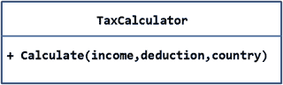
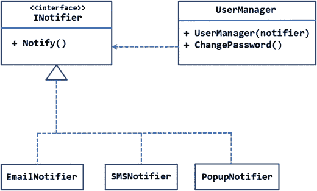

# 二、SOLID 原则

在前一章中，您已经了解了面向对象设计的基本原则。本章将更详细地介绍所有这些。此外，每个原则都将与一个概念验证示例一起讨论，以加强您的理解。为了理解这些原则是如何帮助改进类设计的，本章将首先讨论错误的设计。然后，一旦你清楚了错误设计造成的问题，本章将介绍正确的设计，它纠正了不恰当设计的缺点。解释将使用 UML 类图来传达观点。虽然我不会深入 UML 的细节，但是为了清楚起见，我将以注释的形式包含 UML 图的必要细节。具体来说，我们将涵盖以下原则:

*   单一责任原则
*   开放/封闭原则(OCP)
*   利斯科夫替代原理
*   接口隔离原则(ISP)
*   从属倒置原则

这些原则可以应用于属于应用任何一层的类——数据访问、业务逻辑或用户界面。重点是达到一个更好的类设计，有助于灵活和可维护的代码库。

Note

正如在第 1 章中提到的，本章讨论的面向对象软件设计的原则是由 Robert C. Martin 和 Micah Martin 在他们的书《敏捷原则、模式和 C# 实践》中阐述的。首字母缩略词 SOLID 是由 Michael Feathers 引入的，目的是帮助人们更容易记住这些原则。

## 单一责任原则

单一责任原则可以表述如下:一个类应该只有一个单一的责任。任何类都是为了做一些工作。这项工作可以像保存应用状态一样简单，也可以像资源密集型处理一样复杂。然而，如果一个类被设计成承担多重责任，它会在以后的阶段产生问题。

假设您正在构建一个处理客户和订单的 web 应用。作为该功能的一部分，您需要提供搜索功能，以便根据特定标准搜索客户数据库。现在，假设你创建了如图 [2-1](#Fig1) 所示的`CustomerSearch`类。


图 2-1。

A class for searching customer data

如您所见，CustomerSearch 类有三个公共方法:`SearchByCountry()`、`SearchByCompanyName()`和`SearchByContactName()`。这三种方法分别根据提供的国家、公司名称和联系人来搜索客户表，并将搜索结果作为一个`Customer`对象列表返回。

Note

在 UML 类图中，一个类由一个矩形表示，类名在顶部提到。方法列在矩形内。加号表示方法是公共的。

目前为止，一切顺利。现在，假设有一天需要将搜索结果导出为逗号分隔值(CSV)格式，以便最终用户可以下载结果并在 Excel 或记事本中打开它们进行进一步处理。为了处理这个需求，让我们假设您修改了如图 [2-2](#Fig2) 所示的`CustomerSearch`类。


图 2-2。

Adding a method for exporting customer data

`CustomerSearch`类现在有了一个额外的方法——`ExportToCSV(``)`——该方法将搜索结果作为其参数，然后生成用于下载的 CSV 等价物。

虽然这种设计改变听起来很正常，但它有一个设计缺陷。这个类现在有两个职责。早先的`CustomerSearch`类只负责搜索客户数据；现在它还负责导出数据。假设有一种情况，需要将数据导出为 XML 格式或 PDF 格式。如果发生这种情况，您将需要再次更改`CustomerSearch`类。虽然`CustomerSearch`类的搜索功能没有变化(这是该类最初的主要职责)，但是您需要对其进行更改，因为数据导出功能已经发生了变化。在`CustomerSearch`类中的任何变化也需要测试，以确保这些变化不会影响应用的其余部分。

这里的根本问题是`CustomerSearch`类被分配了多重职责。改变`CustomerSearch`有两个可能的原因——搜索功能的改变和数据导出功能的改变。这些职责中任何一个的改变都需要`CustomerSearch`类的改变。如果`CustomerSearch`级是按照单一责任原则设计的，这个设计问题可以得到纠正。让我们看看怎么做。

请看图 [2-3](#Fig3) ，显示了修改后的类设计。


图 2-3。

Class design after applying SRP

修改后的设计有两个独立的类别— `CustomerSearch`和`CustomerDataExporter`。前一个类负责搜索客户数据。导出搜索结果的责任由后一个类使用两种方法来处理——T2 和 T3。这样，`CustomerSearch`和`CustomerDataExporter`各有一个且只有一个责任。如果将来您需要将数据导出为其他格式(比如 PDF)，您只需要修改`CustomerDataExporter`类。`CustomerSearch`类不受这一变化的影响。这也意味着只有`CustomerDataExporter`需要重新测试(因为只有它被改变了)。现在`CustomerSearch`类有一个也是唯一一个改变的理由——改变搜索逻辑。

为了让您更清楚地理解 SRP，让我们将前面的例子转换成一个 ASP.NET 应用。您将使用 Northwind 数据库的`Customers`表作为客户数据源。应用的主视图如图 [2-4](#Fig4) 所示。


图 2-4。

Main view of the customer search application

如您所见，主视图由一个指定搜索条件的文本框、一个选择要搜索的列的下拉列表和一个搜索按钮组成。输入搜索条件并点击搜索按钮后，结果会显示在另一个视图中，如图 [2-5](#Fig5) 所示。


图 2-5。

A view showing search results

显示搜索结果的视图将它们呈现在一个表格中。您可以通过单击“导出”按钮下载 CSV 格式的结果。“返回搜索”链接将带您进入主视图。

为了开始开发这个例子，使用 Visual Studio 创建一个新的 ASP.NET web 应用(命名为项目`SRP`)并配置它使用 MVC 和实体框架(更多细节参见[第 1 章](01.html))。还将 Northwind 数据库的数据库连接字符串存储在`appsettings.json`文件中。

接下来，向`Core`文件夹添加一个新类，并在其中编写代码，如清单 [2-1](#Par24) 所示。

```cs
[Table("Customers")]
public class Customer
{
    public string CustomerID { get; set; }
    public string CompanyName { get; set; }
    public string ContactName { get; set; }
    public string Country { get; set; }
}

Listing 2-1.Customer Model Class

```

`Customer`类表示来自`Customers`表的客户，由四个公共属性组成— `CustomerID`、`CompanyName`、`ContactName`和`Country`。尽管`Customers`表包含几个其他的列，为了简单起见，前面的代码只使用了其中的四列。

因为应用需要从 Northwind 数据库中搜索数据，所以它需要一个实体框架 DbContext。因此，在`Core`文件夹中添加一个新类，并修改它，如清单 [2-2](#Par34) 所示。

```cs
public class AppDbContext : DbContext
{
    public DbSet<Customer> Customers { get; set; }
    protected override void OnConfiguring(DbContextOptionsBuilder optionsBuilder)
    {
        optionsBuilder.UseSqlServer(AppSettings.ConnectionString);
    }
}

Listing 2-2.
AppDbContext Class

```

`AppDbContext`类继承自 DbContext 并包含`Customers` DbSet。被覆盖的`OnConfiguring()`方法通过使用`UseSqlServer()`方法设置要使用的 SQL Server 数据库。

接下来，在`Core`文件夹中添加`CustomerSearch`类，并编写如清单 [2-3](#Par45) 所示的代码。

```cs
public class CustomerSearch
{
    public static List<Customer> SearchByCountry(string country)
    {
        using (AppDbContext db = new AppDbContext())
        {
            var query = from c in db.Customers
                        where c.Country.Contains(country)
                        orderby c.CustomerID ascending
                        select c;
            return query.ToList();
        }
    }
    public static List<Customer> SearchByCompanyName(string company)
    {
        using (AppDbContext db = new AppDbContext())
        {
            var query = from c in db.Customers
                        where c.CompanyName.Contains(company)
                        orderby c.CustomerID ascending
                        select c;
            return query.ToList();
        }
    }
    public static List<Customer> SearchByContactName(string contact)
    {
        using (AppDbContext db = new AppDbContext())
        {
            var query = from c in db.Customers
                        where c.ContactName.Contains(contact)
                        orderby c.CustomerID ascending
                        select c;
            return query.ToList();
        }
    }
}

Listing 2-3.CustomerSearch Class

```

`CustomerSearch`类由三个静态方法组成— `SearchByCountry()`、`SearchByCompanyName()`和`SearchByContactName()`。这三个方法都接受一个参数(搜索词)并返回一个通用的`Customer`对象列表。这些方法主要寻找所有的`Customer`实体，它们的搜索列(分别为`Country`、`CompanyName`和`ContactName`)包含搜索关键字(分别为`country`、`company`和`contact parameter`)。

现在在`Core`文件夹中添加一个`CustomerDataExporter`类，并在其中编写清单 [2-4](#Par86) 所示的代码。

```cs
public class CustomerDataExporter
{
    public static string ExportToCSV(List<Customer> data)
    {
        StringBuilder sb = new StringBuilder();
        foreach(var item in data)
        {
            sb.AppendFormat("{0},{1},{2},{3}",
                                            item.CustomerID,
                                            item.CompanyName,
                                            item.ContactName,
                                            item.Country);
            sb.AppendLine();
        }
        return sb.ToString();
    }
    public static string ExportToXML(List<Customer> data)
    {
        throw new NotImplementedException();
    }
    public static string ExportToPDF(List<Customer> data)
    {
        throw new NotImplementedException();
    }
}

Listing 2-4.CustomerDataExporter Class

```

`CustomerDataExporter`类由三个静态方法组成— `ExportToCSV()`、`ExportToXML()`和`ExportToPDF()`。在这三个中，只有`ExportToCSV()`在类中实现。`ExportToCSV()`方法接受一个通用的`Customer`对象列表。在内部，它遍历列表并使用`StringBuilder`生成一个 CSV。最后，将完整的 CSV 字符串返回给调用者。

在本节的开始，我们讨论了 SRP，我们对`CustomerSearch`和`CustomerDataExporter`的设计遵循 SRP。注意`ExportToXML()`和`ExportToPDF()`可以在以后需要的时候添加到`CustomerDataExporter`类中。

现在这两个类已经准备好了，是时候在控制器中使用它们了。将`HomeController`添加到`Controllers`文件夹中，并编写三个动作(和一个私有助手方法)，如清单 [2-5](#Par116) 所示。

```cs
    public IActionResult Index()
    {
        return View();
    }
    public List<Customer> GetData(string criteria, string searchby)
{
    List<Customer> data = null;
    switch (searchby)
    {
        case "companyname":
            data = CustomerSearch.SearchByCompanyName(criteria);
            break;
        case "contactname":
            data = CustomerSearch.SearchByContactName(criteria);
            break;
        case "country":
            data = CustomerSearch.SearchByCountry(criteria);
            break;
    }
    return data;
}
    [HttpPost]
    public IActionResult Search(string criteria,string searchby)
    {
List<Customer> model = GetData(criteria,searchby);
        ViewBag.Criteria = criteria;
        ViewBag.SearchBy = searchby;
        return View(model);
    }
    [HttpPost]
    public FileResult Export(string criteria, string searchby)
    {
List<Customer> data = GetData(criteria, searchby);
        string exportData = CustomerDataExporter. ExportToCSV(data);
        return File(System.Text.ASCIIEncoding.ASCII.GetBytes(exportData), "application/Excel");
    }
}

Listing 2-5.Index(), Search() and Export() Action Methods

```

`Index()`动作方法的工作只是返回`Index`视图。

`GetData()`方法是另外两个动作使用的私有 helper 方法。它的主要工作是通过调用`CustomerSearch`类上的方法来获取客户数据。它接受搜索标准和 searchby 参数。在内部，代码检查 searchby 值，并相应地调用`CustomerSearch`类的`SearchByCompanyName()`、`SearchByContactName`或`SearchByCountry()`方法。`GetData()`方法向调用者返回一列`Customer`对象。

`Search()`动作负责在`Customers`表中搜索指定的标准。`Index`视图服从于`Search()`方法。criteria 和 searchby 参数是通过模型绑定从提交的表单中接收的。模型绑定允许您将表单字段值与操作参数进行映射和绑定。然后通过传递 criteria 和 searchby 参数调用`GetData()`助手方法。从`GetData()`返回的数据充当搜索视图的模型。此外，标准和 searchby 值通过`ViewBag`传递给视图。这是必要的，因为如果用户决定导出数据，您的应用需要根据搜索操作期间指定的标准再次获取数据。

`Export()`动作由搜索结果页面上的导出按钮调用(见图 [2-5](#Fig5) )。它采用与`Search()`相同的两个参数——criteria 和 searchby。但是，请注意，`Export()`会返回`FileResult`，因为您希望最终用户将 CSV 数据作为文件下载。在内部，代码使用`GetData()`方法获取所需的数据。然后这个数据被提供给`CustomerDataExporter`类的`ExportToCSV()`方法。使用`Controller`基类的`File()`方法将返回的 CSV 字符串包装在一个`FileContentResult`对象中。`File()`方法的第一个参数接受被返回文件的内容。此参数需要是一个字节数组。`GetBytes()`方法将 CSV 字符串转换成等价的字节数组。`File()`方法的第二个参数表示响应的内容类型。在这种情况下，内容类型设置为应用/Excel，以便最终用户可以在必要时直接在 Excel 中打开文件。

这就完成了`HomeController`。现在是时候创建两个视图了— `Index.cshtml`和`Search.cshtml`。在`Views/Home`子文件夹中添加两个视图`Index`和`Search`。清单 [2-6](#Par164) 中显示了`Index`视图的标记。

```cs
<html>
    <head>
        <title>Index</title>
    </head>
    <body>
        <br />
        <form asp-controller="Home" asp-action="Search" method="post">
            <label for="criteria">Search Criteria :</label>
            <input name="criteria" />
            <label for="searchby">Search By :</label>
            <select name="searchby">
                <option value="companyname">Company Name</option>
                <option value="contactname">Contact Name</option>
                <option value="country">Country</option>
            </select>
            <input type="submit" value="Search" />
        </form>
    </body>
</html>

Listing 2-6.Markup of Index.cshtml

```

`Index`视图使用 MVC 的 tag helper 来呈现一个表单，该表单使用`POST`方法提交给`HomeController`的`Search()`动作。注意表单标签助手的`asp-controller`和`asp-action`属性是如何指定这些细节的。该表单包含 HTML 元素来呈现页面，如图 [2-4](#Fig4) 所示。注意，文本框的名称被设置为`criteria`，而`select`元素的名称被设置为`searchby`。为了让模型绑定按预期工作，这是必要的。

`Search.cshtml`的标记如清单 [2-7](#Par185) 所示。

```cs
@model List<SRP.Core.Customer>
<html>
    <head>
        <title>Search</title>
    </head>
    <body>
        <h1>Search Results</h1>
        <form asp-controller="Home" asp-action="Export" method="post">
            <input type="hidden" name="criteria" value="@ViewBag.Criteria" />
            <input type="hidden" name="searchby" value="@ViewBag.SearchBy" />
            <input type="submit" value="Export" />
        </form>
        <table border="1" cellpadding="5">
            @foreach(var item in Model)
            {
                <tr>
                    <td>@item.CustomerID</td>
                    <td>@item.CompanyName</td>
                    <td>@item.ContactName</td>
                    <td>@item.Country</td>
                </tr>
            }
        </table>
        <br />
        <a asp-controller="Home" asp-action="Index">Back to search</a>
    </body>
</html>

Listing 2-7.Markup of Search.cshtml

```

`Search`视图从指定视图的模型到`List<SRP.Core.Customer>`开始。页面的顶部有一个包装在`<form>`元素中的导出按钮。注意，这个`<form>`服从于`HomeController`的`Export()`动作。`Search()`动作将`Criteria`和`SearchBy`属性传递给该视图，它们的值存储在隐藏字段中。这是必要的，因为我们需要这些值存在于`Export()`动作中。

然后，`Search`视图遍历模型并呈现一个显示`CustomerID`、`CompanyName`、`ContactName`和`Country`属性的表格。在视图的底部，一个超链接标签帮助器用于呈现一个指向`Index`动作的链接。

这就完成了应用。通过 Visual Studio 运行应用，并在`Index`视图中输入一些搜索标准。当浏览器中显示`Search`视图时，点击导出按钮，查看是否可以下载 CSV 文件。

测试完应用后，暂停一下，看看如何将单一责任原则应用到`CustomerSearch`和`CustomerDataExporter`类中。导出数据格式的未来变化会影响哪些地方？受影响的主要是`CustomerDataExporter`级本身。第二个地方是`Search`视图，这里有导出按钮。您可能需要向此视图添加格式选择下拉列表(带有 CSV、XML 和 PDF 等选项)。相应的，`Export()`行动也需要改变。无论如何，`CustomerSearch`类保持不变，因为数据导出不是它的功能。改变`CustomerSearch`的唯一原因是修改搜索功能。同样，修改`CustomerDataExporter`的唯一原因是改变导出数据格式。

## 开放/封闭原则(OCP)

开放/封闭原则可以表述为:一个类应该对扩展开放，但对修改封闭。

当你为一个中等复杂的系统设计类时，它们可能会随着时间的推移而发展。通常功能上的小变化是通过修改类本身来实现的。尽管这在简单的应用中可能行得通，但总是存在风险。当您更改一个类时，这种更改可能会对系统的其他部分产生负面影响。这需要重新测试该类。如果我们可以在不接触已经测试过并按预期工作的类的情况下添加功能，这不是很好吗？这就是 OCP。

OCP 建议，一个类应该对扩展开放。这样就满足了我们增加额外功能的需求。但与此同时，OCP 告诉我们，该类应该关闭任何变化。这确保了当新功能被添加到系统中时，类的代码基(源代码形式或编译形式)保持不变。这怎么可能？您可以通过使用继承或接口抽象类设计来实现这一点。让我们通过一个例子来更详细地了解这一点。

假设您正在开发一个包含在线税收计算器的 web 应用。用户可以访问一个网页，指定他们的收入和支出细节，并使用一些数学计算来计算应纳税额。考虑到这一点，您创建了一个类——tax calculator——如图 [2-6](#Fig6) 所示。



图 2-6。

Class for calculating taxes

`TaxCalculator`类有一个公共方法`Calculate()`，它接受用户的总收入、总扣除额和国家。当然，真实世界的税收计算器可以做得更多，但是这个简单的设计对于我们的例子来说已经足够了。国家信息是必要的，因为不同国家的税收规则是不同的。`Calculate()`方法的伪代码如清单 [2-8](#Par222) 所示。

```cs
public decimal Calculate(decimal income, decimal deduction,string country)
{
    decimal taxAmount = 0;
    decimal taxableIncome = income - deduction;
    switch(country)
    {
        case "India":
            //calculation here
            break;
        case "USA":
            //calculation here
            break;
        case "UK":
            //calculation here
            break;
    }
    return taxAmount;
}

Listing 2-8.Pseudo-code of the Calculate() Method

```

`Calculate()`法通过从总收入中减去总扣除额来确定应税收入。然后，switch 语句检查用户的国家。根据国家的不同，会计算税款，并将税额分配给`taxAmount`变量(代码中未显示)。虽然这段代码看起来不错，但是有一个问题。它目前只考虑了三个国家。想象一下这样一种情况，web 应用变得流行，来自几个国家的用户开始使用它。当这种情况发生时，`TaxCalculator`阶层需要改变，以适应新的国家及其相应的税收规则。因此，目前的设计违反了 OCP。

现在，让我们来修改一下课程设计。看一下图 [2-7](#Fig7) 。


图 2-7。

Class design that adheres to OCP Note

在图 [2-7](#Fig7) 中，`ICountryTaxCalculator`的第一部分表示它是一个接口，第二部分包含一个属性列表，第三部分包含一个方法。实现一个接口的类用一条虚线表示，虚线上有一个指向被实现接口的空心箭头。

修改后的设计以`ICountryTaxCalculator`接口的形式进行了抽象。该接口包含两个属性— `TotalIncome`和`TotalDeduction`—和一个方法— `CalculateTaxAmount()`。税收计算逻辑不再包含在`TaxCalculator`类中。取而代之的是几个类，比如`TaxCalculatorForUS`、`TaxCalculatorForUK`、`TaxCalculatorForIN`，每个都实现`ICountryTaxCalculator`。这样，每个国家的税收计算逻辑都包含在一个独立的单元中。请注意`TaxCalculator`的`Calculate()`方法的变化。它现在接受类型为`ICountryTaxCalculator`的单个参数`obj`。修改后的`Calculate()`方法的伪代码如清单 [2-9](#Par245) 所示。

```cs
public decimal Calculate(ICountryTaxCalculator obj)
{
    decimal taxAmount = 0;
    // some more logic here
    taxAmount = obj.CalculateTaxAmount();
    return taxAmount;
}

Listing 2-9.Modified Calculate() Method

```

如您所见，现在`Calculate()`方法不检查国家。那是因为它接收了一个实现`ICountryTaxCalculator`的对象。因此，无论用户属于哪个国家，调用`CalculateTaxAmount()`都会返回税额。因此，`TaxCalculator`级现在符合 OCP。如果您需要计算当前没有包括的国家，您需要做的就是创建另一个实现`ICountryTaxCalculator`的类，并在那里编写税收计算逻辑。`TaxCalculator`对扩展功能是开放的(通过添加实现`ICountryTaxCalculator`的新的特定于国家的类)，但同时，它对修改是关闭的(你不需要改变它的源代码)。

现在你知道 OCP 是什么了，让我们把这个例子转化成一个项目。在本例中，您将开发一个 web 应用，如图 [2-8](#Fig8) 所示。


图 2-8。

Online tax calculator application

该应用显示两个文本框，分别用于输入总收入和总扣除额。下拉列表显示国家列表。单击“计算税款”按钮进行税款计算，并向用户显示总税额。

为了开始开发这个例子，使用 Visual Studio 创建一个新的 ASP.NET web 应用，并将其配置为使用 MVC(更多细节参见第 1 章)。

接下来，将`ICountryTaxCalculator`接口添加到`Core`文件夹中，并编写清单 [2-10](#Par257) 中所示的代码。

```cs
public interface ICountryTaxCalculator
{
    decimal TotalIncome { get; set; }
    decimal TotalDeduction { get; set; }
    decimal CalculateTaxAmount();
}

Listing 2-10.ICountryTaxCalculator Interface

```

`ICountryTaxCalculator`接口有两个属性——`TotalIncome`和`TotalDeduction`——一个方法——`CalculateTaxAmount(). ICountryTaxCalculator`由三个类——`TaxCalculatorForUS`、`TaxCalculatorForUK`和`TaxCalculatorForIN`实现。将这三个类添加到`Core`文件夹中。清单 [2-11](#Par264) 显示了在`ICountryTaxCalculator`实现后的这些类。

```cs
public class TaxCalculatorForUS: ICountryTaxCalculator
{
    public decimal TotalIncome { get; set; }
    public decimal TotalDeduction { get; set; }
    public decimal CalculateTaxAmount()
    {
        decimal taxableIncome = TotalIncome - TotalDeduction;
        return taxableIncome * 30 / 100;
    }
}
public class TaxCalculatorForUK: ICountryTaxCalculator
{
    public decimal TotalIncome { get; set; }
    public decimal TotalDeduction { get; set; }
    public decimal CalculateTaxAmount()
    {
        decimal taxableIncome = TotalIncome - TotalDeduction;
        return taxableIncome * 35 / 100;
    }
}
public class TaxCalculatorForIN: ICountryTaxCalculator
{
    public decimal TotalIncome { get; set; }
    public decimal TotalDeduction { get; set; }
    public decimal CalculateTaxAmount()
    {
        decimal taxableIncome = TotalIncome - TotalDeduction;
        return taxableIncome * 20 / 100;
    }
}

Listing 2-11.
TaxCalculatorForUS

, TaxCalculatorForUK

, and TaxCalculatorForIN

Classes

```

由这些类实现的`CalculateTaxAmount()`方法通过从收入中减去扣除额来找到应税收入。该值被视为应税收入，其中的一定百分比(分别为 30%、35%和 20%)作为税额返回给调用者。

现在将`TaxCalculator`类添加到`Core`文件夹中，并修改它，如清单 [2-12](#Par301) 所示。

```cs
public class TaxCalculator
{
    public decimal Calculate(ICountryTaxCalculator obj)
    {
        decimal taxAmount = obj.CalculateTaxAmount();
        //do something more if needed
        return taxAmount;
    }
}

Listing 2-12.TaxCalculator Class

```

`Calculate()`方法接受一个实现了`ICountryTaxCalculator`的类型的对象，并调用`CalculateTaxAmount()`方法。然后将税额返回给调用者。虽然本例中没有要求，但是除了调用`CalculateTaxAmount()`之外，您还可以做一些额外的处理。

接下来，将一个类添加到`Models`文件夹中，并将其命名为`IncomeDetails`。`IncomeDetails`类充当`Index`视图的视图模型，如清单 [2-13](#Par312) 所示。

```cs
public class IncomeDetails
{
    public decimal TotalIncome { get; set; }
    public decimal TotalDeduction { get; set; }
    public string Country { get; set; }
}

Listing 2-13.IncomeDetails Class

```

当用户在应用的主页上填写详细信息并提交表单时，`IncomeDetails`类保存总收入、总扣除额和国家。

现在，将`HomeController`类添加到`Controllers`文件夹中，并将其修改为具有两个动作，如清单 [2-14](#Par320) 所示。

```cs
public IActionResult Index()
{
    return View();
}
[HttpPost]
public IActionResult Index(IncomeDetails obj)
{
    ICountryTaxCalculator t = null;
    switch(obj.Country)
    {
        case "USA":
            t = new TaxCalculatorForUS ();
            break;
        case "UK":
            t = new TaxCalculatorForUK();
            break;
        case "IN":
            t = new TaxCalculatorForIN ();
            break;
    }
    t.TotalIncome = obj.TotalIncome;
    t.TotalDeduction = obj.TotalDeduction;
    TaxCalculator cal = new TaxCalculator();
    ViewBag.TotalTax = cal.Calculate(t);
    return View("Index", obj);
}

Listing 2-14.Index() Action Methods

```

第一个`Index()`动作处理`GET`请求(对应用的初始请求)，第二个`Index()`处理由`[HttpPost]`属性指示的`POST`请求。第二个`Index()`动作接受一个视图模型类型的参数— `IncomeDetails`。MVC 的模型绑定框架会为你填充这个参数。

在里面，你必须检查一个用户的`Country`，并相应地实例化`TaxCalculatorForUS`、`TaxCalculatorForUK`或`TaxCalculatorForIN`。请注意，变量`t`属于类型`ICountryTaxCalculator`——接口类型。然后将`ICountryTaxCalculator`对象的`TotalIncome`和`TotalDeduction`属性设置为视图模型的相应属性。然后，`TaxCalculator`被实例化，通过向其传递`ICountryTaxCalculator`对象来调用其`Calculate()`方法。税额存储在`ViewBag`中，以便在`Index`视图中显示。

现在是应用的最后一部分——`Index`视图。将`Index.cshtml`添加到`Views`文件夹下的`Home`子文件夹中，并将清单 [2-15](#Par350) 中所示的标记输入其中。

```cs
@model OCP.Models.IncomeDetails
<html>
<head>
    <title></title>
</head>
<body>
    <h1>Tax Calculator</h1>
    <form asp-controller="Home" asp-action="Calculate" method="post">
        <table cellpadding="5">
            <tr>
                <td><label asp-for="TotalIncome">Total Income :</label></td>
                <td><input type="number" asp-for="TotalIncome" /></td>
            </tr>
            <tr>
                <td><label asp-for="TotalDeduction">Total Deduction :</label></td>
                <td><input type="number" asp-for="TotalDeduction" /></td>
            </tr>
            <tr>
                <td><label asp-for="Country">Country :</label></td>
                <td>
                    <select asp-for="Country">
                        <option value="USA">United States</option>
                        <option value="UK">United Kingdom</option>
                        <option value="IN">India</option>
                    </select>
                </td>
            </tr>
            <tr>
                <td colspan="2"><input type="submit" value="Calculate Tax" /></td>
            </tr>
            <tr>
                <td><strong>Total Tax : @ViewBag.TotalTax</strong></td>
            </tr>
        </table>
    </form>
</body>
</html>

Listing 2-15.Markup of Index.cshtml

```

`Index`视图标记非常简单，它使用标签助手来呈现一个`<form>`，这个`<form>`提交给`HomeController`的`Calculate()`动作。注意，这两个文本框和下拉列表是使用`asp-form`属性绑定到模型的各自属性的。还要注意，在视图结束时，`TotalTax`从`ViewBag`输出。

这就完成了应用。运行应用并测试它是否按预期工作。

从我们之前的讨论中，你知道`TaxCalculator`类符合 OCP。如果需要计算其他国家的税款，将在哪里进行更改？首先，您需要为那个国家创建一个类，并在其中实现`ICountryTaxCalculator`。新类别的`CalculateTaxAmount()`将负责该国家的税收计算。其次，您需要更改`Index`视图上的下拉列表，以包含这个额外的国家。最后，需要调整第二个`Index()`方法的 switch 语句，以包含这个国家。这些变化非常明显，因为它们都与额外的要求有关。由于用户界面的改变，控制器和视图在任何情况下都会改变。然而，我们的设计确保了`TaxCalculator`类保持不变。

Note

前面的示例使用接口来表示税收计算。作为练习，修改同一个示例以使用继承；也就是说，一个公共基类，其抽象成员由`TaxCalculatorForUS`、`TaxCalculatorForUK`和`TaxCalculatorForIN`类继承。

## 利斯科夫替代原理

Liskov 替换原则可以表述为:一个类型必须可以被其子类型替换，而不改变应用的正确性。

在第 1 章中，我们讨论了通过继承和接口的多态行为。假设有一个名为`Class1`的类，两个类——`Class2`和`Class3`——继承自`Class1`。然后`Class2`和`Class3`的对象可以被传递到任何期望`Class1`的地方。为了用代码说明这一点，请考虑以下情况:

```cs
Class1 obj = null;
obj = new Class2(); //ok
obj = new Class3(); //ok

```

前面的代码片段声明了一个类型为`Class1`的变量`obj`。然后它将一个类型为`Class2`的对象分配给`obj`。这是允许的，因为据说`Class2`继承自`Class1`。如果您移除`Class1`和`Class2`之间的继承链接，您将立即在 Visual Studio 代码编辑器中看到一个标记的错误。第三行也是如此，其中`obj`指向`Class3`的一个对象。前面的示例使用继承，但是您可以使用接口演示类似的行为。例如，假设有一个由类`Class2`和`Class3`实现的接口`IInterface`。那么你可以写:

```cs
IInterface obj = null;
obj = new Class2(); //ok
obj = new Class3(); //ok

```

现在，这种多态行为是 C# 语言特性的一部分，但开发人员有责任确保这种多态设置不会给系统带来任何错误或不准确性。让我们通过一个例子来理解这是如何发生的。

让我们假设您正在开发一个大型门户。作为需求的一部分，您应该为最终用户提供大量的定制。定制跨越系统的各个级别，例如全局级别的定制、部分级别的定制和用户特定的定制。考虑到这一要求，你得到了如图 [2-9](#Fig9) 所示的设计。


图 2-9。

Classes for customizable portal application

如你所见，有一个接口`ISettings`定义了两个方法，`GetSettings(` `)`和`SetSettings()`。这两种方法在实现时，分别用于从数据库中检索定制设置并将它们保存到数据库中。

`ISettings`接口由三个类实现——`GlobalSettings`、`SectionSettings`和`UserSettings. GlobalSettings`是对整个应用级别有影响的设置，如标题、主题和通信。`SectionSettings`适用于门户的单个版块，如新闻、天气、体育等。这些设置可以包括它们在页面上的外观和位置。`UserSettings`是针对特定用户的设置，例如电子邮件和通知首选项。此外，让我们假设您创建了一个类`SettingsHelper`，它封装了设置和获取所有类型设置的内部工作。该类如图 [2-10](#Fig10) 所示。


图 2-10。

SettingsHelper class

`SettingsHelper`类由两个方法组成— `GetAllSettings()`和`SetAllSettings()`。`GetAllSettings()`方法接受实现`ISettings`接口的对象列表。在内部，它遍历该列表并对每个对象调用`GetSettings()`来检索设置。最后，它将所有`ISettings`对象的所有设置返回给调用者。同样，`SetSettings()`方法接受一个`ISettings`对象列表和每个传递的`ISettings`对象的实际设置列表。

虽然我们不会深入这两个方法的确切代码，但是很明显这两个方法都会有某种循环，比如`foreach`。随着每次迭代，`GetSettings()`或`SetSettings()`将在各自的`ISettings`对象上被调用。为了清楚起见，请参见下面的伪代码:

```cs
// inside GetAllSettings()
foreach (ISettings item in items)
{
  item.GetSettings();
}
// inside SetAllSettings()
foreach (ISettings item in items)
{
  item.SetSettings(values);
}

```

目前为止，一切顺利。有了这个设计，一切都按预期运行。现在假设出现了应用应该支持来宾用户的需求。这些用户就像其他注册用户一样，只有一个例外—因为他们是客人用户，所以他们不能保存任何定制或首选项。他们确实将一些默认设置应用于应用的各个部分。为了合并这一更改，创建一个额外的类——`GuestSettings`——它实现了`ISettings`。因为`GuestSettings`不应该将任何设置保存到数据库中，所以您不会实现`SetSettings()`方法。所以，`GuestSettings`的`SetSettings()`会是这样的:

```cs
public void SetSettings(Dictionary<string, string> settings)
{
    throw new NotImplementedException();

}

```

你能感觉到有什么问题吗？虽然`GuestSettings`类实现了`ISettings`，但这会导致`SettingsHelper`中断。这是因为如果你将一个`GuestSettings`的对象传递给`SettingsHelper`的`SetAllSettings()`方法，它将试图对其调用`SetSettings()`(参见前面的`foreach`循环)并将生成一个异常。所以，在引入了`GuestSettings`类之后，一个正常工作的应用会突然开始抛出错误。问题的根本原因是实现`ISettings`(本例中为`GuestSettings`)的类型通过做一些影响应用正确性的事情(本例中抛出异常)违反了 LSP。

你如何纠正这个问题？在这个具体的例子中，您可以将`ISettings`接口分成两个— `IReadableSettings`和`IWritableSettings`—每个定义一个具体的操作。修改后的设计如图 [2-11](#Fig11) 所示。


图 2-11。

Modified class design

`ISettings`的方法被分成两个独立的接口:`IReadableSettings`和`IWritableSettings`。`IReadableSettings`接口只包含`GetSettings()`，而`IWritableSettings`包含`SetSettings()`。注意，一方面，`IReadableSettings`是由所有的类实现的— `GlobalSettings`、`SectionSettings`、`UserSettings`和`GuestSettings`。另一方面，`IWritableSettings`仅由它们中的三个实现— `GlobalSettings`、`SectionSettings`和`UserSettings`。

`SettingsHelper`类仍然包含`GetAllSettings()`和`SetAllSettings()`。之前，这两种方法都用于接受一组`ISettings`对象。现在`GetAllSettings()`将接受一列`IReadableSettings`对象，而`SetAllSettings()`将接受一列`IWritableSettings`对象。这种设计符合 LSP，因为对象不仅是可替换的，而且可以正确工作。

为了让您的理解更清晰，让我们将这个场景转换成一个应用。在本例中，您将开发一个 web 应用，如图 [2-12](#Fig12) 所示。


图 2-12。

Displaying all settings

应用的主页面显示所有四种类型的默认设置:`GlobalSettings`、`SectionSettings`、`UserSettings`和`GuestSettings`。顶部的按钮允许你改变设置。在这个例子中，我们不会加入任何数据库访问来简化我们的代码。设置更改成功后，显示成功页面，如图 [2-13](#Fig13) 所示。


图 2-13。

Success message after changing the settings

为了开始开发这个例子，使用 Visual Studio 创建一个新的 ASP.NET web 应用，并将其配置为使用 MVC(更多细节参见第 1 章)。

因为当您熟悉代码引入的不准确性时，LSP 会得到更好的理解，所以您将首先构建应用的错误版本；然后，您将按照正确的设计更正应用。

将`ISettings`接口添加到`Core`文件夹中，如清单 [2-16](#Par432) 所示进行修改。

```cs
public interface ISettings
{
    Dictionary<string,string> GetSettings();
    string SetSettings(Dictionary<string,string> settings);
}

Listing 2-16.ISettings Interface

```

`GetSettings()`方法以字典的形式返回设置。`SetSettings()`方法接受设置字典并返回成功消息。

现在在`Core`文件夹中添加四个类:`GlobalSettings`、`SectionSettings`、`UserSettings`和`GuestSettings`，并在它们中实现`ISettings`。由于前三个类比较相似，这里就不一一讨论了。清单 [2-17](#Par439) 中的代码显示了`GlobalSettings`类。

```cs
public class GlobalSettings :ISettings
{
    public Dictionary<string, string> GetSettings()
    {
        Dictionary<string, string> settings = new Dictionary<string, string>();
        settings.Add("Theme", "Summer");
        return settings;
    }
    public string SetSettings(Dictionary<string, string> settings)
    {
        foreach (var item in settings)
        {
            //save to database
        }
        return "Global settings saved on " + DateTime.Now;
    }
}

Listing 2-17.
GlobalSettings Class

```

`GlobalSettings`类通过编写`GetSettings()`和`SetSettings()`方法的实现来实现`ISettings`。`GetSettings()`方法创建一个字典，给它添加一个`Themes`键，然后返回字典。在更现实的情况下，您可以从数据库中获取设置。

`SetSettings()`方法遍历设置字典，并应该将它们保存到数据库中。它向调用者返回成功消息和时间戳。

你可以用类似的方式实现`SectionSettings`和`UserSettings`或者从本书的代码下载中抓取。在这个例子中，`GuestSettings`类是错误的来源，如清单 [2-18](#Par460) 所示。

```cs
public class GuestSettings : ISettings
{
    public Dictionary<string, string> GetSettings()
    {
        Dictionary<string, string> settings = new Dictionary<string, string>();
        settings.Add("GuestName", "John");
        return settings;
    }
    public string SetSettings(Dictionary<string, string> settings)
    {
        throw new NotImplementedException();
    }
}

Listing 2-18.GuestSettings Class

```

`GuestSettings`的`SetSettings()`方法对我们的测试很重要。如前所述，这个方法抛出一个`NotImplementedException`，因为不允许来宾保存定制设置。

现在将一个`SettingsHelper`类添加到`Core`文件夹中，并在其中编写代码，如清单 [2-19](#Par476) 所示。

```cs
public class SettingsHelper
{
    public static Dictionary<ISettings, Dictionary<string, string>> GetAllSettings(List<ISettings> items)
    {
        var allSettings = new Dictionary<ISettings, Dictionary<string, string>>();
        foreach (ISettings item in items)
        {
            allSettings.Add(item, item.GetSettings());
        }
        return allSettings;
    }
    public static List<string> SetAllSettings(List<ISettings> items, List<Dictionary<string, string>> values)
    {
        List<string> messages = new List<string>();
        for (int i = 0; i < items.Count; i++)
        {
            messages.Add(items[i].SetSettings(values[i]));
        }
        return messages;
    }
}

Listing 2-19.SettingsHelper Class

```

`GetAllSettings()`方法接受实现`ISettings`接口的对象列表。在内部，代码遍历列表并对每个`ISettings`对象调用`GetSettings()`。由`GetSettings()`返回的设置存储在字典中。考虑中的`ISettings`对象充当字典的键。一旦在所有对象上调用了`GetSettings()`,就将`allSettings`字典返回给调用者。

`SetAllSettings()`方法接受实现`ISettings`的对象列表和包含其设置的字典对象列表。在内部，代码遍历`ISettings`对象的列表，并对它们逐个调用`SetSettings()`。调用`SetSettings()`后返回的成功消息存储在另一个列表中，一旦循环完成就返回给调用者。

接下来，将`HomeController`添加到`Controllers`文件夹中，并向其中添加一个构造函数，如清单 [2-20](#Par501) 所示。

```cs
public class HomeController : Controller
{
    List<ISettings> settings = new List<ISettings>();
    public HomeController()
    {
        GlobalSettings g = new GlobalSettings();
        SectionSettings s = new SectionSettings("Sports");
        UserSettings u = new UserSettings("User1");
        GuestSettings gu = new GuestSettings();
        settings.Add(g);
        settings.Add(s);
        settings.Add(u);
        settings.Add(gu);
    }
}

Listing 2-20.Constructor of HomeController

```

代码声明了一个由`ISettings`对象(`LSP.Core`名称空间)组成的列表，它被填充到构造函数中。在构造函数内部，代码为`GlobalSettings`、`SectionSettings`、`UserSettings`和`GuestSettings`类各创建一个实例。这些实例将被添加到设置列表中供以后使用。

现在，将`Index()`动作方法添加到`HomeController`中，如清单 [2-21](#Par520) 所示。

```cs
public IActionResult Index()
{
    var allSettings = SettingsHelper.GetAllSettings(settings);
    return View(allSettings);
}

Listing 2-21.Fetching Default Settings

```

代码使用`SettingsHelper`并通过传递设置列表来调用它的`GetAllSettings()`方法。返回的设置作为模型传递给`Index`视图。

接下来，将`Save()`方法添加到`HomeController`中，如清单 [2-22](#Par527) 所示。

```cs
public IActionResult Save()
{
    List<Dictionary<string, string>> newSettings = new List<Dictionary<string, string>>();
    Dictionary<string, string> app = new Dictionary<string, string>();
    app.Add("Theme", "Winter");
    Dictionary<string, string> sec = new Dictionary<string, string>();
    sec.Add("Title", "Music");
    Dictionary<string, string> usr = new Dictionary<string, string>();
    usr.Add("DisplayName", "Tom");
    Dictionary<string, string> gst = new Dictionary<string, string>();
    gst.Add("GuestName", "Jerry");
    newSettings.Add(app);
    newSettings.Add(sec);
    newSettings.Add(usr);
    newSettings.Add(gst);
    List<string> model = SettingsHelper.SetAllSettings(settings, newSettings);
    return View(model);
}

Listing 2-22.Save() Action Method

```

`Index`视图将表单提交给`Save()`动作方法。在里面，代码创建了四个`Dictionary`对象，并在其中存储了一些新的设置。在更现实的情况下，您将从最终用户那里接受这些设置，然后用这些用户指定的值填充`Dictionary`对象。然后这些词典被一个接一个地添加到`newSettings`列表中。最后通过传递`ISettings`对象列表和`newSettings`调用`SettingsHelper`的`SetAllSettings()`方法。从`SetAllSettings()`返回的成功消息作为模型发送到`Save`视图。

在`Views`文件夹的`Home`子文件夹中添加两个视图——`Index.cshtml`和`Save.cshtml`。进入`Index.cshtml`内部的标记如清单 [2-23](#Par554) 所示。

```cs
@model Dictionary<LSP.Core.ISettings,Dictionary<string,string>>
...
<body>
    <h1>All Settings</h1>
    <form asp-controller="Home" asp-action="Save" method="post">
        <input type="submit" value="Change Settings" />
    </form>
    <table border="1" cellpadding="10">
        @foreach(var item in Model)
        {
            <tr>
                <td>@item.Key.ToString()</td>
                <td>
                    @foreach(var subItem in item.Value)
                    {
                        <div>@subItem.Key = @subItem.Value</div>
                    }
                </td>
            </tr>
        }
    </table>
</body>

Listing 2-23.Markup of Index.cshtml

```

`Index`视图接收一个字典作为其模型。这个字典的键是`ISettings`对象，而它的值是包含设置的`Dictionary`对象。`Index`视图由一个小的`<form>`组成，用来放置更改设置按钮。该表单提交给您之前创建的`Save()`动作。外部的`foreach`循环遍历`Model`并显示`item.Key`，而内部的`foreach`循环遍历`Value`并显示`Key`和`Value`对。

清单 [2-24](#Par579) 中显示了`Save`视图的标记。

```cs
@model List<string>
...
<body>
    <h1>Settings Changed!</h1>
    @foreach(var item in Model)
    {
        <h4>@item</h4>
    }
</body>

Listing 2-24.Markup of Save View

```

观点非常简单。它接收一个成功消息列表作为它的模型。一个`foreach`循环遍历模型并向用户显示消息。

这就完成了应用。运行应用，检查主页面是否与图 [2-12](#Fig12) 相似。如果点击更改设置按钮，应用会抛出异常，如图 [2-14](#Fig14) 所示。


图 2-14。

Application throws NotImplementedException

正如所料，应用抛出了`NotImplementedException`，因为`SettingsHelper`的`SaveAllSettings()`方法试图在`GuestSettings`对象上调用`SetSettings()`。

这是违反 LSP 的。让我们通过实现我们之前讨论的设计来纠正错误。在`Core`文件夹中添加两个接口— `IReadableSettings`和`IWritableSettings`。这些接口如清单 [2-25](#Par593) 所示。

```cs
public interface IReadableSettings
{
    Dictionary<string, string> GetSettings();
}
public interface IWritableSettings
{
    string SetSettings(Dictionary<string, string> settings);
}

Listing 2-25.IReadableSettings and IWritableSettings Interfaces

```

现在`IReadableSettings`只包含`GetSettings()`，而`IWritableSettings`只包含`SetSettings()`。修改`GlobalSettings`、`SectionSettings`和`UserSettings`类来实现`IReadableSettings`和`IWritableSettings`。还要修改`GuestSettings`类，只实现`IReadableSettings`接口。

为了节省空间，这里没有显示所有这些类。清单 [2-26](#Par604) 显示了`GlobalSettings`和`GuestSettings`级受影响的部分。

```cs
public class GlobalSettings : IReadableSettings,IWritableSettings

{
    public Dictionary<string, string> GetSettings()
    {
      ...
    }
    public string SetSettings(Dictionary<string, string> settings)
    {
      ...
    }
}

public class GuestSettings : IReadableSettings

{
    public Dictionary<string, string> GetSettings()
    {
       ...
    }
}

Listing 2-26.Modified GlobalSettings

and GuestSettings

```

请注意用粗体字母标记的代码以及接口是如何实现的。还要注意的是，`GuestSettings`现在只有`GetSettings()`方法，因为它只实现了`IReadableSettings`。

现在打开`SettingsHelper`类并修改它的方法，如清单 [2-27](#Par626) 所示。

```cs
public class SettingsHelper
{
    public static Dictionary<IReadableSettings, Dictionary<string, string>> GetAllSettings(List<IReadableSettings> items)
    {
        var allSettings = new Dictionary<IReadableSettings, Dictionary<string, string>>();
        foreach (IReadableSettings item in items)
        {
            allSettings.Add(item, item.GetSettings());
        }
        return allSettings;
    }
    public static List<string> SetAllSettings(List<IWritableSettings> items, List<Dictionary<string, string>> values)
    {
        List<string> messages = new List<string>();
        for (int i = 0; i < items.Count; i++)
        {
            messages.Add(items[i].SetSettings(values[i]));
        }
        return messages;
    }
}

Listing 2-27.Modified SettingsHelper

```

注意，`GetAllSettings()`方法使用了`IReadableSettings`接口，而不是`ISettings`。同样，`SetAllSettings()`方法使用`IWritableSettings`接口代替`ISettings`。除了这一变化之外，其他功能与以前的版本相同。

接下来，打开`HomeController`并修改它的构造函数，如清单 [2-28](#Par650) 所示。

```cs
public class HomeController : Controller
{
    List<IReadableSettings> readableSettings = new List<IReadableSettings>();
    List<IWritableSettings> writableSettings = new List<IWritableSettings>();
    public HomeController()
    {
        GlobalSettings g = new GlobalSettings();
        SectionSettings s = new SectionSettings("Sports");
        UserSettings u = new UserSettings("User1");
        GuestSettings gu = new GuestSettings();
        readableSettings.Add(g);
        readableSettings.Add(s);
        readableSettings.Add(u);
        readableSettings.Add(gu);
        writableSettings.Add(g);
        writableSettings.Add(s);
        writableSettings.Add(u);
    }

Listing 2-28.Modified HomeController constructor

```

有两个单独的列表——一个用于`IReadableSettings`对象，另一个用于`IWritableSettings`对象。构造函数填充了`readableSettings`列表中的四个对象和`writableSettings`列表中的三个对象。在这种情况下，`GuestSettings`对象不能存储在`writableSettings`中，因为它没有实现`IWritableSettings`接口。

`Index()`和`Save()`方法也将进行小的修改。他们修改的部分如清单 [2-29](#Par673) 所示。

```cs
public IActionResult Index()
{

    var allSettings = SettingsHelper.GetAllSettings(readableSettings);

    return View(allSettings);
}
[HttpPost]
public IActionResult Save()
{

    ...

    newSettings.Add(app);

    newSettings.Add(sec);

    newSettings.Add(usr);

    List<string> model = SettingsHelper.SetAllSettings(writableSettings, newSettings);

    return View(model);
}

Listing 2-29.Modified Index() and Save() Actions

```

请注意以粗体显示的代码。在`Index()`内部，代码现在将`readableSettings`传递给`GetAllSettings()`方法。在`Save()`内部，`newSettings`只有三个条目，`SetAllSettings()`现在通过传递`writableSettings`和`newSettings`来调用。

最后的改变将在`Index`视图中——只需调整视图的模型，使用`IReadableSettings`而不是`ISettings`。这就完成了修改。运行应用并尝试单击更改设置按钮。这一次它不会抛出任何错误，成功消息将按预期显示。

## 接口隔离原则(ISP)

在前面介绍 LSP 的示例中，您的解决方案是将一个接口分成两个，这样就可以根据所需的功能选择所需的接口。这个解决方案实际上是基于界面分离原理。ISP 声明如下:一个类的客户不应该被迫依赖那些他们不使用的方法。

提到的客户端不必是单独的应用或模块。它可以是正在使用所考虑的类的系统的任何部分。虽然我们在前面的例子中已经看到了违反这个原则所导致的问题，但是让我们用另一个更具体的例子来回顾一下。

假设您正在开发一个电子商务网站，该网站需要一个购物车和相关的订单处理机制。你设计一个界面`IOrderProcessor`，如图 [2-15](#Fig15) 所示。


图 2-15。

IOrderProcessor violates ISP

最初，您认为该应用只接受通过信用卡进行的在线支付。所以，你设计了有三个方法的`IOrderProcessor`接口。`ValidateCardInfo()`用于验证信用卡信息，如卡号和有效期。`ValidateShippingAddress()`方法旨在验证运输目的地。这对于确保运输目的地在公司的服务区域内是必要的。最后，`ProcessOrder()`旨在通过在系统中下订单来启动订单处理。

`OnlineOrderProcessor`类实现了`IOrderProcessor`并实现了刚才讨论的所有功能。现在让我们假设你的假设——只接受基于在线信用卡的支付——不再有效。该公司决定在选定的地点接受货到付款。乍一看，这个解决方案听起来很简单；您可以创建一个实现了`IOrderProcessor`的`CashOnDeliveryProcessor`类。货到付款的购买方式根本不会涉及到任何信用卡，所以`CashOnDeliveryOrderProcessor`类内部的`ValidateCardInfo()`方法抛出了一个`NotImplementedException`:

```cs
public bool ValidateCardInfo(CardInfo obj)
{
    throw new NotImplementedException();
}

```

在这个阶段，您的应用可能会像预期的那样工作，但是将来可能会出现一个潜在的问题。让我们假设由于某种原因，基于在线信用卡的支付需要额外的验证步骤。自然地，`IOrderProcessor`将被修改以包含那些额外的方法，`OnlineOrderProcessor`将实现那些额外的方法。然而，即使`CashOnDeliveryOrderProcessor`不需要任何额外的功能，您也必须在其中实现这些新添加的方法(并抛出`NotImplementedException`)。换句话说，`CashOnDeliveryOrderProcessor`被迫改变是因为它不需要的方法。这是违反 ISP 的。还要注意，从这些方法抛出`NotImplementedException`后，`CashOnDeliveryOrderProcessor`违反了 LSP。

新的设计(如图 [2-16](#Fig16) 所示)将所需的操作拆分为两个接口— `IOrderProcessor`和`IOnlineOrderProcessor`。`IOrderProcessor`接口只包含两个方法——`ValidateShippingAddress()`和`ProcessOrder()`。这两种方法是`OnlineOrderProcessor`和`CashOnDeliveryOrderProcessor`都需要的。`ValidateCardInfo()`方法进入一个单独的接口— `IOnlineOrderProcessor`。`IOnlineOrderProcessor`接口仅由`OnlineOrderProcessor`实现。现在，基于在线信用卡支付的任何变化都被限制在`IOnlineOrderProcessor`和实现它的类中。`CashOnDeliveryOrderProcessor`不受这些变化的影响。因此，新的设计符合 ISP 标准。


图 2-16。

Corrected design of the system

现在您已经了解了 ISP，让我们将这个例子转换成一个 ASP.NET 应用。为了演示新设计的功能，您将开发如图 [2-17](#Fig17) 所示的应用。


图 2-17。

Page to select payment mode and place the order

您可以从下拉列表中选择一种付款方式，然后单击“下订单”按钮下订单。下一个屏幕显示成功信息，如图 [2-18](#Fig18) 所示。


图 2-18。

Order placed successfully

为了开始开发这个例子，使用 Visual Studio 创建一个新的 ASP.NET web 应用，并将其配置为使用 MVC(更多细节参见第 1 章)。

在`Core`文件夹中添加两个接口— `IOrderProcessor`和`IOnlineOrderProcessor`。这些接口如清单 [2-30](#Par709) 所示。

```cs
public interface IOrderProcessor
{
    bool ValidateShippingAddress(Address obj);
    void ProcessOrder(Order obj);
}
public interface IOnlineOrderProcessor
{
    bool ValidateCardInfo(CardInfo obj);
}

Listing 2-30.IOrderProcessor and IOnlineOrderProcessor Interfaces

```

`IOrderProcessor`接口包含两个方法。`ValidateShippingAddress()`方法接受一个`Address`对象，实现这个方法的类应该验证运输目的地。`ProcessOrder()`方法接受一个`Order`对象。实现这个方法的类应该在系统中放置这个订单。

`IOnlineOrderProcessor`接口包含一个接受`CardInfo`对象的方法`ValidateCardInfo()`。实现这个方法的类应该验证这个信用卡信息。

在这个例子中，诸如`Address`、`CardInfo`和`Order`的类只是标记类。在更真实的情况下，这些类实际上会做一些处理。这里我们创建它们只是为了测试应用。因此，在`Core`文件夹中添加四个空类— `Customer`、`Order`、`Address`和`CardInfo`。因为这些类没有任何特定的代码，所以这里没有显示它们。您可以从本书的代码下载中获得这些类。

接下来，添加一个`OnlineOrderProcessor`类，并在其中实现`IOrderProcessor`和`IOnlineOrderProcessor`接口。清单 [2-31](#Par723) 显示了`OnlineOrderProcessor`级。

```cs
public class OnlineOrderProcessor:IOrderProcessor,IOnlineOrderProcessor
{
    public bool ValidateCardInfo(CardInfo obj)
    {
        //validate credit card information
        return true;
    }
    public bool ValidateShippingAddress(Address obj)
    {
        //validate shipping destination
        return true;
    }
    public void ProcessOrder(Order obj)
    {
        //do something with obj
    }
}

Listing 2-31.
OnlineOrderProcessor Class

```

`OnlineOrderProcessor`类非常简单，因为它简单地实现了这两个接口。代码不包含任何真正的验证或处理。当然，在实际应用中，你也要包括这些细节。

类似地，添加一个`CashOnDeliveryOrderProcessor`类并在其中实现`IOrderProcessor`接口。这个类如清单 [2-32](#Par744) 所示。

```cs
public class CashOnDeliveryOrderProcessor:IOrderProcessor
{
    public bool ValidateShippingAddress(Address obj)
    {
        //validate shipping destination
        return true;
    }
    public void ProcessOrder(Order obj)
    {
        //do something with obj
    }
}

Listing 2-32.
CashOnDeliveryOrderProcessor Class

```

`CashOnDeliveryOrderProcessor`类也非常简单，包含了`ValidateShippingAddress()`和`ProcessOrder()`的实现。

接下来，将`HomeController`添加到`Controllers`文件夹中。除了默认的`Index()`动作之外，再向控制器添加一个动作`ProcessOrder()`。点击 Place Order 按钮将表单提交给`ProcessOrder()`动作。`ProcessOrder()`方法如清单 [2-33](#Par759) 所示。

```cs
[HttpPost]
public IActionResult ProcessOrder(string paymentmode)
{
    Customer customer = new Customer();
    Address address = new Address();
    CardInfo cardinfo = null;
    Order order = new Order();
    order.OrderID = new Random().Next(1000,9000);
    order.Customer = customer;
    order.ShippingAddress = address;
    order.CardInfo = cardinfo;
    if(paymentmode=="card")
    {

        OnlineOrderProcessor oop = new OnlineOrderProcessor();

        cardinfo = new CardInfo();
        cardinfo.CardNo = "5555555555554444";
        cardinfo.ExpiryMonth = 12;
        cardinfo.ExpiryYear = 2015;
        order.CardInfo = cardinfo;

        oop.ValidateCardInfo(cardinfo);

        oop.ValidateShippingAddress(address);

        oop.ProcessOrder(order);

    }
    else
    {

        CashOnDeliveryOrderProcessor codop = new CashOnDeliveryOrderProcessor();

        codop.ValidateShippingAddress(address);

        codop.ProcessOrder(order);

    }
    return View("Success",order);
}

Listing 2-33.ProcessOrder() Action of HomeController

```

`ProcessOrder()`动作从`Index`视图接收`paymentmode`参数(取决于在下拉列表中选择的选项)。代码然后实例化`Customer`、`Order`、`Address`和`CardInfo`对象(在`ISP.Core`名称空间中找到)。该代码检查最终用户选择的支付模式。如果支付模式是“卡”，则创建一个`OnlineOrderProcessor`类的实例；否则，将创建一个`CashOnDeliveryOrderProcessor`类的实例。正如您所看到的，三个方法——`ValidateCardInfo()`、`ValidateShippingAddress()`和`ProcessOrder()`——在一个`OnlineOrderProcessor`对象上被调用，而`ValidateShippingAddress()`和`ProcessOrder()`方法在`CashOnDeliveryOrderProcessor`对象上被调用。请注意，随机`OrderID`被分配给正在下的订单。这样做只是为了测试和显示成功消息。最后，`Success`视图通过传递一个`Order`对象作为它的模型来呈现。

接下来，在`Views`文件夹的`Home`子文件夹中添加两个视图`Index.cshtml`和`Success.cshtml`。清单 [2-34](#Par796) 显示了`Index`视图的标记。

```cs
<html>
<head>
    <title></title>
</head>
<body>
    <h1>Place Your Order</h1>
    <form asp-controller="Home" asp-action="ProcessOrder" method="post">
        <select name="paymentmode">
            <option value="card">Credit Card</option>
            <option value="cod">Cash On Delivery</option>
        </select>
        <input type="submit" value="Place Order" />
    </form>
</body>
</html>

Listing 2-34.Markup of the Index View

```

`Index`视图由一个使用标签助手渲染的`<form>`组成，它提交给`HomeController`的`ProcessOrder()`动作。该表单包含一个下拉列表，其中有两个选项—信用卡和货到付款。“下订单”按钮提交表单。

清单 [2-35](#Par813) 显示了`Success`视图的标记。

```cs
@model ISP.Core.Order
<html>
<head>
    <title></title>
</head>
<body>
    <h1>Success!</h1>
    <h2>Your order (# @Model.OrderID) has been placed successfully!</h2>
    <a asp-controller="Home" asp-action="Index">Go Back</a>
</body>
</html>

Listing 2-35.Markup of Success View

```

`Success`视图的模式是`Order`类。`Success`视图显示了一个带有 OrderID 的成功消息，还提供了一个返回链接，以便下一个订单。

这就完成了应用。通过 Visual Studio 运行应用，并测试它是否按预期工作。

## 从属倒置原则

通常你在类中实例化一个类的依赖。在这个过程中，类和它的依赖项变得紧密耦合。依赖性的任何变化都可能需要类的变化。这种紧密耦合的根本原因是类创建了自己的依赖项。为了放松这种耦合，可以从外部世界向类提供依赖关系。这就是依赖倒置原则的由来。倾角可表述如下:

A.高级类不应该依赖于低级类。这两者都应该依赖于抽象。

B.抽象不应该依赖于细节。细节应该依赖于抽象。

依赖倒置原则由两部分组成。第一部分讲高级类和低级类之间依赖的本质。这里，高级类是在应用中做一些有意义的事情的类，而低级类是做一些辅助工作的类。举个例子吧。假设您正在为一个需要管理用户的 web 应用构建一个身份验证和成员系统。作为用户管理的一部分，需要一种更改密码的方法。当密码更改时，将向用户发送有关更改的通知。在这种情况下，进行用户管理的类是高级类，发送通知的类是低级类。

DIP 的第一部分说高级类不应该依赖低级类。相反，它们都应该依赖于抽象。通常，高级类通过在自己内部创建一个或多个实例来利用低级类。考虑图 [2-19](#Fig19) 中所示的类别。


图 2-19。

High-level class depends on a low-level class Note

在图 [2-19](#Fig19) 中，连接`UserManager`和`EmailNotifier`的虚线箭头指向`EmailNotifier`表示`UserManager`依赖于`EmailNotifier`。

如图所示，有一个包含`ChangePassword()`方法的高级类`UserManager`。`UserManager`类依赖于`EmailNotifier`类向用户发送电子邮件通知。在本例中，`UserManager`创建了一个`EmailNotifier`的实例，如下面的伪代码所示:

```cs
public void ChangePassword(string username,string oldpwd,string newpwd)
{
    EmailNotifier notifier = new EmailNotifier();
   //change password here
    notifier.Notify("Password was changed on " + DateTime.Now);
}

```

如您所见，`ChangePassword()`方法实例化了`EmailNotifier`，然后调用它的`Notify()`方法来发送电子邮件通知。这个设计有什么问题？毕竟，我们已经使用这种风格的编码很长时间了。这里的问题是`UserManager`对`EmailNotifier`的依赖性太大。每次`EmailNotifier`发生变化，`UserManager`都可能需要一些修正或调整。此外，`EmailNotifier`必须在编写和测试`UserManager`时可用。所以，你被迫在编写高级类之前完成低级类的编写。此外，未来对通知系统的更改可能需要修改`UserManager`类。例如，您可能决定提供 SMS 通知，而不是电子邮件通知，在这种情况下，您必须更改`UserManager`的代码，用新的通知类替换`EmailNotifier`。

为了解决这个问题，DIP 建议我们依赖抽象。这种抽象可以是基类或接口的形式。考虑图 [2-20](#Fig20) ，其显示了修改后的设计。



图 2-20。

Design conforming to DIP

`UserManager`类不再直接使用`EmailNotifier`。取而代之的是引入了一个界面——`INotifier`。`INotifier`接口是由`EmailNotifier`类实现的。`UserManager`的构造器从外部世界接收一个实现`INotifier`的类的实例。然后，`ChangePassword()`方法使用这个实例来调用`Notify()`方法。如果您决定从`EmailNotifier`切换到`SMSNotifier`或`PopupNotifier`，这个决定不会对`UserManager`类产生任何影响，因为您是从外部提供依赖的。因此，在应用 DIP 之后，依赖关系的方向被反转。

DIP 的第二部分告诉我们，抽象不应该依赖于细节；相反，细节应该依赖于抽象。这意味着您应该通过查看`UserManager`类的需求来设计`INotifier`接口(抽象)。看`EmailNotifier`类需求的同时不要设计`INotifier`界面(详情)。

现在你已经知道了 DIP，让我们把这个例子翻译成一个 ASP.NET 应用。应用的主视图如图 [2-21](#Fig21) 所示。


图 2-21。

Selecting notification type

主视图允许您选择通知类型；然后，您可以通过单击“更改密码”按钮来更改密码。一旦更改密码并发送通知，将显示成功消息，如图 [2-22](#Fig22) 所示。


图 2-22。

Displaying a success message after changing the password

为了开始开发这个例子，使用 Visual Studio 创建一个新的 ASP.NET web 应用，并将其配置为使用 MVC(更多细节参见第 1 章)。

然后将`INotifier`接口添加到`Core`文件夹中，如清单 [2-36](#Par848) 所示。

```cs
public interface INotifier
{
    void Notify(string message);
}

Listing 2-36.INotifer Interface

```

`INotifier`接口由一个接受通知消息的方法`Notify()`组成。然后在`Core`文件夹中添加三个类——`EmailNotifier`、`SMSNotifer`和`PopupNotifier`。这些类实现了`INotifier`，如清单 [2-37](#Par853) 所示。

```cs
public class EmailNotifier:INotifier
{
    public void Notify(string message)
    {
        //send notification
    }
}
 public class SMSNotifier:INotifier
{
    public void Notify(string message)
    {
        //send notification
    }
}
public class PopupNotifier:INotifier
{
    public void Notify(string message)
    {
        //send notification
    }
}

Listing 2-37.Classes Implementing INotifier

```

在我们的例子中，这些类实际上不发送任何通知，但是您可以在真实的系统中添加必要的代码。

接下来，将`UserManager`类添加到`Core`文件夹中，并在其中编写清单 [2-38](#Par878) 中所示的代码。

```cs
public class UserManager
{

    public INotifier Notifier { get; set; }

    public UserManager(INotifier notifier)

    {

        this.Notifier = notifier;

    }

    public void ChangePassword(string username,string oldpwd,string newpwd)
    {
        //change password here
        //Notify the user

        Notifier.Notify("Password was changed on " + DateTime.Now);

    }
}

Listing 2-38.UserManager Class

```

注意，`UserManager`类定义了一个类型为`INotifier`的公共属性`Notifier`。它还有一个接受类型为`INotifier`的参数的构造函数。这样，您既可以在实例化`UserManager`时设置一个`INotifier`，也可以通过`Notifier`属性更改它。

`ChangePassword()`应该完成更改密码的工作，然后用密码更改通知消息调用`Notify()`方法。如您所见，`UserManager`类完全不知道发送通知的确切的`INotifier`实现。因此，一个高级类——`UserManager`——不再依赖于低级类——`EmailNotifier`、`SMSNotifier`和`PopupNotifier`。

接下来，将 HomeController 添加到`Controllers`文件夹中。除了`Index()`动作之外，向 HomeController 添加`ChangePassword()`动作，如清单 [2-39](#Par900) 所示。

```cs
[HttpPost]
public IActionResult ChangePassword(string notificationtype)
{
    INotifier notifier = null;
    switch(notificationtype)
    {
        case "email":
            notifier = new EmailNotifier();
            break;
        case "sms":
            notifier = new SMSNotifier();
            break;
        case "popup":
            notifier = new PopupNotifier();
            break;
    }
    UserManager mgr = new UserManager(notifier);
    mgr.ChangePassword("user1", "oldpwd", "newpwd");
    return View("Success");
}

Listing 2-39.ChangePassword() Action

```

`ChangePassword()`动作检查`notificationtype`参数的值。该参数来自`Index`视图的下拉列表。根据在`Index`视图上选择的通知类型，一个`INotifier`实现(`EmailNotifier`、`SMSNotifier`、`PopupNotifier`)被分配给通知变量。

通过在构造函数中传递这个通知对象来创建一个`UserManager`的实例。然后代码通过指定测试用户名和密码来调用`ChangePassword()`方法(在这个例子中我们没有使用这些值)。最后，`Success`视图返回到浏览器。

这就完成了应用。通过 Visual Studio 运行它，并测试它是否按预期工作。暂停一下，看看我们是如何按照 DIP 的建议颠倒依赖关系的方向的。

## 摘要

这一章向你详细介绍了 SOLID 原则。此外，您还为每个原则开发了一个概念验证示例。您一定已经观察到抽象和多态在 SOLID 原则中扮演着非常重要的角色，一般来说在设计模式中也是如此。您一定已经注意到，无论哪里有 switch 语句或 if-else 块的阶梯，这样的代码都是脆弱的。每当系统需求改变时，这样的代码可能会中断并需要改变。多态有助于避免这样的代码。即使你需要写这样的代码，也要注意把它放在你的主系统类之外。在我们的例子中，这种开关和 if 语句驱动的代码大多出现在控制器中，但从未出现在驱动应用中主要业务逻辑和处理的类中。

在本章开发的所有例子中，你使用接口作为抽象操作的手段。你可以使用抽象类和继承来代替接口，但是现在的趋势是使用接口而不是继承。当然，没有严格的规则来规定这一点。作为自学练习，尝试使用抽象类和继承重做这些例子。

SOLID 原则是面向对象设计的基本准则。无论何时设计任何类或模块，都要让它们保持新鲜。下一章将通过讨论一些创造性的设计模式，开始进入四人帮(g of)设计模式的旅程。