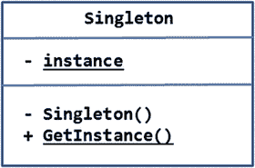
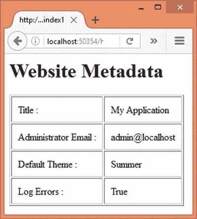
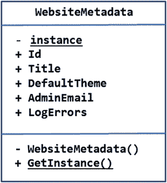
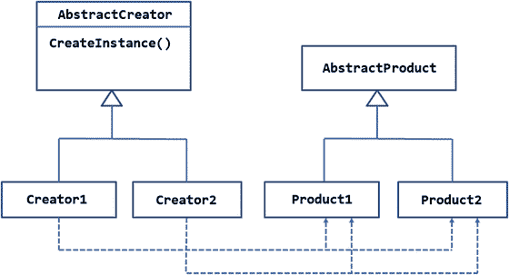
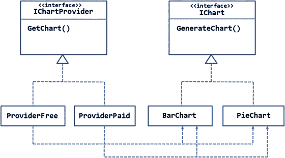
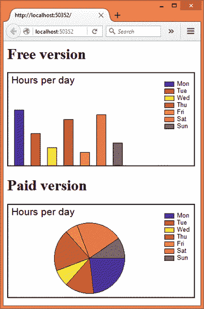
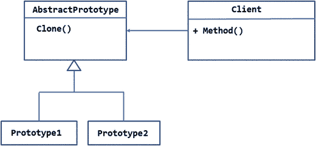
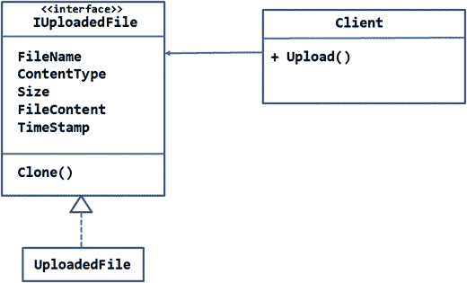
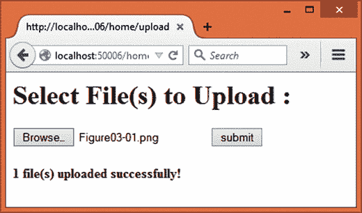

# 三、创建模式：单例、工厂方法和原型

四人帮(g of)模式分为三类:创造型、结构型和行为型。在这一章中，你将从剖析一些创建模式开始。顾名思义，创建模式是处理对象创建或对象实例化的设计模式。C# 语言使用 new 关键字实例化一个类的对象。通常，只要使用该对象，就会使用 new 关键字。但是，这意味着您必须在该位置指定一个具体的类型名。在某些真实的场景中，正如你将在本章和下一章学到的，有必要将对象实例化逻辑和代码与使用该对象的类隔离开来。这就是创建模式进入画面的地方。

GoF 目录中概括了总共五种创建模式。本章将讨论其中的三个，即单例、工厂方法和原型。剩下的两个，抽象工厂和构建器，将在下一章讨论。具体而言，本章将涵盖以下内容:

*   何时使用创建模式
*   单体、工厂方法和原型模式的目的和角色
*   这三种模式的 UML 结构和布局
*   一个概念验证示例，说明了这些模式的实现级细节

## 创造性设计模式概述

在 ASP.NET 应用中，创建一个类的对象是非常常见的需求。如果您正在开发一个有用的 web 应用，那么您很可能会利用框架定义的对象以及自定义类。在 C# 中，你创建一个这样的对象:

`Customer obj = new Customer();`

这里，您使用`new`关键字创建了一个`Customer`类的实例。大多数情况下，您在方法中编写类似前面一行的语句。例如，下面的代码显示了一个方法如何利用`new`关键字:

```cs
public class MyClass
{
    Public void DoWork()
    {
        Customer obj = new Customer();
        obj.CustomerID = "ABCD";
        obj.ProcessOrder();
    }
}

```

显示的代码由一个定义了`DoWork()`方法的类`MyClass`组成。假设`DoWork()`方法需要一个`Customer`对象来完成一些工作，因此它使用`new`关键字来实例化`Customer`。

尽管这种代码非常常见，但在某些情况下，对象实例化最好从主类中移除(在本例中为`MyClass`)。假设您正在构建一个需要向用户显示图形图表的 ASP.NET 应用。您创建了一个完成显示图表工作的类。如前所述，您还通过实例化这个类在您的 ASP.NET 应用中使用了它。

一段时间后，你的网络应用会分成两个版本:免费和付费。对于付费版本，您决定提供比免费版本更丰富的图表。你能感觉到问题吗？现在，您需要在实例化图表类时更改 ASP.NET 应用的代码。这是必要的，因为您的主代码负责创建 charting 类的实例。如果您可以将对象实例化的责任交给其他某个类，并简单地要求那个新类为您获取所需图表类的实例，这不是很好吗？在这种情况下，创建模式来拯救。

创建模式将对象实例化的逻辑与主类隔离开来。GoF 目录概述了五种创建模式，即单例、工厂方法、原型、抽象工厂和构建器。虽然本章只讨论了前三种，但是快速浏览一下每种模式的目的是值得的。

*   Singleton:确保只创建一个类的实例
*   工厂方法:创建几个类之一的实例
*   原型:创建一个类的实例，它是现有实例的副本或克隆
*   抽象工厂:创建相关类的族的实例
*   构建器:将对象构造与其表示分离

现在你已经有了一些关于创建模式的背景，让我们从剖析单例模式开始我们的讨论。

## 一个

通常，每当您需要一个类的实例时，您会使用`new`关键字并创建一个实例。这意味着每个`new`语句将创建一个类的新实例。你可以调用`new`五次，这样就会创建五个对象实例。如果你只想要一个，而且只有一个，类的实例呢？这就是单例模式出现的原因。

singleton 模式的目的是确保只创建一个类的实例。

实现 singleton 模式的类不仅确保只创建了一个实例，还提供了访问该实例的方法。所考虑的单个对象实例只有在第一次被请求时才会被创建。

当您处理资源密集型对象时，或者当要在多个地方传递和使用同一个对象实例时，单例模式非常有用。

### 设计和解释

单件模式的总体设计如图 [3-1](#Fig1) 所示。



图 3-1。

Design of the singleton pattern

图 3-1 显示了一个类`Singleton`，它实现了单例模式。该类声明了一个静态变量实例，其可见性是私有的。这样，外部世界就不能直接访问该实例。

注意，该类的构造函数是私有的。这意味着您不能使用`new`关键字实例化`Singleton`类。但是，您仍然可以从类内部实例化它。

`GetInstance()`是一个公共的静态方法，它将实例返回给调用者。因此，`GetInstance()`是实例的访问点。如果实例不存在，实例化`Singleton`是`GetInstance()`的工作，否则它返回一个现有的实例。

在图中，假设`Singleton`类不会被任何其他类继承。如果出于某种原因，你希望继承`Singleton`的遗产呢？如果是这样，您需要使其构造函数受到保护，而不是私有的。

Note

UML 显示静态成员的方式是给它们加下划线。因此，实例变量和`GetInstance()`方法在图 [3-1](#Fig1) 中以下划线显示。

### 例子

现在你知道什么是单例模式，让我们试着在 ASP.NET 应用中实现它。为了这个例子，让我们假设下面的场景:

你正在建立一个博客引擎。除了博客文章及其细节，还有一些适用于整个应用的数据和设置。这种数据可以称为 web 应用的元数据。例如，诸如联系人电子邮件、错误记录状态、主题和博客标题之类的细节在应用范围内都是适用的。尽管这些细节是应用范围内的，但是它们可能在很多地方都需要，比如布局页面、视图和组件。您可以只创建一次对象实例，然后在任何地方使用同一个实例，而不是在每个位置都创建一个对象实例。显然，这里可以使用单例模式。

在这个例子中，你将创建一个简单显示应用元数据的 ASP.NET 应用，如图 [3-2](#Fig2) 所示。



图 3-2。

View displaying application metadata

如您所见，该应用在一个表格中显示了网站元数据，如标题、管理员电子邮件、默认主题和错误日志设置。当然，您不会对这些元数据做任何事情。在更现实的情况下，您会在开发应用的各种功能时使用这些元数据，比如联系人表单或主题。

为了开始开发这个例子，使用 Visual Studio 创建一个新的 ASP.NET web 应用，并将其配置为使用 MVC 和实体框架(更多细节见第 [1](01.html) 章)。还将应用使用的数据库`SingletonDb`的数据库连接字符串存储在`appsettings.json`文件中。

然后在`Core`文件夹中添加一个`—` `WebsiteMetadata` `—`类，设计如清单 [3-1](#Par85) 所示。

```cs
[Table("WebsiteMetadata")]
public class WebsiteMetadata
{
    [DatabaseGenerated(DatabaseGeneratedOption.Identity)]
    public int Id { get; set; }
    [Required]
    [StringLength(100)]
    public string Title { get; set; }
    [Required]
    [StringLength(40)]
    public string DefaultTheme { get; set; }
    [Required]
    [StringLength(50)]
    public string AdminEmail { get; set; }
    [Required]
    public bool LogErrors { get; set; }
    private static WebsiteMetadata instance;
    private WebsiteMetadata()
    {
    }
    public static WebsiteMetadata GetInstance()
    {
        if(instance == null)
        {
            using (AppDbContext db = new AppDbContext())
            {
                if(db.Metadata.Count()==0)
                {
                    db.Metadata.Add(new WebsiteMetadata() { Title = "My Application", AdminEmail = "admin@localhost", DefaultTheme = "Summer", LogErrors = true });
                    db.SaveChanges();
                }
                instance = db.Metadata.SingleOrDefault();
            }
        }
        return instance;
    }
}

Listing 3-1.WebsiteMetadata Class

```

`WebsiteMetadata`类由五个公共属性`—Id`、`Title`、`DefaultTheme`、`AdminEmail`和`LogErrors—`组成，代表相应的信息片段。它们还装饰有数据注释，如`[Required]`和`[StringLength]`。注意，`[Table]`属性将`WebsiteMetadata`类映射到`WebsiteMetadata`表。对于我们的例子来说，这些部分是什么以及它们做什么是次要的。重要的是有一些元数据需要从多个地方访问。在这个例子中，`WebsiteMetadata`是实现单例模式的类。

然后，代码声明一个静态变量或`WebsiteMetadata`类的实例。在类型本身内部声明一个类型的变量可能听起来有点奇怪，但是这是 singleton 的一个重要部分。这个变量一旦被赋值，就会存储唯一的`WebsiteMetadata`实例。

接下来，代码定义了一个私有构造函数`WebsiteMetadata`，这样你就不能从外部实例化它。

静态方法是实例的访问点。`GetInstance()`方法首先检查实例是否被赋予了任何值。当您第一次运行应用时，显然实例值将为 null。如果实例值为 null，代码将连接数据库并检索元数据信息。这是使用`AppDbContext`，一个实体框架数据上下文类来完成的。注意，如果`WebsiteMetadata`表为空，代码会在数据库中插入一些默认值。如果您的表已经包含一些值(假设您手动将它们添加到数据库中)，那么您可以删除检查记录计数的`if`语句。`AppDbContext`类马上就要讨论了。

`SingleOrDefault()`方法返回`WebsiteMetadata`类的单个实例(记住在这个例子中`WebsiteMetadata`被用作一个实体)。您还可以创建一个新的`WebsiteMetadata`实例，并为其分配必要的值。然后将实例返回给调用者。UML 表示如图 [3-3](#Fig3) 所示。



图 3-3。

UML class diagram for WebsiteMetadata class

将此图与图 [3-1](#Fig1) 进行比较，并尝试联系您之前了解到的关于`WebsiteMetadata`级的内容。

Note

前面的代码没有使用关键字`new`创建`WebsiteMetadata`的实例，因为实体框架正在为我们创建它。我们简单地使用`SingleOrDefault()`方法获取创建的实例。但是从应用的角度来看，`WebsiteMetadata`是创建实例并在需要的地方提供它。这实际上是“创造的逻辑”,创建模式试图对应用的其余部分隐藏这一逻辑。

现在将`AppDbContext`类添加到`Core`文件夹中，并修改它，如清单 [3-2](#Par94) 所示。

```cs
public class AppDbContext : DbContext
{
    public DbSet<WebsiteMetadata> Metadata { get; set; }

    protected override void OnConfiguring(DbContextOptionsBuilder optionsBuilder)
    {
        optionsBuilder.UseSqlServer(AppSettings.ConnectionString);
    }
}

Listing 3-2.AppDbContext Class

```

`AppDbContext`类定义了一个保存`WebsiteMetadata`对象的`DbSet—Metadata—`。

被覆盖的`OnConfiguring()`方法使用`UseSqlServer()`方法设置要使用的 SQL Server 数据库。

接下来，将`HomeController`添加到`Controllers`文件夹中，并在其中编写`Index()`动作，如清单 [3-3](#Par106) 所示。

```cs
public IActionResult Index()
{
    WebsiteMetadata metadata = WebsiteMetadata.GetInstance();
    return View("Index",metadata);
}

Listing 3-3.Index() Action Using WebsiteMetadata Class

```

`Index()`动作调用`WebsiteMetadata`的`GetInstance()`静态方法，得到`WebsiteMetadata`的一个实例。这个实例作为模型传递给`Index`视图。

最后，将`Index`视图添加到`Views/Home`文件夹中，并在其中编写标记，如清单 [3-4](#Par113) 所示。

```cs
@model Singleton.Core.WebsiteMetadata

<html>
...
<body>
    <h1>Website Metadata</h1>
    <table border="1" cellpadding="10">
        <tr>
            <td>Title :</td>
            <td>@Model.Title</td>
        </tr>
        <tr>
            <td>Administrator Email :</td>
            <td>@Model.AdminEmail</td>
        </tr>
        <tr>
            <td>Default Theme :</td>
            <td>@Model.DefaultTheme</td>
        </tr>
        <tr>
            <td>Log Errors :</td>
            <td>@Model.LogErrors</td>
        </tr>
    </table>
</body>
</html>

Listing 3-4.Markup of Index View

```

`Index`视图简单地在一个表格中显示了`Title`、`AdminEmail`、`DefaultTheme`和`LogErrors`属性。

这就完成了应用。在运行应用之前，你需要创建`SingletonDb`数据库(更多细节见第 [1 章](01.html))。

一旦创建了数据库，在`GetInstance()`方法中设置一个断点并运行应用。您会发现在第一次运行`Index()`动作时，实例为空，因此您会看到块是否被执行。如果您在浏览器中刷新页面(或在另一个选项卡中打开它)，您会发现该实例在上次运行中已经存在，因此代码会简单地将现有实例返回给调用者。

## 工厂方法

有时，您会有一组执行类似操作的类，但是用于完成工作的确切类取决于某些逻辑或条件。在这种情况下，客户端不知道可用集合中的哪个类已经被实例化。客户端依赖其他一些类来为它提供所需的对象。这些其他类依次实现了所谓的工厂方法，它完成创建所需对象实例的工作。

顾名思义，工厂方法模式定义了一种创建对象的方式。子类决定实例化哪个类。这些子类如何决定实例化哪个类？这是特定于应用的，可能涉及一些编程逻辑或配置设置。

### 设计和解释

显示工厂方法模式总体设计的 UML 图如图 [3-4](#Fig4) 所示。



图 3-4。

Design of factory method pattern

图 [3-4](#Fig4) 显示了一个抽象类`AbstractCreator`，它定义了`CreateInstance()`方法。这是工厂方法的模板。`AbstractCreator`被两个子类`—Creator1`和`Creator2`继承。这些子类实现了`CreateInstance()`方法。

`CreateInstance()`的实现需要决定是实例化`Product1`还是`Product2`。`Product1`和`Product2`类是`AbstractProduct`类的子类。

实例化`Product1`或`Product2`的决定可能取决于一些应用逻辑、当前应用状态、一些条件或仅仅是配置设置。

客户端(图中未示出)可以消费`Creator1`或`Creator2`。在任一个上调用`CreateInstance()`将实例化`Product1`或`Product2`(取决于实例化逻辑)，并且该实例被提供给客户端。

### 例子

假设您正在构建一个 web 应用，它处理工作人员和他们在一项任务上花费的时间。作为系统要求的一部分，您需要以图形形式显示一周中每天的工作小时数。您的应用可以显示两种类型的图形图表`—`条形图或饼图。显示条形图还是饼图取决于用户的偏好。

考虑到这些需求，你想出了一个设计，如图 [3-5](#Fig5) 所示。



图 3-5。

GetChart() factory method returning a chart

该图显示了一个定义了`GenerateChart()`方法的`IChart`接口。`GenerateChart()`方法应该基于 X 和 Y 坐标值生成图表。`IChart`接口由两个类`—BarChart`和`PieChart`实现。

`IChartProvider`接口定义了工厂方法`GetChart()`。`GetChart()`方法应该根据用户的偏好返回`BarChart`或`PieChart`。

`IChartProvider`接口由两个类实现，`ProviderFree`和`ProviderPaid`。这些类实现了`GetChart()`工厂方法。

并不总是需要有多个实现`GetChart()`的类。只能有一个“创建者”实现`GetChart()`并返回`BarChart`或`PieChart`。然而，有时您可能需要多个“创建者”假设你有两种用户账户`—`,免费和付费。如果用户持有免费帐户，您希望使用`ProviderFree`来生成图表。如果用户持有付费账户，您需要使用`ProviderPaid`来生成图表。您可以创建`ProviderPaid`,以便它提供更丰富的数据表示，或者用奇特的效果呈现图表。

客户端可以使用`ProviderFree`或`ProviderPaid`来获取`IChart`对象。一旦接收到`IChart`对象，客户端就可以分配 X 和 Y 坐标值并生成图表。

现在您已经知道了工厂方法模式的用途，让我们在一个 ASP.NET 应用中实现前面的例子。您的应用将如图 [3-6](#Fig6) 所示。



图 3-6。

Using factory method pattern to display charts

正如您所看到的，应用显示了两个图表`—`,一个条形图在页面的顶部，一个饼图在页面的底部。条形图使用由`ChartProviderFree`类返回的`BarChart`对象呈现，饼图使用由`ChartProviderPaid`类返回的`PieChart`对象呈现。

首先使用 Visual Studio 创建一个新的 ASP.NET web 应用，并将其配置为使用 MVC(参见第 [1](01.html) 章了解更多细节)。添加对`System.Drawing`组件的引用。您将使用该程序集中的类来生成图表。同时从`Project.json`文件的框架部分删除`dnxcore50`条目。

然后将`IChart`接口添加到`Core`文件夹中，如清单 [3-5](#Par160) 所示进行修改。

```cs
public interface IChart
{
    string Title { get; set; }
    List<string> XData { get; set; }
    List<int> YData { get; set; }
    Bitmap GenerateChart();
}

Listing 3-5.IChart Interface

```

`IChart`接口定义了三个属性和一个方法。`Title`属性表示所考虑的图表的标题。`XData`和`YData`属性是分别代表 X 轴数据和 Y 轴数据的`List`对象。`XData`属性是一个字符串列表，因为 X 轴将显示一周中的日期(星期一、星期二等等。).属性是一个整数列表，因为 Y 轴将显示工作的小时数。`GenerateChart()`方法完成基于`Title`、`XData`和`YData`生成图表的工作，并将图表作为位图对象返回。

Note

确保在创建`IChart`、`BarChart`和`PieChart`类时导入`System.Drawing`名称空间。

现在，将`BarChart`类添加到`Core`文件夹中，并在其中编写清单 [3-6](#Par170) 中所示的代码。

```cs
public class BarChart:IChart
{
    public string Title { get; set; }
    public List<string> XData { get; set; }
    public List<int> YData { get; set; }

    public Bitmap GenerateChart()
    {
        var chartBitmap = new Bitmap(400, 200);
        var chartGraphics = Graphics.FromImage(chartBitmap);
        chartGraphics.Clear(Color.White);
        var titleFont = new Font("Arial", 16);
        var titleXY = new PointF(5, 5);
        chartGraphics.DrawString(Title, titleFont, Brushes.Black, titleXY);

        var spacing = 35;
        var scale = 10;
        for (var i = 0; i < YData.Count; i++)
        {
            var barBrush = new SolidBrush(ColorHelper.GetBrushColor(i));
            var barX = (i * spacing) + 15;
            var barY = 200 - (YData[i] * scale);
            var barWidth =20;
            var barHeight = (YData[i] * scale) + 5;
            chartGraphics.FillRectangle(barBrush, barX, barY, barWidth, barHeight);
            chartGraphics.DrawRectangle(Pens.Black, barX, barY, barWidth, barHeight);
        }

        var legendRect = new PointF(335, 20);
        var legendText = new PointF(360, 16);
        var legendFont = new Font("Arial", 10);
        for (var i = 0; i < XData.Count; i++)
        {
            var legendBrush = new SolidBrush(ColorHelper.GetBrushColor(i));
            chartGraphics.FillRectangle(legendBrush, legendRect.X, legendRect.Y, 20, 10);
            chartGraphics.DrawRectangle(Pens.Black, legendRect.X, legendRect.Y, 20, 10);
            chartGraphics.DrawString(XData[i], legendFont, Brushes.Black, legendText);
            legendRect.Y += 15;
            legendText.Y += 15;
        }

        var borderPen = new Pen(Color.Black, 2);
        var borderRect = new Rectangle(1, 1, 398, 198);
        chartGraphics.DrawRectangle(borderPen, borderRect);
        return chartBitmap;
    }
}

Listing 3-6.BarChart Class

```

`BarChart`类实现了`IChart`接口。这三个属性`—Title`、`XData`和`YData`非常简单。`BarChart`类的大脑就是`GenerateChart()`方法。这个方法使用来自`System.Drawing`名称空间的类来生成一个条形图。我们不会在这里深入这个方法的细节，因为这个方法的内部工作与工厂方法模式没有直接联系。只要说`GenerateChart()`将标题、图例和条形图呈现为`Bitmap`对象就足够了。将`Bitmap`对象返回给调用者。

接下来，将另一个类`PieChart`添加到`Core`文件夹中，并在其中编写清单 [3-7](#Par219) 中所示的代码。

```cs
public class PieChart : IChart
{
    public string Title { get; set; }
    public List<string> XData { get; set; }
    public List<int> YData { get; set; }

    public Bitmap GenerateChart()
    {
        var chartBitmap = new Bitmap(400, 200);
        var chartGraphics = Graphics.FromImage(chartBitmap);
        chartGraphics.Clear(Color.White);
        var titleFont = new Font("Arial", 16);
        var titleXY = new PointF(5, 5);
        chartGraphics.DrawString(Title, titleFont, Brushes.Black, titleXY);

        var totalAngle = (float)0;
        var sweepAngle = (float)0;
        var startAngle = (float)0;
        for (var i = 0; i < YData.Count; i++)
        {
            totalAngle = totalAngle + YData[i];
        }
        for (var i = 0; i < YData.Count; i++)
        {
            var pieBrush = new SolidBrush(ColorHelper.GetBrushColor(i));
            var pieX = 100;
            var pieY = 40;
            var pieWidth = 150;
            var pieHeight = 150;
            sweepAngle = YData[i] / totalAngle * 360;
            chartGraphics.FillPie(pieBrush, pieX, pieY, pieWidth,pieHeight, startAngle, sweepAngle);
            chartGraphics.DrawPie(Pens.Black, pieX, pieY, pieWidth, pieHeight, startAngle, sweepAngle);
            startAngle += sweepAngle;
        }

        var legendRect = new PointF(335, 20);
        var legendText = new PointF(360, 16);
        var legendFont = new Font("Arial", 10);
        for (int i = 0; i < XData.Count; i++)
        {
            var legendBrush = new SolidBrush(ColorHelper.GetBrushColor(i));
            chartGraphics.FillRectangle(legendBrush, legendRect.X, legendRect.Y, 20, 10);
            chartGraphics.DrawRectangle(Pens.Black, legendRect.X, legendRect.Y, 20, 10);
            chartGraphics.DrawString(XData[i], legendFont, Brushes.Black, legendText);
            legendRect.Y += 15;
            legendText.Y += 15;
        }

        var borderPen = new Pen(Color.Black, 2);
        var borderRect = new Rectangle(1, 1, 398, 198);
        chartGraphics.DrawRectangle(borderPen, borderRect);
        return chartBitmap;
    }
}

Listing 3-7.PieChart Class

```

`PieChart`类实现了`IChart`接口。除了`GenerateChart()`方法绘制饼状图而不是条形图之外，`PieChart`类与`BarChart`类非常相似。

Note

`BarChart`和`PieChart`类使用一个助手类— `ColorHelper`。`ColorHelper`类只是根据提供的数字返回一种颜色。为节省篇幅，`ColorHelper`在此未示。可以从本章的代码下载中抓取。

接下来，将`IChartProvider`接口添加到`Core`文件夹中，如清单 [3-8](#Par276) 所示。

```cs
public interface IChartProvider
{
    IChart GetChart();
}

Listing 3-8.IChartProvider Interface

```

`IChartProvider`接口包含一个返回`IChart`对象的方法`—GetChart()—`。`IChartProvider`接口由两个类实现，`ChartProviderFree`和`ChartProviderPaid`。这些类如清单 [3-9](#Par281) 所示。

```cs
public class ChartProviderFree:IChartProvider
{
    public IChart GetChart()
    {
        IChart chart = new BarChart();
        return chart;
    }
}

public class ChartProviderPaid : IChartProvider
{
    public IChart GetChart()
    {
        IChart chart = new PieChart();
        return chart;
    }
}

Listing 3-9.ChartProviderFree and ChartProviderPaid Classes

```

`ChartProviderFree`类实现了`GetChart()`方法。`GetChart()`实现向调用者返回一个`BarChart`的实例。`ChartProviderPaid`类 s 实现了`GetChart()`方法并返回了`PieChart`类的一个实例。在这个例子中，没有用于实例化`BarChart`和`PieChart`的特定逻辑或条件。但是，您可以将这样的逻辑添加到`GetChart()`方法中。然而，`GetChart()`方法充当工厂方法。

现在，将`HomeController`添加到`Controllers`文件夹中。在这个例子中，`HomeController`是`ChartProviderFree`和`ChartProviderPaid`类的客户端。除了`Index()`动作，再给它添加两个动作`—GetImageFree()`和`GetImagePaid()`。这些操作分别使用`ChartProviderFree`和`ChartProviderPaid`来生成图表。由于这两种方法非常相似，因此在清单 [3-10](#Par300) 中只显示了`GetImageFree()`。

```cs
public IActionResult GetImageFree()
{
    ChartProviderFree cp = new ChartProviderFree();
    IChart chart = cp.GetChart();

    chart.Title = "Hours per day";

    List<string> xdata = new List<string>();
    xdata.Add("Mon");
    xdata.Add("Tue");
    xdata.Add("Wed");
    xdata.Add("Thu");
    xdata.Add("Fri");
    xdata.Add("Sat");
    xdata.Add("Sun");

    List<int> ydata = new List<int>();
    ydata.Add(12);
    ydata.Add(7);
    ydata.Add(4);
    ydata.Add(10);
    ydata.Add(3);
    ydata.Add(11);
    ydata.Add(5);

    chart.XData = xdata;
    chart.YData = ydata;

    Bitmap bmp = chart.GenerateChart();
    MemoryStream stream = new MemoryStream();
    bmp.Save(stream, ImageFormat.Png);
    byte[] data = stream.ToArray();
    stream.Close();
    return File(data, "image/png");
}

Listing 3-10.GetImageFree() Action Method

```

从`Index`视图中调用`GetImageFree()`方法(稍后将对此进行讨论)。它使用`ChartProviderFree`类来获取`IChart`的一个实例(从`FactoryMethod.Core`名称空间)。回想一下`ChartProviderFree`的`GetChart()`方法返回一个`BarChart`。

然后，代码将图表的`Title`设置为`Hours per day`。然后`XData`和`YData`属性被赋值。在这种情况下，代码使用示例值，但是如果需要，您可以从数据库中获取它们。

一旦`Title`、`XData`和`YData`被赋予各自的值，就调用`GenerateChart()`方法来生成条形图。条形图作为一个`Bitmap`(来自`System.Drawing`名称空间)返回。为了在视图上显示这个`Bitmap`，代码将它保存到一个`MemoryStream`对象中(在`System.IO`名称空间中)。这是使用`Bitmap`类的`Save()`方法完成的。将`Bitmap`保存到`MemoryStream`时，使用`ImageFormat`类将图像格式设置为 PNG。然后使用`MemoryStream`的`ToArray()`方法以字节数组的形式检索`Bitmap`。

最后，通过使用`File()`方法并向其传递字节数组来构造一个`FileContentResult`对象。`File()`的第二个参数表示数据的内容类型(本例中为 image/png)。`FileContentResult`对象被发送到响应流。

虽然清单 [3-10](#Par300) 中没有显示，但是您需要按照类似的方式编写`GetImagePaid()`动作。`GetImageFree()`和`GetImagePaid()`唯一的区别就是`GetImagePaid()`用的是`ChartProviderPaid`而不是`ChartProviderFree`。除了这个区别，代码都是一样的。

现在，在`Views/Home`文件夹中添加一个`Index`视图，并将清单 [3-11](#Par341) 中所示的标记写入其中。

```cs
<html>
<head>
    <title></title>
</head>
<body>
    <h1>Free version</h1>
    

    <h1>Paid version</h1>
    

</body>
</html>

Listing 3-11.Markup of Index View

```

请注意粗体显示的行。标记由两个``元素组成。``元素的`src`属性分别指向`/Home/GetImageFree`和`/Home/GetImagePaid`。

这就完成了应用。在浏览器中运行应用，并检查条形图和饼图是否按预期显示。

## 原型

当你创建一个类的新对象时，对象实例通常是空的。类的属性和数据成员尚未初始化(除了它们的默认值或构造函数初始化)。虽然这是您在大多数情况下想要的，但有时您可能希望通过克隆现有对象来创建新对象。如果这是你的需要，原型模式是实现这种功能的方法。原型模式允许您通过克隆现有对象来创建对象。现有对象用作构建新对象的模板或原型。

为什么我们需要克隆对象？几个原因如下:

*   您可能希望将对象传递给其他模块进行处理，并且希望确保原始实例在处理过程中不会被意外篡改。
*   您可能想要对对象执行一些“预览”操作。你只是想感受一下对象在改变后的样子，但你不想真的改变对象。
*   新对象和现有对象可能非常匹配。因此，您可以克隆第一个实例，只修改几个不同的属性，然后按照您想要的方式使用新实例。
*   有时使用`new`关键字创建一个新实例可能会增加对象创建过程的开销。

### 设计和解释

原型模式的 UML 图如图 [3-7](#Fig7) 所示。



图 3-7。

Design of prototype pattern

如图所示，原型模式有一个抽象类或接口，它定义了克隆对象的方法。在图中，`Clone()`方法就是为此服务的。`Clone()`方法由子类`Prototype1`和`Prototype2`实现。

你可能意识到了。NET framework 在`System`名称空间中有一个`ICloneable`接口。这就是。NET 框架实现原型模式的方法。`ICloneable`接口定义了一个方法`—Clone()`。实现`ICloneable`的类需要实现这个方法。当然，你可以定义你自己的接口或者抽象类来做同样的事情。

克隆操作有两种类型`—`浅拷贝和深拷贝。在浅层复制的情况下，类的简单类型字段被复制到克隆的实例中。对于引用类型字段，只复制引用指针(不复制它们保存的值)。这意味着原始对象和克隆对象指向同一个引用。浅层复制可以使用`Object`基类的`MemberwiseClone()`方法来执行。NET 是从`Object`基类隐式继承的)。

在深度复制的情况下，简单和引用类型字段被复制到克隆的对象中。因此，原始对象和克隆对象获得引用类型字段的独立副本。深层复制可以通过定制序列化技术来执行(稍后将详细介绍)。

原型模式本身并不决定您应该创建一个对象的浅层副本还是深层副本。它是特定于应用的，作为开发人员，您需要决定使用哪种技术。

`Client`类利用了`AbstractPrototype`类及其子类。`Prototype1`和`Prototype2`的实例可以在自己身上调用`Clone()`方法来创建自己的克隆体。

### 例子

假设您正在构建一个允许用户向服务器上传文件的 web 应用。上传的文件保存在用户的账户中，用户可以随时下载。作为一种安全措施，您希望为这些文件实现自动备份功能。在此功能下，备份系统将创建上传文件的副本。

考虑到这些要求，您提出了如图 [3-8](#Fig8) 所示的设计。



图 3-8。

Backing up the uploaded files

正如您所看到的，`IUploadedFile`接口定义了五个属性——`FileName`、`ContentType`、`Size`、`FileContent`和`TimeStamp`——它们捕获了正在上传的文件的相应细节。而且，它定义了`Clone()`方法。`UploadedFile`类实现了`IUploadedFile`接口以及属性和方法。在本例中，`UploadedFile`使用`MemberwiseClone()`方法创建了自身的浅层副本。上传的文件可能非常大，执行深度复制可能会使服务器负担过重。因此，这个例子使用了浅层拷贝技术。`HomeController`作为一个客户端，调用`Clone()`方法来生成`UploadedFile`的两个副本——一个存储在用户帐户中，另一个提供给备份系统。为了简单起见，省略了文件存储的实际逻辑。

让我们通过开发一个 ASP.NET 应用来将这种设计付诸实施。应用的主页面如图 [3-9](#Fig9) 所示。



图 3-9。

Uploading files to the server

该应用由一个文件上传输入字段和一个按钮组成。用户可以使用文件上传字段选择一个或多个文件，然后单击提交按钮将文件上传到服务器。操作完成后，底部会显示一条成功消息。

首先使用 Visual Studio 创建一个新的 ASP.NET web 应用，并将其配置为使用 MVC(参见第 [1](01.html) 章了解更多细节)。然后在`Core`文件夹中添加`IFileUploaded`接口，并编写清单 [3-12](#Par373) 所示的代码。

```cs
public interface IUploadedFile
{
    string FileName { get; set; }
    long Size { get; set; }
    string ContentType { get; set; }
    DateTime TimeStamp { get; set; }
    byte[] FileContent { get; set; }

    IUploadedFile Clone();
}

Listing 3-12.
IUploadedFile Interface

```

`IUploadedFile`接口定义了五个属性和一个方法。所有的属性都是不言自明的。注意，`FileContent`属性是一个字节数组，因为文件的内容可以是文本或二进制。`Clone()`方法返回一个`IUploadedFile`对象。

然后添加一个`UploadedFile`类，并在其中实现`IUploadedFile`接口。清单 [3-13](#Par385) 显示了完整的`UploadedFile`类。

```cs
public class UploadedFile : IUploadedFile
{
    public string FileName { get; set; }
    public long Size { get; set; }
    public string ContentType { get; set; }
    public DateTime TimeStamp { get; set; }
    public byte[] FileContent { get; set; }

    public IUploadedFile Clone()
    {
        return (IUploadedFile)this.MemberwiseClone();
    }
}

Listing 3-13.
UploadedFile Class

```

在`UploadedFile`类中实现的`Clone()`方法使用`Object`基类的`MemberwiseClone()`方法，并将其返回给调用者。

接下来，将`HomeController`添加到`Controllers`文件夹，并将以下名称空间导入其中:

```cs
using Prototype.Core;
using Microsoft.AspNet.Http;
using Microsoft.Net.Http.Headers;
using System.IO;

```

`Microsoft.AspNet.Http`和`Microsoft.Net.Http.Headers`名称空间提供了一些在文件上传操作中需要的类。然后增加两个动作方法——`Index()`和`Upload()`。这些动作如清单 [3-14](#Par405) 所示。

```cs
public IActionResult Index()
{
    return View();
}

[HttpPost]
public IActionResult Upload(IList<IFormFile> files)
{
    foreach (var file in files)
    {
        ContentDispositionHeaderValue header = ContentDispositionHeaderValue.Parse(file.ContentDisposition);
        string fileName = header.FileName;
        fileName = fileName.Trim('"');
        fileName = Path.GetFileName(fileName);

        MemoryStream ms = new MemoryStream();
        Stream s = file.OpenReadStream();
        s.CopyTo(ms);
        byte[] data = ms.ToArray();
        s.Close();
        ms.Close();

        UploadedFile primaryObj = new UploadedFile();
        primaryObj.FileName = fileName;
        primaryObj.ContentType = file.ContentType;
        primaryObj.Size = file.Length;
        primaryObj.TimeStamp = DateTime.Now;
        primaryObj.FileContent = data;

        IUploadedFile backupObj = primaryObj.Clone();

        //send primaryObj to main system
        //send backupObj to backup system
    }
    ViewBag.Message = files.Count +  " file(s) uploaded successfully!";
    return View("Index");
}

Listing 3-14.Index() and Upload()

Actions

```

`Index()`动作只是返回一个`Index`视图(这将在后面讨论)。`Upload()`动作只有一个参数，它接收上传的文件作为`IFormFile`对象的`IList`。每个`IFormFile`对象提供了关于文件的更多细节，比如`ContentDisposition`、`ContentType`和`Length`。

一个`foreach`循环遍历文件列表。每个文件的名称都是从`ContentDisposition`头中提取的。文件名包含客户端路径，因此我们只需使用`GetFileName()`方法获取文件名和扩展名。

`UploadedFile`类期望文件内容是一个字节数组。代码创建一个新的`MemoryStream`来存储文件的内容。然后它调用`OpenReadStream()`方法来获得底层`Stream`对象的句柄。获得的`Stream`被复制到`MemoryStream`对象。最后，使用`MemoryStream`的`ToArray()`方法以字节数组的形式获取文件内容。然后关闭溪流。

然后代码继续创建一个`UploadedFile`对象并设置它的所有属性。`primaryObj`旨在由主系统(处理用户账户的系统)使用。为了将文件细节传递给备份系统，代码使用`Clone()`方法创建了另一个名为`backupObj`的实例。为了简单起见，省略了存储文件的实际逻辑。最后，使用`ViewBag`将成功消息传递给视图。

接下来，将一个`Index`视图添加到`Views/Home`文件夹中，并将清单 [3-15](#Par447) 中所示的标记写入其中。

```cs
<html>
<head>
    <title></title>
</head>
<body>

    <h1>Select File(s) to Upload :</h1>
    <form action="/home/upload" method="post" enctype="multipart/form-data">
        <input type="file" name="files" id="files" multiple />
        <input type="submit" value="Submit" />
    </form>

    <h4>@ViewBag.Message</h4>

</body>
</html>

Listing 3-15.Markup of Index View

```

`Index`视图由一个`<form>`组成，其`action`属性被设置为`/home/upload`，而`enctype`属性被设置为`multipart/form-data`。这样，文件在提交时将被`POST`转换成`Upload()`动作。

在视图内部，有一个文件输入域和一个提交按钮。来自 ViewBag 的成功消息显示在表单下方。

这就完成了应用。在`Upload()`动作中设置断点。运行它并检查`primaryObj`是否像预期的那样被克隆到`backupObj`中。

#### 实施深层拷贝

在前面的示例中，您使用了浅层复制技术来克隆对象。如果您需要实现深度复制技术，该怎么办？让我们讨论一种技术，如果您需要深层复制一个对象，可以使用这种技术。这种技术要求所考虑的类(在本例中为`UploadedFile`)是可序列化的。因此，您需要在`UploadedFile`类的顶部添加`[Serializable]`属性，如下所示:

```cs
[Serializable]
public class UploadedFile : IUploadedFile
{
  ...
}

```

看看清单 [3-16](#Par473) 中显示的代码。

```cs
public IUploadedFile DeepCopy()
{
    if (!this.GetType().IsSerializable)
        throw new Exception("The object is not serializable!");

    BinaryFormatter formatter = new BinaryFormatter();
    MemoryStream ms = new MemoryStream();
    formatter.Serialize(ms, this);
    ms.Seek(0, SeekOrigin.Begin);
    IUploadedFile deepcopy = (IUploadedFile)formatter.Deserialize(ms);
    ms.Close();
    return deepcopy;
}

Listing 3-16.Deep Copy of UploadedFile Object

```

`DeepCopy()`方法首先检查被深度复制的对象是否可序列化。这是必要的，因为代码使用来自`System.Runtime.Serialization.Formatters.Binary`名称空间的`BinaryFormatter`类将对象序列化为`MemoryStream`。如果对象不可序列化，则会引发异常。否则，创建新的`BinaryFormatter`和新的`MemoryStream`。`BinaryFormatter`的`Serialize()`方法用于将对象序列化到`MemoryStream`中；这样，就创建了对象的独立副本。为了读回这个复制的对象，使用了`BinaryFormatter()`的`Deserialize()`方法。`MemoryStream`关闭，克隆的对象返回给调用者。

要创建一个`UploadedFile`对象的深层副本，你现在可以使用`DeepCopy()`方法:

```cs
IUploadedFile backupObj = primaryObj.DeepCopy();

```

## 摘要

创建模式处理对象创建。本章讨论了单例模式、工厂方法和原型模式。singleton 模式用于确保只创建一个类的实例。工厂方法模式允许您基于一些逻辑创建许多子类的实例。原型模式允许您通过克隆现有对象来创建对象实例。

你一定已经注意到，在实现设计模式时，你经常使用一个或多个可靠的原则(比如 SRP 或 OCP)。因此，SOLID 原则和设计模式携手并进。

下一章将介绍剩下的两种创建模式:抽象工厂和构建器。