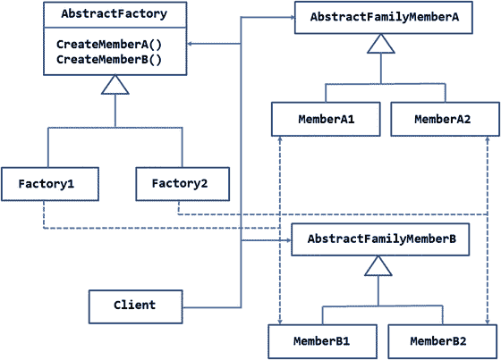
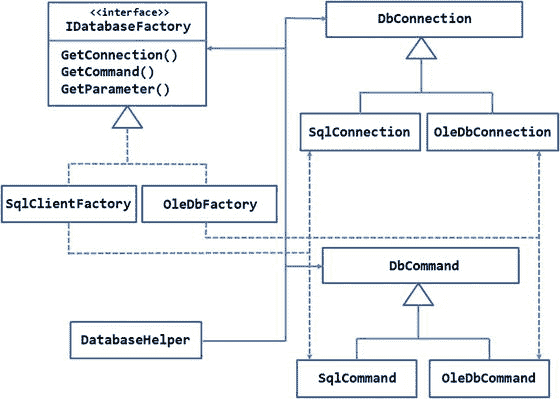
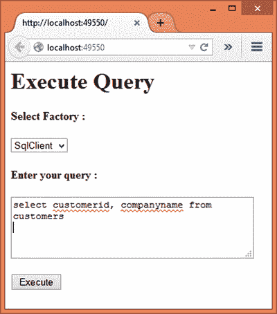
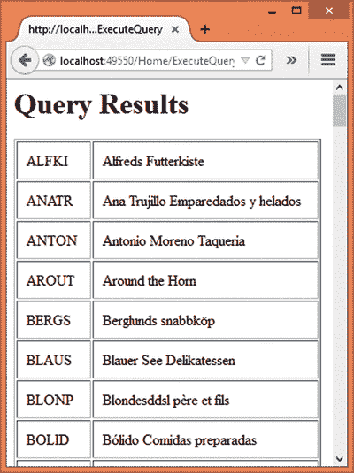
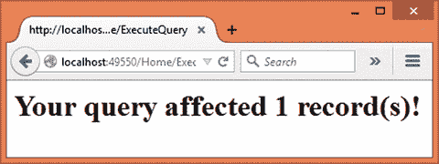
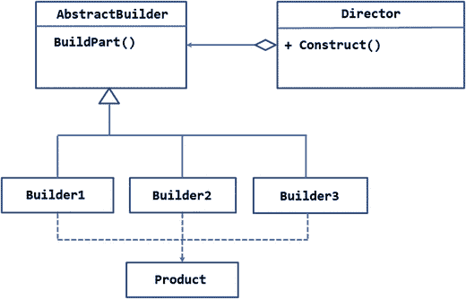
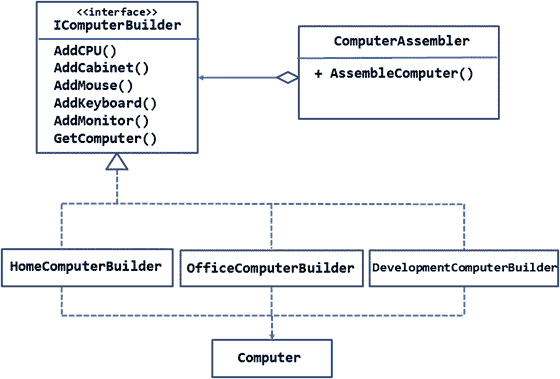
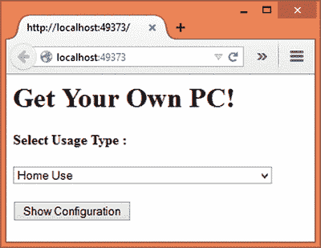
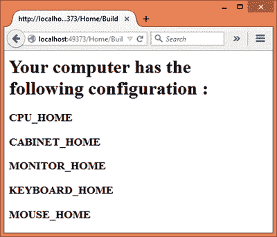

# 四、创建模式：抽象工厂和构建器

在前一章中，你学习了五种创建模式中的三种。本章将讨论剩下的两种创建模式，即抽象工厂和构建器。

当你希望实例化一个类时，前一章讨论的工厂方法模式就派上了用场。但是，有时您需要创建一系列相关的对象。这就是抽象工厂模式出现的原因。

对象在本质上可能是复杂的。有时，您需要创建复杂的对象，这样整个创建过程是相同的，但最终创建的对象会根据需求而变化。在这种情况下，可以有效地使用构建器模式。

本章将涵盖以下内容:

*   抽象工厂和构建器模式的目的和作用
*   这两种模式的 UML 结构和布局
*   每种模式都有一个概念验证示例，说明了这些模式的实现级细节
*   存储出厂设置的几种方法

## 抽象工厂

前一章讨论的工厂方法模式允许客户端在不指定类名的情况下获取一个对象。工厂方法的工作是创建预期类的对象并将其返回给客户端。抽象工厂模式进一步扩展了这一点，允许您创建相关对象的系列。对象系列是通常一起使用的一组对象，或者是在某些方面相互依赖的一组对象。

与工厂方法模式一样，实例化特定对象族的决定可能取决于一些配置设置、业务逻辑或编程条件。

### 设计和解释

图 [4-1](#Fig1) 中的 UML 图展示了抽象工厂模式的总体设计。



图 4-1。

Design of abstract factory pattern

正如您在 UML 图中看到的，有两个系列。第一个家庭由两个家庭成员组成— `MemberA1`和`MemberB1`。类似地，第二个家庭由两个家庭成员组成— `MemberA2`和`MemberB2`。

家庭成员本身分别继承自`AbstractFamilyMemberA`和`AbstractFamilyMemberB`。

有一个抽象类叫做`AbstractFactory`。这个类以两种方法的形式提供了创建对象族的整体接口— `CreateMemberA()`和`CreateMemberB()`。

`AbstractFactory`的方法由两个具体的工厂实现，即`Factory1`和`Factory2\. Factory1`创建属于第一个家族的对象——`MemberA1`和`MemberB1`。类似地，`Factory2`创建属于第二个家族的对象— `MemberA2`和`MemberB2`。

客户端类使用`Factory1`或`Factory2`(取决于一些特定于应用的逻辑)并接收相应的家族成员。客户代码中从不使用具体的家庭成员名称(`MemberA1`、`MemberB1`、`MemberA2`、`MemberB2`)；相反，它分别使用它们的抽象类型— `AbstractFamilyMemberA`和`AbstractFamilyMemberB`。这样，无论使用哪个工厂，客户端代码都保持不变。

### 例子

让我们尝试将抽象工厂模式应用到现实世界的情况中。假设您正在构建一个将被不同客户使用的 web 应用。您的首选数据库是 SQL Server，但是您希望确保使用其他流行数据库引擎的客户不会被排除在外。因此，您的 web 应用的数据访问层应该能够与 SQL Server 数据库或任何其他 OLEDB 兼容的数据库一起工作。因此，为了数据库连接和查询，您决定使用 ADO.NET 数据提供程序。

考虑到这些要求，你提出了如图 [4-2](#Fig2) 所示的设计。



图 4-2。

Creating a database helper using the abstract factory pattern

那个。NET 框架附带了两个 ADO.NET 数据提供者— `SqlClient`和`OleDb`。这些提供者由诸如`connection`、`command`、`parameter`和`data reader`的对象组成。正如您可能已经猜到的，来自这两个数据提供者的对象构成了相关对象的系列。因此，`SqlConnection`、`SqlCommand`、`SqlParameter`和`SqlDataReader`是`SqlClient`家族的成员。`OleDbConnection`、`OleDbCommand`、`OleDbParameter`和`OleDbDataReader`是`OleDb`家族的成员。注意，为了减少混乱，图中只显示了两个家庭成员。

在内部，列出的家族成员继承了位于`System.Data.Common`名称空间中的某些基类。例如，`SqlConnection`和`OleDbConnection`类继承自`DbConnection`基类。`SqlCommand`和`OleDbCommand`类继承自`DbCommand`基类，依此类推。

Note

在本例中，构成系列的类作为。NET 框架本身。因此，您的应用不需要创建任何这样的家族成员类。但是，在其他情况下，您可能会自己创建创建族的类。

接口`IDatabaseFactory`定义了创建工厂的接口，由三种方法组成，分别是`GetConnection()`、`GetCommand()`和`GetParameter()`。请注意，数据读取器总是由命令返回，因此没有单独的方法来创建数据读取器。`IDatabaseFactory`由两个具体的工厂类实现— `SqlClientFactory`和`OleDbFactory`。

`SqlClientFactory`负责创建`SqlClient`家族的成员，而`OleDbFactory`负责创建`OleDb`家族的成员。

`DatabaseHelper`类代表应用的数据访问层，它是工厂和对象族的客户机。`DatabaseHelper`类不依赖于特定的具体工厂或特定的家族；相反，它依赖于它们的抽象——分别是`IDatabaseFactory`、`DbConnection`、`DbCommand`和`DbParameter`。

现在你知道这个例子应该做什么了，让我们把这些细节放到一个 ASP.NET 应用中。图 [4-3](#Fig3) 显示了 web 应用的主页面。



图 4-3。

Application that uses DatabaseHelper

正如您所看到的，应用的主页包含一个下拉列表，用于选择要使用的工厂。它有两个选项，`SqlClient`和`OleDb`，代表对应的工厂。

有一个用于输入 SQL 语句的文本区域。SQL 语句可以是查询(`SELECT`)或动作(`INSERT` / `UPDATE` / `DELETE`)。单击 Execute 按钮对`Northwind`数据库执行查询。如果查询是一个`SELECT`查询，那么查询返回的记录会显示在一个表格中，如图 [4-4](#Fig4) 所示。



图 4-4。

Displaying results of a SELECT query

但是，如果执行一个动作查询，则显示受影响的记录数，如图 [4-5](#Fig5) 所示。



图 4-5。

Displaying number of records affected by an action query

要开发这个应用，首先使用 Visual Studio 创建一个新的 ASP.NET web 应用，并将其配置为使用 MVC(参见第 [1](01.html) 章了解更多细节)。还将`Northwind`数据库的连接字符串存储在`appsettings.json`文件中，并将其加载到`AppSettings`类中。

在`Core`文件夹中添加`IDatabaseFactory`接口，并将清单 [4-1](#Par31) 所示的代码写入其中。

```cs
public interface IDatabaseFactory
{
    DbConnection GetConnection();
    DbCommand GetCommand();
    DbParameter GetParameter();
}

Listing 4-1.IDatabaseHelper Interface

```

如您所见，`IDatabaseFactory`接口定义了三种方法— `GetConnection()`、`GetCommand()`和`GetParameter()`。这些方法分别返回`DbConnection`、`DbCommand`和`DbParameter`。因此，确保导入`System.Data.Common`名称空间。

然后添加第一个工厂类——`SqlClientFactory`——并在其中编写清单 [4-2](#Par32) 所示的代码。

```cs
public class SqlClientFactory:IDatabaseFactory
{
    public DbConnection GetConnection()
    {
        return new SqlConnection();
    }

    public DbCommand GetCommand()
    {
        return new SqlCommand();
    }

    public DbParameter GetParameter()
    {
        return new SqlParameter();
    }
}

Listing 4-2.
SqlClientFactory Class

```

`SqlClientFactory`类实现了`IDatabaseFactory`。这三个方法`GetConnection()`、`GetCommand()`和`GetParameter()`分别返回`SqlConnection`、`SqlCommand`和`SqlParameter`的新实例。这些类驻留在`System.Data.SqlClient`名称空间中，所以确保将其导入到您的类文件中。`SqlClientFactory`负责创建`SqlClient`家族的家族成员。

现在向`Core`文件夹添加一个`OleDbFactory`类，并在其中编写清单 [4-3](#Par33) 所示的代码。

```cs
public class OleDbFactory : IDatabaseFactory
{
    public DbConnection GetConnection()
    {
        return new OleDbConnection();
    }

    public DbCommand GetCommand()
    {
        return new OleDbCommand();
    }

    public DbParameter GetParameter()
    {
        return new OleDbParameter();
    }
}

Listing 4-3.OleDbFactory Class

```

`OleDbFactory`类也实现了`IDatabaseFactory`。这三个方法`GetConnection()`、`GetCommand()`和`GetParameter()`分别返回一个新的`OleDbConnection`、`OleDbCommand`和`OleDbParameter`实例。这些类驻留在`System.Data.OleDb`名称空间中，所以确保将其导入到您的类文件中。`OleDbFactory`负责创建`OleDb`家族的家族成员。

接下来，将`DatabaseHelper`类添加到`Core`文件夹中。该类充当工厂的客户端，并通过其构造函数接收工厂。如清单 [4-4](#Par34) 所示。

```cs
public class DatabaseHelper
{
    private IDatabaseFactory factory;
    public DatabaseHelper(IDatabaseFactory factory)
    {
        this.factory = factory;
    }
    ...
    ...
}

Listing 4-4.Receiving a Factory in the DatabaseHelper

```

`DatabaseHelper`构造函数接收一个类型为`IDatabaseFactory`的参数。该参数存储在工厂私有变量中。

`DatabaseHelper`类有四个方法——两个`ExecuteSelect()`方法的重载和两个`ExecuteAction()`方法的重载。第一组方法用于执行`SELECT`查询，而第二组方法用于执行动作查询。`ExecuteSelect()`的过载如清单 [4-5](#Par35) 所示。

```cs
public DbDataReader ExecuteSelect(string query)
{
    DbConnection cnn = factory.GetConnection();
    cnn.ConnectionString = AppSettings.ConnectionString;
    DbCommand cmd = factory.GetCommand();
    cmd.Connection = cnn;
    cmd.CommandType = CommandType.Text;
    cmd.CommandText = query;
    cnn.Open();
    return cmd.ExecuteReader(CommandBehavior.CloseConnection);
}

public DbDataReader ExecuteSelect(string query,DbParameter[] parameters)
{
    DbConnection cnn = factory.GetConnection();
    cnn.ConnectionString = AppSettings.ConnectionString;
    DbCommand cmd = factory.GetCommand();
    cmd.Connection = cnn;
    cmd.CommandType = CommandType.Text;
    cmd.CommandText = query;
    cmd.Parameters.AddRange(parameters);
    cnn.Open();
    return cmd.ExecuteReader(CommandBehavior.CloseConnection);
}

Listing 4-5.Overloads of the ExecuteSelect() Method

```

第一个重载`ExecuteSelect()`接受一个查询，而第二个重载接受一个查询和一个数组`DbParameter`对象。通过这种方式，您可以执行不带参数和带参数的`SELECT`查询。

在内部，代码调用工厂的`GetConnection()`方法来检索一个`DbConnection`对象(确保导入了`System.Data`和`System.Data.Common`名称空间)。根据传入构造函数的工厂，这将是一个`SqlConnection`对象或一个`OleDbConnection`对象。然后将`DbConnection`的`ConnectionString`属性从`AppSettings`设置为`ConnectionString`。

然后调用`GetCommand()`方法来获取`DbCommand`的实例。同样，根据工厂的不同，这可能是`SqlCommand`或`OleDbCommand`。

然后将`DbCommand`对象的`Connection`、`CommandType`和`CommandText`属性设置为相应的值。

最后，使用`Open()`方法打开连接，使用`ExecuteReader()`方法执行查询。注意，`CommandBehavior`枚举的`CloseConnection`值被传递给了`ExecuteReader()`方法，因此关闭数据读取器也会关闭底层连接。`ExecuteReader()`方法返回一个`DbDataReader`对象，该对象被返回给调用者。

`ExecuteSelect()`的第二个重载和第一个很像。唯一的区别是它将提供的`DbParameter`对象添加到`DbCommand`对象的`Parameters`集合中。这是使用`Parameters`集合的`AddRange()`方法完成的。

清单 [4-6](#Par36) 中显示了`ExecuteAction()`的两种重载。

```cs
public int ExecuteAction(string query)
{
    DbConnection cnn = factory.GetConnection();
    cnn.ConnectionString = AppSettings.ConnectionString;
    DbCommand cmd = factory.GetCommand();
    cmd.Connection = cnn;
    cmd.CommandType = CommandType.Text;
    cmd.CommandText = query;
    cnn.Open();
    int i = cmd.ExecuteNonQuery();
    cnn.Close();
    return i;
}

public int ExecuteAction(string query,DbParameter[] parameters)
{
    DbConnection cnn = factory.GetConnection();
    cnn.ConnectionString = AppSettings.ConnectionString;
    DbCommand cmd = factory.GetCommand();
    cmd.Connection = cnn;
    cmd.CommandType = CommandType.Text;
    cmd.CommandText = query;
    cmd.Parameters.AddRange(parameters);
    cnn.Open();
    int i = cmd.ExecuteNonQuery();
    cnn.Close();
    return i;
}

Listing 4-6.Overloads of ExecuteAction( )

```

我们不会详细讨论这些方法，因为它们与`ExecuteSelect()`重载非常相似。`ExecuteAction()`重载旨在执行动作查询，因此它们在`DbCommand`对象上调用`ExecuteNonQuery()`方法。这两种方法都返回一个整数，指示受查询影响的记录数。

Note

在构建成熟的数据访问组件时，您可能还需要考虑其他可能性，例如执行标量查询或执行存储过程。为了简单起见，我们不会在这里讨论所有这些可能性。

接下来，将`HomeController`类添加到`Controllers`文件夹中。`HomeController`将有两个动作——`Index()`和`ExecuteQuery()`。`Index()`动作只是返回`Index`视图，而`ExecuteQuery()`动作是在单击`Index`视图中的执行按钮时调用的(参见前面的应用截图)。这些动作如清单 [4-7](#Par39) 所示。

```cs
public IActionResult Index()
{
    return View();
}

[HttpPost]
public IActionResult ExecuteQuery(string factorytype,string query)
{
    IDatabaseFactory factory = null;
    if (factorytype == "sqlclient")
    {
        factory = new SqlClientFactory();
    }
    else
    {
        factory = new OleDbFactory();
    }
    DatabaseHelper helper = new DatabaseHelper(factory);
    query = query.ToLower();
    if(query.StartsWith("select"))
    {
        DbDataReader reader = helper.ExecuteSelect(query);
        return View("ShowTable", reader);
    }
    else
    {
        int i = helper.ExecuteAction(query);
        return View("ShowResult", i);
    }
}

Listing 4-7.Actions of HomeController

```

`ExecuteQuery()`动作接收两个参数— `factorytype`和`query`。这些参数分别是下拉列表中的选择和文本区域中输入的查询。

在内部，代码检查`factorytype`值，并相应地创建一个`SqlClientFactory`或`OleDbFactory`对象。注意，工厂变量的类型是`IDatabaseFactory`。

Note

该示例接受来自用户的 SQL 查询并执行它们，而不执行任何验证。这可能有几个安全隐患，在实际应用中应该避免。这里，为了简单起见，我们使用它。

然后通过将工厂传递给构造函数来实例化`DatabaseHelper`类。

如果查询以“select”开始，那么代码假设它是一个`SELECT`语句，并且通过将查询传递给它来调用`DatabaseHelper`的`ExecuteSelect()`方法。为了显示查询获取的数据，`DbDataReader`对象被传递给`ShowTable`视图。

如果查询是一个动作查询，那么代码通过传递查询来调用`DatabaseHelper`的`ExecuteAction()`方法。为了显示受查询影响的记录数量，`ExecuteAction()`的返回值被传递给`ShowResult`视图。

接下来，将一个`Index`视图添加到`Views/Home`文件夹中，并将清单 [4-8](#Par40) 中所示的标记写入其中。

```cs
<html>
<head>
    <title></title>
</head>
<body>
    <h1>Execute Query</h1>
    <form asp-controller="Home" asp-action="ExecuteQuery" method="post">
        <h4>Select Factory :</h4>
        <select name="factorytype">
            <option value="sqlclient">SqlClient</option>
            <option value="oledb">OleDb</option>
        </select>
        <h4>Enter your query :</h4>
        <textarea name="query" rows="4" cols="40"></textarea>
        <br /><br />
        <input type="submit" value="Execute" />
    </form>
</body>
</html>

Listing 4-8.Markup of Index View

```

`Index`视图使用一个表单标签助手来呈现一个提交给`HomeController`的`ExecuteQuery`动作的表单。`factorytype`下拉列表包含`SqlClient`和`OleDb`两个选项，代表对应的工厂。查询文本区域允许您输入查询，执行按钮提交表单。

现在将一个`ShowTable`视图添加到`Views/Home`文件夹中，并将清单 [4-9](#Par41) 中所示的标记写入其中。

```cs
@model System.Data.Common.DbDataReader

<html>
<head>
    <title></title>
</head>
<body>
    <h1>Query Results</h1>

    <table border="1" cellpadding="10">
        @while (Model.Read())
        {
            <tr>
                @for(int i=0;i<Model.FieldCount;i++)
                {
                    <td>@Model.GetString(i)</td>
                }
           </tr>
        }
        @{
            Model.Close();
        }
    </table>

</body>
</html>

Listing 4-9.Markup of ShowTable View

```

`@model`指令将视图的模型设置为`DbDataReader`。在视图的主体中，通过从`DbDataReader`读取数据来呈现一个表格。这是使用`Read()`方法和`@white`模块完成的。由于查询获取的列在开发时是未知的，因此一个`for`循环遍历`DbDataReader`的所有列，并相应地呈现表格单元格。代码假设列只包含字符串数据，并使用`GetString()`方法检索列内容。

最后，`DbDataReader`通过调用它的`Close()`方法被关闭。

Note

由于这只是一个概念验证应用，我们简单地将`DbDataReader`传递给视图。在更真实的情况下，您可以将所有数据从`DbDataReader`抓取到控制器的数据结构中，并将数据传递给视图，而不是数据读取器。

现在，将一个`ShowResult`视图添加到`Views/Home`文件夹中，并将清单 [4-10](#Par42) 中所示的标记写入其中。

```cs
<html>
<head>
    <title></title>
</head>
<body>
    <h1>Your query affected @Model record(s)!</h1>
</body>
</html>

Listing 4-10.Markup of ShowResult View

```

这种标记非常简单。它只是通过输出`Model`值(本例中是一个整数)向用户显示受操作查询影响的记录数。

这就完成了应用。运行应用，并通过切换工厂来查看它是否按预期工作。

## 存储出厂设置

在您刚刚完成的示例中，您从下拉列表中选择了要使用的工厂。在前一章演示工厂方法模式的例子中使用了类似的技术。虽然这对于演示来说是可以的，但在更现实的情况下，要使用的工厂将通过其他方式来决定。一些可能性是:

*   一些业务逻辑将决定使用哪个工厂。
*   您可以在配置文件中存储要使用的工厂，然后从那里为您的代码选择设置。
*   您可以在配置文件中存储要实例化的工厂类的类名，然后使用。NET 反射来实例化它。

第一种方法是特定于应用和以代码为中心的。那么，让我们看看如何使用其他两种方法。

### 在配置文件中存储工厂名称

在这种技术中，您将工厂名称存储在配置文件中，而不是下拉列表中。然后，您的代码读取这些设置，并相应地实例化一个工厂。

打开刚刚完成的例子的`appsettings.json`文件，按照清单 [4-11](#Par43) 进行修改。

```cs
{
  "Data": {
    "DefaultConnection": {
      "ConnectionString": "Server=.;Database=Northwind;Trusted_Connection=True;"
    }
  },

  "AppSettings": {

    "Factory": "sqlclient"

  }

}

Listing 4-11.Storing Factory Name in Configuration File

```

注意粗体显示的代码。它创建了一个带有关键字`Factory`的`AppSettings`部分。这个键的值为`sqlclient`，表示您希望实例化`SqlClientFactory`类。如果您希望使用`OleDbFactory`，您需要将此设置更改为`oledb`。

接下来，打开`Startup`类，编写代码用刚才讨论的设置填充`AppSettings`类(参见第 [1](01.html) 章了解更多)。我们不会在这里详细讨论这些代码，但是它看起来像这样:

```cs
public Startup(IHostingEnvironment env, IApplicationEnvironment appEnv)
{
  ...

  AppSettings.ConnectionString = config.Get<string>("Data:DefaultConnection:ConnectionString");

  AppSettings.Factory = config.Get <string>("AppSettings:Factory");

}

```

最后，将清单 [4-12](#Par44) 中的`HomeController`动作改为`ExecuteQuery()`动作。

```cs
public IActionResult ExecuteQuery(string query)
{
    IDatabaseFactory factory = null;
    string factorytype = AppSettings.Factory;

    if (factorytype == "sqlclient")

    {

        factory = new SqlClientFactory();

    }

    else

    {

        factory = new OleDbFactory();

    }

    DatabaseHelper helper = new DatabaseHelper(factory);
    ...
    ...
}

Listing 4-12.Modified ExecuteQuery() Action

```

如您所见，代码现在检查存储在配置文件而不是下拉列表中的工厂设置，并实例化一个工厂。工厂然后被传递给`DatabaseHelper`。

### 在配置文件中存储工厂类型名称

在前面的技术中，虽然您将工厂设置存储在配置类型中，但是您仍然需要`if`块来检查设置并实例化工厂类型。如果您希望完全避免这种检查，可以求助于。NET 反射和`Activator`类。

修改`appsettings.json`文件，如清单 [4-13](#Par45) 所示。

```cs
{
  "Data": {
    "DefaultConnection": {
      "ConnectionString": "Server=.;Database=Northwind;Trusted_Connection=True;"
    }
  },

  "AppSettings": {

    "FactoryType": "AbstractFactory.Core.SqlClientFactory"

  }

}

Listing 4-13.Storing Factory Class Name in Configuration File

```

如您所见，这次您将工厂类的完全限定类型名存储在`FactoryType`键中。然后修改您的`ExecuteQuery()`方法，如清单 [4-14](#Par46) 所示。

```cs
public IActionResult ExecuteQueryReflection(string query)
{
    IDatabaseFactory factory = null;
    string factorytype = AppSettings.FactoryType;
    ObjectHandle o = Activator.CreateInstance(Assembly.GetExecutingAssembly().FullName, factorytype);

    factory = (IDatabaseFactory)o.Unwrap();

    DatabaseHelper helper = new DatabaseHelper(factory);
    ...
    ...
}

Listing 4-14.Using Activator.CreateInstance()

to Instantiate Factory

```

代码假设配置文件中的`FactoryType`键被加载到`AppSettings`类的`FactoryType`属性中。粗体显示的代码使用了`Activator`类的`CreateInstance()`方法。`CreateInstance()`方法有两个参数。第一个参数是包含工厂类型的`Assembly` ( `System.Reflection`名称空间)。在这个例子中，工厂是 web 应用本身的一部分，因此代码使用`GetExecutingAssembly()`方法传递当前的程序集。第二个参数是要实例化的完全限定类型名。该参数来自配置文件。

`CreateInstance()`方法返回一个`ObjectHandle` ( `System.Runtime.Remoting`名称空间)。为了获得实际的工厂实例，代码调用了`ObjectHandle`上的`Unwrap()`方法。工厂然后被传递到`DatabaseHelper`。

## 建设者

有时，正在构建的对象本质上是复杂的。它可能包括其他几种类型。此外，系统中可能需要多个这样的复杂对象。因此，您最终会创建复杂的对象，这些对象具有不同的表示，但构造方式相似。构建器模式允许您将对象的构造过程与其表示分离开来。正在考虑的构建过程可以用来创建不同的表示。

一个对象的表示意味着它的整体结构和组成部分。正在构建的复杂对象由一个或多个部分的集合来表示。

### 设计和解释

构建器模式的 UML 图如图 [4-6](#Fig6) 所示。



图 4-6。

Design of builder pattern

如图所示，以`AbstractBuilder`类的形式存在一个构建器的抽象。这个类定义了`BuildPart()`方法，该方法应该创建所考虑的复杂对象的一部分。

`AbstractBuilder`由三个构建者继承— `Builder1`、`Builder2`和`Builder3`。每个构建器类都实现了`BuildPart()`。因此，每个具体的构建器类负责创建分配给它构建的部分。所有三个构建器类的构建过程最终到达一个完成的`Product`。`Product`是构建器构建的复杂对象。因此，根据所使用的构建器，最终的`Product`将由`Builder1`、`Builder2`或`Builder3`添加零件。

构建`Product`的过程是由一个通常称为`Director`的类来安排的。因此，`Director`类通过它的`Construct()`方法启动了`Product`构造过程。

Note

`Director`和`AbstractBuilder`通过一条线连接，该线具有朝向`Director`侧的空心菱形和朝向`AbstractBuilder`侧的箭头。空心菱形表示`Director`正在聚合由构建器创建的部件。

### 例子

假设你正在为一家销售组装个人电脑的公司建立一个网站。他们希望最终用户从三种 PC 类型中进行选择，即家用计算机、办公计算机和开发计算机。家用电脑包含适合家庭和学生使用的部件。显然这些零件比其他类型的便宜。办公室电脑是打算在办公室里使用的。就其功率、容量和美观而言，其部件适合办公环境。最后，开发计算机是供软件开发人员、图形设计人员等使用的。显然，这样的计算机在处理能力和存储容量方面会相当丰富。

最终用户选择这些型号中的一个，并在确认后，网站通过聚集各种部件(如 CPU、机箱、显示器、键盘和鼠标)来“组装”计算机。图 [4-7](#Fig7) 显示了这些需求如何适应构建器模式。



图 4-7。

Building a computer by aggregating its parts

如您所见，`IComputerBuilder`接口定义了所有六种方法，即`AddCPU()`、`AddCabinet()`、`AddMouse()`、`AddKeyboard()`、`AddMonitor()`和`GetComputer()`。前五种方法将相应的部件添加到计算机中，而`GetComputer()`方法返回一台完成的计算机。`IComputerBuilder`接口由三个构建器实现— `HomeComputerBuilder`、`OfficeComputerBuilder`和`DevelopmentComputerBuilder`。因此，根据用于构建计算机的构建者，计算机的部件会有所不同。

`ComputerAssembler`类就是`director`。它指示计算机通过它的`AssembleComputer()`方法来构造。`AssembleComputer()`方法调用构建器方法，如`AddCPU()`和`AddKeyboard()`。因此，构建过程是由`ComputerAssembler`类定义的。然后`AssembleComputer()`返回完成的计算机。

这个例子的用户界面是一个页面，如图 [4-8](#Fig8) 所示。



图 4-8。

Assembling a computer by selecting usage type

该页面由一个下拉列表组成，允许您选择三种使用类型之一，即家庭使用、办公使用和开发使用。选择使用类型后，您可以单击显示配置按钮。这样就组装了一台电脑，并显示了其中使用的零件列表，如图 [4-9](#Fig9) 所示。



图 4-9。

Showing a computer’s configuration

当然，为了便于测试，该示例使用了示例零件代号，但是您可以添加更具描述性和更有意义的零件代号。

为了开发这个例子，首先使用 Visual Studio 创建一个新的 ASP.NET web 应用，并将其配置为使用 MVC 和实体框架(参见第 [1](01.html) 章了解更多细节)。

然后在`Core`文件夹中添加一个`ComputerPart`类，并在其中编写清单 [4-15](#Par60) 所示的代码。

```cs
[Table("ComputerParts")]
public class ComputerPart
{
    [DatabaseGenerated(DatabaseGeneratedOption.Identity)]
    public int Id { get; set; }
    [Required]
    [StringLength(20)]
    public string UseType { get; set; }
    [Required]
    [StringLength(20)]
    public string Part { get; set; }
    [Required]
    [StringLength(50)]
    public string PartCode { get; set; }
}

Listing 4-15.ComputerPart Model Class

```

`ComputerPart`类有四个属性— `Id`、`UseType`、`Part`和`PartCode`。`UseType`属性表示使用类型，如`HOME`、`OFFICE`或`DEV`。`Part`属性指定零件名称，如`CPU`或`KEYBOARD`。`PartCode`属性保存零件的零件代码。请注意，`ComputerPart`类被映射到了`ComputerParts`表。

清单 [4-16](#Par47) 中显示了使用`ComputerPart`类的应用`DbContext`。

```cs
public class AppDbContext : DbContext
{
    public DbSet<ComputerPart> ComputerParts { get; set; }
    protected override void OnConfiguring(DbContextOptionsBuilder optionsBuilder)
    {
        optionsBuilder.UseSqlServer(AppSettings.ConnectionString);
    }
}

Listing 4-16.DbContext of the Application

```

`AppDbContext`类定义了一个单独的`DbSet` — `ComputerParts`。被覆盖的`OnConfiguring()`方法通过利用`UseSqlServer()`方法设置要使用的 SQL Server 数据库。

现在，将`Computer`类添加到`Core`文件夹中。`Computer`类代表完成的计算机，如清单 [4-17](#Par49) 所示。

```cs
public class Computer
{
    public List<ComputerPart> Parts { get; set; }
}

Listing 4-17.Computer Class

```

`Computer`类仅仅包含一个`ComputerPart`对象的列表。

现在，在`Core`文件夹中添加一个`IComputerBuilder`接口，并在其中编写清单 [4-18](#Par50) 所示的代码。

```cs
public interface IComputerBuilder
{
    void AddCPU();
    void AddCabinet();
    void AddMouse();
    void AddKeyboard();
    void AddMonitor();
    Computer GetComputer();
}

Listing 4-18.
IComputerBuilder Interface

```

如前所述,`IComputerBuilder`接口由六个方法组成。注意`GetComputer()`返回一个`Computer`，而其他方法无效。

接下来，将一个`HomeComputerBuilder`类添加到`Core`文件夹中。`HomeComputerBuilder`类实现了`IComputerBuilder`，如清单 [4-19](#Par51) 所示。

```cs
public class HomeComputerBuilder:IComputerBuilder
{
    private Computer computer;

    public HomeComputerBuilder()
    {
        computer = new Computer();
        computer.Parts = new List<ComputerPart>();
    }

    public void AddCPU()
    {
        using (AppDbContext db = new AppDbContext())
        {
            var query = from p in db.ComputerParts
                        where p.UseType == "HOME" && p.Part == "CPU"
                        select p;
            computer.Parts.Add(query.SingleOrDefault());
        }
    }

    public void AddCabinet()
    {
        using (AppDbContext db = new AppDbContext())
        {
            var query = from p in db.ComputerParts
                        where p.UseType == "HOME" && p.Part == "CABINET"
                        select p;
            computer.Parts.Add(query.SingleOrDefault());
        }
    }

    public void AddMouse()
    {
        using (AppDbContext db = new AppDbContext())
        {
            var query = from p in db.ComputerParts
                        where p.UseType == "HOME" && p.Part == "MOUSE"
                        select p;
            computer.Parts.Add(query.SingleOrDefault());
        }
    }

    public void AddKeyboard()
    {
        using (AppDbContext db = new AppDbContext())
        {
            var query = from p in db.ComputerParts
                        where p.UseType == "HOME" && p.Part == "KEYBOARD"
                        select p;
            computer.Parts.Add(query.SingleOrDefault());
        }
    }

    public void AddMonitor()
    {
        using (AppDbContext db = new AppDbContext())
        {
            var query = from p in db.ComputerParts
                        where p.UseType == "HOME" && p.Part == "MONITOR"
                        select p;
            computer.Parts.Add(query.SingleOrDefault());
        }
    }

    public Computer GetComputer()
    {
        return computer;
    }
}

Listing 4-19.HomeComputerBuilder Class

```

`HomeComputerBuilder`类声明了一个类型为`Computer`的字段，它保存了对成品计算机的引用。构造函数简单地初始化了`Computer`类和它的`Parts`集合。

`AddCPU()`方法获取`HOME`用法类型的`PartCode`，并将其添加到`Computer`对象的`Parts`集合中。其他的`AddXXXX()`方法完全相同，因此为了节省空间，这里不再讨论。

最后，`GetComputer()`方法将`Computer`对象返回给调用者。

刚才你创建了一个`HomeComputerBuilder`类。按照同样的方式添加`OfficeComputerBuilder`和`DevelopmentComputerBuilder`类。为了节省篇幅，这里不讨论它们。您也可以从本书的代码下载中获得它们。

接下来，将一个`ComputerAssembler`类添加到`Core`文件夹中。`ComputerAssembler`级是`Director`，如清单 [4-20](#Par52) 所示。

```cs
public class ComputerAssembler
{
    private IComputerBuilder builder;

    public ComputerAssembler(IComputerBuilder builder)
    {
        this.builder = builder;
    }

    public Computer AssembleComputer()
    {
        builder.AddCPU();
        builder.AddCabinet();
        builder.AddMonitor();
        builder.AddKeyboard();
        builder.AddMouse();

        return builder.GetComputer();
    }
}

Listing 4-20.ComputerAssembler Class

```

`ComputerAssembler`类有一个类型为`IComputerBuilder`的成员。该变量在构造函数中赋值。因为构造函数接受类型为`IComputerBuilder`的参数，所以您可以传递`HomeComputerBuilder`、`OfficeComputerBuilder`或`DevelopmentComputerBuilder`——或任何其他实现`IComputerBuilder`的类。

`AssembleComputer()`方法调用构建器上的方法，比如`AddCPU()`和`AddKeyboard()`。一旦添加了所有的部分，通过调用`GetComputer()`方法检索完成的`Computer`，然后返回给调用者。

现在让我们继续讨论控制器和应用所需的视图。将`HomeController`添加到`Controllers`文件夹中，并在其中编写两个动作，如清单 [4-21](#Par53) 所示。

```cs
public IActionResult Index()
{
    return View();
}

public IActionResult Build(string usagetype)
{
    IComputerBuilder builder = null;
    switch(usagetype)
    {
        case "home":
            builder = new HomeComputerBuilder();
            break;
        case "office":
            builder = new OfficeComputerBuilder();
            break;
        case "development":
            builder = new DevelopmentComputerBuilder();
            break;
    }
    ComputerAssembler assembler = new ComputerAssembler(builder);
    Computer computer = assembler.AssembleComputer();
    return View("Success", computer);
}

Listing 4-21.Build Action Uses ComputerAssembler

```

`Index()`动作只是返回`Index`视图。来自`Index`视图的表单提交给`Build()`动作。`Build()`动作接收到`usagetype`。switch 语句检查`usagetype`，并相应地实例化实现`IComputerBuilder`的三个类中的一个。

然后通过将构建器传递给它的构造函数来创建一个`ComputerAssembler`。调用`ComputerAssembler`的`AssembleComputer()`方法来组装计算机。由`AssembleComputer()`方法返回的成品`Computer`作为模型传递给`Success`视图。

现在将一个`Index`视图添加到`Views/Home`文件夹中，并将清单 [4-22](#Par54) 中所示的标记写入其中。

```cs
<html>
<head>
    <title></title>
</head>
<body>
    <h1>Get Your Own PC!</h1>
    <form asp-controller="Home" asp-action="Build" method="post">
        <h4>Select Usage Type :</h4>
        <select name="usagetype">
            <option value="home">Home Use</option>
            <option value="office">Office Use</option>
            <option value="development">Software Development and Graphic Designing</option>
        </select>
        <br /><br />
        <input type="submit" value="Show Configuration" />
    </form>
</body>
</html>

Listing 4-22.Markup of Index View

```

`Index`视图使用一个表单标签助手来呈现一个提交给`HomeController`的`Build`动作的表单。该表单由一个下拉列表组成，其中包含三个 usagetype 值— `home`、`office`和`development`。显示配置按钮将表单提交给`Build()`动作。

然后在`Views/Home`文件夹中添加一个`Success`视图，并将清单 [4-23](#Par55) 中所示的标记写入其中。

```cs
@model Builder.Core.Computer
<html>
<head>
    <title>Success</title>
</head>
<body>
    <h1>Your computer has the following configuration :</h1>
    @foreach(var item in Model.Parts)
    {
        <h3>@item.PartCode</h3>
    }
</body>
</html>

Listing 4-23.Markup of Success View

```

`@model`指令将视图的模型设置为`Computer`。视图的主要部分由一个`foreach`循环组成，该循环遍历`Model`的`Parts`集合。每次迭代都将`PartCode`输出到页面上。

这就完成了应用。在运行应用之前，您需要创建`BuilderDb`数据库(参见第 [1 章](01.html)了解更多信息)。一旦创建了数据库和表，就为每个计算机部件添加一些记录(参见您之前编写的查询)。

现在运行应用，看看是否为各种使用类型显示了正确的配置。`the Director`类能以不同的方式调用构建过程吗？为什么不呢？例如，如果你想让用户选择除显示器之外的所有部件，那么`Director`类可能不会调用`AddMonitor()`方法。此外，对象的构造顺序由`Director`类根据应用的需求决定。

## 摘要

本章涵盖了剩下的两种创建模式，即抽象工厂和构建器。正如你所看到的，这两种模式比其他三种创建模式稍微复杂一些。

当您希望创建一系列相关或依赖对象时，抽象工厂非常有用。这与工厂方法模式不同，在工厂方法模式中，您关心的是只实例化一个类而不是一个族。

构建器模式允许您将正在构建的对象和构建它的过程分开。这样，您可以使用相同的过程来构建具有不同表示的对象。构建器模式依赖于一个`Director`类来调用对象创建的过程。

创建模式处理对象创建，您关心的是如何实例化一个正在考虑的对象。结构模式，下一章的主题，处理整体结构和不同类之间的关系。