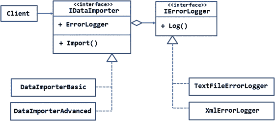
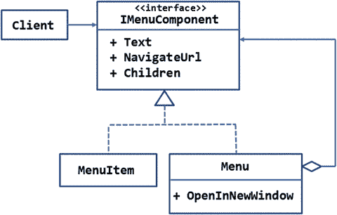

# 五、结构模式：适配器、桥接、组合和装饰

结构模式处理系统中类之间的安排和关系。他们关注于类和对象是如何组成的，从而形成更大更复杂的结构。显然，结构模式需要考虑组成系统的所有类。

这一类别中有七种模式:适配器、桥、组合、装饰、外观、flyweight 和代理。本章将讨论前四个，下一章将讨论剩下的三个。具体而言，本章将包括以下内容:

*   结构模式概述
*   适配器、桥、组合和装饰模式的目的
*   每种模式的 UML 表示
*   每个模式的概念证明示例，说明如何使用该模式

## 结构模式概述

如前所述，结构模式关心的是类之间的安排和关系。结构化模式完成的一些任务包括:

*   控制并授予对对象的访问权限
*   将一个类的调用映射到另一个具有不同设计的类
*   向现有对象添加新功能或特性
*   利用少量的对象来服务大量的请求
*   简化对复杂子系统的访问

在设计新的应用或修改现有的应用时，可以使用结构化模式。一些结构模式，比如 adapter，通常在扩展现有系统时使用。总共有七种结构模式。为了便于理解它们的用途，这里列出了它们:

*   适配器:匹配否则不兼容的类的接口
*   桥接:将抽象与实现分离
*   组合:允许你以统一的方式创建树形结构来处理条目
*   Decorator:在没有继承的情况下动态地向对象添加特性或功能
*   外观:提供了访问复杂子系统的简化方法
*   Flyweight:通过共享现有的实例为大量的对象请求提供服务
*   代理:为另一个对象提供一个占位符，以便控制对它的访问

在这七者中，适配器、桥、组合和装饰器将在本章中讨论。外观、享元和代理将是下一章的主题。

## 适配器

有时你会使用一个类(比如，`ClassA`)来构建一个应用。这个类有自己的设计(属性和方法)，其余的代码都是针对这个设计的。在应用的扩展过程中，你需要使用另一个类(比如说，`ClassB`)来代替`ClassA`。然而，`ClassB`的设计往往与`ClassA`不同。这种不匹配可能有许多原因。例如，`ClassB`可能是由第三方系统提供的，或者可能是为一个完全不同的系统开发的，现在您的应用想要使用它，等等。如何处理这种不兼容的类？一个显而易见的方法是在所有使用`ClassA`的地方进行修改，这样代码现在使用`ClassB`。正如您可能已经猜到的，这可能意味着大量的返工和测试。

在这种情况下，适配器模式可以派上用场。它允许您处理具有不兼容设计的类。适配器将一个类的接口转换成客户端应用所期望的另一个接口。因此，继续前面的例子，适配器将把接口`ClassB`映射到接口`ClassA`。这样，所需的更改会少很多。虽然这听起来像是东拼西凑，但是适配器允许我们使用由于接口不匹配而无法使用的类。

适配器的一个真实例子是移动充电器，它将电压从较高值(比如 230 V AC)转换为较低值(比如 5 V DV)。这两个接口不能一起使用，但移动充电器中的适配器使这成为可能。

### 设计和解释

适配器图案的总体设计如图 [5-1](#Fig1) 所示。


图 5-1。

UML diagram illustrating the adapter pattern

客户端被设计为使用一个或多个具有接口`ITarget`的类。`ITarget`接口有一个由客户端在其代码中使用的方法——`Operation()`。因此，客户端的代码中会有如下调用:

```cs
ITarget obj = new OriginalTarget();
obj.Operation();

```

这里，`OriginalTarget`(图中未显示)是依附于`ITarget`的类。现在，在应用的扩展过程中，`Adaptee`类出现了。`Adaptee`级将取代`OriginalTarget`级。但是`Adaptee`有`SomeOperation()`的方法。显然，为了使用`Adaptee`类及其`SomeOperation()`方法，刚才显示的两行代码需要修改为。

为了简化更改，使用了适配器类。适配器类实现了`ITarget`接口。它还实现了`Operation()`方法。适配器类创建了一个`Adaptee`类的实例。适配器的`Operation()`方法简单地调用`Adaptee`的`SomeOperation()`方法。要编写像这样使用适配器的代码:

```cs
ITarget obj = new Adapter();
obj.Operation();

```

正如您所看到的，`OriginalTarget`可以很容易地被 adapter 替换，因此对代码的改动很小。

### 例子

现在您已经知道了适配器模式的作用，让我们将这些知识应用到现实世界的场景中。

假设您开发了一个以条形图形式显示信息的网站。在开发应用时，您创建了自己的图表组件，而不是使用第三方组件。发布之后，web 应用变得非常流行，您现在希望用更丰富的第三方图表组件替换您的图表组件。但是，第三方图表组件和您的图表组件的设计是不同的。为了最大限度地减少更改，您决定创建一个适配器，将旧接口映射到新接口。图 [5-2](#Fig2) 显示了系统中所涉及的类的总体布局。


图 5-2。

Adapter for mapping charting components

该应用由一个`IChart`界面组成。`IChart`接口由三个属性(`Title`、`XData`、`YData`)和一个方法(`GenerateChart()`)组成。

最初，您创建了`MyChartGenerator`类，它实现了`IChart`接口。因此，应用的原始版本到处都使用`MyChartGenerator`。在本例中，控制器充当`IChart`的客户端。

`ThirdPartyChartGenerator`是代表第三方图表组件的类。如您所见，`ThirdPartyChartGenerator`只有一个方法`DrawChart()`，它接受标题、x 轴数据和 y 轴数据。

由于`MyChartGenerator`和`ThirdPartyChartGenerator`的接口不兼容，因此需要一个适配器。在这个例子中，`MyChartAdapter`类就是这样一个适配器。`MyChartAdapter`类实现了`IChart`接口，使其设计符合最初的要求。`MyChartAdapter`类中`GenerateChart()`的实现将调用转发给`ThirdPartyChartGenerator`的`DrawChart()`方法。

让我们继续将这些细节放入 ASP.NET 应用中。您将开发的应用的主页如图 [5-3](#Fig3) 所示。


图 5-3。

Application adapting third-party charting component

该应用显示了两个图表——顶部的图表使用了`MyChartGenerator`类，底部的图表使用了`ThirdPartyChartGenerator`类。为了区分这两个图表，`MyChartGenerator`呈现一个条形图，而`ThirdPartyChartGenerator`呈现一个饼图。

要开发这个应用，首先使用 Visual Studio 创建一个新的 ASP.NET web 应用，并将其配置为使用 MVC(参见第 [1](01.html) 章了解更多细节)。

然后，将`IChart`接口添加到`Core`文件夹中，并在其中编写代码，如清单 [5-1](#Par44) 所示。

```cs
public interface IChart
{
    string Title { get; set; }
    List<string> XData { get; set; }
    List<int> YData { get; set; }
    Bitmap GenerateChart();
}

Listing 5-1.IChart Interface

```

`IChart`接口由三个属性和一个方法组成。Title 属性表示图表上呈现的标题。`XData`和`YData`属性分别代表 x 轴数据和 y 轴数据。在本例中，x 轴代表工作日，y 轴代表特定一天的工作小时数。`GenerateChart()`方法呈现一个条形图，并将图表作为一个`Bitmap`对象返回。

Note

因为这个例子使用了`System.Drawing`类，所以确保引用了`System.Drawing`程序集。另外，从`Project.json`文件的框架部分删除`dnxcore50`条目。

接下来，添加`MyChartGenerator`类并在其中实现`IChart`接口。清单 [5-2](#Par54) 展示了`MyChartGenerator`的骨架。

```cs
public class MyChartGenerator : IChart
{
    public string Title { get; set; }
    public List<string> XData { get; set; }
    public List<int> YData { get; set; }

    public Bitmap GenerateChart()
    {
        ...
        ...
        return chartBitmap;
    }
}

Listing 5-2.
MyChartGenerator Class

```

`MyChartGenerator`实现了`Title`、`XData`和`YData`属性。`GenerateChart()`方法基于`XData`和`YData`值呈现一个条形图。这里没有给出`GenerateChart()`的完整代码，因为它与您在第 [3](03.html) 章讨论工厂方法模式时使用的条形图生成代码非常相似。只要说`GenerateChart()`方法使用来自`System.Drawing`的类来呈现条形图就足够了。代表图表的`Bitmap`对象被返回给调用者。

现在，将`ThirdPartyChartGenerator`类添加到`Core`文件夹中。清单 [5-3](#Par70) 显示了这个类的框架代码。

```cs
public class ThirdPartyChartGenerator
{

    public Bitmap DrawChart(string title,List<string> xData, List<int> yData)
    {
        ...
        ...
        return chartBitmap;
    }
}

Listing 5-3.
ThirdPartyChartGenerator Class

```

`ThirdPartyChartGenerator`有一个接受三个参数的`DrawChart()`方法——title、xData 和 yData。在内部，它使用`System.Drawing`类来呈现一个饼状图。结果`Bitmap`被返回给调用者。这里没有显示`DrawChart()`的实现，因为它与你在第 [3](03.html) 章中使用的饼状图生成代码非常相似。

Note

为了节省时间，您可以从本书的代码下载中获取这个示例的源代码。

接下来，将`MyChartAdapter`类添加到`Core`文件夹中，并在其中编写清单 [5-4](#Par83) 中所示的代码。

```cs
public class MyChartAdapter : IChart
{
    public string Title { get; set; }
    public List<string> XData { get; set; }
    public List<int> YData { get; set; }

    public Bitmap GenerateChart()
    {
        ThirdPartyChartGenerator chart = new ThirdPartyChartGenerator();
        return chart.DrawChart(Title, XData, YData);
    }
}

Listing 5-4.
MyChartAdapter Class

```

`MyChartAdapter`类实现了`IChart`接口。注意它是如何适应`ThirdPartyChartGenerator`的。`GenerateChart()`方法创建了一个`ThirdPartyChartGenerator`的实例，并在其上调用`DrawChart()`。`Title`、`XData`和`YData`属性分别作为 title、xData 和 yData 参数的值传递。将`DrawChart()`方法返回的`Bitmap`返回给`GenerateChart()`的调用者。

现在，将`HomeController`添加到`Controllers`文件夹中。除了`Index()`动作之外，`HomeController`还有两个动作——一个是使用`MyChartGenerator`呈现图表，另一个是使用`MyChartAdapter`呈现图表。使用`MyChartGenerator`的动作如清单 [5-5](#Par97) 所示。

```cs
public IActionResult GetImageOwnComponent()
{

    IChart chart = new MyChartGenerator();

    chart.Title = "Hours per day";

    List<string> xdata = new List<string>();
    xdata.Add("Mon");
    xdata.Add("Tue");
    xdata.Add("Wed");
    xdata.Add("Thu");
    xdata.Add("Fri");
    xdata.Add("Sat");
    xdata.Add("Sun");

    List<int> ydata = new List<int>();
    ydata.Add(12);
    ydata.Add(7);
    ydata.Add(4);
    ydata.Add(10);
    ydata.Add(3);
    ydata.Add(11);
    ydata.Add(5);

    chart.XData = xdata;
    chart.YData = ydata;
    Bitmap bmp = chart.GenerateChart();

    MemoryStream stream = new MemoryStream();
    bmp.Save(stream, ImageFormat.Png);
    byte[] data = stream.ToArray();
    stream.Close();
    return File(data, "image/png");
}

Listing 5-5.Action That Uses MyChartGenerator

```

`GetImageOwnComponent()`动作实例化`MyChartGenerator`类，设置其`Title`、`XData`和`YData`属性，然后调用`GenerateChart()`方法。

使用`Save()`方法将`Bitmap`保存在`MemoryStream`上(确保导入`Adapter.Core`、`System.Drawing`、`System.Drawing.Imaging`和`System.IO`名称空间)。`MemoryStream`的内容以字节数组的形式获得，并使用`File()`方法返回给响应流。

第二个动作`GetImageThirdPartyComponent()`，如清单 [5-6](#Par133) 所示。

```cs
public IActionResult GetImageThirdPartyComponent()
{

    IChart chart = new MyChartAdapter();

    chart.Title = "Hours per day";

    List<string> xdata = new List<string>();
    xdata.Add("Mon");
    xdata.Add("Tue");
    xdata.Add("Wed");
    xdata.Add("Thu");
    xdata.Add("Fri");
    xdata.Add("Sat");
    xdata.Add("Sun");

    List<int> ydata = new List<int>();
    ydata.Add(12);
    ydata.Add(7);
    ydata.Add(4);
    ydata.Add(10);
    ydata.Add(3);
    ydata.Add(11);
    ydata.Add(5);

    chart.XData = xdata;
    chart.YData = ydata;
    Bitmap bmp = chart.GenerateChart();

    MemoryStream stream = new MemoryStream();
    bmp.Save(stream, ImageFormat.Png);
    byte[] data = stream.ToArray();
    stream.Close();
    return File(data, "image/png");
}

Listing 5-6.Action That Uses MyChartAdapter

```

如您所见，`MyChartGenerator`现在被替换为`MyChartAdapter`。回想一下，`MyChartAdapter`的`GenerateChart()`方法实际上调用了`ThirdPartyChartGenerator`的`DrawChart() method`。剩下的代码与前面的操作非常相似。

接下来，将一个`Index`视图添加到`Views/Home`文件夹中，并将清单 [5-7](#Par168) 中所示的标记写入其中。

```cs
<html>
<head>
    <title></title>
</head>
<body>
    <h1>Original Component</h1>
    
    <h1>Third-party Component</h1>
    
</body>
</html>

Listing 5-7.Markup of Index View

```

`Index`视图由两个``元素组成——一个指向`GetImageOwnComponent()`动作，另一个指向`GetImageThirdPartyComponent()`动作。这样，这些操作返回的图像文件内容在浏览器中显示为图像。

这就完成了应用。运行应用并检查它是否按预期工作。

### 对象适配器与类适配器

在前面的例子中，`MyChartAdapter`类如何适应`ThirdPartyChartGenerator`？`GenerateChart()`方法创建一个`ThirdPartyChartGenerator`对象，然后调用它的`DrawChart()`方法。因为适配器类使用适配器的对象，所以这种类型的适配器称为对象适配器。

对于适配器来说，还有一种方法可以完成这项工作。`MyChartAdapter`类可以实现`IChart`接口，也可以从`ThirdPartyChartGenerator`类继承。然后`GenerateChart()`方法可以调用`DrawChart()`方法，如清单 [5-8](#Par183) 所示。

```cs
public class MyChartAdapter : ThirdPartyChartGenerator, IChart
{
    public string Title { get; set; }
    public List<string> XData { get; set; }
    public List<int> YData { get; set; }

    public Bitmap GenerateChart()

    {

        return this.DrawChart(Title, XData, YData);

    }

}

Listing 5-8.Class Adapter

```

由于`MyChartAdapter`现在继承了`ThirdPartyChartGenerator`，所以不需要实例化`ThirdPartyChartGenerator`。`GenerateChart()`方法可以简单地调用基类的`DrawChart()`方法。这种类型的适配器称为类适配器。

## 桥

一个复杂的系统由几个类组成。这样的系统经常在一段时间内发展，导致软件的多个版本。重要的是要确保使用系统原始版本的客户端在发布新版本时不会破坏或改变其行为。换句话说，系统必须保持它们的整体接口不变，即使它们的实现方式在不同的版本中发生了变化。桥模式帮助你实现这个目标。桥接模式将抽象从实现中分离出来，这样它们可以独立发展。

将其与现实生活中连接两块孤立土地的桥梁相比较。这些土地可以彼此独立地自由开发。连接这两个独立发展的部分的是桥梁。另一个例子是照片浏览器应用。在这种情况下，照片浏览器应用及其支持的图像格式可以独立变化。另一个例子是移动电话和其中使用的 SIM 卡。同样，每一个都可以独立进化。

因此，桥模式包含两个“方面”——一个表示客户端使用的接口，另一个表示实现。

### 设计和解释

图 [5-4](#Fig4) 中的 UML 图说明了桥接模式。


图 5-4。

UML diagram illustrating the bridge pattern

图中显示了一个界面，`IAbstraction`。这是客户所看到的抽象。`IAbstraction`由两个类实现— `Abstraction1`和`Abstraction2`。它们代表了同一个抽象的两个版本。`Abstraction1`和`Abstraction2`形成桥的一边。

抽象的`Operation()`方法使用一个组件来完成一些工作。这个组件由`IBridge`接口表示。`IBridge`接口由两个类实现— `Impl1`和`Impl2`。这些类根据需求实现了`OpImpl()`方法。`Impl1`和`Impl2`类构成了桥的另一边。

注意，聚合符号只是用来暗示实现 IAbstraction 接口的类(Abstraction1 和 Abstraction2)包含一个实现 IBridge 的对象。可以通过 Bridge 属性访问该对象。

假设最初你想出了这个系统的 1.0 版本。1.0 版本有`IAbstraction`，具体实现是以`Abstraction1`的形式。它还有`IBridge`，具体实现是以`Impl1`的形式。某些客户端应用正在使用 1.0 版。

经过一段时间，你决定开发系统的 2.0 版本。2.0 版本将由`IAbstraction`、`IBridge`以及它们各自的具体实现——`Abstraction2`和`Impl2`组成。旧客户端可以继续使用 1.0 版的类，而新客户端将使用 2.0 版的类。因此，抽象和实现可以独立变化。

乍一看，您可能会发现桥模式与适配器模式非常相似。然而，它们并不相同。首先，适配器模式通常是在特定的基础上出现的。当某些东西需要以一种意想不到的方式改变，并且新的组件需要适应现有的系统时，就使用适配器。然而，当你已经预料到某些部分将在一段时间内进化时，桥接模式被有意识地添加到系统中。第二，桥梁有两个清晰的边或分支，它们随着系统的成熟而独立发展。适配器中可能不存在这样的界限。

### 例子

现在您已经了解了桥模式的全部内容，让我们用一个真实的例子来更清楚地说明这一点。

假设您正在构建一个实用程序，用于将数据从一个存储导入到另一个存储。用户将上传一个包含数据的 CSV 文件，然后应用将该数据提供给数据导入实用程序。由于各种原因，数据导入操作可能会在运行时导致错误，例如不兼容的数据格式和模式不匹配。因此，错误日志记录也是必不可少的，这样就可以找出并修复错误的原因。

首先，您决定提出一个覆盖系统基本需求的版本。根据从这个初始版本收到的用户反馈和响应，您计划以后创建一个更高级的系统版本。

图 [5-5](#Fig5) 图示了刚才讨论的场景。



图 5-5。

Data importer and error logger components

`IDataImporter`接口表示客户端(在这个例子中是控制器)看到的抽象。`IDataImporter`接口包含了`ErrorLogger`属性和`Import()`方法。`ErrorLogger`属性是`IErrorLogger`的对象。`Import()`方法接受要导入系统的对象列表。为了简单起见，这个例子使用了`Customer`类的对象(图中没有显示)。

`IErrorLogger`接口定义了`Log()`方法。`Log()`方法接受一条消息，并将它和时间戳一起记录下来。

前面讨论的`Import()`方法会在导入数据时出现任何错误时调用`Log()`。

`DataImporterBasic`和`TextFileErrorLogger`类代表实用程序的基本版本。可能是`DataImporterBasic`只导入关键字段，或者它可能缺少源和目标数据类型之间的任何智能映射。对于我们的概念证明，确切的特性集并不重要；重要的是要知道这是一个功能有限的基本版本。此外，`DataImporterBasic`使用`TextFileErrorLogger`来记录错误。顾名思义，`TextFileErrorLogger`类将错误记录在一个文本文件中。

`DataImporterAdvanced`和`XmlErrorLogger`类代表该实用程序的高级版本。`DataImporterAdvanced`可能会做一些基本版本中没有的高级操作。此外，它使用`XmlErrorLogger`类记录错误。`XmlErrorLogger`以 XML 格式记录错误。

现在，让我们根据刚才讨论的内容开发一个 ASP.NET 应用。您将开发的应用如图 [5-6](#Fig6) 所示。


图 5-6。

Application that uses data importer utility

如您所见，该应用允许您使用文件输入字段上传一个或多个 CSV 文件。选择文件并单击 Submit 按钮后，文件中的数据将通过前面讨论的数据导入器实用程序导入到数据库`Northwind`的`Customers`表中。如果在导入操作过程中出现任何错误，它们将被记录到文件中。页面上会显示一条消息，通知用户导入操作已完成。

要开发这个应用，首先使用 Visual Studio 创建一个新的 ASP.NET web 应用，并将其配置为使用 MVC 和实体框架(更多细节见第 [1](01.html) 章)。还将`Northwind`数据库的连接字符串存储在`appsettings.json`文件中。

然后将`AppSettings`类添加到`Core`文件夹中，并在其中编写清单 [5-9](#Par218) 中所示的代码。

```cs
public class AppSettings
{
    public static string ConnectionString { get; set; }
    public static string LogFileFolder { get; set; }
}

Listing 5-9.AppSettings Class

```

`AppSettings`类包含两个静态属性— `ConnectionString`和`LogFileFolder`。属性`ConnectionString`存储数据库连接字符串，而`LogFileFolder`存储创建日志文件的文件夹。这些属性是从清单 [5-10](#Par224) 所示的`Startup`类中分配的。

```cs
public Startup(IHostingEnvironment env, IApplicationEnvironment app)
{
    ConfigurationBuilder builder = new ConfigurationBuilder();
    builder.SetBasePath(app.ApplicationBasePath);
    builder.AddJsonFile("appsettings.json");
    IConfigurationRoot config = builder.Build();
    AppSettings.ConnectionString = config.Get<string>("Data:DefaultConnection:ConnectionString");
    AppSettings.LogFileFolder = env.MapPath("errorlogs");
}

Listing 5-10.Setting the LogFileFolder Property

```

注意，`Startup`类的构造函数接收了一个`IHostingEnvironment`参数。该参数可用于计算 web 应用的`wwwroot`文件夹的物理路径。该示例将日志文件存储在`wwwroot`文件夹下的`ErrorLogs`文件夹中。`MapPath()`方法给出了`ErrorLogs`文件夹的完整物理路径，比如`C:\MyApp\wwwroot\errorlogs`。

然后在`Core`文件夹中添加一个`Customer`类，并在其中编写清单 [5-11](#Par235) 中所示的代码。

```cs
[Table("Customers")]
public class Customer
{
    public string CustomerID { get; set; }
    public string CompanyName { get; set; }
    public string ContactName { get; set; }
    public string Country { get; set; }
}

Listing 5-11.Customer Class Mapped to the Customers Table

```

`Customer`类由四个属性组成— `CustomerID`、`CompanyName`、`ContactName`和`Country`。`Customer`类被映射到`Northwind`数据库的`Customers`表。注意，`Northwind`数据库的`Customers`表包含更多的列。为了简单起见，这里我们只使用四个。

接下来，将`AppDbContext`类添加到核心文件夹，并在其中编写清单 [5-12](#Par245) 中所示的代码。

```cs
public class AppDbContext : DbContext
{
    public DbSet<Customer> Customers { get; set; }

    protected override void OnConfiguring(DbContextOptionsBuilder optionsBuilder)
    {
        optionsBuilder.UseSqlServer(AppSettings.ConnectionString);
    }
}

Listing 5-12.AppDbContext Class with Customers DbSet

```

`AppDbContext`类定义了`Customers DbSet`并使用`UseSqlServer()`方法将模型配置为使用`Northwind`连接字符串。

现在，在`Core`文件夹中添加两个接口——`IDataImporter`和`IErrorLogger`。清单 [5-13](#Par256) 显示了这些接口的完整代码。

```cs
public interface IErrorLogger
{
    void Log(string msg);
}

public interface IDataImporter
{
    IErrorLogger ErrorLogger { get; set; }
    void Import(List<Customer> data);
}

Listing 5-13.IDataImporter and IErrorLogger Interfaces

```

注意，`Log()`方法接受记录到文件中的字符串消息。`Import()`方法接受一列`Customer`对象。

然后将`IErrorLogger`接口的两个实现— `TextFileErrorLogger`和`XmlErrorLogger`添加到`Core`文件夹中。这些类如清单 [5-14](#Par268) 所示。

```cs
public class TextFileErrorLogger : IErrorLogger
{
    public void Log(string msg)
    {
        msg += $" [{DateTime.Now}]";
        msg += "\r\n";
        File.AppendAllText(AppSettings.LogFileFolder + "/errorlog.txt", msg);
    }
}

public class XmlErrorLogger : IErrorLogger
{
    public void Log(string msg)
    {
        msg = $"<error><message>{msg}</message><timestamp>{DateTime.Now}</timestamp></error>";
        File.AppendAllText(AppSettings.LogFileFolder + "/errorlog.xml", msg);
    }
}

Listing 5-14.TextFileErrorLogger and XmlErrorLogger Classes

```

`TextFileErrorLogger`和`XmlErrorLogger`类非常相似，都实现了`Log()`方法。两个类的`Log()`实现都为错误消息字符串添加了时间戳。然后使用`File`类的`AppendAllText()`方法(`System.IO`名称空间)将结果消息附加到相应的日志文件中。

这些类记录数据的格式和文件是不同的。`TextFileErrorLogger`将错误以纯文本格式记录到存储在文件夹中的`ErrorLog.txt`文件中，如`LogFileFolder`属性所示。

`XmlErrorLogger`以 XML 格式记录错误，如代码清单所示。日志被写入一个`ErrorLog.xml`文件。

接下来，将一个`DataImporterBasic`类添加到`Core`文件夹中，并在其中编写清单 [5-15](#Par290) 中所示的代码。

```cs
public class DataImporterBasic : IDataImporter
{
    public IErrorLogger ErrorLogger { get; set; }

    public void Import(List<Customer> data)
    {
        using (AppDbContext db = new AppDbContext())
        {
            try
            {
                foreach (var item in data)
                {
                    db.Customers.Add(item);
                }
                db.SaveChanges();
            }
            catch(Exception ex)
            {
                ErrorLogger.Log(ex.Message);
            }
        }
    }
}

Listing 5-15.DataImporterBasic Class Imports Data into Customers Table

```

`Import()`方法接受一列`Customer`对象作为源数据。在内部，代码遍历列表并将`Customer`对象添加到`Customers DbSet`。调用`SaveChanges()`方法会将新添加的客户添加到`Customers`表中。

try-catch 块在导入操作过程中捕获任何异常，并通过调用`ErrorLogger`对象的`Log()`方法记录错误。

现在向`Core`文件夹添加一个`DataImporterAdvanced`类，并像`DataImporterBasic`一样编码。这只是为了简单起见。在更现实的情况下，`DataImporterAdvanced`级将执行一些`DataImporterBasic`中没有的高级任务。

接下来，将一个`HomeController`类添加到`Controllers`文件夹中。除了`Index()`方法之外，还需要添加一个动作来处理上传的文件。该动作如清单 [5-16](#Par317) 所示。

```cs
[HttpPost]
public IActionResult Upload(IList<IFormFile> files)
{
    foreach (var file in files)
    {
        MemoryStream ms = new MemoryStream();
        Stream s = file.OpenReadStream();
        s.CopyTo(ms);
        byte[] data = ms.ToArray();
        s.Dispose();
        ms.Dispose();
        List<Customer> records = new List<Customer>();
        StringReader reader = new StringReader(System.Text.ASCIIEncoding.UTF8.GetString(data));
        while(true)
        {
            string record = reader.ReadLine();
            if (string.IsNullOrEmpty(record))
            {
                break;
            }
            else
            {
                string[] cols = record.Split(',');
                Customer obj = new Customer()
                {
                    CustomerID = cols[0],
                    CompanyName = cols[1],
                    ContactName = cols[2],
                    Country = cols[3]
                };
                records.Add(obj);
            }
        }
        IDataImporter importer = new DataImporterBasic();
        importer.ErrorLogger = new TextFileErrorLogger();
        importer.Import(records);
    }
    ViewBag.Message = "Data imported from " + files.Count + " file(s). Please see error log for any errors!";
    return View("Index");
}

Listing 5-16.Dealing with Uploaded Files and Invoking Data Importer

```

`Upload()`动作接收一列`IFormFile`对象(`Microsoft.AspNet.Http`名称空间)。这些是用户上传的文件。然后，代码使用一个`foreach`循环遍历上传文件的列表，并读取文件的内容。

在`foreach`循环中，代码创建了一个新的`MemoryStream`对象。调用`IFormFile`对象的`OpenReadStream()`方法后返回的`Stream`被复制到`MemoryStream`。代码这样做是为了以字节数组的形式检索文件内容。`MemoryStream`类的`ToArray()`方法就是这么做的。

下一段代码通过读取刚刚获得的字节数组来准备一个`Customer`对象的列表。代码使用`UTF8`类的`GetString()`方法将字节数组转换成字符串。这个字符串数据被提供给`StringReader`类的构造函数。

`while`循环遍历`StringReader`对象。`ReadLine()`方法从字符串数据中读取一行数据(换句话说，从 CSV 文件中读取一个条目),并通过将它分割成一个数组，然后读取`CustomerID`、`CompanyName`、`ContactName`和`Country`的各个值来构造一个`Customer`对象。如果`ReadLine()`返回`null`，则`while`循环退出，数据导入操作开始。

一个对象`DataImporterBasic`被创建，它的`ErrorLogger`属性被设置为`TextFileErrorLogger`类的一个实例。在`importer`对象上调用`Import()`方法，将`Customer`对象的列表导入数据库。

一条消息存储在`ViewBag`中，通知用户导入操作完成。

应用的最后一部分是`Index`视图，它允许用户上传 CSV 文件。将`Index`视图添加到`Views/Home`文件夹中，并将清单 [5-17](#Par365) 中所示的标记写入其中。

```cs
<html>
<head>
    <title>Import Data</title>
</head>
<body>
    <h1>Select File(s) to Upload :</h1>
    <form asp-controller="Home" asp-action="Upload" method="post" enctype="multipart/form-data">
        <input type="file" name="files" id="files" multiple />
        <input type="submit" value="Submit" />
    </form>
    <h4>@ViewBag.Message</h4>
</body>
</html>

Listing 5-17.Markup of the Index View

```

`Index`视图由一个表单标签助手组成，其`asp-action`属性指向`Upload()`动作，其`asp-controller`属性指向`Home`控制器。`enctype`属性被设置为`multipart/form-data`，因为应用想要上传文件。

该表单包含一个文件输入字段和一个提交按钮。就在表单下方，输出存储在`ViewBag`中的消息。

这就完成了应用。为了测试该应用，您需要一个包含虚拟数据的示例 CSV 文件。您可以手动创建这个文件，或者从本书的代码下载中获取它。您可能会故意添加错误的数据(比如说，`CustomerID`超过五个字符),以便错误记录器有机会记录错误。您还需要在`wwwroot`文件夹中创建一个`ErrorLogs`文件夹。这是放置日志文件的地方。

运行应用，选择 CSV 文件，并点击提交按钮。由于当前形式的应用使用了`DataImporterBasic`和`TextFileErrorLogger`，您将在`ErrorLogs`文件夹中看到`ErrorLog.txt`文件。现在，将`Upload()`动作改为使用`DataImporterAdvanced`和`XmlErrorLogger`并重新运行应用。这一次，错误将被记录在`ErrorLog.xml`文件中。

## 组合材料

有时候你需要处理层次数据。这种数据可以看作是一种树形结构。XML 文件中的数据就是这种树结构的一个例子，组织层次结构和用户界面组件(如级联菜单和树视图)也是如此。组合模式允许您以树形结构组织数据，以便可以用统一的方式处理树中的单个项目和一组项目。

例如，假设一个显示组织层次结构的树形视图控件。本例中的叶级项目是一个雇员。此外，领导特定部门的员工有一定数量的下属。这些下属可能被公开为控件的`ChildNodes`集合。无论树节点是员工还是部门主管，树视图控件都提供了相同的方法集来处理数据，例如`Add()`和`Remove()`。因此，单个对象和对象的组合以类似的方式处理。

### 设计和解释

图 [5-7](#Fig7) 中的 UML 图展示了组合模式。


图 5-7。

UML diagram illustrating the composite pattern

`IComponent`接口表示树形结构中的叶级项目。在这个图中，它定义了一个方法——`Operation()`——但是您可以包含所有在一个叶级项目上工作的方法。在`Component`类和`Composite`类中都实现了`IComponent`接口。

`Component`类表示一个具体的叶级项目(比如前面讨论的例子中的雇员)。

`Composite`类代表一个组合或一组`Component`对象。`Composite`类也实现了`IComponent`接口。此外，它还可以拥有自己的附加属性和方法。

`Composite`类维护一个由聚合符号显示的`Component`对象列表。虽然图中没有显示，但是`Composite`类可以有自己的属性和方法。

客户端根据`IComponent`的契约处理`Component`对象和`Composite`对象。

### 例子

让我们看一个`composite`模式的实际例子。假设您正在构建一个包含许多菜单项的 web 应用。尽管级联菜单是用户界面级别的元素，但它的数据源通常由服务器端代码提供。例如，您可以将菜单数据存储在 XML 文件中。基于某种条件或逻辑，您可以将特定的 XML 文件加载到一组对象中，形成一个树结构，然后将数据提供给用户界面元素。

考虑清单 [5-18](#Par392) 中显示的 XML 标记，它代表样本菜单数据。

```cs
<menuBar>
  <menu newwindownewWindow  ="false">
    <text>Categories</text>
    <url>/categories</url>
    <children>
      <menu>
        <text>Programming</text>
        <url>/programming</url>
      </menu>
      <menu>
        <text>Networking</text>
        <url>/networking</url>
      </menu>
    </children>
  </menu>
  <menu newwindownewWindow="true">
    <text>Subscribe</text>
    <url>/followus</url>
    <children>
      <menu>
        <text>Monthly Newsletter</text>
        <url>/newsletter</url>
      </menu>
      <menu>
        <text>Social Networks</text>
        <url>/social</url>
      </menu>
    </children>
  </menu>
</menuBar>

Listing 5-18.Sample XML markup representing menu and menu items.

```

如您所见，`<menuBar>`根元素包含了两个`<menu>`元素。每个`<menu>`都有一个代表菜单文本的`<text>`元素和一个指向 URL 的`<url>`元素。`<children>`元素包含菜单的子菜单项。`<children>`元素由一个或多个`<menu>`元素组成，其结构类似于父`<menu>`元素。

假设这个 XML 数据将被加载到一个对象树中，您将得到如图 [5-8](#Fig8) 所示的设计。



图 5-8。

Loading XML menu data using the composite pattern

`IMenuComponent`界面代表一个叶级菜单项。因此，它对应于前面讨论的 XML 标记中的一个叶级`<menu>`元素。`IMenuComponent`定义了三个属性——`Text`、`NavigateUrl`和`Children`。`Text`属性对应于`<text>`元素的值。`NavigateUrl`属性对应于`<url>`元素的值。属性是一个可以保存类型为`IMenuComponent`的项目的集合。紧接在`<menuBar>`根节点内的`<menu>`元素将有一个由相应子菜单项填充的`Children`集合。

`MenuItem`类实现了`IMenuComponent`,表示具体的叶级菜单项。`Menu`类也实现了`IMenuComponent`，并代表了`MenuItem`对象的组合。除了由`IMenuComponent`定义的成员之外，它还有一个`OpenInNewWindow`属性。`OpenInNewWindow`属性控制由`NavigateUrl`属性指示的 URL 是否应该在新的浏览器窗口中打开。该属性在父菜单级别设置，以便所有子菜单项表现出相同的行为。

现在您已经知道了菜单示例是如何工作的，让我们继续前进，将这些细节放到 ASP.NET 应用中。您将开发的应用的主页如图 [5-9](#Fig9) 所示。


图 5-9。

Menu loaded from XML markup

虽然图 [5-9](#Fig9) 没有显示一个花哨的层叠菜单，但它确实说明了组合模式的作用。XML 文件中的菜单数据显示在嵌套的项目符号列表中。顶层项目符号列表项来自紧接在`<menuBar>`下面的`<menu>`元素，而子菜单项显示为嵌套的项目符号列表。

要开发这个应用，首先使用 Visual Studio 创建一个新的 ASP.NET web 应用，并将其配置为使用 MVC(更多细节见第 [1](01.html) 章)。添加对`System.Xml`程序集的引用，因为您需要`XmlDocument`来读取 XML 文件。

然后将一个 XML 文件添加到`wwwroot`文件夹中，并键入清单 [5-18](#Par392) 中所示的标记。

现在将`AppSettings`类添加到`Core`文件夹中，并在其中编写以下代码:

```cs
public class AppSettings
{
    public static string MenuFilePath { get; set; }
}

```

`AppSettings`类由一个属性`MenuFilePath`组成，用于存储菜单 XML 文件的路径。这个属性将从`Startup`类中设置。

现在打开`Startup`类并设置`MenuFilePath`，如清单 [5-19](#Par437) 所示。

```cs
public Startup(IHostingEnvironment env, IApplicationEnvironment app)
{
    AppSettings.MenuFilePath = env.MapPath("menu.xml");
}

Listing 5-19.Setting MenuFilePath Property

```

`Startup`类的构造函数内部的代码使用`IHostingEnvironment`参数的`MapPath()`方法来获取菜单 XML 文件的完整物理路径。前面的代码假设菜单 XML 文件名是`menu.xml`。请确保根据您的文件名进行更改。

接下来，将`IMenuComponent`接口添加到`Core`文件夹中，并将清单 [5-20](#Par443) 中所示的代码写入其中。

```cs
public interface IMenuComponent
{
    string Text { get; set; }
    string NavigateUrl { get; set; }
    List<IMenuComponent> Children { get; set; }
}

Listing 5-20.
IMenuComponent Interface

```

`IMenuComponent`接口由`Text`和`NavigateUrl`字符串属性组成。`Children`集合属性是`IMenuComponent`对象的一个`List`。

然后将两个类`MenuComponent`和`Menu`添加到`Core`文件夹中。这些类的完整代码如清单 [5-21](#Par451) 所示。

```cs
public class MenuItem : IMenuComponent
{
    public string Text { get; set; }
    public string NavigateUrl { get; set; }
    public List<IMenuComponent> Children { get; set; }
}

public class Menu : IMenuComponent
{
    public string Text { get; set; }
    public string NavigateUrl { get; set; }
    public List<IMenuComponent> Children { get; set; }
    public bool OpenInNewWindow { get; set; }
}

Listing 5-21.MenuComponent and Menu Classes

```

`MenuComponent`和`Menu`类实现了`IMenuComponent`接口。注意，`Menu`类有一个额外的布尔属性— `OpenInNewWindow`。

现在是时候将 XML 文件加载到这些对象中了。这将发生在客户端。因此，将`HomeController`添加到`Controllers`文件夹中，并在其`Index()`动作中编写以下代码。

```cs
public IActionResult Index()
{
    XmlDocument doc = new XmlDocument();
    doc.Load(AppSettings.MenuFilePath);
    List<Menu> menus = new List<Menu>();
    foreach (XmlNode nodeOuter in doc.DocumentElement.ChildNodes)
    {
        Menu menu = new Menu();
        menu.Text = nodeOuter.ChildNodes[0].InnerText;
        menu.NavigateUrl = nodeOuter.ChildNodes[1].InnerText;
        menu.OpenInNewWindow = bool.Parse(nodeOuter.Attributes["newWindow"].Value);
        menu.Children = new List<IMenuComponent>();
        foreach (XmlNode nodeInner in nodeOuter.ChildNodes[2].ChildNodes)
        {
            MenuItem menuItem = new MenuItem();
            menuItem.Text = nodeInner.ChildNodes[0].InnerText;
            menuItem.NavigateUrl = nodeInner.ChildNodes[1].InnerText;
            menu.Children.Add(menuItem);
        }
        menus.Add(menu);
    }
    return View(menus);
}

Listing 5-22.Loading Menu and Menu Items

from the XML File

```

代码使用位于`System.Xml`名称空间中的`XmlDocument`和`XmlNode`类。确保将`System.Xml`导入控制器。

`Index()`动作创建一个`XmlDocument`对象，并使用 XmlDocument 的`Load()`方法加载`menu.xml`文件。声明了一个`Menu`对象的`List`来存储菜单。这个`List`作为`Index`视图的模型。

一个`foreach`循环遍历根节点的`ChildNodes`集合(`DocumentElement`属性)。循环的每次迭代都会创建一个新的`Menu`对象。`Menu`对象的`Text`和`NavigateUrl`属性被赋予第一和第二子节点的`InnerText`属性的值。`OpenInNewWindow`布尔属性被设置为`<menu>`元素的`newWindow`属性的值(参见前面显示的 XML 文件)。

内部的`foreach`循环旨在填充一个`Menu`对象的`Children`集合。循环遍历父元素`<menu>`的第三个子元素的`ChildNodes`集合。循环的每次迭代都会创建一个`MenuItem`对象的实例。像以前一样分配`MenuItem`对象的`Text`和`NavigateUrl`属性，并将`MenuItem`添加到`Menu`的`Children`集合中。

最后，`Menu`对象的`List`被传递给`Index`视图。

现在将`Index`视图添加到`Views/Home`文件夹中，并将清单 [5-23](#Par496) 中所示的标记写入其中。

```cs
@model List<Composite.Core.Menu>

<html>
<head>
    <title>Menus</title>
</head>
<body>
  <h1>Here is your menu!</h1>
  <ul>
    @foreach (var item in Model)
    {
      <li>
        @if (item.OpenInNewWindow)
        {
          <a href="@item.NavigateUrl" target="_blank">@item.Text</a>
        }
        else
        {
          <a href="@item.NavigateUrl">@item.Text</a>
        }
      </li>
    <ul>
    @foreach (var subItem in item.Children)
    {
      <li>
        @if (item.OpenInNewWindow)
        {
          <a href="@subItem.NavigateUrl" target="_blank">@subItem.Text</a>
        }
        else
        {
          <a href="@subItem.NavigateUrl">@subItem.Text</a>
        }
      </li>
    }
    </ul>
  }
  </ul>
</body>
</html>

Listing 5-23.Markup of Index View

```

代码遍历`Model`(在本例中是`Menu`对象的`List`)并在项目列表中显示菜单。注意代码是如何检查`OpenInNewWindow`属性，将超链接的目标属性设置为值`_blank`。

这就完成了应用。运行它，看看`Index`视图是否像预期的那样显示了项目符号列表。尝试单击第二个菜单的各个链接，检查它们是否会在新窗口中打开。

## 装饰者

有时，您需要动态地向对象添加额外的功能。例如，考虑一个表示照片的对象。此对象是原始对象。现在你希望给照片添加一些奇特的效果，比如阴影和褪色。如果您从原始类继承并添加了各自的功能，新的照片对象将不会是“原始的”对象。它将是新继承的类的对象。这可能是不可接受的，因为客户主要对“原始”对象感兴趣，而花哨的效果是可选的功能。在这种情况下，装饰器模式很方便。

装饰模式允许您动态地将附加功能附加到一个类上。添加了附加功能的类不知道这一添加。它是根据系统要求动态添加的。decorator 类就像一个包装器或顶层——它包装或覆盖原始对象，并为其添加额外的功能。如果你不想要装修工，没关系。原来的对象还在你那里。

### 设计和解释

图 [5-10](#Fig10) 所示的 UML 图说明了装饰器模式。


图 5-10。

UML diagram illustrating the decorator pattern

`IComponent`接口表示主类的接口——客户端感兴趣的接口。`IComponent`接口定义了一个方法——`Operation()`。

`Component`类是`IComponent`的具体实现。通过某种方式，客户端拥有一个`Component`类的实例。可选地，客户端可能想要修饰——动态地添加功能——类的对象。甚至可以有多种类型的装饰。

为了实现这一点，引入了`DecoratorBase`类。`DecoratorBase`实现`IComponent`。此外，您可以继承此`DecoratorBase`来创建多个具体的装饰— `Decorator1`和`Decorator2`。具体的装饰者将覆盖`DecoratorBase`的`IComponent`实现，并添加特定的功能。

注意，`DecoratorBase`显示了一个聚合符号，表示它保存了一个`IComponent`的实例。所以，`Decorator1`和`Decorator2`实际上是在修饰这个对象实例。

客户端将拥有一个对象`the Component class`，并可以在其上调用`Operation()`方法。客户端可以通过任何一个装饰器传递同一个对象，并调用装饰器的`Operation()`。

### 例子

让我们尝试将装饰器模式应用到现实世界的场景中。假设你正在开发一个处理照片的网站。作为一种表明图像受版权保护的方式，您希望在照片显示在浏览器中时在照片上添加水印。但是，您希望使该特性成为可选的；最终用户将决定是否给他们的照片添加水印。因此，水印的添加是动态进行的。

在这种情况下，原始照片上不会有任何水印。您的应用需要用水印装饰原始照片。因此，应用是使用装饰模式的一个很好的候选。图 [5-11](#Fig11) 显示了如何在这个具体的例子中使用装饰模式。


图 5-11。

WatermarkDecorator for adding watermark to photos

`IPhoto`接口定义了一个方法— `GetPhoto()`。`GetPhoto()`方法的实现应该是从一个物理位置获取一幅图像，并将其作为一个`Bitmap`对象返回。`IPhoto`在`Photo`类中实现。

`DecoratorBase`类也实现了`IPhoto`。它还拥有一个`Photo`类的实例。这是正在装饰的实例。`DecoratorBase`类的`GetPhoto()`方法被标记为虚拟的，这样它可以被子类覆盖。

`DecoratorBase`类由`WatermarkDecorator`继承。`WatermarkDecorator`覆盖基类的`GetPhoto()`方法，给`DecoratorBase`包装的照片添加水印。

客户机(在本例中是控制器)创建一个`Photo`的实例，并将其传递给`WatermarkDecorator`以添加水印。因此，显示客户端正在使用`IPhoto`和`DecoratorBase`。

现在您已经知道了系统的总体设计，让我们把它放到一个 ASP.NET 应用中。您在本例中开发的应用如图 [5-12](#Fig12) 所示。


图 5-12。

A photo decorated with a watermark

如您所见，第一幅图像显示时没有任何水印，而第二幅图像有水印。

要开发这个应用，首先使用 Visual Studio 创建一个新的 ASP.NET web 应用，并将其配置为使用 MVC(参见第 [1](01.html) 章了解更多细节)。还要添加对`System.Drawing`程序集的引用，因为您需要图形功能作为水印装饰器的一部分。

然后将`IPhoto`接口添加到`Core`文件夹中，并在`Photo`类中实现。清单 [5-24](#Par556) 显示了`IPhoto`接口和`Photo`类的完整代码。

```cs
public interface IPhoto
{
    Bitmap GetPhoto();
}

public class Photo : IPhoto
{
    private string fileName;
    public Photo(string filename)
    {
        this.fileName = filename;
    }

    public Bitmap GetPhoto()
    {
        Bitmap bmp = (Bitmap)Image.FromFile(fileName);
        return bmp;
    }
}

Listing 5-24.IPhoto Interface Being Implemented in the Photo Class

```

`IPhoto`接口有一个返回`Bitmap`对象的`GetPhoto()`方法。`Photo`类接受照片文件名作为构造函数参数，并将其存储在本地`fileName`变量中。`GetPhoto()`方法的实现调用`Image`类的`FromFile()`方法将`fileName`指定的文件加载到`Bitmap`中。将`Bitmap`对象返回给调用者。

接下来，添加`DecoratorBase`类并在其中实现`IPhoto`接口(清单 [5-25](#Par578) )。

```cs
public abstract class DecoratorBase : IPhoto
{
    private IPhoto photo;

    public DecoratorBase(IPhoto photo)
    {
        this.photo = photo;
    }

    public virtual Bitmap GetPhoto()
    {
        return photo.GetPhoto();
    }
}

Listing 5-25.DecoratorBase Implementing IPhoto

```

`DecoratorBase`有一个`IPhoto`类型的私有变量。该对象保存了对要修饰的原始照片的引用。`DecoratorBase`的构造函数接受`IPhoto`对象并将其赋给本地照片变量。

`GetPhoto()`方法简单地调用先前传递的`IPhoto`对象上的`GetPhoto()`。注意`GetPhoto()`被标记为虚拟的，这样它就可以在子装饰类中被覆盖。

现在在`Core`文件夹中添加`WatermarkDecorator`类，并从`DecoratorBase`类继承(清单 [5-26](#Par595) )。

```cs
public class WatermarkDecorator : DecoratorBase
{
    private string watermarkText;

    public WatermarkDecorator(IPhoto photo,string watermark) : base(photo)
    {
        this.watermarkText = watermark;
    }

    public override Bitmap GetPhoto()
    {
        Bitmap bmp = base.GetPhoto();
        Graphics g = Graphics.FromImage(bmp);
        Font font = new Font("Arial", 20, FontStyle.Bold, GraphicsUnit.Pixel);
        StringFormat sf = new StringFormat();
        sf.LineAlignment = StringAlignment.Center;
        sf.Alignment = StringAlignment.Center;
        float x = (float)bmp.Width / 2;
        float y = (float)bmp.Height / 2;
        g.DrawString(watermarkText, font, Brushes.Black, x, y, sf);
        g.Save();
        return bmp;
    }
}

Listing 5-26.WatermarkDecorator Adds a Watermark to IPhoto

```

`WatermarkDecorator`的构造函数接受一个`IPhoto`的对象和一个字符串作为水印显示。注意，构造函数将`IPhoto`的对象传递给基类构造函数。水印文本存储在本地`watermarkText`变量中。

被覆盖的`GetPhoto()`方法完成了用水印装饰原始照片的工作。代码调用基类的`GetPhoto()`方法来检索照片图像文件的`Bitmap`对象。

然后通过调用`Graphics`类的`FromImage()`方法并传递`Bitmap`对象作为参数来创建一个`Graphics`对象。接下来的几行代码基本上决定了一些方面，比如绘制水印的字体和位置。

然后通过提供细节，如`watermarkText`、`font`、`Brush`和位置坐标，在`Graphics`对象上调用`DrawString()`方法。`Graphics`对象的`Save()`方法保存对图像所做的更改。然后将`Bitmap`对象返回给调用者。

现在向`Controllers`文件夹添加一个`HomeController`类。在前面的例子中，您使用了`AppSettings`来存储文件位置。在这个例子中，您将使用依赖注入来获取控制器本身中的一个`IHostingEnvironment`对象。清单 [5-27](#Par624) 显示了这是如何完成的。

```cs
public class HomeController : Controller
{
    private IHostingEnvironment hostingEnvironment;

    public HomeController(IHostingEnvironment env)
    {
        this.hostingEnvironment = env;
    }
    ...
}

Listing 5-27.Injecting IHostingEnvironment in the Controller

```

如您所见，`HomeController`声明了一个类型为`IHostingEnvironment` ( `Microsoft.AspNet.Hosting`名称空间)的变量。此外，构造函数接受一个`IHostingEnvironment`参数，然后存储在刚刚声明的局部变量中。`IHostingEnvironment`参数是由 MVC 框架自动注入的。

接下来，除了`Index()`动作，您还需要两个动作——`GetImageOriginal()`和`GetImageWatermarked()`——来显示相应的图像。`GetImageOriginal()`如清单 [5-28](#Par636) 所示。

```cs
public IActionResult GetImageOriginal()
{
    string fileName = hostingEnvironment.MapPath("img/computer.png");
    IPhoto photo = new Photo(fileName);
    Bitmap bmp = photo.GetPhoto();
    MemoryStream stream = new MemoryStream();
    bmp.Save(stream, ImageFormat.Png);
    byte[] data = stream.ToArray();
    stream.Close();
    return File(data, "image/png");
}

Listing 5-28.GetImageOriginal() Action Displays an Image Without a Watermark

```

`GetImageOriginal()`动作应该显示没有任何水印的图像。注意代码是如何使用`hostingEnvironment`对象的`MapPath()`方法来检索`computer.png`的物理文件系统路径的。确保应用的`wwwroot/images`文件夹中有`computer.png`图像。

通过将照片文件名传递给构造函数来创建`Photo`类的实例。方法将图像作为一个`Bitmap`对象返回。

然后构建一个`MemoryStream` ( `System.IO`名称空间)，并使用`Bitmap`类的`Save()`方法将`Bitmap`对象保存到其中。

使用`ToArray()`方法将保存在`MemoryStream`中的图像转换成一个字节数组。如此获得的字节数组被提供给`File()`方法以获得一个`FileContentResult`对象。然后`FileContentResult`从动作中返回。

现在添加一个`GetImageWatermarked()`动作，并在其中编写清单 [5-29](#Par652) 所示的代码。

```cs
public IActionResult GetImageWatermarked()
{
    string fileName = hostingEnvironment.MapPath("img/computer.png");
    IPhoto photo = new Photo(fileName);

    WatermarkDecorator decorator = new WatermarkDecorator(photo, "Copyright (C) 2015.");

    Bitmap bmp = decorator.GetPhoto();

    MemoryStream stream = new MemoryStream();
    bmp.Save(stream, ImageFormat.Png);
    byte[] data = stream.ToArray();
    stream.Close();
    return File(data, "image/png");
}

Listing 5-29.GetImageWatermarked() Displays an Image with a Watermark

```

`GetImageWatermarked()`中的代码与前面动作中的代码非常相似。然而，它通过将`Photo`对象传递给它来创建一个`WatermarkDecorator`对象。水印文本也被指定给版权消息。

`WatermarkDecorator`的`GetPhoto()`返回一个绘制水印的`Bitmap`对象。这个`Bitmap`像以前一样被转换成一个字节数组，并被传递给`File()`方法以获得一个`FileContentResult`。

现在是时候创建显示两幅图像的`Index`视图了。将`Index`视图添加到`Views/Home`文件夹中，并将清单 [5-30](#Par667) 中所示的标记写入其中。

```cs
<html>
<head>
    <title>Photo viewer</title>
</head>
<body>
    <h1>Original and watermarked photo</h1>
    
    
</body>
</html>

Listing 5-30.Markup of Index View

```

`Index`视图由两个图像元素组成。图像元素的`src`属性分别指向`GetImageOriginal()`和`GetImageWatermarked()`动作。这样，这些操作返回的`FileContentResult`就显示为页面上的图像。

这就完成了应用。运行应用，看看水印装饰器是否如预期的那样工作。

## 摘要

结构模式处理类和对象在系统中的排列方式。这一类别有七种模式。本章讨论了其中的四个，即适配器、桥、组合和装饰器。

当您需要将一个新的类放入一个现有的系统中时，就会用到适配器模式，否则这个新的类就不能自然地放入其中。适配器模式主要是在特定的基础上应用的。

桥接模式将抽象从实现中分离出来，这样两者都可以独立变化。在系统中应用桥接模式通常是开发人员有意识的决定。

组合模式允许您使用树结构，这样单个项目以及项目组可以以统一的方式进行编程。

装饰模式用一些额外的功能来装饰对象。它通过包装原始对象并赋予它更多的责任来动态地做到这一点。

下一章将讨论剩下的三种结构模式——外观、享元和代理。