# 六、结构模式：外观、享元和代理

在前一章中，您学习了适配器、桥、复合和装饰设计模式。本章将讨论剩下的三种结构模式，即外观、享元和代理。具体而言，本章将涵盖以下内容:

*   外观、享元和代理模式的目的
*   这些设计模式的 UML 图和整体结构
*   外观和代理模式如何允许您屏蔽复杂性并授予对底层子系统的访问权限
*   flyweight 模式如何用一小组对象为大量请求服务
*   每种模式的概念证明示例

## 做吧

有时，客户端需要与一个或多个子系统进行交互，这些交互可能非常复杂。例如，考虑一个使用大量第三方服务的应用。在这种情况下，客户端需要了解数据格式、服务元数据、调用各个服务的确切方式等细节。对于客户端代码来说，这些细节可能会让人不知所措，尤其是在客户端代码的很多地方都需要这种交互的时候。

在这种情况下，如果将复杂性从客户端代码中分离出来会有所帮助。客户端代码将调用一些易于使用的组件，而不是处理这些子系统(以及所涉及的复杂操作)。该组件反过来将负责与一个或多个子系统的复杂交互。该组件将作为客户端代码的入口点或前门`—`外观`—`。因此，外观模式通过屏蔽子系统的不同接口，为客户端提供了一个高级的、易于使用的接口。

外观模式使得与子系统的交互变得简单而统一，将客户从那些细节中解放出来。

### 设计和解释

图 [6-1](#Fig1) 中的 UML 图说明了外观模式。

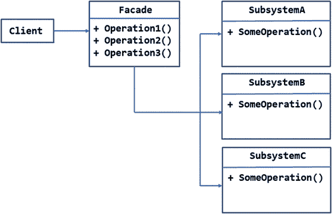

图 6-1。

UML diagram illustrating the façade pattern

如您所见，客户端想要与三个子系统`—SubsystemA`、`SubsystemB`和`SubsystemC`进行交互。这些单独的子系统定义了它们自己的一组操作`—SomeOperation()`,如图所示。虽然从图中可能看不出来，但是这些子系统的总体接口可能彼此非常不同。这些子系统可能是内部开发的库，也可能是第三方库。

外观模式通过提供高级的、统一的和简化的接口来屏蔽这些子系统。在图中，这个接口采用了 Facade 类的三个方法`—Operation1()`、`Operation2()`和`Operation3()`的形式。

客户端调用外观提供的一个或多个方法来完成工作，而不是直接与子系统交互。

高层次意味着立面屏蔽了与子系统的复杂交互。统一意味着，尽管每个子系统的设计可能与其他子系统不同，但客户不会受到这些差异的影响。无论客户希望与哪个子系统进行交互，外观都提供了一种一致的方式。所谓简化，是指客户端可以避免使用子系统所涉及的复杂性。

### 例子

既然您已经知道了 faade 模式是关于什么的，那么让我们来看一个可以实现它的真实例子。

假设你正在建立一个允许访问者搜索书籍的网站。网站接受最终用户的 ISBN。然后，它查询各种图书销售网站提供的多种服务，并从各个图书销售商那里获取图书价格。不同的图书销售商可能有不同的运费和折扣。因此，您的应用比较每个卖家的报价，并准备一个报价排序列表(从低到高)。最后，列表显示给最终用户。

考虑到前面的需求，您得出的结论是外观模式在这里非常有用，因为否则客户端应用将会被调用这些第三方服务的复杂性和差异所淹没。图 [6-2](#Fig2) 显示了引入立面模式后的可能布置。

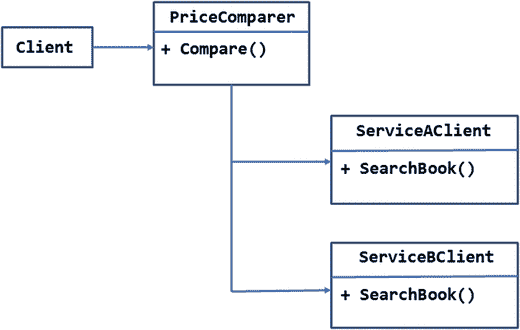

图 6-2。

The PriceComparer façade shielding the client from services

该图假设您的应用想要使用由两个独立的图书销售商公开的两个服务`—ServiceA`和`ServiceB—`。图中没有显示实际的服务，因为它们是由一些第三方提供商托管的。`ServiceAClient`和`ServiceBClient`类是分别调用`ServiceA`和`ServiceB,`的复杂子系统。他们有`SearchBook()`方法，该方法接受一本书的 ISBN，并从特定的图书销售商那里获得报价。因此，从应用的角度来看，与`ServiceAClient`和`ServiceBClient`的交互被屏蔽了。

在这个例子中,`PriceComparer`类充当外观。它提供了一个高级方法`—Compare()—`，该方法在内部调用两个服务的`SearchBook()`方法，并比较报价。

客户端类(本例中是控制器)只处理`PriceComparer`类。客户端不需要知道任何关于`ServiceAClient`和`ServiceBClient`子系统的事情。

让我们继续前进，开发一个演示这种设计的 ASP.NET 应用。因为您没有任何第三方服务，所以您将创建从本地数据库返回数据的本地 Web APIs。您将开发的应用如图 [6-3](#Fig3) 所示。

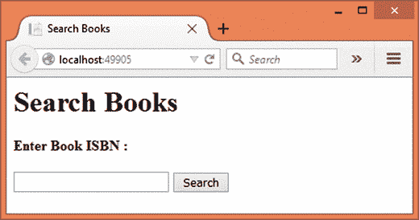

图 6-3。

Seaching for a book by specifying its ISBN

应用的主页允许您输入 ISBN。点击 Search 按钮调用 faade 类，结果如图 [6-4](#Fig4) 所示。

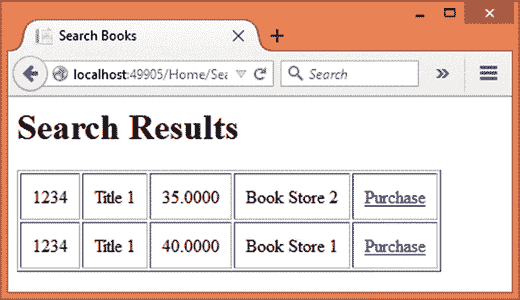

图 6-4。

Compaing prices from multiple sellers and displaying the results

如您所见，对 ISBN 1234 的搜索产生了两条记录，数据从最低到最高显示。“购买”链接应该把你带到图书销售商购买特定图书的页面。

要开发这个应用，首先使用 Visual Studio 创建一个名为 faade 的新 ASP.NET web 应用，并将其配置为使用 MVC 和实体框架(更多细节参见第 [1](01.html) 章)。还将服务`—`使用的数据库`FacadeDb—`的数据库连接字符串存储在`appsettings.json`文件中。

然后将`AppSettings`类添加到`Core`文件夹中，并向其中写入以下代码:

```cs
public class AppSettings
{
    public static string ConnectionString { get; set; }
}

```

`AppSettings`类包含一个静态属性`ConnectionString`，用于存储数据库连接字符串。现在打开`Startup`文件，分配`ConnectionString`属性，如清单 [6-1](#Par31) 所示。

```cs
public Startup(IHostingEnvironment env, IApplicationEnvironment app)
{
...
...
  AppSettings.ConnectionString = config.Get<string>("Data:DefaultConnection:ConnectionString");
}

Listing 6-1.Storing Connection String in the AppSettings Class

```

接下来，将`Book`类添加到`Core`文件夹中，并在其中编写清单 [6-2](#Par38) 中所示的代码。

```cs
[Table("Books")]
public class Book
{
    public int Id { get; set; }
    public string ISBN { get; set; }
    public string Title { get; set; }
    public string Publisher { get; set; }
    public string Author { get; set; }
    public decimal Price { get; set; }
    public string Source { get; set; }
    public string PurchaseUrl { get; set; }
}

Listing 6-2.Book Class Representing the Book Details

```

`Book`类有八个属性，分别是`Id`、`ISBN`、`Title`、`Author`、`Price`、`Source`和`PurchaseUrl`。大部分都是不言自明的，除了最后两条。`Source`属性表示图书销售者的姓名，而`PurchaseUrl`属性表示可以购买图书的 URL。还要注意的是，`Price`属性的数据类型是 decimal。

接下来，将`AppDbContext`添加到`Core`文件夹中，并将清单 [6-3](#Par52) 中所示的代码写入其中。

```cs
public class AppDbContext : DbContext
{
    public DbSet<Book> Books { get; set; }

    protected override void OnConfiguring(DbContextOptionsBuilder optionsBuilder)
    {
        optionsBuilder.UseSqlServer(AppSettings.ConnectionString);
    }
}

Listing 6-3.AppDbContext Class with Books DbSet

```

`AppDbContext`类定义了服务客户端可以查询的`Books DbSet`。

然后将两个 Web API 控制器`—ServiceAController`和`ServiceBController—`添加到`Core`文件夹。在更现实的情况下，这些服务将由第三方开发和托管，您只需消费它们。在这里，为了完整起见，您将开发它们。

要添加 Web API 控制器，右击`Core`文件夹并选择添加➤新项目选项。然后从添加新项目对话框中选择 Web API 控制器类(图 [6-5](#Fig5) )。

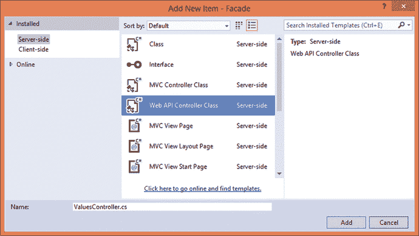

图 6-5。

Adding a Web API controller

命名 Web API 控制器`ServiceAController`和`ServiceBController`。Web API 控制器只需要处理 GET HTTP 动词。`ServiceAController`如清单 [6-4](#Par65) 所示。

```cs
[Route("api/[controller]")]
public class ServiceAController : Controller
{
    [HttpGet("{isbn}")]
    public Book Get(string isbn)
    {
        using (AppDbContext db = new AppDbContext())
        {
            var query = from b in db.Books
                        where b.ISBN == isbn && b.Source=="Book Store 1"
                        select b;
            return query.SingleOrDefault();
        }
    }
}

Listing 6-4.ServiceAController Searching and Returning a Book

```

请注意，`ServiceAController`是用一个`[Route]`属性修饰的，用于配置 Web API 的路由。它由一个方法`—Get()—`组成，该方法将 ISBN 作为其参数，并返回一个表示图书的`Book`对象。`Get()`方法用`[HttpGet]`属性修饰，表示它处理`GET`动词。`[HttpGet]`属性指定了`isbn` route 参数，以便从 route 传递的 ISBN 可以与`Get()`方法的`isbn`参数进行映射。

在内部，代码查询`Books DbSet`试图搜索具有指定 ISBN 和来源的书(来源也被检查，以便您可以只使用一个表进行测试)。结果被返回给调用者。

在`ServiceBController`类中也写同样的代码。(列表 [6-5](#Par83) )。

```cs
[Route("api/[controller]")]
public class ServiceBController : Controller
{

    [HttpGet("{isbn}")]
    public Book Get(string isbn)
    {
        using (AppDbContext db = new AppDbContext())
        {
            var query = from b in db.Books
                        where b.ISBN == isbn && b.Source == "Book Store 2"
                        select b;
            return query.SingleOrDefault();
        }
    }
}

Listing 6-5.ServiceBController Searching and Returning a book

```

代码与`ServiceAController`非常相似，除了源代码被改为“书店 2”。

为了使用刚刚开发的 Web API 服务，您将使用一个`HttpClient`组件。因此，打开`Project.json`文件，将清单 [6-6](#Par101) 中所示的条目添加到依赖项部分。

```cs
"dependencies": {
  ...
  ...
  "System.Net.Http": "4.0.1-beta-23516",
  "Newtonsoft.Json": "8.0.2"
}

Listing 6-6.Adding NuGet Packages for HttpClient

```

Note

这个例子还使用了 Newtonsoft 的`Json.Net`组件。NET 应用。您也可以检查这些软件包的最新版本。

然后在`Core`文件夹中添加一个`ServiceAClient`类，并在其中编写清单 [6-7](#Par109) 中所示的代码。

```cs
public class ServiceAClient
{
    public Book SearchBook(string isbn)
    {
        HttpClient client = new HttpClient();
        client.BaseAddress = new Uri("http://localhost:49905");
        client.DefaultRequestHeaders.Accept.Add(new MediaTypeWithQualityHeaderValue("application/json"));
        HttpResponseMessage response = client.GetAsync("/api/ServiceA/" + isbn).Result;

        string jsonData = response.Content.ReadAsStringAsync().Result;
        Book book = JsonConvert.DeserializeObject<Book>(jsonData);
        return book;
    }
}

Listing 6-7.ServiceAClient Class Calling the ServiceAController Web API

```

`ServiceAClient`由一个方法`—SearchBook()—`组成，该方法将一本书的 ISBN 作为其参数。

`SearchBooks()`方法使用`HttpClient` ( `System.Net.Http`名称空间)类来调用`ServiceAController` Web API。`BaseAddress`属性指向托管 Web API 的 Uri。在这种情况下，Web APIs 托管在您的应用本身中。确保更改端口号以符合您的设置。

然后 Accept HTTP 头被添加到`DefaultRequestHeaders`集合中。这个头使用`application/json`作为它的内容类型值。

`GetAsync()`方法通过将 ISBN 作为路由参数传递来调用`ServiceA` Web API。`GetAsync()`号返回`HttpResponseMessage`。这个对象包装了从 Web API 返回的实际的`Book`对象。要在客户机代码中检索`Book`实例，可以使用`ReadAsStringAsync()`方法。该方法返回一个以 JSON 格式保存数据的字符串。要将这个 JSON 数据转换成一个`Book`对象，可以使用`Json.Net`组件。`JsonConvert`类的`DeserializeObject<T>`泛型方法(`Newtonsoft.Json`名称空间)接受 JSON 字符串并返回一个`Book`对象。如此获得的`Book`对象被返回给调用者。

`ServiceBClient`的代码与`ServiceAClient`非常相似，只有一个例外`—`，它调用了`ServiceBController` Web API。虽然不会讨论这段代码，但它显示在清单 [6-8](#Par128) 中。

```cs
public class ServiceBClient
{
    public Book SearchBook(string isbn)
    {
        HttpClient client = new HttpClient();
        client.BaseAddress = new Uri("http://localhost:49905");
        client.DefaultRequestHeaders.Accept.Add(new MediaTypeWithQualityHeaderValue("application/json"));
        HttpResponseMessage response = client.GetAsync("/api/ServiceB/" + isbn).Result;

        string jsonData = response.Content.ReadAsStringAsync().Result;
        Book book = JsonConvert.DeserializeObject<Book>(jsonData);
        return book;
    }
}

Listing 6-8.ServiceBClient Class Calling the ServiceBController Web API

```

一旦`ServiceAClient`和`ServiceBClient`类准备好了，继续创建外观类。

将`PriceComparer`类添加到`Core`文件夹中，并在其中编写清单 [6-9](#Par144) 所示的代码。

```cs
public class PriceComparer
{
    public List<Book> Compare(string isbn)
    {
        ServiceAClient clientA = new ServiceAClient();
        Book bookA = clientA.SearchBook(isbn);

        ServiceBClient clientB = new ServiceBClient();
        Book bookB = clientB.SearchBook(isbn);

        List<Book> books = new List<Book>();
        books.Add(bookA);
        books.Add(bookB);

        books.Sort(delegate (Book b1, Book b2)
        {
            return b1.Price.CompareTo(b2.Price);
        });
        return books;
    }
}

Listing 6-9.PriceComparer Acts as the Façade

```

`PriceComparer`类由一个方法`—Compare()`组成。`Compare()`方法接受一本书的 ISBN，并返回从服务中获得的`Book`对象的列表。

`Compare()`方法完成四项任务:

*   它使用`ServiceAClient`调用`ServiceA`,并获取一本书的细节作为`Book`对象。
*   它使用`ServiceBClient`调用`ServiceB`,并获取一本书的细节作为`Book`对象。
*   它将这些`Book`对象添加到一个`List`中，这样它们就可以被发送到客户端。
*   它使用比较委托对`List`进行排序。

前两个任务分别通过调用`ServiceAClient()`和`ServiceBClient()`类的`SearchBook()`方法来执行。这些调用每个都返回一个`Book`对象。这些`Book`对象存储在 books `List`变量中。使用比较委托对`List`进行排序。该代理接受两个`Book`对象，然后使用`CompareTo()`方法比较它们的价格。

这就完成了`PriceComparer`faade 类。现在是时候在客户端代码中使用外观了。

将`HomeController`添加到`Controllers`文件夹中。除了默认的`Index()`动作，再给它添加一个`Search()`动作(清单 [6-10](#Par175) )。

```cs
public IActionResult Search(string isbn)
{
    PriceComparer comparer = new PriceComparer();
    List<Book> books = comparer.Compare(isbn);
    return View("Results",books);
}

Listing 6-10.Search() Action Uses PriceComparer Class

```

`Search()`方法接收用户输入的 ISBN。然后它调用`PriceComparer`类的`Compare()`方法来检索`Book`对象的列表。这是需要显示给用户的排序列表。因此，`List`被作为模型传递给`Results`视图。

接下来，将一个`Index`视图添加到`Views/Home`文件夹中，并将清单 [6-11](#Par183) 中所示的标记写入其中。

```cs
<html>
<head>
    <title>Search Books</title>
</head>
<body>
    <h1>Search Books</h1>
    <form asp-controller="Home" asp-action="Search" method="post">
        <strong>Enter Book ISBN :</strong>
        <br /><br />
        <input type="text" name="isbn" />
        <input type="submit" value="Search" />
    </form>
</body>
</html>

Listing 6-11.Markup of Index View

```

视图由一个包含文本框和按钮的表单组成。表单标签助手的`asp-controller`属性指向`Home`控制器，它的`asp-action`属性指向您刚刚编写的搜索动作。

文本框的名称被设置为`isbn`(该名称和`Search()`参数名称必须匹配，以便正确绑定模型)。“搜索提交”按钮发布表单。

接下来，将一个`Results`视图添加到`Views/Home`文件夹中，并将清单 [6-12](#Par200) 中所示的标记写入其中。

```cs
@model List<Facade.Core.Book>
<html>
<head>
    <title>Search Books</title>
</head>
<body>
    <h1>Search Results</h1>
    <table border="1" cellpadding="10">
        @foreach(var item in Model)
        {
            <tr>
                <td>@item.ISBN</td>
                <td>@item.Title</td>
                <td>@item.Price</td>
                <td>@item.Source</td>
                <td><a href="@item.PurchaseUrl">Purchase</a></td>
            </tr>
        }
    </table>
</body>
</html>

Listing 6-12.Markup of the Results View

```

`Results`视图使用`@model`指令将模型指定为`Book`对象的`List`。确保根据您的设置更改名称空间。

视图的主体由一个基于`List`数据呈现的表格组成。一个`foreach`循环遍历`Book`对象的`List`,并发出填充了图书的 ISBN、书名、价格和来源的表格行。使用锚标记显示了`PurchaseUrl`。

这就完成了应用。在运行应用之前，您需要创建一个`FacadeDb`数据库(更多细节请参见第 [1 章](01.html))。此外，为了便于测试，您需要添加一些虚拟记录。完成后，您可以运行应用并尝试搜索 ISBN。如果一切顺利，你将看到一个按价格排序的图书列表(从低到高)。

## 享元

有时，您需要处理大量具有相同状态的对象。但是创建如此大量的对象实例在内存或资源消耗方面可能是低效的。为了最小化系统开销，您需要弄清楚对同一组数据的多个请求是否可以重用已经创建的对象实例，而不是重新创建它们。

您可以通过创建一个对象、填充其状态并在多个请求中重用它来实现这一点。当一个请求请求一个对象时，系统首先检查被请求的状态对于一个现有的对象是否已经可用。如果是，可以将现有对象提供给发出请求的客户端。否则，将创建一个新对象，填充其状态，并将该对象存储在某个地方以供将来重用。这也是给客户的。

flyweight 模式用于实现这样一种高效的对象状态重用机制。flyweight 模式通过共享公共状态来促进内存和计算资源的有效使用，从而避免重复。

flyweight 模式识别两种不同类型的对象状态`—`内在状态和外在状态。内在状态指的是可以在大量请求之间共享的数据。外在状态指的是不能在多个请求之间共享的数据，因此需要动态计算。实现 flyweight 模式的类提供了计算外部状态的附加方法。

Note

flyweight 模式的主要目的是通过促进对象状态的重用来避免创建大量存储相同状态的对象。这不应该与对象池混淆，对象池的主要目的是重用对象实例，而不一定是对象状态。

### 设计和解释

图 [6-6](#Fig6) 中的 UML 图说明了 flyweight 模式。

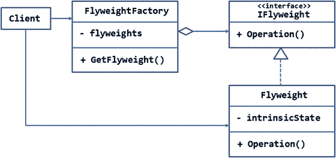

图 6-6。

UML diagram illustrating the flyweight pattern

客户端需要使用 Flyweight 类的一个实例。通常，客户端会使用 C# 的`new`关键字来实例化`Flyweight`类。在这里，客户端从`FlyweightFactory`获得了一个`Flyweight`类的实例。

`FlyweightFactory`维护唯一的`Flyweight`对象列表。这由图中的聚合符号表示。所谓惟一，是指`Flyweight`对象持有一组惟一的数据，可以在大量请求之间共享。因此，尽管存储在列表中的所有条目都是类型`Flyweight`，但是每个实例都持有一组唯一的数据，并且只能由需要它持有的数据的请求使用。

客户端通过调用`FlyweightFactory`的`GetFlyweight()`方法来请求一个`Flyweight`对象。当接收到对特定数据集的请求时，`GetFlyweight()`检查保存所请求数据的`Flyweight`对象是否已经出现在列表中。如果是，则将现有实例返回给调用者。否则，将创建一个新的`Flyweight`对象并放入列表中，然后将其引用返回给调用者。

`Flyweight`对象的接口由`IFlyweight`接口定义。注意，`Flyweight`类持有私有`intrinsicState`成员的固有状态。通过`Operation()`方法计算非本征状态。虽然图中所示的`Flyweight`只有一种方法，但是您可以根据应用需求添加更多的方法。

### 例子

现在您已经知道什么是 flyweight 模式，让我们构建一个使用它的例子。

假设你开发了一个有大量访问者的网站。现在，您希望构建一个丰富的管理界面，供一组管理员使用。

作为管理模块的一部分，您需要开发一个网站分析组件，提供有关网站活动的详细信息，如页面浏览量、独立访问者数量、总带宽消耗、热门搜索关键字和其他此类信息。

分析组件应该从前一天生成的原始 web 服务器日志中提取所有这些信息。考虑到网站的高流量性质，web 服务器日志可能非常大。因此，该组件将执行大量复杂的资源密集型操作，以便提取和生成刚才提到的统计数据。

现在进一步想象有许多管理页面，每个页面处理一些特定的管理任务。除了特定于任务的界面之外，每个管理页面都需要显示网站的分析数据。这样做是为了让管理员不用离开页面就能一目了然地了解使用统计数据。

这将要求在每个管理页面上创建网站分析对象，即使所有实例都将保存相同的数据。因此，保存网站分析数据的对象是一个很好的 Flyweight 对象。

现在把这个概念更进一步。假设您在主网站下有多个子域，每个子域都需要这样的使用统计信息。到目前为止，您只有一组数据需要跨所有管理页面共享。现在，您有多组需要共享的唯一数据(每个子域一组，主网站一组)。

图 [6-7](#Fig7) 显示了如何使用 flyweight 模式来处理这种情况。

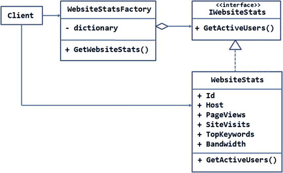

图 6-7。

WebsiteStats flyweight with intrinsic and extrinsic state

本例中的`Flyweight`对象是`WebsiteStats`类。这个类应该通过读取和处理 web 服务器日志文件来生成网站分析。当然，对于这个例子，你只需要在这个类中放一些虚拟的处理。`WebSiteStats`实现了`IWebsiteStats`接口。

`WebsiteStats`实现了六个属性，分别是:`Id`、`Host`、`PageViews`、`SiteVisits`、`TopKeywords`和`Bandwidth`。这些属性保存相应的数据，因此代表 flyweight 模式的内在状态。

`IWebsiteStats`还要求应该有某种方法来获取在给定时间点站点的活跃用户数量。这些信息不能从 web 服务器日志中提取，因为它是实时信息。因此，需要使用`GetActiveUsers()`方法进行动态计算。这些数据构成了 flyweight 类的外在状态。

`WebsiteStatsFactory`是负责维护`WebsiteStats`对象字典的 flyweight 工厂。如果您阅读了前面讨论的系统需求，您会意识到数据对于特定的主机是相同的。所以，字典将主机名作为它的键，对应的`WebsiteStats`对象作为它的值。

每当客户端需要一个`WebsiteStats`对象的实例时，它就调用工厂的`GetWebsiteStats()`方法。该方法检查字典中是否已经存在指定主机的`WebsiteStats`对象。如果是，则将`WebsiteStats`的实例返回给客户端。如果没有给定主机的条目，则创建一个新的`WebsiteStats`实例，填充其固有状态，并将该实例存储在字典中。在任何情况下，客户机都会从字典中获得一个实例。

注意，除了创建`GetWebsiteStats()`方法之外，您还可以创建一个完成相同工作的索引器(正如您将在后面的实际代码中所做的)。

现在让我们继续创建名为 Flyweight 的 ASP.NET 应用，它演示了我们到目前为止所讨论的内容。图 [6-8](#Fig8) 显示了应用的主页面。

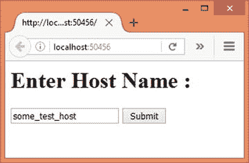

图 6-8。

Accept host name from the user to retrieve its data

如您所见，主页有一个文本框来指定主机名。点击提交按钮后，应用检索主机的使用数据，并将其显示在另一个页面上(图 [6-9](#Fig9) )。

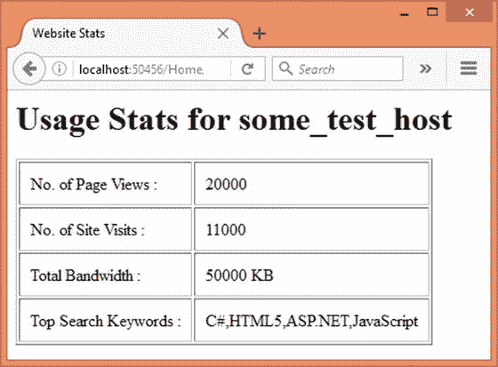

图 6-9。

Site usage data displayed to the user

为了简单起见，这个应用不使用任何 web 服务器日志。相反，它将简单地从数据库表中选取值。

要开发这个应用，首先使用 Visual Studio 创建一个新的 ASP.NET web 应用，并将其配置为使用 MVC 和实体框架(更多细节参见第 [1](01.html) 章)。还要在`appsettings.json`文件中存储用于存储场地使用数据`—`的数据库`FlyweightDb—`的数据库连接字符串。

将`AppSettings`类添加到`Core`文件夹中，并将`ConnectionString`属性添加到其中。然后打开`Startup`类，赋予`AppSettings`的`ConnectionString`属性。你这样做的方式与正面图案的例子完全一样；我们不再赘述细节。

然后将`IWebsiteStats`接口和`WebsiteStats`类添加到`Core`文件夹中。同样在`WebsiteStats`类中实现`IWebsiteStats`接口。两者的完整代码如清单 [6-13](#Par254) 所示。

```cs
public interface IWebsiteStats
{
    int Id { get; set; }
    string Host { get; set; }
    int PageViews { get; set; }
    int SiteVisits { get; set; }
    string TopKeywords { get; set; }
    int Bandwidth { get; set; }
    int GetActiveUsers();
}
public class WebsiteStats : IWebsiteStats
{

    [DatabaseGenerated(DatabaseGeneratedOption.Identity)]
    public int Id { get; set; }
    [Required]
    [StringLength(100)]
    public string Host { get; set; }
    [Required]
    public int PageViews { get; set; }
    [Required]
    public int SiteVisits { get; set; }
    [Required]
    public string TopKeywords { get; set; }
    [Required]
    public int Bandwidth { get; set; }

    public int GetActiveUsers()
    {
        return new Random().Next(100, 10000);
    }
}

Listing 6-13.IWebsiteStats Interface Implemented in WebsiteStats

```

`WebsiteStats`类非常简单，它实现了六个属性`—Id`、`Host`、`PageViews`、`SiteVisits`、`TopKeywords`和`Bandwidth`。`GetActiveUsers()`方法只是返回一个介于 100 和 10000 之间的随机数。在更现实的情况下，这将基于一些应用特定的逻辑来动态计算。各种数据注释被添加到属性之上，只是为了帮助实体框架迁移命令创建适当的表结构。

接下来，将`AppDbContext`类添加到`Core`文件夹中，并在其中编写清单 [6-14](#Par288) 中所示的代码。

```cs
public class AppDbContext : DbContext
{

    public DbSet<WebsiteStats> WebsiteStats { get; set; }

    protected override void OnConfiguring(DbContextOptionsBuilder optionsBuilder)
    {
        optionsBuilder.UseSqlServer(AppSettings.ConnectionString);
    }
}

Listing 6-14.AppDbContext with WebsiteStats DbSet

```

`AppDbContext`类包含`WebsiteStats DbSet`。您稍后编写的代码查询这个`DbSet`来获取主机的站点使用数据。

现在在`Core`文件夹中添加`WebsiteStatsFactory`类，并在其中编写清单 [6-15](#Par299) 所示的代码。

```cs
public class WebsiteStatsFactory
{
    private static Dictionary<string, WebsiteStats> dictionary = new Dictionary<string, WebsiteStats>();

    public IWebsiteStats this[string host]
    {
        get
        {
            if(!dictionary.ContainsKey(host))
            {
                using (AppDbContext db = new AppDbContext())
                {
                    var query = from stats in db.WebsiteStats
                                where stats.Host == host
                                select stats;
                    dictionary[host] = query.SingleOrDefault();
                }
            }
            return dictionary[host];
        }
    }
}

Listing 6-15.WebsiteStatsFactory Giving Objects of WebsiteFactory

```

`WebsiteStatsFactory`类声明了一个静态的`Dictionary`变量。主机名充当键，填充了主机使用数据的`WebsiteStats`对象是值。

注意，`WebsiteStatsFactory`类定义了一个索引器来访问字典，而不是`GetWebsiteStats()`方法。这纯粹是为了方便使用语法。

索引器接受主机名字符串。在内部，代码检查字典是否已经包含指定的主机名键。如果字典不包含主机名关键字，代码将从数据库中获取指定主机的站点使用数据。使用`SingleOrDefault()`方法将数据作为`WebsiteStats object`进行检索，并存储在字典中。然后索引器将字典中的`WebsiteStats`对象返回给调用者。

接下来，在`Controllers`文件夹中添加`HomeController`。除了默认的`Index()`动作之外，还需要给它添加`ShowStats()`动作(清单 [6-16](#Par325) )。

```cs
[HttpPost]
public IActionResult ShowStats(string host)
{
    WebsiteStatsFactory factory = new WebsiteStatsFactory();
    WebsiteStats stats = (WebsiteStats)factory[host];
    if (stats == null)
    {
        ViewBag.Message = "Invalid Host Name!";
        return View("Index");
    }
    else
    {
        return View(stats);
    }
}

Listing 6-16.
ShowStats() Action

Asks for WebsiteStats Object

```

`ShowStats()`动作接收用户输入的主机名作为其参数。在内部，它创建了一个`WebsiteStatsFactory`类的实例。然后，它使用其索引器为指定的主机获取一个`WebsiteStats`实例。如果成功获得了`WebsiteStats`对象，它将被传递给`ShowStats`视图。如果输入了无效的主机名，将向用户显示一条错误消息。

现在将`Index`视图添加到`Views/Home`文件夹中，并将清单 [6-17](#Par342) 中所示的标记写入其中。

```cs
<html>
<head>
    <title>Website Usage Data</title>
</head>
<body>

    <h1>Enter Host Name :</h1>
    <form asp-controller="Home" asp-action="ShowStats" method="post">
        <input type="text" name="host" />
        <input type="submit" value="Submit" />
    </form>
    <br />
    <strong>@ViewBag.Message</strong>
</body>
</html>

Listing 6-17.Markup of the Index View

```

`Index`视图使用表单标签助手呈现一个表单。表单标签帮助器的`asp-controller`属性指向`Home`控制器，它的`asp-action`属性指向`ShowStats`动作。该表单包含一个文本框和一个按钮。来自`ViewBag`的错误信息显示在表格下方。

现在将`ShowStats`视图添加到`Views/Home`文件夹中，并将清单 [6-18](#Par359) 中所示的标记写入其中。

```cs
@model Flyweight.Core.WebsiteStats

<html>
<head>
    <title>Website Stats</title>
</head>
<body>

    <h1>Usage Stats for @Model.Host</h1>
    <table border="1" cellpadding="10">
        <tr>
            <td>No. of Page Views : </td>
            <td>@Model.PageViews</td>
        </tr>
        <tr>
            <td>No. of Site Visits : </td>
            <td>@Model.SiteVisits</td>
        </tr>
        <tr>
            <td>Total Bandwidth : </td>
            <td>@Model.Bandwidth KB</td>
        </tr>
        <tr>
            <td>Top Search Keywords : </td>
            <td>@Model.TopKeywords</td>
        </tr>
    </table>
</body>
</html>

Listing 6-18.Markup of the ShowStats View

```

`@model`指令指定视图的模型为`WebsiteStats`类。确保根据您的设置更改`WebsiteStats`的名称空间。

然后，标记在一个表中显示了`WebsiteStats`实例的所有属性值。

这就完成了应用。在运行应用之前，您需要创建一个`FlyweightDb`数据库(更多细节请参见第 [1 章](01.html))。此外，为了便于测试，您需要添加一些虚拟主机名条目。完成后，您可以运行应用并尝试检索主机的站点使用数据。在索引(`WebsiteStatsFactory`类)中设置一个断点，看看已经存储在字典中的`WebsiteStats`对象是如何处理对同一主机数据的多个请求的。

## 代理

有时，使用占位符代替直接使用对象是有益的。客户端调用这个占位符的方法。占位符又将调用转发到目标对象。这种占位符有用的一些情况包括:

*   您可能希望允许对目标对象的受控访问，因此希望通过占位符路由所有调用；
*   由于所涉及的复杂性，您可能希望对客户端隐藏目标对象的创建和配置过程；
*   您可能希望在不影响客户端代码的情况下动态更改目标对象；或者
*   目标对象在开发时不可用，应用只能在运行时与目标连接。

如果需要这类东西，代理模式可以作为一种解决方案。代理模式提供了代表目标对象的占位符或代理对象，从而控制对目标对象的访问。因为代理对象是目标对象的占位符，所以代理通常模仿目标对象的结构(属性和方法)。

如果您曾经开发过 ASMX web 服务或 WCF 服务，那么您可能已经熟悉了代理的概念。ASMX 和 WCF 服务使用的服务代理基于代理模式，用于控制和简化对底层服务的访问。

### 设计和解释

代理模式的 UML 结构如图 [6-10](#Fig10) 所示。

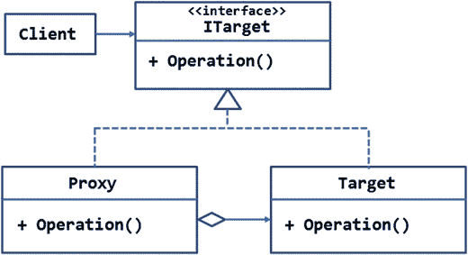

图 6-10。

UML diagram illustrating the proxy pattern

目标对象的接口由`ITarget`接口表示。`ITarget`接口包含一个方法`—Operation()`。

`Target`类实现了`ITarget`接口，它的`Operation()`方法包含了执行实际工作的代码。

`Proxy`类也实现了`ITarget`来模仿`Target`对象。如聚合符号所示，`Proxy`类将有一个`Target`的实例(或者将以某种方式使用`Target`)。`Proxy`的`Operation()`方法会将调用转发给`Target`的`Operation()`方法。

客户对从`Target`开始完成工作感兴趣。但是它不会直接使用一个`Target`的对象。相反，客户端将实例化`Proxy`，并调用`Proxy`的操作。由于`Proxy`模仿了`Target`，客户端代码看起来好像是在`Target`对象本身上进行调用。

### 例子

现在您已经知道了代理模式的作用，让我们来看一个您可以使用它的真实场景。

假设您正在开发一个 web 应用，它需要使用一个 Web API 来完成一些工作。此外，假设 Web API 在应用中的许多地方被使用。此外，您期望相同的 Web API 将被托管在不同的地理位置，并且客户端将基于某些动态条件使用一个。最后，出于管理和监控的目的，客户端需要维护 Web API 调用的日志。

您总是可以在客户端代码中使用一个`HttpClient`组件来调用 Web API。然而，有一些限制因素:

*   `HttpClient`组件被设计为使用`REST`API，并期望您的代码提供服务端点和数据格式(JSON 或 XML)等细节。
*   由于 Web API 在应用的许多地方都被使用，所以您需要在所有这些地方重复类似的代码。
*   客户端代码需要从一组 URL 中找出目标服务的 URL。

考虑到这些需求和限制，如果创建 Web API 的代理而不是直接调用 Web API，将会是有益的。这样，客户端代码只需要调用代理上的方法。代理将负责刚才提到的所有问题。

对于这个例子，您将创建一个 Web API，它对`Northwind`数据库的`Customers`表执行 CRUD ( `Create`、`Read`、`Update`和`Delete`)操作。

刚刚解释的场景的 UML 图如图 [6-11](#Fig11) 所示。

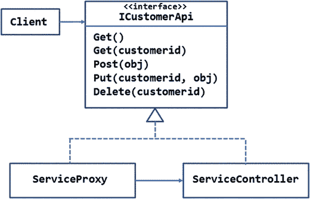

图 6-11。

Creating a proxy for calling the customer Web API service

`ICustomerApi`接口包含五个方法，分别对应于 HTTP 动词`—GET`、`POST`、`PUT`和`DELETE`。

`Get()`方法有两个变体`—`无参数版本返回数据库中所有客户的列表，而采用字符串参数的版本返回与指定的`CustomerID`匹配的单个`Customer`。

`Post()`方法接受一个新的`Customer`对象作为它的参数，并试图将那个`Customer`添加到数据库中。

`Put()`方法接受一个被修改的`CustomerID`和一个包含修改值的`Customer`对象。

`Delete()`方法将一个`CustomerID`作为其参数，并试图删除该客户。

在`ServiceController`和`ServiceProxy`类中实现了`ICustomerApi`接口。`ServiceController`类是标准的 Web API 控制器，而`ServiceProxy`是代理类。

`ServiceController`处理 HTTP 动词并在底层数据库上执行 CRUD 操作。

`ServiceProxy`通过`HttpClient`调用`ServiceController`。服务的端点 URL 是从配置文件中获取的，但是您可以使用任何自定义逻辑来决定 URL(这类似于应用需求)。`ServiceProxy`的`Get()`、`Post()`、`Put()`、`Delete()`方法使用`HttpClient`组件将调用转发给 Web API 的相应方法。此外，他们将调用记录到一个文本文件中。

客户端(`HomeController`)创建一个`ServiceProxy`的实例，并调用它的方法来执行相应的操作。

您在本节中开发的 ASP.NET 应用的主页如图 [6-12](#Fig12) 所示。

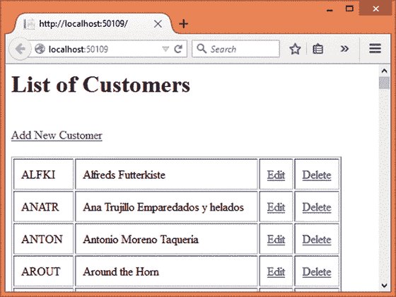

图 6-12。

List of customers

主页在一个表中显示了现有客户的列表。对于每个客户记录，提供了“编辑”和“删除”链接来执行相应的操作。表格上方的“添加新客户”链接用于添加新客户。

当您点击“编辑”链接时，会显示一个编辑页面(图 [6-13](#Fig13) )，允许您修改该客户。

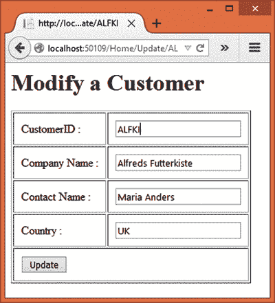

图 6-13。

Modifying an existing customer

除了向用户显示一个空的数据输入页面之外，添加新客户的工作方式与此类似。单击“删除”链接删除一个客户，并将用户带回主客户列表。

要开发这个应用，首先使用 Visual Studio 创建一个名为 Proxy 的新 ASP.NET web 应用，并将其配置为使用 MVC 和实体框架(参见第 [1](01.html) 章了解更多细节)。还将`Northwind`数据库的数据库连接字符串存储在`appsettings.json`文件中。此外，将 Web API 端点和日志文件路径存储在`appsettings.json`中，如清单 [6-19](#Par425) 所示。

```cs
{
  "AppSettings": {
    "ServiceBaseAddress": "http://localhost:50109",
    "ServiceUrl": "/api/service",
    "LogFilePath": "log.txt",
  },
  ...
  ...
}

Listing 6-19.Storing Web API End Point URL in the Configuration File

```

配置文件的`AppSettings`部分存储了两个设置`—ServiceBaseAddress`和`ServiceUrl`。`ServiceBaseAddress`键指向 Web API 的基址，而`ServiceUrl`键指向服务的实际路径。这两者的结合为您提供了完整的 Web API 点 URL。确保根据项目设置的要求更改端口号。

然后将`AppSettings`类添加到`Core`文件夹中，并在其中编写清单 [6-20](#Par436) 所示的代码。

```cs
public class AppSettings
{
    public static string ServiceBaseAddress { get; set; }
    public static string ServiceUrl { get; set; }
    public static string LogFilePath { get; set; }
    public static string ConnectionString { get; set; }
}

Listing 6-20.AppSettings Class Storing Service End Point Details

```

`AppSettings`类包含三个属性`—ServiceBaseAddress`、`ServiceUrl`、`LogFilePath`和`ConnectionString`。这些属性是从`Startup`类(清单 [6-21](#Par444) 中分配的，并保存配置文件中的相应值。

```cs
public Startup(IHostingEnvironment env, IApplicationEnvironment app)
{
    ...
    ...

    AppSettings.ServiceBaseAddress = config.Get<string>("AppSettings:ServiceBaseAddress");
    AppSettings.ServiceUrl = config.Get <string>("AppSettings:ServiceUrl");
    AppSettings.LogFilePath = env.MapPath(config.Get<string>("AppSettings:LogFilePath"));
    AppSettings.ConnectionString = config.Get<string>("Data:DefaultConnection:ConnectionString");
}

Listing 6-21.Assigning AppSettings Values

in the Startup Class

```

注意`LogFilePath`是如何使用`IHostingEnvironment`对象的`MapPath()`方法构建的。您需要对`Startup`类再做一次修改。您需要为您的应用启用会话状态，因为您将在代码中使用`TempData`字典。`TempData`要求为应用启用会话状态。为此，首先需要在应用的`Project.json`文件中添加`Microsoft.AspNet.Session` NuGet 包:

```cs
"dependencies": {
  ...

  "Microsoft.AspNet.Session": "1.0.0-rc1-final"
}

```

其次，您需要修改`Startup`类的`ConfigureServices()`和`Configure()`方法，如清单 [6-22](#Par461) 所示。

```cs
public void ConfigureServices(IServiceCollection services)
{
    services.AddMvc();
    services.AddEntityFramework()
            .AddSqlServer();
    services.AddSession();

    services.AddCaching();

}

public void Configure(IApplicationBuilder app, IHostingEnvironment env, ILoggerFactory loggerFactory)
{
    app.UseStaticFiles();
    app.UseSession();

    app.UseMvc(routes =>
    {
        routes.MapRoute(
            name: "default",
            template: "{controller=Home}/{action=Index}/{id?}");
    });
}

Listing 6-22.Enabling Session

State for the Application

```

请注意用粗体字母标记的代码。ConfigureServices()方法使用`AddSession() and AddCaching()`方法向 ASP.NET 管道添加会话和缓存服务。而`Configure()`方法调用`UseSession()`方法来启用会话状态。

接下来，将`Customer`类添加到`Core`文件夹中，并在其中编写清单 [6-23](#Par483) 中所示的代码。

```cs
[Table("Customers")]
public class Customer
{
    [Key]
    [StringLength(5)]
    public string CustomerID { get; set; }
    [Required]
    public string CompanyName { get; set; }
    [Required]
    public string ContactName { get; set; }
    [Required]
    public string Country { get; set; }
}

Listing 6-23.Customer Model Class

```

使用`[Table]`属性将`Customer`类映射到`Customers`表，该类包含四个属性，即`CustomerID`、`CompanyName`、`ContactName`和`Country`。添加到属性顶部的数据注释有助于模型验证。

然后将`AppDbContext`类添加到`Core`文件夹中。这个类有一个`Customers DbSet`，如清单 [6-24](#Par498) 所示。

```cs
public class AppDbContext : DbContext
{
    public DbSet<Customer> Customers { get; set; }

    protected override void OnConfiguring(DbContextOptionsBuilder optionsBuilder)
    {
        optionsBuilder.UseSqlServer(AppSettings.ConnectionString);
    }
}

Listing 6-24.AppDbContext Class Exposing Customers DbSet

```

现在将`ICustomerApi`接口添加到`Core`文件夹中，如清单 [6-25](#Par508) 所示。

```cs
public interface ICustomerApi
{
    List<Customer> Get();
    Customer Get(string customerid);
    void Post(Customer obj);
    void Put(string customerid, Customer obj);
    void Delete(string customerid);
}

Listing 6-25.ICustomerApi Interface

```

`ICustomerApi`界面由五种方法`—Get()`、`Get(customerid)`、`Post()`、`Put()`和`Delete()`组成。

现在将名为`ServiceController`的 Web API 控制器添加到`Core`文件夹中。这个 Web API 控制器将处理`GET`、`POST`、`PUT`和`DELETE`动词，如清单 [6-26](#Par518) 所示。

```cs
[Route("api/[controller]")]
public class ServiceController : Controller,ICustomerApi
{
    [HttpGet]
    public List<Customer> Get()
    {
        using (AppDbContext db = new AppDbContext())
        {
            return db.Customers.ToList();
        }
    }

    [HttpGet("{customerid}")]
    public Customer Get(string customerid)
    {
        using (AppDbContext db = new AppDbContext())
        {
            return db.Customers.Where(m => m.CustomerID == customerid).SingleOrDefault();
        }
    }

    [HttpPost]
    public void Post([FromBody]Customer obj)
    {
        using (AppDbContext db = new AppDbContext())
        {
            db.Customers.Add(obj);
            db.SaveChanges();
        }
    }

    [HttpPut("{customerid}")]
    public void Put(string customerid, [FromBody]Customer obj)
    {
        using (AppDbContext db = new AppDbContext())
        {
            db.Entry(obj).State = EntityState.Modified;
            db.SaveChanges();
        }
    }

    [HttpDelete("{customerid}")]
    public void Delete(string customerid)
    {
        using (AppDbContext db = new AppDbContext())
        {
            Customer obj = db.Customers.Where(m => m.CustomerID == customerid).SingleOrDefault();
            db.Customers.Remove(obj);
            db.SaveChanges();
        }
    }
}

Listing 6-26.ServiceController Web API Handling GET, POST, PUT, and DELETE Verbs

```

`[Route]`属性为 Web API 配置路由。注意，`ServiceController`类不仅继承了`Controller`基类，还实现了`ICustomerApi`接口。

`ServiceController`包含所有五个动作:

*   `Get()`:该方法从`Northwind`数据库的`Customers`表中返回所有客户。
*   `Get(customerid)`:这个方法从路由参数中接收一个`CustomerID`，并将这个单个的`Customer`返回给调用者。
*   `Post(obj)`:该方法接受一个新的`Customer`对象，并将该客户添加到`Customers DbSet`中。然后，`SaveChanges()`方法将更改保存到数据库中。
*   `Put(customerid,obj)`:这个方法从一个路由参数接收一个`CustomerID`，从一个`Customer`对象接收一个表示客户修改值的值。然后，它将修改后的值保存到数据库。
*   `Delete(customerid)`:该方法从路由参数接收一个`CustomerID`。然后从`Customers DbSet`中删除`Customer`，并将更改保存到数据库中。

这就完成了 Web API。现在是时候将`ServiceProxy`添加到`Core`文件夹中了。清单 [6-27](#Par578) 中显示了`ServiceProxy`类的完整代码。

```cs
public class ServiceProxy : ICustomerApi
{
    private HttpClient client = new HttpClient();

    public ServiceProxy()
    {
        client.BaseAddress = new Uri(AppSettings.ServiceBaseAddress);
        client.DefaultRequestHeaders.Accept.Add(new MediaTypeWithQualityHeaderValue("application/json"));
    }

    public List<Customer> Get()
    {
        HttpResponseMessage response = client.GetAsync(AppSettings.ServiceUrl).Result;
        string jsonData = response.Content.ReadAsStringAsync().Result;
        List<Customer> data = JsonConvert.DeserializeObject<List<Customer>> (jsonData);
        System.IO.File.AppendAllText(AppSettings.LogFilePath, $"Get() called on {DateTime.Now}");
        return data;
    }

    public Customer Get(string customerid)
    {
        HttpResponseMessage response = client.GetAsync(AppSettings.ServiceUrl + $"/{customerid}").Result;
        string jsonData = response.Content.ReadAsStringAsync().Result;
        Customer data = JsonConvert.DeserializeObject<Customer>(jsonData);
        System.IO.File.AppendAllText(AppSettings.LogFilePath, $"Get({customerid}) called on {DateTime.Now}");
        return data;
    }

    public void Post(Customer obj)
    {
        string jsonData = JsonConvert.SerializeObject(obj);
        StringContent content = new StringContent(jsonData);
        content.Headers.Clear();
        content.Headers.Add("Content-Type", "application/json");
        HttpResponseMessage response = client.PostAsync(AppSettings.ServiceUrl, content).Result;
        System.IO.File.AppendAllText(AppSettings.LogFilePath, $"Post() called on {DateTime.Now}");
    }

    public void Put(string customerid, Customer obj)
    {
        string jsonData = JsonConvert.SerializeObject(obj);
        StringContent content = new StringContent(jsonData);
        content.Headers.Clear();
        content.Headers.Add("Content-Type", "application/json");
        HttpResponseMessage response = client.PutAsync(AppSettings.ServiceUrl + $"/{customerid}", content).Result;
        System.IO.File.AppendAllText(AppSettings.LogFilePath, $"Put() called on {DateTime.Now}");
    }

    public void Delete(string customerid)
    {
        HttpResponseMessage response = client.DeleteAsync(AppSettings.ServiceUrl + $"/{customerid}").Result;
        System.IO.File.AppendAllText(AppSettings.LogFilePath, $"Delete() called on {DateTime.Now}");
    }
}

Listing 6-27.The ServiceProxy Class

Mimics the ServiceController

```

`ServiceProxy`类实现了`ICustomerApi`，因此包含了接口定义的所有五个方法。

它声明了一个由所有方法使用的`HttpClient`对象(`System.Net.Http`名称空间)。确保在`Project.json`中包含`System.Net.Http`和`Newtonsoft.Json`的依赖项，就像前面的例子一样。`ServiceProxy`的构造器通过设置`BaseAddress`和`Accept`头来配置`HttpClient`。您应该对这段代码很熟悉，因为您在前面的示例中使用过它。

`ServiceProxy`类的`Get()`、`Get(customerid)`、`Post()`、`Put()`、`Delete()`方法调用`ServiceController`的相应方法。这是分别使用`HttpClient`的`GetAsync()`、`PostAsync()`、`PutAsync()`和`DeleteAsync()`方法完成的。这段代码对您来说应该很熟悉，因为您在前面的示例中使用过它。注意使用了`JsonConvert`类进行转换。NET 对象转换成 JSON 字符串。

请注意，所有这些方法还会向日志文件添加一条消息。这是使用`File`类的`AppendAllText()`方法(`System.IO`名称空间)完成的。日志文件在由`LogFilePath`属性指定的位置创建。

接下来，将`HomeController`添加到`Controllers`文件夹中。`HomeController`由六个动作组成，如下所示:

*   `Index()`:这个方法获取一个`Customer`对象的列表，并将其传递给`Index`视图，以便在表格中显示。
*   `Update(id)`:当用户点击“编辑”链接时调用该方法。它从路由参数中接收一个`CustomerID`，并为该`CustomerID`获取一个`Customer`对象。
*   `Update(obj)`:当用户修改`customer`数据并提交表单时，调用该方法。
*   `Insert()`:当用户点击“添加新客户”链接时，这个方法被调用。它向用户显示`Insert`视图。
*   `Insert(obj)`:当用户填写`Insert`视图并提交表单时，这个方法被调用。
*   `Delete(id)`:当用户点击“删除”链接时，这个方法被调用。

`Index()`动作如清单 [6-28](#Par645) 所示。

```cs
public IActionResult Index()
{
    ServiceProxy proxy = new ServiceProxy();
    List<Customer> data = proxy.Get();
    return View(data);
}

Listing 6-28.Index() Action Fetches a List of Customers

```

`Index()`动作创建了一个`ServiceProxy`的实例，并调用它的`Get()`方法来检索一列`Customer`对象。客户数据被传递到`Index`视图。

清单 [6-29](#Par653) 中显示了负责`update`操作的两个动作。

```cs
public IActionResult Update(string id)
{
    ServiceProxy proxy = new ServiceProxy();
    Customer data = proxy.Get(id);
    return View(data);
}

[HttpPost]
public IActionResult Update(Customer obj)
{
    if (ModelState.IsValid)
    {
        ServiceProxy proxy = new ServiceProxy();
        proxy.Put(obj.CustomerID,obj);
        TempData["Message"] = "Customer modified successfully!";
        return RedirectToAction("Index");
    }
    else
    {
        return View(obj);
    }
}

Listing 6-29.Modifying Customer Details

```

第一个版本的`Update()`方法从路由接收一个`CustomerID`。然后它创建一个`ServiceProxy`并调用它的`Get(customerid)`方法来检索与`CustomerID`匹配的单个`Customer`对象。如此获得的`Customer`对象被传递给`Update`视图。

第二个版本的`Update()`方法通过模型绑定接收一个`Customer`对象。在内部，它检查`Customer`模型是否包含有效数据。这是使用`ModelState`的`IsValid`属性完成的。如果模型有效，则实例化`ServiceProxy`，并通过传递`CustomerID`和`Customer`对象调用其`Put()`方法。

一个条目被添加到关键字为`Message`的`TempData`字典中。该键包含向用户显示的成功消息。

然后使用`RedirectToAction()`方法将控制重定向到`Index()`动作。

如果`ModelState`无效，则`Customer`对象被传递给`Update`视图，以便向用户显示错误。

除了调用`ServiceProxy`的`Post()`和`Delete()`方法之外，`Insert()`和`Delete()`动作类似于`Update()`动作。这些动作如清单 [6-30](#Par681) 所示。

```cs
public IActionResult Insert()
{
    return View();
}

[HttpPost]
public IActionResult Insert(Customer obj)
{
    if (ModelState.IsValid)
    {
        ServiceProxy proxy = new ServiceProxy();
        proxy.Post(obj);
        TempData["Message"] = "Customer added successfully!";
        return RedirectToAction("Index");
    }
    else
    {
        return View(obj);
    }
}

public IActionResult Delete(string id)
{
    ServiceProxy proxy = new ServiceProxy();
    proxy.Delete(id);
    TempData["Message"] = "Customer deleted successfully!";
    return RedirectToAction("Index");
}

Listing 6-30.Inserting and Deleting a Customer

```

这就完成了`HomeController`。现在是时候创建`Index`、`Insert`和`Update`视图了。将`Index`视图添加到`Views/Home`文件夹中。清单 [6-31](#Par710) 中显示了`Index`视图的标记。

```cs
@model List<Proxy.Core.Customer>

<html>
<head>
    <title>List of Customers</title>
</head>
<body>
    <h1>List of Customers</h1>
    @TempData["Message"]
    <br />
    <a asp-controller="Home" asp-action="Insert">Add New Customer</a>
    <br /><br />
    <table border="1" cellpadding="10">
        @foreach(var item in Model)
        {
            <tr>
                <td>@item.CustomerID</td>
                <td>@item.CompanyName</td>
                <td><a asp-controller="Home" asp-action="Update" asp-route-id="@item.CustomerID">Edit</a></td>
                <td><a asp-controller="Home" asp-action="Delete" asp-route-id="@item.CustomerID">Delete</a></td>
            </tr>
        }
    </table>
</body>
</html>

Listing 6-31.Markup of Index View

```

`@model`指令将`Index`视图的模型设置为一列`Customer`对象。确保更改模型名称空间以匹配您的设置。

在顶部，标记输出存储在`TempData`中的成功消息。然后，它使用锚标记帮助器显示一个超链接。锚点标签辅助对象的`asp-controller`属性指向`Home`控制器，其`asp-action`属性指向`Insert`动作。

然后一个`foreach`循环遍历`Model`并将一个表呈现到响应流中。该表显示了`CustomerID`和`CompanyName`属性，还显示了“编辑”和“删除”链接。注意“编辑”链接指向了`Update()`动作，并且使用`asp-route-id`属性将`id`路由参数的值传递给它。类似地，“删除”链接指向`Delete()`动作。

现在将`Update`视图添加到`Views/Home`文件夹中，并将清单 [6-32](#Par739) 中所示的标记写入其中。

```cs
@model Proxy.Core.Customer

<html>
<head>
    <title>Modify a Cusotmer</title>
</head>
<body>
    <h1>Modify a Customer</h1>
    <form asp-controller="Home" asp-action="Update">
        <table border="1" cellpadding="10">
            <tr>
                <td><label asp-for="CustomerID">CustomerID :</label></td>
                <td><input asp-for="CustomerID" readonly="readonly" /></td>
            </tr>
            <tr>
                <td><label asp-for="CompanyName">Company Name :</label></td>
                <td><input asp-for="CompanyName" /></td>
            </tr>
            <tr>
                <td><label asp-for="ContactName">Contact Name :</label></td>
                <td><input asp-for="ContactName" /></td>
            </tr>
            <tr>
                <td><label asp-for="Country">Country :</label></td>
                <td><input asp-for="Country" /></td>
            </tr>
            <tr>
                <td colspan="2">
                    <input type="submit" value="Update" />
                </td>
            </tr>
        </table>
    </form>
    <div asp-validation-summary="ValidationSummary.All"></div>
</body>
</html>

Listing 6-32.Markup of the Update View

```

`@model`指令将`Update`视图的模型设置为`Customer`类。该视图在表格中显示数据输入表单。这是通过使用表单、标签和输入标签助手来完成的。

表单标签帮助器的`asp-controller`属性指向`Home`控制器，它的`asp-action`属性指向`Update()`动作。

标签和输入标签帮助器的`asp-for`属性指定了与标签或输入字段绑定的模型属性。

更新按钮将表单提交给`Update()`动作。为了显示模型验证错误，使用了一个验证摘要标记助手。将`<div>`的`asp-validation-summary`属性设置为`ValidationSummary`。所有这些都是为了显示所有的模型错误。

最后，将`Insert`视图添加到`Views/Home`文件夹中。除了将表单提交给`Insert()`动作之外，`Insert`视图与`Update`视图非常相似。清单 [6-33](#Par780) 中显示了`Index`视图的标记。

```cs
@model Proxy.Core.Customer

<html>
<head>
    <title>Add a Customer</title>
</head>
<body>
    <h1>Add a Customer</h1>
    <form asp-controller="Home" asp-action="Insert">
        <table border="1" cellpadding="10">
            <tr>
                <td><label asp-for="CustomerID">CustomerID :</label></td>
                <td><input asp-for="CustomerID" /></td>
            </tr>
            <tr>
                <td><label asp-for="CompanyName">Company Name :</label></td>
                <td><input asp-for="CompanyName" /></td>
            </tr>
            <tr>
                <td><label asp-for="ContactName">Contact Name :</label></td>
                <td><input asp-for="ContactName" /></td>
            </tr>
            <tr>
                <td><label asp-for="Country">Country :</label></td>
                <td><input asp-for="Country" /></td>
            </tr>
            <tr>
                <td colspan="2">
                    <input type="submit" value="Insert" />
                </td>
            </tr>
        </table>
    </form>
    <div asp-validation-summary="ValidationSummary.All"></div>
</body>
</html>

Listing 6-33.Markup of the Insert View

```

我们不会深入讨论`Insert`视图的细节，因为它与`Update`视图非常相似。

这就完成了应用。运行应用，检查 CRUD 操作是否正确执行。另外，从`wwwroot`文件夹中打开`log.txt`文件，查看每个操作的日志是否被添加到其中。以下是一些示例日志条目:

```cs
Get() called on 9/3/2015 11:53:04 AM
Get(ALFKI) called on 9/3/2015 11:53:30 AM
Put() called on 9/3/2015 11:53:36 AM
Get() called on 9/3/2015 11:53:36 AM

```

正如您所看到的，前面的日志条目是由单个列表和更新操作产生的。

## 摘要

本章讨论了三种结构模式，即外观、享元和代理。

外观模式用于屏蔽一个或多个子系统之间的复杂交互。它向客户端呈现了交互的简化视图。

当存在大量携带相同状态的对象时，flyweight 模式就很方便了。flyweight 模式包含内部状态(可以共享的状态)和外部状态(需要动态计算的状态)。flyweight 模式通过避免重复减少了应用的整体内存占用。

代理模式允许您为另一个对象提供一个占位符对象，以便占位符可以代替`Target`对象。这样，代理提供了对`Target`对象的受控访问。

本章和上一章涵盖了所有七种结构模式。现在，是时候把注意力放在行为模式上了。为此，接下来的三章将讨论这一点。