# 七、行为模式：责任链、命令、解释器和迭代器

既然我们已经检查完了创造和结构模式，本章将向你介绍一些行为模式。顾名思义，行为模式关注类和对象在给定系统中如何行为、通信和传递消息。本章将讨论四种这样的模式，即责任链、命令、解释器和迭代器。它将包括以下内容:

*   行为模式概述
*   责任链、命令、解释器和迭代器的目的
*   UML 图和这些设计模式的整体结构
*   每种模式的概念验证示例

## 行为模式

到目前为止，在这本书里，你已经学习了创造和结构模式。创建模式处理对象创建，而结构模式处理给定系统中类的排列。现在是时候研究第三类 GoF 模式`—`行为模式了。

行为模式涉及以下内容:

*   类和对象在系统中的行为
*   对象如何相互通信和发送消息
*   系统所依赖的不同算法是如何处理的

这一类总共有 11 种模式。它们如下:

*   责任链:允许您通过一个对象链或一系列对象传递请求，每个参与者对象执行一些特定的责任
*   Command:将指令或命令封装在一个对象中，以便可以基于某些特定于应用的逻辑来播放它
*   解释器:允许用特定的符号和语法定义和解释指令集
*   迭代器:允许顺序迭代和访问项目集合中的项目
*   Mediator:允许通过特定对象路由通信，从而简化多个对象之间的通信
*   Memento:允许存储和恢复对象的私有状态信息，而不损害状态的访问范围
*   观察者:当系统中发生一些事情时，允许通知一些对象
*   状态:当对象的状态改变时，允许改变其行为
*   策略:允许将许多算法封装在它们自己的类中，并且可以互换使用
*   模板方法:定义算法的框架，并允许子类重新定义部分或全部步骤
*   Visitor:定义在不影响元素的情况下对对象结构的元素执行的操作

在这 11 种模式中，本章将讨论责任链、命令、解释器和迭代器。剩下的模式将在接下来的两章中讨论。

## 责任链

要完成的给定任务不需要由单个对象来执行。它可以由多个对象来处理，每个对象都以特定且有限的方式为任务的完成做出贡献。

考虑在银行提交的贷款申请。从收到贷款请求到批准或拒绝贷款请求，可能会有许多人参与处理该请求。职员可能会检查贷款申请是否填写正确，是否附上了所有证明文件。但是，该职员无权批准贷款请求。然后他把它交给他的主管。主管可以根据请求的金额、请求者的可信度等对申请进行详细检查。然后，他可以将申请发送给经理进行审批。如果请求的贷款金额在经理可以批准的范围内，他就会批准。否则，他可能会将其发送给他的上级以获得批准。最后，根据银行的政策，申请可能被批准或拒绝。

正如您所看到的，贷款请求通过一系列处理程序，每个处理程序执行一个特定的任务并将其传递给下一个处理程序。这就是可以使用责任链模式的地方。

责任链模式允许您通过一系列处理程序对象传递请求。这样就形成了一个对象链，其中一个对象接收请求，做一些特定的工作，然后将请求传递给链中的下一个对象。在链的末端，请求要么被成功处理，要么生成异常。

### 设计和解释

图 [7-1](#Fig1) 中的 UML 图说明了责任链模式。

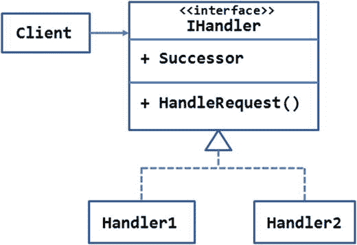

图 7-1。

UML diagram illustrating chain of responsibility pattern

`IHandler`接口定义了要在每个处理程序类中实现的成员。在这种情况下，`HandleRequest()`方法应该对请求进行操作，并将其传递给链中的下一个处理程序。

请注意，该接口还通过 successor 属性定义了指向链中后续对象的指针。当在处理程序类中实现时，该属性保存对链中的下一个处理程序的引用。

`IHandler`接口由两个处理程序`—Handler1`和`Handler2`实现。除了一个处理程序将请求传递给另一个处理程序之外，这些处理程序彼此独立。

客户端决定向哪个处理器发出请求。从这一点开始，请求贯穿处理程序链，并导致其成功或错误的完成。因此，一个示例运行可能是客户端-> Handler1 -> Handler2 ->完成。

请注意，决定链中下一个处理程序的逻辑是特定于应用的。基于某些条件，一个请求可能根本不会通过某些处理程序。另一种可能是所有的处理程序都没有机会处理请求，那就是在处理请求时出现异常。

### 例子

现在您已经知道了责任链模式是如何工作的，让我们在一个例子中实现它。

假设您正在构建一个基于 web 的数据导入实用程序。最终用户将使用上传文件。txt 或者。应该包含要导入的数据的 csv 扩展名。

用户可能会上传扩展名不正确的文件或包含不符合所需结构的数据的文件。因此，应用必须在接受文件作为有效来源之前验证这些方面。

一旦文件被接受，它将被复制到一个文件夹中作为记录或原始数据源。然后，数据被导入到 SQL Server 表中。

在整个数据导入操作中，您可以确定三种责任:

*   文件格式和文件内容验证
*   服务器上的源文件存储
*   将数据导入表中

这些操作将连续进行。正如您可能已经猜到的，这三个步骤需要三个处理程序，导入数据的请求从一个处理程序传递到另一个处理程序。如果需要，将来您还可以添加更多的处理程序。

图 7-2 显示了预期系统的 UML 图。

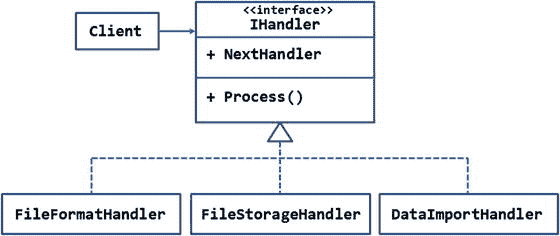

图 7-2。

A chain of three handlers dealing with the data-import request

`IHandler`接口由属性`NextHandler`和方法`Process()`组成。`NextHandler`属性保存了对链中下一个处理程序的引用。`Process()`方法包含以某种方式处理请求的处理逻辑。此外，`Process()`还负责通过调用`NextHandler`上的`Process()`方法来延续链。

`IHandler`接口由三个类实现，分别是`FileFormatHandler`、`FileStorageHandler`和`DataImportHandler`。每个处理者都有特定的职责。

`FileFormatHandler`检查文件扩展名是否为。它还检查文件中包含的数据是否与预期的结构匹配。`FileStorageHandler`负责在文件夹中存储源文件的副本，并在表中为该文件添加一个条目。这样做是为了记录和跟踪。`DataImportHandler`类完成将源数据导入数据库表的工作。除了这些处理程序之外，根据您的需要，您还可以有其他的处理程序。还要注意，每个处理程序本身是一个独立的类，对于下一个处理程序应该是什么没有任何控制。它只是调用下一个处理程序(如果有的话)，但是处理程序的连接由客户端代码负责。

在这个例子中，客户端代码在`FileFormatHandler`上调用`Process()`，因为这是链中的第一步。

图 [7-3](#Fig3) 显示了应用主页的外观。

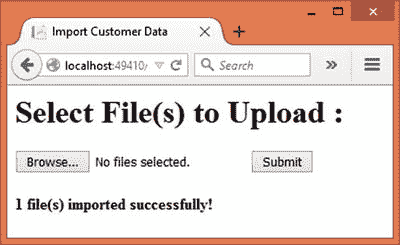

图 7-3。

Uploading files to be imported

该页面包含一个文件输入字段，允许您选择一个或多个文件。选择文件后，您可以单击提交按钮开始文件上传和导入过程。如果文件中的数据导入成功，将显示一条消息，确认该过程成功完成。

要开发这个应用，首先使用 Visual Studio 创建一个名为`COR`的新 ASP.NET web 应用项目，并将其配置为使用 MVC 和实体框架(参见第 [1 章](01.html)了解更多细节)。还将应用`—`使用的数据库`CorDb—`的数据库连接字符串存储在`appsettings.json`文件中。

然后将`AppSettings`类添加到`Core`文件夹中，并向其中添加两个静态属性，如清单 [7-1](#Par52) 所示。

```cs
public class AppSettings
{
    public static string StoragePath { get; set; }
    public static string ConnectionString { get; set; }
}

Listing 7-1.AppSettings Class

```

属性保存了存储上传文件的文件夹的路径。属性保存了`CorDb`数据库的数据库连接字符串。这些属性在`Startup`类构造函数中赋值，如清单 [7-2](#Par58) 所示。

```cs
public Startup(IHostingEnvironment env, IApplicationEnvironment app)
{
    ...
    ...
    AppSettings.ConnectionString = config.Get<string>("Data:DefaultConnection:ConnectionString");
    AppSettings.StoragePath = env.MapPath("Uploads");
}

Listing 7-2.Assigning StoragePath and ConnectionString

```

代码使用`IHostingEnvironment`实例的`MapPath()`方法来计算`\wwwroot\Uploads`文件夹的完整物理路径。然后该路径被分配给`AppSettings`的`StoragePath`属性。数据库连接字符串从`appsettings.json`中选取，并分配给`ConnectionString`属性。

现在将`IHandler`接口添加到`Core`文件夹中，并在其中编写清单 [7-3](#Par67) 所示的代码。

```cs
public interface IHandler
{
    IHandler NextHandler { get; set; }
    void Process(string filename, string filecontent);
}

Listing 7-3.IHandler Interface with NextHandler and Process( )

```

`IHandler`接口由一个`NextHandler`属性和一个`Process()`方法组成。注意`NextHandler`的类型是`IHandler`。这样，任何实现`IHandler`的类都可以作为链中的下一个参与者。

`Process()`方法有两个参数。`filename`参数是包含要导入的数据的文件名。`filecontent`参数包含文件的实际内容。

接下来，将`FileFormatHandler`类添加到`Core`文件夹中，并在其中实现`IHandler`。清单 [7-4](#Par75) 中显示了`FileFormatHandler`类的完整代码。

```cs
public class FileFormatHandler : IHandler
{
    public IHandler NextHandler { get; set; }

    public void Process(string filename, string filecontent)
    {
        string ext = Path.GetExtension(filename);
        if (ext != ".txt" && ext != ".csv")
        {
            throw new Exception("Invalid file type!");
        }
        else
        {
            string[] records = filecontent.Split(new string[] { "\r\n" }, StringSplitOptions.RemoveEmptyEntries);
            if (records == null || records.Length == 0)
            {
                throw new Exception("Invalid data!");
            }
            else
            {
                string[] cols = records[0].Split(',');
                if (cols.Length != 5)
                {
                    throw new Exception("Missing or incomplete data!");
                }
            }
        }
        if (NextHandler != null)
        {
            NextHandler.Process(filename, filecontent);
        }
    }
}

Listing 7-4.FileFormatHandler Class

```

`NextHandler`属性非常简单。`Process()`方法做三件事:

*   它检查文件是否有允许的扩展名。
*   它检测文件是否为空。
*   它还检查文件是否包含与目标表匹配的数据。

代码使用`Path`类的`GetExtension()`方法(`System.IO`名称空间)检测文件扩展名。如果文件扩展名不是。txt 或者。csv，代码抛出异常。如果文件扩展名没有问题，代码将继续验证内容。

然后，代码检查文件内容是否为空。这是通过对文件内容调用`Split()`方法来完成的。注意，内容是基于`\r\n`分割的，因此所有 CSV 记录都是在记录数组中获得的。如果记录数组为空，则表明文件为空，并引发异常。

最后一项任务是检查文件是否包含有效数据。这个例子假设数据将被导入到一个有五列的`Customers`表中。因此，文件中的记录必须包含四个逗号分隔的值。为了检测这一点，代码分割第一条记录并检查`cols`数组是否正好包含五个元素。如果元素的数量不是 5，则会引发异常。

一旦`FileFormatHandler`完成了它的工作，它需要将控制权移交给链中的下一个处理程序对象。注意`FileFormatHandler`不知道下一个请求将由哪个对象处理。它所能检查的就是`NextHandler`是否已经被设置。如果设置了，代码调用`NextHandler`对象上的`Process()`方法。

现在，将`FileStorageHandler`类添加到`Core`文件夹中，并在其中实现`IHandler`接口。清单 [7-5](#Par118) 显示了`FileStorageHandler`类的完整代码。

```cs
public class FileStorageHandler : IHandler
{
    public IHandler NextHandler { get; set; }

    public void Process(string filename, string filecontent)
    {
        filename = AppSettings.StoragePath + "\\" + Path.GetFileNameWithoutExtension(filename) + DateTime.Now.ToString("yyyy-MM-dd") + Path.GetExtension(filename);
        System.IO.File.AppendAllText(filename, filecontent);
        using (AppDbContext db = new AppDbContext())
        {
            FileStoreEntry fse = new FileStoreEntry();
            fse.FileName = filename;
            fse.UploadedOn = DateTime.Now;
            db.FileStore.Add(fse);
            db.SaveChanges();
        }
        if (NextHandler != null)
        {
            NextHandler.Process(filename, filecontent);
        }
    }
}

Listing 7-5.FileStorageHandler Class

```

`FileStorageHandler`做两件事:

*   它将上传的文件存储在一个文件夹中。
*   它在`FileStore`表中添加一个条目，指示某某文件被上传到服务器。

在`Process()`方法中收到的文件名只是上传文件的文件名。因此，代码通过将文件名附加到`AppSettings`的`StoragePath`属性来计算其完整路径。还要注意，在文件名中添加了日期戳，这样就可以很容易地知道文件上传的日期。

文件内容被写入文件，并使用`AppendAllText()`方法保存文件。

则添加数据库条目，指示系统接收到新文件。这是使用一个`FileStoreEntry`实体和`FileStore DbSet`来完成的(它们将在后面讨论)。`FileName`和`UploadedOn`属性分别表示被保存文件的完整路径和文件名及其时间戳。

然后，代码检查是否需要将控制权交给`NextHandler`。如果是这样，`Process()`被调用到`NextHandler`对象上。

接下来，将`DataImportHandler`类添加到`Core`文件夹中，并在其中实现`IHandler`接口。清单 [7-6](#Par149) 显示了`DataImportHandler`的完整代码。

```cs
public class DataImportHandler : IHandler
{
    public IHandler NextHandler { get; set; }

    public void Process(string filename, string filecontent)
    {
        using (AppDbContext db = new AppDbContext())
        {
            string[] records = filecontent.Split(new string[] { "\r\n" }, StringSplitOptions.RemoveEmptyEntries);
            foreach (string record in records)
            {
                string[] cols = record.Split(',');
                Customer obj = new Customer();
                obj.CustomerID = cols[0];
                obj.CompanyName = cols[1];
                obj.ContactName = cols[2];
                obj.Phone = cols[3];
                obj.Location = cols[4];
                db.Customers.Add(obj);
            }
            db.SaveChanges();
        }
        if (NextHandler != null)
        {
            NextHandler.Process(filename, filecontent);
        }
    }
}

Listing 7-6.DataImportHandler Class

```

`DataImportHandler`的`Process()`方法负责将内容导入到`Customers`表中。使用`Split()`方法将文件内容分割成一个记录数组。

一个`foreach`循环遍历记录数组，并将`Customer`条目添加到`Customers DbSet`。这是通过将每个记录数组元素拆分成一个`cols`数组，然后设置`Customer`对象的`CustomerID`、`Companyname`、`ContactName`、`Phone`和`Location`属性来实现的(稍后将讨论`Customer`对象和`AppDbContext`类)。

一旦添加了所有的客户，就会在`AppDbContext`上调用`SaveChanges()`来将数据保存到`Customers`表中。

如前所述，`DataImportHandler`检查是否有任何`NextHandler`可用。如果是，它就调用上面的`Process()`。

请注意，尽管我们的需求认为数据导入是最后一步，但该类仍然检查`NextHandler`是否可用，如果可用，就对其调用`Process()`。这种设计确保了如果将来连接了额外的处理程序，`DataImportHandler`类不需要经历任何改变。

现在是时候研究一下`Customer`、`FileStoreEntry`和`AppDbContext`类了。`Customer`类表示来自`Customers`表的单个客户，而`FileStoreEntry`类表示来自`FileStore`表的单个文件条目记录。这些类如清单 [7-7](#Par184) 所示。

```cs
[Table("Customers")]
public class Customer
{
    [Key]
    public string CustomerID { get; set; }

    [Required]
    [StringLength(40)]
    public string CompanyName { get; set; }

    [Required]
    [StringLength(40)]
    public string ContactName { get; set; }

    [Required]
    [StringLength(20)]
    public string Phone { get; set; }

    [Required]
    [StringLength(100)]
    public string Location { get; set; }

}
[Table("FileStore")]
public class FileStoreEntry
{
    [DatabaseGenerated(DatabaseGeneratedOption.Identity)]
    public int Id { get; set; }

    [Required]
    [StringLength(500)]
    public string FileName { get; set; }
    [Required]
    public DateTime UploadedOn { get; set; }

}

Listing 7-7.Customer and FileStoreEntry Classes

```

使用`[Table]`属性将`Customer`类映射到`Customers`表，该类包含五个属性`—CustomerID`、`CompanyName`、`ContactName`、`Phone`和`Location`。这些属性还附加了一些数据注释。

使用`[Table]`属性将`FileStoreEntry`类映射到`FileStore`表。它包含三个属性`—Id`、`FileName`和`UploadedOn`。

`Customer`和`FileStore`的属性非常简单，保存各自的信息。

现在，在`Core`文件夹中添加一个`AppDbContext`类，并在其中编写清单 [7-8](#Par226) 中所示的代码。

```cs
public class AppDbContext:DbContext
{
    public DbSet<Customer> Customers { get; set; }

    public DbSet<FileStoreEntry> FileStore { get; set; }

    protected override void OnConfiguring(DbContextOptionsBuilder optionsBuilder)
    {
        optionsBuilder.UseSqlServer(AppSettings.ConnectionString);
    }
}

Listing 7-8.AppDbContext with Customers and FileStore DbSets

```

`AppDbContext`类是实体框架`DbContext`，包含两个`DbSets—Customers`和`FileStore`。

现在该给客户端编码了，`HomeController`。将`HomeController`类添加到`Controllers`文件夹中。除了默认的`Index()`动作，添加`Upload()`动作，如清单 [7-9](#Par238) 所示。

```cs
[HttpPost]
public IActionResult Upload(IList<IFormFile> files)
{
    foreach (var file in files)
    {
        ContentDispositionHeaderValue header = ContentDispositionHeaderValue.Parse(file.ContentDisposition);
        string fileName = header.FileName;
        fileName = fileName.Trim('"');
        fileName = Path.GetFileName(fileName);
        MemoryStream ms = new MemoryStream();
        Stream s = file.OpenReadStream();
        s.CopyTo(ms);
        byte[] data = ms.ToArray();
        s.Dispose();
        ms.Dispose();
        string fileContent = System.Text.ASCIIEncoding.ASCII.GetString(data);

        FileFormatHandler handler1 = new FileFormatHandler();
        FileStorageHandler handler2 = new FileStorageHandler();
        DataImportHandler handler3 = new DataImportHandler();

        handler1.NextHandler = handler2;
        handler2.NextHandler = handler3;
        handler3.NextHandler = null;

        handler1.Process(fileName, fileContent);
    }
    ViewBag.Message = files.Count + " file(s) imported successfully!";
    return View("Index");
}

Listing 7-9.
Upload() Method

Starts the Chain

```

当用户在选择一个文件后点击提交按钮时，调用`Upload()`方法。用户上传的文件作为一个`IFormFile`对象列表被接收。

然后一个`foreach`循环遍历上传的文件。您应该熟悉代码的这一初始部分，因为您在前面的示例中使用过它。它基本上将一个文件读入一个`MemoryStream` ( `System.IO`名称空间)。

`MemoryStream`包含二进制形式的数据。使用`GetString()`方法将这些数据转换成一个字符串。

然后，代码实例化三个处理程序— `FileFormatHandler`、`FileStorageHandler`和`DataImportHandler` ( `COR.Core`名称空间)。接下来的三行代码设置了`NextHandler`属性。注意`FileStorageHandler`对象充当`FileFormatHandler`的`NextHandler`，而`DataImportHandler`对象充当`FileStoreHandler`的`NextHandler`。`DataImportHandler`的`NextHandler`被设置为`null`，因为这是过程结束的地方。

一旦分配了处理程序，就会调用第一个处理程序(`FileFormatHandler`)的`Process()`方法。处理完成后，`ViewBag`增加一个`Message`，表示数据导入操作成功完成。

最后，将一个`Index`视图添加到`Views/Home`文件夹中，并将清单 [7-10](#Par275) 中所示的标记写入其中。

```cs
<html>
<head>
    <title>Import Customer Data</title>
</head>
<body>

    <h1>Select File(s) to Upload :</h1>
    <form asp-action="Upload" asp-controller="Home" method="post" enctype="multipart/form-data">
        <input type="file" name="files" id="files" multiple />
        <input type="submit" value="Submit" />
    </form>
    <h4>@ViewBag.Message</h4>
</body>
</html>

Listing 7-10.Markup of Index View

```

`Index`视图由一个表单组成，该表单提交给`HomeController` ( `asp-controller`属性)的`Upload`动作(`asp-action`属性)。请注意，`enctype`属性被设置为`multipart/form-data`，因为表单用于上传文件。

该表单由一个文件输入字段和一个提交按钮组成。来自`ViewBag`的`Message`也在表格结束时输出。

这就完成了应用。在运行和测试应用之前，创建`CorDb`数据库、`Customers`表和`FileStore`表(更多细节参见第 [1 章](01.html))。你还需要一个样本。txt 或者。包含要导入的客户数据的 csv 文件。你可以从本章的代码下载中抓取一个。

在每个处理程序类的`Process()`方法处设置一个断点，并运行应用。选择包含 CSV 数据的文件，然后单击提交按钮上传文件。当控件在断点处停止时，检查并确认所有三个处理程序的内部工作方式。

## 命令

通常，当一个对象调用另一个对象上的操作时，所请求的操作会立即执行。但是，有时您需要在调用请求的对象和实际完成请求的对象之间添加一个间隔符。

考虑一个例子，您希望向各个收件人发送批量邮件列表电子邮件。当客户端发出“发送”命令时，批量电子邮件系统可能已经忙于发送来自其他发件人的电子邮件。可能有必要对您的发送请求进行排队，以便在稍后批量电子邮件系统可用时执行它。该系统甚至可能需要将请求路由到一个备份电子邮件系统，以防出现问题。这意味着在命令调用和实际命令执行之间有一段距离。

如果您的应用需要这样的特性，那么命令模式可以帮助您。命令模式将请求或命令封装为一个对象。该对象可以排队并在以后播放。如果需要，甚至可以撤消和重做命令。

有了命令模式，客户机不会直接向目标发出请求。相反，客户端使用一个`Invoker`对象。然后，`Invoker`对象决定何时播放该命令。

### 设计和解释

图 [7-4](#Fig4) 所示的 UML 图说明了命令模式。

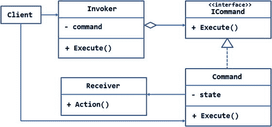

图 7-4。

UML diagram illustrating command pattern

如图所示，`ICommand`接口代表一个命令的抽象。它有一个`Execute()`方法，该方法应该在目标接收器上执行请求的操作。

`ICommand`接口是由`Command`类实现的。根据应用的需求，可以有许多这样的`ICommand`实现。`Command`类可以保存由 state 私有成员指示的特定于该命令的一些状态。它还包含了`Execute()`方法的实现。`Execute()`实际执行目标上的一个操作——`Receiver`类。

`Receiver`类是要调用其操作的实际对象。要调用的操作由`Action()`方法指示。

客户端不直接调用`Command`对象的`Execute()`方法。相反，它使用了`Invoker`类，该类包含一个或多个由聚合符号指示的命令对象。`Invoker`的`Execute()`方法决定何时调用它持有的`Command`对象的`Execute()`方法。`Invoker`也可以执行诸如命令排队和重做/撤销命令的任务。

请注意，`Client`显示使用了`Invoker`和`Command`对象。这是因为客户端需要告诉`Invoker`哪些命令将被调用。

### 例子

现在您已经知道了命令模式是如何工作的，让我们继续开发一个示例来说明它是如何工作的。

假设您正在开发一个供公司人力资源部门使用的 web 应用。当新选择的候选人即将加入公司时，人力资源部门希望确保及时提供该员工的电子邮件帐户、身份证和名片。

人力资源部门的员工从 web 界面发起对所有这三个操作的请求。然而，这三个操作由三个独立的系统处理。例如，创建电子邮件帐户的请求可能由公司的 IT 部门处理，而打印名片的请求可能由某个第三方供应商或其他部门处理。

为了简化对这些操作的整体跟踪，决定将这三个请求作为单个事务来执行。如果请求的任何部分由于某种原因失败，所有其他请求也应该被取消。这样，所有的操作都作为一个包来处理。

考虑到这些要求，可以设计如图 [7-5](#Fig5) 所示的系统。

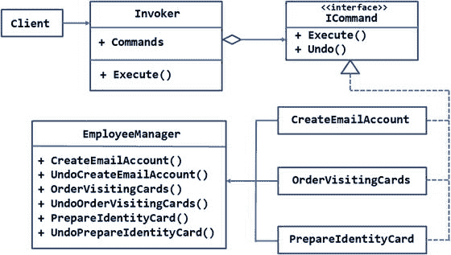

图 7-5。

Requesting employee operations through the command pattern

如您所见，执行任务的最终`Receiver`对象是`EmployeeManager`类。这个类有六种方法，分别是`CreateEmailAccount()`、`UndoCreateEmailAccount()`、`OrderVisitingCards()`、`UndoOrderVisitingCards()`、`PrepareIdentityCard()`和`UndoPrepareIdentityCard()`。正如您可能已经猜到的，“撤销”方法取消相应的任务，而其他方法执行所请求的任务。

客户端不应该直接调用这些方法，因为它可能不知道取消逻辑。客户端应该简单地发出请求。

因此，我们需要将这三对操作封装到各自的命令对象中。类别`CreateEmailAccount`、`OrderVisitingCards`和`PrepareIdentityCard`代表这些命令。

命令类基于`ICommand`接口，该接口由两个方法组成— `Execute()`和`Undo()`。当`Execute()`方法被实现时，它在`EmployeeManager`上执行所请求的操作。`Undo()`方法在执行时，取消先前执行的操作。

`Invoker`类维护一个`ICommand`对象的通用列表。这份名单被曝光为`Commands`财产。`Invoker`需要一个列表，因为可能有不止一个命令要执行。`Invoker`类的`Execute()`方法执行命令，并包含在出错时取消请求的逻辑。

图 7-6 显示了使用这些类的应用的主页。

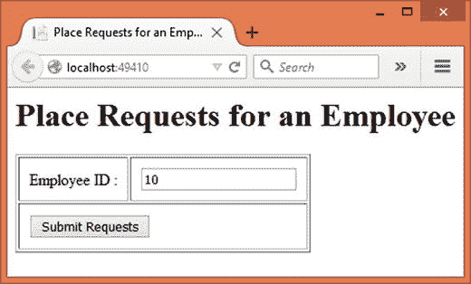

图 7-6。

Placing requests for employee accessories

如您所见，该页面接受员工 ID。输入员工 ID 并单击 Submit 按钮后，将发出电子邮件地址、名片和身份证的请求，并向用户显示一条成功消息。

要开发这个应用，首先使用 Visual Studio 创建一个名为`Command`的新 ASP.NET web 应用项目，并将其配置为使用 MVC 和实体框架(参见第 [1 章](01.html)了解更多细节)。还要在`appsettings.json`文件中存储`CommandDb`的数据库连接字符串——应用使用的数据库。

然后将`AppSettings`类添加到`Core`文件夹中，并将`ConnectionString`属性添加到其中。同样，从`Startup`类中设置这个属性，就像前面的例子一样。

现在，将`CommandQueueItem`类添加到`Core`文件夹中，并在其中编写清单 [7-11](#Par318) 中所示的代码。

```cs
[Table("CommandQueue")]
public class CommandQueueItem
{
    [DatabaseGenerated(DatabaseGeneratedOption.Identity)]
    public int Id { get; set; }

    [Required]
    public int EmployeeId { get; set; }

    [Required]
    public string CommandText { get; set; }
}

Listing 7-11.CommandQueueItem Class

```

`CommandQueueItem`类被映射到`CommandQueue`表，表示由处理系统处理的单个请求。它包含三个属性— `Id`、`EmployeeID`和`CommandText`。`CommandText`属性仅仅是一个指示所请求操作的字符串。在一个更现实的系统中，一些独立的系统将参与处理所请求的操作。

接下来，添加带有`CommandQueue DbSet`的`AppDbContext`类，如清单 [7-12](#Par332) 所示。

```cs
public class AppDbContext:DbContext
{
    public DbSet<CommandQueueItem> CommandQueue { get; set; }

    protected override void OnConfiguring(DbContextOptionsBuilder optionsBuilder)
    {
        optionsBuilder.UseSqlServer(AppSettings.ConnectionString);
    }
}

Listing 7-12.AppDbContext Class

```

然后将`EmployeeManager`类添加到`Core`文件夹中。清单 7-13 展示了`EmployeeManager`类的框架。

```cs
public class EmployeeManager
{
    private int employeeId;

    public EmployeeManager(int employeeid)
    {
        this.employeeId = employeeid;
    }

    public void CreateEmailAccount()
    {
    }

    public void UndoCreateEmailAccount()
    {
    }

    public void OrderVisitingCards()
    {
    }

    public void UndoOrderVisitingCards()
    {
    }

    public void PrepareIdentityCard()
    {
    }

    public void UndoPrepareIdentityCard()
    {
    }
}

Listing 7-13.Skeleton of EmployeeManager Class

```

`EmployeeManager`类构造函数接受一个雇员 ID，并将其存储在一个私有变量中以备后用。`EmployeeManager`包含六种方法，分别是`CreateEmailAccount()`、`UndoCreateEmailAccount()`、`OrderVisitingCards()`、`UndoOrderVisitingCards()`、`PrepareIdentityCard()`和`UndoPrepareIdentityCard()`。

“Do”方法执行相应的操作，而“Undo”方法取消请求。例如，`CreateEmailAccount()`方法发出创建电子邮件帐户的请求，而`UndoCreateEmailAccount()`方法取消该请求。

这些方法非常相似，因为“Do”方法创建一个`CommandQueueItem`对象并向`CommandQueue`表添加一个条目，而“Undo”方法从`CommandQueue`表中删除一个条目。为了节省篇幅，这里不讨论所有的方法。将讨论`CreateEmailAccount()`和`UndoCreateEmailAccount()`方法。清单 [7-14](#Par378) 显示了`CreateEmailAccount()`方法。

```cs
public void CreateEmailAccount()
{
    using (AppDbContext db = new AppDbContext())
    {
        CommandQueueItem item = new CommandQueueItem();
        item.EmployeeId = this.employeeId;
        item.CommandText = "EMAIL_ACCOUNT";
        db.CommandQueue.Add(item);
        db.SaveChanges();
    }
}

Listing 7-14.CreateEmailAccount() Method

```

`CreateEmailAccount()`方法创建一个`CommandQueueItem`对象并设置它的`EmployeeID`和`CommandText`属性。然后使用`SaveChanges()`方法将条目添加到`CommandQueue DbSet`并保存到底层表中。

取消请求的`UndoCreateEmailAccount()`如清单 [7-15](#Par391) 所示。

```cs
public void UndoCreateEmailAccount()
{
    using (AppDbContext db = new AppDbContext())
    {
        CommandQueueItem item = db.CommandQueue.
               Where(i => i.EmployeeId == employeeId
               && i.CommandText == "EMAIL_ACCOUNT")
               .SingleOrDefault();
        if (item != null)
        {
            db.Entry(item).State = EntityState.Deleted;
            db.SaveChanges();
        }
    }
}

Listing 7-15.UndoCreateEmailAccount() Method

```

`UndoCreateEmailAccount()`方法获取与特定的`EmployeeID`和`CommandText`(在本例中为`EMAIL_ACCOUNT`)匹配的条目，然后通过设置其`State`属性并调用`SaveChanges()`方法从表中删除记录。

您可以通过将`CommandText`更改为适当的值来完成类似的其他方法。你也可以从本书的源代码下载中获得`EmployeeManager`类的完整源代码。

然后在`Core`文件夹中添加一个`ICommand`接口，并在其中写入清单 [7-16](#Par409) 所示的代码:

```cs
public interface ICommand
{
    void Execute();
    void Undo();
}

Listing 7-16.
ICommand Interface

with TargetDate and Execute( )

```

`ICommand`接口由两个方法组成— `Execute()`和`Undo()`。

现在，向`Core`文件夹添加三个类——`CreateEmailAccount`、`OrderVisitingCards`和`PrepareIdentityCard`。所有这些类都实现了`ICommand`接口，并在`EmployeeManager`上调用各自的方法。因为这些类彼此完全相同，所以这里不讨论所有的类。清单 [7-17](#Par416) 中显示了`CreateEmailAccount`类。

```cs
public class CreateEmailAccount :ICommand
{
    private EmployeeManager manager;

    public CreateEmailAccount(EmployeeManager manager)
    {
        this.manager = manager;
    }

    public void Execute()
    {
        manager.CreateEmailAccount();
    }

    public void Undo()
    {
        manager.UndoCreateEmailAccount();
    }

}

Listing 7-17.CreateEmailAccount Class

```

`CreateEmailAccount`类的构造函数接受一个`EmployeeManager`对象作为参数。对`EmployeeManager`的引用存储在一个局部变量中，以备后用。

然后，`Execute()`方法调用`EmployeeManager`上的`CreateEmailAccount()`方法。同样，`Undo()`方法在`EmployeeManager`上调用`UndoCreateEmailAccount()`。

您可以通过调用`EmployeeManager`上相应的方法对，以类似的方式创建剩余的两个类。

接下来，将`Invoker`类添加到`Core`文件夹中。清单 [7-18](#Par440) 显示了完整的`Invoker`类。

```cs
public class Invoker
{
    public List<ICommand> Commands { get; set; } = new List<ICommand>();

    public void Execute()
    {
        try
        {
            foreach (ICommand command in Commands)
            {
                command.Execute();
            }
        }
        catch
        {
            foreach (ICommand command in Commands)
            {
                command.Undo();
            }
        }
    }
}

Listing 7-18.Invoker Class Invoking the Commands

```

`Invoker`类维护一个`ICommand`对象的列表。客户端代码根据需求将命令添加到这个列表中。try-catch 块捕获发出请求时出现的任何异常。

try 块中的`foreach`循环遍历命令列表，并对每个命令对象调用`Execute()`方法。如果发出请求时出错，catch 块中的另一个`foreach`循环将遍历命令列表，并调用命令对象上的`Undo()`方法。

接下来，将`HomeController`类添加到`Controllers`文件夹中。除了默认的`Index()`动作之外，给它添加一个`ProcessEmployee()`动作，如清单 [7-19](#Par465) 所示。

```cs
[HttpPost]
public IActionResult ProcessEmployee(int employeeid)
{
    EmployeeManager manager = new EmployeeManager(employeeid);
    Invoker invoker = new Invoker();
    ICommand command = null;

    command = new CreateEmailAccount(manager);
    invoker.Commands.Add(command);
    command = new OrderVisitingCards(manager);
    invoker.Commands.Add(command);
    command = new PrepareIdentityCard(manager);
    invoker.Commands.Add(command);
    invoker.Execute();

    ViewBag.Message = $"Commands executed for employee #{employeeid}";
    return View("Index", employeeid);
}

Listing 7-19.ProcessEmployee() Action Initiates the Requests

```

当用户点击`Index`视图上的提交按钮时，就会调用`ProcessEmployee()`动作。它接收用户输入的雇员 ID 作为其参数。在内部，代码通过向其传递雇员 ID 来创建一个`EmployeeManager`对象。还创建了一个`Invoker`类的实例。

然后一系列命令被添加到`Invoker`对象的`Commands`列表中。这段代码将所有三个命令— `CreateEmailAccount`、`OrderVisitingCards`和`PrepareIdentityCard`—添加到命令列表中。一旦添加了命令，就会调用`Invoker`的`Execute()`方法。在`ViewBag`中设置一条消息，向用户提示操作成功。

最后，将`Index`视图添加到`Views/Home`文件夹中，并将清单 [7-20](#Par487) 中所示的标记添加到其中。

```cs
<html>
<head>
    <title>Place Requests for an Employee</title>
</head>
<body>
    <h1>Place Requests for an Employee</h1>
    <form asp-action="ProcessEmployee" asp-controller="Home" method="post">
        <table border="1" cellpadding="10">
            <tr>
                <td><label for="employeeid">Employee ID :</label></td>
                <td><input type="text" name="employeeid" value="@Model" /></td>
            </tr>
            <tr>
                <td colspan="2">
                    <input type="submit" value="Submit Requests" />
                </td>
            </tr>
        </table>
    </form>

    <h4>@ViewBag.Message</h4>
</body>
</html>

Listing 7-20.Markup of Index View

```

`Index`视图由一个表单组成，该表单提交给`HomeController` ( `asp-controller`属性)的`ProcessEmployee`动作(`asp-action`属性)。一个文本框接受雇员 ID 的值，一个按钮提交表单。页面底部还会输出来自`ViewBag`的成功消息。

这就完成了应用。在运行和测试应用之前，创建`CommandDb`数据库和`CommandQueue`表(更多细节参见第 [1](01.html) 章)。然后在`ProcessEmployee()`动作中设置一个断点并运行应用。输入一些测试员工 id，然后单击提交按钮。一旦到达断点，逐句通过代码来理解控制如何从`Invoker`流向命令，并最终流向`EmployeeManager`。

## 解释者

一边建设。NET 应用，你很少需要开发自己的“语言”最常见的是利用框架和 C# 中可用的特性来完成任务。然而，在某些情况下，定义自己的指令集，然后在代码中解释它可能是必要的。

我们用一个例子来理解这个。假设您正在开发一个复杂的网站，该网站允许将部分用户界面存储在数据库中。这意味着构成用户界面的 HTML 标记是从某个数据库表中提取的，然后呈现在用户界面上。

再往前一步，假设现在需要允许管理门户的人员将用户界面的一部分定义为其定制特性的一部分。进一步假设员工一般不精通 HTML 或 web 标记。所以，你需要开发一个他们容易理解和使用的简化标记。例如，为了表示日期选择器，标准 HTML 使用以下语法:

```cs
<form action="/home/process" method="post">
 <input type="date" name="datepicker1" min="some_min_val" max="some_max_val" />
</form>

```

您可能希望将其简化为:

```cs
[form postTo="process"]
 [datePicker minDate="some_val" maxDate="some_val" allowTime="false"]
[end]

```

后面的标记成为这个应用上下文中的新“语言”。因为这是一个新定义的指令集，所以需要一个解释器来为系统的其余部分解码它的含义。这就是解释器模式发挥作用的地方。

解释器模式在给定应用的上下文中解释给定的指令集。指令集必须有明确定义的语法规则，以便正确解释指令。例如，系统必须清楚哪些可能的值可以分配给`allowTime`属性，或者如何指定日期值。

### 设计和解释

图 [7-7](#Fig7) 中的 UML 图说明了解释器模式。

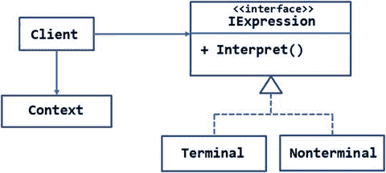

图 7-7。

UML diagram illustrating the interpreter pattern

`IExpression`接口表示正在考虑的新语言的表达式或语句。它有一个`Interpret()`方法，在实现时，应该解释表达式。

两个具体的类`Terminal`和`Nonterminal`实现了`IExpression`接口。`Terminal`类表示要解释的单个语言语句，而`Nonterminal`类表示要解释的一组表达式(通常是嵌套的)。`Nonterminal`类可能使用递归或类似的技术来评估所有的语句。

`Context`类表示解释器可能需要的全局状态。这门课是选修的。如果没有要使用的全局状态，可以省略这个类。

`Client`类有需要解释的指令集(语言语句或表达式的列表)。如何收集这个指令集取决于应用。例如，一些应用可能将指令集存储在文本文件中。其他一些应用可能会从最终用户那里接受它。而其他一些应用可能会从数据库中选择它。

### 例子

现在您已经知道了解释器模式的用法，让我们将这些知识应用到一个例子中。

假设您正在构建一个非常大且复杂的网站。您已经创建了一组类库，这些类库定义了各种网站管理任务，例如备份文件和数据库、将文件从一个位置移动到另一个位置、删除临时文件等等。

管理员和辅助人员有一个管理模块供他们使用。管理模块提供了一个调用类库并完成所需任务的用户界面。

虽然前面的安排在大多数情况下都有效，但有时管理员会发现他们需要定义管理模块没有涵盖的自定义任务。此外，此类任务本身非常独特，修改管理模块以涵盖所有可能性是不可能的。

因此，决定应该有一种方法在运行时从类库中动态调用 API。有几种可能性:

*   一个命令行工具，它接受程序集名称、类名、方法名称和方法参数，然后使用。净反射。
*   JSON 文件(*。json)，它存储诸如程序集名称、类名、方法名称和方法参数等详细信息。JSON 文件可以上传到服务器上，然后使用。净反射。

作为一个例子，我们将使用刚才提到的 JSON 文件方法。要了解 JSON 的外观，请考虑以下标记:

```cs
{
  "AssemblyName": "FileManagerLib.dll",
  "ClassName": "FileManagerLib.FileManager",
  "MethodName": "CreateFolder",
  "Parameters": [ "TestFolder" ]
}

```

这个 JSON 片段对应用意味着这一点——加载`FileManager`程序集，并通过将 TestFolder(要创建的文件夹的名称)作为参数传递来调用其`FileManagerLib.FileManager`类上的`CreateFolder`方法。

Note

如果您发现 JSON 和指令有点复杂难以理解，在这个阶段不要太担心。随着您继续进行并开发完整的示例，事情会变得很清楚。

如您所见，JSON 文件定义的指令集是特定于应用的，因此需要一个解释器来为系统的其余部分解码。`AssemblyName`、`ClassName`、`MethodName`成为指令集的词汇。和规则(如参数)的顺序必须与实际方法成为给定上下文中的语法的顺序相同。

图 [7-8](#Fig8) 显示了利用解释器模式实现目标的安排。

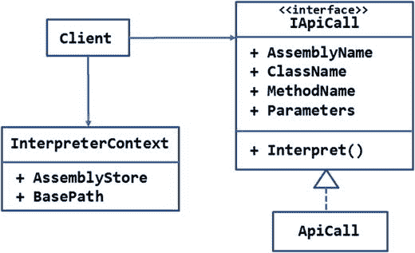

图 7-8。

ApiCall class interprets the JOSN and invokes the class library

`IApiCall`接口代表 API 调用的抽象。这里，API 调用意味着调用驻留在特定程序集中的类的方法。`IApiCall`接口由四个属性组成— `AssemblyName`、`ClassName`、`MethodName`和`Parameters`—以及`Interpret()`方法。属性代表相应的信息片段。`Interpret()`方法的实现应该加载程序集并进行 API 调用。`IApiCall`是在`ApiCall`类中实现的。

`InterpreterContext`类保存了`ApiCall`类需要的两条信息— `AssemblyStore`和`BasePath`。`AssemblyStore`属性表示存储程序集(编译后的类库)的文件夹。`BasePath`属性指向 web 应用的`wwwroot`文件夹的完整路径。文件系统操作(如复制文件和删除文件)需要此路径。

控制器充当客户机，填充`InterpreterContext`属性，还加载包含指令集的 JSON 文件。指令集然后被提供给`ApiCall`类。

您在本节中开发的应用的主页只允许您使用文件输入字段选择一个或多个 JSON 文件(图 [7-9](#Fig9) )。单击 Submit 按钮后，JSON 文件将被处理，如前所述。

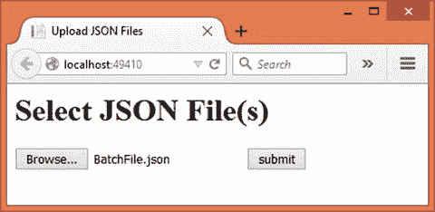

图 7-9。

Selecting *.json Files Containing the Instruction Set

要开发这个应用，首先使用 Visual Studio 创建一个名为`Interpreter`的新 ASP.NET web 应用项目，并将其配置为使用 MVC(参见第 [1 章](01.html)了解更多细节)。

然后在`Core`文件夹中添加一个`InterpreterContext`类，并在其中添加`AssemblyStore`和`BasePath`属性，如清单 [7-21](#Par554) 所示。

```cs
public class InterpreterContext
{
    public string AssemblyStore { get; set; }
    public string BasePath { get; set; }
}

Listing 7-21.InterpreterContext Class

```

`AssemblyStore`和`BasePath`属性非常简单，前面已经讨论过了。

然后将`IApiCall`接口添加到`Core`文件夹中，并添加清单 [7-22](#Par561) 中所示的属性和方法定义。

```cs
public interface IApiCall
{
    string AssemblyName { get; set; }
    string ClassName { get; set; }
    string MethodName { get; set; }
    List<string> Parameters { get; set; }

    void Interpret(InterpreterContext context);
}

Listing 7-22.IApiCall Interface

```

`IApiCall`界面由四个属性组成— `AssemblyName`、`ClassName`、`MethodName`和`Parameters`。注意，`Parameters`属性是一个通用的字符串列表。该集合中的每个条目代表要调用的方法的参数值。参数必须按照它们在方法签名中出现的顺序添加。

`Interpret()`方法接受`InterpreterContext`对象作为它的参数。这样，诸如`AssemblyStore`和`BasePath`这样的信息就可供解释指令的代码使用。

接下来，将一个`ApiCall`类添加到`Core`文件夹中，并在其上实现`IApiCall`接口。完整的`ApiCall`级如清单 [7-23](#Par573) 所示。

```cs
public class ApiCall : IApiCall
{
    public string AssemblyName { get; set; }
    public string ClassName { get; set; }
    public string MethodName { get; set; }
    public List<string> Parameters { get; set; }

    public void Interpret(InterpreterContext context)
    {
        Assembly assembly = Assembly.LoadFile(context.AssemblyStore + $"\\{AssemblyName}");
        Type type = assembly.GetType(ClassName);
        object obj = Activator.CreateInstance(type, context.BasePath);
        MethodInfo method = type.GetMethod(MethodName);
        method.Invoke(obj, Parameters.ToArray());
    }
}

Listing 7-23.ApiCall Class Interprets the Instructions

```

`Interpret()`方法使用来自`System.Reflection`名称空间的类(确保从`Project.json`的框架部分删除`dnxcore50`条目)。首先，它加载包含要调用的类和方法的程序集。这是通过使用`Assembly`类的`LoadFrom()`静态方法并提供程序集的完整路径和名称(*。dll)文件。请注意在获取程序集路径时使用了`InterpreterContext AssemblyStore`属性。

然后使用`Assembly`对象的`GetType()`方法获得所需类的`Type`实例。

然后使用`Activator.CreateInstance()`方法实例化这个`Type`。`CreateInstance()`方法有两个参数——要创建其实例的`Type`对象和构造函数参数(如果需要的话)。代码将`BasePath`传递给构造函数。

到目前为止，您还没有创建`FileManagerLib`程序集。稍后您将创建它。现在，可以说`FileManager`类构造函数接受网站根文件夹的路径作为它的参数。

一旦获得了对象，`GetMethod()`方法被用来获得一个`MethodInfo`对象，该对象描述了由`MethodName`属性指示的方法。

最后，使用`MethodInfo`实例的`Invoke()`方法在对象上调用该方法。`Invoke()`方法接受调用该方法的对象以及一组方法参数。在这种情况下，方法参数从`Parameters`通用列表中获得。

现在，将`HomeController`添加到`Controllers`文件夹中。除了默认的`Index()`动作，您还需要一个处理上传的 JSON 文件的动作。清单 [7-24](#Par596) 中显示了执行此操作的`ExecuteJSON()`动作。

```cs
public IActionResult ExecuteJSON(List<IFormFile> files)
{
    foreach (IFormFile file in files)
    {
        ContentDispositionHeaderValue header = ContentDispositionHeaderValue.Parse(file.ContentDisposition);
        string fileName = header.FileName;
        fileName = fileName.Trim('"');
        fileName = Path.GetFileName(fileName);
        string filePath = env.MapPath("BatchFiles\\" + fileName);
        file.SaveAs(filePath);

        List<ApiCall> apiCalls = JsonConvert.DeserializeObject<List<ApiCall>>(System.IO.File.ReadAllText(filePath));
        InterpreterContext context = new InterpreterContext();
        context.AssemblyStore = env.MapPath("AssemblyStore");
        context.BasePath = env.WebRootPath;

        foreach (ApiCall call in apiCalls)
        {
            call.Interpret(context);
        }
    }
    ViewBag.Message = "API calls from the file(s) have been executed!";
    return View("Index");
}

Listing 7-24.ExecuteJSON() Action that Deals with the JSON Files

```

代码将上传的文件保存到`wwwroot/BatchFiles`文件夹。您应该对这段代码很熟悉，因为您在前面的示例中多次使用过它。

一旦 JSON 文件保存在服务器上，您需要读取 JSON 文件并将其转换成`ApiCall`对象。这是在一个`Json.Net`组件的帮助下完成的。在编写这段代码之前，确保将`Json.Net`的 NuGet 包添加到您的项目中。添加之后，您可以使用`JsonConvert`类(`Newtonsoft.Json`名称空间)来解析和读取 JSON 文件。`JsonConvert`类的`DeserializeObject()`泛型方法接受 JSON 字符串数据并返回一个`ApiCall`对象的泛型列表。注意，因为`DeserializeObject()`方法需要一个字符串，所以上传的 JSON 文件是使用`File`类的`ReadAllText()`方法读入的。

然后`InterpreterContext`被创建，它的`AssemblyStore`和`BasePath`属性被分别设置到`/wwwroot/AssemblyStore`文件夹和`/wwwroot`文件夹。这是使用构造函数注入的`IHostingEnvironment`对象的`MapPath()`方法和`WebRoot`属性完成的。

一个`foreach`循环遍历`ApiCall`对象的列表，并在每个`ApiCall`对象上调用`Interpret()`方法。`InterpreterContext`也被传递给`Interpret()`方法。

一旦`foreach`循环完成，在`ViewBag`中设置一条消息，指示操作成功完成。

最后，将`Index`视图添加到`/Views/Home`文件夹中，并将清单 [7-25](#Par626) 中所示的标记写入其中。

```cs
<html>
<head>
    <title>Upload JSON Files</title>
</head>
<body>
    <h1>Select JSON File(s)</h1>
    <form asp-controller="Home" asp-action="ExecuteJSON" method="post" enctype="multipart/form-data">
        <input type="file" name="files" id="files" multiple />
        <input type="submit" value="submit" />
    </form>
    <h2>@ViewBag.Message</h2>
</body>
</html>

Listing 7-25.Markup of Index View

```

您应该对这个标记很熟悉，因为您在前面的例子中使用过它。它基本上由一个包含文件输入字段和提交按钮的表单组成。表单被发布到您之前编写的`ExecuteJSON()`动作。

虽然这样就完成了 web 应用，但是您仍然需要创建 web 应用正在使用的`FileManagerLib`类库。要创建它，向同一个解决方案添加一个新的类库项目，并将该项目命名为`FileManagerLib`。然后将`FileManager`类添加到项目中。清单 [7-26](#Par641) 显示了`FileManager`类的完整代码。

```cs
public class FileManager
{
    private string basePath;

    public FileManager(string basepath)
    {
        this.basePath = basepath;
    }

    public void CreateFolder(string location)
    {
        Directory.CreateDirectory(basePath + "\\" + location);
    }

    public void CopyFiles(string sourceFolder,string destinationFolder,string pattern)
    {
        sourceFolder = basePath + "\\" + sourceFolder;
        destinationFolder = basePath + "\\" + destinationFolder;

        string[] files = Directory.GetFiles(sourceFolder,pattern);
        foreach(string source in files)
        {
            string destination = destinationFolder + "\\" + Path.GetFileName(source);
            File.Copy(source, destination);
        }
    }

    public void DeleteFiles(string location,string pattern)
    {
        location = basePath + "\\" + location;
        string[] files = Directory.GetFiles(location, pattern);
        foreach (string file in files)
        {
            File.Delete(file);
        }
    }
}

Listing 7-26.FileManager Class

```

我们不会详细讨论`FileManager`类，因为这个类仅仅用于测试目的，执行基本的文件系统管理任务。注意以下情况就足够了:

*   `FileManager`构造函数接受一个字符串参数——`wwwroot`文件夹的物理基本路径。回想一下`ApiCall`的`Interpret()`方法使用反射传递这个参数。
*   `FileManager`类包含三个方法— `CreateFolder()`、`CopyFiles()`和`DeleteFiles()`。`CreateFolder()`方法在给定的位置创建一个新的文件夹。`CopyFiles()`方法将文件从源文件夹复制到目标文件夹。方法从文件夹中删除文件。`CopyFiles()`和`DeleteFiles()`方法允许您指定文件匹配模式(例如，*。png)。
*   JSON 文件中指定了`FileManagerLib`程序集、`FileManager`类和三个方法。

一旦你完成了`FileManagerLib`类库，编译它并将它的程序集(`FileManagerLib.dll`)复制到`wwwroot`下的`AssemblyStore`文件夹中(你将需要创建这个文件夹)。同样在`wwwroot`下创建`BatchFiles`文件夹。

这就完成了应用；现在是检验的时候了。您需要创建一个包含指令的 JSON 文件来测试应用。您可以在记事本或 Visual Studio 中这样做。清单 [7-27](#Par685) 显示了一个示例 JSON 文件。

```cs
[
  {
    "AssemblyName": "FileManagerLib.dll",
    "ClassName": "FileManagerLib.FileManager",
    "MethodName": "CreateFolder",
    "Parameters": [ "TestFolder" ]
  },
  {
    "AssemblyName": "FileManagerLib.dll",
    "ClassName": "FileManagerLib.FileManager",
    "MethodName": "CopyFiles",
    "Parameters": ["Images","TestFolder","*.*"]
  },
  {
    "AssemblyName": "FileManagerLib.dll",
    "ClassName": "FileManagerLib.FileManager",
    "MethodName": "DeleteFiles",
    "Parameters": ["TestFolder","*.gif"]
  }
]

Listing 7-27.BatchScript.json File Containing Instructions

```

如您所见，`BatchScript.json`文件由一个包含三个元素的数组组成。每个数组元素指定一个`AssemblyName`、`ClassName`、`MethodName`和`Parameters`。`Parameters`本身以字符串数组的形式指定。

注意，JSON 属性名，比如`AssemblyName`和`ClassName`，必须批处理到`ApiCall`类的属性。这是因为`JsonConvert`类基于这种映射将 JSON 文件反序列化为`ApiCall`对象。

`AssemblyName`指向组件`FileManagerLib.dll`。`ClassName`指定了类的全限定名— `FileManagerLib.FileManager`。`MethodName`指定要调用的方法，如`CopyFiles`。而`Parameters`数组指定了该方法所期望的参数值列表。然后在`wwwroot/Images`文件夹中添加几个文件。

就这样！现在运行 web 应用并将`BatchScript.json`文件上传到服务器。如果一切顺利，你会发现在`wwwroot`下创建了一个`TestFolder`文件夹。来自`Images`文件夹的文件也被复制到`TestFolder`。所有的 GIF 文件(如果有的话)都会从`TestFolder`中删除。

Note

在前面的例子中，一个 JSON 文件充当了指令集的来源。然而，这并不总是必要的。您甚至可以从用户界面接受指令(`AssemblyName`、`ClassName`、`MethodName`和`Parameters`)，然后使用`ApiCall`类的`Interpret()`方法调用它们。

## 迭代程序

很多时候，您的代码需要处理一组对象。您可能知道`System.Collections`和`System.Collections.Generic`名称空间提供了许多表示对象集合的类。安`ArrayList`、`List`、`Dictionary`就是其中的一些。

遍历对象集合在。NET 应用。在 C# 中，`foreach`循环简化了对集合中单个元素的整体访问。

在许多情况下，内置的集合类很好地满足了顺序迭代和访问集合的目的。但是，在某些情况下，您可能希望设计自己的方法来循环访问集合。

假设您有一些存储为 JSON 文件的数据。客户机想要读取和访问数据——它必须知道 JSON 文件的结构。迭代器模式可以将逻辑从客户机中分离出来，并提供一种简化的、类似光标的方式来遍历 JSON 文件。

在这种情况下，迭代器模式很方便。迭代器模式允许您的代码顺序访问聚合对象的单个元素。这样，客户端就不会知道聚合对象的内部细节。

### 设计和解释

图 [7-10](#Fig10) 中的 UML 图说明了迭代器模式。

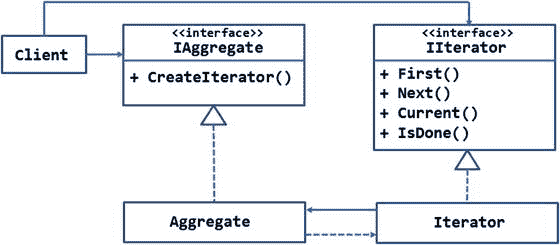

图 7-10。

UML diagram illustrating iterator pattern

`IIterator`接口定义了迭代器的抽象。它有`First()`、`Next()`、`Current()`、`IsDone()`等方法。`First()`方法将光标移动到聚合的第一个元素。`Next()`方法将光标移动到聚合的下一个元素。`Current()`方法返回光标在给定时间点指向的元素。最后，`IsDone()`表示聚合对象的所有元素是否已经被迭代。

`Iterator`类实现了`IIterator`,并为刚才提到的方法提供了具体的实现。

`Iterator`对象简单地遍历一个集合。实际的集合由`IAggregate`接口表示。`IAggregate`接口的`CreateIterator()`方法在实现时应该返回一个`Iterator`对象，用于遍历集合。

`Aggregate`类实现了`IAggregate`接口，并表示要迭代的元素集合。

注意`Aggregate`和`Iterator`类之间的联系。`Aggregate`和`Iterator`之间的虚线箭头表示`Aggregate`对`Iterator`的依赖。`Iterator`和`Aggregate`之间的实线箭头表示它们之间的关联。

客户端使用两个对象— `IAggregate`和`IIterator`。

尽管迭代器模式可以在 C# 中实现，如图 [7-10](#Fig10) 所示，但是。NET framework 有一个内置的方式，以`IEnumerable`和`IEnumerator`接口的形式实现。因此，下一节将讨论并使用这种方法，而不是刚才讨论的方法。

### 例子

假设您有一个包含大量记录的数据库表。为了减少代码的内存占用并提高性能，我们决定使用`SqlDataReader`来代替预先获取并存储数据。

然而，由于以下原因，使用`SqlDataReader`可能会使客户端代码变得有点困难并且可读性较差:

*   要使用`SqlDataReader`,客户端还需要知道表模式。客户端需要知道数据类型和列序号，或者名称，以便使用像`GetString()`和`GetInt32()`这样的方法。
*   客户端代码将与 SQL Server 数据提供程序紧密耦合，并且数据访问逻辑中的任何未来更改可能也需要更改客户端代码。
*   一旦完成，客户端将需要注意关闭`SqlDataReader`，以确保底层数据库连接被正确关闭。

因此，决定客户端代码不应该直接使用`SqlDataReader`。客户端代码应该看起来像是在迭代一个标准集合。

刚刚描述的场景很适合使用迭代器模式。图 [7-11](#Fig11) 显示了所述系统的设计。该设计假设将使用实现来迭代`Northwind`数据库的`Orders`表。

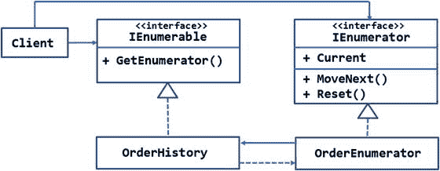

图 7-11。

Iterating through SqlDataReader using the iterator pattern

图 [7-11](#Fig11) 所示的设计利用了。NET 框架的内置接口——`IEnumerable`和`IEnumerator`——用于实现迭代器模式。这些接口有两种风格——泛型和非泛型。前一种风格在`System.Collections.Generic`名称空间中可用，后一种风格在`System.Collections`名称空间中可用。因为泛型集合比非泛型集合好，所以我们将在实现中使用泛型接口。

`IEnumerator`接口由两个方法组成— `MoveNext()`和`Reset()`。`OrderEnumerator`类代表了`IEnumerator`接口的具体实现。`MoveNext()`实现负责将当前元素指针移动到下一个订单。方法将指针移回到集合的开头。Current 属性返回迭代器指向的当前顺序。

`IEnumerable`接口可以由任何表示集合或集合的对象实现。在本例中，`OrderHistory`就是这样一个聚合对象，它处理 orders 表中的所有订单。`IEnumerable`接口要求`OrderHistory`类实现`GetEnumerator()`方法。`GetEnumerator()`向聚合返回一个`IEnumerator`对象(本例中为`OrderEnumerator`),用于迭代其元素。

客户端代码使用一个`foreach`循环来遍历`OrderHistory`类。它还可以访问迭代器当前指向的顺序。

您在本节中构建的应用看起来有点像图 [7-12](#Fig12) 中所示的应用。

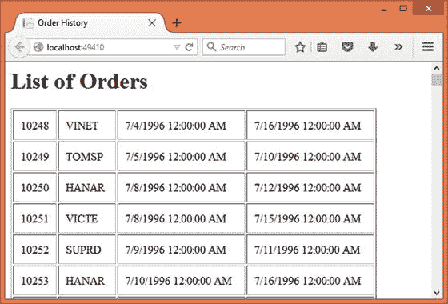

图 7-12。

Table rendered by iterating through OrderHistory

如您所见，该应用只显示了一个订单表。对于每个订单，显示其`OrderID`、`CustomerID`、`OrderDate`和`ShippedDate`。

要开发这个应用，首先使用 Visual Studio 创建一个名为`Iterator`的新 ASP.NET web 应用项目，并将其配置为使用 MVC(参见第 [1 章](01.html)了解更多细节)。

另外，在`appsettings.json`文件中存储`Northwind`数据库的数据库连接字符串。然后将带有`ConnectionString`属性的`AppSettings`类添加到`Core`文件夹中。您需要在`Startup`类中设置`ConnectionString`属性，就像您在前面的例子中所做的那样。

然后将`Order`类添加到`Core`文件夹中。`Order`类代表了`OrderHistory`类的一个元素，如清单 [7-28](#Par739) 所示。

```cs
public class Order
{
    public int OrderID { get; set; }
    public string CustomerID { get; set; }
    public DateTime OrderDate { get; set; }
    public DateTime ShippedDate { get; set; }
}

Listing 7-28.Order Class Holding Details of an Order

```

`Order`类由四个属性组成，即`OrderID`、`CustomerID`、`OrderDate`和`ShippedDate`。这些属性对应于`Northwind`数据库的`Orders`表的各个列。

现在向`Core`文件夹添加一个`OrderHistory`类，并在其中实现`IEnumerable<T>`接口。至此完成，`OrderHistory`的代码如清单 [7-29](#Par748) 所示。

```cs
public class OrderHistory : IEnumerable<Order>
{
    public SqlDataReader Cursor { get; set; }

    public OrderHistory(bool openImmediately)
    {
        if (openImmediately)
        {
            this.OpenCursor();
        }
    }

    public void OpenCursor()
    {
        SqlConnection cnn = new SqlConnection(AppSettings.ConnectionString);
        SqlCommand cmd = new SqlCommand();
        cmd.Connection = cnn;
        cmd.CommandType = CommandType.Text;
        cmd.CommandText = "select OrderID,CustomerID,OrderDate,ShippedDate from orders where shippeddate is not null order by orderdate";
        cnn.Open();
        this.Cursor = cmd.ExecuteReader(CommandBehavior.CloseConnection);
    }

    public IEnumerator<Order> GetEnumerator()
    {
        return new OrderEnumerator(this);
    }

    private IEnumerator GetEnumerator1()
    {
        return this.GetEnumerator();
    }

    IEnumerator IEnumerable.GetEnumerator()
    {
        return GetEnumerator1();
    }
}

Listing 7-29.OrderHistory Class Implementing IEnumerable<Order>

```

在您在`OrderHistory`类中编写任何代码之前，请确保在类文件的顶部导入`System.Data`、`System.Data.SqlClient`、`System.Collections`和`System.Collections.Generic`名称空间。您需要导入`System.Collections`和`System.Collections.Generic`名称空间，因为后者的`IEnumerable<T>`基于前者的`IEnumerable`。

`OrderHistory`类实现了`IEnumerable<T>`接口，并将`Order`指定为其通用类型。

然后`OrderHistory`类定义了`Cursor`公共属性。属性`Cursor`是一个`SqlDataReader`，并且需要是公共的，因为`OrderEnumerator`类需要遍历它。

`OrderHistory`类的`Constructor`接受一个布尔参数`openImmediately`，该参数指示是否应该立即创建`SqlDataReader`。如果这个参数为真，代码调用`OpenCursor()`私有方法。

`OpenCursor()`私有方法打开与`Northwind`数据库的连接，并使用`SqlCommand`对象触发一个`SELECT`语句。`SELECT`语句从数据库中获取`OrderID`、`CustomerID`、`OrderDate`和`ShippedDate`列值。注意，`ExecuteReader()`方法指定`CommandBehavior`值为`CloseConnection`。这样，在`SqlDataReader`上调用`Close()`方法也会关闭底层数据库连接。

`GetEnumerator()`方法以一个`OrderEnumerator`对象的形式返回`IEnumerator<Order>`(您将很快创建`OrderEnumerator`)。

接下来的两个方法——`GetEnumerator1()`和`IEnumerable.GetEnumerator()`——私有实现`IEnumerable`的`GetEnumerator()`方法。这是必需的，因为`IEnumerable<T>`本身继承自`IEnumerable`接口。

接下来，将一个`OrderEnumerator`类添加到`Core`文件夹中，并在其上实现`IEnumerator<T>`。清单 [7-30](#Par794) 中显示了`OrderEnumerator`类的完整代码。

```cs
public class OrderEnumerator : IEnumerator<Order>
{
    private OrderHistory history;

    public OrderEnumerator(OrderHistory history)
    {
        this.history = history;
    }

    public bool MoveNext()
    {
        if(history.Cursor.IsClosed)
        {
            history.OpenCursor();
        }
        return history.Cursor.Read();
    }

    public void Reset()
    {
        history.Cursor.Close();
    }

    public Order Current
    {
        get
        {
            Order currentOrder = new Order();
            currentOrder.OrderID = history.Cursor.GetInt32(0);
            currentOrder.CustomerID = history.Cursor.GetString(1);
            currentOrder.OrderDate = history.Cursor.GetDateTime(2);
            currentOrder.ShippedDate = history.Cursor.GetDateTime(3);
            return currentOrder;
        }
    }

    private object Current1
    {
        get
        {
            return Current;
        }
    }

    object IEnumerator.Current
    {
        get
        {
            return Current1;
        }
    }

    public void Dispose()
    {
        if (history.Cursor != null && history.Cursor.IsClosed == false)
        {
            history.Cursor.Close();
        }
    }
}

Listing 7-30.OrderEnumerator Implementing IEnumerator<Order>

```

`OrderEnumerator`类从声明私有变量`OrderHistory`开始。该变量在构造函数中赋值。

`MoveNext()`方法检查由`Cursor`属性公开的`SqlDataReader`是否打开。如果它是关闭的，`OpenCursor()`方法会打开它，这样代码就可以遍历记录。然后在`SqlDataReader`上调用`Read()`方法，使得记录指针前进到下一条记录。注意，最初记录指针放在记录的开头之前。因此，第一次调用`Read()`会将它移动到第一条记录上。对`Read()`的后续调用使记录指针一次向前移动一条记录。

`Reset()`方法通过调用其`Close()`方法来关闭`SqlDataReader`。回想一下之前`CommandBehavior`被设置为`CloseConnection`。因此，在`SqlDataReader`上调用`close`也会关闭底层连接。

`Current`属性是只读属性，因此只有`get`块。`get`块中的代码创建一个新的`Order`对象，并用来自`SqlDataReader`的数据填充它。注意使用`GetInt32()`、`GetString()`和`GetDateTime()`方法分别读取整数、字符串和`DateTime`列值。新创建的`Order`对象随后被返回给调用者。

为了私有地实现`IEnumerable`的`Current`属性，接下来的两个属性`Current1`和`IEnumerable.Current`是必需的。这是因为`IEnumerator<T>`继承了`IEnumerator`。

如果`SqlDataReader`是打开的，`Dispose()`方法会关闭它，这样底层数据库连接也会关闭。

接下来，在`Controllers`文件夹中添加`HomeController`。修改它的`Index()`动作以包含清单 [7-31](#Par862) 中所示的代码。

```cs
public IActionResult Index()
{
    OrderHistory history = new OrderHistory(true);
    List<Order> orders = new List<Order>();
    foreach (Order o in history)
    {
        orders.Add(o);
    }
    return View(orders);
}

Listing 7-31.Iterating Through OrderHistory Collection

```

`Index()`动作创建了一个`OrderHistory`的实例。传递给构造函数的`true`的值表示应该立即打开光标。

然后创建一个`Order`对象列表。这纯粹是为了测试的目的。在更现实的情况下，您将迭代通过`OrderHistory`，访问每一个`Order`对象，并根据您的要求处理它。这里，为了便于测试，代码只是从`OrderHistory`中抓取`Order`对象，并将它们放入另一个集合中。这是使用`foreach`回路完成的。

注意，`foreach`循环期望被迭代的集合实现`IEnumerable`或`IEnumerable<T>`接口。因此，它可以像预期的那样处理历史对象。

然后，`Order`对象的通用列表被传递给`Index`视图，以在表格中显示。

最后，将`Index`视图添加到`Views/Home`文件夹中，并将清单 [7-32](#Par877) 中所示的标记写入其中。

```cs
@model List<Iterator.Core.Order>
...
<h1>List of Orders</h1>
<table border="1" cellpadding="10">
    @foreach(var item in Model)
    {
      <tr>
        <td>@item.OrderID</td>
        <td>@item.CustomerID</td>
        <td>@item.OrderDate</td>
        <td>@item.ShippedDate</td>
      </tr>
   }
</table>
...

Listing 7-32.Markup of Index View

```

观点非常简单。它通过遍历作为`Model`传递的`Order`对象列表来显示一个表格。表格显示了每个订单的`OrderID`、`CustomerID`、`OrderDate`和`ShippedDate`属性。

这就完成了应用。您可以运行它并确认记录是否按预期显示。

## 摘要

行为模式关注系统如何行为和交流。本章涵盖了四种行为模式，即责任链、命令、解释器和迭代器。

当一个请求要由多个对象以链状方式处理时，使用责任链模式。处理请求的对象可以由客户端代码连接。一个处理程序在完成其工作后，调用链中的下一个处理程序。

命令模式将请求封装为一个对象。由于命令被表示为一个对象，因此诸如排队、重做和撤消之类的操作可以很容易地执行。

解释器模式用于解释应用上下文中的语言或指令集。它允许您定义、解析和执行特定于应用的指令集。

迭代器模式允许您顺序访问聚合对象的单个元素。

下一章将通过讨论中介、备忘录和观察者模式来继续讨论行为模式。