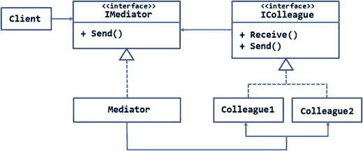
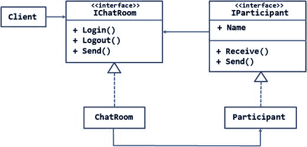
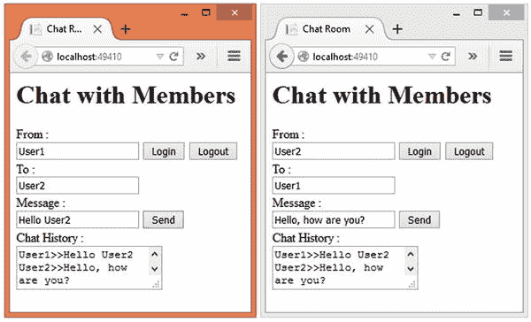
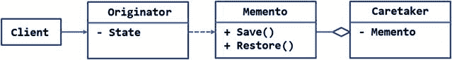
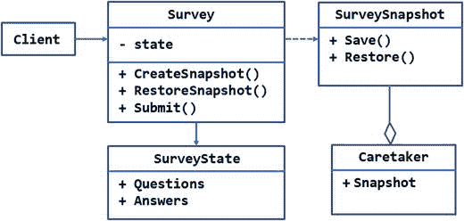
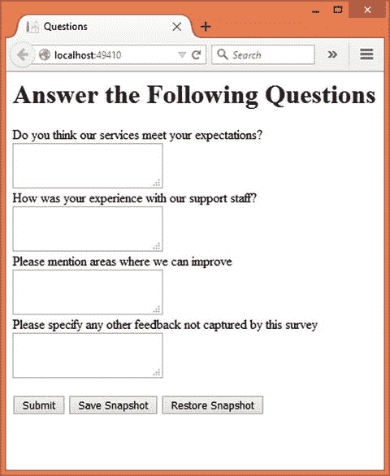
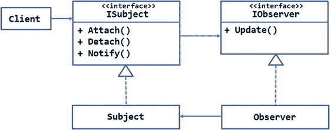
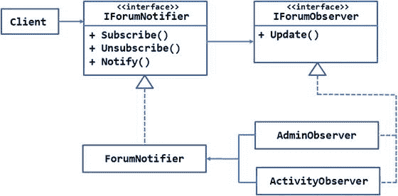
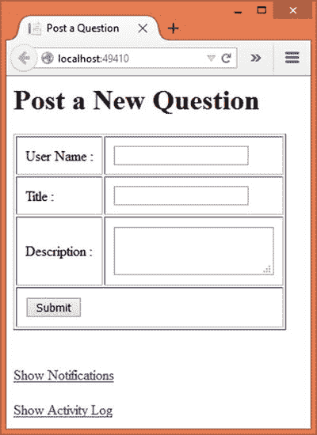

# 八、行为模式：中介、备忘录和观察者

继续我们的行为模式之旅，本章将剖析中介、备忘录和观察者设计模式。

有时，您希望系统的对象相互通信。这种交流可以是单向的，也可以是双向的。冥想者和观察者处理多个物体如何发送和/或接收信息来实现交流。

memento 模式关注的是对象的状态。它处理对象状态的存储和检索。具体来说，您将学习以下内容:

*   中介、备忘录和观察者设计模式的目的和角色
*   这四种模式的 UML 结构和布局
*   每种模式的概念验证示例说明了这些模式的实现

## 调解人

由几种不同类型的对象组成的系统通常需要一种方式让这些对象相互通信。如果每个感兴趣的对象都应该与其他对象直接通信，这可能会导致复杂性。这是因为每个这样的对象必须知道它试图与之通信的对象的合理细节。

考虑一个现实生活中的例子。假设你希望以多种方式投资，如定期存款计划、保险单、债券等等。现在，你可以直接与每一个相关的银行或公司打交道。正如你可能已经猜到的，这样做可能会很乏味，因为你必须知道如何与你希望投资的每一家银行或公司沟通。

作为一种选择，你可以寻求投资代理人的服务，他可以代表你做所有必要的沟通。所以，你把你的申请表和文件交给这个中间人，他把它们转交给要求的银行或公司。如果银行或公司需要你提供更多的信息，他们会将信息传达给代理人，代理人会将信息传达给你。因此，所有的交流都是通过仲裁者进行的，您不必知道相关各方的内部工作方式。

这也是中介模式的工作方式。中介模式定义了一种通过中央协调对象使对象相互交互的方式。这个中心对象负责按照系统的要求路由通信。在这样做的时候，中介模式促进了发送方和接收方对象之间的松散耦合。由于发送方和接收方对象不需要知道彼此的任何信息，所以它们可以独立修改，而不会相互影响。

Note

乍一看，您可能会发现中介模式与前面讨论的代理模式相似。然而，它们是截然不同的。代理对象模拟目标对象，您的代码使用代理就好像它在使用目标对象一样。在这里，中介是系统中一个独特的已知对象。它不会伪装成其他物体。

### 设计和解释

图 [8-1](#Fig1) 中的 UML 图说明了中介者模式。



图 8-1。

UML diagram illustrating the mediator pattern

如图所示，有两个接口`—`一个用于中介对象，另一个用于同事对象。同事对象是希望相互通信的对象。

`IMediator`接口有`Send()`方法。该方法在实现时将通信从一个同事发送到另一个同事。`Mediator`类是`IMediator`接口的具体实现。

`IColleague`接口由两个方法`—Receive()`和`Send()`组成。`Receive()`方法在实现时，接收来自中介的通信消息，并根据系统需求对其进行处理。`Send()`方法在实现时通过中介向同事发送消息。

在`Colleague1`和`Colleague2`类中实现了`IColleague`接口。请注意，相互交谈的对象可能属于同一类型，也可能不属于同一类型。然而它们都实现了`IColleague`接口。例如，`Colleague1`的对象 A 可能想要与`Colleague2`的对象 B 通信。

`Mediator`类使用了`Colleague1`和`Colleague2`,因为作为中间人，它需要与这两者进行交互。

### 例子

现在您已经知道了中介模式是如何工作的，让我们在一个示例中实现它。

假设您正在构建一个大型社区论坛应用。作为会员功能的一部分，您希望允许会员通过一些界面互相聊天。作为第一步，将开发一个用户对用户聊天的网络界面。但是以后你可能会开发出其他的选择，比如桌面版或者手机版的聊天界面。

一个用户登录到系统中，可以向另一个用户发送消息。如果目标用户脱机，将引发异常；否则，消息将被传递给其他用户。

考虑到这些要求，您可以设计如图 [8-2](#Fig2) 所示的系统。



图 8-2。

A web-based chat implemented using the mediator pattern

`IChatRoom`接口表示中介器的接口。它包括三种方法`—Login()`、`Logout()`和`Send()`。`Login()`和`Logout()`方法控制聊天参与者的进入和退出。`Send()`方法将聊天消息发送给它的目标接收者。`ChatRoom`类是`IChatRoom`接口的具体实现。

`IParticipant`接口定义了一个聊天参与者。参与者有一个名字，由`Name`属性表示。`Receive()`方法接收来自`ChatRoom`的聊天消息。`Send()`方法通过`ChatRoom`向另一个参与者发送聊天消息。聊天消息由`ChatMessage`类表示(图中未显示)。`Participant`类代表了`IParticipant`的具体实现。

注意在这个例子中只有一个`IParticipant`的实现。但是，您可以有不同的实现。例如，您可以创建实现`IParticipant`的`IDesktopParticipant`和`IMobileParticipant`。这些参与者构成了系统中的同事。

该应用使用的基于网络的聊天界面如图 [8-3](#Fig3) 所示。



图 8-3。

A chat session between User1 and User2 in progress

如您所见，图中显示了用户 1 和用户 2 之间的聊天会话示例。当然，这个例子不会实现会员系统和成熟的聊天客户端。但是这个接口足以说明中介模式。

该界面由一个可以输入用户名的文本框组成。登录和注销按钮控制用户进入和退出聊天室。

有用于指定目标用户和消息的文本框。指定这些细节并单击 Send 按钮后，消息通过`ChatRoom`中介发送给 User2。这些消息存储在数据库表中，用于生成聊天历史，并在以后需要时访问它们。

文本区域显示当前会话的聊天历史。这个文本区域使用 jQuery 代码填充，jQuery 代码定期轮询数据库。

要开发这个应用，首先使用 Visual Studio 创建一个名为`Mediator`的新 ASP.NET web 应用项目，并将其配置为使用 MVC 和实体框架(参见第 [1 章](01.html)了解更多细节)。还将应用`—`使用的数据库`MediatorDb—`的数据库连接字符串存储在`appsettings.json`文件中。

然后将`AppSettings`类添加到`Core`文件夹中。`AppSettings`类需要有从`Startup`类中赋值的`ConnectionString`属性。因为这在前面的例子中已经做过很多次了，所以我们在这里就不赘述了。

然后在`Core`文件夹中添加一个`ChatMessage`类。这个类表示一条聊天消息，如清单 [8-1](#Par33) 所示。

```cs
[Table("ChatMessages")]
public class ChatMessage
{
    [DatabaseGenerated(DatabaseGeneratedOption.Identity)]
    public int Id { get; set; }
    [Required]
    [StringLength(20)]
    public string From { get; set; }
    [Required]
    [StringLength(20)]
    public string To { get; set; }
    [Required]
    public string Message { get; set; }
    [Required]
    public DateTime SentOn { get; set; }
}

Listing 8-1.ChatMessage Class Represents a Chat Message

```

`ChatMessage`类包含五个属性，即`Id`、`From`、`To`、`Message`和`SentOn`。`From`和`To`属性表示消息发送者和接收者的用户名。`Message`属性保存实际的消息文本。`SentOn`属性表示消息的日期时间戳。

`[Table]`属性将`ChatMessage`类映射到`ChatMessages`表。尽管这个例子并不依赖于数据注释，比如用于数据验证的`[Required]`和`[StringLength]`，但是在使用实体框架迁移创建`ChatMessages`表时，它们是很有用的。

现在将一个`AppDbContext`类添加到`Core`文件夹中，并在其中编写清单 [8-2](#Par52) 所示的代码。

```cs
public class AppDbContext:DbContext
{
    public DbSet<ChatMessage> ChatMessages { get; set; }

    protected override void OnConfiguring(DbContextOptionsBuilder optionsBuilder)
    {
        optionsBuilder.UseSqlServer(AppSettings.ConnectionString);
    }
}

Listing 8-2.AppDbContext Class with ChatMessages DbSet

```

`AppDbContext`类是一个自定义`DbContext`，它只有一个`DbSet—ChatMessages`。

接下来，在`Core`文件夹中添加一个`IParticipant`接口(列表 [8-3](#Par63) )。

```cs
public interface IParticipant
{
    string Name { get; set; }
    void Send(string to, string message);
    void Receive(string from, string message);
    List<ChatMessage> GetChatHistory();
}

Listing 8-3.IParticipant Folder Mediator Class

```

`IParticipant`接口由一个属性和三个方法组成。`Name`属性表示用户的名字。`Send()`方法接受一个目标用户名和一条消息作为它的参数。`Receive()`方法接收给参与者的聊天消息。`GetChatHistory()`方法返回一个通用的`ChatMessage`对象列表。这些消息表明该参与者的聊天历史。需要使用`GetChatHistory()`方法，因为客户端代码需要显示聊天历史。它在中介模式中没有任何作用。这就是为什么它没有显示在 UML 图中。

然后在`Core`文件夹中添加一个`IChatRoom`接口，并在其中编写清单 [8-4](#Par72) 所示的代码。

```cs
public interface IChatRoom
{
    void Login(IParticipant participant);
    void Logout(IParticipant participant);
    void Send(string from, string to, string message);
}

Listing 8-4.IChatRoom interface

```

`IChatRoom`接口由三种方法`—Login()`、`Logout()`和`Send()`组成。`Login()`和`Logout()`方法接受一个`IParticipant`对象，并为该参与者执行各自的任务。`Send()`方法接受发送者、接收者和消息。

现在将`Participant`类添加到`Core`文件夹中。`Participant`类是`IParticipant`的具体实现，如清单 [8-5](#Par80) 所示。

```cs
public class Participant : IParticipant
{
    private IChatRoom chatroom;
    public string Name { get; set; }
    public Participant(string name, IChatRoom chatroom)
    {
        this.Name = name;
        this.chatroom = chatroom;
    }
    public void Send(string to, string message)
    {
        chatroom.Send(this.Name, to, message);
    }
    public void Receive(string from, string message)
    {
        ChatMessage msg = new ChatMessage();
        msg.From = from;
        msg.To = this.Name;
        msg.Message = message;
        msg.SentOn = DateTime.Now;
        using (AppDbContext db = new AppDbContext())
        {
            db.ChatMessages.Add(msg);
            db.SaveChanges();
        }
    }
    public List<ChatMessage> GetChatHistory()
    {
        using (AppDbContext db = new AppDbContext())
        {
            var query = from m in db.ChatMessages
                        where m.To == Name || m.From == Name
                        orderby m.SentOn ascending
                        select m;
            return query.ToList();
        }
    }
}

Listing 8-5.Participant Class Implementing IParticipant

```

`Participant`类首先声明一个类型为`IChatRoom`的局部变量和一个公共的`Name`属性。这个变量指向一个`ChatRoom`类的对象。向目标接收者发送消息时需要此变量。变量`IChatRoom`和`Name`属性在类的构造函数中赋值。

`Send()`实现调用`IChatRoom`对象的`Send()`方法，并将`Name`、接收者和消息传递给它。稍后将讨论`ChatRoom`类，但是现在知道`ChatRoom`的`Send()`方法将消息存储在`ChatMessages`表中就足够了。

`Receive()`方法应该为考虑中的参与者接收消息。这些消息被接收，然后存储在`ChatMessages`表中。`Receive()`方法创建一个新的`ChatMessage`并设置其属性，例如`From`、`To`、`Message`和`SentOn`。然后使用`SaveChanges()`方法将 ChatMessage 添加到`ChatMessages DbSet`并保存到数据库。

`GetChatHistory()`方法获取接收者(`To`)或发送者(`From`)与参与者的`Name`属性相同的所有`ChatMessages`记录。这些消息表示参与者发送或接收的消息。然后，消息被返回给调用者。在这个例子中，一些 jQuery 代码将调用`GetChatHistory()`方法。

接下来，将一个`ChatRoom`类添加到`Core`文件夹中。这个类由方法`Login()`、`Logout()`、`Send()`和`GetParticipant()`组成。清单 [8-6](#Par128) 展示了这些方法的框架。

```cs
public class ChatRoom : IChatRoom
{
    private static Dictionary<string, IParticipant> participants = new Dictionary<string, IParticipant>();
    public void Login(IParticipant participant)
    {
    }
    public void Logout(IParticipant participant)
    {
    }
    public IParticipant GetParticipant(string name)
    {
    }
    public void Send(string from, string to, string message)
    {
    }
}

Listing 8-6.Skeleton of the ChatRoom Mediator Class

```

`ChatRoom`类是中介类，实现了`IChatRoom`接口。它包含一个私有的`Dictionary`对象，让参与者准备好参与聊天。注意，这个字典是静态的，因此可以跨多个请求-响应周期访问它。

`Login()`和`Logout()`方法跟踪登录到聊天室的用户。这些方法如清单 [8-7](#Par150) 所示。

```cs
public void Login(IParticipant participant)
{
    if (!participants.ContainsKey(participant.Name))
    {
        participants.Add(participant.Name, participant);
    }
}
public void Logout(IParticipant participant)
{
    if (participants.ContainsKey(participant.Name))
    {
        participants.Remove(participant.Name);
    }
}

Listing 8-7.Login() and Logout() Methods Keep Track of Users

```

`Login()`方法接收一个`IParticipant`对象`—`，一个希望加入聊天室的参与者。在内部，代码检查参与者`Name`是否已经在参与者字典中注册。如果不是，则参与者被添加到指示登录操作的字典中。参与者的`Name`作为键，`IParticipant`对象作为值。

`Logout()`方法检查参与者字典是否包含任何与提供的参与者的`Name`匹配的条目。如果是，则从字典中删除该参与者，表示注销操作。

登录后，参与者可以发送消息。`Send()`方法处理发送消息的任务，如清单 [8-8](#Par168) 所示。

```cs
public void Send(string from, string to, string message)
{
    IParticipant target = participants[to];
    if (target != null)
    {
        target.Receive(from, message);
    }
    else
    {
        throw new Exception("Invalid chat participant!");
    }
}
}

Listing 8-8.Send() Method Stores Messages in Table

```

`Send()`方法基于`to`参数从参与者字典中获取消息的预期接收者。如果在字典中找到接收方用户，则表明该用户已登录，可以将消息发送给他或她。否则，将引发异常。

如果一个用户登录，目标参与者的`Receive()`方法通过传递`from`和`message`值来调用。

`ChatRoom`类还需要一个额外的方法(没有在`IChatRoom`接口中定义),该方法获取一个特定的参与者并将其返回给调用者。该方法`—GetParticipant()—`如清单 [8-9](#Par185) 所示。

```cs
public IParticipant GetParticipant(string name)
{
    if (participants.ContainsKey(name))
    {
        return participants[name];
    }
    else
    {
        return null;
    }
}

Listing 8-9.
GetParticipant() Method

Returns IParticipant Object

```

`GetParticipant()`方法接受一个字符串用户名，并试图在参与者字典中查找该用户。如果找到用户名，则将对应的`IParticipant`对象返回给调用者；否则，该方法返回`null`。

现在让我们把注意力转移到客户端代码`—HomeController`上。将`HomeController`添加到`Controllers`文件夹中。除了默认的`Index()`方法，你还需要四个动作，分别是`Login()`、`Logout()`、`Send()`和`GetHistory()`。正如您可能已经猜到的那样，大多数这些操作都是通过单击相应的按钮来调用的。这些方法依次调用`ChatRoom`和`Participan`和`t classes`上的方法。下文讨论了这些方法。

回想一下，应用的用户界面有登录和注销按钮。这些操作是通过 jQuery Ajax 执行的。jQuery 代码(您将很快编写它)调用控制器的`Login()`和`Logout()`动作。这些动作如清单 [8-10](#Par199) 所示。

```cs
[HttpPost]
public void Login([FromBody]ChatUser usr)
{
    ChatRoom room = new ChatRoom();
    IParticipant participant = new Participant(usr.Name, room);
    room.Login(participant);
}
[HttpPost]
public void Logout([FromBody]ChatUser usr)
{
    ChatRoom room = new ChatRoom();
    IParticipant participant = new Participant(usr.Name, room);
    room.Logout(participant);
}

Listing 8-10.Login()

and Logout()

Action Methods

```

这两种方法——log in()和 Logout()—都接受 ChatUser 类型参数。ChatUser 是简单的视图模型类，它只保存用户名，如下所示:

`public class ChatUser`

`{`

`public string Name { get; set; }`

`}`

`Login()`动作为指定的`ChatUser`创建了一个`ChatRoom`类的实例和一个`IParticipant`对象。然后调用`ChatRoom`的`Login()`方法。如前所述，这将把参与者添加到登录用户字典中。

`Logout()`动作类似于`Login()`，但是它调用了`ChatRoom`对象上的`Logout()`方法。

发送聊天消息的`Send()`动作如清单 [8-11](#Par222) 所示。

```cs
[HttpPost]
public IActionResult Send([FromBody]ChatMessage msg)
{
    ChatRoom room = new ChatRoom();
    IParticipant sender = room.GetParticipant(msg.From);
    IParticipant receiver = room.GetParticipant(msg.To);
    if (receiver != null)
    {
        sender.Send(msg.To, msg.Message);
        return Json(true);
    }
    else
    {
        return Json(false);
    }
}

Listing 8-11.Send( ) Action Sends a Chat Message

```

`Send()`动作从 jQuery Ajax 调用中接收一个`ChatMessage`对象。在里面，它创建了一个`ChatRoom`对象和发送者和接收者`Participant`对象。请注意在检索对已登录参与者的引用时使用了`GetParticipant()`方法。该代码检查参与者当前是否登录。如果是，则通过调用 sender participant 对象上的`Send()`方法将`ChatMessage`发送给用户，并将`true`返回给调用者(JSON 格式)。否则，`false`返回给调用者(JSON 格式)。

最后，添加检索参与者聊天历史的`GetHistory()`动作。该方法如清单 [8-12](#Par240) 所示。

```cs
[HttpPost]
public IActionResult GetHistory([FromBody]ChatUser usr)
{
    ChatRoom room = new ChatRoom();
    IParticipant participant = room.GetParticipant(usr.Name);
    if (participant != null)
    {
        return Json(participant.GetChatHistory());
    }
    else
    {
        return Json("");
    }
}

Listing 8-12.
GetHistory() Method

Retrieves Chat History

```

`GetHistory()`动作接收一个`ChatUser`对象作为它的参数。在内部，它创建了一个`ChatRoom`对象并获得了对`Participant`对象的引用。这是使用`GetParticipant()`方法完成的。如果`GetParticipant()`返回一个参与者，则表示该参与者已经登录，可以获取其聊天记录。`Participant`对象的`GetChatHistory()`方法返回一个`ChatMessage`对象列表。使用`Json()`方法将这些消息转换成它们的 JSON 等价物，并返回给调用的 jQuery 代码。

这就完成了`HomeController`。现在，最后需要添加的部分是`Index`视图。将`Index`视图添加到`Views/Home`控制器中，并将清单 [8-13](#Par256) 中所示的标记放入其中。

```cs
...
...
<body>
    <h1>Chat with Members</h1>
    <form>
        <div>From :</div>
        <input type="text" id="from" />
        <input type="button" id="login" value="Login" />
        <input type="button" id="logout" value="Logout" />
        <div>To :</div>
        <input type="text" id="to" />
        <div>Message :</div>
        <input type="text" id="message" />
        <input type="button" id="send" value="Send" />
        <div>Chat History :</div>
        <textarea id="history"></textarea>
    </form>
</body>
...
...

Listing 8-13.Markup of Index View

```

`Index`视图由三个文本框、三个按钮和一个文本区域组成。文本框分别接受发件人姓名、收件人姓名和邮件。这些按钮分别启动登录、注销和发送操作。

按钮的点击事件由 jQuery 代码处理。因此，确保在视图的 head 部分添加一个对 jQuery 库的`<script>`引用。您可以将 jQuery 库文件放在`wwwroot`下的`Scripts`文件夹中，然后将其拖放到视图的`<head>`部分，以生成所需的`<script>`元素。

然后在头部添加一个新的`<script>`块。这个块将包含 jQuery 代码。为了给你一个概念，脚本块内部的代码框架如清单 [8-14](#Par279) 所示。

```cs
<script src="∼/scripts/jquery.min.js"></script>
<script type="text/javascript">
    $(document).ready(function () {
        var handle;
        $("#login").click(function () {
        });
        $("#logout").click(function () {
        });
        $("#send").click(function () {
    });
</script>

Listing 8-14.Skeleton of jQuery Code

```

如您所见，脚本块由一个`ready()`回调组成。回调依次连接登录、注销和发送按钮的 click 事件处理程序。jQuery 代码定期从服务器检索聊天历史。这是使用`setTimeout()` JavaScript 函数完成的。在顶部声明的`handle`变量保存由`setTimeout()`调用返回的句柄。下文将更详细地讨论这些方法。

Note

下面的解释假设您熟悉 jQuery 库。如果您不熟悉 jQuery 和 Ajax，请考虑在继续学习之前阅读一些基础知识。你可以在 [`http://api.jquery.com`](http://api.jquery.com/) 访问 jQuery 的官方文档

登录按钮的点击事件处理程序调用`HomeController`的`Login()`动作，如清单 [8-15](#Par313) 所示。

```cs
$("#login").click(function () {
    var options = {};
    options.url = "/home/login";
    options.type = "POST";
    options.data = JSON.stringify({ Name : $("#from").val() });
    options.contentType = "application/json";
    options.success = function () {
        alert("Logged in!");
        handle = setTimeout(GetHistory, 3000);
    };
    options.error = function () {
        alert("Error!");
    };
    $.ajax(options);
});

Listing 8-15.Handling Click Event of Login Button

```

代码创建了一个`options`对象`—`一个存储 Ajax 调用设置的 JavaScript 对象。

将`url`属性设置为`login`动作。`type`属性被设置为`POST`，表示将向服务器发出一个`POST` Ajax 请求。将`data`属性设置为具有`Name`属性的对象。注意，这个 JavaScript 对象的结构必须与`ChatUser`视图模型类的结构相匹配。`JSON.stringify()`方法将 JavaScript 对象转换成它的 JSON 表示。`contentType`属性被设置为`application/json`，表示 JSON 数据正在随请求一起发送。

成功登录后，调用`success`回调。成功回调显示一个警告，并调用`setTimeout()`方法。`setTimeout()`方法在三秒钟后调用`GetHistory()`函数。`GetHistory()`函数是一个定制的 JavaScript 函数，负责检索聊天历史。这个函数将在稍后讨论。

`error`回调只是显示一个带有错误消息的警告。最后，通过将`options`对象作为参数传递给 jQuery `$.ajax()`方法来调用该方法。`$.ajax()`方法对控制器的`Login()`动作进行 Ajax 调用。

刚才提到的`GetHistory()`函数如清单 [8-16](#Par319) 所示。

```cs
function GetHistory() {
    var options = {};
    options.url = "home/gethistory";
    options.type = "POST";
    options.data = JSON.stringify({ Name: $("#from").val() });
    options.dataType = "json";
    options.contentType = "application/json";
    options.success = function (data) {
        var history = "";
        for (var i = 0; i < data.length; i++)
        {
            history += data[i].From + ">>" + data[i].Message + "\r\n";
        }
        $("#history").val(history);
        setTimeout(GetHistory, 3000);
    };
    $.ajax(options)
}

Listing 8-16.GetHistory() Function Loads the History Text Area

```

在`GetHistory()`函数中编写的代码与您在登录点击处理程序中编写的代码非常相似。只有几处不同:

*   `url`属性指向`HomeController`的`GetHistory()`动作。
*   因为`GetHistory()`函数返回 JSON 格式的数据，所以选项的`dataType`属性被设置为`json`。
*   `success`函数从服务器接收一组`ChatMessage`对象。代码遍历该数组，并将所有消息存储在一个变量中。然后使用`val()`方法给历史文本区域分配这个值。
*   `success`函数再次调用`setTimeout()`以便继续轮询。

注销按钮的点击事件处理程序与登录按钮非常相似，如清单 [8-17](#Par357) 所示。

```cs
$("#logout").click(function () {
    var options = {};
    options.url = "/home/logout";

    options.type = "POST";
    options.data = JSON.stringify({ Name: $("#from").val() });
    options.contentType = "application/json";
    options.success = function () {
        alert("Logged out!");
        clearTimeout(handle);

    };
    options.error = function () {
        alert("Error!");
    };
    $.ajax(options);
});

Listing 8-17.Handling Click Event of Logout Button

```

除了两行代码之外，这段代码与您之前编写的代码非常相似。这次`url`属性被设置为调用控制器的`Logout()`动作，`success`函数通过向其传递`handle`值来调用`clearTimeout()`函数。这样，当用户退出聊天室时，轮询就会停止。

最后，您需要通过编写发送按钮的点击事件处理程序来完成应用。该事件处理程序如清单 [8-18](#Par360) 所示。

```cs
$("#send").click(function () {
    var msg = {};
    msg.From = $("#from").val();
    msg.To = $("#to").val();
    msg.Message = $("#message").val();
    var options = {};
    options.url = "/home/send";
    options.type = "POST";
    options.data = JSON.stringify(msg);
    options.contentType = "application/json";
    options.success = function (flag) {
        if (flag) {
            alert("Message sent!");
        } else {
            alert(msg.To + " is offline!");
        }
    };
    options.error = function () {
        alert("Error!");
    };
    $.ajax(options);
    });
});

Listing 8-18.Handling Click Event of the Send Button

```

这段代码也类似于您之前编写的代码。但是，它在以下方面有所不同:

*   `url`属性指向`HomeController`的`Send()`方法。
*   控制器的`Send()`方法需要一个`ChatMessage`对象。这个对象在开始时形成(`msg`对象变量)，然后分配给`data`属性。
*   如果操作成功，`success`回调接收一个布尔值`—true`，否则`false`，然后检查`—`。相应地向用户显示成功或错误消息。

就是这样！这就完成了应用。由于这个例子由很多部分组成，您可以考虑从本书的代码下载中获取完整的源代码。

在运行应用之前，您将需要创建带有`ChatMessages`表的`MediatorDb`数据库(更多细节参见第 [1](01.html) 章)。创建数据库后，在两个浏览器选项卡或窗口中运行应用，并按如下所示进行测试:

*   切换到第一个浏览器窗口或选项卡。
*   在 From 文本框中输入用户名`User1`,然后点击 Login 按钮。如果一切顺利，你会得到一个成功提示。
*   切换到第二个窗口或选项卡。
*   在 From 文本框中输入用户名`User2`,然后点击 Login 按钮。如果一切顺利，你会得到一个成功提示。
*   切换到第一个窗口或选项卡，并在 to 文本框中输入`User2`。
*   在消息文本框中输入一些消息，然后点击发送按钮。
*   切换到第二个窗口或选项卡，确认您刚刚发送的消息是否出现在“历史记录”文本框中。
*   通过在 To 文本框中指定`User1`，在第二个窗口或选项卡中重复消息发送步骤。
*   从任何一个窗口注销，并尝试从另一个窗口发送消息。

停止应用，并查看数据库`MediatorDb`的`ChatMessages`表。

## 备忘录

类拥有私有状态是很常见的。显然，这样的状态信息对于外部世界是不可访问的。这非常符合面向对象系统的一个重要特性——封装。然而，有时这个私有状态可能需要跨越类的边界。

考虑一个假设的电子邮件应用，它允许用户创建和发送电子邮件。这种系统通常提供“另存为草稿”选项，允许用户保存消息而不发送给预期的接收者。该消息可以稍后被加载、完成，然后发送给接收者。

在这种情况下，电子邮件对象的内部状态，如发件人、收件人和消息，需要保存到某个外部存储介质中。稍后，电子邮件对象将从该保存的状态中重建。

如果您的应用需要对象内部状态的这种外部化，可以使用 memento 模式。memento 模式允许您保存对象外部的对象状态，还允许您在需要时恢复对象的状态。memento 模式在不破坏设计类时设置的任何封装规则的情况下进行保存和恢复。您可能认为 memento 模式是创建和恢复系统中一个或多个对象的快照的一种方式。

### 设计和解释

图 [8-4](#Fig4) 中的 UML 图说明了 memento 模式。



图 8-4。

UML diagram illustrating the memento pattern

如图所示，`Originator`是一个要保存和恢复内部状态的类。

`Memento`类提供了两个方法`—Save()`和`Restore()—`，它们执行保存和恢复`Originator`对象状态的任务。保存对象状态的介质取决于应用。例如，应用可以将状态保存到物理磁盘文件或数据库表中，甚至保存到内存存储中。

如聚合符号所示，`Caretaker`类保存对`Memento`对象的引用。`Caretaker`甚至可以维护一个`Memento`对象的列表，而不是单个对象。`Memento`对象可用于将对象的状态恢复到特定的快照。

`Client`类简单地创建了`Originator`，并可以在`Memento`上启动保存和恢复操作。

### 例子

现在您已经知道了 memento 模式是如何工作的，让我们看一个可以使用它的实际例子。

假设你正在建立一个为用户提供特定服务的网站。从用户那里获得频繁的反馈对改善服务很重要，因此网站需要有一个调查模块。

调查模块向用户呈现某些调查问题，并试图获取对这些问题的回答。在开始调查时，用户可能想要中止调查，然后在稍后的某个时间继续调查。因此，允许用户保存已经输入的回答并在用户恢复时恢复它们对于调查模块的整体功能是至关重要的。

当用户决定保存调查回答时，它们会存储在一个单独的、特定于用户的文件中。这样做是为了避免分散的或不完整的调查污染主数据库表。

考虑到这些要求，您可以设计如图 [8-5](#Fig5) 所示的系统。



图 8-5。

Survey module saves and restores survey snapshots to a file

如您所见，`Survey`对象是其状态将被保存和恢复的类。其状态保持在私有成员`—`状态。状态成员属于`SurveyState`类型。`SurveyState`基本上是用户输入的调查问题及其答案的列表。

`Survey`类有一个保存`Survey`对象当前状态的`CreateSnapshot()`方法。这是通过调用`SurveySnapshot`类的`Save()`方法来完成的。同样，`RestoreSnapshot()`方法通过调用`SurveySnapshot`类的`Restore()`方法来恢复先前保存的快照。因此，`SurveySnapshot`类充当了`Memento`对象。

`Caretaker`类只是保存对`Snapshot`对象的引用(如果有的话)。客户端代码稍后可以访问该快照以恢复调查状态。

`Survey`类的`Submit()`方法将所有用户响应保存到数据库表中。

图 [8-6](#Fig6) 显示了您将作为本例的一部分构建的应用的主页。



图 8-6。

Main page of the survey module

应用向用户显示一个问题列表。用户可以在相应的文本区域字段中键入问题的答案。底部有三个按钮`—`提交、保存快照、恢复快照。

点击提交按钮，将调查回答保存到`Answers`表中。单击 Save Snapshot 按钮创建用户输入的答案的快照，并将它们保存到磁盘文件中。单击恢复快照按钮，将答案从磁盘文件恢复到调查对象和文本区域字段中。

为了简单起见，我们不开发用户认证系统。快照是在具有固定名称的文件中创建的。在一个更现实的应用中，您将为每个用户创建文件，并根据当前通过身份验证的用户加载相应的文件。

要开发这个应用，首先使用 Visual Studio 创建一个新的 ASP.NET web 应用项目，并将其配置为使用 MVC 和实体框架(更多细节参见第 [1](01.html) 章)。还将应用`—`使用的数据库`MementoDb—`的数据库连接字符串存储在`appsettings.json`文件中。

然后将`AppSettings`类添加到`Core`文件夹中，并将两个属性添加到其中，如清单 [8-19](#Par436) 所示。

```cs
public class AppSettings
{
    public static string StoragePath { get; set; }
    public static string ConnectionString { get; set; }
}

Listing 8-19.AppSettings Class Stores Snapshot Filename

```

`StoragePath`属性保存快照文件的文件名。这个属性和`ConnectionString`属性一起被设置在`Startup`类中，如清单 [8-20](#Par430) 所示。

```cs
public Startup(IHostingEnvironment env, IApplicationEnvironment app)
{
    ...
    ...
    AppSettings.ConnectionString = config.Get<string>("Data:DefaultConnection:ConnectionString");
    AppSettings.StoragePath = env.MapPath("Snapshots/snapshot.dat");
}

Listing 8-20.Setting the StoragePath Property

```

对于这个例子，`StoragePath`属性被设置为`wwwroot/Snapshots/Snapshot.dat`。确保在`wwwroot`下创建`Snapshot`文件夹。

然后在`Core`文件夹中添加一个`SurveyState`类(列表 [8-21](#Par444) )。

```cs
[Serializable]
public class SurveyState
{
    public List<int> Questions { get; set; }
    public List<string> Answers { get; set; }
}

Listing 8-21.SurveyState Class Stores Wuestions and Answers

```

`SurveyState`类由两个属性`—Questions`和`Answers`组成。属性存储了数据库中问题 id 的 T4。`Answers`属性存储用户为`Questions`属性中的每个问题 ID 输入的答案的`List`。

注意，`SurveyState`类被标记了`[Serializable]`属性。这是必需的，因为`Memento`对象使用。NET framework 的二进制格式化程序。

接下来，将`SurveySnapshot`类添加到`Core`文件夹中，并将清单 [8-22](#Par473) 中的代码写入其中。

```cs
public class SurveySnapshot
{
    private string fileName;
    public SurveySnapshot(string filename)
    {
        this.fileName = filename;
    }
    public void Save(SurveyState state)
    {
        FileStream stream = new FileStream(fileName, FileMode.Create);
        BinaryFormatter formatter = new BinaryFormatter();
        formatter.Serialize(stream, state);
        stream.Close();
    }
    public SurveyState Restore()
    {
        FileStream stream = new FileStream(fileName, FileMode.Open);
        BinaryFormatter formatter = new BinaryFormatter();
        object obj = formatter.Deserialize(stream);
        stream.Close();
        return (SurveyState)obj;
    }
}

Listing 8-22.SurveySnapshot Saves and Restores the Survey State

```

`SurveySnapshot`类首先声明一个保存快照文件名的私有字符串变量。因为基于一些逻辑改变快照文件名是很常见的，所以代码没有直接使用`AppSettings`类。相反，它允许文件名通过构造函数传递。

`Save()`方法接受一个`SurveyState`对象作为它的参数。在内部，它通过指定前面捕获的文件名来创建一个`FileStream`对象(`System.IO`名称空间)。然后创建一个`BinaryFormatter` ( `System.Runtime.Serialization.Formatters.Binary`名称空间)。`BinaryFormatter`类的`Serialize()`方法接受一个`Stream`对象，数据将被保存到这个对象中，对象也将被保存。然后关闭该流(还要确保移除。NET core 来自`Project.json`的框架部分)。

`Restore()`方法完成读取先前存储的快照文件的工作。它通过在文件名上打开一个`FileStream`来做到这一点。这次`BinaryFormatter`的`Deserialize()`方法用于将对象状态从文件反序列化为对象。`Deserialize()`方法返回一个对象，因此代码将其类型转换为`SurveyState`，然后返回给调用者。

现在将一个`Survey`类添加到`Core`文件夹中，并在其中编写清单 [8-23](#Par519) 所示的代码。

```cs
public class Survey
{
    private SurveyState state;
    public Survey(SurveyState state)
    {
        this.state = state;
    }
    public SurveySnapshot CreateSnapshot()
    {
        SurveySnapshot snapshot = new SurveySnapshot(AppSettings.StoragePath);
        snapshot.Save(this.state);
        return snapshot;
    }
    public void RestoreSnapshot(SurveySnapshot snapshot)
    {
        this.state = snapshot.Restore();
    }
    public List<string> GetAnswers()
    {
        return this.state.Answers;
    }
    public void Submit()
    {
        using (AppDbContext db = new AppDbContext())
        {
            for (int i = 0; i < state.Questions.Count; i++)
            {
                Answer ans = new Answer();
                ans.QuestionId = state.Questions[i];
                ans.AnswerText = state.Answers[i];
                ans.SubmittedOn = DateTime.Now;
                db.Answers.Add(ans);
            }
            db.SaveChanges();
        }
    }
}

Listing 8-23.Survey Class Is the Class Whose State Is to Be Saved

```

`Survey`类在`SurveyState`类型的私有变量中维护其状态。此状态是通过类的构造函数分配的。

`CreateSnapshot()`方法通过向其传递`StoragePath`来创建一个备忘录`SurveySnapshot`对象。然后调用`Memento`对象的`Save()`方法将`Survey`的私有状态保存到一个文件中。`SurveySnapshot`对象被返回给调用者，以便恢复操作可以在稍后的某个阶段完成。

`RestoreSnapshot()`方法接受一个现有的`SurveySnapshot`对象并调用它的`Restore()`方法。从`Restore()`方法获得的状态被分配给私有状态变量。通过这种方式，`Survey`对象的状态被加载到之前保存的状态中。

控制器代码需要`GetAnswers()`方法。它只是将答案返回给调用者。这些答案是在视图上显示它们所必需的。`GetAnswers()`不以任何方式参与备忘录的功能。

`Submit()`方法将用户的所有答案保存到数据库的`Answers`表中。代码遍历`SurveyState`对象的问题列表。每次迭代都会创建一个新的`Answer`对象，并将其添加到`Answers DbSet`中。`AppDbContext`的`SaveChanges()`方法将数据保存到`Answers`表中。

应用需要`AppDbContext`、`Answer`和`Question`类，以便将数据保存和检索到数据库表中。`Question`级如清单 [8-24](#Par535) 所示。

```cs
[Table("Questions")]
public class Question
{
    [DatabaseGenerated(DatabaseGeneratedOption.Identity)]
    public int QuestionId { get; set; }
    [Required]
    [StringLength(100)]
    public string QuestionText { get; set; }
}

Listing 8-24.Question Class Represents a Survey Question

```

`Question`类表示一个调查问题，并映射到`Questions`表。它由两个属性`—QuestionId`和`QuestionText`组成。`QuestionId`属性是一个整数，`QuestionText`保存实际问题。

`Answer`类表示一个调查问题的答案，如清单 [8-25](#Par553) 所示。

```cs
[Table("Answers")]
public class Answer
{
    [DatabaseGenerated(DatabaseGeneratedOption.Identity)]
    public int AnswerId { get; set; }
    [Required]
    public int QuestionId { get; set; }
    [Required]
    [StringLength(100)]
    public string AnswerText { get; set; }
    [Required]
    public DateTime SubmittedOn { get; set; }
}

Listing 8-25.Answer Class Represents a Survey Answer

```

`Answer`类映射到`Answers`表，包含四个属性`—AnswerId`、`QuestionId`、`AnswerText`和`SubmittedOn`。这些属性非常简单。

表示实体框架`DbContext`的`AppDbContext`类如清单 [8-26](#Par571) 所示。

```cs
public class AppDbContext:DbContext
{
    public DbSet<Question> Questions{ get; set; }

    public DbSet<Answer> Answers { get; set; }

    protected override void OnConfiguring(DbContextOptionsBuilder optionsBuilder)
    {
        optionsBuilder.UseSqlServer(AppSettings.ConnectionString);
    }
}

Listing 8-26.AppDbContext Class with Questions and Answers DbSets

```

`AppDbContext`类定义了两个`DbSets—Questions`和`Answers`。

现在将`Caretaker`类添加到`Core`文件夹中，并在其中编写清单 [8-27](#Par568) 中所示的代码。

```cs
public class Caretaker
{
    public static SurveySnapshot Snapshot { get; set; }
}

Listing 8-27.Caretaker Class Holds Memento Object

```

`Caretaker`类由一个属性`—Snapshot—`组成，该属性保存一个`SurveySnapshot`对象。请注意，`Snapshot`属性是静态的，因此可以跨多个请求访问它。当然，您可能会想到在用户会话中保存快照，或者设计一些替代方案来支持多用户场景。对于这个例子，将快照存储在静态的`Snapshot`属性中就足够了。

到目前为止，您已经开发了特定于 memento 模式实现的类。现在，让我们在一个控制器中使用这些类。

将`HomeController`添加到`Controller`文件夹中。控制器的`Index()`动作应该从`Questions`表中获取所有的调查问题，并将其作为模型发送给`Index`视图。`Index()`动作如清单 [8-28](#Par581) 所示。

```cs
public IActionResult Index()
{
    using (AppDbContext db = new AppDbContext())
    {
        return View(db.Questions.ToList());
    }
}

Listing 8-28.Index() Action Fetches Survey Questions

```

`Index()`中的代码非常简单。它只是从`Questions`表中获取所有问题，并将`Question`对象的`List`发送到`Index`视图。

您需要编写另一个动作`—ProcessForm()—`，当调用三个按钮`—`提交、保存快照和恢复快照`—`中的任何一个时，就会调用这个动作。`ProcessForm()`动作如清单 [8-29](#Par617) 所示。

```cs
[HttpPost]
public IActionResult ProcessForm(List<int> question,List<string> answer,string submit,string save,string restore)
{
    SurveyState state = new SurveyState();
    state.Questions = question;
    state.Answers = answer;
    Survey survey = new Survey(state);
    if (submit != null)
    {
        Caretaker.Snapshot = null;
        survey.Submit();
        ViewBag.Message = "Survey data submitted!";
    }
    if (save != null)
    {
        Caretaker.Snapshot = survey.CreateSnapshot();
        ViewBag.Message = "Snapshot created!";
    }
    if (restore!=null)
    {
        survey.RestoreSnapshot(Caretaker.Snapshot);
        ViewBag.Message = "Survey restored!";
    }
    ViewBag.Answers = survey.GetAnswers();
    using (AppDbContext db = new AppDbContext())
    {
        List<Question> model = db.Questions.ToList();
        return View("Index", model);
    }
}

Listing 8-29.ProcessForm() Action Deals with the Survey Responses

```

`ProcessForm()`方法有五个参数。`Questions`和`Answers`是代表用户输入的问题 id 和答案的列表。接下来的三个参数对应于三个按钮。代码使用它们来检测三个按钮中的哪一个被单击了。

在内部，代码创建一个`SurveyState`对象并设置它的`Questions`和`Answers`属性。然后，`SurveyState`对象被传递给`Survey`类的构造函数。

接下来的三个`if`语句决定点击了三个按钮中的哪一个。例如，如果点击保存快照按钮，`Save`参数将不会是`null`。它将包含按钮的值。这同样适用于其他按钮。

如果点击提交按钮，则调用`Survey`对象的`Submit()`方法，并将测量数据存储在数据库中。由于调查现在已保存到数据库中，因此`Caretaker`也被设置为`null`，删除任何之前创建的快照。

如果单击 Save Snapshot 按钮，则通过调用`Survey`对象上的`CreateSnapshot()`方法来创建当前调查状态的快照。这样返回的`SurveySnapshot`对象由`Caretaker`对象存储。

如果点击恢复快照按钮，先前存储的快照将被加载到`Survey`对象中。这是通过在`Survey`对象上调用`RestoreSnapshot()`方法来完成的。

所有三个`if`语句也在`ViewBag`中设置一个消息。该消息显示在视图上。

视图需要一个问题和答案的列表(如果有的话)。问题可以直接从`Questions`表中获取。答案通过`Answers ViewBag`属性传递。这是通过调用`Survey`对象的`GetAnswers()`方法并将返回的`List`赋给`Answers`属性来完成的。

最后，将`Index`视图添加到`Views/Home`文件夹中。清单 [8-30](#Par650) 显示了`Index`视图的标记。

```cs
@model List<Memento.Core.Question>
...
<body>
    <h1>Answer the Following Questions</h1>
    <form asp-action="ProcessForm" asp-controller="Home" method="post">
        @for(int i=0;i<Model.Count;i++)
        {
            <input type="hidden" name="question[@i]" value="@Model[i].QuestionId" />
            <div>@Model[i].QuestionText</div>
            <textarea name="answer[@i]">
            @if(ViewBag.Answers!=null)
            {
                @ViewBag.Answers[i]
            }
            </textarea>
        }
        <br /><br />
        <input type="submit" name="submit" value="Submit" />
        <input type="submit" name="save" value="Save Snapshot" />
        <input type="submit" name="restore" value="Restore Snapshot" />
    </form>
    <h4>@ViewBag.Message</h4>
...

Listing 8-30.Markup of Index View

```

一个`Question`对象的`List`作为`Index`视图的模型。表单标签助手用于呈现提交给`HomeController` ( `asp-controller`属性)的`ProcessForm()`动作(`asp-action`属性)的表单。

在表单内部，通过遍历`Model`，在`<div>`元素中显示一系列问题。一个隐藏字段还存储每个问题的`QuestionId`。记住`ProcessForm()`动作需要`question`参数。如果不使用隐藏的输入字段，该参数将不会填充`QuestionId`值。如果之前保存了答案，文本区域将显示该答案。

三个按钮`—`保存、保存快照和恢复快照`—`调用相应的操作。注意，这些按钮的`name`属性与`ProcessForm()`动作的相应参数相匹配。

从`if`语句分配的`Message`也在视图底部输出。

这就完成了应用。在您测试它之前，您将需要创建带有`Questions`和`Answers`表的`MementoDb`数据库(更多细节参见第 [1](01.html) 章)。您还需要在`Questions`表格中输入一些示例问题。数据库准备就绪后，运行应用并测试保存快照和恢复快照按钮的行为。

## 观察者

有时，您需要将应用中发生的有趣事情通知给系统中的许多对象。可以把它想象成一种无线电广播，一个无线电台广播信号，有兴趣收听的人把他们的收音机调到想要的频率。

这种发送和接收通知的模型也称为发布者-订阅者模型。一个或多个订阅者对象订阅从发布者接收通知。并且发布者向所有订阅的对象发出通知。显然，这是一个一对多通信的例子。

如果您的目的是广播通知，那么可以使用 observer 模式。观察者模式定义了对象之间一对多的依赖关系，因此当一个对象改变其状态时，所有其他对象都会得到通知。此外，其他对象可以在接收到通知时被更新。

对观察者模式的讨论可能会让您想起 C# 中基于委托的事件处理。例如，Windows 窗体控件可以引发单击或双击等事件，并充当事件发布者。连接到事件的一个或多个事件处理程序代表订户。观察者模式可以使用委托和事件来实现。然而，对于我们的示例，我们不会采用这种方法。

Note

显然，中介者和观察者模式听起来很相似，因为它们都在多个对象之间进行通信。然而，调解人提供双向沟通，而观察员提供单向广播。

observer 的另一个例子是在`System.IO`名称空间中可用的`FileSystemWatcher`类。这个类关注文件系统操作，比如文件或文件夹的创建。有`Changed`、`Created`、`Deleted`、`Renamed`等事件，可由相关方处理。一旦检测到操作，它就通过引发适当的事件来通知所有事件订阅者。

### 设计和解释

图 [8-7](#Fig7) 中的 UML 图说明了观察者模式。



图 8-7。

UML diagram illustrating the observer pattern

如图所示，`IObserver`接口是希望接收通知的类的抽象。它由一个`Update()`方法组成。当状态改变时，`Update()`方法被自动调用，它负责执行 post `–`状态改变操作。操作可以是任何东西，比如刷新用户界面、在数据库中保存一些东西、发送电子邮件等等。

`Observer`类是`IObserver`的具体实现。可能有多个`Observer`类。只要他们实现了`IObserver`，他们就可以订阅接收通知。

`ISubject`接口表示想要发送通知的对象的抽象。`ISubject`的具体实现维护了一个对接收通知感兴趣的观察者的`IObserver`对象`—`的集合。`Attach()`和`Detach()`方法通过在`Observers`集合中添加或删除观察者来订阅和取消订阅观察者。`Notify()`方法向订阅者发送通知。

`Subject`类是`ISubject`的具体实现。请注意，`ISubject`和`IObserver`之间有关联，就像`Observer`和`Subject`之间有关联一样。

`Client`代码负责实例化`Subject`对象和一个或多个`Observer`对象。

### 例子

既然您已经知道了观察者模式是如何工作的，那么让我们用一个例子来说明。

假设您正在为广大开发人员社区构建一个论坛。为了确保质量和避免营销垃圾邮件，管理员将在论坛帖子发布时对其进行监控。

当一个新的论坛帖子到达系统时，你需要通知管理员这个新帖子。此外，你还需要通知一个活动追踪者这个帖子。活动跟踪模块应该跟踪用户在一段时间内的活动，并分配给用户某些徽章和奖励。

系统所需的通知特性可以使用观察者模式来实现。图 [8-8](#Fig8) 显示了一种可能的设计。



图 8-8。

Sending notifications when a new forum post is available

`IForumObserver`接口是由观察者类`—AdminObserver`和`ActivityObserver`实现的接口。

`AdminObserver`类表示管理员希望在论坛发布新帖子时得到通知。`AdminObserver`的`Update()`实现向`Notification`数据库表添加一个条目。`ActivityObserver`类表示对跟踪用户活动感兴趣的活动跟踪器。`ActivityObserver`的`Update()`实现向`Activity`数据库表添加一个条目。当然，您可以在这些实现中进行任何其他特定于应用的操作。

`IForumNotifier`接口由通知的发布者实现。`IForumNotifier`的具体实现维护了一个`IForumObserver`对象列表。使用`Subscribe()`方法将对象添加到列表中，并使用`Unsubscribe()`方法将其从列表中删除。当一个新的论坛帖子被添加到系统中时,`Notify()`方法向所有订阅者发送通知。

`ForumNotifier`表示`IForumNotifier`接口的具体实现。

本例中的控制器`—`通过连接订户来设置`ForumNotifier`实例。因此，`AdminObserver`和`ActivityObserver`对象依赖于`ForumNotifier`来接收通知。

您将要构建的应用的主页如图 [8-9](#Fig9) 所示。



图 8-9。

Posting a new question in the forum

该页面允许您发布新的论坛问题。它由三个文本框组成，分别接受用户名、问题标题和描述性问题文本。提交按钮将文章添加到`ForumPosts`数据库表中。

页面底部有两个超链接`—`“显示通知”和“显示活动日志”单击“显示通知”链接会显示到目前为止收到的所有通知的列表。类似地，单击“显示活动日志”链接显示来自`ActivityLog`表的记录。

要开发这个应用，首先使用 Visual Studio 创建一个名为`Observer`的新 ASP.NET web 应用项目，并将其配置为使用 MVC 和实体框架(参见第 [1 章](01.html)了解更多细节)。还将应用`—`使用的数据库`ObserverDb—`的数据库连接字符串存储在`appsettings.json`文件中。

应用需要在三个表`—ForumPosts`、`Notifications`和`Activity`中存储数据。所以，应用需要相应的实体和`DbContext`。此外，还需要具有`ConnectionString`属性的`AppSettings`类(`AppSettings`不在此讨论，因为您已经在许多早期的示例中使用过它)。

将`ForumPost`类添加到`Core`文件夹中，并在其中编写清单 [8-31](#Par703) 所示的代码。

```cs
[Table("ForumPosts")]
public class ForumPost
{
    [DatabaseGenerated(DatabaseGeneratedOption.Identity)]
    public int Id { get; set; }
    [Required]
    [StringLength(20)]
    public string UserName { get; set; }
    [Required]
    [StringLength(100)]
    public string Title { get; set; }
    [Required]
    public string Description { get; set; }
    [Required]
    public DateTime PostedOn { get; set; }
}

Listing 8-31.ForumPost Class Represents a Forum Post

```

使用`[Table]`属性将`ForumPost`类映射到`ForumPosts`表。它包含五个属性`—Id`、`UserName`、`Title`、`Description`和`PostedOn`。这个例子不会实现用户身份验证，但是`UserName`属性存储了添加论坛帖子的用户的用户名。`Title`和`Description`属性表示论坛帖子的标题和描述性文本。`PostedOn`属性是文章被添加时的时间戳。

然后将一个`Notification`类添加到`Core`文件夹中，并将清单 [8-32](#Par718) 中的代码写入其中。

```cs
[Table("Notifications")]
public class Notification
{
    [DatabaseGenerated(DatabaseGeneratedOption.Identity)]
    public int Id { get; set; }
    [Required]
    [StringLength(100)]
    public string Description{ get; set; }
    [Required]
    public DateTime ReceivedOn { get; set; }
}

Listing 8-32.Notification Class Stores Notification Details

```

`Notification`类表示一个通知，并映射到`Notifications`表。它由三个属性`—Id`、`Description`和`ReceivedOn`组成。这些属性非常简单，代表了通知的相应信息。

现在将`Activity`类添加到`Core`文件夹中。清单 [8-33](#Par733) 显示了`ActivityLog`类。

```cs
[Table("ActivityLog")]
public class Activity
{
    [DatabaseGenerated(DatabaseGeneratedOption.Identity)]
    public int Id { get; set; }
    [Required]
    [StringLength(100)]
    public string Description{ get; set; }
    [Required]
    public DateTime TimeStamp { get; set; }
}

Listing 8-33.
ActivityLog Class

Tracks User Activities

```

`Activity`类映射到`ActivityLog`表，包含三个属性`—Id`、`Description`和`TimeStamp`。

接下来，向`Core`文件夹添加一个`AppDbContext`类，并定义`DbSet`属性，如清单 [8-34](#Par746) 所示。

```cs
public class AppDbContext:DbContext
{
    public DbSet<ForumPost> ForumPosts{ get; set; }
    public DbSet<Notification> Notifications { get; set; }
    public DbSet<Activity> ActivityLog { get; set; }
    protected override void OnConfiguring(DbContextOptionsBuilder optionsBuilder)
    {
        optionsBuilder.UseSqlServer(AppSettings.ConnectionString);
    }
}

Listing 8-34.AppDbContext with Three DbSet Properties

```

`AppDbContext`类定义了三个`DbSet`属性，即`ForumPosts`、`Notifications`和`ActivityLog`。它们保存对应表的实体。

接下来，在`Core`文件夹中添加一个`IForumObserver`接口(列表 [8-35](#Par768) )。

```cs
public interface IForumObserver
{
    void Update(ForumPost post);
}

Listing 8-35.AppDbContext with Three DbSet Properties

```

`IForumObserver`接口包含`Update()`方法，该方法接收一个`ForumPost`对象作为其参数。

然后将`AdminObserver`和`ActivityObserver`类添加到`Core`文件夹中。这两个类都实现了`IForumObserver`，并且非常相似。清单 [8-36](#Par755) 显示了`AdminObserver`类。

```cs
public class AdminObserver:IForumObserver
{
    public void Update(ForumPost post)
    {
        using (AppDbContext db = new AppDbContext())
        {
            Notification notification = new Notification();
            notification.Description = $"New forum post - {post.Title} - received on {DateTime.Now}";
            notification.ReceivedOn = DateTime.Now;
            db.Notifications.Add(notification);
            db.SaveChanges();
        }
    }
}

Listing 8-36.
AdminObserver Class

Implements IForumObserver

```

`AdminObserver`类实现了在`IForumObserver`接口中定义的`Update()`方法。`Update()`方法向`Notifications`表添加一个条目。这是通过创建一个`Notification`对象并将其`Description`和`ReceivedOn`属性设置为适当的值来实现的。注意在形成`Description`时`ForumPost`参数的使用。通过调用`SaveChanges()`方法将条目添加到表中。

除了其`Update()`方法向`ActivityLog`表添加了一个条目之外，`ActivityObserver`类与`AdminObserver`类非常相似。为了节省篇幅，这里不讨论`ActivityObserver`类。

接下来，在`Core`文件夹中添加一个`IForumNotifier`接口，并在其中定义方法，如清单 [8-37](#Par776) 所示。

```cs
public interface IForumNotifier
{
    void Subscribe(IForumObserver observer);
    void Unsubscribe(IForumObserver observer);
    void Notify(ForumPost post);
}

Listing 8-37.IForumNotifier Interface

```

`IForumNotifier`接口定义了`Subscribe()`、`Unsubscribe()`和`Notify()`方法。`Subscribe()`和`Unsubscribe()`方法接受一个`IForumObserver`对象作为它们的参数。`Notify()`方法接受一个`ForumPost`对象作为其参数。

然后在`Core`文件夹中添加一个`ForumNotifier`类，并在其上实现`IForumNotifier`接口，如清单 [8-38](#Par806) 所示。

```cs
public class ForumNotifier:IForumNotifier
{
    private static List<IForumObserver> observers;
    static ForumNotifier()
    {
        observers = new List<IForumObserver>();
    }
    public void Subscribe(IForumObserver observer)
    {
        observers.Add(observer);
    }
    public void Unsubscribe(IForumObserver observer)
    {
        observers.Remove(observer);
    }
    public void Notify(ForumPost post)
    {
        foreach(IForumObserver observer in observers)
        {
            observer.Update(post);
        }
    }
}

Listing 8-38.ForumNotifier Class Acts as the Publisher

```

`ForumNotifier`类首先声明一个私有泛型`List`来保存`IForumObserver`对象。请注意，这个变量是静态的，因此订阅者可以跨多个请求-响应周期。

`Subscribe()`方法将作为参数接收的`IForumObserver`对象添加到观察者列表中。同样，`Unsubscribe()`方法从订阅者列表中删除指定的`IForumObserver`对象。

`Notify()`方法遍历订户列表，并通过调用订户的`Update()`方法通知每个订户。`ForumPost`对象被传递给`Update()`方法。

现在是创建客户端`—HomeController`的时候了。将`HomeController`类添加到`Controllers`文件夹中。`HomeController`类需要四个动作`—Index()`、`AddPost()`、`ShowNotifications()`和`ShowActivityLog()`。`Index()`动作设置发布者和订阅者对象，如清单 [8-39](#Par821) 所示。

```cs
public IActionResult Index()
{
    AdminObserver observer1 = new AdminObserver();
    ActivityObserver observer2 = new ActivityObserver();
    ForumNotifier notifier = new ForumNotifier();
    notifier.Subscribe(observer1);
    notifier.Subscribe(observer2);
    return View();
}

Listing 8-39.Index() Action Configures Publisher and Subscribers

```

`Index()`动作创建了`AdminObserver`和`ActivityObserver`的实例。它还实例化了一个`ForumNotifier`对象。

使用`Subscribe()`方法将`AdminObserver`和`ActivityObserver`连接为用户。

当用户添加新的论坛帖子时，会调用`AddPost()`动作。该动作如清单 [8-40](#Par837) 所示。

```cs
public IActionResult AddPost(ForumPost post)
{
    post.PostedOn = DateTime.Now;
    using (AppDbContext db = new AppDbContext())
    {
        db.ForumPosts.Add(post);
        db.SaveChanges();
    }
    ViewBag.Message = "Post submitted successfully!";
    ForumNotifier notifier = new ForumNotifier();
    notifier.Notify(post);
    return View("Index", post);
}

Listing 8-40.AddPost( ) Action Adds a Forum Post

```

`AddPost()`动作通过模型绑定接收一个`ForumPost`对象。然后使用`Add()`方法将`ForumPost`添加到`ForumPosts DbSet`中。通过调用`DbContext`上的`SaveChanges()`将`ForumPost`保存到`ForumPosts`表中。成功消息设置在`ViewBag`中，并呈现在视图上。

创建一个新的`ForumNotifier`对象。回想一下，因为`ForumNotifier`的订户集合被标记为静态的，所以先前添加的订户可用于新的`ForumNotifier`实例。然后在`ForumNotifier`对象上调用`Notify()`，以便向所有订阅者发送通知。

`ShowNotifications()`和`ShowActivityLog()`动作只是从各自的表中检索所有的通知和活动日志条目，并将它们传递给相应的视图。这些方法如清单 [8-41](#Par857) 所示。

```cs
public IActionResult ShowNotifications()
{
    using (AppDbContext db = new AppDbContext())
    {
        List<Notification> notifications = db.Notifications.ToList();
        return View(notifications);
    }
}
public IActionResult ShowActivityLog()
{
    using (AppDbContext db = new AppDbContext())
    {
        List<Activity> activitylog = db.ActivityLog.ToList();
        return View(activitylog);
    }
}

Listing 8-41.ShowNotifications( ) and ShowActivityLog( ) Actions

```

这就完成了`HomeController`。现在最后一步是创建三个视图`—Index`、`ShowNotifications`和`ShowActivityLog`。

首先将`Index`视图添加到`Views/Home`文件夹中，然后在其中编写清单 [8-42](#Par891) 中所示的标记。

```cs
@model Observer.Core.ForumPost
...
<body>
    <h1>Post a New Question</h1>
    <form asp-action="AddPost" asp-controller="Home" method="post">
        <table border="1" cellpadding="10">
            <tr>
                <td><label asp-for="UserName">Username :</label></td>
                <td><input type="text" asp-for="UserName" /></td>
            </tr>
            <tr>
                <td><label asp-for="Title">Title :</label></td>
                <td><input type="text" asp-for="Title" /></td>
            </tr>
            <tr>
                <td><label asp-for="Description">Description :</label></td>
                <td><textarea asp-for="Description"></textarea></td>
            </tr>
            <tr>
                <td colspan="2">
                    <input type="submit" name="submit" value="Submit" />
                </td>
            </tr>
        </table>
    </form>
    <h4>@ViewBag.Message</h4>
    <br />
    <a asp-action="ShowNotifications" target="_blank">Show Notifications</a>
    <br /><br />
    <a asp-action="ShowActivityLog" target="_blank">Show Activity Log</a>
...

Listing 8-42.Markup of Index View

```

`Index`视图由一个表单组成，该表单提交给`HomeController` ( `asp-controller`属性)的`AddPost()`动作(`asp-action`属性)。该表单包含一个表格，表示用于添加论坛帖子的数据输入屏幕。

有三个标签、两个文本框、一个文本区域和一个按钮。注意标签和文本框是如何使用各自标签助手的`asp-for`属性进行模型绑定的。成功消息也输出在表格的底部。

在视图的底部有两个超链接`—`，一个指向`ShowNotifications()`动作(`asp-action`属性)，另一个指向`ShowActivityLog()`动作。

然后将`ShowNotifications`和`ShowActivityLog`视图添加到`Views/Home`文件夹中。这两种观点完全相同，只是它们的模型不同。清单 [8-43](#Par910) 显示了`ShowNotifications`视图的标记。

```cs
@model List<Observer.Core.Notification>
<html>
<head>
    <title>List of Notifications</title>
</head>
<body>
    <h1>List of Notifications</h1>
    @foreach(var item in Model)
    {
        <h2>@item.Description</h2>
    }
</body>
</html>

Listing 8-43.ShowNotifications View

```

`ShowNotifications`视图接收一个`Notification`对象的`List`作为它的模型。一个`foreach`循环遍历`Model`，并将`Notification`对象的`Description`属性显示到响应流中。

`ShowActivityLog`视图类似，但是它的模型是`Activity`对象的`List`。为了节省空间，这里不讨论`ShowActivityLog`视图。

这就完成了应用。在运行应用之前，您需要创建包含所需表格的`ObserverDb`数据库(更多详情请参见第 [1 章](01.html))。一旦数据库准备就绪，运行应用并尝试添加一个新的论坛帖子。

添加论坛帖子后，在新标签中打开“显示通知”和“显示活动日志”链接。这将显示确认发布者和订阅者工作的通知和活动日志。

## 摘要

本章讨论了三种行为模式，即中介、纪念者和观察者。中介模式为对象提供了一种执行双向通信的方式。它简化了对象之间的整体交互，因为一个对象不需要知道另一个对象的任何信息。对象负责传递它们之间的通信消息。

memento 模式允许您保存和恢复对象的内部状态，而不会影响封装。memento 模式可用于需要将一个或多个对象的快照保存到某个介质上，并希望在以后重新加载该快照的情况。

观察者模式提供了一个发布者-订阅者模型，这样一个或多个对象可以订阅接收通知。当系统中发生有趣的事情时，发布者广播通知。相应地通知和更新订户。

下一章将继续我们的行为模式之旅，讨论剩下的四种模式:状态、策略、模板方法和访问者。