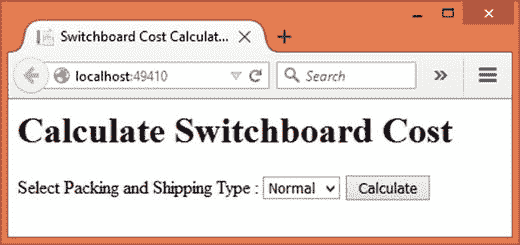

# 九、行为模式：状态、策略、模板方法和访问者

本章将涵盖剩余的行为模式，即状态、策略、模板方法和访问者。

状态模式使用对象的内部状态来改变其行为。策略和模板方法模式处理算法。

策略模式允许您使用一系列算法，以便可以以可互换的方式使用这些算法。模板方法定义了算法的框架，使得一个或多个步骤可以被改变。

访问者模式用于对对象结构的元素执行操作。该操作独立于对象结构，您可以在不修改对象结构的情况下定义其他操作。

具体来说，本章将涵盖这四种模式的以下方面:

*   状态、策略、模板方法和访问者模式的目的和作用
*   这四种模式的 UML 结构和布局
*   一个概念验证示例，说明了这些模式的实现

## 状态

有时，您的处理逻辑取决于对象的内部状态。处理这种依赖于状态的处理的常用方法是使用一系列的`if`语句或检查状态的 switch 语句，然后根据状态触发特定的处理。

当存在合理数量的特定于状态的处理时，这种方法可能会带来困难。对状态处理逻辑的任何改变都会导致整个类被修改和重新测试。此外，添加状态值也会导致类被修改。

在这种情况下，状态模式可以帮助您。状态模式允许对象在其内部状态改变时改变其行为。这种行为上的改变是通过利用一组可能的状态对象来实现的。

状态模式通过将每个特定于状态的处理部分隔离到它自己的类中来解决前面描述的问题。这样，一个状态由一个对象来表示，该对象还封装了属于该状态的处理。在不影响主类的情况下，可以很容易地添加额外的状态对象。对现有状态特定处理的修改仅导致该状态类经历改变。

考虑一个工作流应用，它具有诸如文档已验证、已发送供审阅、待批准、已批准和已拒绝等状态。现在，这些状态中的每一个都可能需要特定的处理，因此可以用一个单独的类来表示。这些状态对象有一个公共基类或实现一个公共接口。主工作流类使用多态行为来调用处理。

### 设计和解释

图 [9-1](#Fig1) 中的 UML 图说明了状态模式。


图 9-1。

UML diagram illustrating the state pattern

`IState`接口为状态对象提供抽象。`Process()`方法在实现时会处理特定的状态。它将一个`Context`对象作为它的参数，以便在期望的处理之后可以分配一个新的状态。

`State1`和`State2`类代表了`IState`接口的具体实现。

`Context`类是保存状态对象实例的特定于应用的类。状态成员可以根据申请流程指向`State1`或`State2`。`Context`类也有`Process()`方法，它完成自己的工作并调用状态成员上的`Process()`。

`Client`类实例化了`Context`，并且还指定了`Context`的初始状态。

### 例子

现在您已经知道了状态模式的目的和设计，让我们将这些知识应用到一个例子中。

假设您正在开发一个允许您创建和跟踪营销活动的 web 应用。从活动创建到完成的整个过程是一个工作流，其进展如下:

*   营销人员想出了一个营销活动的主意。
*   这些想法被添加到应用中，并创建了一个活动。然而，这项运动需要得到有关当局的批准。
*   然后，经理会对活动创意进行审核，如果认为合适，就会批准。
*   活动一经批准，活动所需的所有材料就准备好了。这可能包括横幅、广告牌、小册子、数字广告和视频等内容。
*   一旦活动的所有材料都准备好了，就可以开始执行了。
*   该活动运行后，整个循环可以在另一个活动中重复。

正如您从前面的工作流中可能已经猜到的那样，活动会经历某些状态:活动创建、活动批准、活动材料准备和活动执行。活动运行后，工作流将重置为初始状态。

web 应用应该允许创建活动以及通过这些状态处理活动。

考虑到营销活动的工作流程，人们可能会想到如图 [9-2](#Fig2) 所示的设计。


图 9-2。

A marketing campaign with four states

`ICampaignState`接口代表了一个活动状态的抽象。它由一个方法组成— `Process()`。

`ICampaignState`接口由四个状态类实现，即`CreateState`、`ApprovalState`、`PrepareState`和`RunState`。这四个类的`Process()`实现做一些特定于该状态的处理。对于我们的例子，代码只是简单地改变了数据库表`Campaigns`中的状态，但是它可以是属于那个状态的任何简单到复杂的处理。此外，以后还可以添加其他状态。

`CampaignContext`类表示上下文类，包含一个成员变量，该变量保存对四个`ICampaignState`实现之一的引用。

`CampaignContext`的`Process()`触发工作流。在这种情况下，活动的初始状态将是`CreateState`。每次调用上下文的`Process()`方法都会调用状态对象的`Process()`方法。然后，状态成员将其指针更改为工作流中的下一个状态。这样看来，对同一个方法——`Process()`——的调用表现得好像底层类已经被改变了。

`Client`—`HomeController`—创建`CampaignContext`，设置其初始状态，并像向导一样开始工作流。

图 [9-3](#Fig3) 显示了应用的初始页面。


图 9-3。

First step of campaign wizard

如您所见，起始页允许您指定活动的标题和描述。点击创建活动按钮，在`Campaigns`表中添加一个活动条目，并显示下一步。这个流程会一直持续到最后一步，在这里您可以运行活动。在每一步，数据库表中的活动状态都会发生变化。最后一步如图 [9-4](#Fig4) 所示。


图 9-4。

Campaign wizard completes when a campaign is run

当您单击“运行活动”按钮时，向导会重置到初始页面，您可以输入另一个活动的详细信息。

为了简单起见，我们不会提供任何工具来退出中间的工作流，稍后再继续。然而，在一个更加现实和完善的实现中，您也应该提供这一点。

要开发这个应用，首先使用 Visual Studio 创建一个名为`State`的新 ASP.NET web 应用项目，并将其配置为使用 MVC 和实体框架(更多细节请参见[第 1 章](01.html))。还要在`appsettings.json`文件中存储`StateDb`的数据库连接字符串——应用使用的数据库。

然后将`AppSettings`类添加到`Core`文件夹中。`AppSettings`类需要有`ConnectionString`属性，并被赋予来自`Startup`类的值。因为这在前面的例子中已经做过很多次了，所以我们在这里就不赘述了。

现在，将`Campaign`类添加到`Core`文件夹中，并在其中编写清单 [9-1](#Par746) 中所示的代码。

```cs
[Table("Campaigns")]
public class Campaign
{
    [DatabaseGenerated(DatabaseGeneratedOption.Identity)]
    public int Id { get; set; }
    [Required]
    [StringLength(100)]
    public string Title { get; set; }
    [Required]
    public string Description { get; set; }
    [Required]
    [StringLength(100)]
    public string Status { get; set; }
}

Listing 9-1.Campaign Entity Represents Campaign Details

```

使用`[Table]`属性将`Campaign`实体类映射到`Campaigns`表。`Campaign`类由四个属性组成，即`Id`、`Title`、`Description`和`Status`。它们分别代表活动的标题、描述和当前状态。正如您将在后面看到的，属性是由各个状态类来改变的。

然后，将`AppDbContext`类添加到`Core`文件夹中，并定义`Campaigns DbSet`，如清单 [9-2](#Par747) 所示。

```cs
public class AppDbContext:DbContext
{
    public DbSet<Campaign> Campaigns { get; set; }
    protected override void OnConfiguring(DbContextOptionsBuilder optionsBuilder)
    {
        optionsBuilder.UseSqlServer(AppSettings.ConnectionString);
    }
}

Listing 9-2.AppDbContext with Campaigns DbSet

```

接下来，将`CampaignContext`类添加到`Core`文件夹中，并在其中编写清单 [9-3](#Par748) 中所示的代码。

```cs
public class CampaignContext
{
    public ICampaignState State { get; set; }
    public Campaign Campaign { get; set; }
    public CampaignContext(ICampaignState state)
    {
        this.State = state;
    }
    public void Process()
    {
        State.Process(this);
    }
}

Listing 9-3.CampaignContext Holds Reference to State Object

```

`CampaignContext`类有两个公共属性，即`State`和`Campaign`。`State`属性持有一个实现`ICampaignState`接口的对象(稍后将讨论)。这个属性是公共的，因为您需要从单个 state 类中更改它(您很快就会看到这一点)。`Campaign`属性表示由`Campaign`实体类封装的活动信息。

`CampaignContext`类的构造函数设置活动的初始状态。`Process()`方法调用`ICampaignState`对象的`Process()`方法，从而触发工作流。

然后，在`Core`文件夹中添加一个`ICampaignState`接口(列表 [9-4](#Par749) )。

```cs
public interface ICampaignState
{
    void Process(CampaignContext context);
}

Listing 9-4.ICampaignState Interface

```

`ICampaignState`接口是一个简单的接口，只有一个方法— `Process()`。`Process()`方法接受一个`CampaignContext`对象。这样，单个的状态对象可以访问和改变`CampaignContext`的`State`属性。如果需要，他们还可以访问`Campaign`对象。

现在向`Core`文件夹中添加四个类——`CreateState`、`ApprovalState`、`PrepareState`和`RunState`，并在所有这些类上实现`ICampaignState`。这些类非常相似。所以为了节省一些篇幅，只讨论`CreateState`(列表 [9-5](#Par750) )和`RunState`。

```cs
public class CreateState : ICampaignState
{
    public void Process(CampaignContext context)
    {
        using (AppDbContext db = new AppDbContext())
        {
            context.Campaign.Status = "Campaign has been created";
            db.Campaigns.Add(context.Campaign);
            db.SaveChanges();
        }
        context.State = new ApprovalState();
    }
}

Listing 9-5.
CreateState Class

```

`CreateState`类表示活动创建状态。`Process()`实现设置`Campaign`对象的`Status`，并将其添加到`Campaigns DbSet`。然后，调用`SaveChanges()`将活动详情保存到`Campaigns`表中。

由于该活动现在正在等待批准，`CampaignContext`的`State`属性从`CreateState`(初始状态)更改为`ApprovalState`。

您可以按照类似的方式创建`ApprovalState`和`PrepareState`类。只需将现有的`Campaign`对象的`Status`属性更改为适当的文本，并调用`SaveChanges()`来保存更改后的状态。这里不讨论这些类。你可以从这本书的代码下载中抓取他们的代码。

`RunState`类再次将状态重置为`CreateState`，如清单 [9-6](#Par751) 所示。

```cs
public class RunState : ICampaignState
{
    public void Process(CampaignContext context)
    {
        using (AppDbContext db = new AppDbContext())
        {
            Campaign campaign = db.Campaigns.Where(o => o.Id == context.Campaign.Id).SingleOrDefault();
            campaign.Status = "Campaign has been successfully run";
            db.SaveChanges();
        }
        context.State = new CreateState();
    }
}

Listing 9-6.RunState Class Resets the Campaign Workflow

```

`RunState`获取现有的`Campaign`对象并改变其`Status`，如代码所示。通过调用`SaveChanges()`方法保存`Status`。

上下文`State`被设置为`CreateState()`，以便工作流被重置为其初始状态，并且可以创建新的活动。

这就完成了状态类。现在让我们关注实例化并引导用户完成工作流的`HomeController`。首先将`HomeController`类添加到`Controllers`文件夹中。

`HomeController`需要跨多个请求存储`CampaignContext`对象。因此，它使用内存缓存来完成这项工作。当然，为了支持多用户场景，您可以使用其他选项，比如会话。

要使用内存缓存，打开`Startup`类并修改`ConfigureServices()`方法，如清单 [9-7](#Par752) 所示。

```cs
public void ConfigureServices(IServiceCollection services)
{
    services.AddMvc();
    services.AddEntityFramework()
            .AddSqlServer();
    services.AddCaching();

}

Listing 9-7.Enabling Caching in Startup Class

```

该代码调用`AddCaching()`方法将内存缓存添加到注册的服务中。然后，您可以使用构造函数注入来获得一个`MemoryCache`对象(清单 [9-8](#Par753) )。

```cs
public class HomeController : Controller
{
    private IMemoryCache cache;
    public HomeController(IMemoryCache cache)
    {
        this.cache = cache;
    }
...
...
}

Listing 9-8.Constructor Injection to Receive MemoryCache

```

`HomeController`从声明一个类型为`IMemoryCache` ( `Microsoft.Framework.Caching.Memory`名称空间)的变量开始。该变量由`HomeController`的构造函数赋值。构造器通过 ASP 接收`IMemoryCache`对象。NET 的 DI 框架，然后存储在本地缓存变量中。

`HomeController`有五个动作——`Index()`、`Create()`、`Approve()`、`Prepare()`和`Run()`——处理工作流的各个阶段。接下来将讨论这些动作。

清单 [9-9](#Par754) 显示了触发活动工作流的`Index()`动作。

```cs
public IActionResult Index()
{
    ICampaignState initialState = new CreateState();
    CampaignContext context = new CampaignContext(initialState);
    cache.Set("context", context);
    return View();
}

Listing 9-9.Index() Starts the Campaign Workflow

```

`Index()`动作创建了一个`CreateState`类和`CampaignContext`类的新实例。`CreateState`对象被传递给`CampaignContext`对象的构造函数。这样就设置了上下文的初始状态。

`CampaignContext`对象需要在多个请求中保留。因此，它使用`Set()`方法存储在`MemoryCache`中。`Set()`方法接受一个键和一个要存储的值。

然后，`Index()`动作将`Index`视图返回给浏览器。

一旦用户填写了活动的详细信息，比如标题和描述，并点击 Create Campaign 按钮，`Create()`动作就会接管(清单 [9-10](#Par755) )。

```cs
[HttpPost]
public IActionResult Create(Campaign obj)
{
    CampaignContext context = cache.Get<CampaignContext>("context");
    context.Campaign = obj;
    context.Process();
    return View("Approve", obj);
}

Listing 9-10.Create() Action Stores the Campaign Details in the Table

```

`Create()`动作抓取存储在`MemoryCache`中的`CampaignContext`对象。将`CampaignContext`的`Campaign`属性赋给通过模型绑定获得的`Campaign`对象。调用`Process()`方法来处理活动。由于活动的`State`是`CreateState`，因此`Process()`方法将向`Campaigns`表添加一个条目，并且`State`将被更改为`ApprovalState`。`Create()`动作将`Approve`视图发送到浏览器。

当用户从`Approve`视图中点击批准活动按钮时，`Approve()`动作接管；如清单 [9-11](#Par756) 所示。

```cs
[HttpPost]
public IActionResult Approve()
{
    CampaignContext context = cache.Get<CampaignContext>("context");
    context.Process();
    return View("Prepare", context.Campaign);
}

Listing 9-11.Approve() Action

```

`Approve()`动作抓取存储在`MemoryCache`中的`CampaignContext`对象，并调用其`Process()`方法。这次`State`属性指向了`ApprovalState`对象，因此调用`Process()`方法将改变活动的`Status`，并将`State`设置为`PrepareState`。`Approve()`动作将`Prepare`视图发送到浏览器。

`Prepare()`和`Run()`的动作与`Approve()`十分相似。他们还从`MemoryCache`中获取`CampaignContext`对象，并调用其`Process()`方法。这将分别将上下文的`State`属性更改为`PrepareState`和`RunState`。`Prepare()`和`Run()`动作分别向浏览器发送`Prepare`视图和`Index`视图。为了节省篇幅，这里不讨论这些方法。

现在，是时候创建视图了— `Index`、`Approve`、`Prepare`和`Run`。首先将一个`Index`视图添加到`Views/Home`文件夹中，并将清单 [9-12](#Par757) 中所示的标记写入其中。

```cs
@model State.Core.Campaign
...
<body>
    <h1>Create a New Campaign</h1>
    <form asp-action="Create" asp-controller="Home" method="post">
        <table border="1" cellpadding="10">
            <tr>
                <td><label asp-for="Title">Title :</label></td>
                <td><input type="text" asp-for="Title" /></td>
            </tr>
            <tr>
                <td><label asp-for="Description">Description :</label></td>
                <td><textarea asp-for="Description"></textarea></td>
            </tr>
            <tr>
                <td colspan="2">
                    <input type="submit" name="submit" value="Create Campaign" />
                </td>
            </tr>
        </table>
    </form>
</body>
...

Listing 9-12.Markup of Index View

```

按照`@model`指令的指示，`Campaign`类充当了`Index`视图的模型。`Index`视图由一个表单标签助手组成，它发送到`HomeController` ( `asp-controller`属性)的`Create()`动作(`asp-action`属性)。

该表单由两个标签、一个文本框、一个文本区域和一个按钮组成。文本框和文本区域分别与模型的`Title`和`Description`属性绑定。“创建活动”按钮提交表单。

接下来，将一个`Approve`视图添加到`Views/Home`文件夹中，并将清单 [9-13](#Par758) 中所示的标记写入其中。

```cs
@model State.Core.Campaign
<html>
<head>
    <title>Approval</title>
</head>
<body>
    <h1>@Model.Title</h1>
    <div>@Model.Description</div>
    <h2>To approve the campaign click on the following button.</h2>
    <form asp-action="Approve" asp-controller="Home" method="post">
        <input type="submit" value="Approve Campaign" />
    </form>
</body>
</html>

Listing 9-13.Markup of Approve View

```

观点非常简单。它只是显示模型的`Title`和`Description`(`Campaign`对象)，并提供一个按钮来批准活动。表单标签助手将表单提交给`HomeController` ( `asp-controller`属性)的`Approve()`动作(`asp-action`属性)。

`Prepare`和`Run`视图与`Approve`视图非常相似。唯一的区别是它们分别将表单提交给`Prepare()`和`Run()`动作。为了节省空间，这里不讨论这些视图。

这就完成了应用。在运行应用之前，用`Campaigns`表创建`StateDb`数据库(更多细节见[第 1 章](01.html))。创建数据库后，运行应用并尝试运行完整的活动工作流。在每个阶段，检查数据库中存储的活动状态。还要注意点击`Run`视图的 Run Campaign 按钮是如何运行该活动的，并再次将您带到`Index`视图以创建另一个活动。

## 战略

一个类可能依赖于完成一项任务的不同方式。这些不同的方式形成了完成某些工作所需的策略或算法。通常的方法是将所有这些算法放在一个类中，并基于某种条件或逻辑来使用其中的一个。

这种将所有策略放在一个类中的方法也有同样的缺点，这也是使用状态模式的原因。因此，推荐的方法是将每个算法分成自己的类。然后，客户端可以决定实例化哪个类并利用它来完成工作。这样，对算法的任何更改都被隔离到单个类中。此外，以后还可以添加其他算法。

策略模式允许您这样做。策略模式定义了一系列策略或算法。每个算法都封装在自己的类中。形成该系列的不同算法可以以可互换的方式使用。在不影响现有代码的情况下，可以在以后向家族中添加额外的算法。

乍一看，您可能会发现策略模式与状态模式非常相似，因为两者都将处理的各个部分隔离到单独的类中。然而，它们并不相同，原因如下:

*   状态模式与类的内部状态有着内在的联系。策略模式是关于用来做某事的策略或算法。它不需要与类的状态相关联。
*   状态模式中的`State`对象操纵`Context`类的状态。所以，通常`State`类需要一个指向`Context`对象的指针。这在策略模式中是不必要的。封装一个算法的类本身是一个独立的类，它不能操作`client`类中的任何东西。
*   策略模式是关于使用几种算法中的一种来完成一项任务。状态模式是关于根据状态执行不同的任务。

考虑我们在前面章节中讨论的图表示例。假设应用需要显示条形图或饼图。图表类型的选择基于一些配置设置或条件。可以将处理数据和生成图表所需的逻辑封装成两个类— `BarChart`和`PieChart`。因此，生成条形图和饼图的算法现在被隔离到它们自己的类中。客户端可以简单地使用其中一个来完成显示图表的任务。以后，通过将这些图表类型的算法封装到它们自己的类中，可以将附加的图表类型添加到系统中。

### 设计和解释

图 [9-5](#Fig5) 中的 UML 图说明了策略模式。


图 9-5。

UML diagram illustrating the strategy pattern

如图所示，`IStrategy`接口代表算法的抽象。它由`Algorithm()`方法组成。当实现时，`Algorithm()`方法根据它所代表的处理策略做一些工作。

`IStrategy`接口由两个策略类实现— `Strategy1`和`Strategy2`。这两个类封装了可互换的不同策略。它们形成了一个算法家族。

`Context`类保存了`IStrategy`的一个实现的实例。它的`Process()`方法调用`Strategy`对象的`Algorithm()`方法。

当需要时，`Client`类实例化并使用`Context`类。

### 例子

现在，让我们把我们对策略模式的了解用在一个例子中。

假设你正在开发一个允许用户下载某些文件的网站。为了简化下载操作，您需要提供文件压缩功能。这个特性将允许用户从文件列表中选择一个文件，并指定他们想要使用的文件压缩算法。可能的压缩算法有`Deflate`、`GZip`和`Zip`。

考虑到这些要求，您提出了如图 [9-6](#Fig6) 所示的设计。


图 9-6。

Compression files based on three algorithms

`ICompressionAlgorithm`接口表示所有策略类实现的公共契约。它有一个方法——`Compress()`——在实现时完成压缩文件的工作。

`ICompressionAlgorithm`由三个策略类实现，即`DeflateAlgorithm`、`GZipAlgorithm`和`ZipAlgorithm`。这些类实现了`Compress()`方法，并使用各自的算法压缩源文件。然后，压缩文件被发送到浏览器供下载。

`CompressionContext`类启动文件压缩操作。它包含一个策略对象。`Context`类的`Compress()`方法完成它的工作，并调用`Strategy`对象的`Compress()`方法。

`Client`—`HomeController`—通过传递一个用于压缩的`Strategy`对象来实例化`CompressionContext`类。然后它调用`Context`类的`Compress()`方法来压缩文件。

图 [9-7](#Fig7) 显示了您将要构建的应用的主页。


图 9-7。

Application downloads files after compressing them

该应用向用户提供了可以下载的文件列表。用户可以一次选择一个文件，从下拉列表中选择压缩类型，然后单击压缩和下载按钮。这样做将使用指定的算法压缩选定的文件；然后提示用户保存压缩文件。

要开发这个应用，首先使用 Visual Studio 创建一个名为`Strategy`的新 ASP.NET web 应用项目，并将其配置为使用 MVC(更多细节请参见[第 1 章](01.html))。

然后，将`AppSettings`类添加到`Core`文件夹中。`AppSettings`类需要有两个属性——`SourceFolder`和`DestinationFolder`——分别代表源文件的位置和压缩文件的位置。由于您在前面的例子中已经多次创建了`AppSettings`，我们在这里就不赘述了。设置这两个属性的`Startup`构造函数如清单 [9-14](#Par759) 所示。

```cs
public Startup(IHostingEnvironment env)
{
    AppSettings.SourceFolder = env.MapPath("SourceFolder");
    AppSettings.DestinationFolder = env.MapPath("DestinationFolder");
}

Listing 9-14.Setting the Source and Destination Locations

```

如代码所示，`SourceFolder`和`DestinationFolder`属性分别被设置为`wwwroot/SourceFolder`和`wwwroot/DestinationFolder`。

现在将`ICompressionAlgorithm`接口添加到`Core`文件夹中，并在其中编写清单 [9-15](#Par760) 所示的代码。

```cs
public interface ICompressionAlgorithm
{
    void Compress(string source, string destination);
}

Listing 9-15.ICompressionAlgorithm interface

```

`ICompressionAlgorithm`接口包含一个方法— `Compress()`。`Compress()`方法有两个参数——源文件的路径和存储文件压缩版本的路径。

接下来，在`Core`文件夹中添加三个`Strategy`类，即`DeflateAlgorithm`、`GZipAlgorithm`和`ZipAlgorithm`。这三个类利用了来自`System.IO.Compression`名称空间的压缩类。您还需要删除的条目。NET core 从`Project.json`文件。

使用 deflate 压缩算法压缩文件的`DeflateAlgorithm`类如清单 [9-16](#Par761) 所示。

```cs
public class DeflateAlgorithm : ICompressionAlgorithm
{
    public void Compress(string source, string destination)
    {
        using (FileStream originalFileStream = File.OpenRead(source))
        {
            using (FileStream compressedFileStream = File.Create(destination))
            {
                using (DeflateStream compressionStream = new DeflateStream(compressedFileStream, CompressionMode.Compress))
                {
                    originalFileStream.CopyTo(compressionStream);
                }
            }
        }
    }
}

Listing 9-16.Compressing a File Using Deflate Algorithm

```

`DeflateAlgorithm`实现了在`ICompressAlgorithm`接口中定义的`Compress()`方法。`Compress()`方法使用`originalFileStream`对象以读取模式打开源文件。`compressedFileStream object`代表目标文件(压缩文件)的`FileStream`。

文件内容从`originalFileStream`中读取，被压缩，然后写入`compressedFileStream`对象。为了完成这个任务，使用了`DeflateStream`类。`DeflateStream`类的构造函数接受`compressedFileStream`，并且`CompressionMode objects. CompressionMode`被设置为`Compress`，因为我们的意图是压缩文件。然后，使用`CopyTo()`方法将来自`originalFileStream`对象的内容复制到`compressionStream`对象。

使用`using`块确保了当`using`块完成时所有的流都被关闭。

现在，将清单 [9-17](#Par762) 中所示的代码添加到`GZipAlgorithm`类中。

```cs
public class GZipAlgorithm : ICompressionAlgorithm
{
    public void Compress(string source, string destination)
    {
        using (FileStream originalFileStream = File.OpenRead(source))
        {
            using (FileStream compressedFileStream = File.Create(destination))
            {
                using (GZipStream compressionStream = new GZipStream(compressedFileStream, CompressionMode.Compress))
                {
                    originalFileStream.CopyTo(compressionStream);
                }
            }
        }
    }
}

Listing 9-17.GZipAlgorithm Class

```

`GZipAlgorithm`类与`DeflateAlgorithm`类非常相似。唯一的区别是`GZipAlgorithm`使用了`GZipStream`类而不是`DeflateStream`类。

接下来，打开`ZipAlgorithm`类并在其中编写清单 [9-18](#Par763) 所示的代码。

```cs
public class ZipAlgorithm : ICompressionAlgorithm
{
    public void Compress(string source, string destination)
    {
        using (ZipArchive zip = ZipFile.Open(destination, ZipArchiveMode.Create))
        {
            zip.CreateEntryFromFile(source, Path.GetFileName(source));
        }
    }
}

Listing 9-18.ZipAlgorithm Class

```

`ZipAlgorithm`类使用`ZipArchive`类创建一个 ZIP 目标文件。这是通过使用`Open()`方法并将`ZipArchiveMode`设置为`Create`来完成的。一个`ZipArchive`可以包含一个或多个文件。`CreateEntryFromFile()`方法将源文件的压缩版本添加到`ZipArchive`中。`CreateEntryFromFile()`的第二个参数指定了正在添加的条目的名称。

接下来，将`CompressionContext`类添加到`Core`文件夹中，并在其中编写清单 [9-19](#Par764) 中所示的代码。

```cs
public class CompressionContext
{
    private ICompressionAlgorithm strategy;
    public CompressionContext(ICompressionAlgorithm strategy)
    {
        this.strategy = strategy;
    }
    public void Compress(string source, string destination)
    {
        strategy.Compress(source, destination);
    }
}

Listing 9-19.CompressionContext Class

```

`CompressionContext`类定义了一个`ICompressionAlgorithm`类型的`Strategy`私有变量。该变量由`Constructor`代码分配。

`Compress()`方法接受源文件名和目标文件名作为它的参数。在内部，它通过向策略对象传递源和目标参数来调用策略对象的`Compress()`方法。

现在，让我们进入`Client` — `HomeController`。将`HomeController`添加到`Controllers`文件夹中，并修改其`Index()`动作，如清单 [9-20](#Par765) 所示。

```cs
public IActionResult Index()
{
    string[] files = Directory.GetFiles(AppSettings.SourceFolder);
    List<string> fileNames = new List<string>();
    foreach(string file in files)
    {
        fileNames.Add(Path.GetFileName(file));
    }
    return View(fileNames);
}

Listing 9-20.Index() Action Sends a List of Files That Can Be Downloaded

```

`Index()`动作使用`Directory`类的`GetFiles()`方法(`System.IO`名称空间)从`SourceFolder`中获取文件列表。`GetFiles()`方法返回一个文件名数组。文件名是完全限定的路径。一个`foreach`循环遍历该数组，并向`fileNames`泛型`List`添加一个条目，该条目只包含文件名(没有完整路径)。`fileNames`列表充当`Index`视图的模型。

当用户点击`Index`视图中的压缩和下载按钮时，就会调用`CompressFile()`动作。该动作如清单 [9-21](#Par766) 所示。

```cs
[HttpPost]
public IActionResult CompressFile(string selectedfile, string compressiontype)
{
    string extension = "";
    string contentType = "";
    CompressionContext context = null;
    switch (compressiontype)
    {
        case "Deflate":
            extension = ".cmp";
            contentType = "application/deflate";
            context = new CompressionContext(new DeflateAlgorithm());
            break;
        case "GZip":
            extension = ".gz";
            contentType = "application/gzip";
            context = new CompressionContext(new GZipAlgorithm());
            break;
        case "Zip":
            extension = ".zip";
            contentType = "application/zip";
            context = new CompressionContext(new ZipAlgorithm());
            break;
    }
    string source = AppSettings.SourceFolder + $"\\{selectedfile}";
    string destination = AppSettings.DestinationFolder + $"\\{Path.GetFileNameWithoutExtension(selectedfile)}{extension}";
    context.Compress(source, destination);
    return File(destination, contentType, Path.GetFileName(destination));
}

Listing 9-21.CompressFile() Action

Compresses the Selected File

```

`CompressFile()`方法从模型绑定`—`接收两个东西:所选文件的名称和要使用的压缩类型。

在内部，代码声明了一个类型为`CompressionContext`的变量。还声明了两个局部变量来保存目标文件扩展名和内容类型。下载文件时需要内容类型。

switch 语句检查`compressiontype`值。如果压缩类型为`Deflate`，则文件扩展名设置为。cmp，其内容类型设置为 application/deflate，通过传递`DeflateAlgorithm`对象作为其参数来实例化`context`变量。

如果压缩类型为`GZip`，文件扩展名设置为。gz，它的内容类型设置为 application/gzip，通过传递`GZipAlgorithm`对象作为其参数来实例化`context`变量。

如果压缩类型是 Zip，则文件扩展名设置为。zip，它的内容类型被设置为 application/zip，`context`变量通过传递`ZipAlgorithm`对象作为其参数来实例化。

然后通过将所选文件名附加到`AppSettings`的`SourceFolder`属性来确定所选文件的源路径。同样，压缩文件的目标路径是通过只提取文件名并附加特定于压缩的扩展名来确定的。

然后通过向其传递源和目标路径来调用`CompressionContext`类的`Compress()`方法。

使用`Controller`基类的`File()`方法将压缩文件发送到浏览器进行下载。`File()`方法接受三个参数。第一个参数是要发送用于下载的文件的路径，第二个参数是文件的内容类型，第三个参数是要在浏览器的文件下载对话框中显示的名称。

应用的最后一部分是`Index`视图。将`Index`视图添加到`Views/Home`文件夹中，并将清单 [9-22](#Par767) 中所示的标记写入其中。

```cs
@model List<string>
...
<body>
    <h1>Compress and Download a File</h1>
    <form asp-action="CompressFile" asp-controller="Home" method="post">
        <table border="1" cellpadding="10">
            @foreach (var file in Model)
            {
                <tr>
                    <td><input type="radio" name="selectedfile" value="@file" /></td>
                    <td>@file</td>
                </tr>
            }
            <tr>
                <td colspan="2">Compression Type :
                    <select name="compressiontype">
                        <option>Deflate</option>
                        <option>GZip</option>
                        <option>Zip</option>
                    </select>
                </td>
            </tr>
            <tr>
                <td colspan="2">
                    <input type="submit" value="Compress and Download" />
                </td>
            </tr>
        </table>
    </form>
...
</html>

Listing 9-22.Markup of the Index View

```

`Index`视图接收一个可以作为其模型下载的文件名列表。它由一个表单标签助手组成，该助手提交给`HomeController` ( `asp-controller`属性)的`CompressFile()`动作(`asp-action`属性)。在表单内部，`foreach`循环遍历`Model`并显示这些文件名的表格。表格的每个条目都有一个名为`selectedfile`的单选按钮，其值与文件名相同。这样，所有单选按钮都具有相同的名称，并且它们作为一个组(一次只能选择一个)。还有一个下拉列表，有三个选项`—` Deflate、GZip 和 Zip。压缩和下载按钮提交表单。

这就完成了应用。在运行应用之前，在`wwwroot`下创建`SourceFolder`和`DestinationFolder`文件夹，并在`SourceFolder`中放置一些文件。然后运行应用，通过选择文件的压缩类型来尝试下载文件。

## 模板方法

有时由几个步骤组成的操作需要根据某些条件偏离几个步骤。考虑一个类似于我们在前面章节中讨论的数据导入工具。假设这个数据导入实用程序在以下步骤中完成导入数据的工作:获取源信息、验证源数据、验证目标信息、从源读取数据、按照所需的目标格式准备数据、将数据写入目标。现在，尽管这些步骤对于任何类型的源数据都是相同的，但是实际的实现可能会有所不同。例如，如果源数据是 CSV，那么验证步骤需要检查逗号、字段数量等，而如果源数据是 XML，那么验证步骤需要确保数据是格式良好的，并且符合某种 XSD 模式。

如果您需要处理这种情况，模板方法模式就派上了用场。模板方法模式允许你在一个操作中定义一个算法的框架，这样算法的一些步骤可以被推迟到子类中。操作的整体结构保持不变，但是一些步骤被子类重新定义。

### 设计和解释

图 9-8 中的 UML 图说明了模板方法模式。


图 9-8。

UML diagram illustrating the template method pattern

`Algorithm`抽象类用步骤概括了操作的框架:`Step1()`、`Step2()`和`Step3()`。这三个步骤是抽象的方法。`TemplateMethod()`调用完成操作所需的步骤。

两个类`Algorithm1`和`Algorithm2`继承自`Algorithm`基类。注意，由于`Algorithm1`和`Algorithm2`继承自`Algorithm`类，箭头用实线表示。这两个实现根据需求重新定义了`Step1()`、`Step2()`和`Step3()`。然而，他们不能重定义`TemplateMethod()`，因为它不是一个抽象方法。

Note

在前面提到的大多数例子中，您使用接口来定义类的契约。在这里，您使用抽象类来做到这一点。您也可以在这里使用接口，但是在这种情况下，抽象类比接口更合适。

`Client`可以实例化`Algorithm1`或`Algorithm2`并调用`TemplateMethod()`来执行预期的操作。

### 例子

现在您已经知道了模板方法模式是如何工作的，让我们开发一个示例来说明代码级的细节。

假设您正在为书店构建一个 web 应用。书店计划通过实体书店和他们的网站两种方式卖书。在第一种模式中，客户亲自访问书店，而第二种模式由购物车`–`驱动的在线购买设施组成。

无论购买模式如何，订单都需要按以下步骤处理:

*   订单需要根据标题的可用性和要求的副本数量进行验证。
*   付款需要被接受。
*   这些书需要打包。
*   这些书需要送给顾客。

尽管订单处理的框架保持不变，但实际步骤有所不同。例如，当面订单的处理方式如下:

*   一位顾客参观书店。他可以亲自从书架上挑选书籍，并将其交给销售员进行进一步处理。或者，他可以简单地向销售人员请求一个或多个书名。此外，他可能会要求某个标题的更多副本。一旦订单的所有方面都清楚了，该订单就可以被认为是有效订单。
*   顾客可以用现金或信用卡支付。无论如何，必须全额付款。
*   商店中的包装人员被告知订单，书籍被包装并放入手提袋中。
*   包装人员将包装好的书籍交给正在与顾客打交道的售货员。然后这些书被交给顾客。

在线订单的处理过程如下:

*   一位顾客访问书店的网站。他登录系统，将想要的书添加到购物车中。下订单后，会检查图书及其数量是否有货。网上订单的处理方式不同，书籍的存放地点也不同于书店。因此，图书的可用性需要通过一些外部系统来确认。
*   只能通过信用卡付款。第三方支付网关安全地处理支付。
*   处理在线订单包装的包装部门通过系统向其外部系统发送一些通知来了解订单。包装部门把书包装好，交给运输部门。
*   运输部门利用一些快递公司的服务将书籍交付给客户。

如您所见，订单处理的两种“算法”在某些步骤上有所不同，但总体框架保持不变。

考虑到这些要求，可以提出如图 [9-9](#Fig9) 所示的布置。


图 9-9。

OrderProcessing by store and online website

`OrderProcessor`是一个抽象类，由四个抽象方法`—ValidateOrder()`、`ValidatePayment()`、`Pack()`、`Ship()—`和一个具体方法`—ProcessOrder()`组成。

`StoreOrderProcessor`和`OnlineOrderProcessor`类继承自`OrderProcessor`基类。他们通过重写所有四个抽象方法并编写它们各自的实现来重新定义它们。在现实情况下，会有很多代码，包括产品目录和购物车，并且在实现它们时会涉及到第三方系统。当然，您不会在这里构建所有这些部分。对于这个例子，实现只是将消息记录到一个数据库表中。

您将开发的应用的主页如图 [9-10](#Fig10) 所示。


图 9-10。

Initiating the order processing

有一个下拉列表，允许您选择订单处理模式:现场订单或在线订单。点击处理订单按钮，根据选择处理订单。加工步骤记录在`OrderLog`数据库表中。这些日志显示给用户，如图 [9-11](#Fig11) 所示。


图 9-11。

Displaying order logs to the user

要开发这个应用，首先使用 Visual Studio 创建一个名为`TemplateMethod`的新 ASP.NET web 应用项目，并将其配置为使用 MVC 和实体框架(更多细节请参见[第 1 章](01.html))。还将应用`—`使用的数据库`TemplateMethodDb—`的数据库连接字符串存储在`appsettings.json`文件中。

然后将`AppSettings`类添加到`Core`文件夹中。`AppSettings`类需要有`ConnectionString`属性，并被赋予来自`Startup`类的值。因为这在前面的例子中已经做过很多次了，所以我们在这里就不赘述了。

现在将`OrderLog`实体类添加到`Core`文件夹中，并在其中编写清单 [9-23](#Par768) 中所示的代码。

```cs
[Table("OrderLog")]
public class OrderLog
{
    [DatabaseGenerated(DatabaseGeneratedOption.Identity)]
    public int Id { get; set; }
    [Required]
    public int OrderId { get; set; }
    [Required]
    [StringLength(200)]
    public string Status { get; set; }
}

Listing 9-23.
OrderLog Class

```

使用`[Table]`属性将`OrderLog`实体类映射到`OrderLog`表。它由三个属性组成:`Id`、`OrderId`和`Status`。`OrderLog`类和`OrderLog`表仅用于记录关于特定`OrderId` as 以及订单处理如何发生的消息。

然后将`AppDbContext`类添加到`Core`文件夹中，并在其中编写清单 [9-24](#Par769) 所示的代码。

```cs
public class AppDbContext:DbContext
{
    public DbSet<OrderLog> OrderLog { get; set; }
    protected override void OnConfiguring(DbContextOptionsBuilder optionsBuilder)
    {
        optionsBuilder.UseSqlServer(AppSettings.ConnectionString);
    }
}

Listing 9-24.AppDbContext with OrderLog DbSet

```

`AppDbContext`类非常简单，由一个`OrderLog DbSet`组成。

接下来，将`OrderProcessor`类添加到`Core`文件夹中。`OrderProcessor`类是定义订单处理框架的抽象基类。清单 [9-25](#Par770) 显示了`OrderProcessor`类的完整代码。

```cs
public abstract class OrderProcessor
{
    protected int orderId;
    public abstract void ValidateOrder();
    public abstract void ValidatePayment();
    public abstract void Pack();
    public abstract void Ship();
    public void ProcessOrder(int orderid)
    {
        this.orderId = orderid;
        ValidateOrder();
        ValidatePayment();
        Pack();
        Ship();
    }
}

Listing 9-25.
OrderProcessor Class

is the Abstract Base Class

```

`OrderProcessor`抽象类首先声明一个保存订单 ID 的受保护变量。它受到保护，因为派生类在执行操作时需要访问订单 ID。

然后该类定义了四个抽象方法，即`ValidateOrder()`、`ValidatePayment()`、`Pack()`和`Ship()`。这四个抽象方法代表订单处理算法的各个步骤。从它们各自的名称来看，它们的预期目的非常清楚。因为这些方法是抽象的，所以派生类需要为它们提供具体的实现。

`ProcessOrder()`方法是定义订单处理算法框架的具体方法。它从客户端接收一个订单 ID，并将其分配给受保护的变量`orderId`。然后，`ProcessOrder()`方法以特定的顺序调用其他四个抽象方法。由于`ProcessOrder()`是具体的，派生的类型不能覆盖它，因此保持骨架不变。

现在将`StoreOrderProcessor`类添加到`Core`文件夹中，并从`OrderProcessor`基类继承它。清单 [9-26](#Par771) 显示了`StoreOrderProcessor`类的轮廓。

```cs
public class StoreOrderProcessor : OrderProcessor
{
    public override void ValidateOrder()
    {
    }
    public override void ValidatePayment()
    {
    }
    public override void Pack()
    {
    }
    public override void Ship()
    {
    }
}

Listing 9-26.Outline of the StoreOrderProcessor Class

```

`StoreOrderProcessor`类覆盖了来自`OrderProcessor`基类的四个抽象方法。这些方法的具体实现只是在`OrderLog`表中添加一个条目。例如，`ValidateOrder()`的具体实现如清单 [9-27](#Par772) 所示。

```cs
public override void ValidateOrder()
{
    using (AppDbContext db = new AppDbContext())
    {
        OrderLog log = new OrderLog();
        log.OrderId = this.orderId;
        log.Status = "Order has been validated.";
        db.OrderLog.Add(log);
        db.SaveChanges();
    }
}

Listing 9-27.
ValidateOrder() Method

Adding OrderLog Entry

```

`ValidateOrder()`方法创建一个新的`OrderLog`对象，并设置它的`OrderId`和`Status`属性。然后将`OrderLog`对象添加到被调用的`OrderLog DbSet. SaveChanges()`中，将`OrderLog`条目保存到`OrderLog`表中。

其他三个被覆盖的方法与`ValidateOrder()`非常相似。唯一的变化是它们根据所考虑的操作添加了不同的状态。为了节省篇幅，这里不讨论这些方法。

现在将`OnlineOrderProcessor`类添加到`Core`文件夹中。`OnlineOrderProcessor`与`StoreOrderProcessor`非常相似，并在清单 [9-28](#Par773) 中列出。

```cs
public class OnlineOrderProcessor : OrderProcessor
{
    public override void ValidateOrder()
    {
    }
    public override void ValidatePayment()
    {
    }
    public override void Pack()
    {
    }
    public override void Ship()
    {
    }
}

Listing 9-28.OnlineOrderProcessor Processes Online Orders

```

出于节省空间的原因，这里不讨论`OnlineOrderProcessor`。您可以从本书的代码下载中获得 StoreOrderProcessor 和 OnlineOrderProcessor 类的完整源代码。

接下来，将`HomeController`添加到`Controllers`文件夹中。除了默认的`Index()`动作之外，还需要添加一个动作`ProcessOrder()`。`ProcessOrder()`动作如清单 [9-29](#Par779) 所示。

```cs
[HttpPost]
public IActionResult ProcessOrder(string type)
{
    OrderProcessor processor = null;
    if(type=="store")
    {
        processor = new StoreOrderProcessor();
    }
    else
    {
        processor = new OnlineOrderProcessor();
    }
    int orderId = new Random().Next(100, 1000);
    processor.ProcessOrder(orderId);
    using (AppDbContext db = new AppDbContext())
    {
        List<OrderLog> logs = db.OrderLog.Where(o => o.OrderId == orderId).ToList();
        return View("Success", logs);
    }
}

Listing 9-29.ProcessOrder() Initiates Order Processing

```

来自`Index`视图的 Process Order 按钮将表单提交给`ProcessOrder()`动作。`ProcessOrder()`通过`type`参数接收从下拉列表中选择的订单处理模式。

在内部，声明了`OrderProcessor`局部变量。如果`type`是`store`，则创建一个`StoreOrderProcessor`的新实例；否则，将创建一个新的`OnlineOrderProcessor`实例。注意，这里的代码通过继承使用了多态行为。

然后使用`Random`类生成一个随机订单 ID，并将其传递给`OrderProcessor`类的`ProcessOrder()`方法。

从`OrderLog`表中提取属于考虑中的订单 ID 的`OrderLog`条目的`List`，并将其传递给`Success`视图。

现在将`Index`视图添加到`Views/Home`文件夹中，并将清单 [9-30](#Par780) 中所示的标记写入其中。

```cs
<html>
<head>
    <title>Place an Order</title>
</head>
<body>
    <h1>Select Order Processing Mode:</h1>
    <form asp-action="ProcessOrder" asp-controller="Home" method="post">
        <select name="type">
            <option value="store">In-person Order</option>
            <option value="online">Online Order</option>
        </select>
        <input type="submit" name="submit" value="Process Order" />
    </form>
</body>
</html>

Listing 9-30.Markup of Index View

```

`Index`视图由一个表单标签助手组成，该助手提交给`HomeController` ( `asp-controller`属性)的`ProcessOrder()`动作(`asp-action`属性)。它包含一个类型下拉列表，有两个选项:现场订购和在线订购。“处理订单”按钮提交表单。

最后，将一个`Success`视图添加到`Views/Home`文件夹中，并将清单 [9-31](#Par781) 中所示的标记写入其中。

```cs
@model List<TemplateMethod.Core.OrderLog>
<html>
<head>
    <title>Success</title>
</head>
<body>
    <h1>Order Log Details for Order #@Model.First().OrderId</h1>
    <hr />
    @foreach(var item in Model)
    {
        <h2>@item.Status</h2>
    }
</body>
</html>

Listing 9-31.Success View Shows OrderLog Entries

```

`Success`视图简单地遍历作为`Model`接收的`OrderLog`对象的`List`。所有日志条目都输出到响应流。

这就完成了应用。在运行应用之前，用`OrderLog`表创建`TemplateMethodDb`数据库(更多细节参见[第 1 章](01.html))。创建数据库后，运行应用，选择订单处理模式，然后单击 Process Order 按钮。用另一种模式重复，并检查数据库中的`OrderLog`条目，以确认正在使用各自的订单处理类。

## 访问者

有时你需要对一个对象结构的所有元素进行操作。操作本身与元素或对象结构没有直接联系，但是操作需要这些元素的细节。

考虑一个装满一件或多件商品的购物车。现在，购物车里可能会有各种各样的商品:食品杂货、蔬菜、水果、罐头食品、包装好的生食品、家庭用品等等。购物车是由几个元素或项目组成的对象结构。

现在假设您希望对购买的商品应用某个假日折扣。显然，税收和折扣是针对具体商品的。水果和蔬菜会有不同于家居饰品的折扣。此外，因为折扣是特定于假日的，所以它不能是主对象结构或项目的一部分。

为了得到总折扣，您需要遍历购物车，考虑其中的每个商品，并计算该商品类别的折扣。这种折扣计算在对象结构之外，不会直接干扰它。

在这种情况下可以使用访问者模式。访问者模式定义了要在对象结构的所有元素上执行的操作。在不改变所考虑的对象结构的情况下，可以随时定义额外的操作。顾名思义，访问者模式访问对象结构的元素，并对它们执行一些操作。

在前面的购物车示例中，折扣访问者将遍历购物车中的所有商品，并对它们应用特定于类别的折扣。将来，可以创建另一个访问者，比如说一个税务访问者，访问所有的项目，根据它们的类型计算出税额。折扣访问者和税收访问者都不需要改变原来的对象结构。

### 设计和解释

图 9-12 中的 UML 图说明了访问者模式。


图 9-12。

UML diagram illustrating the bisitor pattern

如图所示，`ObjectStructure`是要对其执行某些操作的类。它由一个或多个`IElement`对象组成，如聚合符号所示。`ObjectStructure`可以以任何方式容纳`IElement`物体；它可以是一个简单的列表，一个树形结构，或者任何递归排列。

`IElement`接口代表由构成`ObjectStructure`的所有元素实现的公共接口。它有单一的方法`—Accept()`。

`Element1`和`Element2`代表`IElement`的具体实现。这些类中的`Accept()`的实现接受了一个`visitor`对象`—`和一个`IVisitor—`的实现，后者应该访问元素。

`IVisitor`接口代表所有访问者的公共接口，由`Visit()`方法组成。`Visitor1`和`Visitor2`是`IVisitor`的具体实现。`Visitor()`方法的实现接收一个要被操作的`IElement`对象。

因此，元素对象的`Accept()`方法接收一个`visitor`对象。`Accept()`然后调用`visitor`对象的`Visit()`方法，并传递一个对自身的引用。`Visit()`方法包括对元素执行操作的逻辑。

`Client`创建执行操作所需的`visitor`对象。它还根据应用需求实例化和排列`ObjectStructure`。`visitor`被传递给`ObjectStructure`，以便进一步利用。

### 例子

现在您已经回顾了访问者模式的基础，让我们通过一个例子来研究它是如何工作的。

假设您正在为一家电气配电盘制造公司构建一个 web 应用。配电板由几个配套项目组成，如外壳、母线、断路器、变压器等。由于配电盘是较大的结构，它们不是以组装的形式运输的。所有商品都单独包装，然后运送给客户。然后在客户处组装配电盘。

有两种包装和运输选择`—`普通包装和特殊包装。特殊包装和运输费用比普通包装和运输费用高。

web 应用需要提供一个工具，让用户可以看到包装和运输选项的最终成本。

考虑到这些要求，可以提出如图 [9-13](#Fig13) 所示的设计。


图 9-13。

Switchboard object structure with two visitors

`Switchboard`类表示由一个或多个项目组成的电气配电盘。配电盘项目基于一个公共接口`—ISwitchboardItem`。具体的交换机项目有四个，分别是`Enclosure`、`Busbars`、`CircuitBreaker`、`Transformer`。它们都实现了由`ISwitchboardItem`定义的`Accept()`方法。

`ISwitchboardVisitor`界面代表任何切换面板访问者的公共界面。就这个例子而言，有两种具体的实现方式:`NormalVisitor`和`SpecialVisitor`。`NormalVisitor`类表示正常模式下决定包装和运输成本的访问者。`SpecialVisitor`类表示在特殊模式下决定包装和运输成本的访问者。

这些类有四个`Visit()`实现的重载`—`，每个重载对应一个`ISwitchboardItem`实现。

`Client—HomeController—`通过捕获用户输入的条目来构建一个`Switchboard`对象结构。它还实例化了一个`visitor`对象，并在构造过程中将其传递给`Switchboard`对象。`Client`调用`Switchboard`(图中未显示)上的`Calculate()`方法来执行包装和运输成本计算。

您将开发的应用的主页如图 [9-14](#Fig14) 所示。



图 9-14。

Application allows a user to build a switchboard

用户可以选择普通或特殊的包装和运输类型。点击计算按钮后，访问者计算出配电盘的总成本并显示出来，如图 [9-15](#Fig15) 所示。


图 9-15。

Determining the total cost of a switchboard

要开发这个应用，首先使用 Visual Studio 创建一个名为`Visitor`的新 ASP.NET web 应用项目，并将其配置为使用 MVC(更多细节请参见[第 1 章](01.html))。

然后将`ISwitchboardItem`接口添加到`Core`文件夹中，并在其中写入清单 [9-32](#Par782) 所示的代码。

```cs
public interface ISwitchboardItem
{
    double Accept(ISwitchboardVisitor visitor);
}

Listing 9-32.ISwitchboardItem Interface

```

`ISwitchboardItem`接口由一个方法组成:`Accept()`。`Accept()`方法接受类型为`ISwitchboardVisitor`的参数。您将很快添加这个接口。

然后将四个类`—Enclosure`、`Busbars`、`CircuitBreaker`和`Transformer—`添加到`Core`文件夹中，并在所有这些类上实现`ISwitchboardItem`接口。

所有这些类都非常相似，因此这里不一一讨论。为了便于理解，清单 [9-33](#Par783) 中显示了`Enclosure`类。

```cs
public class Enclosure:ISwitchboardItem
{
    public double Cost { get; set; }
    public double Accept(ISwitchboardVisitor visitor)
    {
        return visitor.Visit(this);
    }
}

Listing 9-33.Enclosure Class Implements ISwitchboardItem

```

`Enclosure`类实现了`ISwitchboardItem`接口。它由一个指示附件成本的`Cost`属性组成。`Accept()`实现以实现`ISwitchboardVisitor`的对象的形式接收访问者。在内部，`Visit()`方法在`visitor`对象上被调用，一个对`Enclosure`对象的引用被传递给它。通过这种方式，`visitor`可以访问`Enclosure`对象的成员(在本例中为`Cost`)。

一旦所有四个类都准备好了，继续创建如清单 [9-34](#Par784) 所示的`ISwitchboardVisitor`接口。

```cs
public interface ISwitchboardVisitor
{
    double Visit(Enclosure item);
    double Visit(Busbars item);
    double Visit(CircuitBreaker item);
    double Visit(Transformer item);
}

Listing 9-34.ISwitchboardVisitor Interface

```

`ISwitchboardVisitor`接口为`ISwitchboardItem`接口的每个具体实现定义了一个`Visit()`方法。所有的`Visit()`方法都返回一个 double 值`—`包装和运输该项目的成本。通过这种方式，每个`Visit()`都可以进行项目特定的操作(如果有的话)。此外，这种设计确保了具体的访问者实现考虑了所有的切换面板项目。

接下来，将`NormalVisitor`和`SpecialVisitor`类添加到`Core`文件夹中，并在它们上面实现`ISwitchboardVisitor`接口。这两种实现非常相似，因此这里只讨论`NormalVisitor`(清单 [9-35](#Par785) )。

```cs
public class NormalVisitor:ISwitchboardVisitor
{
    public double Visit(Enclosure item)
    {
        return (item.Cost * 1.1);
    }
    public double Visit(Transformer item)
    {
        return (item.Cost * 1.1);
    }
    public double Visit(Busbars item)
    {
        return (item.Cost * 1.1);
    }
    public double Visit(CircuitBreaker item)
    {
        return (item.Cost * 1.1);
    }
}

Listing 9-35.NormalVisitor Implements ISwitchboardVisitor

```

`NormalVisitor`类非常简单。所有的`Visit()`方法都假设包装和运输考虑中的物品的成本是物品原始成本的 1.1 倍。当然，在更现实的应用中，这个逻辑可能相当复杂，但是这个简单的计算对于我们的例子来说已经足够了。

您可以按照类似的思路创建`SpecialVisitor`,或者从本书的代码下载中获取。

接下来，将一个`Switchboard`类添加到`Core`文件夹中，并在其中编写清单 [9-36](#Par786) 中所示的代码。

```cs
public class Switchboard
{
    private ISwitchboardVisitor visitor;
    public List<ISwitchboardItem> Items { get; set; } = new List<ISwitchboardItem>();
    public Switchboard(ISwitchboardVisitor visitor)
    {
        this.visitor = visitor;
    }
    public double Calculate()
    {
        double totalCost = 0;
        foreach (ISwitchboardItem item in Items)
        {
            totalCost += item.Accept(visitor);
        }
        return totalCost;
    }
}

Listing 9-36.Switchboard Class Represents the Object Structure

```

`Switchboard`类表示访问者要处理的对象结构。它首先声明一个类型为`ISwitchboardVisitor`的私有变量。该变量在类的构造函数中赋值。`Items`公共属性保存了构成切换面板的切换面板项目列表。这些项目是由客户端代码添加的。

`Calculate()`方法遍历`Items`列表，并对每一项调用`Accept()`。`visitor`对象被传递给`Accept()`方法。由`Accept()`返回的成本被递增地存储在`totalCost`局部变量中。一旦所有的条目都被访问了，那么`totalCost`就被返回给调用者。

现在将`HomeController`添加到`Controllers`文件夹中。除了默认的`Index()`动作，您需要向控制器添加一个动作`Calculate()`。`Calculate()`动作如清单 [9-37](#Par787) 所示。

```cs
[HttpPost]
public IActionResult Calculate(string visitortype)
{
    ISwitchboardVisitor visitor = null;
    if (visitortype == "Normal")
    {
        visitor = new NormalVisitor();
    }
    else
    {
        visitor = new SpecialVisitor();
    }
    Switchboard switchboard = new Switchboard(visitor);
    switchboard.Items.Add(new Enclosure() { Cost = 50000 });
    switchboard.Items.Add(new Transformer() { Cost = 10000 });
    switchboard.Items.Add(new Busbars() { Cost = 5000 });
    switchboard.Items.Add(new CircuitBreaker() { Cost = 20000 });
    double totalCost = switchboard.Calculate();
    ViewBag.PackingShippingType = visitortype;
    ViewBag.TotalCost = totalCost;
    return View();
}

Listing 9-37.Calculate() Action Determines the Total Cost

```

当点击`Index`视图中的计算按钮时，调用`Calculate()`动作。它通过模型绑定接收访问者类型`—Normal`或`Special—`。

`if`语句检查访问者类型，并相应地实例化`NormalVisitor`或`SpecialVisitor`。这个实例存储在`visitor`局部变量中。

然后，通过将`visitor`对象传递给切换面板的构造函数，创建一个新的`Switchboard`对象。使用`Items`集合属性将所有四个切换面板项目添加到`Switchboard`对象中。注意，在实例化诸如`Enclosure`、`Busbars`、`CircuitBreaker`和`Transfer`等切换面板项目时，`cost`属性也被设置为硬编码值。在更现实的情况下，成本将来自数据库表。

一旦所有的项目都添加到了切换面板对象中，就会调用它的`Calculate()`方法来计算切换面板的总成本。包装和运输类型以及总成本存储在`ViewBag`属性中，并返回`Calculate`视图。

接下来，将一个`Index`视图添加到`Views/Home`文件夹中，并将清单 [9-38](#Par789) 中所示的标记写入其中。

```cs
<html>
<head>
    <title>Switchboard Cost Calculator</title>
</head>
<body>
    <h1>Calculate Switchboard Cost</h1>
    <form asp-action="Calculate" asp-controller="Home" method="post">
        Select Packing and Shipping Type :
        <select name="visitortype">
            <option>Normal</option>
            <option>Special</option>
        </select>
        <input type="submit" value="Calculate" />
    </form>
</body>
</html>

Listing 9-38.Markup of Index View

```

视图标记非常简单。它由一个表单标签助手组成，该助手提交给`HomeController` ( `asp-controller`属性)的`Calculate()`动作(`asp-action`属性)。该表单包含一个下拉列表和一个按钮。下拉列表允许用户选择包装和运输的类型。“计算”按钮提交表单。

最后，将`Calculate`视图添加到`Views/Home`文件夹中，并在其中编写如清单 [9-39](#Par790) 所示的标记。

```cs
<html>
<head>
    <title>Switchboard Cost</title>
</head>
<body>
    <h2>
        Total cost with @ViewBag.PackingShippingType
        packing and shipping is
        Rs. @ViewBag.TotalCost.
    </h2>
</body>
</html>

Listing 9-39.Markup of the Calculate View

```

`Calculate`视图只是形成一条消息，通知用户所选包装和运输类型的总成本。这是通过输出`PackingShippingType`和`TotalCost ViewBag`属性来完成的。

这就完成了应用。运行应用，选择所需的包装和运输类型，然后单击计算按钮。根据下拉列表中选择的类型，您应该会得到总成本。

## 摘要

本章涵盖了行为模式的其余部分，即状态、策略、模板方法和访问者。

状态模式允许对象在其内部状态改变时改变其行为。这种行为上的改变是通过利用一组可能的状态对象来实现的。

策略模式隔离一个算法或策略来完成它自己类中的某件事情。不同的策略可以互换使用。

模板方法模式概述了算法的框架，使得操作中涉及的一些步骤可以由子类重新定义。

访问者模式定义了要在对象结构的所有元素上执行的操作。在不改变所考虑的对象结构的情况下，可以随时定义额外的操作。

到目前为止，这些章节已经涵盖了所有的 GoF 设计模式。下一章将讨论一些通常用于 ASP.NET 应用的企业应用架构模式。