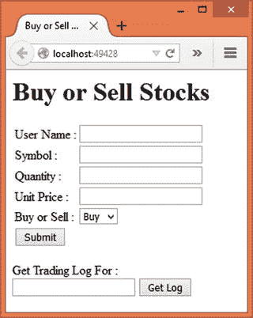

# 十、企业应用架构的模式：存储库、工作单元、惰性负载和服务层

到目前为止，在本书中，你已经学习了面向对象软件设计和 GoF 设计模式的坚实原则。本章将讨论企业应用架构的选择模式。

在第 [1](01.html) 章中，您已经了解了企业应用架构的这些模式。是时候更详细地研究一下 ASP.NET 应用中最常用的几个了。为此，本章将讨论以下模式以及概念证明示例:

*   贮藏室ˌ仓库
*   工作单位
*   延迟加载
*   服务层

企业应用架构的模式目录包括许多其他模式。由于篇幅的限制，本章不会涵盖所有的内容。这个想法是让你熟悉其中的一些模式，这样你就可以探索更多。前面选择的模式并不意味着其他模式不重要或者在 ASP.NET 应用中不使用。选择提到的模式只是因为它们通常用于真实世界的 ASP.NET 应用。

## EAA 害虫概述

在我们深入讨论前面提到的模式的细节之前，让我们快速了解一下什么是企业应用以及这些模式是如何组织的。在他的书《企业应用架构模式》中，Martin Fowler 讨论了企业应用的几个特征。在讨论 EAA 的 P 之前，看看其中的一些是值得的。

企业应用通常是企业用来完成工作的大规模数据驱动型应用。它们包括诸如工资单系统、基于 web 的订单处理系统或会计系统等应用。这种应用通常表现出以下特征:

*   他们处理大量的数据。这些数据属于业务领域。它可以是客户记录、订单历史、库存详细信息或任何此类特定于应用的数据。无论是哪种情况，应用需要处理的数据量都非常大。当然，不可能有“大”的精确度量，因为每个系统和业务本身都是独一无二的。
*   他们将数据存储在某个数据存储中。这些应用处理的数据对于企业的运作非常重要。显然，它需要一些持久存储，如 RDBMS 或 NoSQL 数据库。数据库引擎通常独立于主应用。这样，如果需要，许多应用可以使用相同的数据。
*   数据用于多用户环境。这些应用通常是多用户系统。这意味着在给定的时间点，许多用户可能会访问相同的数据。有可能在不知情的情况下覆盖他人所做的更改。因此，在这样的应用中，经常需要处理并发和并发冲突。
*   这些应用依赖于业务领域专家所熟知的某些业务规则。这些应用捕获这些规则，并将其翻译成代码。业务规则可以随时改变。因此，即使是这些应用也需要更改或升级，以考虑修改后的或新的业务规则。
*   一个企业通常执行许多不同规模的操作，每个操作处理一组数据。与操作相关的数据由许多页面显示和操作。所以，这样的应用通常有很多用户界面页面。
*   一个企业的所有运营可能都不是由一个应用来完成的。多个应用为业务服务，这些应用可能需要相互交互。因此，这种系统可能也需要应用集成。

如果你回顾一下前面的特征，你会发现它们基本上涉及三个不同的领域`—`数据管理、业务规则和用户界面。这就是为什么现代应用将整个应用分为三个概念层:

*   数据访问层
*   业务逻辑层
*   用户界面或表示层

一个被分成这三层的应用可以被形象地表示出来，如图 [10-1](#Fig1) 所示。


图 10-1。

An application conceptually divided into three layers

如图所示，整个应用分为三个概念层。数据访问层处理数据存储的特定操作，比如创建-读取-更新-删除(CRUD)和存储过程。业务逻辑层封装了特定于业务的流程和规则。它还与数据访问层进行通信，以便从持久数据存储中读取和写入业务数据。表示层由一个用户界面(在 ASP.NET 中是基于浏览器的用户界面)组成，它向最终用户显示数据，并接受最终用户的输入。

由于每一层处理一个特定的任务，修改、扩展和维护这样的系统变得更加容易。就 ASP.NET 应用而言，您可以使用 ADO.NET、实体框架和类库来创建数据访问层。业务逻辑层通常由类库或服务组成。表示层由视图、WebForm 甚至 HTML 页面组成。

必须注意，这种划分是概念性的，因为所有三个部分都可以驻留在一台服务器上。对于较大的系统，这些层可能部署在不同的物理服务器上，从而形成分布式系统。在后一种情况下，它们被称为层。术语 3 层通常用于涵盖这两种体系结构。

Martin Fowler 的书《企业应用架构模式》以这样一种方式对模式进行了分组，即它们可以与这三层中的一层相关联。这些模式的分组如下:

*   领域逻辑模式
*   数据源架构模式
*   对象关系行为模式
*   对象关系结构模式
*   对象关系元数据映射模式
*   Web 表示模式
*   分布模式
*   离线并发模式
*   会话状态模式
*   基本模式

每个组都包含几个模式。当然，本书并没有涵盖所有的内容。本章的剩余部分将讨论 ASP.NET 应用中常用的选择模式。具体来说，讨论以下模式(括号中提到了每个模式所属的组):

*   存储库(对象-关系元数据映射)
*   工作单元(对象关系行为)
*   惰性加载(对象关系行为)
*   服务层(域逻辑)

## 贮藏室ˌ仓库

使用数据访问层来执行 CRUD 操作在现实应用中非常常见。数据访问组件隔离了`INSERT`、`UPDATE`、`DELETE`和`SELECT`操作如何在系统中发生的细节。这个数据访问组件本质上是通用的，因为它被系统的许多其他部分使用。

现在设想一种情况，您需要从多个地方执行同一个数据库操作(比如一组复杂的查询)。尽管数据访问组件封装了基本的 CRUD 操作，但它不会在避免这些操作的重复方面提供任何帮助。因此，您可能最终会在多个地方编写相同的代码。

在这种情况下，您可以在域类和数据访问层之间引入一个层。这一层将负责封装可以重复使用的操作。这一层以存储库模式的形式出现。存储库模式是数据访问层和系统其余部分之间的中介。此外，它通过提供对底层数据的类似集合的访问来做到这一点。

一旦实现了存储库模式，客户机代码就不会直接调用数据访问组件。相反，它将调用存储库来完成工作。存储库通过提供添加、修改、删除和获取域对象的方法来提供一个集合接口。

有趣的是，实体框架已经实现了存储库模式。例如，您可以添加、修改、删除和访问`DbSet`、`which is`中的实体，这与集合非常相似。您的代码永远不需要单独处理 ADO.NET 对象，比如`SqlConnection`和`SqlCommand`。您只需使用`DbSet`并在上面执行所需的操作。

就 ASP.NET 应用而言，它们可能使用 ADO.NET 对象或实体框架进行数据库操作。如果应用使用 ADO.NET 对象，存储库模式肯定是有益的。

如果实体框架已经实现了存储库模式，是否需要再次实现？在简单的应用中，您可能不会，但是在现实世界的系统中，在客户端代码和实体框架之间再增加一层是有益的，原因如下:

*   如果你直接在你的客户端使用 EF，LINQ 查询将被嵌入到客户端/业务逻辑层。这可能是不可取的。
*   有了存储库，所有查询代码都与应用的其余部分隔离开来，促进了各层之间的松散耦合。
*   如果您正在使用模拟数据存储进行单元测试，您可以简单地插入一个模拟存储库，而不是真正的存储库(使用 EF 的存储库)。这样，即使在切换存储库之后，应用代码的其余部分也保持不变。

### 设计和解释

为了理解存储库模式在实体框架`–`驱动的应用中的作用，参见图 [10-2](#Fig2) 和图 [10-3](#Fig3) 。


图 10-3。

Data access with a repository


图 10-2。

Data access without a repository

图 [10-2](#Fig2) 显示了一个没有实现自己存储库的应用。客户端代码直接调用实体框架上的操作，例如 LINQ 到实体查询、`Add()`、`Remove()`和`SaveChanges()`。然后，实体框架与底层数据库通信以完成工作。刚才提到的客户机代码可以是业务逻辑层或任何其他需要执行数据库操作的代码。该设置可以修改为使用存储库，如图 [10-3](#Fig3) 所示。

图 [10-3](#Fig3) 显示了位于客户端代码和实体框架之间的存储库。在这种情况下，存储库封装了所有 LINQ 到实体的查询以及`Add()`、`Remove()`和`SaveChanges()`调用。客户端调用存储库上的方法。存储库将这些方法转换成相应的实体框架操作。然后，实体框架与底层数据库进行通信。

### 例子

现在您已经知道了存储库模式的含义，让我们开发一个基于这一知识的例子。

假设您正在构建一个数据驱动的 web 应用，它允许用户在数据库中添加、修改和删除客户。您希望简化单元测试，并对客户端隐藏所有的查询逻辑。您决定实现存储库模式。考虑到这些要求，您可以设计如图 [10-4](#Fig4) 所示的系统。


图 10-4。

Customer repository mediates between controller and EF

如图所示，`CustomerRepository`位于控制器和实体框架之间。当然，在更大的应用中，您可能有一个与存储库进行对话的业务层。更重要的是了解`CustomerRepository`的作用。

`CustomerRepository`实现了`ICustomerRepository`接口。`ICustomerRepository`接口定义了六种方法，分别是`SelectAll()`、`SelectByID()`、`Insert()`、`Update()`、`Delete()`、`Save()`。这些方法执行各自的任务。例如，`SelectAll()`方法针对`Customers DbSet`执行一个 LINQ 到实体的查询，并从数据库中获取所有的`Customer`实体。类似地，`Insert()`方法向`Customers DbSet`添加一个新的`Customer`。

请注意，`ICustomerRepository`接口的创建是为了让多个存储库类实现它。例如，您可以创建一个实现`ICustomerRepository`的模拟存储库，并且可以在单元测试期间使用。

`CustomerRepository`通过实体框架`DbContext`和`DbSet`与`Northwind`数据库通信。

您将在本部分开发的应用如图 [10-5](#Fig5) 所示。


图 10-5。

Modifying an existing customer

虽然`CustomerRepository`允许我们在`Customers`表上执行`insert`、`update`以及`delete`操作，但为了简单起见，应用只执行修改。

应用在下拉列表中显示所有`CustomerIDs`的列表。点击显示按钮显示所选`CustomerID`的`CompanyName`、`ContactName`和`Country`。您可以修改客户详细信息，然后单击更新按钮将更改保存回数据库。

要开发这个应用，首先使用 Visual Studio 创建一个新的 ASP.NET web 应用项目，并将其配置为使用 MVC 和实体框架(参见第 [1](01.html) 章了解更多细节)。还将`Northwind`数据库的数据库连接字符串存储在`appsettings.json`文件中。

然后将`AppSettings`类添加到`Core`文件夹中，并将`ConnectionString`静态属性添加到其中。打开`Startup`类，编写代码将`ConnectionString`属性设置为存储在`appsettings.json`文件中的属性。您已经熟悉这段代码，因此这里不讨论它。

现在将`Customer`类添加到`Core`文件夹中，并将清单 [10-1](#Par65) 中所示的代码写入其中。

```cs
[Table("Customers")]
public class Customer
{
    [Key]
    public string CustomerID { get; set; }
    [Required]
    public string CompanyName { get; set; }
    [Required]
    public string ContactName { get; set; }
    [Required]
    public string Country { get; set; }
}

Listing 10-1.Customer Entity

```

尽管`Northwind`数据库的`Customers`表包含许多列，但是`Customer`实体只使用其中的四列:`CustomerID`、`CompanyName`、`ContactName`和`Country`。属性将`Customer`类映射到`Customers`数据库表。`Customer`类的所有四个属性都被标记为`[Required]`，以确保在尝试`update`操作之前，它们都被赋值。

接下来，将`AppDbContext`类添加到`Core`文件夹中，并在其中定义`Customers DbSet`，如清单 [10-2](#Par79) 所示。

```cs
public class AppDbContext:DbContext
{
    public DbSet<Customer> Customers{ get; set; }
    protected override void OnConfiguring(DbContextOptionsBuilder optionsBuilder)
    {
        optionsBuilder.UseSqlServer(AppSettings.ConnectionString);
    }
}

Listing 10-2.AppDbContext with Customers DbSet

```

`AppDbContext`类非常简单，因此这里不再详细讨论。

接下来，将`ICustomerRepository`接口添加到`Core`文件夹中，并在其中定义六个方法，如清单 [10-3](#Par89) 所示。

```cs
public interface ICustomerRepository
{
    List<Customer> SelectAll();
    Customer SelectByID(string id);
    void Insert(Customer obj);
    void Update(Customer obj);
    void Delete(string id);
    void Save();
}

Listing 10-3.ICustomerRepository Interface

```

当实现时，`SelectAll()`方法应该返回一个`Customer`实体的`List`给调用者。`SelectByID()`方法接受一个`CustomerID`作为其参数，并返回与该 ID 匹配的`Customer`。`Insert()`和`Update()`方法接受一个`Customer`对象，并在`Customers DbSet`中添加或更新它。`Delete()`方法接受一个`CustomerID`并从`Customers DbSet`中移除一个与该 ID 匹配的`Customer`。`Save()`方法将对`Customers DbSet`所做的更改传播回数据库。

除了这六种方法之外，您还可以添加更多执行特定任务的方法。

现在在`Core`文件夹中添加`CustomerRepository`类，并在上面实现`ICustomerRepository`接口。清单 [10-4](#Par101) 显示了`CustomerRepository`类的完整代码。

```cs
public class CustomerRepository:ICustomerRepository,IDisposable
{
    private AppDbContext db;
    public CustomerRepository()
    {
        this.db = new AppDbContext();
    }
    public CustomerRepository(AppDbContext db)
    {
        this.db = db;
    }
    public List<Customer> SelectAll()
    {
        return db.Customers.ToList();
    }
    public Customer SelectByID(string id)
    {
        return db.Customers.Where
        (c => c.CustomerID == id).SingleOrDefault();
    }
    public void Insert(Customer obj)
    {
        db.Customers.Add(obj);
    }
    public void Update(Customer obj)
    {
        db.Entry(obj).State = EntityState.Modified;
    }
    public void Delete(string id)
    {
        Customer obj = db.Customers
                       .Where(c => c.CustomerID == id)
                       .SingleOrDefault();
        db.Customers.Remove(obj);
    }
    public void Save()
    {
        db.SaveChanges();
    }
    public void Dispose()
    {
        db.Dispose();
    }
}

Listing 10-4.CustomerRepository Class Implements ICustomerRepository

```

`CustomerRepository`类从声明一个变量`AppDbContext`开始。这个变量`db`在该类的无参数构造函数中被实例化。还有一个接受`AppDbContext`实例的构造函数。这样，你既可以在本地实例化`AppDbContext`，也可以从外部提供。

然后，`CustomerRepository`实现了由`ICustomerRepository`接口定义的所有六个方法。这些方法的实现非常简单，因此这里不做讨论。您已经在前面的例子中使用了这些实体框架操作。

注意这个实现是如何调用`DbContext`上的`Add()`、`Remove()`和`SaveChanges()`方法的。还要注意如何通过将`State`属性设置为`EntityState.Modified`来完成修改。

`CustomerRepository`也实现了`IDisposable`,这样就可以释放`AppDbContext`实例。

现在我们的`CustomerRepository`已经准备好了，让我们添加利用它的控制器。

将`HomeController`添加到`Controllers`文件夹中。你需要给`HomeController`增加三个动作`—Index()`、`SelectByID()`和`Update()—`。`Index()`动作如清单 [10-5](#Par151) 所示。

```cs
public IActionResult Index()
{
    using (CustomerRepository repository = new CustomerRepository())
    {
        List<Customer> customers = repository.SelectAll();
        ViewBag.Customers = from c in customers
                            select new SelectListItem()
                            {
                                Text = c.CustomerID,
                                Value = c.CustomerID
                            };
        return View();
    }
}

Listing 10-5.Index()

Fetches All the Customers from the Database

```

`Index()`动作实例化`CustomerRepository`并调用它的`SelectAll()`方法。为了在下拉列表中显示 CustomerIDs 的列表，您需要一个`SelectListItem`对象(`Microsoft.AspNet.Mvc.Rendering`名称空间)的列表。因此，执行一个 LINQ 查询，从客户`List`创建`SelectListItem`对象。`SelectListItem`类的`Text`和`Value`属性分别表示要在下拉列表中显示的文本及其值。

`SelectListItem`对象的列表存储在`Customers ViewBag`属性中，因此可以在视图中访问它。

当您从下拉列表中选择一个 CustomerID 并单击 Show 按钮时，就会调用`SelectByID()`动作(列表 [10-6](#Par168) )。

```cs
[HttpPost]
public IActionResult SelectByID(string customerid)
{
    using (CustomerRepository repository = new CustomerRepository())
    {
        Customer data = repository.SelectByID(customerid);
        List<Customer> customers = repository.SelectAll();
        ViewBag.Customers = from c in customers
                            select new SelectListItem()
                            {
                                Text = c.CustomerID,
                                Value = c.CustomerID
                            };
        return View("Index", data);
    }
}

Listing 10-6.SelectByID() Fetches a Single Customer

```

`SelectByID()`动作通过模型绑定接收下拉列表中选择的一个`customerid`。在内部，代码创建了一个`CustomerRepository`对象，并通过向其传递`customerid`值来调用其`SelectByID()`方法。如此获得的`Customer`数据变量充当`Index`视图的模型。如前所述，创建一个`SelectListItem`对象列表。

显示`CompanyName`、`ContactName`和`Country`等`Customer`细节后，您可以修改它们并点击更新按钮。此时`Update()`动作被调用(清单 [10-7](#Par186) )。

```cs
[HttpPost]
public IActionResult Update(Customer obj)
{
    using (CustomerRepository repository = new CustomerRepository())
    {
        repository.Update(obj);
        repository.Save();
        List<Customer> customers = repository.SelectAll();
        ViewBag.Customers = from c in customers
                            select new SelectListItem()
                            {
                                Text = c.CustomerID,
                                Value = c.CustomerID
                            };
        ViewBag.Message = "Customer modified successfully!";
        return View("Index", obj);
    }
}

Listing 10-7.Update() Action Persists the Changes

```

`Update()`动作通过模型绑定接收一个要修改的`Customer`对象。在内部，代码创建了一个`CustomerRepository`对象，并通过向其传递`Customer`对象来调用其`Update()`方法。然后调用`Save()`方法将更改保存到数据库。像以前一样创建一个`SelectListItem`对象列表(您可以通过创建一个私有的 helper 方法来避免这种重复)。一条成功消息被分配给`Message ViewBag`属性，用于在视图上显示。

这就完成了控制器。现在将一个`Index`视图添加到`Views/Home`文件夹中，并将清单 [10-8](#Par206) 中所示的标记写入其中。

```cs
@model Repository.Core.Customer
<h1>Modify Existing Customer</h1>
<form asp-action="Update" asp-controller="Home">
    <table border="1" cellpadding="10">
        <tr>
            <td><label asp-for="CustomerID">Customer ID :</label></td>
            <td>
                <select asp-for="CustomerID" asp-items="@ViewBag.Customers"></select>
                <input type="submit" value="Show" formaction="/home/selectbyid" />
            </td>
        </tr>
        <tr>
            <td><label asp-for="CompanyName">Company Name :</label></td>
            <td><input asp-for="CompanyName" /></td>
        </tr>
        <tr>
            <td><label asp-for="ContactName">Contact Name :</label></td>
            <td><input asp-for="ContactName" /></td>
        </tr>
        <tr>
            <td><label asp-for="Country">Country :</label></td>
            <td><input asp-for="Country" /></td>
        </tr>
        <tr>
            <td colspan="2"><input type="submit" value="Update"/></td>
        </tr>
    </table>
    @ViewBag.Message
</form>

Listing 10-8.Markup of the Index View

```

`@model`指令将`Index`视图的模型设置为`Customer`类。主视图由一个表单标签助手组成，它将表单提交给`HomeController` ( `asp-controller`属性)的`Update()`动作(`asp-action`属性)。

该表单由一系列标签、一个下拉列表、四个文本框和两个按钮组成。注意这些标签助手是如何与`Customer`模型类的相应属性绑定在一起的。另外，注意下拉列表是如何被通过`Customers ViewBag`属性传递的`SelectListItem`对象填充的。这是通过使用下拉列表标签助手的`asp-items`属性来完成的。

显示提交按钮通过将表单提交给`SelectByID()`动作来覆盖表单的动作。这是通过将其`formaction`属性设置为`/home/selectbyid`来实现的。

最后，`Message ViewBag`属性在页面底部输出，显示从`Update()`动作分配的消息。

这就完成了应用。运行应用，检查是否可以成功修改客户详细信息。

#### 基于通用接口创建存储库

在前面的例子中，您创建了一个专门为`Customer`实体设计的`ICustomerRepository`。如果您有许多其他实体(比如`Product`、`Employee`和`Order`)也需要相同的方法集，该怎么办？当然，您可以为它们中的每一个创建单独的接口。但是您可能最终会得到许多本质上非常相似的接口(`IProductRepository`、`IEmployeeRepository`、`IOrderRepository`等等)。在这种情况下，您可以创建一个通用接口，允许您在实体类的实现过程中指定它。

考虑清单 [10-9](#Par242) 中显示的代码。

```cs
public interface IRepository<T1,T2> where T1:class
{
    List<T1> SelectAll();
    T1 SelectByID(T2 id);
    void Insert(T1 obj);
    void Update(T1 obj);
    void Delete(T2 id);
    void Save();
}

Listing 10-9.IRepository Is a Generic Interface

```

`IRepository`接口接受两种通用类型:`T1`和`T2\. T1`有一个约束，即它必须是一个类。`T1`是实体类，比如`Customer`或者`Employee. T2`是主键的数据类型。`SelectByID()`和`Delete()`方法中需要`T2`。`T2`可能是整数，也可能是字符串或其他类型。

创建之后，`IRepository`可以作为许多存储库的存储库接口。例如，`CustomerRepository`可以这样实现`IRepository`:

```cs
public class CustomerRepository:IRepository<Customer,string>
{
  ...
  ...
}

```

其他一些存储库，比如说`EmployeeRepository`，可以像这样实现`IRepository`:

```cs
public class EmployeeRepository:IRepository<Employee,int>
{
  ...
  ...
}

```

注意，这一次`Employee`类被指定为`T1`，而`integer`被指定为`T2`。

## 工作单位

一项业务操作可能涉及多个步骤，但要求作为一个整体将该操作视为一个批次或单元。您可以求助于数据库事务，并按如下方式完成任务:

*   开始数据库事务。
*   对数据库逐一执行操作的所有步骤。
*   提交或回滚事务。

尽管这听起来很简单，但有一个问题是，您是在直接对数据库执行操作的单个步骤。因此，如果一个操作包含十个步骤，您就创建了十个数据库`write`操作。如此大量的小型数据库操作会影响系统的整体性能。

如果您能够捕获各个步骤，然后将它们一次发送到数据库引擎，并在单个事务中执行它们，岂不是更好？这就是工作单元模式背后的思想。工作单元模式跟踪您的业务事务，该事务应该以某种方式改变数据库。一旦业务事务结束，跟踪的步骤将在事务中播放到数据库中，以便数据库反映所需的更改。因此，工作单元模式跟踪业务事务，并将其转换为数据库事务，其中各个步骤作为单个单元一起运行。

好消息是，实体框架已经为您实现了变更跟踪，并且还在事务性批处理中执行了`INSERT`、`UPDATE`和`DELETE`操作。

假设你有一个`DbContext`容纳了两个`DbSet`对象，比如说`Orders`和`OrderDetails`。`Orders DbSet`包含与订单整体相关的信息，如`OrderID`、`CustomerID`、`OrderDate`和`ShippingAddress`。`OrderDetails DbSet`包含一个订单的各个项目的详细信息，如`ProductID`和`Quantity`。

显然，保存一个新添加的`Order`及其细节应该发生在一个事务中。当您向`Orders DbSet`添加一个新的`Order`对象时，实体框架会跟踪这个操作。类似地，`OrderDetail`对象的添加也被跟踪。最后，当你完成时，你调用`DbContext`上的`SaveChanges()`方法。此时，到目前为止跟踪的所有更改都被转换成一个批处理查询。启动一个数据库事务，执行批处理，提交事务(如果有错误，则回滚事务)。因此，实体框架变更跟踪和`SaveChanges()`方法实现了工作单元模式。

### 设计和解释

在前面的部分中，您学习了工作单元模式的基础。您也知道实体框架实现了这种模式。现在让我们看看为什么以及如何在应用中实现这种模式。

考虑图 [10-6](#Fig6) ，它显示了一个有两个存储库的应用。


图 10-6。

Repositories with independent DbContext objects

应用由两个存储库组成:`Repository1`和`Repository2`。让我们假设`Repository1`和`Repository2`作为两个独立的实体处理所有的数据库操作。这些库实例化它们自己的`DbContext`，在期望的`DbSet`上执行操作，一旦完成就调用`SaveChanges()`方法。

目前为止，一切顺利。现在让我们假设由`Repository1`和`Repository2`执行的操作将作为单个工作单元来执行。前面的设计将无法实现这一点，因为每个存储库都使用自己的`DbContext`，当`SaveChanges()`被调用时，每个`DbContext`将创建自己的事务。

如果您希望利用这两个存储库来执行业务事务，它们必须共享同一个`DbContext`。图 [10-7](#Fig7) 显示了系统的修改设计。


图 10-7。

Implementing unit of work with repositories

修改后的设计包括`Repository1`和`Repository2`共享同一个`DbContext`对象和`DbSet`对象。由`Repository1`和`Repository2`做出的更改在单个`DbContext`下被跟踪，因此形成一个批处理。此外，当您调用`SaveChanges()`时，单个数据库事务执行整个批处理，使其成为一个工作单元。

### 例子

既然您已经理解了工作单元模式是如何工作的，那么让我们开发一个例子来实现上一节中讨论的设计。

假设您正在构建一个 web 应用，该应用维护由一家公司执行的项目的详细信息以及参与这些项目的团队成员的详细信息。该应用允许用户添加项目及其团队成员。项目细节和团队成员细节存储在两个不同的数据库表`—Projects`和`TeamMembers`中。您希望将项目及其团队成员的添加视为一个工作单元。考虑到这些要求，你设计如图 [10-8](#Fig8) 所示的系统。


图 10-8。

Adding a project and team members as a unit

应用由两个实体`—Project`和`TeamMember`组成。`DbContext`容纳两个`DbSets`，即`Projects`和`TeamMembers`，分别持有各自的实体。

有两个存储库`—ProjectRepository`和`TeamRepository`。`ProjectRepository`负责添加、修改和删除项目，而`TeamRepository`负责添加、修改和删除团队成员。

客户端代码不直接使用存储库(就添加项目及其团队成员的业务事务而言)。`ProjectUnit`类封装了添加项目及其团队成员的整个业务事务。

`ProjectUnit`类维护一个`DbContext`对象以及`ProjectRepository`和`TeamRepository`对象。更重要的是，`DbContext`是在这两个库之间共享的。这两个存储库通过`getter`属性向客户端代码公开。这样，客户端代码可以将项目和团队成员添加到相应的`DbSet`对象中。`CreateProject()`方法调用`DbContext`上的`SaveChanges()`，将整个操作作为一个工作单元执行。

您将在本部分开发的应用如图 [10-9](#Fig9) 所示。


图 10-9。

Adding a new project and its team members

该应用允许您指定一个项目名称和参与该项目的团队成员的姓名。点击创建项目按钮后，数据将分别添加到`Projects`和`TeamMembers`表中。

要开发这个应用，首先使用 Visual Studio 创建一个新的 ASP.NET web 应用项目，并将其配置为使用 MVC 和实体框架(更多细节参见第 [1](01.html) 章)。还要在`appsettings.json`文件中存储应用`—`使用的数据库`UnitOfWorkDb—`的数据库连接字符串。

然后将`AppSettings`类添加到`Core`文件夹中，并向其中添加一个`ConnectionString`静态属性。打开`Startup`类，编写代码将`ConnectionString`属性设置为存储在`appsettings.json`文件中的属性。您已经熟悉这段代码，因此这里不讨论它。

现在将`Project`和`TeamMember`类添加到`Core`文件夹中，并在其中编写清单 [10-10](#Par291) 所示的代码。

```cs
[Table("Projects")]
public class Project
{
    [Key]
    public Guid ProjectID { get; set; }
    [Required]
    public string ProjectName { get; set; }
}
[Table("TeamMembers")]
public class TeamMember
{
    [DatabaseGenerated(DatabaseGeneratedOption.Identity)]
    public int TeamMemberID { get; set; }
    [Required]
    public Guid ProjectID { get; set; }
    [Required]
    public string Name { get; set; }
}

Listing 10-10.Project and TeamMember Entities

```

`Project`类由两个属性组成，即`ProjectID`和`ProjectName`。注意`ProjectID`是一个 Guid，并作为主键。使用`[Table]`属性将`Project`实体映射到`Projects`表。

`TeamMember`类由三个属性组成，即`TeamMemberID`、`ProjectID`、`Name. TeamMemberID`是一个标识列。`[Table]`属性将`TeamMember`类映射到`TeamMembers`表。

接下来，将`AppDbContext`类添加到`Core`文件夹中，并在其中定义两个`DbSet`对象，如清单 [10-11](#Par312) 所示。

```cs
public class AppDbContext:DbContext
{
    public DbSet<Project> Projects { get; set; }
    public DbSet<TeamMember> TeamMembers { get; set; }
    protected override void OnConfiguring(DbContextOptionsBuilder optionsBuilder)
    {
        optionsBuilder.UseSqlServer(AppSettings.ConnectionString);
    }
}

Listing 10-11.AppDbContext with Projects and TeamMembers DbSet Objects

```

`AppDbContext`类非常简单，包含两个`DbSet`对象`—Projects`和`TeamMembers`。

现在将存储库接口`—IRepository—`添加到`Core`文件夹中。这个例子没有为存储库创建两个不同的接口，而是使用一个通用接口，如清单 [10-12](#Par323) 所示。

```cs
public interface IRepository<T1,T2> where T1:class
{
    List<T1> SelectAll();
    T1 SelectByID(T2 id);
    void Insert(T1 obj);
    void Update(T1 obj);
    void Delete(T2 id);
    void Save();
}

Listing 10-12.IRepository Is a Generic Repository Interface

```

在讨论存储库模式时，您了解了通用存储库接口的效用。这里，您需要创建两个库`—ProjectRepository`和`TeamRepository—`，它们实现了`IRepository`接口。`ProjectRepository`的完整代码如清单 [10-13](#Par333) 所示。

```cs
public class ProjectRepository:IRepository<Project,Guid>,IDisposable
{
    private AppDbContext db;
    public ProjectRepository(AppDbContext db)
    {
        this.db = db;
    }
    public List<Project> SelectAll()
    {
        return db.Projects.ToList();
    }
    public Project SelectByID(Guid id)
    {
        return db.Projects.Where(c => c.ProjectID == id)
                          .SingleOrDefault();
    }
    public void Insert(Project obj)
    {
        db.Projects.Add(obj);
    }
    public void Update(Project obj)
    {
        db.Entry(obj).State = EntityState.Modified;
    }
    public void Delete(Guid id)
    {
        Project obj = db.Projects
                        .Where(c => c.ProjectID == id)
                        .SingleOrDefault();
        db.Entry(obj).State = EntityState.Deleted;
    }
    public void Save()
    {
        db.SaveChanges();
    }
    public void Dispose()
    {
        db.Dispose();
    }
}

Listing 10-13.
ProjectRepository

Deals with Projects

```

`ProjectRepository class`通过指定`Project`为`T1`和`Guid`为`T2`来实现`IRepository`。而且，`ProjectRepository`的构造器从外部接受一个`AppDbContext`，存储在一个局部变量`—db`中。这很重要，因为您希望在多个存储库中共享同一个`DbContext`。

此外，该类实现了所有六个方法`IRepository—SelectAll()`、`SelectByID()`、`Insert()`、`Update()`、`Delete()`和`Save()`。这些方法对您来说应该很熟悉，因为您在学习存储库模式时使用过它们。

`TeamRepository`可以沿着类似的路线开发。它会用`TeamMember`作为`T1`，用`int`作为`T2`。为了节省一些篇幅，这里不再讨论`TeamRepository`类。您可以从本书的代码下载中获得`TeamRepository`类的完整代码。

现在，在`Core`文件夹中添加一个`ProjectUnit`类，并在其中编写清单 [10-14](#Par377) 中所示的代码。

```cs
public class ProjectUnit
{
    private AppDbContext db;
    private ProjectRepository projectRepository;
    private TeamMemberRepository teamRepository;
    public ProjectUnit()
    {
        db = new AppDbContext();
        projectRepository = new ProjectRepository(db);
        teamRepository = new TeamMemberRepository(db);
    }
    public ProjectRepository ProjectRepository
    {
        get
        {
            return this.projectRepository;
        }
    }
    public TeamMemberRepository TeamRepository
    {
        get
        {
            return this.teamRepository;
        }
    }
    public void CreateProject()
    {
        db.SaveChanges();
    }
}

Listing 10-14.ProjectUnit Class

```

`ProjectUnit`类从声明三个私有变量`—AppDbContext`、`ProjectRepository`和`TeamRepository`开始。这些变量在类的构造函数中实例化。注意，`db`被传递给了`ProjectRepository`和`TeamRepository`的构造函数。这样，两个存储库共享相同的`DbContext`。

两个公共属性`—ProjectRepository`和`TeamRepository—`将各自的私有对象暴露给外部世界。这样，客户端代码可以将实体添加到各自的`DbSet`对象中。

`CreateProject()`方法在`AppDbContext`对象上调用`SaveChanges()`方法。这是创建数据库事务和执行一批操作的地方。执行完成后，通过将更改保存到数据库来提交事务。

现在是时候创建`HomeController`了，它是`ProjectUnit`类的客户端。将`HomeController`添加到`Controllers`文件夹中。除了默认的`Index()`动作，还需要添加`CreateProject()`动作。这个动作如清单 [10-15](#Par411) 所示。

```cs
[HttpPost]
public IActionResult CreateProject(Project project, List<TeamMember> members)
{
    ProjectUnit unit = new ProjectUnit();
    project.ProjectID = Guid.NewGuid();
    unit.ProjectRepository.Insert(project);
    foreach (var item in members)
    {
        item.ProjectID = project.ProjectID;
        unit.TeamRepository.Insert(item);
    }
    unit.CreateProject();
    ViewBag.Message = "Project created successfully!";
    return View("Index");
}

Listing 10-15.CreateProject() Action

```

当您点击`Index`视图上的 Create Project 按钮时，就会调用`CreateProject()`动作。它通过模型绑定接收一个`Project`对象和一个`TeamMember`对象的`List`。

在内部，代码创建了一个`ProjectUnit`类的实例。通过`Guid`结构的`NewGuid()`方法给`Project`对象的`ProjectID`属性分配一个 Guid。

然后使用`ProjectRepository`将`Project`对象添加到`Projects DbSet`中。此时，`Project`对象被添加到`Projects DbSet,`中，但是它还没有被添加到数据库中。

一个`foreach`循环遍历成员`List`，并使用`TeamRepository`将`TeamMember`对象添加到`TeamMembers DbSet`。

一旦添加了所有的团队成员，就会调用`ProjectUnit`类的`CreateProject()`方法将所有的更改保存回数据库。成功消息也存储在`ViewBag`中。

让我们通过添加`Index`视图来完成应用。将`Index`视图添加到`Views/Home`文件夹中，并将清单 [10-16](#Par432) 中所示的标记写入其中。

```cs
<h1>Add New Project</h1>
<form asp-action="CreateProject" asp-controller="Home" method="post">
    <table border="1" cellpadding="10">
        <tr>
            <td>Project Name : </td>
            <td><input name="ProjectName" type="text"/></td>
        </tr>
        <tr>
            <td>Team Members : </td>
            <td>
                <input name="members[0].Name" type="text" />
                <br /><br />
                <input name="members[1].Name" type="text" />
            </td>
        </tr>
        <tr>
            <td colspan="2"><input type="submit" value="Create Project"/></td>
        </tr>
    </table>
    @ViewBag.Message
</form>

Listing 10-16.Markup of the Index View

```

`Index`视图由一个通过表单标签助手呈现的表单组成。表单被提交给`HomeController` ( `asp-controller`属性)的`CreateProject()`动作(`asp-action`属性)。

该表单包含一个用于输入`ProjectName`的文本框、两个用于指定团队成员姓名的文本框和一个提交按钮。当然，在更现实的应用中，您可以输入任意多的团队成员。请注意接受团队成员姓名的文本框所使用的命名约定。这个命名约定确保了模型绑定框架将值转换成`TeamMember`对象的`List`。

从`CreateProject()`动作分配的`Message`在页面底部输出。

这就完成了应用。在运行应用之前，您需要创建带有`Projects`和`TeamMembers`表的`UnitOfWorkDb`数据库(更多细节请参考第 [1 章](01.html))。一旦创建了数据库和表，运行应用并尝试添加一个新项目。

## 延迟加载

通常，当您从数据访问层或服务接收对象时，它包含由其属性公开的所有数据。考虑一个数据访问层，它根据存储在数据库中的客户数据返回一列`Customer`对象。这个列表中的每个`Customer`对象代表一个客户，详细信息如`CustomerID`、`CompanyName`、`ContactName`和`Country`被加载到对象各自的属性中。

这是大多数情况下所期望的。然而，有时您可能想要偏离这种行为。假设,`Customer`类包含一个名为`Orders`的集合属性。`Orders`集合应该包含由那个`Customer`以`Order`对象的形式下的所有订单的列表。在正常情况下，`Orders`集合也将填充所需的数据，并从数据访问层返回。但是，想象一下只需要`Customer`联系方式的情况。根本不需要客户下的订单。显然，在`Customer`实例化的时候加载`Orders`集合是一种浪费。如果只在需要的时候加载订单信息就好了。事实上，这就是延迟加载模式背后的思想。

惰性加载模式用于在对象实例化后加载对象所需的数据。因此，您的代码可以使用一个对象实例，但是它的所有属性可能都不包含它们应该公开的数据。该对象知道如何在需要时加载数据。通常，只有在第一次访问属性时才会加载数据。对象的所有属性可能都不支持延迟加载。资源密集型或包含大量数据的属性以惰性方式加载，而其他属性则照常加载。

### 设计和解释

尽管惰性加载模式背后的基本思想是在对象初始化后加载数据，但是有多种方法可以实现这一思想。下面列出了用于实现延迟加载模式的常用技术:

*   惰性初始化:在这种技术中，要惰性加载的类字段最初保持为空。每次访问该字段时，都会检查它是否为空。如果为空，则提取数据并加载到字段中。这要求您屏蔽`getter`属性中的字段。如前所述，`getter`属性执行数据的检查和加载。
*   虚拟代理:虚拟代理是一个与原始对象非常相似的对象，但不包含任何数据。只有在调用数据的任何方法时，才会加载数据。
*   值容器:值容器是包装要使用的实际对象的对象。最初，对象是空的。你需要问价值持有者它的价值。此时，值保持器检查对象是否已经被加载，如果还没有被加载，则加载数据。
*   ghost:ghost 是应用需要的实际对象，只包含部分加载的数据。最初，虚像只包含对象的 ID(或任何主键)。每当代码试图访问对象的任何字段时，对象都会加载完整的数据。

本章不会涵盖所有这些技术。第一种——惰性初始化——是一种可以在应用中实现的简单技术，因此将在这里讨论。那个。NET Framework 通过`System.Lazy`类支持惰性初始化。这也将在后面的章节中讨论。

要了解惰性加载模式如何通过惰性初始化工作，请参见图 [10-10](#Fig10) 。


图 10-10。

Lazy load pattern through lazy initialization

假设有一个对象——`Target`——有一个公共属性——比如说，`Data`。`Data`属性公开了一个私有字段`_data`，用于保存数据库中的数据。进一步假设存储在`_data`字段中的数据非常庞大，因此需要以惰性方式加载。

最初，当客户端代码创建`Target`对象时，`_data`字段为空。当客户端代码访问`Data`公共属性时，该属性检查`_data`是否为空。这可以是针对`null`值的简单检查。如果`_data`尚未加载，则执行查询，并从数据库中获取所需的数据。然后，返回的数据被加载到`_data`字段中，`Data`属性将该数据返回给调用者。

当再次访问`Data`属性时，数据已经加载到`_data`字段中，因此可以立即返回给调用者。因此，`Data`属性是惰性初始化的，`Target`对象支持惰性加载模式。

### 例子

现在您已经知道了什么是惰性加载模式，让我们构建一个示例来说明它是如何工作的。

假设您正在构建一个处理客户及其订单的 web 应用。订单由公司员工抓取，并通过网络界面输入系统。

公司的人力资源部门出于各种目的需要员工数据。大多数情况下，需要员工的详细信息，如姓名、职务和电话号码。但是，在绩效考核或加薪期间，员工提交的订单的详细信息是必要的。

正如您可能已经猜到的那样，除了订单之外，雇员的所有属性都是经常需要的。一旦创建了 employee 对象，就让它们可用是有意义的。但是，如果需要，可以加载订单数据。因此，订单数据是惰性加载模式的一个很好的候选对象。在这种情况下，您将对返回订单的属性进行延迟初始化。

考虑到这些要求，您可以加载如图 [10-11](#Fig11) 所示的订单。


图 10-11。

Loading orders placed by an employee using lazy loading

这个例子使用`Northwind`数据库作为它的数据存储。`Northwind`数据库的`Employees`表包含`EmployeeID`、`FirstName`、`LastName`等员工信息。`Orders`表包含系统中的订单列表。每个订单都有下订单的员工的`EmployeeID`。因此，对于单个`EmployeeID`，可能有零个或多个订单。`Employee`类的`Orders`属性实现了惰性初始化。

最初，当一个`Employee`对象被创建时，`Orders`属性被设置为`null`。当客户机代码第一次访问`Orders`属性时，会触发一个数据库查询，并获取该雇员下的所有订单。返回的数据存储在私有集合变量中。然后，`Orders`属性将集合返回给调用者。对`Orders`属性的后续调用只是返回已经从数据库中获取的订单。

您将在本部分开发的应用如图 [10-12](#Fig12) 所示。


图 10-12。

Application loading orders using lazy initialization

该应用由一个文本框组成，用于输入一个`EmployeeID`。单击“显示”按钮显示该员工下的订单列表。

要开发这个应用，首先使用 Visual Studio 创建一个新的 ASP.NET web 应用项目，并将其配置为使用 MVC(参见第 [1](01.html) 章了解更多细节)。这个例子没有使用实体框架。相反，它使用 ADO.NET 对象模型进行数据访问。因此，将`Northwind`数据库的数据库连接字符串存储在`appsettings.json`文件中。

然后将`AppSettings`类添加到`Core`文件夹中，并将`ConnectionString`静态属性添加到其中。打开`Startup`类，编写代码将`ConnectionString`属性设置为存储在`appsettings.json`文件中的属性。您已经熟悉了这段代码，因此这里不讨论它。

现在，将`Order`类添加到`Core`文件夹中，并定义属性，如清单 [10-17](#Par482) 所示。

```cs
public class Order
{
    public int OrderID { get; set; }
    public DateTime OrderDate { get; set; }
}

Listing 10-17.Order Class

```

尽管`Orders`表包含更多的列，但是`Order`类只包含两个属性— `OrderID`和`OrderDate`。

然后将`Employee`类添加到`Core`文件夹中。清单 [10-18](#Par489) 显示了`Employee`级的框架。

```cs
public class Employee
{
    private List<Order> orders = null;
    public int EmployeeID { get; set; }
    public string FirstName { get; set; }
    public string LastName { get; set; }
    public string Title { get; set; }
    public Employee(int id)
    {
      ...
    }
    public List<Order> Orders
    {
      ...
    }
}

Listing 10-18.Skeleton of the Employee Class

```

`Employee`类由一个构造函数和五个公共属性组成。代码从声明`Order`对象的私有`List`开始。最初，订单列表是`null`。

然后，该类定义了四个属性— `EmployeeID`、`FirstName`、`LastName`和`Title`。这些属性加载到类的构造函数中。

该类的构造函数接受一个雇员 ID 并将数据加载到前面的四个属性中。订单列表在这个时间点没有被填写。公共属性 lazy 初始化订单列表，稍后将会讨论。

在构造函数中加载`EmployeeID`、`FirstName`、`LastName`和`Title`属性的代码如清单 [10-19](#Par509) 所示。

```cs
public Employee(int id)
{
    this.EmployeeID = id;
    SqlConnection cnn = new SqlConnection(AppSettings.ConnectionString);
    SqlCommand cmd = new SqlCommand("select employeeid,firstname,lastname,title from employees where employeeid=@id", cnn);
    cmd.Parameters.Add(new SqlParameter("@id",id));
    cnn.Open();
    SqlDataReader reader = cmd.ExecuteReader();
    while(reader.Read())
    {
        this.FirstName = reader.GetString(1);
        this.LastName = reader.GetString(2);
        this.Title = reader.GetString(3);
    }
    cnn.Close();
}

Listing 10-19.Loading Properties During Object Initialization

```

代码将`EmployeeID`属性设置为传递给构造函数的`id`。然后创建一个新的`SqlConnection`对象(`System.Data.SqlClient`名称空间)，并将`Northwind`数据库的连接字符串传递给它的构造函数。

然后通过指定一个`SELECT`查询和先前创建的`SqlConnection`对象来创建一个`SqlCommand`对象。对于特定的员工 ID，`SELECT`查询从`Employees`表中获取`EmployeeID`、`FirstName`、`LastName`和`Title`列。查询被参数化，因此包含`EmployeeID`值的`SqlParameter`对象被添加到命令的`Parameters`集合中。

使用`Open()`方法打开数据库连接，通过调用`SqlCommand`的`ExecuteReader()`方法执行查询。`ExecuteReader()`方法返回一个`SqlDataReader`对象。

一个`while`循环和`Read()`方法遍历`SqlDataReader`，并加载所考虑的`Employee`对象的`FirstName`、`LastName`和`Title`属性。注意，代码使用`GetString()`方法读取列的值，因为所有列都包含字符串数据。

然后关闭数据库连接。此时，除了`Orders`之外的所有属性都包含所需的数据。

清单 [10-20](#Par531) 中显示了加载订单列表的`Orders`属性。

```cs
public List<Order> Orders
{
    get
    {
        if(this.orders==null)

        {

            SqlConnection cnn = new SqlConnection(AppSettings.ConnectionString);
            SqlCommand cmd = new SqlCommand("select orderid,orderdate from orders where employeeid=@id", cnn);
            cmd.Parameters.Add(new SqlParameter("@id", this.EmployeeID));
            cnn.Open();
            SqlDataReader reader = cmd.ExecuteReader();
            if(reader.HasRows)
            {
                this.orders = new List<Order>();
            }
            while(reader.Read())
            {
                Order order = new Order()
                {
                    OrderID = reader.GetInt32(0),
                    OrderDate = reader.GetDateTime(1)
                };
                this.orders.Add(order);
            }
            cnn.Close();
        }
        return this.orders;

    }
}

Listing 10-20.Loading Orders by Lazy Initialization

```

`Orders`属性只包含一个`getter`块。请注意用粗体字母标记的代码。`if`语句检查订单列表是否为`null`。回想一下，在变量声明时，订单列表被赋予了一个`null`值。

如果第一次访问`Orders`属性，订单列表将是`null`并且来自`if`块的代码被执行。该代码与您之前在构造函数中编写的代码非常相似，只是有一些不同。

代码执行一条`SELECT`语句，获取所有订单(`OrderID`和`OrderDate`列)，其中`EmployeeID`与`EmployeeID`属性相同。然后检查`SqlDataReader`的`HasRows`属性以查看是否有任何行被返回。如果`SqlDataReader`中有行，订单列表被初始化为一个新的`List`的`Order`对象。

使用一个`while`循环和`Read()`方法来读取订单数据。对于每一个订单行，都会创建一个`Order`对象，它的`OrderID`和`OrderDate`属性被设置为从各自的列中获得的值。注意，代码使用`GetInt32()`作为`OrderID`列，因为`OrderID`是一个整数，使用`GetDateTime()`作为`OrderDate`列，因为它保存日期和时间数据。

将`EmployeeID`的所有订单添加到订单列表中，并关闭数据库连接。然后,`Orders`属性将订单列表返回给调用者。

接下来，将`HomeController`添加到`Controllers`文件夹中。除了`Index()`动作，您还需要添加`GetDetails()`动作，如清单 [10-21](#Par566) 所示。

```cs
public IActionResult GetDetails(int employeeid)
{
    Employee emp = new Employee(employeeid);
    return View("Index",emp);
}

Listing 10-21.GetDetails() Action Causes Orders to Load

```

点击 Show 按钮时会调用`GetDetails()`动作。它通过模型绑定接收在文本框中输入的雇员 ID。然后通过提供这个雇员 ID 创建一个`Employee`对象。此时，`Orders`属性还没有加载。这样创建的`Employee`对象被传递给`Index`视图作为它的模型。

现在将`Index`视图添加到`Views/Home`文件夹中，并将清单 [10-22](#Par573) 中所示的标记写入其中。

```cs
@model LazyLoad.Core.Employee
<h2>Employee ID :</h2>
<form asp-action="GetDetails" asp-controller="Home" method="post">
    <input type="text" name="employeeid" />
    <input type="submit" value="Show" />
    <br />
    <br />
    @if (Model != null)
    {
    <h4>Orders placed by @Model.FirstName @Model.LastName (@Model.Title)</h4>
    <div>
        <table border="1" cellpadding="10">
            @foreach (var item in Model.Orders)
            {
                <tr>
                    <td>#@item.OrderID</td>
                    <td>@item.OrderDate</td>
                </tr>
            }
        </table>
    </div>
    }
</form>

Listing 10-22.Markup of the Index View

```

`Index`视图使用表单标签助手呈现表单。该表单包含了`EmployeeID`文本框和显示按钮。Show 按钮将表单提交给`HomeController` ( `asp-controller`属性)的`GetDetails()`动作(`asp-action`属性)。

然后，`if`语句检查`Model`属性是否为`null`。最初，当视图第一次被呈现时，`Model`属性将是`null`，因此没有表被呈现。

当您输入一个员工 ID 并单击 Show 按钮时，`GetDetails()`被调用，一个`Employee`对象被发送到视图。员工的详细信息，如`FirstName`、`LastName`和`Title`显示在表格的顶部。`foreach`循环遍历`Employee`模型对象的`Orders`属性。这是订单列表被填充的地方。每个`Order’s OrderID`和`OrderDate`都显示在一个表格中。

这就完成了应用。运行应用，并在文本框中输入有效的员工 id。单击 Show 按钮后，视图应该显示该员工下的订单列表。

#### 使用。NET 框架的系统。懒惰阶层

那个。NET Framework 的`Lazy`类很容易为对象的惰性初始化提供支持。要使用这个类，您需要创建一个`Lazy`类的实例，指定您希望延迟初始化的类型。当您第一次访问`Lazy`对象的`Value`属性时，实际的类被实例化。通过这种方式，对象实例化被推迟到您真正需要该对象时。

当您处理代码可能使用也可能不使用的资源密集型对象时,`Lazy`类就派上了用场。如果在处理过程中根本不使用这些对象，那么预先实例化这些对象可能会被证明是浪费。`Lazy`类还允许您在创建对象时执行资源密集型初始化代码。

为了理解`Lazy`类是如何工作的，考虑下面的代码片段:

```cs
Lazy<Customer> lazyObj = new Lazy<Customer>();
...
Customer obj = lazyObj.Value;

```

第一行代码通过将`Customer`指定为通用目标类型来创建一个`Lazy`类的实例。在这一行，`Customer`的对象没有被创建。在代码的后面，当你真正需要`Customer`对象时，代码会访问`Lazy`对象的`Value`属性。因为这是第一次访问`Value`，所以`Lazy`对象创建一个`Customer`对象，并将其返回给调用代码。对`Lazy`对象的后续调用将返回已经创建的`Customer`对象。

`Lazy`类还允许您指定创建目标对象的初始化代码。下面的代码片段将使这种用法变得清晰:

```cs
Lazy<Customer> lazyObj = new Lazy<Customer>(()=>{
    Customer obj = new Customer();
    //do something more with obj
    return obj;
});

```

如您所见，这次`Lazy`类的构造函数采用了 lambda 表达式形式的工厂方法。工厂方法创建了`Customer`对象，并可能对其执行一些处理。然后从该方法返回`Customer`对象。

为了理解`Lazy`类的用处，考虑一个假设的报告生成器类。报告生成器通过三种独立的方法生成三个报告——客户列表、订单历史和员工列表。让我们假设报告生成器所需的`Customer`数据来自一些资源密集型操作。

人们可能会想到设计清单 [10-23](#Par616) 中所示的报告生成器。

```cs
public class ReportGenerator
{
    public void GenerateCustomerReport()
    {
        CustomerData data = new CustomerData();
        //use data to generate report
    }
    public void GenerateOrderHistoryReport()
    {
        CustomerData data = new CustomerData();
        //use data to generate report
    }
    public void GenerateEmployeeReport()
    {
        //no need of Customer data
        //generate employee report
    }
}

Listing 10-23.Report Generator Using Local CustomerData Object

```

正如你所看到的，两个方法，即`GenerateCustomerReport()`和`GenerateOrderHistoryReport()`，正在创建`CustomerData`类的本地对象。如果客户机代码需要生成这两个报告，它将创建两次资源密集型的`CustomerData`对象。这是不希望的。

为了纠正这个问题，可以改变设计，如清单 [10-24](#Par636) 所示。

```cs
public class ReportGenerator
{
    private CustomerData data = new CustomerData();
    public void GenerateCustomerReport()
    {
        //use data to generate report
    }
    public void GenerateOrderHistoryReport()
    {
        //use data to generate report
    }
    public void GenerateEmployeeReport()
    {
        //no need of Customer data
        //generate employee report
    }
}

Listing 10-24.Creating Global CustomerData Object

```

在这种情况下，`CustomerData`对象会被创建，即使客户端代码可能不会全部使用它。例如，客户端代码可以通过使用`GenerateEmployeeReport()`方法只生成第三个报告。因此，`CustomerData`对象被创建了，但从未被使用过。

使用`Lazy`类可以解决这两个问题，如清单 [10-25](#Par655) 所示。

```cs
public class ReportGenerator
{
    Lazy<CustomerData> lazyObj = new Lazy<CustomerData>();
    public void GenerateCustomerReport()
    {
        CustomerData data = lazyObj.Value;
        //use data to generate report
    }
    public void GenerateOrderHistoryReport()
    {
        CustomerData data = lazyObj.Value;
        //use data to generate report
    }
    public void GenerateEmployeeReport()
    {
        //no need of Customer data
        //generate employee report
    }
}

Listing 10-25.Using Lazy to Lazy Initialize CustomerData

```

在这种情况下，`Lazy`对象被创建为类级成员。此时，`CustomerData`对象还没有创建。

如果你调用`GenerateCustomerReport()`或者`GenerateOrderHistoryReport()`，`CustomerData`就会被实例化。那是因为他们的代码访问了`lazyObj`的`Value`属性。此外，如果您调用这两个方法，相同的实例(第一次访问`Value`时创建的)将被它们使用。

如果只调用第三个方法—`GenerateEmployeeReport()`—不会创建任何`CustomerData`对象，因为还没有访问`lazyObj`的`Value`属性。

## 服务层

通过 web 访问的应用不需要只有基于 web 的用户界面。除了基于 web 的用户界面之外，它还可能具有 Windows(桌面)界面或移动界面。在这种情况下，将应用的功能封装和公开为一个或多个服务是很有帮助的。然后，这些服务被多个客户端访问，包括 web、Windows 和移动客户端。

在这种情况下，服务层模式非常有用。服务层模式将应用的功能公开为服务层，从而为客户端定义了应用的边界。这些服务公开了客户端可以调用的操作，并负责这些操作的细节，比如数据访问、业务逻辑和工作流。

客户端应用不需要知道服务的内部或者它们是如何工作的。他们只需要知道一组可以被调用来完成工作的操作。操作中涉及的数据不会直接暴露给客户端；相反，业务操作或任务是向他们公开的。

即使应用只有 web 接口，服务层模式也是有用的。考虑一个单页面应用(SPA)或大量使用 Ajax 运行的应用。在这种情况下，客户端 JavaScript 代码需要通过 Ajax 调用来调用服务器端业务功能。服务器端功能可以封装在一个或多个服务中。然后，客户端 JavaScript 可以使用这些服务。

服务层模式可用于公开由多个 web 应用共享的应用功能。例如，一家拥有业务领域专业知识的公司可能会将某些功能公开为服务，从而允许他们的客户在各自的应用中使用这些功能。

### 设计和解释

服务层模式的总体设计如图 [10-13](#Fig13) 所示。


图 10-13。

Using the service layer in ASP.NET applications

给定业务操作中所需的所有数据访问都由存储库处理。当然，服务层使用存储库并不是强制性的。因为许多 ASP.NET 应用使用存储库模式，所以这里假设存储库用于数据操作。

服务层处理存储库并执行以数据为中心的操作。这些可能是简单的 CRUD 操作，也可能是复杂的以数据为中心的操作。

业务逻辑将何去何从？有两种方法可以调用操作中涉及的业务逻辑:

*   域对象本身可以包括相关的业务逻辑。
*   服务层可以包括所需的业务逻辑。

如果应用使用前一种方式封装业务逻辑，服务层将简单地调用域对象上的适当方法。另一方面，如果应用使用后一种方法，则服务包括执行操作中涉及的业务处理的代码。该图采用了后一种方法。

客户端应用`Client1`和`Client2`访问服务层以执行操作。他们只知道服务层公开的一组操作。他们不需要知道服务层的内部结构(比如存储库、数据访问和数据库)。

### 例子

现在您已经知道了什么是服务层模式，让我们用一个例子来说明它。

假设您正在为一家股票交易公司构建一个应用。该应用执行两个基本操作—购买股票和出售股票。多个客户端应用需要调用这些操作:

*   该公司的员工使用基于 Windows 的桌面应用。他们通过电话接受客户的买入/卖出指令，并在需要时调用这些指令。
*   他们的客户使用 web 应用。客户登录 web 应用，自己买卖股票。
*   客户也可以使用移动应用。他们可以使用智能手机方便地买卖股票。

考虑到这些需求，将应用所需的业务操作公开为服务是有意义的。然后，所有类型的客户端都可以通过 web 使用该服务。图 [10-14](#Fig14) 显示了应用的整体设置。


图 10-14。

Buy and sell stocks using a service

需要向客户端公开的操作由一个服务封装，这个服务就是`TradingService`。该服务基于一个接口`ITradingService`，由四个操作组成— `Buy()`、`Sell()`、`GetAllTradingLog()`和`GetTradingLogForUser()`。

`Buy()`方法的实现购买股票的指定数量的股份。`Sell()`方法出售股票的指定数量的股份。为了简单起见，这个例子只是在数据库中添加了一个数据库条目，表示购买或出售操作。当然，在更实际的应用中，可能会涉及更多的步骤。

`GetAllTradingLog()`方法返回所有的买入/卖出交易日志条目。这个方法是公司的工作人员调用的(Windows 客户端)。`GetTradingLogForUser()`方法只返回特定用户的事务日志。终端客户(web 和移动客户端)使用这种方法来查看他们过去的交易历史。

`TradingService`依赖于`TradingRepository`来执行数据库操作。`TradingRepository`反过来使用实体框架进行数据访问。

为了简单起见，这个例子将只构建 web 客户端，并将使用 jQuery Ajax 来调用`TradingService`。您将在本例中开发的应用如图 [10-15](#Fig15) 所示。



图 10-15。

Application to invoke the TradingService

该应用由一系列接受用户名、股票代码、数量和单价的文本框组成。下拉列表允许您指定是购买还是出售操作。点击提交按钮，通过 jQuery Ajax 调用适当的方法`TradingService`。

你也可以通过点击获取日志按钮来查看交易日志条目。如果关联的文本框保持为空，则显示所有日志条目；否则，将显示指定用户名的交易日志条目。

要开发这个应用，首先使用 Visual Studio 创建一个新的 ASP.NET web 应用项目，并将其配置为使用 MVC 和实体框架(参见第 [1](01.html) 章了解更多细节)。还要将`ServiceLayerDb`数据库的数据库连接字符串——应用使用的数据库——存储在`appsettings.json`文件中。

然后将`AppSettings`类添加到`Core`文件夹中，并将`ConnectionString`静态属性添加到其中。打开`Startup`类，编写代码将`ConnectionString`属性设置为存储在`appsettings.json`文件中的属性。您已经熟悉了这段代码，因此这里不讨论它。

现在将`StockTradingEntry`类添加到`Core`文件夹中，并在其中定义属性，如清单 [10-26](#Par706) 所示。

```cs
[Table("StockTradingLog")]
public class StockTradingEntry
{
    [DatabaseGenerated(DatabaseGeneratedOption.Identity)]
    public int Id { get; set; }
    [Required]
    [StringLength(20)]
    public string UserName { get; set; }
    [Required]
    [StringLength(40)]
    public string Symbol { get; set; }
    [Required]
    public decimal UnitPrice { get; set; }
    [Required]
    public int Quantity { get; set; }
    [Required]
    public DateTime TimeStamp { get; set; }
    [Required]
    [StringLength(10)]
    public string Operation { get; set; }
}

Listing 10-26.StockTradingEntry Class

```

`StockTradingEntry`类映射到`StockTradingLog`表，由七个属性组成，即`Id`、`UserName`、`Symbol`、`UnitPrice`、`Quantity`、`TimeStamp`和`Operation`。

`Id`属性是主键(标识值)。`UserName`属性表示执行购买或出售操作的用户的姓名。`Symbol`和`UnitPrice`属性分别表示股票代码和该股票的单价。`Quantity`属性表示`Operation`(买入/卖出)期间买入或卖出的股票数量。属性是操作发生的日期和时间。

接下来，添加定义了`StockTradingLog DbSet`的`AppDbContext`类，如清单 [10-27](#Par730) 所示。

```cs
public class AppDbContext:DbContext
{
    public DbSet<StockTradingEntry> StockTradingLog { get; set; }
    protected override void OnConfiguring(DbContextOptionsBuilder optionsBuilder)
    {
        optionsBuilder.UseSqlServer(AppSettings.ConnectionString);
    }
}

Listing 10-27.AppDbContext Class with StockTradingLog DbSet

```

接下来，将`ITradingRepository`接口添加到`Core`文件夹中，如清单 [10-28](#Par739) 所示进行修改。

```cs
public interface ITradingRepository
{
    List<StockTradingEntry> SelectAll();
    List<StockTradingEntry> SelectForUser(string user);
    void Insert(StockTradingEntry obj);
    void Update(StockTradingEntry obj);
    void Delete(int id);
}

Listing 10-28.ITradingRepository Defines an Interface for the Repository

```

`ITradingRepository`界面包含了五种方法的定义，分别是`SelectAll()`、`SelectForUser()`、`Insert()`、`Update()`和`Delete()`。我们不会深入到存储库接口和存储库的细节，因为您已经熟悉了存储库模式。

然后将`TradingRepository`类添加到`Core`文件夹中，并在其中实现`ITradingRepository`接口(清单 [10-29](#Par749) )。

```cs
public class TradingRepository:ITradingRepository
{
    public List<StockTradingEntry> SelectAll()
    {
        using (AppDbContext db = new AppDbContext())
        {
            return db.StockTradingLog.ToList();
        }
    }
    public List<StockTradingEntry> SelectForUser(string user)
    {
        using (AppDbContext db = new AppDbContext())
        {
            return db.StockTradingLog.Where(i => i.UserName == user).ToList();
        }
    }
    public void Insert(StockTradingEntry obj)
    {
        using (AppDbContext db = new AppDbContext())
        {
            db.StockTradingLog.Add(obj);
            db.SaveChanges();
        }
    }
    public void Update(StockTradingEntry obj)
    {
        throw new NotImplementedException();
    }
    public void Delete(int id)
    {
        throw new NotImplementedException();
    }
}

Listing 10-29.TradingRepository Repository Class

```

`TradingRepository`类非常简单，实现了由`ITradingRepository`接口定义的所有方法。注意，这里没有单独的`Save()`方法。这些`Insert()`、`Update()`和`Delete()`方法本身称为`SaveChanges()`。对于这个具体的例子，代码通过抛出一个`NotImplementedException`来跳过`Update()`和`Delete()`的实现。那是因为这个例子不需要执行更新和删除操作。还要注意，两个 select 方法分别返回一个`StockTradingEntry`对象的`List`所有条目或一个特定用户的条目。

`StockTradingEntry`实体是数据的内部表示。客户端应用向`TradingService`发送一个`BuySellDetails`类的对象。`BuySellDetails`级如清单 [10-30](#Par784) 所示。

```cs
public class BuySellDetails
{
    public string UserName { get; set; }
    public string Symbol { get; set; }
    public decimal UnitPrice { get; set; }
    public int Quantity { get; set; }
    public DateTime TimeStamp { get; set; }
}

Listing 10-30.Clients Use BuySellDetails Class to Pass Data

```

`BuySellDetails`类是一个简单的类，由属性组成，即`UserName`、`Symbol`、`UnitPrice`、`Quantity`和`TimeStamp`。

现在您已经准备好构建`TradingService`服务了。`TradingService`基于`ITradingService`接口。因此，将其添加到`Core`文件夹中，并在其中定义方法，如清单 [10-31](#Par794) 所示。

```cs
public interface ITradingService
{
    bool Buy(BuySellDetails obj);
    bool Sell(BuySellDetails obj);
    List<StockTradingEntry> GetAllTradingLog();
    List<StockTradingEntry> GetTradingLogForUser(string user);
}

Listing 10-31.
ITradingService Interface

Is the Dervice Interface

```

`ITradingService`界面概述了四种方法，分别是`Buy()`、`Sell()`、`GetAllTradingLog()`、`GetTradingLogForUser()`。

`Buy()`和`Sell()`方法执行各自的操作。他们传递给服务一个包含操作细节的`BuySellDetails`对象，比如要购买的股票和数量。这些方法返回一个布尔值，指示操作的成功(`true`)或失败(`false`)。

`GetAllTradingLog()`和`GetTradingLogForUser()`方法将`StockTradingEntry`对象的`List`返回给调用者。前一种方法返回数据库中的所有条目，而后一种方法接受要返回其日志条目的用户名。

在继续实现`ITradingService`接口之前，请注意以下几点:

*   创建服务有不同的方法。例如，可以使用 REST 风格的 Web API 服务。您还可以创建一个控制器，并从客户端调用它的操作。我们不会讨论这些方法的利弊。只要说这个例子使用了后一种方法就足够了。
*   这个例子使用一个控制器作为服务。作为服务的`controller`类可以放在`Controllers`文件夹中。
*   可以通过使用 Ajax 或 HttpClient(或类似的)组件来调用该服务。这两者之间的选择取决于您需要开发的客户机的类型。例如，如果您希望从同一个应用的 web 页面调用服务，那么 Ajax 更适合，因为服务和客户机页面属于同一个来源。但是，如果服务和客户机是不同 web 应用的一部分，那么 HttpClient 更合适。

现在，将`StockTradingServiceController`类添加到`Controllers`文件夹中。清单 [10-32](#Par809) 展示了这个服务类的框架。

```cs
public class TradingServiceController : Controller,ITradingService
{
    public bool Buy(BuySellDetails obj)
    {
    }
    public bool Sell(BuySellDetails obj)
    {
    }
    public List<StockTradingEntry> GetAllTradingLog()
    {
    }
    public List<StockTradingEntry> GetTradingLogForUser(string user)
    {
    }
}

Listing 10-32.Skeleton of TradingService Class

```

`TradingService`控制器继承自`Controller`类，也实现了`ITradingService`接口。`Buy()`操作的实施如清单 [10-33](#Par825) 所示。

```cs
public bool Buy(BuySellDetails obj)
{
    TradingRepository repository = new TradingRepository();
    StockTradingEntry entry = new StockTradingEntry();
    entry.UserName = obj.UserName;
    entry.Symbol = obj.Symbol;
    entry.Quantity = obj.Quantity;
    entry.UnitPrice = obj.UnitPrice;
    entry.Operation = "BUY";
    entry.TimeStamp = obj.TimeStamp;
    repository.Insert(entry);
    return true;
}

Listing 10-33.Implementing the Buy() Operation

```

`Buy()`操作接收一个`BuySellDetails`对象作为其参数。在内部，代码实例化了一个`TradingRepository`对象和一个`StockTradingEntry`对象。然后，它将数据从`BuySellDetails`对象传输到`StockTradingEntry`对象。`StockTradingEntry`的`Operation`属性被设置为`BUY`，因为这是一个购买操作。通过调用`TradingRepository`上的`Insert()`方法，将`StockTradingEntry`对象保存到数据库中。

`Buy()`方法只是返回`true`，表示操作成功。在更现实的情况下，您可能需要一些错误捕获或业务处理来决定操作的结果。

`Sell()`的操作实现与`Buy()`非常相似。唯一不同的是`StockTradingEntry`的`Operation`属性设置为`SELL`。为了节省空间，这里不再讨论`Sell()`操作。

`GetAllTradingLog()`和`GetTradingLogForUser()`操作非常简单，如清单 [10-34](#Par842) 所示。

```cs
public List<StockTradingEntry> GetAllTradingLog()
{
    TradingRepository repository = new TradingRepository();
    return repository.SelectAll();
}
public List<StockTradingEntry> GetTradingLogForUser(string user)
{
    TradingRepository repository = new TradingRepository();
    return repository.SelectForUser(user);
}

Listing 10-34.Returning Trading Log Entries

```

`GetAllTradingLog()`方法创建一个`TradingRepository`对象并在其上调用`SelectAll()`方法。类似地，`GetTradingLogForUser()`方法通过传递用户名作为参数来调用`SelectForUser()`方法。

这就完成了`TradingService`。要创建客户端，首先将`HomeController`添加到`Controllers`文件夹，然后将`Index`视图添加到`Views/Home`文件夹。

`Index`视图由两个`<form>`元素`—`组成，一个调用买/卖操作，另一个列出交易日志条目。第一个`<form>`如清单 [10-35](#Par855) 所示。

```cs
<form>
    <table>
        <tr>
            <td>User Name : </td>
            <td><input id="username" type="text" /></td>
        </tr>
        <tr>
            <td>Symbol : </td>
            <td><input id="symbol" type="text" /></td>
        </tr>
        <tr>
            <td>Quantity : </td>
            <td><input id="quantity" type="text" /></td>
        </tr>
        <tr>
            <td>Unit Price : </td>
            <td><input id="unitprice" type="text" /></td>
        </tr>
        <tr>
            <td>Buy or Sell :</td>
            <td>
                <select id="operation">
                    <option>Buy</option>
                    <option>Sell</option>
                </select>
            </td>
        </tr>
        <tr>
            <td colspan="2">
                <input type="button" id="buysell" value="Submit" />
            </td>
        </tr>
    </table>
</form>

Listing 10-35.Form That Allows Buy / Sell of Stocks

```

该表单包含一个包含四个文本框、一个下拉列表和一个按钮的表格。文本框接受`UserName`、`Symbol`、`Quantity`和`UnitPrice`。下拉列表允许您选择操作`—`买入或卖出。该按钮用于启动选定的操作。

另一种形式非常简单，如清单 [10-36](#Par891) 所示。

```cs
<form>
    <div>Get Trading Log For :</div>
    <input type="text" id="tradingloguser" />
    <input type="button" id="getlog" value="Get Log" />
</form>
<div id="tradinglog"></div>

Listing 10-36.Form That Displays Trading-Log Entries

```

该窗体由一个文本框和一个按钮组成。文本框接受要显示其交易日志的用户名。“获取日志”按钮启动服务操作。这个表单下面的`<div>`显示服务返回的交易日志条目。

由于客户机使用 jQuery Ajax 调用`TradingService`，所以确保在视图的 head 部分添加一个对 jQuery 库的`<script>`引用。清单 [10-37](#Par899) 中的代码展示了如何使用 jQuery 调用`TradingService`的`Buy()`或`Sell()`操作。

```cs
$("#buysell").click(function () {
    var obj = {};
    obj.UserName = $("#username").val();
    obj.Symbol = $("#symbol").val();
    obj.Quantity = $("#quantity").val();
    obj.UnitPrice = $("#unitprice").val();
    obj.TimeStamp = new Date().toISOString();
    var options = {};
    if ($("#operation").val() == "Buy") {
        options.url = "/TradingService/buy";
    }
    else {
        options.url = "/TradingService/sell";
    }
    options.type = "POST";
    options.data = obj;
    options.dataType = "json";
    options.success = function (flag) {
        alert(flag);
    }
    options.error = function (jqXHR, error, status) {
        alert(status);
    }
    $.ajax(options);
});

Listing 10-37.Invoking Buy() or Sell() Operations

```

`Buy()`或`Sell()`操作由买卖按钮的点击事件处理程序调用。代码创建了一个新的 JavaScript 对象(`obj`)，并在其上设置了五个属性，即`UserName`、`Symbol`、`Quantity`、`UnitPrice`和`TimeStamp`。`obj`代表`TradingService`控制器的`Buy()`和`Sell()`动作所期望的`BuySellDetails`对象。注意，这些属性名必须与`BuySellDetails`类的属性名相同。`UserName`、`Symbol`、`Quantity`和`UnitPrice`属性从各自的文本框中获取它们的值(jQuery 的`val()`方法)，而`TimeStamp`被设置为当前日期和时间值。

然后，代码继续创建另一个 JavaScript `object—`选项`—`，它保存进行 Ajax 调用所需的设置。根据下拉列表中选择的选项，`options`对象的`url`属性被设置为`/TradingService/buy`(买入)或`/TradingService/sell`(卖出)。

在这种情况下，`type`属性表示用于调用操作`—POST`的 HTTP 动词。data 属性保存调用服务方法时要发送的数据。在这种情况下，先前创建的`obj`对象被设置为数据。在这种情况下，`dataType`属性表示服务`—` json 返回的数据类型。

当服务被成功调用时，调用`success`回调函数。它接收服务方法的返回值(在本例中为布尔值)作为其参数。代码只是在警告中显示返回值。

如果在调用服务时出现任何错误，就会调用`error`回调函数。error 函数只是在警报中显示 HTTP 状态。

最后，使用 jQuery 的`$.ajax()`方法调用`TradingService`。选项对象作为参数传递给`$.ajax()`。

Get Log 按钮的 click-event 处理程序包含 jQuery 代码来调用`GetAllTradingLog()`和`GetTradingLogForUser()`动作。该代码如清单 [10-38](#Par931) 所示。

```cs
$("#getlog").click(function () {
    var options = {};
    if ($("#tradingloguser").val() == "") {
        options.url = "/TradingService/GetAllTradingLog";
    }
    else {
        options.url = "/TradingService/GetTradingLogForUser";
        var obj = {};
        obj.user = $("#tradingloguser").val();
        options.data = obj;
    }
    options.type = "POST";
    options.dataType = "json";
    options.success = function (data) {
        var html = "<table border='1' cellpadding='10'>";
        for (var i = 0; i < data.length; i++) {
            html += "<tr><td>" + data[i].UserName + "</td>";
            html += "<td>" + data[i].Symbol + "</td>";
            html += "<td>" + data[i].Quantity + "</td>";
            html += "<td>" + data[i].UnitPrice + "</td>";
            html += "<td>" + data[i].TimeStamp + "</td>";
            html += "<td>" + data[i].Operation + "</td></tr>";
        }
        html += "</table>";
        $("#tradinglog").html(html);
    }
    options.error = function (jqXHR, error, status) {
        alert(status);
    }
    $.ajax(options);
});

Listing 10-38.Invoking GetAllTradingLog() and GetTradingLogForUser()

```

代码像以前一样创建一个 JavaScript 对象`—options—`。然后，它检查是否在`tradingloguser`文本框中指定了用户名。如果文本框为空，则`url`属性被设置为`/TradingService/GetAllTradingLog`。否则，`url`被设置为`/TradingService/GetTradingLogForUser`。在后一种情况下，还创建了另一个 JavaScript 对象(`obj`)，它保存了`GetTradingLogForUser()`服务方法的`user`参数的值。

`type`和`dataType`属性分别被设置为`POST`和`json`。`success`回调函数接收一组`StockTradingEntry`对象。一个`for`循环遍历数据数组，形成一个 HTML 表。该表显示了`StockTradingEntry`对象的`UserName`、`Symbol`、`Quantity`、`UnitPrice`、`TimeStamp`和`Operation`属性。一旦创建了 HTML 表格，标记就会被添加到`tradinglog <div>`元素中。这是使用 jQuery 的`html()`方法完成的。

`error`回调函数像以前一样显示错误(如果有的话)。最后，使用`$.ajax()`方法来调用服务。

这就完成了应用。在运行应用之前，确保创建了`ServiceLayerDb`数据库(参见第 [1](01.html) 章了解更多细节)。一旦`ServiceLayerDb`数据库和`StockTradingLog`表准备就绪，运行应用并尝试执行`Buy()`或`Sell()`操作。然后还要测试`GetAllTradingLog()`和`GetTradingLogForUser()`操作的工作情况。

## 通过依赖注入注入存储库

在本章前面的例子中，您在几个地方使用了存储库。您在需要的时候实例化了存储库，并在它们的工作结束后处理它们。您也可以使用 ASP.NET 的依赖注入(DI)特性将这些存储库注入控制器。

依赖注入是一种开发松散耦合软件系统的技术。这个目标是通过从一些外部来源提供或注入一个类的依赖来实现的。这样，可以使用依赖关系的接口而不是具体类的接口来创建类。然后，DI 框架可以将依赖关系的具体实现注入到类中。虽然我们不会详细讨论 DI，但是通过一个例子来了解它是值得的。

让我们假设您希望使用 ASP.NET 的 DI 特性将`CustomerRepository`注入到`HomeController`中。为了实现这个目标，你需要在 DI 框架中注册`AppDbContext`和`CustomerRepository`类。这是在`Startup`类的`ConfigureServices()`方法中完成的，如清单 [10-39](#Par969) 所示。

```cs
public void ConfigureServices(IServiceCollection services)
{
    services.AddMvc();
    services.AddCaching();
    services.AddEntityFramework()
            .AddSqlServer()
            .AddDbContext<AppDbContext>(options => options.UseSqlServer(AppSettings.ConnectionString));

    services.AddScoped<ICustomerRepository, CustomerRepository>();

}

Listing 10-39.Registering DbContext and Repository with DI Framework

```

请注意用粗体字母标记的代码。它调用`AddDbContext()`方法向 DI 框架注册`AppDbContext`类。注意在注册`AppDbContext`时数据库连接字符串是如何被分配的(因为连接字符串在这里被分配，所以您可以从`AppDbContext`中移除`OnConfiguring()`方法)。这是必要的，因为`CustomerRepository`需要一个`AppDbContext`对象才能工作(它有一个构造函数来接收一个`AppDbContext`对象)。

代码然后使用`AddScoped()`方法注册`ICustomerRepository`的`CustomerRepository`实现。要注入的类型称为服务。DI 框架为服务类型执行两项基本任务:

*   它实例化所述服务的对象并将其提供给控制器。依赖关系可以通过构造函数注入或属性注入来注入。
*   它处理注入对象的生存期(何时创建对象，何时释放对象)。

被注入的服务有四种生命周期模式:

*   Singleton:服务的对象被创建并提供给该服务的所有请求。所以，基本上所有的请求都得到同一个对象来处理。
*   Scoped:为每个请求创建一个服务对象。因此，每个请求都有一个新的服务实例来处理。
*   瞬态:每次请求对象时都会创建一个服务对象。
*   实例:在这种情况下，您负责创建服务的对象。然后，DI 框架在前面提到的单例模式下使用该实例。

前面的示例使用作用域的生存期模式。其他寿命模式可以通过各自的方法使用:`AddSingleton()`、`AddTransient()`和`AddInstance()`。

需要修改`HomeController`来接收注入的服务。假设您希望使用构造函数注入，`HomeController`的构造函数将类似于清单 [10-40](#Par989) 。

```cs
public class HomeController : Controller
{
    private ICustomerRepository repository;
    public HomeController(ICustomerRepository repository)
    {
        this.repository = repository;
    }
    ...
    ...
}

Listing 10-40.Constructor Injection in HomeController

```

代码声明了一个成员变量`ICustomerRepository`。构造函数接受一个参数`ICustomerRepository`。这个参数将由 DI 框架注入，并存储在存储库变量中以备后用。

因为`HomeController`通过 DI 接收存储库，所以`Index()`方法不需要实例化它。清单 [10-41](#Par1001) 显示了修改后的`Index()`动作。

```cs
public IActionResult Index()
{
    List<Customer> customers = repository.SelectAll();
    ViewBag.Customers = from c in customers
                        select new SelectListItem()
                        {
                            Text = c.CustomerID,
                            Value = c.CustomerID
                        };
    return View();
}

Listing 10-41.Index() Action Uses Injected Repository

```

如您所见，`Index()`动作使用了之前收到的存储库对象，而不是实例化`CustomerRepository`。

## 摘要

本章介绍了企业应用架构的一些模式。EAA 的 P 是基于它们所属的层来组织的。具体来说，本章涵盖了四种重要的模式:存储库、工作单元、惰性负载和服务层。

存储库模式是数据访问层和系统其余部分之间的中介。此外，它通过提供对底层数据的类似集合的访问来做到这一点。

工作单元模式跟踪应该以某种方式改变数据库的业务事务。一旦业务事务结束，跟踪的步骤将在事务中播放到数据库中，以便数据库反映所需的更改。

惰性加载模式用于在对象实例化后加载对象所需的数据。因此，您的代码可以使用一个对象实例，但是它的所有属性可能都不包含它们应该公开的数据。该对象知道如何在需要时加载数据。

服务层模式将应用的功能公开为服务层，从而为客户端定义了应用的边界。这些服务公开了客户端可以调用的操作，并负责这些操作的细节，比如数据访问、业务逻辑和工作流。

到目前为止，在这本书里，你已经学习了 GoF 模式和 EAA 的 P 选择。到目前为止，所讨论的例子已经将这些模式应用于服务器端 C# 代码。但是模式也可以在 JavaScript 代码中实现。为此，下一章将讨论这一点。此外，您还将学习 JavaScript 代码的代码组织技术。