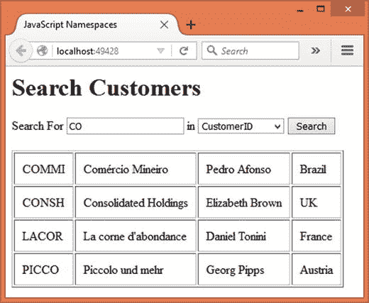
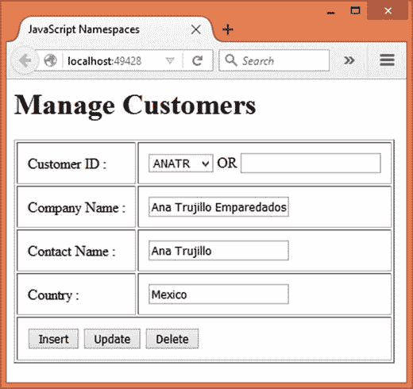
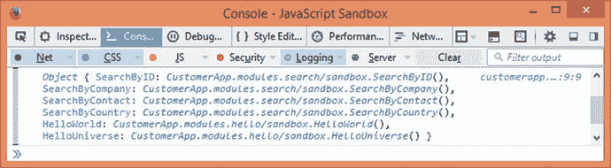
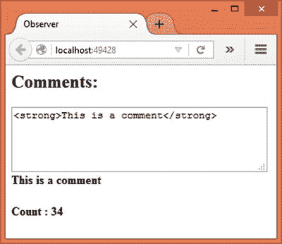
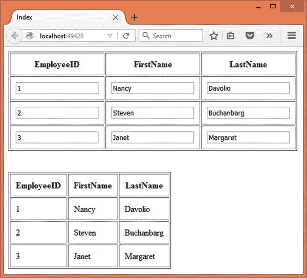

# 十一、JavaScript 代码组织技术和模式

到目前为止，您已经学习了四人组模式和从企业应用架构模式中选择模式。您将模式知识应用于服务器端 C# 代码。然而，模式并不局限于服务器端代码。它们也适用于客户端 JavaScript 代码。现代 ASP.NET 应用严重依赖客户端脚本。如今，像 Ajax 这样的特性并不少见。因此，对于 ASP.NET 开发者来说，理解模式如何应用于 JavaScript 代码是很重要的。

为此，本章将向您介绍一些 JavaScript 代码组织模式。这些模式将帮助您构建和组织您的 JavaScript 代码，使其更易于维护。本章还将说明如何在 JavaScript 中使用一些 GoF 模式。

具体而言，本章将涵盖以下主题:

*   什么是 JavaScript 代码组织模式
*   如何在对象文本和函数对象中组织代码
*   如何在 JavaScript 中创建和使用名称空间
*   模块、启示模块和沙盒模式
*   如何用 JavaScript 实现一些 GoF 模式

虽然这一章将涵盖广泛的主题，但绝不意味着对这些领域进行广泛的覆盖。这个想法是为了让您了解 JavaScript 世界中使用的各种模式，以便您可以进一步探索。

Note

本章假设你熟悉 JavaScript 编程的基础知识。它还假设您了解一些流行的 JavaScript 库和框架，比如 jQuery 和 AngularJS。

## 使用对象组织 JavaScript 代码

作为一名使用 C# 的 ASP.NET 开发人员，您已经熟悉了面向对象编程。封装、名称空间、类、对象、继承、接口和多态等概念在服务器端代码中非常常见。作为一名 C# 开发人员，你可能希望 JavaScript 作为语言的一部分支持所有这些特性。如果是这样，您可能会对 JavaScript 如何处理这些特性和一般的面向对象编程感到惊讶。

这本书并不打算让你对面向对象的 JavaScript 有一个很好的理解。它旨在让您熟悉专业 JavaScript 开发人员常用的各种特性和概念。本节和后面的小节仅限于说明如何在 JavaScript 对象中组织代码。

在 C# 中，编程的基本单位是类。创建一个或多个类，然后根据需要创建这些类的对象。谈到 JavaScript，许多初学者只用函数来组织他们的代码。然而，有更好的方法`—` JavaScript 对象。

JavaScript 没有任何创建类的正式方法。没有像`class`这样专门定义类的关键字。相反，您定义了一个对象。该对象包含属性和方法。在 JavaScript 中有两种创建对象的方法:

*   对象文字
*   功能对象

以下部分将讨论每种类型的对象创建，包括示例。

Note

ECMAScript 6 (ES6)引入了对 JavaScript 语言的许多改进，包括创建类的方法。然而，在撰写本文时，大多数主流浏览器都不完全支持 ES6。需要使用 transpiler 将 ES6 代码转换成当前版本的浏览器能够理解的 JavaScript。

### 对象文字

JavaScript 对象文字就像一个字典，因为它包含键值对。键表示属性或方法名，其值表示属性值或方法体。您可以在定义对象时向其添加键-值对，也可以先创建一个空对象，然后向其添加键-值对。考虑以下 JavaScript 代码:

```cs
var employee = {
    "employeeID": 1,
    "firstName": "Nancy",
    "lastName": "Davolio",
    "display": function () {
        alert("#" + this.employeeID +
              " - " + this.firstName +
              " " + this.lastName);
    }
};

```

前面的代码创建一个对象文本，并将其存储在 employee 变量中。请注意关于对象文字语法的以下事项:

*   该对象以{开始，以}结束
*   它由四个键值对组成。每一对用逗号(，)隔开。键及其值由冒号(:)分隔。
*   `employeeID`、`firstName`和`lastName`键就像一个类的属性或字段。display key 是一种使用警报简单显示其他键的值的方法。
*   在显示方法体中，“this”指向正在创建的对象。

您可以使用另一种(更像 C#)语法创建 employee 对象，如下所示:

```cs
var employee = {};
employee.employeeID = 1;
employee.firstName = "Nancy";
employee.lastName = "Davolio";
employee.display = function () {
    alert("#" + this.employeeID +
          " - " + this.firstName +
          " " + this.lastName);
};

```

上述代码使用{}语法创建一个空对象。然后，它使用对象属性语法添加`employeeID`、`firstName`和`lastName`键值对。最后，还添加了一个显示键，指向一个匿名函数。

创建后，您可以使用熟悉的语法更改对象文字的现有成员的值:

```cs
employee.firstName = "Janet";

```

您也可以使用熟悉的语法调用`display()`方法:

```cs
employee.display();

```

您甚至可以在以后的某个时间点向对象添加更多成员。

Note

本章中展示的大多数代码片段都可以在任何 HTML 页面中进行测试。您还可以像以前一样创建和配置一个 ASP.NET 应用，并在 MVC 视图中测试这些代码片段。

### 功能对象

在上一节中，您使用 object literal 语法创建了一个对象。很多时候，当您需要创建多个对象时，它们都是基于模板的。在 C# 中，你可以使用关键字`new`来实现。如果您希望在 JavaScript 中完成类似的事情，您需要定义一个`Function`对象。

每个 JavaScript 函数都是具有属性和方法的对象。您可以创建一个包含对象所需的属性和方法的函数。然后，您可以使用`new`关键字创建一个对象。这可以通过一个例子得到最好的理解:

```cs
var employee = function () {
    this.employeeID = 0;
    this.firstName = "";
    this.lastName = "";
    this.display = function () {
        alert("#" + this.employeeID +
              " - " + this.firstName +
              " " + this.lastName);
    }
}

```

前面的代码创建了一个匿名函数，并将其存储在`employee`变量中。在里面，`employee`函数声明了三个属性，即`employeeID`、`firstName`和`lastName`。它还定义了`display()`方法，该方法使用警告显示这些属性的值。

要基于刚刚创建的模板创建一个对象，使用关键字`new`，如下所示:

```cs
var emp = new employee();
emp.employeeID = 1;
emp.firstName = "Nancy";
emp.lastName = "Davolio";
emp.display();

```

前面的代码创建了一个新的`employee`对象，并将其存储在一个`emp`变量中。注意，`employee`函数(来自前面的代码片段)在使用`new`关键字实例化一个对象时就像一个构造函数。对象创建后，`employeeID`为 0，`firstName`和`lastName`属性为空字符串。如果需要，您也可以设计`employee`函数来接受参数。如果是这样，它应该是一个参数化的构造函数。

然后，代码设置`employee`对象的`employeeID`、`firstName`和`lastName`属性。最后，它调用`display()`方法来显示这些值。

#### 功能原型

在前一节中创建的`employee`对象按预期工作。但是有几个问题你应该知道:

*   `employee`对象的所有属性都是公共的。
*   所有的属性和方法都包含在`employee`对象中。

因为`employee`对象的所有属性都是公共的，所以不可能对属性值进行任何检查或验证。这是因为调用代码直接设置属性值。没有 getter 和 setter 方法来访问实际值。

其次，每个新的`employee`对象都将有一个模板的精确副本。这对于属性来说很好，因为不同的实例通常维护它们自己的属性值。但是这种行为不适合方法。因为每个对象也有自己的方法，所以存在重复(和浪费)。

补救方法是使用函数原型创建方法(getter 或 setter 以及 display 等方法)。

Note

本节并不打算让您彻底理解 JavaScript 原型。本节将只讨论关于这个主题的最少量的信息，这些信息足以继续后面章节中讨论的模式相关内容。

前面提到过，每个 JavaScript 函数实际上都是一个对象，并有一些预构建的属性和方法。这些属性之一是`prototype`属性。属性`—`通常被称为函数原型`—`，它允许你在函数中添加属性和方法。让我们通过将`display()`方法添加到`employee`对象的原型而不是 employee 对象来回顾一下(清单 [11-1](#Par81) )。

```cs
var employee = function (id,firstname,lastname) {
    this._employeeID = 0;
    this._firstName = "";
    this._lastName = "";
    if (arguments.length == 3) {
        this._employeeID = id;
        this._firstName = firstname;
        this._lastName = lastname;
    }
}
employee.prototype.display = function () {
    alert("#" + this._employeeID +
          " - " + this._firstName +
          " " + this._lastName);
}

Listing 11-1.Adding Display() to the Prototype

```

代码创建了`employee`函数。然而，这次该函数接受三个构造函数参数:`id`、`firstname`和`lastname`。在里面，代码声明了三个私有变量，即`_employeeID`、`_firstName`和`_lastName`。请注意 JavaScript 惯例，即在成员前加一个下划线(_)使其私有。这样，外部世界就无法直接访问这些成员。

构造函数将一些默认值赋给这些私有成员。然后，它检查参数是否传递给了构造函数。这是使用`arguments.length`属性完成的。如果是，则参数值被分配给私有成员。`employee`功能到此结束。

代码的后半部分使用了`employee`函数的`prototype`对象来添加`display()`方法。`display()`方法可以访问私有成员，因为它是`employee`原型的一部分。

您现在可以创建一个或多个`employee`对象，如下所示:

```cs
var emp = new employee(1,"Nancy","Davolio");
emp.display();

```

如您所见，代码的第一行通过传递三个构造函数参数创建了一个新的`employee`对象。然后对其调用`display()`方法来显示私有成员值。

这样，您可以向`prototype`对象添加任意多的方法。现在，这些方法不会与每个`employee`对象重复，因为它们是原型的一部分。清单 [11-2](#Par104) 展示了如何将 getter 和 setter 方法添加到原型中以访问各自的私有成员。

```cs
employee.prototype.getEmployeeID = function () {
    return this._employeeID;
}
employee.prototype.setEmployeeID = function (id) {
    this._employeeID = id;
}
employee.prototype.getFirstName = function () {
    return this._firstName;
}
employee.prototype.setFirstName = function (firstname) {
    this._firstName = firstname;
}
employee.prototype.getLastName = function () {
    return this._lastName;
}
employee.prototype.setLastName = function (lastname) {
    this._lastName = lastname;
}
employee.prototype.display = function () {
    alert("#" + this._employeeID +
          " - " + this._firstName +
          " " + this._lastName);
}

Listing 11-2.
Getter and Setter Methods

Added to the Prototype

```

一旦 getter 和 setter 方法就位，就可以通过它们访问私有成员，如下所示:

```cs
var emp = new employee();
emp.setEmployeeID(1);
emp.setFirstName("Nancy");
emp.setLastName("Davolio");
emp.display();

```

这一次，代码没有提供任何构造函数参数。使用相应的 setter 方法分别设置`employeeID`、`firstName`和`lastName`成员。同样，您也可以使用 getter 方法来检索私有成员的值。

### 立即调用函数表达式(IIFE)

通常你先创建一个函数，然后在代码中的某个地方调用这个函数。例如，考虑以下代码:

```cs
var HelloWorld = function () {
    alert("Hello World!");
}
HelloWorld();

```

这里，在调用下一行之前，首先创建函数`HelloWorld()`。

立即调用的函数表达式(IIFE)是一个 JavaScript 函数，在创建后立即执行。考虑以下代码:

```cs
(function () {
    alert("Hello World!");
})();

```

如您所见，前面的代码创建了一个匿名函数。整个函数用括号括起来，后面紧跟着`()`。这样，函数的创建和执行就结合在一起了。life 可以像其他 JavaScript 函数一样接受参数。在您希望立即执行一段代码而不正式创建函数的情况下，IIFE 非常有用。

Note

立即调用函数表达式(IIFE)这个术语是由 Ben Alman 引入的，它准确地捕捉了这种技术的本质。你可以访问 [`https://en.wikipedia.org/wiki/Immediately-invoked_function_expression`](https://en.wikipedia.org/wiki/Immediately-invoked_function_expression) 了解更多关于生活的细节。

假设您正在开发一个 Ajax 驱动的 web 应用。您希望在应用的启动页面上显示一些广告或图形公告。这样做的 JavaScript 代码只使用一次，因此不需要创建命名函数。此外，最好不要用只需要一次的变量和函数来污染全局名称空间。在这种情况下，一条生命就能做到。清单 [11-3](#Par147) 展示了说明这一点的示例代码:

```cs
(function (elemID) {
    $.ajax({
        url: "/home/GetAdvert",
        success: function (advertData) {
            var markup = "<strong>" + advertData.Title + "</strong>";
            markup += "<div>" + advertData.Description + "</div>";
            markup += "<a href='" + advertData.Url + "'>" +
                       advertData.Url + "</a>";
            $("#" + elemID).html(markup);
        },
        dataType: "json"
    });
})("advert");

Listing 11-3.IIFE for Displaying Advertisements

```

代码由一个即时函数组成，该函数从`Home`控制器对`GetAdvert()`动作方法进行 Ajax 调用。immediate 函数接收包含广告的 HTML 元素的 ID。`success`函数接收一个 JavaScript 对象，该对象的属性有`Title`、`Description`和`Url`。然后基于这些细节形成 HTML 标记，并将其添加到元素中。

这里我们不会深入 jQuery Ajax 的细节。重要的是理解即时函数如何很好地适合这里。注意，在调用该函数时，元素 ID`advert`被传递给它。该代码中使用的`GetAdvert()`动作如清单 [11-4](#Par162) 所示。

```cs
public IActionResult GetAdvert()
{
    return Json(new
    {
        Title = "Buy ONE Get one FREE!",
        Description = "Buy one large size Pizza and get one small size Pizza absolutely FREE!!!",
        Url = "http://localhost"
    });
}

Listing 11-4.GetAdvert() returns JSON data

```

`GetAdvert()`动作只是返回一个由`Title`、`Description`和`Url`属性组成的对象。当然，如果你愿意的话，你可以把它做成数据库驱动的。

如果您曾经开发过 jQuery 插件，您可能会觉得这个概念很熟悉。将插件代码包装在生命中是一种常见的做法。尽管对 jQuery 插件的讨论超出了本书的范围，清单 [11-5](#Par173) 中显示了一个名为`decorate`的示例插件的框架。

```cs
(function ($) {
    $.fn.decorate = function (settings) {
        //plugin code here
    }
})(jQuery);

Listing 11-5.jQuery Plugin and IIFE

```

正如您所看到的，插件模板由一个接受 jQuery 参数的即时函数组成。jQuery 库使用`$`作为 jQuery 对象的别名。如果应用中正在使用的其他 JavaScript 库也将`$`用于自己的用途，该怎么办？如果是这样，有可能`$`不再指向 jQuery 对象。显然，插件代码不会像预期的那样工作，因为它依赖于`$`。即时函数可以避免这个问题。通过将插件代码包装在一个即时函数中，并向其传递一个 jQeury 对象，`$`的含义保留在插件代码中。

Note

到目前为止讨论的 JavaScript 特性——对象文字、函数对象、原型和生命——在组织代码时非常有用。此外，这些特性还可以与下面几节中讨论的模式一起使用。

## 名称空间模式

作为一名 C# 开发人员，您已经熟悉了名称空间的概念。命名空间允许您避免类名之间的歧义。JavaScript 也有类似的需求，尤其是当 JavaScript 代码包含大量函数和对象时。

当您在`<script>`块中创建 JavaScript 函数或变量时，它属于一个全局名称空间。假设您正在构建一个大量使用 JavaScript 的 web 应用。假设有两个 JavaScript 文件，每个文件包含一组函数。这两个文件之间很可能存在名称冲突。例如，假设两个文件都包含一个`HelloWorld()`函数。

在全局名称空间中放置太多的函数、对象和变量并不是一个好主意。最好将一个库所需的函数、对象和变量放在它自己的名称空间中。不幸的是，JavaScript 没有任何用于创建名称空间的内置语言结构。这就是名称空间模式的用处。名称空间模式可以帮助您设计一种避免命名冲突的方案，并以更好的方式组织相关的函数、对象和变量。

Note

在复杂的 JavaScript 驱动的应用中，您可能需要检查名称空间是否已经由代码的其他部分定义。为了简单起见，我们不会在代码中实现这样的检查。你可以阅读 Stoyan Stefanov 的书《JavaScript Patterns 》,了解更多关于名称空间模式和其他相关概念的细节。

为了理解如何使用名称空间模式，您将创建如图 [11-1](#Fig1) 所示的应用。



图 11-1。

Application using JavaScript namespaces

该应用允许您搜索`Northwind`数据库的`Customers`表。您可以在文本框中输入搜索条件，选择搜索字段(可能的搜索字段有`CustomerID`、`CompanyName`、`ContactName`和`Country`)，然后单击搜索按钮。然后使用 jQuery Ajax 对 action 方法进行 Ajax 调用。该操作执行搜索并将结果返回给浏览器。结果显示在 HTML 表格中。

要开发这个应用，首先使用 Visual Studio 创建一个新的 ASP.NET web 应用项目，并将其配置为使用 MVC 和实体框架(参见第 [1](01.html) 章了解更多细节)。还将`Northwind`数据库的数据库连接字符串存储在`appsettings.json`文件中。

然后将`AppSettings`类添加到`Core`文件夹中，并将`ConnectionString`静态属性添加到其中。打开`Startup`类，编写代码将`ConnectionString`属性设置为存储在`appsettings.json`文件中的属性。还要创建数据访问所需的`Customer`模型类和`AppDbContext`类。您已经熟悉这些步骤，因此这里不讨论它们。

接下来，将`HomeController`添加到`Controllers`文件夹中。除了默认的`Index()`动作之外，您需要创建四个动作来基于`CustomerID`、`CompanyName`、`ContactName`和`Country`列进行搜索。基于`CustomerID`列搜索`Customers`表的`SearchByID()`动作如清单 [11-6](#Par189) 所示。

```cs
public IActionResult SearchByID(string id)
{
    using (AppDbContext db = new AppDbContext())
    {
        var query = from c in db.Customers
                    where c.CustomerID.Contains(id)
                    orderby c.CustomerID ascending
                    select c;
        return Json(query.ToList());
    }
}

Listing 11-6.SearchByID() Action Searches for CustomerID

```

这个动作非常简单。它只是在`Customers DbSet`中查询所有包含搜索条件的`CustomerIDs`(`id`参数)。注意使用了`Contains()`方法来完成这个任务。

搜索结果以 JSON 格式返回给调用者。这是使用`Controller`基类的`Json()`方法完成的。

通过在查询中使用适当的列，以类似的方式创建剩余的三个动作`—SearchByCompany()`、`SearchByContact()`和`SearchByCountry()—`。为了节省空间，这里将不讨论这些操作。

现在在`wwwroot`文件夹中创建一个`Scripts`子文件夹，并将`jQuery`库放入其中。还要将一个空的 JavaScript 文件`—CustomerApp.Search.js—`添加到`Scripts`文件夹中。您可以使用“添加新项目”对话框添加该文件。这个文件将包含与正在创建的名称空间相关的所有 JavaScript 代码。

Note

您可以从 CDN 引用`jQuery`库，而不是引用本地副本。此外，您可以使用集成到 Visual Studio IDE 中的 Bower 包管理器来处理客户端脚本库。为了简单起见，我们不会在示例中使用这些特性。

在 Visual Studio 编辑器中打开`CustomerApp.Search.js`文件，编写名称空间的框架，如清单 [11-7](#Par206) 所示。

```cs
var CustomerApp = {};
CustomerApp.Search = {};
CustomerApp.Search.SearchByID = function (id, target) {
  // code here
}
CustomerApp.Search.SearchByCompany = function (companyname,target) {
  // code here
}
CustomerApp.Search.SearchByContact = function (contactname,target) {
  // code here
}
CustomerApp.Search.SearchByCountry = function (country,target) {
  // code here
}

Listing 11-7.Skeleton of the CustomerApp.Search Namespace

```

仔细观察骨架代码。代码从创建`CustomerApp`空对象开始。该对象充当搜索库的顶层名称空间(或容器)。此外，代码将空对象`Search`添加到对象`CustomerApp`中。因此，`Search`成为了`CustomerApp`的嵌套名称空间。

然后，代码继续向`Search`名称空间添加四个搜索函数`—SearchByID`、`SearchByCompany`、`SearchByContact`和`SearchByCountry—`。这些函数中的每一个都接受两个参数`—`搜索条件和目标元素的 ID，搜索结果将被加载到这个元素中。

这些搜索函数不是全局名称空间的一部分。相反，它们是`CustomerApp.Search`名称空间的一部分。同样，您也可以在`CustomerApp`对象中创建其他名称空间(比如说，`CustomerApp.Utils`)。

现在是时候给这些方法添加一些代码了。清单 [11-8](#Par224) 显示了完整的`SearchByID()`功能。

```cs
CustomerApp.Search.SearchByID = function (id, target) {
    $.ajax({
        url: "/home/SearchByID",
        data: { "id": id },
        success: function (results) {
            var table = "<table border='1' cellpadding='10'>";
            for (var i = 0; i < results.length; i++) {
                table += "<tr>";
                table += "<td>" + results[i].CustomerID + "</td>";
                table += "<td>" + results[i].CompanyName + "</td>";
                table += "<td>" + results[i].ContactName + "</td>";
                table += "<td>" + results[i].Country + "</td>";
                table += "</tr>";
            }
            $("#" + target).html(table);
        },
        dataType: "json"
    });
}

Listing 11-8.SearchByID() Makes Ajax Call

```

`SearchByID()`函数接收两个参数`—CustomerID`来查找和定位包含搜索结果的 HTML 元素。在内部，代码对`HomeController`的`SearchByID()`动作方法进行 Ajax 调用。这是使用 jQuery 的`$.ajax()`方法完成的。

`$.` `ajax()`方法接受一个对象，该对象包含发出 Ajax 请求时要使用的设置。这些设置如下:

*   `url`:`url`属性指向要调用的服务器端资源。在这种情况下，`/home/SearchByID`。
*   `data`:该属性保存伴随 Ajax 请求的数据。`SearchByID()`动作方法需要搜索标准作为一个`id`参数。因此，创建了一个带有`id`属性的 JavaScript 对象。
*   `success`:`success`属性指向一个回调函数，一旦 Ajax 调用成功完成，这个函数就会被调用。`success`函数以数组的形式接收搜索结果(回想一下，`SearchByID()`动作返回一个`Customer`对象的`List`)。`success`函数遍历这个数组并形成一个显示`CustomerID`、`CompanyName`、`ContactName`和`Country`属性的 HTML 表。使用`html()` jQuery 方法将 HTML 表加载到目标元素中。
*   `dataType`:`dataType`属性表示服务器返回的数据类型；JSON 在这种情况下。

按照同样的思路，创建剩余的搜索函数:`SearchByCompany()`、`SearchByContact()`和`SearchByCountry()`。这些功能与刚才讨论的功能非常相似，因此这里不再讨论。您可以从本书的源代码中获得它们。

这就完成了搜索库。现在将`Index`视图添加到`Views/Home`文件夹中。在`Index`视图的 head 部分添加一个对 jQuery 和`CustomerApp.Search.js`的`<script>`引用，如下所示:

```cs
<script src="∼/scripts/jquery-2.1.1.js"></script>
<script src="∼/Scripts/CustomerApp.Search.js"></script>

```

然后在视图的`<body>`部分添加清单 [11-9](#Par254) 所示的 HTML 标记。

```cs
<h1>Search Customers</h1>
<div>
    Search For
    <input id="criteria" type="text" />
    in
    <select id="searchfield">
        <option>CustomerID</option>
        <option>CompanyName</option>
        <option>ContactName</option>
        <option>Country</option>
    </select>
    <input type="button" value="Search" id="search" />
</div>
<br />
<div id="results"></div>

Listing 11-9.Markup of the Index View

```

HTML 标记由文本框(`criteria`)、下拉列表(`searchfield`)和搜索按钮(`search`)组成。`searchfield`下拉列表包含四个选项元素:`CustomerID`、`CompanyName`、`ContactName`和`Country`。results `div`元素用于显示搜索结果。

接下来，在 head 部分添加一个新的`<script>`块，并在其中编写清单 [11-10](#Par271) 所示的代码。

```cs
$(document).ready(function () {
    $("#search").click(function () {
        var criteria = $("#criteria").val();
        var searchField = $("#searchfield").val();
        switch (searchField) {
            case "CustomerID":
                CustomerApp.Search.SearchByID(criteria,'results');
                break;
            case "CompanyName":
                CustomerApp.Search.SearchByCompany(criteria, 'results');
                break;
            case "ContactName":
                CustomerApp.Search.SearchByContact(criteria, 'results');
                break;
            case "Country":
                CustomerApp.Search.SearchByCountry(criteria, 'results');
                break;
        }
    });
});

Listing 11-10.Using the Search Library

```

该代码通过使用 jQuery 的`click()`方法来处理搜索按钮的 click 事件。提供给`click()`方法的函数获取文本框中输入的搜索标准，并将其存储在`criteria`局部变量中。代码还将选择的 searchfield 值存储在`searchfield`变量中。

一条`switch`语句检查`searchfield`变量的值，并从搜索库中调用适当的搜索方法。请注意搜索函数是如何使用类似名称空间的语法调用的:

```cs
CustomerApp.Search.SearchByID(criteria,'results');

```

还要注意的是，`results`被作为目标参数传递，因为搜索结果将显示在 results `<div>`元素中。

这就完成了应用。运行应用，输入搜索条件，并测试所有搜索方法的功能。

## 模块模式

如果您的 ASP.NET 应用大量使用 JavaScript 来运行，那么您需要维护的 JavaScript 数量可能会非常大。此外，随着应用的增长，甚至 JavaScript 代码也可能增加以应对增加的功能。

当谈到组织 JavaScript 代码时，使用名称空间模式组织 JavaScript 代码是一个很好的起点。但是，如果您的 JavaScript 代码库非常大，并且为了易于维护和扩展，您希望将它模块化，那么您可以考虑使用模块模式。

顾名思义，模块模式允许您创建 JavaScript 代码的自包含模块。模块模式帮助您开发解耦的模块，并且可以在需要时添加。模块模式使用了您在本章前面学到的许多概念，例如对象文字、生命和名称空间。

为了让您了解如何使用模块模式开发典型的模块，请参见清单 [11-11](#Par300) 。

```cs
var JsApp = {};
JsApp.Module1 = (function () {
    return {
        HelloWorld: function () {
            alert("Hello World!");
        }
    };
})();

Listing 11-11.A Sample Module Using the Module Pattern

```

代码创建了一个空的`JsApp`对象。然后使用一个立即函数和一个对象文字创建一个模块`—Module1—`。

立即函数可以包含内部处理所需的局部变量和私有函数。他们不会接触到外部世界。在这种情况下，immediate 函数不包含任何这样的私有成员。

模块的公共 API 是使用对象文本公开的。在这种情况下，一个具有单一方法`HelloWorld()`的对象被形成并从 immediate 函数返回。

实际上，`Module1`用`HelloWorld()`方法指向一个对象。要从`Module1`调用`HelloWorld()`方法，您应该编写:

```cs
JsApp.Module1.HelloWorld();

```

您可以为`JsApp`创建任意数量的模块。

现在您已经知道了模块模式的基础，让我们开发一个更现实的例子来演示它是如何工作的。在这个例子中，你将开发一个应用，如图 [11-2](#Fig2) 所示。



图 11-2。

Customer manager application

该应用允许您从数据库`Northwind`的`Customers`表中添加、修改和删除客户。您可以从下拉列表中选择一个`CustomerID`，其对应的`CompanyName`、`ContactName`和`Country`值会显示在相应的文本框中。然后，您可以修改详细信息，并单击“更新”按钮保存更改。要添加新客户，您需要指定一个新的`CustomerID`和所有其他详细信息，然后单击插入按钮。选择一个`CustomerID`并点击删除按钮删除一个客户。

更重要的是，刚才解释的操作是通过 jQuery Ajax 调用 Web API 来执行的。执行这些 CRUD 操作所涉及的 jQuery 代码是使用模块模式组织的。

要开发这个应用，首先使用 Visual Studio 创建一个新的 ASP.NET Web 应用项目，并将其配置为使用 MVC、Web API 和实体框架(更多细节参见第 [1](01.html) 章)。还将`Northwind`数据库的数据库连接字符串存储在`appsettings.json`文件中。

然后将`AppSettings`类添加到`Core`文件夹中，并将`ConnectionString`静态属性添加到其中。打开`Startup`类，编写代码将`ConnectionString`属性设置为存储在`appsettings.json`文件中的属性。还要创建数据访问所需的`Customer`模型类和`AppDbContext`类。您已经熟悉了这些步骤，因此这里不再讨论。

接下来，将名为`CustomerService`的 Web API 控制器添加到`Controllers`文件夹中。`CustomerService` Web API 包装了所有实体框架代码来执行 CRUD 操作，如清单 [11-12](#Par320) 所示。

```cs
[Route("api/[controller]")]
public class CustomerService : Controller
{
    [HttpGet]
    public List<Customer> Get()
    {
        using (AppDbContext db = new AppDbContext())
        {
            return db.Customers.ToList();
        }
    }
    [HttpGet("{id}")]
    public Customer Get(string id)
    {
        using (AppDbContext db = new AppDbContext())
        {
            return db.Customers.Where(i => i.CustomerID == id).SingleOrDefault();
        }
    }
    [HttpPost]
    public void Post([FromBody]Customer obj)
    {
        using (AppDbContext db = new AppDbContext())
        {
            db.Entry(obj).State = EntityState.Added;
            db.SaveChanges();
        }
    }
    [HttpPut("{id}")]
    public void Put(string id, [FromBody]Customer obj)
    {
        using (AppDbContext db = new AppDbContext())
        {
            db.Entry(obj).State = EntityState.Modified;
            db.SaveChanges();
        }
    }
    [HttpDelete("{id}")]
    public void Delete(string id)
    {
        using (AppDbContext db = new AppDbContext())
        {
            Customer obj = db.Customers.Where(i => i.CustomerID == id).SingleOrDefault();
            db.Entry(obj).State = EntityState.Deleted;
            db.SaveChanges();
        }
    }
}

Listing 11-12.CustomerService Web API Performs CRUD Operations

```

`CustomerService`控制器由五个动作组成，分别是`Get()`、`Get(id)`、`Post()`、`Put()`和`Delete()`。我们不会在这里深入讨论这些操作的细节，因为您在前面的章节中创建了一个类似的 Web API。这里只需说`Get()`返回一个`Customer`实体列表，而`Get(id)`接受一个`CustomerID`并返回一个与该值匹配的`Customer`实体。`Post()`、`Put()`和`Delete()`动作分别从数据库中添加、修改和删除一个`Customer`。

这就完成了`CustomerService`控制器。现在是时候创建通过 jQuery Ajax 调用这个 Web API 的`CustomerManager`模块了。在`wwwroot`文件夹中添加一个`Scripts`文件夹，并将`jQuery`库放入其中。还要在`Scripts`文件夹中添加一个新的 JavaScript 文件`—CustomerApp.CustomerManager.js—`。清单 [11-13](#Par370) 展示了您即将开发的`CustomerManager`模块的框架。

```cs
var CustomerApp = {};
CustomerApp.CustomerManager = (function () {
    return {
        SelectAll: function (callback) {
          // code here
        },
        SelectByID: function (id, callback) {
          // code here
        },
        Insert: function (obj, callback) {
          // code here
        },
        Update: function (obj, callback) {
          // code here
        },
        Delete: function (id, callback) {
          // code here
        }
    };
}());

Listing 11-13.Skeleton of the CustomerManager Module

```

如您所见，`CustomerManager`模块正被添加到`CustomerApp`中。immediate 函数用五种方法返回一个对象:

*   `SelectAll`:从数据库中取出所有客户
*   `SelectByID`:取符合特定`CustomerID`的客户
*   `Insert`:向数据库添加新客户
*   `Update`:修改数据库中已有的客户
*   `Delete`:从数据库中删除现有客户

注意，所有这些方法都接受一个`callback`参数。`callback`参数是一个`callback`函数，在 Ajax 调用成功时被调用。`SelectByID()`和`Delete()`方法接受一个`CustomerID`作为`id`参数。`Insert()`和`Update()`方法分别接受要添加或修改的`Customer`对象。

这些方法形成了`CustomerManager`模块的公共 API。它们用于调用各自的 Web API 方法。清单 [11-14](#Par398) 显示了进入`SelectAll()`方法内部的代码。

```cs
CustomerApp.CustomerManager = (function () {
    return {
        SelectAll: function (callback) {
            $.ajax({
                url: "/api/customerservice",
                type: "GET",
                dataType: "json",
                success: function (data) {
                    callback(data);
                }
            });
        },
        ...
        ...
}());

Listing 11-14.SelectAll() Calls the Get() Action of CustomerService

```

`SelectAll()`方法接受一个`callback`函数作为它的参数。在内部，代码向`CustomerService` Web API 发出一个`GET`请求。这是使用`jQuery`的`$.ajax()`方法完成的。因为 Ajax 请求是使用`GET`动词发出的，所以它被映射为`CustomerService`的`Get()`动作。

`success`函数接收由`CustomerService`返回的数据(在本例中是一列`Customer`对象)。然后通过向函数传递这些数据来调用`callback`函数。其他 Ajax 调用看起来类似，只是有一些变化。例如，调用`Put()`动作的 Ajax 调用如下所示:

```cs
$.ajax({
    url: "/api/customerservice/" + obj.CustomerID,
    type: "PUT",
    data: JSON.stringify(obj),
    contentType: "application/json",
    dataType: "json",
    success: function (msg) {
        callback(msg);
    }
});

```

如您所见，`CustomerID`被附加到`url`上，`type`属性被设置为`PUT`。此外，`data`属性持有一个包含修改细节的`Customer`对象。

其余的 Ajax 调用和方法在这里将不讨论，因为它们与刚才讨论的调用非常相似。您可以从本书的代码下载中获得这些方法的完整代码。

这就完成了`CustomerManager`模块。现在是时候在视图中使用它了。将`HomeController`添加到`Controllers`文件夹，并将`Index`视图添加到`Views/Home`文件夹。

将`<script>`引用添加到`jQuery`库以及`Index`视图头部的`CustomerApp.CustomerManager.js`文件中:

```cs
<script src="∼/scripts/jquery-2.1.1.js"></script>
<script src="∼/Scripts/CustomerApp.CustomerManager.js"></script>

```

接下来，将清单 [11-15](#Par432) 中所示的 HTML 标记添加到`Index`视图的主体部分。

```cs
<h1>Manage Customers</h1>
<table border="1" cellpadding="11">
    <tr>
        <td>Customer ID :</td>
        <td>
            <select id="customerid"></select>
            OR
            <input id="newcustomerid" type="text" />
        </td>
    </tr>
    <tr>
        <td>Company Name :</td>
        <td><input id="companyname" type="text" /></td>
    </tr>
    <tr>
        <td>Contact Name :</td>
        <td><input id="contactname" type="text" /></td>
    </tr>
    <tr>
        <td>Country :</td>
        <td><input id="country" type="text" /></td>
    </tr>
    <tr>
        <td colspan="2">
            <input id="insert" type="button" value="Insert" />
            <input id="update" type="button" value="Update" />
            <input id="delete" type="button" value="Delete" />
        </td>
    </tr>
</table>

Listing 11-15.Markup of the Index View

```

标记非常简单。它由一个包含四个文本框的表格、一个下拉列表和三个按钮组成。四个文本框`—newcustomerid`、`companyname`、`contactname`和`country—`分别用于接受`CustomerID`、`CompanyName`、`ContactName`和`Country`值。

`customerid`下拉列表显示现有客户 id 的列表。三个按钮`—`插入、更新、删除`—`用于触发相应的操作。

现在在 head 部分添加一个新的`<script>`块，就在前面添加的脚本引用的下面，并将清单 [11-16](#Par465) 中所示的代码写入其中。

```cs
$(document).ready(function () {
    CustomerApp.CustomerManager.SelectAll(function (data) {
        for (var i = 0; i < data.length; i++) {
            $("#customerid").append("<option>" + data[i].CustomerID + "</option>");
        }
    });
});

Listing 11-16.Calling the CustomerModule’s Public API

```

一旦视图加载到浏览器中，这段代码就调用`CustomerManager`模块的`SelectAll()`方法。传递给`SelectAll()`方法的回调遍历客户列表(`data`)，并将`CustomerIDs`添加到`customerid`下拉列表中。这是使用`jQuery`的`append()`方法完成的。

从下拉列表中选择一个`CustomerID`后，其详细信息需要显示在其他文本框中。这是通过处理下拉列表(清单 [11-17](#Par474) )的变更事件处理程序来完成的。

```cs
$("#customerid").change(function () {
    CustomerApp.CustomerManager.SelectByID($("#customerid").val(), function (data) {
        $("#companyname").val(data.CompanyName);
        $("#contactname").val(data.ContactName);
        $("#country").val(data.Country);
    });
});

Listing 11-17.Fetching and Displaying Customer Details

```

该代码使用`CustomerManager`的`SelectByID()`方法来获取单个客户的详细信息。在下拉列表中选择的`CustomerID`和一个`callback`函数被作为参数传递给`SelectByID()`方法。`callback`函数用`CompanyName`、`ContactName`和`Country`属性填充文本框。

要添加一个新客户，您需要处理 Insert 按钮的 click 事件，如清单 [11-18](#Par483) 所示。

```cs
$("#insert").click(function () {
    var obj = {};
    obj.CustomerID = $("#newcustomerid").val();
    obj.CompanyName = $("#companyname").val();
    obj.ContactName = $("#contactname").val();
    obj.Country = $("#country").val();
    CustomerApp.CustomerManager.Insert(obj, function (msg) {
        alert(msg);
    });
});

Listing 11-18.Adding a New Customer

```

代码创建一个空对象`—obj—`，并向其添加`CustomerID`、`CompanyName`、`ContactName`和`Country`属性。这些属性从各自的文本框中获取值。然后，代码通过向其传递`obj`和一个`callback`来调用`CustomerManager`模块的`Insert()`方法。`callback`只是在警告中显示从 Web API 返回的消息。

Update 和 Delete 按钮的 click 事件处理程序非常相似，因此这里不再讨论。您可以从本书的代码下载中获得这个脚本块的完整代码。

这就完成了应用。运行应用，检查是否可以按预期添加、修改和删除客户记录。

## 显示模块模式

模块模式将模块的所有功能直接放入一个对象文字中，然后从 immediate 函数返回它。在开发一个更大更复杂的模块时，您可能不知道要作为公共 API 公开的确切方法。例如，可能有几个私有方法、帮助函数和变量，它们由模块内部使用，但不向外部世界公开。

在这种情况下，揭示模块模式就派上了用场。使用显示模块模式，您可以在开发模块时创建函数和变量。在这个阶段，你不用返回任何东西。一旦模块的所有功能就绪，您就可以决定模块的公共接口中应该包含什么。您返回一个只包含这些方法的对象。考虑清单 [11-19](#Par498) 中所示的代码片段。

```cs
var JsApp = {};
JsApp.Module1 = (function () {
    var msg = "Hello World!";
    var SayHello = function () {
        alert(msg);
    }
    return {
        HelloWorld:SayHello
    };
})();

Listing 11-19.Using the Revealing Module Pattern

```

immediate 函数声明了一个私有变量`—msg—`，它保存了一个字符串值`—Hello World!`。`SayHello()`函数是一个私有函数，它只是在一个警告中显示`msg`的值。此时，模块的公共 API 还没有决定。

然后代码创建一个带有指向`SayHello()`函数的`HelloWorld`属性的对象文字。这个对象是从即时函数返回的。在模块完成后，您可以在这里决定模块的公共接口。在这里，您决定将`SayHello`方法公开为`HelloWorld`。

如果您希望使用显示模块模式而不是模块模式，那么在前面的例子中开发的`CustomerManager`模块应该如清单 [11-20](#Par511) 所示。

```cs
var CustomerApp = {};
CustomerApp.CustomerManager = (function () {
    var Get = function (callback) {
        //code here
    }
    var GetByID = function (id, callback) {
        //code here
    }
    var Post = function (obj, callback) {
        //code here
    }
    var Put = function (obj, callback) {
        //code here
    }
    var Delete = function (id, callback) {
        //code here
    }
    return {
        SelectAll: Get,
        SelectByID: GetByID,
        Insert: Post,
        Update: Put,
        Delete: Delete
    };
}());

Listing 11-20.CustomerManager Module Uses Revealing Module Pattern

```

可以看到，立即函数现在定义了五个私有函数，分别是`Get()`、`GetByID()`、`Post()`、`Put()`和`Delete()`。这些私有函数对适当的 Web API 动作(为了简单起见，清单中没有显示)进行 Ajax 调用，并执行相应的操作。

然后创建一个具有五个属性的对象文字，即`SelectAll`、`SelectByID`、`Insert`、`Update`和`Delete`。这五个属性分别指向`Get()`、`GetByID()`、`Post()`、`Put()`和`Delete()`私有函数。这五个属性构成了模块的公共 API。然后，该对象从立即函数返回。

## 沙盒模式

在前面几节中，您使用了名称空间模式。虽然它像预期的那样工作，但是有一个缺点是由于长的名称空间名称需要更多的输入。您可以想象这样一种情况，在您的代码中有许多地方使用了如此长的名称空间。

沙盒模式可以用来避免这个问题。沙箱是一个自包含的对象，它只包含代码在给定时间点需要的那些模块的 API。假设你的库有三个模块，分别是`Module1`、`Module2`和`Module3`。在一个给定的时间点，你想要使用由`Module1`和`Module2`公开的 API。因此，您构建了一个“沙箱”,其中包含来自这两个模块的 API。您的代码处理这个沙箱，而不是直接处理模块。因此，您的代码简化为:

```cs
sandbox.<some_method>();

```

Note

名称空间模式还有一个问题。因为它依赖于且仅依赖于库的一个全局实例，所以不能在一个页面上使用库的两个版本。当您使用沙箱模式时，您的代码会获得自己的沙箱，并且不依赖于应用的全局对象。你可以阅读 Stoyan Stefanov 的书《JavaScript Patterns 》,了解更多关于沙盒模式及其好处的细节。

为了理解沙箱模式是如何工作的，让我们修改一下您为名称空间模式开发的示例。复制同一个项目并执行随后的修改。

使用添加新项目对话框将`CustomerApp.Sandbox.js`文件添加到`Scripts`文件夹中，并在其中写入清单 [11-21](#Par544) 中所示的代码。

```cs
(function (global) {
    var CustomerApp = function (modules, callback) {
        if (!(this instanceof CustomerApp)) {
            return new CustomerApp(modules, callback);
        }
        for (var i = 0; i < modules.length; i++) {
            CustomerApp.modules[modules[i]](this);
        }
        callback(this);
    };
    CustomerApp.modules = {};
    global.CustomerApp = CustomerApp;
})(this);

Listing 11-21.Creating a Sandbox Object

```

这段代码是沙盒模式的核心。它由一个接收参数`global`的即时函数组成。由此引用的对象在调用期间被传递给`global`参数。在 JavaScript 中，当在任何函数之外使用时，它指向`global`对象(对于 web 浏览器是`window`对象)。因此，这里的 immediate 函数接收一个对全局窗口对象的引用。

在内部，`CustomerApp`对象被创建。`CustomerApp`函数接收两个参数，即`modules`和`callback`。modules 参数是一个字符串数组，包含代码所需的模块列表。`callback`参数是一个使用正在生成的沙箱的函数。

在`CustomerApp`函数中，第一个`if`语句检查它是否指向`CustomerApp`对象。如果没有，通过向其传递`modules`数组和`callback`来创建`CustomerApp`的新实例。

一个`for`循环遍历`modules`数组并生成一个包含所有被请求模块的 API 的`sandbox`对象。然后通过传递这个`sandbox`对象来调用`callback`函数。

在函数定义之后，代码将`CustomerApp`上的`modules`属性设置为一个空对象，并将`global`(窗口)对象上的`CustomerApp`属性设置为指向`CustomerApp`对象。

接下来，按照清单 [11-22](#Par563) 所示的框架定义`search`模块。

```cs
CustomerApp.modules.search = function (sandbox) {
    sandbox.SearchByID = function (id, target) {
    }
    sandbox.SearchByCompany = function (companyname, target) {
    }
    sandbox.SearchByContact = function (contactname, target) {
    }
    sandbox.SearchByCountry = function (country, target) {
    }
};

Listing 11-22.Skeleton of the Search Module

```

如您所见，`search`函数接收了一个`sandbox`对象。将`SearchByID()`、`SearchByCompany()`、`SearchByContact()`、`SearchByCountry()`等方法添加到这个`sandbox`对象中。

Note

这四个方法中的代码与名称空间模式示例中讨论的完全相同。您可以简单地复制并粘贴这些 Ajax 调用来完成该模块。为了节省空间，不再讨论该代码。

仅仅为了测试，向文件中添加另一个模块`hello`，如清单 [11-23](#Par576) 所示。

```cs
CustomerApp.modules.hello = function (sandbox) {
    sandbox.HelloWorld = function () { alert("Hello World!"); };
    sandbox.HelloUniverse = function () { alert("Hello Universe!"); };
}

Listing 11-23.
Hello Module

```

`Hello`模块非常简单，向沙箱中添加了两个方法:`HelloWorld()`和`HelloUniverse()`。

这就完成了`CustomerApp.Sandbox.js`。现在打开`Index`视图并调整`<script>`引用指向`CustomerApp.Sandbox.js`文件。然后从`Index`视图中修改`<script>`块，如清单 [11-24](#Par582) 所示。

```cs
$(document).ready(function () {
    $("#search").click(function () {
        var criteria = $("#criteria").val();
        var searchField = $("#searchfield").val();
        switch (searchField) {
            case "CustomerID":
                CustomerApp(['search', 'hello'], function (sandbox) {

                    sandbox.SearchByID(criteria, 'results');

                    sandbox.HelloWorld();

                });

                break;
            case "CompanyName":
                CustomerApp(['search'], function (sandbox) {
                    sandbox.SearchByCompany(criteria, 'results');
                });
                break;
            case "ContactName":
                CustomerApp(['search'], function (sandbox) {
                    sandbox.SearchByContact(criteria, 'results');
                });
                break;
            case "Country":
                CustomerApp(['search'], function (sandbox) {
                    sandbox.SearchByCountry(criteria, 'results');
                });
                break;
        }
    });
});

Listing 11-24.Using the Sandbox

```

请注意以粗体显示的代码。这段代码通过传递`modules`数组和一个`callback`函数来调用`CustomerApp`函数(记住`CustomerApp`是一个`global`属性)。`modules`数组包含两个元素——`search`和`hello`——它们表示您的代码想要使用的模块。

`callback`函数接收`sandbox`对象作为其参数。您在`callback`函数中的代码调用了`sandbox`对象上的`SearchByID()`和`HelloWorld()`方法。

请注意`switch`语句的另一个实例。在这里，您只指定了`modules`数组中的`search`模块。因此，这些调用接收到的`sandbox`对象不会有`hello`模块的 API。您的`callback`函数将无法在`sandbox`对象上调用`HelloWorld()`。

这就完成了应用。运行应用，并按照讨论的方式进行测试。如果你将`sandbox`对象登录到浏览器的控制台(`console.log()`)，那么 Firefox 会显示它，如图 [11-3](#Fig3) 所示。



图 11-3。

Sandbox object in Firefox

注意`sandbox`对象是如何包含六个方法的——两个来自`hello`模块，四个来自`search`模块。

## 在 JavaScript 中使用设计模式

在前面的章节中，你已经学习了所有的 GoF 设计模式。如前所述，这些模式并不局限于特定的编程语言。这些模式提出的概念和想法可以在任何面向对象的编程语言中实现，包括 JavaScript。当然，不同语言的代码级实现细节会有所不同。

在这一节和接下来的小节中，您将看到如何在 JavaScript 中使用一些 GoF 模式。具体来说，您将学习实现以下模式:

*   单例模式(创造性的)
*   立面图案(结构)
*   观察者模式(行为)

因为您已经知道了这些模式的意图，所以这里将不讨论诸如目的和 UML 图之类的细节。

### 单一模式

单例模式确保一个类只有一个实例被创建。在 JavaScript 中实现单例模式时，您需要记住以下几点:

*   在 JavaScript 中没有这样的类。都是对象。每个对象本身都是唯一的(即使其属性具有与另一个对象相同的值)。
*   对象文字实际上是单值的。在这种情况下，您不需要做任何特殊的事情来实现单例模式。
*   当使用`new`关键字创建对象时，您可能希望不管`new`被调用的频率如何，都返回相同的对象。这里你需要自己实现单例模式。

假设您想在一个对象中存储各种特定于页面的主题。还假设在代码中的几个地方访问了相同的设置，因此您决定将该对象设为单例对象。清单 [11-25](#Par627) 显示了满足这一需求的单例模式的简单实现。

```cs
var ThemeSettings = function () {
    var instance = this;
    this.colorTheme = "Office";
    this.fontTheme = "Modern";
    this.layoutTheme = "SideBySide";
    ThemeSettings = function () {
        return instance;
    }
}

Listing 11-25.Singleton in JavaScript

```

代码创建了一个函数`ThemeSettings`，它有一个私有的`instance`变量。`instance`变量指向。然后代码设置对象的三个属性，即`colorTheme`、`fontTheme`和`layoutTheme`。在更现实的情况下，可以使用 Ajax 调用从服务器获取这些设置。

代码巧妙地重写了`ThemeSettings`的构造函数。新的构造函数只是将变量`instance`返回给调用者。因此，当第一次在`ThemeSettings`上调用`new`时，原始的构造函数被调用。原始构造函数设置这三个属性并照常返回。下一次在`ThemeSettings`上调用`new`时，`new`构造函数使其生效，并简单地返回现有的实例。因此，每个对`new`的调用都返回相同的对象——单例模式的本质。

为了测试`ThemeSettings`对象的工作，编写清单 [11-26](#Par639) 中所示的代码。

```cs
var settings1 = new ThemeSettings();
var settings2 = new ThemeSettings();
alert("Is ThemeSettings instance same? " + (settings1 === settings2));
settings2.colorTheme = "Nature";
alert("settings1.colorTheme is " + settings1.colorTheme);

Listing 11-26.ThemeSettings Is a Singleton

```

代码使用`ThemeSettings`上的`new`关键字创建了两个变量——`settings1`和`settings2`。似乎两个独立的`ThemeSettings`物体正在被创造。然后，警报使用 JavaScript 的严格相等操作符(`===`)检查`settings1`和`settings2`。如果操作数相等并且属于同一类型，则严格相等运算符返回`true`。

如果您运行这段代码，您会发现警报确认了`settings1`和`settings2`确实指向同一个对象(`true`被返回)。然后，代码更改了`settings2`的`colorTheme`属性。最后，使用警报显示`settings1.colorTheme`的值。正如您可能已经猜到的，警报显示`Nature`，确认两个变量指向同一个对象。

您可以通过多一种变化来实现单例模式。考虑清单 [11-27](#Par647) 中显示的代码。

```cs
var ThemeSettings = (function () {
    var instance;
    function createInstance() {
        var settings = new Object();
        settings.colorTheme = "Office";
        settings.fontTheme = "Modern";
        settings.layoutTheme = "SideBySide";
        return settings;
    }
    return {
        getInstance: function () {
            if (!instance) {
                instance = createInstance();
            }
            return instance;
        }
    };
})();

Listing 11-27.Alternate Implementation of the Singleton Pattern

```

这里，代码创建了一个`immediate`函数。函数声明了私有的`instance`变量。私有的`createInstance()`函数使用`new Object()`语法创建一个`settings`对象。然后在`settings`对象上设置三个属性，即`colorTheme`、`fontTheme`和`layoutTheme`，然后返回给调用者。

该函数返回一个带有`getInstance`属性的对象文字。`getInstance()`代码检查`instance`变量是否为`null`。如果是`null`，则调用`createInstance()`私有函数。由`createInstance()`返回的对象实例被分配给`instance`变量。当第一次调用`getInstance()`时，实例被创建。下一次及以后，现有的实例将返回给调用者。

清单 [11-28](#Par668) 显示了一个代码片段，可以用来测试这个替代实现的工作情况。

```cs
var settings1 = ThemeSettings.getInstance();
var settings2 = ThemeSettings.getInstance();
alert("Is ThemeSettings instance same? " + (settings1 === settings2));
settings2.colorTheme = "Nature";
alert("settings1.colorTheme is " + settings1.colorTheme);

Listing 11-28.Testing ThemeSettings

```

这段代码与您之前编写的代码非常相似。唯一的区别是它没有使用`new`关键字，而是在`ThemeSettings`对象上调用了`getInstance()`方法。如果您运行这段代码，第一个警告将确认`settings1`和`settings2`指向同一个对象。第二个警告会显示`Nature`，证明对第二个变量的属性更改也会反映到第一个变量上。

## 立面图案

外观模式通过屏蔽子系统的不同接口，为客户端提供了一个高级的、易于使用的接口。外观的主要目标是简化客户端与操作中涉及的其他对象的交互。

假设您正在开发一个 Ajax 驱动的应用来处理用户提交的订单。在批准或拒绝申请之前，应用需要执行三项检查:

*   验证地址详细信息。
*   确保银行详细信息正确无误。
*   确认用户提供的雇佣详细信息。

考虑到这些需求，您可能会想到清单 [11-29](#Par680) 中所示的 JavaScript 对象。

```cs
var AddressDetails = function () {
    this.validate = function () {
        //complex code here
        return true;
    }
}
var BankDetails = function () {
    this.validate = function () {
        //complex code here
        return true;
    }
}
var EmploymentDetails = function () {
    this.validate = function () {
        //complex code here
        return true;
    }
}

Listing 11-29.JavaScript Objects Required to Process the Load Application

```

如代码所示，一个贷款申请的处理涉及三个对象，即`AddressDetails`、`BankDetails`和`EmploymentDetails`。在这里，这些对象如何执行处理不是我们主要关心的。让我们假设验证过程很复杂，包括几个服务器端调用和客户端处理。因此，为了便于测试，每个对象的`validate()`方法简单地返回`true`。

`OrderProcessor`对象(您将很快创建它)需要使用所有三个对象来处理订单。`AddressDetails`对象可以实现外观模式，如清单 [11-30](#Par700) 所示。

```cs
var OrderProcessor = function () {
  //constructor code here
}
OrderProcessor.prototype.validateDetails = function () {
    var addresss = new AddressDetails();
    var bank = new BankDetails();
    var employment = new EmploymentDetails();
    var result = true;
    if (!addresss.validate()) {
        result = false;
    } else if (!bank.validate()) {
        result = false;
    } else if (!employment.validate()) {
        result = false;
    }
    return result;
}

Listing 11-30.AddressDetails Implements Façade

```

代码将`validateDetails()`方法添加到`OrderProcessor`类中。`validateDetails()`方法通过简化客户端代码的验证过程来实现外观模式。它利用了`AddressDetails`、`BankDetails`和`EmploymentDetails`对象，并调用它们的`validate()`方法。最终结果作为`true`(所有验证成功)或`false`(至少有一个验证失败)返回给调用者。

客户端代码可以像这样使用`validateData()`外观:

```cs
var app = new OrderProcessor();
var status = app.validateDetails();
alert("Are details valid? " + status);

```

前面的代码创建一个`OrderProcessor`对象，然后调用`validateDetails()`方法。验证的结果显示在警报中。

## 观察者模式

观察者模式定义了对象之间一对多的依赖关系，因此当一个对象改变其状态时，所有其他对象都会被告知这一改变。它遵循发布者-订阅者模型，其中一个或多个订阅者订阅一个事件，当系统中发生该事件时，发布者通知所有订阅者。

观察者模式通常在 JavaScript 代码中用于事件处理。对某些事件(订阅者)感兴趣的应用部分，如单击或按键，将事件处理程序连接到事件。按钮或文本框(发布者)等控件引发相应的事件，并调用处理程序。

我们用一个更具体的例子来理解这一点。假设你正在构建一个博客引擎。博客显示的每个帖子都允许用户发表评论。评论框需要具备以下特征:

*   当用户输入评论时，您需要显示评论的预览。
*   将显示一个字符计数器，通知用户到目前为止输入的字符数。

图 [11-4](#Fig4) 显示了这种注释框的简化版本。



图 11-4。

Comment box with preview and character counter

让我们假设一个博客评论由一个`BlogComment`对象表示。对象是发布者，实现了观察者模式，如清单 [11-31](#Par730) 所示。

```cs
function BlogComment() {
    this.observers = [];
}
BlogComment.prototype = {
    subscribe: function (fn) {
        this.observers.push(fn);
    },
    unsubscribe: function (fn) {
        this.observers = this.handlers.filter(
            function (item) {
                if (item !== fn) {
                    return item;
                }
            }
        );
    },
    broadcast: function (data) {
        this.observers.forEach(function (item) {
            item.call(null, data);
        });
    }
}

Listing 11-31.BlogComment Object

```

`BlogComment`对象维护一组订阅者——观察者。最初，`observers`数组是空的。为了添加和删除订阅者以及广播通知，向`BlogComment`对象的原型添加了三个方法— `subscribe`、`unsubscribe`和`broadcast`。

`subscribe`方法使用`push()`方法将订户添加到`observers`数组中。`unsubscribe`方法从`observers`数组中删除一个订户。它使用`handlers`数组上的`filter()`方法来实现。`filter()`方法通过过滤掉与传递给`unsubscribe()`方法的订阅者相同的订阅者来重新生成`observers`数组。

`broadcast()`方法用一些数据通知所有订户。在这种情况下，数据是注释文本。请注意数据广播是如何完成的。代码使用`forEach()`方法遍历`observers`数组。在内部，代码调用观察器上的`call()`方法并将数据传递给它。`call()`方法调用一个函数(在本例中`item`是一个函数)。`call()`方法的第一个参数是`null`，表示不使用任何特定的值。第二个参数是要传递给被调用函数的参数。

这就完成了`BlogComment`对象。呈现注释框的 HTML 标记非常简单:

```cs
<h2>Comments:</h2>
<textarea cols="40" rows="4" id="text1"></textarea>
<br />
<div id="div1"></div>
<div id="div2"></div>

```

它由一个`text1`文本区域和两个`<div>`元素组成。`div1`元素用于显示评论的预览，而`div2`元素用于显示字符计数器。

附加订户的`jQuery`代码如清单 [11-32](#Par763) 所示。

```cs
$(document).ready(function () {
    var Subscriber1 = function (data) {
        $("#div1").html(data);
    };
    var Subscriber2 = function (data) {
        $("#div2").html("<h4>Count : " + data.length + "</h4>");
    };
    var comment = new BlogComment();
    comment.subscribe(Subscriber1);
    comment.subscribe(Subscriber2);
});

Listing 11-32.Creating and Attaching the Subscribers

```

代码创建了两个`subscriber`对象— `Subscriber1`和`Subscriber2`。第一个订阅者通过将`div1`的 HTML 内容设置为从`broadcast`方法接收的数据，简单地显示评论的预览。这是使用`html()`方法完成的。

同样，第二个用户使用数据的`length`属性在`div2`中显示一个字符计数器。

然后代码创建一个新的`BlogComment`对象，并调用它的`subscribe()`方法将两个订户添加到`observers`数组中。

每当您在文本区域键入文本时，`BlogComment`对象需要将评论数据传播给订阅者。这是通过处理`text1`的`keyup`事件来完成的，如下所示:

```cs
$("#text1").keyup(function () {
    comment.broadcast($("#text1").val());
});

```

如您所见，`keyup`回调调用 comment 对象上的`broadcast()`方法，并将`text1`的值传递给它。

该示例到此结束。您可以运行应用，并尝试在文本区域输入一些文本。您应该会看到预览以及字符计数器。

## MVC、MVVM 和 MVW 模式

作为一名 ASP.NET MVC 开发人员，您已经熟悉了模型-视图-控制器(MVC)模式。MVC 模式将应用的关注点分成三个不同的部分— `Model`、`View`和`Controller`。简单地说，`Model`代表应用数据，`View`代表应用的用户界面，`Controller`充当其他两部分之间的中间人，并管理整个应用流。

Note

本节并不试图教你任何特定的 JavaScript 框架。这个想法只是为了让你了解现代 JavaScript 框架所使用的模式。

ASP.NET MVC 将 MVC 模式应用于服务器端框架。在客户端 JavaScript 框架的上下文中，您会发现这些模式经常被提及:

*   模型-视图-控制器(MVC)
*   模型-视图-视图模型(MVVM)
*   模型-视图-其他(MVW)

在 JavaScript 应用的上下文中，`Model`通常是一个 JavaScript 对象或对象的集合。一个`View`由来自文档对象模型(DOM)树的 HTML 标记组成。一个`Controller`作为连接模型和视图的层。`Controller`可能会执行一些任务，比如处理事件、验证数据、执行一些特定于业务的处理，以及更改模型数据。

MVVM 模式使用的`View Model`是一个负责表示逻辑的对象。表示逻辑可能包括诸如数据绑定和事件处理之类的东西。像`Knockout`这样的 JavaScript 库是基于 MVVM 模式的。

模式使用的“无论什么”可以是一个`View Model`或一个`Controller`或任何适合应用需求的东西。像 AngularJS 这样的 JavaScript 框架是基于 MVW 模式的。

虽然这本书没有对使用这些框架进行任何详细的讨论，只是给你一些概念，一个使用 AngularJS 构建的简单例子如图 [11-5](#Fig5) 所示。



图 11-5。

AngularJS application illustrating two-way data binding

该应用在两个表中显示雇员列表。顶部显示的表格允许您编辑员工的详细信息，如`EmployeeID`、`FirstName`和`LastName`。页面底部的表格是只读的。它仅用于说明双向数据绑定。

要开发这个应用，首先使用 Visual Studio 创建一个新的 ASP.NET web 应用项目，并将其配置为使用 MVC(参见第 [1](01.html) 章了解更多细节)。同样，将`AngularJS`框架文件放在`wwwroot`下的`Script`文件夹中。

Note

我使用 AngularJS 1.2 开发了这个例子。您可以从 [`https://angularjs.org`](https://angularjs.org/) 下载 AngularJS 框架文件。您甚至可以使用 CDN 来引用这些文件。

然后将`HomeController`添加到`Controllers`文件夹，并将`Index`视图添加到`Views/Home`文件夹。您需要添加一个脚本引用到`AngularJS`，如下所示:

```cs
<script src="∼/Scripts/angular-1.2.js"></script>

```

另外，在这个脚本引用下面添加一个空的`<script>`块。在脚本块中编写清单 [11-33](#Par799) 所示的代码。

```cs
var app = angular.module("EmployeeApp", []);
app.controller("EmployeeController", function ($scope) {
    var Model = [
        { EmployeeID: 1, FirstName: "Nancy", LastName: "Davolio"},
        { EmployeeID: 2, FirstName: "Steven", LastName: "Buchanbarg" },
        { EmployeeID: 3, FirstName: "Janet", LastName: "Margaret" }
    ];
    $scope.Model = Model;
});

Listing 11-33.AngularJS Model and Controller

```

代码通过使用`AngularJS`模块 API 创建一个名为`EmployeeApp`的`AngularJS`模块。`module()`方法的第二个参数是一个空数组，表示这个应用没有任何依赖关系。`module` `() method`返回对新创建模块的引用。

然后代码继续创建`EmployeeController`—`AngularJS`控制器。这是使用`controller()`方法完成的。`controller()`的第一个参数是控制器的名称，第二个参数是包装控制器代码的函数。这个函数接收一个`$scope`参数——模型`AngularJS`。

在内部，代码创建了一个由三个元素组成的由`employee`对象组成的 JavaScript 数组。`Model`数组作为其`Model`属性存储在`$scope`对象中(您可以使用自己选择的任何属性名，甚至可以将数据直接存储在`$scope`)。

应用的`View`在清单 [11-34](#Par812) 所示的 HTML 标记中定义。

```cs
<div ng-app="EmployeeApp">
    <div ng-controller="EmployeeController">
        <table border="1" cellpadding="10">
            <tr>
                <th>EmployeeID</th>
                <th>FirstName</th>
                <th>LastName</th>
            </tr>
            <tr ng-repeat="item in Model">
                <td><input ng-model="item.EmployeeID" /></td>
                <td><input ng-model="item.FirstName" /></td>
                <td><input ng-model="item.LastName" /></td>
            </tr>
        </table>
        <br /><br />
        <table border="1" cellpadding="10">
            <tr>
                <th>EmployeeID</th>
                <th>FirstName</th>
                <th>LastName</th>
            </tr>
            <tr ng-repeat="item in Model">
                <td>{{item.EmployeeID}}</td>
                <td>{{item.FirstName}}</td>
                <td>{{item.LastName}}</td>
            </tr>
        </table>
    </div>
</div>

Listing 11-34.HTML Fragment Acting as the View

```

`Angular`视图由一个容器`<div>`元素组成，其中包含另一个`<div>`元素。最外层的`<div>`的`ng-app`属性被设置为`EmployeeApp`——您之前创建的`AngularJS`模块的名称。内部`<div>`的`ng-controller`属性被设置为`EmployeeController`—`AngularJS`控制器。`ng-app`和`ng-controller`等属性由`AngularJS`定义和处理。它们在`AngularJS`中被称为指令。因此，外部的`<div>`标记了应用的边界，而内部的`<div>`标记了`EmployeeController`的边界。

里面的`<div>`放着两张桌子。第一个表格以可编辑的方式显示`EmployeeID`、`FirstName`和`LastName`。通过使用`ng-repeat`指令遍历`$scope.Model`数组来呈现表格。注意 employee 对象属性是如何使用`ng-model`属性绑定到文本框的。第二个表是使用`ng-repeat`指令呈现的。但是，这一次，雇员的详细信息以只读方式显示。注意使用`{{`和`}}`来显示数据。正如您可能已经猜到的，`ng-model`执行双向数据绑定(模型到视图和从视图返回到模型)，而`{{`和`}}`用于执行单向数据绑定(从模型到视图)。

这就完成了应用。您可以运行它并尝试修改一些员工详细信息。您会发现，一旦您更改了文本框中的值，第二个表也会反映这些更改。由于 AngularJS 的双向数据绑定特性，这种情况会自动发生。

## 摘要

本章涵盖了广泛的 JavaScript 模式。现代 ASP.NET 应用严重依赖 JavaScript 和 JavaScript 库。这就是为什么理解 JavaScript 中可能的代码组织技术很重要。

尽管 JavaScript 不支持类似 C# 的类，但是您可以创建对象。创建对象的两种常见方法包括对象文字和函数对象。

本章介绍了几种代码组织模式，如名称空间模式、模块模式、显示模块模式和沙箱模式。

名称空间模式帮助您在名称空间中组织 JavaScript 代码。尽管 JavaScript 本身不支持名称空间，但您仍然可以获得类似的效果。

模块模式在 JavaScript 开发人员中非常流行，因为它允许您创建模块化库。使用`module`模式，您可以向客户端代码公开模块的公共接口。显示模块模式是模块模式的变体，它将代码组织在私有成员和函数中，然后决定模块的公共接口。

沙盒模式帮助您编写沙盒代码。它通过创建一个沙箱(一个包含指定模块的 API 的对象)来消除长名称空间的使用。

最后，本章简要介绍了适用于 JavaScript 库和框架的 MVC、MVVM 和 MVW 模式。

学习设计模式包括理解它们的意图和使用指南，以及使用它们的实际经验。本书讨论了 SOLID 原则、四人组设计模式、企业应用架构的选择模式，并选择了 JavaScript 模式，试图让您很好地理解主题。它还提供了许多真实世界的例子，以使所讨论的主题更加相关和实用。有了这些知识，您就可以在应用中充分利用这些原则和模式的威力和灵活性。