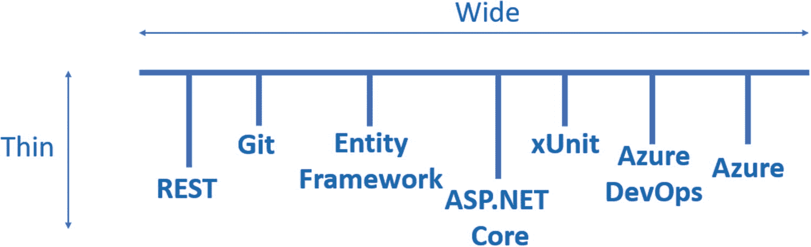

# 一、简介

## 我为什么写这本书

除了每个人都应该“至少有一本书”这一事实，我写这本书的主要原因是为了你——读者。是的，没错；我想写一本不废话、不无聊的书，让一般读者*[1](#Fn1)能够跟随并构建、测试和部署一个 ASP.NET Core API 到 Azure。我希望它是一个实用的、直截了当的文本，为读者带来切实的、有价值的结果。*

 *当然，我是否成功将由你来评判！

## 速写版

在出版这本书之前，我已经发行了这本书的两个早期版本。采取了精益启动方法(当版本准备好时就发布)，我收到了对每个版本的反馈，以使每个后续版本更好。随着的发布。NET Core 3.1 在 2019 年 11 月，这似乎是发布第二版的最佳时机，该版本更新了该版本的框架，以及其他一些更新，主要是转移到 PostgreSQL 作为后端数据库。

本进展版介绍了数据传输对象(dto)的使用，以及存储库模式的使用，这两者都说明了将接口与实现分离的思想，正如您将看到的，这有一系列的好处。我还在我们的示例 API 中添加了一个端点来响应“补丁”动词，这允许我们对资源执行部分更新。这是这本书以前版本中非常缺少的部分，早就应该被包括进来了。

## 这本书的方法

我在这本书中采用了“薄而宽”的方法，这意味着我想涵盖 API 开发的不同阶段的大量材料(宽)，而不是钻研无关的细节或理论(薄)。然而，我们会以足够实用的细节涵盖所有领域，以便您对每个领域都有一个适当的理解——也就是说，我们不会跳过任何重要的内容！

我喜欢把它想象成一份*品尝菜单*。每样东西你都要尝一点，这样在用餐结束的时候，你就会对你以后想吃的东西有所了解，你也会感到适当的满足！

图 1-1

薄而宽的方法

Les’ Personal Anecdote

21 世纪初，我第一次尝试(甚至听说)品尝菜单是在拉斯维加斯的一家赌场(我想是米高梅大酒店)。除了尝试菜单上的八个项目，我们还选择了“葡萄酒搭配”选项，顾名思义，这意味着每道菜都有一杯不同的葡萄酒，专门挑选来搭配这道菜。

我想这就是我记不住赌场名字的原因。

## 你能从哪里得到代码？

虽然我认为您可以通过阅读整本书并自己输入代码来获得更多的价值(这本书已经写好了，所以您可以一步一步地阅读)，但是您当然可能更喜欢下载代码并将其用作参考。的确，可能会有勘误表(但愿不会！)，谨慎起见，我为您提供了一个存储库，所以您可以直接去 GitHub 获取代码。

### 主解决方案存储库(API 和单元测试)

[T2`https://github.com/binarythistle/Complete-ASP-NET-3-API-Tutorial-Book`](https://github.com/binarythistle/Complete-ASP-NET-3-API-Tutorial-Book)

### 安全守护程序客户端仓库

[T2`https://github.com/binarythistle/Secure-Daemon-Client`](https://github.com/binarythistle/Secure-Daemon-Client)

## 本书中使用的约定

本书中使用了以下风格惯例。

概述*在主要叙述、暗示或提示的基础上，为读者提供额外的*信息。

Warning!

一些注意事项，因此读者应谨慎进行。

Learning Opportunity

自我导向的学习机会。读者可以自己做一些事情来促进学习和理解。

Celebration Checkpoint

干得好，里程碑，值得喊出来。允许你反思和检查学习。

Les’ Personal Anecdote

个人故事或观点，为我的观点增加背景。我通常会试着幽默一点——所以要小心。完成这本书不需要阅读！

## 的版本。net 核心框架

在撰写本文时(2020 年 5 月)，我使用的是。NET 核心框架。

## 联系作者

您可以通过以下渠道联系我:

*   les@dotnetplaybook . com

*   [T2`https://dotnetplaybook.com/`](https://dotnetplaybook.com/)

*   [T2`www.youtube.com/binarythistle`](http://www.youtube.com/binarythistle)

虽然我会尽力回复你，但我不太可能回答详细冗长的技术问题。

## 缺陷和功能改进

缺陷(勘误表)和改进建议应发送至 les@dotnetplaybook.com

对代码的任何更正、添加或改进都将反映在 GitHub 资源库中。

<aside aria-label="Footnotes" class="FootnoteSection" epub:type="footnotes">Footnotes [1](#Fn1_source)

*西洋镜*的粉丝们，我从第九季我最喜欢的一集里拿了这个术语: [`www.imdb.com/title/tt2128665/?ref_=ttep_ep4`](https://www.imdb.com/title/tt2128665/%253Fref_%253Dttep_ep4)

 </aside>*