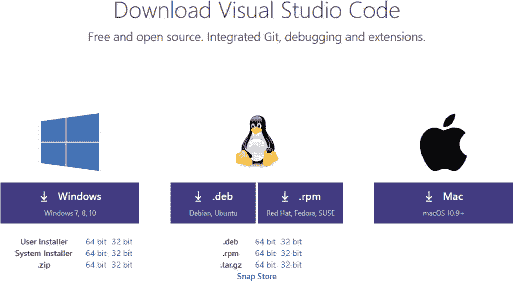
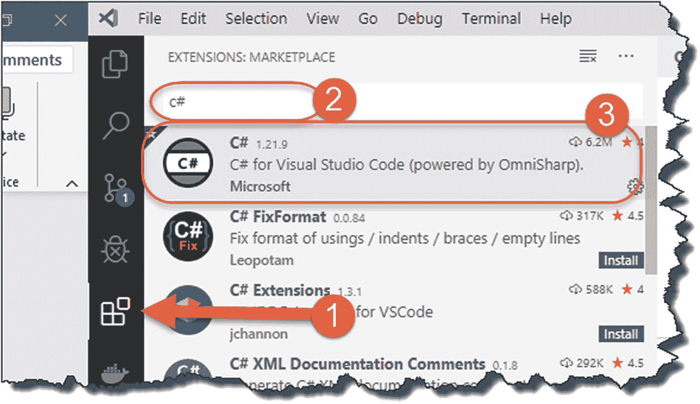
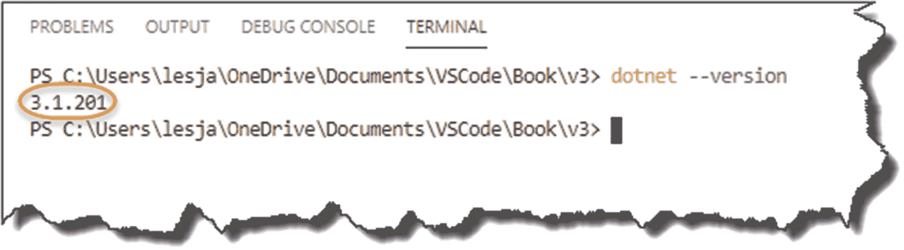
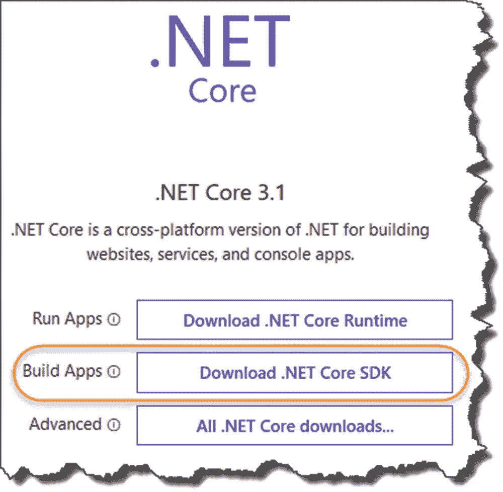
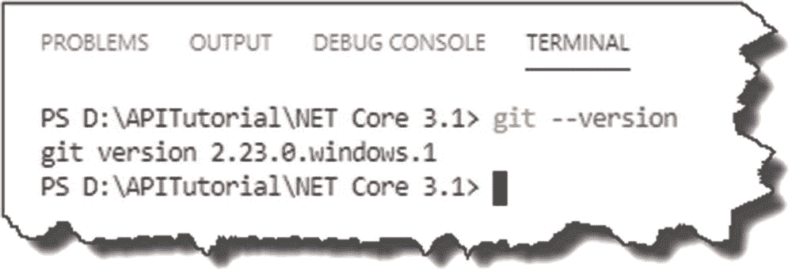
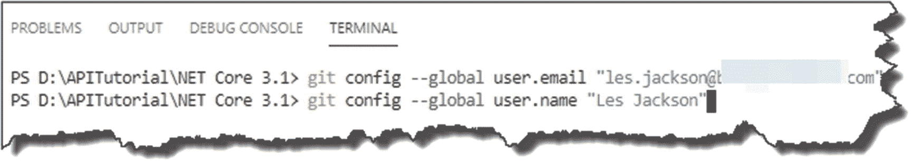
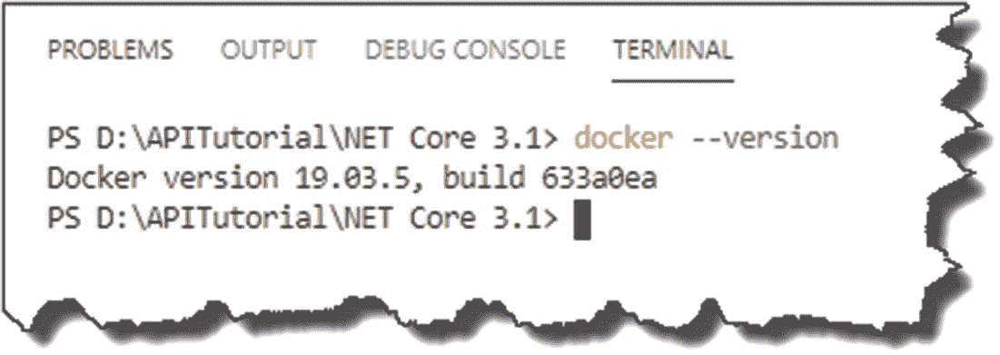
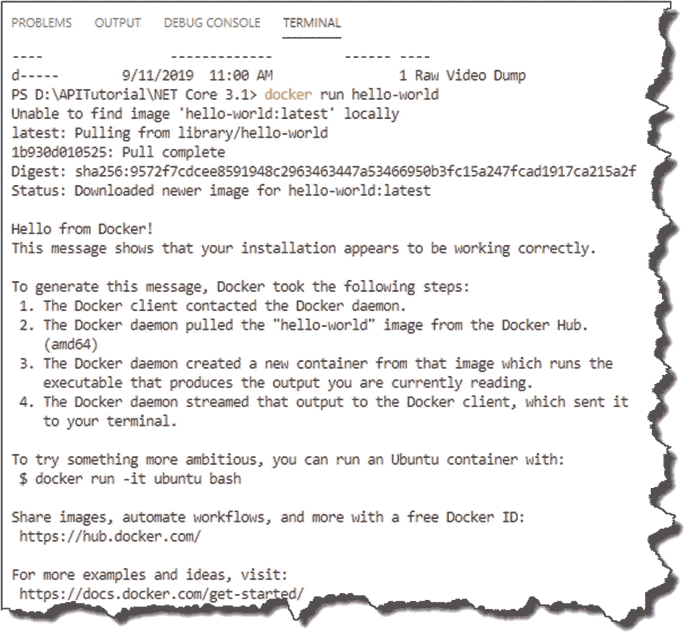
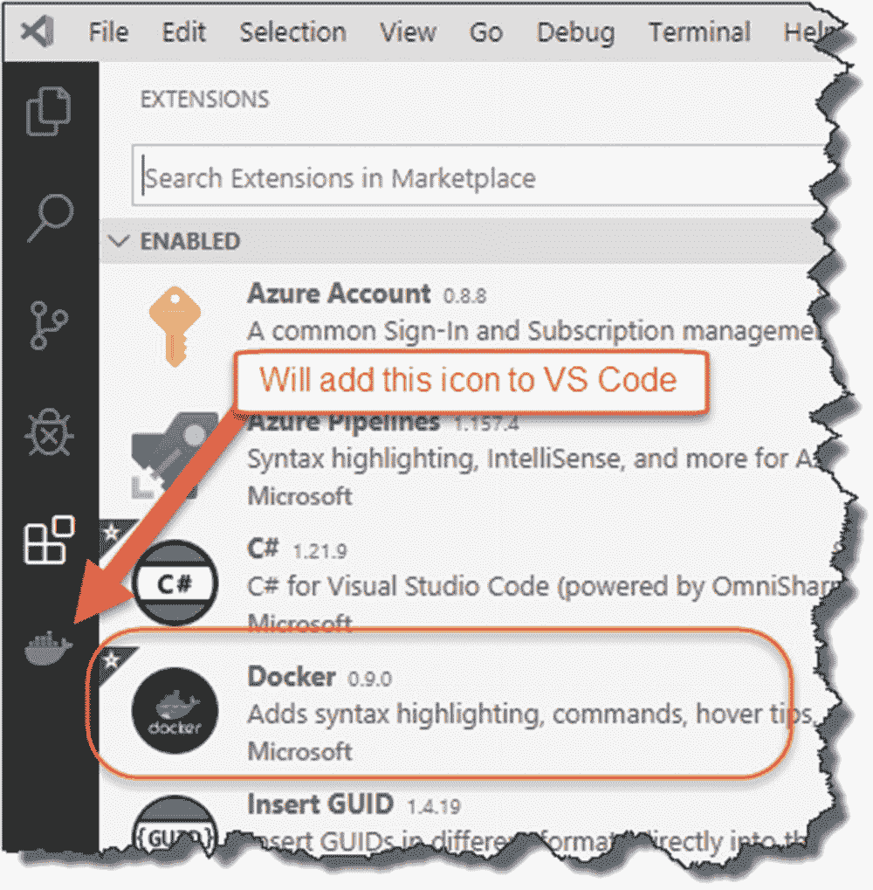
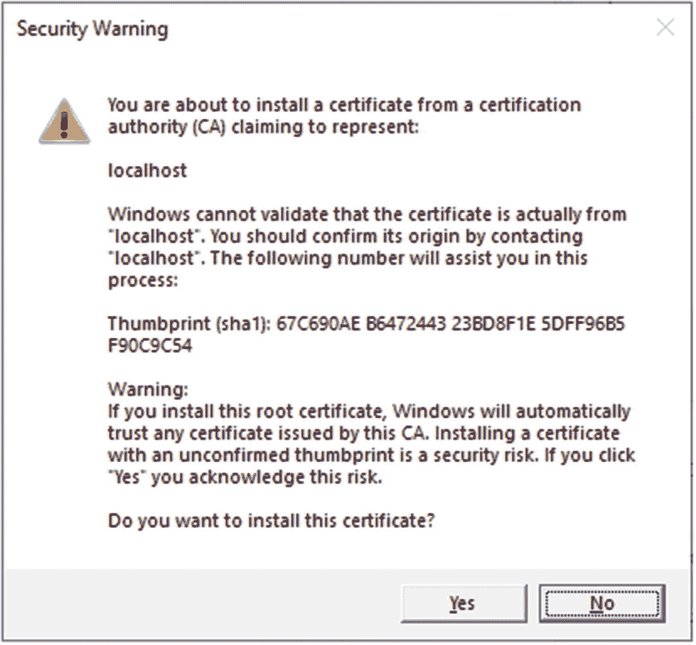

# 二、设置您的开发环境

## 章节总结

在这一章中，我们详细介绍了学习本书中的例子所需要的工具和设置。

### 完成后，你会

*   了解需要安装哪些工具

*   安装了这些工具并配置了您的环境，为开发做好了准备

## 三个朋友:Windows、Mac 和 Linux

的好处之一。NET 核心框架(与原版相比。NET Framework)是真正的跨平台， <sup>[1](#Fn1)</sup> 这意味着你可以在 Windows、OSX (Mac)或 Linux 上开发和运行相同的应用。对于本书的大部分内容来说，您运行的操作系统在遵循示例方面应该没什么区别，所以操作系统的选择几乎无关紧要，当然完全取决于您。

我已经转移到 PostgreSQL 作为数据库后端，它可以在 Windows、Linux 和 OSX 上本地使用。然而，我将把它作为一个 Docker 容器来运行，但是以后会有更多的内容。

我在下面的书中列出了你需要遵循的附加软件，但我决定不详细介绍如何安装它们，原因如下:

*   如果我为所有三个操作系统提供说明，这本书会变得太臃肿(记住——没有填充内容！).

*   我的指示会很快过时，而且可能会混淆而不是帮助。

*   不同的供应商通常会提供非常好的安装指南，并保持更新(如果没有，我会提供它们！).

    **注意**如果需要任何额外的*非标准*配置/设置，我当然会包括。

## 你的配料

我假设你有绝对基本的东西，比如 PC 或 Mac，网络浏览器和互联网连接(如果没有，你必须得到所有这些！)，所以我下面列出的软件是你可能需要遵循的额外的东西。 <sup>[2](#Fn2)</sup>

<colgroup><col class="tcol1 align-left"> <col class="tcol2 align-left"> <col class="tcol3 align-left"> <col class="tcol4 align-left"> <col class="tcol5 align-left"></colgroup> 
| 

原料

 | 

这是什么？

 | 

费用

 | 

要求

 | 

平台

 |
| --- | --- | --- | --- | --- |
| VS 代码 | 跨平台、功能全面的文本编辑器 | 自由的 | 写代码！**注:**这只是我个人的喜好；你当然可以选择一个你更喜欢的编辑器 | 跨平台 |
| 。网络核心软件开发工具包 | 。NET 核心运行时和 SDK | 自由的 | 这是我们将要构建 API 的框架。正如开篇提到的，我们将在本书中使用 3.1 | 跨平台 |
| 饭桶 | 本地源代码控制 | 自由的 | 本地源代码控制，并将我们的代码推送到 GitHub，最终发布到 Azure | 跨平台 |
| 一种数据库系统 | 本地数据库 | 自由的 | 我们将使用它作为我们的本地开发/测试数据库 | 跨平台或 Docker 映像 |
| 拥有它 | 独立于数据库的管理工具 | 自由的 | 编写和执行 SQL 查询，设置数据库用户等。 | 跨平台 |
| 邮递员 | API 测试工具 | 自由的 | 你可以选择使用网络浏览器来测试我们的 API 邮差只是给了我们更多的选择，强烈推荐 | 跨平台 |
| 桌面坞站/ce 坞站 | 集装箱化平台(运行码头集装箱) | 自由的 | **【可选】**我使用 Docker 快速启动并运行 PostgreSQL 数据库，而无需在我的桌面上本地安装它(PostgreSQL) | 跨平台:Docker 桌面–Windows 和 OSXCE 对接器 linux |
| GitHub.com | 用于团队协作的基于云的 git 存储库 | 自由的 | 用作我们持续集成/持续交付(CI/CD)管道的代码库组件 | 不适用–基于浏览器 |
| 蔚蓝的 | 微软云服务产品 | 免费 <sup>[3](#Fn3)</sup> | 我们将使用 Azure 托管我们的生产 API 以及我们的“生产”PostgreSQL 数据库 | 不适用–基于浏览器 |
| Azure DevOps | 基于云的构建/测试/部署平台 | 自由的 | 我们主要使用 Azure DevOps 作为向 Azure 发布 API 的工具。我们还将利用它的集中构建/测试特性 | 不适用–基于浏览器 |

## 软件和网站的链接

*   **VS 代号:** [`https://code.visualstudio.com/download`](https://code.visualstudio.com/download)

*   。**网芯 SDK:** [`https://dotnet.microsoft.com/download`](https://dotnet.microsoft.com/download)

*   **去** [`https://git-scm.com/downloads`去](https://git-scm.com/downloads)

*   **PostgreSQL(原生安装):** [`www.postgresql.org/download/`](http://www.postgresql.org/download/)

*   **PostgreSQL (Docker 镜像):** [`https://hub.docker.com/_/postgres`](https://hub.docker.com/_/postgres)

*   **DBeaver:** [`https://dbeaver.io/download/`](https://dbeaver.io/download/)

*   **邮递员:** [`www.postman.com/`](http://www.postman.com/)

*   **Docker 桌面(Windows 和 OSX):** [`www.docker.com/products/docker-desktop`](http://www.docker.com/products/docker-desktop)

*   **ce 对接器(Linux):** [`https://docs.docker.com/get-docker/`](https://docs.docker.com/get-docker/)

*   **GitHub:**T3`https://github.com/`T4】

*   **蔚蓝:** [`https://portal.azure.com/`](https://portal.azure.com/)

*   **蔚蓝 DevOps:** [`https://dev.azure.com/`](https://dev.azure.com/)

## 安装 VS 代码

我建议将 Visual Studio 代码(现在只称为 VS 代码)作为阅读本书的首选文本编辑器，因为它有一些很好的特性，例如，智能感知代码完成、语法突出显示、集成的命令/终端、git 集成、调试支持等。

它也是跨平台的，所以不管你用的是 Windows、OSX 还是 Linux，体验都差不多(这对写书的人来说是有益的！).

你当然还有其他选择，最著名的是 Visual Studio、 <sup>[4](#Fn4)</sup> ，这是一个完全集成的开发环境(IDE)，可以在 Windows 上使用，现在也可以在 OSX 上使用。如果你不想使用完整的 IDE，那么还有一系列其他的文本编辑器，例如，Windows 上的 Notepad ++和 OSX 上的 TextMate 等等。，你可以用。

Les’ Personal Anecdote

经常有人问我为什么选择使用 VS 代码而不是 Visual Studio，我总是用同样的类比来回答。

我把它比作学习驾驶手动变速器(又名“手动挡”)和学习驾驶自动变速器的汽车。在我看来，如果你学会驾驶手动变速器，你可以相对容易地转到驾驶自动变速器。我不认为反过来是正确的。

因此，虽然 VS 代码可能更“复杂”，可能不会像 Visual Studio 那样为您做很多事情，但我认为它只是让您更好地理解事情是如何工作的。一旦你掌握了窍门，Visual Studio 就是一个不可思议的工具。

无论如何，要安装 VS 代码，请进入 [`https://code.visualstudio.com/download`](https://code.visualstudio.com/download) ，选择您的操作系统，(见图 [2-1](#Fig1) ，并按照您的操作系统提供的说明进行操作。



图 2-1

VS 代码下载

安装完成后，启动它，我们将安装一些有用的扩展。

### Visual Studio 代码的 C#

像许多其他文本编辑器一样，VS Code 允许您安装微软或第三方提供的“扩展”(或插件，如果您喜欢的话)，这些扩展扩展了 VS Code 的功能，以满足您特定的开发需求。对于这个项目，最重要的扩展是 Visual Studio 代码的 *C#。它为我们提供了 C# 对语法高亮显示和智能感知代码完成的支持；老实说，没有它我会很失落。*

无论如何，要安装这个扩展(如果您愿意，还可以安装任何其他的扩展)

1.  单击 VS 代码左侧工具栏中的“扩展”图标。

2.  键入所需扩展名的全部或部分名称，例如 C#。

3.  Click the name of the extension you’d like.

    

    图 2-2

    为 VS 代码安装 C# 扩展

点击想要的扩展，你会看到一个详细的页面，解释一下这个扩展(以及下载次数和评论/评级)。要安装，只需点击“安装”按钮-就是这样！

### 插入 GUID

我们将在教程的后面使用“GUID ”,所以我们也可以安装“Insert GUID”扩展；请参阅以下扩展详细信息。


图 2-3

为 VS 代码安装插入 GUID 扩展

Learning Opportunity

自己安装“插入 GUID”VS 代码扩展——不难！

好了，我们已经完成了 VS 代码的设置，现在让我们进入下一个安装。

## 安装。NET Core SDK

你可以检查一下你是否已经有了。通过打开命令提示符并键入

```cs
dotnet --version

```

如果安装了，您应该会看到类似这样的内容。



图 2-4

检查。网络核心版本

即使已经安装了，也有必要检查一下最新的版本，以确保不会太落后。从图 [2-4](#Fig4) 中的截图，你可以看到我运行的是 3.1，这是我写这篇文章时的最新版本。

如果没有安装(或者你想更新你的版本)，弹出 [`https://dotnet.microsoft.com/download`](https://dotnet.microsoft.com/download%2520) ，选择“下载”。NET Core SDK”，如下图所示。



图 2-5

下载。网络核心软件开发工具包

选择“SDK”(软件开发工具包)选项而不是“运行时”选项很重要，我认为原因很明显。(运行时版本只是它只提供了 ***运行*** 所必需的资源。NET 核心应用。SDK 版本允许我们 ***构建和运行*** 应用；它包括运行时包中的所有内容。)

像往常一样，遵循各自的操作系统安装程序；一旦完成，你现在应该能够运行如图 [2-5](#Fig5) 所示的相同的`dotnet --version`命令，导致最新版本被返回。

## 安装 GIT

和一样。NET Core，您可能已经安装了 Git(事实上，它更有可能无处不在)。

在命令提示符/终端处，键入

```cs
git --version

```

如果已经安装，您将看到类似于图 [2-6](#Fig6) 所示的内容。



图 2-6

检查 GIT 版本

参考消息:我在 Windows 上运行的 VS 代码中使用集成终端；根据您的设置，它可能看起来略有不同(如果安装了，您仍然应该看到返回的版本号)。

如果没有安装，或者您运行的版本有些过时，请转到 [`https://git-scm.com/downloads`](https://git-scm.com/downloads%2520) ，按照您的操作系统的下载和安装选项进行操作。

### 姓名和电子邮件

为了完成 Git 的设置，我们需要通过姓名和电子邮件地址告诉它我们是谁，因为 Git 需要这些信息来让它知道谁在对代码进行修改。

为此，请在终端会话中输入以下命令，用合适的值替换“you@example.com”和“Your Name ”:

```cs
git config --global user.email “you@example.com”
git config --global user.name "Your Name"

```

例如，参见图 [2-7](#Fig7) 中我的配置。



图 2-7

配置 GIT 名称和电子邮件

在这个阶段没有 Git 的额外设置说明。我们将在本书的后面介绍如何设置和使用 Git 存储库。但是现在，我们结束了！

## 安装坞站[可选]

如果您打算在开发机器上直接安装 PostgreSQL，或者您已经有了一个可以使用的版本，那么您可以跳过这一部分。然而，如果你像我一样不喜欢在本地机器上安装大型应用，那么 Docker 是一个很好的选择(尽管矛盾的是，Docker 本身就是一个相当大的应用！)

### Docker 是什么？

Docker 是一个集装箱化平台，使您能够

*   将*你的*应用打包成图片，并允许其他人下载和运行它们(在 Docker 上)。

*   获取其他开发人员或软件供应商的“映像”(从存储库中)，并将它们作为容器在您的机器上运行(只要您已经安装了 Docker)。

Docker 映像的核心概念是它们是自包含的，这意味着映像拥有运行所需的一切，避免了复杂的安装、定位和安装第三方支持库等。它最终避免了“它在我的机器上工作”的争论。

它有一点学习曲线(虽然不多)，一旦你掌握了基础知识，它可以节省你这么多的时间和精力，作为一个开发人员，我不能高度推荐它。

### 台式机坞站与 CE 坞站

令人困惑的是(至少对我来说)，如果你运行的是 Windows 或 OSX，你需要安装一个叫做 *Docker Desktop* 的东西。然而，如果你是 Linux 用户，那么你应该安装 *Docker 社区版*或 CE。这可能有非常迂腐的原因，我不知道，我也没有兴趣了解，所以你真正需要知道的是从哪里得到它们！

*   **Docker 桌面此处:** [`www.docker.com/products/docker-desktop`](http://www.docker.com/products/docker-desktop)

*   **在此停靠 ce:**[`https://docs.docker.com/get-docker/`](https://docs.docker.com/get-docker/)

在下载和安装 Docker 桌面之前，您需要注册一个 Docker Hub 帐户；这是一个免费注册，所以没有什么可担心的。如果您想将自己的图像上传到 Docker Hub 进行分发，它也很有用。

 Warning!

在撰写本文时，Docker Desktop 只能“直接”安装在 Windows 10 Professional 上。然而，如果你运行的是 Windows 10 Home，你可以通过使用一种名为 Windows Subsystem for Linux (WSL)的东西来解决这个问题。

正如我以前说过的，我不打算详细说明如何做到这一点，因为 Docker 的人已经为此提供了很好的指导:

[`https://docs.docker.com/docker-for-windows/install-windows-home/`](https://docs.docker.com/docker-for-windows/install-windows-home/) 。

Docker 桌面安装超级简单；对于 Docker CE，您需要参考特定发行版的安装说明——不过，这也很简单。

### 安装后检查

不管你安装的是哪一种 Docker，安装后，打开命令行，输入

```cs
docker --version

```

您应该会得到如下所示的内容。



图 2-8

检查 Docker 版本

要进一步测试它是否完全正常工作，请键入

```cs
docker run hello-world

```

如果这是你第一次运行这个，Docker 会转到 Docker Hub，拉下`hello-world`图像，然后运行它；您应该会看到类似这样的内容。



图 2-9

Hello World Docker 映像下载并运行

我们不需要深入了解这里发生了什么(尽管`hello-world`生成的输出做得非常好)；我只想说 Docker 已经安装好了，随时可以使用。随着教程的进行，我将在 Docker 上介绍更多内容。

### 用于 VS 代码的坞站插件

如果你使用 VS 代码作为你的开发编辑器，并且你已经决定使用 Docker，那么我强烈推荐你安装微软的 Docker 扩展。我已经在下面展示了它，但是我会把它留给你来安装。



图 2-10

VS 代码的 Docker 扩展

## 安装 PostgreSQL

如果你不想用 Docker，想直接在你的开发机器(或者另一个服务器、虚拟机等)上安装 PostgreSQL。)，那么您需要按照您的操作系统的安装步骤进行操作。如前所述，我不会在这里详细描述这些步骤，因为 PostgreSQL 的人已经在这里做了很好的工作: [`www.postgresql.org/download/`](http://www.postgresql.org/download/) 。

 Warning!

我花了很多时间在 Linux 机器上运行 PostgreSQL，并从另一台机器上连接。这很大程度上是因为我对 Linux 不是很在行，所以那些精通 Linux 的人无疑会少一些麻烦。

然而对我来说，纠结于安装数据库的细微差别有损于编码的行为，而这正是我真正想做的事情。因此我*强烈*建议使用 Docker 的原因。

PostgreSQL 的本地 Windows 和 OSX 安装(和往常一样)要容易得多。

## 安装 dbeaver ce

无论您是使用 Docker 还是本地 PostgreSQL 安装，无论哪种方式，我们都需要做一些小的数据库管理工作，并编写 SQL 查询来读写数据库中的数据。当然，您可以使用 PostgreSQL 安装附带的命令行选项，但是我也希望有一个图形环境供我使用，因为与命令行选项相比,“入门门槛”大大降低了。

**只需记住**:我在本书中的重点是*编写 API，*不是专业的 PostgreSQL 数据库管理员。

### dbeaver 诉 pgAdmin

可能 PostgreSQL 最流行的管理工具是 pgAdmin， <sup>[5](#Fn5)</sup> ，事实上这是我之前推荐的工具。

Les’ Personal Anecdote

这里管理工具的选择完全是个人的。我在之前的迭代中使用过 pgAdmin，它完全没问题，但是自从他们把它转移到一个“web 版本”，在它自己的小 web 服务器上运行，我就避免使用它。我不太清楚为什么；我认为大多数情况下，它只是一个臃肿且违反直觉的软件。这是一个需要安装本地网络服务器的网络应用？我觉得不太对劲。

看了几个用于 PostgreSQL 的图形数据库管理工具后，我选择了免费的 DBeaver Community Edition。这是一个数据库无关的管理工具，你可以用它来连接和管理大多数流行的 RDBMS<sup>[6](#Fn6)</sup>。也是跨平台的，更好——你可以在这里下载你的副本: [`https://dbeaver.io/download/`](https://dbeaver.io/download/) 。

我们将在本书的后面介绍如何连接和设置 PostgreSQL。不过，现在我们结束了。

Les’ Personal Anecdote

在我们继续之前，我只想说，对我来说，数据库管理工具之王仍然是 SQL Server Management Studio。在我的个人观点中，在可用性、速度、功能等方面，没有什么能与之媲美。

我没有使用它的唯一原因只是因为我决定使用 PostgeSQL 作为 RDBMS(您只能使用 SQL Server Management Studio 来管理 MS SQL 服务器，它也只能在 Windows 上运行)。

## 安装邮递员

这是可选的，由你决定是否安装——但是我强烈推荐使用它。我将在整本书的不同地方使用它，鉴于它既免费又优秀，我看不出你为什么不这样做。如果你打算继续进行 API 开发，那么它本质上是强制性的。它既可以作为浏览器插件，也可以作为独立的客户端。更多关于如何安装和下载的详细信息，请访问 [`www.getpostman.com/downloads/`](http://www.getpostman.com/downloads/) ，看一看。

此时不需要进一步配置——我将在后面介绍如何使用它。

## 信任本地主机开发证书

在整个教程中，我们将通过 http 和 https 访问本地主机端点。对于那些使用 https 的连接，我们可能会遇到一些错误/异常，比如证书无效。我们不想关闭 SSL 证书验证；相反，我们希望信任我们的本地开发证书。

为此，请在命令提示符下键入

```cs
dotnet dev-certs https --trust

```

您将看到一个类似如下的消息框。



图 2-11

信任本地证书

单击“是”安装证书，您应该可以开始了。

## 包装它

所有其他必需的组件都是基于 Web 的，并且只需要

*   网络浏览器

*   互联网连接

*   用户帐户

我不会通过详述如何在这些服务上创建一个帐户来侮辱你的智慧——这很简单。当我们进入后面的部分时，我将在需要的地方介绍每个部分的设置和配置，所以不要担心。目前，您需要的只是以下各项的帐户:

*   **GitHub:**T3`https://github.com/`T4】

*   **蔚蓝:** [`https://portal.azure.com/`](https://portal.azure.com/)

*   **蔚蓝 DevOps:** [`https://dev.azure.com/`](https://dev.azure.com/)

所有这些(至少最初是这样！)是免费的。

<aside aria-label="Footnotes" class="FootnoteSection" epub:type="footnotes">Footnotes [1](#Fn1_source)

是的，有像“单声道”这样的东西，但总的来说，我会说原来的。NET 框架是以微软的 Windows 为中心的。

  [2](#Fn2_source)

在下一节中单独提供了可以找到该软件的链接。

  [3](#Fn3_source)

在撰写新文章时，注册用户可以获得 280 美元的信用额度(在头 30 天内使用)，以及额外 12 个月的免费“流行”服务。其他费用可能适用；最新报价请查看 Azure 网站: [`https://azure.microsoft.com/`](https://azure.microsoft.com/)

  [4](#Fn4_source)

Visual Studio 的“免费”版本称为“社区版”；谷歌一下下载网站就知道了。

  [5](#Fn5_source)

[www. pgadmin. org/](http://www.pgadmin.org/)

  [6](#Fn6_source)

关系数据库管理系统。

 </aside>