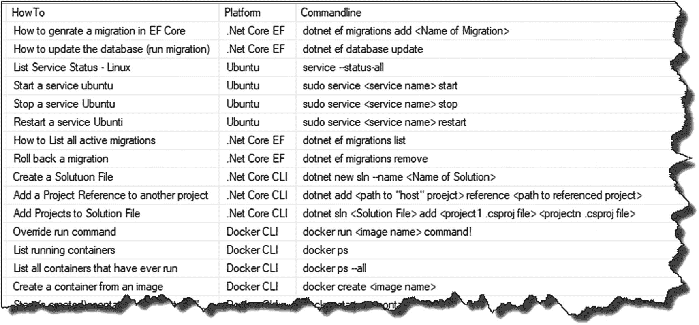
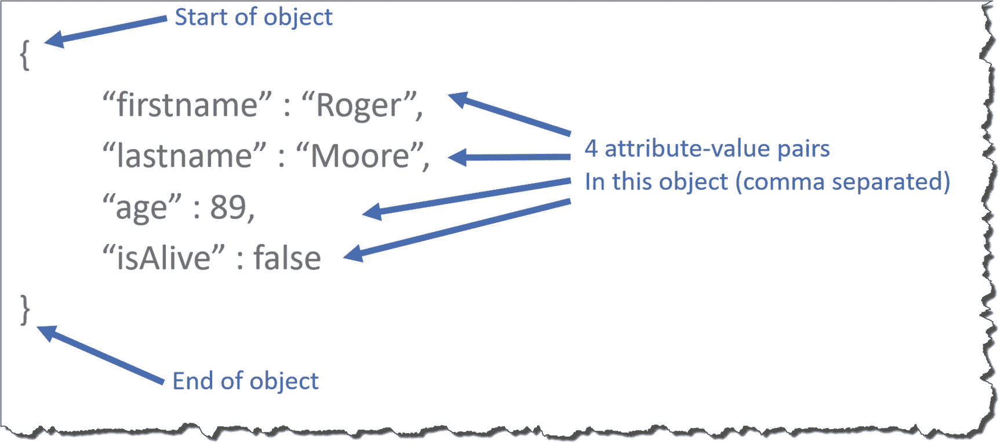
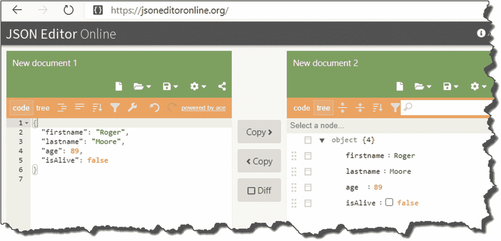
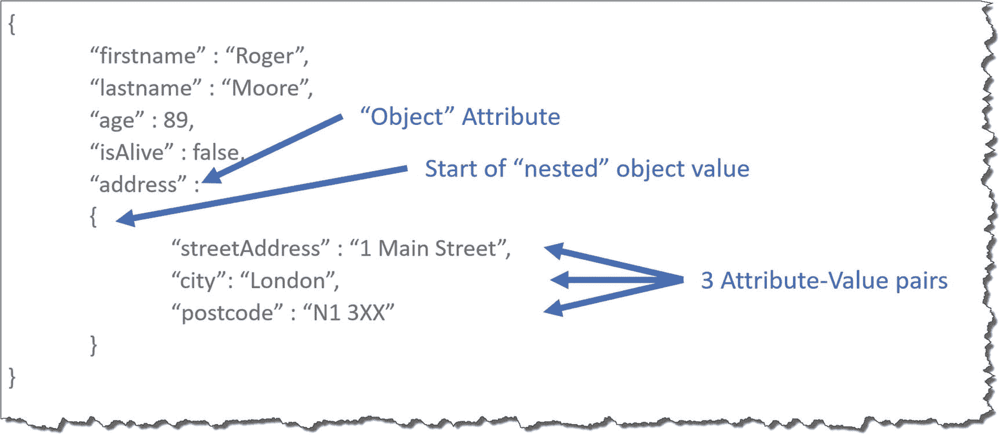
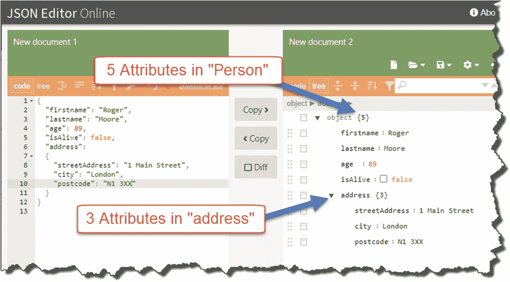
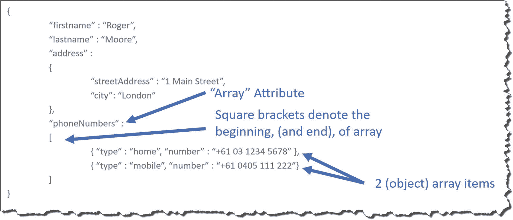

# 三、我们的 API 概述

## 章节总结

在此(很短！)一章，我将带您了解您将要构建的 API 以及它试图解决的问题。我们还将在较高层次上介绍 REST API 模式。

### 完成后，你会

*   了解更多关于 REST 模式的知识。

*   理解你将在本书的其余部分构建什么。

*   了解您为什么要构建这个解决方案。

*   对 JavaScript 对象符号(JSON)有所了解。

## 什么是 REST API？

API 将最终治愈世界饥饿，带来持久和平，使人类能够永远和谐地一起探索宇宙——至少有些人(通常是推销员类型)会让你相信。我当然不相信这一点，我有点开玩笑。

REST(如果你愿意，也可以称为表述性状态转移)是 Roy Fielding 在 2000 年定义的一种架构风格，用于创建 web 服务。好的，是的，但是*那个*是什么意思？简而言之，REST 或*RESTful*API 是一种轻量级的方式来传输“资源”的文本表示，例如书籍、作者、汽车等。它们通常(尽管不需要)是围绕 HTTP 协议和标准的 HTTP 动词集构建的，例如 GET、POST、PUT 等。

近年来，REST APIs 比其他 web 服务设计模式(例如 SOAP)更受青睐，因为它们被认为开发起来更简单、更快，并且比其他方法更有助于互操作性的概念。ASP.NET Core API 内置了一种 RESTful 方法，我们在开始构建我们的示例时会看到这一点。

对我个人来说，实际上构建 API 会帮助你更全面地理解“REST ”,如果我在这里继续写的话，那么我们现在就把理论留在这里。尽管如此，请放心，在我们构建 API 端点时，我确实涵盖了核心的 REST 概念。

Learning Opportunity

如果你对我对 REST 的描述不满意，关于这个主题已经有很多资源了，所以如果你想了解更多信息，我建议你去谷歌一下！

不过，我想当你开始构建 REST APIs 时，你会学到更多的东西。

## 我们的 API

我们将要开发的 API 是一个简单但有用的 API(反正对我来说很有用！).随着年龄的增长和衰老状态的恶化，我想编写一个 API 来存储“命令行片段”(例如`dotnet new web -n <project name>`)，因为我发现在需要的时候调用它们越来越难了。本质上，它将成为一个命令行存储库，您可以在需要时进行查询。

每个“资源”将具有以下属性:

*   `Howto`:提示将做什么的描述，例如，添加防火墙例外、运行单元测试等。

*   `Platform`:应用或平台领域，例如 Ubuntu Linux、点网核心等。

*   `Commandline`:实际的命令行片段，例如`dotnet build.`

下面是一些片段(又名“参考资料”)的列表作为例子。

图 3-1

命令行片段示例

我们的 API 将遵循大多数 REST APIs 通用的标准创建、读取、更新和删除(CRUD)操作集，如下表所示。

<colgroup><col class="tcol1 align-left"> <col class="tcol2 align-left"> <col class="tcol3 align-left"> <col class="tcol4 align-left"></colgroup> 
| 

动词

 | 

上呼吸道感染

 | 

操作

 | 

描述

 |
| --- | --- | --- | --- |
| 得到 | /API/命令 | 阅读 | 读取所有命令资源 |
| 得到 | /API/命令/{Id} | 阅读 | 读取单个资源(通过 Id) |
| 邮政 | /API/命令 | 创造 | 创建新资源 |
| 放 | /API/命令/{Id} | 更新(完整) | 更新单个资源的所有内容(按 Id) |
| 修补 | /API/命令/{Id} | 更新(部分) | 更新单个资源的一部分(按 Id) |
| 删除 | /API/命令/{Id} | 删除 | 删除单个资源(按 Id) |

Quick Note

组合中的动词和 URI *对于给定的 API 应该是唯一的。我们稍后会更详细地讨论这一点，但现在只需记住这一点。*

## 有效载荷

如前所述，REST APIs 是“一种传输资源的文本表示的轻量级方式。”这是什么意思呢？

当您调用 REST API 来检索数据时，数据将以某种序列化的文本格式返回给您，例如:

*   JavaScript 对象符号(JSON)

*   可扩展标记语言(XML)

*   超文本标记语言(HTML)

*   另一种标记语言(YAML)

等等。

在接收到序列化的字符串有效负载后，您将对它做一些事情，很可能是某种反序列化操作，这样您就可以在消费应用中使用资源或对象。关于 REST APIs，没有规定的有效载荷格式，尽管通常会使用并返回 JSON。鉴于 JSON 的轻量级特性和在业界的普遍性，我们将在本书中使用 JSON 作为我们的有效负载格式。

### JSON 上的五分钟

JSON 是什么？

*   代表“JavaScript 对象符号”

*   一种开放格式，主要用于通过 Web 传输“对象”数据。

*   它由属性-值对组成(参见以下示例)。

*   JSON 对象可以包含其他“嵌套”对象。

#### 一个简单 JSON 对象的剖析

图 3-2

简单的 JSON 对象

在图 [3-2](#Fig2) 的例子中，我们有一个具有四个属性的“人”对象:

*   `firstname`

*   `lastname`

*   `age`

*   `isAlive`

具有以下各自的值

*   `Roger`[这是一种字符串数据类型，因此用双引号“”’来描述]

*   `Moore`[这也是一个字符串，需要双引号]

*   `89`【不需要引号的数值】

*   `false`【布尔值，再次不需要双引号】

将这个 JSON 粘贴到类似 jsoneditoronline.org 的内容中，您可以进一步询问它的结构。

图 3-3

JSON 在线编辑器

#### 一个(稍微)更复杂的例子

正如 JSON 概述中提到的，一个对象可以包含“嵌套”对象；观察我们带有嵌套地址对象的 person 示例:

图 3-4

嵌套 JSON 对象

在这里，我们可以看到我们有第五个人对象属性`address`，它不像其他属性那样有一个标准值，但实际上包含另一个具有三个属性的对象:

*   `streetAddress`

*   `city`

*   `postcode`

所有这些属性的值都包含字符串，所以没有必要进一步强调这一点。这种筑巢方式会令人厌烦地持续下去。

同样，将这个 JSON 发布到我们的在线编辑器中会产生一个稍微有趣一些的结构。

图 3-5

在线 JSON 编辑器中的对象导航

#### 最后一个例子

继续我们的最后一个例子，这次包括一个电话号码对象数组。

图 3-6

JSON 数组简介

Note

纯粹为了简洁和可读性，我从 person 对象中删除了“`age`”和“`isAlive`”属性，从 address 对象中删除了“`postcode`”属性。

您会发现我们向 Person 对象添加了一个额外的属性“`phoneNumbers`”，与“`address`”属性不同，它包含一组其他对象，而不仅仅是一个嵌套的对象。

我选择这些具体例子的原因是为了让您熟悉 JSON 和它的一些核心构造，特别是

*   对象的开始和结束，“花括号”:{ }

*   属性-值对

*   嵌套对象(或作为属性值的对象)

*   对象数组，"方括号":[]

就我个人而言，在我的 JSON 之旅中，这些构造是您将会遇到的主要构造，就介绍而言，应该能够很好地涵盖大多数场景——当然是关于我们正在构建的 API，它将返回和接受简单的 JSON 对象。

<aside aria-label="Footnotes" class="FootnoteSection" epub:type="footnotes">Footnotes [1](#Fn1_source)

归功于已故的伟大的比尔·希克斯，我在转述他。

 </aside>