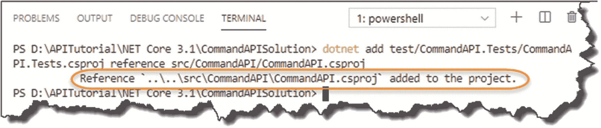

# 四、搭建我们的 API 解决方案

## 章节总结

在这一章中，我们将“搭建”我们的两个项目，并将它们放在一个*解决方案*中。我们还将讨论典型 ASP.NET Core 应用的“基本”内容，并向您介绍两个关键类:`Program`和`Startup`。

### 完成后，你会

*   已经创建了我们的主要 API 项目

*   已经创建了我们的单元测试项目

*   将两个项目放在一个解决方案中

*   对 ASP.NET Core 项目的剖析有坚实的理解

*   了解 ASP.NET Core 项目中的`Program`和`Startup`课程

## 解决方案概述

在我们开始创建项目之前，我只是想给你一个本章结束时我们将得到什么的概述(我不知道你，但如果我知道我努力的最终目标，它会帮助我)。首先，简单介绍一下我们的“解决方案层级”

<colgroup><col class="tcol1 align-left"> <col class="tcol2 align-left"> <col class="tcol3 align-left"> <col class="tcol4 align-left"></colgroup> 
| 

成分

 | 

这是什么？

 | 

主配置。文件

 | 

关系

 |
| --- | --- | --- | --- |
| 解决办法 | 主容器，包含一个或多个相关项目 | 。豆状下核 | 项目是孩子 |
| 项目 | 相关功能的独立“项目” | 。csproj(csproject) | 解决方案是父级项目是兄弟 |

一个“解决方案”实际上只不过是一个或多个相关项目的容器；项目又包含代码和其他资源来做一些有用的事情。您不会将代码直接放入解决方案中。

项目当然可以没有父解决方案而存在；更进一步，项目可以相互引用，而不需要解决方案。那么，为什么要费心寻找解决方案呢？大问题；归结起来就是

*   您希望如何“分组”相关项目的个人偏好

*   如果您正在使用 Visual Studio(这通常会为您创建一个解决方案)

*   您是否希望在一个解决方案中一起“构建”所有项目

我们将使用一个解决方案，因为我们将有两个相互关联的项目:

*   源代码项目(我们的 API)

*   单元测试项目(我们的 API 的单元测试)

我们解决方案的总体布局详见图 [4-1](#Fig1) 。


图 4-1

我们的解决方案层级

你会看到我们在主解决方案文件夹中有子文件夹来隔离源代码(***【src】***)和单元测试项目( ***测试*** )。好了，让我们开始创建我们的解决方案和项目吧！

## 搭建我们的解决方案组件

移动到您的工作目录(基本上是您喜欢存储解决方案和项目的地方)，并创建以下文件夹:

*   创建主“解决方案”文件夹名为***命令*****。**

***   在名为 ***src*** 和 ***test*** 的解决方案文件夹中创建两个子目录。** 

 **你应该有如下的东西。


图 4-2

基本文件夹设置

*   打开一个终端窗口(如果你还没有的话)，导航到你刚刚创建的 ***src*** 文件夹的“内部”。

 .NET Core 提供了许多我们在创建新项目时可以使用的“模板”；选择一个特定的模板将影响任何自动生成的额外的“脚手架”代码。

要查看可用模板的列表，请键入

```cs
dotnet new

```

您应该会看到如下所示的内容。


图 4-3

。NET 核心项目模板

您会注意到有一个名为“webapi”的模板，我们可以用它来生成这个项目。然而，我觉得大多数自动生成的支架代码都很重要，所以我们自己创建。因此，在本教程中，我们将使用“web”模板，它实际上是最简单的、空的 ASP.NET Core 模板。

要生成我们新的“API”项目，输入(再次确保您在 ***src*** 目录中)

```cs
dotnet new web -n CommandAPI

```

在哪里

*   `web`是我们的模板类型。

*   - `n CommandAPI`命名我们的项目并创建我们的项目和文件夹。

您应该会看到如下所示的内容。


图 4-4

API 项目生成

按照我们给定的布局，在 ***src*** 中应该已经创建了一个名为 ***CommandAPI*** 的文件夹；进入这个文件夹，列出你应该看到的内容。


图 4-5

列出我们的 API 项目的内容

如果你不熟悉使用命令行界面浏览文件夹，谷歌一下一些基本命令可能是值得的。因为我使用的是“PowerShell”终端，所以我使用的命令类似于您在 Unix/Linux 系统上找到的命令。如果你使用的是 Windows 命令提示符，你应该键入`cd <name of directory>`后跟`dir;`。`dir`命令类似于这里的`ls`，它列出了当前目录的内容。

好了，我们已经搭建好了我们的 *API 项目*；现在我们需要重复我们的单元测试项目。

*   导航进入 ***测试*** 文件夹 <sup>[1](#Fn1)</sup> 包含在主解决方案目录***commandapi solution***。

*   在命令行中，键入

```cs
dotnet new xunit -n CommandAPI.Tests

```

您应该会看到以下输出。


图 4-6

单元测试项目创建

Learning Opportunity

什么是 xUnit？还记得我们输入的获取所有可用模板列表的命令吗？再试一次，看看 xUnit 模板是什么。您能看到任何看起来相似的模板吗，可能有相似的名称组件？或许也可以研究一下它们是什么。

### 创建解决方案和项目关联

好了，我们已经创建了两个项目，但是现在我们需要

*   创建一个将两个项目链接到整体解决方案的解决方案文件。

*   在我们的单元测试项目中引用我们的 API 项目。

回到我们的终端/命令行，改回主解决方案文件夹:***commandapi Solution***；要检查您是否在正确的位置，请执行目录列表，您应该会看到类似这样的内容。


图 4-7

查看我们的目录列表

你应该看到两个目录: ***src*** 和 ***test*** 。

现在，发出下面的命令来创建我们的解决方案。sln)文件:

```cs
dotnet new sln --name CommandAPISolution

```

这将创建我们的*空解决方案*文件，如下所示。


图 4-8

创建解决方案文件

我们现在想要将我们的两个“子”项目关联到我们的解决方案；为此，发出以下命令:

```cs
dotnet sln CommandAPISolution.sln add src/CommandAPI/CommandAPI.csproj test/CommandAPI.Tests/CommandAPI.Tests.csproj

```

Note

前面的命令都是一行。

您应该会看到这两个项目都添加到了解决方案文件中。


图 4-9

添加到我们解决方案中的项目

如果出现错误，请再次检查是否正确输入了完整路径。还挺长的，所以犯错的机会是有的。相信我——我已经花了很多时间纠正这类错别字。

所有这些实际上是告诉我们的解决方案它有两个项目。项目本身并不知道彼此的存在。这类似于父母知道他们有两个孩子，但孩子们*不知道*彼此——我们现在要纠正这一点，不管怎样，对其中一个兄弟姐妹来说。

我们需要在 我们的 ***CommandAPI 中放置一个对我们的 ***CommandAPI*** 项目 ***的“引用”。测试*** 项目；这将使我们能够引用 ***CommandAPI*** 项目，并从我们的 ***CommandAPI 中“测试”它。测试**项目*项目。您可以手动编辑 ***命令 API。Tests.csproj*** 文件或键入以下命令:***

```cs
dotnet add test/CommandAPI.Tests/CommandAPI.Tests.csproj reference src/CommandAPI/CommandAPI.csproj

```

您应该会得到如下所示的内容。



图 4-10

作为引用添加的 API 项目

打开 VS 代码(或者你选择的任何编辑器)，打开***command API solution***文件夹<sup>[2](#Fn2)</sup>；找到 ***CommandAPI。Tests.csproj*** 文件，并打开它——您应该看到对 CommandAPI 项目的引用(以及其他内容):


图 4-11

已添加检查参考

Learning Opportunity

为什么我们只以这种方式放置引用？为什么我们不在我们的 API 项目中引用我们的单元测试项目。csproj 文件？

您现在可以通过发出以下命令来构建这两个项目(确保您仍然在根*解决方案*文件夹中)

```cs
dotnet build

```

Note

这是使用解决方案文件的优势之一(您可以从这里构建两个项目)。

假设一切顺利，*解决方案构建*应该会成功，它包含了我们的两个项目。


图 4-12

执行我们的第一次构建

Celebration Checkpoint

干得好！您已达到第一个里程碑；我们的应用已经搭好架子，随时可以运行(这意味着编码)。

但是(总有但是不是吗？)，在我们进入下一章之前，我认为稍微了解一下 ASP.NET Core 应用的结构可能是合适的。您对此越熟悉，就越容易找到本教程的其余部分。

## 剖析 ASP.NET Core 应用

下表描述了创建 ASP.NET Core 项目时通常会遇到的*核心* <sup>[3](#Fn3)</sup> 文件和文件夹。请注意，根据您选择的项目(或脚手架模板)类型，您可能会有额外的文件和文件夹——但是，这里描述的文件和文件夹是大多数项目类型所共有的。

<colgroup><col class="tcol1 align-left"> <col class="tcol2 align-left"></colgroup> 
| 

文件/文件夹

 | 

这是什么？

 |
| --- | --- |
| 。VS 代码 | 这个文件夹存储您的 VS 代码工作区设置，所以它实际上与实际项目没有任何关系。事实上，如果你选择在 VS 代码之外的地方开发这个文件，你就不会有这个文件(你可能有其他的东西) |
| *bin* (文件夹) | 最终输出二进制文件以及任何依赖项和/或其他可部署文件将被写入的位置 |
| 对象(文件夹) | 用于存放编译期间由编译器生成的中间对象文件和其他临时数据文件 |
| *属性*(文件夹)*launchSettings.json* | 包含了***launch settings . JSON***文件。该文件可用于配置应用环境变量，例如开发。它还用于配置运行您的应用的 web 服务器将如何运行，例如，它将侦听哪个端口等。 |
| *appsettings.json**appsettings。Development.json* | 文件用来容纳，惊喜惊喜，“应用设置。”在接下来的小节中，我们将把连接字符串存储到我们的数据库中此外，特定于环境的设置可以包含在附加设置文件中(如开发)，如 ***appsettings 所示。**development . JSON*文件 |
| *<项目名称>。csproject〔t1〕* | 项目的配置主要告诉我们。NET Core Framework 版本，以及应用将引用和使用的其他 Nuget 包(见信息框)此外，正如您之前看到的，这是我们可以放置需要注意的其他项目的引用的地方 |
| *Program.cs* | 一切从这里开始这个类配置“托管”平台，以及整个应用的“`Main()`”入口点方法 |
| *Startup.cs* | 此类用于配置应用服务和请求管道。稍后将详细介绍这些内容。在我看来，如果你学习了`Startup`类的工作原理，你将会很好地理解 ASP.NET Core 应用是如何工作的——所以在这里投入一些精力是值得的 |

Nuget 是一个包管理平台，允许开发者引用和使用他们可以在应用中使用的外部预打包代码。当我们浏览这本书并需要额外的功能时，我们将向我们的项目文件添加不同的包。

总之

*   ***launch settings . JSON***

*   ***【appsettings . JSON】***(以及其他特定环境的设置文件)

*   ***<项目名称>。csproj***

*   ***program . cs**T3】*

*   ***创业. cs***

所有人都在共生的喜悦中工作，让应用启动、运行并根据运行时环境工作。在我们阅读这本书的过程中，当它们变得相关时，我们会越来越多地讲述每一个给定项目的功能和特性。

然而，由于它们是每个 ASP.NET Core 解决方案的基础，我们将在这里简要讨论一下`Program`和`Startup`类。

### 程序和启动类

#### 程序类

如前所述，这是整个应用的主要入口，用于配置“托管”环境。然后，它继续使用`Startup`类来完成应用的配置。

让我们快速看一下模板化的代码(我们*不会*改变它),看看它做了什么。

除非另有说明，否则当我们处理一个项目时，它将是我们主要的“API 项目”(而不是单元测试项目)。因此，对于接下来的例子，以及书中的其他地方，首先参考这个项目。

我将明确地说明我们何时需要使用单元测试项目。


图 4-13

程序类的标准内容

执行顺序如下。


图 4-14

程序类执行序列

`CreateDefaultBuilder`方法使用默认的构建器模式来创建 web 主机，它可以指定要使用的 web 服务器和配置源，以及选择我们用来完成应用服务配置的类。在这种情况下，我们使用默认的`Startup`类；事实上，由于默认内容足以满足我们的需求，我们将继续。

Note

我们会掩护。NET 核心配置的更多细节。

#### 启动类

`Program`类是应用的入口点，但是大多数有趣的启动工作都是在`Startup`类中完成的。`Startup`类包含了两个我们应该深入研究的方法:

*   `ConfigureServices`

*   `Configure`

执行顺序如下。


图 4-15

启动类执行序列

##### 配置服务

在 ASP.NET Core 中，我们有“服务”的概念，它只是为应用的其他部分提供功能的对象。对于那些熟悉*依赖注入*、<sup>、 [4](#Fn4) 、T5】概念的人来说，这是在提供的默认控制反转(IoC)容器中注册依赖的地方。NET 核心。当我们在第 [6](06.html) 章开始使用我们的“存储库”时，我们会更加详细地讨论依赖注入。</sup>

##### 安装ˌ使成形

一旦服务被注册，就调用`Configure`来建立*请求管道*。请求管道可以由多个*中间件组件*组成，这些组件接受(在本例中是 http)请求并对其执行一些操作。

根据多个中间件组件是如何创建的，这将影响它们在哪个阶段参与请求，以及它们做什么(如果有的话)来影响请求。

在下图中，您可以看到请求是如何遍历添加到`Configure`方法中的中间件组件的。请求的性质(例如，它是否试图打开 Web 套接字？)并且中间件中的逻辑将确定该请求将会发生什么，如果需要的话，具有“短路”遍历其他中间件的能力(未示出)。


图 4-16

非常简单的例子。网络核心中间件

Learning Opportunity

在上图中，我使用了一个通用结构来描述中间件组件——a`pp.UseMiddleware1()`等。看看我们的`Startup`类中的`Configure`方法，看看正在添加的*实际的*中间件组件。

Hint

他们会以“T0”开头

总的来说，*请求管道*和中间件是一个广阔的领域，它本身就可以占据整本书的一章。为了与“瘦而宽”的方法保持一致，我觉得我们已经讨论了足够多的内容，可以继续并开始编码了(我们将在第 [14 章](14.html)中更详细地讨论请求管道，当我们讨论认证和授权时)。

<aside aria-label="Footnotes" class="FootnoteSection" epub:type="footnotes">Footnotes [1](#Fn1_source)

提示:`cd ..`上移一个目录。

  [2](#Fn2_source)

在 VS 代码进入文件➤打开文件夹，并选择您的解决方案或项目文件夹。

  [3](#Fn3_source)

在这个意义上，Core 指的是“对其存在或特征至关重要的部分”，而不是。NET 核心。

  [4](#Fn4_source)

这可能是一个棘手的问题；我在第 [6](06.html) 章和整个教程中详细介绍了这一点。

 </aside>**