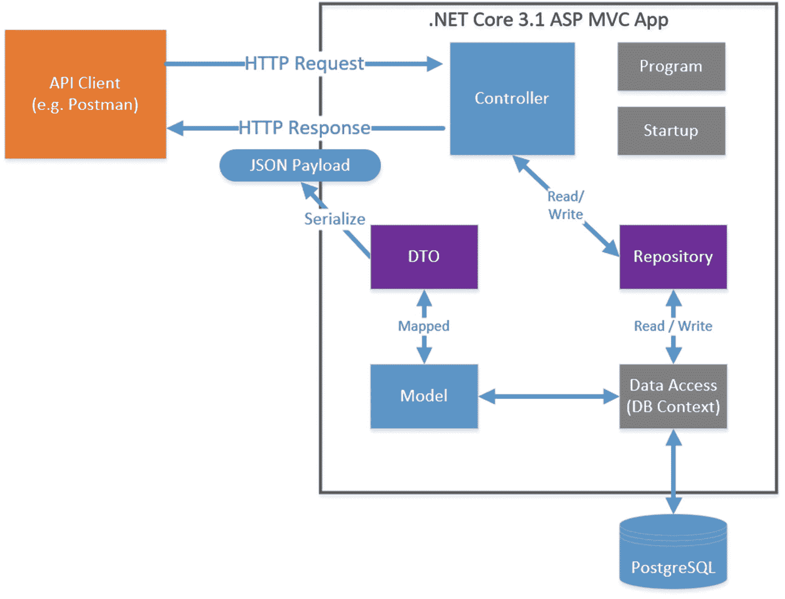
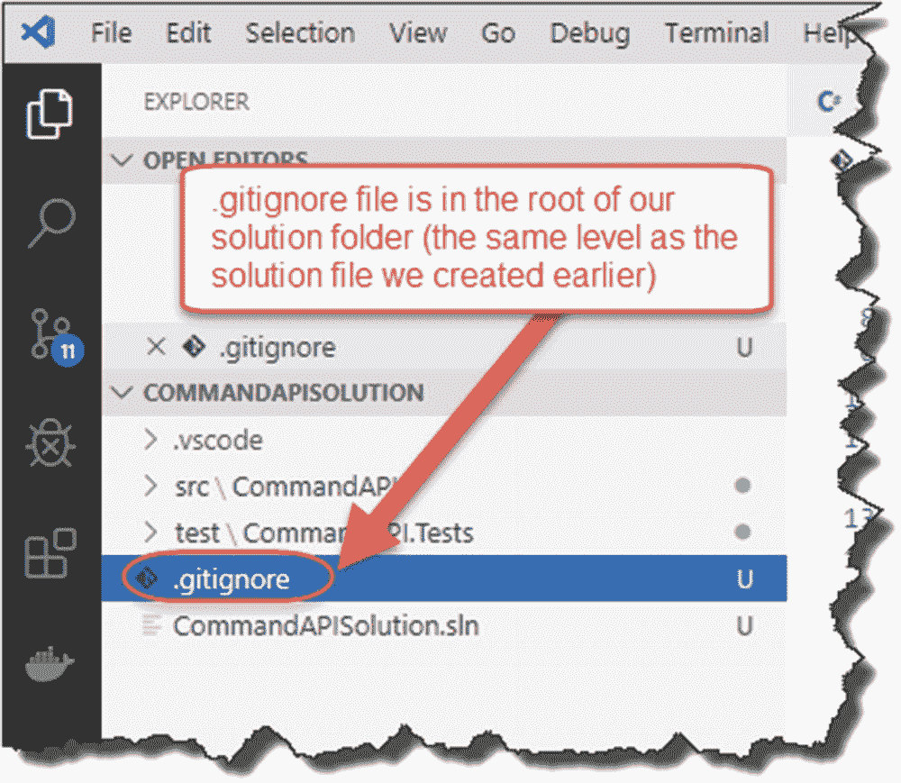
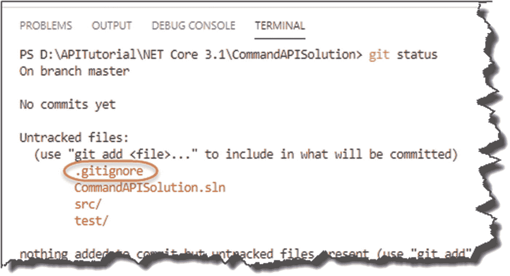

# 五、MVC 中的“C”

## 章节总结

在这一章中，我们将回顾模型-视图-控制器(MVC)模式的一些高级理论，详述我们的 API 应用架构，并开始编写我们的 API 控制器类。

### 完成后，你会

*   理解什么是 MVC 模式

*   了解我们的 API 应用架构，包括以下概念
    *   仓库

    *   数据传输对象

    *   数据库上下文

*   向我们的 API 项目添加一个控制器类。

*   创建一个返回“硬编码”JSON 的控制器动作(或者 API 端点，如果您愿意的话)。

*   将我们的解决方案置于源代码控制之下。

### 快速了解我的开发设置

我只想在这里对我的开发设置的当前状态进行水平设置，我将继续使用它:

*   我已经打开并运行了 VS 代码。

*   在 VS 代码中我已经打开了***command API solution***solution*文件夹*。

*   这将在左侧显示我的文件夹和文件树(包含我们的两个*项目*)。

*   我还使用 VS 代码中的集成终端来运行我的命令。

*   The integrated terminal I’m using is “PowerShell” – you can change this; see info box in the following.

    

    图 5-1

    我的 VS 代码设置

你可以很容易地在 VS 代码中改变终端/外壳/命令行类型。

1.  在 VS 代码中点击“F1”(这将打开 VS 代码中的“命令面板”)。

2.  在出现的提示符下键入 *shell* ，并选择“*终端:选择默认 Shell*

3.  然后，您可以从已安装的终端中进行选择。

#### 开始编码！

首先，让我们从一个非常基本的启动角度检查一下所有的东西都设置好了，并且工作正常。要从命令行类型执行此操作(确保您“位于”API 项目目录—***CommandAPI***)

```cs
dotnet run

```

您应该会看到 web 服务器以类似如下的输出启动。


图 5-2

第一次运行我们的 API

您可以看到 webserver 主机已经启动，并且正在分别监听 http 和 https 的端口 5000 和 5001。

要更改端口分配，可以编辑 ***属性*** 文件夹中的***launch settings . JSON***文件；尽管现在这样做没有任何好处。当我们在第 [8](08.html) 章中讨论设置运行时环境时，我们会更多地讨论这个文件。

如果您进入网络浏览器并导航到

`http://localhost:5000`

您将看到以下内容。


图 5-3

你好世界！

不是非常有用，但它确实告诉我们所有的东西都连接正确。查看我们的`Startup`类的`Configure`方法，我们可以看到这个响应来自哪里。


图 5-4

我们的问候来自哪里

对于那些使用过。NET 核心框架(对于那些还没有**的人，你可以忽略这个)，这看起来会和你之前看到的略有不同。而不是**

 ***   `services.AddMvc():`在我们的`ConfigurerServices`方法中

*   `app.UseMVC():`在我们的`Configure`方法中

    进一步讨论的 2.x 版和 3.x 版之间的差异。NET 核心框架可以在这里找到: [`https://docs.microsoft.com/en-us/aspnet/core/migration/22-to-30`](https://docs.microsoft.com/en-us/aspnet/core/migration/22-to-30%253Fview%253Daspnetcore-3.0) 。

*   `app.Run(async)`

    先前版本的框架也将利用

*   `app.UseEndPoints`

    你会看到

停止我们的主机监听(Windows 上的 Ctrl+C——对于 Linux/OSX 应该是一样的),并且*从我们的`Configure`方法中移除*高亮显示的代码段(如前所示)。添加显示在我们的`Startup`类旁边的突出显示的代码，确保更新`ConfigureServices`和`Configure`方法:

```cs
using Microsoft.AspNetCore.Builder;
using Microsoft.AspNetCore.Hosting;
using Microsoft.Extensions.DependencyInjection;
using Microsoft.Extensions.Hosting;

namespace CommandAPI
{
    public class Startup
    {

        public void ConfigureServices(IServiceCollection services)
        {
            //SECTION 1\. Add code below
            services.AddControllers();
        }

        public void Configure(IApplicationBuilder app, IWebHostEnvironment env)
        {
            if (env.IsDevelopment())
            {
                app.UseDeveloperExceptionPage();
            }

            app.UseRouting();

            app.UseEndpoints(endpoints =>
            {
                //SECTION 2\. Add code below
                endpoints.MapControllers();
            });
        }
    }
}

```

这段代码是做什么的？

1.  注册服务以支持在整个应用中使用“控制器”。如信息框中所述，在以前版本的。NET 核心框架，你会指定`services.AddMVC`。不用担心；下面我们将介绍什么是 MVC 模式。

2.  我们将控制器“映射”到我们的端点。这意味着我们利用控制器服务(在`ConfigureServices`方法中注册)作为*请求管道*中的端点。

Reminder

整个解决方案的代码可以在 GitHub 上找到:

[T2`https://github.com/binarythistle/Complete-ASP-NET-3-API-Tutorial-Book`](https://github.com/binarythistle/Complete-ASP-NET-3-API-Tutorial-Book)

正如我们之前所做的，运行项目(确保您在执行此 <sup>[1](#Fn1)</sup> 之前 ***保存文件**)*

```cs
dotnet run

```

现在，在 web 浏览器中导航到同一个 URL(http://localhost:5000)，我们应该得到“nothing”。

### 打电话给邮递员

现在可能是启动并运行 Postman 的好时机，因为它是一个有用的工具，可以让您更详细地了解正在发生的事情。

所以，如果你还没有这样做，去邮差网站( [`www.getpostman.com`](http://www.getpostman.com) )，下载最适合你的环境的版本，(我用的是 Windows 桌面客户端，但有一个 Chrome 插件和其他操作系统的桌面版本)。

我们想使用 Postman 向我们的 API 发出请求，所以单击“New”


图 5-5

在邮递员中开始新的请求

选择“请求”


图 5-6

创建基本请求

给请求一个简单的名称，例如，“测试请求”


图 5-7

说出你的要求

您还需要创建一个“集合”来容纳您想要创建的各种 API 请求(例如，GET、POST 等)。):


图 5-8

请求收集

1.  点击“+创建收藏”

2.  给它一个名称，例如，“CommandAPI”

3.  选择 OK(打勾)，并确保选择您新创建的收藏(未显示)。

4.  单击保存到命令 API。

然后，您应该有一个新的选项卡可以用来填充您的请求的详细信息。简单键入

```cs
http://localhost:5000

```

或者

```cs
https://localhost:5001

```

进入“输入请求 URL”文本框，确保从旁边的下拉列表中选择“GET”，然后点击 SEND 它应该看起来像下面这样。


图 5-9

在邮递员中获取请求结果

如果您点击了 Send，那么您应该会看到“404 Not Found”的响应；单击 headers 选项卡，您可以看到返回的标题。

稍后我们将返回到 Postman，但是现在让它启动、运行和测试是非常有用的。

我们打破了什么？

我们实际上没有破坏任何东西，但是我们已经迈出了设置应用的第一步，使用 MVC 模式来提供我们的 API 端点。

## 什么是 MVC？

我猜如果你在这里，你可能对 MVC(模型-视图-控制器)模式有所了解。如果没有，我在这里提供一个简短的解释，但作为

1.  关于 MVC 的文章已经有 1000 篇了。

2.  MVC 理论不是本教程的主要焦点。

我不会谈论太多细节。同样，我觉得通过构建一个解决方案，你会学到更多关于 MVC 的知识，而不是阅读冗长的文本解释。我认为当我们揭开下面的应用架构时，事情会变得更有意义。

### 模型视图控制器

简而言之，MVC 模式允许我们*分离应用不同部分的关注点*:

*   **M** odel(我们的领域数据)

*   **V** 视图(用户界面)

*   控制器(请求和动作)

事实上，为了使事情更简单，当我们开发一个 API 时，我们甚至不会有任何**V**view 工件。 <sup>[2](#Fn2)</sup> 这里展示了我们的 API 的这个架构的高级表示。



图 5-10

我们的 API 应用架构

同样值得注意的是，如果不清楚的话，MVC 模式仅仅是一个应用架构*模式*，它与技术实现无关。由于这恰好是一本关于特定技术的书(。NET Core)，我们覆盖如何。NET Core 实现 MVC 然而，MVC 模式还有其他使用不同框架和语言的实现。

### 模型、数据传输对象、存储库和数据访问

你可能对模型的概念很满意——它只是数据，对吗？是的，这很简单。因此，看着图 [5-10](#Fig10) 中的架构图，你会想什么是 DTO、存储库和数据库上下文。我不怪你——一开始我也很难区分这些概念。事实上，我们可以从我们的解决方案中省去 dto 和存储库，没有它们它也能工作。那么，为什么要包括他们呢？大问题；让我试着解释一下。

首先，在回答“为什么”之前，让我先回答“是什么”

#### 有什么区别？

让我们一步一步地了解这些类:

*   **Model** :表示我们应用的*内部域*数据(MVC 中的“M”)。

*   **数据传输对象**(**dto**):是我们的领域模型对我们的*外部消费者的*表示*，*意味着我们不会将内部实现细节(我们的模型)暴露给外部关注点。这有多种好处，我们将在后面讨论。

*   **数据访问**(又名**数据库上下文**):获取我们的模型，并将其表示(或“中介”)到一个*特定的持久层*(例如，PostgreSQL、SQL Server 等。).接下来，我将把我们的数据访问类称为“DB Context ”,这是一个取自“实体框架核心”的特定于技术的术语——别担心；稍后在第 7 章[中会有更多的介绍。](07.html)

*   **存储库**:为我们的应用提供一个*技术不可知的*(或不知道持久性)的永久存储数据视图。

那么，你从中得到了什么？主要概念(贯穿全书重复出现)是我们应该*将实现细节*从我们想要提供给消费者的*接口*或*契约*中分离出来。但是为什么这是一件好事呢？

#### 为什么脱钩是好的？

我之前提到过，当我们开始实现这些概念时，我们会更详细地讨论它，但简而言之，将我们的接口(或契约)从我们的实现中解耦会带来以下好处:

*   **安全性**:我们可能不希望向外部消费者公开我们的实现(想想我们的模型)中包含的潜在敏感数据。提供移除了敏感信息的外部表示(例如，DTO)解决了这一问题。

*   **改变敏捷性**:分离出我们的接口——它应该保持一致，以免破坏我们与消费者的“契约”——意味着我们可以在不影响接口的情况下改变我们的实现细节。这样，我们就有信心对市场需求做出快速反应，而不必担心破坏现有协议。当我们开始使用*依赖注入*和我们的*库*时，我们将更多地展示这个概念。

#### 将它整合在一起

在接下来的章节中，我们将利用 MVC 以及前面讨论的其他概念来

*   **章** [**5**](05.html) :创建一个 ***C*** *控制器*来管理我们所有的 API 请求(参见第 [3 章](03.html)中的 CRUD 动作)。

*   **章** [**6**](06.html) :创建一个 ***M*** *odel* 来内部表示我们的资源(在本例中是我们的命令行提示库)

*   **章节** [**6**](06.html) :创建一个**存储库**为我们的持久化数据提供一个技术不可知的视图。

*   **第** [**7**](07.html) 章:利用实体框架核心创建一个 **DB 上下文**，这将允许我们将模型保留到 PostgreSQL。

*   **章** [**9**](09.html) :创建 **DTO** 表示我们的模型供外部使用。

让我们在这里结束我们的架构概述(同样，不要担心——我们稍后将深入研究这些概念),然后继续创建我们的控制器。

## 我们的控制者

确保你在主 API 项目目录( ***CommandAPI*** )，在 ***CommandAPI*** 下创建一个名为“ ***控制器*** ”的文件夹作为子文件夹。


图 5-11

API 项目中的控制器文件夹

在您刚刚创建的 ***控制器*** 文件夹中，创建一个名为***commands controller . cs***的文件。

Quick Tip

如果你正在使用 VS 代码，你可以在 VS 代码目录浏览器中创建文件夹和文件。只要确保在创建时选择了正确的“父”文件夹。


图 5-12

用 VS 代码创建文件和文件夹

您的目录结构现在应该如下所示。


图 5-13

我们的目录结构

确保您在 ***命令控制器*** 文件后添加了一个“.”。cs”扩展名来表示它是一个 C# 文件。

我们的控制器文件的文件夹和命名约定都遵循标准的、传统的方法；这使得我们的应用对其他开发人员来说更具可读性；它还允许我们利用“约定胜于配置”的原则

现在，首先我们将在控制器中创建一个简单的“动作”,它将返回一些硬编码的 JSON(而不是序列化最终来自数据库的数据)。同样，这只是确保我们有一切连线正确。

一个控制器“动作”(我也可以称之为*端点*)映射到我们的 API CRUD 操作，如第 [3 章](03.html)所列；但是我们的第一个动作将返回一个简单的硬编码字符串。

您的`CommandsController`类中的代码现在应该是这样的:

```cs
using System.Collections.Generic;
using Microsoft.AspNetCore.Mvc;

namespace CommandAPI.Controllers
{
    [Route("api/[controller]")]
    [ApiController]
    public class CommandsController : ControllerBase
    {
        [HttpGet]
        public ActionResult<IEnumerable<string>> Get()
        {
            return new string[] {"this", "is", "hard", "coded"};
        }
    }
}

```

同样，如果你不想输入这个，代码可以在 GitHub 上找到: [`https://github.com/binarythistle/Complete-ASP-NET-3-API-Tutorial-Book`](https://github.com/binarythistle/Complete-ASP-NET-3-API-Tutorial-Book)

我们接下来会谈到这一切意味着什么，但首先让我们来构建它。

确保没有运行我们最近例子中的服务器(Ctrl + C 终止)，保存文件，然后键入

```cs
dotnet build

```

这个命令只是编译(或构建)代码。如果你有任何错误，它会在这里指出来；假设一切正常(这是应该的)，您应该看到以下内容。


图 5-14

成功的 API 运行

现在， ***运行*** 这个 app。

Learning Opportunity

我故意不去详述*那个*现在指挥前进；我们继续的时候你应该把这些东西捡起来。如果有疑问，请参考前面章节中关于如何*运行*您的代码(而不是像我们刚刚做的那样*构建*)的内容。

转到 Postman(如果您愿意，也可以使用 web 浏览器)，在 URL 框中键入

`http://localhost:5000/api/commands`

确保下拉(在邮差里)选中“获取”，然后点击“发送”；您应该会看到类似这样的内容。


图 5-15

我们的第一个 API 端点响应

1.  这是返回的硬编码 json 字符串。

2.  我们有一个 200 OK 的 HTTP 响应(基本上一切正常)。

我想从技术上来说，你可以说我们已经实现了一个服务于简单的“GET”请求的 API！很好，但我相信你们大多数人都想把这个例子讲得更深入一点。

**回到我们的代码**

好吧，那很好，但是我们实际上做了什么呢？让我们回到我们的代码，把它拆开。


图 5-16

深入探讨我们的第一个控制器动作

### 1.使用指令

我们在这里包括了两个 using 指令:

*   `System.Collections.Generic`(支持 IEnumerable)

*   `Microsoft.AspNetCore.Mvc`(支持下面详述的几乎所有其他东西)

### 2.从控制器基础继承

我们的控制器类继承自`ControllerBase`(它不提供我们不需要的视图支持)。如果您愿意，也可以从`Controller`继承，但是正如您可能猜到的，这为我们不需要的视图提供了额外的支持。

```cs
ControllerBase is further detailed on Microsoft Build.3

```

### 3.设置路由

正如您将看到的，当您使用 Postman 向我们的 API 发出 GET 请求时，您必须导航到

```cs
http://localhost:5000/api/commands

```

API 控制器的 URI 惯例是

```cs
http://<server_address>/api/<controller_name>

```

这里我们使用路线模式`/api/<controller_name>`沿着 URI 的主要部分。

为了实现这一点，我们用一个`[Route]`属性“装饰”了我们的`CommandsController`类:

```cs
 [Route("api/[controller]")]

```

你会注意到，当我们从*路线的角度*谈论我们控制器的名字时，我们使用的是“`Commands`”，而不是更完整的“`Commands` `Controlle` **r** ”。

的确，我们控制器的名字真的是“命令”；在我们的类定义中使用“控制器”后缀是一个超越约定的配置的例子。基本上，如果我们使用这种约定，它会使代码更容易阅读，也就是说，我们知道它是一个控制器类。

Warning!

我们已经使用`[controller]`“通配符”指定了我们的路由，正如我们之前解释的那样，它从我们的控制器名称(减去“控制器”部分)中动态地派生出该段路由。所以，在我们的例子中，这给了我们路线:

`api/commands`

这意味着如果你*因为某种原因改变了你的控制器*的名字，那么*的路线也会改变*。这可能会给我们的消费者带来意想不到的后果，实际上破坏了我们的合同，所以要小心！

您可以通过硬编码您的路线名称来“纠正”这种行为

`[Route("api/commands")]`

我现在将离开半动态声明的路由，因为我认为这是您在现场最有可能看到的，但是如果您更喜欢这种方式，可以随意更改为硬编码的方式。

### 4.APIController 属性

用这个属性修饰我们的类为我们的控制器提供了以下现成的行为:

*   属性路由

*   自动 HTTP 400 错误响应(例如，400 错误请求、405 不允许等。)

*   默认绑定源(稍后将详细介绍)

*   错误状态代码的问题详细信息

不强制使用它，但强烈推荐使用，因为它提供的默认行为真的很有用；关于这一点的进一步深入，请参考微软文档。 <sup>[4](#Fn4)</sup>

### 5.HttpGet 属性

回想一下本教程的开头，您会记得我们为 API 指定了标准的 CRUD 操作，并且这些操作中的每一个都与特定的 http 动词相关，例如 GET、POST、PUT 等。

用`[HttpGet]`修饰我们的第一个简单动作实际上只是指定我们的动作响应哪个动词。

您可以通过将 Postman 中的动词类型更改为“POST”并再次调用我们的 API 来测试这一点。由于我们的 API 控制器中没有定义响应 POST 的动作，我们将收到 4xx HTTP 错误响应。

如前所述，在我们的 API 中，动词属性(如 GET)与路由(如`api/commands` ) *的组合对于每个动作(端点)应该是唯一的*。

如果你回头看看我们在第 [3](03.html) 章中的 API 端点的完整列表，你会注意到事实确实如此。

### 6.我们的控制者行动

这是一个相当`expansive area,` <sup>[5](#Fn5)</sup> 并且有多种方式可以编写你的控制器动作。我刚刚选择了“`ActionResult`”返回类型，这是作为。网芯 2.1。

简而言之，每个 API CRUD 操作都有一个`ActionResult`返回类型，所以当我们完成时，我们将有六个返回类型。

#### 同步与异步？

在最近的例子中，我们的控制器动作是*同步的*，这意味着当它们被客户端(例如，Postman)调用时，它们将等待直到结果被返回，并且在这样做的时候*会占用一个线程*(把一个线程想象成 CPU 时间的一小部分)。一旦返回一个结果，该线程就被释放(回到线程池)，在那里它可以被其他操作重用。

同步操作的问题是，如果有足够多的同步操作(想想高流量 API)，最终所有可用的线程都将被线程池使用，*阻止*进一步的操作运行。这就是异步控制器动作的用武之地。

一个*异步*控制器动作不会等待一个长时间运行的操作(例如，复杂的数据库查询或网络上的调用)完成，而是在等待时将线程交还给池。当长时间运行的操作最终有了结果时，控制器动作会重新获取一个线程来完成操作。

简而言之，异步操作实际上是关于可伸缩性，而不是速度。仅仅使用异步控制器动作并不能改善完成 I/O 操作(例如，数据库查询)所需的时间。然而，它确实改善了我们可能耗尽线程(由于阻塞)的情况，这对伸缩有积极的意义。当应用于用户界面设计时，也有一些很好的可用性含义(你曾经使用过在执行长时间运行的操作时“冻结”的应用吗？).

我确实争论过在我们的例子中是否使用异步控制器动作；然而，为了与本书的“薄而宽”的方法保持一致，我认为它会引入不必要的复杂性，从而偏离本书的核心主旨，所以我现在省略了。

这一节已经占够篇幅了，继续吧！

## 源代码管理

好了，这是一个相当长的章节，我们已经覆盖了很多领域。在我们结束之前，我想介绍一下*源代码控制*的概念。

什么是源代码管理？

源代码管理实际上是关于以下两个概念:

1.  跟踪(并回滚)代码中的更改

2.  当代码有多个开发人员/贡献者时，协调那些变更(称为*持续集成*；我们将在第 12 章[中深入探讨这个问题](12.html)

总的想法是，在整个代码项目的生命周期中，会对源代码进行许多更改，我们确实需要一种方法来跟踪这些更改，原因包括但不限于

*   **需求可追溯性**:确保变更与所请求的特性/bug 修复相关联。

*   **发布说明**:总结我们的更改，以便我们可以发布我们应用的新发布说明。

*   **回滚**:如果我们知道什么改变了(我们破坏了什么)，我们可以(a)修复它或者(b)回滚改变——源代码控制系统允许我们这样做。

除了跟踪变更之外，使用源代码管理解决方案的另一个主要原因是，当多个开发人员同时工作时，要协调对代码库的变更。如果你是唯一一个为你的代码工作的人，你不会真的与自己发生冲突(通常不会)。当不止一个人对同一个代码库进行修改时会怎么样呢？如果没有覆盖彼此的更改，这怎么可能发生呢？同样，这也是一个源代码控制解决方案发挥作用的地方——它协调那些变更，并在它们出现时识别冲突。

现在，我们不打算深入探究源代码控制的工作原理，但是我们打算将我们的项目置于“源代码控制之下”,这有两个原因:

1.  向你介绍这个概念

2.  因此，我们可以通过 CI/CD <sup>[6](#Fn6)</sup> 管道将我们的应用自动部署到生产环境中——更多信息请参见第 12 章[第 12 章](12.html)

### Git 和 GitHub

现在，有各种各样的源代码控制解决方案，但是到目前为止最常见的是 Git(以及基于 Git 的解决方案)，以至于“源代码控制”和 Git 几乎是同义词。想想“吸尘器”和“胡佛”(或者现在的戴森)，你就明白了。

#### 有什么区别？

Git 是源代码控制系统，它

*   您可以在本地计算机上运行来跟踪本地代码更改

*   您可以让在服务器上运行来管理并行的、分布式的团队变更

虽然您可以在分布式团队环境中使用 Git，但是有许多公司已经进一步将 Git 放入云中，例如

*   GitHub(可能是最知名的，现在被微软收购了)

*   Bitbucket(来自 Atlassian——吉拉和汇流的制造者)

*   Gitlabs

作为本教程的一部分，我们将同时使用 Git(在本地机器上)和 GitHub(如第 [2](02.html) 章所述)。

## 设置本地 Git Repo

如果您按照第 [2](02.html) 章所述进行了操作，您应该已经在本地运行了 Git 如果没有，或者你不确定，请跳回第二章[看一看。](02.html)

在终端/命令行*的*主**解决方案**目录中，( ***命令应用解决方案*** )，键入(如果您的 API 应用仍在运行，您可能希望通过按 Ctrl + c 来停止它)

```cs
git init

```

这应该会在*解决方案目录*中初始化一个本地 Git 存储库，该存储库将跟踪一个名为 ***的隐藏文件夹中的代码变更。git*** (注意句号“)前缀“git”)。

现在打字

```cs
git status

```

这将显示您目录中所有“未跟踪”的文件(基本上是不受源代码控制的文件)；在这个阶段，这就是一切。


图 5-17

我们新的 Git Repo 中未跟踪的文件

### 。gitignore file 忽略档案

在我们开始跟踪我们的解决方案文件(并将它们置于源代码控制之下)之前，有一些文件您不应该置于源代码控制之下，特别是那些作为构建的结果而“生成”的文件，主要是因为它们是需求之外的(它们不是“源”文件)！).

为了“忽略”这些文件类型，您在您的“根”解决方案目录中创建了一个名为 ***的文件。gitignore*** ，(再次注意句号“)开始的时候)。现在，这可能成为你想包含或不包含的个人选择，但我提供了一个例子，你可以使用(或完全忽略——请原谅这个双关语！):

```cs
*.swp
*.*~
project.lock.json
.DS_Store
*.pyc

# Visual Studio Code
.VS Code

# User-specific files
*.suo
*.user
*.userosscache
*.sln.docstates

# Build results
[Dd]ebug/
[Dd]ebugPublic/
[Rr]elease/
[Rr]eleases/
x64/
x86/
build/
bld/
[Bb]in/
[Oo]bj/
msbuild.log
msbuild.err
msbuild.wrn

# Visual Studio
.vs/

# Compiled Source
*.com
*.class
*.dll
*.exe
*.o
*.so

```

所以如果要用一个 ***。gitignore*** 文件(我推荐它——您不希望将编译后的资产放在*源代码库*中),创建一个，并将其放在您的解决方案目录的根目录中，就像我在这里所做的那样(这显示了 VS 代码中的文件)。



图 5-18

我们的。gitignore file 忽略档案

再次键入`git status`,您应该会看到这个文件也是“未跟踪”的文件之一。



图 5-19

未被追踪。gitignore 文件

### 跟踪并提交您的文件

好了，我们要跟踪“一切”(除了那些被忽略的文件！);为此，请键入(确保您输入了尾随句点“.”)

```cs
git add .

```

然后

```cs
git status

```

您应该看到以下内容。


图 5-20

准备提交的跟踪文件

这些文件正在被跟踪并“准备”提交。

最后，我们希望通过键入以下命令来“提交”更改(实际上是锁定它们)

```cs
git commit -m "Initial Commit"

```

这将提交带有注释(或“消息”)的代码；因此使用了-m 开关)。您通常使用它来描述您对代码所做的更改或添加(稍后将详细介绍)；您应该看到以下内容。


图 5-21

提交的文件

快速添加一个`git status`，您应该会看到以下内容。


图 5-22

没有发生进一步的变化

Celebration Checkpoint

干得好！我们基本上已经将我们的解决方案置于*本地*源代码控制之下，并且已经在我们的第一次提交中将我们所有的“变更”提交给我们的主分支。

如果这是你第一次看到或使用 Git，我建议你暂停阅读，在谷歌上搜索一些额外的资源。这本身就是一个相当大的主题，我不想在这里深入讨论，主要是因为我会重复非核心内容。

当然，我将在本教程中介绍完成这项工作所需的 Git 数量；进一步阅读纯属可选！

Git 网站还允许你下载完整的 *Pro Git* 电子书；你可以在这里找到: [`https://git-scm.com/book/en/v2`](https://git-scm.com/book/en/v2)

## 设置您的 GitHub Repo

好了，上一节带您完成了本地 Git 存储库的创建，这对于跟踪本地机器上的代码变更是很好的。然而，如果你是一个更大团队的一部分，或者甚至是一个程序员，并且想要使用 Azure DevOps(正如我们将在第 [12](12.html) 、 [13](13.html) 和 [14](14.html) 章中所做的)，我们需要配置一个“远程 Git 库”

*   从我们的本地机器推送到。

*   链接到 Azure DevOps 构建管道，启动构建过程。

跳到 [`https://github.com`](https://github.com) (如果你还没有注册账户的话)；创建帐户/登录后，您应该会看到自己的登录页面；这是我的。


图 5-23

GitHub 登录页面

### 创建 GitHub 存储库

在网站的右上角，点击你的脸(或者任何默认图片，如果你不像我一样自恋的话)，然后选择“你的存储库”


图 5-24

选择您的存储库

然后单击“New ”,您应该会看到“Create a new repository”屏幕。


图 5-25

创建您的仓库

给存储库起一个名字(我只是把我的命名为 ***CommandAPI*** ，但是你可以把它命名为任何你喜欢的名字)，并且选择 Public 或者 Private。对于本教程，我强烈推荐选择 *Public* ，主要是因为这是我开发本教程的选项——我知道它适用于本书的后面部分。事实上，您在这里选择的选项非常重要，因为它会影响我们在第 [12](12.html) 章中设置 CI/CD 渠道。

然后点击“创建存储库”；您应该看到以下内容。


图 5-26

GitHub 存储库已创建

该页面详细介绍了如何将本地存储库链接并推送至远程存储库(我圈出的部分)。因此，复制该文本，并将其粘贴到您的终端窗口中(您需要确保您仍然在我们之前工作的根解决方案文件夹中)。


图 5-27

添加远程回购并推送您的本地回购

Les’ Personal Anecdote

当您发出第二个命令:`git push -u origin master.`时，可能会要求您向 GitHub 进行身份验证

我在 Windows 上遇到了一些问题，直到我更新了“Windows 的 Git 凭证管理器”；我更新后，一切顺利。谷歌“Git 凭证管理器 Windows”如果你有认证问题，并安装最新版本！

### 刚刚发生了什么？

嗯，简而言之

*   我们用本地 repo“注册”了我们的远程 GitHub repo(第一个命令)。

*   然后，我们将本地回购推送到 GitHub(第二个命令)。

Note

第一个命令行只需要发出一次；第二个我们将在本教程的剩余部分更多地使用。

如果你刷新你的 GitHub 库页面，看到的不是你刚刚发布的指令，而是我们的解决方案！


图 5-28

我们的代码现在在 GitHub 上

你会注意到“初始提交”是针对每个文件和文件夹的注释——是不是很熟悉？

这一章就到这里，干得好！

<aside aria-label="Footnotes" class="FootnoteSection" epub:type="footnotes">Footnotes [1](#Fn1_source)

很多时候，我在做了更改后运行代码，但这些更改并没有反映出来。是的，没错——没有保存文件。

  [2](#Fn2_source)

您可能会认为，从概念的角度来看，序列化的 JSON 有效负载是一个“视图”。

  [3](#Fn3_source)

[https:// docs。微软。com/ en-us/ dotnet/ api/ microsoft。aspnetcore。mvc。controllerbase？view= aspnetcore-3。1](https://docs.microsoft.com/en-us/dotnet/api/microsoft.aspnetcore.mvc.controllerbase%253Fview%253Daspnetcore-3.1)

  [4](#Fn4_source)

[T2`https://docs.microsoft.com/en-us/aspnet/core/web-api/index?view=aspnetcore-2.2#annotation-with-apicontroller-attribute`](https://docs.microsoft.com/en-us/aspnet/core/web-api/index%253Fview%253Daspnetcore-2.2%2523annotation-with-apicontroller-attribute)

  [5](#Fn5_source)

[T2`https://docs.microsoft.com/en-us/aspnet/core/web-api/action-return-types?view=aspnetcore-3.1`](https://docs.microsoft.com/en-us/aspnet/core/web-api/action-return-types%253Fview%253Daspnetcore-3.1)

  [6](#Fn6_source)

持续集成/持续交付(或部署)。

 </aside>**