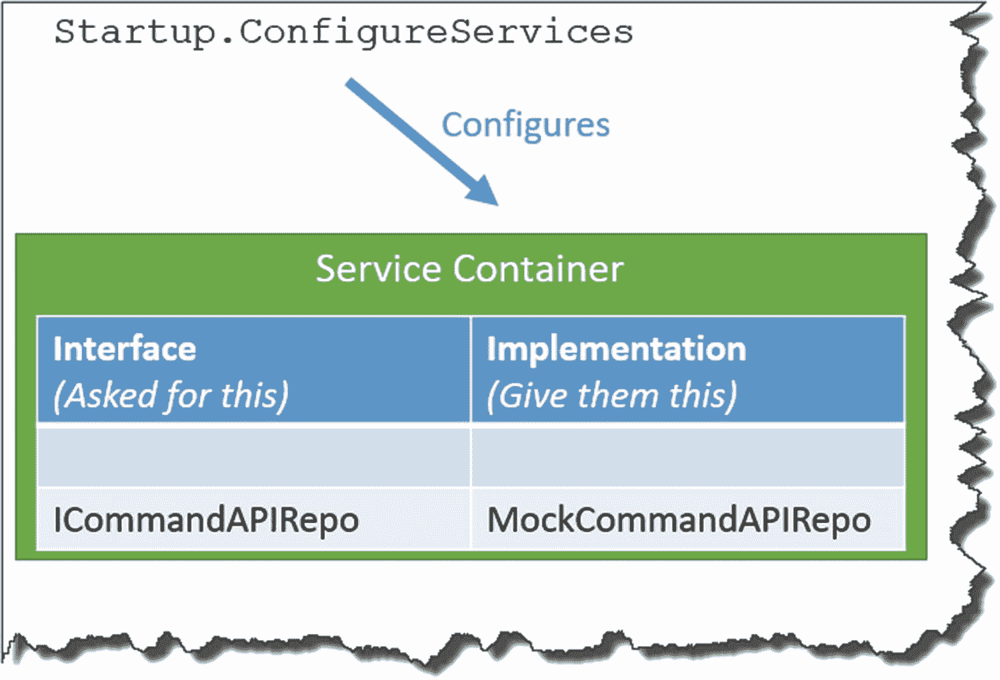

# 六、我们的模型和存储库

## 章节总结

在这一章中，我们将把“数据”引入我们的 API，所以我们将从我们的模型和存储库类开始我们的旅程。

### 完成后，你会

*   理解什么是“模型”类，并编写一个代码。

*   定义我们的存储库接口，并实现它的一个“模拟”实例。

*   理解我们如何使用*依赖注入*将接口从实现中分离出来。

## 我们的模型

好了，我们已经完成了 MVC 模式中的“控制器”部分(嗯，一点点；它还没有完全完成，但是基础工作已经做好了)，所以让我们把注意力转向等式的模型部分。

就像我们的控制器一样，我们要做的第一件事是在我们的主项目目录中创建一个 ***模型*** 文件夹。

完成后，在该文件夹中创建一个文件，命名为***command . cs***；您的目录和文件结构应该如下所示。


图 6-1

模型文件夹和命令类

创建完成后，让我们编写“命令”模型——这非常简单，完成后应该是这样的:

```cs
namespace CommandAPI.Models
{
    public class Command
    {
        public int Id {get; set;}
        public string HowTo {get; set;}
        public string Platform {get; set;}
        public string CommandLine {get; set;}
    }
}

```

如承诺的，很简单；只要确保在代码顶部指定了正确的名称空间即可:

```cs
CommandAPI.Models

```

这个类的其余部分是一个简单的模型，我们将使用它来“建模”我们的命令行片段。可能唯一值得注意的是`Id`属性。

当我们最终在 PostgreSQL 数据库中创建一个表时，这将形成主键(注意这是实体框架核心所要求的。)

此外，它符合“约定优于配置”的概念也就是说，我们可以用不同的方式命名这个属性，但是它可能需要进一步的配置，以便实体框架可以将它作为主键属性使用。然而，这样命名意味着我们不需要*来做这件事。*

### 数据注释

我们可以像那样保留我们的模型类，但是当我们开始使用它时，特别是对于创建和更新操作，我们希望确保我们指定了模型的强制属性和非强制属性。例如，在没有为我们的`CommandLine`属性指定一些数据的情况下，向我们的解决方案中添加一个命令行片段会有任何价值吗？可能不会。我们通过给我们的类添加一些数据注释来解决这个问题。

我们可以用数据注释来修饰我们的类属性，以指定诸如

*   需要还是不需要？

*   我们的字符串的最大长度

*   该属性是否应定义为主键

*   等等。

为了在命令类中使用它们，请对我们的代码进行以下更新，确保包含如下所示的 using 指令:

```cs
using System.ComponentModel.DataAnnotations;

namespace CommandAPI.Models
{
    public class Command
    {
        [Key]
        [Required]
        public int Id {get; set;}

        [Required]
        [MaxLength(250)]
        public string HowTo {get; set;}

        [Required]
        public string Platform {get; set;}

        [Required]
        public string CommandLine {get; set;}
    }
}

```

添加的数据注释应该是不言自明的:

*   所有属性都是必需的(它们不能为空)。

*   我们的`Id`属性是一个主键。

*   另外，`HowTo`属性最多只能有 250 个字符。

有了我们的注释，当我们稍后创建模型的实例时，如果有任何一个错误没有遵守，就会抛出一个验证错误。它们还提供了一种生成数据库模式的方法，我们将在第 [7](07.html) 章中讨论。

由于我们对代码做了一个简单但重要的更改，让我们将文件添加到源代码控制中，提交它，然后推送到 GitHub 为此，按顺序发出以下命令(确保您在解决方案文件夹***commandapi Solution***):

```cs
git add .
git commit -m “Added Command Model to API Project”
git push origin master

```

这些你以前都用过，但是要重申

*   第一个命令将所有文件添加到我们的本地 Git repo(这意味着我们新的 ***Command.cs*** 文件)。

*   第二个命令用消息提交代码。

*   第三个命令将提交推送到 GitHub。

如果一切正常，您应该看到提交已经被推送到 GitHub 见下文。


图 6-2

我们忠诚的模范班级

Learning Opportunity

查看之前展示的 GitHub 页面，您如何判断我们的解决方案的哪些部分包含在上次提交中，哪些部分只包含在*初始提交*中？

## 我们的仓库

快速回顾一下我们的应用架构，我已经概述了我们已经开始或者在我们的模型中已经完成的组件。


图 6-3

通过我们的架构取得进展

这一切仍然有点脱节；来回顾一下

*   启动当前返回硬编码数据的控制器

*   创造了我们的模型

我们旅程的下一步是定义我们的*存储库接口*，它将为我们的控制器提供一种技术不可知的方式来获取数据。

### 什么是接口？

一个界面就像它听起来一样；这是一个*规范*，用于说明*我们希望它提供什么*功能(在这种情况下是我们的控制器)，但我们没有详细说明*将如何提供*——这将在后面介绍。它本质上是一个协议，或者说*契约*，与该接口的消费者。

当我们考虑我们的库接口*应该*向我们的控制器提供什么方法时(还不要考虑如何提供)，我们可以回头看看第 [3](03.html) 章中的 CRUD 动作来获得一些指导。

<colgroup><col class="tcol1 align-left"> <col class="tcol2 align-left"> <col class="tcol3 align-left"> <col class="tcol4 align-left"></colgroup> 
| 

**动词**

 | 

上呼吸道感染

 | 

**操作**

 | 

**描述**

 |
| --- | --- | --- | --- |
| 得到 | /API/命令 | 阅读 | 读取所有命令资源 |
| 得到 | /API/命令/{Id} | 阅读 | 读取单个资源(通过 Id) |
| 邮政 | /API/命令 | 创造 | 创建新资源 |
| 放 | /API/命令/{Id} | 更新(完整) | 更新单个资源的所有内容(按 Id) |
| 修补 | /API/命令/{Id} | 更新(部分) | 更新单个资源的一部分(按 Id) |
| 删除 | /API/命令/{Id} | 删除 | 删除单个资源(按 Id) |

在这种情况下，它们几乎直接决定了我们存储库应该提供什么:

*   返回所有命令的集合。

*   返回单个命令(基于其 Id)。

*   创建新的命令资源。

*   更新现有的命令资源(包括上传和修补)。

*   删除现有的命令资源。

要开始实现我们的存储库，回到我们的 API 项目根(在 ***CommandAPI*** 文件夹中)，创建另一个文件夹并将其命名为 ***Data*** ，如下所示。


图 6-4

数据文件夹将保存我们的存储库接口

在这个文件夹中，创建一个文件，命名为***icommandapirepo . cs***。


图 6-5

我们的 ICommanderRepo.cs 文件

在该文件中，添加以下代码:

```cs
using System.Collections.Generic;
using CommandAPI.Models;

namespace CommandAPI.Data
{
    public interface ICommandAPIRepo
    {
        bool SaveChanges();

        IEnumerable<Command> GetAllCommands();
        Command GetCommandById(int id);
        void CreateCommand(Command cmd);
        void UpdateCommand(Command cmd);
        void DeleteCommand(Command cmd);
    }
}

```

您的文件应该如下所示；确保您**保存了文件**，让我们看看我们都做了些什么。


图 6-6

ICommandAPIRepo 接口

1.  使用指令，注意我们已经为模型引入了名称空间。

2.  我们指定一个 public `interface`并给它一个以大写字母“I”开头的名字来表示它是一个接口。

3.  我们指定我们的存储库应该提供一个“保存变更”的方法；暂时先别说这个，我们会在第 7 章[谈到实体框架核心的时候再来讨论。](07.html)

4.  第 4 节定义了该接口的使用者可以用来获取和操作数据的所有其他方法签名。它们还有另一个用途，我将在下一节详细介绍。

### 实施呢？

这是我们完整的存储库接口。是的，没错；完成了，完全完成了。所以，你的下一个问题(当我学习接口的时候，这是我的下一个问题)将会是:好的，但是事情在哪里“完成”？

好问题！

再次强调这一点，我们的接口只是消费者的一个规范(或契约)。我们仍然需要用一个*具体类*来*实现那个契约的*。这就是使用接口的力量和美妙之处:我们可以创建多个*实现*(具体类)来提供相同的接口，但是消费者不知道或者不关心正在使用的实现。他们关心的只是界面和它最终提供给他们的东西。

还在迷茫？让我们来看一个例子。

#### 我们的模拟存储库实现

我们将创建一个具体的类，使用我们的模型实现我们的接口；然而，我们在这个阶段只是使用“模拟”数据(我们将在下一章创建我们接口的另一个实现来使用“真实”数据)。

因此，在我们放置存储库接口定义的同一个 ***数据*** 文件夹中，创建一个名为***mockcommandapirepo . cs***的新文件，并添加以下代码:

```cs
using System.Collections.Generic;
using CommandAPI.Models;

namespace CommandAPI.Data
{
    public class MockCommandAPIRepo : ICommandAPIRepo
    {

    }
}

```

您应该在编辑器中看到类似这样的内容。


图 6-7

我们具体的阶级定义是抱怨

我们已经创建了一个公共类定义，并指定我们希望它实现`ICommanderRepo`，如

```cs
: ICommanderRepo

```

我们可以看到它在抱怨。这是因为我们还没有“实现”任何东西。如果您使用的是 VS 代码或 Visual Studio，请将光标放在抱怨部分，然后按

```cs
CTRL + .

```

这将带来一些关于解决方案的有益建议；我们希望选择第一个选项“实现接口”，如下图所示。


图 6-8

总是感谢帮助！

这应该会为我们的类生成一些占位符实现代码。


图 6-9

自动生成的实现代码

如您所见，它为我们的接口成员提供了所有的方法签名，并用一个`throw new System.NotImpementedException();`填充它们

在我们的例子中，我们将只更新我们的两个“read”方法:

*   `GetAllCommands`

*   `GetCommandById`

这足以证明使用接口和扩展依赖注入的核心概念。因此，在这两个方法中，添加如下所示的代码，记住完成后保存您的工作:

```cs
.
.
.
public IEnumerable<Command> GetAllCommands(){
  var commands = new List<Command>
  {
    new Command{
      Id=0, HowTo="How to generate a migration",
      CommandLine="dotnet ef migrations add <Name of Migration>",
      Platform=".Net Core EF"},
    new Command{
      Id=1, HowTo="Run Migrations",
      CommandLine="dotnet ef database update",
      Platform=".Net Core EF"},
    new Command{
      Id=2, HowTo="List active migrations",
      CommandLine="dotnet ef migrations list",
      Platform=".Net Core EF"}
  };
  return commands;
}

public Command GetCommandById(int id){
  return new Command{
    Id=0, HowTo="How to generate a migration",
    CommandLine="dotnet ef migrations add <Name of Migration>",
    Platform=".Net Core EF"};
}
.
.
.

```

这样做的目的是获取我们的模型类，并使用它来创建一些简单的模拟数据(同样是硬编码的)，并在调用这两个方法时返回它。这并不惊天动地，但它是我们的存储库接口的一个实现。

我们现在需要继续使用控制器内部的`ICommandAPIRepo`接口(通过扩展使用`MockCommandAPIRepo`具体类)。

为此，我们使用依赖注入。

## 依赖注入

依赖注入(DI)让许多开发人员(包括我自己)害怕使用它，但是一旦你掌握了这个概念，它不仅非常简单，而且非常强大，你会*想要*使用它。

在这种情况下，更容易的是，DI 被嵌入到 ASP.NET Core 的核心，因此我们可以毫不费力地快速启动并运行它。接下来，我将带您进行一个快速的理论概述；然后我们将在我们的项目中实际使用 DI(实际上，我们将在整个教程中继续使用它)。

同样，与本教程中的许多概念和技术一样，您可以写满一整本关于 DI 的书，我在这里不打算这样做。如果你想深入了解这个话题，超出我下面的概述，MSDN 大学的博士们是相当不错的。

### 回到起点(上)

谈论迪在。NET Core，我们需要回到我们的`Startup`类，特别是`ConfigureServices`方法。


图 6-10

启动类序列

回想一下，我们的“服务”是在`ConfigureServices`方法中注册的(在这种情况下，将服务看作是*的一个接口和它的一个实现*)。但是我们所说的*注册*到底是什么意思呢？

当我们谈论注册服务时，我们真正谈论的是一种叫做服务容器的东西；这是我们“注册”服务的地方。或者换句话说，这是我们告诉 DI 系统将一个接口关联到一个给定的具体类的地方。见下图。



图 6-11

注册了我们的存储库服务的服务容器

一旦我们在服务容器中注册了我们的服务，每当我们请求从应用中的其他地方使用一个给定的接口时，DI 系统将在它的位置上提供或“注入”我们与该接口相关联的具体类(也称为“依赖”)。

这意味着如果我们需要将具体的类换成其他的实现，我们只需要在一个地方进行修改(C `onfigureServices`方法)；我们代码的其余部分不需要改变。

在本教程中，我们将遵循这一实践，首先针对`ICommandAPIRepo`接口注册我们的模拟存储库实现；然后我们将在下一章把它换成更有用的东西，而不需要改变任何其他代码(除了注册)。

这种接口(契约)与实现的解耦意味着，随着代码变大，我们的代码更容易维护。

够理论；我们编码吧。

### 应用依赖注入

回到我们的 API 项目，打开`Startup`类，并将以下代码添加到我们的`ConfigureServices`方法中:

```cs
public void ConfigureServices(IServiceCollection services)
{
  services.AddControllers();

  //Add the code below
  services.AddScoped<ICommandAPIRepo, MockCommandAPIRepo>();
}

```

代码非常简单；它使用服务集合:`services,`向`MockCommandAPIRepo`注册我们的`ICommandAPIRepo`。唯一的另一个新颖之处是使用了`AddScoped`方法。

这与所谓的“服务生存期”有关，它本质上告诉 DI 系统应该如何提供通过 DI 请求的服务；有三种方法可用:

*   **AddTransient** :每次从服务容器请求服务时都会创建一个服务。

*   **AddScoped** :每个客户端请求(连接)创建一次服务。

*   **AddSingleton** :服务创建一次，重用一次。

除了我刚刚概述的，我觉得我们可能会偏离我们的核心主题:构建 API！所以，我们暂时把它放在这里。如果你想了解更多信息，请参考前面提到的微软文档。

好了，现在我们已经注册了我们的服务，下一步是从我们的控制器内部使用它——我们怎么做呢？

#### 构造函数依赖注入

老实说，当我学习 DI 的时候，正是这一点让我犯了一个错误，所以我会尽可能清晰地描述它是如何工作的。

我们不能像对待普通类那样“新建”一个接口；见图 [6-12](#Fig12) 。


图 6-12

你不能写这个代码！

您将得到一个类似“不能创建抽象类或接口的实例”的错误。你可以回复到“重新创建”我们的`MockCommandAPIRepo`类的一个具体实例，但是那会破坏我们刚刚讨论的整个目的。那么我们该怎么做呢？

答案是，我们必须给 DI 系统一个*入口点*，在那里它可以执行“依赖注入”，在这种情况下，这意味着为我们的控制器创建一个类构造器，并提供`ICommandAPIRepo`作为必需的输入参数。我们称之为*构造函数依赖注入*。

非常小心地注意下面的*构造函数依赖注入*代码模式；正如您将看到的，这种模式在我们的代码以及其他项目中被反复使用。

让我们实现这一点。回到我们的 API 项目，打开我们的`CommandsController`类，添加下面的构造函数代码(确保也添加了新的`using`语句):

```cs
// Remember this using statement
using CommandAPI.Data;
.
.
.
namespace CommandAPI.Controllers
{
  [Route("api/[controller]")]
  [ApiController]
  public class CommandsController : ControllerBase
  {
    //Add the following code to our class

    private readonly ICommandAPIRepo _repository;

    public CommandsController(ICommandAPIRepo repository)
    {
      _repository = repository;
    }
.
.
.

```

让我们来看看发生了什么。


图 6-13

构造函数依赖注入模式

1.  添加新的 using 语句以引用`ICommandAPIRepo`。

2.  我们创建了一个私有的只读字段`_repository`，它将在我们的构造函数中被赋予注入的`MockCommandAPIRepo`对象，并在剩下的代码中使用。

3.  当我们想使用控制器时，将调用类构造函数。

4.  当构造函数被调用时，当我们请求一个`ICommandAPIRepo`的实例时，DI 系统将开始动作并注入所需的依赖项。这就是*构造函数依赖注入*。

5.  我们将注入的依赖项(在本例中为`MockCommandAPIRepo`)分配给我们的私有字段(参见第 1 点)。

差不多就是这样了！然后我们可以使用`_repository`来利用我们的具体实现类，在本例中是`MockCommandAPIRepo`。

正如我前面提到的，在本教程的剩余部分，我们将多次重用这个模式；你还会在其他项目的代码中看到它——请注意。

#### 更新我们的控制器

我们将通过使用我们拥有的模拟存储库实现来实现我们的两个“读取”API 控制器动作，从而结束这一章。为了明确起见，我们将实施以下端点。

<colgroup><col class="tcol1 align-left"> <col class="tcol2 align-left"> <col class="tcol3 align-left"> <col class="tcol4 align-left"></colgroup> 
| 

**动词**

 | 

上呼吸道感染

 | 

**操作**

 | 

**描述**

 |
| --- | --- | --- | --- |
| 得到 | /API/命令 | 阅读 | 读取所有命令资源 |
| 得到 | /API/命令/{Id} | 阅读 | 读取单个资源(通过 Id) |

我们将从实现返回所有命令资源集合的端点开始，所以回到我们的控制器，首先 ***移除*** 我们现有的控制器动作。


图 6-14

移除我们的旧控制器动作

在它的位置，添加以下代码，记住在类的顶部也添加必需的`using`语句:

```cs
// Remember this using statement
using CommandAPI.Models;
.
.
.
namespace CommandAPI.Controllers
{
  [Route("api/[controller]")]
  [ApiController]
  public class CommandsController : ControllerBase
  {
    private readonly ICommandAPIRepo _repository;

    public CommandsController(ICommandAPIRepo repository)
    {
      _repository = repository;
    }

    //Add the following code
    [HttpGet]
    public ActionResult<IEnumerable<Command>> GetAllCommands()
    {
      var commandItems = _repository.GetAllCommands();

      return Ok(commandItems);
    }
.
.
.

```

我认为代码相对简单，但是让我们一步一步来。


图 6-15

使用我们的存储库的新控制器动作

1.  控制器动作响应 GET 动词。

2.  控制器动作应该返回一个`Command`对象的枚举(`IEnumerable`)。

3.  我们调用存储库上的`GetAllCommands`,并用结果填充一个局部变量。

4.  我们返回一个 HTTP 200 结果(OK)并传回我们的结果集。

确保保存所有内容，运行代码，并从 Postman 调用端点。


图 6-16

成功的 API 端点结果

1.  要获取的谓词集。

2.  我们的 URI 和我们以前用过的一模一样。

3.  我们得到 200 OK 状态结果。

4.  我们有从模拟存储库返回的硬编码数据！

Celebration Checkpoint

这实际上是一个非常重要的检查点！我们已经实现了我们的存储库接口，创建并使用了它的具体(模拟)实现，并通过依赖注入在我们的控制器中使用它！

给自己五颗金星和鼓励。

在本节中，我们还要实现一个控制器动作:通过提供其`Id`来返回单个资源。回到控制器中，添加以下代码来实现:

```cs
.
.
.
[HttpGet]
public ActionResult<IEnumerable<Command>> GetAllCommands()
{
  var commandItems = _repository.GetAllCommands();
  return Ok(commandItems);
}

//Add the following code for our second ActionResult
[HttpGet("{id}")]
public ActionResult<Command> GetCommandById(int id)
{
  var commandItem = _repository.GetCommandById(id);
  if (commandItem == null)
  {
    return NotFound();
  }
  return Ok(commandItem);
}
.
.
.

```

这里还有更多的东西。我们来复习一下。


图 6-17

GetCommandByID endpoint

1.  这个控制器动作的路由包括一个额外的路由参数，在本例中是我们想要检索的资源的`Id`；我们可以在`HttpGet`属性中指定这一点，如下所示。

2.  控制器动作需要一个`id`作为参数传入(这来自我们的 route 参见第 1 点)并返回一个`Command`类型的`ActionResult`。

3.  我们调用存储库上的`GetCommandByID`,从我们的路由传入`Id`,将结果存储在一个局部变量中。

4.  我们检查结果是否为空，如果是，则返回 404 Not Found 结果。

5.  否则，如果我们有一个命令对象，我们返回 200 OK 和结果。

Note

我们的模拟存储库将总是返回一个结果，而不管我们传入什么内容，因此在这种情况下，null check 永远不会返回 false。当我们在第 7 章[的](07.html)中谈到我们“真正的”存储库实现时，这种情况将会改变。

让我们通过在 Postman 中测试来检查我们的代码；请注意，我们需要的路线是

```cs
/api/commands/n

```

其中 *`n`* 为整数值。


图 6-18

返回了单个命令资源

1.  我们仍然使用 GET 请求。

2.  我们的 URI 已经改变，以反映我们需要使用的路线，以达到我们的终点。

3.  检索到 200 OK 状态。

4.  返回了单个资源。

我们将暂时在这里结束这一章，因为我们已经涉及了很多领域，但是我们将在以后讨论实体框架核心、数据传输对象和单元测试时再来讨论这两个控制器动作。

不过在我们结束之前，记得保存所有内容(确保您在主*解决方案*文件夹 ***命令和解决方案*** ):

*   `git add .`

*   `git commit -m “Added Model and Mock Repository”`

*   `git push origin master`

用我们的更改更新我们的 Git 存储库(本地和远程)。

在下一章中，我们将继续使用保存在数据库后端的“真实”数据，而不是依赖硬编码的模拟数据。

<aside aria-label="Footnotes" class="FootnoteSection" epub:type="footnotes">Footnotes [1](#Fn1_source)

[https:// docs。微软。com/en-us/aspnet/core/fundamentals/dependency-injection？view= aspnetcore-3。1](https://docs.microsoft.com/en-us/aspnet/core/fundamentals/dependency-injection%253Fview%253Daspnetcore-3.1)

 </aside>