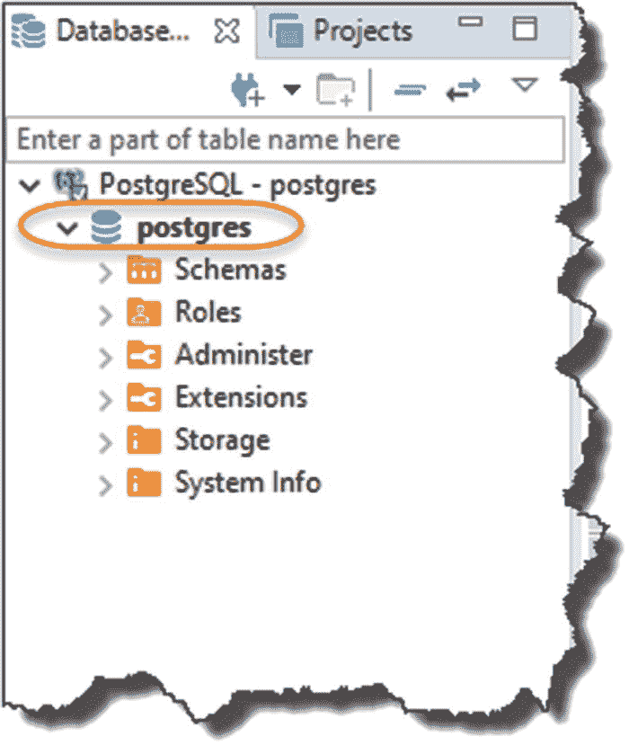
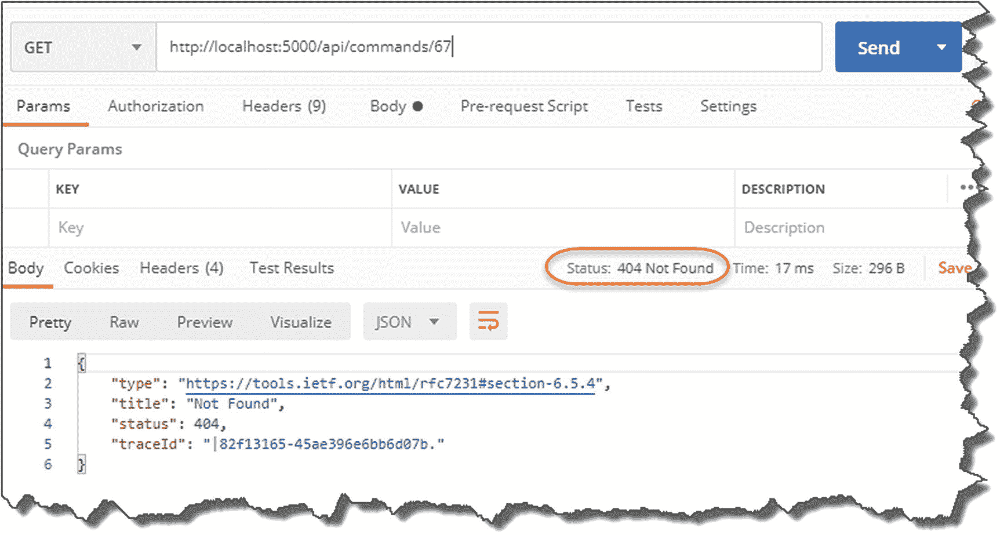
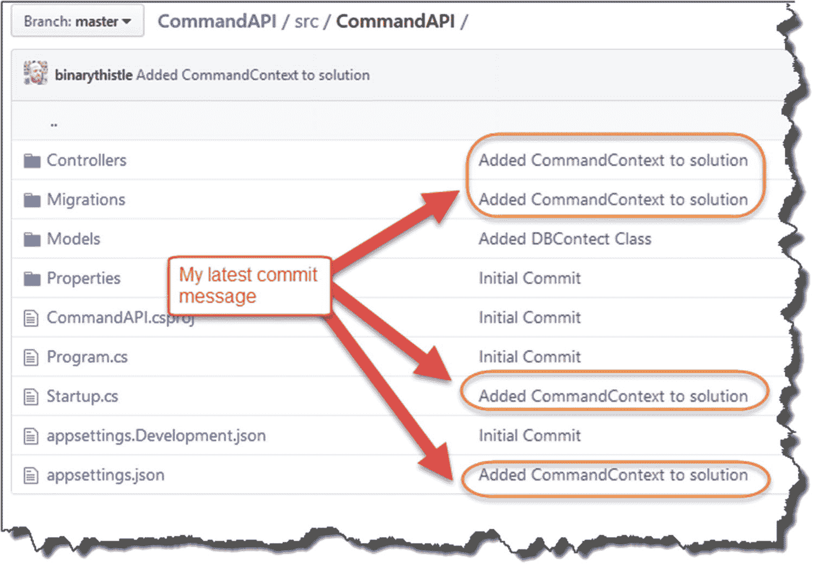

# 七、保存我们的数据

## 章节总结

在本章中，我们将远离模拟数据，实现我们的数据访问和持久层来存储和检索 PostgreSQL 数据库中的数据。

### 完成后，你会

*   已经配置了一个 PostgreSQL 实例(如果需要，包括在 Docker 中设置一个新实例)

*   使用实体框架核心创建了一个数据库上下文(DB Context)类

*   使用“迁移”在我们的数据库中创建必要的模式

*   创建了一个新的存储库接口实现来使用我们的数据库上下文

*   已经使用依赖注入将我们的模拟存储库替换为我们的数据库上下文版本

我们有很多要讲的，所以让我们开始吧！

## 架构进度检查

在我们继续学习所有给定的学习点之前，让我们检查一下我们在应用架构方面的进展。在下图中，我概述了我们已经开始工作或在某些情况下已经完成的组件。


图 7-1

应用架构进展

回顾

*   我们的模型完成了。

*   我们的存储库接口定义已经完成。

*   我们实现了一个存储库接口的模拟实例来返回模拟*模型*数据。

*   我们在控制器中使用了构造函数依赖注入来使用我们的存储库实现我们的 2 GET 控制器动作。这两者都返回了模拟的*模型*数据。

我们希望将这与数据库、DB 上下文和我们的存储库的更新实例结合在一起，这样我们就可以处理随时间持续的真实动态数据。那么，我们还在等什么？

## PostgreSQL 数据库

在继续编写我们的 DB 上下文之前，我首先要确保我们有一个 PostgreSQL 实例正在运行并且配置正确。

### 使用 Docker

现在，我将使用 Docker 在我的开发机器上运行我的 PostgreSQL 实例，所以如果您也选择了这种方法(或者您想看看运行实例有多容易)，请继续阅读。如果您已经有了一个正在运行的 PostgreSQL 实例，那么您可以跳到与 DBeaver 连接一节。

确保在命令提示符下安装并运行 Docker(参见第 [2](02.html) 章);简单键入

```cs
docker run --name some-postgres -e POSTGRES_PASSWORD=mysecretpassword -p 5432:5432 -d postgres

```

Note

这都在一条线上。

假设你已经安装了 Docker 并且它正在运行(我不喜欢让 Docker 桌面在启动时自动运行，所以我在需要的时候手动启动它)，你应该会看到下面的内容。


图 7-2

PostgreSQL 映像已下载并正在运行

如果这是您第一次运行这个命令，您会看到 Docker 在本地“找不到图像”,所以它从 Docker Hub 下载一个图像。打字

```cs
docker ps

```

应该会显示运行容器的数量。


图 7-3

Docker PS 命令

在这里，您可以看到我们有一个，它应该是我们的 PostgreSQL 实例。

就在我带你浏览这个命令之前，我们刚刚发布了一个更详细一点的命令；如果您安装了 VS 代码的 Docker 插件，您应该会看到类似这样的内容。


图 7-4

VS 代码中的容器状态

从这里，您可以停止正在运行的容器(右键单击容器框中的任何条目)，并再次启动它，等等。您还会看到它列出了您机器上的可用图像。

当您再次执行“`docker run`”命令时，假设 Docker Hub 上没有更高版本的 PostgreSQL 镜像，Docker 将不会尝试下载新的镜像；它将简单地使用本地可用的缓存副本。

### Docker 命令提示符

为了让您了解发生了什么，让我们来看一下每个命令行参数:

*   最后一个参数就是我们希望从 Docker Hub 获得的图像的名称。

```cs
postgres

```

*   这个参数只是告诉 docker 运行“detached”，这意味着命令提示符被返回给我们供以后使用。

```cs
-d

```

*   `-p`参数非常重要——这是我们的端口映射。不涉及太多细节，一个容器通常有一个“内部”端口，我们需要将一个“外部”端口映射到它，以便我们进行连接。这里，我们的 PostgreSQL 监听的内部端口是标准的 5432 PostgreSQL 端口，我们只是从外部映射到同一个端口号。

```cs
-p [internal port] : [external port]

```

*   `-e`参数仅仅意味着我们在启动时向容器提供一个或多个“环境变量”。在本例中，我们为默认用户 postgres 设置密码。

```cs
-e POSTGRES_PASSWORD=mysecretpassword

```

*   默认情况下，一个正在运行的 Docker 容器将只由一个 ID 来标识；这是可以的，但是当您在命令行发出启动和停止命令时，这些 id 可能会很麻烦，并且容易输入错误。`-- name`参数只允许您“命名”您的容器。

```cs
--name

```

*   很简单，这只是我们用来运行容器的主要命令。

```cs
docker run

```

如果我们转到 [`https://hub.docker.com/`](https://hub.docker.com/) 并点击屏幕顶部附近的“探索”,您将获得最受欢迎的 Docker 图片列表。这些通常是由有问题的产品的供应商提供的图像。


图 7-5

坞站上的 Postgres Image on Docker Hub

在这里，你可以看到 Postgres 是最受欢迎的图片下载。

你可能使用的其他 Docker 命令有

*   `docker start <container Id or Name>`:启动一个现有的容器。

*   `docker ps`:列出正在运行的容器。

*   `docker ps - -all`:列出*运行过*的所有容器。

*   `docker stop <container Id or Name>`:停止正在运行的容器。

    关于这些和其他的更详细的描述可以在这里找到:

    [T2`https://docs.docker.com/engine/reference/commandline/docker/`](https://docs.docker.com/engine/reference/commandline/docker/)

    当然，如果你喜欢用“图形”界面来管理你的容器，我再次推荐 VS 代码插件。

### 与 DBeaver 连接

继续之前，您应该

1.  遵循给定的 Docker 步骤，并拥有一个正在运行的 PostgreSQL Docker 容器

2.  让一个 PostgreSQL 实例运行在其他地方，您可以从运行 API 代码的机器上连接到该实例

现在，我们想连接进去，看看我们有什么。

打开 DBeaver 并


图 7-6

DBeaver 中的 PostgreSQL 连接

1.  单击新建连接图标。

2.  选择 PostgreSQL。

3.  单击下一步。

然后，您将看到 PostgreSQL 的连接配置设置。在主选项卡上，输入适合您的详细信息。请注意，这里的详细信息适用于我在 Docker 中运行的 PostgreSQL 实例(localhost 对主机来说很好)。


图 7-7

连接到 PostgreSQL

然后移到 PostgreSQL 选项卡，勾选“显示所有数据库”


图 7-8

勾选显示所有数据库

然后，我建议您通过单击“测试连接…”按钮来测试连接。


图 7-9

继续之前测试连接

假设连接成功，您应该会看到类似这样的内容。


图 7-10

测试连接成功

你应该可以点击“完成”；这将把您的连接添加到主 DBeaver 环境中。


图 7-11

DB Beaver 中的 PostgreSQL 连接

在这里，你可以看到我们已经连接到默认数据库**postgres**；别担心，稍后我们将为我们的 API 创建自己的数据库。

#### 连接问题

连接问题通常会归结为

*   不正确的用户凭据(用户名或密码)

*   不正确/错误配置的网络属性(如防火墙等。)

如果在与代码环境相同的机器上本地运行 PostgreSQL 服务器，通常可以避免“远程”数据库的所有痛苦。如果您在单独的机器上或者甚至在虚拟机上运行数据库，这里的问题几乎总是由防火墙或其他网络设置引起的。恐怕我没有足够的空间来解决这个问题；事实上，这也是我推荐 Docker 的原因之一，因为我花了很多不愉快的时间来解决这个问题。

PostgreSQL 的默认“超级用户”被称为 **postgres** (这并不奇怪)。同样，根据您的安装方式，服务器将取决于您是否为此设置了密码值。有些文章介绍了如何在遇到问题时重置密码(假设您在安装了该密码的机器上拥有管理员/root 权限)。

假设您已经成功连接，我们可以继续。

## 实体框架核心

实体框架核心(EF Core)通常被称为对象关系映射器(ORM ),那么它是什么，我们为什么要使用它？

为了最好地回答这个问题，我想你应该看看在不使用 ORM 的情况下从数据库读取数据和向数据库写入数据的方法。在这种情况下，你通常会

*   需要数据库模式的(相对低级的)工作知识。

*   必须编写(特定于供应商的)SQL 查询来操作您想要的数据集。

*   将结果放入某种半专有的结果集对象中，确保所有内容都映射正确(DB 列映射到对象属性)，并遍历结果。

这些都可以工作，但是这是一个相当手工的过程，分散了开发人员的注意力；肯定有更好的方法。进入 ORM。

### ORM 的内容和原因

ORM 充当特定数据库实现的“对象包装器”,这意味着

*   开发人员可以使用面向对象的软件开发方法来访问数据。

*   开发人员不需要了解供应商 SQL 的细微差别。

*   开发人员不需要执行从数据库表到基于代码的结果集的专有映射。

这实际上相当于以下主要优势:

*   发展速度

*   代码可移植性

*   代码可维护性

我们将使用实体框架核心作为我们选择的 ORM，但是也有其他的选择，所以请记住区分我们选择的*技术实现*(实体框架核心)和 ORM 的*通用概念*。

如果这一切仍然有点抽象，正如我以前说过的，我认为理解和学习新东西的最好方法是动手编程。

### 实体框架命令行工具

我们将利用实体框架核心命令行工具(它们基本上允许您创建迁移、更新数据库等。；如果您还不知道这是什么意思，请不要担心！).相信我就好；我们需要工具！

首先，检查您是否已经安装了它们；为此，请键入

```cs
dotnet ef

```

如果这样做，您应该会看到类似下面的输出。


图 7-12

实体框架命令行工具

如果看不到，只需在命令行运行以下命令:

```cs
dotnet tool install --global dotnet-ef

```

这将使您可以在全球范围内使用这些工具。

### 创建我们的数据库上下文

通过实体框架核心(EF 核心)生成数据访问层的下一步是创建数据库上下文类。DB Context 类充当数据库的*表示，并在我们的数据模型和它们在 DB 中的存在之间进行协调，如图 [7-13](#Fig13) 所示。*


图 7-13

数据库上下文的重要性

正如在第 [5](05.html) 章中提到的，我们可以直接从控制器中使用 DB 上下文，而不需要使用存储库。如您所知，在本教程中，我们将同时使用存储库和数据库上下文。

#### 参考资料包

为了使用 EF 核心的特性，我们将不得不在我们的 API 项目中添加 reference three 包。csproj 文件:

*   **微软。EntityFrameworkCore** :主实体框架核心包

*   **微软。EntityFrameworkCore.Design** :设计时组件(迁移所需)

*   **Npgsql。EntityFrameworkCore . PostgreSQL**:实体框架核心的 PosrgreSQL 提供者

您可以手动将它们添加到。csproj 文件，但我更愿意使用。NET Core CLI。为此，在终端中运行以下命令(确保您在 API 项目文件夹的“内部”: ***CommandAPI*** ):

```cs
dotnet add package Microsoft.EntityFrameworkCore
dotnet add package Microsoft.EntityFrameworkCore.Design
dotnet add package Npgsql.EntityFrameworkCore.PostgreSQL

```

正在打开。我们的 API 项目的 csproj 文件，您应该看到类似这样的内容。


图 7-14

为持久性添加的包引用

添加了必要的包后，我们可以继续了。

如前所述，我们添加的第三个包

(`Npgsql.EntityFrameworkCore.PostgreSQL`)

是 PostgreSQL 的 EF 核心提供者。如果您想使用另一个数据库，那么您可以在这里添加相关的包。例如，如果您想使用 SQL Server，您应该改为添加以下包:

`Microsoft.EntityFrameworkCore.SqlServer`

我们将在“Data”文件夹中创建 DB Context 类以及我们的存储库接口和类，因此创建一个名为***command Context . cs***的新文件，并将其放在 ***Data*** 文件夹中；应该是这样的。


图 7-15

添加了数据库上下文

现在，更新***command context . cs***文件中的代码，以反映以下内容:确保还包括“使用”指令:

```cs
using Microsoft.EntityFrameworkCore;
using CommandAPI.Models;

namespace CommandAPI.Data
{
    public class CommandContext : DbContext
    {
        public CommandContext(DbContextOptions<CommandContext> options)
          : base(options)
        {

        }

        public DbSet<Command> CommandItems {get; set;}
    }
}

```

一些注意事项

*   确保您有使用语句的`EntityFrameworkCore`和`CommandAPI.Models`。

*   我们的类继承自`DbContext.`

*   创建命令对象的`DbSet`非常重要(见下文)。

虽然您可以将`DbContext`类视为数据库的表示，但是您也可以将`DbSet`视为数据库中表的表示。也就是说，我们告诉我们的`DbContext`类，我们想要在数据库中“建模”我们的命令(这样我们可以持久地将它们存储为一个表)。

这意味着我们可以选择我们想要将哪些类(模型类)置于`DbContext “`控制之下，并因此在数据库中表示。

保存文件并执行`dotnet build`以确保没有编译错误。因为我们已经添加了一个新类，所以可能值得执行 Git 命令的“三连胜”

*   将新的未跟踪文件置于源代码控制之下。

*   将类提交到存储库(通过消息)。

*   把代码上传到 GitHub。

Learning Opportunity

努力记住您需要发出的 git 命令，以便实现前面讨论的项目——我不会再详述它们。

如果记不清了，参考第 [5 章](05.html)。

### 更新 appsettings.json

好了，这很好，但是在 PostgreSQL 服务器数据库和我们的应用(特别是我们的`CommandContext`类)之间仍然有一个“断开”。

对于那些以前做过一点编程的人来说，听说我们必须为应用提供一个“连接字符串”来告诉它如何连接到我们的数据库服务器，你不会感到惊讶。

首先，我们将 DB 连接字符串放在我们的 ***appsettings.json*** 文件中。

在我们这样做之前，我们需要创建一个 PostgreSQL 登录，我们可以使用它作为我们的(尚未创建的)数据库的“应用用户”。API 将使用该帐户向 PostgreSQL 服务器进行身份验证，并获取运行我们的实体框架核心“迁移”的权限，该迁移将

*   创建新的数据库。

*   创建或更改任何表。

*   读取、写入和删除数据。

Learning Opportunity

为什么我们不应该使用之前在 DBeaver 中使用的 **postgres** 用户帐户来连接我们的 PostgreSQL 服务器呢？

使用 DBeaver 可以通过两种方式之一创建用户:

*   SQL 命令

*   使用图形界面

我将向您展示如何通过 SQL 做到这一点；一旦你学会了这一点，使用图形用户界面来执行同样的动作应该是小菜一碟。

#### 创建用户–SQL

打开 DBeaver(确保连接到 PostgreSQL 实例)，从菜单中选择 SQL 编辑器➤新建 SQL 编辑器。


图 7-16

打开新的 SQL 编辑器

这将打开一个新的查询窗口；然后只需输入以下 SQL:

```cs
create user cmddbuser with encrypted password 'pa55w0rd!' createdb;

```

我已经调用了我们的用户`cmddbuser`，并给了它一个密码`pa55w0rd!`；当然，您可以根据自己的需要修改这些值。

您可以按住`Ctrl + Enter`来执行 SQL 语句，或者从 SQL 编辑器菜单中选择“执行 SQL 语句”。


图 7-17

通过执行 SQL 创建我们的用户

该命令应该会成功执行，如果您随后展开:postgres ➤角色，您应该会看到您新创建的用户。如果没有，右键单击“角色”文件夹，然后选择“刷新”


图 7-18

为我们的 API 新创建的数据库用户

右键单击新创建的角色，并选择“查看角色”(或者您可以只按 F4)。


图 7-19

查看角色详细信息

生成的信息应该详细说明我们的用户可以登录并创建数据库，这在我们开始运行迁移时至关重要。


图 7-20

新用户所需的角色权限

Learning Opportunity

使用我们之前设置的属性作为指导，看看是否可以使用 DBeaver 通过图形 UI 和菜单创建一个新角色。

打开 ***appsettings.json***

```cs
"ConnectionStrings":
{
    "PostgreSqlConnection":"User ID=cmddbuser;
    Password=pa55w0rd!;
    Host=localhost;
    Port=5432;
    Database=CmdAPI;
    Pooling=true;"
}

```

因此，您的文件应该如下所示。 <sup>[1](#Fn1)</sup>


图 7-21

appsettings.json 中的连接字符串

关于连接字符串的一些注意事项

*   连接字符串的“名称”是`PosrgreSqlConnection.`

*   连接字符串由下列组件组成，用分号分隔:
    *   `User ID`:我们的 Postgres 服务器的登录(我们在上一节中创建了它)。

    *   我们的登录密码——存储在文本中——不太安全！ <sup>[2](#Fn2)</sup>

    *   `Host`:我们 PostgreSQL 服务器的主机名。

    *   我们的 PostgreSQL 服务器正在监听的端口。

    *   这是我们的数据库(或将是我们的数据库——它还不存在)。

    *   正在使用连接池(本质上是共享)。

Learning Opportunity

如果您想检查任何 json 的有效性(包括整个 ***appsettings.json*** 文件的内容)，您可以将 json 粘贴到类似于 [`https://jsoneditoronline.org/`](https://jsoneditoronline.org/) 的东西中，它会为您检查语法。

#### 我们的数据库在哪？

如前所述，我们已经在连接字符串( **CmdAPI** )中指定了数据库的名称，但是实际的数据库在我们的服务器上还不存在；快速浏览一下 DBeaver 中的数据库就可以确认这一点。



图 7-22

我们的数据库在哪？

我们只有默认的 **postgres** 数据库，但是到目前为止， **CmdAPI** 还没有。这是因为我们的数据库将在我们执行第一个实体框架“迁移”时创建我将在本节的后面解释这是什么。

### 重温启动类

概括一下，我们有

*   一个数据库服务器(但实际上还没有 **CmdAPI** “数据库”！)

*   一个模特(`Command`)

*   dbcontext(〈t0〉)

*   dbset)

*   数据库服务器的连接字符串

我们必须做的最后几件事是

*   将我们的`DBContext`类指向连接字符串(目前它还不知道)。

*   在`Startup` ➤ `ConfigureServices`中“注册”我们的`DBContext`类，这样它就可以作为“服务”在我们的应用中使用——看起来很熟悉吧？

为了向我们的`DbContext`类提供我们的连接字符串(目前在 ***appsettings.json*** )，我们必须更新我们的`Startup`类以提供一个“配置”对象供使用(我们使用这个配置对象来访问连接字符串)。

**旁注:**回想一下本教程开始时，我们可以选择项目模板。


图 7-23

。NET 核心项目模板

我们选择了“web”来为我们提供一个空壳项目。如果您选择了“webapi”，我们将要介绍的“配置”代码将作为项目模板的一部分提供。我故意选择不这样做，所以我们必须手动添加以下代码——因为我认为这将有助于您更全面地学习核心概念。

好的，那么将下面的代码(如`bold`所示)添加到我们的`startup`类中:

```cs
using Microsoft.AspNetCore.Builder;
using Microsoft.AspNetCore.Hosting;
using Microsoft.Extensions.DependencyInjection;
using Microsoft.Extensions.Hosting;
using Microsoft.Extensions.Configuration;

namespace CommandAPI
{
    public class Startup
    {
        public IConfiguration Configuration {get;}
        public Startup(IConfiguration configuration)
        {
          Configuration = configuration;
        }

        public void ConfigureServices(IServiceCollection services)...
.
.
.

```

我在这里展示了整个文件上下文中的新部分。


图 7-24

使用依赖注入来添加配置 API

1.  添加新的 using 指令:`Microsoft.Extensions.Configuration.`

2.  创建一个`IConfiguration`接口并在类构造函数中设置。

这种模式是不是很眼熟？如果没有，也许回到第 6 章来复习。这段代码为我们提供的是对“配置 API”的访问(通过`IConfiguration`接口的实现)，这意味着我们现在可以访问存储在 ***appsettings.json*** 文件中的配置。特别是，这意味着我们可以读入连接字符串，并将其传递给 DB 上下文。

有关`IConfiguration`界面的更多信息，请参考微软构建文档。<sup>[3](#Fn3)T4】</sup>

我们要做的最后一件事是在`ConfigureServices`方法中注册我们的`DbContext`,并将连接字符串传递给它(通过配置 API)。将下面的`using`指令添加到您的`Startup`类中:

*   `using Microsoft.EntityFrameworkCore;`

并将下面(**粗体**)行代码添加到`Startup`类的`ConfigureServices`方法中:

```cs
public void ConfigureServices(IServiceCollection services)
{
    services.AddDbContext<CommandContext>(opt => opt.UseNpgsql
       (Configuration.GetConnectionString("PostgreSqlConnection")));

    services.AddControllers();
}

```

为了将这些变化放在上下文中，这里显示了它们。


图 7-25

向我们的服务容器注册我们的数据库上下文

您将观察到以下情况:

1.  我们包含了一个新的 using 指令。

2.  我们将我们的`CommandContext`类注册为解决方案范围的 DBContext(在服务容器中)，并将其指向包含在我们的***appsessings . JSON***文件中的连接字符串(`PostgreSqlConnection`)。这是通过我们的`Configuration`对象访问的。

如果你在 PostgreSQL 中使用不同的数据库，你需要修改第 2 点中的代码；具体来说，你可以把

`opt.UseNpgsql`

对于其他东西，例如，在 SQL Server 的情况下，您可以使用

`opt.UseSqlServer`

唷！有相当多的编码来连接所有的东西；我们差不多完成了，但是现在我们需要继续将我们的模型从应用“迁移”到数据库。

### 创建和应用迁移

我们应该已经准备好创建数据库和包含命令对象的表。

#### 代码优先与数据库优先

另一个旁注是，当涉及到实体框架时，你可能会听到“代码优先”和“数据库优先”的方法——它涉及到是否

*   我们首先编写“代码”,然后“推送”或“迁移”代码来创建我们的数据库和表，或者

*   我们首先创建数据库和表格，然后从数据库“导入”或“生成”代码(模型)。

这里我们使用“代码优先”(我们已经创建了我们的命令模型)，所以我们现在必须将它“迁移”到我们的数据库中；我们通过一种叫做“鼓声，迁移”的方式来实现这一目标！

转到命令行，确保您“位于”API 项目文件夹( ***CommandAPI*** )中，并键入以下内容(完成后按 Enter 键):

```cs
dotnet ef migrations add AddCommandsToDB

```

现在一切都好了，这里应该发生了一些事情。

首先，您的命令行应该报告如下内容。


图 7-26

创建准备运行的迁移文件

接下来，您应该会看到一个新文件夹出现在我们的项目结构中，名为“Migrations”


图 7-27

新创建的迁移

具体来说，您应该记下一个名为 ***日期时间戳+迁移名称 _ 的新文件。以**cs*为例:

```cs
20200524224711_AddCommandsToDB.cs

```

这个文件的内容在应用到数据库时将创建我们的新表(因为这是我们第一次运行迁移，所以我们的实际数据库也将被创建)。快速浏览该文件，您会看到以下内容。


图 7-28

我们的迁移文件的上下文

1.  一种“向上”方法。调用此方法来创建新项。

2.  表的创建“`CommandItems`”(这个名字从何而来？).

3.  数据库提供商特定的注释/说明。

4.  我们的表格列；注意，我们添加到模型中的数据注释已经被复制。

5.  一种“向下”的方法。用于回滚在 Up 方法中所做的更改。

Warning!

第三点在这里值得注意。我以前认为迁移文件(不知道为什么会这样想)与您使用的数据库无关。这是不正确的。

根据您选择使用的数据库类型(例如，SQL Server 与 PostgreSQL 等),迁移文件看起来会略有不同。).我学到了这个，当我

1.  使用 SQL Server 作为我的数据库

2.  用`opt.UseSqlServer` …(而不是`opt.UseNpgsql`)注册了我在`ConfigureService` s 中的数据库上下文

3.  运行并生成了我的迁移文件

4.  将我的 provider 切换到 PostgreSQL ( `opt.UseNpgsql`)，然后尝试使用那个迁移文件来生成我的 DB(我们稍后会这样做)

失败了。

您可以检查一个“SQL Server”迁移文件，并在 GitHub 上寻找旧项目源代码中的差异。 <sup>[4](#Fn4)</sup>

长话短说，如果您更换数据库提供商，您将需要重新生成迁移。

Note

在这个阶段，我们*仍然没有*创建 **CmdAPI** 数据库；接下来就是这个。

最后，剩下的就是“更新数据库”来应用我们的更改——为此，键入

```cs
dotnet ef database update

```

我们的迁移已经运行，如下面的输出所示。


图 7-29

成功运行我们的迁移

Tip

根据我的经验，如果在这个阶段出现错误，通常都与数据库“连接”问题有关。所以，我会检查:

1.  您还能使用 DBeaver 连接到 PostgreSQL 服务器吗？

2.  请仔细检查连接字符串的格式。例如，将它复制并粘贴到类似 jsoneditoronline.org 的内容中，以检查语法上的 JSON 错误。

3.  仔细检查您输入到连接字符串中的值。例如，密码区分大小写。

4.  当在`ConfigureServices`方法上设置 DBContext 时，仔细检查是否使用了正确的连接字符串“name”。

5.  执行`dotnet build`来检查代码中没有语法错误(这实际上是在执行`dotnet ef database update`时运行的，但是值得单独检查)。

6.  检查(a)您创建的数据库用户是否存在于服务器上,( b)检查它是否具有必要的权限。

一切顺利，这里发生了很多事情:

1.  我们的数据库( **CmdAPI** )被创建，因为它在目标服务器上还不存在。

2.  创建名为**_ efmigrationhistory**的表；这只是存储已经运行的迁移的 id，并允许 Entity Framework 将迁移回滚到某个点，或者在新的端点服务器上正确运行迁移。

3.  我们的 **CommandItems** 表被创建，它是我们的`Command`模型的持久等价物。

如果我们也看一下我们的 PostgreSQL 实例，这反映在我们既有我们的 **CmdAPI** 数据库又有我们的 **CommandItems** 表。


图 7-30

我们的数据库和表格已经创建

1.  **CmdAPI** 数据库

2.  **命令项**表

## 添加一些数据

到目前为止，我们一直在 API 代码中使用硬编码的模拟数据。随着我们的数据库和 DB 上下文的建立，我们现在可以开始添加一些“真正的”数据供我们的 API 使用。

您可以通过多种方式添加数据(包括完全编写脚本来导入大量测试数据——我们今天不讨论这个),但是目前最简单也是最普遍的方式是通过一个`SQL INSERT`命令，我们可以从 DBeaver 查询窗口中运行这个命令。

就我们应该放入的数据而言，我想回到数据库和表的创建和更新；我们使用了以下两个命令:

*   `dotnet ef migrations add`

*   `dotnet ef database update`

因此，如果我们想在表中存储这些数据，我们需要添加以下数据。

<colgroup><col class="tcol1 align-left"> <col class="tcol2 align-left"> <col class="tcol3 align-left"> <col class="tcol4 align-left"></colgroup> 
| 

ID <sup>[5](#Fn5)</sup>

 | 

基本知识的

 | 

平台

 | 

命令行

 |
| --- | --- | --- | --- |
| one | 创建 EF 迁移 | EF 核心 CLI | dotnet ef 迁移添加 |
| Two | 将迁移应用于数据库 | EF 核心 CLI | dotnet ef 数据库更新 |

要在 DBeaver 中通过 SQL INSERT 命令添加这些数据


图 7-31

添加新查询窗口

*   打开 DBeaver 并连接到服务器。

*   从 SQL 编辑器菜单中，选择“新建 SQL 编辑器”

这不会意外地打开一个新的查询窗口。然后我们需要设置“活动”数据库，这样当我们编写查询时，DBeaver 就知道我们想要使用哪一个。只需右键单击要设置为活动数据库的数据库(在我们的示例中为 **CmdAPI** ，并选择“设为默认”:


图 7-32

设置默认数据库

这应该会将数据库的名称更改为“bold”


图 7-33

我们的默认数据库已经设置

在查询窗口中，键入以下 SQL，将我们的两个命令行片段插入到数据库中:

```cs
insert into "CommandItems" ("HowTo", "Platform", "CommandLine")
values ('Create an EF migration', 'Entity Framework Core Command Line', 'dotnet ef migrations add');

insert into "CommandItems" ("HowTo", "Platform", "CommandLine")
VALUES ('Apply Migrations to DB', 'Entity Framework Core Command Line', 'dotnet ef database update');

```

之后，按`Ctrl+Enter,`或从 SQL 编辑器菜单中选择“执行 SQL 语句”来运行 SQL——这将把这些行插入到我们的数据库中。要检查这一点，从窗口中清除 SQL(否则，如果您再次执行它，它将插入两行，有效地复制数据)，并键入

```cs
select * from “CommandItems”;

```

这应该会返回如下内容。


图 7-34

我们的两行新的“真实”数据

如果你读了我的关于实体框架的博文， <sup>[6](#Fn6)</sup> ，你现在应该已经注意到了，那个教程中使用的命令与这里使用的命令不同。这是因为在那个在线教程中，我们使用 Visual Studio 中的“包管理器控制台”来为实体框架(而不是实体框架核心)发出命令。NET Core 命令行)–我知道相当混乱！

因此，我认为，为了强调这一点，让我们在 DB 中添加两个新的命令行提示。

<colgroup><col class="tcol1 align-left"> <col class="tcol2 align-left"> <col class="tcol3 align-left"></colgroup> 
| 

基本知识的

 | 

平台

 | 

命令行

 |
| --- | --- | --- |
| 创建 EF 迁移 | 实体框架包管理器控制台 | 添加-迁移<name of="" migration=""></name> |
| 将迁移应用于数据库 | 实体框架包管理器控制台 | 更新数据库 |

Learning Opportunity

您需要编写 SQL 来将这些额外的命令片段插入到我们的数据库中！

执行完`SQL INSERT`命令后，执行另一个`SELECT"all"`(即`SELECT *`……)，您应该会看到以下内容。


图 7-35

数据库中的命令

希望您可以看到，当您在我们的表中构建数据时，这个 API 会变得有用；如果和我一样，你的记忆力不如从前了！

为了圆满完成本章，让我们更新现有的 API 操作来返回这些数据！

## 打成平手

快速检查一下我们的架构进展如何，这次我强调了我们**还没有**实现的*交互*。


图 7-36

我们需要利用我们的数据库上下文类

目前，我们正在使用我们的存储库通过模拟实现返回数据，因此我们下一步需要做的是利用我们的“真实”数据(以及数据库上下文)

*   创建我们的存储库接口的新实现(使用 DB 上下文)。

*   用我们的新实现“替换”掉我们现有的模拟实现。

我在图 [7-37](#Fig37) 中描绘了我们当前的状态和我们期望的最终状态。


图 7-37

当前状态与结束状态

### 创建新的存储库实现

我们首先要做的是为我们的`ICommandAPIRepo`接口创建一个新的*具体实现*，所以在我们 API 项目的 ***数据*** 文件夹中添加一个新文件，并将其命名为***sqlcommandapirepo . cs***如图 [7-38](#Fig38) 所示。


图 7-38

新的具体实现类

将以下代码添加到该文件中:

```cs
namespace CommandAPI.Data
{
    public class SqlCommandAPIRepo : ICommandAPIRepo
    {

    }
}

```

正如您之前在第 [6 章](06.html)中对我们的模拟实现所做的那样，将光标放在`ICommandAPIRepo`语句中，然后按

```cs
CTRL + .

```

要为我们的 API 自动生成模板实现代码，参见图 [7-39](#Fig39) 。


图 7-39

自动生成的接口实现代码

现在，我们将实现我们在模拟实现中实现的两个相同的方法:

*   `GetAllCommands`

*   `GetCommandById`

首先，我们将使用构造函数依赖注入将我们的 DB 上下文注入到我们的`SqlCommandAPIRepo`类中(这样我们就可以使用它了)。请记住，我们在`Startup`类中向服务容器注册了 DB 上下文类，因此它可用于“注入”


图 7-40

我们在启动类中向服务容器注册了 DB Context 类

因此，要将我们的 DB 上下文注入到我们新的具体存储库类中，请将下面的类构造函数添加到`SqlCommandAPIRepo`:

```cs
using System.Collections.Generic;
using CommandAPI.Models;

namespace CommandAPI.Data
{
    public class SqlCommandAPIRepo : ICommandAPIRepo
    {
        private readonly CommandContext _context;

        public SqlCommandAPIRepo(CommandContext context)
        {
            _context = context;
        }
.
.
.

```

同样，这种模式您现在应该很熟悉了:

*   通过我们的构造函数注入一个 DB 上下文实例(如`context`)。

*   然后我们将`context`分配给一个私有的只读字段(`_context`)，我们可以在`SqlCommandAPIRepo`类的其余部分使用它。

然后我们需要更新我们的两个方法，如这里的代码所示(确保将 using 语句添加到文件顶部的 using `System.Linq`):

```cs
using System.Linq;
.
.
.

public IEnumerable<Command> GetAllCommands()
{
  return _context.CommandItems.ToList();
}

public Command GetCommandById(int id)
{
  return _context.CommandItems.FirstOrDefault(p => p.Id == id);
}

```

为了将这些变化放在上下文中，我在这里展示了它们。


图 7-41

我们知识库的具体实现

回顾

1.  利用 or DB 上下文注入的类构造函数。

2.  我们在 DB 上下文(`_context`)中引用“`CommandItems`”，并作为一个`Command`对象列表返回。

3.  我们调用“CommandItems”上的`FirstOrDefault`方法来返回一个与我们想要的`ID`匹配的`Command`对象(如果存在的话)。

如您所见，我们可以相对容易地通过我们的 DB 上下文引用我们的对象集合(在这种情况下，我们只有`Commands`)。

这就是我们新的存储库实现的全部内容(目前——我们将在以后完成其他方法)。剩下要做的就是改变我们在`Startup`类中的服务容器注册，如下所示——不言而喻，您也应该在自己的代码中进行这些改变。


图 7-42

我们用新的实现替换模拟实现

就这样！这就是交换我们的存储库的实现是多么容易——我们不需要改变我们的控制器中的一行代码。虽然我们的代码库很小，但是你可以想象当我们在代码中的其他地方使用我们的库时，这是多么强大(和方便)。

让我们保存所有内容并测试一下这是否有效，所以

```cs
dotnet build

```

假设一切都好，我们走吧

```cs
dotnet run

```

让我们在 Postman 中触发一些调用。

### 获取所有命令项目

将 URI `http://localhost:5000/api/commands/`与 GET in Postman 一起使用会产生以下结果。


图 7-43

我们的 API 处理来自数据库的数据

### 获取单个命令(现有)

使用 URI `http://localhost:5000/api/commands` `/1`和 GET in Postman 得到如下结果。


图 7-44

返回单个资源

### 获取单个命令(不存在)

将 URI `http://localhost:5000/api/commands/67`与 GET in Postman 一起使用会产生以下结果。



图 7-45

404 未找到错误

Celebration Checkpoint

可能是整本书中最重要的庆祝活动——干得好！您基本上已经在。网芯！

我们在这一章中已经讲了很多内容。老实说，我本来打算试着把它做小一点，但后来觉得流量不会那么好。

## 结束这一章

由于我们的代码处于源代码控制之下，我们希望

*   向源代码控制/Git 添加未跟踪的(也称为“新”)文件。

*   致力于这些改变。

*   把我们的代码上传到 GitHub **【在你这么做之前警告！！！！】**。

为什么我要警告你把我们的代码上传到我们的公共 GitHub 库？

没错，我们已经将数据库的用户登录名和密码放在了 **appsettings.json** 文件中——如果我们发布代码，这将会公开。

### 编辑我们的登录名和密码

如果您的 API 仍在运行，停止它(Ctrl + C)，并编辑您的 ***appsettings.json*** 文件中的连接字符串，将用户 ID 和密码的值编辑或更改为无意义的值(注意，如果您再次运行 API，当我们开始检索数据时，它将失败！).见图 [7-46](#Fig46) 。


图 7-46

无意义的用户 ID 和密码

保存文件，然后执行添加/跟踪、提交和将您的代码推送到 GitHub 的三个步骤(记住要在解决方案级别进行此操作:***commandapi Solution***文件夹)。

去 GitHub 看看那里的 ***appsetting.json*** 文件。



图 7-47

最新提交

参见 GitHub 上公开存在的 ***appsettings.json*** 文件。


图 7-48

在 GitHub 上编辑用户 ID 和密码

我们现在有两个主要问题:

*   这非常不安全(即使我们已经放入了临时的“假”值)。

*   我们的代码现在不起作用了！(我们会得到认证错误。)

显然，我们不能向 GitHub 发布用户 id 和密码；即使我们将 GitHub 库设为私有，这仍然是很糟糕的做法。我们需要一种方法来保守这些细节的秘密。

<aside aria-label="Footnotes" class="FootnoteSection" epub:type="footnotes">Footnotes [1](#Fn1_source)

如果在复制和粘贴时出现错误，请检查双引号字符，并确保连接字符串值在一行上。

  [2](#Fn2_source)

我们将在下一章对此进行补救。

  [3](#Fn3_source)

[T2`https://docs.microsoft.com/en-us/dotnet/api/microsoft.extensions.configuration.iconfiguration?view=dotnet-plat-ext-3.1`](https://docs.microsoft.com/en-us/dotnet/api/microsoft.extensions.configuration.iconfiguration%253Fview%253Ddotnet-plat-ext-3.1)

  [4](#Fn4_source)

[T2`https://github.com/binarythistle/Complete-ASP.NET-Core-API-Tutorial`](https://github.com/binarythistle/Complete-ASP.NET-Core-API-Tutorial)

  [5](#Fn5_source)

向数据库添加数据时，不需要提供 ID 值；这是 PostgreSQL 为我们自动创建的。

  [6](#Fn6_source)

[T2`https://dotnetplaybook.com/introduction-to-entity-framework/`](https://dotnetplaybook.com/introduction-to-entity-framework/)

 </aside>