# 八、环境变量和用户机密

## 章节总结

本章我们将讨论什么是运行时环境以及如何配置它们；然后我们将讨论什么是用户秘密以及如何使用它们。

### 完成后，你会

*   理解什么是运行时环境。

*   如何通过`ASPNETCORE_ENVIRONMENT`变量设置它们。

*   了解***launch settings . JSON**T3*和 **appsettings.json*** 文件的作用。*

*   什么是*用户机密*。

*   如何使用用户秘密来解决我们在上一章末尾遇到的问题。

## 环境

在开发任何东西时，您通常希望自由地尝试新代码、重构现有代码，并且基本上可以在不影响最终用户的情况下自由地失败。想象一下，如果您必须直接对真实的客户环境进行代码更改，会是什么样的情况？那会是

*   作为开发人员，您压力很大吗

*   作为应用所有者表现出极大的不负责任

*   对最终用户有潜在影响

因此，为了避免这种情况，大多数(如果不是所有的)组织都将拥有某种“开发”环境，在这种环境中，开发人员可以自由地漫游并进行开发，而不用担心搞砸。

Les’ Personal Anecdote

如果你曾经在开发团队中工作过，你会知道前面的陈述并不完全正确。是的，您可以在开发环境中破坏东西而不用担心影响客户，但是如果您破坏了构建，您将会有团队其他成员的愤怒要处理！

我从痛苦的经历中了解到这一点。

无论如何，你几乎总是会有一个*开发*环境，但是你还能有什么其他的环境呢？好吧，跳到光谱的另一端，你将永远有一个*生产*环境。这是实时生产代码作为实际应用存在和运行的地方，无论是面向客户的网站，还是可供其他应用使用的 API。

您通常不会在生产中直接更改代码；实际上，在可能的情况下，生产的部署和变更应该以尽可能自动化(并且可跟踪)的方式进行，在这种情况下，“人手”不会在很大程度上进行干预。

那么，它们是你能拥有的仅有的两种环境吗？当然不是，这是你在现实世界中发现最大差异的地方。大多数情况下，您会有某种“中间”环境(或多个环境),位于开发和生产之间；它的主要用途是在尽可能接近生产环境的地方“准备”构建，以允许集成甚至用户测试。这种环境的名称各不相同，但你会听到微软称之为“登台”环境；我还听说它被称为公关或“生产复制品。”

Les’ Personal Anecdote

准确地复制生产环境可能很棘手(也很昂贵)，尤其是如果您在一个大型企业环境中工作，该环境中有许多由不同的第三方供应商维护的“遗留”系统，协调这一点可能是一场噩梦。

当然有方法来模拟这些遗留系统，但同样，真的没有什么可以替代真实的东西。如果你没有模拟你的应用正在精确交互的遗留系统*，那就是你在生产中发现那些可爱的 bug 的时候。*

我记得在客户部署现场，我被 Oracle DB 的 SQL 区分大小写问题困扰。当我意识到这个问题时，这是一个简单的解决方法，但如此简单的事情可能会带来压力，也会损害你自己的声誉！

### 我们的环境设置

我们将省去试运行或生产副本环境，仅使用开发和生产环境，这足以展示我们需要涵盖的必要概念。请参考下图来查看我的环境设置(您的环境设置应该在很大程度上反映了这一点)。

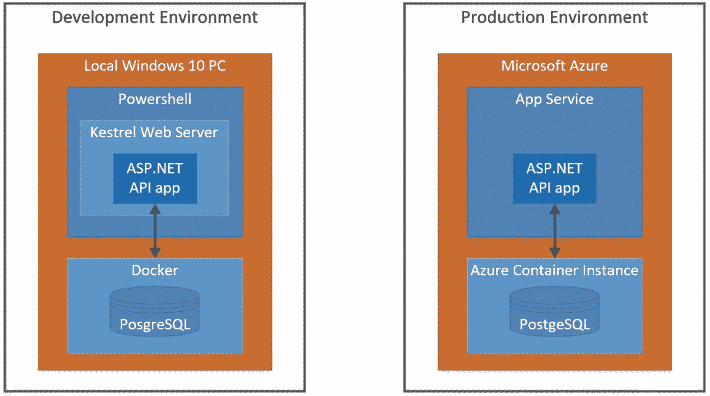

图 8-1

开发和生产环境

如您所见，那里的“组件”实际上是相同的；真正不同的只是底层平台(本地 Windows PC 与微软 Azure)。

我们将暂时搁置对生产环境的进一步讨论，在后面的章节中再回来讨论；现在，我们将关注我们的开发环境。

### 开发环境

我们的应用如何知道它在哪个环境中？很简单——我们告诉它！

这就是“环境变量”发挥作用的地方，特别是 ASPNETCORE_ENVIRONMENT 变量。可以根据物理环境(Windows、OSX、Linux、Azure 等)以多种不同的方式指定或设置环境变量。).因此，虽然它们可以在操作系统级别设置，但我们现在讨论的重点是在***launch settings . JSON***文件中设置它们(这可以在项目的 ***Properties*** 文件夹中找到)。

***launch settings . JSON***文件中设置的环境变量将覆盖 OS 层设置的环境变量；这就是为什么出于我们讨论的目的，我们将只关注在***launch settings . JSON***文件中设置值。

关于 ASP.NET Core 的多种环境的更全面的讨论可以在这里找到。 <sup>[1](#Fn1)</sup>

打开 API 项目中的***launch settings . JSON***文件；您应该会看到类似下面的内容。

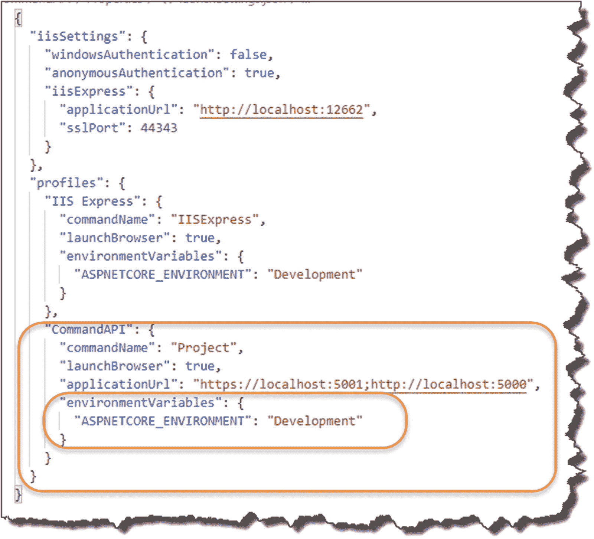

图 8-2

启动设置. json 文件

当你在。NET CLI 使用第一个*配置文件*和`"` `commandName` `" : "Project"`。`commandName`的值指定了要启动的 web 服务器。`commandName`可以是以下任意一种:

*   `IISExpress`

*   `IIS`

*   `Project`(启动 Kestrel 网络服务器)

在前面突出显示的概要文件部分中，还指定了其他细节，包括 http 和 https 的“`applicationUrl`”以及我们的`environmentVariables`；在这个实例中，我们只有一个:`ASPNETCORE_ENVIRONMENT`，设置为:`Development`。

因此，当应用启动时(通过`dotnet run`)

*   ***launch settings . JSON***被读取(如果可用)。

*   `environmentVariables`设置覆盖系统/操作系统定义的环境变量。

*   将显示宿主环境。

例如，参见图 [8-3](#Fig3) 。

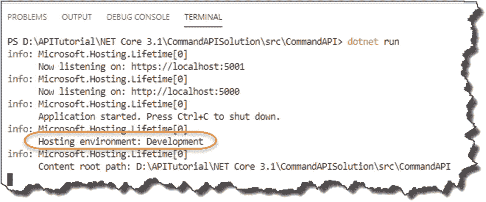

图 8-3

我们的环境正在发展

### 那又怎样？

在这个阶段，我听到你们都在说，*“是的，这很好，但那又怎么样呢？”*

好问题；很高兴你问了这个问题！ <sup>[2](#Fn2)</sup>

回顾一下我们的简单环境设置，我们需要连接到我们的开发数据库，最终连接到我们的生产数据库，在几乎所有情况下，它们都是不同的

*   端点(例如，服务器名称/IP 地址等。)

*   不同的登录凭证等。

因此，根据我们的*环境*，我们将想要改变我们的*配置*。

我在这里使用数据库连接字符串作为例子，但是有许多其他的配置会根据环境而改变。这就是为什么我们意识到我们的环境是如此重要。

### 进行区分

好了，那么您应该在您的应用中采用什么方法来根据开发环境确定配置呢(例如，*使用这个*连接字符串进行开发，*使用这个*连接字符串进行生产)？对此有很多不同的答案。在我看来，有两种大致的方法:

1.  “手动”确定代码中的环境，并采取必要的措施。

2.  利用的功能和行为。NET Core *配置 API* 。

我们将采用选项 2。而选项 1 是一种可能性(事实上这种模式在许多默认情况下使用。NET 核心项目——参见下面的例子),我个人倾向于尽可能地将代码从配置中分离出来，尽管这并不总是可能的——这就是我们选择选项 2 的原因。

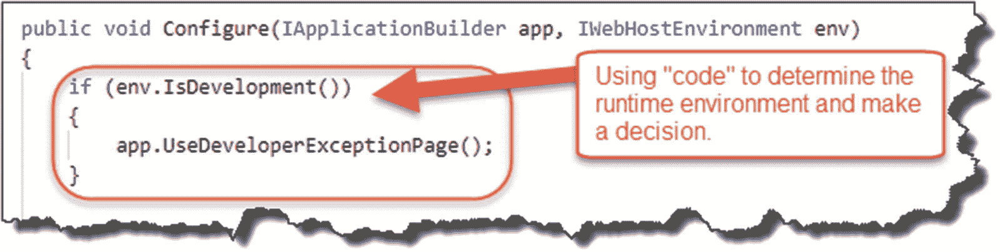

图 8-4

基于代码的环境确定

前面的代码片段取自我们自己的`Startup`类，其中默认的项目模板使用`IsDevelopment`参数来确定使用哪个异常页面。

### 优先顺序

好了，我们要利用。NET Core *Configuration API* 根据我们两个不同环境的需要更改配置(当我们为 DB 上下文配置连接字符串时，我们已经利用了这一点)。

让我们快速回顾一下第 [4 章](04.html)中提到的应用的`Program`类启动序列。

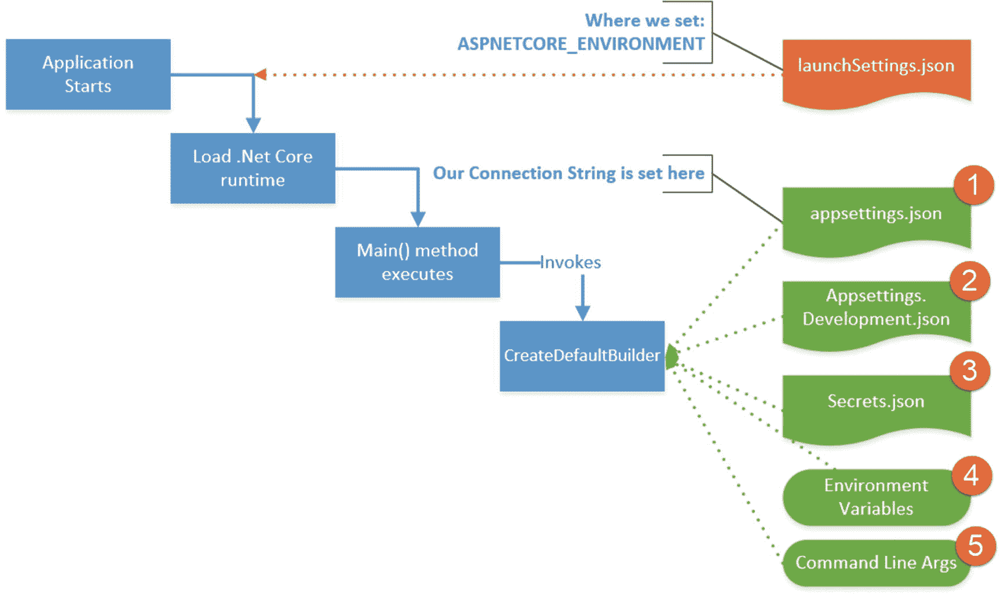

图 8-5

配置源和优先顺序

你会看到我添加了一些额外的细节:

*   当我们发出`dotnet run`命令并为 ASPNETCORE_ENVIRONMENT 设置值时，就会加载***launch settings . JSON***文件。

*   `CreateDefaultBuilder`方法使用的许多配置源。

*   默认情况下，这些源按照之前指定的优先顺序加载，因此首先加载 ***appsettings.json*** ，然后加载 ***appsettings。Development.json，*** 等等。

值得注意的是，**最后载入的密钥获胜。**

这意味着(我们将在下面演示)如果我们有两个同名的配置项，例如，我们的连接字符串`PostgreSqlConnection`，它出现在不同的配置源中，例如， ***appsettings.json*** 和 ***appsettings。Development.json*** ，包含在 ***appsettings 中的值。将使用 Development.json*** 。

所以，你会注意到这里的*环境变量*将优先于 ***appsettings.json*** 中的值。当我们谈论***launch settings . JSON***时，这是其工作原理的*对立面。如前所述，***launch settings . JSON***的内容优先于*我们系统定义的环境变量。**

所以要小心！

我在这里引用了一篇关于配置 ASP.NET Core 的优先顺序的博文， <sup>[3](#Fn3)</sup> 做进一步的概述。

### 是时候搬家了

好吧，让我们把这个理论付诸实践，并证明我们的意思。

*   进入您的 ***appsettings.json*** 文件，*复制*包含我们的`PostgreSqlConnection`连接字符串的`ConnectionStrings`键-值对。

*   确保用户 ID 和密码的值 <sup>[4](#Fn4)</sup> 正确。

*   将这个 JSON 片段插入到 ***appsettings 中。development . JSON**T3 文件——见图 [8-6](#Fig6) 。*

这意味着我们将在****appsettings . JSON***和 ***appsettings 中拥有*相同的配置*元素。development . JSON**T11】。**

 *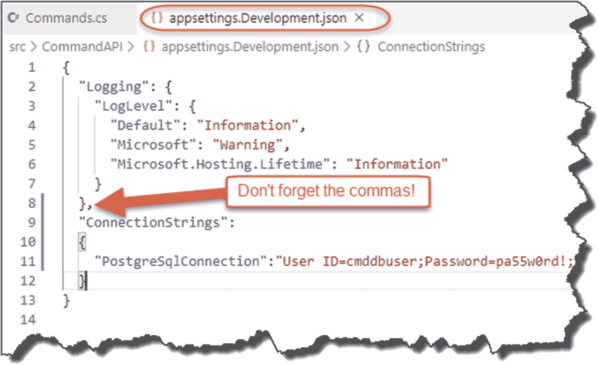

图 8-6

Appsettings。开发. json

同样，如果你不确定你的 JSON 是格式良好的，使用类似于 [`http://jsoneditoronline.org/`](http://jsoneditoronline.org/) 的东西来检查。

保存您所做的任何更改，运行您的 API，并进行同样的调用——这一切仍然照常工作。

#### 让我们打破它

好，为了证明我们之前的观点

*   停止你的 API 运行(Ctrl + c)。

*   回到*进入 **appsettings。Development.json*** 文件，并编辑连接字符串中的`Password`参数，以使对 PostgreSQL 服务器的身份验证失败–参见图 [8-7](#Fig7) 。

*   Save your file.

    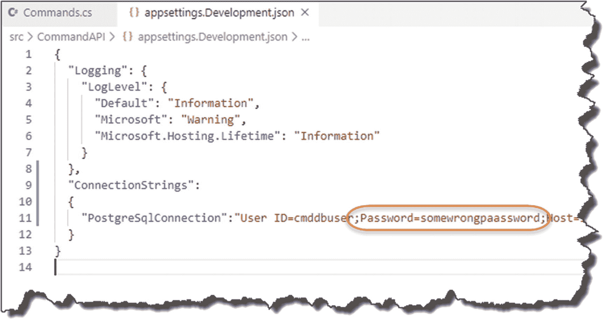

    图 8-7

    错误的凭证

好了，现在再次运行应用，并尝试进行 API 调用。

查看终端输出，您会看到一个数据库连接错误；这是因为我们的连接字符串的最后一个值无效。

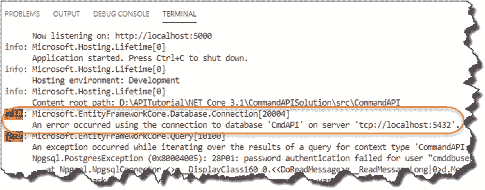

图 8-8

不出所料，我们无法连接

#### 修好它

好吧，让我们来解决这个问题:

*   编辑你的 ***appsettings。Development.json*** 文件，并修正`Password`参数的值

*   ***从 ***appsettings.json*** 文件中删除***`ConnectionStrings`JSON。

这意味着*只有*我们的*和 **appsettings。Development.json** 文件现在包含了我们的连接字符串；您的 ***appsettings.json*** 文件现在应该如图 [8-9](#Fig9) 所示。*

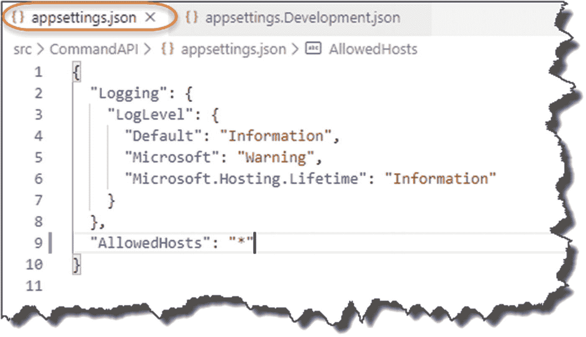

图 8-9

已清理 Appsettings.json

这意味着，目前，当在*开发*环境中运行时，我们只有一个有效的连接字符串源。

Learning Opportunity

如果编辑***launch settings . JSON***文件，将`ASPNETCORE_ENVIRONMENT`的值改为“生产”，会发生什么情况？

做到这一点，运行你的应用，并解释为什么你会得到这个结果。

我们将在第 [13](13.html) 章中介绍我们的生产连接管柱。

## 用户机密

我们已经介绍了您可以拥有的不同环境，以及您拥有它们的原因，甚至重新配置了我们的应用，以拥有一个仅用于开发环境的连接字符串。但是我们仍然没有解决上一章结束时留下的问题——也就是说，我们的用户 ID 和密码仍然是明文，因此任何有权访问我们源代码的人都可以获得——例如，有人在 GitHub 中查看我们的回购协议。

我们在这里解决这个问题。

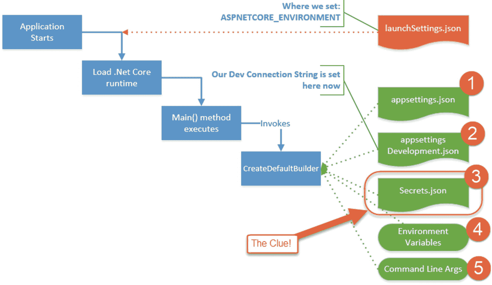

图 8-10

事物方案中的 Secrets.json

### 什么是用户机密？

我在这一章已经给了你们一点线索。

简而言之，它们是您可以存储配置元素的另一个位置；需要注意的几点

*   用户秘密是“绑”在个人开发者身上的——也就是你！

*   它们是从我们的源代码中抽象出来的，没有被签入任何代码库中。

*   它们存储在" ***secrets.json*** 文件中。

*   ***secrets.json*** 文件是*未加密的*，但是存储在本地开发机器上受文件系统保护的用户配置文件文件夹中。

这意味着单个用户可以存储他们用来连接到数据库的凭证。由于文件受到本地文件系统的保护，它们仍然是安全的(假设没有人登录到您的 PC)。

就你能储存什么而言，这可以是任何东西；只是字符串数据。我们现在要为我们的*开发连接*字符串设置用户秘密。

### 设置用户机密

我们需要使用一个叫做*的秘密管理工具*来利用用户秘密；这个工具基于一个项目一个项目地工作，因此需要一种方法来唯一地识别每个项目。为此，我们需要利用 GUIDs。

Learning Opportunity

找出 GUID 代表什么，并阅读一下它们是什么以及它们可以用在什么地方(假设您还不知道这些！)

回想一下第 2 章[中我们建立开发实验室的地方，我们为 VS 代码建议的扩展之一是*插入 GUID*——现在我们可以使用它了！](02.html)

在 VS 代码中打开您的***command API . csproj***文件，并在`<PropertyGroup>` xml 元素中，放置下面突出显示的 xml:

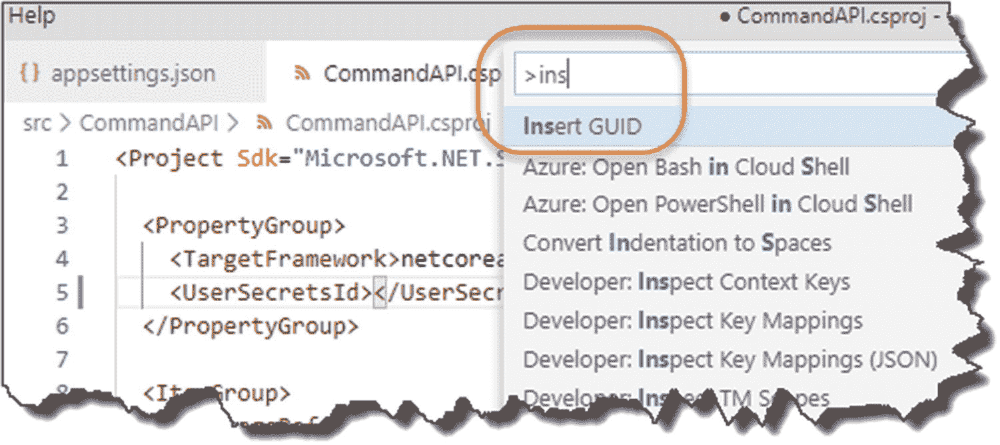

图 8-11

插入 GUID

*   将光标放在开始元素`<UserSecretsId>`和结束元素`</UserSecretsId>`之间。

*   打开 VS 代码“命令面板”:
    *   按 F1

    *   或者 Ctrl + Shift + P

    *   或查看➤命令调板

*   键入“插入”

```cs
<Project Sdk="Microsoft.NET.Sdk.Web">

  <PropertyGroup>
    <TargetFramework>netcoreapp3.1</TargetFramework>
    <UserSecretsId></UserSecretsId>
  </PropertyGroup>

  <ItemGroup>
    <PackageReference Include="Microsoft.EntityFrameworkCore" Version="3.0.0" />
    .
    .
    .

</Project>

```

*   Insert GUID should appear; select it and select the first GUID Option.

    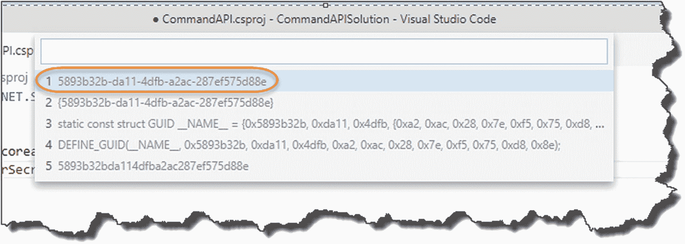

    图 8-12

    选择此 GUID 格式

*   This should place the auto-generated GUID into the xml elements specified; see the following example.

    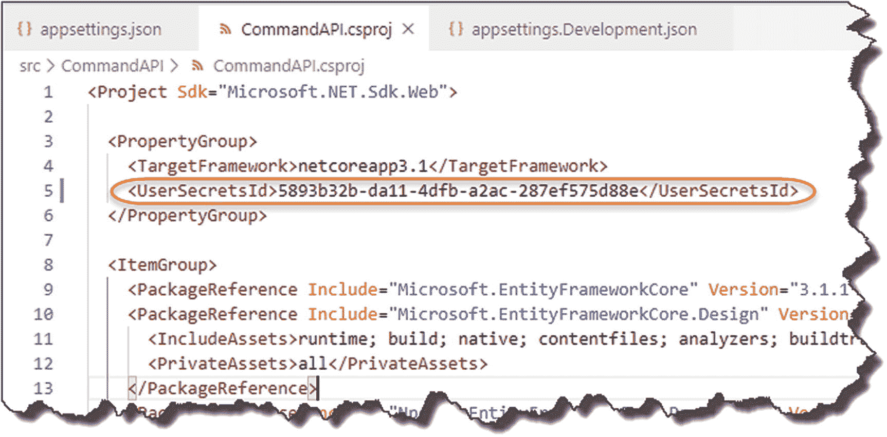

    图 8-13

    GUID 已插入。CSPROJ 文件

现在保存您的文件。

### 决定你的秘密

现在我们开始通过秘密管理器工具添加我们的秘密，这将生成一个 ***secrets.json*** 文件。

不过，在此之前，我们需要就连接字符串做出决定。是吗

1.  希望将整个连接字符串存储为一个秘密。

2.  将我们的用户 Id 和密码存储为个人秘密，并将连接字符串的剩余部分保留在 ***appsettings 中。**develop ent . JSON*文件。

这两种方法都可以，但我将选择第二种方法，将各个组件存储为“秘密”

所以，再加上我们的两个秘密:

*   确保您已经按照前面的描述生成了 GUID，并保存。csproj 文件。

*   在终端命令中(并确保您在 ***CommandAPI*** 项目文件夹中)，键入

```cs
dotnet user-secrets set “UserID” “cmddbuser”

```

您应该会看到一条“成功保存用户 ID…”的消息。

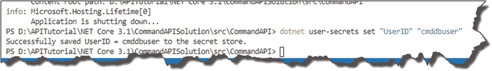

图 8-14

添加我们的第一个用户密码

重复相同的步骤，并添加“密码”秘密

```cs
dotnet user-secrets set “Password” “pa55w0rd!”

```

同样，您应该会得到类似的成功消息。

### 他们在哪里？

那么我们的秘密到哪里去了？没错，在我们的 ***secrets.json*** 文件中。您可以在本地计算机上受系统保护的用户配置文件文件夹中找到该文件，位置如下:

*   视窗:`%APPDATA%\Microsoft\UserSecrets\<user_secrets_id>\secrets.json`

*   Linux/OSX:t0]

所以，在我的机器上，可以在这里找到。 <sup>[5](#Fn5)</sup>

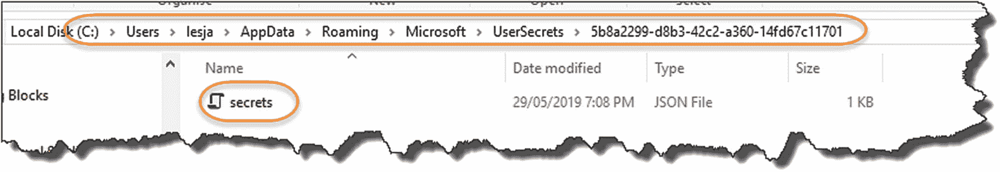

图 8-15

秘密的位置。Windows 上的 Json

打开这个文件，看看内容:

```cs
{
  "UserID": "cmddbuser",
  "Password": "pa55w0rd!"
}

```

它只是一个简单的、非加密的 JSON 文件。

### 编码吧

好了，现在到了真正激动人心的部分，我们将使用这些秘密来构建完整的连接字符串。

#### 步骤 1:删除用户 ID 和密码

我们希望从我们的 ***appsettings 中的现有连接字符串中删除“违规文章”。**development . JSON*文件。

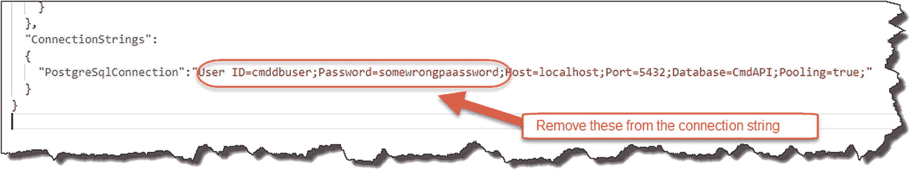

图 8-16

删除敏感的连接字符串属性

所以我们的 ***appsettings。Development.json*** 文件现在应该只包含

```cs
{
  "Logging": {
    "LogLevel": {
      "Default": "Debug",
      "System": "Information",
      "Microsoft": "Information"
    }
  },
  "ConnectionStrings":
  {
    "PostgreSqlConnection":
      "Host=localhost;Port=5432;Database=CmdAPI;Pooling=true;"
  }
}

```

确保您保存了文件。

#### 步骤 2:构建我们的连接字符串

移到我们的`Startup`类中，将下面的代码添加到`ConfigureServices`方法中(注意在顶部包含了新的 using 语句):

```cs
.
.
.
using Npgsql;

namespace CommandAPI
{
    public class Startup
    {
        public IConfiguration Configuration {get;}
        public Startup(IConfiguration configuration) => Configuration = configuration;

        public void ConfigureServices(IServiceCollection services)
        {

            var builder = new NpgsqlConnectionStringBuilder();
            builder.ConnectionString =
              Configuration.GetConnectionString("PostgreSqlConnection");
            builder.Username = Configuration["UserID"];
            builder.Password = Configuration["Password"];

            services.AddDbContext<CommandContext>
                (opt => opt.UseNpgsql(builder.ConnectionString));

            services.AddControllers();
            services.AddScoped<ICommandAPIRepo, SqlCommandAPIRepo>();
        }
.
.
.

```

同样，为了清楚起见，我圈出了下面的新/更新部分:

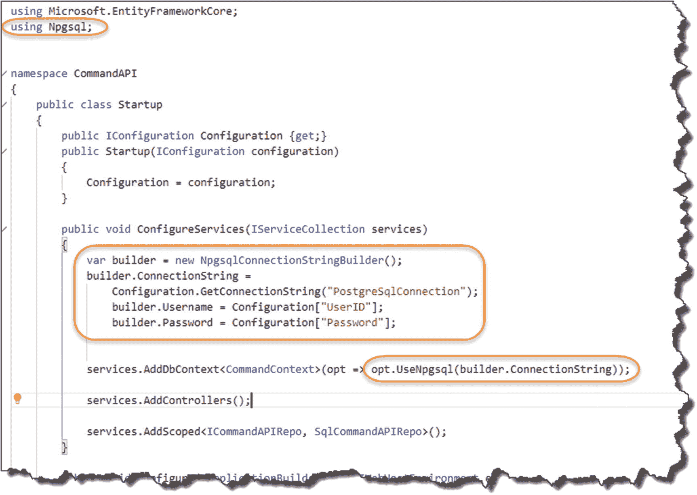

图 8-17

更新了启动类

1.  为了使用`NpgsqlConnectionStringBuilder.`，我们需要添加对`Npqsql`的引用

2.  这是我们
    1.  创建一个`NpgsqlConnectionStringBuilder`对象，并从我们的 ***appsettings 传入我们的“基本”连接字符串`PostgreSqlConnection`。**development . JSON*文件。

    2.  通过从我们的 ***secrets.json*** 文件传入我们的`UserID`和`Password`秘密，继续“构建”字符串。

3.  使用我们的`builder`对象，用新构造的字符串替换原来的连接字符串。

保存您的工作，构建它，然后运行它。启动 Postman，并向我们的 API 发出 GET 请求。你应该会成功的！

Celebration Checkpoint

现在，您已经使用配置源的组合动态创建了一个连接字符串，其中之一是来自我们的 ***secrets.json*** 文件的用户秘密！

回想一下下面的图表。

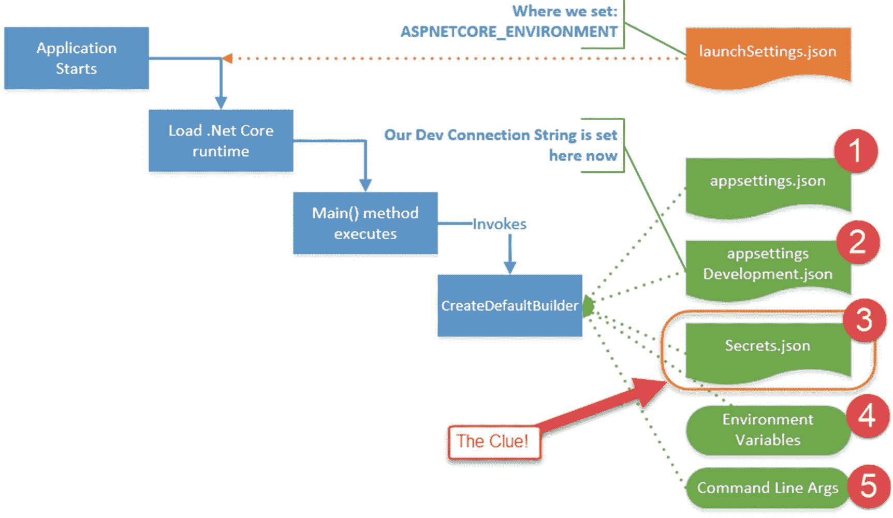

图 8-18

重温先例

那个。NET 配置层默认为我们提供对配置源的访问，如图 [8-18](#Fig18) 所示；在这种情况下，我们使用 2 + 3 的组合。

## 把它包起来

同样，我们在这一章里讲了很多；要点是

*   我们将连接字符串移动到了一个仅用于开发的配置文件: ***appsetting。development . JSON**T3。*

*   我们从连接字符串中删除了敏感项。

*   我们通过秘密管理器工具将敏感项目(`User ID`和`Password`)移动到 ***secrets.json*** 。

*   我们使用配置源的组合构建了一个完全有效的连接字符串。

剩下要做的就是将我们所有的更改提交给 Git，然后推送到 GitHub！

转到我们的存储库，查看一下 **appsettings。Development.json** 文件，我们看到一个没有用户凭证的无辜连接字符串(源代码控制中没有添加 ***secrets.json*** 文件)！

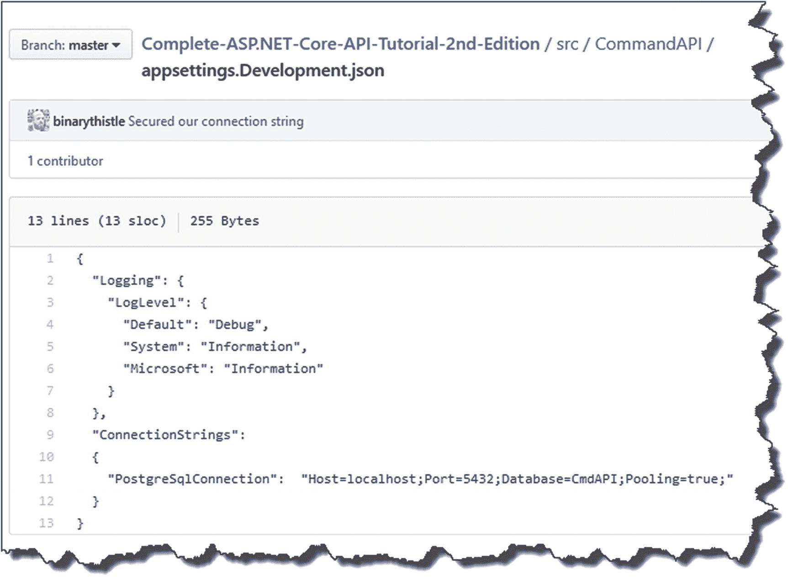

图 8-19

清理 GitHub 上的 Appsettings.json

<aside aria-label="Footnotes" class="FootnoteSection" epub:type="footnotes">Footnotes [1](#Fn1_source)

[T2`https://docs.microsoft.com/en-us/aspnet/core/fundamentals/environments`](https://docs.microsoft.com/en-us/aspnet/core/fundamentals/environments)

  [2](#Fn2_source)

当你从推销员、高管或政客那里得到这样的回答时，要小心了——这通常意味着他们不知道答案，要么会把问题转移到其他地方，要么会编造一些大谎言！t.

  [3](#Fn3_source)

[T2`https://devblogs.microsoft.com/premier-developer/order-of-precedence-when-configuring-asp-net-core/`](https://devblogs.microsoft.com/premier-developer/order-of-precedence-when-configuring-asp-net-core/)

  [4](#Fn4_source)

请记住，我们在上一章的结尾已经对它们进行了修改，以避免将它们发布到 GitHub。

  [5](#Fn5_source)

在 Windows 上，您可能需要确保可以看到“隐藏项目”；在 Windows 资源管理器的视图功能区上有一个复选框，您可以在其中进行设置。

 </aside>*