# 九、数据传输对象

## 章节总结

在这一章中，我们将完成架构困惑的最后一部分，并介绍数据传输对象。

### 完成后，你会

*   理解什么是数据传输对象。

*   了解为什么应该使用 dto。

*   已经开始在我们的解决方案中实现 d to。

### 建筑评论

概述我们已经(a)开始实现或者(b)完全实现的东西，我们的架构正在很好地发展。

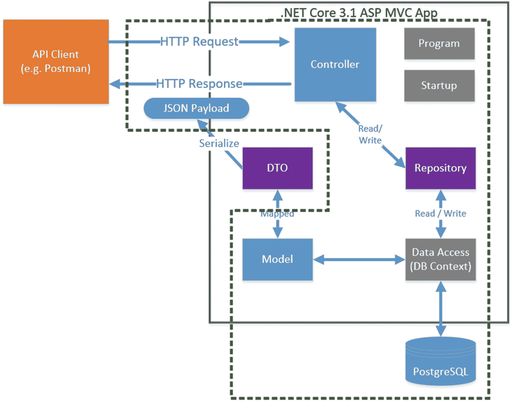

图 9-1

建筑进步

总而言之，我们已经

*   完全实现了我们的模型

*   完全实现了我们的*存储库接口*

*   部分实现了我们具体的*存储库实现*(使用 DB 上下文)

*   完全实现了我们的数据库上下文

*   完全实现了我们的数据库

*   部分完成了我们的控制器(我们还有四个动作要完成)

我们还没有开始研究 dto，所以这就是我们在本章要关注的。

## dto 的内容和原因

为了回答什么是 dto 以及为什么要使用它们，让我们看看到目前为止我们已经实现了什么:

*   我们实现了两个控制器动作，将序列化的`Command`对象返回给消费者。

这有什么不好？

我们基本上是向消费者公开“内部”领域的细节；这具有以下潜在后果:

*   我们可能会暴露“敏感”信息。

*   我们可能会暴露不相关的信息。

*   我们可能会以错误的格式公开信息。

*   我们已经将我们的内部实现“耦合”到我们的外部契约，所以如果我们想要维护我们的契约(或者我们完全破坏契约——不建议),改变我们的内部将是困难的。

这不是一个很好的情况，那么答案是什么呢？

### (再次)将接口从实现中分离出来

同样(类似于我们对存储库所做的)，我们希望将我们的外部契约(我们的接口)与我们的内部实现(我们的领域模型)分离。这就是 dto 的用武之地；观察下图:

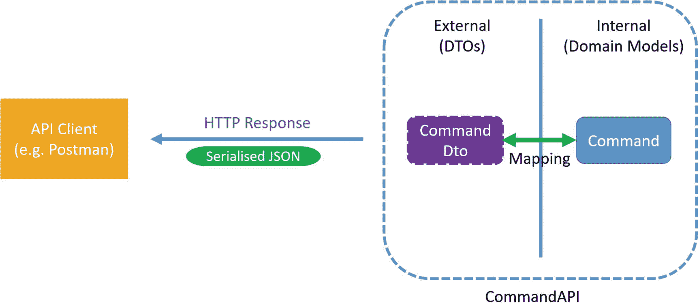

图 9-2

读 DTO 的例子

dto 被“映射”到我们的内部域模型类，并作为契约的一部分在外部表示，从而将我们的实现与我们的接口解耦。我们可以从中受益

*   变更敏捷性:我们可以自由地变更我们的内部实现，只要我们执行适当的映射回到我们的 DTO，我们的接口就保持不变。

*   我们可以从 dto 中删除敏感和不相关的实现细节

*   作为我们“映射”操作的一部分，我们可以增强我们的内部表示，并以一种全新的方式呈现它们(例如，组合名和姓，并以全名的形式在外部呈现)。

更进一步，这取决于我们正在执行的操作类型(读取、创建、更新等。)，我们可能会采用不同的 DTO 来满足每种需求，如下所示。

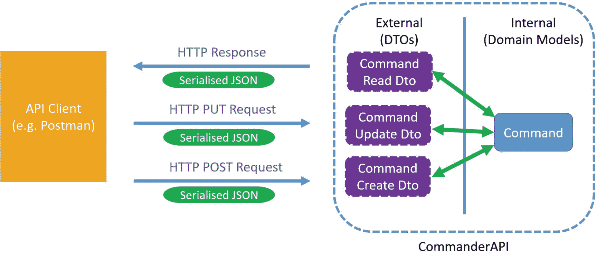

图 9-3

我们可以为不同的操作使用 dto

当我们开始实现时，我会解释这个概念；现在记住这一点。因此，我认为我们应该继续编码。

## 实施 dto

要实现 d to，我们需要做以下工作:

*   创建我们的 DTO 类。

*   弄清楚如何执行前面提到的“映射”。

第一点实际上非常简单，但第二点引入了更多的选项和/或复杂性。我们可以简单地在我们自己编写的代码中手动执行映射操作，虽然这个*对于小对象来说可能*是可以的，但是随着我们的模型在大小和复杂性上的增长，这将会变得

*   无聊的

*   易出错的

因此，我们将采用一个自动化框架(称为 AutoMapper)来为我们执行映射功能。虽然这确实需要更多的前期工作，但请相信我，这是值得的！在我们参与 AutoMapper 之前，让我们从实现我们的 DTO 类开始。

### 创建我们的 dto

回到 API 项目(确保 webserver 已经停止)，在我们的 API 项目的根目录下添加一个名为 ***Dtos*** 的新文件夹，并添加一个名为***commandreaddto . cs***的文件，如图 [9-4](#Fig4) 所示。

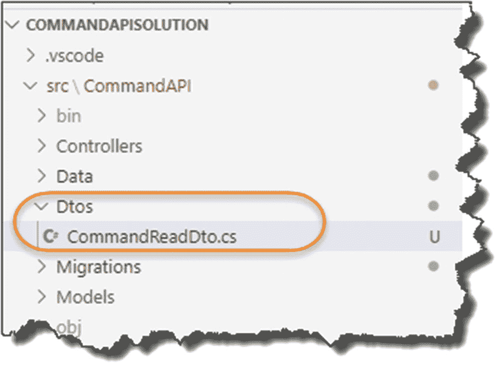

图 9-4

新建 Dtos 文件夹和 CommandReadDto.cs 文件

顾名思义，我们将在执行任何读取操作时使用这个 DTO，因此实际上，每当客户端执行 GET 请求时，这个对象都将被序列化并发送回客户端。

现在，在这一点上，你可能会问自己这样一个问题:DTO 不会是与我们的模型完全一样的吗？老实说，是的，它会，但仍然是一个有效的用例。记住这一点，完成我们的 DTO 的代码，如下所示:

```cs
namespace CommandAPI.Dtos
{
    public class CommandReadDto
    {
        public int Id {get; set;}

        public string HowTo {get; set;}

        public string Platform {get; set;}

        public string CommandLine {get; set;}
    }
}

```

你可以看到这与我们的`Command`模型有着非常相似的地方。您会注意到，在这种情况下，没有数据注释(我们将再次使用它们，只是不是针对这个 DTO)。

这就是我们第一堂 DTO 课的基本内容——我告诉过你这很简单。我们现在需要继续设置 AutoMapper。

### 设置自动映射器

我们需要做的第一件事是在我们的 API 项目中安装另一个包，因此确保 webserver 没有运行(如果是，请 CTRL + C)，并在命令提示符“在”API 项目文件夹( ***CommandAPI*** )中，输入以下内容:

```cs
dotnet add package AutoMapper.Extensions.Microsoft.DependencyInjection

```

这将安装自动映射器包；通过检查 ***来确认这一点。API 项目的 csproj*** 文件，你应该会看到类似图 [9-5](#Fig5) 的东西。

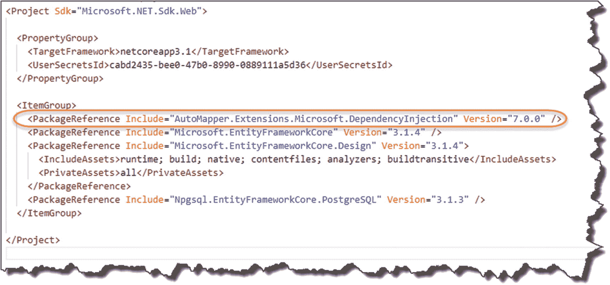

图 9-5

引用自动映射器

为了使用 AutoMapper，我们转移到我们的`Startup`类，并通过添加以下代码行在我们的服务容器中注册它(通过我们的老朋友*依赖注入*，使它在我们的整个应用中都可用):

```cs
.
using AutoMapper;
.
.
.

services.AddControllers();

//Add the line below
services.AddAutoMapper(AppDomain.CurrentDomain.GetAssemblies());

services.AddScoped<ICommandAPIRepo, SqlCommandAPIRepo>();.

```

为了便于理解，我在图 [9-6](#Fig6) 中突出显示了这些新的内容。

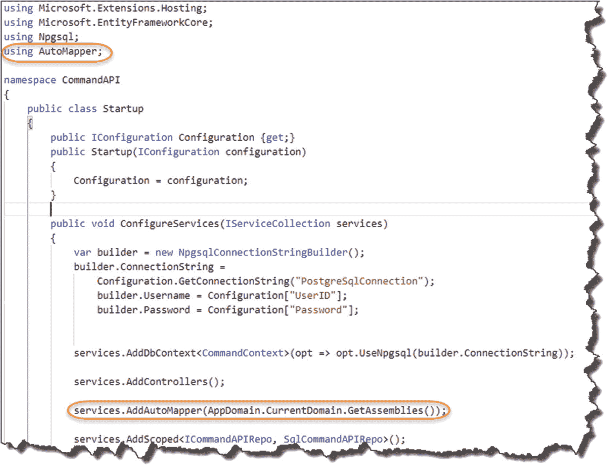

图 9-6

自动映射服务已注册

Note

Automapper 的注册真的可以放在`ConfigureServices`方法中的任何地方；我只是选择把它放在这里，以防你想知道。中如何使用带有依赖注入的 AutoMapper。请参考 AutoMapper 文档。<sup>[1](#Fn1)T4】</sup>

这就是我们的 AutoMapper complete 的设置——看，没那么糟糕；我们现在需要开始使用它。

### 使用自动映射器

为了使用 AutoMapper，我们需要*在某个地方*来配置我们的模型到我们的 DTO 的映射，在这个例子中是映射`Command`到`CommandReadDto`，我们通过一个“概要文件”来完成要开始使用 AutoMapper 概要文件，在我们的 ***CommandAPI*** 项目的根目录下创建另一个名为 ***概要文件*** 的文件夹，并在那里创建一个名为***commands profile . cs***的文件，如下所示。

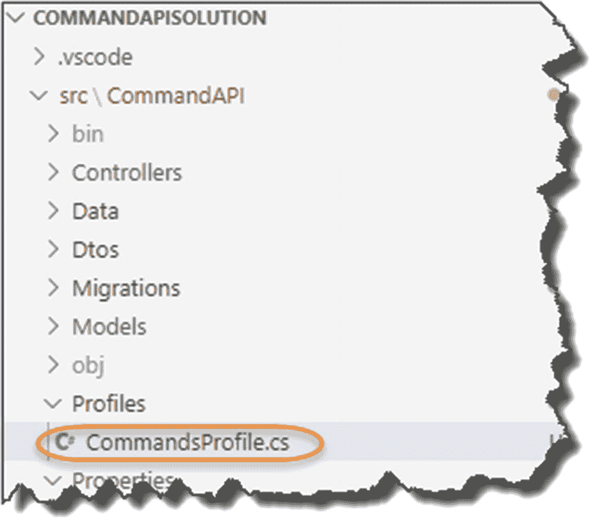

图 9-7

新的配置文件文件夹和 CommandsProfile.cs 文件

现在，将以下代码添加到文件中:

```cs
using AutoMapper;
using CommandAPI.Dtos;
using CommandAPI.Models;

namespace CommandAPI.Profiles
{
    public class CommandsProfile : Profile
    {
        public CommandsProfile()
        {
            CreateMap<Command, CommandReadDto>();
        }

    }
}

```

该类可在图 [9-8](#Fig8) 中解释。

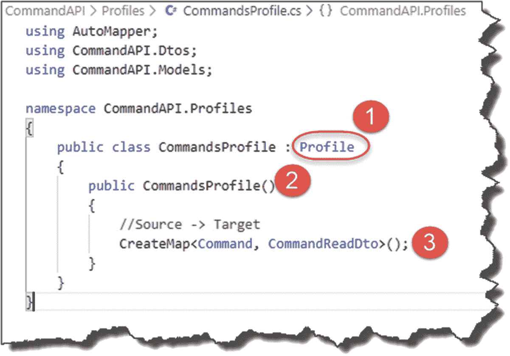

图 9-8

我们的第一个自动地图绘制

1.  我们的类继承自`Automapper.Profile.`

2.  我们添加了一个简单的类构造函数。

3.  我们使用`CreateMap`方法将源对象(`Command`)映射到目标对象(`CommandReadDto`)。

这就是我们的地图绘制完成。这在我们的例子中非常简单，因为两个类的属性名是相同的；AutoMapper 可以很容易地导出映射。

最后，我们希望更新我们的控制器来返回我们的 DTO 表示(`CommandReadDto`)而不是我们两个 GET 动作的`Command`模型。在我们这样做之前，我们需要让控制器“使用”AutoMapper。知道我们该怎么做吗？

对于那些说*构造函数依赖注入*的人来说，干得好！这正是我们要做的。因此，在我们的控制器中，添加以下突出显示的代码:

```cs
.
.
using AutoMapper;
using CommandAPI.Dtos;

namespace CommandAPI.Controllers
{
  [Route("api/[controller]")]
  [ApiController]
  public class CommandsController : ControllerBase
  {
    private readonly ICommandAPIRepo _repository;
    private readonly IMapper _mapper;

    public CommandsController(ICommandAPIRepo repository, IMapper mapper)
    {
      _repository = repository;
      _mapper = mapper;
    }
.
.
.

```

为了解释我们所做的，请看一下图 [9-9](#Fig9) 中上下文的变化。

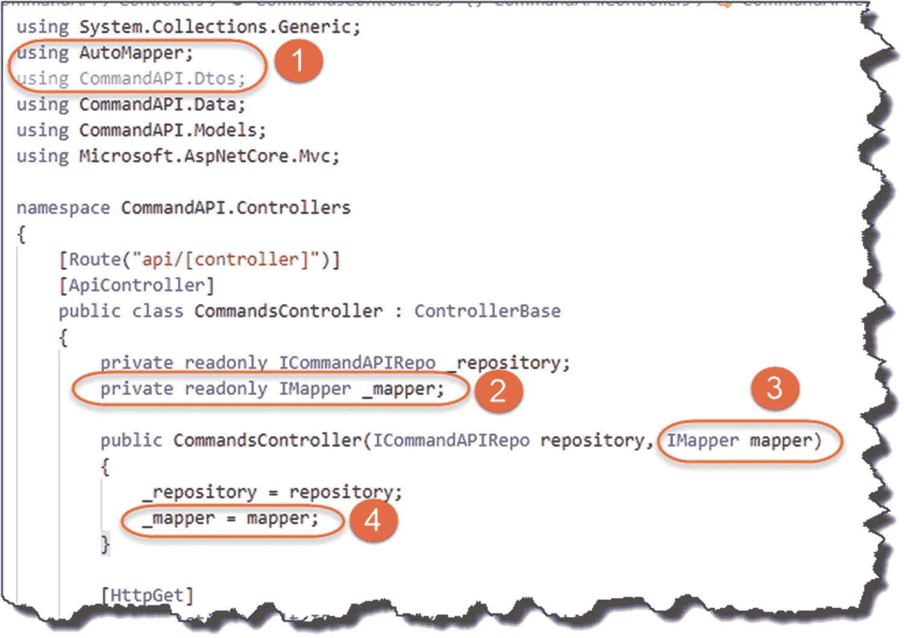

图 9-9

将自动映射器注入控制器

1.  添加了两个新的 using 指令。

2.  创建了一个新的只读字段来保存`IMapper.`的实例

3.  一个`IMapper`的实例将被 DI 系统注入到我们的构造函数中。

4.  我们将注入的实例分配给私有成员`_mapper`供进一步使用。

这种模式对你来说应该很熟悉了，因为我们已经在 API 中多次使用过了；唯一值得注意的一点是，你可以看到我们可以将多个实例注入到我们的构造函数中。

我们现在可以更新我们现有的两个控制器操作，以利用 AutoMapper 并将我们的 DTO 表示返回给我们的消费者，如下面突出显示的代码所示:

```cs
.
.
[HttpGet]
public ActionResult<IEnumerable<CommandReadDto>> GetAllCommands()
{
  var commandItems = _repository.GetAllCommands();

  return Ok(_mapper.Map<IEnumerable<CommandReadDto>>(commandItems));
}

[HttpGet("{id}")]
public ActionResult<CommandReadDto> GetCommandById(int id)
{
  var commandItem = _repository.GetCommandById(id);
  if (commandItem == null){
    return NotFound();
  }
  return Ok(_mapper.Map<CommandReadDto>(commandItem));
}
.
.

```

图 [9-10](#Fig10) 显示并解释了这些变化。

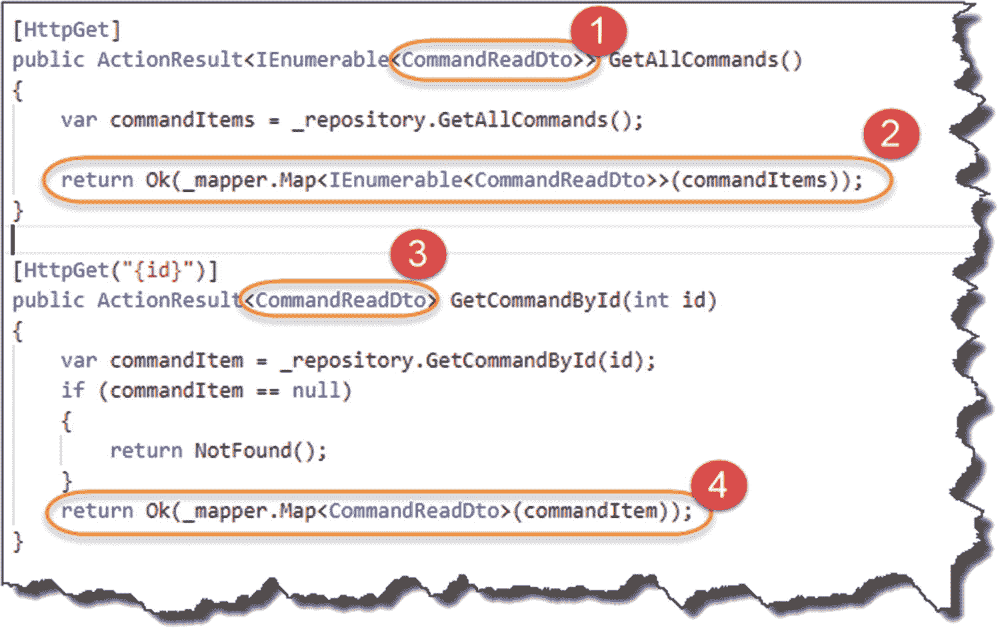

图 9-10

在我们的 2 GET 控制器操作中使用自动映射器

1.  我们确保我们的 ActionResult 返回类型从`Command`更改为`CommandReadDto.`

2.  我们在我们的`_mapper`实例上调用`Map`方法。它将我们的`Command`对象集合映射到我们在`OK`方法中返回的`CommaneReadDtos`的`IEnumerable`。

3.  我们确保我们的 ActionResult 返回类型从`Command`更改为`CommandReadDto.`

4.  做与#1 相同的事情，除了我们使用一个单独的`Command`对象作为源，并在我们的`OK`方法中返回一个单独的`CommandReadDto`对象(如果可用的话)。

保存所有代码，像以前一样运行。

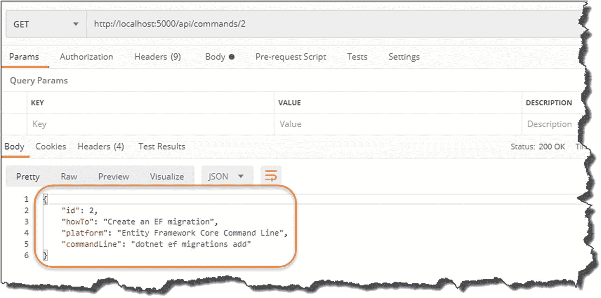

图 9-11

CommandReadDTO 返回

“问题”是它看起来和以前一模一样(嗯这不是一个*问题*；技术上是可以的)。为了演示 dto 的功能，让我们注释掉`CommandReadDto`的`Platform`属性，如下所示:

```cs
namespace CommandAPI.Dtos
{
  public class CommandReadDto
  {
    public int Id {get; set;}

    public string HowTo {get; set;}

    //Comment out the line below
    //public string Platform {get; set;}

    public string CommandLine {get; set;}
  }
}

```

保存更改后，重启 web 服务器并重新运行 Postman 查询。

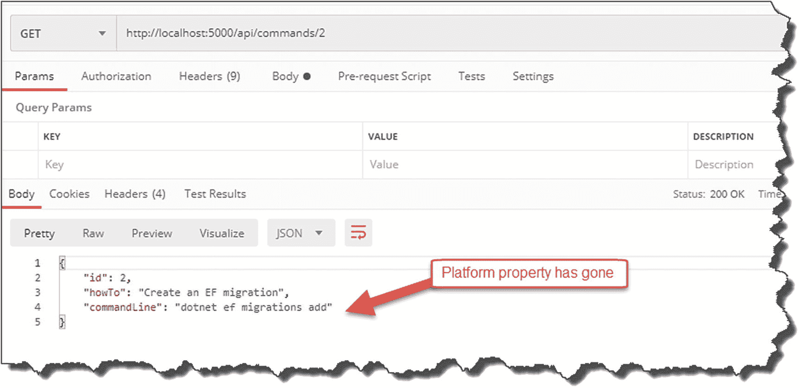

图 9-12

CommandReadDto 返回时平台已移除

你会看到我们的 DTO 代表事实上已经返回！一旦你满意了，*恢复那些改变*所以我们正在返回完整的对象。

快速浏览一下我们的应用架构，您会发现我们现在已经完成了所有架构组件的基础工作(尽管有些组件只是部分完成，如图 [9-13](#Fig13) 所示):

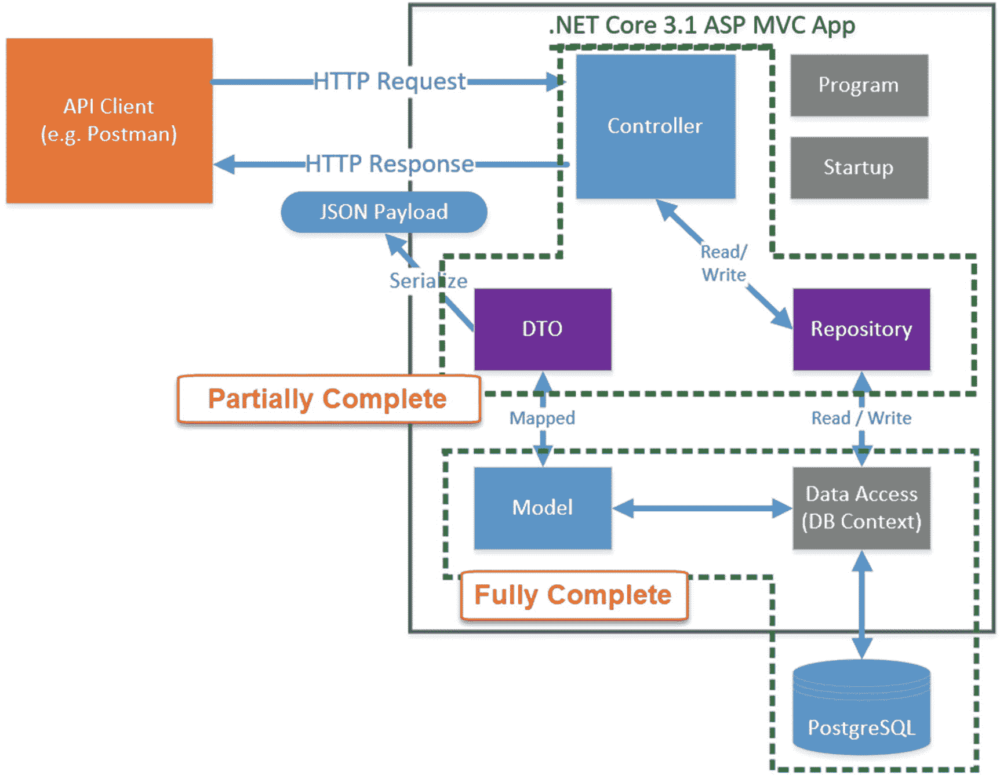

图 9-13

架构检查

我们现在可以把 dto 留在那里，但是当我们接下来构建剩余的控制器动作时，我们将回到它们。

<aside aria-label="Footnotes" class="FootnoteSection" epub:type="footnotes">Footnotes [1](#Fn1_source)

[T2`https://docs.automapper.org/en/stable/Dependency-injection.html#asp-net-core`](https://docs.automapper.org/en/stable/Dependency-injection.html%2523asp-net-core)

 </aside>