# 十、完成我们的 API 端点

## 章节总结

在前几章中，我们在 API 的底层架构中做了很多工作，但是我们只实现了两个端点(控制器动作)。在这一章中，我们将解决这个问题，并加快速度来完成剩下的四个端点。

### 完成后，你会

*   了解实体框架核心如何持久化数据更改。

*   已经完全实现了我们的创建(后)资源端点。

*   已经完全实现了我们的两个更新(上传和修补)资源端点。

*   已经完全实现了我们的删除(Delete)资源端点。

*   了解更多关于 REST 最佳实践的信息。

## EF 核心的持续变化

到目前为止，我们已经使用了一个 EF Core DB 上下文(通过我们的存储库)从我们的 PostgreSQL 数据库中读取数据，并将其返回给我们的消费者(使用 dto)。这些端点被认为是“安全的”,因为它们不能改变我们数据库中的数据；他们只能读它。

我们剩下的四个端点(如下所示)稍微危险一些*，因为它们能够*改变*我们数据库中的数据，或者用一个稍微夸张一点的术语来说——它们被认为是“不安全的”*

 *<colgroup><col class="tcol1 align-left"> <col class="tcol2 align-left"> <col class="tcol3 align-left"> <col class="tcol4 align-left"></colgroup> 
| 

动词

 | 

上呼吸道感染

 | 

操作

 | 

描述

 |
| --- | --- | --- | --- |
| 邮政 | /API/命令 | 创造 | 创建新资源 |
| 放 | /API/命令/{Id} | 更新(完整) | 更新单个资源的所有内容(按 Id) |
| 修补 | /API/命令/{Id} | 更新(部分) | 更新单个资源的一部分(按 Id) |
| 删除 | /API/命令/{Id} | 删除 | 删除单个资源(按 Id) |

我之所以强调这一点，是因为我想说明一下 EF Core 中的数据更改是如何发生的，尤其是在使用 DB 上下文时，因为这在后面的章节中会变得很重要。

### 数据库上下文跟踪更改

让我们举一个简单的例子，向 PostgreSQL DB 添加一个新的命令资源；使用我们的数据库上下文，我们将

1.  获得要添加的`Command`对象(现在不要担心我们从哪里获得它)。

2.  将那个`Command`对象添加到我们的数据库上下文中的`CommandItems`数据库集中。

3.  保存数据库上下文中待定的更改*。*

**   然后，更改将反映在 PostgreSQL 数据库中。

     *

 *我在这里要说的是，仅仅通过在我们的 DB 上下文中添加(或删除/更新)对象并不意味着这些更改会自动反映到 PostgreSQL 数据库中。我们需要进一步*保存*等待发生的变更。

您可以从中获得的是，DB 上下文“在内部”跟踪对数据的(多个)更改，无论它们是创建、更新还是删除操作，但只有当我们明确告诉它时，才会将这些更改保存到 DB 中——通过*保存更改。*

我想在这里再次强调这一点，因为随着我们开始实现剩余的端点，这在几个领域变得相关。

## 创建端点(POST)

我们要实现的下一个端点是“Create”端点，它使我们能够向 DB 添加资源。这里显示了我们的高级定义的快速提示。

<colgroup><col class="tcol1 align-left"> <col class="tcol2 align-left"> <col class="tcol3 align-left"> <col class="tcol4 align-left"></colgroup> 
| 

动词

 | 

上呼吸道感染

 | 

操作

 | 

描述

 |
| --- | --- | --- | --- |
| 邮政 | /API/命令 | 创造 | 创建新资源 |

我们还将介绍一些其他属性，它们将帮助我们理解、构建并最终测试我们的端点；它们显示在下表中。

<colgroup><col class="tcol1 align-left"> <col class="tcol2 align-left"></colgroup> 
| 

属性

 | 

描述

 |
| --- | --- |
| 输入(x1) | 要创建的“命令”对象。这将被添加到我们发布请求的`request body`中；这里显示了一个示例:`{``"howTo": "Example how to",``"platform": "Example platform",``"commandLine": "Example command line"``}` |
| 过程 | 将尝试向我们的数据库添加新的命令对象 |
| 成功产出 | HTTP 201 已创建状态新创建的资源(`response body`新创建资源的 URI(`response header`) |
| 故障输出 | HTTP 400 错误请求不允许 HTTP 405 |
| 安全的 | 否–端点可以改变我们的资源 |
| 幂等 | 否-重复相同的操作会导致不同的结果 |

这大部分应该是有意义的，但在我们进入编码之前，可能有三个标注。

### 输入对象

您会注意到，为了创建资源*我们期望附加到请求体的对象*不包含一个`Id`属性——这是为什么呢？原因很简单，创建惟一 id 的责任已经移交给了我们的 PostgreSQL 数据库。当一个新的行被插入到我们的`CommandItems`表中时，就在那时为我们创建了一个新的(惟一的)id。(当我们在第 [7](07.html) 章中通过 SQL 命令手动添加数据到我们的数据库时，你应该记得这一点。)

Learning Opportunity

由于我们的输入命令对象不同于我们的*内部域命令模型*，我们可以使用什么技术来处理这个问题？

### 成功产出

发出 201 Created Http 状态代码是不言自明的，但是您可能没有预料到的是，我们应该传回这两个代码:

*   新创建的资源(Id 为)

*   一条 URI(或“路线”)，如果需要，我们可以再次获得该资源

特别是第二点是允许我们与 REST 架构原则保持一致，所以我们将在 API 中遵循它。关于这一点的进一步讨论可以在这篇关于 REST 的文章中找到。 <sup>[1](#Fn1)</sup>

### 幂等性

我已经在本章的开头提到了“安全”，但是我也包括了这个端点是否是“等幂的”什么是幂等？

当再次执行相同的运算得到相同的结果时，该运算是幂等的。

因此，在我们的 create endpoint 的情况下，我们第一次发出请求时(假设它是成功的)，我们将返回新创建的资源。如果我们再次执行*完全相同的请求*，我们将得到*不同的结果*。为什么呢？因为除了第一个资源之外，我们已经创建了一个全新的资源(带有新的`Id`)。因此，我们创建端点是*而不是*幂等的。

将它与我们现有的 GET 请求进行比较；我们可以一次又一次地执行相同的请求，得到*相同的结果*——这些*是*等幂。

为什么我包括这个？仅仅是因为我看到这个术语的使用在短期内急剧增加(尽管这个概念并不新)，所以如果我不在这里向您介绍它，我会对您造成伤害。

足够的理论——让我们编码。

### 更新存储库

让我们从头开始工作，回到我们的知识库。请参考图 [10-1](#Fig1) ，其中详细描述了存储库接口定义`ICommandAPIRepo`。

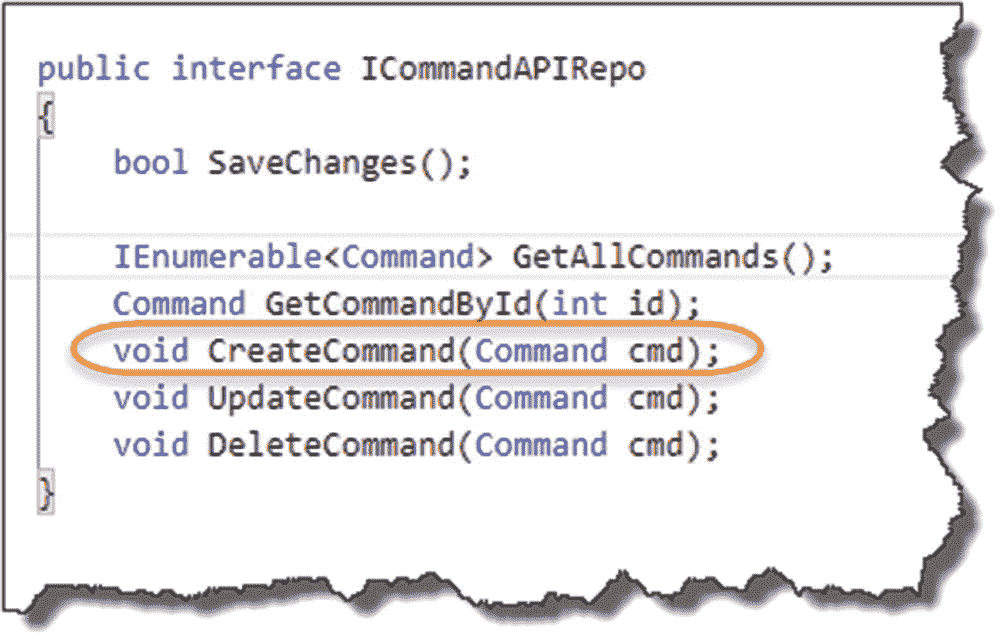

图 10-1

创建命令存储库方法

我们可以看到，对于突出显示的 repository 方法，我们只需要传入一个`Command`对象(根据推断，将其添加到我们的 DB 上下文中——并最终添加到我们的 PostgreSQL 数据库中)。我们不期待任何回报。转到我们的具体实现`SqlCommandAPIRepo`，将下面的代码添加到`CreateCommand`方法中(确保包含`using System`名称空间):

```cs
using System
.
.
.
public void CreateCommand(Command cmd)
{
  if(cmd == null)
  {
    throw new ArgumentNullException(nameof(cmd));
  }
  _context.CommandItems.Add(cmd);
}

```

将这些放在上下文中，见图 [10-2](#Fig2) 。

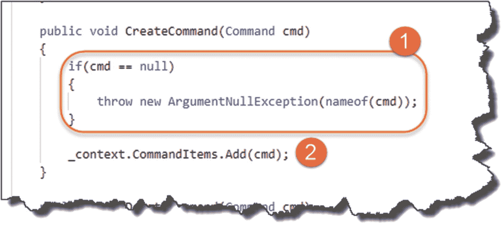

图 10-2

CreateCommand 的实现

1.  我们检查传入的对象是否为空，如果是，抛出一个异常(这种情况将在我们的控制器中被捕获，当它验证我们拥有的命令模型时；但是，我们不知道我们的存储库实现还可以用在其他什么地方，所以以任何方式编写这样的代码都是一个好习惯。

2.  使用我们的 DB 上下文实例(`_context`)，我们引用我们的`CommandItems` DB 集合并调用`Add`方法，传入我们的`Command`对象。

回到我们关于数据如何在 EF 核心中持久化的讨论，你会意识到仅仅调用这个方法*不会将我们的更改持久化到数据库*；此时，我们只将`Command`对象添加到 DB Context/DB 集合中。

#### 实施保存更改

再一次回到我们的存储库接口定义，`ICommandAPIRepo`，你会记得一个神秘的方法定义(很可能不再是*那个*神秘了)。

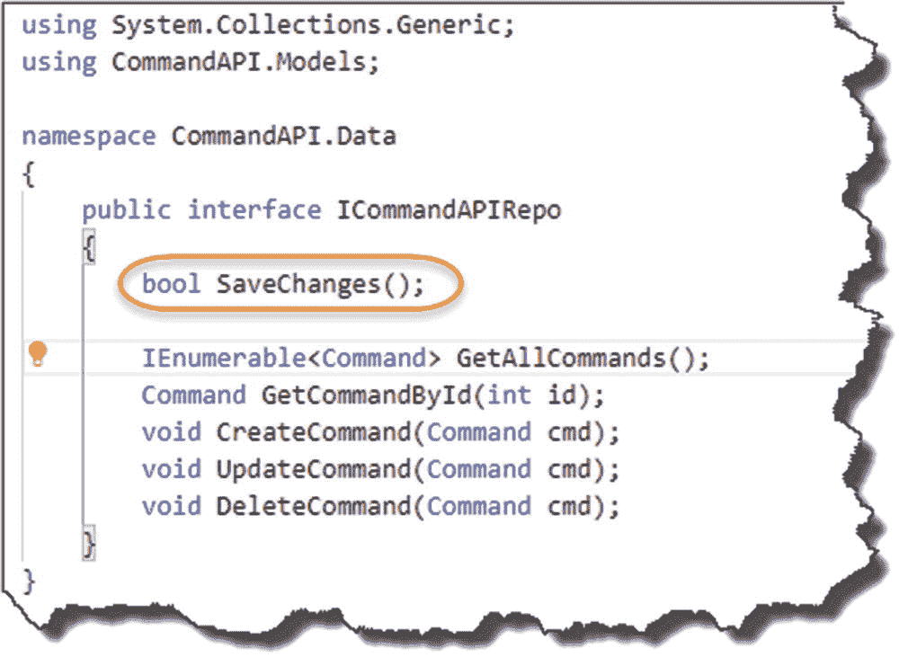

图 10-3

SaveChanges 接口方法

我们现在需要在我们的具体实现中实现它，所以回到`SqlCommandAPIRepo`，将以下代码添加到`SaveChanges`方法中:

```cs
public bool SaveChanges()
{
  return (_context.SaveChanges() >= 0);
}

```

在上下文中，这些变化看起来像这样。

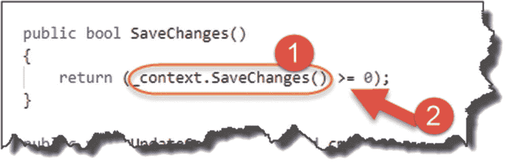

图 10-4

实施保存更改

1.  在我们的数据库上下文中调用`SaveChanges`方法；这会将数据库上下文中所有挂起的更改复制到 PostgreSQL 数据库中，并持久化它们。

2.  如果保存更改的结果大于或等于 0，我们使用这个比较操作符返回`true`(这将是一个正整数，反映受影响的实体的数量，或者如果没有实体是 <sup>[2](#Fn2)</sup> ，当然是 0)。

我们将使用控制器中的`SaveChanges`存储库操作符，并将它用于所有四个剩余的“不安全”端点，以便持久化数据(不仅仅是创建端点)。

这就是我们为 Create 方法排序的存储库，接下来呢？

### CommandCreateDto

在这一章的前面，我问了什么样的*技术*可以用来处理我们从 POST 请求中期望的命令资源的表示与我们内部的`command`模型不同的事实？对于那些回答“DTO”的人，给自己一个鼓励——是的，我们将使用 DTO 来表示我们命令资源的输入，并使用 AutoMapper，将其映射回内部命令模型，我们可以将它传递到我们的存储库，我在图 [10-5](#Fig5) 中展示了这个场景的一个稍微简化的版本。

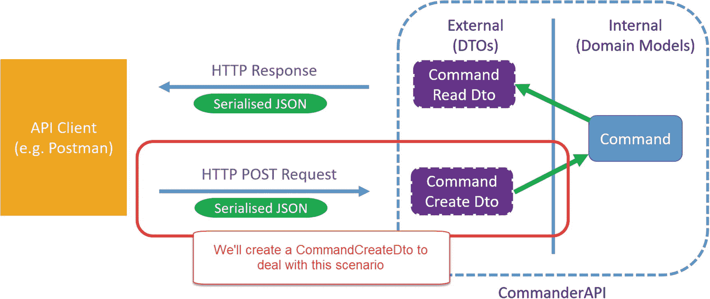

图 10-5

commandcreate DTO example 建立 dto 范例

#### 创建新 DTO

回到我们的项目，在 ***Dtos*** 文件夹中创建一个名为***command created to . cs***的文件。

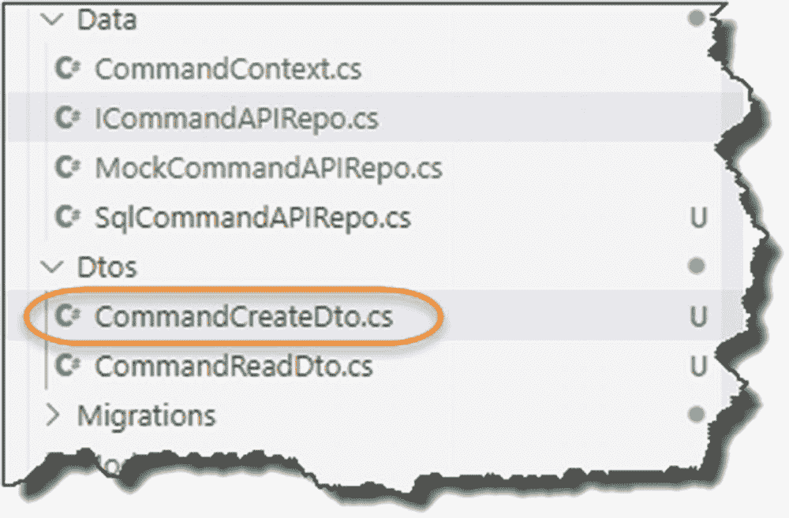

图 10-6

CommandCreateDTO.cs created

在该文件中添加以下代码:

```cs
using System.ComponentModel.DataAnnotations;

namespace CommandAPI.Dtos
{
  public class CommandCreateDto
  {
    [Required]
    [MaxLength(250)]
    public string HowTo { get; set; }

    [Required]
    public string Platform { get; set; }

    [Required]
    public string CommandLine { get; set; }

  }
}

```

这与我们的内部`command`模型完全相同(注意我们已经包括了注释的使用)，除了我们有*没有包括*属性。确保你记得保存文件。

#### 更新自动映射器配置文件

您会记得我们必须为我们的第一个 d to 创建一个概要映射，它将我们的“源”(一个`command`模型)映射到一个目标(我们的`CommandReadDto`)。我们必须做同样的事情。我们只需要小心我们的“来源”和我们的“目标”是什么。所以在 ***的 CommandsProfile.cs*** 文件中的 ***Profiles*** 文件夹下，添加如下映射:

```cs
public class CommandsProfile : Profile
{
  public CommandsProfile()
  {
    //Source ➤ Target
    CreateMap<Command, CommandReadDto>();
    CreateMap<CommandCreateDto, Command>();
  }
}

```

出于解释的目的，我不会显示通常的“上下文中的代码”图像，因为我觉得这很简单，但本质上我们的“源”是`CommandCreateDto`(将在我们的 POST 请求主体中提供)，目标是我们的内部`Command`模型。

所以用

*   新的`CommandCreateDto`创建了

*   更新的自动映射器映射配置文件

我们可以继续实现我们的控制器动作(我们的创建端点)。

### 更新控制器

所以公平的警告，虽然我们下一个动作的代码量不是特别大，但是这一节有很多概念。考虑向您展示它的最佳方式，我决定一次包含所有代码(而不是将它分层，我觉得这样不会很好地翻译成书面页面，而且更令人困惑而不是有帮助)。别担心，我们会一行一行地解释。

因此，在我们的`CommandsController`类中，添加以下代码来创建我们的新控制器动作:

```cs
[HttpPost]
public ActionResult <CommandReadDto> CreateCommand
  (CommandCreateDto commandCreateDto)
{
  var commandModel = _mapper.Map<Command>(commandCreateDto);
  _repository.CreateCommand(commandModel);
  _repository.SaveChanges();

  var commandReadDto = _mapper.Map<CommandReadDto>(commandModel);

  return CreatedAtRoute(nameof(GetCommandById),
    new {Id = commandReadDto.Id}, commandReadDto);
}

```

要了解这些变化，请参见图 [10-7](#Fig7) 。

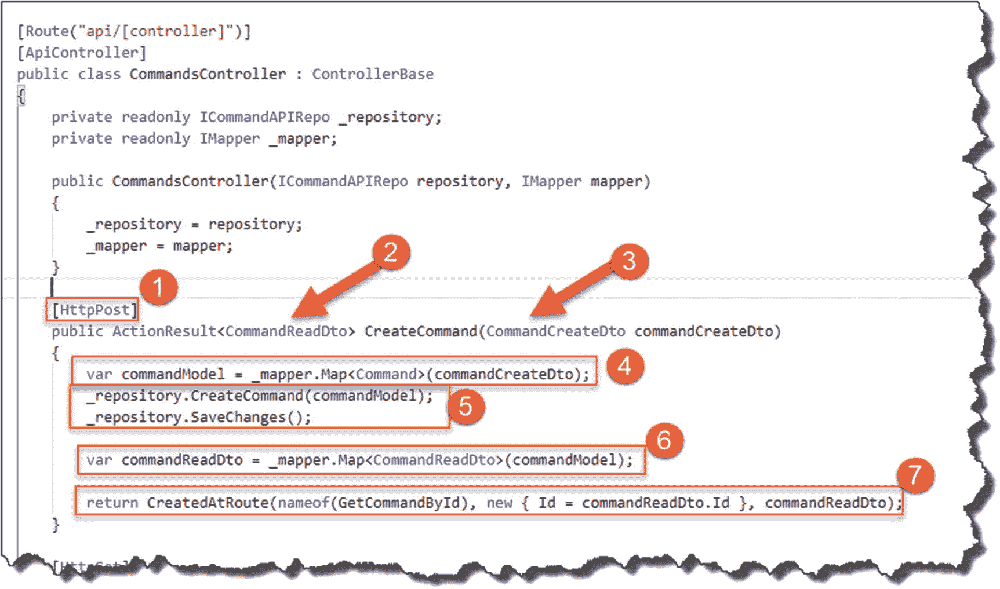

图 10-7

CreateCommand 实现

让我们来看看这个:

#### 1.http post(http post)

我们用`[` `HttpPost` `]`来修饰动作，我感觉够直白了。如前所述，这一行动将响应班级范围内的路线

```cs
api/commands

```

与后置动词一起使用，这使得它对于该控制器来说是唯一的。

#### 2.返回 DTO 类型

正如端点属性中所描述的，我们期望将新创建的资源作为响应的一部分返回给消费者。在这个实例中(和我们现有的两个 GET 动作一样)，我们返回一个`CommandReadDto`。

#### 3.输入 DTO 类型

我们的动作期望`CommandCreateDto`作为输入，这很公平，但是这来自哪里呢？如上所述，*当*我们开始使用 Postman 来测试时，我们将在请求体中放置一个“`CommandCreateDto`”，如下所示。

Important

**不要测试这个动作，因为在它工作之前我们还需要做一些代码修改；我刚刚在图 [10-8](#Fig8) 中展示了机体有效载荷来说明这一点。**

 **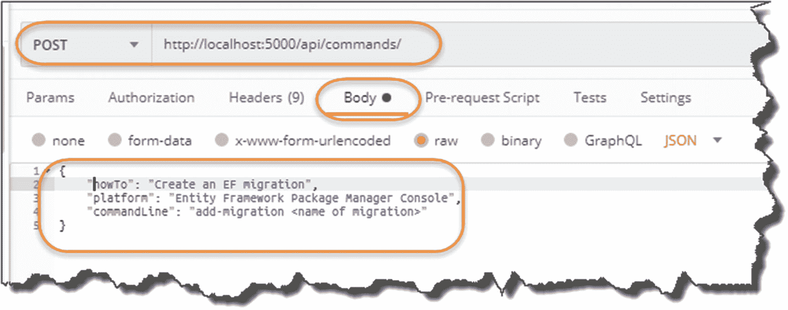

图 10-8

邮递员投递请求

但这仍然没有回答我们的操作如何“知道”从请求体中获取数据并将其作为`commandCreateDto`参数传入的问题。

答案是*绑定源*。

控制器动作可以从许多绑定源获得其输入:

*   从查询字符串中

*   从路线(我们在这里的 URI 表单中获得了`Id`属性)

*   从请求主体

*   从表单域

*   从请求标题中

我们可以明确地告诉我们的动作在哪里定位这些数据，或者我们可以依赖于提供给我们的默认行为。对于用`[ApiController]`属性修饰的控制器(正如我们的一样),*模型对象*的默认位置是请求*主体*。

因此，我们动作的`commandCreateDto`参数将由我们在 POST 请求主体中提供的对象填充。

关于这方面更深入的讨论，我建议你参考微软文档。 <sup>[3](#Fn3)</sup>

#### 4.将我们的 CommandCreateDto 映射到一个命令对象

在这一步中，我们利用我们的 AutoMapper profile 映射，并接受我们的输入`commandCreateDto`，将其映射到一个新创建的`Command`对象。

#### 5.保存我们的数据

在这两个步骤中，我们从步骤 4 中获取新创建的`Command`模型，并将其传递给我们的存储库的`CreateCommand`方法。

然后，我们调用存储库上的`SaveChanges`方法，将更改保存到 PostgreSQL DB 中。

#### 6.将我们创建的命令映射回 CommandReadDto

我们已经说过，我们需要传回一个`CommandReadDto`作为端点规范的一部分，所以我们再次使用 AutoMapper，将新创建的`Command`对象映射回一个`CommandReadDto`。这里需要注意的是，我们已经将`Command`持久化到 PostgreSQL 数据库中；我们现在可以访问`Id`属性(通过引用),这是继续前进所需要的——参见步骤 7。

#### 7.在路线上创建

最后我们返回`CreatedAtRoute`(参见微软文档上的定义 <sup>[4](#Fn4)</sup> )在这里我们:

*   指定我们创建的资源所在的“路径”(下面将详细介绍)。

*   资源的`Id`(用于生成路线)。

*   返回的正文的内容值。

总而言之，这种方法将

*   返回 201-创建的 Http 状态代码。

*   在主体响应中传回创建的资源。

*   在响应头中传回 URI(或者路由，如果您愿意的话)。

它基本上实现了我们的创建端点的预期行为。如果我们再看一下这种方法，我们需要进一步探索一个项目。

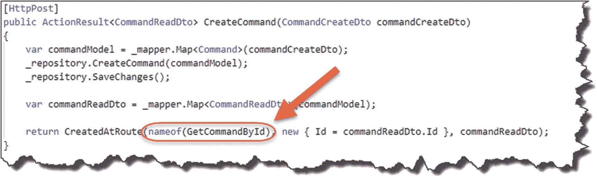

图 10-9

CreatedAtRoute 路由名称参数

`CreatedAtRoute`的第一个参数是`routeName`，在我们的例子中，它只是现有的 GET 动作，根据提供的`Id` : `GetCommandById`返回单个资源。为了让对`CreatedAtRoute`的调用起作用，我们需要返回到`GetCommandById`动作并“命名”它。

因此，在我们的控制器代码中，对`GetCommandById`动作进行必要的高亮更改:

```cs
[HttpGet("{id}", Name="GetCommandById")]

public ActionResult<CommandReadDto> GetCommandById(int id)
{
  var commandItem = _repository.GetCommandById(id);
  if (commandItem == null)
  {
    return NotFound();
  }
  return Ok(_mapper.Map<CommandReadDto>(commandItem));
}

```

我在图 [10-10](#Fig10) 中突出显示了变化。

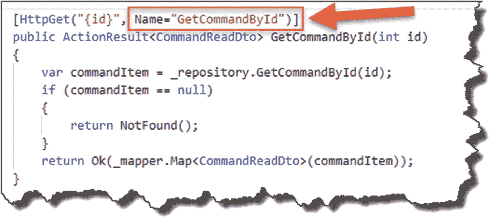

图 10-10

命名我们的 GetCommandById 方法

我们已经显式地命名了我们的操作，因此来自`CreatedAtRoute`的调用可以正确解析。

唷！我告诉过你这个动作有很多，不要担心，剩下的动作没有那么复杂。

剩下要做的就是执行一些手工测试。

### 手动测试创建端点

在你做任何其他事情之前，确保你保存了你所有的代码(我们已经做了相当多的改变)，并且执行一个`dotnet build`来检查错误。假设一切正常，运行您的服务器，然后转到 Postman。

#### 成功的测试案例

在这里，我们将提供必要的输入以产生成功的结果；看看图 [10-11](#Fig11) 中我的邮递员设置。

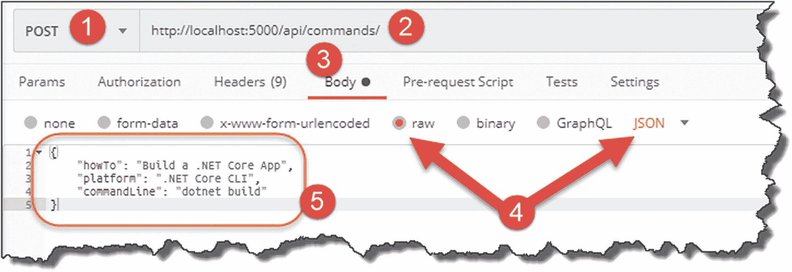

图 10-11

测试 createcommand 端点

1.  确保 POST 是选定的动词。

2.  确保路线正确(注意没有`Id`通过)。

3.  为请求选择“正文”。

4.  为请求主体数据类型设置“Raw”和“JSON”。

5.  提供一个符合我们的`CommandCreateDto.`的有效 JSON 对象

完成所有设置后，单击 Send，您应该会得到以下响应。

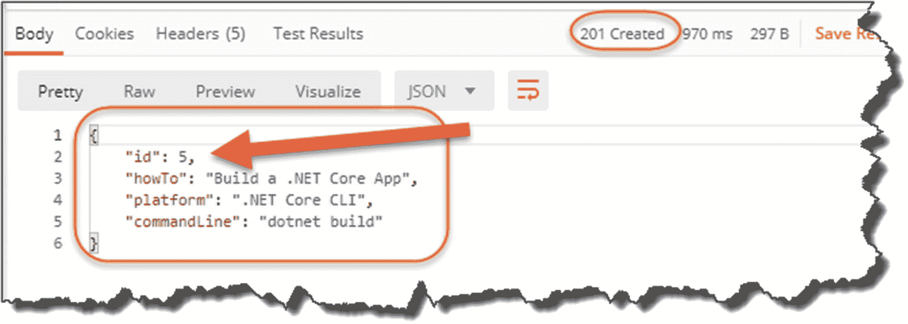

图 10-12

成功的 201 个结果

*   201 Http 创建的状态代码。

*   新创建的 Id 为的资源。

选择 Headers 选项卡，您应该得到以下内容。

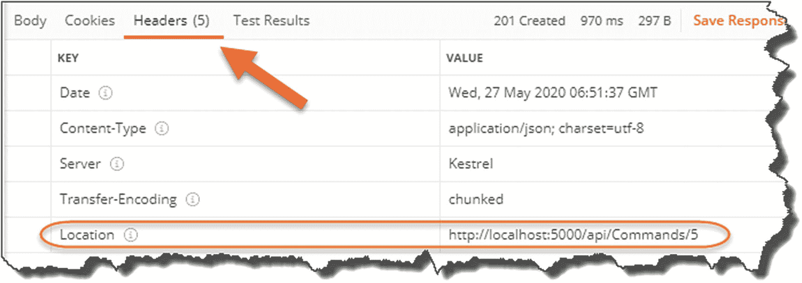

图 10-13

我们新创建的资源的 URI 在头中返回

看起来不错！

Learning Opportunity

你还能做什么来检查资源是否已经被创建？

#### 不成功的测试案例——格式错误的 JSON

让我们发出完全相同的请求，但是这次要对 JSON 主体进行一些修改(例如，删除所有的逗号)，这样我们就得到了糟糕的 JSON 格式。单击 Send，您应该会看到以下内容。

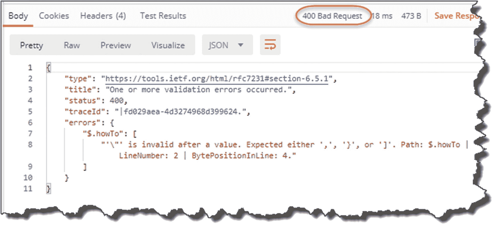

图 10-14

错误的请求

我们收到一个 Http 400-Bad 请求，以及一些关于错误的有用指导。我们并没有在我们的控制器动作中专门编写这种行为——我们默认获得这种行为，因为我们已经用`[ApiController]`属性修饰了我们的控制器——看看它有多有用！

#### 不成功的测试案例——与我们的注释相矛盾

我想运行的最后一个不成功的测试用例是确保我们违反了我们已经放在我们的`CommandCreateDto`上的数据注释，特别是我们的一个属性上的`[Required]`属性。为了测试，重新格式化 JSON 使其有效，并删除`Platform`属性。再次点击发送，你应该会得到以下内容。

我们得到另一个 400 Bad Request Http 响应，以及一些关于验证错误的详细信息。

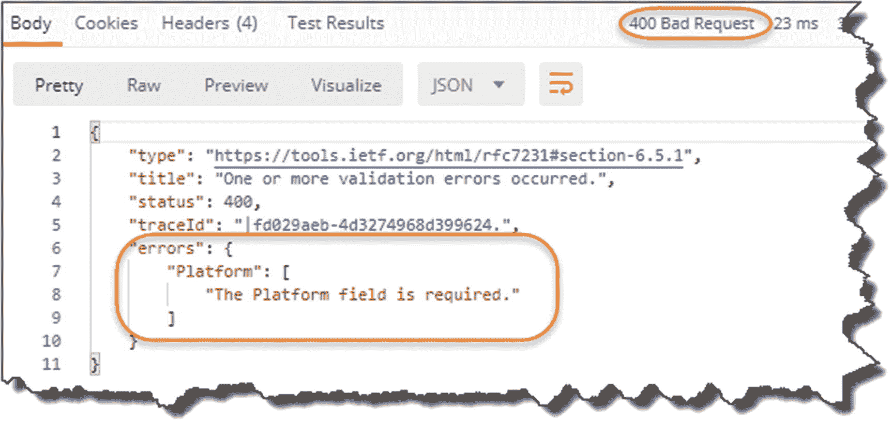

图 10-15

带有验证详细信息的错误请求

Learning Opportunity

测试如果从我们的`CommandCreateDto`的`Platform`属性中移除`[Required]`属性，并重新运行相同的请求，会发生什么。

我们将在第 [11 章](11.html)中继续测试我们所有的端点，但是现在让我们继续实现我们的更新端点。

## 更新端点#1(上传)

我们要实现的下一个端点是第一个“更新”动作，它使我们能够使用 PUT 请求对 DB 中的单个资源进行完全更新。表中显示了我们的高级定义的快速提示。

<colgroup><col class="tcol1 align-left"> <col class="tcol2 align-left"> <col class="tcol3 align-left"> <col class="tcol4 align-left"></colgroup> 
| 

动词

 | 

上呼吸道感染

 | 

操作

 | 

描述

 |
| --- | --- | --- | --- |
| 放 | /API/命令/{Id} | 更新(完整) | 更新单个资源的所有内容(按 Id) |

和以前一样，我介绍了一些其他属性，它们将帮助我们更有效地理解、构建和测试我们的端点。

<colgroup><col class="tcol1 align-left"> <col class="tcol2 align-left"></colgroup> 
| 

属性

 | 

描述

 |
| --- | --- |
| 输入(x2) | 要更新的资源的 Id。这将出现在我们的看跌请求的 URI 中。要更新的完整“命令”对象。这将被添加到我们的 PUT 请求的`request body`中；这里显示了一个示例:`{``"howTo": "Example how to",``"platform": "Example platform",``"commandLine": "Example command line"``}` |
| 过程 | 将尝试完全更新数据库中的现有命令对象 |
| 成功产出 | HTTP 204 无内容响应代码 |
| 故障输出 | HTTP 400 错误请求找不到 HTTP 404 不允许 HTTP 405 |
| 安全的 | 否–端点可以改变我们的资源 |
| 幂等 | 是–重复相同的操作不会导致不同的结果 |

同样，非常直接，但我要指出以下几点。

### 输入对象

这与我们的 Create endpoint 相同——这是否意味着我们可以重用我们的`CommandCreateDto`？理论上我们可以，但为了真正的解耦，我们将创建一个单独的`CommandUpdateDto`，只是为了在这些对象将来发生分歧时，我们的解决方案经得起时间考验。

需要注意的另一点是，这个对象不包含`Id`属性。对于这个操作，我们确实需要它(否则，我们怎么知道更新哪个对象)，但是在这种情况下，我们从 URI 获得这个值(这是 REST 的另一个规定)，所以我们不需要在这里加倍。

### 成功产出

在这种情况下非常简单，我们只需提供一个 204 无内容 http 结果。

### 幂等

这个方法是幂等的，因为你可以重复多次，结果将是相同的。

Les’ Personal Anecdote

与补丁请求相比，上传请求现在已经失宠了，主要是因为你必须提供 ***所有*** 要更新的对象属性，甚至是那些不变的属性！

对于大型对象来说，这确实是低效的。假设你有一个有 20 个属性的对象，你只需要改变 1 个，你仍然需要把所有的 20 个属性提供给 PUT 请求，确保你为 19 个*没有改变*的属性提供正确的(相同的)值。

如果您无意中提供了错误的值或完全忽略了 19 个值中的 1 个，您可能会陷入真正的冲突！*咳嗽，咳嗽；我从未做过那件事。*

不仅在这方面有问题/效率低；从网络的角度来看，这不是最优的；您实际上是在通过线路(或空中)发送潜在的大量冗余数据。

我把它放在这里的唯一原因是为了完整，因为我是一个好人。

### 更新存储库

同样，从存储库级别开始，让我们看看我们的`ICommandRepoAPI`接口中的更新方法签名。

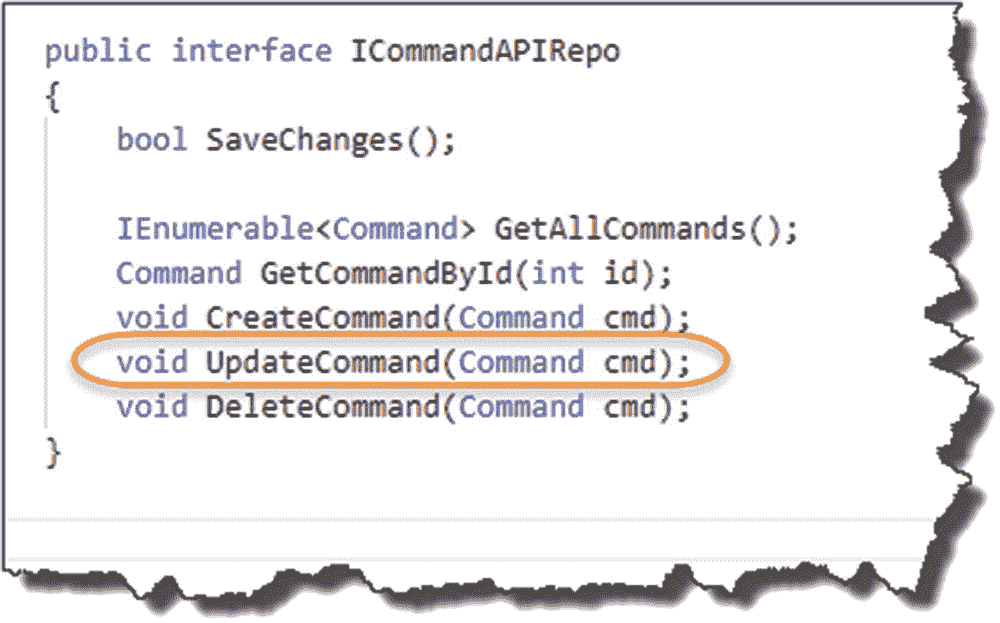

图 10-16

UpdateCommand 接口方法

我们接受一个命令对象(如果需要，更新数据库)，并且不期望传回任何东西。你会注意到我的用词:“如果需要，更新数据库*；我选择这些的原因将在下面变得更清楚。*

关于我们的存储库接口，我想提醒你的是，它是*技术不可知的*——这意味着它是一个接口规范，我们可以针对不同的持久性提供者使用，例如，Entity Framework Core、nHibernate、Dapper 等。我们只是碰巧将它与实体框架核心一起使用，因此我们必须为那个 ORM 提供一个特定的、具体的实现。这就是奇怪的地方。

转到我们的`SqlCommandAPIRepo`实现类，如下更新`UpdateCommand`方法:

```cs
public void UpdateCommand(Command cmd)
{
  //We don't need to do anything here
}

```

是的，没错——它包含“没有实现”——只是我的一个愚蠢的评论。我没疯，让我解释。

#### 还记得我们的数据库上下文是如何工作的吗

回想一下本章开始时关于 EF 核心如何保存数据的冗长解释；这不仅是一般有用的信息，而且是在预期的解释下完成的。这是收益。

我们将在我们的控制器动作中实际执行我们现有的`Command`对象*的*更新*，所以我们不需要在我们的存储库实现中放入任何代码。当我们开始编写代码时，它可能会变得更加清晰，但是让我进一步解释这是如何工作的:*

1.  将调用更新动作(在请求体中使用`CommandUpdateDto`对象)。

2.  **在我们的控制器**中:基于请求 URI 中的`Id`,我们将搜索 DB 上下文，看看我们是否有一个现有的`Command`对象带有那个`Id.`

3.  **如果不存在**:我们返回 404 未找到结果并返回。

4.  **如果它确实存在**:我们将把请求体中收到的`CommandUpdateDto`映射到我们刚刚在第 2 步中从 DB 上下文中收到的`Command`对象。**此时，DB 上下文中的命令对象被更新**。因此，我们的`SqlCommandAPIRepo`库中不需要任何实现代码。

5.  我们在存储库上调用`SaveChanges`方法，更改将被持久化到数据库中。

你可能会问一个非常合理的问题:如果我们*在这里不需要*实现代码，为什么不把它从我们的存储库接口中完全删除呢？这个问题的答案是再次提醒你，存储库接口是技术不可知的，所以虽然我们不需要实现*在这个例子*中，如果我们选择切换我们的持久性提供者，他们*可能需要*一个编码的实现。

所以从逻辑上讲，在我们的接口中指定一个更新方法签名是有意义的，即使在这个实例中我们*不需要*实现它。

总之，至此我们完成了存储库的“实现”,可以继续进行 DTO 了。

### 命令更新到

正如最近所描述的，我们将在请求体中期待一个`CommandUpdateDto`,并将其映射到从 DB 上下文中检索的`Command`。为此，在 ***Dtos*** 文件夹中创建一个名为***commandupdatedto . cs***的文件，并添加以下代码:

```cs
using System.ComponentModel.DataAnnotations;

namespace CommandAPI.Dtos
{
  public class CommandUpdateDto
  {
    [Required]
    [MaxLength(250)]
    public string HowTo {get; set;}

    [Required]
    public string Platform {get; set;}

    [Required]
    public string CommandLine {get; set;}
  }
}

```

这与我们的`CommandCreateDto`完全相同，但是我们将维护一个单独的实例以备将来使用。保存文件，并继续更新 AutoMapper 概要文件映射。

#### 更新自动映射器配置文件

我们需要添加一个映射，将`CommandUpdateDto`作为映射源，将`Command`模型作为目标，因此用下面的映射条目更新`CommandsProfile`类:

```cs
using AutoMapper;
using CommandAPI.Dtos;
using CommandAPI.Models;

namespace CommandAPI.Profiles
{
  public class CommandsProfile : Profile
  {
    public CommandsProfile()
    {
      //Source ➤ Target
      CreateMap<Command, CommandReadDto>();
      CreateMap<CommandCreateDto, Command>();
      CreateMap<CommandUpdateDto, Command>();
    }
  }
}

```

我不认为在这个阶段我们需要任何进一步的解释！

### 更新控制器

回到我们的控制器，我们需要添加一个新的控制器动作来托管我们的新端点，因此在`CommandsController`类中，添加以下代码来实现这一点:

```cs
[HttpPut("{id}")]
public ActionResult UpdateCommand(int id, CommandUpdateDto commandUpdateDto)
{
  var commandModelFromRepo = _repository.GetCommandById(id);
  if (commandModelFromRepo == null)
  {
    return NotFound();
  }
  _mapper.Map(commandUpdateDto, commandModelFromRepo);

  _repository.UpdateCommand(commandModelFromRepo);

  _repository.SaveChanges();

  return NoContent();
}

```

让我们浏览一下代码。

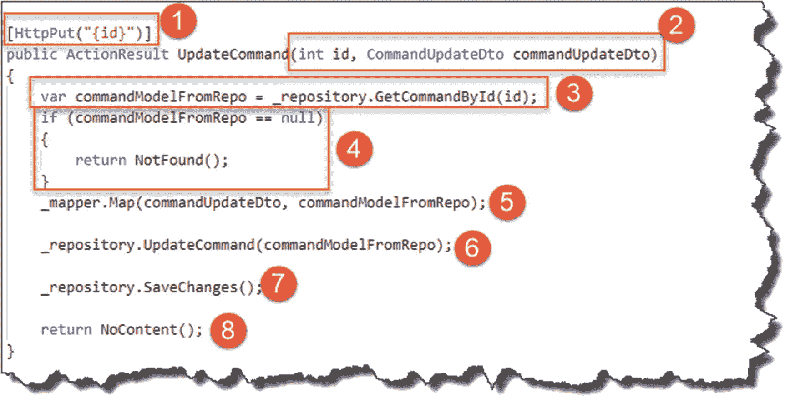

图 10-17

UpdateCommand 控制器操作实现

#### 1.http put(http put)

我们用`[HttpPut]`属性来修饰`UpdateCommand`方法(这里没有真正的争议)，但是我们也期望将`Id`作为路线的一部分；这意味着这个端点将响应类范围的路由加上 Id，所以

```cs
api/commands/{id}

```

#### 2 个输入

`UpdateCommand`方法需要两个参数:

1.  `id`:这是从 route 传入的 id，相当于我们想要尝试更新的资源的唯一 id。

2.  `commandUpdateDto`:这是请求体中传入的对象。

#### 3.尝试命令资源检索

我们使用从路由传入的`id`，并使用我们现有的存储库方法`GetCommandById`，尝试检索它。不管结果如何，我们将这个操作的结果放在`commandModelFromRepo`中。

#### 4.未找到返回 404

这里不多说了；如果我们试图从存储库中检索的“对象”为空，那么我们只返回 404 Not Found Http 响应。

#### 5.更新我们的命令

这是实际更新发生的地方！我们在我们的`_mapper`实例上使用稍微不同形式的`Map`方法来将 DTO 映射到我们的命令。通过引用，命令对象在数据库上下文中更新。同样，这还没有反映到我们的 PostgreSQL 数据库中。

#### 6.不更新任何内容

这个是有争议的！你可能认为我现在已经疯了。

这一行没有任何作用(目前)。但是请记住，我们可能会在任何时候将我们的实体框架核心实现替换为另一个提供者，而这个提供者可能需要对我们存储库中的方法进行调用。这与最初将定义保存在存储库接口中的原因基本相同。

通过在这里保留这个调用(即使它目前是多余的)，如果我们交换我们的存储库实现(这需要调用`UpdateCommand`)，我们将不需要改变我们的控制器代码，这是做所有这些的一个要点！

Personal Perspective

这可能是这个版本中最有争议的部分，也是我经常被质疑的部分。如果你觉得更舒服的*不包括*第六步，那是你的选择；代码仍将在*这个*实例中工作。

我个人发现，知识和理解的嵌入来自于你自己的实践方法和实验——所以去做你觉得最适合你的事情。然而，如果您将来不得不重新编写代码，请记住这一节。

#### 7.保存更改

一个显而易见的问题，我不认为我需要在这里继续下去。

#### 8.返回 204 无内容

简单明了，我们返回一个没有内容的 204。您还会注意到`UpdateCommand`方法没有返回类型。

好了，保存您的工作，启动您的引擎，让我们继续执行一些手动测试。

### 手动测试更新(上传)端点

#### 成功的测试案例

在这里，我们提供必要的输入，以生成成功的结果，如图 [10-18](#Fig18) 中的邮递员设置所示。

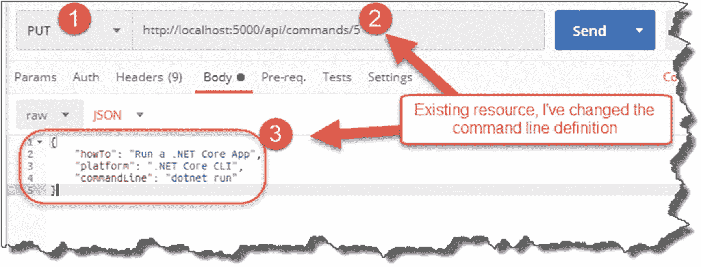

图 10-18

测试 Put 操作结果

1.  确保选择了 PUT。

2.  要更新的资源的路由必须有效。

3.  我刚刚更新了`howTo`和`commandLine`，但是我还必须提供`Platform`，尽管这并没有改变。

点击发送，您应该会得到与图 [10-19](#Fig19) 类似的结果。

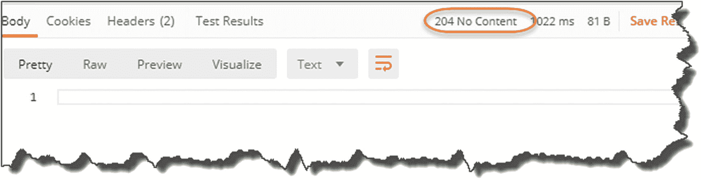

图 10-19

成功–204 无内容返回

相当基础，只是一个 204 无内容 Http 响应。我将让您来检查这是否确实更新了数据库中的资源。

#### 不成功的测试用例——与我们的注释相矛盾

在这个测试中，我们将尝试更新一个现有的资源，并且不提供一个`[Required]`属性；参见图 [10-20](#Fig20) 中我的邮递员设置。

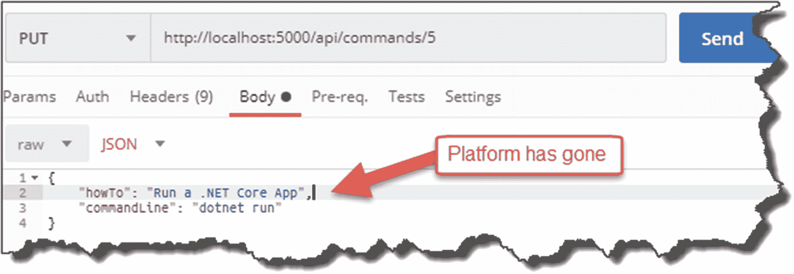

图 10-20

强制验证错误

点击发送，您将看到如下内容。

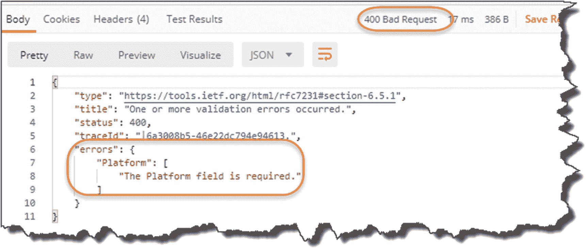

图 10-21

返回了验证错误

这证明了数据注释的有用性。但是我听到你哭了:我想你说过我们需要在一个 PUT 请求中提供所有的属性？

问得好，如果你想让它们更新(或者保持不变)，答案是肯定的。将`[Required]`注释从等式中去掉，如果我们*可以为`Platform`提供一个空的*值，并且不在我们的 PUT 请求中提供它——那就可以了。然而将会发生的是,`Platform`的现有值将不会保持不变；它将恢复为默认值，如果没有默认值，则为 null！

#### 不成功的测试案例–无效的资源 id

这里，我们只是为不存在的资源提供一个 Id。

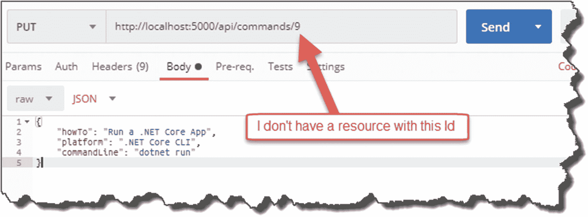

图 10-22

使用不存在的资源进行测试

点击发送，你会得到以下内容。

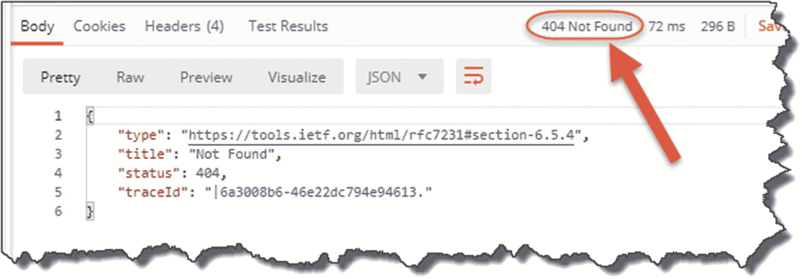

图 10-23

404 未找到返回

所以，看起来一切都按照我们的要求进行；让我们继续讨论更有趣的补丁更新端点。

## 更新端点#2(补丁)

我们要实现的下一个端点是第二个“更新”端点(使用补丁动词)，它使我们能够对资源执行部分更新。这解决了我们在上一节中提到的 PUT 端点的许多低效问题。表中显示了我们的高级定义的快速提示。

<colgroup><col class="tcol1 align-left"> <col class="tcol2 align-left"> <col class="tcol3 align-left"> <col class="tcol4 align-left"></colgroup> 
| 

动词

 | 

上呼吸道感染

 | 

操作

 | 

描述

 |
| --- | --- | --- | --- |
| 修补 | /API/命令/{Id} | 更新(部分) | 更新单个资源的一部分(按 Id) |

为了进一步充实我们的定义，我在这里添加了一些属性。

<colgroup><col class="tcol1 align-left"> <col class="tcol2 align-left"></colgroup> 
| 

属性

 | 

描述

 |
| --- | --- |
| 输入(x2) | 要更新的资源的 Id。这将出现在我们的补丁请求 URI。要应用于资源的变更集或“补丁文档”这将被添加到我们的补丁请求的`request body`中；这里显示了一个示例:`[``{``“op”: “replace”,``“path”: “/howto”,``“value”: “Some new value”``},``{``“op”: “test”,``“path” : “commandline”,``“value” : “dotnet new”``}``]` |
| 过程 | 将尝试执行修补程序文档中指定的更新注意:如果有多个更新，所有这些更新都必须成功。如果一个失败了，那么他们都失败了。 |
| 成功产出 | HTTP 204 不满足 HTTP 状态 |
| 故障输出 | HTTP 400 错误请求找不到 HTTP 404 不允许 HTTP 405 |
| 安全的 | 否–端点可以改变我们的资源 |
| 幂等 | 否–重复相同的操作*可能会导致*产生不同的结果 |

这里有几个新概念，我们来看一下。

### 输入对象

我们没有提供我们想要更新的资源的表示，而是提供了我们想要对该资源执行的一系列更改。我们称之为补丁文档或变更集。

我们的补丁文档可以执行以下*操作*:

*   **Add** :给我们的对象添加一个新属性(这需要“动态”对象，我们不会用到)。

*   **Remove** :同样，需要动态对象并允许我们从资源中删除属性。

*   **Replace** :允许我们更改现有的属性(这是我们将要使用的属性)。

*   **Copy** :顾名思义，这允许我们将一个资源属性值复制到另一个。

*   **移动**:与合并复制和删除操作相同。

*   **Test** :允许我们测试给定资源属性的值。

除了指定我们想要对属性执行什么操作，我们还需要提供

*   资源属性路径

*   我们要分配的新值

为清晰起见，请参考图 [10-24](#Fig24) 中的示例。

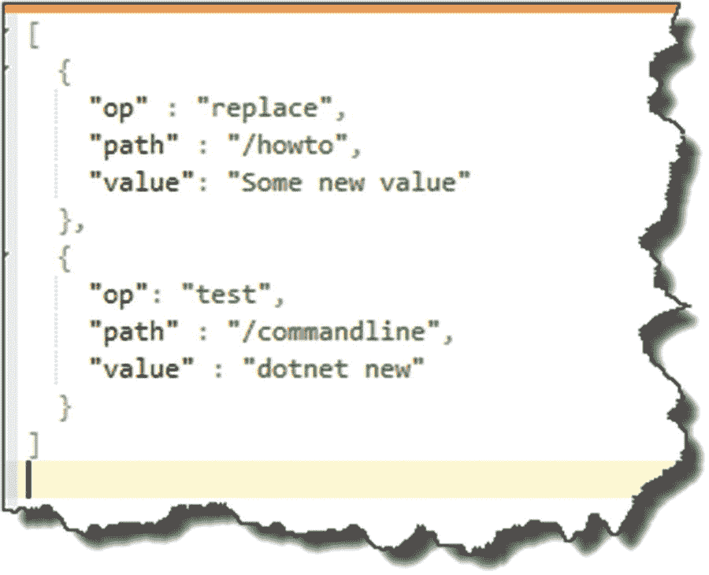

图 10-24

简单补丁文档的示例

修补文档试图执行两个操作:

1.  将属性`howto`的值替换为“某个新值”

2.  测试以查看`commandline`属性是否包含值“dotnet new”

要使这个修补文档成功，这两个操作都需要成功。

有关补丁规范的更多信息，请参考 RFC 6902 标准。 <sup>[5](#Fn5)</sup>

### 幂等

修补操作不是等幂的，因为多次运行相同的请求可能会产生不同的结果。

### 更新存储库

不需要对我们的存储库执行进一步的更新。

### 命令更新到

虽然不要求对我们的`CommandUpdateDto`进行任何更改，但是我们确实需要向我们的 AutoMapper 概要文件添加一个进一步的映射。我不打算在这里解释为什么；我们将只做必要的修改，然后在实现控制器动作时再回到这个问题上来，因为这一点更容易解释。

因此，打开 ***概要文件*** 文件夹中的`CommandsProfile`类，并添加以下(最终)映射:

```cs
public class CommandsProfile : Profile
{
  public CommandsProfile()
  {
    //Source ➤ Target
    CreateMap<Command, CommandReadDto>();
    CreateMap<CommandCreateDto, Command>();
    CreateMap<CommandUpdateDto, Command>();
    CreateMap<Command, CommandUpdateDto>();
  }
}

```

你应该对这里发生的事情感到舒服；下面我们就来盖掉*为什么*。

### 安装修补程序的依赖项

与我们讨论的其他端点不同，补丁请求需要安装更多的包依赖项，以便补丁请求能够正常工作。因此，在命令提示符下(并确保您“在” ***CommandAPI*** 项目文件夹中)，发出以下命令:

```cs
dotnet add package Microsoft.AspNetCore.JsonPatch
dotnet add package Microsoft.AspNetCore.Mvc.NewtonsoftJson

```

第一个添加了对补丁请求的支持；第二个是正确处理控制器中的补丁文档所必需的。

要确保安装了依赖项，请检查 ***。csproj** 文件用于我们的项目。*

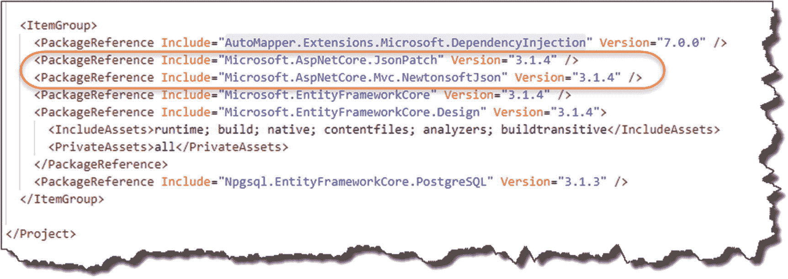

图 10-25

支持修补程序所需的软件包

### 更新启动类

为了使用我们之前添加的第二个包，我们需要对我们的`Startup`类做一个小的添加，如下所示(确保包括 using 语句):

```cs
.
.
.
using Newtonsoft.Json.Serialization;
.
.
services.AddControllers().AddNewtonsoftJson(s =>
{
  s.SerializerSettings.ContractResolver = new
  CamelCasePropertyNamesContractResolver();
});
.
.

```

为了将这些变化放在上下文中(为了简洁起见，我没有在下面展示新的使用语句)，参见图 [10-26](#Fig26) 。

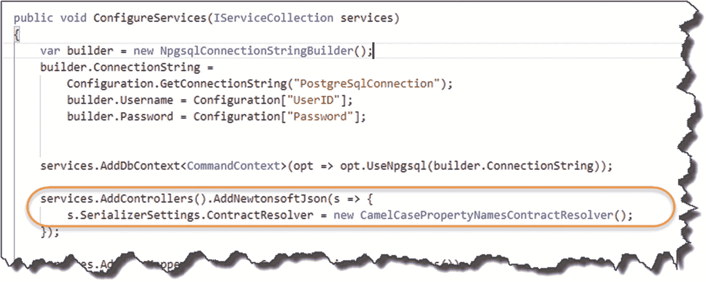

图 10-26

控制器上的序列化程序设置

如您所见，我们要求在控制器中使用`NewtonSoftJson`包；这允许正确解析我们的补丁文档。

设置完成后，我们现在准备好转向控制器。

### 更新控制器

正如我们在创建操作中所做的那样，我将让您输入该操作的完整代码，然后我们将通过解释的方式一行一行地浏览代码。

```cs
using Microsoft.AspNetCore.JsonPatch;

[HttpPatch("{id}")]
public ActionResult PartialCommandUpdate(int id,
  JsonPatchDocument<CommandUpdateDto> patchDoc)
{
  var commandModelFromRepo = _repository.GetCommandById(id);
  if(commandModelFromRepo == null)
  {
    return NotFound();
  }

  var commandToPatch = _mapper.Map<CommandUpdateDto>(commandModelFromRepo);
  patchDoc.ApplyTo(commandToPatch, ModelState);

  if(!TryValidateModel(commandToPatch))
  {
    return ValidationProblem(ModelState);
  }

  _mapper.Map(commandToPatch, commandModelFromRepo);

  _repository.UpdateCommand(commandModelFromRepo);

  _repository.SaveChanges();

  return NoContent();
}

```

有很多东西需要理解，所以在开始测试之前，让我们先浏览一下代码。

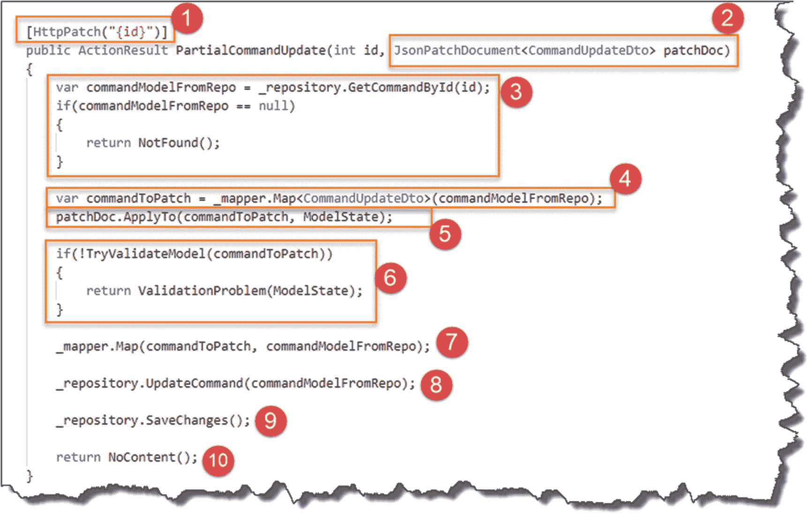

图 10-27

补丁控制器操作

#### 1.HttpPatch

这里不应该有任何惊喜；我们需要用`[` `HttpPatch` `]`来修饰，并指定我们期望在路由中有一个资源 Id。

#### 2.JsonPatchDocument

我们期望请求体中的`JsonPatchDocument`应用于`CommandUpdateDto`。这为下面执行的验证提供了信息。(我们需要指定`JsonPatchDocument`适用的对象类型，以便推断它是否有效。)

#### 3.尝试命令资源检索

这与我们在 PUT 操作中使用的代码完全相同；它不需要进一步的限定。

#### 4.创建占位符命令更新到

我们需要基于刚刚成功检索的`Command`对象创建一个`CommandUpdateDto`对象。为什么呢？正如步骤 1 中提到的，`JsonPatchDocument`必须“应用于”特定的对象类型；在本例中，我们已经指定了一个`CommandUpdateDto`，所以我们需要创建一个来使用。

Circle Back

这就是为什么我们需要添加第四个也是最后一个 AutoMapper 配置文件映射。

#### 5.应用补丁文档

在这里，我们将在请求体中收到的补丁文档应用到新创建的`CommandUpdateDto` : `commandToPatch`。

Circle Back

如果我们没有包含并使用`Microsoft.AspNetCore.Mvc.NewtonsoftJson`包，我们将无法正确执行此操作。

#### 6.验证模型更改

在补丁文档中应用了所需的更改之后，我们将尝试查看模型验证(通过我们的数据注释)是否有效。例如，如果补丁文档请求对大于 250 个字符的`HowTo`属性进行替换操作，它将在这里被拾取。

#### 7.将更新的 Dto 映射到命令并返回

我们的`CommandUpdateDto` ( `commandToPatch)`至此已成功更新。我们现在使用 AutoMapper 将它映射回我们数据库上下文中的`Command`对象。

Note

从这一点开始，代码与我们之前的 PUT 操作相同，所以为了避免重复解释，请参考最近的解释。

这样，我们就完成了控制器动作的编码；请确保您保存了所有内容，然后我们将继续进行一些手动测试。

### 手动测试更新(修补)端点

#### 成功的测试案例

这里最重要的是补丁文档；首先，我保持简单并更新现有资源的`HowTo`属性，如我的 Postman 设置所示。

1.  PATCH Verb is selected.

    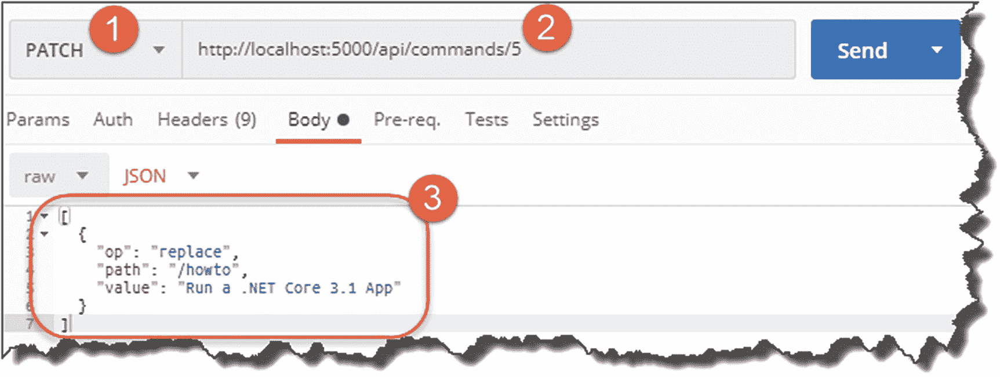

    图 10-28

    测试我们的补丁操作结果

2.  URI 对现有资源的利用。

3.  我们的补丁文档只需一次操作。

Warning!

你会注意到，即使我们的补丁文档只有一个操作，我们仍然需要用方括号[]将它括起来。

记住我们在 JSON 上的讨论，方括号[]表示数组。

Learning Opportunity

我不会在这里详述我们失败或不成功的测试案例，而是留给你去探索它们——玩得开心！(它们和我们运行的 PUT 没有太大区别。)

## 删除端点(删除)

我们想要实现的最后一个端点是“Delete”端点，它使我们能够从 DB 中删除资源。这里显示了我们的高级定义的快速提示。

<colgroup><col class="tcol1 align-left"> <col class="tcol2 align-left"> <col class="tcol3 align-left"> <col class="tcol4 align-left"></colgroup> 
| 

动词

 | 

上呼吸道感染

 | 

操作

 | 

描述

 |
| --- | --- | --- | --- |
| 删除 | /API/命令/{Id} | 删除 | 删除单个资源(按 Id) |

此处列出了此端点应如何操作的更多详细信息。

<colgroup><col class="tcol1 align-left"> <col class="tcol2 align-left"></colgroup> 
| 

属性

 | 

描述

 |
| --- | --- |
| 输入(x1) | 要删除的资源的 Id。这将出现在我们的删除请求的 URI 中 |
| 过程 | 将尝试删除数据库中的现有命令对象 |
| 成功产出 | HTTP 204 无内容 HTTP 结果 |
| 故障输出 | HTTP 404 未找到 HTTP 结果 |
| 安全的 | 否–端点可以改变我们的资源 |
| 幂等 | 是–重复相同的操作会导致相同的结果 |

这里没有太多东西需要调用，所以让我们继续讨论我们需要编码的东西。

### 更新存储库

回头参考我们的存储库接口，如图 [10-29](#Fig29) 所示。

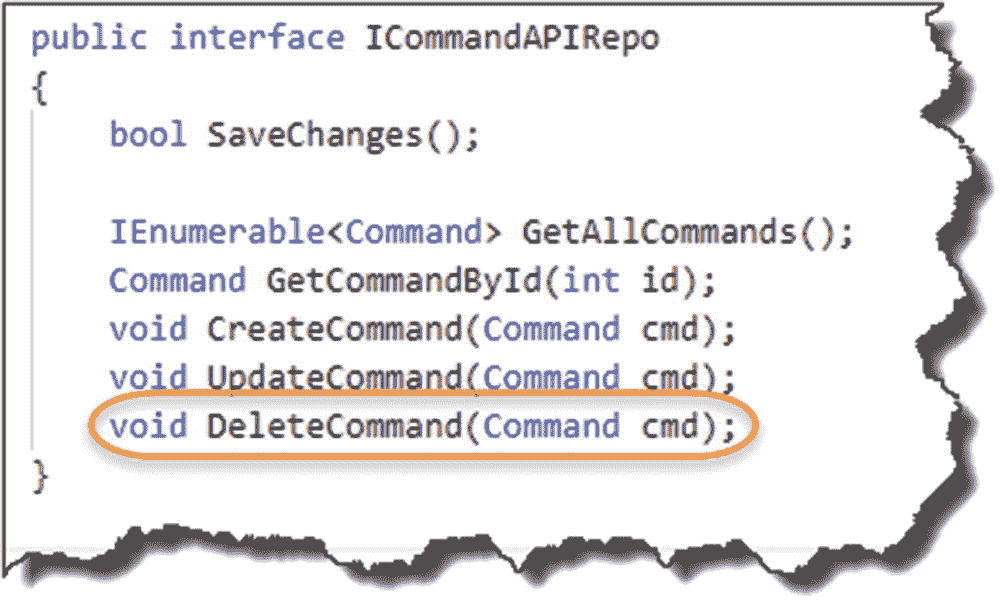

图 10-29

删除接口方法

我们期望命令对象被删除，并且不期望任何东西被传递回来。

转到我们的实现类`SqlCommandAPIRepo`，更新`DeleteCommand`方法如下:

```cs
public void DeleteCommand(Command cmd)
{
  if(cmd == null)
  {
    throw new ArgumentNullException(nameof(cmd));
  }
  _context.CommandItems.Remove(cmd);
}

```

代码非常简单，所以我觉得不需要进一步解释。请记住，调用这个方法只是在 DB 上下文中将`Command`标记为删除；我们仍然需要调用`SaveChanges`来实现数据库中的更改。

### 命令删除到

对`CommandDeleteDto`没有要求。

### 更新控制器

幸运的是，我们删除操作的代码非常简单(与我们所做的最后三个端点相比)；这里显示了:

```cs
[HttpDelete("{id}")]
public ActionResult DeleteCommand(int id)
{
  var commandModelFromRepo = _repository.GetCommandById(id);
  if(commandModelFromRepo == null)
  {
    return NotFound();
  }
  _repository.DeleteCommand(commandModelFromRepo);
  _repository.SaveChanges();

  return NoContent();
}

```

Learning Opportunity

我觉得在这个阶段，增加额外的叙述对代码做什么以及如何手动测试没有什么好处！

我们已经涵盖了非常复杂的用例，所以我认为您可以自己完成这个端点的手动测试。

## 包裹

Celebration Checkpoint

我们现在已经完全实现了我们的 API！恭喜你！

我们在这一章中讨论了很多代码；我确实考虑过把它分成多个章节，但是我认为这可能会打断我们正在处理的内容。

让我们再次回到我们的应用架构，如图 [10-30](#Fig30) 所示。

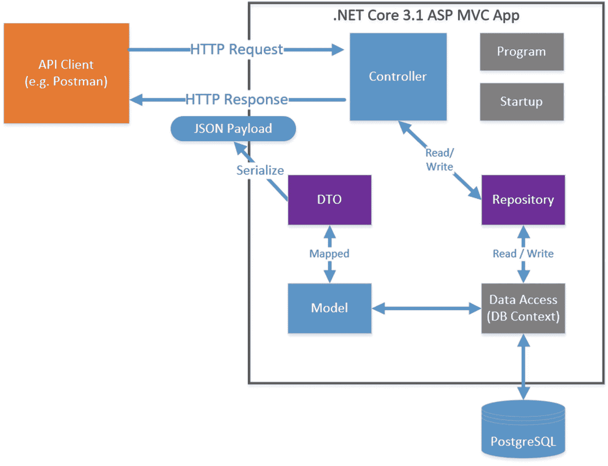

图 10-30

架构检查点

您可以看到，我们现在已经实施了所有内容，干得好！但是不要庆祝得太快，因为我们还没有完成。在接下来的章节中，我将带您了解

*   对我们的 API 进行自动化测试

*   使用 CI/CD 管道将 API 部署到生产环境中

*   保护我们的 API 免受不速之客的侵扰

在继续之前，记得保存所有内容并提交到 GitHub。

<aside aria-label="Footnotes" class="FootnoteSection" epub:type="footnotes">Footnotes [1](#Fn1_source)

[T2`https://en.wikipedia.org/wiki/Representational_state_transfer`](https://en.wikipedia.org/wiki/Representational_state_transfer)

  [2](#Fn2_source)

[T2`https://docs.microsoft.com/en-us/dotnet/api/microsoft.entityframeworkcore.dbcontext.savechanges`](https://docs.microsoft.com/en-us/dotnet/api/microsoft.entityframeworkcore.dbcontext.savechanges)

  [3](#Fn3_source)

[T2`https://docs.microsoft.com/en-us/aspnet/core/mvc/models/model-binding?view=aspnetcore-3.1`](https://docs.microsoft.com/en-us/aspnet/core/mvc/models/model-binding%253Fview%253Daspnetcore-3.1)

  [4](#Fn4_source)

[T2`https://docs.microsoft.com/en-us/dotnet/api/system.web.http.apicontroller.createdatroute`](https://docs.microsoft.com/en-us/dotnet/api/system.web.http.apicontroller.createdatroute)

  [5](#Fn5_source)

[T2`https://tools.ietf.org/html/rfc6902`](https://tools.ietf.org/html/rfc6902)

 </aside>****