# 十一、单元测试我们的 API

## 章节总结

在这一章中，我们将向你介绍单元测试，它是什么，以及你为什么要使用它。然后，我们将创建单元测试来测试我们的 API 控制器的核心功能，为我们提供一个自动化回归套件(如果您不知道这意味着什么，请不要担心！).

### 完成后，你会

*   理解什么是单元测试以及为什么你应该使用它。

*   再次理解存储库接口的威力！

*   了解如何在单元测试中使用嘲笑或隔离框架。

*   使用 *xUnit* 编写单元测试来测试我们的 API 功能。

## 什么是单元测试

描述什么是单元测试的最好方式可能是把它放在你将会遇到的其他一般类型的“测试”的上下文中，所以我建议你参考图 [11-1](#Fig1) 中的“测试金字塔”。

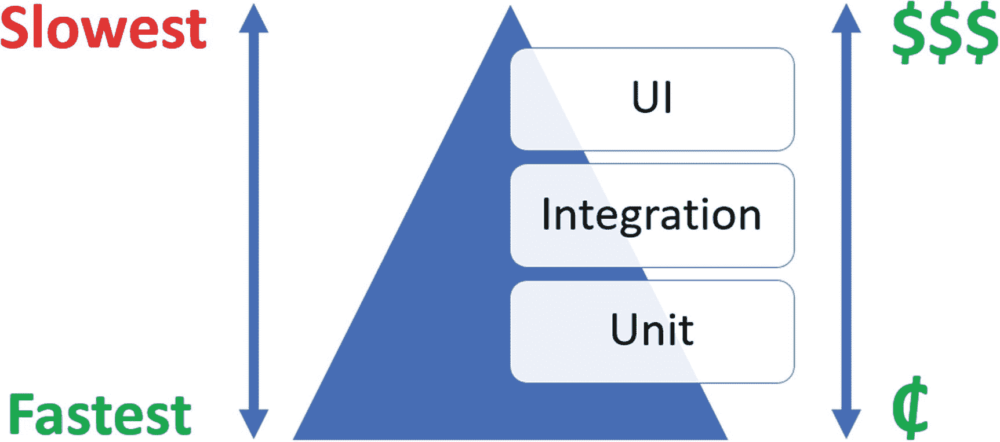

图 11-1

测试金字塔

单元测试是

*   **丰富**:应该比其他类型的考试多。

*   小:他们应该只测试一件事，也就是一个“单元”(与完整的端到端“场景”或用例相对)。

*   **便宜**:都是先写后执行。这意味着与您在开发生命周期的后期发现的错误相比，他们发现的任何错误都应该更容易纠正。

*   快速编写和执行

单元测试是由开发人员(而不是测试人员或业务分析师)编写的，所以这就是为什么我们将在这里使用它们来测试我们自己的代码。

好的，那么除了快速和便宜的事实之外，你在使用它们时还有什么其他优势呢？

### 防止衰退

因为您将拥有一套随着时间推移而构建的单元测试，所以您可以在每次引入新功能时再次运行它们(您也应该为其构建测试)。这意味着您可以检查您的新代码是否向现有的代码库引入了错误(这些被称为*回归缺陷*)。因此，单元测试给你信心，你没有引入错误，或者，如果你有，给你一个早期的提醒，以便你可以纠正。

### 可执行文件

当我们开始编写一些单元测试时，你会看到我们给它们命名的方式是描述性的，并且说明了被测试的内容和预期的结果。因此，假设您采用这种方法，您的单元测试套件实质上就成为了代码的文档。

当命名你的单元测试方法时，它们应该遵循类似于

`<method name>_<expected result>_<condition>`

例如:

`GetCommandItem_Returns200OK_WhenSuppliedIDIsValid`

注意:惯例有多种，所以找到最适合你的。

## 好的单元测试的特征

我从微软的单元测试最佳实践 <sup>[1](#Fn1)</sup> 指南中提取了下面的单元测试特征列表；这很值得一读，但同样，我们在这里涵盖了足够多的内容，让你继续下去。所以，一个好的单元测试的特征是

*   快速:单个测试应该快速执行(因为我们可能有 1000 个这样的测试，所以需要)，当我们说快速时，我们指的是毫秒级。

*   **隔离:**单元测试不应该依赖于外部因素，例如，数据库、网络连接等。

*   **可重复:**相同的测试在两次运行之间应该产生相同的结果(假设您在两次运行之间没有做任何改变)。

*   **自检:**应该不需要人为干预来确定是否通过或者失败。

*   **及时:**与被测试的代码相比，单元测试不应该花费过多的时间。

我还要补充一点

*   **聚焦:**一个单元测试(顾名思义，如前所述)应该只测试一件事。

当我们开始编写自己的测试时，我们将使用这些因素作为试金石。

## 考什么？

好了，我们知道它们是什么，为什么我们有它们，甚至一个“好”测试的特征，但是 100，000 美元的问题是我们实际上应该测试什么？前面详细描述的特征应该有助于推动这种选择，但最终还是取决于开发人员个人和他们满意的东西。

有些开发人员可能只编写少量的单元测试，只测试真正新颖的代码；其他人可能会编写更多的代码来测试更标准、更琐碎的功能。由于我们的 API 很简单，我们将编写非常基本的测试，并测试非常明显的功能。我采用这种方法是为了让您更习惯单元测试。

Note

你通常不会测试编程语言中固有的功能:例如，你不会编写单元测试来检查基本的算术运算——那样会矫枉过正，也不是很有用。进一步说，你不能改变的单元测试代码(例如，你没有写的代码)可能有点无意义:讨论。

## 单元测试框架

我在书的开头问了一个关于 [xUnit](https://xunit.net/) 是什么的问题。Well xUnit 只是一个单元测试框架；它是开源的，在。NET Core，所以对我们来说这似乎是一个不错的选择。

当然，也有替代方案可以做同样的事情；在命令行执行一个`dotnet new`,您将看到我们可用的单元测试项目。

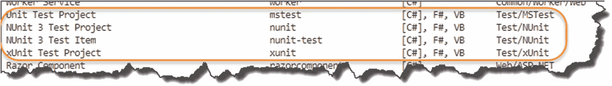

图 11-2

单元测试。NET 核心项目模板

我们可以使用的其他工具有

*   mstsch est

*   NUnit

不过我们会坚持使用 xUnit，所以如果你想了解其他的，你需要自己阅读。

## 安排、行动和断言

不管您选择什么样的框架，所有的单元测试都遵循相同的模式(xUnit 也不例外)。

### 安排

这是您执行测试“设置”的地方。例如，您可以设置一些对象并配置用于驱动测试的数据。

### 行动

这是您执行测试以生成结果的地方。

### 维护

这就是你对照*预期结果*来“检查】实际结果的地方。这个断言如何进行将取决于您的测试是通过还是失败。

回到一个好的单元测试的特征上来,“聚焦”的特征在这里发挥了作用，这意味着我们实际上应该每个测试只有*一个* *断言* *。如果您断言多个条件，单元测试会变得模糊不清——您又在测试什么呢？*

所以，理论到此为止——让我们来实践吧！

## 编写我们的第一个测试

好了，现在我们想离开我们的 API 项目，进入我们的单元测试项目。因此，在您的终端中，导航到 ***命令。测试*** 文件夹，列出你应该看到的那个文件夹的内容。

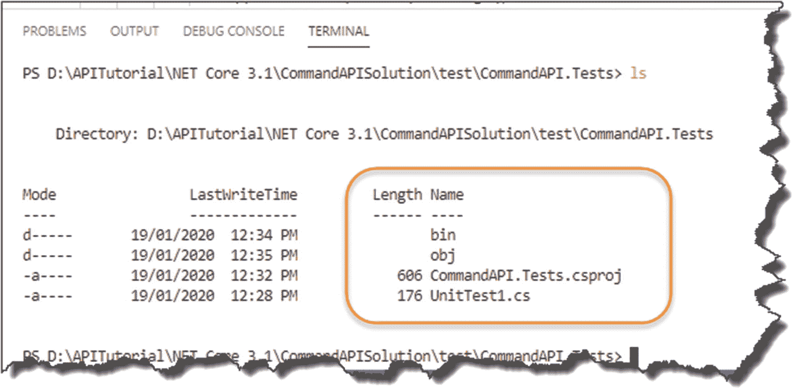

图 11-3

剖析一个 xUnit 项目

我们有

*   ***bin*** 文件夹

*   ***obj*** 文件夹

*   ***CommandAPI。**tests . csproj*项目文件

*   ***UnitTest1.cs*** 默认类

您应该熟悉其中的前三个，因为它们是我们在 API 项目中拥有的相同工件。关于项目文件， ***CommandAPI。Tests.csproj***

这里的第四个也是最后一个工件是我们创建项目时为我们设置的默认类；打开它，看一看。

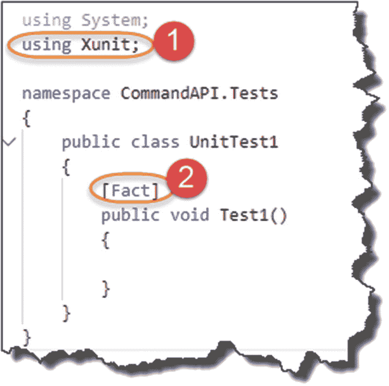

图 11-4

简单的 xUnit 测试用例

这只是一个标准的类定义，只有两点需要注意:

1.  对 xUnit 的引用

2.  我们的类方法`Test1`是用`[Fact]`属性修饰的。这告诉 xUnit 测试运行程序这个方法是一个测试。

在这个阶段你会看到我们的`Test1`方法是空的，但是我们仍然可以运行它；为此，请返回您的终端(确保您处于 ***命令 API 中)。测试*** 文件夹)，并键入

```cs
dotnet test

```

这将运行我们应该“通过”的测试，尽管它是空的，实际上没有做任何事情。

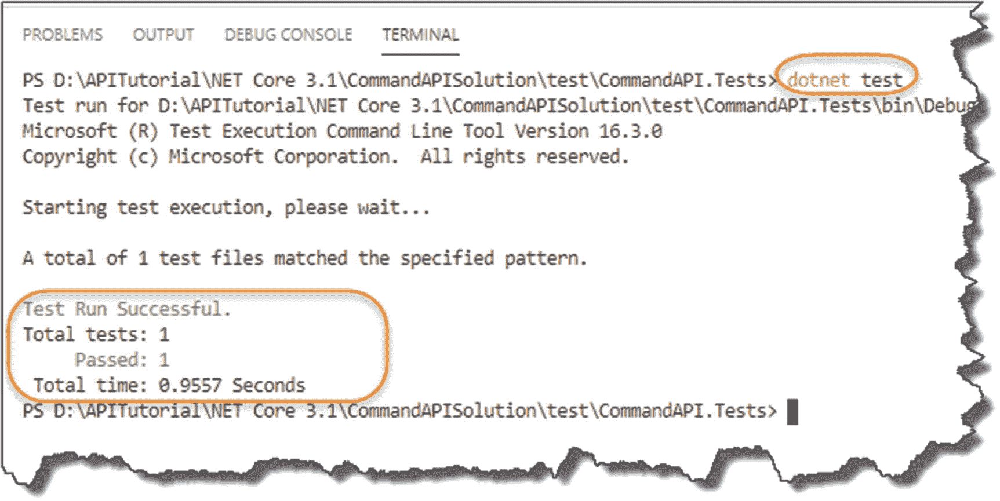

图 11-5

在 xUnit 中运行测试

好了，我们知道我们的测试设置已经准备好了，所以让我们开始编写一些测试。

Les’ Personal Anecdote

当我自己再次运行代码时(是的，我实际上是按照书上说的去做的，以确保它有意义！)，我在这个阶段收到了一个警告，抱怨说与主 API 项目相比，xUnit 项目中的`Microsoft.EntityFrameworkCore.Relational`版本不同。

请注意，这个包*并没有在我们的 xUnit 项目的包引用中明确列出。csproj 文件。*

为了纠正这个问题，我在我的 xUnit 项目中安装了`Microsoft.EntityFrameworkCore.Relational`包:

`dotnet add package Microsoft.EntityFrameworkCore.Relational --version 3.1.4`

注意，这次我指定了一个版本，以确保两个项目中的两个包是一致的。如果您遇到同样的行为，请记下被投诉的版本，并采取相应的措施。

尽管我相信这个警告是良性的，但我不喜欢警告在背景中徘徊。

### 测试我们的模型

我们的第一个测试真的是微不足道的，以至于你*可能不会在学习练习范围之外对这个*进行单元测试。然而，*这是一个学习练习*，尽管这是一个简单的测试，它涵盖了启动和运行单元测试的所有必要机制。

思考我们的模型，我们想要测试什么？作为复习，这是我们的 API 项目中的模型类。

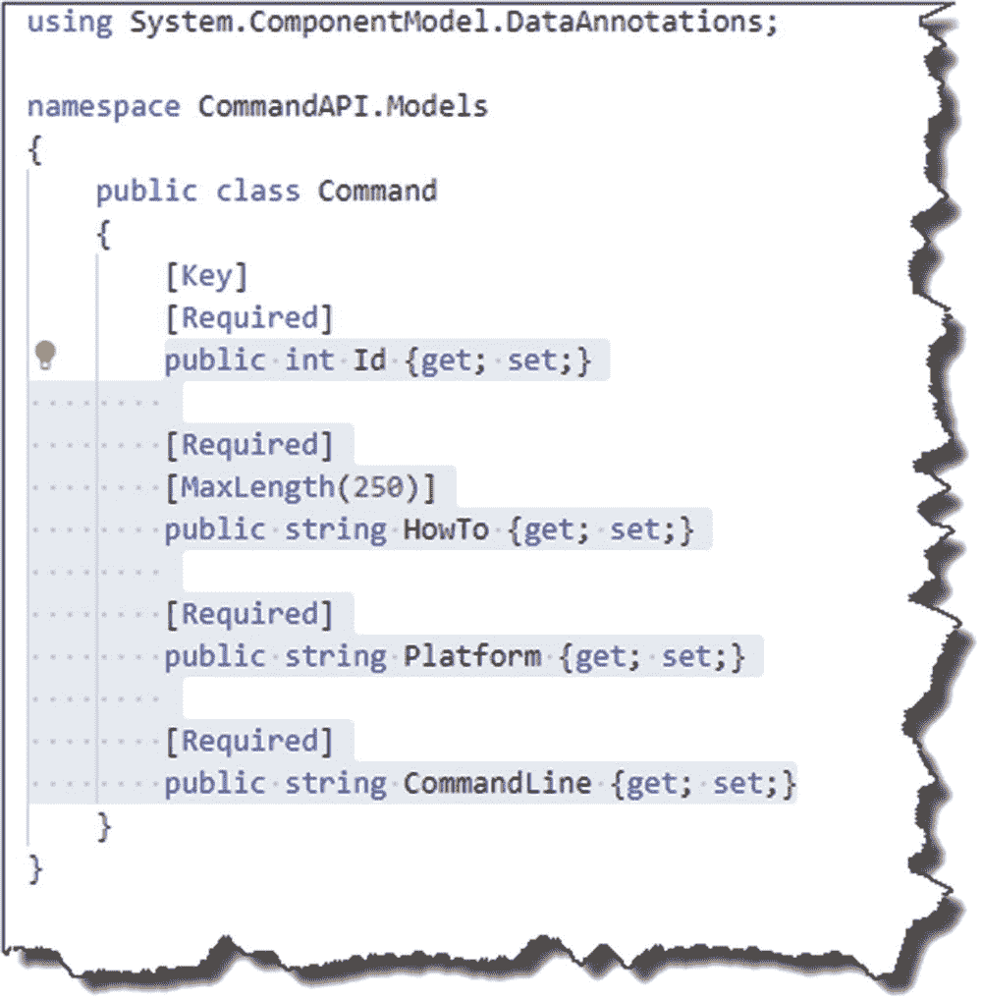

图 11-6

重新审视模型

怎么样

*   我们可以改变每个类属性的值。

我们可能还能想到其他的，但是让我们从简单的开始。为了实现这一点，我们将创建一个新的类，它将只包含我们的`Command`模型的测试，所以

*   Create a new file called ***CommandTests.cs*** in the root of our ***CommandAPI.Tests*** Project.

    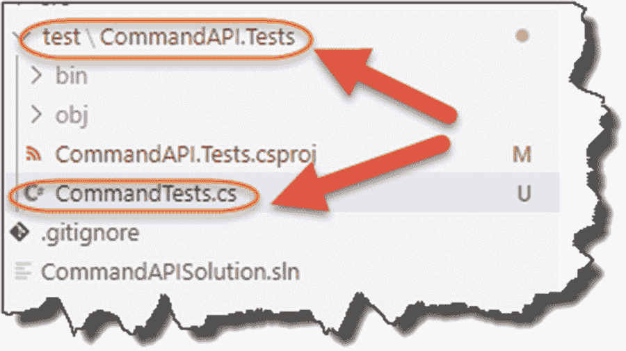

    图 11-7

    我们模型的测试

将以下代码添加到该类中:

```cs
using System;
using Xunit;
using CommandAPI.Models;

namespace CommandAPI.Tests
{
    public class CommandTests
    {
        [Fact]
        public void CanChangeHowTo()
        {

        }
    }
}

```

这是一个如此琐碎的测试(我们甚至没有测试一个方法)；我们实际上不能使用前面提到的单元测试命名约定:

`<method name>_<expected result>_<condition>`

所以，在这种情况下，我们要用一些更基本的东西。

以下各节值得注意。

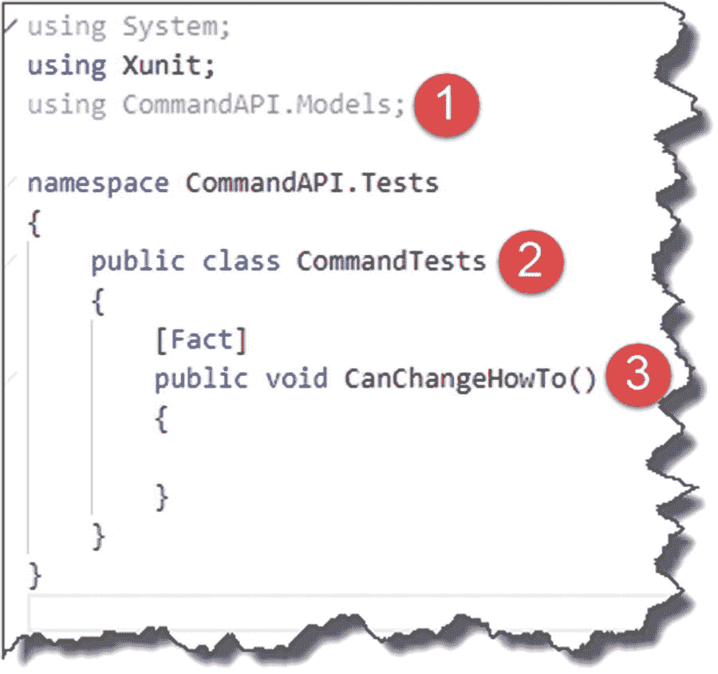

图 11-8

我们的第一次模型测试

1.  我们在 ***CommandAPI*** 项目中引用了我们的模型。

2.  我们的类是以我们正在测试的东西命名的(例如，我们的`Command`模型)。

3.  我们的测试方法的命名约定是这样的，它告诉我们测试的是什么。

好了，现在是时候编写我们的安排、行为和资产代码了；将以下突出显示的代码添加到`CanChangeHowTo`测试方法中:

```cs
[Fact]
public void CanChangeHowTo()
{
  //Arrange
  var testCommand = new Command
  {
    HowTo = "Do something awesome",
    Platform = "xUnit",
    CommandLine = "dotnet test"
  };

  //Act
  testCommand.HowTo = "Execute Unit Tests";

  //Assert
  Assert.Equal("Execute Unit Tests", testCommand.HowTo);
}

```

我们添加的部分在这里突出显示。

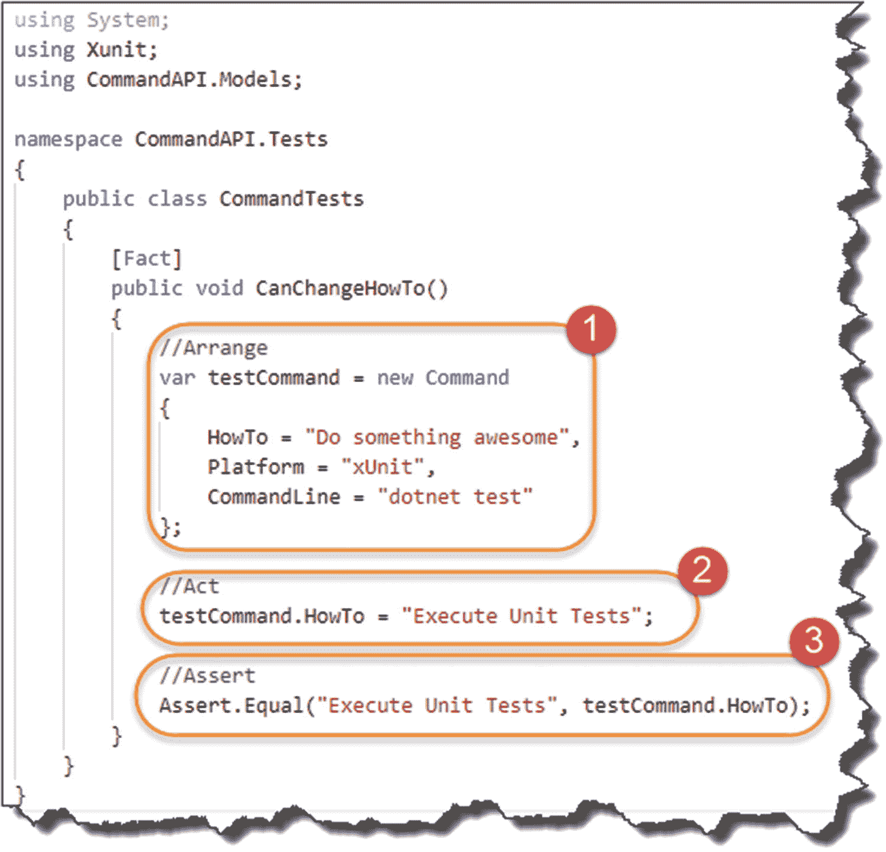

图 11-9

安排、行动和断言

1.  **排列**:创建一个`testCommand`并用初始值填充。

2.  **动作**:执行我们要测试的动作，即改变`HowTo.`的值

3.  **断言**:检查`HowTo`的值是否符合我们的预期。

第 1 步和第 2 步很简单，所以实际上第 3 步和使用`xUnit Assert`类来执行"`Equal`"操作对您来说可能是新的。这一步是真还是假决定了测试是通过还是失败。

让我们运行一个非常简单的测试，看看它是通过还是失败:

*   确保您保存了您的 ***CommandTests.cs*** 文件。

*   这只是检查你的测试在语法上是否正确。

*   将运行我们的测试套件。

测试应该会通过，您将会看到如下内容。

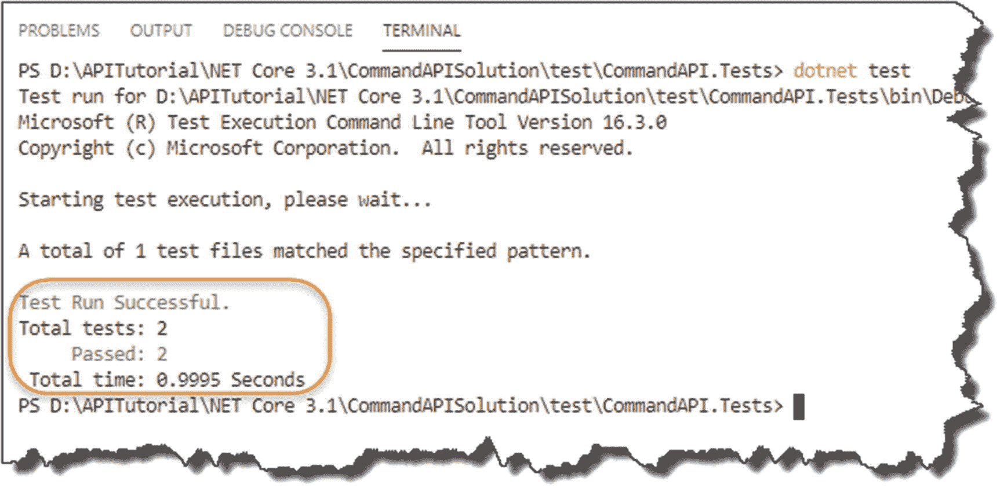

图 11-10

我们通过了两项测试？

上面说通过了两项测试？另一个测试在哪里？没错，我们仍然有最初的带有空测试方法的`UnitTest1`类，所以这就是第二个测试被选中的地方。在我们继续之前，让'**删除那个类**。

我们也可以“强迫”这个测试失败。为此，例如，将我们的`Assert.Equal`操作中的“预期”值改为随机值。

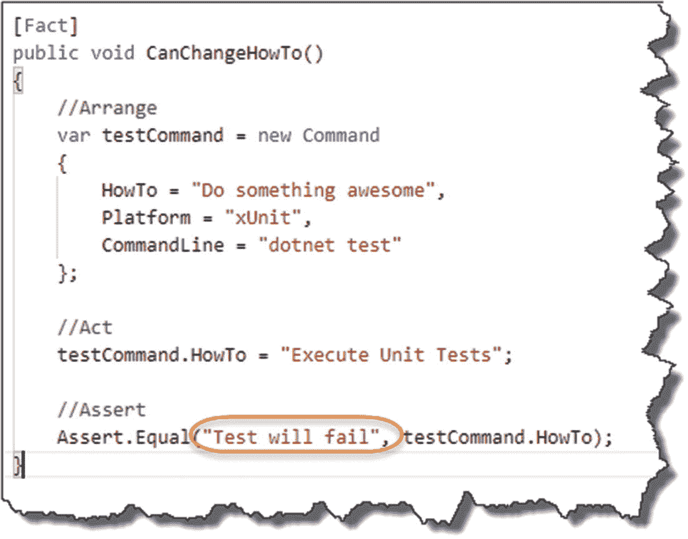

图 11-11

强制测试失败

保存文件，然后重新运行测试。您将得到一个带有一些详细消息的失败响应。

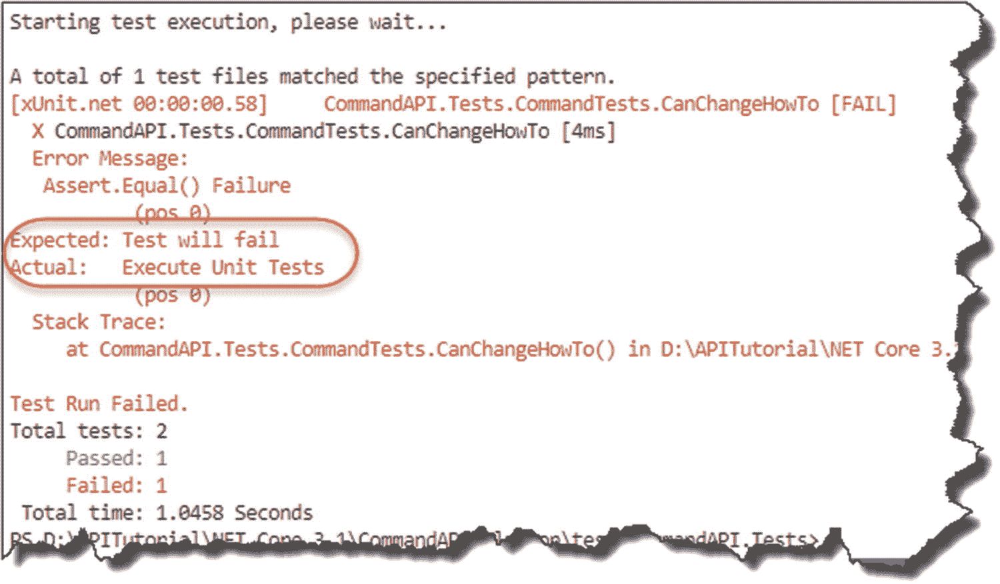

图 11-12

不出所料，测试失败

在这里，您可以看到测试失败了，我们甚至得到了失败的原因。在我们继续之前，将预期的字符串恢复为传递值。

Learning Opportunity

在我们的命令类中，我们还有另外两个属性需要测试:`Platform`和`CommandLine`(Id 属性是自动管理的，所以我们现在不应该为此费心)。

编写两个额外的测试来测试我们是否也可以改变这些值。

## 不要重复你自己

好了，假设您完成了上一次学习机会，那么现在您的`CommandTests`类中应该有三个测试方法，其中三个通过了测试。如果你没有完成，我建议你去做，或者如果你真的不想做——参考 GitHub 上的代码。 <sup>[2](#Fn2)</sup>

您将注意到的一件事是，三个测试中的每一个的排列组件都是相同的，因此有点浪费。当你有这样的场景时，也就是说，你需要执行一些多个测试使用的标准设置；xUnit 考虑到了这一点。

xUnit 文档将这一概念描述为测试之间的*共享上下文*,并指定了实现这一点的三种方法:

*   构造函数和 Dispose(共享设置/清理代码，不共享对象实例)

*   类 Fixtures(在一个*类*中跨测试共享对象实例)

*   收集装置(跨多个测试类的共享对象实例)

我们将使用第一种方法，它将为我们的每个测试建立一个新的`testCommand`对象实例；您可以将您的`CommandsTests`类更改为以下内容:

```cs
using System;
using Xunit;
using CommandAPI.Models;

namespace CommandAPI.Tests
{
  public class CommandTests : IDisposable
  {
    Command testCommand;

    public CommandTests()
    {
      testCommand = new Command
      {
        HowTo = "Do something",
        Platform = "Some platform",
        CommandLine = "Some commandline"
      };
    }

    public void Dispose()
    {
      testCommand = null;
    }

    [Fact]
    public void CanChangeHowTo()
    {
      //Arrange

      //Act
      testCommand.HowTo = "Execute Unit Tests";

      //Assert
      Assert.Equal("Execute Unit Tests", testCommand.HowTo);
    }

    [Fact]
    public void CanChangePlatform()
    {
      //Arrange

      //Act
      testCommand.Platform = "xUnit";

      //Assert
      Assert.Equal("xUnit", testCommand.Platform);
    }

    [Fact]
    public void CanChangeCommandLine()
    {
      //Arrange

      //Act
      testCommand.CommandLine = "dotnet test";

      //Assert
      Assert.Equal("dotnet test", testCommand.CommandLine);
    }
  }
}

```

为了清楚起见，我们增加了图 [11-13](#Fig13) 。

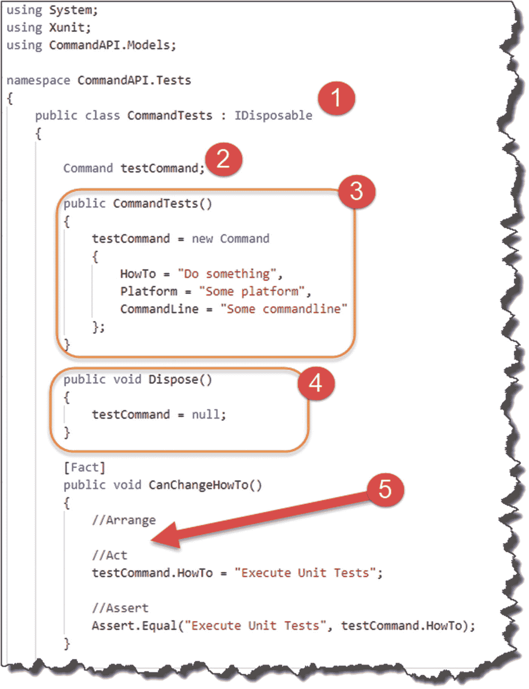

图 11-13

不要重复你自己——重构的模型测试

1.  我们继承了`IDisposable`接口(用于代码清理)。

2.  创建我们的`Command`类的“全局”实例。

3.  创建一个类构造函数，我们在其中执行`testCommand`对象实例的设置。

4.  实现一个 Dispose 方法来清理我们的代码。

5.  您会注意到每个测试的编配部分现在是空的；每次测试都会调用类构造函数(为了简洁起见，我在这里只展示了一个测试)。

有关更多信息，请参考 xUnit 文档。 <sup>[3](#Fn3)</sup>

再次运行您的测试，您应该看到三个通过的测试。

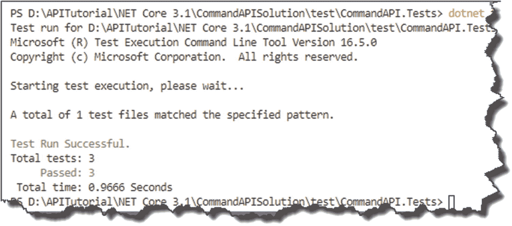

图 11-14

3 次通过测试

## 测试我们的控制器

好吧，所以测试我们的模型只是为接下来即将到来的测试我们的控制器的*开胃菜* <sup>[4](#Fn4)</sup> 我们在这里加大了赌注，因为这显然是一件更复杂的事情；虽然您在上一节中学到的概念仍然适用，但我们在这里只是对其进行扩展。

### 重温单元测试特征

我认为在我们继续之前，有必要回顾一下我们的单元测试特征:

*   快速:单个测试应该快速执行(因为我们可能有 1000 个这样的测试)，当我们说快速时，我们指的是毫秒级。

*   **隔离:**单元测试不应该依赖于外部因素，例如，数据库、网络连接等。

*   **可重复:**相同的测试在两次运行之间应该产生相同的结果(假设您在两次运行之间没有做任何改变)。

*   **自检:**应该不需要人为干预来确定是否通过或者失败。

*   **及时:**与被测试的代码相比，单元测试不应该花费过多的时间。

*   **聚焦:**一个单元测试(顾名思义，如前所述)应该只测试一件事。

我经常纠结于**聚焦的**特性，并且经常不得不将自己拉回测试*仅仅一件事*，而不是徘徊到集成测试领域(并试图测试端到端的流程)。但在这种情况下，这不是我最担心的特征。

当我们对我们的控制器进行单元测试时，**隔离**特性将会出现问题。为什么呢？让我们提醒一下我们的控制器构造函数。

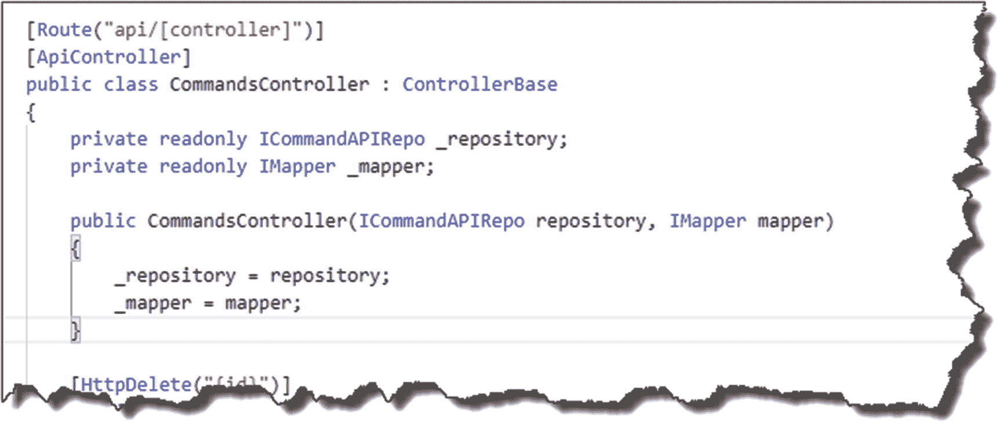

图 11-15

注入到构造函数中的依赖项的提醒

即使我们使用依赖注入(这很棒)，就我们的控制器而言，它们仍然是依赖的，所以当我们对控制器进行单元测试时，我们该如何处理呢？又是依赖注入？先别着急，我只是想播下种子。

和以前一样，我认为学习这个的最好方法是获得编码，所以让我们把注意力转回到我们的第一个控制器动作:`GetAllCommands`。

## getall 命令单元测试和基础工作

### getall 命令概述

让我们提醒自己`GetAllCommands`应该如何称呼。

<colgroup><col class="tcol1 align-left"> <col class="tcol2 align-left"> <col class="tcol3 align-left"> <col class="tcol4 align-left"></colgroup> 
| 

动词

 | 

上呼吸道感染

 | 

操作

 | 

描述

 |
| --- | --- | --- | --- |
| 得到 | /API/命令 | 阅读 | 读取所有命令资源 |

另外，我提供了一些更详细的`GetAllCommands`属性，这将有助于推动我们的测试。

<colgroup><col class="tcol1 align-left"> <col class="tcol2 align-left"></colgroup> 
| 

属性

 | 

描述

 |
| --- | --- |
| 输入 | 无；我们只需向前表中的 URI 发出一个 GET 请求 |
| 过程 | 尝试检索命令资源集合 |
| 成功产出 | HTTP 200 正常状态 |
| 故障输出 | 不适用:如果此端点存在，它不能真正被称为“不正确” |
| 安全的 | 是–端点不能改变我们的资源 |
| 幂等 | 是–重复相同的操作会得到相同的结果 |

### getall 命令单元测试

测试什么可能有些主观，从测试的角度来看，这可能是我们最简单的控制器动作，所以我决定采用以下测试案例。

<colgroup><col class="tcol1 align-left"> <col class="tcol2 align-left"> <col class="tcol3 align-left"></colgroup> 
| 

测试 ID

 | 

安排和行动

 | 

维护

 |
| --- | --- | --- |
| 测试 1.1 | 当 0 存在时请求资源 | 返回 200 OK HTTP 响应 |
| 测试 1.2 | 1 存在时请求资源 | 返回单个命令对象 |
| 测试 1.3 | 1 存在时请求资源 | 返回 200 OK HTTP 响应 |
| 测试 1.4 | 1 存在时请求资源 | 返回正确的“类型” |

您将看到测试 1.2、1.3 和 1.4 具有相同的排列和动作:

*   当资源存在时请求资源。

那么，为什么不将这些整合到一个测试中，并在那里执行三个断言呢？这又会打破我们的**聚焦**特性——我们应该在每次测试中只测试一件事。

### 控制器测试的基础

与我们的`Command`模型一样，我们希望在我们的单元测试项目中创建一个单独的测试类来保存控制器测试，因此创建一个名为***commandscontrolertests . cs***的类，如图 [11-16](#Fig16) 所示。

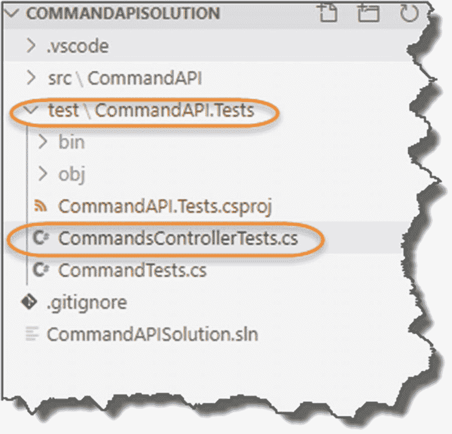

图 11-16

控制器的测试

将以下代码放入***commandscontroltertests . cs***文件中，开始使用:

```cs
using System;
using Xunit;
using CommandAPI.Controllers;
using Microsoft.AspNetCore.Mvc;

namespace CommandAPI.Tests
{
  public class CommandsControllerTests
  {
    [Fact]
    public void GetCommandItems_ReturnsZeroItems_WhenDBIsEmpty()
    {
      //Arrange
      //We need to create an instance of our CommandsController class
      var controller = new CommandsController( /* repository, AutoMapper */);
    }
  }
}

```

所以我们想立刻开始*安排*我们的测试，这样我们就可以访问一个`CommandsController`类来工作，但是当它有两个依赖项(存储库和自动映射器)时，我们如何创建一个呢？依赖注入——我听到你说！但是如果你回头看看我们的单元测试项目的结构，你会发现没有类似于`Startup`的类来注册我们的注入服务。我想我们可以开始添加一个，但是那会导致对我们的存储库进行测试的问题。

即使我们在这里使用依赖注入，我们仍然需要提供一个具体的实现实例；我们会用哪一个？`SqlCommanAPIRepo`？这需要一个 DB 上下文，而 DB 上下文又需要我们的数据库。啊！这不仅复杂得可怕，而且通过将所有这些东西拖进我们的单元测试，我们在很大程度上打破了**隔离**的特性。

我们可以回到`MockCommandAPIRepo`并在那里实现不依赖于外部因素的测试代码，这是一种可能性，但仍然是一个麻烦——不要担心，有更好的方法！

#### 嘲弄框架

值得庆幸的是，我们可以求助于被称为“模仿”的东西，这意味着我们可以快速创建任何所需对象的“假”(或模仿)副本，以便在我们的单元测试中使用。它允许我们自包含我们单元测试项目中所需要的一切，并遵守**隔离**原则。我们当然可以对我们的库和*可能还有*自动映射器使用嘲讽。

为了使用嘲讽，我们需要求助于一个外部框架；我为我们选择的这个叫做**最小起订量**。它在 C# 中被很好地理解和使用。NET 社区，所以我觉得这对我们来说是个不错的选择。

#### 安装 Moq 和自动映射器

打开命令提示符，并确保您在 ***命令 API 中。测试**文件夹中的*，并发出以下命令:

```cs
dotnet add package Moq

dotnet add package AutoMapper.Extensions.Microsoft.DependencyInjection

```

确认这些依赖项已经添加到***command pitests . csproj***文件中。

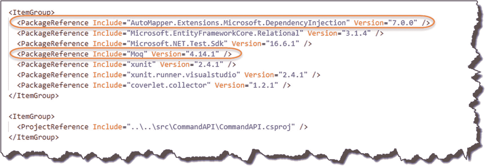

图 11-17

最小起订量的包装参考

你会注意到，除了 Moq 之外，我们还添加了 AutoMapper 我们稍后需要这个。

#### 使用 Moq(模拟仓库)

回到我们的`CommandsControllerTests`类，添加以下代码(注意我们新的 using 指令):

```cs
using System;
using System.Collections.Generic;
using Moq;
using AutoMapper;
using CommandAPI.Models;
using CommandAPI.Data;
using Xunit;
using CommandAPI.Controllers;
using Microsoft.AspNetCore.Mvc;

namespace CommandAPI.Tests
{
  public class CommandsControllerTests
  {
    [Fact]
    public void GetCommandItems_Returns200OK_WhenDBIsEmpty()
    {
      //Arrange
      var mockRepo = new Mock<ICommandAPIRepo>();

      mockRepo.Setup(repo =>
        repo.GetAllCommands()).Returns(GetCommands(0));

      var controller = new CommandsController(mockRepo.Object, /* AutoMapper*/ );
    }

    private List<Command> GetCommands(int num)
    {
      var commands = new List<Command>();
      if (num > 0){
        commands.Add(new Command
        {
          Id = 0,
          HowTo = "How to generate a migration",
          CommandLine = "dotnet ef migrations add <Name of Migration>",
          Platform = ".Net Core EF"
        });
      }
      return commands;
    }
  }
}

```

或者代码**仍然不可运行**，但是我想在这里暂停一下，浏览一下我们添加的内容，因为有很多事情正在进行！

快速提醒，所有这些代码都在 GitHub <sup>[ 5 ](#Fn5)</sup> 上，如果你不想输入这些东西的话。

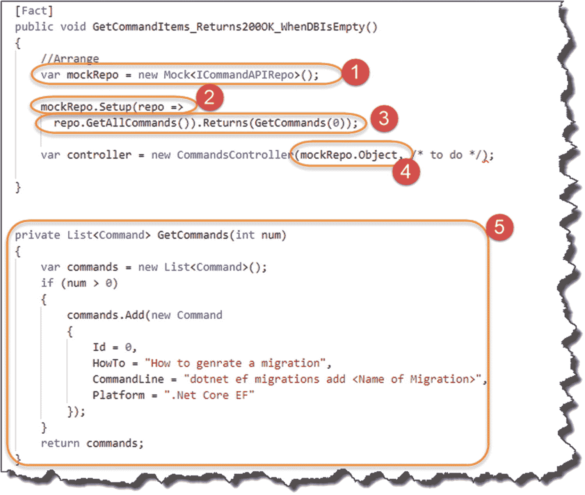

图 11-18

嘲笑我们的仓库

1.  我们为我们的存储库建立了一个新的“模拟”实例；注意，我们只需要传递接口定义。

2.  使用我们新的模拟存储库，我们使用`Setup`方法来建立它将如何“行为”这里，我们指定了我们想要模仿的接口方法，然后是我们想要它返回的内容(如下所述)。

3.  仍然在我们的设置中，我们指定存储库`GetAllCommands`方法返回`GetCommands(0)`——参见步骤 5。

4.  我们在模拟中使用了`Object`扩展来传入一个模拟的`ICommandAPIRepo.`的*对象实例*

5.  我们模拟了一个私有方法:`GetCommands`，它将根据输入参数的值返回一个空列表或者一个带有一个命令对象的列表。

您可以看到使用这种类型的框架建立模拟对象是多么容易，为我们省去编写自己的模拟类的许多麻烦。它还再次强调了我们的存储库接口定义的有用性。

好了，我们已经创建了一个库的模拟，我们可以用它来创建一个`CommandsController`实例，但是 AutoMapper 呢？

#### 模拟自动制图机？

虽然你可以使用 Moq 来模拟 AutoMapper，但是我们不会在这里这么做。为什么呢？因为在这个特殊的实例中，普遍的共识是使用 AutoMapper 的实际实例更有效(也更有用)。此外，使用这种方法，我们还可以测试我们在 API 项目中设置的自动映射概要文件。

现在我想在这里进行检测。

这似乎完全违背了**隔离**和**聚焦**的原则，在某种程度上确实如此。我对此的回应是实用主义的(你可以称之为逃避！)，但是单元测试特性就那么:*特性*。它们不是牢不可破的规则。

作为开发人员，我们经常面临选择和挑战。我可能走一条路，你可能选择另一条路——我个人认为这很好。编码可以像科学一样是艺术。

我必须努力做到的是尽我们所能解决问题，有时这需要妥协，或者我更喜欢称之为实用主义。在这种情况下(在我看来)，使用 AutoMapper 的一个实例(相对于它的一个模拟实例)提供了更多的好处而不是坏处，所以这就是我要采取的方法。

但是不同意请随意！

所以回到我们的`CommandsControllerTest`类，添加下面的代码为我们提供一个 AutoMapper 实例(注意新的 using 指令引入我们的概要文件):

```cs
using System;
using System.Collections.Generic;
using Moq;
using AutoMapper;
using CommandAPI.Models;
using CommandAPI.Data;
using CommandAPI.Profiles;
using Xunit;
using CommandAPI.Controllers;
using Microsoft.AspNetCore.Mvc;

namespace CommandAPI.Tests
{
  public class CommandsControllerTests
  {
    [Fact]
    public void GetCommandItems_Returns200OK_WhenDBIsEmpty()
    {
      //Arrange
      var mockRepo = new Mock<ICommandAPIRepo>();

      mockRepo.Setup(repo =>
        repo.GetAllCommands()).Returns(GetCommands(0));

      var realProfile = new CommandsProfile();
      var configuration = new MapperConfiguration(cfg =>
        cfg.AddProfile(realProfile));
      IMapper mapper = new Mapper(configuration);

      var controller = new CommandsController(mockRepo.Object, mapper);
    }

    .
    .
    .
  }
}

```

要逐步完成更改(为简洁起见，我没有在下面显示使用指令)，请参见图 [11-19](#Fig19) 。

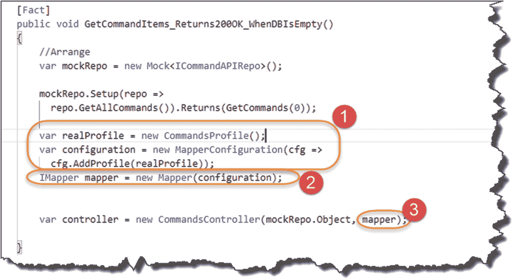

图 11-19

在我们的测试中使用 AutoMapper

1.  我们设置了一个`CommandsProfile`实例，并将其分配给一个`MapperConfiguration.`

2.  我们创建了一个`IMapper`的具体实例，并把它命名为我们的`MapperConfiguration.`

3.  我们将我们的`IMapper`实例传递给我们的`CommandControlle` r 构造函数。

那里有很多新的内容和基础，但是现在我们已经设置好了；这一章的其余部分应该很快！请确保您保存了您的工作，构建以检查错误，提交到 GitHub，然后我们将继续完成我们的第一个测试！

### 完成测试 1.1–检查 200 OK HTTP 响应(空数据库)

为了提醒我们自己我们想要测试什么，请看下表。

<colgroup><col class="tcol1 align-left"> <col class="tcol2 align-left"> <col class="tcol3 align-left"></colgroup> 
| 

测试 ID

 | 

安排和行动

 | 

维护

 |
| --- | --- | --- |
| 测试 1.1 | 当 0 存在时请求资源 | 返回 200 OK HTTP 响应 |

回到`CommandsControllerTests`，完成我们第一次测试的代码(确保包含 using 指令):

```cs
using CommandAPI.Dtos;

//Arrange
.
.
var controller = new CommandsController(mockRepo.Object, mapper);

//Act
var result = controller.GetAllCommands();

//Assert
Assert.IsType<OkObjectResult>(result.Result);

```

将这些放在上下文中，参见图 [11-20](#Fig20) 。

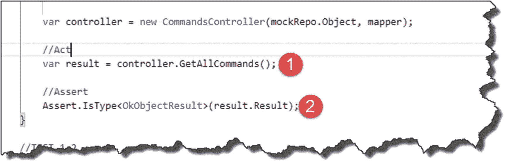

图 11-20

完成我们的测试

1.  我们调用控制器上的`GetAllCommands`动作。

2.  我们`Assert`认为`Result`是一个`OkObjectResult`(本质上等同于 200 OK)。

如前所述，我们可以重构代码，使其更易于重用，并将一些常见的设置放入类构造函数中，如下所示:

```cs
public class CommandsControllerTests : IDisposable
{
  Mock<ICommandAPIRepo> mockRepo;
  CommandsProfile realProfile;
  MapperConfiguration configuration;
  IMapper mapper;

  public CommandsControllerTests()
  {
    mockRepo = new Mock<ICommandAPIRepo>();
    realProfile = new CommandsProfile();
    configuration = new MapperConfiguration(cfg => cfg.AddProfile(realProfile));
    mapper = new Mapper(configuration);
  }

  public void Dispose()
  {
    mockRepo = null;
    mapper = null;
    configuration = null;
    realProfile = null;
  }

  [Fact]
  public void GetCommandItems_Returns200OK_WhenDBIsEmpty()
  {
    //Arrange
    mockRepo.Setup(repo =>
    repo.GetAllCommands()).Returns(GetCommands(0));

    var controller = new CommandsController(mockRepo.Object, mapper);

    //Act
    var result = controller.GetAllCommands();
.
.
.

```

这个测试用例的唯一具体安排是，我们希望模拟存储库返回“0”资源。

如果您想要“测试您的测试”，保存您的工作，并构建项目，然后执行一个`dotnet test`(当然在 xUnit 项目内部)以确保它通过。

### 测试 1.2–检查返回的单个资源

第二个测试检查我们是否返回了一个资源。

<colgroup><col class="tcol1 align-left"> <col class="tcol2 align-left"> <col class="tcol3 align-left"></colgroup> 
| 

测试 ID

 | 

安排和行动

 | 

维护

 |
| --- | --- | --- |
| 测试 1.2 | 1 存在时请求资源 | 返回单一资源 |

Les’ Personal Anecdote

我就是否应该包括这项测试进行了辩论。取决于你如何看待它，你可能声称这不是真正地测试我们的控制器，而是测试我们的存储库。

尽管如此，我想我还是把它包括进来，向您展示如何获得这种类型的信息。

在这里的代码中，我们配置了私有的`GetCommands`方法来返回一个对象。“断言”代码看起来有点复杂，但这是我们编写原始控制器动作的结果；下面是代码，我们将在这里逐步执行:

```cs
[Fact]
public void GetAllCommands_ReturnsOneItem_WhenDBHasOneResource()
{
  //Arrange
  mockRepo.Setup(repo =>
    repo.GetAllCommands()).Returns(GetCommands(1));

  var controller = new CommandsController(mockRepo.Object, mapper);

  //Act
  var result = controller.GetAllCommands();

  //Assert
  var okResult = result.Result as OkObjectResult;

  var commands = okResult.Value as List<CommandReadDto>;

  Assert.Single(commands);
}

```

为了便于理解，请参见图 [11-21](#Fig21) 。

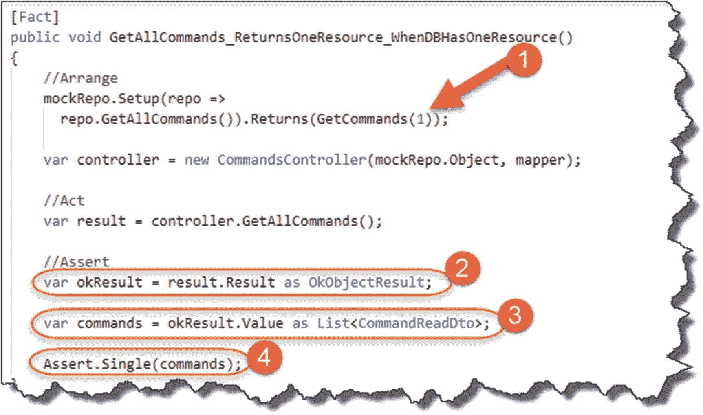

图 11-21

获得价值

1.  我们安排我们的`mockRepo`返回一个命令资源。

2.  为了获得`Value`(参见步骤 4)，我们需要将原始结果转换成一个`OkObjectResult`对象，这样我们就可以在对象层次结构中导航。

3.  我们获得一个列表`CommandReadDtos`(这里我们再次使用“as”关键字来帮助)。

4.  我们断言在我们的`commands List`上有一个`Single`结果集。

Les’ Personal Anecdote

就我个人而言，我讨厌这段代码，认为它太复杂了。这种复杂性的原因源于这样一个事实，即在我们的`GetAllCommands`控制器操作中，我们返回如下结果集:

`return``Ok`T2】

我们刚刚用了这个吗

`return _mapper.Map<IEnumerable<CommandReadDto>>(commandItems);`

也就是说，返回我们的结果集 ***而不是包含在`Ok()`方法中的*** ，导航到我们的结果集将会简单得多。那么，为什么我要用我的方式编写控制器动作呢？仅仅因为我想！我想清楚地说明我们成功的结果是如何返回的。

有一个有趣的讨论线程(不是一直都有吗！)关于堆栈溢出这个确切的话题。现在，我的长篇大论结束了，我们继续前进。

保存代码并执行`dotnet test`以确保它通过。

### 测试 1.3–检查 200 OK HTTP 响应

下一个测试我们想要检查 HTTP 响应代码是否正确。

<colgroup><col class="tcol1 align-left"> <col class="tcol2 align-left"> <col class="tcol3 align-left"></colgroup> 
| 

测试 ID

 | 

安排和行动

 | 

维护

 |
| --- | --- | --- |
| 测试 1.3 | 1 存在时请求资源 | 返回 HTTP 200 OK |

代码非常简单，所以不需要更多的解释:

```cs
[Fact]
public void GetAllCommands_Returns200OK_WhenDBHasOneResource()
{
  //Arrange
  mockRepo.Setup(repo =>
    repo.GetAllCommands()).Returns(GetCommands(1));

  var controller = new CommandsController(mockRepo.Object, mapper);

  //Act
  var result = controller.GetAllCommands();

  //Assert
  Assert.IsType<OkObjectResult>(result.Result);

}

```

### 测试 1.4–检查返回的对象类型是否正确

最后一个测试可以说是最有用的:它测试正确的返回*类型*，在本例中是枚举为`CommandReadDtos`的`ActionResult`。

<colgroup><col class="tcol1 align-left"> <col class="tcol2 align-left"> <col class="tcol3 align-left"></colgroup> 
| 

测试 ID

 | 

安排和行动

 | 

维护

 |
| --- | --- | --- |
| 测试 1.4 | 1 存在时请求资源 | 返回正确的“类型” |

```cs
[Fact]
public void GetAllCommands_ReturnsCorrectType_WhenDBHasOneResource()
{
  //Arrange
  mockRepo.Setup(repo =>
  repo.GetAllCommands()).Returns(GetCommands(1));

  var controller = new CommandsController(mockRepo.Object, mapper);

  //Act
  var result = controller.GetAllCommands();

  //Assert
  Assert.IsType<ActionResult<IEnumerable<CommandReadDto>>>(result);
}

```

在我们为第一个控制器动作构建的四个测试中，这是我最喜欢的一个。为什么呢？这实际上是在测试我们的外部合同。如果我们随后改变控制器的行为方式(以及它返回给消费者的内容)，这个测试将会在回归中失败。这对我来说是一次有价值的考试的标志！

Les’ Personal Anecdote

现在，我对自己进行了一次内部辩论，是将剩余的单元测试代码包括在书中，还是仅仅让你参考 GitHub，我们将在这里结束这一章。

我进行那场辩论的原因是

1.  我说没有绒毛/填充内容——你可能会说，鉴于单元测试的重复性质，我们正在进入那个领域。

2.  接下来的大部分代码不需要更多的解释，因为我们已经介绍了这些概念。所以，它只是以代码的形式出现在页面上。

    然而，我*决定将代码保留在书中，这意味着这一章将继续。为什么呢？一个字:完整。我想尽我所能生产出最好的产品，我觉得如果我不把所有的代码都写在书里，它就不是一个完整的产品。*

    我希望你同意。

## getcommandbyid 单元测试

### GetCommandByID 概述

同样，我们会提醒自己这个端点应该如何被调用。

<colgroup><col class="tcol1 align-left"> <col class="tcol2 align-left"> <col class="tcol3 align-left"> <col class="tcol4 align-left"></colgroup> 
| 

动词

 | 

上呼吸道感染

 | 

操作

 | 

描述

 |
| --- | --- | --- | --- |
| 得到 | /API/命令/{id} | 阅读 | 读取单个资源(通过 Id) |

和一些进一步的细节来帮助我们定义我们的测试。

<colgroup><col class="tcol1 align-left"> <col class="tcol2 align-left"></colgroup> 
| 

属性

 | 

描述

 |
| --- | --- |
| 输入 | 要检索的资源的 Id。这将出现在我们的 GET 请求的 URI 中 |
| 过程 | 尝试检索具有指定标识符的资源 |
| 成功产出 | 200 OK HTTP 响应返回的资源<`CommandReadDto` > |
| 故障输出 | 404 未找到响应 |
| 安全的 | 是–端点*不能*改变我们的资源 |
| 幂等 | 是–重复相同的操作会得到相同的结果 |

### getcommandbyid 单元测试

这个动作最终是基于一个惟一的 Id 返回一个资源，所以我们应该测试以下内容。

<colgroup><col class="tcol1 align-left"> <col class="tcol2 align-left"> <col class="tcol3 align-left"></colgroup> 
| 

测试 ID

 | 

情况

 | 

预期结果

 |
| --- | --- | --- |
| 测试 2.1 | 资源 ID 无效(数据库中不存在) | 404 未找到 HTTP 响应 |
| 测试 2.2 | 资源 ID 有效(存在于数据库中) | 200 Ok HTTP 响应 |
| 测试 2.3 | 资源 ID 有效(存在于数据库中) | 返回了正确的资源类型 |

### 测试 2.1–检查 404 未找到 HTTP 响应

此测试的代码概述如下:

```cs
[Fact]
public void GetCommandByID_Returns404NotFound_WhenNonExistentIDProvided()
{
  //Arrange
  mockRepo.Setup(repo =>
    repo.GetCommandById(0)).Returns(() => null);

  var controller = new CommandsController(mockRepo.Object, mapper);

  //Act
  var result = controller.GetCommandById(1);

  //Assert
  Assert.IsType<NotFoundResult>(result.Result);
}

```

这里，我们在模拟存储库上设置了`GetCommandsById`方法，以便在传入 Id“0”时返回 null。这是 Moq 真正威力的一次伟大展示。设置我们的存储库的行为有多简单？答案很简单！

然后我们只检查`NotFoundResult`类型(相当于 404 Not Found HTTP 响应)。

### 测试 2.2–检查 200 OK HTTP 响应

此测试的代码概述如下:

```cs
[Fact]
public void GetCommandByID_Returns200OK__WhenValidIDProvided()
{
  //Arrange
  mockRepo.Setup(repo =>
    repo.GetCommandById(1)).Returns(new Command { Id = 1,
    HowTo = "mock",
    Platform = "Mock",
    CommandLine = "Mock" });

  var controller = new CommandsController(mockRepo.Object, mapper);

  //Act
  var result = controller.GetCommandById(1);

  //Assert
  Assert.IsType<OkObjectResult>(result.Result);
}

```

这里唯一新颖的代码是我们在存储库上设置 GetCommandByID 方法以返回有效对象的方式，同样非常简单快捷。代码的其余部分不需要进一步讨论。

### 测试 2.3–检查返回的对象类型是否正确

此测试的代码概述如下:

```cs
[Fact]
public void GetCommandByID_Returns200OK__WhenValidIDProvided()
{
  //Arrange
  mockRepo.Setup(repo =>
    repo.GetCommandById(1)).Returns(new Command { Id = 1,
    HowTo = "mock",
    Platform = "Mock",
    CommandLine = "Mock" });

  var controller = new CommandsController(mockRepo.Object, mapper);

  //Act
  var result = controller.GetCommandById(1);

  //Assert
  Assert.IsType<ActionResult<CommandReadDto>>(result);
}

```

这个测试检查我们是否返回了一个`CommandReadDto`。就检查我们对外合同的有效性而言，我非常喜欢这个测试。如果我们改变控制器代码来返回一个不同的类型，这个测试将会失败，突出了我们契约的一个潜在问题——非常有用。

## 创建命令单元测试

### CreateCommand 概述

下面是`CreateCommand`端点的特征。

<colgroup><col class="tcol1 align-left"> <col class="tcol2 align-left"> <col class="tcol3 align-left"> <col class="tcol4 align-left"></colgroup> 
| 

动词

 | 

上呼吸道感染

 | 

操作

 | 

描述

 |
| --- | --- | --- | --- |
| 邮政 | /API/命令 | 创造 | 创建新资源 |

此处列出的详细行为提醒。

<colgroup><col class="tcol1 align-left"> <col class="tcol2 align-left"></colgroup> 
| 

属性

 | 

描述

 |
| --- | --- |
| 输入 | 要创建的“命令”对象这将被添加到我们发布请求的`request body`中；这里显示了一个示例:`{``"howTo": "Example how to",``"platform": "Example platform",``"commandLine": "Example command line"``}` |
| 过程 | 将尝试向我们的数据库添加新的命令对象 |
| 成功产出 | HTTP 201 已创建状态新创建的资源(`response body`新创建资源的 URI(`response header`) |
| 故障输出 | HTTP 400 错误请求不允许 HTTP 405 |
| 安全的 | 否–端点可以改变我们的资源 |
| 幂等 | 否-重复相同的操作会导致不同的结果 |

### 创建命令单元测试

<colgroup><col class="tcol1 align-left"> <col class="tcol2 align-left"> <col class="tcol3 align-left"></colgroup> 
| 

测试 ID

 | 

情况

 | 

预期结果

 |
| --- | --- | --- |
| 测试 3.1 | 提交用于创建的有效对象 | 返回了正确的对象类型 |
| 测试 3.2 | 提交用于创建的有效对象 | 201 创建的 HTTP 响应 |

现在这些测试对于这个控制器来说可能看起来有点过于简单；我们能不能不做更多的测试？我最初设想了以下附加测试

1.  在我们的存储库的对象计数之前和之后进行测试(递增 1)。

2.  测试传回的对象内容是否正确。

3.  测试 400 错误请求。

4.  不允许对 405 进行测试。

为什么我没有呢？井测试 1 和 2 并没有真正测试我们的控制器；他们真的在测试我们的仓库。只要

*   这不是我们这里测试的重点。

*   我们的仓库被嘲笑了。

我选择不为这些编写单元测试。这些情况可以被认为是有效的*集成*测试，其中*包括*我们的控制器，但这也不是我们在这里做的。(这就是我说的围绕**聚焦**单元测试原理我可能会掉进的陷阱。)

对于测试 3 和 4，这里演示的行为来自于我们用`[ApiController]`属性修饰控制器得到的默认行为。这不是我(或你)写的代码——所以我不会为我无法控制的代码编写单元测试。

如果我随后决定添加我自己的代码来处理这些情况，那么我可能会为它们引入测试。

### 测试 3.1 检查是否返回了正确的对象类型

此测试的代码概述如下:

```cs
[Fact]
public void CreateCommand_ReturnsCorrectResourceType_WhenValidObjectSubmitted()
{
  //Arrange
  mockRepo.Setup(repo =>
    repo.GetCommandById(1)).Returns(new Command { Id = 1,
    HowTo = "mock",
    Platform = "Mock",
    CommandLine = "Mock" });

    var controller = new CommandsController(mockRepo.Object, mapper);

    //Act
    var result = controller.CreateCommand(new CommandCreateDto { });

    //Assert
    Assert.IsType<ActionResult<CommandReadDto>>(result);
}

```

### 测试 3.2 检查 201 HTTP 响应

此测试的代码概述如下:

```cs
[Fact]
public void CreateCommand_Returns201Created_WhenValidObjectSubmitted()
{
  //Arrange
  mockRepo.Setup(repo =>
    repo.GetCommandById(1)).Returns(new Command { Id = 1,
    HowTo = "mock",
    Platform = "Mock",
    CommandLine = "Mock" });

    var controller = new CommandsController(mockRepo.Object, mapper);

    //Act
    var result = controller.CreateCommand(new CommandCreateDto { });

    //Assert
    Assert.IsType<CreatedAtRouteResult>(result.Result);
}

```

## UpdateCommand 单元测试

### UpdateCommand 概述

下面是`UpdateCommand`的特点。

<colgroup><col class="tcol1 align-left"> <col class="tcol2 align-left"> <col class="tcol3 align-left"> <col class="tcol4 align-left"></colgroup> 
| 

动词

 | 

上呼吸道感染

 | 

操作

 | 

描述

 |
| --- | --- | --- | --- |
| 放 | /API/命令/{Id} | 更新(完整) | 更新单个资源的所有内容(按 Id) |

这里显示了详细的行为。

<colgroup><col class="tcol1 align-left"> <col class="tcol2 align-left"></colgroup> 
| 

属性

 | 

描述

 |
| --- | --- |
| 输入(2) | 要更新的资源的 Id。这将出现在我们的看跌请求的 URI 中要更新的完整“命令”对象这将被添加到我们的 PUT 请求的`request body`中；这里显示了一个示例:`{``"howTo": "Example how to",``"platform": "Example platform",``"commandLine": "Example command line"``}` |
| 过程 | 将尝试完全更新数据库中的现有命令对象 |
| 成功产出 | HTTP 204 无内容响应代码 |
| 故障输出 | HTTP 400 错误请求找不到 HTTP 404 不允许 HTTP 405 |
| 安全的 | 否–端点可以改变我们的资源 |
| 幂等 | 是–重复相同的操作不会导致不同的结果 |

### UpdateCommand 单元测试

<colgroup><col class="tcol1 align-left"> <col class="tcol2 align-left"> <col class="tcol3 align-left"></colgroup> 
| 

测试 ID

 | 

情况

 | 

预期结果

 |
| --- | --- | --- |
| 测试 4.1 | 提交更新的有效对象 | 204 无内容 HTTP 响应 |
| 测试 4.2 | 提交更新的资源 ID 不存在 | 404 未找到 HTTP 响应 |

这里不太可能测试；注意事项

*   由于我们不会将任何资源作为更新的一部分返回，所以这次不会对资源类型进行测试。

*   我选择测试 404 Not Found 结果，因为这是我们实际编写的行为，所以我想测试它。

### 测试 4.1 检查 204 HTTP 响应

此测试的代码概述如下:

```cs
[Fact]
public void UpdateCommand_Returns204NoContent_WhenValidObjectSubmitted()
{
  //Arrange
  mockRepo.Setup(repo =>
  repo.GetCommandById(1)).Returns(new Command { Id = 1,
  HowTo = "mock",
  Platform = "Mock",
  CommandLine = "Mock" });

  var controller = new CommandsController(mockRepo.Object, mapper);

  //Act
  var result = controller.UpdateCommand(1, new CommandUpdateDto { });

  //Assert
  Assert.IsType<NoContentResult>(result);
}

```

这里我们确保当我们试图“更新”时，`GetCommandById`方法将返回一个有效的资源然后，我们检查是否得到成功 204 无内容响应。

### 测试 4.2 检查 404 HTTP 响应

此测试的代码概述如下:

```cs
[Fact]
public void UpdateCommand_Returns404NotFound_WhenNonExistentResourceIDSubmitted()
{
  //Arrange
  mockRepo.Setup(repo =>
    repo.GetCommandById(0)).Returns(() => null);

  var controller = new CommandsController(mockRepo.Object, mapper);

  //Act
  var result = controller.UpdateCommand(0, new CommandUpdateDto { });

  //Assert
  Assert.IsType<NotFoundResult>(result);
}

```

我们设置模拟存储库返回 null，这将触发 404 Not Found 行为。

## PartialCommandUpdate 单元测试

### PartialCommandUpdate 概述

这里显示了`PartialCommandUpdate`方法的行为。

<colgroup><col class="tcol1 align-left"> <col class="tcol2 align-left"> <col class="tcol3 align-left"> <col class="tcol4 align-left"></colgroup> 
| 

动词

 | 

上呼吸道感染

 | 

操作

 | 

描述

 |
| --- | --- | --- | --- |
| 修补 | /API/命令/{Id} | 更新(部分) | 更新单个资源的一部分(按 Id) |

详细的行为在这里。

<colgroup><col class="tcol1 align-left"> <col class="tcol2 align-left"></colgroup> 
| 

属性

 | 

描述

 |
| --- | --- |
| 输入(2) | 要更新的资源的 Id。这将出现在我们的补丁请求的 URI 中要应用于资源的变更集或“补丁文档”这将被添加到我们的补丁请求的`request body`中；这里显示了一个示例:`[``{``"op": "replace",``"path": "/howto",``"value": "Some new value"``},``{``"op": "test",``"path" : "commandline",``"value" : "dotnet new"``}``]` |
| 过程 | 将尝试执行修补程序文档中指定的更新注意:如果有多个更新，所有这些更新都必须成功。如果一个失败了，那么他们都失败了 |
| 成功产出 | HTTP 204 不满足 HTTP 状态 |
| 故障输出 | HTTP 400 错误请求找不到 HTTP 404 不允许 HTTP 405 |
| 安全的 | 否–端点可以改变我们的资源 |
| 幂等 | 否-重复相同的操作可能会导致不同的结果 |

### PartialCommandUpdate 单元测试

<colgroup><col class="tcol1 align-left"> <col class="tcol2 align-left"> <col class="tcol3 align-left"></colgroup> 
| 

测试 ID

 | 

情况

 | 

预期结果

 |
| --- | --- | --- |
| 测试 5.1 | 提交更新的资源 ID 不存在 | 404 未找到 HTTP 响应 |

这里的测试更少！如前所述，当我们实施此端点时，还需要额外的外部依赖项来启动和运行补丁端点。这也级联到单元测试中。包括必要的包含来执行一个单元测试(测试一个 204 No 内容)的成本与收益的主张对我来说没有意义，我想作为读者的你也是如此！因此，我在下面只包含了一个测试 404 Not Found 响应。

### 测试 5.1 检查 404 HTTP 响应

此测试的代码概述如下:

```cs
[Fact]
public void PartialCommandUpdate_Returns404NotFound_WhenNonExistentResourceIDSubmitted()
{
  //Arrange
  mockRepo.Setup(repo =>
    repo.GetCommandById(0)).Returns(() => null);

  var controller = new CommandsController(mockRepo.Object, mapper);

  //Act
  var result = controller.PartialCommandUpdate(0,
    new Microsoft.AspNetCore.JsonPatch.JsonPatchDocument<CommandUpdateDto> { });

  //Assert
  Assert.IsType<NotFoundResult>(result);
}

```

## 删除命令单元测试

### 删除命令概述

这里显示了我们`DeleteCommand`的概况。

<colgroup><col class="tcol1 align-left"> <col class="tcol2 align-left"> <col class="tcol3 align-left"> <col class="tcol4 align-left"></colgroup> 
| 

动词

 | 

上呼吸道感染

 | 

操作

 | 

描述

 |
| --- | --- | --- | --- |
| 删除 | /API/命令/{Id} | 删除 | 删除单个资源(按 Id) |

此处列出了此端点应如何操作的更多详细信息。

<colgroup><col class="tcol1 align-left"> <col class="tcol2 align-left"></colgroup> 
| 

属性

 | 

描述

 |
| --- | --- |
| 输入 | 要删除的资源的 Id。这将出现在我们的删除请求的 URI 中 |
| 过程 | 将尝试删除数据库中的现有命令对象 |
| 成功产出 | HTTP 204 无内容 HTTP 结果 |
| 故障输出 | HTTP 404 未找到 HTTP 结果 |
| 安全的 | 否–端点可以改变我们的资源 |
| 幂等 | 是–重复相同的操作会导致相同的结果 |

### 删除命令单元测试

<colgroup><col class="tcol1 align-left"> <col class="tcol2 align-left"> <col class="tcol3 align-left"></colgroup> 
| 

测试 ID

 | 

情况

 | 

预期结果

 |
| --- | --- | --- |
| 测试 6.1 | 提交了有效的资源标识以供删除 | 204 无内容 HTTP 响应 |
| 测试 6.2 | 提交用于删除的不存在的资源 Id | 404 未找到 HTTP 响应 |

### 测试 6.1 检查 204 无内容 HTTP 响应

此测试的代码概述如下:

```cs
[Fact]
public void DeleteCommand_Returns204NoContent_WhenValidResourceIDSubmitted()
{
  //Arrange
  mockRepo.Setup(repo =>
    repo.GetCommandById(1)).Returns(new Command { Id = 1,
    HowTo = "mock", Platform = "Mock", CommandLine = "Mock" });

  var controller = new CommandsController(mockRepo.Object, mapper);

  //Act
  var result = controller.DeleteCommand(1);

  //Assert
  Assert.IsType<NoContentResult>(result);
}

```

### 测试 6.2 检查 404 未找到 HTTP 响应

此测试的代码概述如下:

```cs
[Fact]
public void DeleteCommand_Returns_404NotFound_WhenNonExistentResourceIDSubmitted()
{
  //Arrange
  mockRepo.Setup(repo =>
    repo.GetCommandById(0)).Returns(() => null);

  var controller = new CommandsController(mockRepo.Object, mapper);

  //Act
  var result = controller.DeleteCommand(0);

  //Assert
  Assert.IsType<NotFoundResult>(result);
}

```

## 把它包起来

这一章我们讲了很多，老实说，我们只触及了皮毛。希望你已经学到了足够的知识，可以开始加快单元测试的速度。

主要要点是

*   Moq 在单元测试时帮助我们隔离自己的能力

*   测试内容的随意性(将特征作为实用的指导方针)

接下来，我们来看看如何在 Azure DevOps 上使用 CI/CD 管道进行生产部署！

<aside aria-label="Footnotes" class="FootnoteSection" epub:type="footnotes">Footnotes [1](#Fn1_source)

[T2`https://docs.microsoft.com/en-us/dotnet/core/testing/unit-testing-best-practices`](https://docs.microsoft.com/en-us/dotnet/core/testing/unit-testing-best-practices)

  [2](#Fn2_source)

[T2`https://github.com/binarythistle/Complete-ASP-NET-3-API-Tutorial-Book`](https://github.com/binarythistle/Complete-ASP-NET-3-API-Tutorial-Book)

  [3](#Fn3_source)

[T2`https://xunit.net/docs/shared-context`](https://xunit.net/docs/shared-context)

  [4](#Fn4_source)

一口大小的开胃小菜，在法语中字面意思是“嘴巴逗乐者”。它们与开胃菜的不同之处在于，它们不是顾客从菜单上订购的，而是免费提供的，并且只根据厨师的选择。

  [5](#Fn5_source)

[T2`https://github.com/binarythistle/Complete-ASP-NET-3-API-Tutorial-Book`](https://github.com/binarythistle/Complete-ASP-NET-3-API-Tutorial-Book)

  [6](#Fn6_source)

[T2`https://stackoverflow.com/questions/51489111/how-to-unit-test-with-actionresultt`](https://stackoverflow.com/questions/51489111/how-to-unit-test-with-actionresultt)

 </aside>