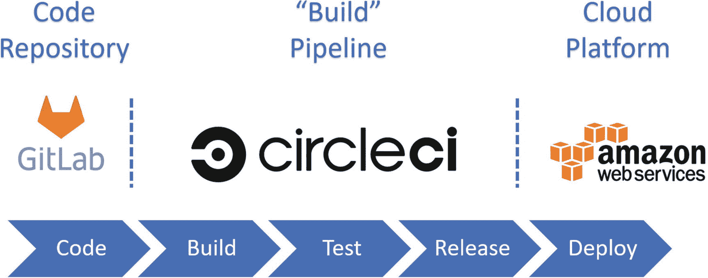
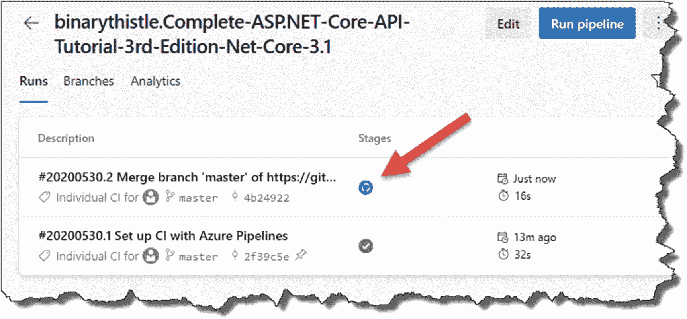
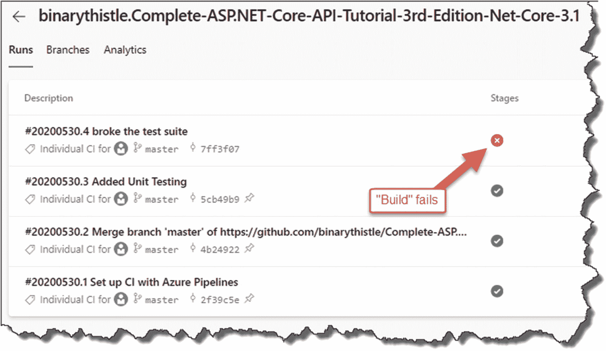

# 十二、CI/CD 管道

## 章节总结

在这一章中，我们将我们迄今为止所做的事情集合在一起:构建活动、源代码控制和单元测试，并将其构建在持续集成/持续交付(CI/CD)的环境中。

### 完成后，你会

*   了解什么是 CI/CD。

*   了解什么是 CI/CD 管道。

*   用 GitHub 设置 Azure DevOps 作为我们的 CI/CD 管道。

*   使用 Azure DevOps 自动构建、测试和打包我们的 API 解决方案。

*   准备部署到 Azure。

## 什么是 CI/CD？

谈论 CI/CD 就是谈论工作的管道”,或者，如果你喜欢另一个比喻:生产线，产品(在这个例子中是工作软件)是以原始形式(代码 <sup>[1](#Fn1)</sup> )被取出，并逐渐转化成最终用户可用的工作软件。

显然，这个过程将包括许多步骤，大多数(如果不是全部)我们将希望自动化。

它本质上是关于商业价值的更快实现，并且是敏捷软件开发的核心基础思想。(别担心，我不会太用力敲那个鼓。)

## CI/CD 还是 CI/CD？

不要担心，这个标题不是一个错别字(我们一会儿会谈到这一点)。

CI 容易；那代表*持续集成*。CI 是这样一个过程:从一个或多个开发人员处获取对同一软件的任何代码更改，并通过构建和测试代码将这些更改合并回主代码“分支”。顾名思义，这个过程是连续的，通常在开发人员将代码变更“签入”到代码库中时触发(就像您已经在 Git/GitHub 中所做的那样)。

CI 的整个要点是确保主要(或主)代码分支在整个构建活动中保持健康，并且由处理代码的多个开发人员引入的任何新更改不会冲突和破坏构建。

CD 可能会更令人困惑。为什么呢？你会听到人们在提到 CD 时同时使用以下两个术语:连续*交付*和连续*部署*。

### 有什么区别？

好吧，如果你认为持续交付是持续集成的扩展，那么它就是自动化发布过程的过程。它确保您可以频繁地部署软件更改，并且只需按一下按钮。持续交付停止了，只是没有自动地将变更推向生产；这就是持续部署的用武之地。

持续部署比持续交付更进一步，因为代码变更将在没有任何*人工干预*的情况下进入生产阶段(假设 CI/CD 管道中没有失败，例如测试失败)。


图 12-1

持续:集成、交付和部署

### 那到底是哪个？

通常，当我们谈论 CI/CD 时，我们谈论持续集成和持续交付，尽管它可能依赖于组织。最终，将软件部署到产品中的决策是一个商业决策，因此持续部署的想法仍然是大多数组织的主流。

但是在本书中，我们将全力以赴，实践全面持续部署！

## 管道

用谷歌搜索“CI/CD 管道”，你会找到大量的例子；然而，我喜欢这个。


图 12-2

DevOps 管道

您可能还会看到它被描述为一个“循环”，这打破了管道的概念，但在理解 DevOps 活动的连续循环时仍然是有用的。


图 12-3

DevOps“循环”

回到这一章的要点(如果你没有忘记的话，这是如何使用 Azure DevOps 的细节)，我们将重点关注管道的以下元素。


图 12-4

我们的焦点

### 什么是 Azure DevOps？

Azure DevOps 是允许开发团队构建和发布软件的工具集合。它提供了以下主要功能:

*   **仪表板**:例如，您的渠道、团队成员等的红色-琥珀色-绿色(RAG)状态。

*   **板**:允许你使用像 Scrum 和看板这样的方法来捕获和计划你的工作。

*   **Repos** :你可以将代码直接提交给 Azure DevOps 自己的仓库(就像我们对 GitHub 所做的那样)。

*   **管道**:自动化 CI/CD 管道和我们对 Azure DevOps 的关注。

*   测试计划:整个解决方案的端到端测试可追溯性。

*   **Artifacts** :包管理，Artefact repo 等。

在这一章中，我们将专门关注“管道”特性，而不涉及其他方面。尽管它们很有趣，但要涵盖它们需要一本单独的书，这超出了我们的范围。

### 可供选择的事物

Azure DevOps 有各种内部部署和基于云的替代方案:Jenkins 可能是可用的内部部署解决方案中最“著名”的一个，但是您也有像

*   竹子

*   团队城市

*   工人

*   圆形 CI

该列表并不详尽，但现在，我们将把这些抛在脑后，专注于 Azure DevOps。

### 背景中的技术

关于我们的渠道，就我们的技术覆盖而言，这是我们将用来构建 CI/CD 渠道的内容。


图 12-5

我们将使用的技术组合

事实上，Azure DevOps 自带“代码库”功能(如图 [12-5](#Fig5) 所示)，这意味着我们可以放弃 GitHub。


图 12-6

替代技术组合

因此，我们的组合可能如下所示。

或者，如果你想把微软技术排除在外，请参见图 [12-7](#Fig7) 。



图 12-7

非微软 mix

更进一步，你甚至可以分解构建➤测试➤发布➤部署等等。组件转化为特定的技术。我不打算在这里这样做。

我想提出的要点是

1.  我们例子中相关的技术排序。

2.  确保您理解代码库(GitHub)作为起点的重要性。

3.  要知道技术的选择几乎是无限的。

好了，理论够了；让我们建立我们的管道！

## 创建生成管道

如果你还没有这样做，去 Azure DevOPs 网站， [`https://dev.azure.com`](https://dev.azure.com) ，注册一个免费账户(注意你实际上登录的是 *Azure DevOps* 而不是 Azure)。着陆屏幕应该看起来像这样(减去我的项目)。


图 12-8

Azure DevOps 登录页面

Warning!

当同时使用 Azure 和 Azure DevOps 时，我注意到的一件事是用户界面可以快速变化。在我写这篇文章的时候(2020 年 5 月)，截图是正确的和最新的，但是请注意，鉴于这些产品的性质，它们可能会不时发生变化。

在很大程度上，这些变化是如此之小以至于无关紧要，例如，不是“创建项目”，而是“新项目”其他变化虽然更重要，但应该仍然很容易通过。

登录/注册后，点击“新建项目”


图 12-9

创建新项目

你可以叫它任何你喜欢的名字，所以让我们继续这个主题，把它叫做*命令 API 管道*。


图 12-10

命名项目并选择“公共可见性”

确保

*   您选择与 GitHub repo 相同的“可见性”设置(**为测试项目推荐 Public** )。

*   版本控制设置为 Git——这是默认设置。

一旦你满意了，点击“创建”；这将创建您的项目并带您进入登录页面。


图 12-11

选择管道

如前所述，Azure DevOps 有很多特性，但我们现在只使用“管道”。选择管道，然后

1.  Create pipeline.

    

    图 12-12

    创建新管道

它问我们的第一件事是:“你的代码在哪里？”

嗯，你觉得呢？

是的——没错——在 GitHub！


图 12-13

GitHub 是我们的代码源

小心选择 GitHub，而不是 GitHub Enterprise Server(正如描述所述，它是 GitHub 的内部版本)。

Important

如果这是你第一次这样做，你需要授予 Azure DevOps 权限来查看你的 GitHub 帐户。


图 12-14

您将被要求向 GitHub 认证

提供您的 GitHub 帐户详细信息并登录。一旦你授予 Azure DevOps 连接 GitHub 的权限，你将看到你所有的库。


图 12-15

选择相关的 API 存储库

选择您的存储库(我的示例存储库如图 [12-15](#Fig15) 所示)；一旦你点击它，Azure DevOps 就会关闭并分析它，以建议一些常见的管道模板；你会在图 [12-16](#Fig16) 中看到类似的东西。


图 12-16

管道模板–我们将创建自己的模板

Note

一些读者报告说这里出现了一个额外的步骤(我无法复制),要求你批准并安装 Azure Pipelines。如果你看到这个，我建议你批准并继续。

这一步要做的就是为你预配置***azure-pipelines . yml***文件(接下来会有更多内容，但基本上是对我们的 CI/CD 管道的说明)。我们将从头开始创建我们的***azure-pipelines . yml***文件，所以你选择哪个并不重要，因为我们会覆盖它。无论如何，选择一个选项并继续。

Les’ Personal Anecdote

这是 Azure DevOps 中变化最大的领域之一！在我的职业生涯中，我曾多次建议使用现成的配置，如图 [12-16](#Fig16) 所示，但它们似乎变化很大，我觉得更安全、更稳定的做法是从头开始创建我们自己的配置。

不管你选择哪个模板，你都会得到一个默认的***azure-pipelines . yml***文件，快速浏览一下(你的可能会看起来不一样)。


图 12-17

Azure-pipelines.yml 示例

选择全部内容，按 delete 键；您的文件现在应该完全是空的。


图 12-18

空荡荡的天蓝色管道。阳明海运股份有限公司

我们现在将第一步添加到我们的文件中，这只是构建我们的 API 项目。在我们这样做之前，请阅读下面的警告格式化 YAML 文件！

Warning!

YAML 文件区分大小写，所以你需要确保缩进是绝对准确的！谢天谢地，如果你没有正确缩进，浏览器内的编辑器会抱怨的。

将以下代码添加到您的 **azure-pipeline.yml** 文件中:

```cs
trigger:
- master

pool:
  vmImage: 'ubuntu-latest'

variables:
  buildConfiguration: 'Release'

steps:
- task: UseDotNet@2
- script: dotnet build --configuration $(buildConfiguration)
  displayName: 'dotnet build $(buildConfiguration)'

```

您的 YAML 文件应该如下所示。


图 12-19

我们的构建步骤

1.  管道的触发点(GitHub)。

2.  我们将用来执行管道活动的图像。

3.  设置一个变量来指定构建配置。

4.  为“发布”执行`dotnet build`的脚本任务

我们现在准备单击保存并运行。


图 12-20

手动保存并运行

然后，您将看到以下内容。


图 12-21

将 Azure-pipelines.yml 提交给我们的 GitHub repo

这是问你想在哪里存储***azure-pipelines . yml***文件；在这种情况下，我们希望将它直接添加到我们的 GitHub repo 中(记住这个选择，因为它稍后会返回！)，所以选择这个选项并点击**保存并运行。**

然后指派一个“代理”来执行流水线；您将看到各种屏幕，如下图所示。


图 12-23

正在进行的作业


图 12-22

Azure DevOps 上的工作准备

最后，您应该会看到完成屏幕。


图 12-24

成功完成

### 刚刚发生了什么？

好吧，概括一下

*   我们将 Azure DevOps 连接到 GitHub。

*   我们选择了一个仓库。

*   我们说过希望将管道配置文件(***azure-pipelines . yml***)放在我们的存储库中。

*   我们手动运行管道。

*   Pipeline 遍历了***azure-pipelines . yml***文件并执行了各个步骤。

*   我们的解决方案是。

### Azure-Pipelines.yml 文件

让我们回到我们的 GitHub 库并刷新——您应该看到以下内容。


图 12-25

yml 在我们的回购协议中

你会看到***azure-pipelines . yml***文件已经被添加到我们的 repo 中(这在后面很重要)。

#### 我以为我们想要自动化？

CI/CD 管道的好处之一是它提供了自动化的机会，那么我们为什么要手动执行管道呢？

好问题！

我们被要求在创建管道时执行，这是真的，但我们也可以设置“触发器”，这意味着我们可以配置管道在收到特定事件时执行。

在您的 Azure DevOps 项目中，单击“管道”部分下的“管道”，然后选择管道。


图 12-26

导航回 Azure-pipelines.yml

然后在下一个屏幕(右上角)点击“编辑”。


图 12-27

编辑管道

完成后，你应该会返回到***azure-pipelines . yml***文件(我们稍后会返回到这里进行编辑):

1.  单击省略号。

2.  选择触发器。


图 12-28

选择我们的触发器

在这里，您可以看到我们管道的持续集成(CI)设置。


图 12-29

检查是否为 GitHub 提交启用了管道触发器

你可以看到自动化触发器是默认启用的(我们也在***azure-pipeline . yml***文件中配置了这个)，所以现在让我们触发一个构建！但是我们怎么做呢？

## 触发构建

触发一个构建从 GitHub 的`git push origin master`开始，所以任何代码更改(包括添加或编辑注释之类的小事)都足够了。记住这一点，回到 VS 代码，在“main”***command API***项目中打开`CommandsController`类，在我们的`GetCommandItems`方法中放一个注释。


图 12-30

一些随机的变化

保存文件，并执行通常的操作序列(确保您在主解决方案文件夹中—***命令和解决方案*** ):

*   `git add .`

*   `git commit -m “Added a reminder to clean up code”`

*   `git push origin master`

一切都应该按计划进行，除了执行最后的`push`命令。


图 12-31

我们的本地和远程回购不同步

这是什么意思？

还记得我们在 GitHub repo 中添加了***azure-pipelines . yml***文件吗？什么事？这就是原因，本质上本地存储库和远程 GitHub 存储库不同步(中央 GitHub repo 比我们的本地存储库有一些更新的更改)。要解决这个问题，我们只需输入

```cs
git pull

```

或者，如果不起作用，请使用

```cs
git pull origin master

```

这将从远程 GitHub 存储库中提取变更，并将它们与我们的本地存储库合并。


图 12-32

拉下 azure-pipelines.yml

的确，如果你查看 VS 代码文件树，你会看到我们的***azure-pipelines . yml***文件已经出现了！


图 12-33

我们现在在本地有 azure-pipelines.yml

既然我们已经同步了我们的存储库，现在您可以尝试将我们合并的本地 Git repo 推回到 GitHub(这包括我们插入到`CommandsController`类中的注释)。快速跳转到 Azure DevOps，点击➤建立的管道；您应该会看到类似这样的内容。



图 12-34

自动触发构建

一个新的构建已经排队等待开始——这一次是由对 GitHub 的远程提交触发的！

一旦开始，如果一切顺利，应该会成功。

我们正在实现这一目标，但在我们继续部署之前，我们的构建管道仍有一些工作要做——这是为了确保我们的单元测试能够运行——目前还没有。

## 重访 azure-pipelines.yml

回到我们在 Azure DevOps 中的***Azure-pipelines . yml***文件(如果你忘记如何到达这里，请按照前面的步骤操作)，你应该看到以下内容。


图 12-35

我们的天蓝色管道. yml

这当然是我们之前添加的代码；您会注意到它还没有执行任何测试或打包步骤。

### 另一个 VS 代码扩展

因为我们要对***azure-pipelines . yml***文件做一些编辑，有两个地方可以这样做:

1.  直接在浏览器中(我们已经这样做了)

2.  在 VS 代码中

在浏览器*中编辑*的好处是它给了你一些类似智能感知的功能，可以提供一些代码片段等。然而，微软现在发布了一个 VS 代码扩展，在 VS 代码中提供类似的功能，所以我们将安装并使用它(这意味着我们在一个地方完成所有的编码)。

在 VS 代码中，点击扩展按钮，搜索“Azure Pipelines”；您应该看到以下内容。


图 12-36

VS 代码的 Azure 管道扩展

安装它，然后打开我们刚从 GitHub 拉下来的***azure-pipelines . yml***文件。

### 运行单元测试

回到我们管道视图中的步骤，见图 [12-37](#Fig37) 。


图 12-37

我们将要建造的管道

您将看到建议的顺序是构建➤ **测试** ➤发布，所以现在让我们将该任务添加到我们的***azure-pipelines . yml***文件中。

移回 VS 代码，打开***azure-pipelines . yml***，*在*构建任务后追加后续任务*:*

```cs
- task: DotNetCoreCLI@2
  displayName: 'dotnet test'
  inputs:
     command: test
     projects: '**/*Tests/*.csproj'
     testRunTitle: 'xUNit Test Run'

```

因此，总的来说，文件应该是这样的，再次突出显示了我们的新任务步骤。


图 12-38

增加了测试步骤

这些步骤不言自明，所以将文件保存在 VS 代码中，并执行必要的 Git 命令行步骤来提交代码并推送到 GitHub——这应该会触发我们管道的另一次构建。


图 12-39

管道再次触发

这一次单元测试也应该执行。


图 12-40

测试步骤已成功

点击所示的`dotnet test`步骤，深入查看发生了什么；您应该会看到如下所示的内容。


图 12-41

测试的更多细节

点击图 [12-41](#Fig41) 中突出显示的链接，进入测试结果仪表板。


图 12-42

测试仪表板

非常好！事实上，这是一种类型的*信息辐射器*，当你在团队环境中工作时，你应该让它高度可见，因为它帮助每个人理解构建的健康状况，并且如果必要的话，采取行动来补救任何问题。

## 破坏我们的单元测试

现在，为了强调单元测试和 CI/CD 管道，让我们故意破坏我们的一个测试。

回到 VS 代码，回到我们的 ***CommandAPI。Tests*** 项目，打开我们的***commands controller***测试，编辑你的一个测试，更改预期返回类型；我在这里选择了测试，并将`NotFoundResult`换成了`OKResult`:


图 12-43

破坏我们的单元测试

保存文件，然后(确保你在 ***CommandAPI 中)。测试*** 项目)运行一个构建:

```cs
dotnet build

```

项目的*构建将会成功*,因为这里没有任何东西会导致编译时错误。然而，如果我们尝试一个

```cs
dotnet test

```

我们当然会得到一个失败的结果。


图 12-44

测试在本地失败

现在，在正常情况下，刚刚导致我们的单元测试套件在本地失败，您**不会提交**更改并将它们推送到 GitHub！然而，这正是我们要做的，只是为了证明 Azure DevOps 构建管道中的测试也会失败。

Note

在这种情况下，我们知道我们已经在本地破坏了我们的测试，但是在某些情况下，开发人员可能不知道我们已经这样做了，并且提交了他们的代码；这再次凸显了 CI/CI 构建管道的价值。

因此，执行你现在应该熟悉的三个“Git”步骤(确保你在解决方案层面上这样做)，一旦你已经推到 GitHub，回到 Azure DevOps，并观察发生了什么。


图 12-45

进行中的管道(它将出错)

不出所料，我们的测试失败了。



图 12-46

失败！

同样，您可以深入查看导致错误的原因，例如，如果您在一个大的 LCD 屏幕上显示测试结果，那么很明显构建管道有问题，需要采取补救措施。查看各个步骤，参见图 [12-47](#Fig47) 。


图 12-47

故障详情

然后进一步深入到 dotnet 测试步骤，并转到测试结果仪表板(参见图 [12-48](#Fig48) )。


图 12-48

仪表板表示故障

## 测试——一网打尽？

现在，这向我们展示了单元测试的力量，因为它将导致构建管道失败，有缺陷的软件将不会被发布，甚至更糟的是部署到生产中！这也意味着我们可以采取措施补救故障。

那么反过来，这是否意味着如果所有的测试都通过了，那么在产品中就不会有失败的代码了？不，原因很简单，你的测试和你的测试一样好。我想说的是(可能有点沮丧),即使你所有的测试都通过了，你对代码的信心也只会和你的测试覆盖率一样好——我们在这个阶段还不错——所以我们可以很有信心进入下一步。

在我们这样做之前，恢复我们刚刚对*所做的更改，确保我们所有的单元测试都通过了*，并且我们的管道返回到绿色状态。

Warning!

在没有确保您的所有测试都通过之前，不要进入下一部分！


图 12-49

请确保在继续之前修复管道

## 发布/包装

再次提到我们的管道，我们现在处于发布阶段；这是我们需要打包我们的构建以准备部署的地方。


图 12-50

重新审视我们的渠道

因此，再次移回 VS 代码，打开***azure-pipelines . yml***文件，并追加以下步骤:

```cs
- task: DotNetCoreCLI@2
  displayName: 'dotnet publish'
  inputs:
    command: publish
    publishWebProjects: false
    projects: 'src/CommandAPI/*.csproj'
    arguments: '--configuration $(buildConfiguration) --output $(Build.ArtifactStagingDirectory)'

- task: PublishBuildArtifacts@1
  displayName: 'publish artifacts'

```

所以总的来说，你的文件应该是这样的，新的代码被突出显示(再次注意那些空格——我们刚刚安装的 VS 代码插件应该可以帮助你做到这一点)。


图 12-51

打包和发布步骤

这些步骤在微软文档中有更详细的解释， <sup>[2](#Fn2)</sup> 但简言之

*   dotnet publish 命令仅针对我们的 **CommandAPI** 项目发布。<sup>T33</sup>

*   的输出是压缩的。

*   压缩的工件被发布。

Les’ Personal Anecdote

确保您输入了以下内容:

`publishWebProjects: false`

在研究这个问题时，我花了大约 2-3 个小时试图理解为什么打包步骤不起作用——就是因为这个！缺省值是`true`，所以如果不包括它，这个步骤就会失败。啊啊啊！

保存文件，并再次添加、提交和推送代码。管道应该成功，如果您深入到成功的构建中，您将看到我们的两个额外的`task`步骤。


图 12-52

正在运行的作业中显示的步骤

Celebration Checkpoint

干得好！您已经使用 Azure DevOps 完成了管道的构建、测试和发布步骤。

## 把它包起来

这里有很多地方，我们

*   在 Azure DevOps 上设置 CI/CD 管道

*   将 Azure DevOps 连接到 GitHub(并确保 CI 触发器已启用)

*   **向我们的***azure-pipeline . yml***文件添加了**:构建、测试和打包步骤

我们现在几乎准备好部署到 Azure 了！

<aside aria-label="Footnotes" class="FootnoteSection" epub:type="footnotes">Footnotes [1](#Fn1_source)

你可以争辩(事实上我会的！)业务需求是软件“构建”过程的起点。然而，出于本书的目的，我们将使用代码作为旅程的起点。

  [2](#Fn2_source)

[T2`https://docs.microsoft.com/en-us/azure/devops/pipelines/ecosystems/dotnet-core?view=azure-devops&tabs=yaml`](https://docs.microsoft.com/en-us/azure/devops/pipelines/ecosystems/dotnet-core%253Fview%253Dazure-devops%2526tabs%253Dyaml)

  [3](#Fn3_source)

我们不想在任何地方发布我们的测试！

 </aside>