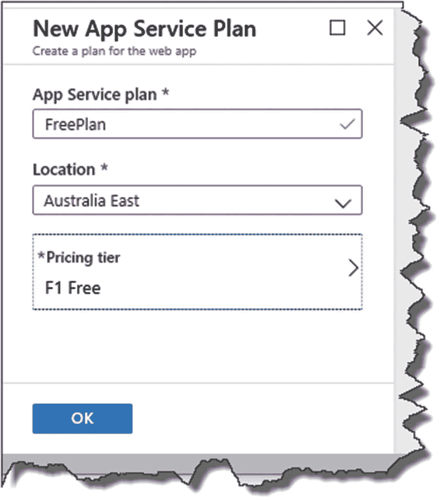
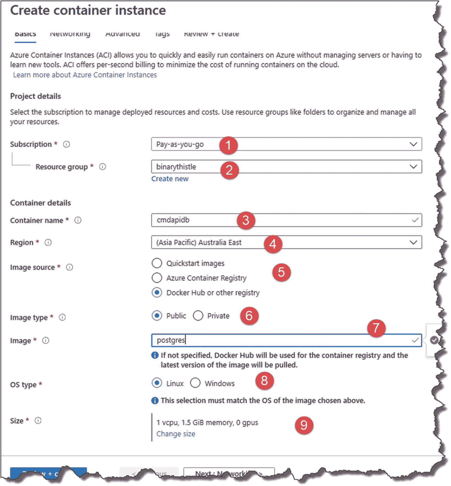
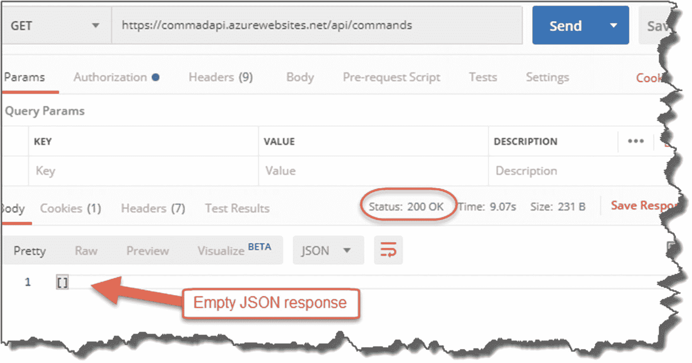

# 十三、部署到 Azure

## 章节总结

在这一章中，我们将 API 部署到 Azure 上，以便在现实世界中使用。在这个过程中，我们创建了我们需要的 Azure 资源，并重温了关于运行时环境和配置的讨论。

### 完成后，你会

*   多了解一点 Azure。

*   创建了部署 API 所需的 Azure 资源。

*   更新我们的 CI/CD 管道以将我们的版本部署到 Azure。

*   提供必要的配置以使 API 在生产环境中工作。

我们有很多要讲的，所以让我们开始吧！

## 创建 Azure 资源

Azure 是一个巨大的主题领域，可以写很多本书，很多次，所以我将只关注我们需要在一个“类似生产”的环境中启动和运行我们的 API 和数据库的方面——这应该足够了。

简单来说，Azure 中的一切都是“资源”，例如，数据库服务器、虚拟机、web 应用等。因此，我们需要创建一些资源来存放我们的应用。在 Azure 中创建资源有不同的方式:

1.  通过 Azure 门户手动创建资源。

2.  通过 Azure 资源管理器模板自动创建资源。

3.  使用第三方工具自动创建资源，例如 Terraform。

在本章中，我们将手动创建我们需要的资源

*   这更简单(无论如何，在我们的情况下，见下一点)。

*   我们只有少量的资源。

*   我认为这是正确的学习方法(我们的重点仍然是我们的 API)。

### 创建我们的 API 应用

我们要创建的第一个资源是一个 API 应用；毫不奇怪，这是我们的 API 代码将运行的地方。为此，请登录 Azure(如果您没有帐户，则需要创建一个)，然后单击“创建资源”:


图 13-1

创建 Azure 资源

我将再次指出，在撰写本文时，以下截图是正确的，但鉴于 Azure 的快速变化，它们可能会发生变化。

尽管从根本上来说，在 Azure 中创建资源并没有那么困难，所以小的 UI 变化不应该难倒像你这样聪明的人！

在新资源页面出现的“搜索框”里，开始输入“API App”；您将看到 API 应用资源类型。


图 13-2

搜索 API 应用

选择“API 应用”，然后单击“创建”


图 13-3

创建 API 应用

在下一页，输入

1.  API 应用的名称。 <sup>[1](#Fn1)</sup>

2.  选择您的订阅(我只有一个“随用随付”)。

3.  A name for your new “Resource Group” – these are just groupings of “resources”; if you don’t have an existing resource group, you’ll need to create one.

    

    图 13-4

    配置您的 API 应用–确保您配置了免费计划！

**等等！**在点击创建之前，点击应用服务计划/位置。

Les’ Personal Anecdote

*API App*资源描述了你得到了什么；*应用服务计划和位置*告诉你 API 应用将如何交付给你。

比如你要不要你的 API App

*   在美国、西欧、亚洲等地举办。

*   在共享或专用硬件上

*   以一定的处理器速度运行等。

    默认情况下，如果你以前没有使用过 Azure，你将被置于一个标准计划**中，这可能会产生费用！**(这是一个个人轶事，因为我这样做了，当我的测试 API 开始花费我的钱时，我感到震惊！)

    所以要小心你设置的服务计划；接下来我详述免费计划。

单击服务计划后，单击“新建”


图 13-5

创建应用服务计划

在“新应用服务计划”小部件上，输入应用服务计划名称，选择您的位置，然后单击定价层。


图 13-6

定价层级

之后，点击*定价层*。


图 13-7

选择免费选项

1.  选择开发/测试选项卡。

2.  选择“F1”选项(共享基础架构/60 分钟计算)。

3.  单击应用。

我们选择了具有“免费计算分钟”的最便宜的层，尽管请注意，我不能对您的 Azure 帐户上的任何费用负责！(在我创建并测试了一个不需要的资源之后，我会“停止”或删除它)。

然后单击确定。



图 13-8

你已经准备好了

然后点击“创建”(确保您的新应用服务计划已被选中)。


图 13-9

免费计划已应用于 API 应用

点击创建后，Azure 将关闭并创建资源以供使用。


图 13-10

部署将需要几分钟时间…

资源成功创建后，您会收到通知；如果没有，点击 Azure 门户右上角附近的小“闹钟”图标。


图 13-11

资源创建通知

在这里，您可以看到资源已成功创建；现在点击“转到资源”


图 13-12

包括 URI 在内的 API 应用概述

这只是让我们对我们创建的资源有一个概述，并让我们能够停止甚至删除它。你甚至可以点击位置 URL，它会把你带到 API 应用所在的地方。


图 13-13

默认公共登录页面

由于我们没有部署任何东西，您将会看到一个类似的登录页面，如图 [13-13](#Fig13) 所示(当然，由于已经提到的原因，它可能看起来有点不同，但这对于我们来说无关紧要)。

Celebration Checkpoint

您刚刚创建了您的第一个 Azure 资源，这是我们生产解决方案架构的主要组件之一！

### 创建我们的 PostgreSQL 服务器

现在，有许多不同的方法可以在 Azure 上创建 PostgreSQL 数据库，但我将采用一种稍微非正统的方法，在 Azure 的容器实例中构建 PostgreSQL 服务器(想想 Docker 容器)。

我采用这种方法主要是因为设置非常简单，而且成本很低。为了说明我的观点，比较一下

*   PostgreSQL 服务器的 Azure 数据库

*   运行 PostgreSQL 映像的容器实例

#### PostgreSQL 服务器的 Azure 数据库

我已经尽我所能配置了最基本的例子。


图 13-14

Postgres 服务器的成本估算

#### 容器实例定价


图 13-15

容器实例定价

现在，我不需要告诉你，在这种生活中“一分钱一分货”，所以很明显，PostgreSQL 的 *Azure 数据库*选项是一个专门构建的资源，旨在作为数据库工作，而我采用的容器选项绝不是针对生产性能进行优化的！

Warning!

如果您重启我们在下一节中创建的 PostgreSQL 容器实例，它实际上会重置，并且**您将丢失您的配置和与之相关的数据**——请记住这一点。

从一个学习(和成本！)的角度，我还是觉得这个选项可以接受。然而，如果您正在转移到一个“真正的”生产环境，那么您真的需要看一些更适合目的的东西。

所以回到 Azure，再次点击“创建资源”，这次搜索“容器实例”


图 13-16

搜索容器实例

从选项下拉列表中选择“容器实例”，您应该会看到容器实例详细信息屏幕；单击“创建”继续。


图 13-17

容器实例概述

您将转到创建向导的基本选项卡；填写与您相关的详细信息；但是，镜像名必须是 ***postgres*** 。



图 13-18

配置您的容器实例

1.  你的订阅。

2.  资源组(我会将它设置为与您放置 API 应用的组相同)。

3.  容器名可以是任何东西，但是我会把它命名为一个 PostgreSQL 服务器。

4.  Region(我会将它设置为与您放置 API 应用的位置相同)。

5.  **图片来源**:选择 Docker Hub(这是我们获取 postgres 图片的地方)。

6.  **图像类型**:选择 Public(我们下一步使用的 postgres 图像在 Docker Hub 上是公开的)。

7.  **图像名称**:如前所述，这需要是 Docker Hub 上图像的准确名称，所以在本例中为 ***postgres*** 。

8.  **OS 类型**:选择 Linux。

9.  **尺寸**:保留默认值。

当你高兴的时候，点击“下一步:网络”


图 13-19

建立关系网

并在“网络”选项卡中提供以下详细信息。


图 13-20

网络配置

1.  选择“Public”作为公共 IP 地址(注意，如果容器重新启动，这可能会改变)。

2.  添加 DNS 名称标签，因为如果容器重新启动，IP 地址可能会改变。

3.  为 PostgreSQL 添加标准的 5432 TCP 端口。

当你高兴时，点按“下一步:高级>”


图 13-21

进入高级设置

并在“高级”选项卡上输入以下详细信息。


图 13-22

设置环境变量

1.  将重启策略设置为“失败时”

2.  为默认数据库的 Postgres 密码创建一个“环境变量”；为此，您应该使用的关键字是

```cs
POSTGRES_PASSWORD

```

密码(值)的选择取决于您。在我的情况下，我使用

```cs
pa55w0rd!

```

Warning!

如你所见，我们的 PostgreSQL 密码是纯文本的；同样，这也不是适合生产的解决方案。我们用它来(便宜！)仅用于测试目的。

如果你回到第 7 章[的](07.html)，在那里我们使用 Docker Desktop 在本地设置了一个 PostgreSQL 实例，对这些设置有更多的讨论——所以我们不需要在这里重温旧事。不过，需要注意的是，PostgreSQL DB 密码的环境变量(`POSTGRES_PASSWORD`)与我们在设置本地 Docker 实例时使用的环境变量完全相同。

单击“查看并创建”(我们可以跳过“标签”选项卡)。


图 13-23

验证通过

您应该会在屏幕顶部看到“验证通过”；当你高兴的时候，点击创建，Azure 会以类似于 API 应用的方式创建你的资源。

当您的两个资源都设置好后，您会收到通知:通过单击所有资源，您可以看到我们创建的所有内容。


图 13-24

资源启动并运行

### 连接并创建我们的数据库用户

与之前一样，我们希望创建一个专门的用户来连接和使用我们的数据库，这个练习也是测试我们的 PostgreSQL 容器实例已经启动并正在运行的好机会。

首先，我们需要获得容器实例的完全限定域名(FDQN ),因此在 Azure 中找到您的容器实例资源，并选择它；这将显示许多细节，其中最重要的是我们的 FDQN。


图 13-25

API 的位置

记下 FDQN，转到 DBeaver，创建一个到 PostgreSQL 实例的新连接——这与我们连接到本地实例时完全相同，唯一的区别是主机和 postgres 用户的密码(取决于您在容器实例环境变量中的设置)。


图 13-26

连接到 Azure 实例

记得在 PostgreSQL 选项卡上勾选“显示所有数据库”。


图 13-27

确保勾选了显示所有数据库

您可以测试连接或按 Finish 来设置我们到基于 Azure 的实例的连接。

同样，我们将重复第 [7](07.html) 章中的用户创建步骤:

*   打开一个新的 SQL 编辑器窗口。

*   输入并运行以下 SQL(明明可以改密码！):

```cs
create user cmddbuser with encrypted password 'pa55w0rd!' createdb;

```

再次检查该角色是否已创建，以及它是否具有创建数据库的权限。

与 FDQN 一起，将用户 ID 和密码留到以后使用。

## 重新审视我们的开发环境

从第 8 章开始，我们已经讨论了很多内容，但是还是有必要回顾一下。


图 13-28

重新访问配置

*   我们在***launch settings . JSON***中设置我们的环境(在 ASPNETCORE _ ENVIRONEMENT 变量中)。

*   我们的连接字符串可以位于 ***appsettings.json*** 或该文件的环境特定变量中，例如， ***appsettings。development . JSON**T7。这是我们的开发连接字符串所在的位置。*

*   “秘密”信息，比如数据库登录凭证，可以通过 Secret Manager 工具分解成 **Secrets.json** 。也就是说，我们不会将敏感数据签入我们的代码库。

同样，记住我们选择在我们的`Startup`类中使用

*   存储在 ***appSettings 中的非敏感连接字符串。Development.json*** )。

*   我们的用户 ID，存储在名为`UserID.`的用户密码中

*   我们的密码存储在名为`Password.`的用户密码中

## 在 Azure 中设置配置

当您将. NET 核心应用部署为 Azure API 应用时，它位于我们通过。NET Core 配置 API 在*中的方式与我们目前在本地开发环境中的方式*完全相同。在建立我们的生产环境时，我们将

*   在我们的 API 应用中需要一些简单的配置设置。

*   要求*我们的应用*没有代码变化；如果我们需要改变我们的代码来进入生产环境，那将会是非常错误的——那应该由配置来处理。

### 配置我们的连接字符串

好的，那么回到你的 Azure 资源列表，选择你的 *API 应用服务*。在出现的屏幕上，在*设置*部分选择*配置*，如下图所示。


图 13-29

API 应用中的应用设置和连接字符串

您会看到这里有两个部分可供使用:

1.  应用设置

2.  连接字符串

我们将把我们的*生产连接*字符串添加到 API 应用的(惊喜，惊喜)连接字符串设置中。查看我在 ***appsettings 中的*开发*连接字符串。development . JSON**T7】*

```cs
Host=localhost;Port=5432;Database=CmdAPI;Pooling=true;

```

除了主机属性之外，没有什么需要更改的。我们只是将它替换为 PostgreSQL 容器实例 FDQN，您应该在前面的部分中将其放在一边。因此，我现在有了以下内容(当然，根据容器实例名称和位置的不同，您的内容会有所不同):

```cs
Host= pgserver.australiaeast.azurecontainer.io;
Port=5432;Database=CmdAPI;Pooling=true;

```

要将该字符串添加到我们的 API App 连接字符串设置中，请单击 *+新建连接字符串*。在生成的表单中，输入

1.  连接字符串名称(**)这应该是与我们的开发连接字符串** ***同名的*****——我怎么强调都不为过！**)。

2.  我们之前生成的连接字符串(注意，我们将在下面分别配置我们的用户 ID 和密码)。

3.  Set the type to *Custom*.

    

    图 13-30

    添加连接字符串；注意要正确命名

    **警告！** 您可以选择“PostgreSQL”作为连接字符串类型——但是，我在尝试使用它时遇到了严重的问题——所以使用它要自担风险！

单击 OK，您将看到连接字符串已经添加到我们的集合中。


图 13-31

同样，确保它的名称正确

### 配置我们的数据库用户凭据

我们将以非常相似的方式添加我们的生产用户 ID 和密码配置项，除了这一次，我们将把这些项添加到我们的 API 应用配置的*应用设置*部分。要添加我们的用户 ID，点击 *+新应用设置*。在生成的表单中，输入

1.  **名称**:这个应该和我们的*用户 ID 的用户秘密*名称相同。

2.  **Value** :这是您之前在 PostgreSQL 容器实例上设置的用户帐户。

例如，如果你一直在一步一步地遵循教程，这些应该是

*   **姓名** : `UserID`

*   **值** : `cmddbuser`

因此，将它们添加为应用设置，如下所示。


图 13-32

创建用户 ID 应用设置

同样，只是要注意用户 ID 属性*名称*与本地用户秘密*名称*完全相同，并且当它创建如下所示的连接字符串时，你的应用期望接收什么。


图 13-33

确保你的名字正确

单击 OK，您将看到新的 UserID 应用设置。


图 13-34

用户 ID 已添加到应用设置中

Learning Opportunity

增加第二个*应用设置*为我们的 ***密码*** 。这应该遵循与 UserID 相同的过程。

Warning!

将密码存储在应用设置中可能不是它们的最佳位置，一个原因是你可以以纯文本的形式看到它们。即使 Azure 是“安全的”，也就是说，只有授权用户才能访问它——纯文本密码通常不是一个好主意。

在真实的生产环境中，您可能希望选择 Azure Key Vault 或第三方产品，如 [Vault](https://www.vaultproject.io/) 。 <sup>[2](#Fn2)</sup> 我觉得在这里详述会让我们偏离我们今天想要实现的目标太远。

### 配置我们的环境

最后，我们希望将我们的运行时环境设置为“生产”；我们只需添加另一个应用设置，如下所示:

*   **姓名** : `ASPNETCORE_ENVIRONMENT`

*   **值** : `Production`

见图 [13-35](#Fig35) 。


图 13-35

指定我们的环境

单击确定，现在您应该已经添加了四个生产配置设置:

1.  **应用设置** : `ASPNETCORE_ENVIRONMENT`

2.  **应用设置** : `Password`

3.  **应用设置** : `UserID`

4.  **连接字符串** : `PostgreSQLConnection`

我已经在图 [13-36](#Fig36) 中展示了我在 Azure 中的设置。


图 13-36

新创建的应用设置

同样，我知道我一直在重复我自己，但是你需要确保这些配置项的*名*与它们的开发对应物相同，因为这是我们的应用所期望的——请仔细检查这些！这些项目的价值，我不得不离开你得到正确的！

Warning!

每次您进行配置更改时，您需要保存它-见图 [13-37](#Fig37) 。


图 13-37

一定要救！

确保你点击了 Save 来应用你的修改(当我开始做这些事情的时候，我并没有这样做，而是花了很多时间去理解到底哪里出了问题！).

Celebration Checkpoint

您已经设置了所有 Azure 资源，并为我们的部署做好了配置！

## 完成我们的管道

终于！我们创建 CI/CD 管道中的最后一块拼图:部署。


图 13-38

管道

快速回顾一下到目前为止我们的 CI/CD 渠道

*   我们创建了 Azure DevOps 所称的*构建管道*,它执行以下操作:
    *   构建我们的项目

    *   运行我们的单元测试

    *   打包我们的版本

在 Azure DevOps 中，我们现在需要做的是创建一个*发布管道*，它接收我们的包，并将其发布和部署到 Azure。所以基本上，我们的完整 CI/CD 管道= Azure DevOps **构建**管道+ Azure DevOps **发布**管道。

### 创建我们的 Azure DevOps 发布渠道

回到 Azure DevOps，点击 Pipelines ➤发布。


图 13-39

释放管道

点击新管道。


图 13-40

创建新的发布管道

在下一个屏幕上，选择并*应用**Azure App 服务部署*模板。


图 13-41

选择 Azure 应用服务部署

在“舞台”小部件中

1.  将阶段名称改为“将 API 部署到 Prod Azure”(或者任何您喜欢的名称，只要它有意义)。

2.  Click the Job/Task link in the designer.

    

    图 13-42

    命名阶段并修复任务错误

在这里，我们需要

1.  选择我们的 Azure 订阅(您需要"**授权** " Azure DevOps 使用 Azure)。

     **警告！**如果你有一个活跃的弹出窗口拦截器，这会给你带来一些问题，因为认证窗口需要“弹出”根据您的设置，您需要允许此站点的弹出窗口，以便干净地验证 Azure DevOps 以使用 Azure。

2.  应用类型(记住这是一个 API 应用)

3.  App Service Name (all of your API Apps will be retrieved from Azure – select the one you created earlier)

    

    图 13-43

    修复错误并记得保存！

别忘了*救*。当您这样做时，您将看到以下内容。


图 13-44

如果需要，添加注释

点击确定即可。

单击“Pipeline”选项卡上的 back，然后单击 Add(添加工件)。


图 13-45

添加用于部署的工件

在这里，您需要提供

1.  项目(应预先选择)

2.  源管道(这是我们之前创建的*构建*管道)

3.  Default version (select “Latest” from the drop-down)

    

    图 13-46

    配置工件

单击添加。然后在新创建的工件节点上单击闪电。


图 13-47

选择触发器

在弹出的结果中，确保连续部署触发器**被启用**，然后点击*保存*。


图 13-48

启用连续部署触发器

Note

正是这种设置将我们从连续交付切换到了连续部署。

打开此功能时，系统会要求您提供评论；如果你喜欢，就这样做。


图 13-49

同样，如果你想添加评论

点击发布；你会看到我们有一个新的管道，但没有发布；这是因为管道尚未执行。


图 13-50

发布管道已创建

## 扣动扳机–持续部署

好了，关键时刻到了。如果我们已经正确地设置了一切，那么我们现在需要做的就是端到端地测试我们的整个 CI/CD 管道，执行另一个对 GitHub 的代码提交，这将触发*构建管道*。然后，正如我们刚刚配置的那样，*发布管道*将由构建管道触发，构建管道将把我们的 API 应用部署到 Azure。

### 等等！EF 迁移怎么办？

在此之前——回想一下第 7 章[的内容，我们在命令行中设置了数据库上下文并执行了数据库迁移:](07.html)

```cs
dotnet ef database update

```

在我们的 CI/CD 管道中，我们没有考虑到这一步，我们告诉 Azure 它必须在 PostgreSQL DB 中创建必要的模式。有几种方法可以做到这一点，但最简单的是更新`Startup`类中的`Configure`方法。

这种方法意味着首次启动应用时将应用迁移。

在 VS 代码中，打开`Startup`类，并对`Configure`方法进行如下修改:

```cs
public void Configure(IApplicationBuilder app, IHostingEnvironment env, CommandContext context)
{
  context.Database.Migrate();
  if (env.IsDevelopment())
  {
    app.UseDeveloperExceptionPage();
  }
  app.UseMvc();
}

```

为清晰起见，图 [13-51](#Fig51) 中突出显示了`Configure`方法的变化。


图 13-51

迁移数据库

保存您的更改，并照常添加、提交和推送您的代码。这应该会触发构建管道。


图 13-52

管道再次触发

当构建管道执行完毕(成功)时，单击“发布”


图 13-53

释放尝试部署的管道

您将看到发布管道试图部署到 Azure，最终它应该会部署(您可能需要导航离开发布管道，然后再返回)。


图 13-54

部署完毕！

现在是关键时刻了。让我们看看我们的 API 是否在工作；首先从 Azure 获取基础应用 URL:

*   单击所有资源。

*   Select you API App (App Service type).

    

    图 13-55

    为您的 API 应用获取 URI

注意:你的名字会不同。

现在启动 Postman，准备发出 GET 请求来检索我们所有的命令(我们还没有任何命令)。


图 13-56

从邮递员那里调用 Azure 上的 API

记得在基本 URL 后面添加:`/api/commands`

然后点击发送。

如果部署和 Azure 配置成功，您将获得一个空的有效负载响应和一个 OK 200 状态。



图 13-57

成功——但是我们没有数据

Celebration Checkpoint

拉德！ <sup>[ 3 ](#Fn3)</sup> 我们的 API 在我们的生产 Azure 环境中部署和运行；此外，它是通过持续集成/持续部署过程实现的！

### 仔细检查

为了仔细检查一切，让我们创建一个 POST 请求来创建一些数据。

使用以下 JSON 字符串:

```cs
{
    "howTo": "Create an EF migration",
    "platform": "Entity Framework Core Command Line",
    "commandLine": "dotnet ef migrations add"
}

```

创建新的邮递员请求并设置

1.  请求要发布的动词。

2.  请求的 URL 是正确的(如 [`https://commadapi.azurewebsites.net/api/commands`](https://commadapi.azurewebsites.net/api/commands) )。

3.  单击正文。

4.  选择 Raw 和 JSON 作为请求正文格式。

5.  Paste the JSON into the body payload window.

    

    图 13-58

    将数据发布到外部 Azure 托管的 API

最后，如果你足够勇敢，点击“发送”提出请求。


图 13-59

201 成功！

我们又一次成功了！

Celebration Checkpoint

陶醉于你刚刚所做的事情！没有多少人会说已经通过 CI/CD 管道在云上部署了 API。

<aside aria-label="Footnotes" class="FootnoteSection" epub:type="footnotes">Footnotes [1](#Fn1_source)

这需要在 Azure 中是唯一的，所以你的名字将不同于我的。

  [2](#Fn2_source)

[T2`www.vaultproject.io/`](https://www.vaultproject.io/)

  [3](#Fn3_source)

20 世纪 90 年代的孩子会得到这个最高级。

 </aside>