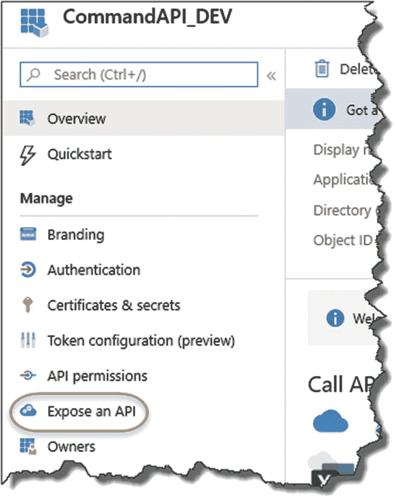
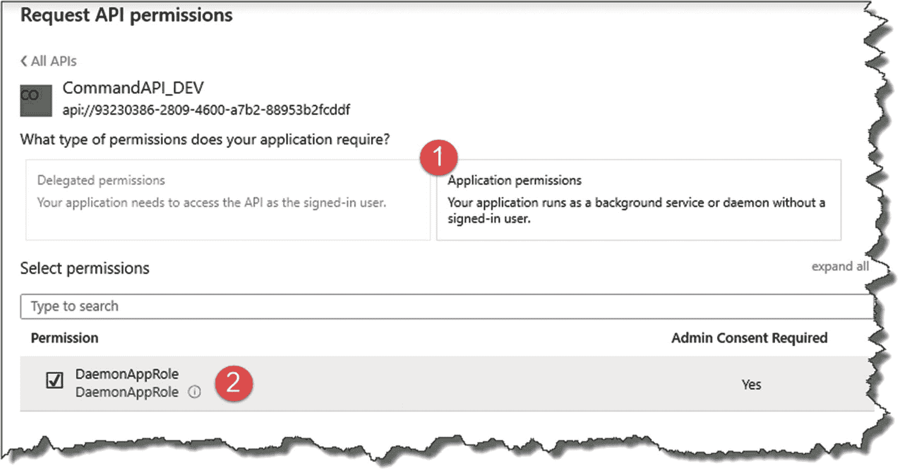

# 十四、保护我们的 API

## 章节总结

在这一章中，我们将讨论如何保护我们的 API 具体来说，我们将添加“承载者”身份验证方案，该方案将只允许授权的客户端通过使用令牌来访问我们的 API 资源。

### 完成后，你会

*   了解承载认证方案。

*   使用 Azure Active Directory 来保护我们的 API。

*   创建一个被授权使用 API 的简单客户端。

*   部署到 Azure。

我们有很多要讲的，所以让我们开始吧！

## 我们正在建造的东西

### 我们的身份验证用例

在深入研究我们选择的认证方案的技术细节之前，我只想介绍一下我们的认证*用例*。对于本例，我们将通过使用 Azure Active Directory (AAD)来“保护”我们的 API，然后创建并配置一个客户端(或守护程序)应用，该应用具有通过和使用 API 进行身份验证的必要权限。我们*不会*利用“交互式”用户输入的用户 id 和密码。该用例如图 [14-1](#Fig1) 所示。


图 14-1

认证用例

### 承载认证概述

我们可以使用许多身份验证方案，表中提供了一个不完整的列表。

<colgroup><col class="tcol1 align-left"> <col class="tcol2 align-left"></colgroup> 
| 

计划

 | 

描述

 |
| --- | --- |
| 基础 | 一种常见的、相对简单的身份验证方案。要求提供用户名和密码，然后将其编码为 Base64 字符串；然后将其添加到 http 请求的授权头中。本来，这是不加密的，所以它不是那么安全，除非您选择通过 https 发出请求，在这种情况下，传输是加密的 |
| 摘要 | 遵循基本身份验证，但更安全，因为它在发送之前对任何敏感数据(如用户名和密码)应用哈希函数 |
| 持票人 | 基于令牌的身份验证方案，拥有有效“令牌”的任何人都可以访问相关的安全资源，在本例中是我们的 API。被认为是安全的，它在工业中被广泛采用，并且是该方案(在 [RFC 6750](https://tools.ietf.org/html/rfc6750) 中指定)；我们将使用来保护我们的 API |
| 身份验证 | 特定于 Microsoft 的身份验证方案，使用 Windows 凭据进行身份验证。非常体面、安全的方案，但由于它有点“专有”(我试图避免这一点)，我们现在就把我们的讨论留在这里 |

#### 不记名股票对 JWT

在载体认证中使用“令牌”是一个核心概念。令牌被发给请求者(在这种情况下是守护程序客户端)，然后客户端(或“令牌的持有者”)将其提交给安全资源以获得访问权。

那么，JWT 是什么？

JWT(或 JSON Web 令牌)是包含 JSON 有效负载的令牌的编码标准(在 [RFC 7519](https://tools.ietf.org/html/rfc7519) 中指定)。jwt 可以在许多应用中使用；然而，在这种情况下，我们将通过使用载体认证来使用 JWT 作为我们的编码令牌。

总之

*   承载身份验证是利用(承载)“令牌”的身份验证方案

*   JWT 是不记名令牌的具体实现，尤其是那些带有 JSON 有效负载的令牌。

同样，与其停留在大量的理论上，我们在下面构建这些概念会更有意义。

### 构建步骤

正如我之前提到的，在开始构建之前，我喜欢从 50，000 英尺的高度来看我们将要构建的东西，因为这有助于我们了解我们需要做什么，也让我们了解我们正在取得的进展。因此，就我们需要执行的配置和编码而言，我已经详细说明了我们将在这里遵循的步骤。


图 14-3

客户端构建步骤


图 14-2

API 构建步骤

#### 我们的 API 项目的步骤

#### 我们的守护客户端的步骤

你可以看到实际上有很多事情要做，所以让我们开始吧！

## 在 Azure AD 中注册我们的 API

我们需要做的第一件事是向 Azure Active Directory (AAD)注册我们的 API，因为我们使用 AAD 作为我们的身份和访问管理*目录服务*。

Les’ Personal Anecdote

我大学毕业后的第一份工作是作为一个团队的一员，支持 Novell NetWare 目录服务(NDS)的大型(我相信当时是世界第二大)部署，这很奇怪，因为我既没有背景也没有兴趣学习 NDS。

无论如何，该产品在当时被认为是相对领先的，因为它采用了在全国范围内分布和复制(在这种情况下)的分层目录树结构中存储用户帐户(以及其他“组织对象”)的方法。简而言之，它具有巨大的可扩展性，可以满足 10，000 个(我们有超过 100，000 个)用户账户的需求。

当时，微软只使用 Windows NT 域，与 NetWare 域相比，Windows NT 域更基本(它们是“平面的”)，可伸缩性、可分发性和可靠性更差。蓝屏死亡有人吗？

很明显，微软受到了 NDS(和 Banyan Vines——见下一节)的“启发”,以至于他们推出了一款与之竞争的产品 Active Directory，它与 NDS 有着惊人的相似之处。你可能会认为这是诗意的正义，因为 Novell 受到了早期产品 Banyan VINES 的“启发”。 <sup>[1](#Fn1)</sup> 有趣的是，Banyan 的工程主管吉姆·奥尔钦(Jim Allchin)加入微软，是因为与 Banyan 领导层在创意和战略上的分歧。

剩下的就是历史了。

Banyan 和 Novell 的产品由于许多不同的战略失误而枯萎死亡，同时也是因为微软有一个令人信服的价值主张。

因此，如果您在工作中使用 Windows PC，并且必须“登录”，那么您最有可能登录到活动目录。现在，随着 Azure 的出现，你甚至不需要在本地托管你的广告，你可以选择使用 Azure Active Directory，这就是我们本章将要用到的。

### 创建新广告？

现在这一步是可选的，但是除了注册 Azure 时创建的 AAD 之外，我还创建了一个“测试”AAD。这实际上只是将本质上是我的“生产 AAD”(保存我的 Azure 登录信息的那个)与我从事的任何开发活动隔离开来。

你可以像在 Azure 中创建任何其他资源一样创建一个新的 AAD，所以我不会在这里详述步骤。如果你选择这种方法(记住它是可选的)，你需要知道的唯一事情是当你想在你的“开发 AAD”中创建对象时，你需要在 Azure 门户中切换到它。

#### 在 aad 之间切换

要在您的 aad 之间切换，请单击 Azure 门户右上角的人物图标。


图 14-4

切换 Active Directory

在弹出的对话框中，你可以点击切换目录(见图 [14-4](#Fig4) 中的圆圈部分)。然后你应该可以选择和切换你的 aad(我有两个，如图 [14-5](#Fig5) 所示)。


图 14-5

我出于测试目的制作了第二个广告

### 注册我们的 API

选择您在本练习中使用的 AAD 从您的门户登录页面单击 Azure Active Directory。


图 14-6

选择您想要处理的广告

这应该会带你进入 Azure Active Directory 概览屏幕。s


图 14-7

选择应用注册

s

选择“应用注册”，如图 [14-7](#Fig7) 所示。从下一个示例中可以看到，我已经在我的 AAD 上注册了一个现有的应用，但是我们将为运行在我们的“开发”环境中的 CommandAPI 创建一个新的应用(即在我们的 PC 上本地运行的应用)。稍后我们将讨论我们的 Azure 部署的 API。

即使我们在本地机器上运行我们的开发 API，我们仍然可以利用 AAD 作为我们的身份管理服务(假设我们的开发 PC 可以连接到互联网！).

我在这里要说的是，无论我们的 API(和客户端)在哪里，我们都可以使用 AAD。


图 14-8

创建新注册

选择“新注册”，您将看到以下内容。


图 14-9

配置注册

输入应用注册的名称；它可以是任何东西，但是要使它有意义，(我在这个注册后面附加了“_DEV”以区别于我们随后创建的任何生产注册)。此外，确保选择“仅此组织目录中的帐户”([*您的 AAD 名称*]only-Single tenant)。

我们不需要重定向 URI，所以单击“注册”完成初始注册，之后您将被带到概览屏幕。


图 14-10

我们将使用客户端 id 和租户 Id

这里，我们将了解需要了解的前两个重要信息:

1.  应用(客户端)ID

2.  目录(租户)ID

接下来，我将使用术语客户机 ID 和租户 ID，但它们是什么呢？

#### 客户标识

客户端 ID 本质上只是一个唯一的标识符，我们可以通过引用我们的 AAD 来引用*命令 API* 。

#### 拿着 ID

与我们正在使用的 AAD 相关的唯一 id，记住我们可以拥有多个(即多租户)AAD。

当我们在应用端进行配置时，我们将回头讨论这些项目；现在我们需要继续前进，因为我们还没有完全完成。

### 公开我们的 API

到目前为止，我们仅仅*注册了*我们的 API 我们现在需要*公开*它以供使用，所以在我们的注册页面的左侧菜单选项中点击“公开一个 API”。



图 14-11

公开我们的 API

这里我们需要做的是创建一个“应用 ID URI”(有时也称为“资源 ID”)，所以点击“设置”，如图 [14-12](#Fig12) 所示。


图 14-12

设置资源 ID

Azure 将为此提供默认建议；使用它(它是带有“`api://`”前缀的客户端 ID)。


图 14-13

自动生成的资源标识(应用标识 URI)

点击保存，就完成了。点击回到应用注册的概述，你应该看到这也反映在这里。


图 14-14

资源 ID 已创建

我们几乎完成了 AAD 中的 API 配置，但是还有一点配置需要完成。

### 更新我们的清单

这里，我们更新了应用清单的`appRoles`部分，它指定了可以访问 API 的应用角色的类型。在我们的例子中，我们需要指定一个非交互式的“守护程序”应用作为我们的 API 客户端。有关应用清单的更多信息可以在 Microsoft Docs 中找到。 <sup>[2](#Fn2)</sup>

无论如何，回到手头的任务，我们需要在清单的`appRoles`部分插入下面的 JSON 片段:

```cs
.
.
.
"appRoles": [
  {
    "allowedMemberTypes": [
      "Application"
    ],
    "description": "Daemon apps in this role can consume the web api.",
    "displayName": "DaemonAppRole",
    "id": "6543b78e-0f43-4fe9-bf84-0ce8b74c06a3",
    "isEnabled": true,
    "lang": null,
    "origin": "Application",
    "value": "DaemonAppRole"
  }
],
.
.
.

```

因此，在我们的应用注册配置页面的左侧窗口中，单击“Manifest”。


图 14-15

更新清单

并将前面给出的 json 插入正确的位置(本质上是更新现有的空的`appRoles`部分)。


图 14-16

请确保正确更新清单

确保保持 json 的完整性，不要省略或引入任何额外的逗号。你可以随时使用类似 [`https://jsoneditoronline.org/`](https://jsoneditoronline.org/) 的东西来检查。

您可以向此部分添加多个`appRoles`；我们只需要一个，尽管如果您决定添加一些额外的角色，您需要确保“id”属性是一个惟一的 GUID。您可以使用我在 JSON 中提供的示例 GUID，也可以创建自己的 GUID(您可以在不同的 AAD 中使用相同的 GUID——只是不能在同一个 AAD 中复制它们)。

完成后，不要忘记保存文件。

这就是我们在 Azure 中的 API 注册；我们现在需要转移到我们的 API，并进行一些配置和代码更改，以便它可以利用 AAD 进行授权。

## 添加配置元素

我们需要让我们的 API“意识到”我们刚刚设置的 AAD 设置，以便它可以使用 AAD 来认证客户端。我们需要配置

*   登录“实例”

*   我们的 AAD 域

*   租户 ID

*   客户端 ID

*   应用 ID URL(或资源 ID)

在我们继续在 Azure 上配置我们的 API 之前，请记住我们目前正在我们的*开发*环境中使用我们的 API。

正如我们已经讨论过的，你可以把你的应用配置存储在很多地方(例如， ***appsettings.json，appsettings)。Development.json、**、T3 等。);在这一节，我将再次使用用户秘密(请参考第 [8](08.html) 章复习)。*

我采用这种方法的主要原因是，我将把我的代码推送到一个公共的 GitHub 库，我不希望这些项目在类似 ***appsettings.json*** 的东西中可见。

该表详细列出了我将为每个配置元素使用的用户秘密变量的名称。

<colgroup><col class="tcol1 align-left"> <col class="tcol2 align-left"></colgroup> 
| 

配置元素

 | 

用户秘密变量

 |
| --- | --- |
| 登录“实例” | 情况 |
| 我们的 AAD 域 | 领域 |
| 租户 ID | 坚持住 |
| 客户端 ID | customer Id(客户 id) |
| 应用 UD URL(或资源 ID) | 资源标识 |

作为添加“实例”用户密码的快速复习，在 API 项目根文件夹( **CommandAPI** )内的命令提示符下，键入:

```cs
dotnet user-secrets set "Instance" "https://login.microsoftonline.com/"

```

这将为我们的登录实例添加一个值(您应该使用我在这里使用的值)。其他用户机密我将留给您自己添加，因为您需要提供的值对于您自己的应用注册来说是唯一的(请参考 API 的应用注册概览屏幕上的这些值)。

添加完我所有的用户秘密后，我的 ***secrets.json*** 文件的内容现在看起来是这样的。


图 14-17

my secrets.json 文件的示例内容

需要注意的几点

*   你为`Instance`设置的值应该和我之前使用的完全一样。

*   如果你完全按照我描述的教程*去做，你对`UserID`和`Password` *的值可能*和我刚才展示的一样(如果你选择了你自己的值，它们当然可能不同！).*

**   您拥有的`TenantId`、`Domain`、`ClientId,`和`ResourceId`的值将与我的不同。 <sup>[3](#Fn3)</sup>* 

 *## 更新我们的项目包

在我们开始编码之前，我们需要添加一个新的包来支持我们将要引入的代码，所以在 API 项目“内部”的命令提示符下，键入

```cs
dotnet add package Microsoft.AspNetCore.Authentication.JwtBearer

```

这应该会成功地将以下包引用添加到。csproj 文件。


图 14-18

添加引用以允许 JWT 载体身份验证

## 更新我们的启动类

在我们的 API 项目的`startup`类中，我们需要更新我们的`ConfigureServices`和`Configure`方法。首先，将下面的 using 指令添加到`startup`类文件的顶部:

```cs
using Microsoft.AspNetCore.Authentication.JwtBearer;

```

### 更新配置服务

我们需要在`ConfigureServices`方法中设置承载认证；为此，添加以下代码(新代码突出显示):

```cs
.
.
.
services.AddDbContext<CommandContext>(opt => opt.UseNpgsql(builder.ConnectionString));

services.AddAuthentication(JwtBearerDefaults.AuthenticationScheme)
  .AddJwtBearer(opt =>
  {
    opt.Audience = Configuration["ResourceId"];
    opt.Authority = $"{Configuration["Instance"]}{Configuration["TenantId"]}";
  });

services.AddControllers();
.
.
.

```

为了将这些变化放在上下文中，它应该是这样的。


图 14-19

启动时注册认证服务

前面的代码向我们的 API 添加了身份验证，特别是使用 JWT 令牌的载体身份验证。然后，我们配置两个选项:

*   **观众**:我们把这个设置为 Azure 应用注册的`ResourceID`。

*   **Authority** :我们的 AAD 实例，它是令牌发放机构(由`Instance`和`TenantId`组合而成)。

### 更新配置

我们现在需要做的就是通过`Configure`方法向我们的请求管道添加认证和授权:

```cs
app.UseAuthentication();
app.UseAuthorization();

```

如图 [14-20](#Fig20) 所示。


图 14-20

在启动时更新配置方法

#### 身份验证与授权

由于我们已经在请求管道中添加了身份验证和授权，所以在我们继续之前，我只想快速概述一下这两个概念之间的区别:

*   **认证(即“谁”)**:验证你是谁，本质上是检查你的身份是否有效。

*   **授权(“什么”)**:授予您所拥有的权限/访问级别。

所以在我们的例子中，我们的客户端应用将通过 AAD 进行身份验证；一旦完成，我们就可以确定*它可以在我们的 API(授权)上调用哪些*端点。

Warning!

由于身份验证首先发生(在我们授权您做任何事情之前，我们需要识别您的身份)，您将这些组件添加到请求管道的顺序(通过`Configure`方法)至关重要。因此，请确保按照前面指定的顺序添加它们。

如果你已经忘记了(那是很久以前的事了),回头参考第 4 章,我们对请求管道的简短讨论。);有关更深入的对话，请参考 Microsoft 文档。 <sup>[4](#Fn4)</sup>

## 更新我们的控制器

我们已经在我们的`Startup`类中添加了使用 JWT 令牌的载体认证的基础，使它能够在我们的 API 中使用，但是现在我们想用它来保护我们的一个端点。我们当然可以保护整个 API，但是现在让我们从小处着手。我们可以选择任何 API 端点，但是让我们只使用一个简单的 GET 方法，特别是我们检索单个命令的能力。

在我们更新控制器动作之前，请确保在我们的`CommandsController`类的顶部添加以下 using 指令:

```cs
using Microsoft.AspNetCore.Authorization;

```

我们的控制器动作的新代码很简单；我们只是用如下所示的`[Authorize]`属性来修饰它:

```cs
[Authorize]
[HttpGet("{id}", Name = "GetCommandById")]
public ActionResult<CommandReadDto> GetCommandById(int id)
{
  var commandItem = _repository.GetCommandById(id);
  if (commandItem == null)
  {
    return NotFound();
  }
    return Ok(_mapper.Map<CommandReadDto>(commandItem));
 }

```

保存所有新代码，编译，然后在本地运行 API。运行后，调用我们在 Postman 中新保护的端点。


图 14-21

我们的终点是安全的

在这里，你会看到

1.  我们得到一个 401 未授权响应

2.  选择返回标题，我们看到

3.  认证类型是“不记名”(我们从 AAD 得到一个令牌错误)

为了仔细检查我们只保护了这个端点，调用我们的另一个 GET 操作，您将看到我们仍然得到一个命令列表。


图 14-22

此端点不安全，仍然可以访问

Learning Opportunity

如果我们运行单元测试套件，会发生什么？我们的一些测试会因为我们需要 API 端点方法的授权而中断吗？如果没有，为什么没有？

## 注册我们的客户端应用

在下一节中，我们将编写一个简单的。NET 核心控制台应用，它将充当 API 的授权“客户端”。因为这是一个“守护程序”，它需要在没有用户认证交互的情况下运行，所以我们需要这样配置它。

在使用 API 时，我们可以探索许多不同的身份验证用例，例如，用户根据 AAD(用户名/密码组合)进行身份验证，以授予对 API 的访问权限。

在这个例子中，我决定使用的用例(一个“守护程序应用”)在现实世界的用例方面更能引起我的共鸣。

回到 Azure，选择注册 API 的同一个 AAD，并再次选择应用注册。


图 14-23

为我们的客户端应用创建应用注册

然后选择“+新注册”，并在出现的屏幕上为我们的客户端应用输入一个合适的名称，如下所示。


图 14-24

命名注册

再次选择*单租户*支持的账户类型选项，点击“注册”；这将带您进入新应用注册的概览屏幕。


图 14-25

客户注册概述

和以前一样，它会为您预先填充一些配置元素，例如，客户机 ID、租户 ID 等。

Learning Opportunity

与 API 注册的租户 ID 相比，我们客户注册的租户 ID 有什么问题？

### 创建客户端机密

接下来点击左侧菜单中的“证书和密码”。


图 14-26

创建客户端机密

在这里，我们将配置一个“客户端密码”这是一个唯一的 ID，我们将结合我们的其他应用注册属性使用，以向我们的 API 识别和验证我们的客户端。单击“+新客户端密码”


图 14-27

选择新的客户端密码

在随后出现的屏幕上，给出

*   描述(可以是任何内容，但要有意义)

*   到期(你有三个选择)


图 14-28

命名秘密并设置到期时间

当你高兴时，点击“添加”

Warning!

确保您**现在就复制一份客户机密；**在创建后不久，它将不会再次完整显示——您只会看到一个编辑版本，并且与我们的其他注册属性不同，您将无法检索它。

这是一项设计安全功能，有助于阻止未经授权传播客户端机密(实际上是一个密码)。

### 配置 API 权限

现在点击“API 权限”；在这里，我们将(请击鼓)配置对我们的命令 API 的访问。


图 14-29

对我们的 API 设置权限

单击“+添加权限”


图 14-30

添加权限

在出现的“请求 API 权限”窗口中，选择“我的 API”选项卡。


图 14-31

选择“我的 API”

找到命令 API，并选择它。


图 14-32

选择 CommandAPI_DEV 实例

在出现的屏幕上，确保

1.  已选择应用权限。

2.  您“检查”了 DaemonAppRole 权限。



图 14-33

相应地配置权限

当你高兴时，点击“添加权限”，你的权限将被添加到列表中。


图 14-34

同意

你会注意到

1.  权限已经“创建”，但尚未“授予”

2.  您需要点击“在此处 <sup>[5](#Fn5)</sup> >”按钮——现在就点击。

您*可能*会看到一个微软认证弹出窗口；验证并接受您收到的任何权限请求(如果这没有出现，请不要担心-看起来这可能是那些不断变化的 UI 更新之一)。


图 14-35

您可能会被要求接受权限请求

无论哪种方式，您都将返回到“配置权限”窗口，在此窗口中，您新创建的 API 权限将被授予访问权限。


图 14-36

完全授予权限

至此，我们的(尚未创建的)客户端应用的注册就完成了。

## 创建我们的客户端应用

本章的最后一部分是创建一个简单的客户端，我们可以用它来调用我们的受保护的 API，所以我们要创建新的控制台项目来完成这个任务。

我不认为这个应用是我们“解决方案”的一部分(包含我们的 API 和测试项目)，所以我将在一个完全独立的工作项目目录中创建它，该目录位于***commandapi solution***文件夹之外。

Note

因为我们只会创建一个项目，所以我*不会*利用“解决方案”结构。

你可以在 GitHub 上找到这个项目的代码:

[T2`https://github.com/binarythistle/Secure-Daemon-Client/`](https://github.com/binarythistle/Secure-Daemon-Client/)

在命令提示符下，在我们的 ***命令和*** 文件夹之外的新工作目录中，键入

```cs
dotnet new console -n CommandAPIClient

```

一旦创建了项目，在您的开发环境中打开项目文件夹 ***CommandAPIClient*** ，因此如果您使用的是 VS 代码，您可以键入

```cs
code -r CommandAPIClient

```

这将在 VS 代码中打开项目文件夹***commandapclient***。

### 我们的客户端配置

当我在 GitHub 上提供这段代码[供你下载和使用时，我特意将配置存储在一个 ***appsettings.json*** 文件中，而不是使用用户机密，因为如果你选择使用回购的代码，你会更容易快速上手。因此，我们将在这里存储敏感的配置元素；因此，对于生产系统**您不会这样做！**](https://github.com/binarythistle/Secure-Daemon-Client)

Learning Opportunity

遵循我们为 API 采取的方法；“转换”此处的客户端应用示例以使用用户机密。

在项目文件夹的根目录下创建一个 ***appsettings.json*** 文件；一旦完成，如果你使用的是 VS 代码，应该是这样的。


图 14-37

创建一个 Appsettings.json 文件

在该文件中，添加以下 JSON 确保为您的客户端的**应用注册(`TenantId`、`ClientId, and ClientSecret`)填充正确的值，如果是`ResourceId,`，确保它是 **API** 的`ResourceId`:**

```cs
{
  "Instance": "https://login.microsoftonline.com/{0}",
  "TenantId": "[YOUR TENANT ID]",
  "ClientId": "[YOUR CLIENT ID]",
  "ClientSecret": "[YOUR CLIENT SECRET]",
  "BaseAddress": "https://localhost:5001/api/Commands/1",
  "ResourceId": "api://[YOUR API CLIENT ID]/.default"
}

```

例如，我的文件是这样的。


图 14-38

客户端配置

有几点需要仔细检查:

*   **BaseAddress** :这只是命令 API 的本地地址(我们稍后将更新到我们的生产 URL)。注意，我特意指定了需要授权的 API 控制器动作。

*   **ResourceId** :这是我们 **API App** 注册的`ResourceId`。

其他属性很简单，可以从 Azure 中检索到，除了`ClientSecret`，您应该在创建它时复制一份。

Warning!

给定的所有属性足以访问我们的受限 API，而不需要任何额外的密码等。所以，你**不应该**在生产中这样储存；你应该利用用户秘密或类似的东西。

同样，我选择在一个 ***appsettings.json*** 文件中提供它，以允许您快速启动并运行代码，并将其作为一个学习练习，供您实施*用户秘密*方法。

### 添加我们的包参考

在我们开始编码之前，我们需要向我们的项目添加一些包引用来支持我们将要使用的一些特性，所以我们将添加

*   微软。扩展.配置

*   微软。扩展.配置.绑定器

*   微软。扩展

*   微软。身份。客户

我更喜欢使用 dotnet CLI 来实现这一点，因此正如我们之前所做的那样，确保您“在”正确的项目文件夹中(如果您完全按照教程所述，您应该“在”***commandapclient***文件夹中)，并发出以下命令来添加我们的第一个包:

```cs
dotnet add package Microsoft.Extensions.Configuration

```

重复以上步骤，添加所有四个包；你的项目。完成后，csproj 文件应该如下所示。


图 14-39

我们客户的包装参考

### 客户端配置类

为了便于使用，我们将创建一个自定义类，它将允许我们读取我们的 ***appsettings.json*** 文件，然后访问这些配置元素作为类属性。在客户端项目中，在项目根目录下新建一个类文件，命名为 ***AuthConfig.cs*** 如图 [14-40](#Fig40) 所示。


图 14-40

读入和管理客户端配置的自动配置类

然后输入以下代码:

```cs
using System;
using System.IO;
using System.Globalization;
using Microsoft.Extensions.Configuration;

namespace CommandAPIClient
{
  public class AuthConfig
  {
    public string Instance {get; set;} =
      "https://login.microsoftonline.com/{0}";
    public string TenantId {get; set;}
    public string ClientId {get; set;}
    public string Authority
    {
      get
      {
        return String.Format(CultureInfo.InvariantCulture,
                             Instance, TenantId);
      }
    }
    public string ClientSecret {get; set;}
    public string BaseAddress {get; set;}
    public string ResourceID {get; set;}

    public static AuthConfig ReadFromJsonFile(string path)
    {
      IConfiguration Configuration;

      var builder = new ConfigurationBuilder()
        .SetBasePath(Directory.GetCurrentDirectory())
        .AddJsonFile(path);

      Configuration = builder.Build();

      return Configuration.Get<AuthConfig>();
    }
  }
}

```

完成后，你的`AuthConfig`类应该是这样的。


图 14-41

Authconfig 类的演练

此处列出了值得注意的代码

1.  我们将实例和我们的 AAD 租户结合起来，创建一个叫做“权威”的东西；当我们稍后尝试连接我们的客户端时，这是必需的。

2.  我们的类有一个静态方法，允许我们指定 JSON 配置文件的名称。

3.  我们创建一个。NET 核心配置子系统。

4.  使用`ConfigurationBuilder,`我们读取 json 配置文件的内容。

5.  我们将读入的配置传递回我们的 AuthConfig 类。

为了快速测试这一切是否正常，执行一个构建，假设我们没有错误，转到我们的程序类，编辑 Main 方法，如下所示:

```cs
static void Main(string[] args)
{
  AuthConfig config = AuthConfig.ReadFromJsonFile("appsettings.json");

  Console.WriteLine($"Authority: {config.Authority}");
}

```

重新构建您的代码，然后运行它；假设一切正常，您应该得到类似如下的输出。


图 14-42

运行客户端

### 完成我们的课程

如前所述，我们的客户端必须做的第一件事是获得一个 JWT 令牌，然后将它附加到所有后续请求，以便访问它需要的资源，所以让我们专注于这一点。

仍然在我们的程序类中，我们将创建一个名为`RunAsync`的新的静态异步方法；我们修改过的`Program`类的代码如下所示(注意，新的或修改过的代码用粗体突出显示):

```cs
using System;
using System.Threading.Tasks;
using Microsoft.Identity.Client;

namespace CommandAPIClient
{
  class Program
  {
    static void Main(string[] args)
    {
        Console.WriteLine("Making the call...");
        RunAsync().GetAwaiter().GetResult();
    }

    private static async Task RunAsync()
    {
      AuthConfig config = AuthConfig.ReadFromJsonFile("appsettings.json");

      IConfidentialClientApplication app;

      app = ConfidentialClientApplicationBuilder.Create(config.ClientId)
          .WithClientSecret(config.ClientSecret)
          .WithAuthority(new Uri(config.Authority))
          .Build();

      string[] ResourceIds = new string[] {config.ResourceID};

      AuthenticationResult result = null;
      try
      {
        result = await app.AcquireTokenForClient(ResourceIds).ExecuteAsync();
        Console.ForegroundColor = ConsoleColor.Green;
        Console.WriteLine("Token acquired \n");
        Console.WriteLine(result.AccessToken);
        Console.ResetColor();
      }
      catch (MsalClientException ex)
      {
        Console.ForegroundColor = ConsoleColor.Red;
        Console.WriteLine(ex.Message);
        Console.ResetColor();
      }
    }
  }
}

```

我在这里标记了兴趣点。


图 14-43

推进客户端

1.  我们的`RunAsync`方法是异步的，并且返回我们感兴趣的结果，所以我们链接`GetAwaiter`和`GetResult`方法，以确保控制台应用在结果被处理和返回之前不会退出。

2.  `ConfidentialClientApplication`是我们用例的特定类类型；我们将它与`ConfidentialClientApplicationBuilder`结合使用，用我们的配置属性构建一个“客户端”。

3.  我们用从我们的`AuthConfig`类中得到的值来设置我们的应用。

4.  我们可以有多个想要调用的`ResourceId`(或作用域);因此，我们创建了一个字符串数组来满足这个需求。

5.  `AuthenticationResult`包含令牌获取的结果。

6.  最后，我们对 AcquireTokenForClient 进行异步调用(希望！)使用我们的认证配置从 AAD 返回一个 JWT 不记名令牌。

保存文件，构建代码，假设一切正常，也运行它；您应该看到以下内容。


图 14-44

成功获取令牌

Celebration Checkpoint

干得好！有很多配置和编码让我们达到这一点，获得 JWT 令牌，所以这一章的其余部分都太容易了！

干得好！

我们继续我们的`RunAsync`方法的第二个也是最后一个部分，那就是用我们在上一步中刚刚获得的令牌调用我们的受保护 API 端点，所以直接在我们的`RunAsync`方法中的`catch`语句之后，添加下面的代码(也注意三个额外的 using 语句):

```cs
using System.Net.Http;
using System.Net.Http.Headers;
using System.Linq;
.
.
.
if (!string.IsNullOrEmpty(result.AccessToken))
{
  var httpClient = new HttpClient();
  var defaultRequestHeaders = httpClient.DefaultRequestHeaders;

  if(defaultRequestHeaders.Accept ==null ||
     !defaultRequestHeaders.Accept.Any(m => m.MediaType == "application/json"))
  {
    httpClient.DefaultRequestHeaders.Accept.Add(new
      MediaTypeWithQualityHeaderValue("application/json"));
  }
  defaultRequestHeaders.Authorization =
    new AuthenticationHeaderValue("bearer", result.AccessToken);

  HttpResponseMessage response = await httpClient.GetAsync(config.BaseAddress);
  if (response.IsSuccessStatusCode)
  {
    Console.ForegroundColor = ConsoleColor.Green;
    string json = await response.Content.ReadAsStringAsync();
    Console.WriteLine(json);
  }
  else
  {
    Console.ForegroundColor = ConsoleColor.Red;
    Console.WriteLine($"Failed to call the Web Api: {response.StatusCode}");
    string content = await response.Content.ReadAsStringAsync();
    Console.WriteLine($"Content: {content}");
  }
  Console.ResetColor();
}

```

我在这里强调了一些有趣的代码部分。


图 14-45

调用 API

1.  我们使用一个`HttpClient`对象作为发出请求的主要工具。

2.  我们确保在请求头中适当地设置了媒体类型。

3.  我们将授权头设置为“bearer ”,并附加上一步中收到的令牌。

4.  向我们受保护的 API 地址发出异步请求。

5.  检查是否成功并显示。

保存您的代码，构建它，并运行它(还要确保命令 API 正在运行)；您应该会看到如下所示的内容。


图 14-46

调用了安全 API

其中返回了受保护 API 端点的 JSON。

注意:如果您得到类似如下的错误:

```cs
System.Security.AuthenticationException, the remote certificate is invalid.

```

只需检查您是否采取了第 [2](02.html) 章中的步骤来“信任”本地 SSL 证书。如果您懒得返回，只需在命令行中键入以下内容，然后重新运行客户端:

```cs
dotnet dev-certs https --trust

```

## 为 Azure 更新

为了让我们的 API 代码在部署到 Azure 时继续工作，我们必须将以下应用设置添加到我们在 Azure 上的命令 API 中(请记住，我们目前在本地开发实例中将这些设置存储为*用户机密*)。

<colgroup><col class="tcol1 align-left"> <col class="tcol2 align-left"></colgroup> 
| 

配置元素

 | 

应用设置名称

 |
| --- | --- |
| 登录“实例” | 情况 |
| 我们的 AAD 域 | 领域 |
| 租户 ID | 坚持住 |
| 客户端 ID | customer Id(客户 id) |
| 应用 UD URL(或资源 ID) | 资源标识 |

在我们这样做之前，虽然我们可以重用为我们的“本地”命令 API 创建的现有 API 应用注册(CommandAPI_DEV ),但我认为为我们的命令 API 设置一个新的“生产”注册是一个好的做法。

Learning Opportunity

与其按照完全相同的指令创建一个新的“生产”命令 API 注册，我现在让您去做。作为一个建议，把这个新的应用注册命名为:CommandAPI_PROD。

做完了就回来！

你怎么去的？简单对吗？现在你的应用注册列表中应该有类似下面的内容。


图 14-47

生产应用注册

如果像我一样，你在不同于主目录的 Azure 目录中创建了你的应用注册(即，你所有的资源所在的目录)，在你切换回你的主 AAD 为我们的 API 添加新的应用设置之前，我会记下你刚刚创建的生产应用注册中的所有值，如`TenantId`、`ClientId,`和`ResourceId`。

因此，如果需要，切换回创建实际 API 应用和容器实例的 AAD。


图 14-48

切换活动目录

选择您的命令 API 服务，然后单击“配置”进入应用设置屏幕。


图 14-49

API 应用设置

同样，我们之前已经添加了应用设置，所以我将让您添加所有必要的应用设置，以便从身份验证的角度正确配置我们的 API。

Warning!

确保您为应用设置的名称与您之前设置的用户密码完全相同，并使用生产 API 应用注册(CommandAPI_PROD)中的相关值。

在这里，您可以看到我添加的新应用设置。


图 14-50

支持身份验证的附加应用设置

Note

请记住保存您刚刚添加的新应用设置。

### 客户端配置

为了确保我们的客户能够通过我们的生产 API 的认证，我们应该:

1.  在 Azure 上创建生产客户端应用注册。

2.  在我们客户端应用的***application settings . JSON***文件中更新必要的本地设置。

Learning Opportunity

为了完成这项工作，你已经了解了你需要知道的一切，所以我还是要让你完成上面提到的两个步骤。

慢慢来，记住记下作为新生产客户端应用注册的一部分而生成的新值。

完成后，回来这里。

### 将我们的 API 部署到 Azure

回到我们的 Command API 解决方案，我们只是想开始部署到 Azure，所以如果您没有任何挂起的提交，对您的代码进行任意更改(在某处插入注释)，并添加/提交和推送。

像以前一样，我们的构建管道应该成功，我们的部署也应该成功。使用类似 Postman 的东西来调用不安全的端点应该仍然像以前一样工作。


图 14-51

不安全的端点继续工作

然而，当我们尝试调用安全端点(没有令牌)时，我们应该得到 401 未授权响应。


图 14-52

安全端点拒绝请求

转向我们的客户端应用(使用更新的配置来访问生产)，呼叫我们的安全端点将会产生一个成功的结果。


图 14-53

在 Azure 上成功调用我们的安全端点

<aside aria-label="Footnotes" class="FootnoteSection" epub:type="footnotes">Footnotes [1](#Fn1_source)

[T2`https://en.wikipedia.org/wiki/Banyan_VINES`](https://en.wikipedia.org/wiki/Banyan_VINES)

  [2](#Fn2_source)

[T2`https://docs.microsoft.com/en-au/azure/active-directory/develop/reference-app-manifest`](https://docs.microsoft.com/en-au/azure/active-directory/develop/reference-app-manifest)

  [3](#Fn3_source)

为我们两个生成相同 GUID 的可能性非常小。

  [4](#Fn4_source)

[T2`https://docs.microsoft.com/en-us/aspnet/core/fundamentals/middleware/`](https://docs.microsoft.com/en-us/aspnet/core/fundamentals/middleware/)

  [5](#Fn5_source)

根据您的 AAD 的名称，该按钮的标签将与我的不同。

  [6](#Fn6_source)

我知道这与我之前提出的关于我们的 API 的观点完全相反，但是我觉得这是一个稍微不同的用例。

 </aside>*