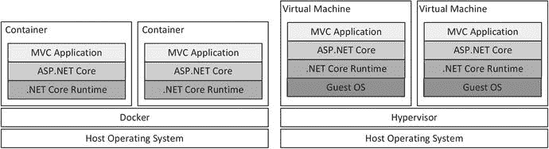

# 一、理解 Docker

Docker 是一套用于在容器中创建和运行应用的工具，它将应用与服务器上运行的所有其他软件隔离开来。尽管服务器可能运行几十个甚至几百个容器，但是每个应用都与所有其他实例隔离开来，并且就像它是唯一运行的应用一样运行。

这本书解释了如何使用 Docker for ASP.NET Core MVC 应用，以及容器如何使在生产环境中开发、部署和管理这些应用变得更加容易。

## 你需要知道什么？

为了从本书中获得最大收益，您应该熟悉。NET 核心和 ASP.NET Core MVC 开发，包括如何在 Visual Studio 或 Visual Studio 代码中创建、编译和运行项目。您还应该对 Windows、Linux 或 macOS 有基本的了解，并且能够使用命令提示符运行命令。

### 这本书的结构是什么？

这本书分为八章。第 [2](2.html) 章提供了本书中描述的所有 Docker 命令和功能的快速参考，因此您可以轻松找到您将来需要的内容，而不必搜索本书的其余部分。第 3 章[包含了准备工作的说明，包括安装 Docker、Visual Studio 或 Visual Studio 代码以及所需的支持工具。第 3 章](3.html)还包括创建一个简单的 ASP.NET Core MVC 项目的说明，该项目将在本书的其余部分作为例子。

第[4](4.html)–[7](7.html)章解释了如何在 ASP.NET Core MVC 项目中使用 Docker。第 4 章[介绍了映像，映像是用来创建容器的模板，并向你展示如何创建你自己的映像并用它们来制作容器。第](4.html) [5](5.html) 章介绍了 Docker 存储数据和将不同容器中的应用连接在一起的特性。第 [6](6.html) 章描述了 Docker 对描述需要不同类型容器的复杂应用的支持，第 [7](7.html) 章展示了 Docker 对将服务器集群在一起以运行大量容器的支持。最后一章，第 [8](8.html) 章，完整地解释了本书其余部分的特性如何应用于开发环境而不是生产环境。

## 这是一个详尽的 Docker 参考吗？

不。这本书涵盖了使用 ASP.NET Core MVC 应用的基本 Docker 特性。我忽略了与 MVC 应用无关的 Docker 特性，或者大多数项目不太可能用到的特性。

## 有很多例子吗？

有很多例子，每一章都通过演示而不是描述 Docker 的特性来展示它是如何工作的。在这本书的结尾，你将对 Docker 做什么、如何做以及为什么它在开发和部署 ASP.NET Core MVC 应用时有用有一个坚实的理解。

你可以从`apress.com`下载本书所有章节的例子。下载是免费的，包括示例 ASP.NET Core MVC 项目和配置文件，这样你就不必自己创建了。您不必下载代码，但是将代码剪切并粘贴到您自己的项目中是试验这些示例的最简单的方法。

This Book and the Docker Release Schedule

Docker 正在积极开发，新版本经常出现。在大多数情况下，新版本修复了错误并添加了新功能，但 Docker 是一个快速移动的目标，有时会有突破性的变化。

要求你每隔几个月就购买这本书的新版本似乎不公平也不合理，尤其是因为 Docker 的大部分功能都不太可能改变。相反，我会在本书的 GitHub 资源库中发布主要版本的更新，在`apress.com`上有一个链接。

这是我(和出版社)的一个实验，我还不知道这些更新会采取什么形式——尤其是因为我不知道未来的 Docker 会包含什么——但目标是通过补充书中包含的例子来延长这本书的生命。

我不承诺更新会是什么样的，它们会采取什么形式，或者在我把它们折叠成这本书的新版本之前我会花多长时间来制作它们。当新的 Docker 版本发布时，请保持开放的态度并检查这本书的存储库。如果随着实验的展开，你有关于如何改进更新的想法，请发电子邮件到`adam@adam-freeman.com`告诉我。

## 支持哪些操作系统？

本书中的所有例子都经过了三种操作系统的测试:Windows、macOS 和 Linux。第 7 章是个例外，因为它描述的 Docker 集群特性仅在 Linux 服务器上受 Docker 支持。

## 你为什么要关心 Docker？

Docker 有助于解决影响任何复杂项目但在 ASP.NET Core 项目中尤其普遍的两个重要问题:一致性问题和响应性问题。

### 一致性问题是什么？

大多数 ASP.NET Core MVC 应用由多个组件组成。至少有一台服务器运行 MVC 应用，通常还有一个数据库来持久存储数据。

复杂的应用可能需要额外的组件:更多的应用服务器来分担工作，负载平衡器在应用服务器之间分发 HTTP 请求，以及数据缓存来提高性能。随着组件数量的增加，需要更多的服务器，还需要连接所有组件的网络、帮助发现的名称服务器以及提供数据弹性的存储阵列。

很少有项目能够为每个开发人员提供生产系统的完整副本。因此，开发人员创建了一个近似的生产系统，通常在一个开发工作站上运行应用所需的所有组件，而忽略了网络和负载平衡器等关键基础设施。

使用近似的生产系统会导致几个不同的困难，所有这些困难都是因为开发人员使用的平台与应用部署到的生产系统不一致。

第一个困难是环境中的差异会导致应用在部署时出现意外行为。例如，一个在 Windows 上开发但部署在 Linux 服务器上的项目，容易受到文件系统、存储位置和无数其他特性的影响。

第二个困难是开发人员用来表示生产环境的近似值可能会偏离。对不同版本的开发工具、NuGet 包甚至。NET Core 和 ASP.NET Core 运行时可能会发生，导致代码做出的假设在生产或其他开发人员的工作站上无效，这些工作站有自己的生产近似。

第三个困难是执行实际部署。开发和生产系统之间的差异需要两种配置，其中一种在部署之前很难测试。我已经记不清这些年来我花了多少时间来尝试部署应用，却发现配置设置中少了一个字符，或者有一个硬编码的假设，即可以通过`localhost`访问数据库。

第四个困难是很难确保一个应用的所有服务器的配置都是一致的。错误配置的服务器可能只会导致周期性的问题，尤其是当用户的 HTTP 请求被分发到一大群服务器时，识别问题和隔离原因可能是一项困难的任务，因为必须在实际生产系统上执行诊断而变得困难重重。

#### Docker 是如何解决一致性问题的？

当你把一个 ASP.NET Core MVC 应用放到一个容器中时——这个过程被称为容器化——你创建了一个映像，它是一个容器的模板，包含了应用将要存在的完整环境。用于运行应用的所有东西都是映像的一部分。NET 核心运行时、ASP.NET Core 包、第三方工具、配置文件以及提供应用功能的自定义类和 Razor 视图。

Docker 使用该映像创建一个容器，从同一映像创建的任何容器都将包含 ASP.NET Core MVC 应用的一个相同实例。

如果您在项目的开发阶段采用 Docker，开发人员将全部使用单个映像来创建和测试应用。开发映像仍然是生产系统的近似，但它是一个更忠实的复制品，不同之处仅在于包含了开发工具，如编译器和调试器。在所有其他方面，开发映像将具有与用于部署应用的映像相同的内容，具有相同的文件系统、网络拓扑、NuGet 包和。NET 运行时。

当应用准备好进行部署时，就会创建一个生产映像。该映像类似于开发人员使用的映像，但是省略了开发工具，并且包含 C# 类的编译版本。生产映像用于创建生产中的所有容器，这确保了所有实例的配置一致。而且，因为开发和生产映像包含相同的内容，所以不需要在生产中更改配置文件，因为例如，在开发中工作的数据库连接字符串将在生产中工作而无需修改。

### 什么是响应性问题？

部署 ASP.NET Core MVC 应用的传统方法很难响应工作负载的变化。将应用部署到运行在 Windows Server 上的 Internet 信息服务(IIS)的方法意味着增加容量是一项艰巨的任务，需要额外的硬件和配置更改才能将服务器添加到环境中。

增加容量所需的开销使得很难根据需求的短期激增来扩展应用，并且一旦需求高峰过去，停用容量的过程使得很难缩减应用。其结果是，ASP.NET 应用在历史上一直难以提供适当的容量来处理其工作负载，要么在高峰时段容量太少(这会影响用户体验)，要么在非高峰时段容量太多(这会推高运行应用的成本，并占用可用于其他服务的容量)。

#### Docker 如何解决响应问题？

容器是应用的轻量级包装器，为应用运行提供足够的资源，同时确保与其他容器隔离。根据应用的不同，一台服务器可以运行许多容器，Docker 提供了集成的集群，称为 swarm，它允许部署容器，而不需要特别注意集群或配置更改。低资源需求和集成集群的结合意味着扩展一个容器化的 ASP.NET Core MVC 应用只是添加或删除容器的问题。此外，由于容器隔离应用，任何未使用的容量都可以重新用于运行另一个应用的容器，从而允许动态地重新平衡工作负载。

## Docker 容器不就是虚拟机吗？

乍一看，容器似乎很像虚拟机，容器和虚拟机的使用方式也有相似之处，即使它们以不同的方式工作。两者都可以用于通过添加或删除实例来扩展应用，两者都可以用于创建运行应用的标准化环境。

但是容器不是虚拟机。虚拟机提供完全隔离的软件堆栈，包括操作系统。例如，一台服务器可以运行多种虚拟机，每种虚拟机可以是不同的操作系统，从而允许需要 Linux 和 Windows 的应用在不同的虚拟机上并行运行。

Docker 只隔离单个应用，服务器上的所有容器都运行在服务器的操作系统上。这意味着所有的应用在 Linux 服务器上的 Linux 容器中运行，在 Windows 服务器上的 Windows 容器中运行。

因为 Docker 容器只隔离应用，所以它们比虚拟机需要更少的资源，这意味着单个服务器可以运行比虚拟机更多的容器。这并不自动意味着运行容器的服务器可以处理更多的总体工作，但它确实意味着在处理低级操作系统任务上花费的资源更少，这些任务在每个虚拟机中都是重复的。图 [1-1](#Fig1) 显示了在 Docker 容器和虚拟机中运行的 ASP.NET Core MVC 应用之间的区别。

图 1-1。

Containers versus virtual machines

该图显示了使用 Docker 和虚拟机之间的经典比较，但 ASP.NET Core MVC 项目的主要区别在于，Docker 提供了一些功能，可以轻松创建并行运行的重复容器，无需任何额外配置，通过接受 HTTP 请求作为容器集群的一部分，自动分担应用工作负载。这是 Docker 最大的优点，因为它以一种优雅的方式解决了一致性和响应性问题，而使用传统的虚拟机很难做到这一点。

Note

图 [1-1](#Fig1) 中的比较显示了生产环境中容器和虚拟机之间的区别，在生产环境中，容器运行在主机服务器的操作系统上。Linux 和 Windows Server 可以用于生产。为了允许使用 macOS 和 Windows 创建 Linux Docker 映像，Docker 安装了一个用于运行容器的 Linux 虚拟机。该虚拟机的安装和配置在第 [3](3.html) 章的安装过程中自动完成。

## Docker 容器有限制吗？

Docker 容器并不适合每个项目。容器最适合无状态的 MVC 应用，这样来自单个客户机的一系列 HTTP 请求可以由运行在不同容器中的应用的多个实例来处理。这并不意味着 MVC 应用不能有任何状态数据，而是意味着状态数据需要被存储，以便可以从任何容器访问它，比如通过使用数据库。(我在第 4 章中描述了如何创建一个访问容器化数据库的 MVC 应用。)

使用 Docker 的部分好处是能够根据需要创建和销毁容器，这意味着具有复杂初始化例程、需要手动干预或只能运行单个实例的 MVC 应用不适合容器化。

Docker 依赖于服务器操作系统中包含的容器化支持。Linux 对容器的支持是成熟和可靠的，并且受到所有主要发行版的支持。然而，在撰写本文时，容器是 Windows Server 的新增功能，不像 Linux 那样成熟，也不像 Linux 那样受支持。Windows 容器仅在 Windows Server 2016 上可用，并且只能使用带有 Docker 预发布版本的 Windows 10 进行开发。并非所有的公共云平台都支持 Windows 容器，这可能会限制您的部署选择。

好消息是。NET Core 和 ASP.NET Core 在 Linux 上运行良好，这意味着你可以在 Linux 服务器上利用 Docker，包括亚马逊 Web 服务和微软 Azure 等公共云提供的服务。如果你的 MVC 应用依赖于传统的(非核心的)，你的选择是有限的。运行在 Windows 上的. NET 框架。我在第 4 章中解释了如何使用 Docker 创建 Windows 容器，但至少目前应该仔细考虑将项目迁移到。NET 核心和 ASP.NET Core，以便它可以在 Linux 容器中运行，否则应该使用更传统的部署方法，如虚拟机或托管的 IIS 服务器。

## 用容器一定要用 Docker 吗？

不需要。Docker 只是一套工具，可以处理 Linux 和 Windows 提供的容器特性。对容器的支持已经成为 Linux 的一部分很长时间了，并且已经成熟为一个稳定可靠的特性。微软也接受了容器，并在 Windows Server 2016 中包含了对容器的支持，尽管它没有像 Linux 一样得到广泛使用或良好支持。

Docker 变得流行是因为它使容器功能易于使用，提供了创建和管理创建容器的映像的工具，并将这些容器聚集在一起以轻松扩展应用。

Docker 可能无法满足所有需求，因为容器支持是内置于操作系统中的，所以 Docker 的替代产品可能更适合特定的项目。一项名为开放容器倡议( [`https://www.opencontainers.org`](https://www.opencontainers.org) )的标准化工作旨在标准化容器的使用，这也使得混合来自其他提供商的工具和运行时变得更加容易。Docker 正在参与标准制定过程，因此即使您使用其他提供商的工具或功能，您也应该能够构建本书中描述的功能。

在撰写本文时，Docker 的主要竞争对手是`rkt`，它由一家名为 CoreOS 的公司生产，您可以在 [`https://coreos.com/rkt`](https://coreos.com/rkt) 了解到。CoreOS 最出名的是它的轻量级 CoreOS Container Linux 发行版，这是一个运行容器的优秀服务器，包括 Docker 的容器。当我演示如何创建运行容器的服务器集群时，我在第 7 章使用 CoreOS。CoreOS 也可以用在大多数支持 Docker 容器的公共云服务上，包括亚马逊 Web 服务和微软 Azure。CoreOS 容器 Linux 详见 [`https://coreos.com/why`](https://coreos.com/why) 。

## 你如何设置你的开发环境？

第 3 章提供了 Windows、Linux 和 macOS 的详细设置说明。

## 联系作者

如果你在使用书中的例子时有问题，或者你在书中发现了问题，那么你可以发电子邮件到`adam@adam-freeman.com`给我，我会尽力帮助你。

## 摘要

在这一章中，我描述了本书的目的和内容，解释了如何下载用于本书每一章的项目，并解释了 Docker 如何解决 ASP.NET Core MVC 应用面临的一致性和响应性问题。在下一章中，我将提供一个使用 Docker 的快速参考，然后在第 [3](3.html) 章中向您展示如何设置使用 Docker 和 ASP.NET Core 的环境。