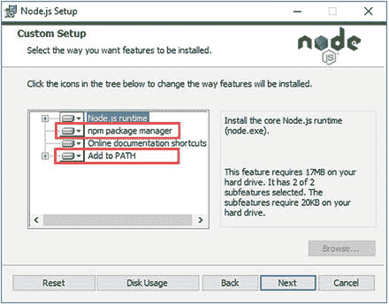

# 三、做好准备

在这一章中，我将解释如何设置 ASP.NET Core MVC 和 Docker 所需的包，并创建本书其余部分使用的示例 MVC 项目。有针对 Windows、Linux 和 macOS 的说明，这是两者都支持的三种操作系统。NET Core 和 Docker。

## 安装所需的软件包

下面几节将介绍安装 ASP.NET Core MVC 开发和使用 Docker 所需的包的过程。为了快速参考，表 [3-1](#Tab1) 列出了这些包并解释了它们的用途。

表 3-1。

The Software Packages Used in This Book

<colgroup><col> <col></colgroup> 
| 名字 | 描述 |
| --- | --- |
| 。NET SDK | 的。NET 核心软件开发工具包包括。NET 运行时来执行。NET 应用和准备容器化应用所需的开发工具。 |
| 节点. js | 本书中使用 Node.js 来运行创建 ASP.NET Core MVC 项目的工具，并下载和运行节点包管理器(NPM)包。 |
| NPM 套餐 | 示例应用依赖 NPM 包来管理其客户端库。 |
| 饭桶 | Git 是一个版本控制系统。bower 在本书中间接使用了它，它是用于管理客户端包的 NPM 包。 |
| Docker | Docker 包包括创建和管理容器所需的工具和运行时。Docker 的 Windows 和 macOS 版本包含 Docker Compose 工具，但必须在 Linux 上单独安装，如第 [6](6.html) 章所述。 |
| 可视化工作室 | Visual Studio 是 Windows 专用的 IDE，它为. NET 提供了全功能的开发体验。 |
| Visual Studio 代码 | Visual Studio 代码是一个轻量级 IDE，可以在 Windows、macOS 和 Linux 上使用。它不提供 Windows 专用 Visual Studio 产品的全部功能，但非常适合 ASP.NET Core MVC 开发。 |

### 安装。网络核心软件开发工具包

那个。NET 核心软件开发工具包(SDK)包括启动开发项目和准备在容器中使用的. NET 核心应用所需的运行时和开发工具。

#### 安装。Windows 上的 NET Core SDK

安装。Windows 上的 NET Core SDK，从 [`https://go.microsoft.com/fwlink/?linkid=843448`](https://go.microsoft.com/fwlink/?linkid=843448) 下载安装程序。此 URL 适用于 64 位。NET Core SDK 版本 1.1.1，这是我在本书中使用的版本，您应该安装它以确保从示例中获得预期的结果。(微软还发布了一个仅运行时安装程序，但这不包含本书所需的工具。)

运行安装程序，一旦安装过程完成，打开一个新的 PowerShell 命令提示符并运行清单 [3-1](#Par6) 中所示的命令进行检查。网芯在工作。

```cs
dotnet --version
Listing 3-1.Testing .NET Core

```

此命令的输出将显示。已安装的. NET 核心运行时。如果您只安装了之前指定的版本，这将是`1.0.1`。(不用担心这个命令上报的版本号和你下载的版本不对应；这是意料之中的。)

Using Long- And Short-Form Command Arguments

本书中的大多数例子都使用命令行，都是为了。NET 和 for Docker。命令有两种类型的参数:长格式和短格式。默认格式(长格式)使用两个连字符，如下所示:

```cs
dotnet --help

```

这是`help`参数的长形式。有些命令还有一个短格式的参数，它使用单个连字符，如下所示:

```cs
dotnet -h

```

短格式和长格式的参数具有相同的效果。在这种情况下，他们会打印出一条帮助消息。并非所有的长格式参数都有对应的短格式，但是当它们可用时，您可以在它们之间自由切换。

#### 正在安装。Linux 上的 NET Core SDK

那个。NET Core SDK 可以安装在流行的 Linux 发行版上。最简单的安装方法。NET Core 访问 [`https://www.microsoft.com/net/core`](https://www.microsoft.com/net/core) ，从列表中选择您的发行版，并将命令复制并粘贴到命令提示符中，以确保您没有键入任何错误的配置参数。为了完整起见，本节展示了 Ubuntu 16.04 的安装过程，我在本书中一直使用 Ubuntu 16.04，在我写作时，它是当前的长期支持(LTS)版本。

来安装。NET Core SDK 在 Ubuntu 16.04 上，打开命令提示符，输入清单 [3-2](#Par15) 中的命令来配置包管理，这样就可以安装微软的包了。

```cs
sudo sh -c 'echo "deb [arch=amd64] https://apt-mo.trafficmanager.net/repos/dotnet-
release/ xenial main" > /etc/apt/sources.list.d/dotnetdev.list'
sudo apt-key adv --keyserver hkp://keyserver.ubuntu.com:80 --recv-keys 417A0893
sudo apt-get update
Listing 3-2.Preparing Package Management for .NET Core

```

运行清单 [3-3](#Par17) 中所示的命令，下载并安装。NET Core SDK 包。使用清单中显示的版本号很重要，这样才能从本书的示例中获得预期的结果。

```cs
sudo apt-get install dotnet-dev-1.0.1
Listing 3-3.Installing the .NET Core Package

```

一旦下载并安装了软件包，运行清单 [3-4](#Par19) 中所示的命令进行检查。NET Core 已安装并正在工作。

```cs
dotnet --version
Listing 3-4.Testing the .NET Core Package

```

此命令的输出将显示。已安装的. NET 核心运行时。如果您只安装了之前指定的版本，这将是`1.0.1`。(不用担心这个命令上报的版本号和你下载的版本不对应；这是意料之中的。)

#### 正在安装。macOS 上的 NET Core

安装前。NET Core SDK，打开一个新的命令提示符，运行清单 [3-5](#Par22) 中的命令来安装家酿软件包管理器。

```cs
/usr/bin/ruby -e \
  "$(curl -fsSL https://raw.githubusercontent.com/Homebrew/install/master/install)"
Listing 3-5.Installing the Package Manager

```

一旦安装完成，运行清单 [3-6](#Par24) 中所示的命令来安装 OpenSSL 库，这是一些。NET 核心功能。

```cs
brew install openssl
mkdir -p /usr/local/lib
ln -s /usr/local/opt/openssl/lib/libcrypto.1.0.0.dylib /usr/local/lib/
ln -s /usr/local/opt/openssl/lib/libssl.1.0.0.dylib /usr/local/lib/
Listing 3-6.Installing the OpenSSL Package

```

来安装。NET Core 在 macOS 上，从 [`https://go.microsoft.com/fwlink/?linkid=843444`](https://go.microsoft.com/fwlink/?linkid=843444) 下载 SDK 安装程序。这个 URL 是针对 the.NET Core SDK 版本 1.1.1 的，这是我在本书中使用的版本，您应该安装它以确保从示例中获得预期的结果。

运行安装程序，一旦该过程完成，打开一个终端窗口并在提示符下运行清单 [3-7](#Par27) 中所示的命令来检查。网芯在工作。

```cs
dotnet --version
Listing 3-7.Testing .NET Core

```

此命令的输出将显示。已安装的. NET 核心运行时。如果您只安装了之前指定的版本，这将是`1.0.1`。(不用担心这个命令上报的版本号和你下载的版本不对应；这是意料之中的。)

### 安装 Node.js

我在本书中用来创建示例 ASP.NET Core MVC 项目的工具依赖于 Node.js(也称为 Node)，它是服务器端 JavaScript 应用的运行时，并且已经成为开发工具的流行平台。重要的是，您下载的 Node.js 版本与我在本书中使用的版本相同。尽管 Node.js 相对稳定，但仍然会不时地出现 API 变化，这可能会阻止示例的运行。

我用过的版本是 6.9.2 版本。对于您自己的项目，您可能更喜欢更新的版本，但是对于本书的其余部分，您应该坚持使用 6.9.2 版本。在 [`https://nodejs.org/dist/v6.9.2`](https://nodejs.org/dist/v6.9.2) 可以获得完整的 6.9.2 版本，包括 Windows 和 macOS 的安装程序。表 [3-2](#Tab2) 显示了 Windows 和 macOS 所需的安装程序文件(Linux 安装的处理方式不同)。

表 3-2。

The Node.js Distribution for Windows and macOS

<colgroup><col> <col></colgroup> 
| 操作系统 | Node.js 分发文件 |
| --- | --- |
| Windows 10 | [T2`https://nodejs.org/dist/v6.9.2/node-v6.9.2-x64.msi`](https://nodejs.org/dist/v6.9.2/node-v6.9.2-x64.msi) |
| 苹果 | [T2`https://nodejs.org/dist/v6.9.2/node-v6.9.2.pkg`](https://nodejs.org/dist/v6.9.2/node-v6.9.2.pkg) |

#### 在 Windows 上安装 Node.js

要在 Windows 上安装 Node.js，请下载并运行表 [3-2](#Tab2) 中列出的安装程序。在安装过程中，确保选择了 npm 包管理器和添加到路径选项，如图 [3-1](#Fig1) 所示。



图 3-1。

Installing Node.js on Windows

NPM 软件包管理器用于下载和安装节点软件包。将 Node.js 添加到路径中可以确保您只需在命令提示符下键入`node`就可以使用 Node.js 运行时。一旦完成安装，打开一个新的命令提示符并运行清单 [3-8](#Par33) 中所示的命令。

```cs
node -v
Listing 3-8.Checking That Node.js Is Installed Correctly

```

您应该会看到下面显示的版本号:`v6.9.2`。如果安装成功，则继续“安装 NPM 软件包”一节。

#### 在 Linux 上安装 Node.js

对于 Linux，安装 Node.js 最简单的方法是通过包管理器，使用 [`https://nodejs.org/en/download/package-manager`](https://nodejs.org/en/download/package-manager) 中描述的步骤。对于 Ubuntu，我运行清单 [3-9](#Par36) 中所示的命令来下载并安装 Node.js

```cs
curl -sL https://deb.nodesource.com/setup_6.x | sudo -E bash -
sudo apt-get install nodejs
Listing 3-9.Installing Node.js on Ubuntu

```

一旦安装了 Node.js，运行清单 [3-10](#Par38) 中所示的命令，检查安装是否成功，以及版本是否正确。

```cs
node -v
Listing 3-10.Checking That Node.js Is Installed Correctly

```

您应该看到版本`6.x.x`已经安装。在撰写本文时，版本 6.9.2 是最新的，但是在您阅读本文时，版本 6.x 的软件包管理器提要中可能已经有更新了。

#### 在 macOS 上安装 Node.js

要在 macOS 上安装 Node.js，请下载并运行表 [3-2](#Tab2) 中列出的安装程序。一旦安装程序完成，打开一个新的终端并在命令提示符下运行清单 [3-11](#Par41) 中所示的命令。

```cs
node -v
Listing 3-11.Checking That Node.js Is Installed Correctly

```

您将看到显示以下版本号:`v6.9.2`。如果安装成功，则继续“安装 NPM 软件包”一节。

### 安装 NPM 软件包

本书中使用的示例应用依赖于 Bower 包，它是使用节点包管理器(NPM)重新安装的。NPM 包含在节点安装中。运行清单 [3-12](#Par44) 中所示的命令，安装将用于管理示例应用中客户端包的包。对于 macOS 和 Linux，您需要使用`sudo`或以管理员身份运行这个命令。

```cs
npm install -g bower@1.8.0
Listing 3-12.Installing the NPM Packages

```

在您阅读本书时，可能会有该软件包的更高版本，但是使用指定的版本以确保从示例中获得预期的结果是很重要的。表 [3-3](#Tab3) 描述了清单 [3-12](#Par44) 中命令安装的包。

表 3-3。

The NPM Package

<colgroup><col> <col></colgroup> 
| 名字 | 描述 |
| --- | --- |
| 凉亭 | Bower 是一个处理客户端包的包管理器，例如本书中的示例应用所使用的 Bootstrap CSS 框架。 |

### 安装 Git

Git 版本控制工具是下载本章后面创建的示例 ASP.NET Core MVC 应用所使用的客户端包所必需的。Visual Studio 代码包括集成的 Git 支持，但是仍然需要单独安装。

#### 在 Windows 或 macOS 上安装 Git

从 [`https://git-scm.com/downloads`](https://git-scm.com/downloads) 下载并运行安装程序。(在 macOS 上，您可能需要更改安全设置才能打开安装程序，开发人员尚未对该安装程序进行签名。)安装完成后，打开一个新的命令提示符，运行清单 [3-13](#Par48) 中的命令，检查 Git 是否已安装并正常工作。

```cs
git --version
Listing 3-13.Checking the Git Install

```

这个命令打印出已经安装的 Git 包的版本。在撰写本文时，Git for Windows 的最新版本是 2.12.0，Git for macOS 的最新版本是 2.10.1。

#### 在 Linux 上安装 Git

Git 已经安装在大多数 Linux 发行版上。如果您想安装最新版本，请查阅 [`https://git-scm.com/download/linux`](https://git-scm.com/download/linux) 上的安装说明。对于 Ubuntu，我使用了以下命令:

```cs
sudo apt-get install git

```

完成安装后，打开一个新的命令提示符，运行清单 [3-14](#Par53) 中的命令，检查 Git 是否已安装并且可用。

```cs
git --version
Listing 3-14.Checking the Git Install

```

这个命令打印出已经安装的 Git 包的版本。在撰写本文时，Git for Linux 的最新版本是 2.7.4。

### 安装 Docker

Docker 支持 Windows、macOS 和一系列 Linux 发行版。所有平台的安装过程都相当简单，如以下部分所述。Docker 有社区版和企业版，区别在于企业版提供的支持和认证。两个版本都提供了相同的核心特性，我在本书中使用了免费的 Docker 社区版。

#### 安装 Docker for Windows

Docker 可以在 Windows 上使用，利用集成的 Hyper-V 支持，以便可以使用 Linux 容器。

Note

在撰写本文时，仅支持 64 位版本的 Windows 10 Pro、Enterprise 和教育版，并安装了最新的更新。

进入 [`https://store.docker.com/editions/community/docker-ce-desktop-windows`](https://store.docker.com/editions/community/docker-ce-desktop-windows) ，点击获取 Docker CE for Windows (stable)链接，运行下载的安装程序。安装完成后 Docker 会自动启动。可能会提示您启用 Hyper-V，如图 [3-2](#Fig2) 所示。Hyper-V 允许在 Windows 上使用 Linux 容器，并且必须启用。


图 3-2。

Enabling Hyper-V

安装完成后，打开一个新的 PowerShell 命令提示符，运行清单 [3-15](#Par60) 中所示的命令，检查安装是否成功。

```cs
docker run --rm hello-world
Listing 3-15.Checking That Docker Is Working

```

Docker 将下载运行一个简单的 Hello World 应用所需的文件。Docker 会写出类似这样的消息，表明一切正常(该命令产生的输出比这里显示的更多，但这是重要的部分):

```cs
...
Unable to find image 'hello-world:latest' locally
latest: Pulling from library/hello-world

c04b14da8d14: Pull complete
Digest: sha256:0256e8a36e2070f7bf2d0b0763dbabdd67798512411de4cdcf9431a1feb60fd9
Status: Downloaded newer image for hello-world:latest

Hello from Docker!
This message shows that your installation appears to be working correctly.
...

```

Installing Docker on Windows Server 2016

如果你正在为纯 Windows 应用创建容器，我将在第 [4](4.html) 章中演示，你可以在 Windows Server 2016 上运行它们。这对大多数开发人员的吸引力有限，因为 Linux 容器得到了更广泛的支持，而且更容易使用，甚至对于 ASP.NET Core 应用也是如此。要在 Windows Server 2016 上安装 Docker，请在管理 PowerShell 中运行以下命令:

```cs
Install-Module -Name DockerMsftProvider -Force

Install-Package -Name docker -ProviderName DockerMsftProvider -Force

```

这些命令安装最新版本的 Docker。安装完成后，重新启动服务器，然后运行以下命令以确保 Docker 安装正确并正常工作:

```cs
docker run --rm hello-world:nanoserver

```

Docker 将下载运行一个简单的 Hello World 应用所需的文件，该应用将自动运行。Docker 会写出类似这样的消息，表明一切正常(该命令产生的输出比这里显示的更多，但这是重要的部分):

```cs
...
Unable to find image 'hello-world:nanoserver' locally
nanoserver: Pulling from library/hello-world

5496abde368a: Pull complete
482ab31872a2: Pull complete
4256836bcaf8: Pull complete
5bc5abeff404: Pull complete
Digest: sha256:3f5a4d0983b0cf36db8b767a25b0db6e4ae3e5abec8831dc03fe773c58ee404a
Status: Downloaded newer image for hello-world:nanoserver

Hello from Docker!
This message shows that your installation appears to be working correctly.
...

```

请记住，Windows Server 2016 不能运行 Linux 容器，也不能用于遵循本书中的大多数示例(或运行通过 Docker 发布的大多数包)。

#### 安装 Docker for Linux

要在 Linux 上安装 Docker，请访问 [`https://www.docker.com/community-edition`](https://www.docker.com/community-edition) ，从列表中选择您正在使用的发行版，并遵循安装说明，复制并粘贴命令以避免输入错误。

本节展示了 Ubuntu 16.04 的安装过程，这是我在本书中使用的发行版。打开一个新的命令提示符并输入清单 [3-16](#Par72) 中的命令来配置包管理器并安装 Docker 所依赖的必备包。

```cs
sudo apt-get -y install apt-transport-https ca-certificates curl
curl -fsSL https://download.docker.com/linux/ubuntu/gpg | sudo apt-key add -
sudo add-apt-repository \
       "deb [arch=amd64] https://download.docker.com/linux/ubuntu \
       $(lsb_release -cs) stable"
sudo apt-get update
Listing 3-16.Preparing the Package Manager and Installing Prerequisite Packages

```

要安装 Docker，运行清单 [3-17](#Par74) 中所示的命令。

```cs
sudo apt-get -y install docker-ce
Listing 3-17.Installing Docker

```

一旦安装了 Docker，运行清单 [3-18](#Par76) 中所示的命令，这样你就可以在没有`sudo`的情况下使用 Docker。

```cs
sudo groupadd docker
sudo usermod -aG docker $USER
Listing 3-18.Configuring Docker So That Root Access Is Not Required

```

注销当前会话，然后再次登录，以使清单 [3-18](#Par76) 中的命令生效。重新登录后，运行清单 [3-19](#Par78) 中所示的命令，检查安装是否成功。

```cs
docker run --rm hello-world
Listing 3-19.Checking That Docker Is Working

```

Docker 将下载运行一个简单的 Hello World 应用所需的文件。Docker 会写出类似这样的消息，表明一切正常(该命令产生的输出比这里显示的更多，但这是重要的部分):

```cs
...
Unable to find image 'hello-world:latest' locally
latest: Pulling from library/hello-world

c04b14da8d14: Pull complete
Digest: sha256:0256e8a36e2070f7bf2d0b0763dbabdd67798512411de4cdcf9431a1feb60fd9
Status: Downloaded newer image for hello-world:latest

Hello from Docker!
This message shows that your installation appears to be working correctly.
...

```

#### 在 macOS 上安装 docker

进入 [`https://store.docker.com/editions/community/docker-ce-desktop-mac`](https://store.docker.com/editions/community/docker-ce-desktop-mac) ，点击 Get Docker for CE Mac (stable)链接，运行下载的安装程序。将鲸鱼拖动到`Applications`文件夹，如图 [3-3](#Fig3) 所示。


图 3-3。

Installing Docker

打开 Launchpad 并单击 Docker 图标来执行设置过程。在这个过程的最后，打开一个新的终端并运行清单 [3-20](#Par83) 中所示的命令来检查安装是否成功。

```cs
docker run --rm hello-world
Listing 3-20.Checking That Docker Is Working

```

Docker 将下载运行一个简单的 Hello World 应用所需的文件。Docker 会写出类似这样的消息，表明一切正常(该命令产生的输出比这里显示的更多，但这是重要的部分):

```cs
...
Unable to find image 'hello-world:latest' locally
latest: Pulling from library/hello-world

c04b14da8d14: Pull complete
Digest: sha256:0256e8a36e2070f7bf2d0b0763dbabdd67798512411de4cdcf9431a1feb60fd9
Status: Downloaded newer image for hello-world:latest

Hello from Docker!
This message shows that your installation appears to be working correctly.
...

```

### 安装 IDE

尽管任何 IDE 都可以用于开发 ASP.NET Core 项目，但最常见的选择是 Windows 的 Visual Studio 和 macOS 和 Linux 的 Visual Studio 代码(尽管如果您愿意，也可以在 Windows 上使用 Visual Studio 代码)。做出最适合您的选择，并遵循以下章节中的设置说明。

#### 安装 Visual Studio 2017

从 [`https://www.visualstudio.com/vs`](https://www.visualstudio.com/vs) 下载安装程序。有不同版本的 Visual Studio 2017 可用，但免费社区版对于本书中的示例来说已经足够了。运行安装程序并确保。选择 NET Core 跨平台开发工作量，如图 [3-4](#Fig4) 所示。


图 3-4。

Selecting the Visual Studio packages

单击“安装”按钮开始下载和安装 Visual Studio 功能。

##### 向 Visual Studio 添加 YAML 扩展

一些重要的 Docker 功能是使用以 YAML 格式编写的文件配置的。我在第 6 章解释了使用这些文件你需要知道什么，但是 YAML 格式令人沮丧的一个方面是不允许制表符。通过安装 Visual Studio 的扩展，处理 YAML 文件变得容易多了。

启动 Visual Studio 并从“工具”菜单中选择“扩展和更新”。导航到 Online 部分，在搜索栏输入 yaml，点击语法高亮包扩展的下载按钮，如图 [3-5](#Fig5) 所示。关闭 Visual Studio，将安装该扩展。


图 3-5。

Installing the YAML editing extension

#### 安装 Visual Studio 代码

Visual Studio Code 是一个轻量级编辑器，它不具备完整的 Visual Studio 产品的所有功能，但可以跨平台工作，完全能够处理 ASP.NET Core MVC 项目。

##### 为 Windows 和 Linux 安装 Visual Studio 代码

要安装 Visual Studio 代码，请访问 [`http://code.visualstudio.com`](http://code.visualstudio.com) ,并单击适用于您的平台的下载链接。运行安装程序，然后启动 Visual Studio 代码，这将提供一个标准的集成开发环境。

##### 为 macOS 安装 Visual Studio 代码

要安装 Visual Studio 代码，请访问 [`http://code.visualstudio.com`](http://code.visualstudio.com) 并单击下载 Mac 链接，这将下载一个 zip 文件。双击下载的文件进行解压，将 Visual Studio 代码文件拖到`Applications`文件夹，然后使用 Launch Pad 启动 Visual Studio 代码。

#### 向 Visual Studio 代码添加扩展

按照本书中使用 Visual Studio 代码的示例，需要安装两个包。要安装这些包，单击侧边栏中的扩展按钮，找到并安装表 [3-4](#Tab4) 中描述的包。Docker 支持包是可选的，但它可以帮助避免 Docker 配置文件中的错别字，并使处理 YAML 文件变得更容易，这在第 [6](6.html) 章中有所描述。安装完扩展后，重新启动 Visual Studio 代码。

表 3-4。

Required Visual Studio Code Packages

<colgroup><col> <col></colgroup> 
| 包名 | 描述 |
| --- | --- |
| `C#` | 这个扩展为编辑和编译 C# 文件提供支持。 |
| `Docker` | 微软的这个扩展提供了对 Docker 配置文件的支持(以及在 Visual Studio 代码中运行 Docker 命令，尽管我在本书中没有使用这些功能)。 |

## 测试开发环境

本节包含一个简单的测试，用于确定开发环境是否能够创建. NET Core 1.1.1 项目，该项目是的版本。NET 核心贯穿本书。

选择一个方便的位置并创建一个名为`EnvTest`的文件夹。打开一个新的命令提示符，导航到`EnvTest`文件夹，运行清单 [3-21](#Par97) 中所示的命令来启动一个新的。NET 核心项目。

```cs
dotnet new console
Listing 3-21.Creating a New .NET Core Project

```

在`EnvTest`文件夹中会创建两个文件:`EnvTest.csproj`和`Program.cs`。如果您使用的是 Visual Studio，请从文件菜单中选择打开➤项目/解决方案，导航到`EnvTest`文件夹，选择`EnvTest.csproj`文件，然后单击打开按钮。

如果您使用的是 Visual Studio 代码，请从“文件”菜单中选择“打开文件夹”(如果您使用的是 macOS，则选择“打开”)，选择 EnvTest 文件夹，然后单击“确定”或“选择文件夹”按钮。

检查`EnvTest.csproj`文件的内容，确保它们与清单 [3-22](#Par101) 匹配。(如果您使用的是 Visual Studio，右键单击解决方案资源管理器中的`EnvTest`项目项，并从弹出菜单中选择`Edit EnvTest.csproj`。)

```cs
<Project Sdk="Microsoft.NET.Sdk">

  <PropertyGroup>
    <OutputType>Exe</OutputType>
    <TargetFramework>netcoreapp1.1</TargetFramework>
  </PropertyGroup>

</Project>

Listing 3-22.The Contents of the EnvTest.csproj File in the EnvTest Folder

```

接下来，打开`Program.cs`文件，进行清单 [3-23](#Par103) 中所示的更改。

```cs
using System;

namespace ConsoleApplication {
    public class Program {
        public static void Main(string[] args) {
            Console.WriteLine("Essential Docker");

        }
    }
}

Listing 3-23.The Contents of the Program.cs File in the EnvTest Folder

```

该文件中的代码向控制台写出一条简单的消息。将更改保存到文件中，并在`EnvTest`文件夹中运行以下命令来安装项目的 NuGet 包:

```cs
dotnet restore

```

接下来，在`EnvTest`文件夹中运行以下命令来构建代码并运行测试应用:

```cs
dotnet run

```

此命令将编译并运行项目。如果一切顺利，那么在编译代码和运行应用时，您应该会看到类似下面的输出:

```cs
Essential Docker

```

Caution

在您可以构建并运行测试应用之前，请不要继续。首先要尝试的是安装 SDK。NET Core 版本 1.1.1 使用“安装”中的说明。NET 核心软件开发工具包”一节。如果这不起作用，请尝试删除所有其他版本的。NET Core，以便只安装 1.1.1 版。如果所有这些都失败了，并且你不能确定问题的原因，你可以发电子邮件到`adam@adam-freeman.com`给我，我会尽力帮助你回到正轨。

## 创建示例 MVC 应用

理解 Docker 容器如何工作的最好方法是获得实践经验。这意味着我需要一个简单的 ASP.NET Core MVC 项目，可以用来演示如何将 Docker 容器用于自己的应用。

Tip

您可以从本书的源代码库中下载示例项目。网址见本书的`apress.com`页。

您可能习惯于依赖 Visual Studio 或 Visual Studio 代码提供的内置支持来创建和管理 ASP.NET Core 项目，但是我直接依赖于本书中的命令行工具。正如您将了解到的，使用 Docker 意味着理解项目在 ide 之外是如何工作的，这需要熟悉。NET 命令行。

### 创建项目

选择一个方便的位置并创建一个名为`ExampleApp`的文件夹。打开一个新的命令提示符，导航到`ExampleApp`文件夹，运行清单 [3-24](#Par115) 中的命令，创建一个具有基本 ASP.NET Core MVC 内容的新项目。

```cs
dotnet new mvc --language C# --auth None --framework netcoreapp1.1
Listing 3-24.Creating the ASP.NET Core Project

```

一旦项目被创建，在`ExampleApp`文件夹中运行清单 [3-25](#Par117) 所示的命令来安装它需要的 NuGet 包。

```cs
dotnet restore
Listing 3-25.Installing NuGet Packages

```

#### 使用 Visual Studio 打开项目

从 Visual Studio 文件菜单中选择文件➤打开➤项目/解决方案，并导航到上一节中创建的`ExampleApp`文件夹。选择`ExampleApp.csproj`文件，点击打开按钮，Visual Studio 将打开项目进行编辑。

选择文件➤全部保存，Visual Studio 将提示您保存一个解决方案文件，扩展名为`.sln`。将该文件保存在`ExampleApp`文件夹中，您可以在未来的开发会话中使用它来打开项目。

#### 使用 Visual Studio 代码打开项目

从“文件”菜单中选择“打开文件夹”(如果您使用的是 macOS，则选择“打开”)，选择 ExampleApp 文件夹，然后单击“确定”或“选择文件夹”按钮。Visual Studio 代码将打开该文件夹，并在资源管理器窗口中显示它包含的所有文件。使用 Visual Studio 代码时，不需要任何项目或解决方案文件。

### 配置客户端软件包

ASP.NET Core MVC 项目中的客户端包通常是使用`bower`工具来管理的，这个工具是你在本章前面安装的。要指定将要使用的客户端包，编辑`ExampleApp`文件夹中的`bower.json`文件，并用清单 [3-26](#Par122) 中显示的内容替换它。

```cs
{
  "name": "exampleapp",
  "private": true,
  "dependencies": {
    "bootstrap": "4.0.0-alpha.5"

  }
}
Listing 3-26.The Contents of the bower.json File in the ExampleApp Folder

```

我在示例应用中使用的唯一客户端包是 Bootstrap CSS 框架。要下载软件包，请在`ExampleApp`文件夹中运行以下命令:

```cs
bower install

```

Bower 将下载 Bootstrap 包，并将其与 Bootstrap 所依赖的包一起存储在`www/lib/bootstrap`文件夹中。

Using the Bootstrap Pre-Release

在本书中，我使用了一个预发布版本的引导 CSS 框架。在我写这篇文章的时候，Bootstrap 团队正在开发 Bootstrap 版本 4，并且已经发布了几个早期版本。这些版本被标记为“alpha”，但是质量很高，并且足够稳定，可以在本书的例子中使用。

考虑到使用即将过时的 Bootstrap 3 和 Bootstrap 4 的预发布版本编写本书的选择，我决定使用新版本，即使一些用于样式化 HTML 元素的类名可能会在最终版本之前发生变化。这意味着你必须使用与清单 [3-30](#Par140) 中的`bowser.json`文件所示相同版本的 Bootstrap 来从示例中获得预期的结果。

### 创建数据模型和存储库

我将创建一个简单的数据模型和一个包含一些测试数据的存储库。测试数据将是一个占位符，直到第 5 章(T1)，我将介绍一个通过实体框架核心(ASP.NET 对象/关系映射框架)访问的真实数据库。

创建一个名为`ExampleApp/Models`的文件夹，并在其中添加一个名为`Product.cs`的文件，内容如清单 [3-27](#Par130) 所示。

```cs
namespace ExampleApp.Models {

    public class Product {

        public Product() {}

        public Product(string name = null,
                        string category = null,
                        decimal price = 0) {
            Name = name;
            Category = category;
            Price = price;
        }
        public int ProductID { get; set; }
        public string Name { get; set; }
        public string Category { get; set; }
        public decimal Price { get; set; }
    }
}

Listing 3-27.The Contents of the Product.cs File in the ExampleApp/Models Folder

```

这是我在职业 ASP.NET MVC 核心书中的 SportsStore 应用中使用的`Product`模型类。它很容易使用，不会让我们远离容器的世界。

我喜欢在我的 MVC 应用中遵循存储库模式。在第 [5](5.html) 章中，我将创建一个包含静态测试数据的虚拟存储库，并用一个访问真实数据库的实现来替换它。为了尽可能无缝地从静态数据过渡到真实数据，我将通过一个存储库接口来公开数据模型，它的实现将在运行时使用 ASP.NET Core 依赖注入特性来提供。

为了定义接口，在`ExampleApp/Models`文件夹中创建一个名为`IRepository.cs`的文件，并添加清单 [3-28](#Par134) 中所示的代码。

```cs
using System.Linq;

namespace ExampleApp.Models {

    public interface IRepository {

        IQueryable<Product> Products { get; }
    }
}

Listing 3-28.The Contents of the IRepository.cs File in the ExampleApp/Models Folder

```

这个接口通过一个名为`Products`的属性提供对一组`Product`对象的访问。一个真正的项目需要一个支持创建和修改对象的存储库，但是只读访问对于本书中的例子来说已经足够了，本书的重点是 Docker。

为了提供占位符测试数据，将名为`DummyRepository.cs`的文件添加到`ExampleApp/Models`文件夹中，并添加清单 [3-29](#Par137) 中所示的代码。

```cs
using System.Linq;

namespace ExampleApp.Models {

    public class DummyRepository : IRepository {
        private static Product[] DummyData = new Product[] {
            new Product { Name = "Prod1",  Category = "Cat1", Price = 100 },
            new Product { Name = "Prod2",  Category = "Cat1", Price = 100 },
            new Product { Name = "Prod3",  Category = "Cat2", Price = 100 },
            new Product { Name = "Prod4",  Category = "Cat2", Price = 100 },
        };

        public IQueryable<Product> Products => DummyData.AsQueryable();

    }
}

Listing 3-29.The Contents of the DummyRepository.cs File in the ExampleApp.Models Folder

```

`DummyRepository`类实现了`IRepository`类，它的`Products`属性返回用静态占位符数据创建的`Product`对象的集合。这不是你要向用户显示的数据，但是在第五章[中添加一个真正的数据库之前，这已经足够了。](5.html)

### 准备控制器和视图

一个 MVC 应用至少需要一个控制器和一个视图来显示。编辑`ExampleApp/Controllers`文件夹中的`HomeController.cs`文件，将内容替换为清单 [3-30](#Par140) 中所示的内容。

```cs
using Microsoft.AspNetCore.Mvc;
using ExampleApp.Models;
using Microsoft.Extensions.Configuration;

namespace ExampleApp.Controllers {
    public class HomeController : Controller {
        private IRepository repository;
        private string message;

        public HomeController(IRepository repo, IConfiguration config) {
            repository = repo;
            message = config["MESSAGE"] ?? "Essential Docker";
        }

        public IActionResult Index() {
            ViewBag.Message = message;
            return View(repository.Products);
        }
    }
}

Listing 3-30.The Contents of the HomeController.cs File in the ExampleApp/Controllers Folder

```

这个控制器有一个构造函数，它声明了对`IRepository`接口的依赖，这将在运行时使用 ASP.NET 依赖注入特性来解决。有一个名为`Index`的动作方法，它将被默认的 MVC 路由定位，并为其视图提供从存储库中检索到的`Product`对象。

构造函数声明了对`IConfiguration`接口的依赖，这将提供对应用配置的访问。这允许读取名为`MESSAGE`的配置设置，它通过视图包传递给`Index`动作方法的视图，在后面的章节中，当我向您展示如何扩展容器化的应用时，我将使用它来区分 MVC 应用的不同实例返回的结果。

为了提供视图，编辑`ExampleApp/Views/Home`文件夹中的`Index.cshtml`文件，并将其内容替换为清单 [3-31](#Par144) 中所示的内容。

```cs
@model IEnumerable<ExampleApp.Models.Product>
@{
    Layout = null;
}
<!DOCTYPE html>
<html>
<head>
    <meta name="viewport" content="width=device-width" />
    <title>ExampleApp</title>
    <link rel="stylesheet" href="∼/lib/bootstrap/dist/css/bootstrap.min.css" />
</head>
<body>
    <div class="m-1 p-1">
        <h4 class="bg-primary text-xs-center p-1 text-white">@ViewBag.Message</h4>
        <table class="table table-sm table-striped">
            <thead>
                <tr><th>ID</th><th>Name</th><th>Category</th><th>Price</th></tr>
            </thead>
            <tbody>
                @foreach (var p in Model) {
                    <tr>
                        <td>@p.ProductID</td>
                        <td>@p.Name</td>
                        <td>@p.Category</td>
                        <td>$@p.Price.ToString("F2")</td>
                    </tr>

                }
            </tbody>
        </table>
    </div>
</body>
</html>

Listing 3-31.The Contents of the Index.cshtml File in the ExampleApp/Views/Home Folder

```

视图显示一个横幅，上面有通过视图包收到的消息，以及一个包含由动作方法作为视图模型提供的`Product`对象的详细信息的表格。

### 配置 ASP.NET 并创建入口点

要配置应用，打开`Startup.cs`文件并用清单 [3-32](#Par147) 中所示的代码替换内容，这配置了 MVC 应用所需的基本功能。

```cs
using ExampleApp.Models;
using Microsoft.AspNetCore.Builder;
using Microsoft.AspNetCore.Hosting;
using Microsoft.Extensions.DependencyInjection;
using Microsoft.Extensions.Logging;
using Microsoft.Extensions.Configuration;

namespace ExampleApp {
    public class Startup {
        private IConfiguration Configuration;

        public Startup(IHostingEnvironment env) {
            Configuration = new ConfigurationBuilder()
                .SetBasePath(env.ContentRootPath)
                .AddEnvironmentVariables()
                .Build();
        }
        public void ConfigureServices(IServiceCollection services) {
            services.AddSingleton<IConfiguration>(Configuration);
            services.AddTransient<IRepository, DummyRepository>();
            services.AddMvc();
        }

        public void Configure(IApplicationBuilder app,
                IHostingEnvironment env, ILoggerFactory loggerFactory) {
            loggerFactory.AddConsole();
            app.UseDeveloperExceptionPage();
            app.UseStatusCodePages();
            app.UseStaticFiles();
            app.UseMvcWithDefaultRoute();
        }
    }
}

Listing 3-32.The Contents of the Startup.cs File in the ExampleApp Folder

```

### 运行 MVC 应用

如果您使用的是 Visual Studio，则可以通过从“调试”菜单中选择“启动而不调试”来运行项目。将打开一个新的浏览器选项卡或窗口，并显示该应用。

或者，在`ExampleApp`文件夹中运行以下命令，从命令行构建并运行项目:

```cs
dotnet run

```

项目启动后，打开一个新的浏览器窗口或标签，导航到`http://localhost:5000`，这是内置服务器使用的默认端口。浏览器将显示如图 [3-6](#Fig6) 所示的内容，显示来自虚拟存储库的数据。


图 3-6。

Running the example application

测试完应用后，键入`Control+C`退出。NET Core 运行时，并将控制权返回给命令提示符。

## 摘要

在这一章中，我解释了如何使用 Docker 安装处理 ASP.NET Core MVC 包所需的工具和包，并创建了将在示例中使用的示例 MVC 应用。在下一章，我将描述 Docker 的基本构件:映像和容器。