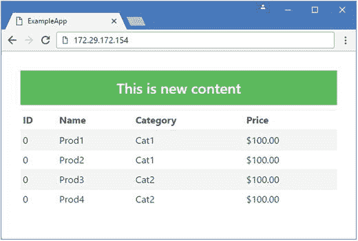

# 四、Docker 映像和容器

使用 Docker 的构件是映像和容器。映像是应用的模板以及运行该应用所需的文件。容器是从映像创建的，用于隔离执行应用，以便一个应用不会干扰另一个应用。在这一章中，我将解释如何创建和使用映像和容器，并演示如何使用 Docker 来封装一个 ASP.NET Core MVC 应用，以便在 Linux 和 Windows 服务器上使用。表 [4-1](#Tab1) 将本章放在上下文中。

表 4-1。

Putting Docker Images and Containers in Context

<colgroup><col> <col></colgroup> 
| 问题 | 回答 |
| --- | --- |
| 它们是什么？ | 映像是包含应用所需文件的模板。映像可以构建在彼此之上，这使得为应用准备映像的过程相对简单。容器是从映像创建的应用的实例。单个映像可以用来创建多个容器，所有这些容器都是相互隔离的。 |
| 它们为什么有用？ | 映像和容器是 Docker 的关键构件。映像可以发布到 Docker Hub，以便在您的组织内部或公开场合得到更广泛的使用。 |
| 它们是如何使用的？ | 使用`docker build`命令，使用 Docker 文件中包含的指令创建映像。使用`docker create`从映像创建容器，并使用`docker start`和`docker stop`启动和停止容器。 |
| 有什么陷阱或限制吗？ | 对于复杂的应用，编写 Docker 文件，用它创建映像，然后测试从该映像生成的容器的过程可能是一个非常耗时的过程。 |
| 还有其他选择吗？ | 不。映像和容器是 Docker 的核心特性。 |

表 [4-2](#Tab2) 总结了本章内容。

表 4-2。

Chapter Summary

<colgroup><col> <col> <col></colgroup> 
| 问题 | 解决办法 | 列表 |
| --- | --- | --- |
| 列出本地系统上可用的映像 | 使用`docker images`命令 | one |
| 从存储库中下载映像 | 使用`docker pull`命令 | 2, 3 |
| 删除映像 | 使用`docker rmi`命令 | 4, 5, 29 |
| 创建自定义映像 | 创建一个 Docker 文件，并与`docker build`命令一起使用 | 6, 8, 34 |
| 为容器化准备一个 ASP.NET Core MVC 应用 | 使用`dotnet publish`命令 | 7, 35 |
| 创建一个容器 | 使用`docker create`命令 | 9, 10 |
| 列出本地系统上的容器 | 使用`docker ps`命令 | Eleven |
| 启动容器 | 使用`docker start`命令 | 12, 13, 20 |
| 拦住容器 | 使用`docker stop`命令 | 14, 15, 19 |
| 查看容器的输出 | 使用`docker logs`命令 | 16, 17 |
| 一步创建并启动一个容器 | 使用`docker run`命令 | 18, 36 |
| 将文件复制到容器中 | 使用`docker cp`命令 | 21, 22 |
| 查看容器文件系统的变化 | 使用`docker diff`命令 | Twenty-three |
| 在容器中运行命令 | 使用`docker exec`命令 | 24–26, 38–40 |
| 从修改过的容器创建映像 | 使用`docker commit`命令 | Twenty-seven |
| 给映像分配标签 | 使用`docker tag`命令 | 28, 32 |
| 使用存储库管理身份验证 | 使用`docker login`和`docker logout`命令 | 30, 33 |
| 将映像发布到存储库 | 使用`docker push`命令 | 31, 32 |
| 查看容器的配置 | 使用`docker inspect`命令 | Thirty-seven |

## 为本章做准备

本章依赖于 ExampleApp MVC 项目和第 3 章[的工具和软件包](3.html)。如果您不想完成创建示例应用的过程，您可以从本书附带的免费源代码下载中获得该项目。请参见本书的第`apress.com`页。

## 使用映像

映像是用于创建容器的模板，它包含一个文件系统，该文件系统包含容器中的应用所需的所有文件。当你在第 [3 章](3.html)中测试 Docker 时，你使用的命令指示 Docker 使用一个名为`hello-world`的映像，该映像已经发布到映像的公共存储库中，称为 Docker Hub。

`hello-world`映像包含打印简单问候的应用所需的所有文件，提供了一种自包含的方式来分发文件，以便它们可以用于运行应用。运行清单 [4-1](#Par6) 中所示的命令，列出安装在您系统上的映像。

```cs
docker images
Listing 4-1.Listing the Available Images

```

对该命令的响应是本地可用映像的列表，如下所示:

```cs
REPOSITORY     TAG       IMAGE ID        CREATED         SIZE
hello-world    latest    c54a2cc56cbb    4 months ago    1.848 kB

```

该输出中只显示了一个映像，即`hello-world`映像。当 Docker 下载映像来创建容器时，它会将它们存储在本地以加快未来任务的速度。

### 下载映像

`docker pull`命令用于从存储库中下载映像，以便在本地可用。这不是你通常需要明确做的事情，因为其他管理映像和容器的 Docker 命令会自动提取它们需要的映像。运行清单 [4-2](#Par11) 中所示的命令，从 Docker Hub 中提取一个映像。

```cs
docker pull alpine
Listing 4-2.Pulling an Image from the Docker Hub

```

Docker 下载映像可能需要一段时间，其中包含一个名为 Alpine 的嵌入式 Linux 版本。这幅映像与……NET 开发，但是比较小，也就是说可以快速下载。

当新的映像下载完成后，运行`docker images`命令，您将看到列表已经更新。

```cs
REPOSITORY     TAG      IMAGE ID        CREATED       SIZE

alpine         latest   baa5d63471ea    8 weeks ago   4.803 MB

hello-world    latest   c54a2cc56cbb    5 months ago  1.848 kB

```

可以对存储库映像进行标记，从而允许不同版本的映像共存，并确保在提取映像时获得正确的映像版本。标签是通过在映像名称后附加一个冒号(`:`字符)来指定的，后跟标签。运行清单 [4-3](#Par16) 中的命令来拉一个`alpine`映像的变体。

```cs
docker pull alpine:3.4
Listing 4-3.Pulling an Image Variation

```

该命令提取标记为`3.4`的`alpine`映像的版本，表明该映像包含版本 3.4。当映像下载完成后，`docker images`命令会在列表中显示变化。

```cs
REPOSITORY     TAG        IMAGE ID        CREATED         SIZE

alpine         3.4        baa5d63471ea    8 weeks ago     4.803 MB

alpine         latest     baa5d63471ea    8 weeks ago     4.803 MB

hello-world    latest     c54a2cc56cbb    5 months ago    1.848 kB

```

这些映像有相同的`IMAGE ID`，因为它们包含相同的内容，这意味着`alpine`的维护者用两个不同的标签标记了相同的映像。Docker 足够聪明，知道它已经有了需要的内容，不会下载重复的映像。(如果您在阅读本章时已经发布了更高版本的 Alpine，您可能看不到相同的 id。)

省略映像标签相当于请求标签为`latest`的变体，所以`docker pull alpine`和`docker pull alpine:latest`是等价的命令。由于我在提取早期的`alpine`映像或第 [3](3.html) 章中使用的`hello-world`映像时没有指定标签，所以检索到了`latest`版本。

Tip

您可以通过进入 Docker Hub ( [`https://hub.docker.com`](https://hub.docker.com) )并搜索映像来查看映像的可用标签。

### 删除映像

`docker rmi`命令用于从机器上删除一个或多个映像。通过指定映像的唯一 ID 来删除映像。

运行清单 [4-4](#Par24) 中所示的命令，使用`docker images`显示的 ID 删除`alpine:3.4`映像。(您可能没有相同的 ID，在我写完这一章后，它可能已经改变了。检查`docker images`命令的输出，看看这个命令需要使用哪个 ID。)

```cs
docker rmi -f baa5d63471ea
Listing 4-4.Deleting an Image by ID

```

再次运行`docker images`命令，您将看到两个`alpine`映像都已被删除，因为两个映像都有指定的 ID。`-f`参数用于删除映像，即使它们正被容器使用(我将在本章后面描述)。

复制和粘贴单个映像 id 是一个繁琐且容易出错的过程。如果你想删除你已经安装的所有镜像，那么你可以使用清单 [4-5](#Par27) 中的命令。

```cs
docker rmi -f $(docker images -q)
Listing 4-5.Deleting All Images

```

`-q`参数指定了奇怪命名的 quiet 模式，它只返回来自`docker images`命令的`IMAGE ID`值，这些值由`docker rmi`命令处理，删除列表中的所有映像。

### 为自定义映像创建 Docker 文件

Docker Hub 包含各种预打包应用的映像，但是对于 ASP.NET Core 开发，Docker 的真正强大之处在于能够为 MVC 应用创建自定义映像。

自定义映像在 Docker 文件中描述，通常命名为`Dockerfile`，它包含一系列 Docker 像菜谱一样遵循的指令。

为了演示自定义映像是如何工作的，我将为第 [3 章](3.html)中的示例应用创建一个自定义映像。打开添加到项目中的`Dockerfile`，将内容替换为清单 [4-6](#Par32) 中所示的内容。

```cs
FROM microsoft/aspnetcore:1.1.1

COPY dist /app

WORKDIR /app

EXPOSE 80/tcp

ENTRYPOINT ["dotnet", "ExampleApp.dll"]

Listing 4-6.The Contents of the Dockerfile File in the ExampleApp Folder

```

这五个命令是为示例应用创建 Docker 映像所需的全部内容。每个命令都将在接下来的章节中详细描述。

#### 设置基础映像

Docker 映像最强大的特性之一是它们可以基于现有的映像，这意味着它们包含了基础映像包含的所有文件。`FROM`命令是 Docker 文件中的第一个命令，它指定了将要使用的基本映像。

在这种情况下，基础映像被称为`microsoft/aspnetcore`，我已经指定应该使用标记为`1.1.1`的版本，它包含。网络核心和 ASP.NET Core 版本 1.1.1。

```cs
...
FROM microsoft/aspnetcore:1.1.1
...

```

这个映像是由微软制作的，它包含。NET 核心运行时和 ASP.NET Core 包，编译成本机代码，以改善应用的启动。此映像不包含。NET SDK，这意味着在映像中使用 MVC 应用之前，必须对其进行准备，如“为映像准备应用”一节中所示。

Tip

在第 8 章中，我将向你展示如何创建一个容器化的开发环境，它使用了一个包含。NET SDK。

#### 复制应用文件

当您将 ASP.NET Core 应用容器化时，所有编译的类文件、NuGet 包、配置文件和 Razor 视图都被添加到映像中。`COPY`命令将文件或文件夹复制到容器中。

```cs
...
COPY dist /app
...

```

该命令将文件从名为`dist`的文件夹复制到容器中名为`/app`的文件夹中。`dist`文件夹现在还不存在，但是当我准备 MVC 项目来使用这个容器时，我会创建它。

#### 设置工作目录

`WORKDIR`命令为容器设置工作目录，如果您需要运行命令或使用文件而不必每次都指定完整路径，这将非常有用。Docker 文件中的命令设置了`COPY`命令创建的包含应用文件的`/app`文件夹的路径。

#### 公开 HTTP 端口

容器内部的进程可以在没有任何特殊措施的情况下打开网络端口，但 Docker 不会允许外界访问它们，除非 Docker 文件包含一个指定端口号的`EXPOSE`命令，如下所示:

```cs
...
EXPOSE 80/tcp
...

```

这个命令告诉 Docker，它可以使端口 80 对来自容器外部的 TCP 流量可用。对于示例应用，这是必需的，以便 ASP.NET Core Kestrel 服务器可以接收 HTTP 请求。

Tip

使用容器中的端口是一个两步过程。有关如何完成配置以便服务器可以接收请求的详细信息，请参见“使用容器”一节。

#### 运行应用

Docker 文件的最后一步是`ENTRYPOINT`命令，它告诉 Docker 在容器启动时做什么。

```cs
...
ENTRYPOINT ["dotnet", "ExampleApp.dll"]
...

```

这个命令告诉 Docker 运行`dotnet`命令行工具来执行`ExampleApp.dll`文件，我将在下一节中创建这个文件。不必指定`ExampleApp.dll`文件的路径，因为它被假定在由`WORKDIR`命令指定的目录中，该目录将包含应用的所有文件。

### 为映像准备应用

Docker 文件中有一些条目可能没有直接意义，尤其是如果您习惯于通过 Visual Studio 或 Visual Studio 代码处理 ASP.NET Core MVC 项目。

清单 [4-6](#Par32) 中 Docker 文件指定的基本映像不包括。NET Core SDK，这意味着编译器不可用，当应用启动时，MVC 项目文件不能自动编译，这是开发中经常发生的情况。

相反，应用必须在合并到映像中之前进行编译。从`ExampleApp`文件夹运行清单 [4-7](#Par53) 中的命令来准备示例应用。

```cs
dotnet restore
dotnet publish --framework netcoreapp1.1 --configuration Release --output dist
Listing 4-7.Preparing the Example Application in the ExampleApp Folder

```

`dotnet restore`命令是一个预防措施，确保项目拥有它需要的所有 NuGet 包。

重要的命令是`dotnet publish`，它编译应用，然后将其转换为一组独立的文件，其中包含应用需要的所有内容。`--output`参数指定编译后的项目应该被写到一个名为`dist`的文件夹中，这对应于 Docker 文件中的`COPY`命令。`--framework`的论点明确指出。应该使用 NET Core 版本 1.1.1，`--configuration`参数指定应该使用`Release`模式。

当`dotnet publish`命令完成后，查看`dist`文件夹的内容，您会看到其中一个文件名为`ExampleApp.dll`。该文件包含来自示例项目的定制代码，并提供运行应用的入口点，对应于 Docker 文件中的`ENTRYPOINT`命令。

### 创建自定义映像

为了处理 Docker 文件并为示例应用生成映像，运行在`ExampleApp`文件夹中的清单 [4-8](#Par58) 中所示的命令。

```cs
docker build . -t apress/exampleapp -f Dockerfile
Listing 4-8.Creating a Custom Image in the ExampleApp Folder

```

`docker build`命令创建一个新映像。关键字`build`后面的句点提供了上下文，这是 Docker 文件中用于命令(如`COPY`)的位置。`-t`参数将新映像标记为`apress/exampleapp`，而`-f`参数指定包含创建映像的指令的 Docker 文件。(命名映像的惯例是使用您的姓名或您组织的名称，后跟应用名称。)

Docker 将下载它需要的基本映像，然后按照 Docker 文件中的说明生成新映像。当构建过程完成后，您可以通过运行`docker images`命令来查看新映像，该命令将产生如下输出:

```cs
REPOSITORY             TAG       IMAGE ID        CREATED          SIZE
apress/exampleapp      latest    e2e0945a741d    4 seconds ago    280 MB
microsoft/aspnetcore   1.1.1     da08e329253c    23 hours ago     268 MB

```

`apress/exampleapp`映像是包含 MVC 应用的定制映像。之所以显示`microsoft/aspnetcore`映像，是因为 Docker 在执行 Docker 文件中的`FROM`命令时，必须从 Docker Hub 中提取该映像。

## 使用容器

容器赋予映像以生命。每个容器都是从映像创建的应用的一个实例，一个主机系统可以运行多个容器，每个容器都相互隔离。在接下来的小节中，我将解释如何创建、使用和管理容器。

### 创建容器

可以从任何映像创建容器，包括您创建的自定义映像。

运行清单 [4-9](#Par66) 中所示的命令，使用上一节中的自定义映像作为模板来创建一个新的容器。

```cs
docker create -p 3000:80 --name exampleApp3000 apress/exampleapp
Listing 4-9.Creating a Container

```

`docker create`命令用于创建新映像。

`docker create`命令的`-p`参数告诉 Docker 如何将容器内的端口 80 映射到主机操作系统。在本例中，我已经指定容器中的端口 80 应该映射到主机操作系统中的端口 3000。这对应于清单 [4-6](#Par32) 中 Docker 文件中的`EXPOSE`命令。

`--name`参数为容器指定一个名称，这样一旦容器被创建，就更容易操作。本例中的名称是`exampleApp3000`，表示这个容器将响应发送到主机操作系统中端口 3000 的请求。

最后一个参数告诉 Docker 使用哪个映像作为新容器的模板。该命令指定了`apress/exampleapp`映像，这是与清单 [4-8](#Par58) 中的`docker build`命令一起使用的名称。

#### 从映像创建附加容器

您可以从一个映像创建多个容器，但必须确保名称和端口映射等配置选项没有冲突。运行清单 [4-10](#Par72) 中所示的命令，使用具有不同名称和端口映射的自定义映像创建第二个容器。

```cs
docker create -p 4000:80 --name exampleApp4000 apress/exampleapp
Listing 4-10.Creating Another Container

```

这个命令使用`apress/exampleapp`映像创建一个名为`exampleApp4000`的容器，但是将主机中的端口 80 映射到端口 4000。这个容器将能够与`exampleApp3000`容器共存，因为它们使用不同的网络端口和名称，即使它们包含相同的应用。

### 列出容器

`docker ps`命令用于列出系统中存在的容器。默认情况下，`docker ps`命令忽略了没有运行的容器，所以如果您想查看所有可用的容器，必须使用`-a`参数，如清单 [4-11](#Par75) 所示。

```cs
docker ps -a
Listing 4-11.Listing All Containers

```

该命令产生以下输出，显示了在上一节中创建的两个容器(为了适应页面上的输出，我只显示了最重要的列):

```cs
CONTAINER ID    IMAGE                STATUS     PORTS      NAMES
765b418bc16f    apress/exampleapp    Created               exampleApp4000
136b2a3e2246    apress/exampleapp    Created               exampleApp3000

```

每个容器都分配了一个唯一的 ID，显示在`CONTAINER ID`列中，可用于在 Docker 命令中引用容器。引用容器的一种更自然的方式是使用它们的名称，显示在`NAMES`列中。`IMAGE`列显示了用于创建容器的映像。

`STATUS`列显示了两个容器的`Created`,表明容器已经成功创建并准备启动。`PORTS`列是空的，因为这两个容器目前都没有任何活动的网络端口，但是当容器活动时，情况会发生变化。

### 起始容器

上一节使用了`docker create`命令从同一个映像创建两个容器。这些容器在内部是相同的，并且包含相同的文件。只有容器外部的配置不同，通过使用不同的名称和将不同的网络端口映射到容器内部的端口 80，允许容器共存。

然而，目前这些容器什么也没做。它们包含的应用没有运行，它们被配置使用的网络端口没有激活。

`docker start`命令用于启动一个或多个容器，这些容器通过其唯一的 ID 或名称来引用。运行清单 [4-12](#Par83) 中所示的命令来启动名为`exampleApp3000`的容器。

```cs
docker start exampleApp3000
Listing 4-12.Starting a Container

```

Docker 将使用 Docker 文件中的`ENTRYPOINT`命令来启动容器中的应用。在这种情况下，这意味着。NET 核心运行时启动，随后是 ASP.NET Core Kestrel 服务器，它将在容器内部的端口 80 上侦听传入的 HTTP 请求。

随着容器的启动，Docker 还将设置端口映射，以便在主机操作系统的端口 3000 上接收的网络流量将被定向到容器内部的端口 80，从而允许 Kestrel 接收来自容器外部的 HTTP 请求。

为了测试容器，打开一个新的浏览器窗口并请求 URL `http://localhost:3000`，这将向主机操作系统上的端口 3000 发送一个 HTTP 请求。Docker 会将请求定向到容器内部的端口 80，这允许它被 Kestrel 接收，Kestrel 将启动 ASP.NET Core MVC 并运行示例应用。

几秒钟后，您将看到示例 MVC 应用的响应，如图 [4-1](#Fig1) 所示。重新加载浏览器窗口，向同一个 URL 发送另一个请求，您会发现现在应用已经启动并运行，速度快多了。


图 4-1。

Running the example application

运行清单 [4-13](#Par89) 中所示的命令来启动系统上的所有容器。

```cs
docker start $(docker ps -aq)
Listing 4-13.Starting All Containers

```

该命令将`docker start`与`docker ps`命令的输出相结合。`-a`参数包括没有运行的容器，而`-q`参数只返回容器 id。

由于其中一个容器已经在运行，该命令具有启动映射到端口 4000 的容器的效果，您可以通过在浏览器窗口中请求 URL `http://localhost:4000`来测试该容器，这将显示与图 [4-1](#Fig1) 相同的内容，因为两个容器运行相同的应用。

您可以通过运行`docker ps -a`命令来查看容器的状态变化，该命令将产生如下输出:

```cs
CONTAINER ID  IMAGE              STATUS       PORTS                 NAMES
765b418bc16f  apress/exampleapp  Up 4 seconds 0.0.0.0:4000->80/tcp  exampleApp4000
136b2a3e2246  apress/exampleapp  Up 9 minutes 0.0.0.0:3000->80/tcp  exampleApp3000

```

`STATUS`列报告两个容器都是`Up`以及它们已经运行了多长时间。`PORTS`列显示了每个容器从主机操作系统映射的端口。在这种情况下，您可以看到一个容器将端口 3000 映射到端口 80，另一个容器将端口 4000 也映射到端口 80。

这些容器可以共存，因为容器中的应用相互隔离，并且不了解端口映射系统。在容器中处理 HTTP 请求的 Kestrel 服务器开始监听端口 80，不知道它正在容器中运行，也不知道请求是通过主机操作系统上的端口映射发出的。从同一个映像创建多个容器并通过改变它们的配置并排运行它们的能力是 Docker 的一个关键特性，如图 [4-2](#Fig2) 所示。我将在第 6 章[中回到这个话题，届时我将展示如何纵向扩展一个应用；在第 7 章](6.html)[中，我将展示如何将一个应用部署到一个服务器集群中。](7.html)


图 4-2。

The path from image to container to service

### 停止容器

使用`docker stop`命令停止容器，该命令可以通过名称或 ID 停止一个或多个容器。运行清单 [4-14](#Par97) 中的命令来停止在端口 3000 上处理请求的容器。

```cs
docker stop exampleApp3000
Listing 4-14.Stopping a Container Using Its Name

```

使用由`docker ps`命令生成的容器列表，运行清单 [4-15](#Par99) 中所示的命令来停止所有正在运行的容器。

```cs
docker stop $(docker ps -q)
Listing 4-15.Stopping All Containers

```

`docker ps`命令所需的唯一参数是`-q`。没有使用`-a`参数，因为`stop`命令只需要运行容器的 id，这是`ps`命令默认返回的内容。

Tip

还有一个`docker kill`命令，向容器发送 SIGKILL 信号。我倾向于不使用这个命令，因为如果容器在十秒钟后还没有停止，那么`docker stop`会自动发送这个信号，这个时间可以使用`-t`参数来改变。

### 获取容器输出

默认情况下，当您使用`docker start`命令启动容器时，Docker 不会显示应用的输出。但是它确实保留了一个记录，可以使用`docker logs`命令进行检查，如清单 [4-16](#Par103) 所示。

```cs
docker logs exampleApp3000
Listing 4-16.Getting Container Logs

```

ASP.NET Core 运行时每次收到 HTTP 请求时都会写出一条消息，而`docker logs`命令会显示这些消息，如下所示:

```cs
...
Hosting environment: Production
Content root path: /app
Now listening on: http://+:80
Application started. Press Ctrl+C to shut down.
info: Microsoft.AspNetCore.Hosting.Internal.WebHost[1]
      Request starting HTTP/1.1 GET http://localhost:3000/
info: Microsoft.AspNetCore.Mvc.Internal.ControllerActionInvoker[1]
      Executing action method ExampleApp.Controllers.HomeController.Index
        (ExampleApp) with arguments ((null)) - ModelState is Valid
...

```

`docker logs`命令向您显示容器的最新输出，即使容器已经停止。对于正在运行的容器，您可以使用`-f`参数来监控输出，这样您就可以看到生成的任何新消息。运行清单 [4-17](#Par107) 中的命令来启动一个容器并监控其输出。

```cs
docker start exampleApp3000
docker logs -f exampleApp3000
Listing 4-17.Following a Container’s Logs

```

在浏览器中请求`http://localhost:3000`生成一些输出消息。完成后，键入`Control+C`停止显示输出。容器不受`docker logs`命令的影响，继续在后台运行。

### 用一个命令创建和启动容器

`docker run`命令用于从映像创建一个容器，并在一个步骤中启动它，结合了`docker create`和`docker start`命令的效果。运行清单 [4-18](#Par110) 中的命令，从自定义映像创建并启动一个容器，使用端口映射将网络流量从主机操作系统中的端口 5000 转发到容器内的端口 80。

```cs
docker run -p 5000:80 --name exampleApp5000 apress/exampleapp
Listing 4-18.Creating and Running a Container with a Single Command

```

该命令采用与清单 [4-10](#Par72) 中的`docker create`命令相同的参数:它告诉 Docker 从`apress/exampleapp`映像创建容器，设置端口映射，并给容器命名为`exampleApp5000`。

不同之处在于，容器一旦创建就被启动。`docker run`命令将命令提示符附加到容器输出中，以便 Kestrel 服务器生成的消息显示在命令提示符中。

为了测试新的容器，打开一个浏览器选项卡并请求 URL `http://localhost:5000`。它发送到端口 5000 的 HTTP 请求将被 Docker 接收并转发到容器内的端口 80，从 MVC 应用产生与您在前面的例子中看到的相同的响应。

如果您使用的是 Linux 或 macOS，您可以通过键入`Control+C`来停止容器。如果你使用的是 Windows，`Control+C`将命令提示符从容器中分离出来，但让它在后台运行，你必须运行清单 [4-19](#Par115) 中的命令来停止容器。

```cs
docker stop exampleApp5000
Listing 4-19.Stopping a Container

```

Removing Containers Automatically

`docker run`命令可以和`--rm`参数一起使用，它告诉 Docker 在容器停止时移除容器。运行以下命令创建一个容器，将主机容器中的端口 6500 映射到新容器中的端口 80:

```cs
docker run -p 6500:80 --rm --name exampleApp6500 apress/exampleapp

```

您可以通过在浏览器中请求`http://localhost:6500`并运行`docker ps`来测试容器。一旦您检查了容器正在工作，使用`Control+C`(对于 Linux 或 macOS)或使用这个命令(Windows)停止容器。

```cs
docker stop exampleApp6500

```

Docker 会在容器停止时立即删除它，您可以通过运行`docker ps -a`查看系统中存在的所有容器来确认这一点。

## 修改容器

映像是不可变的，但是容器不是。每个容器都有自己的可写文件系统。如果从同一个映像创建两个容器，它们最初将是相同的，并且包含相同的文件。但是，当容器中的应用运行时，它们创建的数据和日志文件会导致容器变得不同，其内容反映了它们处理的用户请求。

您还可以使用 Docker 工具有意地修改容器，然后使用这些更改来创建一个新的映像，该映像又可以用于创建容器。如果您需要执行某种类型的手动配置以允许应用在容器中正常工作，这可能会很有用。在接下来的小节中，我将向您展示进行更改的不同方法，然后使用这些更改来生成新的映像。

### 更换容器

为了理解容器是如何被改变的，运行清单 [4-20](#Par124) 中的命令来确保映射到端口 3000 和 4000 的 MVC 容器正在运行。

```cs
docker start exampleApp3000 exampleApp4000
Listing 4-20.Starting the MVC Application Containers

```

这些容器是从同一个映像中创建的，并且包含一个相同的 Razor 视图，该视图用于为 MVC 应用的默认 URL 生成响应。通过打开浏览器标签并请求 URL`http://localhost:3000`和`http://localhost:4000`来确认两个容器中的应用生成相同的响应，如图 [4-3](#Fig3) 所示。


图 4-3。

Responses from the containerized MVC applications

每个容器都有自己的可写文件系统，可以独立于从同一个映像创建的其他容器进行修改。要创建一个具有可见效果的变更，使用您的 IDE 来更改显示在 Razor 视图中`ExampleApp/Views/Home`文件夹的横幅中的消息，如清单 [4-21](#Par127) 所示。

```cs
@model IEnumerable<ExampleApp.Models.Product>
@{
    Layout = null;
}
<!DOCTYPE html>
<html>
<head>
    <meta name="viewport" content="width=device-width" />
    <title>ExampleApp</title>
    <link rel="stylesheet" href="∼/lib/bootstrap/dist/css/bootstrap.min.css" />
</head>
<body>
    <div class="m-1 p-1">
        <h4 class="bg-success text-xs-center p-1 text-white">This is new content</h4>

        <table class="table table-sm table-striped">
            <thead>
                <tr><th>ID</th><th>Name</th><th>Category</th><th>Price</th></tr>
            </thead>
            <tbody>
                @foreach (var p in Model) {
                    <tr>
                        <td>@p.ProductID</td>
                        <td>@p.Name</td>
                        <td>@p.Category</td>
                        <td>$@p.Price.ToString("F2")</td>
                    </tr>
                }
            </tbody>
        </table>
    </div>
</body>
</html>
Listing 4-21.Modifying the View in the Index.cshtml File in the ExampleApp/Views/Home Folder

```

这些更改应用了不同的引导后台类，并更改了`h4`元素中的内容。此时，更改后的 Razor 视图存在于主机操作系统的`ExampleApp`文件夹中，对容器没有影响。

从`ExampleApp`文件夹运行清单 [4-22](#Par130) 中所示的命令，将视图复制到其中一个容器中。

```cs
docker cp ./Views/Home/Index.cshtml exampleApp3000:/app/Views/Home/
Listing 4-22.Modifying a Container

```

`docker cp`命令用于将文件复制进和复制出容器。该命令将修改后的`Index.cshtml`文件从主机操作系统的项目文件夹复制到`exampleApp3000`文件夹中的`/app/Views`文件夹，容器内的 MVC 应用从该文件夹获取视图。

要查看更改的效果，请使用您的浏览器请求 URL `http://localhost:3000`。接收 HTTP 请求的容器中的 MVC 应用会检测到改变的文件，将其编译成 C# 类，并使用它生成响应，如图 [4-4](#Fig4) 所示。


图 4-4。

Modifying a file in a container

该图还显示了当您请求 URL `http://localhost:4000`时将会看到的响应。这说明每个容器都有自己的存储，对一个容器的更改不会影响另一个容器。对容器文件系统的更改是持久的，这意味着您可以停止和启动修改后的容器，清单 [4-22](#Par130) 中的命令所做的更改仍然会被使用。

Caution

修改容器中的文件应该小心，不要在生产环境中对容器进行修改。如果您因为正在积极开发项目而想要更改应用中的文件，请参见第 [8](8.html) 章，其中我解释了如何创建一个容器化的开发环境。

### 检查对容器的更改

运行清单 [4-23](#Par136) 中所示的命令，查看容器文件系统的变化。

```cs
docker diff exampleApp3000
Listing 4-23.Examining Container Changes

```

`docker diff`命令显示了容器中的文件和用于创建它的映像之间的差异，并产生如下输出(您可能会看到稍微不同的结果):

```cs
C /app
C /app/Views
C /app/Views/Home
C /app/Views/Home/Index.cshtml
C /root
A /root/.aspnet
A /root/.aspnet/DataProtection-Keys
C /tmp
A /tmp/clr-debug-pipe-1-1154405-in
A /tmp/clr-debug-pipe-1-1154405-out

```

如表 [4-3](#Tab3) 中所述，结果中的每个条目都用一个字母进行了注释，表示变更的类型。

表 4-3。

The Change Annotations from the docker diff Command

<colgroup><col> <col></colgroup> 
| 注释 | 描述 |
| --- | --- |
| `A` | 此注释表示文件或文件夹已添加到容器中 |
| `C` | 此注释表示文件或文件夹已被修改。对于文件夹，更改表示该文件夹中的文件已被添加或删除。 |
| `D` | 此注释表示文件或文件夹已从容器中移除。 |

除了我对`Index.cshtml`文件所做的更改之外，您可以看到一些文件是由 ASP.NET Core 运行时创建的。有些文件与调试有关，我会在第 8 章中向你展示如何在容器中进行调试。

### 在容器中执行命令

将文件复制到容器中或从容器中复制出来的另一种方法是直接与容器交互，在容器内执行命令。这是一种应该谨慎使用的技术，但是它对于运行配置任务或者在容器运行时诊断容器的问题非常有用。

运行清单 [4-24](#Par143) 中的命令，列出其中一个容器中 Razor 视图文件的内容。

```cs
docker exec exampleApp3000 cat /app/Views/Home/Index.cshtml
Listing 4-24.Executing a Command

```

`docker exec`命令用于执行容器内部的命令。容器的名称后面是命令及其所需的任何参数。您只能使用容器中可用的命令。清单 [4-24](#Par143) 中的命令告诉容器使用 Linux `cat`命令列出 Razor 视图文件的内容，这将产生以下响应:

```cs
@model IEnumerable<ExampleApp.Models.Product>
@{
    Layout = null;
}
<!DOCTYPE html>
<html>
<head>
    <meta name="viewport" content="width=device-width" />
    <title>ExampleApp</title>
    <link rel="stylesheet" href="∼/lib/bootstrap/dist/css/bootstrap.min.css" />
</head>
<body>
    <div class="m-1 p-1">
        <h4 class="bg-success text-xs-center p-1 text-white">This is new content</h4>
        <table class="table table-sm table-striped">
            <thead>
                <tr><th>ID</th><th>Name</th><th>Category</th><th>Price</th></tr>
            </thead>
            <tbody>
                @foreach (var p in Model) {
                    <tr>
                        <td>@p.ProductID</td>
                        <td>@p.Name</td>
                        <td>@p.Category</td>
                        <td>$@p.Price.ToString("F2")</td>
                    </tr>

                }
            </tbody>
        </table>
    </div>
</body>
</html>

```

Tip

在使用`docker exec`之前，使用`docker start`命令确保容器正在运行。

执行命令能力的一个扩展是运行交互式 shell，如果您需要在容器上完成的工作涉及到将几个步骤链接在一起，或者使用诸如文件完成之类的特性在文件系统中导航，这可能会更方便。

用于 ASP.NET Core 容器的基本 Linux 映像包括 Bash shell，您可以通过运行清单 [4-25](#Par149) 中所示的命令来启动它。

```cs
docker exec -it exampleApp3000 /bin/bash
Listing 4-25.Starting a Shell in a Container

```

`docker exec`命令的`-it`参数告诉 Docker 这是一个需要终端支持的交互式命令。一旦交互式 shell 启动，运行清单 [4-26](#Par151) 中的命令来修改 MVC 应用中 Razor 视图的内容。

```cs
cd /app/Views/Home
sed -i "s/new content/interactive content/g" Index.cshtml
exit
Listing 4-26.Modifying the Razor View in the Bash Shell

```

第一个命令将工作目录更改为包含视图的文件夹。第二个命令使用`sed`将视图文件中的短语`new content`替换为`interactive content`。最后一个命令`exit`退出 shell，让容器在后台运行。

您可以通过使用浏览器导航到`http://localhost:3000`来查看更改的效果，这将产生如图 [4-5](#Fig5) 所示的结果。


图 4-5。

Using the interactive shell in a Linux container Installing an Editor in a Linux Container

需要与容器交互的最常见任务是使用编辑器修改配置文件，这些文件直到应用至少启动一次后才创建。ASP.NET Core 应用的 Linux 容器的基本映像不包含编辑器，但是您可以使用以下命令添加一个编辑器:

```cs
apt-get update
apt-get install vim

```

这些命令下载并安装古老的`vi`编辑器。如果你没有使用过`vi`，那么你可以在 [`www.vim.org`](http://www.vim.org) 中读到它的命令。也就是说，如果您发现自己正在使用文本编辑器，那么问问自己是否可以通过更改 Docker 文件来解决这个问题，该文件创建了创建容器的映像。

### 从修改过的容器创建映像

一旦你修改了一个容器，你可以使用`docker commit`命令来创建一个新的包含修改的映像。运行清单 [4-27](#Par158) 中的命令，创建一个包含清单 [4-26](#Par151) 中对 Razor 视图所做更改的新映像。

```cs
docker commit exampleApp3000 apress/exampleapp:changed
Listing 4-27.Committing Container Changes

```

该命令创建标记为`change`的`apress/exampleapp`映像的新变体。如果你运行`docker images`命令，你会看到新的映像已经被添加到列表中。

```cs
REPOSITORY             TAG        IMAGE ID

apress/exampleapp      changed    00b418fa6548

apress/exampleapp      latest     827c2d48beca
microsoft/aspnetcore   1.1.1      da08e329253c

```

此映像可用于创建包含修改后的 Razor 视图的新容器(以及对原始容器所做的任何其他更改)。

## 发布映像

一旦您为应用创建并测试了映像，您就可以发布它们，这样它们就可以被拉至服务器并用于创建容器。Docker 运行一个名为 Docker Hub 的映像公共存储库，它是本章示例的基础映像的来源。在撰写本文时，您可以创建一个免费帐户，允许您发布无限的公共存储库和一个私有存储库。也有付费账户，允许创建更多的私有存储库。(也有付费软件的 Docker 商店，但不对公众开放。)

Note

对于本节，您需要访问 [`http://hub.docker.com`](http://hub.docker.com) 并创建一个帐户(免费帐户即可)。

### 为发布的映像添加标签

我在本章的示例映像中使用的标签以`apress`开始，比如`apress/exampleApp3000`。当您将映像发布到 Docker Hub 时，标签的第一部分必须是您用来创建帐户的用户名。

Note

参见 [`https://docs.docker.com/registry/deploying`](https://docs.docker.com/registry/deploying) 了解创建私有存储库的说明，您可以使用该存储库在您的组织内本地分发映像。如果您的映像包含敏感信息，或者如果您必须遵守禁止使用第三方服务的策略，这将非常有用。

在本节中，我用用户名`adamfreeman`创建了一个 Docker Hub 帐户，这样我就可以重新创建一个过程，您需要按照这个过程来设置您自己的帐户所需的标签。要发布您自己的映像，请将命令中的`adamfreeman`替换为您的用户名。运行清单 [4-28](#Par167) 中所示的命令，将新标签应用到自定义映像，以便它们具有正确的帐户信息。

```cs
docker tag apress/exampleapp:changed adamfreeman/exampleapp:changed
docker tag apress/exampleapp:latest adamfreeman/exampleapp:unchanged
Listing 4-28.Adding Image Tags in Preparation for Publishing

```

新标签创建了映像的两种变体，`changed`和`unchanged`。这些标签不会替换原来的标签，你可以使用`docker images`命令看到，它会产生如下结果:

```cs
REPOSITORY               TAG          IMAGE ID            CREATED
apress/exampleapp        changed      b1af7e78f418        10 minutes ago

adamfreeman/exampleapp   changed      b1af7e78f418        10 minutes ago

apress/exampleapp        latest       452007c3b3dd        31 minutes ago

adamfreeman/exampleapp   unchanged    452007c3b3dd        31 minutes ago

microsoft/aspnetcore     1.1.1        da08e329253c        5 days ago

```

我喜欢去掉原来的标签来保持图片列表的整洁。运行清单 [4-29](#Par171) 中所示的命令，删除原始标签，只保留新标签。

```cs
docker rmi apress/exampleapp:changed apress/exampleapp:latest
Listing 4-29.Removing Old Image Tags

```

再次运行`docker images`命令，你会看到只剩下我的账户名的图片。

```cs
REPOSITORY               TAG          IMAGE ID            CREATED
adamfreeman/exampleapp   changed      b1af7e78f418        14 minutes ago
adamfreeman/exampleapp   unchanged    452007c3b3dd        35 minutes ago
microsoft/aspnetcore     1.1.1        da08e329253c        5 days ago

```

### 向集线器认证

Docker Hub 要求在您将映像发布到您的帐户之前进行鉴定。运行清单 [4-30](#Par175) 中所示的命令，使用您用来创建帐户的用户名和密码向 Docker Hub 验证您自己。

```cs
docker login -u <yourUsername> -p <yourPassword>
Listing 4-30.Authenticating with the Docker Hub

```

`docker login`命令使用由`-u`和`-p`参数提供的用户名和密码来执行与集线器的认证。一旦您使用了`docker login`命令，发送到 Hub 的后续命令将包含您的认证凭证。

### 发布映像

运行清单 [4-31](#Par178) 中所示的命令，将您的映像推送到 Docker Hub。

```cs
docker push adamfreeman/exampleapp:changed
docker push adamfreeman/exampleapp:unchanged
Listing 4-31.Publishing Images to the Docker Hub

```

第一个映像可能需要一段时间上传，因为它包含的文件被传输到存储库。第二个映像应该快得多，因为只需要容器之间的变化。

如果您忽略标签中的变化，那么映像将被发布为`:latest`。Docker Hub 不强制任何类型的版本控制，也不会自动将最近的推送请求指定为`:latest`映像。因此，明智的做法是发出一个显式的 push 请求，设置您希望默认使用的映像。运行清单 [4-32](#Par181) 中所示的命令来标记和推送新映像。

```cs
docker tag adamfreeman/exampleapp:unchanged adamfreeman/exampleapp:latest
docker push adamfreeman/exampleapp:latest
Listing 4-32.Tagging and Pushing the Default Variation for an Image

```

最后，通过运行清单 [4-33](#Par183) 中所示的命令来退出 Docker Hub，防止其他人使用你的帐户发布图片。在再次使用`docker login`命令之前，进一步的推送请求将不起作用。

```cs
docker logout
Listing 4-33.Logging Out of the Docker Hub

```

这些图片现在可以在 Docker Hub 上看到。登录`hub.docker.com`，定位您的存储库，点击`Tags`部分可以看到已经发布的图片，如图 [4-6](#Fig6) 所示。您可以使用 Docker Hub 网站来控制对您的映像的访问，并提供有关它们的附加信息。


图 4-6。

Publishing images to the Docker Hub

## 创建 Windows 容器

在前面几节中创建的映像和容器都依赖 Linux 作为执行平台。如果您使用 Linux 作为您的开发机器，示例中的容器已经使用 Linux 容器特性直接在您的操作系统上运行。

对于 Windows 或 macOS，Docker 安装一个用于执行容器的 Linux 虚拟机。这模糊了容器和虚拟机之间的界限，但它确实意味着可以使用更广泛的操作系统来开发和测试容器，并且 Windows 和 macOS 用户可以通过 Docker Hub 访问用于容器化 Linux 应用的大型映像库。

但是 Linux 不是唯一支持容器的操作系统。Windows 10 和 Windows Server 2016 的最新版本还包括容器支持，可用于隔离和运行在 Windows 操作系统上运行的 Windows 应用。

从 ASP.NET Core MVC 的角度来看，如果您想使用 Internet 信息服务(IIS)部署您的应用，或者如果您的应用依赖于不能在 Linux 上运行的组件，那么对 Windows 容器的支持会很有用。

在接下来的部分中，我将解释如何创建和测试 Windows 容器。为 ASP.NET Core MVC 应用创建一个 Windows 容器需要一个类似于 Linux 的过程，但是需要一些重要的配置更改。

Note

Windows 容器只能使用 Windows 操作系统创建，并且只能部署到 Windows Server 2016。Linux 容器得到了更广泛的支持，并且有更多的基础映像可供使用。您应该使用 Linux 容器，除非您特别需要容器化一个只支持 Windows 的应用。

### 切换到 Windows 容器

您必须告诉 Docker 您想从使用 Linux 容器(默认)切换到使用 Windows 容器。右键单击 Windows 任务栏中的 Docker 图标，选择切换到 Windows 容器，如图 [4-7](#Fig7) 所示。(使用 Windows Server 2016 时不必执行此步骤，Windows Server 2016 只支持 Windows 容器。)


图 4-7。

Switching to Windows containers

作为切换的一部分，可能会提示您启用 Windows 容器功能，这将需要重新启动。

如果在容器类型之间切换后使用 Docker 有问题，重启通常可以解决问题。

Creating a Windows Server Virtual Machine

当我写这篇文章时，Windows 10 对 Windows 容器的支持还处于早期阶段，还存在一些问题，特别是如果你在 Docker 旁边使用 Hyper-V 作为传统虚拟机的话。我发现，通过创建一个运行 Windows Server 2016 的常规 Hyper-V 虚拟机，并使用它来创建和运行我的 Docker Windows 容器，我获得了最佳结果。

这项技术需要在 Windows 2016 虚拟机上开启嵌套虚拟化。在主机操作系统中使用 PowerShell 运行以下命令:

```cs
Set-VMProcessor -VMName <VMName> -ExposeVirtualizationExtensions $true

```

将`<VMName>`替换为 Hyper-V 中分配给 Windows Server 2016 虚拟机的名称，该命令允许 Docker 在 Windows Server 虚拟机中运行，并且不需要在容器类型之间切换。关于在 Windows Server 2016 中安装 Docker 的详细信息，请参见第 [3](3.html) 章。

### 创建. NET 核心 Windows 映像

为 Windows 容器创建映像需要不同的 Docker 文件配置。在`ExampleApp`文件夹中创建一个名为`Dockerfile.windows`的文件，并添加清单 [4-34](#Par199) 中所示的命令。

```cs
FROM microsoft/dotnet:1.1.1-runtime-nanoserver

COPY dist /app

WORKDIR /app

EXPOSE 80/tcp

ENV ASPNETCORE_URLS http://+:80

ENTRYPOINT ["dotnet", "ExampleApp.dll"]

Listing 4-34.The Contents of the Dockerfile.windows File in the ExampleApp Folder

```

这个 Docker 文件和用于 Linux 容器的文件有两个不同之处。首先是`FROM`命令指定了一个不同的基础映像。

```cs
...
FROM microsoft/dotnet:1.1.1-runtime-nanoserver
...

```

`microsoft/dotnet`映像是的官方映像。NET Core，并在提供不同版本的。NET，在运行时或 SDK 之间的选择，以及 Linux 和 Windows 选项。清单中指定的`1.1.1-runtime-nanoserver`变体包含。NET 核心运行时，并基于 Windows。(Windows Nano Server 是适合在容器中使用的 Windows 的最小安装。)

Tip

你可以在 Docker Hub 上看到`microsoft/dotnet`图片的所有变体和版本。

第二个变化是增加了这个`ENV`命令:

```cs
...
ENV ASPNETCORE_URLS http://+:80
...

```

`ENV`命令在容器中设置一个环境变量。在这种情况下，该命令设置`ASPNETCORE_URLS`环境变量的值，该变量将 Kestrel 服务器监听的端口设置为 80。我用于 Linux 容器的基本映像包括这个环境变量。设置端口不是必需的，但可以确保我可以使用本章前面用于 Linux 容器的相同 Docker 命令来创建和使用 Windows 容器。

#### 创建映像和容器

为 Windows 创建映像和容器的过程与为 Linux 创建相同。运行`ExampleApp`文件夹中清单 [4-35](#Par208) 中的命令来发布应用，并使用新的 Docker 文件来创建映像。

```cs
dotnet restore
dotnet publish --framework netcoreapp1.1 --configuration Release --output dist
docker build . -t apress/exampleapp:windows -f Dockerfile.windows
Listing 4-35.Creating an Image for a Windows Container

```

为了区分示例应用的 Linux 和 Windows 容器，我在`docker build`命令中使用了`-t`参数来为包含变体的映像指定一个标签，因此映像的名称是`apress/exampleapp:windows`。

Tip

如果您在运行清单 [4-35](#Par208) 中的命令时看到一个`unknown blob`错误，那么使用任务栏图标检查 Docker 是否已经切换到 Windows 容器。如果您必须重启才能启用容器，那么 Docker 在启动时可能已经重置为 Linux 容器。

运行清单 [4-36](#Par212) 中所示的命令，使用 Windows 映像创建并启动一个新的容器。

```cs
docker run -p 7000:80 --name exampleAppWin apress/exampleapp:windows
Listing 4-36.Creating and Starting the Windows Container

```

键入`Control+C`分离命令提示符并让容器运行。(写出来的消息表明`Control+C`将终止应用，但这是来自 ASP.NET Core 服务器 Kestrel 的消息，它不接收击键。当使用 Docker 时，很容易将容器与运行在其中的应用混淆。)

#### 测试 Windows 容器

在撰写本文时，Windows 容器存在一个问题，这意味着它们不能通过`localhost`请求映射端口进行测试，就像我对 Linux 容器所做的那样。这是 Docker 设置容器网络方式的结果。

如果您有另一台机器(或可用的虚拟机)，那么您可以使用主机操作系统的 IP 地址和映射的端口(在本例中为 7000)来测试 Windows 容器。

如果您只有您的开发机器，那么您可以使用分配给容器的 IP 地址进行测试。运行清单 [4-37](#Par217) 中的命令来获得关于 Windows 容器的详细信息。

```cs
docker inspect exampleAppWin
Listing 4-37.Inspecting a Container

```

输出将包括一个包含 IP 地址的`Networks/nat`部分，如下所示:

```cs
...
"Networks": {
     "nat": {
         "IPAMConfig": null,
         "Links": null,
         "Aliases": null,
         "NetworkID": "d41dba49b91fcd7fdfc5f7f520976db353",
         "EndpointID": "ca60ef2b19f591a0cf03b27407142cea7",
         "Gateway": "",
         "IPAddress": " 172.29.172.154",

         "IPPrefixLen": 16,
         "IPv6Gateway": "",
         "GlobalIPv6Address": "",
         "GlobalIPv6PrefixLen": 0,
         "MacAddress": "00:15:5d:68:1f:22"
     }
 }
...

```

使用此地址向容器发送 HTTP 请求，使用应用使用的端口(而不是映射到容器外部的主机操作系统的端口)。

您可能会在`docker inspect`命令的输出中看到不同的 IP 地址，但是对我来说，测试容器的 URL 是`http://172.29.172.154:80`，产生如图 [4-8](#Fig8) 所示的结果。



图 4-8。

Testing the Windows container Note

`microsoft/dotnet`映像不包含本机编译的包，这些包包含在我在本章前面用于 Linux 映像的`microsoft/aspnetcore`映像中。这并不会阻止容器运行，但是这意味着处理第一个请求的时间会稍微长一点。

### 在 Windows 容器中执行命令

如果您使用的是 Windows 容器，那么您可以使用 PowerShell 调用容器内部的命令。打开第二个 PowerShell，运行清单 [4-38](#Par224) 中所示的命令，在 Windows 容器中执行一个命令。

```cs
docker exec exampleAppWin PowerShell cat /app/Views/Home/Index.cshtml
Listing 4-38.Executing a Command in a Windows Container

```

该命令返回 Razor 视图的内容，如下所示:

```cs
@model IEnumerable<ExampleApp.Models.Product>
@{
    Layout = null;
}
<!DOCTYPE html>
<html>
<head>
    <meta name="viewport" content="width=device-width" />
    <title>ExampleApp</title>
    <link rel="stylesheet" href="∼/lib/bootstrap/dist/css/bootstrap.min.css" />
</head>
<body>
    <div class="m-1 p-1">
        <h4 class="bg-success text-xs-center p-1 text-white">This is new content</h4>
        <table class="table table-sm table-striped">
            <thead>
                <tr><th>ID</th><th>Name</th><th>Category</th><th>Price</th></tr>
            </thead>
            <tbody>
                @foreach (var p in Model) {
                    <tr>
                        <td>@p.ProductID</td>
                        <td>@p.Name</td>
                        <td>@p.Category</td>
                        <td>$@p.Price.ToString("F2")</td>
                    </tr>

                }
            </tbody>
        </table>
    </div>
</body>
</html>

```

#### 与 Windows 容器交互

您还可以直接使用 PowerShell 与容器进行交互。运行清单 [4-39](#Par228) 中所示的命令，在 Windows 容器中交互执行 PowerShell。

```cs
docker exec -it exampleAppWin PowerShell
Listing 4-39.Starting a Shell in a Windows Container

```

一旦 shell 启动，使用清单 [4-40](#Par230) 中的命令来修改 Razor 视图的内容。

```cs
cd C:\app\Views\Home
(Get-Content .\Index.cshtml).replace("This is new content", "Essential (Windows) Docker") | Set-Content Index.cshtml
exit
Listing 4-40.Modifying the Razor View in PowerShell

```

第一个命令更改工作目录，第二个命令将短语`This is new content`替换为`Essential (Windows) Docker`。最后一个命令退出 shell。如果您使用浏览器向浏览器发送请求(如“创建 Windows 容器”一节中所解释的)，您将会看到更改的效果，如图 [4-9](#Fig9) 所示。


图 4-9。

Using the interactive shell in a Windows container

## 摘要

在这一章中，我演示了如何创建和管理 Docker 映像和容器。我向您展示了如何创建 Windows 和 Linux 容器，如何修改容器并使用更改来创建新的映像，以及如何将映像发布到 Docker Hub。在下一章中，我将解释 Docker 如何处理应用数据，以及如何使用软件定义的网络将多个容器连接在一起。