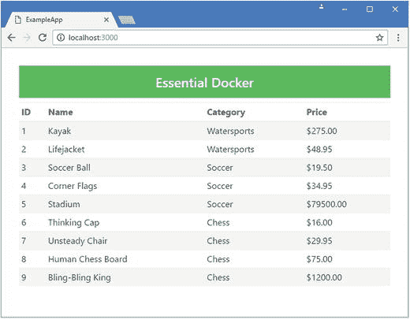
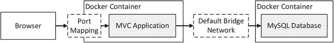
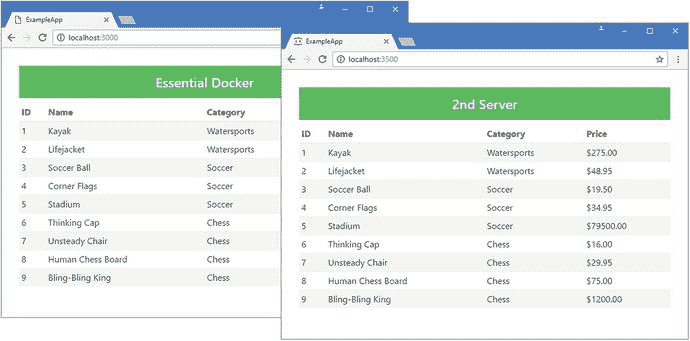
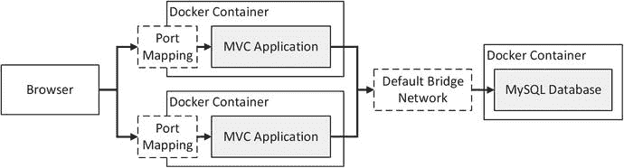
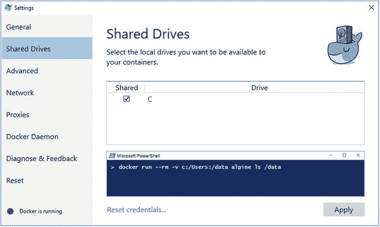
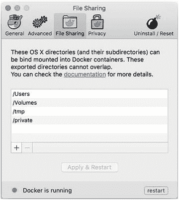
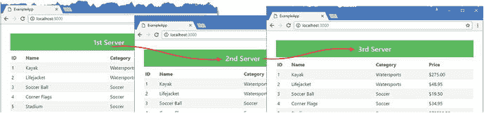
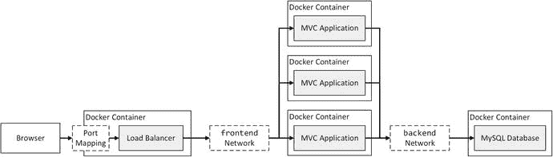

# 五、Docker 卷和网络

在这一章中，我描述了 Docker 的两个特性，它们被设计用来处理更复杂的应用，特别是由多个容器组成的应用。

第一个功能称为卷，它将应用或数据库生成的数据文件与容器存储的其余部分分开，从而更容易替换或升级容器。第二个功能称为软件定义的网络，允许容器进行通信，这使得扩展应用以处理更大的工作负载变得更加容易。表 [5-1](#Tab1) 将卷和软件定义的网络放在上下文中。

表 5-1。

Putting Docker Volumes and Software-Defined Networks in Context

<colgroup><col> <col></colgroup> 
| 问题 | 回答 |
| --- | --- |
| 它们是什么？ | 卷允许重要数据存在于容器之外，这意味着您可以替换容器，而不会丢失它创建的数据。软件定义网络是 Docker 创建的互联网协议网络，允许容器中的应用进行通信。 |
| 它们为什么有用？ | 卷使得删除容器而不删除其包含的数据成为可能，这允许在不丢失用户数据的情况下改变或升级容器。软件定义的网络使创建跨越多个容器的更复杂的应用成为可能，从而更容易引入数据库等通用组件。 |
| 它们是如何使用的？ | 这些功能通过`docker volume`和`docker network`命令进行管理。必须在创建使用卷和软件定义网络的容器之前准备好它们。 |
| 有什么陷阱或限制吗？ | 确定基本映像需要哪些卷可能是一个困难的过程。软件定义的网络仅连接单台服务器上的容器，除非使用 Docker 集群(如第 [7](7.html) 章所述)。 |
| 还有其他选择吗？ | 这些特性没有替代品，但是每个项目都需要它们。如果容器化的应用在移除容器时不生成需要保存的数据，则不需要卷。如果您的容器不需要通信，则不需要软件定义的网络。 |

表 [5-2](#Tab2) 总结了本章内容。

表 5-2。

Chapter Summary

<colgroup><col> <col> <col></colgroup> 
| 问题 | 解决办法 | 列表 |
| --- | --- | --- |
| 确保在删除容器时保留数据文件 | 创建一个卷，并使用它来提供容器文件系统中某个目录的内容 | 1–11, 13–17 |
| 确定容器是否使用卷 | 使用`docker inspect`命令 | Twelve |
| 向 ASP.NET Core MVC 应用添加数据库 | 创建卷并将其应用到数据库容器，并配置实体框架核心以连接到容器中的数据库 | 18–29 |
| 将容器连接在一起 | 创建软件定义的网络并将容器连接到该网络 | 30–34 |
| 将容器连接到软件定义的网络 | 创建容器时使用`--network`参数或使用`docker network connect`命令 | 35–39 |
| 在连接到软件定义的网络的容器之间分配工作 | 使用负载均衡器，该负载均衡器使用 Docker DNS 功能将请求定向到容器 | 40–41 |

## 为本章做准备

本章依赖于第 3 章中创建的 ExampleApp MVC 项目。如果您不想完成创建示例的过程，您可以将该项目作为免费源代码下载的一部分，在本书的`apress.com`页面上有一个链接。

如果您是 Windows 用户，并且按照上一章中的示例创建了 Windows 容器，那么您必须返回到使用 Linux 容器。右键单击任务栏中的 Docker 图标，并从弹出菜单中选择 Switch to Linux Containers。

为了确保与前面的例子没有冲突，运行清单 [5-1](#Par7) 中所示的命令来删除前一章中创建的容器。

```cs
docker rm -f $(docker ps -aq)
Listing 5-1.Removing the Containers

```

## 使用卷

有两种类型的文件与应用相关联:运行应用所需的文件和应用运行时生成的数据文件，这些文件通常是用户操作的结果。在 Docker 的世界中，这两种类型的文件被不同地处理。

运行应用所需的文件是应用 Docker 容器的一部分。当 Docker 处理 Docker 文件中的指令时，它会构建形成容器模板的映像。对于 ASP.NET Core MVC 应用，这意味着容器包括。NET 核心运行时、ASP.NET Core 包、自定义 C# 类、引导 CSS 样式表、Razor 视图和所有配置文件。没有这些文件，容器化的 MVC 应用将无法运行。

数据文件不包含在容器中。使用容器的一个主要好处是它们易于创建和销毁。当容器被销毁时，其文件系统中的文件也会被删除，这对数据文件来说是灾难性的，因为它们将永远丢失。

Docker 提供了一个名为 volumes 的特性来管理应用数据，在接下来的部分中，我将解释卷是如何工作的，演示可用于处理卷的工具，并向您展示使用卷的一种常见应用:数据库。

### 演示问题

卷可能会令人困惑，最好从演示不使用它们时会发生什么开始。在`ExampleApp`文件夹中创建一个名为`Dockerfile.volumes`的文件，并添加清单 [5-2](#Par13) 中所示的命令。

```cs
FROM alpine:3.4

WORKDIR /data

ENTRYPOINT (test -e message.txt && echo "File Exists" \
        || (echo "Creating File..." \
       && echo Hello, Docker $(date '+%X') > message.txt)) && cat message.txt

Listing 5-2.The Contents of the Dockerfile.volumes File in the ExampleApp Folder

```

这个 Docker 文件使用最小的 Alpine Linux 发行版作为它的基础。为了模拟生成数据的应用，`ENTRYPOINT`命令创建了一个名为`/data/message.txt`的数据文件，其中包含一条消息和一个时间戳。

数据文件在容器启动之前不会被创建，也不会成为从 Docker 文件创建的映像的一部分，类似于实际应用中的数据库内容。

从`ExampleApp`文件夹运行清单 [5-3](#Par17) 中的命令，从 Docker 文件构建一个映像，并使用该映像创建和启动一个新容器。

```cs
docker build . -t apress/vtest -f Dockerfile.volumes
docker run --name vtest apress/vtest
Listing 5-3.Creating an Image and a Container

```

当 Docker 启动容器时，它将产生以下输出，尽管您会看到一个不同的时间戳:

```cs
...
Creating File...
Hello, Docker 20:21:50
...

```

一旦容器写出了消息，它就退出，这表明已经创建了`/data/message.txt`数据文件，并且在`20:21:50`时打上了时间戳。

因为我没有为数据文件设置卷，所以它已经成为容器文件系统的一部分。文件系统是持久的，您可以通过运行清单 [5-4](#Par22) 中的命令来再次启动同一个容器。

```cs
docker start -a vtest
Listing 5-4.Restarting the Container

```

这一次，您将看到如下输出:

```cs
...

File Exists

Hello, Docker 20:21:50
...

```

输出表明`/data/message.txt`文件已经存在，并且具有相同的时间戳。

删除容器时，数据文件会出现问题。正如您将在后面的章节中了解到的，Docker 容器经常被创建和销毁，要么是为了反映工作负载的变化，要么是为了部署应用的新版本。运行清单 [5-5](#Par27) 中所示的命令来移除容器。

```cs
docker rm -f vtest
Listing 5-5.Deleting a Container

```

Docker 会删除容器，`/data/message.txt`文件丢失。为了确认这一点，运行清单 [5-6](#Par29) 中所示的命令，从同一个映像创建并运行另一个容器。

```cs
docker run --name vtest apress/vtest
Listing 5-6.Replacing the Container

```

容器的输出显示已经创建了一个新的数据文件。

```cs
...

Creating File...

Hello, Docker 20:53:26
...

```

显而易见，在实际应用中删除数据文件会产生严重的后果，应该避免。

### 使用 Docker 卷管理数据

Docker 卷解决了数据文件问题，它将数据文件保存在容器之外，同时仍然允许运行在容器内部的应用访问它们。使用卷有三个步骤，我将在接下来的部分中进行描述。

#### 步骤 1:更新 Docker 文件

应用卷的第一步是向 Docker 文件添加一个命令，如清单 [5-7](#Par35) 所示。

```cs
FROM alpine:3.4

VOLUME /data

WORKDIR /data

ENTRYPOINT (test -e message.txt && echo "File Exists" \
        || (echo "Creating File..." \
       && echo Hello, Docker $(date '+%X') > message.txt)) && cat message.txt

Listing 5-7.Declaring a Volume in the Dockerfile.volumes File in the ExampleApp Folder

```

`VOLUME`命令告诉 Docker，存储在`/data`中的任何文件都应该存储在一个卷中，将它们放在常规容器文件系统之外。需要注意的重要一点是，在容器中运行的应用不知道`/data`目录中的文件是特殊的:它们将像容器文件系统中的任何其他文件一样被读写。

将更改保存到 Docker 文件中，并在`ExampleApp`文件夹中运行清单 [5-8](#Par38) 中所示的命令来重新创建映像。

```cs
docker build . -t apress/vtest -f Dockerfile.volumes
Listing 5-8.Updating the Image to Use a Volume

```

#### 步骤 2:创建卷

第二步是创建将保存数据文件的卷。运行清单 [5-9](#Par40) 中所示的命令，创建将用于存储示例应用的数据文件的卷。

```cs
docker volume create --name testdata
Listing 5-9.Creating a Volume

```

`docker volume create`命令用于创建一个新卷，并为其指定一个名称，在本例中为`testdata`。该卷是一个自包含的文件系统，将为容器的文件系统中的一个目录提供内容。因为卷不是容器的一部分，所以当容器被销毁时，它包含的文件不会被删除。

#### 步骤 3:创建容器

第三步也是最后一步是告诉 Docker 容器应该使用哪个体积。在`ExampleApp`文件夹中运行清单 [5-10](#Par43) 中所示的命令，创建一个容器，该容器使用清单 [5-9](#Par40) 中创建的`testdata`卷为清单 [5-7](#Par35) 中配置的`/data`目录提供内容。

```cs
docker run --name vtest2 -v testdata:/data apress/vtest
Listing 5-10.Associating a Volume with a Container

```

`-v`参数告诉 Docker，容器在`/data`目录中创建的任何数据都应该存储在`testdata`卷中。该卷对应用来说就像一个常规目录，应用像以前一样创建数据文件。清单 [5-10](#Par43) 中命令的输出将表明一个数据文件已经被创建，如下所示:

```cs
...
Creating File...
Hello, Docker 21:48:20
...

```

就应用而言，没有任何变化。我在 Docker 文件的`ENTRYPOINT`命令中设置的简单脚本检查在`/data`目录中是否有一个`message.txt`文件。卷在第一次创建时是空的，这意味着应用没有找到文件并创建它。

只有当容器被销毁和替换时，使用该卷的效果才是明显的。运行清单 [5-11](#Par48) 中所示的命令来移除现有的容器，并创建和运行它的替换容器。

```cs
docker rm -f vtest2
docker run --name vtest2 -v testdata:/data apress/vtest
Listing 5-11.Testing the Volume

```

同样，`-v`参数与`docker run`命令一起使用，告诉 Docker 使用`testdata`卷为`/data`目录提供内容。这一次，当`ENTRYPOINT`脚本寻找`/data/message.txt`文件时，它发现了由前一个容器创建的文件，该文件幸存了下来，因为当容器被销毁时，卷没有受到影响。您将看到如下输出，显示不必创建该文件，如下所示:

```cs
...

File Exists

Hello, Docker 21:48:20
...

```

### 确定映像是否使用卷

有两种方法可以检查 Docker 映像是否依赖于卷。首先——也是最明显的——是查看用于创建映像的 Docker 文件。Docker 上许多公开可用的图片都包含一个到 GitHub 存储库的链接，在这里您可以很容易地检查 Docker 文件，并查看它是否包含任何`VOLUME`命令。记住，在阅读 Docker 文件时，也要考虑基本映像。

另一种方法是直接检查映像，如果您无法访问 Docker 文件，这将非常有用。运行清单 [5-12](#Par53) 中的命令来检查上一节中使用的映像。

```cs
docker inspect apress/vtest
Listing 5-12.Examining a Docker Image

```

来自`docker inspect`命令的响应是一个镜像的 JSON 描述，其中包括关于所使用的卷的信息。对于示例映像，来自`docker inspect`命令的响应将包括以下内容:

```cs
...
"Volumes": {
    "/data": {}
},
...

```

描述的`Volumes`部分列出了映像使用的卷，这些卷可以使用`docker run`或`docker create`命令的`-v`参数进行配置。

## 向示例应用添加数据库

大多数 ASP.NET Core MVC 应用依赖于数据库，这意味着有些数据库文件应该存储在一个卷中，这样当数据库容器被销毁时，它们就不会被删除。

然而，由于卷的内容不包括在映像中，即使使用了`docker commit`命令，也需要一些特殊措施来确保在数据库首次启动时创建应用的数据模型模式并应用任何种子数据。

在接下来的小节中，我将解释如何向示例应用添加数据库，包括使用卷来包含数据文件所需的步骤。

有许多可用的数据库服务器，但是容器化 ASP.NET Core 应用的最常见选择往往是 MySQL，它在 Linux 容器中运行良好，并且在实体框架核心(EF Core)中具有高质量的支持，这是大多数 ASP.NET Core 应用中使用的对象/关系映射框架。

为了确保前面的例子不会干扰本章中的容器，运行清单 [5-13](#Par62) 中所示的命令来删除所有 Docker 容器。

```cs
docker rm -f $(docker ps -aq)
Listing 5-13.Removing the Existing Docker Containers

```

Selecting a Database Server

不使用 Docker 时，ASP.NET Core MVC 最常用的数据库服务器选择是 Microsoft SQL Server。在撰写本文时，Docker 中 SQL Server 的使用还处于初级阶段。SQL Server 在 Windows 中运行良好，但 Docker 对 Windows 容器的支持仍然是新的，有一些粗糙的边缘。微软发布了运行在 Linux 上的 SQL Server 的预览版，当它稳定下来时，将非常适合 Docker Linux 容器，但是，至少在我写这篇文章时，Linux 版本还没有准备好用于生产。当微软发布最终版本时，我会在这本书的源代码库中发布一个更新的例子，你可以在这本书的`apress.com`页面上找到链接。

### 提取并检查数据库映像

当向容器化的应用添加新组件时，重要的是从检查映像开始，查看它如何使用卷，以便您知道如何配置您创建的容器。如果您跳过这一步，一切都会很好，直到您删除一个容器，并发现它包含的数据文件也被删除。

运行清单 [5-14](#Par66) 中所示的命令，从 Docker Hub 中提取 MySQL 的映像并检查它。

```cs
docker pull mysql:8.0.0
docker inspect mysql:8.0.0
Listing 5-14.Pulling and Inspecting the MySQL Docker Hub Image

```

检查`docker inspect`命令的输出并定位`Volumes`部分，如下所示:

```cs
...
"Volumes": {
    "/var/lib/mysql": {}
},
...

```

这告诉您,`mysql:8.0.0`映像使用一个卷作为它的`/var/lib/mysql`目录，这是 MySQL 存储其数据文件的地方。

Tip

不要试图创建一个包含 ASP.NET Core MVC 应用和数据库的 Docker 映像，这样它们就可以在一个容器中运行。Docker 的惯例是为应用中的每个组件使用一个单独的容器，这使得升级或替换应用的某些部分变得更容易，并允许在部署应用后采用更灵活的方法来扩展应用。如果您创建一个包含所有应用组件的单一容器，您将无法从 Docker 最有用的特性中获益。

### 创建卷和容器

为了准备数据库容器，运行清单 [5-15](#Par72) 中所示的命令来创建名为`productdata`的 Docker 卷，它将用于存储数据库数据文件。

```cs
docker volume create --name productdata
Listing 5-15.Creating a Volume for the Database Container

```

运行清单 [5-16](#Par74) 中所示的命令，创建并启动一个新的 MySQL 容器，该容器使用卷为容器提供`/var/lib/mysql`目录的内容。(在一行中输入命令。)

```cs
docker run -d --name mysql -v productdata:/var/lib/mysql
    -e MYSQL_ROOT_PASSWORD=mysecret -e bind-address=0.0.0.0 mysql:8.0.0
Listing 5-16.Creating and Starting a MySQL Container

```

如第 [4 章](4.html)中所解释的，`docker run`命令创建一个容器并在一个单独的步骤中启动它。表 [5-3](#Tab3) 显示了用于配置 MySQL 容器的参数。

表 5-3。

The Arguments Used to Configure the MySQL Container

<colgroup><col> <col></colgroup> 
| 名字 | 描述 |
| --- | --- |
| -d | 这个参数告诉 Docker 在后台运行容器，而不附加到它来显示输出。 |
| `--name` | 该参数用于将名称`mysql`分配给容器，这样在其他 Docker 命令中更容易引用。 |
| `-e MYSQL_ROOT_PASSWORD` | 此参数设置一个环境变量。在这种情况下，MySQL 容器使用`MYSQL_ROOT_PASSWORD`环境变量来设置连接数据库所需的密码。对于示例应用，我已经将密码设置为`mysecret`，但是对于实际项目，您应该使用更安全的密码。 |
| `-e bind-address` | 此参数设置一个环境变量。这个环境变量确保 MySQL 接受所有网络接口上的请求。 |
| `-v productdata:/var/lib/mysql` | 这个参数告诉 Docker 使用一个名为`productdata`的卷来提供容器的`/var/lib/mysql`目录的内容。 |

运行清单 [5-17](#Par77) 中所示的命令来监控数据库启动。

```cs
docker logs -f mysql
Listing 5-17.Monitoring the Database Startup

```

`MySql`初始化需要一段时间，在此期间它会写出日志消息。这些消息中有许多是可以忽略的警告。一旦数据库准备就绪，这些消息将会停止，最后显示的消息之一如下所示，这表明数据库已准备好接受网络连接:

```cs
...
08:42:00.729460Z 0 [Note] mysqld: ready for connections.
...

```

后续的初始化将会更快，因为它们将能够使用已经在`productdata`卷中创建的文件。一旦数据库开始运行，输入`Control+C`停止监视输出，让数据库在后台的容器中运行。

### 准备示例应用

ASP.NET Core MVC 应用的数据通常由实体框架核心(称为 EF 核心)提供，它是 ASP.NET 对象/关系映射框架。编辑`ExampleApp.csproj`文件以添加清单 [5-18](#Par82) 中所示的包。

```cs
<Project Sdk="Microsoft.NET.Sdk.Web">

  <PropertyGroup>
    <TargetFramework>netcoreapp1.1</TargetFramework>
  </PropertyGroup>

  <ItemGroup>
    <PackageReference Include="Microsoft.AspNetCore" Version="1.1.1" />
    <PackageReference Include="Microsoft.AspNetCore.Mvc" Version="1.1.2" />
    <PackageReference Include="Microsoft.AspNetCore.StaticFiles" Version="1.1.1" />
    <PackageReference Include="Microsoft.Extensions.Logging.Debug" Version="1.1.1" />
    <PackageReference Include="Microsoft.VisualStudio.Web.BrowserLink"
         Version="1.1.0" />

    <PackageReference Include="Microsoft.EntityFrameworkCore" Version="1.1.1" />

    <PackageReference Include="Microsoft.EntityFrameworkCore.Tools"

         Version="1.1.0" />

    <PackageReference Include="Pomelo.EntityFrameworkCore.MySql" Version="1.1.0" />

     <DotNetCliToolReference Include="Microsoft.EntityFrameworkCore.Tools.DotNet"

         Version="1.0.0" />

  </ItemGroup>

</Project>

Listing 5-18.Adding Packages in the ExampleApp.csproj File in the ExampleApp Folder

```

新的包增加了微软的 EF 核心包和包含 MySql 数据库提供者的`Pomelo.EntityFrameworkCore.MySql`包。MySql 项目中有一个官方的数据库提供者，但是我发现本章中使用的 Pomelo 提供者更新更快，也更容易使用。

保存对`ExampleApp.csproj`文件的修改，并运行`ExampleApp`文件夹中清单 [5-19](#Par85) 所示的命令下载新的包。

```cs
dotnet restore
Listing 5-19.Updating the Example Project Packages

```

### 创建存储库类

目前，示例应用拥有由存储库接口的占位符实现提供的虚拟数据，我在第 [3](3.html) 章中放置了这些虚拟数据，只是为了让应用启动。

用通过 EF 核心访问的数据替换虚拟数据需要一个数据库上下文类。将名为`ProductDbContext.cs`的文件添加到`ExampleApp/Models`文件夹中，并添加清单 [5-20](#Par88) 中所示的代码。

```cs
using Microsoft.EntityFrameworkCore;

namespace ExampleApp.Models {

    public class ProductDbContext : DbContext {

        public ProductDbContext(DbContextOptions<ProductDbContext> options)
            : base(options) {
        }

        public DbSet<Product> Products { get; set; }
    }
}

Listing 5-20.The Contents of the ProductDbContext.cs File in the ExampleApp/Models Folder

```

`ProductDbContext`类将通过其`Products`属性提供对数据库中`Product`对象的访问。为了提供对应用中其他地方的数据的访问，将一个名为`ProductRepository.cs`的文件添加到`ExampleApp/Models`文件夹中，并添加清单 [5-21](#Par90) 中所示的代码。

```cs
using System.Linq;

namespace ExampleApp.Models {

    public class ProductRepository : IRepository {
        private ProductDbContext context;

        public ProductRepository(ProductDbContext ctx) {
            context = ctx;
        }

        public IQueryable<Product> Products => context.Products;
    }
}

Listing 5-21.The Contents of the ProductRepository.cs File in the ExampleApp/Models Folder

```

这是一个简单的存储库，通过一个`Products`属性公开数据库中的`Product`对象。在一个真实的项目中，存储库还会提供创建和修改对象的方法，但是为了将重点放在 Docker 上，我省略了这些方法。

为了定义当数据库为空时将被添加到应用中的种子数据，在`ExampleApp/Models`文件夹中创建一个名为`SeedData.cs`的文件，并添加清单 [5-22](#Par93) 中所示的代码。

```cs
using Microsoft.AspNetCore.Builder;
using Microsoft.EntityFrameworkCore;
using Microsoft.Extensions.DependencyInjection;
using System.Linq;

namespace ExampleApp.Models {

    public static class SeedData {

        public static void EnsurePopulated(IApplicationBuilder app) {
            EnsurePopulated(
                app.ApplicationServices.GetRequiredService<ProductDbContext>());
        }

        public static void EnsurePopulated(ProductDbContext context) {
            System.Console.WriteLine("Applying Migrations...");
            context.Database.Migrate();

            if (!context.Products.Any()) {

                System.Console.WriteLine("Creating Seed Data...");
                context.Products.AddRange(
                    new Product("Kayak", "Watersports", 275),
                    new Product("Lifejacket", "Watersports", 48.95m),
                    new Product("Soccer Ball", "Soccer", 19.50m),
                    new Product("Corner Flags", "Soccer", 34.95m),
                    new Product("Stadium", "Soccer", 79500),
                    new Product("Thinking Cap", "Chess", 16),
                    new Product("Unsteady Chair", "Chess", 29.95m),
                    new Product("Human Chess Board", "Chess", 75),
                    new Product("Bling-Bling King", "Chess", 1200)
                );
                context.SaveChanges();
            } else {
                System.Console.WriteLine("Seed Data Not Required...");
            }
        }
    }
}

Listing 5-22.The Contents of the SeedData.cs File in the ExampleApp/Models Folder

```

静态的`EnsurePopulated`方法创建一个数据库上下文对象，并使用它将`Product`对象添加到数据库中。`SeedData`课上最重要的陈述是这样的:

```cs
...
context.Database.Migrate();
...

```

EF Core 使用一种称为迁移的特性来管理数据库的模式，这种特性通常通过命令行工具应用于数据库。这在使用 Docker 时不起作用，因为在部署应用时很难执行手动配置步骤。相反，在应用启动时会调用`Database.Migrate`方法，将任何挂起的迁移应用到数据库。这确保了数据库模式的创建不需要任何命令行干预，但是，正如您将了解到的，生产应用需要不同的技术，如后面的章节所述。

### 配置应用

要配置应用并启用 EF 核心服务，对`Startup`类进行清单 [5-23](#Par98) 中所示的修改。

```cs
using ExampleApp.Models;
using Microsoft.AspNetCore.Builder;
using Microsoft.AspNetCore.Hosting;
using Microsoft.Extensions.DependencyInjection;
using Microsoft.Extensions.Logging;
using Microsoft.Extensions.Configuration;

using Microsoft.EntityFrameworkCore;

namespace ExampleApp {
    public class Startup {

        private IConfigurationRoot Configuration;

        public Startup(IHostingEnvironment env) {
            Configuration = new ConfigurationBuilder()
                .SetBasePath(env.ContentRootPath)
                .AddEnvironmentVariables()
                .Build();
        }

        public void ConfigureServices(IServiceCollection services) {

            var host = Configuration["DBHOST"] ?? "localhost";

            var port = Configuration["DBPORT"] ?? "3306";

            var password = Configuration["DBPASSWORD"] ?? "mysecret";

            services.AddDbContext<ProductDbContext>(options =>

                options.UseMySql($"server={host};userid=root;pwd={password};"

                    + $"port={port};database=products"));

            services.AddSingleton<IConfiguration>(Configuration);

            services.AddTransient<IRepository, ProductRepository>();

            services.AddMvc();
        }

        public void Configure(IApplicationBuilder app,
                IHostingEnvironment env, ILoggerFactory loggerFactory) {

            loggerFactory.AddConsole();
            app.UseDeveloperExceptionPage();
            app.UseStatusCodePages();
            app.UseStaticFiles();
            app.UseMvcWithDefaultRoute();

            SeedData.EnsurePopulated(app);

        }
    }
}

Listing 5-23.Configuring the Application in the Startup.cs File in the ExampleApp Folder

```

在传统的 MVC 项目中，数据库的连接字符串是在 JSON 配置文件中定义的，但是在使用容器时，使用环境变量会更简单，因为在启动容器时可以很容易地指定环境变量，这样就不必在每次配置发生变化时重新构建映像和重新创建容器。在本例中，通过读取名为`DBHOST`、`DBPORT`和`DBPASSWORD`的环境变量的值来配置主机名、TCP 端口和密码。如果没有定义环境变量，将使用这些配置设置的默认值。

### 创建数据库迁移

下一步是创建初始的实体框架核心迁移，它将为应用定义模式。这使用了 EF 核心代码优先特性，该特性从 ASP.NET Core 应用中的数据模型类自动生成数据库模式。从`ExampleApp`文件夹运行清单 [5-24](#Par101) 中所示的命令来创建迁移。

```cs
dotnet ef migrations add Initial
Listing 5-24.Creating the Initial Database Migration

```

如果您使用的是 Visual Studio，您可以打开软件包管理器控制台(在工具➤ NuGet 软件包管理器菜单中可用)并运行清单 [5-25](#Par103) 中所示的 PowerShell 命令。

```cs
Add-Migration Initial
Listing 5-25.Creating the Database Migrations Using the Visual Studio Package Manager Console

```

无论您使用哪个命令，Entity Framework Core 都会创建一个`Example/Migrations`文件夹，其中包含将用于创建数据库模式的 C# 类。(如果您看到一个错误，告诉您术语`Add-Migration`无法识别，那么重新启动 Visual Studio 并再次加载示例项目。一旦项目加载完毕，你应该能够从软件包管理器控制台运行`Add-Migration`命令。)

Note

此时，您可能习惯于运行`dotnet ef database update`或`Update-Database`命令，但是在使用 Docker 时，这些命令没有帮助。相反，MVC 应用已经被配置为在启动时应用迁移，如清单 [5-23](#Par98) 所示，或者通过使用后面章节中描述的技术。

### 改变视图

早期的例子修改了 Razor 视图中的横幅消息，以指示内容何时被更改。将视图返回到一个更简单的消息，只显示控制器提供的值，如清单 [5-26](#Par107) 所示。

```cs
@model IEnumerable<ExampleApp.Models.Product>
@{
    Layout = null;
}
<!DOCTYPE html>
<html>
<head>
    <meta name="viewport" content="width=device-width" />
    <title>ExampleApp</title>
    <link rel="stylesheet" href="∼/lib/bootstrap/dist/css/bootstrap.min.css" />
</head>
<body>
    <div class="m-1 p-1">
        <h4 class="bg-success text-xs-center p-1 text-white">@ViewBag.Message</h4>

        <table class="table table-sm table-striped">
            <thead>
                <tr><th>ID</th><th>Name</th><th>Category</th><th>Price</th></tr>
            </thead>
            <tbody>
                @foreach (var p in Model) {
                    <tr>
                        <td>@p.ProductID</td>
                        <td>@p.Name</td>
                        <td>@p.Category</td>
                        <td>$@p.Price.ToString("F2")</td>
                    </tr>

                }
            </tbody>
        </table>
    </div>
</body>
</html>

Listing 5-26.Resetting the Contents of the Index.cshtml File in the ExampleApp/Views/Home Folder

```

### 创建 MVC 应用映像

最后一个准备步骤是更新 MVC 应用的映像，使其包含支持数据库、实体框架核心包的代码更改，以及创建数据库模式和应用种子数据的初始迁移。在`ExampleApp`文件夹中运行清单 [5-27](#Par109) 中所示的命令来发布应用并创建一个新的 Docker 映像。

```cs
dotnet publish --framework netcoreapp1.1 --configuration Release --output dist
docker build . -t apress/exampleapp -f Dockerfile
Listing 5-27.Updating the MVC Application Image

```

`dotnet publish`命令为容器化准备 MVC 应用，并将它需要的所有文件写入`dist`文件夹，如第 [4](4.html) 章所述。`docker build`命令使用`Dockerfile`生成一个新映像，该映像被分配了`apress/exampleapp`标签。

### 测试应用

剩下的工作就是通过为 ASP.NET Core MVC 应用创建一个容器来测试新的映像，并确保它可以与 MySQL 数据库通信，MySQL 数据库已经运行在它自己的容器中，在清单 [5-16](#Par74) 中创建。这个测试需要一些工作，但是它提供了一些关于 Docker 如何工作的有用见解。

当您启动一个容器时，Docker 将其连接到一个内部虚拟网络，并为其分配一个 Internet 协议(IP)地址，以便它可以与主机服务器以及同一网络上的其他容器进行通信。这是我在本章下一节描述的一个关键 Docker 特性的入口点(称为软件定义的网络)。

为了让 MVC 容器与数据库对话，我需要知道 Docker 分配给 MySQL 容器的 IP 地址。运行清单 [5-28](#Par114) 中所示的命令，检查 Docker 虚拟网络的配置。

```cs
docker network inspect bridge
Listing 5-28.Examining the Docker Virtual Network

```

该命令的响应将向您展示 Docker 如何配置虚拟网络，并将包括一个`Containers`部分，显示连接到网络的容器以及分配给它们的 IP 地址。

应该只有一个容器，它的`Name`字段将是`mysql`。记下`IPv4Address`字段，如下所示:

```cs
...
"Containers": {
    "72753560ccb4d876bdeaad36e0b39354a08e90ad30ac1a78b20aad3e52b7a101": {
        "Name": "mysql",
        "EndpointID": "04f18afbf953a030ddfbbadf4a8f86c1dbf6c6a6736449326",
        "MacAddress": "02:42:ac:11:00:02",
        "IPv4Address": "172.17.0.2/16",

        "IPv6Address": ""
    }
},
...

```

这是 Docker 分配给容器的 IP 地址。对我来说，地址是`172.17.0.2`，但你可能会看到一个不同的地址。这是 MVC 应用在数据库连接中与 MySQL 通信时必须使用的 IP 地址。这个地址可以通过`DBHOST`环境变量提供给应用，我在清单 [5-22](#Par93) 中添加的 MVC 应用的`Startup`类可以读取这个地址。

运行清单 [5-29](#Par120) 中所示的命令，在后台创建并启动一个 MVC 容器，然后监控其输出。确保您使用的 IP 地址已经分配给系统上的 MySQL 容器，如清单 [5-29](#Par120) 中命令的输出所示。

```cs
docker run -d --name productapp -p 3000:80 -e DBHOST=172.17.0.2 apress/exampleapp
docker logs -f productapp
Listing 5-29.Creating and Starting a New MVC Application Container

```

当 MVC 应用启动时，您将会看到一些消息，显示 Entity Framework Core 已经将它的迁移应用到了数据库，这确保了模式被创建并且种子数据被添加。

```cs
...
Applying Migrations...

info: Microsoft.EntityFrameworkCore.Migrations.Internal.Migrator[12]

      Applying migration '20161215112411_Initial'.

Creating Seed Data...

...SQL statements omitted for brevity...

Hosting environment: Production
Content root path: /app
Now listening on: http://+:80
Application started. Press Ctrl+C to shut down.
...

```

清单 [5-29](#Par120) 中的`docker run`命令将主机操作系统上的端口 3000 映射到容器中的端口 80，这是 Kestrel 用来接收 ASP.NET Core 运行时的 HTTP 请求的端口。为了测试应用，打开一个新的浏览器选项卡并请求 URL `http://localhost:3000`。浏览器将发送一个 HTTP 请求，Docker 将接收该请求并将其定向到 MVC 容器中的端口 80，产生如图 [5-1](#Fig1) 所示的响应。



图 5-1。

Testing the example application

MVC 应用的响应中显示的数据是使用 Entity Framework Core 从 MySQL 服务器获得的。Docker 网络允许 EF 核心打开到 MySQL 容器的网络连接，并使用它来发送 SQL 查询。这两个组件都存在于它们自己的容器中，并像平常一样发出网络请求，不知道另一个容器存在于同一台服务器上，连接它们的网络是虚拟的，并由 Docker 创建和管理。

一旦您测试了 MVC 应用的工作，输入`Control+C`停止监视输出，让容器在后台运行。您可以使用`docker ps`命令检查容器是否仍在运行。

## 使用软件定义的网络

上一节中允许容器进行通信的虚拟网络是软件定义网络(SDN)的一个示例。顾名思义，sdn 是使用软件创建和管理的网络。sdn 的行为类似于传统网络，使用常规 IP 地址端口，但没有物理网络接口，网络的基础设施(如名称服务和路由)由 Docker 提供。

sdn 允许容器进行通信。简单 sdn 仅限于单个服务器。我在上一节中使用的默认网络，即默认网桥网络，就是一个很好的例子。这个网络是 Docker 在启动时创建的一个集合中的一个。运行清单 [5-30](#Par128) 中所示的命令，查看 Docker 提供的默认网络。

```cs
docker network ls
Listing 5-30.Listing the Docker Networks

```

此命令列出所有当前 sdn，并产生以下输出:

```cs
NETWORK ID          NAME                DRIVER              SCOPE

3826803e0a8c        bridge              bridge              local

0e643a56cce6        host                host                local
9058e96d6113        none                null                local

```

`host`网络是主机服务器的网络，而`none`网络是没有连接性的网络，可以用来完全隔离容器。名为`bridge`的网络是最令人感兴趣的，因为 Docker 在创建容器时会将所有容器添加到这个网络中。运行清单 [5-31](#Par132) 中所示的命令来检查默认桥接网络。

```cs
docker network inspect bridge
Listing 5-31.Inspecting the Default Bridge Network

```

现在有两个容器正在运行，您将在`Containers`部分看到一个额外的条目，显示 Docker 已经应用到 MVC 容器的网络配置，就像这样(尽管您可能会看到不同的地址):

```cs
...
"Containers": {
    "1be5d5609e232335d539b29c49192c51333aaea1fd822249342827456aefc02e": {

        "Name": "productapp",

        "EndpointID": "3ff7acdaf3cce9e77cfc7156a04d6fa7bf4b5ced3fd13",

        "MacAddress": "02:42:ac:11:00:03",

        "IPv4Address": "172.17.0.3/16",

        "IPv6Address": ""

    },

    "9dd1568078b63104abc145840df8502ec2e171f94157596236f00458ffbf0f02": {
        "Name": "mysql",
        "EndpointID": "72b3df290f3fb955e1923b04909b7f27fa3854d8df583",
        "MacAddress": "02:42:ac:11:00:02",
        "IPv4Address": "172.17.0.2/16",
        "IPv6Address": ""
    }
},
...

```

理解 Docker SDN 效果的最佳方式是理解上一节创建的应用的组成，并考虑 MVC 和 MySQL 容器的连接性，如图 [5-2](#Fig2) 所示。



图 5-2。

Using the default bridge network

浏览器将其 HTTP 请求发送到主机操作系统上的一个端口，Docker 将该端口映射到 MVC 应用容器中的一个端口。MVC 应用要求实体框架核心为它提供数据，它通过使用默认的桥接网络与运行在单独容器中的 MySQL 应用通信来提供数据。清单 [5-16](#Par74) 中创建 MySQL 容器的命令不包含端口映射，这意味着不能通过主机操作系统上的端口访问 MySQL 容器。

Note

本章中创建的软件定义的网络只存在于单个主机服务器上，这意味着连接到网络的所有容器都必须在该服务器上运行。Docker 还支持跨越服务器集群中所有节点的软件定义网络，我将在第 [7](7.html) 章对此进行演示。

### 扩展 MVC 应用

软件定义网络的行为类似于物理网络，而容器的行为类似于与之相连的服务器。这意味着扩展 MVC 应用以便有多个 ASP.NET Core 服务器就像创建和启动额外的容器一样简单。运行清单 [5-32](#Par139) 中的命令来添加一个新的 MVC 容器。(输入单行命令。)

```cs
docker run -d --name productapp2 -p 3500:80 -e DBHOST=172.17.0.2
    -e MESSAGE="2nd Server" apress/exampleapp
Listing 5-32.Creating an Additional MVC Application Container

```

为应用创建额外的容器时，确保新容器具有不同的名称(在本例中为`productapp2`)和不同的端口映射(端口 3500，而不是端口 3000，被映射到该容器的端口 80)是很重要的。为了进一步区分新容器，`-e`参数被用来设置`MESSAGE`环境变量，该变量将显示在 MVC 应用的输出中。`-d`参数告诉 Docker 在后台启动容器。

结果是，MVC 应用有容器来处理主机服务器端口 3000 和 3500 上的请求。为了测试容器，打开浏览器标签并请求`http://localhost:3000`和`http://localhost:3500`，这将产生如图 [5-3](#Fig3) 所示的结果。请注意，新容器的响应中的横幅上写着“第二个服务器”，以区别于原始容器。



图 5-3。

Creating additional application containers

图 [5-4](#Fig4) 显示了添加第二个 MVC 应用容器后应用的组成。



图 5-4。

The effect of adding an additional container

Docker 为每个容器分配了自己的 IP 地址，容器之间可以自由通信。

### 创建自定义软件定义的网络

使用默认的桥接网络演示了 Docker 的基本网络特性，但是它有两个主要的限制。第一个限制是检查网络以获取 MySQL 容器的 IP 地址来配置 MVC 容器的笨拙过程。

第二个限制是所有容器都连接到同一个网络，而大规模应用通常设计有多个网络，这些网络将不同的功能区域分隔开来，以便可以独立地监控和管理它们。幸运的是，这两个限制都可以通过创建自定义 sdn 而不是使用默认桥接网络来解决。

为了准备这一部分，运行清单 [5-33](#Par147) 中所示的命令来停止并删除数据库和 MVC 容器。

```cs
docker rm -f $(docker ps -aq)
Listing 5-33.Removing the Containers

```

### 创建自定义网络

使用`docker network create`命令创建自定义软件定义网络，后跟新网络的名称。运行清单 [5-34](#Par149) 中所示的命令，创建两个名为`frontend`和`backend`的新软件定义网络。

```cs
docker network create frontend
docker network create backend
Listing 5-34.Creating Custom Software-Defined Networks

```

网络将用于接收 MVC 容器的 HTTP 请求。`backend`网络将用于 MVC 容器和 MySQL 容器之间的 SQL 查询。运行`docker network ls`命令，您将看到输出包括新的网络，如下所示:

```cs
NETWORK ID          NAME                DRIVER              SCOPE

778d9eb6777a        backend             bridge              local

fa1bc701b306        bridge              bridge              local

2f0bb28d5716        frontend            bridge              local

0e643a56cce6        host                host                local
9058e96d6113        none                null                local

```

#### 将容器连接到自定义网络

一旦创建了定制网络，就可以使用`--network`参数将容器连接到它们，该参数可以与`docker create`和`docker run`命令一起使用。运行清单 [5-35](#Par153) 中所示的命令，创建一个连接到`backend`网络的新数据库容器。(输入单行命令。)

```cs
docker run -d --name mysql -v productdata:/var/lib/mysql --network=backend
    -e MYSQL_ROOT_PASSWORD=mysecret -e bind-address=0.0.0.0 mysql:8.0.0
Listing 5-35.Creating a Container Connected to a Network

```

该命令中有一个新参数，如表 [5-4](#Tab4) 所述。

表 5-4。

Additional Argument Used to Create the MySQL Container

<colgroup><col> <col></colgroup> 
| 名字 | 描述 |
| --- | --- |
| `--network` | 此参数用于将容器分配给网络。在这种情况下，容器被分配给名为`backend`的网络。 |

请注意，该命令中没有端口映射，这意味着无法通过主机操作系统访问数据库。相反，它将只能通过`backend`软件定义的网络接收连接。

#### 了解 Docker DNS 服务

Docker 配置容器，以便它们的域名系统(DNS)请求将分配给容器的名称解析为它们在自定义软件定义的网络上获得的 IP 地址。(此功能在默认网桥网络上不可用。)

DNS 配置意味着容器名可以用作主机名，避免了定位分配给容器的 IP 地址的需要。运行清单 [5-36](#Par158) 中所示的命令来执行 Docker DNS 特性的简单测试。

```cs
docker run -it --rm --network backend alpine:3.4 ping -c 3 mysql
Listing 5-36.Testing the Docker DNS Feature

```

该命令使用 Alpine Linux 发行版创建并运行一个映像，并对名为`mysql`的主机执行`ping`命令，Docker 会自动将该主机解析为已经分配给`backend`软件定义网络上的`mysql`容器的 IP 地址。该命令将产生以下结果:

```cs
...
PING mysql (172.19.0.2): 56 data bytes
64 bytes from 172.19.0.2: seq=0 ttl=64 time=0.070 ms
64 bytes from 172.19.0.2: seq=1 ttl=64 time=0.124 ms
64 bytes from 172.19.0.2: seq=2 ttl=64 time=0.128 ms

--- mysql ping statistics ---
3 packets transmitted, 3 packets received, 0% packet loss
round-trip min/avg/max = 0.070/0.107/0.128 Microsoft
...

```

一旦`ping`命令完成，容器将退出并自动移除。

#### 创建 MVC 容器

嵌入式 DNS 特性和不需要端口映射的事实使得创建多个 MVC 应用容器变得更加简单，因为只有容器名称必须是唯一的。运行清单 [5-37](#Par163) 中所示的命令，为 MVC 应用创建三个容器。每个命令都应该在一行中输入。

```cs
docker create --name productapp1 -e DBHOST=mysql -e MESSAGE="1st Server"
    --network backend apress/exampleapp
docker create --name productapp2 -e DBHOST=mysql -e MESSAGE="2nd Server"
    --network backend apress/exampleapp
docker create --name productapp3 -e DBHOST=mysql -e MESSAGE="3rd Server"
    --network backend apress/exampleapp
Listing 5-37.Creating the MVC Application Containers

```

`docker run`和`docker create`命令只能将一个容器连接到一个网络。清单 [5-37](#Par163) 中的命令指定了`backend`网络，但这只是 MVC 容器需要的连接之一。运行清单 [5-38](#Par165) 中的命令，将 MVC 容器连接到`frontend`网络。

```cs
docker network connect frontend productapp1
docker network connect frontend productapp2
docker network connect frontend productapp3
Listing 5-38.Connecting the Application Containers to Another Network

```

`docker network connect`命令将现有容器连接到软件定义的网络。清单中的命令将三个 MVC 容器连接到`frontend`网络。

既然 MVC 应用容器已经连接到两个 Docker 网络，运行清单 [5-39](#Par168) 中的命令来启动它们。

```cs
docker start productapp1 productapp2 productapp3
Listing 5-39.Starting the Application Containers

```

#### 添加负载平衡器

MVC 容器是在没有端口映射的情况下创建的，这意味着它们只能通过 Docker 软件定义的网络访问，而不能通过主机操作系统访问。

缺失的部分是负载平衡器，它将在映射到主机操作系统的单个端口上接收 HTTP 请求，并通过`frontend` Docker 网络将它们分发到 MVC 应用容器。

谈到负载平衡器，有很多选择，而选择通常与应用部署到的基础设施平台相关。例如，如果您将应用部署到公司网络中，您可能会发现已经安装并运行了负载平衡器。同样，大多数云平台将提供负载平衡器服务，尽管它的使用通常是可选的。

对于这个例子，我选择了 HAProxy，它是一个优秀的 HTTP 负载平衡器，已经被 Docker 采用用于其云环境，并通过我在第 [6](6.html) 章中使用的一个映像提供。

Tip

HAProxy 可以在 Linux 容器中使用，但不支持 Windows。如果你正在使用 Windows 容器并且需要一个负载均衡器，那么考虑 Nginx ( [`http://nginx.org`](http://nginx.org) )。

要配置 HAProxy，在`ExampleApp`文件夹中添加一个名为`haproxy.cfg`的文件，内容如清单 [5-40](#Par175) 所示。

```cs
defaults
    timeout connect 5000
    timeout client  50000
    timeout server  50000

frontend localnodes
    bind *:80
    mode http
    default_backend mvc

backend mvc
    mode http
    balance roundrobin
    server mvc1 productapp1:80
    server mvc2 productapp2:80
    server mvc3 productapp3:80

Listing 5-40.The Contents of the haproxy.cfg File in the ExampleApp Folder

```

这个配置告诉 HAProxy 在端口 80 上接收连接，这将通过主机操作系统上的映射来公开，并将它们分发到三个 MVC 容器，这三个容器使用它们的容器名称来标识，以利用 Docker DNS 特性。HTTP 请求将依次分发到每个 MVC 容器，这使得测试负载平衡器和显示所有 MVC 容器都被使用变得更加容易。

如果您使用的是 Visual Studio，您必须确保`haproxy.cfg`文件中的字符编码和行尾符合 HAProxy 应用的预期。选择文件➤另存为，然后单击保存按钮上的向下箭头，选择用编码保存选项。选择图 [5-5](#Fig5) 所示的选项并保存文件。如果不更改配置，HAProxy 进程将无法读取其配置文件，并将报告一个错误。


图 5-5。

Configuring the save options for the load balancer configuration file Matching Load Balancing and Session Storage Strategies

这种配置使用 HAProxy 循环负载平衡策略，依次向每个服务器发送请求。如果您的应用使用会话数据，您必须确保您的负载平衡策略适合您的会话存储模型。如果每个应用容器都维护自己的独立存储，那么您必须配置负载平衡器，以便来自客户端的后续请求返回到同一个服务器。这可能意味着 HTTP 请求不是均匀分布的，但可以确保会话按预期工作。如果您存储您的会话数据，以便可以从任何应用容器访问它，那么循环负载平衡就可以了。有关可用选项，请参见负载平衡器配置设置。如果你使用的是 HAProxy，那么配置选项可以在 [`www.haproxy.org`](http://www.haproxy.org) 找到。

为了使负载平衡器的配置文件可用，我将使用 Docker 卷特性，该特性允许主机操作系统中的文件和文件夹提供容器文件系统中的目录内容，而不需要专用的 Docker 卷。对于 Windows 和 macOS，需要一些配置(Linux 不需要这样的配置)。

对于 Windows 用户，右键单击任务栏中的 Docker 图标，然后从弹出菜单中选择设置。点击共享驱动器，勾选包含`ExampleApp`文件夹的驱动器的复选框，如图 [5-6](#Fig6) 所示。



图 5-6。

Enabling drive sharing on Windows

点按“应用”，如果出现提示，请提供管理员的帐户密码，然后关闭“设置”窗口。

对于 macOS 用户，单击 Docker 菜单栏图标，并从弹出菜单中选择“首选项”。点击文件共享，确保包含`ExampleApp`文件夹的文件夹在共享目录列表中，如图 [5-7](#Fig7) 所示。



图 5-7。

Enabling drive sharing on macOS

对于所有操作系统，从`ExampleApp`目录运行清单 [5-41](#Par184) 中的命令，创建并启动运行 HAProxy 的新容器，连接到前端 Docker 网络，并配置为在主机操作系统的端口 80 上侦听 HTTP 请求。注意在一行中输入命令。

```cs
docker run -d --name loadbalancer --network frontend
    -v "$(pwd)/haproxy.cfg:/usr/local/etc/haproxy/haproxy.cfg"
    -p 3000:80 haproxy:1.7.0
Listing 5-41.Creating and Starting the Load Balancer Container

```

在一行中输入命令。这个命令中的`-v`参数告诉 Docker 挂载容器中的`ExampleApp`文件夹中的`haproxy.cfg`文件，以便它出现在`/usr/local/etc/haproxy`目录中。对于创建需要配置文件的容器来说，这是一个有用的特性。(它对于容器化的开发环境也很有用，我在第 8 章[中描述过。)](8.html)

`--network`参数将负载平衡器容器连接到`frontend`网络，以便它可以与 MVC 容器通信。`-p`参数将主机操作系统上的端口 3000 映射到容器中的端口 80，以便负载平衡器可以接收来自外界的请求。

Tip

如果你在容器启动时看到一个错误，那么你很可能忘记改变`haproxy.cfg`文件的字符编码，如图 [5-4](#Fig4) 所示。在重复清单 [5-41](#Par184) 中的命令之前，更改设置，保存配置文件，然后运行`docker rm -f loadbalancer`移除容器。

一旦负载平衡器启动，打开浏览器选项卡并请求 URL `http://localhost:3000`。重新加载页面，你会看到负载均衡器在 MVC 应用容器之间分配请求，这反映在响应中显示的横幅上，如图 [5-8](#Fig8) 所示。(当应用启动时，对每个 MVC 容器的第一个请求可能需要一秒钟，但是如果您一直在重新加载，后续的请求应该会立即得到处理。)



图 5-8。

Load balancing between multiple application containers

最终结果是一个包含五个容器、两个软件定义的网络和一个端口映射的应用。应用的组成如图 [5-9](#Fig9) 所示，类似于传统的应用组成方式，尽管所有组件都运行在一台主机服务器上，并由容器隔离。



图 5-9。

The composition of an application with multiple software-defined networks

数据库容器仅连接到`backend`网络。MVC 应用容器同时连接到`frontend`和`backend`网络；他们通过`frontend`网络接收 HTTP 请求，并通过`backend`网络进行 SQL 查询。负载均衡器容器仅连接到`frontend`网络，并且具有映射到主机操作系统的端口；它通过端口映射接收 HTTP 请求，并将它们分发到 MVC 应用容器。

## 摘要

在这一章中，我描述了 Docker 卷和软件定义的网络特性，它们允许通过组合容器来组成更复杂的应用。我解释了如何使用卷将数据文件保存在容器存储之外，以及这如何改变了使用实体框架核心创建数据库模式的方式。我还介绍了软件定义的网络，并向您展示了如何使用它们为应用创建一个熟悉的结构，即使所有组件都存在于 Docker 容器中，而不是在专用的服务器硬件上。在下一章中，我将向您展示如何描述更复杂的应用，而不必单独创建和管理容器、卷和网络。