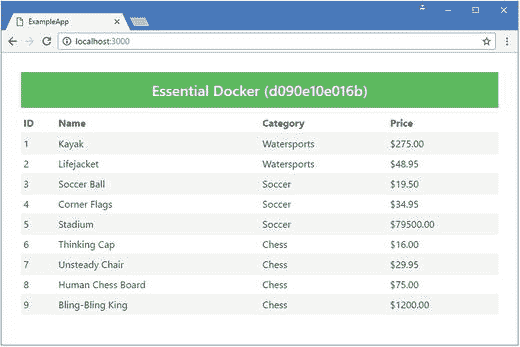
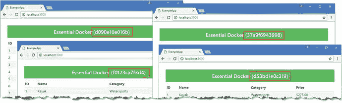

# 六、Docker Compose

在前一章中，我向您展示了如何通过组合容器、卷和软件定义的网络来创建复杂的应用。这种方法的问题是每个步骤都必须手动执行，这是一个容易出错的过程。不仅每个命令必须正确输入，而且各个步骤必须按照第 [5](5.html) 章中介绍的顺序执行，因为容器依赖于能够向在它之前创建的容器发送网络请求。如果您跳过一个步骤或者不按顺序执行一个步骤，那么您可能不会得到一个正常工作的应用。

在本章中，我将向您展示如何使用 Docker Compose，它用于以一致且可预测的方式描述复杂的应用。合成文件包含组成应用的所有卷、网络和容器的详细信息以及它们之间的关系。我解释了如何使用 Docker Compose，并演示了如何使用一个 Compose 文件来描述示例应用，以便可以在一个步骤中创建和启动它需要的所有组件。表 [6-1](#Tab1) 将 Docker 组合放入上下文中。

表 6-1。

Putting Docker Compose in Context

<colgroup><col> <col></colgroup> 
| 问题 | 回答 |
| --- | --- |
| 这是什么？ | Docker Compose 是一个工具，用于描述复杂的应用并管理它们所需的容器、网络和卷。 |
| 为什么有用？ | Docker Compose 简化了设置和运行应用的过程，因此您不必键入复杂的命令，这可能会导致配置错误。 |
| 如何使用？ | 应用及其需求的描述在一个组合文件中定义，该文件使用`docker-compose`命令进行处理。使用`docker-compose scale`命令改变应用中容器的数量。 |
| 有什么陷阱或限制吗？ | Docker 没有提供任何方法来等待一个容器中的应用准备好接收来自另一个容器的请求。因此，您必须直接管理应用中容器之间的依赖关系。 |
| 还有其他选择吗？ | 您不必使用 Docker Compose。您可以手动创建和管理您的容器，或者使用 Crowdr ( [`https://github.com/polonskiy/crowdr`](https://github.com/polonskiy/crowdr) )之类的替代工具。 |

表 [6-2](#Tab2) 总结了本章内容。

表 6-2。

Chapter Summary

<colgroup><col> <col> <col></colgroup> 
| 问题 | 解决办法 | 列表 |
| --- | --- | --- |
| 描述一个复杂的应用 | 使用 Docker 合成文件 | 1–5, 7, 17, 18 |
| 处理合成文件的内容 | 使用`docker-compose build`命令 | 6, 8, 20 |
| 在合成文件中创建并启动组件 | 使用`docker-compose up`命令 | 9, 21, 22 |
| 删除合成文件中的组件 | 使用`docker-compose down`命令 | 10, 27 |
| 等到应用准备好接收连接 | 使用`wait-for-it`包(对于 Linux 容器)或创建一个 PowerShell 脚本(对于 Windows 容器) | 11–16, 19 |
| 更改为服务运行的容器数量 | 使用`docker-compose scale`命令 | 23, 25 |
| 列出正在运行的服务 | 使用`docker-compose ps`命令 | Twenty-four |
| 停止已经使用合成文件启动的容器 | 使用`docker-compose stop`命令 | Twenty-six |

## 为本章做准备

本章依赖于在第 3 章中创建并在以后章节中修改的 ExampleApp MVC 项目。如果您不想完成创建示例的过程，您可以将该项目作为本书附带的免费源代码下载的一部分。请参见本书的第`apress.com`页。

为了确保与前面章节中的示例没有冲突，运行清单 [6-1](#Par6) 中所示的命令来删除前面章节中创建的容器、网络和卷。忽略这些命令产生的任何错误或警告。

```cs
docker rm -f $(docker ps -aq)
docker network rm $(docker network ls -q)
docker volume rm $(docker volume ls -q)
Listing 6-1.Removing the Containers, Networks, and Volumes

```

### 更改视图消息

在这一章中，我将演示如何通过自动创建多个容器来扩展 MVC 应用。为了帮助显示哪个容器正在处理一个特定的 HTTP 请求，清单 [6-2](#Par8) 显示了对`Home`控制器的更改，改变了由动作方法传递给它的视图的消息。

```cs
using Microsoft.AspNetCore.Mvc;
using ExampleApp.Models;
using Microsoft.Extensions.Configuration;

namespace ExampleApp.Controllers {
    public class HomeController : Controller {
        private IRepository repository;
        private string message;

        public HomeController(IRepository repo, IConfiguration config) {
            repository = repo;
          message =  $"Essential Docker ({config["HOSTNAME"]})";

        }

        public IActionResult Index() {
            ViewBag.Message = message;
            return View(repository.Products);
        }
    }
}

Listing 6-2.Changing the Banner in the HomeController.cs File in the ExampleApp/Controllers Folder

```

Docker 在容器内部创建一个`HOSTNAME`环境变量，该变量被设置为容器的惟一 ID。对控制器的更改确保了来自应用的响应指示哪个容器处理请求。这不是您在实际项目中应该做的事情，但这是一种演示 Docker Compose 关键特性如何工作的有用方式。

### 在 Linux 上安装复合 Docker

Docker Compose 包含在 Windows 和 macOS 的 Docker 安装程序中，但在 Linux 中必须单独安装。如果您是 Linux 用户，运行清单 [6-3](#Par11) 中所示的命令下载并安装 Docker Compose。

```cs
sudo curl -L "https://github.com/docker/compose/releases/download/1.11.2/docker-compose-$(uname -s)-$(uname -m)" -o /usr/local/bin/docker-compose
sudo chmod +x /usr/local/bin/docker-compose
Listing 6-3.Installing Docker Compose for Linux

```

一旦安装完成，运行清单 [6-4](#Par13) 中所示的命令，检查 Docker Compose 是否按预期工作。

```cs
docker-compose --version
Listing 6-4.Checking Docker Compose

```

如果安装成功，您将看到以下响应:`docker-compose version 1.11.2, build dfed245`。

## 创建合成文件

Docker Compose 允许在一个配置文件中描述复杂的应用，这个配置文件称为 Compose 文件，可以确保在部署应用时正确设置所有组件。

起点是创作作品。在`ExampleApp`文件夹中创建一个名为`docker-compose.yml`的文件，这是合成文件的常规名称，并添加清单 [6-5](#Par17) 中所示的配置语句。

```cs
version: "3"

volumes:
  productdata:

networks:
  frontend:
  backend:

Listing 6-5.The Contents of the docker-compose.yml File in the ExampleApp Folder

```

`yml`文件扩展名表示合成文件以 YAML 格式表示，这在“YAML 入门”侧栏中有介绍。表 [6-3](#Tab3) 描述了清单 [6-5](#Par17) 中的配置属性。

表 6-3。

The Initial Docker Compose Configuration Properties

<colgroup><col> <col></colgroup> 
| 名字 | 描述 |
| --- | --- |
| `version` | 此设置指定文件使用的 Docker 合成模式的版本。在撰写本文时，最新的版本是 3。 |
| `volumes` | 此设置用于配置合成文件中定义的容器将使用的卷。这个例子定义了一个名为`productdata`的卷。 |
| `networks` | 此设置用于配置合成文件中定义的容器将使用的软件定义的网络。本例定义了名为`frontend`和`backend`的网络。 |

`version`部分告诉 Docker 正在使用哪个版本的合成文件模式。在我写这篇文章的时候，最新的版本是`3`，它包含了对最新 Docker 特性的支持。Docker 是一个快速发展的平台，所以当你读到这篇文章时，你可能会发现有一个更新的版本可用，尽管只要你不改变 compose 文件中的`version`设置，本章中的例子应该仍然有效。

Getting Started With YAML

YAML 是一种用于创建人类可读的配置文件的格式，尽管当您第一次开始使用它时可能会感到困惑。使用第 [3](3.html) 章中描述的 Visual Studio 和 Visual Studio 代码的扩展，编辑 YAML 要简单得多。

YAML 需要记住的最重要的一点是，用空格缩进是用来表示文件的结构，并且禁止使用制表符。这与程序员使用的大多数文件格式背道而驰，缩进可以调整或忽略，制表符可以自由使用。例如，在清单 [6-5](#Par17) 中，`version`和`networks`关键字必须没有缩进，因为它们是顶级配置部分，而`frontend`和`backend`条目缩进两个空格，表示它们是`networks`部分的一部分。

对于本章中的例子，避免 YAML 问题的最简单方法是使用本书`apress.com`页面链接的源代码下载中的文件。但是，当您开始在自己的项目中使用 YAML 时，有三个信息源将为您提供创建合成文件所需的详细信息。

第一个来源是 Docker 合成文件参考， [`https://docs.docker.com/compose/compose-file`](https://docs.docker.com/compose/compose-file) ，它描述了合成文件包含的每个条目，并提供了有用的 YAML 示例。

第二个信息来源是合成文件的模式， [`https://github.com/docker/compose/blob/master/compose/config/config_schema_v3.0.json`](https://github.com/docker/compose/blob/master/compose/config/config_schema_v3.0.json) ，它解释了一个条目如何在 YAML 中表示。YAML 使用三种基本结构表示数据:键/值映射或对象、列表和标量(字符串或数字)。组合文件模式告诉您使用了哪个原语，并提供了任何附加需求的细节。

最后的信息来源是 YAML 标准， [`http://yaml.org/spec/1.2/spec.html`](http://yaml.org/spec/1.2/spec.html) ，这将帮助你搞清楚 YAML 的结构。您不经常需要参考该标准，但它可以揭示 YAML 文档中的重要内容，这在 Docker Compose 报告解析您的文件时会很有帮助。

使用名为`docker-compose`(注意连字符)的命令行工具处理合成文件，该工具构建并管理应用。

目前示例合成文件中没有什么有用的配置，但是运行清单 [6-6](#Par28) 中的命令来构建应用，以确保一切正常。

```cs
docker-compose -f docker-compose.yml build
Listing 6-6.Building the Application

```

`-f`参数用于指定合成文件的名称，尽管如果没有指定文件，Docker 将默认使用`docker-compose.yml`或`docker-compose.yaml`。`build`参数告诉 Docker 处理文件并构建它包含的 Docker 映像。目前文件中没有定义映像，因此您将看到以下输出:

```cs
...
WARNING: Some networks were defined but are not used by any service: frontend, backend
...

```

此警告表明撰写文件告诉 Docker 创建一些软件定义的网络，但它们在应用中的任何其他地方都没有使用，因此它们没有被创建。

如果您看到一个错误，返回并检查您是否已经使用制表符重新创建了如清单 [6-5](#Par17) 所示的结构，并且您是否记得在`networks`、`frontend`和`backend`配置条目后添加一个冒号。

## 构成数据库

使用 Docker Compose 描述应用的过程与手动创建容器遵循相同的路径，下一步是配置数据库容器。清单 [6-7](#Par34) 显示了为 MySQL 设置容器的 compose 文件的附加内容。

```cs
version: "3"

volumes:
  productdata:

networks:
  frontend:
  backend:

services:

  mysql:

    image: "mysql:8.0.0"

    volumes:

      - productdata:/var/lib/mysql

    networks:

      - backend

    environment:

      - MYSQL_ROOT_PASSWORD=mysecret

      - bind-address=0.0.0.0

Listing 6-7.Defining the Database Container in the docker-compose.yml File in the ExampleApp Folder

```

`services`关键字用于表示合成文件中包含将用于创建容器的描述的部分。使用术语“服务”是因为该描述可用于创建多个容器。每个服务都有自己的部分，您将会看到，在本章的其余部分，compose 文件是展开的。

清单 [6-7](#Par34) 中描述的服务被称为`mysql`，它描述了应该如何使用表 [6-4](#Tab4) 中描述的配置属性创建数据库容器。

表 6-4。

The Configuration Properties for the MySQL Service

<colgroup><col> <col></colgroup> 
| 名字 | 描述 |
| --- | --- |
| `services` | 该属性表示合成文件的`services`部分的开始，它描述了将用于创建容器的服务。 |
| `mysql` | 该属性表示名为`mysql`的服务描述的开始。 |
| `image` | 此属性指定将用于创建容器的 Docker 映像。在这个例子中，将使用官方的 MySQL 映像。 |
| `volumes` | 此属性指定容器将使用的卷以及它们将用于的目录。在本例中，`productdata`卷将用于提供`/var/lib/mysql`目录的内容。 |
| `networks` | 此属性指定容器将连接到的网络。在本例中，容器将连接到`backend`网络。(服务中使用的`networks`关键字与表 [6-3](#Tab3) 中描述的顶级`network`关键字具有不同的含义。) |
| `environment` | 该属性用于定义创建容器时将使用的环境变量。在这个例子中，定义了`MYSQL_ROOT_PASSWORD`和`bind-address`变量。 |

运行`ExampleApp`文件夹中清单 [6-8](#Par38) 中所示的命令，检查您对文件所做的更改是否可以被处理。

```cs
docker-compose build
Listing 6-8.Building the Application

```

我可以省略文件名，因为我使用 Docker 默认查找的合成文件名。该命令将产生如下输出:

```cs
...
WARNING: Some networks were defined but are not used by any service: frontend
mysql uses an image, skipping
...

```

关于未使用网络的警告已经改变，因为数据库容器将连接到`backend`网络。输出的另一部分表明此时不需要对`mysql`服务进行任何操作，因为它基于一个现有的映像，当使用合成文件启动应用时，将使用该映像来创建和配置一个容器。

### 测试应用的安装和拆卸

在 compose 文件中有足够的配置来运行一个简单的测试。运行`ExampleApp`文件夹中清单 [6-9](#Par43) 所示的命令，告诉 Docker Compose 处理合成文件并启动应用。

```cs
docker-compose up
Listing 6-9.Running the Composed Application

```

`docker-compose up`命令告诉 Docker 处理合成文件的内容，并设置它指定的卷、网络和容器。Docker 将从 Docker Hub 中提取所需的任何映像，以便它们可以用于创建容器。

命令提示符中显示了安装过程的详细信息，以及所创建容器的输出。目前只有一个容器，但是在接下来的小节中会添加其他容器。输出的第一部分显示了 Docker Compose 经历的配置过程。

```cs
...
WARNING: Some networks were defined but are not used by any service: frontend
Creating network "exampleapp_backend" with the default driver
Creating volume "exampleapp_productdata" with default driver
Creating exampleapp_mysql_1
Attaching to exampleapp_mysql_1
...

```

Docker 创建的网络、卷和容器的名称都带有前缀`example_`。网络叫`exampleapp_backend`，卷叫`exampleapp_productdata`，容器叫`example_mysql_1`。(MySQL 容器名的`_1`部分指的是 Docker 如何扩展使用 compose 文件描述的应用，我在“扩展 MVC 服务”一节中对此进行了描述。)

前缀取自包含合成文件的目录的名称，它确保不同的合成文件可以对网络、卷和容器使用相同的名称，而不会在应用启动时发生冲突。(您可以更改与`docker-compose up`命令的`-p`参数一起使用的前缀，我将在第 [8](8.html) 章中演示。)

一旦数据库完成了它的初始化过程，键入`Control+C`终止`docker-compose`命令，并停止 compose 文件中描述的容器。

您可以使用标准的 Docker 命令来研究合成文件的效果。运行`docker ps -a`命令查看已经创建的容器。运行`docker network ls`命令查看软件定义的网络(因为当前没有容器连接到`front_end`网络，所以只创建了合成文件中指定的两个网络中的一个)。运行`docker volume ls`命令查看已经创建的卷。

在`ExampleApp`文件夹中运行清单 [6-10](#Par52) 中所示的命令，删除合成文件中描述的容器和网络(但不删除卷，除非使用`-v`参数，否则卷将持续存在)。

```cs
docker-compose down
Listing 6-10.Removing the Networks and Containers

```

## 数据库准备和 MVC 构成

在前一章中，我依靠 ASP.NET Core MVC 应用，通过在启动时自动应用实体框架核心迁移来确保 MySQL 数据库中的模式是最新的。

这种方法对于开发和简单的项目来说很好，但是自动应用数据库迁移会导致生产系统中的数据丢失，应该谨慎使用。实体框架核心迁移是一组 SQL 命令，它们改变数据库模式以反映 MVC 应用的数据模型类的变化。例如，如果您从模型类中删除一个属性，反映该更改的迁移将从数据库的表中删除相应的列。自动化任何影响生产数据库的过程都是有风险的。我建议您仅将数据库迁移明确地作为受控升级的一部分来应用，而不要将其隐含地作为常规应用启动的一部分。

这并不意味着数据库迁移必须作为升级的一部分手工输入到命令提示符中。我在本章中采用的方法使用同一个 ASP.NET Core 项目来创建两个不同的容器。一个容器将执行数据库初始化并应用实体框架核心迁移，而另一个容器将运行 ASP.NET Core MVC 应用。

### 修改 MVC 应用

而不是创造新的。NET 项目来初始化数据库，我将重新配置现有的应用，使它有两种模式:数据库初始化和正常的 ASP.NET Core MVC 服务。

修改数据库上下文类，如清单 [6-11](#Par58) 所示，以便可以使用无参数的构造函数实例化它，允许它在 ASP.NET Core 启动序列之外使用。

```cs
using Microsoft.EntityFrameworkCore;

using System;

namespace ExampleApp.Models {

    public class ProductDbContext : DbContext {

        public ProductDbContext() { }

        public ProductDbContext(DbContextOptions<ProductDbContext> options)
            : base(options) {
        }

        protected override void OnConfiguring(DbContextOptionsBuilder options) {

            var envs = Environment.GetEnvironmentVariables();

            var host = envs["DBHOST"] ?? "localhost";

            var port = envs["DBPORT"] ?? "3306";

            var password = envs["DBPASSWORD"] ?? "mysecret";

            options.UseMySql($"server={host};userid=root;pwd={password};"

                    + $"port={port};database=products");

        }

        public DbSet<Product> Products { get; set; }
    }
}

Listing 6-11.Preparing for Initialization in the ProductDbContext.cs File in the ExampleApp/Models Folder

```

当创建新的数据库上下文时，将调用`OnConfiguring`方法，并向实体框架核心提供连接到数据库所需的连接字符串。连接字符串的配置从应用的环境变量中获得，通过`System.Envionment`类访问。

对负责应用启动的`Program`类进行清单 [6-12](#Par61) 所示的更改。

```cs
using System;
using System.Collections.Generic;
using System.IO;
using System.Linq;
using System.Threading.Tasks;
using Microsoft.AspNetCore.Hosting;
using Microsoft.Extensions.Configuration;

namespace ExampleApp {
    public class Program {
        public static void Main(string[] args) {
            var config = new ConfigurationBuilder()
                 .AddCommandLine(args)
              .AddEnvironmentVariables()

                 .Build();

            if ((config["INITDB"] ?? "false") == "true") {

                System.Console.WriteLine("Preparing Database...");

                Models.SeedData.EnsurePopulated(new Models.ProductDbContext());

                System.Console.WriteLine("Database Preparation Complete");

            } else {

                System.Console.WriteLine("Starting ASP.NET...");
                var host = new WebHostBuilder()
                .UseConfiguration(config)
                .UseKestrel()
                .UseContentRoot(Directory.GetCurrentDirectory())
                .UseIISIntegration()
                .UseStartup<Startup>()
                .Build();

                host.Run();
            }

        }
    }
}

Listing 6-12.Preparing for Database Initialization in the Program.cs File in the ExampleApp Folder

```

如果名为`INITDB`的配置设置被设置为`true`，那么当。NET 运行时调用`Main`方法。如果配置设置不是`true`或者没有定义，那么将启动 ASP.NET Core MVC 应用。`INITDB`设置的值将从命令行和环境变量中读取，这将允许从命令提示符和容器中轻松升级数据库。

从命令行读取配置数据需要添加一个 NuGet 包。编辑`ExampleApp.csproj`文件，添加清单 [6-13](#Par64) 中所示的内容。

```cs
<Project Sdk="Microsoft.NET.Sdk.Web">

  <PropertyGroup>
    <TargetFramework>netcoreapp1.1</TargetFramework>
  </PropertyGroup>

  <ItemGroup>
    <PackageReference Include="Microsoft.AspNetCore" Version="1.1.1" />
    <PackageReference Include="Microsoft.AspNetCore.Mvc" Version="1.1.2" />
    <PackageReference Include="Microsoft.AspNetCore.StaticFiles" Version="1.1.1" />
    <PackageReference Include="Microsoft.Extensions.Logging.Debug" Version="1.1.1" />
    <PackageReference Include="Microsoft.VisualStudio.Web.BrowserLink" Version="1.1.0" />
    <PackageReference Include="Microsoft.EntityFrameworkCore" Version="1.1.1" />
    <PackageReference Include="Microsoft.EntityFrameworkCore.Tools" Version="1.1.0" />
    <PackageReference Include="Pomelo.EntityFrameworkCore.MySql" Version="1.1.0" />
    <DotNetCliToolReference Include="Microsoft.EntityFrameworkCore.Tools.DotNet" Version="1.0.0" />
    <PackageReference Include="Microsoft.Extensions.Configuration.CommandLine" Version="1.1.1" />

  </ItemGroup>
</Project>

Listing 6-13.Adding a Package in the ExampleApp.csproj File in the ExampleApp Folder

```

最后，注释掉之前负责初始化数据库的`Startup`类中的语句，如清单 [6-14](#Par66) 所示。

```cs
...
public void Configure(IApplicationBuilder app,
    IHostingEnvironment env, ILoggerFactory loggerFactory) {

    loggerFactory.AddConsole();
    loggerFactory.AddDebug();
    app.UseDeveloperExceptionPage();
    app.UseStatusCodePages();
    app.UseStaticFiles();
    app.UseMvcWithDefaultRoute();

    //SeedData.EnsurePopulated(app);

}
...

Listing 6-14.Disabling the Initialization Call in the Startup.cs File in the ExampleApp Folder

```

### 描述数据库初始化和 MVC 服务

当应用在第 [5](5.html) 章中逐步建立时，每个组件都被允许在依赖它的组件启动之前通过它的启动例程。例如，这意味着在 MVC 应用启动之前，MySQL 有时间完成漫长的首次启动过程，确保在 MVC 应用开始执行 SQL 查询之前，MySQL 数据库已经准备好开始接收 SQL 查询。

当使用合成文件时，Docker 不支持这种初始化应用的渐进模型。Docker 不知道 MySQL 是否准备好接受网络连接，只是一个接一个地启动容器，结果可能是 MVC 应用会失败，因为它试图向没有准备好的数据库发出请求。

为了确保在数据库准备好之前不发送查询，我将使用一个名为`wait-for-it`的包，它会一直等到 TCP 端口接受连接。运行`ExampleApp`文件夹中清单 [6-15](#Par70) 所示的命令，使用 NPM 下载`wait-for-it`包，使其安装在一个名为`node_modules`的文件夹中。

```cs
npm install wait-for-it.sh@1.0.0
Listing 6-15.Downloading the wait-for-it Package

```

下载完成后，应用清单 [6-16](#Par72) 中所示的更改来更新 MVC 应用的 Docker 文件。这些更改使用`wait-for-it`包来推迟的启动。NET 核心应用，直到数据库准备好接收连接。

```cs
FROM microsoft/aspnetcore:1.1.1

COPY dist /app

COPY node_modules/wait-for-it.sh/bin/wait-for-it /app/wait-for-it.sh

RUN chmod +x /app/wait-for-it.sh

WORKDIR /app

EXPOSE 80/tcp

ENV WAITHOST=mysql WAITPORT=3306

ENTRYPOINT ./wait-for-it.sh $WAITHOST:$WAITPORT --timeout=0 \

    && exec dotnet ExampleApp.dll

Listing 6-16.Waiting for the Database in the Dockerfile File in the ExampleApp Folder

```

将由`wait-for-it`包检查的主机名和 TCP 端口是使用名为`WAITHOST`和`WAITPORT`的环境变量指定的。清单 [6-17](#Par74) 向使用新的应用配置和等待特性来准备数据库和运行 MVC 应用的组合文件添加服务。

```cs
version: "3"

volumes:
  productdata:

networks:
  frontend:
  backend:

services:

  mysql:
    image: "mysql:8.0.0"
    volumes:
      - productdata:/var/lib/mysql
    networks:
      - backend
    environment:
      - MYSQL_ROOT_PASSWORD=mysecret
      - bind-address=0.0.0.0

  dbinit:

    build:

      context: .

      dockerfile: Dockerfile

    networks:

      - backend

    environment:

      - INITDB=true

      - DBHOST=mysql

    depends_on:

      - mysql

  mvc:

    build:

      context: .

      dockerfile: Dockerfile

    networks:

      - backend

      - frontend

    environment:

      - DBHOST=mysql

    depends_on:

      - mysql

Listing 6-17.Describing the Database Initialization and MVC Application in the docker-compose.yml File

```

新服务被称为`dbinit`和`mvc`。我对这些服务采取了不同的方法，为 Docker 提供构建服务映像所需的信息，而不是指定一个可以从存储库中提取的映像，这正是我对 MySQL 所做的。表 [6-5](#Tab5) 描述了用于这些服务的配置选项。

表 6-5。

The Configuration Properties for the Database Initialization and MVC Services

<colgroup><col> <col></colgroup> 
| 名字 | 描述 |
| --- | --- |
| `build` | 该属性表示构建部分的开始，它告诉 Docker 如何创建该服务的容器所需的映像。 |
| `build/context` | 此属性定义将用于创建映像的上下文目录。对于本例，内容是当前目录，在生成映像时，它将是`ExampleApp`文件夹。 |
| `build/dockerfile` | 此属性指定将用于创建映像的 Docker 文件。 |
| `networks` | 此属性指定容器将连接到的软件定义的网络。数据库初始化容器将连接到`backend`网络，因为它需要与数据库通信。MVC 应用容器将连接到两个网络。(服务中使用的`networks`关键字与表 [6-3](#Tab3) 中描述的顶级`network`关键字具有不同的含义。) |
| `environment` | 此属性指定容器的环境变量。对于本例，它们用于选择初始化/MVC 模式，并提供数据库容器的名称，该名称在实体框架核心连接字符串中使用。 |
| `depends_on` | 这个属性告诉 Docker 创建容器的顺序。在这个例子中，`dbinit`和`mvc`容器的容器将在`mysql`容器之后开始。 |

不要被`depends_on`配置选项误导，它告诉 Docker 应该启动容器的顺序。Docker 将按指定的顺序启动容器，但仍然不会等到它们包含的应用被初始化，这就是为什么需要`wait-for-it`包的原因。

Waiting in Windows Containers

`wait-for-it`包只能在 Linux 容器中使用。为了在 Windows 容器中实现类似的效果，在`ExampleApp`文件夹中创建一个名为`wait.ps1`的文件，内容如下:

```cs
Write-Host "Waiting for:" $env:WAITHOST $env:WAITPORT
do {
    Start-Sleep 1
} until(Test-NetConnection $env:WAITHOST -Port $env:WAITPORT `
    | Where-Object { $_.TcpTestSucceeded });
Write-Host "End of waiting."

```

这是一个简单的 PowerShell 脚本，它等待 TCP 端口变得可用。使用`ADD`命令将脚本包含在 Docker 文件中，以便它可以与`ENTRYPOINT`命令一起使用，如下所示:

```cs
FROM microsoft/dotnet:1.1.1-runtime-nanoserver

COPY dist /app

COPY wait.ps1 /app/wait.ps1

WORKDIR /app

EXPOSE 80/tcp

ENV ASPNETCORE_URLS http://+:80

ENV WAITHOST=mysql WAITPORT=3306

ENTRYPOINT powershell ./wait.ps1; dotnet ExampleApp.dll

```

结果与使用`wait-for-it`包是一样的，尽管您可能会在容器输出中看到一些警告，告诉您找不到 PowerShell 模块。可以忽略这些警告。

## 构成负载平衡器

应用中需要的最后一个服务是负载平衡器。我将再次使用 HAProxy，这是在第 5 章中使用的包，但是使用 Docker 发布的映像。清单 [6-18](#Par83) 显示了对`docker-compose.yml`文件的更改，以描述负载平衡器。

```cs
version: "3"

volumes:
  productdata:

networks:
  frontend:
  backend:

services:

  mysql:
    image: "mysql:8.0.0"
    volumes:
      - productdata:/var/lib/mysql
    networks:
      - backend
    environment:
      - MYSQL_ROOT_PASSWORD=mysecret
      - bind-address=0.0.0.0

  dbinit:
    build:
      context: .
      dockerfile: Dockerfile
    networks:
      - backend
    environment:
      - INITDB=true
      - DBHOST=mysql
    depends_on:
      - mysql

  mvc:
    build:
      context: .
      dockerfile: Dockerfile
    networks:
      - backend
      - frontend
    environment:
      - DBHOST=mysql
    depends_on:
      - mysql

  loadbalancer:

    image: dockercloud/haproxy:1.2.1

    ports:

      - 3000:80

    links:

      - mvc

    volumes:

      - /var/run/docker.sock:/var/run/docker.sock

    networks:

      - frontend

Listing 6-18.Describing the Load Balancer in the docker-compose.yml File in the ExampleApp Folder

```

这个版本的 HAProxy 设置为在创建、启动、停止和销毁容器时从 Docker 接收事件，以便为 HAProxy 生成配置文件，从而动态反映应用中的变化。表 [6-6](#Tab6) 描述了用于描述负载平衡器服务的配置设置。

表 6-6。

The Configuration Properties for the Load Balancer Service

<colgroup><col> <col></colgroup> 
| 名字 | 描述 |
| --- | --- |
| `image` | 此属性指定将用于负载平衡器容器的映像。在这个例子中，映像是由 Docker 提供的。 |
| `ports` | 此属性指定将应用于容器的主机端口映射。在本例中，发送到主机操作系统端口 3000 的请求将被定向到容器内部的端口 80，这是 HAProxy 监听 HTTP 请求的默认端口。 |
| `links` | 该属性用于向 HAProxy 提供服务的名称，该服务的容器将接收 HTTP 请求，在本例中为`mvc`。当为`mvc`服务创建新容器时，负载均衡器将自动响应，并开始转发 HTTP 请求供其处理。 |
| `volumes` | 此属性用于指定容器使用的体积。在本例中，`volumes`属性用于允许负载平衡器访问主机操作系统上的 Docker 运行时，以便它可以在创建新容器时接收通知，从而监视由`links`属性指定的服务中的变化。 |
| `networks` | 此属性用于指定容器将连接到的软件定义的网络。在这个例子中，负载平衡器将连接到`frontend`网络，这将允许它将 HTTP 请求转发到 MVC 应用。(服务中使用的`networks`关键字与表 [6-3](#Tab3) 中描述的顶级`network`关键字含义不同。) |

## 运行应用

compose 文件现在包含了示例应用所需的所有组件的描述:一个数据库文件卷、两个软件定义的网络、一个数据库容器、一个准备首次使用数据库的容器、一个 MVC 应用容器以及一个接收和分发 HTTP 请求的负载平衡器。在接下来的小节中，我将向您展示如何使用这些描述来运行应用。

### 处理合成文件

运行`ExampleApp`文件夹中清单 [6-19](#Par87) 所示的命令，准备。NET 核心项目，确保安装了所需的 NuGet 包，并且项目的最新版本作为一组独立的文件发布在`dist`文件夹中。

```cs
dotnet restore
dotnet publish --framework netcoreapp1.1 --configuration Release --output dist
Listing 6-19.Preparing the Application for Composition

```

运行`ExampleApp`文件夹中清单 [6-20](#Par89) 中所示的命令来处理合成文件的内容。

```cs
docker-compose build
Listing 6-20.Processing the Compose File

```

当您运行`docker-compose build`命令时，Docker 将为`dbinit`和`mvc`服务生成新的映像，如合成文件中所述，并且您可以看到您是否运行了`docker images`命令。Docker 足够聪明，知道这两个服务需要相同的内容，并生成一个带有两个标签的映像，您可以看到这两个标签，因为它们具有相同的 ID。

### 准备数据库

运行`ExampleApp`文件夹中清单 [6-21](#Par92) 所示的命令，启动并准备数据库。

```cs
docker-compose up dbinit
Listing 6-21.Starting and Preparing the Database

```

`docker-compose up`命令可用于有选择地启动服务。这个命令指定了`dbinit`服务，由于清单 [6-18](#Par83) 中 compose 文件的`depends_on`设置，Docker 也会启动`mysql`服务。当服务被指定为`docker-compose up`命令的参数时，只显示该服务的输出，这意味着您将看到数据库初始化容器而不是 MySQL 的输出，如下所示:

```cs
...
Creating network "exampleapp_frontend" with the default driver
Creating network "exampleapp_backend" with the default driver
Creating exampleapp_mysql_1
Creating exampleapp_dbinit_1
Attaching to exampleapp_dbinit_1
dbinit_1        | wait-for-it.sh: waiting for mysql:3306 without a timeout
dbinit_1        | wait-for-it.sh: mysql:3306 is available after 10 seconds
dbinit_1        | Preparing Database...
dbinit_1        | Applying Migrations...
dbinit_1        | Created Seed Data...
dbinit_1        | Database Preparation Complete
exampleapp_dbinit_1 exited with code 0
...

```

`dbinit`容器中的`wait-for-it`脚本将一直等待，直到数据库准备好接受连接，此时将应用实体框架核心迁移并创建种子数据。一旦准备工作完成，`dbinit`容器将退出。

### 启动 MVC 应用

既然数据库已经准备好了，是时候启动 MVC 应用了。运行`ExampleApp`文件夹中清单 [6-22](#Par97) 所示的命令，启动 MVC 应用。

```cs
docker-compose up mvc loadbalancer
Listing 6-22.Starting the MVC Application

```

这个命令告诉 Docker 启动`mvc`和`loadbalancer`服务。要做到这一点，Docker 会遵循`depends_on`设置链来确定必须启动的其他服务。在这种情况下，`mvc`服务依赖于`mysql`服务，对于这个服务已经有了一个容器。Docker 将自动提取它需要的任何映像，创建软件定义的网络(如果它们还不存在)，最后，为每个服务创建并启动容器。

一旦新容器启动，打开一个新的浏览器选项卡并请求 URL `http://localhost:3000`，它对应于清单 [6-18](#Par83) 中为负载平衡器定义的端口映射。负载均衡器将通过`frontend`网络将请求转发给 MVC 容器，MVC 容器通过`backend`网络查询数据库，并使用它接收到的数据生成如图 [6-1](#Fig1) 所示的响应。来自 MVC 应用的响应包括其容器的 ID。



图 6-1。

Testing the example application

## 扩展 MVC 服务

组合文件描述为其创建容器的服务。到目前为止，在组合文件中包含的描述和已经创建的容器之间存在一对一的映射。Docker Compose 有一个重要的特性，那就是它将从同一个描述中创建和管理多个容器，这意味着一个服务可以由多个容器组成，这些容器可以为应用分担工作负载。

当您运行清单 [6-21](#Par102) 中的`docker-compose up`命令时，Docker 创建并启动了三个容器:一个来自`mysql`服务的数据库容器，一个来自`mvc`服务的 MVC 容器，以及一个来自`loadbalancer`服务的负载平衡器容器。在 MySQL 的所有输出中可能很难看到，但是 Docker 在创建应用所需的每个组件时会将消息写入命令提示符，如下所示:

```cs
...
exampleapp_mysql_1 is up-to-date
Creating exampleapp_mvc_1
Creating exampleapp_loadbalancer_1
Attaching to exampleapp_mvc_1, exampleapp_loadbalancer_1
...

```

`exampleapp_mysql_1`容器是初始化过程遗留下来的，Docker 知道它不需要重新创建。必须创建`exampleapp_mvc_1`和`exampleapp_loadbalancer_1`容器，因为在运行`docker-compose up`命令之前不存在用于这些服务的容器。当`docker-compose up`命令完成时，每个指定的服务和`depends_on`属性中指定的服务都有了一个容器。

Docker 用后缀`_1`给容器命名，这样就可以创建一个容器的多个实例，而不会引起名称冲突。使用第二个命令提示符运行清单`ExampleApp`文件夹中的 [6-23](#Par105) 所示的命令。

```cs
docker-compose scale mvc=4
Listing 6-23.Scaling Up the MVC Application Containers

```

`docker-compose scale`命令用于改变服务的容器数量。在这种情况下，该命令告诉 Docker 在合成文件中应该有四个由`mvc`服务描述的容器实例。该命令的输出是 Docker 在创建新容器时显示的消息。

```cs
...
Creating and starting exampleapp_mvc_2 ... done
Creating and starting exampleapp_mvc_3 ... done
Creating and starting exampleapp_mvc_4 ... done
...

```

当启动容器和 ASP.NET Core 运行时时，您还会看到 MVC 应用的输出显示在原来的命令提示符中。

运行`ExampleApp`文件夹中清单 [6-24](#Par110) 所示的命令，确认应用的状态。

```cs
docker-compose ps
Listing 6-24.Inspecting the Application

```

`docker-compose ps`命令显示了从合成文件中创建的正在运行的容器，并将产生如下输出:

```cs
Name                         Command                         State     Ports
-------------------------------------------------------------------------------------
exampleapp_dbinit_1         /bin/sh -c ./wait-for-it.s ...   Exit 0
exampleapp_loadbalancer_1   dockercloud-haproxy              Up        1936/tcp,
                                                                        443/tcp,
                                                           0.0.0.0:3000->80/tcp
exampleapp_mvc_1            /bin/sh -c ./wait-for-it.s ...   Up          80/tcp
exampleapp_mvc_2            /bin/sh -c ./wait-for-it.s ...   Up          80/tcp
exampleapp_mvc_3            /bin/sh -c ./wait-for-it.s ...   Up          80/tcp
exampleapp_mvc_4            /bin/sh -c ./wait-for-it.s ...   Up          80/tcp
exampleapp_mysql_1          docker-entrypoint.sh mysqld      Up        3306/tcp

```

您可以看到`dbinit`容器已经退出，这是在检查和准备数据库之后有意为之的。有六个正在运行的容器:数据库、四个 MVC 容器和负载平衡器。

用于负载平衡器服务的映像配置 HAProxy，以响应由组合文件中的`link`配置属性指定的服务中容器数量的变化。该属性在清单 [6-18](#Par83) 中被设置为`mvc`，这意味着负载均衡器在创建`mvc`容器时自动开始将 HTTP 请求定向到它们，而不需要任何配置更改。

打开新的浏览器选项卡并请求`http://localhost:3000`。重新加载浏览器，向负载平衡器发送额外的 HTTP 请求，这些请求将在 MVC 容器之间分发。用于启动`mvc`服务的命令提示符中的输出将指示哪个容器已经处理了请求，您将看到响应中显示不同的主机名，如图 [6-2](#Fig2) 所示。



图 6-2。

Dynamically configuring the load balancer Tip

不是所有的容器都适合放大。MySQL 容器不能向上扩展，例如，因为`mysql`服务为数据文件指定了 Docker 卷，而 MySQL 不支持两个数据库进程共享相同的文件。依赖端口映射到主机操作系统的容器，如负载平衡器，也不能向上扩展，因为只有第一个容器能够使用该端口。

运行`ExampleApp`文件夹中清单 [6-25](#Par118) 所示的命令，将 MVC 应用容器的数量缩减为一个。

```cs
docker-compose scale mvc=1
Listing 6-25.Scaling Down the MVC Containers

```

负载均衡器收到的所有 HTTP 请求都将被定向到剩余的 MVC 容器。

## 停止应用

运行`ExampleApp`文件夹中清单 [6-26](#Par121) 所示的命令，停止所有容器。

```cs
docker-compose stop
Listing 6-26.Stopping the Application Containers

```

最后，运行`ExampleApp`文件夹中清单 [6-27](#Par123) 中所示的命令来删除容器、网络和卷。(在生产系统中使用`-v`标志时要小心。)

```cs
docker-compose down -v
Listing 6-27.Removing the Application Components

```

## 摘要

在本章中，我解释了如何使用合成文件来描述复杂的应用，包括它需要的容器、它们依赖的卷以及连接它们的软件定义的网络。我演示了如何使用`docker-compose`命令实现复杂的应用，以及如何根据需要增加和减少应用中容器的数量。在下一章中，我将解释如何使用 Docker swarm，它允许将一个容器化的应用部署在多个集群化的服务器上。