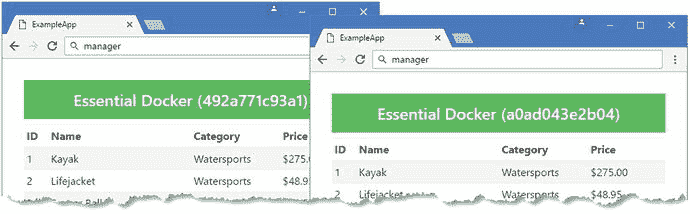

# 七、DockerSwarm

在前一章中，我演示了如何使用 Docker Compose 在一台服务器上管理一个复杂的应用。在这一章中，我将解释如何使用 Docker swarm 扩展应用，使它们可以在多个服务器上运行。

Docker 群是运行 Docker 引擎的服务器集群。群中的每个服务器被称为一个节点，有两种类型。管理器节点用于编排服务，这是容器化应用的理想状态，例如 ASP.NET Core MVC 应用或 MySQL。服务描述了应该创建多少容器以及集群中的哪些节点应该运行它们。这被称为服务的期望状态。

管理器节点通过管理另一种类型的节点(工作节点)来执行它们的编排。工作人员负责运行容器，交付服务指定的功能。当一个容器或一个工作节点出现故障时，管理器节点将自动检测到这种变化，并通过在其他节点上启动额外的容器来尝试返回到所需的状态。为了使这个过程更简单，Docker swarm 支持软件定义的网络，这些网络可以跨越集群中的节点，并在连接到网络的容器之间路由请求。表 [7-1](#Tab1) 将 Docker 群体放在上下文中。

表 7-1。

Putting Swarms in Context

<colgroup><col> <col></colgroup> 
| 问题 | 回答 |
| --- | --- |
| 这是什么？ | Docker swarm 是一个服务器集群，它以协调的方式运行应用中的容器。 |
| 为什么有用？ | swarm 允许应用扩展到单个服务器之外，使应用对单个容器的故障有更好的容忍度。 |
| 如何使用？ | 一个群由管理者和工作者节点组成。管理器节点负责管理应用中的容器，决定哪些工作器将运行它们，并确保它们正在运行。 |
| 有什么陷阱或限制吗？ | 从群中排除接收外部网络连接的组件(例如负载平衡器)是很重要的；否则，它们将受制于本章中描述的入口负载平衡功能。 |
| 有其他选择吗？ | Docker 群有几种替代方案。最成功的是最初由 Google 开发的 Kubernetes ( [`https://kubernetes.io`](https://kubernetes.io) )和 Mesos ( [`http://mesos.apache.org`](http://mesos.apache.org) )，后者是 Apache 软件基础项目。Kubernetes 和 Mesos 都支持使用 Docker 容器。尤其是 Kubernetes，它已经建立了良好的信誉并得到了广泛的支持。Docker 群组相对较新，但具有集成到 Docker 运行时的优势，并且有微软的支持，这对 ASP.NET Core MVC 项目很重要。 |

Swarms Require Linux

集群中节点的集群化是使用特定于 Linux 的特性实现的。在撰写本文时，只有 Linux 服务器可以集群在一起，以创建一个 swarm。Windows 和 macOS 都不支持集群功能，因此不能用于本章中的示例，尽管 Microsoft 计划为 Windows 引入所需的功能。

如果你没有自己的 Linux 服务器，你可以创建 Linux 虚拟机来看看 swarms 是如何工作的，要么在本地，要么在公共云上，如微软 Azure 或亚马逊 Web 服务。许多公共云服务也直接支持群集，如 Azure 容器服务。

或者，您可以使用 Docker Cloud，这是由 Docker 提供的一种服务，它协调公共云服务上 Docker 服务的部署和管理，包括 Azure 和 AWS。Docker 云服务是一种付费服务，需要在至少一个云提供商上拥有帐户。有可用的免费层，但是它们对您可以包含在群组中的节点数量有限制。

表 [7-2](#Tab2) 总结了本章内容。

表 7-2。

Chapter Summary

<colgroup><col> <col> <col></colgroup> 
| 问题 | 解决办法 | 列表 |
| --- | --- | --- |
| 创造一个蜂群 | 在 manager 节点上运行`docker swarm init`,然后在每个 workers 上运行输出中显示的命令 | 1–3 |
| 区分工作节点 | 给节点分配一个标签 | four |
| 在蜂群中建立一个网络 | 使用`docker network create`命令，并将`-d`参数设置为`overlay` | five |
| 向群集部署服务 | 使用`docker service create`命令 | 6, 11–14 |
| 检查服务 | 使用`docker service ps`或`docker service ls`命令 | 7, 15, 16, 22, 38 |
| 修改服务 | 使用`docker service update`命令 | 8–10, 23, 30, 33 |
| 移除服务 | 使用`docker service rm`命令 | Nineteen |
| 使用合成文件部署服务 | 使用`deploy`关键字在合成文件中描述服务，然后使用`docker stack deploy`命令 | 20, 21, 37 |
| 更改服务中容器的数量 | 使用`docker service scale`命令 | 26, 27, 34 |
| 更改群集中节点的状态 | 使用`docker node update`命令 | 28, 29 |
| 删除合成文件中描述的服务 | 使用`docker stack rm`命令 | Thirty-five |
| 在集群中的每个节点上部署一个服务容器 | 在合成文件中将`mode`设置为`global` | Thirty-six |

## 为本章做准备

本章依赖于在第 [3](3.html) 章中创建的`ExampleApp` MVC 项目，并在之后的章节中进行了修改。如果您不想完成创建示例的过程，您可以将该项目作为本书附带的免费源代码下载的一部分。请参见本书的`apress.com`页。

为了确保与前面章节中的例子没有冲突，运行清单 [7-1](#Par10) 中所示的命令来删除 Docker 容器、网络和卷。忽略这些命令产生的任何错误或警告。

```cs
docker rm -f $(docker ps -aq)
docker network rm $(docker network ls -q)
docker volume rm $(docker volume ls -q)
Listing 7-1.Removing the Containers, Networks, and Volumes

```

## 准备蜂群

在这一章中，我创建了一个包含五个节点或服务器的群。使用 swarm 意味着按名称引用集群中的服务器，为了使示例更容易理解，表 [7-3](#Tab3) 中描述了这些服务器。我为我的集群选择的配置对于小型集群来说是典型的。随着工作节点数量的增加，群应该包括额外的管理节点。

表 7-3。

The Hosts in the Example Swarm

<colgroup><col> <col></colgroup> 
| 名字 | 描述 |
| --- | --- |
| `manager` | 这是管理节点，它将负责协调群中的服务。这也是我复制包含示例应用和配置文件的`ExampleApp`文件夹的地方，也是本章中几乎所有命令运行的地方。这个服务器还将运行负载平衡器，它将接收 HTTP 请求并将它们分发到运行 MVC 应用的容器。 |
| `dbhost` | 这是一个工作节点，将专门用于运行 MySQL 容器。 |
| `worker1` | 这是一个将运行 MVC 应用容器的工作节点。 |
| `worker2` | 这是一个将运行 MVC 应用容器的工作节点。 |
| `worker3` | 这是一个将运行 MVC 应用容器的工作节点。 |

Note

我的群中的`manager`节点运行 Ubuntu。工作节点都运行 CoreOS Container Linux，这是一个轻量级的 Linux 发行版，专门用于运行应用容器，并且包括 Docker 作为其标准构建的一部分。CoreOS 受到主要云平台的支持，包括 Microsoft Azure、Amazon Web Services 和 Google Cloud，它是与 Docker swarms 一起工作的一个很好的目标操作系统。详见 [`http://coreos.com`](http://coreos.com) 。

### 创造蜂群

在管理节点上创建一个群，该节点生成一个密钥，然后工人可以使用该密钥加入该群。在管理节点上运行清单 [7-2](#Par14) 中所示的命令来创建一个群。

```cs
docker swarm init
Listing 7-2.Creating a Swarm

```

输出为您提供了将其他节点与群相关联的指令，您必须在群中的每个节点上运行的命令以粗体标记。

```cs
Swarm initialized: current node (u9np4ffl3aqao9c3c2bnuzgqm) is now a manager.

To add a worker to this swarm, run the following command:

docker swarm join \

    --token SWMTKN-1-61tskndg374fkvoa7fl0c8d57w2zvku9hzvqpfmojqhw51dlj9-c1cwiu06s4bfjcj0ekf9lh8uv \

    172.16.0.5:2377

To add a manager to this swarm, run 'docker swarm join-token manager' and follow the instructions.

```

根据 manager 节点的配置，您将看到不同的令牌和不同的网络值或网络地址格式。对集群中的每个工人运行输出中指示的命令。当该命令成功运行时，您将看到每个工作线程上显示以下消息:

```cs
...
This node joined a swarm as a worker
...

```

这是在工作节点上运行的唯一命令。一旦一个节点成为群的一部分，就可以使用管理器节点对其进行控制。本章剩余的所有示例都是在 manager 节点上执行的。

当您将所有节点添加到集群中时，在管理器上运行清单 [7-3](#Par21) 中的命令来检查集群。

```cs
docker node ls
Listing 7-3.Examining the Nodes in the Swarm

```

该命令的输出将显示群中的所有节点(星号表示您正在处理的节点)。

```cs
ID                           HOSTNAME  STATUS  AVAILABILITY  MANAGER STATUS
136uyxxgnldhurrgtj2o9cr0h *  manager   Ready   Active        Leader
e7wwq0oghzx16g9jkz9642nws    dbhost    Ready   Active
gmpyip1ms88kiu5inlwytz2qd    worker2   Ready   Active
o479m45qwi6vlq8pmgas21e96    worker3   Ready   Active
yl9ajlaku5du3hpmsbaf33dyh    worker1   Ready   Active

```

Tip

如果你想离开一个蜂群，那么在节点上运行`docker swarm leave`命令。对于管理器节点，使用`docker swarm leave --force`命令。

### 标记群体节点

群中的节点可以被分配标签，用来控制它们运行的容器的类型。对于这个例子，我将使用标签来区分负责运行数据库的节点和负责 MVC 应用的节点。在管理节点上运行清单 [7-4](#Par26) 中所示的命令，将标签分配给群中的工作节点，给它们分配`type`标签，并将其值设置为`mvc`。标签是任意的，可以以任何有助于理解你的群和其上运行的应用的方式分配:我在这里使用的`type`标签和值`mvc`对 Docker 没有特殊的意义。

```cs
docker node update --label-add type=mvc worker1
docker node update --label-add type=mvc worker2
docker node update --label-add type=mvc worker3
Listing 7-4.Assigning Labels to the Nodes in the Swarm

```

## 在群集上手动部署服务

使用 swarm 最简单的方法是在一个组合文件中描述应用，如“使用组合文件部署到 Swarm”一节中所示。但是，要了解幕后发生了什么，手动完成部署应用的过程会有所帮助，尽管这是一个需要非常注意细节才能正确键入复杂命令的过程。(由于这个原因，你应该做的只是理解蜂群如何工作，而不是在生产中。)

### 创建软件定义的网络

Docker 支持连接群中节点的软件定义网络，允许容器在群中无缝通信。要为示例应用创建网络，请在 manager 节点上运行清单 [7-5](#Par29) 中所示的命令。

```cs
docker network create -d overlay swarm_backend
Listing 7-5.Creating the Software-Defined Networks

```

`-d`参数指定了软件定义的网络的类型，当创建一个将跨越群中的服务器的网络时，该参数被设置为`overlay`。我在网络名前面加上了`swarm_`，以区别于前面的例子；这不是真实项目的要求。

Tip

本例中只有一个网络，因为负载平衡器和 MVC 应用之间的通信将发生在集群之外，如“创建负载平衡器”一节所述。

清单 [7-5](#Par29) 中的命令的作用是创建一个软件定义的网络，将群中的所有节点连接在一起，如图 [7-1](#Fig1) 所示。


图 7-1。

Creating a swarm network

### 创建数据库服务

在集群中部署和配置数据库可能会很棘手，因为数据库的性质与集群的性质有些相反。最能利用 swarm 特性的服务是那些可以通过启动新容器轻松复制的服务，以及那些可以在集群中的节点之间轻松移动的服务。

数据库不太适合这种模型:在一个应用中往往有少量的数据库服务(通常只有一个实例)，它们依赖于不容易传输到集群中其他节点的数据文件，并且可能有大量的初始化和关闭过程来保持数据完整性。

出于这些原因，您可能更喜欢在 swarm 之外设置您的数据库服务器，并配置您的 MVC 应用容器，以便通过连接您的服务器的物理网络进行查询。因为这是一本关于 Docker 的书，所以我将演示如何在 swarm 集群中部署数据库，即使服务中只有一个容器，并且它将被部署到一个特定的节点。这将让我演示一些有用的 Docker 特性，尽管它并不适合所有项目。

在 manager 节点上运行清单 [7-6](#Par37) 中所示的命令来创建 MySQL 服务。(在一行中输入命令。)

```cs
docker service create --name mysql
    --mount type=volume,source=productdata,destination=/var/lib/mysql
    --constraint "node.hostname == dbhost" --replicas 1 --network swarm_backend
    -e MYSQL_ROOT_PASSWORD=mysecret -e bind-address=0.0.0.0 mysql:8.0.0
Listing 7-6.Creating the Database Service

```

使用`docker service create`命令创建服务，参数告诉 Docker 应该如何部署服务。对于 MySQL，我想使用表 [7-4](#Tab4) 中描述的参数，在`dbhost` swarm 节点上创建一个具有持久数据量的容器。

表 7-4。

The Arguments Used to Create the MySQL Service

<colgroup><col> <col></colgroup> 
| 名字 | 描述 |
| --- | --- |
| `--name` | 该参数设置服务的名称，在本例中为`mysql`。 |
| `--mount` | 此参数用于指定服务创建的容器将使用的卷。在本例中，名为`productdata`的卷将用于为`/var/lib/sql`目录提供内容。 |
| `--constraint` | 该参数用于限制群中服务容器可以运行的节点，如“使用群约束”侧栏中所述。在这个例子中，这个服务的容器只能在主机名为`dbhost`的节点上运行。 |
| `--replicas` | 此参数用于指定应该为此服务运行的容器的所需数量。在这个例子中，指定了一个容器，这对于数据库来说是典型的。 |
| `--network` | 此参数用于指定为此服务创建的容器将附加到的软件定义的网络。在本例中，容器将连接到`swarm_backend`网络。 |
| `-e` | 此参数用于指定环境变量，这些变量将用于配置为此服务创建的容器。这个例子使用了在第 [5](5.html) 章中介绍的相同的 MySQL 变量。 |

卷在群集中的处理方式不同，必须小心。清单 [7-6](#Par37) 中使用的`--mount`参数将创建一个名为`productdata`的新卷，并将其用于服务中指定的容器。但是该卷特定于服务启动容器的群节点，并且如果容器被停止并移动到群中的另一个节点，该卷将不会迁移。

清单 [7-6](#Par37) 中命令的约束意味着管理器只能通过在`dbhost`节点上创建一个容器来实现`mysql`服务的期望状态。只指定了一个副本，这意味着单个数据库容器在`dbhost`上启动，连接到`swarm_backend`网络，如图 [7-2](#Fig2) 所示。


图 7-2。

Starting the database service

启动数据库服务可能需要一段时间，因为映像是从 Docker Hub 下载到 worker 节点的。通过在 manager 节点上运行清单 [7-7](#Par42) 中所示的命令来跟踪服务的进度。

```cs
docker service ps mysql
Listing 7-7.Monitoring a Docker Service

```

`docker service ps`命令列出了服务群中正在运行的容器。在准备服务时，您将看到如下输出:

```cs
...
ID            NAME     IMAGE        NODE    DESIRED STATE  CURRENT STATE
wzly7bxjxaqg  mysql.1  mysql:8.0.0  dbhost  Running        Preparing

...

```

`DESIRED STATE`列显示 Docker 正在为容器工作的状态，而`CURRENT STATE`列显示它的进展情况。一旦容器启动，`docker service ps`命令的输出将显示容器处于目标状态，如下所示:

```cs
...
ID            NAME     IMAGE        NODE    DESIRED STATE  CURRENT STATE
wzly7bxjxaqg  mysql.1  mysql:8.0.0  dbhost  Running        Running

...

```

Using Swarm Constraints

大多数真实的项目将被部署到集群中，其中一些节点具有特定的角色，例如运行数据库，这通常是因为它们拥有更强大或更专业的硬件。

当您将服务部署到群中时，您可以通过指定约束来控制哪些节点将被分配容器。管理器将只把容器分配给满足为服务指定的约束的节点。

有几种不同的方法可以约束服务。首先，它们可以部署到特定的节点上，使用其主机名进行标识。这是我对清单 [7-6](#Par37) 中的数据库采用的方法:

```cs
...
--constraint "node.hostname == dbhost"
...

```

如果您希望部署一个服务，使其仅在特定类型的节点上运行，则可以使用如下约束:

```cs
...
--constraint "node.role == manager"
...

```

您还可以将部署限制在已经分配了特定标签的节点上。我给清单 [7-4](#Par26) 中的三个 worker 节点分配了标签，并且在为清单 [7-14](#Par84) 中的 MVC 应用部署服务时使用了这个标签，使用了这样一个约束:

```cs
...
--constraint "node.labels.type==mvc"
...

```

标签是约束服务最灵活的方式，因为你可以把你需要的任何标签分配给群中的任何标签。

#### 准备数据库

当我在第 6 章中使用 Docker Compose 文件描述应用时，我能够包含一个专用于初始化数据库的容器，之后它将退出。在蜂群中安排这种设置是可能的，但是有一个更有趣的特性可以提供对蜂群如何工作的有用的洞察。为了准备数据库，我将临时映射数据库的端口 3306，以便可以通过主机操作系统访问它，并使用它来执行初始化。请容忍我；这比听起来更有趣。

在 manager 节点上运行清单 [7-8](#Par58) 中所示的命令来更新数据库服务。(该命令在 manager 节点上运行，即使容器在 worker 上运行。请记住，manager 节点总是用于配置集群上运行的服务。)

```cs
docker service update --publish-add 3306:3306 mysql
Listing 7-8.Updating the Database Service

```

`docker service update`命令用于在创建服务后更改服务的配置。您几乎可以更改服务的任何方面，包括使用`--publish-add`参数定义新的映射端口。这个命令使端口 3306 在群组之外对`mysql`服务可用。Docker 在整个集群中应用更改，确保作为服务一部分的所有容器的一致性。

当您从服务中公开一个端口时，Docker 使用一种称为入口负载平衡的功能，将它映射到群中所有节点上的主机操作系统。这意味着在群中的任何节点上接收到的对端口 3306 的任何请求都将被 Docker 接收，并被发送到服务中其端口被映射的容器之一。

对于`mysql`服务，只有一个容器，它运行在`dbhost`节点上，因此任何发送到`manager`、`worker1`、`worker2`、`worker3`和`dbhost`节点上端口 3306 的请求都将由 MySQL 在运行在`dbhost`节点上的容器内的端口 3306 上接收。当一个服务中有多个容器时，Docker 将对请求进行负载平衡，以便它们在容器之间进行分配。

入口负载平衡功能简化了准备数据库的过程。运行管理器节点上的`ExampleApp`文件夹中的清单 [7-9](#Par63) 中所示的命令。

```cs
dotnet restore
dotnet run --INITDB=true
Listing 7-9.Preparing the Database in the Swarm

```

当。NET 应用运行时，`INITDB`参数选择数据库初始化模式，而不是启动 ASP.NET Core。因为群中的所有节点都将端口 3306 映射到数据库服务，所以使用哪个主机名来配置数据库并不重要。当没有提供其他主机名时，应用默认为`localhost`，这意味着来自实体框架核心的连接被连接到管理器节点上的端口 3306，并且 swarm 确保它被引导到`dbhost`节点上的端口 3306，以便它可以被 MySQL 接收，如图 [7-3](#Fig3) 所示。


图 7-3。

Using ingress load balancing to prepare the database

数据库准备应用连接到集群中的哪个主机并不重要，因为对任何节点上端口 3306 的任何请求都将被引导到在`dbhost`上运行的容器，从而确保数据库为应用做好了正确的准备。换句话说，发送到`manager`节点上端口 3306 的连接实际上与发送到`dbhost`节点上端口 3306 的连接相同。

该应用将产生以下结果，显示已经应用数据库迁移来创建模式，并且已经添加了种子数据:

```cs
...
Preparing Database...
Applying Migrations...
Creating Seed Data...
Database Preparation Complete
...

```

Tip

如果您在使用`dotnet run`命令时看到一个错误，那么等待几分钟，让 Docker 有时间更新服务，以便端口 3306 可用，然后重试。如果您看到一个错误，告诉您`Products`表已经存在，那么您可能已经初始化了数据库:实体框架核心迁移只需应用一次。如果想重复初始化，删除`dbhost` worker 节点上的`productdata`卷，重启`mysql`服务，暴露端口 3306，再次运行清单 [7-9](#Par63) 中的命令。

准备好数据库后，在管理器节点上运行清单 [7-10](#Par70) 中所示的命令，禁用端口 3306 的入口负载平衡，以便数据库恢复为只能通过`swarm_backend`软件定义的网络访问。

```cs
docker service update --publish-rm 3306:3306 mysql
Listing 7-10.Disabling the Port Mapping

```

### 创建 MVC 应用服务

MVC 应用比数据库更适合部署在集群中:应用是自包含的，哪个节点运行应用并不重要，并且可以创建 MVC 应用的多个实例而不会相互冲突。

群中的管理节点不会将服务所需的映像分发到工作节点，这意味着用于创建服务的映像必须发布到存储库，如 Docker Hub，以便群中的节点可以获得创建容器所需的数据。

在管理节点的`ExampleApp`文件夹中运行清单 [7-11](#Par75) 中所示的命令，为应用的部署做准备。

```cs
dotnet publish --framework netcoreapp1.1 --configuration Release --output dist
docker build . -t apress/exampleapp:swarm-1.0 -f Dockerfile
Listing 7-11.Preparing the MVC Application for Deployment as a Service

```

您需要更改由`docker build`命令创建的映像的名称，用您的 Docker Hub 帐户替换`apress`。所以，如果你的账户名是`bobsmith`，那么你的图片标签应该是`bobsmith/exampleapp:swarm-1.0`。

`dotnet publish`命令确保最近对 MVC 应用所做的更改将包含在由`docker build`命令创建的 Docker 映像中。

MVC 应用映像的标签包含一个变体，即`swarm-1.0`。(您不必在映像标签中包含`swarm`。我这样做是为了让这个例子中的映像可以与前面章节中的映像共存。)

Tip

在创建服务时使用特定版本的映像总是一个好主意，而不是依赖于`:latest`版本，该版本在应用的生命周期中可能会发生意外的变化。在本章的后面，我将解释如何升级服务中使用的应用，这也需要一个带有版本的映像标签。

在`manager`节点的`ExampleApp`文件夹中运行清单 [7-12](#Par80) 中所示的命令，使用您在第 [4 章](4.html)中创建的凭证向 Docker Hub 进行认证。

```cs
docker login -u <yourUsername> -p <yourPassword>
Listing 7-12.Authenticating with Docker Hub

```

在管理器节点上运行清单 [7-13](#Par82) 中所示的命令，将映像推送到存储库。不要忘记更改`docker push`命令的映像名称，用您的 Docker Hub 帐户替换`apress`。

```cs
docker push apress/exampleapp:swarm-1.0
Listing 7-13.Pushing the MVC Image to the Repository

```

一旦映像被推送到存储库，在 manager 节点上运行清单 [7-14](#Par84) 中所示的命令，为 MVC 应用创建服务。在一行中输入命令。

```cs
docker service create --name mvcapp --constraint "node.labels.type==mvc"
    --replicas 5 --network swarm_backend -p 3000:80
    -e DBHOST=mysql apress/exampleapp:swarm-1.0
Listing 7-14.Creating the MVC Application Service

```

这个命令告诉 Docker 为 MVC 应用创建一个由五个容器组成的服务，这个服务只能在分配了值为`mvc`的`type`标签的节点上运行。对服务中容器的访问将通过使用`-p`参数发布的端口进行，该参数配置前面部分描述的入口负载平衡特性。

注意，`DBHOST`环境变量被设置为`mysql`，它为实体框架核心连接字符串指定数据库服务器的名称。在 swarm 中，Docker 创建主机名，为创建的每个服务提供对入口负载平衡特性的访问。这意味着实体框架核心可以打开到`mysql`的连接，并依靠 Docker 将该连接引导到提供`mysql`服务的容器之一。在`mysql`服务中只有一个容器，但是如果有多个容器可用，Docker 会在容器之间进行负载平衡。

表 [7-5](#Tab5) 中描述了用于创建 MVC 应用服务的一整套参数。

表 7-5。

The Arguments Used to Create the MVC Service

<colgroup><col> <col></colgroup> 
| 名字 | 描述 |
| --- | --- |
| `--name` | 该参数用于设置服务的名称，在本例中为`mvcapp`。 |
| `--constraint` | 该参数用于限制该服务的容器将运行的节点，如“使用群约束”侧栏中所述。对于这个例子，容器将只在清单 [7-4](#Par26) 中分配了`mvc`标签的节点上运行。 |
| `--replicas` | 此参数指定将为此服务运行的容器的所需数量。在这个例子中，指定了五个容器。 |
| `--network` | 此参数指定此服务的容器将连接到的软件定义的网络。对于这个例子，容器将被连接到`swarm_backend`服务。 |
| `-p` | 此参数将为此服务创建的容器内的端口暴露给入口负载平衡功能。发送到指定端口的请求将被定向到其中一个服务容器。在本例中，发送到集群中任何节点上端口 3000 的请求将被定向到其中一个`mvc`容器内的端口 80。 |
| `-e` | 该参数在为服务创建容器时设置一个环境变量。在这个例子中，设置变量`DBHOST`是为了提供实体框架核心需要连接到数据库的主机名。主机名被设置为数据库服务的名称，这利用了入口负载平衡特性。 |

Docker 需要一点时间来安装容器。您可以通过在管理器节点上运行清单 [7-15](#Par89) 中所示的命令来检查进度。

```cs
docker service ls
Listing 7-15.Checking Service Status

```

来自`docker service ls`命令的结果显示了已经在 swarm 上创建的服务的概要以及每个服务的状态。当 Docker 已经创建了 MVC 应用服务所需的所有容器时，`docker service ls`输出中的 REPLICAS 列将显示`5/5`，表明 Docker 已经创建了所有五个容器，并且已经达到了服务所需的状态，如下所示:

```cs
ID            NAME    MODE        REPLICAS  IMAGE

4kf7xsym2vc5  mvcapp  replicated  5/5       apress/exampleapp:swarm-1.0

j2v5gdqzu1di  mysql   replicated  1/1       mysql:8.0.0

```

Docker 负责将服务所需的容器分配给 worker 节点。在管理器上运行清单 [7-16](#Par93) 中所示的命令，查看服务内容器中的哪些节点已经被部署到。

```cs
docker service ps mvcapp
Listing 7-16.Examining the Containers in a Service

```

`docker service ps`命令产生一个服务中运行的所有容器的列表。以下是我的设置的输出，其格式适合页面，并且只显示了最有用的列:

```cs
ID             NAME      NODE     DESIRED STATE  CURRENT STATE
7jd1yop74mxfy  mvcapp.1  worker1  Running        Running
cse2cyutpvxh9  mvcapp.2  worker2  Running        Running
5r9y800jugey8  mvcapp.3  worker1  Running        Running
cktdzf0ypzcpt  mvcapp.4  worker3  Running        Running
5esdl2d3jd1ee  mvcapp.5  worker2  Running        Running

```

在这个例子中，有五个容器在三个 worker 上运行，这意味着一些 worker 节点正在运行多个容器，如图 [7-4](#Fig4) 所示。


图 7-4。

Deploying the ASP.NET Core MVC application service

如果您重新启动一个工作节点，断开它与网络的连接，或者只是停止一个工作节点上的容器，swarm manager 将通过在其他节点上创建额外的容器来使服务返回到它所期望的状态。

#### 测试 MVC 应用服务

MVC 应用服务的配置包括一个端口映射，这样在集群中任何节点的端口 3000 上接收到的 HTTP 请求将被发送到 MVC 容器之一的端口 80。由于有多个 MVC 容器，入口负载平衡特性将在它们之间分配请求。

您可以通过打开一个新的浏览器窗口并在任何群节点(包括 manager 节点)上请求端口 3000 的 URL 来查看请求是如何分发的。我的设置里的网址是`http://manager:3000`。继续重新加载页面，你会看到响应中包含的容器名称会改变，如图 [7-5](#Fig5) 所示。Docker 对请求如何分布不做任何承诺，在看到不同的容器名之前，您可能需要重新加载页面几次。如果您看不到名称有任何变化，请等待几分钟并重新加载页面，尝试启动第二个浏览器，或者从不同的 IP 地址发出请求。


图 7-5。

Testing the MVC service through the mesh routing feature

### 创建负载平衡器

尽管您可以依靠入口负载平衡特性来处理来自用户的 HTTP 请求，但惯例是部署一个负载平衡器，以便从外部世界到应用只有一个入口点。

重要的是不要将负载平衡器部署为群中的服务，因为这将意味着 Docker 入口负载平衡系统将从外部世界接收 HTTP 请求，然后通过软件定义的网络将它们分发到一个或多个容器，这将使用入口负载平衡来定位 MVC 容器之一。

相反，我将在 manager 节点上的一个单独的容器中运行我在前面的示例中使用的 HAProxy 应用。这个容器将使用映射到主机操作系统的常规端口来接收 HTTP 请求，并通过 swarm mesh 网络将它们转发给 MVC 应用容器。清单 [7-17](#Par103) 显示了配置负载平衡器所需的对`haproxy.cfg`文件的更改。

```cs
defaults
    timeout connect 5000
    timeout client  50000
    timeout server  50000

frontend localnodes
    bind *:80
    mode http
    default_backend mvc

backend mvc
    mode http
    balance roundrobin
    server mvc1 manager:3000

Listing 7-17.Configuring the Load Balancer in the haproxy.cfg File

```

有很多方法可以配置负载平衡器，但是我使用的方法是将请求转发到本地机器上的入口负载平衡端口，这样 HAProxy 就不必配置工作节点的详细信息。在管理器节点上运行清单 [7-18](#Par105) 中所示的命令，创建一个新的负载平衡器容器，该容器使用清单 [7-17](#Par103) 中的配置文件。(在一行中输入命令。)

```cs
docker run -d --name loadbalancer
   -v "$(pwd)/haproxy.cfg:/usr/local/etc/haproxy/haproxy.cfg"
   -p 80:80 haproxy:1.7.0
Listing 7-18.Creating and Starting the Load Balancer Container

```

添加负载均衡器通过在集群外部创建一个容器来完成应用，该容器使用入口负载均衡特性在 MVC 容器之间进行分配，如图 [7-6](#Fig6) 所示。


图 7-6。

Completing the application

您可以通过使用浏览器请求 manager 节点上的端口 80 来测试应用，这意味着使用我的设置中的 URL `http://manager`。HTTP 请求通过管理节点上的端口 80 映射提供给 HAProxy 负载平衡器，然后它将请求定向到端口 3000，依靠入口负载平衡特性将请求分发到 MVC 应用容器。

重新加载网页将显示不同的 MVC 应用容器被用来处理请求，尽管您可能需要等待一会儿才能重新加载(或使用不同的浏览器)来看到如图 [7-7](#Fig7) 所示的变化。



图 7-7。

Making requests through a load balancer Tip

如果没有得到预期的结果，使用`docker logs loadbalancer`命令检查负载平衡器容器的输出是否有错误。解决问题，使用`docker rm -f loadbalancer`移除容器，并再次运行清单 [7-18](#Par105) 中的命令。

### 从集群中移除服务

要从集群中删除服务，请在管理器节点上运行清单 [7-19](#Par111) 中所示的命令。

```cs
docker service rm mvcapp
docker service rm mysql
docker rm -f loadbalancer
docker network rm swarm_backend
Listing 7-19.Removing Docker Services

```

## 使用合成文件部署到群组

虽然您可以使用上一节描述的命令将应用部署到 swarm，但是将信息包含在 compose 文件中并让 Docker 负责部署会更容易。在 manager 节点的`ExampleApp`文件夹中添加一个名为`docker-compose-swarm.yml`的文件，并添加清单 [7-20](#Par113) 所示的配置。

```cs
version: "3"

volumes:
  productdata_swarm:

networks:
  backend:

services:

  mysql:
    image: "mysql:8.0.0"
    volumes:
      - productdata_swarm:/var/lib/mysql
    networks:
      - backend
    environment:
      - MYSQL_ROOT_PASSWORD=mysecret
      - bind-address=0.0.0.0
    deploy:
        replicas: 1
        placement:
            constraints:
            - node.hostname == dbhost

  mvc:
    image: "apress/exampleapp:swarm-1.0"
    networks:
      - backend
    environment:
      - DBHOST=mysql
    ports:
      - 3000:80
    deploy:
        replicas: 5
        placement:
            constraints:
            - node.labels.type == mvc

Listing 7-20.The Contents of docker-compose-swarm.yml in the ExampleApp Folder

```

一个以群体为目标的组合文件使用`deploy`配置部分描述了服务的期望状态，如表 [7-6](#Tab6) 所述。

表 7-6。

The Deployment Configuration Options in the Compose File

<colgroup><col> <col></colgroup> 
| 名字 | 描述 |
| --- | --- |
| `deploy` | 此配置部分用于配置服务在集群上部署时所需的状态。 |
| `replicas` | 此设置用于指定一项服务需要多少个容器实例。在这个例子中，将有一个数据库容器和五个 ASP.NET Core MVC 应用容器。 |
| `placement` | 这个配置部分用于为服务配置容器的位置。 |
| `constraints` | 该设置指定了在群中定位容器的约束。在这个例子中，数据库容器将只在`dbhost`节点上运行，而 MVC 应用容器将在清单 [7-4](#Par26) 中标记的节点上运行。 |

将服务部署到群组时，一些 Docker 合成特性不受支持，例如`build`配置部分(服务必须使用映像)和`depend_on`设置。合成文件应该只包含那些您想要部署到集群的服务。例如，清单 [7-20](#Par113) 中的文件省略了数据库初始化和负载平衡器容器的细节，这些容器将在管理器节点上创建，在群集之外。

### 执行部署

在管理器节点上的`ExampleApp`文件夹中运行清单 [7-21](#Par117) 中所示的命令，以部署新合成文件中描述的服务。

```cs
docker stack deploy --compose-file docker-compose-swarm.yml exampleapp
Listing 7-21.Deploying Services from a Compose File

```

栈是 Docker 用来描述组成应用的服务集合的术语。`docker stack deploy`命令使用合成文件中的信息创建一个堆栈，使用表 [7-7](#Tab7) 中描述的参数。

表 7-7。

The Arguments Used for the Docker Stack Deploy Command

<colgroup><col> <col></colgroup> 
| 名字 | 描述 |
| --- | --- |
| `--compose-file` | `--compose-file`参数指定包含堆栈中服务细节的合成文件。也可以使用另一种描述文件，称为 bundle。 |
| `exampleapp` | `docker stack deploy`命令的最后一个参数是将分配给堆栈的名称，该名称用于为堆栈创建的容器、卷和软件定义的网络的名称加前缀。 |

当 Docker 处理合成文件时，它将创建应用需要的组件，产生如下输出:

```cs
...
Creating network exampleapp_backend
Creating service exampleapp_mvc
Creating service exampleapp_mysql
...

```

软件定义的网络以及数据库和 MVC 应用的容器将会启动。本章前面描述的`docker service`命令可以用来检查已经创建的服务。在管理器节点上运行清单 [7-22](#Par122) 中所示的命令。

```cs
docker service ls
docker service ps exampleapp_mvc
Listing 7-22.Inspecting the Services

```

命令列出了已经部署到集群的服务。第二个命令详细描述了为`exampleapp_mvc`服务创建的容器。服务名结合了清单 [7-21](#Par117) 中的`docker stack deploy`命令的最后一个参数和清单 [7-20](#Par113) 中的组合文件中定义的服务名。

### 准备数据库

准备数据库的过程没有改变。运行清单 [7-23](#Par125) 中的命令，通过入口负载平衡器暴露端口 3306，以便可以在合成文件中定义的软件定义网络之外访问数据库。

```cs
docker service update --publish-add 3306:3306 exampleapp_mysql
Listing 7-23.Exposing the Database Port

```

给 Docker 一点时间来执行更新，然后运行 manager 节点的`ExampleApp`文件夹中的清单 [7-24](#Par127) 中所示的命令，以应用实体框架核心迁移并创建种子数据。(如果出现数据库连接错误，请稍等片刻，然后重试。)

```cs
dotnet run --INITDB=true
Listing 7-24.Initializing the Database

```

### 创建部署负载平衡器

最后一步是创建负载均衡器，由于本章前面所述的原因，它位于集群之外。运行管理器节点的`ExampleApp`文件夹中清单 [7-25](#Par129) 中所示的命令来创建负载平衡器容器。这个容器不是集群的一部分，但是依赖于入口负载平衡特性来将 HTTP 请求分发到 MVC 应用容器。(在一行中输入命令。)

```cs
docker run -d --name stack_loadbalancer
  -v "$(pwd)/haproxy.cfg:/usr/local/etc/haproxy/haproxy.cfg" -p 80:80 haproxy:1.7.0
Listing 7-25.Creating the Load Balancer

```

负载平衡器启动后，您可以通过打开一个新的浏览器窗口并请求 manager 节点上的端口 80 来测试应用。对我来说，这意味着网址是`http://manager`。应用的配置与手动创建每个组件时是一样的，但是使用合成文件简化了用于部署的命令。

## 管理蜂群

在某种程度上，一个群是自我管理的，因为当一个容器或一个节点崩溃时，管理器将试图创建额外的容器来返回到服务的期望状态。即便如此，有时你会想要改变一个群体的行为方式，你可以使用下面章节中描述的特性来实现。

### 扩展服务

对服务最常见的更改之一是改变容器的数量，以更好地适应应用的工作负载。在 manager 节点上运行清单 [7-26](#Par133) 中所示的命令，以改变 MVC 应用服务中的容器数量。

```cs
docker service scale exampleapp_mvc=3
Listing 7-26.Changing the Number of Containers

```

`docker service scale`命令用于改变服务的期望状态。这个命令告诉 Docker 将`mvc`服务中的容器数量减少到 3 个。更改需要一段时间才能生效，但是一旦 Docker 调整了服务，就可以通过运行`docker service ls`命令看到新的配置，该命令将产生如下响应:

```cs
ID            NAME              MODE        REPLICAS  IMAGE
41sdv2rpppyr  exampleapp_mysql  replicated  1/1       mysql:8.0.0

mchxy13rn37z  exampleapp_mvc    replicated  3/3       apress/exampleapp:swarm-1.0

```

在 manager 节点上运行清单 [7-27](#Par137) 中所示的命令，将服务恢复到其最初的容器数量。

```cs
docker service scale exampleapp_mvc=5
Listing 7-27.Returning to the Original Scale

```

### 使节点停止服务

有时候你需要从集群中取出一个节点，也许是为了执行升级或者其他类型的维护。您可以只断开节点，让管理器检测变化并重新平衡服务，但更有序的方法是耗尽群中的一个节点。清空一个节点会使其停止服务，并导致管理器将其容器重新分发到其他节点，此时可以在不中断服务交付的情况下将其关闭。在管理器节点上运行清单 [7-28](#Par139) 中所示的命令来清空`worker2`节点。

```cs
docker node update --availability drain worker2
Listing 7-28.Draining a Node

```

除了标记节点之外，如清单 [7-4](#Par26) 所示，`docker node update`命令可以和`--availability`参数一起使用来改变群中节点的状态。可用性有三种类型，如表 [7-8](#Tab8) 所述。

表 7-8。

The Swarm Node Availability Types

<colgroup><col> <col></colgroup> 
| 名字 | 描述 |
| --- | --- |
| `active` | 这是默认的可用性。管理器可以自由地向节点分配新的容器，任何现有的容器都可以无限期地继续运行。 |
| `pause` | 在这种模式下，节点上的现有容器将继续运行，但管理器不会分配任何新容器。 |
| `drain` | 在这种模式下，现有容器将被停止，管理器不会分配任何新容器。 |

`drain`模式使一个节点退出服务，这对于执行维护或者测试集群重新分配其工作负载的能力非常有用。运行`docker service ps exampleapp_mvc`命令，您将看到服务的状态是如何变化的。

```cs
ID             NAME                     NODE     DESIRED STATE  CURRENT STATE
7jd1yop74mxfy  exampleapp_mvcapp.1      worker1  Running        Running

2ejbexg6yezd9  exampleapp_mvcapp.2      worker1  Running        Running

cse2cyutpvxh9   \_ exampleapp_mvcapp.2  worker2  Shutdown       Shutdown

5r9y800jugey8  exampleapp_mvcapp.3      worker1  Running        Running
cktdzf0ypzcpt  exampleapp_mvcapp.4      worker3  Running        Running

6j8h32cikboe2  exampleapp_mvcapp.5      worker3  Running        Running

5esdl2d3jd1ee   \_ exampleapp_mvcapp.5  worker2  Shutdown       Shutdown

```

管理节点通过指示`worker1`和`worker3`节点启动额外的容器来响应群配置的变化。被清空的节点上的容器不会被删除，这意味着一旦服务器返回到`active`状态，它们可以再次被使用。在管理器节点上运行清单 [7-29](#Par144) 中所示的命令来重新激活该节点。

```cs
docker node update --availability active worker2
Listing 7-29.Activating a Node

```

当您重新激活一个节点时，管理器不会自动重新分发服务中的容器，只要它能够使用群中的剩余节点达到所需的状态。在管理器节点上运行清单 [7-30](#Par146) 中所示的命令，以强制容器的重新分发。

```cs
docker service update --force exampleapp_mvc
Listing 7-30.Forcing Redistribution of Containers

```

### 更新服务

您可以更新服务，将应用的新版本部署到 swarm 中。要创建一个可见的变化，改变 MVC 应用使用的 Razor 视图中的横幅，如清单 [7-31](#Par148) 所示。

```cs
@model IEnumerable<ExampleApp.Models.Product>
@{
    Layout = null;
}
<!DOCTYPE html>
<html>
<head>
    <meta name="viewport" content="width=device-width" />
    <title>ExampleApp</title>
    <link rel="stylesheet" href="∼/lib/bootstrap/dist/css/bootstrap.min.css" />
</head>
<body>
    <div class="m-1 p-1">
        <h4 class="bg-success text-xs-center p-1 text-white">

            Swarm: @ViewBag.Message

        </h4>

        <table class="table table-sm table-striped">
            <thead>
                <tr><th>ID</th><th>Name</th><th>Category</th><th>Price</th></tr>
            </thead>
            <tbody>
                @foreach (var p in Model) {
                    <tr>
                        <td>@p.ProductID</td>
                        <td>@p.Name</td>
                        <td>@p.Category</td>
                        <td>$@p.Price.ToString("F2")</td>
                    </tr>

                }
            </tbody>
        </table>
    </div>
</body>
</html>

Listing 7-31.Making a Visible Change in the Index.cshtml File in the ExampleApp/Views/Home Folder

```

保存对视图的更改，并在 manager 节点的`ExampleApp`文件夹中运行清单 [7-32](#Par150) 中所示的命令来发布应用，更新 MVC 应用映像，并将其推送到 Docker Hub。在推送新映像之前，您可能需要向 Docker Hub 验证自己的身份。不要忘记更改映像的名称，用您的 Docker Hub 帐户替换`apress`。

```cs
dotnet publish --framework netcoreapp1.1 --configuration Release --output dist
docker build . -t apress/exampleapp:swarm-1.1 -f Dockerfile
docker push apress/exampleapp:swarm-1.1
Listing 7-32.Publishing the MVC Application and Updating the Image

```

我已经标记了该映像，以表明这是该映像最初用于创建服务的较新版本。在 manager 节点上运行清单 [7-33](#Par152) 中所示的命令来升级 MVC 应用服务中的容器，以便它们使用新的映像。

```cs
docker service update --image apress/exampleapp:swarm-1.1 exampleapp_mvc
Listing 7-33.Updating a Service

```

`docker service update`命令的`--image`参数用于改变服务的映像。执行更新的方法是依次停止每个容器，应用更新，然后在移动到下一个容器之前再次启动它。Docker 需要一段时间来更新所有的容器。您可以通过运行`docker service ps exampleapp_mvc`命令来跟踪进度，该命令的输出包括服务中每个容器正在使用的映像。

Tip

如果您有很多容器需要更新，那么您可以通过使用`docker service update`命令的`--update-parallelism`参数来加速这个过程，指定应该停止服务并同时更新的容器的数量。但是，请记住，增加并发更新的数量会减少可用于处理用户请求的容器数量。

完成更改后，使用浏览器向负载均衡器发送 HTTP 请求，负载均衡器正在监听管理器节点上的端口 80。您将看到如图 [7-8](#Fig8) 所示的响应，这表明更新后的 MVC 应用已经用于处理请求。


图 7-8。

Upgrading a service

### 关闭服务

当使用 swarm 时，你通过告诉 Docker 将副本数量减少到零来停止服务。在 manager 节点上运行清单 [7-34](#Par157) 中所示的命令来缩小 MVC 应用服务的规模，这样就没有容器在运行了。

```cs
docker service scale exampleapp_mvc=0
Listing 7-34.Scaling Down Docker Services

```

Docker 将停下来，移走`example_mvcapp`服务的容器。所有容器停止可能需要一段时间，您可以使用`docker service ls`命令来监控这个过程。缩减服务不会删除容器，Docker 保留这些容器是为了加快将来再次扩展的过程。

要删除由合成文件描述的所有组件，从管理器节点的`ExampleApp`文件夹运行清单 [7-35](#Par160) 中所示的命令。

```cs
docker stack rm exampleapp
Listing 7-35.Removing a Docker Stack

```

## 创建全球服务

我之前创建的服务是复制的，这意味着我指定了每个服务所需的容器数量，并让管理器节点来决定如何在集群中部署容器。

您还可以创建全局服务，其中服务由一个运行在集群中每个节点上的容器组成。这比复制服务更可预测，因为您总是知道有多少容器以及它们在哪里运行，但是它提供的灵活性较小，因为容器的数量只能通过向群中添加额外的节点来增加。

Caution

不要错误地认为全局服务会让您绕过有状态应用的限制，这样您就可以使用负载平衡器将来自单个客户端的所有请求发送到同一个容器。全局服务中的容器仍然是 swarm 的一部分，这意味着发送到容器所公开的端口的 HTTP 请求是使用入口负载平衡来处理的。

要创建一个全局服务，在使用`docker service create`命令时将`--mode`参数设置为`global`，或者使用合成文件中的`mode`设置，如清单 [7-36](#Par165) 所示。

```cs
version: "3"

volumes:
  productdata_swarm:

networks:
  backend:

services:

  mysql:
    image: "mysql:8.0.0"
    volumes:
      - productdata_swarm:/var/lib/mysql
    networks:
      - backend
    environment:
      - MYSQL_ROOT_PASSWORD=mysecret
      - bind-address=0.0.0.0
    deploy:
        replicas: 1
        placement:
            constraints:
            - node.hostname == dbhost

  mvc:
    image: "apress/exampleapp:swarm-1.0"
    networks:
      - backend
    environment:
      - DBHOST=mysql
    ports:
      - 3000:80
    deploy:
        mode: global

        placement:
            constraints:
            - node.labels.type == mvc

Listing 7-36.Creating a Global Service in the docker-compose-swarm.yml File in the ExampleApp Folder

```

`replicas`设置对全局服务没有影响:在满足约束条件的群中的每个节点上，将正好运行一个 MVC 容器。从管理节点上的`ExampleApp`文件夹中运行清单 [7-37](#Par167) 中的命令，以部署组合文件中描述的服务。

```cs
docker stack deploy --compose-file docker-compose-swarm.yml exampleapp
Listing 7-37.Deploying the Application

```

您可以通过在 manager 节点上运行清单 [7-38](#Par169) 中所示的命令来查看容器列表。

```cs
docker service ps exampleapp_mvc
Listing 7-38.Inspecting the Global Service

```

输出显示容器正在满足约束的所有三个节点上运行。

```cs
ID            NAME                 IMAGE                        NODE     STATE
rwq13zt1pm0p  exampleapp_mvc.p4ar  apress/exampleapp:swarm-1.0  worker3  Running
ojfwoez0nyvy  exampleapp_mvc.wn4u  apress/exampleapp:swarm-1.0  worker2  Running
qllo5a0hzy4o  exampleapp_mvc.wked  apress/exampleapp:swarm-1.0  worker1  Running

```

在 manager 节点上运行`docker service ls`命令来检查服务，您会看到`mvcapp`服务被标记为全局服务，如下所示:

```cs
ID            NAME              MODE        REPLICAS  IMAGE
7vds0gsxjxv9  exampleapp_mysql  replicated  1/1       mysql:8.0.0

wd8ouiyu537q  exampleapp_mvc    global      3/3       apress/exampleapp:swarm-1.0

```

## 摘要

在本章中，我向您展示了如何将运行 Docker 的 Linux 服务器集群在一起，形成一个集群。我演示了如何将示例应用部署到 swarm 中，swarm 如何在它们包含的容器之间平衡请求负载，以及如何在应用部署后管理 swarm。在下一章，我将解释如何使用 Docker 来创建一个容器化的开发环境。