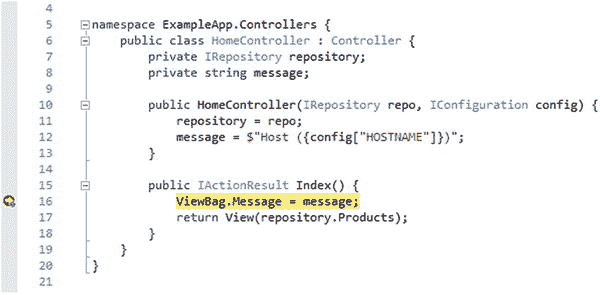

# 八、容器化开发

Docker 在生产中解决的许多问题也发生在开发过程中，特别是对于那些从事包含多个组件的项目的大型团队。很难确保每个开发人员都有正确版本的工具链、运行时库、第三方包、数据库服务器和模式，并且它们都是一致设置的。再加上操作系统和补丁级别的差异，这就成了一项不可能完成的任务。

在开发环境中使用容器为开发过程带来了一致性和统一性，同时还允许个人开发人员自由定制他们的开发工具以适应他们的个人风格。事实上，容器化环境的吸引力之一是它只标准化重要的东西，而不试图强迫每个开发人员以相同的方式工作。

在一本书的结尾看容器化开发可能看起来很奇怪，但是只有当你理解了不同的特性是如何组合在一起的，才能解释 Docker 在开发过程中的使用。在这一章中，我将向你展示如何建立一个容器化的开发环境，以及如何调试一个运行在容器中的应用。表 [8-1](#Tab1) 将容器化开发放在上下文中。

表 8-1。

Putting Containerized Development in Context

<colgroup><col> <col></colgroup> 
| 问题 | 回答 |
| --- | --- |
| 这是什么？ | 容器化开发将开发环境的一部分移到 Docker 容器中。 |
| 为什么有用？ | 容器化开发使用。NET 核心工具运行在一个容器内，这意味着它们将与生产环境保持一致，并在开发人员之间保持一致。 |
| 如何使用？ | 包含的基映像。NET 核心软件开发工具包用于创建映像。从该映像创建一个容器，使用 Docker 卷来提供对项目文件的访问，这些文件存储在主机操作系统上，以便可以对它们进行定期修订控制。 |
| 有什么陷阱或限制吗？ | 准备容器化项目需要一些额外的配置。 |
| 有其他选择吗？ | 您不必为了使用 Docker 部署项目而将开发容器化。 |

表 [8-2](#Tab2) 总结了本章内容。

表 8-2。

Chapter Summary

<colgroup><col> <col> <col></colgroup> 
| 问题 | 解决办法 | 列表 |
| --- | --- | --- |
| 在容器中构建项目 | 将项目配置为自动构建和运行，使用卷来访问项目文件 | 1–11 |
| 准备项目以便在容器中调试 | 创建并运行包含远程调试器的容器 | 12–17 |
| 使用 Visual Studio 2017 在容器中调试 | 创建一个 XML 配置文件，并使用它从命令窗口启动调试器 | 18–20 |
| 使用 Visual Studio 代码在容器中调试 | 使用`launch.json`文件配置调试器 | 21, 22 |

## 为本章做准备

本章依赖于在第 3 章中创建并在以后章节中修改的 ExampleApp MVC 项目。如果您不想完成创建示例的过程，您可以将该项目作为本书附带的免费源代码下载的一部分。详见`apress.com`。

为了确保与前面章节中的示例没有冲突，运行清单 [8-1](#Par7) 中所示的命令来删除 Docker 容器、网络和卷。忽略这些命令产生的任何错误或警告。

```cs
docker rm -f $(docker ps -aq)
docker network rm $(docker network ls -q)
docker volume rm $(docker volume ls -q)
Listing 8-1.Removing the Docker Components

```

如果你是一个 Linux 用户，并且在第 [7](7.html) 章中使用你的开发机器作为一个集群的管理者，运行清单 [8-2](#Par9) 中所示的命令。

```cs
docker stack rm exampleapp
docker swarm leave --force
Listing 8-2.Removing the Services and Leaving the Swarm

```

### 使用开发模式准备数据库

前面的章节使用了一系列技术为应用准备数据库，处理应用实体框架核心迁移和生成种子数据的需求。

这种情况在开发中更简单，因为没有可能丢失的生产数据。为此，修改`Startup`类，如清单 [8-3](#Par12) 所示，这样当应用在`Development`环境中启动时，数据库会自动准备好。

```cs
...
public void Configure(IApplicationBuilder app,
        IHostingEnvironment env, ILoggerFactory loggerFactory) {

    loggerFactory.AddConsole();
    app.UseDeveloperExceptionPage();
    app.UseStatusCodePages();
    app.UseStaticFiles();
    app.UseMvcWithDefaultRoute();

    if (env.IsDevelopment()) {

        SeedData.EnsurePopulated(app);

    }

}
...

Listing 8-3.Enabling Database Updates in the Startup.cs File in the ExampleApp Folder

```

## 了解容器化的 ASP.NET Core 发展

与前面章节中创建的部署容器相比，应用和数据的角色颠倒了。工具链——编译器、运行时、调试器——变成了应用并存在于容器中。数据文件是 ASP.NET Core MVC 项目文件，它存在于 Docker 卷的容器之外。用于开发容器的 Docker 卷使用来自主机操作系统的文件夹来提供容器内目录的内容。这类似于在前面章节中设置负载平衡器配置文件的方式，但是使用整个文件夹而不是单个文件。图 [8-1](#Fig1) 展示了在一个容器化的开发环境中，各个部分是如何组合在一起的。


图 8-1。

Containerized development

使用卷来挂载宿主文件夹意味着 ASP.NET Core MVC 项目文件可以像平常一样使用 Visual Studio 或 Visual Studio 代码进行编辑，然后使用。NET 核心编译器。开发容器还包括。NET 核心运行时，它可以执行应用，并通过到主机操作系统的端口映射来公开应用以供测试。可以使用常规的源代码控制工具(如 Git 或 Subversion)在容器之外管理项目文件，而工具和执行环境通过容器进行标准化，容器的 Docker 文件也可以置于版本控制之下。

## 建立容器化发展

容器化开发仍然是一个相对较新的想法，可能会有点尴尬，尤其是在调试方面。随着容器越来越广泛地被使用，容器化开发工具的质量将会提高，但是目前需要一些仔细的配置来创建开发环境并使其工作。在接下来的几节中，我将首先设置一个用于开发和测试 ASP.NET MVC 核心应用的容器，然后再做一点额外的工作，演示如何使用 Visual Studio 和 Visual Studio 代码调试器。

### 添加 DotNet Watcher 包

设置开发容器的第一个挑战是确保它反映了您对代码文件所做的更改。当它的一个 Razor 视图改变时，ASP.NET Core MVC 会立即响应，但不会检测到 C# 类中的变化。

`Microsoft.DotNet.Watcher.Tools`包用于从容器内部监控项目并重启。NET Core runtime，确保开发人员所做的更改在容器中得到反映。

将清单 [8-4](#Par19) 中所示的包添加到`ExampleApp.csproj`文件中。

```cs
<Project Sdk="Microsoft.NET.Sdk.Web">

  <PropertyGroup>
    <TargetFramework>netcoreapp1.1</TargetFramework>
  </PropertyGroup>

  <ItemGroup>
    <PackageReference Include="Microsoft.AspNetCore" Version="1.1.1" />
    <PackageReference Include="Microsoft.AspNetCore.Mvc" Version="1.1.2" />
    <PackageReference Include="Microsoft.AspNetCore.StaticFiles" Version="1.1.1" />
    <PackageReference Include="Microsoft.Extensions.Logging.Debug" Version="1.1.1" />
    <PackageReference Include="Microsoft.VisualStudio.Web.BrowserLink"
        Version="1.1.0" />
    <PackageReference Include="Microsoft.EntityFrameworkCore" Version="1.1.1" />
    <PackageReference Include="Microsoft.EntityFrameworkCore.Tools"
        Version="1.1.0" />
    <PackageReference Include="Pomelo.EntityFrameworkCore.MySql" Version="1.1.0" />
    <DotNetCliToolReference Include="Microsoft.EntityFrameworkCore.Tools.DotNet"
        Version="1.0.0" />
    <PackageReference Include="Microsoft.Extensions.Configuration.CommandLine"
        Version="1.1.1" />
    <DotNetCliToolReference Include="Microsoft.DotNet.Watcher.Tools"

         Version="1.0.0" />

  </ItemGroup>
</Project>

Listing 8-4.Adding a Package in the ExampleApp.csproj File in the ExampleApp Folder

```

此更改添加了适用于 1.1.1 版的 DotNet Watcher 包的版本。NET 核心和 ASP.NET Core，这是本书中的例子所需要的。

Containerizing a New Project

本章中的例子向你展示了如何为一个正在进行的项目创建一个容器化的开发环境，但是你也可以在开发过程的开始就创建一个容器。

为此，您需要在主机操作系统上创建一个项目，以便有一个`csproj`文件列出您需要的 NuGet 包。一旦有了`csproj`文件，就可以创建并启动容器，开始添加项目所需的 C# 和 Razor 文件。

如果您使用的是 Visual Studio，则可以使用“新建项目向导”来创建项目。如果您使用的是 Visual Studio 代码(或者您更喜欢使用命令行)，请使用下面的命令创建一个新项目，其中运行该命令的文件夹的名称用作项目的名称。

```cs
dotnet new mvc --language C# --auth None --framework netcoreapp1.1

```

创建项目后，打开新的命令提示符并导航到该项目。添加清单 [8-4](#Par19) 中所示的 DotNet Watcher 包以及您需要的任何其他包。然后你可以按照清单 [8-5](#Par29) 开始的过程进行。

一旦开发容器启动并运行，就可以使用 IDE 创建应用所需的数据模型、控制器和视图。

### 创建开发映像和合成文件

可以只使用 Docker 命令行工具来创建开发容器，但是这样做需要非常小心，以确保开发工具所需的配置设置是正确的。一种更可靠且有助于确保所有开发人员在相同环境下工作的方法是创建一个 Docker 文件，该文件与一个包含卷、软件定义的网络和应用所依赖的任何其他容器的 compose 文件结合使用。

在`ExampleApp`文件夹中创建一个名为`Dockerfile.dev`的文件，并添加清单 [8-5](#Par29) 中所示的命令设置。这个 Docker 文件将用于创建开发容器的映像。

```cs
FROM microsoft/aspnetcore-build:1.1.1

COPY node_modules/wait-for-it.sh/bin/wait-for-it /tools/wait-for-it.sh

RUN chmod +x /tools/wait-for-it.sh

ENV DBHOST=dev_mysql WAITHOST=dev_mysql WAITPORT=3306

ENV DOTNET_USE_POLLING_FILE_WATCHER=true

EXPOSE 80/tcp

VOLUME /app

WORKDIR /app

ENTRYPOINT dotnet restore \
  && /tools/wait-for-it.sh $WAITHOST:$WAITPORT --timeout=0 \
  && dotnet watch run --environment=Development

Listing 8-5.The Contents of the Dockerfile.dev File in the ExampleApp Folder

```

这个 Docker 文件的基本映像是`microsoft/aspnetcore-build:1.1.1`，它由微软提供，包含。NET 核心 SDK，而不仅仅是前几章中使用的映像中包含的运行时。这意味着编译器是可用的，这允许代码在容器内部编译。

创建容器时，`/app`文件夹的内容将使用 Docker 卷提供，并将作为使用 IDE 和。容器中的. NET 核心编译器和运行时。这是与前几章中的 Docker 文件的一个重要区别，后者用一个`COPY`命令将项目文件复制到容器文件系统的`/app`目录中。

Tip

DotNet Watcher 包要求在容器中使用时将`DOTNET_USE_POLLING_FILE_WATCHER`环境设置为`true`；否则，它将无法检测文件更改。

表 [8-3](#Tab3) 描述了开发 Docker 文件中使用的所有命令。

表 8-3。

The Commands in the Development Docker File

<colgroup><col> <col></colgroup> 
| 名字 | 描述 |
| --- | --- |
| `FROM` | 此命令指定基础映像，它包括。NET Core SDK，以便项目中的代码可以在容器内部编译。 |
| `COPY` | 这个命令将`wait-for-it`脚本复制到容器的文件系统中。前面的例子已经将文件复制到了`/app`目录，但是在这个例子中使用了`/tools`,因为一旦包含项目文件的卷在容器启动时被挂载，任何复制到`/app`的文件都将不可用。 |
| `RUN` | 这个命令执行 Linux `chmod`命令，以便在启动容器时可以执行`wait-for-it`脚本。 |
| `ENV` | 该命令设置容器中的环境变量。`DBHOST`变量为实体框架核心连接字符串设置数据库的名称。`WAITHOST`和`WAITPORT`变量被`wait-for-it`包用来确保数据库在。NET Core 运行时已启动。当在容器中使用点网监视器包时，`DOTNET_USE_POLLING_FILE_WATCHER`必须设置为`true`。 |
| `EXPOSE` | 这个命令公开了一个端口，这样容器内部的应用就可以接收网络请求。在此示例中，端口 80 是公开的，以便 ASP.NET Core Kestrel 服务器可以接收 HTTP 请求。 |
| `VOLUME` | 此命令用于指定卷将用于提供指定目录的内容。 |
| `WORKDIR` | 这个命令为容器设置工作目录。在这个例子中，工作目录被设置为`/app`，它将包含 ASP.NET Core MVC 项目文件。 |
| `ENTRYPOINT` | 这个命令告诉 Docker 在容器启动时执行什么。在本例中，`wait-for-it`脚本用于等待 MySQL 数据库准备好接收连接，然后使用 DotNet Watcher 包启动。NET 项目在`Development`环境中。 |

下一步是创建一个 Docker 合成文件，描述应用所需的整体环境。在`ExampleApp`文件夹中创建一个名为`docker-compose-dev.yml`的文件，并添加清单 [8-6](#Par35) 中所示的内容。

```cs
version: "3"

volumes:
  productdata:

networks:
  backend:

services:

  mysql:
    image: "mysql:8.0.0"
    volumes:
      - productdata:/var/lib/mysql
    networks:
      - backend
    environment:
      - MYSQL_ROOT_PASSWORD=mysecret
      - bind-address=0.0.0.0

  mvc:
    build:
      context: .
      dockerfile: Dockerfile.dev
    volumes:
      - .:/app
      - /app/obj
      - /app/bin
      - ∼/.nuget:/root/.nuget
      - /root/.nuget/packages/.tools
    ports:
      - 3000:80
    networks:
      - backend
    environment:
      - DBHOST=mysql
      - WAITHOST=mysql
    depends_on:
      - mysql

Listing 8-6.The Contents of the docker-compose-dev.yml File in the ExampleApp Folder

```

合成文件类似于用于生产的文件，只是做了一些更改以使开发更容易。MVC 应用将通过映射到主机操作系统的端口直接接收 HTTP 请求，而不使用负载平衡器。如果您想从前面的章节中重新创建环境，您可以添加另一个软件定义的网络和一个负载平衡器容器，但是对于大多数项目，在开发期间直接使用 MVC 容器就足够了。

清单 [8-6](#Par35) 中最显著的变化是在`mvc`服务的`volumes`部分。在前面的章节中，应用使用`dotnet publish`命令为部署做准备，然后使用 Docker 文件中的`COPY`命令复制到容器的文件系统中。这个过程不适合开发，在开发中，您希望看到代码更改的效果，而不必重新生成 Docker 映像和创建新的容器。Docker 文件中的第一个`volume`条目通过与容器共享本地目录并使其内容在`/app`文件夹中可用来解决这个问题，在那里它们将被编译并使用。NET Core SDK。

```cs
...
volumes:
  - .:/app

  - /app/obj

  - /app/bin

  - ∼/.nuget:/root/.nuget
  - /root/.nuget/packages/.tools
...

```

这意味着容器必须在`ExampleApp`文件夹中启动，以便第一个卷为开发容器提供它需要的文件。

但是，NuGet 工具包的`bin`和`obj`文件夹中添加了特定于平台的文件，因此第二个和第三个卷条目告诉 Docker 为这些目录创建新的卷。如果没有这些条目，应用要么在主机上工作，要么在容器中工作，但不能同时在两者上工作。

第二个音量设置共享当前用户主目录中的`.nuget/packages`文件夹。

```cs
...
volumes:
  - .:/app
  - /app/obj
  - /app/bin
  - ∼/.nuget:/root/.nuget

  - /root/.nuget/packages/.tools

...

```

这是使用`dotnet restore`命令安装 NuGet 包时用来存储它们的位置，与容器共享这个文件夹意味着容器可以使用您在主机操作系统上安装的包，这样您就不必每次创建新的开发容器时都使用`dotnet restore`。最后一个 volumes 条目为其中一个文件夹创建一个新卷，NuGet 会将 NuGet 工具包的特定于平台的文件放入其中。

为了快速参考，表 [8-4](#Tab4) 描述了合成文件中的开发特定设置。

表 8-4。

The Development-Specific Configuration Settings in the Compose File

<colgroup><col> <col></colgroup> 
| 名字 | 描述 |
| --- | --- |
| 港口 | 该设置将主机操作系统上的端口 3000 映射到 MVC 容器中的端口 80。这将允许 HTTP 请求直接发送到 MVC 容器，而不需要使用负载平衡器。 |
| 卷 | 该设置用于向开发容器提供对项目文件的访问，并允许它使用已经安装在主机操作系统上的 NuGet 包。 |

### 为发展课程做准备

通过运行`ExampleApp`文件夹中清单 [8-7](#Par46) 中所示的命令，确保应用所需的所有 NuGet 包在主机操作系统上都可用。

```cs
dotnet restore
Listing 8-7.Updating the NuGet Packages

```

使用 Docker 卷与开发容器共享主机操作系统的 NuGet 包是一种有用的技术，但是在启动开发容器之前，必须确保它们是最新的。然而，这种方法的优点是您不必在容器中恢复 NuGet 包。

一旦包更新完成，在`ExampleApp`文件夹中运行清单 [8-8](#Par50) 中所示的命令来处理开发合成文件并构建将用于创建运行。NET 核心开发工具和 MVC 应用。

```cs
docker-compose -f docker-compose-dev.yml -p dev build
Listing 8-8.Processing the Development Compose File

```

Note

如果您是 Windows 或 macOS 用户，您必须启用驱动器共享，如第 [5](5.html) 章所述，以便 Docker 可以与容器共享项目目录。

`-f`参数用于指定合成文件，没有它将使用生产文件。

`-p`参数用于覆盖将使用合成文件创建的映像、容器和网络名称的前缀。我已经指定了前缀`dev`，这确保我可以运行开发服务，而不会干扰我在前面章节中创建的生产服务(前缀为`exampleapp_`)。

Caution

本章其余部分的命令依赖于前缀`dev`。如果您在运行`docker-compose build`命令时使用了不同的前缀，那么您将需要在看到以`dev_`开头的名称所引用的 Docker 组件的任何地方进行修改。

### 开始开发会话

要开始开发，运行清单`ExampleApp`文件夹中的 [8-9](#Par55) 所示的命令来扩展`mvc`服务。

```cs
docker-compose -f docker-compose-dev.yml -p dev up mvc
Listing 8-9.Creating the Development Service

```

Docker 将处理合成文件，并按照`depends_on`设置来确定是否需要 MySQL 的容器，以及连接它们的软件定义的网络和存储数据库文件的卷。所有四个组件都将被创建，当 Docker 完成其工作并且 MySQL 经历其首次使用初始化过程时，您将看到以下输出:

```cs
...
Creating network "dev_backend" with the default driver
Creating volume "dev_productdata" with default driver
Creating dev_mysql_1
Creating dev_mvc_1
Attaching to dev_mvc_1
mvc_1    | wait-for-it.sh: waiting for mysql:3306 without a timeout
mvc_1    | wait-for-it.sh: mysql:3306 is available after 0 seconds
mvc_1    | watch : Started
mvc_1    | Starting ASP.NET...
mvc_1    | Hosting environment: Development
mvc_1    | Content root path: /app
mvc_1    | Now listening on: http://+:80
mvc_1    | Application started. Press Ctrl+C to shut down.
mvc_1    | Application is shutting down...
mvc_1    | watch : Exited
mvc_1    | watch : File changed: /app/Controllers/HomeController.cs
mvc_1    | watch : Started
mvc_1    | Starting ASP.NET...
mvc_1    | Hosting environment: Development
mvc_1    | Content root path: /app
mvc_1    | Now listening on: http://+:80
mvc_1    | Application started. Press Ctrl+C to shut down.
...

```

使用`docker-compose up`命令指定服务名的好处是命令提示符将只附加到指定服务的容器上。在这种情况下，这意味着您将看到由 MVC 容器产生的消息，而不是来自`MySQL`容器的冗长启动。

通过打开一个新的浏览器窗口并请求`http://localhost:3000`，测试应用是否正确运行，这对应于在合成文件中为 MVC 容器配置的端口映射。

一旦应用运行，使用您的 IDE 在主机操作系统上打开示例项目，就像您在前面章节中所做的那样，并进行清单 [8-10](#Par61) 中所示的更改，以改变由`Home`控制器中的`Index`动作方法传递给它的视图的消息格式。

```cs
using Microsoft.AspNetCore.Mvc;
using ExampleApp.Models;
using Microsoft.Extensions.Configuration;

namespace ExampleApp.Controllers {
    public class HomeController : Controller {
        private IRepository repository;
        private string message;

        public HomeController(IRepository repo, IConfiguration config) {
            repository = repo;
            message =  $"Host ({config["HOSTNAME"]})";

        }

        public IActionResult Index() {
            ViewBag.Message = message;

            return View(repository.Products);
        }
    }
}

Listing 8-10.Changing the Message in the HomeController.cs File in the ExampleApp/Controllers Folder

```

更改后的文件包含在与 MVC 容器共享的主机操作系统文件夹中，该文件夹用于提供`/app`目录的内容。DotNet Watcher 包检测到文件更改并重新启动。NET 核心运行时。当。NET Core 运行时启动，它也会检测到改变的文件并重新编译项目，之后执行`Program`类，启动 ASP.NET Core。重新加载浏览器，您将看到如图 [8-2](#Fig2) 所示的更改后的响应。(如果您是 Linux 用户，并且遵循了第 [7](7.html) 章中的示例，那么该消息将带有前缀`Swarm`。)


图 8-2。

Making a change to the example application Tip

如果您所做的更改产生了编译器错误，那么问题的详细信息将显示在开发容器的输出中。DotNet Watcher 包足够智能，可以等到项目编译无误后，再启动 ASP.NET Core MVC 应用。

当您的开发会话结束时，您可以在命令提示符下键入`Control+C`来停止 MVC 容器，让 MySQL 容器在后台运行。如果你想停止所有的容器，运行`ExampleApp`文件夹中清单 [8-11](#Par65) 所示的命令。容器留在原处，可以使用清单 [8-9](#Par55) 中的命令重新启动。

```cs
docker-compose -f docker-compose-dev.yml -p dev stop
Listing 8-11.Stopping All Containers

```

## 设置容器调试

可以配置 Visual Studio 和 Visual Studio 代码来调试在容器中运行的应用，尽管这个过程有点笨拙。出现这种尴尬是因为调试器必须在容器内部运行，但必须通过 ide 从外部控制，如图 [8-3](#Fig3) 所示。


图 8-3。

Debugging in containerized development

在接下来的小节中，我将描述在容器中设置调试器并配置两个 ide 来使用它的过程。

### 创建调试 Docker 文件

调试器不包含在用于开发容器的基本映像中，必须添加到 Docker 文件中。在`ExampleApp`文件夹中创建一个名为`Dockerfile.debug`的文件，并添加清单 [8-12](#Par69) 中所示的配置设置。

```cs
FROM microsoft/aspnetcore-build:1.1.1

RUN apt-get update && apt-get install -y unzip

WORKDIR /clrdbg

RUN curl -SL \
        https://raw.githubusercontent.com/Microsoft/MIEngine/getclrdbg-release/scripts/GetClrDbg.sh \
        --output GetClrDbg.sh \
    && chmod 700 GetClrDbg.sh \
    && ./GetClrDbg.sh -v latest -l . \
    && rm GetClrDbg.sh

EXPOSE 80/tcp

VOLUME /app

WORKDIR /app

ENTRYPOINT echo "Restoring packages..." && dotnet restore \
       && echo "Building project..." && dotnet build \
        && echo "Ready for debugging." && sleep infinity

Listing 8-12.The Contents of the Dockerfile.debug File in the ExampleApp Folder

```

安装调试器的过程包括三个步骤。首先，`apt-get`工具用于安装 unzip 工具，该工具将用于解压缩调试器安装程序。接下来，使用`curl`命令下载安装脚本。最后，运行安装脚本，下载并在`/clrdbg`目录中设置调试器。

Caution

重要的是，您要完全按照清单中所示的那样创建 Docker 文件；否则，调试器将无法工作。如果您遇到问题，那么使用本章源代码下载中包含的 Docker 文件，该文件从本书的`apress.com`页面链接。

请注意，`ENTRYPOINT`命令并没有启动。NET 核心运行时或调试器。在容器中调试的过程是使用`docker exec`命令连接到正在运行的容器，启动调试器，然后使用它启动应用。这意味着`ENTRYPOINT`只需要阻止容器停止，这是使用`sleep infinity`命令完成的。

### 创建调试服务

下一步是更新开发组合文件，以便它包含将用于调试的服务的描述，如清单 [8-13](#Par74) 所示。

```cs
version: "3"

volumes:
  productdata:

networks:
  backend:

services:

  mysql:
    image: "mysql:8.0.0"
    volumes:
      - productdata:/var/lib/mysql
    networks:
      - backend
    environment:
      - MYSQL_ROOT_PASSWORD=mysecret
      - bind-address=0.0.0.0

  mvc:
    build:
      context: .
      dockerfile: Dockerfile.dev
    volumes:
      - .:/app
      - /app/obj
      - /app/bin
      - ∼/.nuget:/root/.nuget
      - /root/.nuget/packages/.tools
    ports:
      - 3000:80
    networks:
      - backend
    environment:
      - DBHOST=mysql
      - WAITHOST=mysql
    depends_on:
      - mysql

  debug:

    build:

      context: .

      dockerfile: Dockerfile.debug

    volumes:

      - .:/app

      - /app/obj

      - /app/bin

      - ∼/.nuget:/root/.nuget

      - /root/.nuget/packages/.tools

    ports:

      - 3000:80

    networks:

      - backend

    environment:

      - DBHOST=mysql

    depends_on:

      - mysql

Listing 8-13.Describing the Debugging Service in the docker-compose-dev.yml File

```

`debug`服务类似于`mvc`服务，但是使用了调试 Docker 文件并省略了`wait-for-it`包使用的`WAITHOST`环境变量。保存对合成文件的更改，并在`ExampleApp`文件夹中运行清单 [8-14](#Par76) 中所示的命令，以创建将用于开发服务的映像。随着安装脚本和调试器的下载和处理，debug Docker 文件中的`RUN`命令需要一些时间来执行。

```cs
docker-compose -f docker-compose-dev.yml -p dev build
Listing 8-14.Building the Development Services

```

### 启动调试服务

开发和调试容器需要访问相同的文件并使用相同的端口映射，这意味着它们不能同时运行。运行`ExampleApp`文件夹中清单 [8-15](#Par78) 所示的命令，确保常规开发容器没有运行。

```cs
docker-compose -f docker-compose-dev.yml -p dev stop mvc
Listing 8-15.Stopping the Development Container

```

一旦确定开发容器已经停止，运行`ExampleApp`文件夹中清单 [8-16](#Par80) 所示的命令来启动调试容器。

```cs
docker-compose -f docker-compose-dev.yml -p dev up debug
Listing 8-16.Starting the Debugging Service

```

容器将启动并写出以下消息，表明它已准备好启动调试器:

```cs
...
debug_1  | Ready for debugging.
...

```

为了测试容器的配置，打开另一个命令提示符并运行清单 [8-17](#Par84) 中所示的命令，它告诉 Docker 启动容器中的调试器。

```cs
docker exec -i dev_debug_1 /clrdbg/clrdbg --interpreter=mi
Listing 8-17.Testing the Debugger

```

在等待命令之前，调试器进程将启动并显示以下启动消息:

```cs
...
=message,text="-----------------------------------------------------------------\n
You may only use the Microsoft .NET Core Debugger (clrdbg) with Visual Studio\nCode, Visual Studio or Visual Studio for Mac software to help you develop and\ntest your applications.\n--------------------------------------------------------------------------------\n",send-to="output-window"
(gdb)
...

```

下面几节中 ide 的配置允许它们执行`docker exec`命令来启动调试器，并开始向它发出命令，从执行示例 ASP.NET Core MVC 应用开始。在命令提示符下键入`Control+C`来停止调试器，让容器保持运行，并准备好在接下来的部分中使用。

### 使用 Visual Studio 2017 进行调试

Visual Studio 2017 包括对在容器中使用的调试器的集成支持，但这种支持是初级的，需要严格遵守特定的 Docker 文件并编写文件名和内容，这使得它很难使用。我使用的方法是利用调试器的支持，而不必放弃对 Docker 配置的控制。

在`ExampleApp`文件夹中创建一个名为`debug_config.xml`的文件，确保内容与清单 [8-18](#Par90) 中的内容相匹配。

```cs
<?xml version="1.0" encoding="utf-8" ?>
<PipeLaunchOptions
  PipePath="docker"
  PipeArguments="exec -i dev_debug_1 /clrdbg/clrdbg --interpreter=mi"
  TargetArchitecture="x64" MIMode="clrdbg"
  ExePath="dotnet" WorkingDirectory="/app"
  ExeArguments="/app/bin/Debug/netcoreapp1.1/ExampleApp.dll">
</PipeLaunchOptions>
Listing 8-18.The Contents of the debug_config.xml File in the ExampleApp Folder

```

此 XML 文件提供了配置信息，允许 Visual Studio 运行命令来启动容器中的调试器，并向其发送命令。配置使用`PipeLaunchOptions`元素的属性来表示，如表 [8-5](#Tab5) 所述。

表 8-5。

The Configuration for the Debugger

<colgroup><col> <col></colgroup> 
| 名字 | 描述 |
| --- | --- |
| 管道路径 | 这是将运行的程序的名称，该程序将为 ide 提供与调试器的连接。对于容器化开发，这是 Docker。 |
| `PipeArguments` | 这些是传递给 Docker 以创建到调试器的连接的参数。 |
| `TargetArchitecture` | 这是平台的架构，必须设置为`x64`。 |
| `MIMode` | 该设置指定了机器接口模式，对于容器化开发，必须将其设置为`clrdbg`。 |
| `ExePath` | 这是将被运行以启动将被调试的应用的命令的名称。对于容器项目，这是`dotnet`，指的是。NET 核心运行时。 |
| `ExeArguments` | 这是将被传递给`dotnet`以启动项目的参数，并且应该被设置为由编译过程产生的 DLL。 |
| `WorkingDirectory` | 这指定了在调试器下运行应用的工作目录。 |

从“视图”菜单中选择“其他 Windows ➤命令窗口”,打开 Visual Studio 命令窗口。命令窗口允许您直接在 Visual Studio 中运行命令，并且是启动调试器所必需的。

确保调试容器正在使用清单 [8-16](#Par80) 中的命令运行，然后在 Visual Studio 命令窗口中输入清单 [8-19](#Par94) 中所示的命令，最后按 Return 键启动调试器。

```cs
Debug.MIDebugLaunch /Executable:dotnet /OptionsFile:"C:\ExampleApp\debug_config.xml"
Listing 8-19.Starting the Debugger

```

输入命令时，将`/OptionsFile`参数设置为`debug_config.xml`文件的完整路径。对我来说，这个文件在`C:\ExampleApp`文件夹中，但是你必须设置这个值来反映这个文件在你的系统中的位置。

#### 测试调试器

调试器将启动并加载执行 ASP.NET Core MVC 应用所需的文件。启动过程完成后，将启用标准的 Visual Studio 调试器控件和功能。

要测试调试器，打开`HomeController.cs`文件，右键单击`Index`操作方法中的第一条语句，并从弹出菜单中选择断点➤插入断点。打开一个浏览器选项卡，请求`http://localhost:3000`通过容器的端口映射向应用发送一个 HTTP 请求。当请求处理到达断点时，调试器将暂停应用的执行，并将控制权交给 Visual Studio，如图 [8-4](#Fig4) 所示。您可以使用“调试”菜单中的菜单项来控制应用的执行并检查当前状态。



图 8-4。

Debugging an application in a container using Visual Studio

选择“调试➤继续”以恢复应用的执行，或者选择“调试➤停止调试”以结束调试会话。当您完成调试后，您可以通过在用于启动容器的命令提示符中键入`Control+C`或者打开另一个命令提示符，导航到`ExampleApp`文件夹，并运行清单 [8-20](#Par99) 中所示的命令来停止容器。

```cs
docker-compose -f docker-compose-dev.yml -p dev stop debug
Listing 8-20.Stopping the Debugging Container

```

### 使用 Visual Studio 代码调试

使用 Visual Studio 代码打开`ExampleApp`文件夹，并从视图菜单中选择调试以打开调试控件。如果提示您添加资产来构建和调试项目，那么单击 Yes 按钮。

点击设置图标，如图 [8-5](#Fig5) 所示，选择。选项列表中的. NET Core。


图 8-5。

Beginning the debugging configuration Note

本节中的示例需要第 [3](3.html) 章中描述的 Visual Studio 代码的 C# 扩展。

Visual Studio 代码将在名为`.vscode`的新文件夹中创建一个名为`launch.json`的文件，该文件将被打开进行编辑。编辑该文件，进行清单 [8-21](#Par105) 中所示的更改和添加，这些更改和添加配置 Visual Studio 代码，以便它可以在容器中运行调试器。

```cs
{
    "version": "0.2.0",
    "configurations": [
        {
            "name": ".NET Core Launch (web)",
            "type": "coreclr",
            "request": "launch",
            "preLaunchTask": "build",
            "program": "/app/bin/Debug/netcoreapp1.1/ExampleApp.dll",

            "args": [],
            "cwd": "/app",

            "stopAtEntry": false,
            "internalConsoleOptions": "openOnSessionStart",
            "launchBrowser": {
                "enabled": false,

                "args": "${auto-detect-url}",
                "windows": {
                    "command": "cmd.exe",
                    "args": "/C start ${auto-detect-url}"
                },
                "osx": {
                    "command": "open"
                },
                "linux": {
                    "command": "xdg-open"
                }
            },
            "env": {
                "ASPNETCORE_ENVIRONMENT": "Development"
            },
            "sourceFileMap": {
                "/app": "${workspaceRoot}",

                "/Views": "${workspaceRoot}/Views"
            },
            "pipeTransport": {

                "pipeProgram": "/bin/bash",

                "pipeCwd": "${workspaceRoot}",

                "pipeArgs": ["-c",

                    "docker exec -i dev_debug_1 /clrdbg/clrdbg --interpreter=mi"],

                "windows": {

                    "pipeProgram":

                  "${env.windir}\\System32\\WindowsPowerShell\\v1.0\\powershell.exe",

                    "pipeCwd": "${workspaceRoot}",

                    "pipeArgs":

                     [ "docker exec -i dev_debug_1 /clrdbg/clrdbg --interpreter=mi" ]

                }

            }

        },
        {
            "name": ".NET Core Attach",
            "type": "coreclr",
            "request": "attach",
            "processId": "${command.pickProcess}"
        }
    ]
}
Listing 8-21.Configuring Debugging in the launch.json File in the ExampleApp/.vscode Folder

```

Caution

编辑`launch.json`文件以使其与清单精确匹配是很重要的。如果您在运行调试器时遇到问题，那么请尝试使用源代码下载中包含的本章项目，该项目可从本书的`apress.com`页面链接。

表 [8-6](#Tab6) 列出了`launch.json`文件中已更改或添加的配置设置，并解释了它们的作用。

表 8-6。

The Debugging Configuration Settings for Visual Studio Code

<colgroup><col> <col></colgroup> 
| 名字 | 描述 |
| --- | --- |
| `program` | 此设置指定调试器将用来启动项目的 DLL 的路径。显示的值是默认值。 |
| `cwd` | 此设置指定容器中包含项目文件的目录。 |
| `launchBrowser:enabled` | 此设置禁用调试开始时自动打开新浏览器窗口的功能。 |
| `pipeTransport` | 此设置表示用于配置调试器的类别，以便它可以与容器一起工作。 |
| `pipeProgram` | 此设置指定将用于运行 Docker 的 shell。 |
| `pipeArgs` | 此设置指定将连接到容器并启动调试器的 Docker 命令。 |
| `windows` | 本节包含 Windows 的配置设置。各个设置与主要部分中的含义相同，但是在 Windows 计算机上启动调试器时将使用这些值。 |

保存对`launch.json`文件的更改，并使用清单 [8-16](#Par80) 中的命令确保调试容器正在运行。确保这点。在 Visual Studio 代码调试下拉列表中选择 NET Core Launch (web)，点击调试窗口顶部的绿色开始箭头，如图 [8-6](#Fig6) 所示。如果系统提示您选择任务运行器，请选择。NET Core，然后单击绿色的开始箭头开始调试。


图 8-6。

Starting the Visual Studio Code debugger

#### 测试调试器

调试器将启动并加载执行 ASP.NET Core MVC 应用所需的文件。启动过程完成后，将启用标准的 Visual Studio 代码调试器控件和功能，就像运行普通的内置调试器一样。

从视图菜单中选择资源管理器，返回到项目中的文件列表，打开`Controllers`文件夹中的`HomeController.cs`文件，点击`Index`方法中任一行代码旁边的窗口左边缘，创建一个断点，如图 [8-7](#Fig7) 所示。


图 8-7。

Creating a breakpoint

打开一个新的浏览器窗口，请求`http://localhost:3000` URL，它将指向调试容器中运行的 MVC 应用。当请求处理到达断点时，调试器将暂停应用的执行，并将控制权传递给 Visual Studio 代码。此时，您可以使用普通的 Visual Studio 代码调试控件逐句通过应用或检查当前状态。

点击调试控制面板中的绿色按钮，如图 [8-8](#Fig8) 所示，恢复应用的执行。


图 8-8。

Resuming application execution

当您完成调试后，您可以通过在用于启动容器的命令提示符中键入`Control+C`来停止容器，或者打开另一个命令提示符，导航到`ExampleApp`文件夹，并运行清单 [8-22](#Par113) 中所示的命令。

```cs
docker-compose -f docker-compose-dev.yml -p dev stop debug
Listing 8-22.Stopping the Debugging Container

```

## 摘要

在这一章中，我解释了如何使用前面章节中描述的 Docker 特性来创建一个容器化的开发环境，这可以确保项目中的所有开发人员能够一致地工作，同时仍然能够使用他们首选的 IDE 配置。我向您展示了如何设置开发容器，以便在发生代码更改时自动编译和运行应用，以及如何调试容器化的应用。

这就是我要教你的关于 ASP.NET Core MVC 应用使用 Docker 的要点。我首先创建了一个简单的 Docker 映像，然后带您浏览了不同的 Docker 特性，包括容器、卷、软件定义的网络、组合、集群，最后是容器化开发。

祝你工作顺利。NET 核心 MVC 项目，我只能希望你喜欢读这本书，就像我喜欢写它一样。