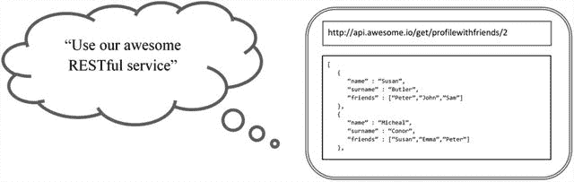

# 一、API 设计揭秘

时代已经变了——我们用优步通勤，用 Airbnb 过夜，用加密货币支付，通过社交媒体获得即时新闻。我们拍快照、聊天、实时分享我们的生活——这些应用让这一切成为可能。

然而，驱动这些应用的是 API(API)，它是我们生活的互联世界的粘合剂。API 无处不在，从我们智能家居中的门铃到我们联网汽车中的交通更新。

在 web 开发中，API 是一组规则或契约，它们通过明确定义预期的输入和输出来规定消费者应该如何与服务进行交互。这是一种从实现中抽象出定义的架构方法。

Note

尽管 API 的其他用途包括库、框架和操作系统，但本书的范围将集中在基于 web 的 API 的上下文上。

在这一章中，我们将通过理解什么是 API 以及介绍 web API 设计的不同架构风格来说明 API 的重要性。然后，我们将放大 REST 架构风格，通过应用 REST 的六个原则，了解 RESTful 服务意味着什么。

## API 的重要性

在当今的现代互联世界中，API 是基于云的服务的最关键元素之一。有数十亿服务可供消费需要良好的抽象来提高兼容性、可用性和可维护性。

API 在两个系统的集成中起着至关重要的作用，因为它加强了它们之间的标准化通信链接。例如，电钻需要电源供电才能工作。为了能够将电气设备连接到电源，我们需要一个墙上插座和一个插头。

在这个类比中，墙上的插座是提供电力的 API，而钻机是消费者，因为它使用特定的插头来连接电源。当然，人们可以将钻孔机直接连接到线路上，但是这需要更多的手工操作并且非常不安全。想象一下，你家里的所有东西都必须硬连线；结果会是一团糟。这里的要点是，具有插头和墙壁插座机制极大地提高了互操作性，允许设备在给定标准接口的情况下可插拔。

Web APIs 也不例外，因为它们确保系统可以无缝通信，而无需复杂的硬件连接。事实上，API 通过允许多个系统使用业务逻辑的一个实现来提高可访问性，而不管它们的技术栈。

想象一下，如果国家气象局必须为其每个消费者系统明确实现一个系统集成点。更新和维护将是一场噩梦，而且这显然不能很好地扩展。相反，实现一个 API 来以一种标准的方式促进数据流。这样做也打开了其他可能性的大门，比如与第三方系统的集成，这可以带来在一些内部组件上赚钱的机会。

提供 API 的其他好处是控制和分析。确保敏感端点的安全至关重要，拥有控制访问的机制至关重要。荷兰有句谚语，“meten is weten”，意思是测量就是知道。理解服务是如何被使用的提供了关于可行性和潜在优化的有用见解。

API 可以在许多不同的架构风格中实现。行业中最常用的样式是 RPC、WSDL、SOAP 和 REST。当设计一个 API 时，为手头的问题使用正确的风格是很重要的，因为每种风格都有其优点和缺点。

Note

为了保持客观，我们将主要关注基于 REST 的架构风格。提到其他的只是为了在 REST 的背景下拓宽理解。

## 休息:好的、坏的和丑陋的

REST 是 Representational State Transfer 的缩写，它是一种基于一组预定义原则的架构风格，这些原则描述了如何定义和寻址网络资源。实现 REST 原则的服务称为 RESTful 服务。

web 服务通常具有干净、可读、无扩展的唯一资源标识符(URIs)或者以 JavaScript 对象表示法(JSON)格式返回数据，但是具有无扩展的 URIs 和返回普通 JSON 的端点并不一定使服务成为 RESTful 服务。

图 [1-1](#Fig1) 显示了给定某个请求的 web 服务的典型输出，包括一个来自开发人员的对话响应，该开发人员并不完全理解什么是 RESTful 服务。



图 1-1

Example of a common assumption made by web-service developers

让我们来看一个典型的场景，它涉及到一个用于管理用户配置文件的 web 服务。以下是一些示例端点，用于对概要文件执行基本的创建、读取、更新和删除(CRUD)操作，并以可扩展标记语言(XML)格式返回结果:

```cs
/getAllProfiles
/getProfile?id=2
/createProfile
/deleteProfile?id=4
/updateProfile?name=eddy

```

这些终点看起来并没有太大的危害。前两个端点`/getAllProfiles`和`/getProfile?id=2`分别获取所有概要文件和一个 ID 为 2 的特定概要文件。`/createProfile`端点负责创建一个新的概要文件，现在您可能已经猜到了，最后两个端点`/deleteProfile?id=4`和`/updateProfile?name=eddy`相应地删除和更新一个特定的概要文件。

在生产一段时间后，企业要求添加更多功能，如通过特定的配置文件响应检索更多朋友信息的能力，以及按名称搜索配置文件的能力。通常，开发人员倾向于通过向集合中添加两个以上的端点来以快速而肮脏的方式实现这些功能，导致服务的版本 2 如下所示:

```cs
/getAllProfiles
/getProfile?id=2
/getProfileWithFriends?id=2
/searchProfileByName?name=frank
/createProfile
/deleteProfile?id=4
/updateProfile?name=eddy

```

额外的端点可能会满足所请求的业务需求，但是由于使用稍微不同的方面来提供相同类型的信息，开始使代码变得非常冗余。

对于服务的版本 3，进一步要求它在当前的一些功能上支持 JSON 响应，以便它是“RESTful 的”为了保持命名约定的一致性并防止破坏性的更改(这可能是一件好事)，开发人员可以简单地向集合中添加更多的端点:

```cs
/getAllProfiles
/getAllProfilesJson
/getProfile?id=2
/getProfileJson?id=2
/getProfileWithFriends?id=2
/getProfileWithFriendsJson?id=2
/searchProfileByName?name=frank
/searchProfileByNameJson?name=frank
/createProfile
/deleteProfile?id=4
/updateProfile?name=eddy

```

正如您所看到的，通过添加对额外输出格式的支持，您基本上可以增加读取操作。继续采用这种模式将会导致灾难，可以想象如果企业提出另一个简单的请求，会产生什么样的影响。

Tip

与应用不同，我们的应用的一般最终用户不是典型的企业或消费者用户，而是应用的开发人员。在设计 API 时，提供优秀的开发人员体验是至关重要的。

在前面的示例场景中，web 服务更倾向于远程过程调用(RPC)风格的 web 服务，而不是 RESTful 服务。拥有一个 RPC 风格的 web 服务并没有错，但是不要混淆 REST 和 RPC 的特性是很重要的。

在 RPC 世界中，端点仅仅是被远程触发的函数，而在 RESTful 世界中，端点是实体，也称为资源。

正确地设计一个 API 是困难的，因为需求往往会改变，我们需要适应当今的业务需求。实现像 REST 这样的模式将通过减少冗余、提高可伸缩性和可维护性来改善我们的 web 服务体验。

## 休息原则

最初由 Roy Fielding 在 2000 年初引入，术语 REST 用于补充 HTTP 1.1 和 URIs 的设计，作为分布式超媒体驱动系统的架构风格。

RESTful 架构影响的一些最重要的问题包括性能、可伸缩性、简单性、互操作性、通信可见性、组件可移植性和可靠性。这些属性被封装在六个原则中，这些原则被 Fielding 定义为指导 RESTful 系统设计的约束。

客户机-服务器约束强制 UI/消费者和后端之间的关注点适当分离，后端主要包含业务逻辑和数据存储实现。我们可以在网站等典型的基于网络的系统中观察到这种约束。在这种方式中，客户端向服务器发起请求，服务器通过触发响应做出反应。如果客户机和服务器之间的接口不变，那么在客户机和服务器之间实施分离可以促进它们完全独立地发展。

分层系统约束通常与客户机-服务器约束结合在一起，它规定应该分层组织各层，将服务的使用限制在直接位于其下面和上面的层。在层中编排组件极大地提高了可重用性，使它们更加模块化。

建立在客户机-服务器风格之上的是无状态约束。客户端和服务器之间的通信需要是无状态的，这意味着请求应该包含服务器理解和创建上下文所需的所有信息。客户端最终负责管理会话状态，不能依赖服务器直接存储任何状态数据。这是否意味着状态的实际内容需要一直来回传递？简而言之，答案是否定的——将状态持久化到其他地方，并且让客户端包含一个用于检索它的标识符，这是完全可以接受的。

将系统与 REST 关联起来的关键特性是统一的接口。这个约束由四个基本部分组成，它们是资源识别、资源操作、自描述响应和状态管理。这些架构元素分别通过 URIs、HTTP 动词、媒体类型和作为应用状态引擎(HATEOAS)的超媒体直接实现。

Note

HATEOAS 也是统一接口的一部分，也是 REST 无状态应用的一个约束，这使得客户端除了对服务器提供的超媒体有一个大致的了解之外，不知道如何与服务器交互。

缓存约束源自无状态约束，并要求来自服务器的响应被显式标记为可缓存或不可缓存，无论它们是显式定义的还是隐式定义的。缓存的响应允许客户端在以后发出类似请求时重用它们，从而提高了速度和延迟。缓存可以应用于客户端和服务器端。

Caution

重要的是不要混淆响应缓存和应用/会话状态，这可能会被错误地解释为 REST 的冲突约束。前者指的是短暂的事务性消息，后者指的是特定的持久上下文。

最后一个可选的约束是按需编码，它允许客户端在不知道如何处理的情况下从服务器访问特定的资源。这种风格通常由基于 web 的应用实现，这些应用的客户端使用客户端脚本语言，如 JavaScript。能够向已部署的客户端添加功能不仅可以提高可扩展性，还可以帮助将一些服务器端任务卸载到客户端，使其响应更快。

将这六个约束应用到您的 API 服务中——只有到那时，它们才会变得真正 RESTful。

## 包扎

本章的要点是认识到 API 的重要性，知道如何恰当地设计它们，并理解拥有一个 RESTful API 意味着什么。在本书中，我们将主要关注 ASP.NET Core 的最重要的特性，以帮助在 API 中实现 REST 原则。

现在我们已经对 API 和 REST 有了一个基本的了解，在下一章中，我们将通过引入 ASP.NET Core 来深入研究有助于构建现代的 RESTful APIs 的技术。