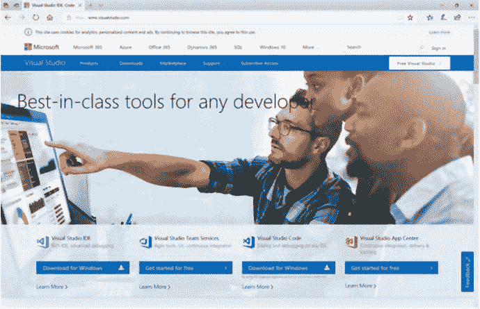

# 二、ASP.NET Core 简介

Active Server Pages (ASP)于 1998 年首次推出，是微软用于构建服务器端技术的旗舰开发框架。它旨在与其他 web 框架竞争，比如当时非常流行的 PHP。它最初是为创建和运行动态的交互式 web 应用而开发的。在请求一个 ASP 文件时，web 服务器执行文件中的任何代码，并将结果返回给浏览器。

ASP(也称为经典 ASP)最初只专注于在服务器上以超文本标记语言(HTML)呈现纯网站，在 2002 年发展成为 ASP.NET 的一部分。NET 框架——当今最常用的框架之一。

ASP.NET 框架是经典 ASP 的继承者，它为构建适合几乎任何场景的基于 web 的应用提供了各种各样的应用模型。迄今为止，ASP.NET 包括 ASP.NET 网页，像经典的 ASP，创建简单的页面驱动的网站；ASP.NET Web Forms 用于制作动态表单驱动的 Web 应用；ASP.NET MVC，用于创建基于模型视图控制器(MVC)模式的更高级的 web 应用；和专门用于构建 API 的 ASP.NET Web API。

快进到 2016 年，一个叫做 ASP.NET Core 的新品种诞生了。它将最好的 ASP.NET 网页、MVC 和 Web API 应用模型结合到一个应用框架中，这极大地促进了一个 ASP.NET 运动，即一个可扩展的 Web 框架。

Note

在撰写本书时，ASP.NET Core 的最新版本是 2.0 版。提及的内容主要针对 ASP.NET Core，并且仅限于最新的已知版本。

作为。NET 框架的发展，它变得更加成熟和稳定，这是一件好事，因为它是首选框架之一。不利的一面是。NET 和 ASP.NET 都与 Visual Studio 缓慢的发布周期紧密相连。

对更快发布的需求是迫切的，并要求从 Visual Studio、其语言和开发框架中分离出来。由此产生的模块化允许更快的发布周期和更快的反馈循环，使技术能够适应业务变化的步伐。

## 什么是 ASP.NET Core？

为了帮助你完全理解什么是 ASP.NET Core，你应该先退后一步，把你的头脑放在下面的开发平台上，叫做。NET 核心。

那个。NET Core framework 是一个全新的轻量级模块化平台，由微软和社区开发，用于构建跨平台的应用和服务。它实现了。NET 标准协议，以所有平台为目标，以提供统一的体验。

Note

那个。NET 标准不要与。NET 框架或者。NET Core，因为它旨在作为一种规范，兼容的框架需要实现多种平台。更多信息。网标见 [`https://blogs.msdn.microsoft.com/dotnet/2016/09/26/introducing-net-standard`](https://blogs.msdn.microsoft.com/dotnet/2016/09/26/introducing-net-standard) 。

该框架的一个主要特点是速度非常快，是 TechEmpower 基准测试网站( [`https://www.techempower.com/benchmarks`](https://www.techempower.com/benchmarks) )上表现最好的框架之一。

此外，支持多种语言。NET 核心，如 C#、VB 和 F#，包括现代编程结构，如泛型、语言集成查询(LINQ)、异步编程和现代语言的其他功能。

ASP.NET Core 框架从头开始构建，是一个开源的跨平台 web 平台，用于开发基于云的服务器应用。它可以运行在两个完整的。NET 框架和。NET 核心框架，它本身是跨平台的，这意味着面向 ASP.NET Core 的应用可以在任何地方运行。

ASP.NET Core 针对部署到云或内部的应用进行了优化。模块化是其设计的核心，使其非常灵活和可扩展。通过使用 ASP.NET Core 的可用工具，您可以在 Windows、Linux 和 Mac 上开发和运行您的应用。

### 。NET 核心与. NET 框架

虽然。NET 核心和完整的。NET framework 共享许多公共组件，但两者之间存在根本差异，选择哪一个取决于当前的场景。

当应用需要跨平台运行或具有基于微服务的架构，以提高高可用性和可伸缩性，或与不同版本的并行运行时。NET，然后使用。网芯将是正确的选择。

使用。如果应用当前使用完整的。NET framework，并且建议扩展而不是迁移，或者如果有第三方库、技术或平台不支持。NET 核心。

Note

的。NET framework 并没有过时，它仍将存在并得到长期支持。的。NET 核心框架也不是要取代完整的。NET 框架，而是构建为与它共存。

## 为什么使用 ASP.NET Core？

ASP.NET Core 包括用于构建基于 web 的用户界面和 web APIs 的统一用例。此外，它还集成了其他现代客户端框架、开发工作流和工具。

该框架包含一个现成的云就绪、基于环境的配置系统，支持以多种不同格式提供的应用设置，所有这些都在一个简单的模型中。ASP.NET Core 的独特之处之一是让依赖注入成为框架内的一等公民的理念。

与 ASP.NET 框架中的 HttpHandlers 和 HttpModules 不同，新的 HTTP 请求管道的设计更加简单易用，使其更加模块化和轻量级。

本质上，ASP.NET Core 可以在任何地方托管(因为它是建立在。NET Core)，无论是互联网信息服务(IIS)，在自己的进程中自托管，甚至托管在 Docker 内部。

关于部署，ASP.NET Core 的所有组件由多个 NuGet 包组成，允许自动安装粒度特性。

### 那个。网络生态系统

现在你对……NET 核心和 ASP.NET Core，了解这些组件如何融入整体是有益的。网络生态系统。图 [2-1](#Fig1) 提供了. NET 所有重要部分的鸟瞰图。


图 2-1

Overview of the .NET platform Note

在图 [2-1](#Fig1) 中，ASP.NET Core 笼罩着两者。NET 框架和。NET 核心。这表明 ASP.NET Core 和在它之上构建的一切都支持。NET 框架和。NET 核心框架并行。

## ASP.NET 的核心特征

在上一节中，我们简要介绍了 ASP.NET Core 的一些特征。遵循这个概念，现在让我们关注这个框架的一些最重要的特性，以突出它如何与实现 RESTful 架构相关联。

托管是 ASP.NET Core 的一个基本特性，也是任何基于服务器的应用的核心。应用宿主充当容器，负责管理应用的生命周期。主机还包含环境配置和用于处理请求的服务器。从 REST 的角度来看，主机和服务器满足客户机-服务器约束。

中间件特性与 REST 的分层系统约束完美地结合在一起。整个请求/响应体系结构主要由中间件驱动，中间件是可以在调用管道中的下一个组件或完全停止请求之前拦截请求并执行特定逻辑的组件。

为了拥有可维护和可扩展的代码，您需要拥有易于测试的松散耦合的组件。使用称为依赖注入(DI)的模式，可以通过在需要时“注入”代码依赖来自动解决代码依赖，从而实现松散耦合。在 ASP.NET Core 中，DI 从一开始就是现成的。

ASP.NET Core 的独特功能之一是配置，它允许在运行时从许多不同的来源读取应用设置，如文件、命令行、环境变量、内存、加密秘密存储或您自己定制的提供程序，如 INI 文件提供程序。

ASP.NET Core 提供了一个广泛的日志记录基础设施，与许多提供商合作，将条目发送到许多目的地。您可以控制日志记录的级别以及日志条目的范围，日志条目对类似操作的日志数据进行分组。

如前所述，MVC 是 ASP.NET Core 支持的应用框架的一个例子。鉴于开放式架构设计的本质，它还允许您创建自己的应用框架，可以在 ASP.NET Core 上无缝运行。

## ASP.NET Core 可用的工具

图 [2-2](#Fig2) 显示了微软堆栈中 ASP.NET Core 可用工具的概述。


图 2-2

Overview of the different tooling available

从底部开始，我们有。NET 共享软件开发工具包(SDK)组件。它包含了所有公共 API 的库。NET 工具，并作为所有其他工具的基础层。

再往上，我们有 Visual Studio 的完整版本，也称为 Visual Studio IDE。ASP.NET Core 支持 Visual Studio 2015(最低更新 3)及以上版本；然而，在本书中，我们将使用迄今为止的最新版本，即 Visual Studio 2017。

Visual Studio 拥有快速创建和部署现代 web 应用所需的工具，并支持多种用于 web 开发的流行语言。坦率地说，它拥有处理 HTML5、CSS3、JavaScript 和 JSON 的最好的编辑器之一。人们可以在语言和项目类型之间无缝切换，无论是 PHP、Java 还是 Python，LESS 还是 SASS，一直到 C# 和 ASP.NET。

在容器化的环境中运行软件越来越成为一件事情。Visual Studio 2017 现在内置了对 Docker 的支持，这是一个众所周知的容器平台，允许我们在 Visual Studio 中运行、部署甚至调试 Docker 中运行的应用。

当涉及到 Angular 和 Bootstrap 等现代 web 框架的生产力时，Visual Studio 2017 遥遥领先，提供了强大的智能感知和高级语言支持。

构成 ASP.NET Core 和。Visual Studio 2017 中的 NET Core light up 都是开源的，这意味着如果你发现一个 bug，你可以报告一个问题，建议一个新功能，或者更好的是，你自己提交一个 pull 请求。

开箱即用，Visual Studio 支持所有流行的包管理器，比如 NuGet，它提供了 rich。NET 库(主要是服务器端)，NPM 是优秀的工具和实用程序，而 Bower 是客户端库。

借助 Apache Cordova 工具，您可以使用 HTML5、CSS3 和 JavaScript 等 web 技术快速构建跨平台的混合 web 应用。您可能已经猜到了:Visual Studio 甚至支持运行和测试我们的应用的仿真体验。

Visual Studio 通过直接与 Microsoft Azure 集成，使得使用云变得非常容易。您可以在云中发布和管理您的 web 应用，甚至直接从 Visual Studio 中远程调试它们。

Visual Studio 允许您使用自己选择的源代码库，无论是基于 GIT 还是 TFS 版本控制。它在管理源代码、收集错误跟踪和单元测试统计数据，以及调试各种语言(如 C#、Python、NodeJS 等)方面提供了出色的体验。

最近，微软还宣布了 Visual Studio for Mac，这是一个完整的 Visual Studio IDE 原生版本，可以在 Mac 上运行，以吸引更多喜欢使用 Mac 的开发人员。托管在任何提供商上的版本控制被集成为一等公民，这对于与其他操作系统上的其他开发人员无缝地工作是非常好的。就像 Visual Studio for Windows 一样，Visual Studio for Mac 也包含了 Xamarin 的优点，它允许您创建原生应用，同时为 iOS、Android 和 Mac OS 共享一个代码库。

图中的下一个是。NET 核心命令行界面(CLI)，这是一个新的跨平台工具链，用于创建跨平台。NET 应用。它为任何终端界面带来了大部分工具特性，无论是 Windows 上的命令提示符或 PowerShell，还是 Linux 和 Mac 上的 Bash。

它可以使用本机安装程序(通常在开发人员的机器上)以及 shell 脚本(主要在构建服务器上使用)来安装。最棒的是。NET Core CLI 的最大优势在于它支持真正的并行版本控制，这意味着您可以在一台机器上安装多个版本的 SDK。

构建在 Visual Studio 之上，我们有扩展。这个扩展模型允许我们为 Visual Studio 创建优秀的附加组件。Visual Studio Marketplace 提供了许多推荐的扩展，可以帮助我们使用 ASP.NET Core 构建出色的 web 应用，这一点我们将在本书中介绍。

此外，Visual Studio Code (VS Code)也是一个相当新的领域，在我看来，它是生产力和开发方面最好的文本编辑器之一。在 VS 代码中开发 ASP.NET Core 应用轻而易举，因为它利用了。NET Core CLI，提供无缝的构建和调试体验。它甚至内置了 GIT 访问功能。

如前所述，ASP.NET Core 无处不在；更好的是，它可以在任何文本编辑器中开发——甚至是记事本。其他一些优秀的编辑器有 Vim、Atom 和 Sublime。

这些工具是微软如何提高生产力的主要例子，因此任何开发人员都可以在任何平台上为任何平台构建优秀的解决方案，并且它允许开发人员使用他们知道并喜欢的工具。

## 设置开发环境

获得 ASP.NET Core 很容易。事实上，有很多方法可以将这个框架安装到您的环境中。在本节中，我们将介绍安装 ASP.NET Core 的两种方法。图 [2-3](#Fig3) 显示从哪里开始: [`https://www.visualstudio.com`](https://www.visualstudio.com) 。



图 2-3

The Visual Studio home page

最快最简单的入门方式就是安装 Visual Studio 2017 IDE。这包括一个新的安装程序，可以帮助您轻松地添加您想要的 Visual Studio 2017 模块。

在 Visual Studio 主页上，将光标悬停在“下载 Visual Studio”按钮上，然后单击要安装的版本。下载应该只需要很短的时间，因为它使用在线安装程序来完成繁重的工作。

Tip

Visual Studio 2017 有三个不同的版本:社区，免费提供给学生或个人开发者以及开源项目；专业，面向专业开发人员或小型团队；和企业，适用于大中型企业。这些版本都可以并行运行，但是对于这本书来说，使用社区版就可以了。

图 [2-4](#Fig4) 展示了新的安装体验，因为它提供了不同工作负载的选择。


图 2-4

The new Visual Studio 2017 installer experience

在选择了 ASP.NET 和 web 开发工作负载之后，点击 Install 并坐下来，让 Visual Studio 安装 ASP.NET 的所有优点。此工作负载包括核心的 Visual Studio 编辑器 IDE 以及 ASP.NET Core 2.0 和。NET Core 2.0 开发工具。

Note

这些说明假定为纯 Windows 环境安装了 Visual Studio 2017 IDE。要为 Mac 安装，需要浏览到 [`https://www.visualstudio.com/vs/visual-studio-mac`](https://www.visualstudio.com/vs/visual-studio-mac) 。

如果你想用 ASP.NET Core 2.0 开发 Visual Studio 代码，你只需要单独抓取这些位。图 [2-5](#Fig5) 显示了位于 [`https://code.visualstudio.com`](https://code.visualstudio.com) 的 Visual Studio 代码主页，您可以在这里下载适用于您的操作系统的最新版本的 Visual Studio 代码编辑器。


图 2-5

The Visual Studio Code home page

既然您已经有了一个不错的编辑器，接下来的事情就是安装。NET Core SDK，其中包括使用 ASP.NET Core 开发跨平台服务器应用所需的所有工具。

图 [2-6](#Fig6) 显示了的下载页面。NET Core SDK at [`https://www.microsoft.com/net/core`](https://www.microsoft.com/net/core) 。只需选择您的操作系统并按照安装说明进行操作。


图 2-6

The .NET Core SDK download page Note

Visual Studio 代码编辑器和。NET Core SDK 可以在 Windows、Linux 和 Mac 上运行。

## 绕场一圈。网络核心 CLI

包括在。NET Core SDK 是。NET Core CLI，它是一个跨平台的工具链，充当所有其他高级编辑器的基础，并提供一组用于创建、构建、测试、运行和部署的命令。NET 应用。

通过指定语法结构来执行命令，该语法结构包括驱动程序点网络，后跟命令及其相应的参数。

Tip

为了简单起见，本节将只涵盖有限的一组基本命令和项目修改命令。以获得有关。NET Core CLI，使用`-h`或`--help`选项或浏览到 [`https://docs.microsoft.com/en-us/dotnet/core/tools`](https://docs.microsoft.com/en-us/dotnet/core/tools) 。

`dotnet new`命令从一个特别命名的模板创建一个新的工件。要获取可供选择的已安装模板列表，请使用以下语法:

```cs
$ dotnet new [-l|--list]

```

图 [2-7](#Fig7) 显示了控制台输出的示例，详细说明了已安装的模板。


图 2-7

Output showing installed templates

以下命令语法通过使用模板`short name`作为参数来创建一个新工件:

```cs
$ dotnet new <template short name> [-n|--name]

```

Tip

虽然指定名称是可选的，但强烈建议您这样做。如果没有指定名称，将使用当前目录的名称。

创建一个名为 AwesomeSauce 的新解决方案和一个名为 AwesomeSauce 的 ASP.NET Core 2.0 Web API 项目。Api，运行以下命令:

```cs
$ dotnet new sln -n AwesomeSauce
$ dotnet new webapi -n AwesomeSauce.Api

```

Tip

在 Command Prompt 和 Bash 中，您可以使用`&&`将多个 CLI 命令链接起来，一个接一个地执行它们。

您必须理解，前面的命令只是分别创建了解决方案和项目工件。`dotnet sln`命令负责特定于解决方案的操作。运行以下命令列出解决方案中的项目后，我们注意到它还不包含任何项目:

```cs
$ dotnet sln list

```

要将`AwesomeSauce.Api`项目添加到`AwesomeSauce`解决方案中，只需执行以下命令(记住要指定项目文件的相对路径):

```cs
$ dotnet sln add AwesomeSauce.Api\AwesomeSauce.Api

```

重新运行`dotnet sln list`命令应该显示作为解决方案一部分列出的`AwesomeSauce.Api`项目。

`dotnet restore`、`dotnet build`和`dotnet run`命令分别负责恢复项目及其特定工具所需的 NuGet 包、构建项目(包括其依赖项)和运行项目。

Note

截至。NET Core 版，不再需要先运行`dotnet restore`再构建执行。然而，在持续集成场景中，它仍然是一个有效的命令。以前的版本甚至要求在构建或运行代码之前运行该命令。

## 包扎

这一章是关于 ASP.NET Core 的介绍，以及它作为构建现代 API 的世界级 web 框架的特性和能力。我们将 ASP.NET Core 的特性与 REST 的一些约束结合起来，并探索了可用于 ASP.NET Core 框架的不同工具。我们学习了如何通过安装 Visual Studio IDE 和 Visual Studio 代码来设置我们的开发环境，并了解了。使用. NET Core CLI 工具。Visual Studio 外部的. NET 核心。

在下一章中，您将使用之前介绍的一些工具创建一个简单的 API 应用。