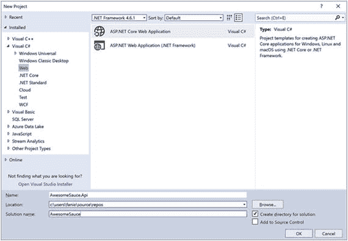
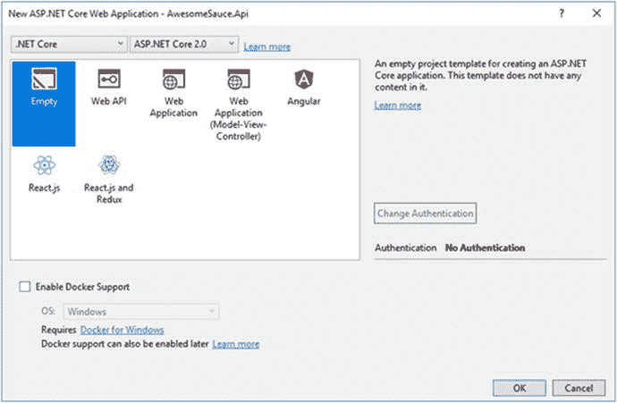
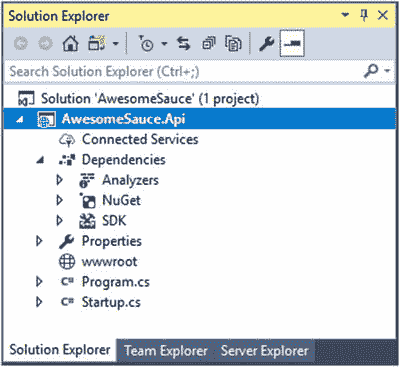

# 三、您的第一个 API 应用

在前一章中，我们对 ASP.NET Core 和相关技术进行了简要概述。本章将着重于帮助你使用我们之前介绍的一些工具创建一个简单的 API 应用。

本章结束时，您将能够使用 ASP.NET Core 中的一个预定义模板创建一个新的 API 应用。我们将看看如何处理跨代码库的依赖性，同时仍然保持组件之间的松散耦合。本章还将介绍应用启动机制的自主性，以了解如何配置应用初始化过程，最后，我们将创建一个可供使用的简单 API 端点。

## 入门指南

我们简要介绍了如何使用？NET Core CLI 工具链。在本节中，我们将使用 Visual Studio 2017 IDE 来做同样的事情。

在 Visual Studio 2017 中，单击文件，然后选择新建并单击项目。如果您是一个键盘忍者，您也可以通过按 Ctrl+Shift+N 来完成此操作。图 [3-1](#Fig1) 显示了将要显示的新项目对话框。



图 3-1

The New Project dialog

在 Web 部分，我们注意到两种类型的 ASP.NET Web 应用，一种是基于 ASP.NET Core 的，另一种是基于完整的。NET 框架。我们需要选择 ASP.NET Core Web 应用类型，并为我们的项目命名。

点击确定后，出现新建 ASP.NET Core Web 应用模板对话框，如图 [3-2](#Fig2) 所示。



图 3-2

The New ASP.NET Core Web Application template dialog Note

在这一点上，最好提一下 ASP.NET Core 项目创建流程在 Visual Studio 2017 IDE 和中共享相同的模板体验。NET Core CLI。你会注意到图 [3-2](#Fig2) 中的模板与上一章图 [2-7](02.html#Fig7) 中突出显示的`dotnet new -l`命令输出的模板相同。

在这个对话框中，我们可以在。NET 核心和完整的。NET 框架以及 ASP.NET Core 版本之间的切换。让我们保持默认设置，即打开目标框架。网络核心和 ASP.NET Core 版本 2.0。

我们将从零开始，这样我们就可以了解 ASP.NET Core 2.0 应用的各个重要方面。选择空模板，然后单击确定。

创建项目后，我们可以探索从模板生成的结构，如图 [3-3](#Fig3) 所示。



图 3-3

The ASP.NET Core project structure

ASP.NET Core 项目在项目中引入了依赖关系节点，它包含了所有项目级的基础设施依赖关系，比如 Roslyn 分析器、NuGet 包和 SDK。空模板还搭建了一个包含`Program.cs`和`Startup.cs`类的项目。

最棒的一点是。NET 核心应用的一个优点是，我们可以在 Visual Studio 中直接编辑项目文件，而不必先卸载项目。我们可以通过右键单击项目并选择 Edit 来做到这一点。

如果你熟悉 ASP.NET 以前的任何版本，你会立即注意到一个惊人的不同。与以前版本的 ASP.NET 的项目文件相比，现在 ASP.NET Core 的项目文件的内容更干净，布局更简单。以下是我们刚刚创建的`AwesomeSauce.Api.csproj`的内容:

```cs
<Project Sdk="Microsoft.NET.Sdk.Web">

  <PropertyGroup>
    <TargetFramework>netcoreapp2.0</TargetFramework>
  </PropertyGroup>

  <ItemGroup>
    <Folder Include="wwwroot\" />
  </ItemGroup>

  <ItemGroup>
    <PackageReference Include="Microsoft.AspNetCore.All" Version="2.0.0" />
  </ItemGroup>

</Project>

```

查看`Project`元素，有一个`Sdk`属性指定了这个项目使用什么 SDK。指定目标框架可以使用`TargetFramework`元素来完成。我们例子中的 NET Core 2.0。

Tip

还可以通过使用`TargetFrameworks`(复数)元素将一个项目作为多个框架的多目标。

默认情况下，与项目文件位于同一目录中的所有文件都包含在项目中。通过使用`Folder`元素指定要包含或排除的模式，可以改变这种行为。外部依赖，像其他项目引用、外部工具或 NuGet 包，都是在一个`ItemGroup`中定义的。在我们的例子中，引用了一个名为`Microsoft.AspNetCore.All`的 NuGet 包。

因为我们不需要卸载项目来更改项目文件，所以任何更改都会在保存时立即反映出来，并且可以在项目结构中直接观察到。

让我们检查一下`Program.cs`文件:

```cs
using Microsoft.AspNetCore;
using Microsoft.AspNetCore.Hosting;

public class Program
{
    public static void Main(string[] args)
    {
        BuildWebHost(args).Run();
    }

    public static IWebHost BuildWebHost(string[] args) =>
        WebHost.CreateDefaultBuilder(args)
            .UseStartup<Startup>()
            .Build();
}

```

任何事物的起点。基于. NET 的应用是一个`Program`类中的静态`Main`函数。在 ASP.NET Core 2 应用中，通过调用`BuildWebHost`函数启动 web 主机，该函数调用`WebHost.CreateDefaultBuilder`，T3 使用构建器模式创建默认的 web 主机。

调用`WebHost.CreateDefaultBuilder`函数会返回一个`IWebHostBuilder`，它允许我们内联传递应用配置，或者使用提供的扩展方法来流畅地定义或覆盖特定的配置，比如服务器、URL、日志、web 和内容根，等等。

默认 web 主机被自动配置为使用当前目录作为内容根目录；从各种来源加载可选配置；记录控制台和调试输出；使用新的跨平台 web 服务器 Kestrel server 并在 IIS 上运行(如果它可用的话)。在接下来的章节中，我们将学习更多关于配置模型、日志和服务器的知识。

不使用`WebHost.` `CreateDefaultBuilder`，我们可以创建一个`WebHostBuilder`类的新实例，然后定义我们希望如何配置它。在下面的示例中，我们看到创建了与默认主机相同的 web 主机，但是我们没有隐藏所有的神奇之处，而是显式定义了需要应用于 web 主机的所有配置:

```cs
public static IWebHost BuildWebHost(string[] args) =>
    new WebHostBuilder()
        .UseKestrel()
        .UseContentRoot(Directory.GetCurrentDirectory())
        .ConfigureAppConfiguration(config =>
            config.AddJsonFile("appSettings.json", true)
        )
        .ConfigureLogging(logging=>
            logging
                .AddConsole()
                .AddDebug()
        )
        .UseIISIntegration()
        .UseStartup<Startup>()
        .Build();

```

## 依赖注入

在我们继续之前，有必要理解依赖注入(DI)的概念。应用组件之间的依赖是不可避免的，如果对它们的引用没有正确设计，就会对代码的可维护性产生负面影响。DI 是一种设计模式，允许在运行时将对象的实例传递给需要它们的其他对象。

假设我们有一个名为`ComponentA`的类正在使用`ComponentB`。下面的例子展示了一个不使用 DI 的典型场景，因此这些组件紧密耦合在一起:

```cs
public class ComponentA
{
    private readonly ComponentB _componentB;
    public ComponentA()
    {
        this._componentB = new ComponentB();
    }
}
public class ComponentB
{
    public string Name { get; set; }
}

```

我们可以不直接引用`ComponentB`的实例，而是通过引入一个`IComponent`接口来分离它，抽象出实现，并期望在`ComponentA`的构造函数中有一个`IComponent`类型的实例。在下面的例子中，前面的代码现在被重构为使用 DI，让`ComponentB`实现`IComponent`，这样就不再有对`ComponentB`实例的直接引用了:

```cs
public interface IComponent
{
    string Name { get; }
}
public class ComponentA
{
    private readonly IComponent _componentB;
    public ComponentA(IComponent componentB)
    {
        this._componentB = componentB;
    }
}
public class ComponentB: IComponent
{
    public string Name { get; set; } = nameof(ComponentB)
}

```

当我们按原样运行这段代码时，它将导致一个`NullReferenceException`错误，因为`ComponentA`期望一个类型为`IComponent`的对象，尽管`ComponentB`实现了`IComponent`接口，但是没有配置任何东西来将所需的`IComponent`实例传递给`ComponentA`的构造函数。

为了让代码运行时不出现这个问题，我们需要一种机制来在运行时传递所请求类型的正确实例。这可以通过使用控制反转(IoC)容器来注册所有必需的依赖项及其实例来实现。NuGet 上有很多框架提供了用于依赖解析的 IoC 容器，即 Unity、Castle Windsor、Autofac 和 Ninject。

Note

一般来说，避免类的显式实例化，因为这样做会导致紧密耦合的系统。

ASP.NET Core 在其基础设施中将 DI 实现为一等公民，并且在其核心中内置了 IoC 容器。这个框架的大部分活动部分都是相互抽象的，以提高可扩展性和模块化。这意味着，如果您选择使用自己喜欢的 IoC 容器，而不是内置的，您绝对可以。

## 应用启动

既然我们已经理解了配置和启动 web 主机的概念，我们就可以把重点放在应用的实际引导配置上了。`UseStartup`方法是扩展一个`IWebHostBuilder`并注册一个负责配置应用启动过程的类的关键方法之一。

`Use` `Startup`中指定的类型需要匹配特定的签名，以使主机正确启动应用。运行时要求指定的启动类包含两个公共函数，即可选的`ConfigureServices`和强制的`Configure`。比如说，我们把启动类定义为`UseStartup<Foo>()`；`Foo`的结构应符合以下要求:

```cs
public class Foo
{
    //optional
    public void ConfigureServices(IServiceCollection services)
    {
    }

    //required
    public void Configure()
    {
    }
}

```

在整个 ASP.NET Core 中，我们将注意到依赖项和配置符合某种添加/使用风格，首先定义需要什么，然后定义如何使用它。通过明确指定我们需要的组件，它优化了性能，从而提高了应用的性能，因为我们只为我们使用的东西付费，而不是全部。

在`ConfigureServices`方法中，所有应用级的依赖项都通过添加到一个`IServiceCollection`来注册到默认的 IoC 容器中。扩展我们前面的例子，我们将把`ComponentB`的单例实例映射到一个`IComponent`服务，如下所示:

```cs
public void ConfigureServices(IServiceCollection services)
{
    services.AddSingleton<IComponent, ComponentB>();
}

```

Note

还可以注册一个绑定到自身的依赖项，而不使用任何接口，方法是直接在构造函数中期待具体类型并调用`services.AddSingleton<T>`，这里的`T`是具体类型。

在 startup 类中，`Configure`方法负责应用 HTTP 请求管道的实际配置，并且是运行时所需要的。这个方法可以包含许多从 IoC 容器中解析出来的相关参数。

让我们在前面的例子的基础上，让我们的应用在调用响应时打印出一个`IComponent`的名称，并显示运行中的`Configure`方法:

```cs
public void Configure(IApplicationBuilder app, IComponent component)
{
    app.Run(async (context) =>
        await context.Response.WriteAsync($"Name is {component.Name}")
    );
}

```

自动解析的两个变量是一个`IApplicationBuilder`，它是配置应用请求的机制，以及一个`IComponent`。`IApplicationBuilder`扩展了一个`Run`函数，该函数传递一个`RequestDelegate`，该函数将`IComponent`的`Name`属性写出到响应中。运行该应用将导致响应为“Name is ComponentB”

还可以在定义 web 主机时直接内联配置应用的依赖项和 HTTP 请求管道，而不使用启动类。给定默认 web 主机配置，内联启动定义可能如下所示:

```cs
WebHost.CreateDefaultBuilder()
    .ConfigureServices(services =>
        services.AddSingleton<IComponent, ComponentB>()
    )
    .Configure(app =>
    {
        var component = app.ApplicationServices.GetRequiredService<IComponent>();
        app.Run(async (context) =>
           await context.Response.WriteAsync($"Name is {component.Name}")
        );
    })
    .Build();

```

内联定义引导配置的一个缺点是，我们只能将一个参数作为`IApplicationBuilder`传递给`Configure`扩展方法。这迫使我们通过手动调用`GetRequiredServices`来解决任何依赖性。

Note

创建 web 主机时，可以在单独的启动类中内联定义配置节。当使用`UseStartup`在一个单独的类中确定引导配置时，它会覆盖在 web 主机构建器上内联定义的配置节。

有时可能需要为不同的环境设置不同的配置，因此 ASP.NET Core 允许我们按照惯例明确定义特定于环境的启动配置。启动类定义为`UseStartup(startupAssemblyName: ...)`；然后，运行时将在指定的程序集中查找名为`Startup`和`Startup` `[Environment]`的类，其中`[Environment]`是与`ASPNETCORE_ENVIRONMENT`环境变量匹配的值。如果找到特定于环境的类，它将覆盖默认的类。

例如，如果环境设置为“开发”，运行时将尝试加载`Startup`和`StartupDevelopment`。在启动类内部，同样的约定也适用于`ConfigureServices`和`Configure`方法，其中约定分别是`Configure` `[Environment]` `Services`和`Configure` `[Environment]`。

## 创建端点

现在，我们已经很好地理解了 ASP.NET Core 如何初始化 web 主机和启动应用，让我们开始构建两个消费端点。

如前所述，`IApplicationBuilder.Run`方法最终在应用运行并接受一个`RequestDelegate`作为参数时执行，该参数接收`HttpContext`对象。参考上一节中的示例，无论请求中的 URI 是什么，响应总是相同的。

除了`IApplicationBuilder`的`Run`方法之外，还有`Use`扩展方法，用于拦截可能会使管道短路或让请求通过管道到达下一层的请求。`Use`扩展方法接收一个`RequestDelegate`用于提供`HttpContext`，但也接收一个`RequestDelegate`用于下一层。

Note

在请求管道中提到的层指的是中间件的概念。API 端点只不过是按照特定顺序执行的中间件。我们将在下一章深入探讨中间件的概念。

在下面的例子中，我们利用`Run`和`Use`方法来实现端点/ `foo`和`/bar`以及应用的默认回退:

```cs
public void Configure(IApplicationBuilder app)
{
    app.Use(async (context, next) =>
    {
        if (context.Request.Path == "/foo")
        {
            await context.Response.WriteAsync($"Welcome to Foo");
        }
        else
        {
            await next();
        }
    });
    app.Use(async (context, next) =>
    {
        if (context.Request.Path == "/bar")
        {
            await context.Response.WriteAsync($"Welcome to Bar");
        }
        else
        {
            await next();
        }
    });
    app.Run(async (context) =>
        await context.Response.WriteAsync($"Welcome to the default")
    );
}

```

`Run`和`Use`方法定义`RequestDelegates`的顺序非常重要，因为运行时将按照与创建时完全相同的顺序执行每一层。在前面的示例中，第一层检查传入请求的请求路径。如果它与`/foo`匹配，它将请求短路并直接发回适当的响应，否则它执行`next()`，这是流水线中的下一个`RequestDelegate`层，依此类推。如果请求设法绕过所有前面的`Use`层，它最终会执行`Run`，发送回默认响应。

Tip

从前面的例子中删除`Run`层将导致应用只为`/foo`和`/bar`的请求提供服务。任何其他请求都将收到一个`404 Not Found`响应。

对`IApplicationBuilder`的其他扩展是`Map`和`MapWhen`，它们更适合处理端点。让我们重构前面的例子，利用`Map`和`MapWhen`方法实现`/foo`和`POST /bar`端点:

```cs
public void Configure(IApplicationBuilder app)
{
    app.Map("/foo",
        config =>
            config.Use(async (context, next) =>
                await context.Response.WriteAsync("Welcome to /foo")
            )
        );
    app.MapWhen(
        context =>
            context.Request.Method == "POST" &&
            context.Request.Path == "/bar",
        config =>
            config.Use(async (context, next) =>
                await context.Response.WriteAsync("Welcome to POST /bar")
            )
        );
}

```

`Map`和`MapWhen`方法包装了一个`IApplication.Use`委托。`MapWhen`需要一个额外的谓词来应用比请求路径延伸得更远的条件。在前面的例子中，所有的`/foo`请求(不管它们的 HTTP 方法如何)都会调用 foo 端点，只有路径为`/bar`的`POST`请求会调用 bar 端点。

这总结了在 ASP.NET Core 中创建简单端点的基本知识。我们将在下一章学习更多关于端点的高级路由概念。

## 包扎

在这一章中，我们讲述了很多关于在 ASP.NET Core 中创建你的第一个应用的内容。在探索了 Visual Studio 2017 提供的新模板体验之后，我们直接进入了新项目系统的内部工作以及如何创建 web 主机。此外，我们对依赖注入进行了简要概述，并了解了在我们的应用中应用控制反转的重要性和好处。我们还剖析了应用启动过程，以完全理解它是如何工作的，最后，我们学习了如何使用应用构建器上提供的一些扩展方法来实现不同的 API 端点。

在下一章，我们将深入兔子洞，探索 ASP.NET Core 的可扩展性架构的更令人兴奋的概念。