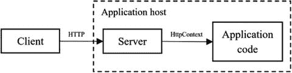
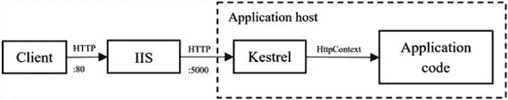
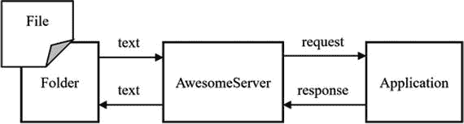
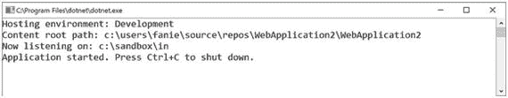
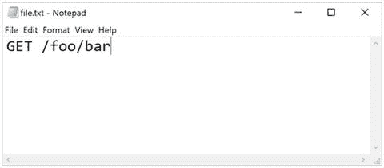
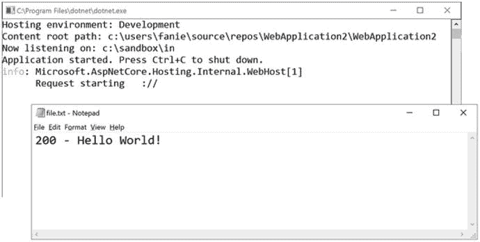
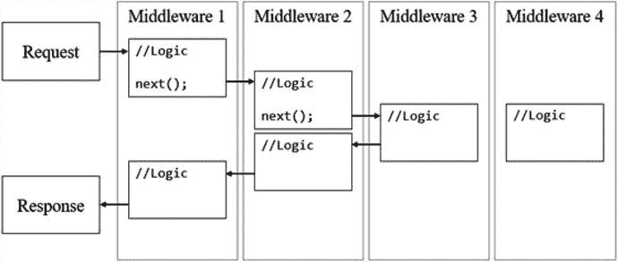

# 四、可扩展性架构

可扩展性是 ASP.NET Core 的关键特性之一，因为它允许可插拔的系统架构。当然，我们可以深入研究 ASP.NET Core 的所有扩展点，但是为了不超出 API 的范围，本章我们将集中讨论一个特定的子集。

本章将从可扩展性的角度解释 ASP.NET Core 的一些基本方面。我们将了解有关主机和服务器的更多信息，以及如何创建自定义服务器。我们将重温中间件的概念，更深入地研究更高级的场景。如前所述，RESTful APIs 交付位于特定 URI 上的资源，这可以由路由驱动。我们还将从实用的角度了解更多关于路由的知识。在本章的最后一节，我们将介绍托管服务，它用于在 ASP.NET Core 应用中运行并发后台任务。

## 主机和服务器

主机和服务器的概念在 RESTful 架构中起着至关重要的作用。我们可以实现一个带有服务器的主机，该服务器监听 ASP.NET Core 中客户端的远程请求，并且它将完美地符合 REST 原则规定的客户端-服务器约束。

我们在上一章简要地提到了网络主机。在 ASP.NET Core 中，主机负责应用的引导、初始化和生命周期管理。对于要运行的 web 应用，它需要一个至少有一个服务器的主机来处理请求和响应。

引导责任的一部分是为应用设置正确的配置。`IWebHostBuilder`提供了配置应用配置模型和应用服务的内置功能，以及设置和获取基于键/值的设置的机制。

我们可以通过分别使用`GetSetting`和`UseSetting`函数来读取和写入应用设置。当调用`UseSetting`时，重要的是要记住所提供的值将作为字符串值被持久化。

此外，还有其他方法扩展`IWebHostBuilder`来配置主机。当应用启动过程中出现问题时，默认行为将导致宿主退出(除非宿主在 IIS 后面)。我们可以通过调用`CaptureStartupErrors`并传递 true 或 false 来控制这种行为，这取决于我们是否希望在出现异常时继续尝试启动服务器。

`UseContentRoot`设置被定义用于指定主机应该在哪里寻找内容的基本路径；如果没有此设置，主机将无法启动。`UseWebRoot`设置决定了服务静态资产的相对路径，并且基于`UseContentRoot`设置的路径。

应用运行在多种环境中，每种环境都可能有不同的配置。ASP.NET Core 支持指定运行的命名环境。该框架包括开发、登台和开发作为内置的环境名称，但是我们可以为我们的环境指定任何名称。默认情况下，它读取在`ASPNETCORE_ENVIRONMENT`环境变量上配置的任何环境名称。我们还可以通过使用`UseEnvironment`方法在`IWebHostBuilder`上显式定义环境权限。

虽然我们在前一章中已经介绍了从外部类读取启动的机制，但是补充一点也是不错的，我们也可以从多个外部程序集加载应用引导。在`UseSetting`方法中使用`WebHostDefaults.HostingStartupAssembliesKey`键，然后用分号分隔的程序集名称指定一个字符串值，将扫描指定的程序集中一个名为`Startup`的类。

服务器监听对特定 URL 的请求。在 web 主机的配置中，我们可以指定服务器应该监听请求的 URL。为此，我们使用`UseUrls`函数，传递用分号分隔的 URL。重要的是要知道一些服务器，比如 Kestrel，也提供了指定监听位置的配置。当然，我们可以将服务器的配置与 web 主机上指定的配置结合使用，但是也可以通过使用`PreferHostingUrls`方法明确地选择主机的 URL 而不是服务器的 URL。

在我们之前探索的默认模板中，你可能已经注意到了`Run`在`IwebHost`上被调用；这将运行主机，阻止应用的任何进一步执行，直到主机终止。我们可以通过调用`Start`来以非阻塞的方式运行 web 主机。

让我们以托管中使用的两个重要接口来结束:接口`IHostingEnvironment`为当前执行环境提供上下文，如应用和环境名称，以及用于从 web 和内容根提供内容的文件提供者，而接口`IApplicationLifetime`允许在应用启动和停止时处理事件，以及提供用于显式停止应用的方法。

在 ASP.NET Core 中，服务器负责对客户端发出的请求做出反应，将这些请求作为`HttpContext` s 传递给应用。默认情况下，ASP.NET Core 2.0 包括两个内置服务器:Kestrel，一个基于 Libuv 的跨平台 HTTP 服务器，和 HTTP.sys，一个基于 HTTP.sys 内核驱动程序的 Windows 专用服务器。图 4-1 显示了服务器如何将请求传递给应用的示意图。



图 4-1

The request map from the client to the application code Tip

虽然这本书只关注了 Kestrel 的某些方面，但 HTTP.sys 并没有更详细的介绍。

Kestrel 可以作为一个独立的进程单独托管，也可以在 IIS 中托管。一般来说，使用 IIS 或 Nginx 这样的反向代理服务器是一个好主意。这些在构建 API 或微服务时充当网关，提供了一个额外的防御层，因为它们限制了现有基础架构的暴露面积或与现有基础架构更好地集成。

使用反向代理时，请求首先由反向代理服务器(独立于应用)处理，然后委托给 Kestrel。图 [4-2](#Fig2) 显示了使用 IIS 这样的反向代理服务器时的请求交互。



图 4-2

HTTP request interaction with IIS as reverse proxy

为了告诉 web 主机在 IIS 后面工作，我们使用了来自`IwebHostBuilder`的`UseIISIntegration`扩展方法。我们将配置主机监听来自 ASP.NET Core IIS 模块(ANCM)的请求，ANCM 是一个专门为服务从 IIS 到 ASP.NET Core 的请求而构建的 IIS 模块。

Note

ANCM 必须安装在服务器上的 IIS(或开发计算机上的 IIS Express)中，IIS 集成才能工作。Visual Studio 会自动在 IIS Express 上为我们安装 ANCM。服务器的 ANCM 可以从 [`https://aka.ms/dotnetcore.2.0.0-windowshosting`](https://aka.ms/dotnetcore.2.0.0-windowshosting) 下载。

如前所述，ASP.NET Core 是超级可插拔的。如果你想使用另一个服务器，你肯定可以。我们之前了解到，调用`WebHost.CreateDefaultBuilder`会自动将 Kestrel 配置为服务器，但是我们可以通过使用`UseHttpSys`扩展方法来覆盖这种行为，使它使用 HTTP.sys。让我们看一下这个方法的源代码，以理解它在表面之下做了什么:

```cs
public static IWebHostBuilder UseHttpSys(this IWebHostBuilder hostBuilder)
{
    return hostBuilder.ConfigureServices(services => {
        services.AddSingleton<IServer, MessagePump>();

        // ...
    });
}

```

看到熟悉的东西了吗？这个方法将一个`IServer`的单例注册为一个`MessagePump`，这是 HTTP.sys 的一个实现。如果你深入研究，你会注意到`MessagePump`实现了`IServer`接口。还有一个将`IServer`绑定到`KestrelHttpServer`的`UseKestrel`方法。下面是`Use` `Kestrel`方法的源代码:

```cs
public static IWebHostBuilder UseKestrel(this IWebHostBuilder hostBuilder)

{
    return hostBuilder.ConfigureServices(services => {
        // ...
        services.AddSingleton<IServer, KestrelServer>();

        // ...
    });
}

```

Note

注册依赖关系时，顺序很重要。如果我们用同一个`TInterface`多次调用`AddSingleton<TInterface, TService>()`，最后注册的`TService`将覆盖之前的。

Kestrel 和 HTTP.sys 都是内置的，但是如果我们想使用第三方服务器，比如 FooServer 呢？`IWebHostBuilder`的另一个扩展是`UseServer`，它接受类型`IServer`的一个实例。调查这个方法的源代码会发现，它只是注册了一个类型为`IServer`的单例:

```cs
public static IWebHostBuilder UseServer(this IWebHostBuilder hostBuilder, IServer server)
{
// ...

    return hostBuilder.ConfigureServices(services => {
        services.AddSingleton(server);

    });
}

```

### 创建自定义服务器

要创建我们的定制服务器，我们只需实现`IServer`，它具有以下签名:

```cs
public interface IServer : IDisposable
{
    IFeatureCollection Features { get; }
    Task StartAsync<TContext>(IHttpApplication<TContext> application, CancellationToken cancellationToken);
    Task StopAsync(CancellationToken cancellationToken);
}

```

Note

`IServer`需要实现一组特性。你可以自由地实现你的应用所需要的特性，但是至少它需要支持`IHttpRequestFeature`和`IHttpResponseFeature`。

我们将构建的服务器称为 AwesomeServer，这是一个 HTTP 服务器，它通过放在磁盘上的文件夹(而不是网络端口)中的文件接收特定的请求，然后将它们作为正确的 HTTP 请求转发给应用请求管道的其余部分。应用处理完请求后，返回的响应将覆盖同一个文件。图 [4-3](#Fig3) 显示了如何从文件中读取请求并写回返回的响应。



图 4-3

The high-level architecture of AwesomeServer

让我们看看`AwesomeServer`类的内幕:

```cs
public class AwesomeServer : IServer
{
    public AwesomeServer(IOptions<AwesomeServerOptions> options)
    {
        Features.Set<IHttpRequestFeature>(new HttpRequestFeature());
        Features.Set<IHttpResponseFeature>(new HttpResponseFeature());

        var serverAddressesFeature = new ServerAddressesFeature();
        serverAddressesFeature.Addresses.Add(options.Value.FolderPath);
        Features.Set<IServerAddressesFeature>(serverAddressesFeature);
    }

    public IFeatureCollection Features { get; } = new FeatureCollection();

    public void Dispose() { }

    public Task StartAsync<TContext>(IHttpApplication<TContext> application, CancellationToken cancellationToken)
    {
        return Task.Run(() =>
        {
            var watcher = new AwesomeFolderWatcher<TContext>(application, Features);
            watcher.Watch();
        });
    }

    public Task StopAsync(CancellationToken cancellationToken)
    {
        return Task.FromResult(0);
    }
}

```

从构造函数开始，在添加了使`AwesomeServer`成为 HTTP 服务器最少需要的两个特性之后，我们创建了一个新的`IServerAddressesFeature`实例，从注入的`IOptions`添加文件夹路径，然后将特性添加到`IFeatureCollection`。

`IFeatureCollection`包含了服务器的能力。`AwesomeServer`有一个服务器监听地址，可以处理请求和响应。`StartAsync`和`StopAsync`包含启动和停止服务器的逻辑。

当`AwesomeServer`启动时，会创建一个新的`AwesomeFolderWatcher`实例，负责监视特定的文件夹。客观地说，`AwesomeFolderWatcher`之于`AwesomeServer`就像 Libuv 之于红隼一样。

以下是`AwesomeFolderWatcher`的内容:

```cs
public class AwesomeFolderWatcher<TContext>
{
    private readonly FileSystemWatcher watcher;
    private readonly IHttpApplication<TContext> application;
    private readonly IFeatureCollection features;
    public AwesomeFolderWatcher(IHttpApplication<TContext> application, IFeatureCollection features)
    {
        var path = features.Get<IServerAddressesFeature>().Addresses.FirstOrDefault();
        this.watcher = new FileSystemWatcher(path);
        this.watcher.EnableRaisingEvents = true;
        this.application = application;
        this.features = features;
    }
    public void Watch()
    {
        watcher.Created += async (sender, e) =>
        {
            var context = (HostingApplication.Context)(object)application.CreateContext(features);
            context.HttpContext = new AwesomeHttpContext(features, e.FullPath);
            await application.ProcessRequestAsync((TContext)(object)context);
            context.HttpContext.Response.OnCompleted(null, null);
        };

        Task.Run(() => watcher.WaitForChanged(WatcherChangeTypes.All));
    }
}

```

构造函数接受一个`IHttpApplication<TContext>`，它是应用的一个实例，就像我们接受一个`IFeatureCollection`一样。此外，标准的一个新的全球实例。NET `FileSystemWatcher`创建在构造函数内部，并被配置为监视`IServerAddressesFeature`中指定的文件夹。

`Watch`方法只是向`FileSystemWatcher`的`Created`事件添加一个委托，该事件包含每当在被监视的文件夹中创建新文件时执行的逻辑。这里，我们创建了一个新的应用上下文，将它的`HttpContext`指定为`AwesomeHttpContext`的一个新实例，这是专门为文件系统创建的`HttpContext`的一个特定覆盖。

在创建了包含一个`HttpRequest`和`HttpResponse`的`HttpContext`之后，我们将它传递给应用，以便在其请求管道中进行处理。当应用完成请求并返回响应时，我们通过调用`HttpContext`的`Response`属性上的`OnCompleted`来发出请求完成的信号。

让我们研究一下`AwesomeHttpContext`的一个总结片段:

```cs
public class AwesomeHttpContext : HttpContext
{
    public AwesomeHttpContext(IFeatureCollection features, string path)
    {
        this.Features = features;
        this.Request = new FileHttpRequest(this, path);
        this.Response = new FileHttpResponse(this, path);
    }
    public override HttpRequest Request { get; }
    public override HttpResponse Response { get; }
    public override IFeatureCollection Features { get; }

    // ...
}

```

`AwesomeHttpContext`的构造函数接受的参数之一是文件夹路径，它被传递给`Request`和`Response`属性。`FileHttpRequest`和`FileHttpResponse`分别继承和覆盖`HttpRequest`和`HttpResponse`。

现在我们有了一个`HttpContext`,让我们快速后退一步，理解如何将请求从文件中的纯文本翻译过来。像 HTTP 请求的语法一样，文件内容需要匹配特定的结构。为了简单起见，我们将坚持以下格式:

```cs
{HTTP Verb} {Relative Path}

```

现在，看一下`FileHttpRequest`，我们看到文件被读取，内容被解析，并且构建了所需的部分以生成应用可以处理的有效的`HttpRequest`:

```cs
public class FileHttpRequest : HttpRequest
{
    public FileHttpRequest(HttpContext httpContext, string path)
    {
        var lines = File.ReadAllText(path).Split('\n');
        var request = lines[0].Split(' ');
        this.Method = request[0];
        this.Path = request[1];
        this.HttpContext = httpContext;
    }
    public override string Method { get; set; }
    public override PathString Path { get; set; }
    public override string Scheme { get; set; } = "file";
    public override HttpContext HttpContext { get; }

    // ...
}

```

当请求通过应用请求管道时，会创建一个响应，并最终返回到服务器。在响应返回时，我们调用`OnCompleted`方法来运行特定的逻辑来处理响应。下面是`FileHttpResponse`的片段:

```cs
public class FileHttpResponse : HttpResponse
{
    public override void OnCompleted(Func<object, Task> callback, object state)
    {
        using (var reader = new StreamReader(this.Body))
        {
            this.Body.Position = 0;
            var text = reader.ReadToEnd();
            File.WriteAllText(path, $"{this.StatusCode} - {text}");
            this.Body.Flush();
            this.Body.Dispose();
        }
    }

    // ...
}

```

当调用`OnCompleted`时，我们读取响应体，并将其与状态代码一起写入原始文件。

最后，为了保持添加/使用模式，我们创建了一个扩展方法来将`IServer`的实例连接为`AwesomeServer`:

```cs
public static IWebHostBuilder UseAwesomeServer(this IWebHostBuilder hostBuilder, Action<AwesomeServerOptions> options)  
{
    return hostBuilder.ConfigureServices(services =>
    {
        services.Configure(options);
        services.AddSingleton<IServer, AwesomeServer>();
    });
}

```

现在，让我们来看看我们的定制服务器吧！以下示例中的应用是从标准的空模板创建的，该模板为任何请求返回“Hello World”。我们在创建 web 主机时添加了`UseAwesomeServer`，指定要监控的文件夹:

```cs
public static IWebHost BuildWebHost(string[] args) =>
    WebHost.CreateDefaultBuilder(args)
        .UseAwesomeServer(o=>o.FolderPath = @"c:\sandbox\in")

        .UseStartup<Startup>()
        .Build();

```

图 [4-4](#Fig4) 显示了运行应用时的控制台。请注意，它监听的是文件夹路径，而不是 URL。



图 4-4

The console output when starting an application with AwesomeServer

图 [4-5](#Fig5) 显示了一个我们复制到`c:\sandbox\in`目录的样本文件。



图 4-5

The sample file contents

当将文件放入 Listen 目录时，我们可以从控制台上的日志中看到请求被成功处理，然后响应被写入原始文件。图 [4-6](#Fig6) 显示了这一点。



图 4-6

The final result after processing the file Note

虽然使用基于文件系统的 HTTP 服务器不是特别有用，但是前面的例子只是用来展示实现定制服务器的可能性。

从可扩展性的角度来看，我们现在对 ASP.NET Core 中的 web 主机和服务器有了更好的理解。在下一节中，我们将深入研究 ASP.NET Core 应用的请求管道。

## 中间件

在应用请求管道中组装的组件称为中间件，负责处理通过管道传递的请求和响应。在 HTTP 请求管道的上下文中，中间件通常也被称为请求代理，它们是使用`Run`、`Map`和`Use`扩展方法编排的。

每个中间件组件可以在被调用之前和之后执行可选的逻辑，也可以选择将请求传递给管道中的下一个中间件组件。图 [4-7](#Fig7) 展示了在应用请求管道中通过中间件的请求流。



图 4-7

The flow of a request through the middleware components

在前面的示例中，传入的请求通过前三个中间件组件的逻辑。在中间件 3 处，请求然后被短路并返回响应，该响应通过中间件 2 和中间件 1 的更多逻辑。在这种情况下，不执行中间件 4 的逻辑。

有了这些可组合的请求代理层，ASP.NET Core 变得非常可扩展，在 ASP.NET Core 上构建的应用几乎完全由中间件组成。这个架构帮助 ASP.NET Core 遵循 REST 的分层系统约束。

我们在前一章中简要介绍了`Run`、`Map`和`Use`扩展方法的使用，但是让我们快速回顾一下中间件的构造。请求委托可以内联定义(也称为内联中间件)，也可以在可重用的类中单独定义。

下面是一个配置应用，它使用了`Run`、`Map`和`Use`的组合来内联调用中间件:

```cs
public void Configure(IApplicationBuilder app)
{
    app.Map("/skip", (skipApp) => skipApp.Run(async (context) =>
        await context.Response.WriteAsync($"Skip the line!")));

    app.Use(async (context, next) =>
    {
        var value = context.Request.Query["value"].ToString();
        if (int.TryParse(value, out int intValue))
        {
            await context.Response.WriteAsync($"You entered a number: {intValue}");
        }
        else
        {
            context.Items["value"] = value;
            await next();
        }
    });

    app.Use(async (context, next) =>
    {
        var value = context.Items["value"].ToString();
        if (int.TryParse(value, out int intValue))
        {
            await context.Response.WriteAsync($"You entered a number: {intValue}");
        }
        else
        {
            await next();
        }
    });

    app.Use(async (context, next) =>
    {
        var value = context.Items["value"].ToString();
        context.Items["value"] = value.ToUpper();
        await next();                
    });

    app.Use(async (context, next) =>
    {
        var value = context.Items["value"].ToString();
        context.Items["value"] = Regex.Replace(value, "(?<!^)[AEUI](?!$)", "*");
        await next();
    });

    app.Run(async (context) =>
    {
        var value = context.Items["value"].ToString();
        await context.Response.WriteAsync($"You entered a string: {value}");
    });
}

```

我们来分解一下:`app.Use("/skip", ...)`分支匹配给定请求 URL 的管道，然后执行子应用。当我们执行`/skip`时，我们看到“跳过这一行！”作为回应。

回到主分支，第一个中间件检查`value`查询参数是否是一个数字，然后它短路管道；当`value`查询参数是一个字符串值时，它会分配一个上下文变量来保存该值，并调用`next();`来调用管道中的以下请求委托。当我们执行`/?value=123`时，我们得到“您输入了一个数字:123”作为响应。

第二个中间件将值上下文变量更新为大写值，然后调用`next();`来调用第三个中间件组件，第三个中间件组件通过用“*”字符替换所有元音来更新`value`上下文变量，然后调用`next();`来调用最后一个请求委托。

在大写和屏蔽中间件修改了值之后，最终执行。如果我们执行`/?value=fanie+reynders`,我们会得到“你输入了一个字符串:F*N** R*YND*RS”作为响应。

Note

在应用管道中使用请求委托时，必须理解排序的重要性。它的定义顺序就是组件在运行时执行请求的顺序，以及响应的相反顺序。

让我们以前面的例子为例，将数字检查请求委托重构到一个名为`NumberCheckerMiddleware`的独立类中，使其可重用。

```cs
public class NumberCheckerMiddleware
{
    private readonly RequestDelegate next;
    public NumberCheckerMiddleware(RequestDelegate next)
    {
        this.next = next;
    }

    public async Task Invoke(HttpContext context)
    {
        var value = context.Request.Query["value"].ToString();
        if (int.TryParse(value, out int intValue))
        {
            await context.Response.WriteAsync($"You entered a number: {intValue}");
        }
        else
        {
            context.Items["value"] = value;
            await next(context);
        }
    }
}

```

在 ASP.NET Core 中，中间件作为一个单独的类比内联中间件更受青睐。将中间件编写为类需要一个类，该类至少有一个构造函数，该构造函数将管道中的下一个`RequestDelegate`作为参数，还需要一个`Invoke`方法来接收`HttpContext`。关于其余的代码更改，除了调用`next(...)`时，它几乎是复制粘贴，因为它需要`HttpContext`作为参数。

我们现在使用`app.UseMiddleware<NumberCheckerMiddleware>()`，而不是内联调用数字检查器委托。我们可以更进一步，为我们的中间件编写扩展方法:

```cs
public static class NumberCheckerMiddlewareExtensions
{
    public static IApplicationBuilder UseNumberChecker(this IApplicationBuilder app)
    {
        return app.UseMiddleware<NumberCheckerMiddleware>();
    }
}

```

这允许我们调用`app.UseNumberChecker()`，这使得事情更具可读性。下面是应用这些实践时的代码:

```cs
public void Configure(IApplicationBuilder app)
{
    app.Map("/skip", (skipApp) => skipApp.UseSkipApp());
    app.UseNumberChecker();
    app.UseUpperValue();
    app.UseVowelMasker();
    app.Run(async (context) =>
    {
        var value = context.Items["value"].ToString();
        await context.Response.WriteAsync($"You entered a string: {value}");
    });
}

```

ASP.NET Core 提供了许多内置的标准中间件选项，用于身份验证、CORS 配置、响应缓存和压缩、路由、管理会话、静态文件和管理 URL 重写。在下一节中，我们将看看路由中间件在我们的应用中处理 URL 时如何帮助我们。

## 选择途径

请求路由是任何 API 应用的基本特性之一，有助于将资源标识为统一资源标识符(URIs)。在 ASP.NET Core 中，我们使用了`RouterMiddleware`，它为我们提供了将传入请求映射到路由处理器的功能。

应用路由是在应用启动时配置的，它们可以选择从请求 URL 中提取值，以便在管道中进一步使用。因为路由是基于特定的模板定义的，所以也可以在运行时为特定的路由生成 URL。

应用使用一个路由集合，当请求进入处理程序时，它按顺序扫描每个路由，并将给定的请求匹配到适当的模板。

Note

本节描述路由的底层基础，并不详细描述 MVC 框架中路由的任何细节。

为了开始使用路由功能，我们遵循添加/使用模式，在应用`Startup`的`ConfigureServices`中选择路由功能:

```cs
public void ConfigureServices(IServiceCollection services)
{
    services.AddRouting();
}
public void Configure(IApplicationBuilder app)
{
    app.UseRouter(...);
}

```

`UseRouter`扩展方法要么接收一个`IRouter`要么接收一个`Action<IRouteBuilder>`。为了简单起见，我们将使用`Action<IRouteBuilder>`变体。使用提供的`IRouteBuilder`，我们可以为应用连接所有必要的路径。

```cs
app.UseRouter(builder=>
{
    builder.MapRoute(string.Empty, context =>
    {
        return context.Response.WriteAsync($"Welcome to the default route!"));
    }

    builder.MapGet("foo/{name}/{surname?}", (request, response, routeData) =>
    {
        return response.WriteAsync($"Welcome to Foo, {routeData.Values["name"]} {routeData.Values["surname"]}"));
    }

    builder.MapPost("bar/{number:int}", (request, response, routeData) =>
    {
        return response.WriteAsync($"Welcome to Bar, number is {routeData.Values["number"]}"));
    }
});

```

构建器有许多扩展方法来为特定类型的请求构建路由，每个方法都接收一个路由模板和请求委托。当使用`RoutingMiddleware`时，我们应该总是指定一个默认的处理程序，这就是我们在调用`builder.MapRoute(...)`时所做的，指定一个空的路由模板并传递一个写着“欢迎使用默认路由！”的回应。

使用`builder.MapGet(...)`和`builder.MapPost(...)`将使路由器分别捕获所有与给定模板匹配的`GET`和`POST`请求。可以使用花括号约定在模板中指定路由数据变量，并使用提供的`RouteData`参数来消费这些变量。

第二个路由`foo/{name}/{surname?}`将匹配一个以“foo/”开头的 URL，后跟一个分配为`name`的值，然后是一个可选值`surname`。可选的路由变量用问号(？)，使它们可为空。

路由还可以受到数据类型的进一步约束，如第三条路由所示，其中使用`bar/{number:int}`匹配`POST`请求。`number`路径变量的值必须是解析器匹配路径的有效数字。我们可以在路由模板上应用许多可用的路由约束，从类型化的 or 范围到正则表达式。

为特定路由生成 URL 非常简单。编译一个包含所有必要路线数据的`RouteValueDictionary`，创建一个新的`VirtualPathContext`，并传入`HttpContext`、`RouteValueDictionary`和路线名称。通过从构建器的路由集合中选择一个特定的`IRoute`，我们可以通过调用`GetVirtualPath`生成一个相对 URL。

```cs
builder.MapRoute(string.Empty, context =>
{
    var routeValues = new RouteValueDictionary
    {
        { "number", 456 }
    };

    var vpc = new VirtualPathContext(context, null, routeValues, "bar/{number:int}");
    var route = builder.Routes.Single(r => r.ToString().Equals(vpc.RouteName));
    var barUrl = route.GetVirtualPath(vpc).VirtualPath;
    return context.Response.WriteAsync($"URL: {barUrl}");
});

```

Tip

要了解有关 ASP.NET Core 中路由的更多信息，请参考位于 [`https://docs.microsoft.com/en-us/aspnet/core/fundamentals/routing`](https://docs.microsoft.com/en-us/aspnet/core/fundamentals/routing) 的 ASP.NET Core 文档的基础部分。

## 托管服务

托管服务提供了在应用的生存期范围内运行后台任务的机制。在长时间运行的任务需要在应用的后台连续运行的情况下，这非常方便。

ASP.NET Core 为创建托管服务提供了`IHostedService`接口。我们来看看它的签名。

```cs
public interface IHostedService
{
    Task StartAsync(CancellationToken cancellationToken);
    Task StopAsync(CancellationToken cancellationToken);
}

```

当主机启动托管服务时，`StartAsync`方法将被触发，当主机关闭时，`StopAsync`将被执行。

让我们来测试一下吧！托管服务实现的一个实际例子是数据同步。在这种情况下，我们有一个外部服务为我们的应用提供评论数据。为了防止对这个外部服务的调用太多，并避免被阻塞的风险，我们可以实现一个托管服务，在本地下载注释，以便我们的应用安全地使用。

下面是名为`AwesomeHostedService`的实现类的一个片段:

```cs
public class AwesomeHostedService : IHostedService
{
    private readonly IHostingEnvironment env;

    public AwesomeHostedService(IHostingEnvironment env)
    {
        this.env = env;
    }

    public async Task StartAsync(CancellationToken cancellationToken)
    {
        var client = new HttpClient();
        var file = $@"{env.ContentRootPath}\wwwroot\comments.json";
        while (true)
        {
            var response = await client.GetAsync("https://api.external.com/comments");
            using (var output = File.OpenWrite(file))
            using (var content = await response.Content.ReadAsStreamAsync())
            {
                content.CopyTo(output);
            }
            Thread.Sleep(60000);
        }
    }

    public Task StopAsync(CancellationToken cancellationToken)
    {
        return Task.FromResult(0);
    }
}

```

当托管服务启动时，我们使用一个`HttpClient`从外部服务的 API 获取所有可用的注释，并将它们作为 JSON 文件保存到本地磁盘。通过注入`IHostingEnvironment`，我们可以获得`wwwroot`文件夹所在的内容根路径。该作业每分钟都会无限期执行。

既然我们已经实现了托管服务，我们需要告诉应用关于它的配置。在`Startup`类的`ConfigureServices`函数中，我们将`AwesomeHostedService`的单例注册为`IHostedService`。当主机启动时，它将加载所有`IHostedService`的实例，并相应地启动它们。

```cs
public void ConfigureServices(IServiceCollection services)
{
    services.AddSingleton<IHostedService, MyAwesomeHostedService>();
}

```

## 包扎

这是多么激动人心的一章啊！我们在 ASP.NET Core 中学到了很多关于网络主机和服务器的好东西。我们还更深入地研究了中间件的概念，发现 ASP.NET Core 的大部分基础设施都是基于应用请求管道中的请求代理。我们还简要介绍了路由中间件，它允许我们在应用中为特定的请求代理指定单独的路由。

回过头来看，有相当多的代码示例需要跟随并自己尝试。在下一章中，我们将深入 MVC 以了解更多关于 ASP.NET Core 的框架。