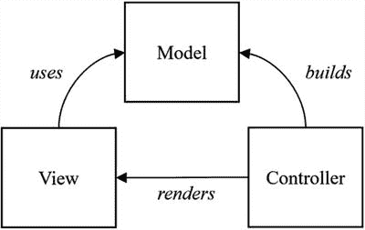
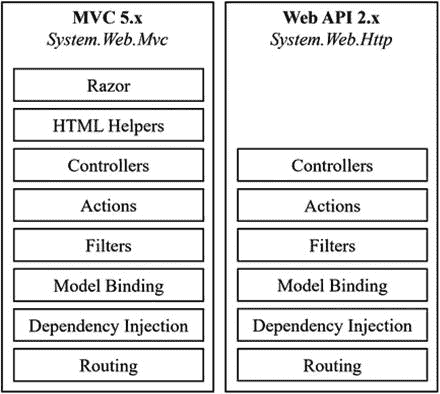
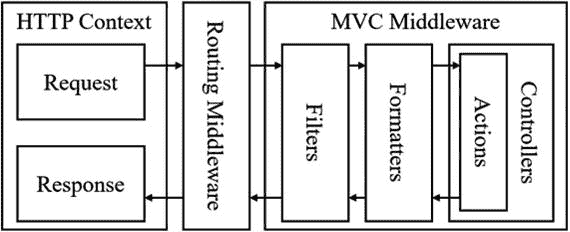
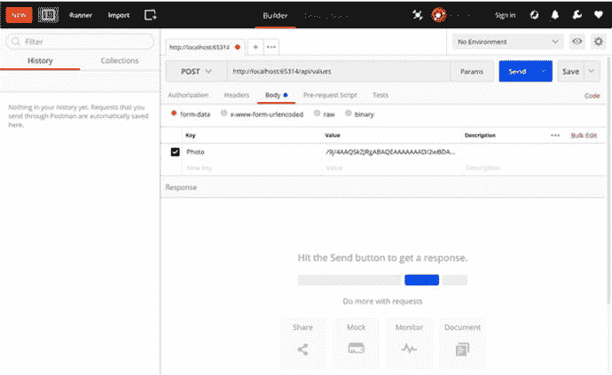
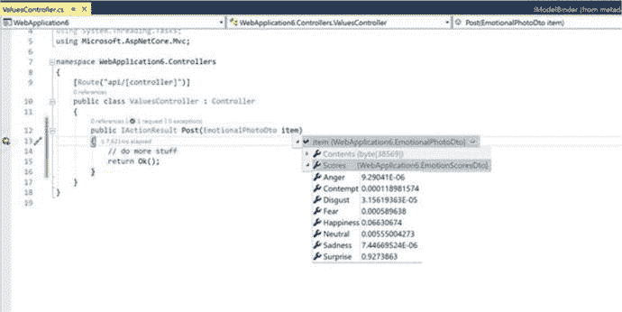
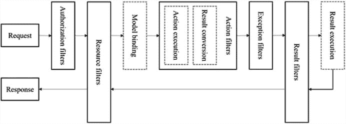

# 五、MVC

本章将重点介绍 MVC 模式在 ASP.NET Core 中的实现，特别是从 API 的角度来看，它是一个功能齐全的 web 框架。我们将探索数据如何从 HTTP 请求映射并绑定到动作参数和强类型模型，以及如何在任何数据处理发生之前验证这些模型。

在本章的最后，我们还将对控制器如何工作有一个更广泛的理解，并掌握处理传入请求的动作方法的重要性。我们将学习所有关于过滤器的知识，以及它们如何通过在处理管道中的请求之前和之后执行代码来提供帮助。

在 API 中，返回适当的响应是至关重要的，当处理许多不同类型的响应时，格式化这些响应是必不可少的。在本章中，我们还将了解内容协商如何使用格式化程序为特定请求返回特定格式的数据，以及如何创建自定义响应格式化程序来提供特定响应。

最后一节将简要介绍应用部分，这是 ASP.NET Core 中的一个新概念，它通过从应用上下文或外部程序集内发现 MVC 组件，使应用比以前更加模块化。

## MVC 模式

模型视图控制器(MVC)是一种软件设计模式，用于实现带有用户界面的 web 应用，它用于分离三个主要组件的关注点，这三个组件是模型、视图和控制器。这种架构模式已经存在很多年了，它致力于促进代码重用和同步开发。

控制器是主要的入口点，处理用户交互发起的请求。逻辑是从控制器内部执行的，然后它可能会创建一个模型，该模型包含应用的状态和围绕它的业务逻辑。然后，控制器将模型传递给视图，视图负责呈现用户界面，可能包含来自模型的数据。图 [5-1](#Fig1) 显示了这三个组件的相互作用。



图 5-1

The communication between the parts of the Model View Controller pattern

## ASP.NET Core 中的 MVC

ASP.NET Core MVC 是一个建立在 ASP.NET Core 之上的应用框架，它允许我们用清晰的关注点分离来制作动态 web 应用。与它的前身 ASP.NET MVC(版本 1 到 5)相比，新的 ASP.NET Core MVC 版本是开源的，轻量级的，并且从头开始重新设计，比以前更快更小。它的设计让我们可以完全控制标记，并提高应用的可测试性。

当我们查看 ASP.NET 的早期版本时，它包含的两个应用模型是 MVC 和 Web API。MVC 应用模型最初旨在呈现视图，用于交互式 web 应用，而 Web API 旨在提供数据响应，主要是 Web API 中使用的 XML 和 JSON 格式。

当我们研究这些应用模型中的不同组件时，我们注意到它们都包含相同的特性。虽然看起来他们在分享这些元素，但实际上他们并没有。图 [5-2](#Fig2) 显示了 ASP.NET 早期版本中 MVC 5.x 和 Web API 2.x 中组件的比较。



图 5-2

A component comparison between ASP.NET MVC 5.x and ASP.NET Web API 2.x

新的 ASP.NET Core MVC 框架通过真正共享组成 web 应用的关键组件，统一了 web UI 和 web API 概念。由于的基础结构，它本质上是跨平台的。NET 核心，并受益于与 ASP.NET Core 相同的托管机制。此外，ASP.NET Core MVC 引入了全新的用户界面概念，如视图组件、razor 页面和标签助手。

在 ASP.NET Core MVC 中，控制器、动作、过滤器、模型绑定、依赖注入和路由组件在一个统一的应用请求管道中共享。将 ASP.NET Core 中的 MVC 视为包含内部中间件基础设施的子应用中间件。

给事物命名很难。在 ASP.NET Core 的开发过程中，它最初被称为 ASP.NET vNext，后来被重命名为 ASP.NET 5，并包含 MVC，被称为 MVC 6。社区中的开发人员开始对兼容性和互操作性感到困惑，直到团队决定重新启动并选择 ASP.NET Core——一个包含可重用模块的 web 框架，使 MVC 只是一个被称为 ASP.NET Core MVC 的模块。

Note

本书描述 MVC 的内容仅限于 API 的范围，不会包含其他专门用于呈现 ui 的特性。

## 控制器和动作

在 ASP.NET Core MVC 中，控制器被用来将应用的一部分与一组标准动作或端点进行逻辑分组。它们提供了执行动作方法的基础结构。动作只是一些函数，它们可以接受参数，执行一些逻辑操作，并返回一个特定的结果，然后这个结果被传播到最终的 HTTP 响应。

动作方法可用于返回基于 UI 的 web 应用的视图，以及基于 API 的 web 应用的不同格式的数据。从请求管道，路由机制将请求中继到控制器内部包含的特定操作方法。图 [5-3](#Fig3) 显示了请求到操作方法的旅程图。



图 5-3

The flow of a request through the pipeline to action methods and back

在 ASP.NET Core 中，可以用多种方式定义控制器和动作。默认情况下，控制器类位于应用根目录下的`Controllers`文件夹中，并继承自`Microsoft.AspNetCore.Mvc.Controller`抽象类。以下示例显示了这是如何实现的:

```cs
namespace Awesome.Api.Controllers
{
    public class People : Controller
    {
        // ...
    }
    // or
    public class CustomersController : Controller
    {
        // ...
    }
}

```

或者，控制器也可以通过使用内置约定来定义，不需要从`Microsoft.AspNetCore.Mvc.Controller`继承，也称为普通旧 CLR 对象(POCO)类。POCO 类的约定是以“Controller”作为其名称的后缀，如下例所示:

```cs
namespace Awesome.Api.Controllers
{
    public class PeopleController
    {
        // ...
    }
}

```

注意，在前面的例子中,`PeopleController`类不是从`Controller`基类继承的。还可以通过在需要被归类为控制器的类上应用`[Controller]`属性来完全删除 POCO 类上的“控制器”后缀。但是碰巧有一个“控制器”后缀的普通类呢？为了防止这些普通的 POCO 类被标记为控制器，我们可以对它们应用`[NonController]`属性来否定这个约定:

```cs
namespace Awesome.Api.Controllers
{
    [Controller]
    public class Ships
    {
        // ...
    }
}

namespace Awesome.Api.Models
{
    [NonController]
    public class ShipyardController
    {
        // ...
    }
}

```

如果我们研究 ASP.NET Core MVC 的源代码，我们会注意到这正是基类`ControllerBase`的工作方式。从`Controller`继承的类，从`ControllerBase`继承，将自动获得`[Controller]`属性，因为它们驻留在`ControllerBase`类中。

当使用 IoC 容器注入依赖项时，建议遵循显式依赖原则，这意味着使用类的构造函数，并将参数显式定义为接收依赖项。

```cs
namespace Awesome.Api.Controllers
{
    public class PeopleController
    {
        private readonly IMyService _myService;
        public PeopleController(IMyService myService)
        {
            this.myService = myService;
        }
        // ...
    }
}

```

Note

控制器从后端抽象出用户界面，作为一种良好的实践，通过将繁重的工作委托给服务来将业务逻辑排除在控制器之外也很重要。

动作是使用带有潜在输入参数的公共方法定义的，它们可以返回任何类型，但大多数返回类型是`IActionResult`。动作方法也可以遵守显式和隐式约定，方法是在方法名前面加上一个 HTTP 动词，或者使用`[HttpGet]`、`[HttpPut]`、`[HttpPost]`、`[HttpDelete]`、`[HttpHead]`、`[HttpOptions]`和`[HttpPatch]`属性。

就像在非控制器的情况下一样，可以通过使用`[NonAction]`属性将带有任何 HTTP 动词前缀的方法归类为动作方法。

```cs
public class PeopleController
{
    public IActionResult Get()
    {
        // ...
    }

    public IActionResult GetOne(int id)
    {
        // ...
    }

    [HttpGet]
    public IActionResult FindPerson(string query)
    {
        // ...
    }

    public IActionResult Post(Person person)
    {
        // ...
    }

    [HttpDelete]
    public IActionResult RemovePerson(int id)
    {
        // ...
    }

    [NonAction]
    public IActionResult GetCurrentTime(int id)
    {
        // ...
    }
}

```

使用 POCO 类作为控制器很好，但是我们可以通过让控制器从`Controller`基类继承来受益于更多的内置优点。对于空响应，它提供了像`Ok`、`NotFound`和`BadRequest`这样的帮助器方法，分别用正确的 HTTP 状态码`200`、`404`和`400`来响应。我们还可以通过使用`Redirect`、`LocalRedirect`或`RedirectToRoute`方法进行重定向。当处理非空响应时，我们可以使用格式化的响应助手方法`Ok`、`Json`、`File`或`Content`用于 API，使用`View`用于呈现 HTML。

当处理内容协商时，最好使用非类型特定的方法，如`Ok`、`BadRequest`、`Created`等等。这里是一个典型的控制器，包含一些提到的助手方法:

```cs
public class PeopleController : Controller
{
    private readonly IPeopleService _peopleService;

    public PeopleController(IPeopleService peopleService)
    {
        this._peopleService = peopleService;
    }
    public IActionResult Get()
    {
        var people = _peopleService.GetAllPeople();

        return Ok(people);
    }

    public IActionResult Get(int id)
    {
        if (_peopleService.DoesExists(id))
        {
            var person = _peopleService.GetOnePerson(id);

            return Ok(person);
        }
        return NotFound();
    }

    public IActionResult Post(Person person)
    {
        if (_peopleService.Validated(person))
        {
            _peopleService.Create(person);

            return CreatedAtAction(nameof(this.Get), person.Id);
        }
        return BadRequest();
    }
}

```

如果您不想使用所提供的`Controller`类，并且喜欢遵循 POCO 风格的约定，那么只需返回一个`IActionResult`的新实例就可以获得相同的结果。下面是相同代码的一个片段，但是使用 POCO 风格进行了重构:

```cs
public class PeopleController
{
    // ...

    public IActionResult Get()
    {
        var people = _peopleService.GetAllPeople();
        return new OkObjectResult(people);

    }

    public IActionResult Get(int id)
    {
        if (_peopleService.DoesExists(id))
        {
            var person = _peopleService.GetOnePerson(id);
            return new OkObjectResult(person);
        }
        return new NotFoundResult();

    }

    // ...
}

```

现在让我们为端点添加路由。我们在第 4 章中讨论了路由的一些方面，特别是在 MVC 世界中，我们可以使用路由将来自特定路由的请求绑定到动作方法。

为 MVC 应用定义路由有两种方式——即使用`IRouteBuilder`和使用基于属性的路由。我们之前已经看到了一些`IRouteBuilder`的例子，但是这里有一个在 MVC 环境中`Startup`中`Configure`方法的简单例子:

```cs
public void Configure(IApplicationBuilder app, IHostingEnvironment env)
{
    app.UseMvc(builder =>
    {
        builder.MapRoute("default", "api/{controller}/{action}/{id?}"));
    });
}

```

在前面的例子中，我们创建了一个全局路由来捕捉所有相关的请求，这些请求带有一个匹配`[controller]/[action]/`的 URL，后跟一个可选的标识号。从 REST 的角度来看，最好通过 HTTP 动词来推断动作方法，这正是属性路由派上用场的地方。

顾名思义，属性路由允许我们直接在控制器和动作方法上显式定义端点的路由。在下面的例子中，我们看到一个典型的控制器利用基于属性的路由:

```cs
[Route("api/[controller]")]
public class PeopleController
{
    // GET api/people
    [HttpGet("")]
    public IEnumerable<string> Get()
    {
        // ...
    }

    // GET api/people/top
    [HttpGet("top/{n}")]
    public IEnumerable<string> GetTopN(int n)
    {
        // ...
    }

    // POST api/person
    [HttpPost("~/api/person")]
    public IEnumerable<string> Post(Person person)
    {
        // ...
    }
}

```

在我看来，这比直接使用`IRouteBuilder`更具声明性。在控制器上使用`[Route]`属性定义所有底层动作的基本路线，然后每个动作可以包含一个或多个在`[Http...]`属性中指定的相对路线模板，除非它们以波浪符(`~`)开始，这将覆盖基本路线，如第三个动作方法所示。

通过推断一些显而易见的管道，在我们的编码中使用约定会使事情变得容易得多。如果我们喜欢更具声明性的东西，ASP.NET Core MVC 的架构甚至允许我们改变约定。让我们看一下框架提供的`IApplicationModelConvention`接口的签名，该接口用于在 MVC 中实现定制约定:

```cs
public interface IApplicationModelConvention
{
    void Apply(ApplicationModel application);
}

```

`Apply`函数接收一个`ApplicationModel`，这是我们的 MVC 应用的一个表示。一个`ApplicationModel`包含一个`ControllerModel`对象的集合，T3 包含一个`ActionModel`对象的集合。约定设计的目标是将任何遵循特定约定的类映射到所提供的抽象结构中。

够简单吗？让我们试一试，实现我们自己的约定，使用“Api”后缀代替“Controller”后缀来将 POCO 类标记为控制器。此外，在本例中，我们希望从名称空间中推断出我们的路由。实现如下所示:

```cs
public class AwesomeApiControllerConvention : IApplicationModelConvention
{
    public void Apply(ApplicationModel application)
    {
        var controllers = Assembly

            .GetExecutingAssembly()

            .GetExportedTypes()

            .Where(t => t.Name.EndsWith("Api"));

        foreach (var controller in controllers)
        {
            var controllerName = controller.Name.Replace("Api", "");

            var model = new ControllerModel(controller.GetTypeInfo(), controller.GetCustomAttributes().ToArray());
            model.ControllerName = controllerName;
            model.Selectors.Add(new SelectorModel
            {
                AttributeRouteModel = new AttributeRouteModel()
                {
                    Template = $"{controller.Namespace.Replace(".", "/")}/{controllerName}"

                }
            });

            foreach (var action in controller.GetMethods().Where(p => p.ReturnType == typeof(IActionResult)))
            {
                var actionModel = new ActionModel(action, new object[] { new HttpGetAttribute() })
                {
                    ActionName = action.Name
                };
                actionModel.Selectors.Add(new SelectorModel());
                model.Actions.Add(actionModel);
            }
            application.Controllers.Add(model);
        }
    }
}

```

首先扫描当前程序集中名称以“Api”结尾的公共类。对于这些类中的每一个，都会创建一个`ControllerModel`，将控制器的名称指定为该类的名称(不包括“Api”)，并将其路由模板设置为带有正斜杠的名称空间。

对于每个返回类型为`IActionResult`的公共方法，都会创建一个`ActionModel`的新实例，并在适当的位置连接适当的动作名称。一旦所有的动作都被注册，它们被添加到它们适用的`ControllerModel`，然后被添加到`ApplicationModel`。

剩下要做的就是告诉 ASP.NET Core 关于这个公约。我们可以替换默认约定，也可以添加新的约定。在下面的例子中，通过将自定义约定添加到约定列表中，您可以看到它是如何连接到`ConfigureServices`方法中的:

```cs
public void ConfigureServices(IServiceCollection services)
{
    services
        .AddSingleton<IPeopleRepository,PeopleRepository>()
        .AddMvc((o) =>
        {
            o.Conventions.Add(new AwesomeApiControllerConvention());
        });
}

```

使用下面的 POCO 类，我们可以测试自定义约定。请注意，它位于一个特殊的名称空间中，该名称空间声明其路由并包含一个以“Api”结尾的名称:

```cs
namespace Api.People
{   
    public class NamesApi
    {
        private readonly IPeopleRepository people;
        public NamesApi(IPeopleRepository people)
        {
            this.people = people;
        }
        public IActionResult Get()
        {
            return new OkObjectResult(people.All);
        }       
    }
}

```

现在，在快速构建和运行之后，是时候测试新的约定了！当发出请求`GET api/people/names,`时，使用浏览器或任何其他 HTTP 客户端，您会注意到返回的预期响应。

## 模型绑定和验证

在 ASP.NET Core MVC 中，传入的请求被映射到动作方法的参数，这些参数可以是简单的类型，如整数和字符串，也可以是更复杂的类型，如完整的数据传输对象(d to)。将 HTTP 请求绑定到方法参数的过程称为模型绑定，它抽象出映射逻辑，以防止一次又一次地重写同一个映射。

例如，对于路由模板`api/{controller}/foo/{action}/{name?}`，请求`GET /api/people/foo/search/fanie?top=5`将调用`PeopleController`中的`Search`动作方法，参数`name`为 fanie，参数`top`为 5。

```cs
[Route("api/{controller}/foo/{action}")]
public class PeopleController
{
    [HttpGet("{name?")]
    public IActionResult Search(string name, int top)
    {
        // ...
    }        
}

```

注意，`name`参数是在 route 中指定的，而不是在`id`中指定的，它仍然从查询参数中映射`id`参数。如果`name`参数不是路径的一部分，它的值将尝试从查询参数中解析出来。

同样，让我们看一个指定为`[HttpPost("~/api/people")]`的路由模板，并给出一个带有如下参数的`POST`请求:

```cs
POST /api/people?name=Fanie&surname=Reynders

```

它将调用`PeopleController`上的`Post`动作方法，接受一个`PersonDto`作为复杂类型，其值从有效负载中的`name`和`surname`属性映射而来。

```cs
    [HttpPost("~/api/people")]
    public IActionResult Post(PersonDto person)
    {
    // ...
}

```

我们可以通过使用内置的`[FromBody]`、`[FromForm]`、`[FromHeader]`、`[FromRoute]`和`[FromServices]`属性明确地标记参数的来源来控制模型绑定的默认行为。

将原始 JSON 数据发送到前面的示例不会绑定到`person`参数，导致其值保持为`null`。这是因为原始数据包含在请求体中，为了解决这个问题，我们需要用`[FromBody]`标记`person`参数。修复代码后，以下请求将正确调用操作方法:

```cs
POST /api/people

{
    "name":"Fanie",
    "surname":"Reynders"
}

```

下面是包含参数修改的代码，用于将请求参数绑定到请求正文:

```cs
[HttpPost("~/api/people")]
public IActionResult Post([FromBody]PersonDto person)
{
    // ...
}

```

假设我们需要绑定到来自以下请求的请求头中的特定条目:

```cs
POST /api/people
Content-Type: application/json
Access-Token: 1234abcd
ClientId: MyClient1

{
    "name":"Fanie",
    "surname":"Reynders"
}

```

我们可以简单地使用`[FromHeader]`属性，并将其应用于适当的动作方法参数:

```cs
[HttpPost("~/api/people")]
public IActionResult Post([FromBody]PersonDto person, [FromHeader(Name="Access-Token")]string accessToken, [FromHeader]string clientId)
{
    // ...
}

```

ASP.NET Core 中关于模型绑定的一个伟大的事情是它是非常可定制的。这在我们希望使用来自传入请求的数据来查找一些结果，并将结果绑定到动作结果中的特定参数类型的场景中非常有用。

我们可以通过实现`IModelBinder`接口来构建定制的模型绑定:

```cs
public interface IModelBinder
{
    Task BindModelAsync(ModelBindingContext bindingContext);
}

```

例如，假设我们有一个 API 端点，它接收一张照片的 Base64 `string`,并对其执行情感识别。通常，我们会让一个动作方法接受一个`string`参数作为照片的 Base64 内容，然后执行逻辑来检索动作中的情感统计数据。

在这种情况下，自定义模型绑定非常有用，它允许我们在 action 方法中接收一个强类型对象，该对象包含一个带有情感统计信息的对象，而不是一个简单的字符串值。下面是一个实现`IModelBinder`的类的片段:

```cs
public class AwesomeModelBinder : IModelBinder
{
    public async Task BindModelAsync(ModelBindingContext bindingContext)
    {
        const string propertyName = "Photo";
        var valueProviderResult = bindingContext.ValueProvider.GetValue(propertyName);
        var base64Value = valueProviderResult.FirstValue;
        if (!string.IsNullOrEmpty(base64Value))
        {
            var bytes = Convert.FromBase64String(base64Value);
            var emotionResult = await GetEmotionResultAsync(bytes);
            var score = emotionResult.First().Scores;
            var result = new EmotionalPhotoDto
            {
                Contents = bytes,
                Scores = score
            };

            bindingContext.Result = ModelBindingResult.Success(result);
        }
        await Task.FromResult(Task.CompletedTask);
    }

    // ...
}

```

`BindModelAsync`方法检索模型上`Photo`属性的第一个值，然后将其转换成一个`byte`数组，该数组然后被传递给`GetEmotionResultAsync`函数，用于执行情感统计分析。返回的结果用于构建一个新的`EmotionalPhotoDto`对象，包含照片内容以及照片的情感统计。最后，绑定上下文的结果被成功设置为`EmotionalPhotoDto`对象的值。

下面是`GetEmotionResultAsync`函数的内容，它使用一个`HttpClient`对微软认知服务 REST API 的情感 API 进行服务调用，以检索给定图像的情感统计数据:

```cs
private static async Task<EmotionResultDto[]> GetEmotionResultAsync(byte[] byteArray)
{
    var client = new HttpClient();
    client.DefaultRequestHeaders.Add("Ocp-Apim-Subscription-Key", <SUBSCRIPTION_KEY>); //
    var uri = "https://<SUBSCRIPTION_LOCATION>.api.cognitive.microsoft.com/emotion/v1.0/recognize?";
    using (var content = new ByteArrayContent(byteArray))
    {
        content.Headers.ContentType = new MediaTypeHeaderValue("application/octet-stream");
        var response = await client.PostAsync(uri, content);
        var responseContent = await response.Content.ReadAsStringAsync();
        var result = JsonConvert.DeserializeObject<EmotionResultDto[]>(responseContent);
        return result;
    }
}

```

该函数以数组`EmotionResultDto`的形式返回响应，如下所示:

```cs
public class EmotionResultDto
{
    public EmotionScoresDto Scores { get; set; }
}

public class EmotionScoresDto
{
    public float Anger { get; set; }
    public float Contempt { get; set; }
    public float Disgust { get; set; }
    public float Fear { get; set; }
    public float Happiness { get; set; }
    public float Neutral { get; set; }
    public float Sadness { get; set; }
    public float Surprise { get; set; }
}

```

在控制器上，我们有一个接收类型为`EmotionalPhotoDto`的参数的`Post`动作，如下所示:

```cs
[ModelBinder(typeof(AwesomeModelBinder))]
public class EmotionalPhotoDto
{
    public byte[] Contents { get; set; }
    public EmotionScoresDto Scores { get; set; }
}

```

注意，`EmotionalPhotoDto`类是用`ModelBinder`属性修饰的，以将其映射到`AwesomeModelBinder`。运行应用后，我们使用 Postman 向端点发送请求，如图 [5-4](#Fig4) 所示。



图 5-4

The Postman client sending a request to the API

当请求被触发时，我们注意到在`Post`动作中期望的参数现在被给定照片的情感统计正确地绑定了。图 [5-5](#Fig5) 显示了一个被点击的断点，确认了我们的定制模型绑定正在按预期工作。



图 5-5

The breakpoint is hit, showing the bound parameter

如果您不喜欢在类上使用`ModelBinder`属性，您可以使用模型绑定器提供者。您需要做的就是实现`IModelBinderProvider`:

```cs
public class AwesomeModelBinderProvider : IModelBinderProvider
{
    public IModelBinder GetBinder(ModelBinderProviderContext context)
    {
        if (context.Metadata.ModelType == typeof(EmotionalPhotoDto))
        {
            return new BinderTypeModelBinder(typeof(AwesomeModelBinder));
        }

        return null;
    }
}

```

当提供者运行时，它返回特定模型类型的适当模型绑定器。剩下要做的就是告诉 ASP.NET Core MVC 关于这个提供者；然后，就不再需要使用`ModelBinder`属性了。

```cs
public void ConfigureServices(IServiceCollection services)
{
    services.AddMvc(options =>
    {
        options.ModelBinderProviders.Insert(0, new AwesomeModelBinderProvider());
    });
}

```

在模型绑定之后，模型验证的概念是指在数据用于进一步处理之前对其进行验证。在 ASP.NET Core 中，为了方便起见，使用内置的验证属性来简化验证。使用这些属性应用验证只需要我们在需要验证的类上修饰适当的属性。当评估模型的有效性时，ASP.NET Core MVC 会处理剩下的事情。下面的示例 DTO 类展示了我们如何在一个`Person`资源上实现简单的验证:

```cs
public class PersonDto
{
    [Required]
    public int Id { get; set; }
    [Required, MaxLength(20)]
    public string FirstName { get; set; }
    [MinLength(5)]
    public string LastName { get; set; }
    [EmailAddress]
    public string Email { get; set; }
    [Url]
    public string BlogUrl { get; set; }
    [Range(1, 5)]
    public int Level { get; set; }
}

```

前面代码中使用的属性基本上是不言自明的。为了验证某个对象，我们可以检查由`ControllerBase`类提供的`ModelState.IsValid`属性。下面是一个如何验证模型的示例:

```cs
public IActionResult Post([FromBody] PersonDto item)
{
    if (ModelState.IsValid)
    {
        // do more stuff
        return Ok();
    }
    else
    {
        return BadRequest(ModelState);
    }
}

```

Tip

当使用 POCO 控制器类时，`ModelState`属性不是直接可用的，但是可以通过注入一个`IActionContextAccessor`构造函数参数并从提供的`ActionContext`中读取`ModelState`属性来显式获取。

在请求有效负载中使用以下无效数据调用`Post`端点时:

```cs
POST /api/values
Content-Type: application/json

{
       "blogUrl":"http:\\www.example.org"
}

```

我们将得到以下响应，因为`ModelState.IsValid`被评估为`false`:

```cs
{
    "Level": [
        "The field Level must be between 1 and 5."
    ],
    "BlogUrl": [
        "The BlogUrl field is not a valid fully-qualified http, https, or ftp URL."
    ],
    "FirstName": [
        "The FirstName field is required."
    ]
}

```

一般来说，框架中提供的验证属性就足够了，但是如果需要的话，我们完全可以创建自己的验证规则。定制验证可以通过两种方式完成——即通过从`ValidationAttribute`继承定制属性作为验证属性，或者通过让模型实现`IValidatableObject`接口。

假设我们想要构建一个自定义验证属性，检查值是否以大写字母开头。下面的代码展示了我们如何通过创建一个继承自`ValidationAttribute`并覆盖`IsValid`函数的类来实现这一点:

```cs
public class StartsWithCapitalLetterAttribute : ValidationAttribute
{
    protected override ValidationResult IsValid(object value, ValidationContext validationContext)
    {
        if (value?.ToString()[0] != value?.ToString().ToUpper()[0])
        {
            return new ValidationResult("Value must start with capital letter");
        }
        return ValidationResult.Success;
    }
}

```

现在我们可以用一个`StartsWithCapitalLetter`属性来修饰适用的字符串属性。做同样的验证逻辑，但是不使用属性，要求我们让模型实现`IValidatableObject`接口。以下是`PersonDto`的摘录:

```cs
public class PersonDto: IValidatableObject
{
    //...

    private bool StartsWithCaps(string value)
    {
        return !string.IsNullOrWhiteSpace(value) && value[0].Equals(value.ToUpper()[0]);
    }
    public IEnumerable<ValidationResult> Validate(ValidationContext validationContext)
    {
        const string message = "Value must start with capital letter";
        var results = new List<ValidationResult>();
        if (!StartsWithCaps(FirstName))
        {
            yield return new ValidationResult(message,new[] { nameof(FirstName) });
        }
        if (!StartsWithCaps(LastName))
        {
            yield return new ValidationResult(message, new[] { nameof(LastName) });
        }
    }
}

```

模型绑定和模型验证都是确保 API 在 ASP.NET Core 中正确工作的基本元素，并在代码的抽象性、可伸缩性和可维护性方面提供了巨大的好处。

## 过滤

就像中间件一样，ASP.NET Core MVC 中的过滤器提供了一种在管道的特定阶段之前和之后执行代码的机制。筛选器有自己的子管道，其中包含按特定顺序运行的筛选器。过滤器分为五种类型。图 [5-6](#Fig6) 显示了过滤器背景下的管道概况。



图 5-6

The request pipeline when interacting with filters

授权过滤器总是首先运行，它们的作用是确定 HTTP 上下文中的用户是否有足够的权限访问当前请求。它们可以缩短请求以返回特定结果，并实现`IAsyncAuthorizationFilter`或`IAsyncAuthorizationFilter`接口。

资源过滤器就在授权过滤器之后运行，并且可以在管道的其余部分之前和之后运行逻辑。它们就在模型绑定过程之前运行，可以执行工作来暗示模型的状态。使用资源过滤器，还可以缩短请求，它们实现了`IAsyncResourceFilter`或`IResourceFilter`接口。

在执行操作方法之前和之后，操作过滤器会立即运行，并可以操作请求和响应。动作过滤器实现了`IAsyncActionFilter`或`IActionFilter`接口。

在未处理异常的情况下，异常过滤器用于在将任何输出写入响应之前将策略应用于未处理的异常；这些过滤器实现了`IAsyncExceptionFilter`或`IExceptionFilter`接口。

结果过滤器在结果执行之前立即运行，并且仅在操作方法成功完成且没有任何错误时运行。结果过滤器实现了`IAsyncResultFilter`或`IResultFilter`接口。

过滤器可以作为属性显式应用，也可以在`Startup`类中全局注册。在我们创建动作过滤器之前，让我们研究一下`IAsyncActionFilter`和`IActionFilter`的签名:

```cs
public interface IAsyncActionFilter : IFilterMetadata
{
    Task OnActionExecutionAsync(ActionExecutingContext context, ActionExecutionDelegate next);
}

public interface IActionFilter : IFilterMetadata
{
    void OnActionExecuted(ActionExecutedContext context);
    void OnActionExecuting(ActionExecutingContext context);
}

```

Note

过滤器应该使用接口的同步或异步版本来实现，因为框架首先检查异步版本的实现，然后检查同步版本。异步过滤器总是优先于同步过滤器实现。

现在，让我们实现一个动作过滤器，这样我们可以通过一个实际的例子更好地理解过滤器。当处理请求时，我们将构建的动作过滤器会将路由值集合中的`timestamp`分配给当前时间戳。动作方法还将通过模型绑定从其参数中访问这个`timestamp`变量，它将在响应中使用这个变量。当操作完成时，在结果呈现之前，一个新的头`X-EXPIRY-TIMESTAMP`将被添加到响应头中，并将具有原始时间戳加上一个小时的值。

以下是同步和异步样式的实现:

```cs
public class TimestampFilter : IActionFilter, IAsyncActionFilter
{
    public void OnActionExecuting(ActionExecutingContext context)
    {
        context.ActionDescriptor.RouteValues["timestamp"] = DateTime.Now.ToString();
    }

    public void OnActionExecuted(ActionExecutedContext context)
    {
        var ts = DateTime.Parse(context.ActionDescriptor.RouteValues["timestamp"])
            .AddHours(1)
            .ToString();
        context.HttpContext.Response.Headers["X-EXPIRY-TIMESTAMP"] = ts;
    }

    public async Task OnActionExecutionAsync(ActionExecutingContext context, ActionExecutionDelegate next)
    {
        this.OnActionExecuting(context);
        var resultContext = await next();
        this.OnActionExecuted(resultContext);
    }
}

```

`OnActionExecuting`方法在动作执行前运行，`OnActionExecuted`方法在动作方法执行后运行。注意，我们利用了来自`OnActionExecutionAsync`中异步代码的同步实现。要注册过滤器以全局应用于所有动作，我们需要将它添加到`MvcOptions`上的`Filters`集合中:

```cs
public void ConfigureServices(IServiceCollection services)
{
    services.AddMvc(options =>
    {
        options.Filters.Add(typeof(TimestampFilter));
    });
}

```

为了能够将我们的过滤器显式地应用于某些动作方法，我们需要从`Attribute`继承`TimestampFilter`类，并可选地将其重命名为`TimestampFilterAttribute`:

```cs
public class TimestampFilterAttribute : Attribute, IActionFilter, IAsyncActionFilter
{
    //...
}

```

前面的代码将允许我们将适用的动作方法修饰为一个`TimestampFilterAttribute`属性:

```cs
[TimestampFilter]
public string Get(string timestamp)
{
    return $"Request received at {timestamp}";
}

```

过滤器机制允许代码在逻辑执行层中高度可重用和分离。

## 格式化响应

正如您在本章中可能已经注意到的，action 方法中使用的返回类型选择是`IActionResult`，这本身不是必需的，但被认为是一种最佳实践，因为响应不仅限于一种特定类型，因为它们可能成功也可能失败。

为了显式地强制特定类型的输出，我们可以用具体的类型来替换`IActionResult`，比如说`IEnumerable<T>`，然后它将返回到默认的输出格式化程序来呈现响应。此外，将输出强制为特定类型可以通过使用具体的动作结果来实现，比如用`JsonResponse`输出 JSON，或者用`ContentResponse`输出纯文本。强制特定输出格式的另一种方式是利用`[Produces(...)]`过滤器，它可以应用于全局、控制器或动作范围。

在 RESTful 服务中，内容协商是让客户端使用在`Accept`头中传递的特定媒体类型值来指定输出的预期格式的过程。默认情况下，ASP.NET Core MVC 实现了一个 JSON 格式化程序，但是当它们被传递时，也支持其他格式，只要它们在启动时在框架内被正确注册。

Web 浏览器可能会提供包含多种格式以及通配符的`Accept`标题。当请求来自网络浏览器时，默认情况下，ASP.NET Core MVC 会忽略`Accept`报头，并以标准的配置格式进行响应。这种行为是为了保持一致性，但是可以通过在`MvcOptions`中将`RespectBrowserAcceptHeader`显式设置为`true`来覆盖。

内容协商使得以不同的格式提供来自相同动作方法的响应成为可能。要将 XML 格式化添加到我们的 API 中，我们只需在将 MVC 添加到服务集合中时，通过添加 XML 序列化程序格式化程序来注册 XML 输入和输出序列化:

```cs
services.AddMvc().AddXmlSerializerFormatters();

```

我们可以通过在`MvcOptions`中注册特定的输入或输出格式化程序来控制对它们的支持:

```cs
services.AddMvc(options =>
{
    options.OutputFormatters.Add(new XmlSerializerOutputFormatter());
});

```

当我们希望内容协商处理默认 JSON、XML 或纯文本格式化程序不支持的内容类型时，我们可以构建自定义格式化程序来处理特殊的媒体类型格式。在下面的例子中，`PeopleController`通过它的`Get`动作方法传递一个人员数组:

```cs
[Route("api/[controller]")]
public class PeopleController : Controller
{
    //...

    public IActionResult Get()
    {
        IEnumerable<Person> result = people;
        return Ok(result);
    }
}

```

如果我们还想支持逗号分隔值(CSV)格式，我们可以创建一个实现`OutputFormatter`抽象类的类，如下所示:

```cs
public class CsvOutputFormatter : OutputFormatter
{
    private const string delimiter = ",";
    private const string contentType = "text/csv";
    public CsvOutputFormatter()
    {
        SupportedMediaTypes.Add(MediaTypeHeaderValue.Parse("text/csv"));
    }

    protected override bool CanWriteType(Type type) => type.GetInterfaces().Contains(typeof(System.Collections.IEnumerable));

    public async override Task WriteResponseBodyAsync(OutputFormatterWriteContext context)
    {
        var type = context.Object.GetType();
        Type itemType;

        if (type.GetGenericArguments().Length > 0)
        {
            itemType = type.GetGenericArguments()[0];
        }
        else
        {
            itemType = type.GetElementType();
        }

        var stringWriter = new StringWriter();
        var header = string.Join(",", itemType.GetProperties().Select(x => x.Name));
        stringWriter.WriteLine(header);

        foreach (var item in (IEnumerable<object>)context.Object)
        {
            var values = item.GetType().GetProperties().Select(pi => new { Value = pi.GetValue(item, null)});

            var valueLine = string.Empty;

            foreach (var val in values)
            {
                if (val.Value != null)
                {
                    valueLine = string.Concat(valueLine, val.Value.ToString(), delimiter);
                }
                else
                {
                    valueLine = string.Concat(valueLine, string.Empty, delimiter);
                }
            }
            stringWriter.WriteLine(valueLine);
        }

        var streamWriter = new StreamWriter(context.HttpContext.Response.Body);
        await streamWriter.WriteAsync(stringWriter.ToString());
        await streamWriter.FlushAsync();
    }
}

```

分解前面的位，我们在类的构造函数中指定 text/csv 作为支持的媒体类型。`CanWriteType`属性评估响应是否有资格被转换为 CSV。在这种情况下，我们假设`IEnumerable`的任何结果类型都是合格的。

`WriteResponseBodyAsync`方法负责构建 CSV 输出。它做的第一件事是确定它正在处理的类型的属性，然后将每个属性的名称作为第一行写入一个`StringWriter`，用逗号分隔。

接下来，它遍历集合中的每一项，并尝试将它们的值解析为一个字符串，然后向`StringWriter`写入一个逗号分隔的行。最后，它使用一个`StreamWriter`将`StringWriter`的字符串值写入`Response`主体。

我们不应该忘记在`MvcOptions`中注册这个输出格式化程序:

```cs
services.AddMvc(options =>
{
    options.OutputFormatters.Add(new CsvOutputFormatter());
});

```

现在，当我们将 text/csv 指定为对 People API 端点的请求中的`Accept`头时，我们应该得到 csv 格式的响应。

## 应用部件

在 ASP.NET Core MVC 中，应用的每个特性都作为应用的一部分被添加，这是对其资源的抽象。通过使用应用部件，我们可以发现应用中使用的外部组件，这些组件甚至可以位于单独的程序集中。

假设我们有一个已编译的类库，其中包含一个名为`PeopleController`的特定控制器，它返回一个人名列表，位于服务器上的一个特定文件夹中。我们可以利用`AddApplicationPart`扩展方法在运行时从给定的程序集中添加应用部件。

下面是一个应用的配置示例，该应用从磁盘上特定文件夹的外部程序集中导入所有 MVC 位:

```cs
public void ConfigureServices(IServiceCollection services)
{
    var assembly = Assembly.LoadFile(@"C:\folder\mylib.dll");
    services.AddMvc()
            .AddApplicationPart(assembly);
}

```

由于这个应用不直接包含任何控制器，当我们运行它时，当它设法调用来自指定外部位置的动作方法时，奇迹就开始发生了。

Tip

应用部分不仅适用于控制器，也适用于 ASP.NET Core MVC 的其他特性，比如`TagHelpers`和`ViewComponents`。

## 包扎

这是多么激动人心的一章啊！在学习了 MVC 模式的工作原理之后，我们了解了 ASP.NET Core 中新的 MVC 框架，以及它相对于其前辈的特性。

我们学习了 MVC 中间件管道的所有内容，包括控制器和动作，然后继续学习更高级的主题，如模型绑定、模型验证和过滤器。我们还获得了关于如何利用约定的力量让 MVC 屈从于我们的需求的有用见解。

在上一节中，我们介绍了如何格式化响应，并看到了创建用于输出 CSV 数据的自定义格式化程序是多么容易。最后，我们简要概述了应用部件，它们允许我们从外部来源将特定的特性导入到我们的应用中。

这一章从 API 的角度总结了 ASP.NET Core MVC，尽管关于这个优秀的框架还有很多需要学习，我们将进入下一章，在那里我们将讨论 ASP.NET Core 的配置模型。