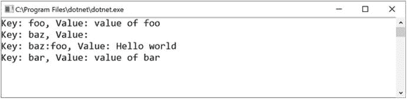
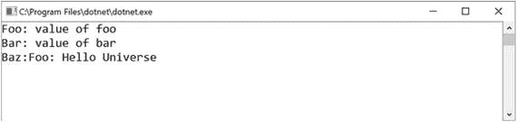
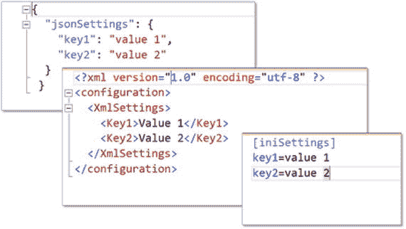
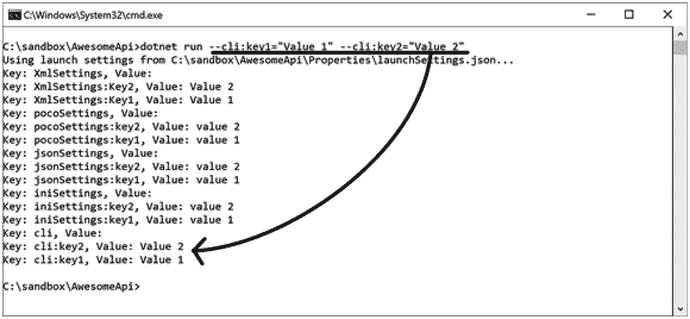
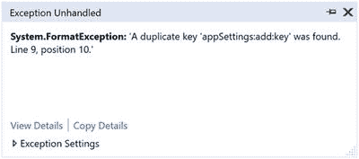

# 六、配置模型

有句话说得好:“不要硬编码，用硬编码代替。”很糟糕，我知道。几乎所有的应用都有配置数据。其中一些被整齐地保存在一个配置文件中，而其他的只是以一种快速而肮脏的方式硬编码。通过使用配置，我们使我们的代码更加可重用，并且可以快速改变它的工作方式，而无需我们去思考它。

配置数据应该存在于应用之外。如果你有硬编码的冲动，停下来想想它对应用未来可伸缩性的影响。当我们将配置从应用中分离出来时，它允许我们部署相同的代码在不同的环境中做不同的事情。

作为。NET 开发人员，我们应该熟悉传统的`app.config`和`web.config`文件，它们为每个应用的特定配置提供了一种机制。ASP.NET Core 没有什么不同，但是具有更好的存储和提供配置数据的机制。事实上，ASP.NET Core 中的新配置模型更加简化、灵活和可扩展。与它的前辈相比，它设置了相当高的标准。用外行人的话来说，就是牛逼。

ASP.NET Core 提供了一个配置 API，用于处理基于名称-值对集合的 web 应用中的配置。可以在运行时从多个来源读取配置数据，并将其分组到多级层次结构中。

在本章中，我们将重点了解 ASP.NET Core 中配置的基本概念，以及如何利用提供的 API 将特定于环境的配置数据从多个来源读入强类型对象。

## 基本配置

考虑下面的 JSON 文件，它位于根目录中，名为`awesomeConfig.json`；它包含一些任意的配置数据:

```cs
{
  "foo": "value of foo",
  "bar": "value of bar",
  "baz": {
      "foo": "Hello world"
  }
}

```

我们可以通过创建一个利用了`ConfigurationBuilder`的`IConfigurationRoot`来在 ASP.NET Core 应用中使用这个配置文件:

```cs
public class Program
{
    public static IConfigurationRoot Configuration { get; set; }
    public static void Main(string[] args)
    {
        var builder = new ConfigurationBuilder()
           .SetBasePath(Directory.GetCurrentDirectory())
           .AddJsonFile("awesomeConfig.json");
        Configuration = builder.Build();

        foreach (var item in Configuration.AsEnumerable())
        {
            Console.WriteLine($"Key: {item.Key}, Value: {item.Value}");
        }

        Console.ReadKey();
    }
}

```

在前面的例子中，我们创建了一个新的`ConfigurationBuilder`，它使用`AddJsonFile`扩展方法从当前目录加载`awesomeConfig.json`文件。在构建器上调用`Build`会输出一个`IConfigurationRoot`的实例，它实现了`IConfiguration`，允许我们枚举它的键值对。图 [6-1](#Fig1) 显示了执行代码的输出。



图 6-1

Example code that reads configuration data from a file

请注意，`awesomeConfig.json`文件包含分层数据，但在`IConfiguration`中被展平为简单的键值对。为了从`IConfiguration`中读出数值，我们可以简单地通过按键来引用它们:

```cs
Console.WriteLine($"Foo: {Configuration["foo"]}");
Console.WriteLine($"Bar: {Configuration["bar"]}");
Console.WriteLine($"Baz:Foo: {Configuration["baz:foo"]}");

```

可以用冒号(:)字符作为分隔符来引用`baz`内部的`foo`的层次值。由于配置文件可以包含多个层次结构级别，因此最好使用以下部分对相似的设置进行分组:

```cs
var bazSection = Configuration.GetSection("baz");
Console.WriteLine($"Baz:Foo: {bazSection ["foo"]}");

```

当同时处理多个配置文件时，配置数据按照指定的顺序加载，因此最新的值会覆盖具有相同键的任何以前的值。例如，给定以下文件-

awesomeConfig.json 的内容:

```cs
{
  "foo": "value of foo",
  "bar": "value of bar",
  "baz": {
    "foo": "Hello world"
  }
}

```

awesomeConfig2.json 的内容:

```cs
{
  "baz": {
    "foo": "Hello Universe"
  }
}

```

我们可以通过加载另一个包含新配置值的文件来覆盖特定的配置，使其优先于以前的配置值。以下代码片段显示了如何通过从多个文件加载数据来覆盖配置数据:

```cs
var builder = new ConfigurationBuilder()
    .SetBasePath(Directory.GetCurrentDirectory())
    .AddJsonFile("awesomeConfig.json")
    .AddJsonFile("awesomeConfig2.json");

```

图 [6-2](#Fig2) 显示了从`awesomeConfig.json`和`awesomeConfig2.json`加载配置数据运行应用后的输出。注意来自`awesomeConfig.json`的原始值被保存，只有在`awesomeConfig2.json`中指定的值会覆盖原始值。



图 6-2

Output of an application using inherited and overridden configurations

## 配置提供程序

可以从包含许多不同格式的许多不同来源加载配置。配置提供者负责将特定格式的配置从预定义的源传递到 ASP.NET Core 的配置模型。

ASP.NET Core 提供了现成的默认配置提供程序，允许从文件(JSON、XML 和 INI 格式)、命令行参数、环境变量和内存中加载配置。NET 对象、加密的用户机密存储、Azure 密钥库以及我们可以创建的自定义提供程序。

以下示例显示了我们如何从 ASP.NET Core 支持的多个来源和格式加载配置:

```cs
public static void Main(string[] args)
{
    var someSettings = new Dictionary<string, string>()
    {
        { "poco:key1","value 1" },
        { "poco:key2","value 2" }
    };
    var builder = new ConfigurationBuilder()
        .SetBasePath(Directory.GetCurrentDirectory())
        .AddJsonFile("awesomeConfig.json")
        .AddXmlFile("awesomeConfig.xml")
        .AddIniFile("awesomeConfig.ini")
        .AddCommandLine(args)
        .AddEnvironmentVariables()
        .AddInMemoryCollection(someSettings)
        .AddUserSecrets("awesomeSecrets")
        .AddAzureKeyVault("https://awesomevault.vault.azure.net/", "<clientId>", "<secret>");

    Configuration = builder.Build();

    // ...
}

```

图 [6-3](#Fig3) 显示了`AddJsonFile`、`AddXmlFile`和`AddIniFile`扩展方法加载的文件源的内容。



图 6-3

Example configuration in JSON, XML, and INI formats

更多的设置可以从可选的命令行参数加载到应用中。当通过 CLI 运行应用时，我们可以在命令提示符下执行以下命令:

```cs
$ dotnet run --cli:key1="Value 1" --cli:key2="Value 2"

```

前面的代码会将配置加载到一个名为`cli`的部分，该部分包含`key1`和`key2`的值，如图 [6-4](#Fig4) 所示。



图 6-4

Output showing a configuration loaded from command-line arguments

`AddEnvironmentVariables`方法加载当前环境中所有可用的环境变量，作为`IConfiguration`集合中的键值条目。这样做意味着我们可以通过使用`IConfiguration`对象上的键来访问环境变量。调用`AddInMemoryCollection`将简单地添加任何传递给它的`IEnumerable<KeyValuePair<string,string>>`作为配置的一部分。

用户机密主要用于开发目的，以防止将包含所需配置数据的敏感文件签入源代码管理。当调用`AddUserSecrets`时，为特定的`secretId`从磁盘上的特定位置(源代码控制之外)加载一个 JSON 格式的名为`secrets.json`的配置文件。用户机密将从每个操作系统的以下位置加载:

*   Windows: `%APPDATA%\microsoft\UserSecrets\` `<userSecretsId>` `\secrets.json`
*   Linux: `~/.microsoft/usersecrets/` `<userSecretsId>` `/secrets.json`
*   Mac: `~/.microsoft/usersecrets/` `<userSecretsId>` `/secrets.json`

Note

用户机密未经加密，不应用于存储敏感信息，因为它们仅用于开发目的。

我们可以手动添加或修改位于每个平台上的`secret.json`文件中的值，但也可以使用 Secret Manager CLI 工具。要安装秘密管理器工具，我们需要打开`.csproj`文件，并向其中一个`ItemGroup`元素添加一个新的`DotNetCliToolReference`元素:

```cs
<Project Sdk="Microsoft.NET.Sdk.Web">
  <PropertyGroup>
    <TargetFramework>netcoreapp2.0</TargetFramework>
  </PropertyGroup>
  <ItemGroup>
    <PackageReference Include="Microsoft.AspNetCore.All" Version="2.0.0" />
    <DotNetCliToolReference Include="Microsoft.Extensions.SecretManager.Tools" Version="2.0.0" />

  </ItemGroup>
</Project>

```

在保存了`.csproj`文件并运行了一个快速的`dotnet restore`之后，秘密管理器将被安装并准备好使用。要向用户密码添加设置，我们从 CLI 运行以下命令:

```cs
$ dotnet user-secrets --id awesomeSecrets set key1 "Value 1"

```

Note

我们在前面的 CLI 命令中使用`--id`选项来指定该设置适用于哪个用户密码。我们可以跳过这一步，在`.csproj`文件的`PropertyGroup`中添加一个包含秘密 ID 的`UserSecretsId`元素。

通过从 CLI 执行以下命令，我们可以获得特定用户机密的机密列表:

```cs
$ dotnet user-secrets --id awesomeSecrets list

```

当我们需要在应用中访问敏感信息作为配置时，我们可以利用 Azure Key Vault 在云中安全地存储机密数据。为了从我们的应用获得对 Azure Key Vault 的访问，并将其加载到配置集合中，我们可以调用`AddAzureKeyVault`，然后传入 vault URL、客户端 ID 和客户端机密。

代替传递硬编码的 Azure Vault 连接信息，我们可以利用`ConfigurationBuilder`来显示包含用于访问 Azure Key Vault 的连接信息的可用设置。下面是一个修改后的代码示例，它使用`ConfigurationBuilder`从`AzureKeyVault`部分读取连接信息，而不是硬编码:

```cs
public static void Main(string[] args)
{
    // ...
    var builder = new ConfigurationBuilder()
        .SetBasePath(Directory.GetCurrentDirectory())
        .AddJsonFile("awesomeConfig.json")
        .AddXmlFile("awesomeConfig.xml")
        .AddIniFile("awesomeConfig.ini")
        .AddCommandLine(args)
        .AddEnvironmentVariables()
        .AddInMemoryCollection(someSettings)
        .AddUserSecrets("awesomeSecrets");

    var config = builder.Build();

    builder.AddAzureKeyVault(config["AzureKeyVault:url"], config["AzureKeyVault:clientId"], config["AzureKeyVault:secret"]);

    Configuration = builder.Build();

    //...
}

```

`ConfigurationBuilder`可以在任何需要消费的时候调用`Build`，这在我们本身需要使用的时候可以派上用场。

如果您熟悉以前的配置模型。NET，下面的例子`web.config`文件大家会比较熟悉:

```cs
<?xml version="1.0" encoding="utf-8" ?>
<configuration>
  <connectionStrings>
    <add name="db1" connectionString="Server=myServerAddress;Database=myDataBase1;Trusted_Connection=True;"/>
    <add name="db2" connectionString="Server=myServerAddress;Database=myDataBase2;Trusted_Connection=True;"/>
  </connectionStrings>
  <appSettings>
    <add key ="setting1" value="value1"/>
    <add key ="setting2" value="value2"/>
  </appSettings>
</configuration>

```

为了能够在 ASP.NET Core 应用中使用这个配置文件，我们调用`AddXmlFile`来使用内置的 XML 文件提供程序，但是如果配置在每个部分包含不止一个`add`元素，那么在运行应用时它将会中断，如图 [6-5](#Fig5) 所示。



图 6-5

An example exception when a duplicate key is found

我们得到这个错误是因为在配置字典中发现了重复的键。我们可以通过实现`IConfigurationProvider`和`IConfigurationSource`创建一个定制的配置提供者来解决这个问题。

让我们创建一个名为`AwesomeConfigurationProvider`的新类，并从内置于 ASP.NET Core 的`ConfigurationProvider`基类中继承它。我们还需要实现`IConfigurationSource`接口，以便能够将其传递给配置生成器。

```cs
public class AwesomeConfigurationProvider : ConfigurationProvider, IConfigurationSource
{
    public IConfigurationProvider Build(IConfigurationBuilder builder)
    {
        return this;
    }
}

```

当执行`Build`函数时，它将简单地返回自身的一个实例，其类型为`IConfigurationProvider`。提供的`ConfigurationProvider`基类为我们做了大部分默认的管道工作；我们只需要覆盖它的`Load`方法:

```cs
public class AwesomeConfigurationProvider: ConfigurationProvider, IConfigurationSource
{
    private readonly string fileName;
    public AwesomeConfigurationProvider(string fileName)
    {
        this.fileName = fileName;
    }
    public override void Load()
    {
        using (var fs = new FileStream(fileName, FileMode.Open))
        {
            var doc = XDocument.Load(fs);
            var connectionStrings = doc.Root.Descendants()
                .Where(e => e.Name.Equals(XName.Get("connectionStrings")))
                .Descendants(XName.Get("add")).Select(e =>
                    new KeyValuePair<string, string>($"connectionStrings:{e.Attribute(XName.Get("name")).Value}", e.Attribute(XName.Get("connectionString")).Value));
            var appSettings = doc.Root.Descendants()
                .Where(e => e.Name.Equals(XName.Get("appSettings")))
                .Descendants(XName.Get("add")).Select(e =>
                    new KeyValuePair<string, string>($"appSettings:{e.Attribute(XName.Get("key")).Value}", e.Attribute(XName.Get("value")).Value));

            Data = connectionStrings.Union(appSettings).ToDictionary(e=>e.Key, e=>e.Value);
        }
    }
    // ...
}

```

实现非常简单。我们利用 LINQ 到 XML 将文件流加载到一个`XDocument`中。此后，我们读出所有的`connectionString`和`appSetting`元素，并使用每个`add`元素中提供的值选择一个平面键值结构。键值结构中包含的键采用 section:key 格式。最后，我们将键值集合分配给`Data`字典，这是`ConfigurationProvider`基类中的一个属性。

现在我们可以将`AwesomeConfigurationProvider`的一个实例传递给配置构建器。我们通过创建一个新的扩展方法来扩展一个`IConfigurationBuilder`:

```cs
public static class AwesomeConfigurationExtensions
{
    public static IConfigurationBuilder AddLegacyXmlConfiguration(this IConfigurationBuilder configurationBuilder, string path)
    {
        return configurationBuilder.Add(new AwesomeConfigurationProvider(path));
    }
}

```

这允许我们通过调用`AddLegacyXmlConfiguration`扩展方法来灵活地指定一个配置源，这将为配置构建器添加一个新的`IConfigurationProvider`实例:

```cs
var builder = new ConfigurationBuilder()
    .SetBasePath(Directory.GetCurrentDirectory())
    .AddLegacyXmlConfiguration("web.config");

```

## 强类型配置

尽管直接从`IConfigurationRoot`或`IConfiguration`读取配置数据很好，但使用强类型对象来处理配置仍然是更好的方法。让我们来看看本章前面使用的同一个 JSON 样本文件`awesomeConfig.json`:

```cs
{
  "foo": "value of foo",
  "bar": "value of bar",
  "baz": {
    "foo": "Hello world"
  }
}

```

我们创建一个名为`AwesomeOptions`的 POCO 类来表示配置文件的结构:

```cs
public class AwesomeOptions
{
    public string Foo { get; set; }
    public string Bar { get; set; }
    public BazOptions Baz { get; set; }
    public class BazOptions
    {
        public string Foo { get; set; }
    }
}

```

通过修改原始代码，我们可以使用`IConfiguration`上的`Bind`扩展方法将键值集合中的值绑定到强类型 POCO 实例:

```cs
public static void Main(string[] args)
{
    var builder = new ConfigurationBuilder()
        .SetBasePath(Directory.GetCurrentDirectory())
        .AddJsonFile("awesomeConfig.json");

    var awesomeOptions = new AwesomeOptions();

    builder.Build().Bind(awesomeOptions);

    Console.WriteLine($"Foo: {awesomeOptions.Foo}");
    Console.WriteLine($"Bar: {awesomeOptions.Bar}");
    Console.WriteLine($"Baz.Foo: {awesomeOptions.Baz.Foo}");

    Console.ReadKey();
}

```

现在，让我们在 application `Startup`类的适当场景中应用它。事实证明，有一种更优雅的方式来处理强类型配置。给定一个标准的 MVC 应用，我们有一个如下所示的应用启动:

```cs
public class Startup
{
    public Startup()
    {
        var builder = new ConfigurationBuilder()
            .SetBasePath(env.ContentRootPath)
            .AddJsonFile("awesomeConfig.json");

        Configuration = builder.Build();
    }

    public IConfigurationRoot Configuration { get; set; }

    public void ConfigureServices(IServiceCollection services)
    {
        services.AddMvc();
    }

    public void Configure(IApplicationBuilder app)
    {
        app.UseMvc();
    }
}

```

要添加强类型配置，我们需要在`ConfigureServices`方法内调用`IServiceCollection`上的`Configure`扩展方法，并将类型指定为`AwesomeOptions`:

```cs
public void ConfigureServices(IServiceCollection services)
{
    services.AddMvc();
    services.Configure<AwesomeOptions>(Configuration);

}

```

这将允许从应用的任何地方注入`IOptions<AwesomeOptions>`。下面是一个`AwesomeController`使用`AwesomeOptions`选项的例子:

```cs
public class AwesomeController
{
    private readonly AwesomeOptions awesomeOptions;
    public AwesomeController(IOptions<AwesomeOptions> awesomeOptions)
    {
        this.awesomeOptions = awesomeOptions.Value;
    }

    //...
}

```

调用`Configure`不仅适用于给定的`ConfigurationRoot`，也适用于配置部分:

```cs
public void ConfigureServices(IServiceCollection services)
{
    //...

    services.Configure<AwesomeOptions.BazOptions>(Configuration.GetSection("baz"));

}

```

这将把一个配置的特定部分绑定到一个强类型的 POCO 类，它可以被注入到应用的任何地方。例如:

```cs
public class AwesomeController
{
    private readonly AwesomeOptions.BazOptions bazOptions;
    public AwesomeController(IOptions<AwesomeOptions.BazOptions> bazOptions)
    {
        this.bazOptions = bazOptions.Value;
    }

    //...
}

```

## 处理变更

既然我们已经知道了在 ASP.NET Core 中创建漂亮配置的所有重要内容，那么了解配置数据在运行时可能会发生变化是很重要的，我们需要我们的应用对变化做出相应的反应。

当在 ASP.NET Core 中使用基于文件的配置时，我们可以指定每当配置数据发生变化时都应该重新加载配置模型，这与将`ReloadOnChange`属性设置为`true`一样简单:

```cs
var builder = new ConfigurationBuilder()
    .SetBasePath(env.ContentRootPath)
    .AddJsonFile(config =>
    {
        config.Path = "awesomeConfig.json";
        config.ReloadOnChange = true;

    });

```

无论在哪里使用`IConfigurationRoot`和`IConfiguration`，它们都将反映从文件中提取的最新配置数据，这些数据可能已经更改，除非使用了`IOptions<T>`。即使文件改变和配置模型通过文件提供者被更新，`IOptions<T>`的实例仍将包含原始值。

为了让配置数据自动重新加载强类型的`IOptions<T>`类，我们需要使用`IOptionsSnapshot<T>`来代替:

```cs
public class AwesomeController

    private readonly AwesomeOptions awesomeOptions;
    public AwesomeController(IOptionsSnapshot<AwesomeOptions> awesomeOptions)
    {
        this.awesomeOptions = awesomeOptions.Value;
    }

    //...
}

```

使用`IOptionsSnapshot<T>`的开销非常小，并允许我们在原始文件中的配置数据改变时重新加载强类型 POCO 类。

## 包扎

我们已经到了另一个章节的结尾，在这里我们学到了关于 ASP.NET Core 的令人兴奋的新东西。在这一章中，我们探讨了配置模型如何工作的基础知识，以及如何从多个不同的来源以任何支持的格式快速加载配置数据。

我们讨论了 ASP.NET Core 附带的八个内置配置提供程序，并了解了它们如何相互配合使用来覆盖特定的值。在本章中，我们还学习了如何构建一个定制的配置提供程序，将遗留系统中使用的设置直接加载到配置模型中。

本章的另一个要点是将配置模型绑定到强类型 POCO 类，这些类可以在应用中的任何地方注入和使用。我们还看到了每当配置文件中有变化时，刷新配置模型是多么容易。

在下一章中，我们将学习关于日志记录的所有内容，这有助于我们深入了解 ASP.NET Core 应用。