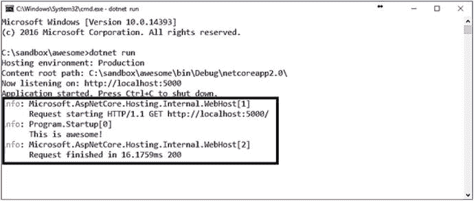
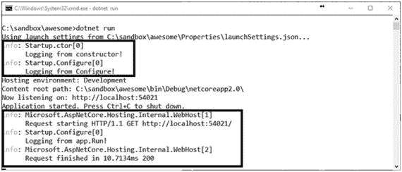
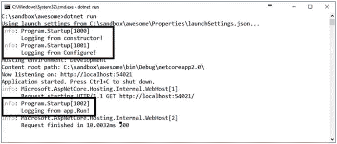
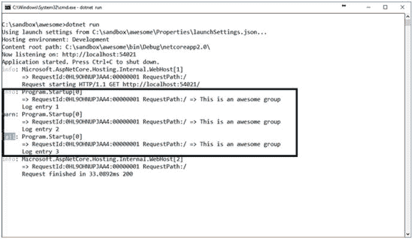
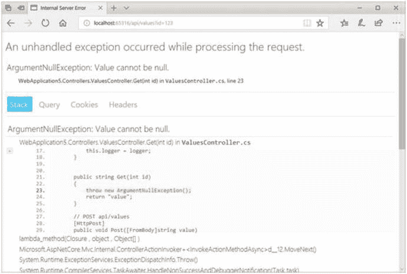

# 七、日志记录和错误处理

应用日志记录在跟踪和识别可能出现的问题以及提供关于解决方案的工作流程的有用见解方面起着至关重要的作用。当出现问题时，首先要查看的资源之一是应用的日志。根据记录的详细信息数量，每个条目代表在特定日期和时间发生的操作。

日志可以包含系统生成的事件以及开发人员明确定义的事件，通常分为错误、信息和警告等类别。应用日志是特定于应用的，因此得名，并且通常不包括特定于操作系统的事件。

在这一章中，我们将着重于理解日志如何使应用受益，并帮助我们提取关于某些事情为什么会发生的有用信息。我们将了解 ASP.NET Core 的日志 API，并学习如何快速开始添加日志功能到任何 ASP.NET Core 应用。

在本章中，我们将使用日志条目的不同部分，并学习如何正确地对日志条目进行分组，以便将相似的项目放在一起。我们将了解日志过滤以及如何在特定场景和环境中记录特定类型的条目。

我们将介绍 ASP.NET Core 的六个内置日志记录提供程序和如何使用它们，以及一些可用的第三方日志记录提供程序。在本章的最后，我们还将学习错误处理以及如何捕捉和处理应用异常。

## 添加日志记录

日志可以在 ASP.NET Core 的任何地方使用，要创建一个日志，我们只需要注入一个先前在 DI 容器中注册的`ILogger`对象。在可以使用日志记录之前，首先需要将特定的日志记录配置添加到主机中。

查看`ILogger`接口，它公开了一个`Log`方法，我们可以使用该方法向配置的日志记录提供者写入特定类型的条目和异常:

```cs
public interface ILogger
{
    IDisposable BeginScope<TState>(TState state);
    bool IsEnabled(LogLevel logLevel);
    void Log<TState>(LogLevel logLevel, EventId eventId, TState state, Exception exception, Func<TState, Exception, string> formatter);
}

```

我们可以在 Ilogger 上使用 Log 方法，例如，记录一个简单的信息字符串:

```cs
logger.Log(LogLevel.Information, 0, typeof(object), null, (type,exception)=> "Hello world");

```

正如我们注意到的，每次我们想要创建一个日志条目时都这样做可能会变得非常乏味，并且会使我们的代码非常不可读。幸运的是，有一些扩展方法可以用来记录特定级别的日志条目；它们是用于关键日志的`LogCritical`，用于记录调试信息的`LogDebug`，用于记录异常的`LogError`，用于记录信息条目的`LogInformation`，用于记录跟踪条目的`LogTrace`，以及用于记录任何警告条目的`LogWarning`。我们将在下一节更深入地讨论日志级别和严重性。

让我们来看一个应用的最基本的例子，它有一个使用 Kestrel 的主机和一个单独的`Startup`类:

```cs
using Microsoft.AspNetCore.Hosting;
using Microsoft.AspNetCore.Builder;
using Microsoft.AspNetCore.Http;
using Microsoft.Extensions.Logging;

public class Program
{
    public static void Main(string[] args)
    {
        new WebHostBuilder()
            .UseKestrel()
            .UseStartup<Startup>()
            .ConfigureLogging(logging =>

            {

                logging.AddConsole();

            })

            .Build()
            .Run();
    }

    public class Startup
    {
        public void Configure(IApplicationBuilder app, ILogger<Startup> logger)
        {
            app.Run(async (context) =>
            {
                logger.LogInformation("This is awesome!");

                await context.Response.WriteAsync("Hello World!");
            });
        }
    }
}

```

研究前面的代码，我们看到主机配置了登录到控制台窗口。在`Startup`类的`Configure`方法中，注入了一个记录器参数类型`ILogger<out TCategoryName>`，其中`TCategoryName`可以是任何类型，通常是添加日志条目的类。图 [7-1](#Fig1) 显示了当运行应用和调用默认端点时，日志条目被记录到控制台窗口。



图 7-1

The output of an application with console logging

我们在控制台中看到发生了三个信息事件。当请求开始和结束时，框架会记录日志，应用代码会记录“这太棒了！”调用默认端点时。

## 原木剖析

在创建日志时，我们需要将其映射到一个类别字符串，该字符串在条目的输出过程中使用。正如我们在上一节中看到的，日志通常是在特定的类中使用的，也就是类别。

可以将日志条目写入给定类中的许多类别。通过使用一个`ILoggerFactory`，我们可以动态地创建一个日志记录器，绑定到一个特定的组。修改我们的初始代码，让我们将日志添加到`Startup`类的其他部分:

```cs
public class Startup
{
    private readonly ILoggerFactory loggerFactory;

    public Startup(ILoggerFactory loggerFactory)
    {
        this.loggerFactory = loggerFactory;

        var constructorLogger = loggerFactory.CreateLogger("Startup.ctor");

        constructorLogger.LogInformation("Logging from constructor!");

    }
    public void Configure(IApplicationBuilder app)
    {
        var configureLogger = loggerFactory.CreateLogger("Startup.Configure");

        configureLogger.LogInformation("Logging from Configure!");

        app.Run(async (context) =>
        {
            var logger = loggerFactory.CreateLogger("Startup.Configure.Run");

            configureLogger.LogInformation("Logging from app.Run!");

            await context.Response.WriteAsync("Hello World!");
        });
    }
}

```

一个`ILoggerFactory`被注入到构造函数中，用于在需要特定记录器的地方创建一个`ILogger`。在前面的代码中，为类的三个部分创建了三个记录器。图 [7-2](#Fig2) 显示了运行和调用默认端点时更新代码的输出。



图 7-2

Output of the updated code using multiple loggers

理想情况下，我们需要坚持每个类一个类别，以保持简单。在前面的例子中，我们注意到块括号([0])中的数字 0，这是事件的标识符。因为我们从未指定事件 ID，所以它默认为 0。使用事件 id 可以帮助我们将日志条目分类为属于应用的相关部分。

现在让我们去掉多个记录器，恢复到注入`ILogger<Startup>`，但是这次是注入到构造函数中，并且利用适当的事件 id:

```cs
public class Startup
{
    private readonly ILogger logger;

    public Startup(ILogger<Startup> logger)
    {
        this.logger = logger;
        logger.LogInformation(1000, "Logging from constructor!");

    }
    public void Configure(IApplicationBuilder app)
    {
        logger.LogInformation(1001, "Logging from Configure!");

        app.Run(async (context) =>
        {
            logger.LogInformation(1002, "Logging from app.Run!");

            await context.Response.WriteAsync("Hello World!");
        });
    }
}

```

如图 [7-3](#Fig3) 所示，一个类别中的每个事件都可以有一个特定的事件 ID 与之关联，我们稍后可以将它映射到某个友好的字符串。



图 7-3

Log entries with event IDs

在 ASP.NET Core 中，日志级别用于确定日志条目的严重性，并按以下顺序从最低到最高严重性排序:

*   Trace 的最低严重性为 0，仅在特定情况下使用，以便在调试问题时为开发人员提供有价值的信息。由于跟踪日志条目可能包含敏感数据，默认情况下，生产环境中禁用这种类型。
*   调试条目的严重性为 1，用于开发和调试期间的短期信息。为了防止日志中的信息过载，这种类型的条目通常在生产中禁用，而在调试问题时按需启用。
*   信息类型条目的严重性为 2，主要用于记录应用的一般工作流。拥有信息丰富的日志是一件好事，但是如果使用不当会很危险，所以保持这种严重程度完全取决于开发人员。
*   警告条目的严重性为 3，主要用于应用工作流中发生的意外事件。通常，所处理的验证和一般错误通常被归类为警告。
*   错误日志条目的严重性为 4，用于应用范围内任何未处理的错误或异常；它们指示当前活动内部的故障，但不是应用范围的故障。
*   顾名思义，关键条目是为所有需要立即关注的应用范围的故障保留的，最高严重性为 5。
*   无日志级别的严重性为 6，主要用于日志过滤。

日志条目具有写入日志记录提供程序的特定消息，并且该消息可以被格式化为包含与日志条目相关的数据。假设我们想用当前的日期和时间记录用户的行踪。编写以下代码片段将会写入一条包含当前日期和时间的消息:

```cs
logger.LogInformation("User {userName} entered at {entryTime}", userName, DateTime.Now);

```

这将在日志中输出以下内容:

```cs
User Fanie entered at 11/30/2017 15:01:53

```

我们还可以使用 C# 6 的内插字符串特性，通过执行以下操作来内联格式化日志条目的变量:

```cs
logger.LogInformation($"User {userName} entered at {DateTime.Now}");

```

虽然这样写可以增加代码的可读性，但它不会将参数集合发送给日志记录提供程序，后者可能会将参数用作元数据。如果我们像前面的示例那样格式化日志条目，下面的日志条目输出示例对于人类来说是相同的，但是对于机器来说是不同的:

```cs
User Fanie entered at 11/30/2017 15:01:53
User Steven entered at 11/30/2017 16:08:22
User Andrea entered at 11/30/2017 16:11:53
User Gerald entered at 11/30/2017 16:23:10
User Peter entered at 11/30/2017 16:30:03
User Martin entered at 11/30/2017 16:35:12

```

假设我们想要查找特定日期和时间之后的所有签入。搜索前面的日志可能会变得棘手，因为我们需要使用巧妙的通配符技巧或正则表达式来匹配字符串。

当我们分别提供消息和变量的格式时，日志记录提供者可以利用提交的数据并分别存储它们，以便可以对它们进行查询。

Note

框架以这种方式进行字符串格式化，以实现语义或结构化日志记录，这样日志记录提供者就可以对日志条目中的数据进行更多的控制。

日志条目还可以包含一个可选的异常对象，该对象可用于扩展日志中特定条目的元数据。

## 分组和过滤

有时，有必要捕获给定事务或流程的更多细节。我们可以通过使用作用域将一组具有相同日志信息的逻辑操作分组，作用域是调用`ILogger.BeginScope<TState>`产生的`IDisposable`对象，并且持续到它们被释放。让我们使用一个作用域对`Configure`方法中的一些日志条目进行分组:

```cs
public void Configure(IApplicationBuilder app)
{
    app.Run(async (context) =>
    {
        using (logger.BeginScope("This is an awesome group"))

        {
            logger.LogInformation("Log entry 1");
            logger.LogWarning("Log entry 2");
            logger.LogError("Log entry 3");
        }
        await context.Response.WriteAsync("Hello World!");
    });
}

```

需要指出的是，需要在提供者上显式启用作用域日志的详细信息。为此，我们需要为提供者提供的`options`对象设置`IncludeScopes`属性:

```cs
public static void Main(string[] args)
{
    new WebHostBuilder()
        .UseKestrel()
        .UseStartup<Startup>()
        .ConfigureLogging(logging =>
        {
            logging.AddConsole(options=>options.IncludeScopes = true);
        })
        .Build()
        .Run();
}

```

图 [7-4](#Fig4) 显示了我们在提供者上添加分组和启用范围之后的日志输出。



图 7-4

Sample output showing scopes in logs

可以为所有内容指定最低日志级别的严重性，或者为某个提供者和类别强制实施特定的过滤器。低于所提供的最低日志级别的所有日志都不会发送到特定的日志记录提供程序，这意味着它们不会被处理、存储或显示。

要在代码中设置最低日志级别，我们需要调用`SetMinimumLevel`函数:

```cs
public static void Main(string[] args)
{
    new WebHostBuilder()
        .UseKestrel()
        .UseStartup<Startup>()
        .ConfigureLogging(logging =>
        {
            logging.AddConsole();
            logging.SetMinimumLevel(LogLevel.Information);

        })
        .Build()
        .Run();
}

```

Tip

要抑制所有日志，请将最低级别设置为`LogLevel.None`。

在`ConfigureLogging`函数中，我们还可以为不同的场景定义最小级别。例如，以下代码取消了除`Default`和`Program.Startup`类别之外的所有日志的所有严重性，因为它们分别具有最低级别`Error`和`Critical`:

```cs
logging
    .SetMinimumLevel(LogLevel.None);
    .AddFilter("Default", LogLevel.Error)
    .AddFilter<ConsoleLoggerProvider>("Program.Startup", LogLevel.Critical);

```

Note

上述代码中的最后一个过滤器是特定于控制台记录器的。

过滤器可以双向工作，因为我们可以指定最低级别和特殊条件，以便只显示某些严重级别。以下代码通过仅显示全局的`Warning`条目和特定于控制台记录器的`Information`条目来限制日志记录:

```cs
logging
    .AddFilter(s => s == LogLevel.Warning)
    .AddFilter<ConsoleLoggerProvider>(s => s == LogLevel.Information);

```

我们可以完全控制记录的方式和时间。到目前为止，示例已经展示了如何使用代码配置日志分组和过滤，但是我们也可以利用强大的配置系统将所有这些配置抽象到一个单独的文件中，使其更易于维护。

为了与配置模型集成，我们需要在 web 主机上设置应用配置，并将其绑定到日志记录配置，如以下示例片段所示:

```cs
public static void Main(string[] args)
{
    new WebHostBuilder()
        .UseKestrel()
        .UseStartup<Startup>()
        .UseContentRoot(Directory.GetCurrentDirectory())
        .ConfigureAppConfiguration((context, config) =>
        {
            config.AddJsonFile("config.json")
        .ConfigureLogging((context, logging) =>
        {
            var config = context.Configuration.GetSection("Logging");
            logging.AddConfiguration(config);
            logging.AddConsole();
        })
        .Build()
        .Run();
}

```

然后,`config.json`文件将看起来像下面这样；它排除所有范围，并相应地为每个类别设置日志筛选器:

```cs
{
  "Logging": {
    "IncludeScopes": false,
    "LogLevel": {
      "Default": "Error"
    },
    "Console": {
      "LogLevel": {
        "Program.Startup": "Critical"
      }
    }
  }
}

```

## 不同的日志记录提供者

ASP.NET Core 产品内置了对六个日志提供商的支持。到目前为止，我们只使用了控制台日志记录器将日志输出写入控制台窗口，但是我们可以很容易地添加更多的日志记录提供程序来协同工作。

我们已经知道要添加控制台日志记录提供程序；我们可以只调用`ILoggingBuilder`上的`AddConsole`函数。

作为开发人员，我们有时需要将有用的信息记录到 IDE 或类似的环境中，这时调试记录器就可以派上用场了。我们可以通过调用`ILoggingBuilder`上的`AddDebug`函数来添加调试记录器。这个提供者通过使用`Debug.WriteLine`调用，使用`System.Diagnostics.Debug`类来编写日志输出。

Note

写入调试记录器的 Linux 日志将在`/var/log/message`路径中结束。

要启用事件跟踪器的日志记录，我们可以使用 EventSource 日志记录提供程序，它是跨平台的，允许我们在 Windows 操作系统上运行时将事件记录到 Windows 事件跟踪(ETW)中。调用`ILoggerProvider`上的`AddEventSourceLogger`函数将使用 EventSource 提供程序设置日志记录。

在需要记录 Windows 事件日志的情况下，我们可以利用 Event Log 日志记录提供程序，通过调用`ILoggingBuilder`上的`AddEventLog`函数来添加它。以下是记录到 Windows 事件日志的示例片段:

```cs
logger.AddEventLog(new EventLogSettings
{
    EventLog = new EventLog("AwesomeLog", "AwesomeMachine", "AwesomeApi")
});

```

Note

示例中的代码假设名为 AwesomeLog 的日志和日志源 AwesomeApi 已经存在于名为 AwesomeMachine 的计算机上。

跟踪侦听器提供程序允许我们记录各种跟踪侦听器，比如`TextWriterTraceListener`；我们可以通过调用`ILoggingBuilder`上的`AddTraceSource`方法来添加它。

Note

事件日志和跟踪侦听器提供程序仅适用于 Windows，并要求您的应用将完整的。NET 4.6 框架。如果应用的目标是操作系统而不是 Windows，那么应该使用`#if`定义。点击这里阅读更多关于瞄准多个平台的信息: [`https://docs.microsoft.com/en-us/dotnet/core/tutorials/libraries`](https://docs.microsoft.com/en-us/dotnet/core/tutorials/libraries) 。

如果应用作为应用服务部署到 Azure，它会自动配置 Azure 应用服务日志提供程序。我们需要做的就是在 Azure 门户中打开它。这个提供者不会影响我们在本地运行应用的时间，只会在 Azure 环境中工作。

关于 ASP.NET Core 的一个伟大的事情是开源社区项目，其中一些为框架提供了很大的扩展。Elmah 是一些第三方日志提供商。IO ( [`https://github.com/elmahio/Elmah.Io.Extensions.Logging`](https://github.com/elmahio/Elmah.Io.Extensions.Logging) )、JSNLog ( [`http://jsnlog.com`](http://jsnlog.com) )、Loggr ( [`https://github.com/imobile3/Loggr.Extensions.Logging`](https://github.com/imobile3/Loggr.Extensions.Logging) )、NLog ( [`https://github.com/NLog/NLog.Extensions.Logging`](https://github.com/NLog/NLog.Extensions.Logging) )、Serilog ( [`https://github.com/serilog/serilog-extensions-logging`](https://github.com/serilog/serilog-extensions-logging) )。这些日志提供程序非常好，允许我们插入它并让它按预期工作。

## 处理异常

我们的应用必须处理任何可能发生的异常。这与日志记录对于调试关键问题非常重要的事实是一致的。作为开发人员，我们往往很懒，在开发过程中，在日志文件中查找问题并不总是最好的解决方案。

为了帮助我们即时了解特定请求出错的原因，我们可以利用 ASP.NET Core 提供的特殊开发人员异常页面。它们是由运行时生成的基于 HTML 的页面，封装了围绕问题的所有有用信息，例如堆栈跟踪。

以下是我们如何在 ASP.NET Core 应用中打开开发人员异常页面的示例片段:

```cs
public void Configure(IApplicationBuilder app, IHostingEnvironment env)
{
    if (env.IsDevelopment())
    {
        app.UseDeveloperExceptionPage();
    }
}

```

正如我们所看到的，只有当当前环境是开发时，才会调用`UseDeveloperExceptionPage`函数。图 [7-5](#Fig5) 显示了一个典型的由服务器抛出的`ArgumentNullException`的例子，它很好地显示在一个开发者友好的控制台上。



图 7-5

Example of a developer exception page

开发人员异常页面为我们提供了有用的见解，例如完整的堆栈跟踪，其中包括指向有问题的特定代码行的视图、查询字符串集合、任何 cookies 以及传递的完整请求头。

Note

开发人员异常页面只能在开发环境中启用，因为您不希望敏感信息(如堆栈跟踪)在生产环境中可见。

发出请求时，HTTP 机制总是在响应中提供一个状态代码。这些状态代码包括 1xx 系列，用于提供信息 2xx 系列，表示成功响应，如`200 OK`或`201 Created`；3xx 系列，表示某种形式的重定向 4xx 系列，表示客户端错误，如`404 Not Found`或`400 Bad Request`；5xx 系列，表示服务器错误，如`500 Internal Server Error`。

默认情况下，ASP.NET Core 应用不提供关于状态代码的任何其他细节，但是我们可以通过使用`StatusCodePagesMiddleware`来启用这些细节。我们必须调用在`IApplicationBuilder`上可用的`UseStatusPages`扩展方法:

```cs
public void Configure(IApplicationBuilder app)
{
    app.UseStatusCodePages();
}

```

当运行应用并调用不存在的端点时，我们将得到以下纯文本格式的响应:

```cs
Status code page, status code: 404

```

我们还可以根据自己的喜好定制响应。例如，下面的代码使用了`UseStatusCodePages`函数的重载，从而允许我们直接写入`Response`流:

```cs
app.UseStatusCodePages(async context =>
{
    context.HttpContext.Response.ContentType = "text/plain";
        await context.HttpContext.Response.WriteAsync(
        $"Awesome Status Page, status code: {context.HttpContext.Response.StatusCode}");
});

```

现在，当应用遇到 Not Found 错误时，响应正文中将包含以下内容:

```cs
Awesome Status Page, status code: 404

```

Note

虽然返回了响应正文，但是标头中的状态代码仍然是预期的适当状态代码。

## 包扎

太好了。我们在这一章的结尾。到目前为止，我们已经了解了应用日志记录的重要性，以及如何使用 ASP.NET Core 提供的 API 为应用添加日志记录。我们讨论了不同的日志严重性以及日志条目的各个部分。

我们学习了如何针对特定场景和环境抑制或显式过滤日志条目，以及如何利用配置模型将日志配置从代码中抽象出来。

我们简要介绍了最新版本的 ASP.NET Core 中所有可用的内部和外部日志提供程序。最后，我们看到了如何在开发生命周期中调试时利用开发人员友好的异常页面，以及如何向特定的响应状态添加定制响应。

在下一章中，我们将把旋钮调高一个档次，学习在 ASP.NET Core 中实现 API 的安全性。