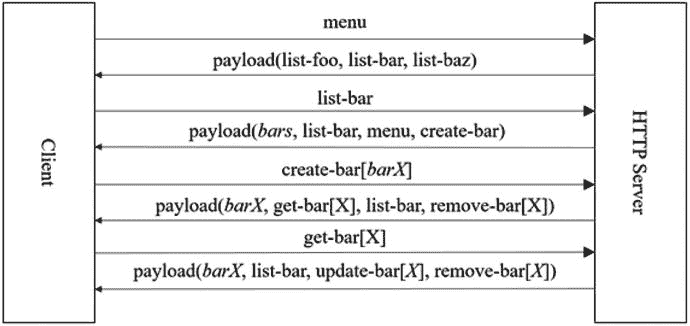
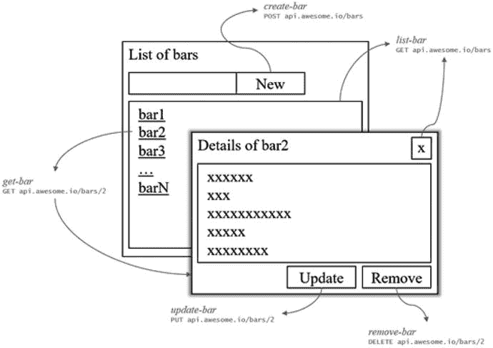
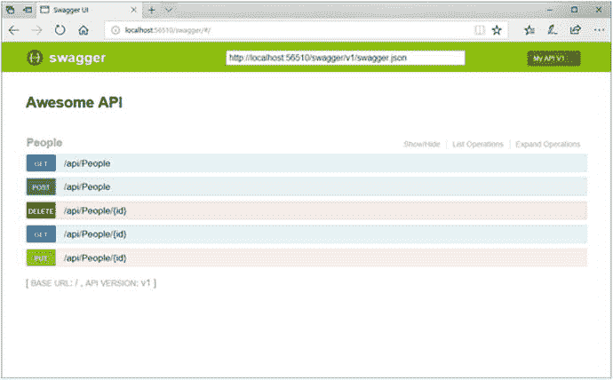
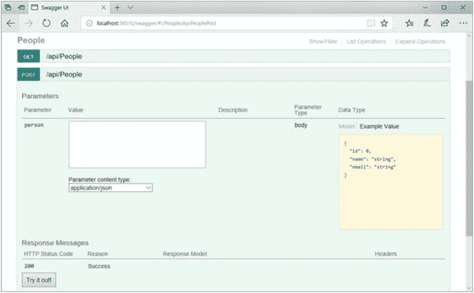
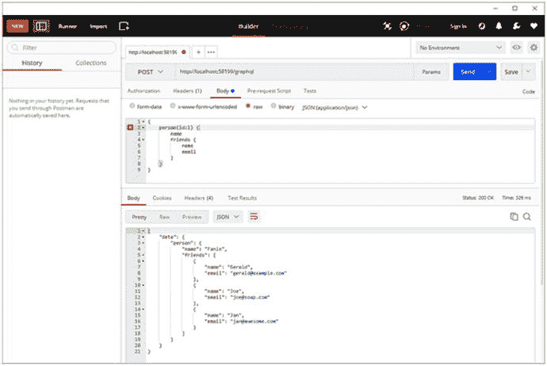

# 九、铃铛和哨子

到目前为止，我们已经讨论了许多对构建现代 API 至关重要的基本方面；然而，有时需要为解决方案提案增加额外的价值，使其脱颖而出。

如前所述，开发人员是我们 API 的最终用户，我们有责任在他们使用我们的 API 解决方案时向他们提供尽可能好的体验。本章主要关注一些额外的技术和其他概念，这些技术和概念有助于加速 API 的采用和可用性体验。

在学习了使用 HATEOAS 管理 API 状态之后，我们将发现在我们的 API 中使用版本控制，并讨论实现版本化 API 的不同方法。在这一章中，我们还将深入研究其他工具和框架的使用，例如 Swagger，用于开发、交互和记录 API，以及 GraphQL，用于提供统一的查询体验。

Note

当然，我们还可以实现许多其他插件来使我们的 API 变得更好。本章详细介绍的只是一个子集，但绝对是我最喜欢的。

## 恨死我了

正如我们现在所知道的，REST 的约束之一是完全无状态的概念。让我们回忆一下，这意味着当客户端向服务器发送请求时，它应该包含处理请求所需的所有信息，而不需要依赖服务器来跟踪交互状态。

作为应用状态引擎的超媒体(HATEOAS)是无状态应用的一个约束，它允许 REST 客户机除了对 API 提供的超媒体的一般理解之外，不知道如何与服务器交互。

它的工作原理是让客户机使用一个固定的 URL 进入 REST 应用，然后随着客户机和服务器之间交互的继续，为客户机提供更多的功能。客户端和服务器之间的通信如图 [9-1](#Fig1) 所示。



图 9-1

An example set of interactions with a server implementing HATEOAS

在上图中，客户端向服务器发出初始请求以获取可能的功能，并接收回包含当前状态可用操作的有效负载。然后，客户端通过调用所提供的`list-bar`动作的 URL 来请求一个条形列表，并接收回一个包含条形集合的有效负载，以及针对响应的当前状态可以调用的进一步步骤。

如果客户端请求通过调用`create-bar`动作 URL 来创建一个新的 bar，它会收到一个包含已创建 bar 的有效负载`barX`，以及可以在`barX`上下文中应用的进一步动作。当客户端通过从`get-bar[X]`操作调用提供的 URL 请求`barX`时，它会收到一个包含`barX`的有效负载，以及这个上下文中其他可能的进一步活动。

只要服务器提供可以被客户端发现的功能性元数据，客户端和服务器之间的这种交互就可以以刚才描述的相同方式继续。

使用 HATEOAS 的一个主要好处是，客户端应用不需要预先知道服务器上的资源的 URL。相反，它只知道特定的动作名称。图 [9-2](#Fig2) 展示了 HATEOAS 如何在一个示例应用中促进流程。



图 9-2

An example application making use of actions provided by a HATEOAS-enabled server

在 ASP.NET Core 中实现 HATEOAS 非常简单。来自 API 的资源被包装在一个具有附加属性的对象中，该属性包含与特定支持相关的其他资源的链接。集合中的每个链接项都包含成功链接到其他相关资源所需的所有信息，比如关系键、端点的 URL 和请求的 HTTP 方法。

让我们以提供关于人员的信息的 API 为例，其中人员资源类型可以由以下数据传输对象来表示:

```cs
public class PersonDto
{
    public int Id { get; set; }
    public string Name { get; set; }
    public string Email { get; set; }
}

```

People API 在`PeopleController`中表示，它包含检索人员集合或单个人、创建新人员或更新和删除人员的端点:

```cs
[Route("api/[controller]")]
public class PeopleController : Controller
{
    //...

    [HttpGet(Name = "get-people")]
    public IActionResult Get()
    {
        //...

        return Ok(people);
    }

    [HttpGet("{id}", Name = "get-person")]
    public IActionResult Get(int id)
    {
        //...

        return Ok(person);
    }

    [HttpPost(Name = "create-person")]
    public IActionResult Post([FromBody]PersonDto person)
    {
        //...

        return Created(...);
    }

    [HttpPut("{id}", Name = "update-person")]
    public IActionResult Put(int id, [FromBody]PersonDto person)
    {
        //...

        return Ok();
    }

    [HttpDelete("{id}", Name = "delete-person")]
    public IActionResult Delete(int id) 

    {
        //...

        return Ok();
    }
}

```

作为将前面的代码转换成支持 HATEOAS 的 API 的第一步，我们需要创建一个对象来保存链接，以及两个包装类来包装单个资源和一组资源:

```cs
public class Link
{
    public Link(string rel, string href, string method)
    {
        this.Rel = rel;
        this.Href = href;
        this.Method = method;
    }

    public string Href { get; set; }
    public string Rel { get; set; }
    public string Method { get; set; }
}

public abstract class Resource
{
    [JsonProperty("_links", Order = -2)]
    public List<Link> Links { get; } = new List<Link>();
}

public class ResourceList<T>
{
    public ResourceList(List<T> items)
    {
        this.Items = items;
    }

    public List<T> Items { get; }
    [JsonProperty("_links", Order = -2)] 

    public List<Link> Links { get; } = new List<Link>();
}

```

在前面的代码中，`Link`类包含三个属性，`Rel`、`Url`和`Method`，它们分别用于保存链接关系键、端点的 URL 和用于请求的 HTTP 方法。此外，`Resource`和`ResourceList`类都包含一个类型为`List<Link>`的属性，用于保存每个资源的多个链接。`ResourceList`还包含一个类型为`List<T>`的属性`Items`，其中`T`表示资源的类型。

在`Resource`和`ResourceList<T>`类中，`JsonProperty`属性用于将特定属性序列化为 JSON。对于`Links`属性，定义了-2 的`Order`,以确保它首先呈现。

我们现在可以将现有的`PersonDto`类扩展为一个资源，允许该类继承 HATEOAS 资源的属性:

```cs
public class PersonDto: Resource
{
    //...
}

```

为了返回人员集合，我们需要将集合包装在一个`ResourceList<PersonDto>`实例中:

```cs
[HttpGet(Name = "get-people")]
public IActionResult Get()
{
    //...

    var result = new ResourceList<PersonDto>(people);

    return Ok(result);
}

```

现在，当我们运行应用并向`get-people`端点发出请求时，我们将得到一个包含人员集合的响应，但也包含一个空的链接集合:

```cs
{
  "_links": [],
  "items": [
    {
      "_links": [],
      "id": 1,
      "name": "Fanie",
      "email": "fanie@reynders.co"
    },
    {
      "_links": [],
      "id": 2,
      "name": "Maarten",
      "email": "maarten@example.com"
    },
    {
      "_links": [],
      "id": 2,
      "name": "Marcel",
      "email": "marcel@example.com"
    }
  ]
}

```

最后要做的是在响应中添加每个资源的相关链接。为了简单起见，我们将只为`get-people`和`get-person`端点添加资源链接:

```cs
[HttpGet(Name = "get-people")]
public IActionResult Get()
{
    //...

    var result = new ResourceList<PersonDto>(people);

    result.Items.ForEach(p =>
    {
        p.Links.Add(new Link("self", Url.Link("get-people", new { id = p.Id }), "GET"));

        p.Links.Add(new Link("get-person", Url.Link("get-person", new { id = p.Id }), "GET"));

    });

    result.Links.Add(new Link("create-person", Url.Link("create-person", null), "POST"));

    return Ok(result);
}

[HttpGet("{id}", Name = "get-person")]

public IActionResult Get(int id)
{
    //...

    person.Links.Add(new Link("self", Url.Link("get-person", new { id }), "GET"));

    person.Links.Add(new Link("update-person", Url.Link("update-person", new { id }), "UPDATE"));

    person.Links.Add(new Link("delete-person", Url.Link("delete-person", new { id }), "DELETE"));

    return Ok(person);
}

```

Note

包含一个到资源本身的链接被认为是一个最佳实践，其关系键为`self`。

现在，当我们调用其中一个端点时，响应将包含我们添加到特定资源响应的链接。下面是一个`get-people`端点响应的例子:

```cs
{
  "_links": [
    {
      "href": "http://localhost:49185/api/People",
      "rel": "create-person",
      "method": "POST"
    }
  ],
  "items": [
    {
      "_links": [
        {
          "href": "http://localhost:49185/api/People/1",
          "rel": "self",
          "method": "GET"

        },
        {
          "href": "http://localhost:49185/api/People/1",
          "rel": "update-person",
          "method": "UPDATE"
        },
        {
          "href": "http://localhost:49185/api/People/1",
          "rel": "delete-person",
          "method": "DELETE"
        }
      ],
      "id": 1,
      "name": "Fanie",
      "email": "fanie@reynders.co"
    },
    //...
  ]
}

```

当我们从前面的列表中选择第一个资源并从提供的链接中执行`get-person`关系时，我们将得到以下响应，其中包含范围内任何附加功能的进一步链接:

```cs
{
  "_links": [
    {
      "href": "http://localhost:49185/api/People/1",
      "rel": "update-person",
      "method": "UPDATE"
    },
    {
      "href": "http://localhost:49185/api/People/1",

      "rel": "delete-person",
      "method": "DELETE"
    }
  ],
  "id": 1,
  "name": "fanie",
  "email": "fanie@reynders.co"
}

```

Note

前面的例子展示了使用 ASP.NET Core MVC 实现基于 HATEOAS 的 API 的基础。还有其他第三方框架可用于在 ASP.NET Core 中实现 HATEOAS APIs。其中一个是我的小项目，叫做 aspnetcore-hateoas，你可以在这里找到 GitHub 的资源库: [`https://github.com/faniereynders/aspnetcore-hateoas`](https://github.com/faniereynders/aspnetcore-hateoas) 。

## 版本控制

当涉及到核心的 REST 实践时，所谓的 REST 传道者会进行无休止的不同宗教辩论，这些讨论中的一个主题就是版本化。尽管 Roy Fielding 强烈建议不要对 RESTful APIs 进行版本控制，但现实是有时我们别无选择。在特定场景下，切合实际更有利于理论。

那么，我们为什么要对我们的 API 进行版本化呢？在我看来，最直接的答案是，我们并不是生活在一个完美的世界中，我们总是面临着不可逆转的可能的遗留决策，尤其是在公共 API 的上下文中。

我们不应该疯狂地对所有东西进行版本化，因为在定制实现时，不适当的版本化会很快失去控制。我们应该谨慎地实现版本控制，并且应该总是努力让我们的 API 在任何时候都是向后兼容的。

所有 API 都必须支持显式版本控制，以符合微软概述的 REST API 指南，因为客户端需要依赖于随时间稳定的服务，主要是在添加更多可能导致重大更改的功能时。

API 通常使用`Major.Minor`版本化方案进行版本化，但是也可以选择与使用日期格式方案的组版本化结合使用，如`YYY-MM-DD`。在幕后，组版本控制映射到适当的`Major.Minor`版本。

API 的版本可以位于四个位置，即在 URL 中作为查询字符串参数，在 URL 中作为 URL 路径段，像请求报头中的关键字，或者被定义为特定媒体类型的一部分。以下是 API 版本控制的不同选项的一些示例:

*   URL 中作为查询字符串参数的版本:

    ```cs
    https://api.awesome.io/people?api-version=1.0

    ```

*   版本作为 URL 中的 URL 段:

    ```cs
    https://api.awesome.io/v1.0/people

    ```

*   版本作为请求报头中的关键字:

    ```cs
    GET /people HTTP/1.1
    Host: api.awesome.io
    api-version: 1.0

    ```

*   作为媒体类型一部分的版本:

    ```cs
    GET /people HTTP/1.1
    Host: api.awesome.io
    Accept: application/json;v=1.0

    ```

要在 ASP.NET Core MVC 中为我们的 API 添加版本控制，我们可以使用默认 NuGet 提要下的`Microsoft.AspNetCore.Mvc.Versioning`包。

Tip

在 Visual Studio 中，可以使用用户界面添加 NuGet 包，方法是右键单击项目并选择 Manage NuGet Packages，或者在包管理器控制台中执行`Install-Package`命令。

要使用软件包管理器控制台安装`Microsoft.AspNetCore.Mvc.Versioning`软件包，我们可以执行以下命令:

```cs
Install-Package Microsoft.AspNetCore.Mvc.Versioning

```

我们也可以通过。NET CLI，方法是在命令提示符或 Bash 中执行以下命令:

```cs
$ dotnet add package Microsoft.AspNetCore.Mvc.Versioning

```

安装完包后，我们通过调用提供的`AddApiVersioning`扩展方法将版本控制功能添加到服务集合中:

```cs
public void ConfigureServices(IServiceCollection services )
{
    services.AddMvc();
    services.AddApiVersioning();

    //...
}

```

前面的代码将注册版本控制中间件，并假设应用的版本是 1.0 版。下面是一个控制器类`AwesomeController`，它只包含一个返回应用当前版本的端点:

```cs
namespace AwesomeApi.Controllers
{
    [Route("api/awesome")]
    public class AwesomeController : Controller
    {
        public IActionResult Get() => Ok("Version 1");
    }
}

```

当我们运行应用并试图通过执行对`/api/people`的请求来调用 People API 时，我们注意到以下响应:

```cs
HTTP/1.1 400 Bad Request
Content-Type: application/json; charset=utf-8
...

{
    "Error": {
        "Code": "ApiVersionUnspecified",
        "Message": "An API version is required, but was not specified."
    }
}

```

返回的`Bad Request`响应说明需要一个 API 版本，但没有指定。再次执行相同的请求，但是这次附加版本号作为查询参数`?api-version=1.0`，将返回一个成功的响应，并带有预期的`OK`响应:

```cs
HTTP/1.1 200 OK
Content-Type: text/plain; charset=utf-8
...

Version 1

```

Note

指定的版本必须匹配以日期格式`YYYY-MM-DD`定义的`Major.Minor`模式或组版本。当使用`Major.Minor`格式时，我们既可以指定整数，例如`api-version=1.0`，也可以指定其中的一部分，例如`api-version=1`。

现在让我们通过添加新功能来扩展应用。在 2.0 版本中，我们希望`/api/awesome`端点返回当前版本以及连接标识符，如下所示:

```cs
namespace AwesomeApi.Controllers
{
    [ApiVersion("1.0")]

    [Route("api/awesome")]
    public class AwesomeV1Controller : Controller
    {
        public IActionResult Get() => Ok("Version 1");
    }

    [ApiVersion("2.0")]

    [Route("api/awesome")]
    public class AwesomeV2Controller : Controller
    {
        public IActionResult Get() => Ok($"Version 2 - {Request.HttpContext.Connection.Id}");
    }
}

```

对前面的代码所做的更改中有一点很重要，那就是我们必须将之前的版本明确设置为 1.0。否则，如果请求中没有指定版本，它将被用作最新版本。因为类名需要是唯一的，所以我们也必须相应地重命名控制器。

就个人而言，我不喜欢将版本号与类名或方法名混在一起，因为这会降低代码的可读性，我坚信名称空间是不同版本的最佳位置。重构了前面的代码后，我们得到了下面的代码:

```cs
namespace AwesomeApi.Controllers.V1

{
    [ApiVersion("1.0")]
    [Route("api/awesome")]
    public class AwesomeController : Controller
    {
        public IActionResult Get() => Ok("Version 1");
    }
}

namespace AwesomeApi.Controllers.V2

{
    [ApiVersion("2.0")]
    [Route("api/awesome")]
    public class AwesomeController : Controller
    {
        public IActionResult Get() => Ok($"Version 2 - {Request.HttpContext.Connection.Id}" );
    }
}

```

现在，在运行应用并调用`/api/awesome?version=2.0`端点之后，我们注意到以下响应:

```cs
HTTP/1.1 200 OK
Content-Type: text/plain; charset=utf-8
...

Version 2 - 0HLA68RORHP5A

```

前面的示例代码展示了我们如何实现在 URL 中作为查询参数指定的版本控制。在下一个示例中，我们将更改应用，改为要求版本号作为 URL 段:

```cs
namespace AwesomeApi.Controllers.V1
{
    [ApiVersion("1.0")]
    [Route("api/v{version:apiVersion}/awesome")]

    public class AwesomeController : Controller
    {
        public IActionResult Get() => Ok("Version 1");
    }
}

namespace AwesomeApi.Controllers.V2
{
    [ApiVersion("2.0")]
    [Route("api/v{version:apiVersion}/awesome")]

    public class AwesomeController : Controller
    {
        public IActionResult Get() => Ok($"Version 2 - {Request.HttpContext.Connection.Id}");
    }
}

```

正如我们所见，它只是将 URL 中的`version`变量映射到`apiVersion`。

在请求头中指定版本是非常常见的，因为这可以保持 URL 的干净和版本信息的整洁。为了启用请求头版本控制，我们需要在`Startup`类的`ConfigureServices`方法中设置`ApiVersionReader`选项:

```cs
public void ConfigureServices(IServiceCollection services)
{
    //...

    services.AddApiVersioning(options =>
    {
        options.ApiVersionReader = new HeaderApiVersionReader("x-api-version");

    });
}

```

前面的代码将允许我们通过设置请求中的`x-api-version`头值来指定应用的期望版本。在这个例子中，我们明确地将头值命名为`x-api-version`，但是它可以是一个字符串值。如果没有指定名称，则默认为`api-version`标题键。

Note

将版本源设置为标题将覆盖查询字符串中指定的任何版本。

如果需要支持查询字符串和头中指定的版本号，尽管不符合 Microsoft REST 指南，我们可以结合使用`IApiVersionReader`实现来满足需求:

```cs
public void ConfigureServices(IServiceCollection services)
{
    //...

    services.AddApiVersioning(options =>
    {
        options.ApiVersionReader = ApiVersionReader.Combine(

            new QueryStringApiVersionReader(),

            new HeaderApiVersionReader()

            {

                HeaderNames = { "api-version" }

            });

    });
}

```

要将版本指定为标题中内容类型的一部分，我们可以使用`MediaTypeApiVersionReader`实现:

```cs
public void ConfigureServices(IServiceCollection services)
{
    //...

    services.AddApiVersioning(options =>
    {
        options.ApiVersionReader = new MediaTypeApiVersionReader();

    });
}

```

前面的配置将允许我们在`Accept`头中将版本指定为内容类型的一部分；比如`Accept: application/json;v=2`，它会使用版本号 2。我们可以通过在`MediaTypeApiVersionReader`类的构造函数中传递一个自定义版本变量名来自定义`v`变量。

到目前为止所展示的例子都是基于每个控制器的不同版本，但是如果我们想要将一个给定 API 的功能扩展到基于动作级别呢？例如，假设我们有一个 Names API，在版本 1 中，它只在被请求时输出一个名称，但是在版本 2 中，它也允许更新名称。

为了在操作级别实现版本控制，我们需要利用`[MapToApiVersion]`属性:

```cs
[ApiVersion("1.0")]

[ApiVersion("2.0")]

[Route("api/[controller]")]
public class NamesController : Controller
{
    [MapToApiVersion("1.0")]

    public IActionResult Get()
    {
        //...
    }

    [MapToApiVersion("2.0")]

    public IActionResult Put(string name)
    {
        //...
    }
}

```

通过在`Startup`类的`ConfigureServices`方法中设置所需的选项，我们可以进一步定制版本控制机制的行为方式。以下代码突出显示了几个选项:

```cs
public void ConfigureServices(IServiceCollection services)
{
    //...

    services.AddApiVersioning(options =>
    {
        options.DefaultApiVersion = new ApiVersion(1,0);
        options.AssumeDefaultVersionWhenUnspecified = true;
        options.ReportApiVersions = true;
    });
}

```

在前面的示例中，我们可以通过传递主版本号和次版本号或者通过指定组版本值来指定默认版本。如果通过设置`AssumeDefaultVersionWhenUnspecified`选项没有指定版本，则可以采用默认版本。`ReportApiVersions`选项允许响应包含一个额外的`api-supported-versions`头，详细说明特定请求所支持的版本。

Note

要阅读本节提供的版本控制功能的更多信息，请访问 aspnet-api-versioning GitHub 知识库，网址: [`https://github.com/Microsoft/aspnet-api-versioning`](https://github.com/Microsoft/aspnet-api-versioning) 。

## 时髦的

如果您以前没有听说过 Swagger，本节将带您快速了解它是什么，以及我们如何在 speed 核心中利用它的某些部分来为我们的 API 添加一些额外的东西。

Swagger 是一个帮助我们设计、构建、记录和使用 RESTful 服务的开源框架，它提供了许多不同的工具来开发、交互和记录 API。根据他们在 [`https://swagger.io`](https://swagger.io) 的网站，它是世界上最流行的 API 工具，并且已经被社区采用来支持整个 API 生命周期的开发。它是 OpenAPI 规范(OAS)的一部分。

Note

本节将不涵盖 Swagger 的所有功能，仅限于包括与 ASP.NET Core 相关的特定部分。

在 Swagger 提供的众多特性中，最常用的特性之一可能是规范本身，它为交互式文档、客户机 SDK 代码生成和 API 发现提供了一种机器可读的 RESTful API 表示。

回到本章的第一个例子，我们将在最初的 People API 的基础上进行构建。

通过使用`Swashbuckle.AspNetCore` NuGet 包，Swagger 可以帮助我们在 ASP.NET Core 中为我们的 API 生成 API 文档和交互式帮助页面，该包可以从 Visual Studio 中安装，或者只需从 CLI 运行一个简单的命令即可:

```cs
$ dotnet add package Swashbuckle.AspNetCore

```

要注册 Swagger 中间件，我们需要调用`Startup`类的`ConfigureServices`中的`AddSwaggerGen`扩展方法:

```cs
public void ConfigureServices(IServiceCollection services)
{
    services.AddMvc();

    services.AddSwaggerGen(c =>

    {

        c.SwaggerDoc("v1", new Info { Title = "Awesome API", Version = "v1" });

    });

}

```

前面的代码将创建一个 API 文档生成器，并将其命名为“v1”。下一步是配置应用以使用我们需要的 Swagger 特性:

```cs
public void Configure(IApplicationBuilder app, IHostingEnvironment env)
{
    app.UseSwagger();

    app.UseSwaggerUI(c =>

    {

        c.SwaggerEndpoint("/swagger/v1/swagger.json", "My API V1");

    });

    app.UseMvc();
}

```

在前面的代码中，`UseSwagger`函数将公开一个端点，该端点提供 API 的机器可读表示，即 JSON 格式的 API 元数据。以下示例是执行 Swagger 端点时的响应片段:

```cs
{
  "swagger": "2.0",
  "info": {
    "version": "v1",
    "title": "Awesome API"
  },
  "basePath": "/",
  "paths": {
    "/api/People": {
      "get": //...
      "post": //...
    "/api/People/{id}": {
      "get": //...
      "put": //...
      "delete": //...
    }
  },
  "definitions": {
    "PersonDto": //...
  },
  "securityDefinitions": {}
}

```

`UseSwaggerUI`函数公开了一个使用 Swagger 端点的用户界面，它可以用作我们的 API 的交互式文档。图 [9-3](#Fig3) 显示了使用浏览器导航到`/swagger`端点的一瞥。



图 9-3

The Swagger page for a sample API

显示的操作是交互式的。图 [9-4](#Fig4) 显示了当我们点击一个列出的动作时，屏幕是如何变化的，例如`POST /api/` `People`。



图 9-4

The detail view of an action rendered by Swagger

正如我们所看到的，它提示我们输入必要的参数来测试 API，同时以有益和交互的方式描述 API。

Note

要了解更多关于 ASP.NET Core 中 Swagger 的定制和可扩展性，请访问官方文档 [`https://docs.microsoft.com/en-us/aspnet/core/tutorials/web-api-help-pages-using-swagger`](https://docs.microsoft.com/en-us/aspnet/core/tutorials/web-api-help-pages-using-swagger) 。

## GraphQL(图形 SQL)

现在让我们将注意力转移到一个完全不同的主题上，这个主题将为我们的 API 添加一些额外的功能。GraphQL 是一种用于 API 的查询语言，由脸书在 2012 年开发，在 2015 年公开之前，它包括一个在现有数据上执行请求查询的运行时。

GraphQL 的强大之处在于，它允许客户精确地指定他们需要什么，仅此而已，这使得随着 API 的发展，它更容易使用。让我们来看一个简单的 GraphQL 查询示例:

```cs
{
  person {
    name
    email
  }
}

```

前面的 GraphQL 查询将返回以下响应:

```cs
{
  "data": {
    "person": {
      "name": "Fanie",
      "email": "fanie@reynders.co"
    }
  }
}

```

正如我们在前面的代码中看到的，响应几乎与请求相同。如果我们想要一个人的更多信息，比如说他们的朋友，我们只需添加我们需要的属性:

```cs
{
  person {
    name
    email
    friends {

      name

    }

  }
}

```

在这个 GraphQL 查询过程之后，它将返回如下结果:

```cs
{
  "data": {
    "person": {
      "name": "Fanie",
      "email": "fanie@reynders.co",
      "friends": [
        {
          "name": "Gerald"
        },
        {
          "name": "Joe"
        },
        {
          "name": "Albert"
        }
      ]
    }
  }
}

```

Note

本节的目的只是展示如何在 ASP.NET Core 应用中集成 GraphQL。要了解更多关于 GraphQL 的信息，请访问 [`http://graphql.org`](http://graphql.org) 。

GraphQL 查询被发送到特定的 GraphQL 端点，该端点执行查询并将结果作为 GraphQL 对象结果返回。GraphQL 的一大优点是它可以与 REST 共存，这意味着它只是当前系统的扩展，而不是替代。您仍然可以公开通常的 RESTful 端点，并让 GraphQL 端点与它们和谐共存。GraphQL 本身并不是 REST 的替代品，更多的是一种替代扩展。

让我们在应用中实现一个 GraphQL 端点。我们从我们的领域模型开始，它包括一个具有基本属性的`Person`类，包括`Friends`，这是一个`Person[]`类型的集合:

```cs
public class Person
{
    public int Id { get; set; }
    public string Name { get; set; }
    public string Email { get; set; }
    public Person[] Friends { get; set; } = new Person[] { };
}

```

为了访问人员信息，我们有一个`IPeopleRepository`来公开查询以获取所有人员，以及那些通过`Id`获取特定人员的查询:

```cs
public interface IPersonRepository
{
    IEnumerable<Person> GetAll();
    Person GetOne(int id);
}

```

在我们继续之前，我们需要向我们的项目添加一个 NuGet 包，名为`GraphQL`:

```cs
dotnet add package GraphQL

```

现在我们可以开始通过创建一个名为`AwesomeGraphQLMiddleware`的中间件类来实现 GraphQL 端点:

```cs
public class AwesomeGraphQLMiddleware
{
    private readonly RequestDelegate _next;
    private readonly IPersonRepository _personRepository;

    public AwesomeGraphQLMiddleware(RequestDelegate next, IPersonRepository personRepository)
    {
        _next = next;
        _personRepository = personRepository;
    }

    public async Task Invoke(HttpContext httpContext)
    {
        if (httpContext.Request.Path.StartsWithSegments("/graphql"))
        {
            using (var stream = new StreamReader(httpContext.Request.Body))
            {
                var query = await stream.ReadToEndAsync();
                if (!String.IsNullOrWhiteSpace(query))
                {
                    var schema = new Schema { Query = new PersonQuery(_personRepository) };

                    var result = await new DocumentExecuter()
                        .ExecuteAsync(options =>
                        {
                            options.Schema = schema;
                            options.Query = query;
                        });
                    await WriteResult(httpContext, result);
                }
            }
        }
        else
        {
            await _next(httpContext);
        }
    }

    private async Task WriteResult(HttpContext httpContext, ExecutionResult result)
    {
        var json = new DocumentWriter(indent: true).Write(result);

        httpContext.Response.StatusCode = 200;
        httpContext.Response.ContentType = "application/json";
        await httpContext.Response.WriteAsync(json);
    }
}

```

当被调用时，它验证请求路径是`/graphql`，然后尝试使用`StreamReader`读取请求的主体。然后构造一个`Schema`对象，将`Query`属性设置为一个`PersonQuery`的实例，该实例接受一个`IPersonRepository`的实例。

在创建了一个新的`DocumentExecuter`来根据提供的模式执行查询之后，通过调用`WriteResult`函数将结果作为 JSON 写入响应。

`PersonQuery`包含 GraphQL 的实现细节，这里我们将给定查询的所有字段映射到存储库上的适当调用:

```cs
public class PersonQuery : ObjectGraphType
{
    public PersonQuery(IPersonRepository personRepository)
    {
        Field<PersonType>("person",
            arguments: new QueryArguments(
                new QueryArgument<IntGraphType>() { Name = "id" }),
            resolve: context =>
            {
                var id = context.GetArgument<int>("id");
                return personRepository.GetOne(id);
            });

        Field<ListGraphType<PersonType>>("people",
            resolve: context =>
            {
                return personRepository.GetAll();
            });
    }
}

```

再往下钻一点，`PersonType`是 GraphQL 特有的类型，包含显式定义的映射到`Person`域对象的字段:

```cs
public class PersonType : ObjectGraphType<Person>
{
    public PersonType()
    {
        Field(x => x.Id);
        Field(x => x.Name);
        Field(x => x.Email);
        Field<ListGraphType<PersonType>>("friends");
    }
}

```

最后要做的事情是连接依赖项并注册我们刚刚创建的`GraphQLMiddleware`:

```cs
public void ConfigureServices(IServiceCollection services)
{
    //...

    services.AddSingleton<IPersonRepository, PersonRepository>();
}

public void Configure(IApplicationBuilder app)
{
    app.UseMiddleware<AwesomeGraphQLMiddleware>();

    //...
}

```

我们现在终于准备好测试这个野兽了。在快速编译之后，我们运行应用并将下面的 GraphQL 查询发送到`/` `graphql`端点:

```cs
{
  person(id:1) {
    name
    friends {
      name
        email
      }
  }
}

```

图 9-5 显示了使用 Postman 这样的客户端执行 GraphQL 查询时的输出。



图 9-5

Output from a GraphQL query in ASP.NET Core

## 包扎

我们已经到了另一个章节的结尾。我希望你喜欢读这一章，就像我喜欢写它一样。这一章是关于给我们的 API 添加额外的亮点，让它们脱颖而出。

我们从探索 HATEOAS 的概念开始，包括它与 REST 的关系以及它如何帮助我们实现无状态 API。之后，我们深入研究了版本控制，并探索了一些在我们的 ASP.NET Core 应用中实现版本控制的方法。我们讨论了在应用中使用 Swagger，以及它如何为我们的 API 自动生成交互式文档。在我看来，我们以一记重击结束了这一章，首先实现了一个 GraphQL 端点，它将允许客户精确地查询他们需要我们的服务做什么。

在下一章，我们将看看测试 web APIs 和 ASP.NET Core 提供了什么来提高我们的代码质量。