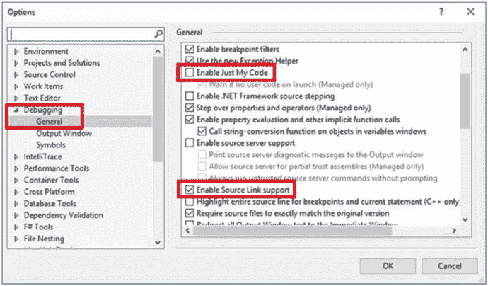
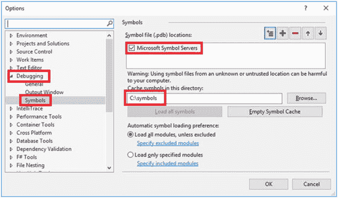
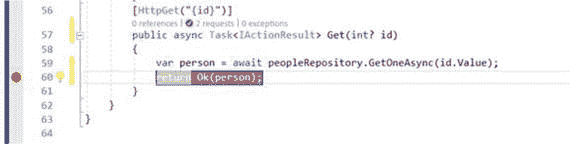
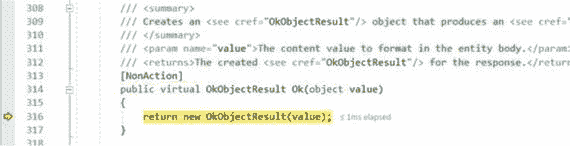

# 十、测试和调试

是时候将我们的注意力转移到 API 设计的另一个重要部分了，那就是源代码的测试和调试。这一章将简单地分享一些关于为什么测试是必不可少的有趣的观点，并且深入到创建单元和集成测试的实现细节中。本章还包括如何使用从互联网上加载的符号来调试已编译外部库的源代码的完整说明。

## 为什么测试很重要？

近年来，软件测试已经成为产品质量保证(QA)不可或缺的一部分。在将代码部署到生产环境之前，我们都会对代码进行一定程度的测试，无论是简单的快速探索性测试，还是覆盖近 104%代码的全面自动化测试。

人们可以想象，如果汽车公司只是设计、制造和发布他们的汽车，而没有首先进行某种形式的测试，会发生什么。软件也不例外。就像汽车的情况一样，用户依赖工作软件来完成他们的日常任务。

在软件开发的上下文中，测试是验证特定软件组件是否满足特定功能需求的过程，也是了解测试结果度量的一种方式，以确保软件的质量处于某个水平。

为了加速开发周转时间并一致地进行测试，我们利用测试工具和框架，这些工具和框架允许我们针对结构化场景执行自动化测试任务。测试自动化降低了人为错误的风险，因为人类不擅长常规工作，但机器擅长这些工作。

软件测试方法，例如单元测试和集成测试，被用在测试框架中，以促进特定场景的验证过程。随着软件开发的发展，更复杂的开发过程出现了，比如测试驱动开发(TDD)和行为驱动开发(BDD)。

TDD 是在短迭代的重复中开发软件的过程。功能需求被转化为特定的测试用例，这些测试用例在最初执行时会失败。只需编写足够的软件来通过特定的测试用例，然后，如果需要的话，重构软件来提高代码质量。作为重构的结果，一些测试用例可能再次失败，然后整个过程通过改变测试用例或者改变软件代码重新开始。

BDD 源于 TDD，结合了 TDD 的技术和原则，以及面向对象设计(OOD)和领域驱动设计(DDD)的思想。BDD 中测试用例的结构倾向于一个用户故事，它包含一个标题、一个详述谁、什么和为什么的简短叙述，以及验证需求是否满足的验收标准。

为什么测试是必要的主要原因之一不仅仅是它产生的度量，而且是它在软件开发过程中确保的质量。测试用例与单元和集成测试的代码覆盖率相一致，以提供有用的见解，无论测试是覆盖所有场景还是仅覆盖部分场景。

## 单元测试

在这一节中，我们将使用微软和社区提供的一些工具来探索单元测试的实现。我们将从头构建一个解决方案，以学习在中创建单元测试的基础知识。NET 核心。

打开您最喜欢的 shell 程序，比如 PowerShell，并通过运行`mkdir .\awesometests`在您选择的位置创建一个名为 awesometests 的新文件夹。该文件夹将保存示例的解决方案。通过执行`cd .\awesometests`进入该文件夹。

使用。NET Core CLI，运行以下命令，在上一步创建的目录中创建新的解决方案，并在解决方案中添加一个名为`AwesomeService`的类库；这个库将包含一些稍后要测试的业务逻辑:

```cs
$ dotnet new sln
$ dotnet new classlib -n AwesomeService
$ dotnet sln add .\AwesomeService\AwesomeService.csproj

```

使用您喜欢的代码编辑器，打开当前目录。如果您正在使用 Visual Studio 代码，您可以简单地运行`code .`来打开当前目录中的 Visual Studio 代码。

在`AwesomeService`目录下，删除默认情况下自动创建的名为`Class1.cs`的类文件，并创建一个名为`Calculators.cs`的新文件，其中包含以下代码:

```cs
using System;

namespace AwesomeService
{
    public interface ICalculator
    {
        int Add(int nr1, int nr2);
    }

    public class AwesomeCalculator : ICalculator
    {
        public int Add(int nr1, int nr2)
        {
            throw new NotImplementedException();
        }
    }
}

```

回到 shell 窗口，通过执行以下 CLI 命令，将名为`AwesomeService.Tests`的新 XUnit 项目添加到解决方案中，并添加对`AwesomeService.csproj`的项目引用:

```cs
$ dotnet new xunit -n AwesomeService.Tests
$ dotnet sln add .\AwesomeService.Tests\AwesomeService.Tests.csproj
$ cd .\AwesomeService.Tests
$ dotnet add reference ..\AwesomeService\AwesomeService.csproj

```

现在我们准备开始编写一些单元测试。为了遵循 TDD 的原则，我们首先编写一个失败的测试，然后实现足够的代码使测试通过，然后重复整个过程。切换回代码编辑器并删除默认情况下自动创建的文件`UnitTest1.cs`，然后添加一个名为`AwesomeCalculatorTest.cs`的新类，包含以下代码:

```cs
using System;
using Xunit;

namespace AwesomeService.Tests
{
   public class AwesomeCalculator_Add_Should
    {
        [Fact]
        public void Return_2_Given_Value_Of_1_And_1()
        {
            ICalculator calculator = new AwesomeCalculator();
            var result = calculator.Add(1,1);
            Assert.Equal(2, result);
        }
    }
}

```

在前面的代码中，`[Fact]`属性表示附加到它的方法是一个测试。在测试中，我们创建一个新的`AwesomeCalculator`实例作为一个`ICalculator`，然后在其上调用`Add`方法；我们期望结果是`2`。

从 shell 窗口，切换到`.\AwesomeService.Tests`目录并运行以下命令来运行测试:

```cs
$ dotnet test

```

运行上述测试命令后，我们将在控制台上看到以下输出，详细说明了测试结果:

```cs
Starting test execution, please wait...
[xUnit.net 00:00:00.5405563]   Discovering: AwesomeService.Tests
[xUnit.net 00:00:00.6283882]   Discovered:  AwesomeService.Tests
[xUnit.net 00:00:00.6362569]   Starting:    AwesomeService.Tests
[xUnit.net 00:00:00.8426874]   AwesomeService.Tests.AwesomeCalculator_Add_Should.Return_2_Given_Value_Of_1_And_1 [FAIL]

[xUnit.net 00:00:00.8448852]       System.NotImplementedException : The method or operation is not implemented.

...

Total tests: 1\. Passed: 0\. Failed: 1\. Skipped: 0.

Test Run Failed.

```

输出表明找到并运行了一个测试，结果是失败，因为抛出了一个`NotImplementedException`。

现在我们有一个失败的测试，让我们回到`AwesomeCalculator`类并实现`Add`方法:

```cs
public int Add(int nr1, int nr2)
{
    return nr1 + nr2;
}

```

在终端窗口再次执行`dotnet test`命令后，它通过:

```cs
...

Total tests: 1\. Passed: 1\. Failed: 0\. Skipped: 0.

Test Run Successful.

```

在一次迭代之后，让我们通过在加法运算中添加第三个数字来引入业务逻辑的变化。我们通过改变`ICalculator`接口中的`Add`方法来包含第三个名为`nr3`的变量，并且我们还引入这个变量来相应地实现`AwesomeCalculator`类中的接口:

```cs
public interface ICalculator
{
    int Add(int nr1, int nr2, int nr3);
}

public class AwesomeCalculator : ICalculator
{
    public int Add(int nr1, int nr2, int nr3)
    {
        return nr1 + nr2;
    }
}

```

现在，我们需要更改我们的测试，以便在验证过程中也考虑第三个数字:

```cs
[Fact]
public void Return_4_Given_Value_Of_1_And_1_And_2()
{
    ICalculator calculator = new AwesomeCalculator();
    var result = calculator.Add(1,1,2);

    Assert.Equal(4, result);

}

```

再次运行测试，我们会注意到它再次失败:

```cs
...

AwesomeService.Tests.AwesomeCalculator_Add_Should.Return_4_Given_Value_Of_1_And_1_And_2 [FAIL]

[xUnit.net 00:00:01.2298122]       Assert.Equal() Failure

[xUnit.net 00:00:01.2299612]       Expected: 4

[xUnit.net 00:00:01.2300141]       Actual:   2

...

Total tests: 1\. Passed: 0\. Failed: 1\. Skipped: 0.

Test Run Failed.

```

回到`AwesomeCalculator`类，让我们通过在加法运算中考虑第三个数字变量来修复这个错误:

```cs
public int Add(int nr1, int nr2, int nr3)
{
    return nr1 + nr2 + nr3;

}

```

修复代码后，再次运行测试将导致通过测试:

```cs
...

Total tests: 1\. Passed: 1\. Failed: 0\. Skipped: 0.

Test Run Successful.

```

单元测试只涵盖一个场景，即三个数字分别是 1、1 和 2。我们可以创建另一个覆盖更多场景的测试方法，但是这会变得非常混乱，因为相同的代码用不同的参数进行测试。

我们可以用测试方法上的`[Theory]`和`[InlineData]`属性替换`[Fact]`属性，而不是创建多个只包含不同变量的测试。一个`[Theory]`测试包含一个测试方法的许多场景。让我们修改我们的测试方法来支持许多场景:

```cs
[Theory]

[InlineData(1, 2, 3)]

[InlineData(3, 2, 1)]

[InlineData(7, 7, 7)]

public void Return_Sum_Of_Values(int nr1, int nr2, int nr3)
{
    ICalculator calculator = new AwesomeCalculator();
    var actualResult = calculator.Add(nr1, nr2, nr3);

    var expectedResult = nr1 + nr2 + nr3;

    Assert.Equal(expectedResult, actualResult);

}

```

修改后的测试方法将被视为三个测试，每个测试覆盖一个由`[InlineData]`属性中指定的数据指定的不同场景。再次执行测试运行程序将产生以下输出:

```cs
...
Total tests: 3\. Passed: 3\. Failed: 0\. Skipped: 0.
Test Run Successful.

```

我们可以在整个开发过程中反复重复这个过程。您可以想象重复这些步骤会变得非常麻烦，但是幸运的是有一个 CLI 工具可以帮助实现一些事情的自动化。

每当源文件改变时，我们可以使用`dotnet watch` CLI 工具来触发命令。它是一个名为`Microsoft.DotNet.Watcher.Tools`的 NuGet 包。要安装它，我们只需要将包引用添加到`AwesomeService.Tests`项目中，作为一个 CLI 工具。我们通过编辑`AwesomeService.Tests.csproj`项目文件并添加下面的`DotNetCliToolReference`标签作为`ItemGroup`的一部分来实现:

```cs
<ItemGroup>
  <DotNetCliToolReference Include="Microsoft.DotNet.Watcher.Tools" Version="2.0.0"/>

</ItemGroup>

```

保存项目文件并运行`dotnet restore`后，`dotnet watch`工具就可以使用了；它具有以下语法:

```cs
dotnet watch <command>

```

现在，我们不再仅仅运行`dotnet test`来执行测试运行程序一次，而是可以使用`dotnet watch`来运行下面的命令，以便每当有变化时自动运行`test`命令:

```cs
$ dotnet watch test

```

当观察器运行时，每当我们对文件进行修改时，它将自动运行在解决方案中发现的所有测试。

## 处理依赖性

单元测试专注于测试单一的工作单元。被测试的方法可能包含对其他依赖项的引用，但是，如果那些依赖项在单元测试期间也被封装在方法中，那么它就不再测试一个单元了。

当测试依赖于其他组件的方法时，我们可以利用 mocking，这是一个模拟第三方行为来隔离被测试单元的过程。下面是一个依赖于另一个`IPersonRepository`对象的示例`PersonService`类:

```cs
public class PersonService
{
    private readonly IPersonRepository personRepository;

    public PersonService(IPersonRepository personRepository)
    {
        this.personRepository = personRepository;
    }

    public int CountLetters()
    {
        var names = personRepository.GetNames();
        var count = names.Select(n => n.Length).Sum();
        return count;
    }
}

```

负责测试`CountLetters`方法的单元测试需要在实例化`PersonService`类时提供一个`IPersonRepository`的实例，因为`PersonService`正在使用一个可能从数据库获取数据的`IPersonRepository`的实例，我们需要模拟一个`IPersonRepository`的实例来防止调用外部数据库。

要实现一个`IPersonRepository`的模拟实例，我们可以使用 Moq，这是一个嘲讽框架，来模拟组件在测试过程中的行为。为了将 Moq 包添加到 NuGet 的测试项目中，我们在测试项目的文件夹中执行以下 shell 命令:

```cs
$ dotnet add package Moq

```

我们现在可以实现一个单元测试，它使用 Moq 来创建一个模拟的`IPersonRepository`实例:

```cs
[Fact]
public void Return_Count_Of_Letters()
{
    var personRepositoryMock = new Mock<IPersonRepository>();

    personRepositoryMock.Setup(p => p.GetNames())

        .Returns(new string[] { "Fanie", "Gerald", "Mike" });

    PersonService personService = new PersonService(personRepositoryMock.Object);

    var actualResult = personService.CountLetters();
    var expectedResult = 15;
    Assert.Equal(expectedResult, actualResult);
}

```

当创建一个 Moq 模拟时，我们设置某些动作来返回特定的预期结果。在前面的例子中，我们创建了一个 mock，每当调用`GetNames`时，它返回一个固定的名称列表。Moq 将被模仿的对象封装为`Object`属性，在需要的地方使用。

## 集成测试

集成测试确保应用的组件在组合在一起时能够按预期工作。与单元测试不同，集成测试包括一起测试单个组件的所有实现，这可能包括基础设施问题。

ASP.NET Core 环境下集成测试的一个主要例子是控制器测试。尽管我们可以对控制器中的动作方法进行单元测试，但是最终的测试将排除其他必需的组件，如过滤器、路由和模型绑定，这些组件可能对结果至关重要。当然，我们可以使用像 Moq 这样的模拟框架来模拟出我们不想在测试中覆盖的组件的某些部分。

让我们创建一个集成测试来验证控制器的端点是否返回了正确的 XML 响应。下面的`Startup`类为应用添加了响应缓存、服务依赖、MVC 和格式化 XML 响应的能力:

```cs
public class Startup
{
    public void ConfigureServices(IServiceCollection services)
    {
        services.AddResponseCaching();
        services.TryAddSingleton(new HttpClient());

        services.TryAddSingleton<IPeopleRepository, PeopleRepository>();

        services.AddMvc().AddXmlSerializerFormatters();

    }

    public void Configure(IApplicationBuilder app)
    {
        app.UseResponseCaching();
        app.UseMvc();
    }
}

```

Tip

在前面的例子中，我们使用了`TryAdd…`扩展方法来防止应用覆盖服务配置，这可能会在测试设置时被显式覆盖。在应用运行时，不会发生任何变化，因为它只添加以前没有添加过的特定服务。

应用中还包含一个`PersonDto`类，它包含 XML 序列化属性，用于以正确的 XML 格式序列化对象:

```cs
[XmlRoot("Person")
public class PersonDto
{
    [XmlAttribute]
    public int Id { get; set; }
    [XmlAttribute]
    public string Name { get; set; }
}

```

此外，我们有一个`IPeopleRepository`的实现，它使用一个`HttpClient`从远程服务获取一个特定的客户名称，然后返回一个`PersonDto`的实例:

```cs
public class PeopleRepository : IPeopleRepository
{
    private readonly HttpClient client;

    public PeopleRepository(HttpClient client)
    {
        this.client = client;
    }
    public async Task<PersonDto> GetOneAsync(int id)
    {
       var personResponse = await client.GetAsync($"https://api.awesome.io/customers/names/{id}");
       var personName = await personResponse.Content.ReadAsStringAsync();

        return new PersonDto
        {
            Id = id,
            Name = personName

        };
    }
}

```

最后，我们有一个名为`PeopleController`的控制器，它包含一个动作方法，根据输入请求返回适当的 HTTP 响应:

```cs
[Route("api/[controller]")]
public class PeopleController : Controller
{
    private readonly IPeopleRepository peopleRepository;

    public PeopleController(IPeopleRepository peopleRepository)
    {
        this.peopleRepository = peopleRepository;
    }
    [HttpGet("{id}")]
    [ResponseCache(Duration = 30)]
    public async Task<IActionResult> Get(int? id)
    {
        if (id.HasValue)
        {
            var person = await peopleRepository.GetOneAsync(id.Value);
            if (person == null)
            {
                return NotFound();
            }
            return Ok(person);
        }
        return BadRequest();
    }
}

```

前面代码中的`Get`动作方法从路由 URL 字符串接收一个`id`参数，并缓存响应 30 秒。

作为集成测试的一部分，我们需要验证几件事情，即:

*   给定一个有效的 URL 路由，测试它是否正确绑定到 action 方法的输入变量。
*   验证`IPeopleRepository`的实现是否调用外部服务来检索人名。
*   给定一个有效的人`id`，测试 HTTP 状态代码是否为`200` (OK)。
*   假设`Accept`头被设置为接收 XML，测试返回的内容类型是否确实是 XML，以及实际内容是否是 XML 格式的，还要考虑任何 XML 序列化。
*   验证响应是否包含正确的缓存响应头。

以下测试方法是一个示例集成测试，用于验证刚刚概述的项目:

```cs
public class PeopleController_Should
{
    //...

    [Fact]
    public async Task Return_Cached_Person_As_Xml_Given_Id()
    {
        //arrange
        var httpMock = CreateMockHttpClient("Fanie");

        var hostBuilder = new WebHostBuilder()
            .UseStartup<Startup>()
            .ConfigureServices(services =>
            {
                services.AddSingleton(httpMock);

            });

        var server = new TestServer(hostBuilder);

        var client = server.CreateClient();

        client.DefaultRequestHeaders.Accept.Add(new MediaTypeWithQualityHeaderValue("application/xml"));

        //act
        var response = await client.GetAsync("/api/people/2");
        var content = await response.Content.ReadAsStringAsync();

        //assert
        Assert.True(response.IsSuccessStatusCode);

        Assert.Equal("application/xml", response.Content.Headers.ContentType.MediaType);

        var expectedContent = "<Person xmlns:xsi=\"http://www.w3.org/2001/XMLSchema-instance\" xmlns:xsd=\"http://www.w3.org/2001/XMLSchema\" Id=\"2\" Name=\"Fanie\"/>";
        Assert.Equal(expectedContent, content);

        Assert.True(response.Headers.CacheControl.Public); 

        Assert.Equal(30, response.Headers.CacheControl.MaxAge.Value.TotalSeconds);

    }
}

```

对于测试来说，包含清楚的指示测试正在做什么的部分是很好的实践，也就是说，安排所有的测试初始化逻辑和设置；act，针对被测试的动作；和断言，用于验证结果。

在集成测试的设置阶段，我们创建了一个模拟实例`HttpClient`，它为所有请求返回一个字符串值 Fanie，因为它被认为超出了这个测试的范围。我们使用应用的`Startup`类创建一个新的 web 主机，然后用我们的定制模拟版本覆盖`HttpClient`的单例服务依赖。

然后我们创建一个新的`TestServer`类的实例，它是 ASP.NET Core 框架为运行测试提供的`IServer`的特殊实现，并传入我们之前创建的`WebHostBuilder`的实例。

通过调用服务器上的`CreateClient`方法创建一个测试客户机，我们可以用它来执行请求。在测试安排的最后部分，我们添加了一个`Accept`请求头作为`application/xml`。

## 调试。净核心资源和 ASP.NET Core 资源

在调试使用其他框架的代码时，事情可能会变得有点棘手，因为在调试过程中加载的源代码符号是特定于应用本身的。有时我们需要跳到其他库的代码中，比如。NET 核心和 ASP.NET Core，以了解它们如何工作和行为。通常打包的库是为发布而优化的，不包括将编译版本映射到源代码的源代码符号。如果特定库的源代码和源代码符号是可用的，我们就能够调试和单步调试代码。

Visual Studio 2017(版本 15.3.5 及更高版本)允许我们链接到外部库源，并在调试我们的应用时单步执行它们的代码。为此，请在 Visual Studio 2017 中打开选项对话框，方法是单击工具，然后选择选项。在“调试常规”部分下，取消选中“启用仅我的代码”选项，并确保选中“启用源代码链接支持”项。图 [10-1](#Fig1) 显示了这些相关选项的位置。



图 10-1

The general debugging options

在“调试”的“符号”子部分下，选择“Microsoft 符号服务器”并指定用于下载缓存符号的缓存目录。图 [10-2](#Fig2) 显示了如何从微软的符号服务器加载符号。



图 10-2

Symbol debugging options

现在我们准备在的源代码中进行一些调试。网络核心和 ASP.NET Core。在从 ASP.NET Core 调用的给定点添加一个断点——例如，在 action 方法中的`Ok`函数的返回处——并在该点运行应用。图 [10-3](#Fig3) 显示了这样做的断点示例。

Tip

如果代码包含一个有界测试，我们也可以通过右键单击测试并选择 Debug Selected Tests 来直接调试代码。



图 10-3

An example breakpoint calling a function in ASP.NET Core

在调试过程开始并且到达特定代码行的断点之后，我们可以通过按键盘上的 F11 进入代码。图 [10-4](#Fig4) 显示了一个已经进入断点的例子，揭示了调用函数的源代码。



图 10-4

An example line of code stepped into Note

可能会出现一个对话框，提示您使用 Source Link 从 internet 下载源代码。只需点击下载源代码并继续调试即可。

## 包扎

我们已经到了另一个章节的结尾。我们学到了很多关于测试和调试的令人兴奋的东西。回顾过去，我们讨论了测试的重要性，描述了开发过程中使用的不同测试技术。我们深入研究了 ASP.NET Core 应用的单元和集成测试的实现，以及如何模拟我们不想测试的第三方依赖。我们通过研究一种有趣的调试外部库源代码的方法来结束这一章，这些外部库通过互联网提供源代码符号。

本书到此结束，下一章我们将探讨适用于 ASP.NET Core 应用的托管和部署选项。