# 十一、托管和部署

编写任何软件的目标都是为了在生产环境中成功地部署和运行它。应用可以在用于特定目的的不同环境中运行，比如开发人员集成测试、用户验收测试，当然还有生产环境。每个环境都提供了一个可以运行应用的独立主机。

术语托管指的是向最终用户提供应用访问的机制；主机通常配置在特定环境中的应用服务器上。部署是将应用传输到主机的过程。

在本章中，我们将介绍在不同环境类型上托管 ASP.NET Core 应用的不同方式，例如在 Windows 上使用 IIS 或 Windows 服务，在 Linux 上使用 Nginx，以及在 Docker 上使用 Visual Studio Tools for Docker。

我们还将探索将 ASP.NET Core 应用发布到基于云的基础设施(如 Microsoft Azure)所涉及的步骤，以及如何通过使用 Visual Studio Team Services 在应用签入源代码控制时自动构建和部署应用来建立持续集成和交付管道。

## 在 Windows 上托管

当谈到在 Windows 上托管 ASP.NET Core 应用时，有两种选择:在 IIS 上或作为 Windows 服务。由 Microsoft 创建的 Internet 信息服务(IIS)是一个用于 Windows NT 系列的 web 服务器，可以作为一个附加组件安装在 Windows 操作系统上。

Note

尽管本节介绍了在 IIS 上运行的 ASP.NET Core 应用，但不包括在兼容的 Windows 版本上安装 IIS 的步骤，并且假设 IIS 已经安装并且可用。

让我们部署一个在 IIS 下运行的示例 ASP.NET Core 应用。我们需要做的第一件事是在 IIS 中为应用创建目标网站。如图 [11-1](#Fig1) 所示，右键点击站点节点，然后选择添加网站。

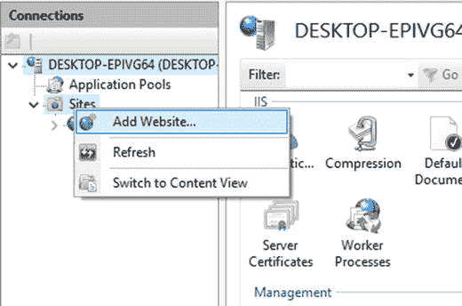

图 11-1

The menu for creating a new website in IIS

在下一个打开的窗口中，我们将我们的站点命名为 AwesomeApi，并选择一个物理路径，从该路径加载网站。对于这个例子，我们在`C:\inetpub\awesome`下创建了一个新目录，但是它可以在任何地方，只要 IIS 对这个目录有足够的访问权限。在 Binding 部分，我们将端口号指定为 80，并将网站绑定到`api.awesome.io`主机名。图 [11-2](#Fig2) 显示了场地的配置。

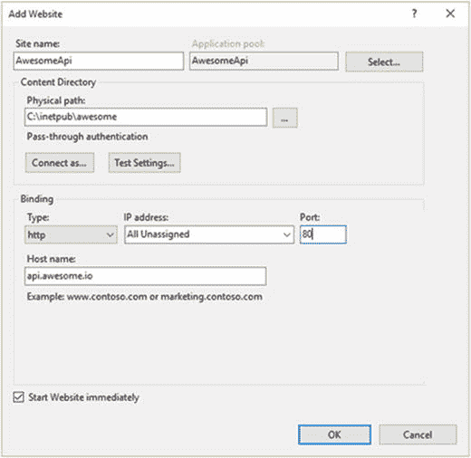

图 11-2

The Add Website dialog Note

域名`api.awesome.io`是仅用于示例目的的任意名称。在真实的场景中，我们会使用我们已经拥有的域名。

默认情况下，为在 IIS 中创建的网站分配一个绑定到。默认情况下为. NET 公共语言运行库(CLR)。因为我们将托管一个 ASP.NET Core 应用，它独立于。NET CLR 安装在磁盘上，因此不需要托管代码。

图 [11-3](#Fig3) 显示了如何通过打开应用池节点，选择 AwesomeApi 池，然后设置。NET CLR 版本转换为无托管代码。单击确定应用更改。

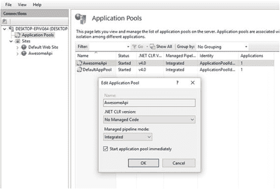

图 11-3

The Edit Application Pool dialog

现在，在 IIS 上创建并配置了网站。快速测试后，请求 [`http://api.awesome.io/ping`](http://api.awesome.io/ping) 返回`404 Not Found`响应，因为目录是空的。我们现在需要将我们的应用发布到在 IIS 上创建的 AwesomeApi。

在示例应用中，我们有一个名为`PingController`的 MVC 控制器，它只有一个端点用于将结果作为“Pong”返回:

```cs
[Route("[controller]")]
public class PingController : Controller
{
    public IActionResult Get() => Ok("Pong");
}

```

为了简单起见，当通过调用`WebHost.CreateDefaultBuilder`函数在`Program.cs`中创建新的 web 主机时，我们保持默认设置。此函数创建一个新的 web 主机，该主机被配置为与 IIS 集成。

在 ASP.NET Core 应用的根目录下打开一个 shell 窗口，并运行以下命令来构建和打包应用以进行部署:

```cs
$ dotnet publish

```

运行这个`dotnet publish`命令将恢复所有的项目依赖项，编译并打包应用以进行部署。在本例中，我们选择将应用发布为依赖于框架的部署(FDD ),这意味着应用将只使用其第三方依赖项进行部署，而不使用。NET 核心框架和运行时，因为我们相信这一点。目标系统上已经安装了 NET Core。FDD 模型是部署的默认模型。NET 核心应用。

Note

另一种部署模型是自包含部署(SDC)，它将依赖项部署到。NET 核心以及应用，以便在各种环境中独立运行。

我们需要做的最后一件事是将由`dotnet publish`命令在`.\bin\Debug\netcoreapp2.0\publish`目录中创建的工件复制到 AwesomeApi 的目标目录中，在本例中该目录位于`C:\inetpub\awesome`。

现在，当我们请求 [`http://api.awesome.io/ping`](http://api.awesome.io/ping) 时，我们收到的正确响应是“乓”。这是怎么做到的？作为部署的一部分，有一个包含以下内容的`web.config`文件:

```cs
<?xml version="1.0" encoding="utf-8"?>
<configuration>
  <system.webServer>
    <handlers>
      <add name="aspNetCore" path="*" verb="*" modules="AspNetCoreModule" resourceType="Unspecified"/>

    </handlers>
    <aspNetCore processPath="dotnet" arguments=".\AwesomeApi.dll" stdoutLogEnabled="false" stdoutLogFile=".\logs\stdout"/>

  </system.webServer>
</configuration>

```

在`web.config`文件中，我们会发现添加了一个名为`aspNetCore`的 IIS 处理程序，负责将请求传递给应用。当网站启动时，它执行`dotnet .\AwesomeApi.dll`，运行我们的。NET 核心应用。

Note

作为先决条件，ASP.NET Core 模块必须安装在 IIS 中，才能将请求转发给 Kestrel。如果没有这个模块，我们在试图调用 IIS 下的应用时会得到一个`HTTP 500.19`错误。ASP.NET Core 模块包含在 Windows Server 托管包中，可以在这里下载: [`https://www.microsoft.com/net/download/windows`](https://www.microsoft.com/net/download/windows) 。

将 ASP.NET Core 应用发布到 IIS 的另一种方法是通过名为 web deploy 的过程，它允许我们直接从 Visual Studio 中部署应用。我们将在本章后面探讨使用 web deploy 发布。

在 Windows 上托管 ASP.NET Core 应用的另一个选择是作为 Windows 服务来做。要做到这一点，应用需要针对完整的。NET framework 运行时。编辑项目的`.csproj`文件，并添加以下代码:

```cs
<PropertyGroup>
   <TargetFramework>net461</TargetFramework>
   <RuntimeIdentifier>win7-x86</RuntimeIdentifier>
</PropertyGroup>

```

此代码指示应用面向完整的。NET framework 4 . 6 . 1 版，并且应该编译为基于 x86 的 Windows 系统的独立应用。

Tip

使用 ASP.NET Core 应用模板。NET framework 来为新项目完成这项工作。

要让应用作为 Windows 服务运行，我们需要对代码进行一些更改。首先，我们需要通过在 shell 窗口中从应用的根文件夹运行以下命令来安装`Microsoft.AspNetCore.Hosting.WindowsServices` NuGet 包:

```cs
$ dotnet add package Microsoft.AspNetCore.Hosting.WindowsServices

```

安装这个 NuGet 包将允许我们将 web 主机作为 Windows 服务运行。在`Program`类中，将`Run`替换为`RunAsService`:

```cs
public static void Main(string[] args)
{
    BuildWebHost(args).RunAsService();

}

```

接下来，我们需要通过在项目根目录下的 shell 窗口中运行以下命令来构建和捆绑我们的应用以进行部署:

```cs
$ dotnet publish

```

`dotnet publish`命令将在`.\bin\Debug\net461\win7-x86\publish`目录下创建一个自包含的应用，并将包含一个名为`AwesomeApi.exe`的可执行文件。我们现在可以将`publish`目录的内容复制到我们选择的任何目录，例如`C:\Services`。

在命令提示符下，运行以下命令:

```cs
$ sc create AwesomeApiService binPath=c:\services\AwesomeApi.exe
$ sc start AwesomeApiService

```

`sc create`命令将应用安装为 Windows 服务，并使用`sc start`启动它。当服务运行时，我们可以通过在`http://localhost:5000/ping`上调用它来测试应用，假设端口 5000 是已经设置的默认端口。

## 在 Linux 上托管

部署起来非常简单。NET 核心应用，与操作系统无关。只需将发布的工件复制到目标文件夹中，或者使用`dotnet yourapp.dll`运行应用，如果。NET Core runtime 已经安装在服务器上，或者如果。NET Core runtime 作为一个独立的应用与应用打包在一起。

当在 IIS 中托管应用并将其部署到安装了 Ubuntu 16.04 的远程服务器时，让我们使用与上一节相同的示例应用。在项目目录结构根目录下的 shell 窗口中，执行以下命令来构建和发布 Ubuntu 16.04 发行版的应用:

```cs
$ dotnet publish -r ubuntu.16.04-x64

```

`dotnet publish`命令中的`-r`选项告诉。NET Core CLI 将特定运行时的应用发布为自包含的应用。

现在，我们可以使用我们最喜欢的远程复制工具，比如 WinSCP(如果您正在 Windows 上开发),将`.\bin\Debug\netcoreapp2.0\ubuntu.16.04-x64\publish`文件夹的内容复制到服务器上的目标文件夹中，例如`/home/faniereynders/awesome`。

要运行应用，只需执行`/home/faniereynders/awesome`目录中的`AwesomeApi`可执行文件。如果您无法实际登录到服务器本身，您可以使用 PuTTY 之类的工具远程登录到 Linux 服务器。

虽然使用 Kestrel 作为 HTTP 服务器非常好，但不建议让外界直接连接到 Kestrel，因为它针对速度进行了优化，并且不像 IIS 或 Nginx 等其他服务器那样处理 web 服务。反向代理服务器可以帮助卸载 HTTP 服务器的一些工作——比如提供静态内容。

Nginx 是一个高性能的 web 服务器，主要用作反向代理、负载平衡器或 HTTP 缓存。要在运行 Ubuntu 16.04 的 Linux 发行版上安装和运行 Nginx，请在服务器上运行以下命令:

```cs
$ sudo apt-get update && apt-get install nginx
$ sudo service nginx start

```

现在如果我们打开浏览器，转到服务器的远程地址，应该会看到默认的 Nginx 页面，如图 [11-4](#Fig4) 所示。

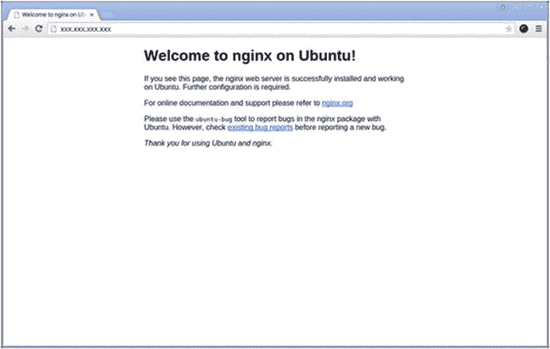

图 11-4

The default page of a server running Nginx

我们现在准备配置 Nginx 来服务我们的应用。在远程服务器的 shell 窗口中，通过执行以下命令，在 Nano 编辑器中打开 Nginx 的默认配置文件:

```cs
$ sudo nano /etc/nginx/sites-available/default

```

用以下内容替换默认文件的内容:

```cs
server {
  listen 80;
  location / {
    proxy_pass http://localhost:5000;
    proxy_http_version 1.1;
    proxy_set_header Upgrade $http_upgrade;
    proxy_set_header Connection keep-alive;
    proxy_set_header Host $host;
    proxy_cache_bypass $http_upgrade;
  }
}

```

前面的配置告诉 Nginx 将请求从端口 5000 中继到端口 80，并设置相关的请求头。要保存和退出 Nano，请分别按 Ctrl+O 和 Ctrl+X。

现在，当我们通过调用端点`http://<Remote IP>/ping`向远程服务器发送请求时，我们将看到预期的“Pong”响应，如图 [11-5](#Fig5) 所示。

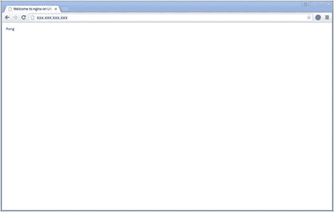

图 11-5

The result of a sample application running behind Nginx

## 在 Docker 上托管

ASP.NET Core 应用也可以在 Docker 容器中托管和运行。如果你不熟悉 Docker，它是一种提供应用容器化的技术，允许应用在任何支持 Docker 的平台上的隔离环境中运行。

Note

本节将介绍将 ASP.NET Core 应用部署到 Docker 容器的基础知识，然后将该容器编译成 Docker 映像。假设您对 Docker 是什么以及它是如何工作的有一个基本的了解，因此在这一节中将不会涉及更多的细节。更多 Docker 信息，可以访问 [`https://docs.docker.com`](https://docs.docker.com) 。

为了充分理解如何创建我们的应用的 Docker 映像并将其部署到 Docker 容器中，我们将经历必要的步骤，其中包括在 Docker 中运行 ASP.NET Core 应用的最低要求。

使用与我们在第一节中所做的相同的示例应用，导航到项目的根目录并创建一个名为`Dockerfile`的新文件，没有任何扩展名，它包含以下内容:

```cs
FROM microsoft/aspnetcore:2.0
WORKDIR /app
COPY /publish .
ENTRYPOINT ["dotnet", "AwesomeApi.dll"]

```

Dockerfile 的内容构建在版本为`2.0`的`Microsoft/aspnetcore`映像上。执行时，它将`/publish`目录的内容复制到当前工作目录，这个工作目录是容器内部的`/app`，在镜像执行时调用`dotnet AwesomeApi.dll`运行。

下一步是确保创建了`/publish`目录，并用发布的应用填充它。为此，我们在 shell 窗口中对项目的根目录执行以下操作:

```cs
$ dotnet publish –o ./publish

```

我们在`dotnet publish`命令上指定了`-o`选项，以指示已发布工件的输出目录。

我们现在准备为我们的应用构建一个 Docker 映像。在 shell 窗口的根目录中，执行以下命令，这将从当前目录的 Docker 文件中构建一个带有标签`awesomeapi`的新 Docker 映像:

```cs
$ docker build -t awesomeapi .

```

Docker 映像现在可以使用了。为了在 Docker 中运行图像，我们运行以下命令，将图像的名称和容器的名称指定为`awesome`:

```cs
$ docker run -d -p 8080:80 --rm --name awesomecontainer awesomeapi

```

前面的命令以分离模式运行`awesomecontainer`容器中的`awesomeapi`映像，这意味着在后台运行，并将对端口 8080 的所有请求映射到内部端口 80。`--rm`选项将确保当主机存在时容器被停止。当我们请求`http://localhost:8080/ping`时，它将调用 Docker 内部运行的应用，并返回预期的“Pong”响应。

Note

如果您正在使用 Docker for Windows，并且尚未更新到 Windows Creators 更新，则 Windows 通过网络地址转换(NAT)与 Docker 容器通信的方式存在缺陷。在编写本章时，您需要直接访问容器的 IP 地址，而不是本地主机。要获取正在运行的容器的 IP 地址，请从 shell 窗口执行以下操作:

```cs
$ docker exec awesomecontainer ipconfig

```

每次我们想要创建应用的 Docker 映像时，都必须调用`dotnet publish`来将最新的位包含在包中，这有点乏味。然而，最近对 Docker 的更新使得在一个 Docker 文件中合并多个步骤成为可能。

让我们对原始 docker 文件做一些更改:

```cs
FROM microsoft/dotnet:2.0-sdk
WORKDIR /app
COPY . ./
RUN dotnet publish -o out
ENTRYPOINT ["dotnet", "out/AwesomeApi.dll"]

```

我们现在不使用`microsoft/aspnetcore:2.0`映像，而是使用`microsoft/dotnet:2.0-sdk`映像为剩余的指令启动构建阶段基础。微软提供了各种不同风格的。NET 来解决特定的情况。

`microsoft/dotnet:<version>-sdk`图像包含了。NET SDK 和 includes。NET 核心以及。NET 核心 CLI 工具，并将用于构建方案的开发。`microsoft/dotnet:<version>-runtime`包含了。NET 核心运行时，并针对生产环境进行了优化。

正如我们在 Dockerfile 中注意到的，所有文件都被复制到工作目录`/app`，然后执行`dotnet publish`来恢复它们的依赖关系，并将应用构建和打包到`/out`目录。

Visual Studio 2017 的一个漂亮特性是对 Dockerizing 的原生支持。NET 核心应用。如果你有。NET Core 跨平台开发工作负载从 Visual Studio 2017 安装程序安装，你们都准备好了。

Docker 支持。可以为新的或现有的项目添加. NET 核心应用。创建新的时。NET 核心应用，只需在新建 ASP.NET Core Web 应用对话框中选中启用 Docker 支持复选框，如图 [11-6](#Fig6) 所示。

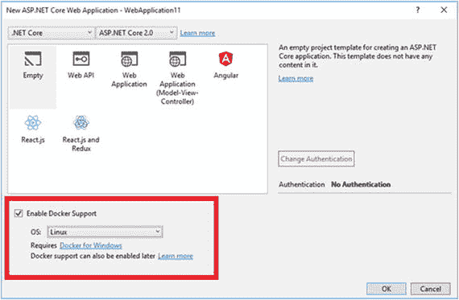

图 11-6

Enable Docker support when creating a new ASP.NET Core application

如果您有一个现有的 ASP.NET Core 应用，只需右键单击该项目，指向添加，然后选择 Docker 支持，如图 [11-7](#Fig7) 所示。

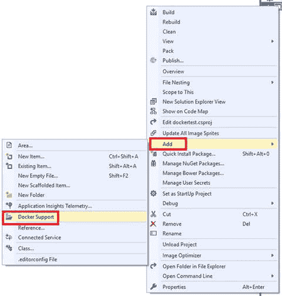

图 11-7

Adding Docker support on existing ASP.NET Core applications

执行前面的步骤之一将添加所需的文件和配置，使应用立即在 Docker 中运行。您还会注意到，Visual Studio 使得直接从 Visual Studio 中运行和调试应用成为可能。通过单击 Docker Run 按钮可以做到这一点，当选择 docker-compose 项目作为解决方案的默认启动项目时，可以使用该按钮。

Note

当添加 docker 支持时，Visual Studio 会向解决方案添加一个名为 docker-compose 的附加项目，其中包含特定于 Docker 的文件。

## 发布到 Azure

Microsoft Azure 是由 Microsoft 提供的云计算平台，通过它可以使用各种可用产品来构建、测试、部署和管理应用和服务。其中之一是 Azure App Service，这是一个平台即服务，用于创建和管理可扩展的企业级、以云为中心的应用。

让我们使用与第一部分相同的例子，当我们将应用发布到 IIS 时，但是这一次我们将使用 Azure App Service 到云。

Note

为了能够在 Azure 中创建用于生产目的的 web 应用，您需要有一个 Azure 订阅。你可以在这里免费试用: [`https://azure.microsoft.com/en-us/free`](https://azure.microsoft.com/en-us/free) 。或者，通过访问此处: [`https://azure.microsoft.com/en-us/try/app-service/web`](https://azure.microsoft.com/en-us/try/app-service/web) ，在有限的时间内尝试无需订阅的 Azure 应用服务。

就像我们在本章前面讨论的 IIS 场景一样，我们需要首先创建一个逻辑 web 应用，然后向它发布我们的应用。在 Azure 中创建 web 应用的更自然的方式是使用 Azure 门户，但这需要 Azure 订阅，所以我们将利用他们在有限时间内使用 Azure 应用服务的提议，只是为了展示我们如何将 ASP.NET Core 应用部署到 Azure。

导航到 [`https://azure.microsoft.com/en-us/try/app-service/web`](https://azure.microsoft.com/en-us/try/app-service/web) 时，会提示选择应用类型，如图 [11-8](#Fig8) 所示，需要选择 Web App，点击下一步。

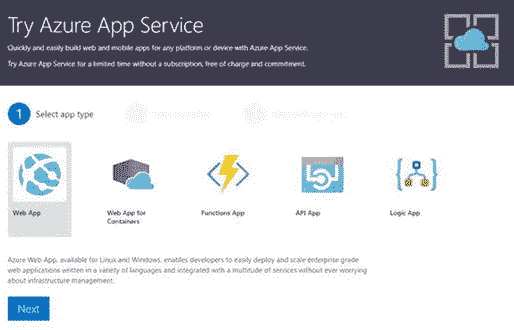

图 11-8

Try Azure App Service : Select app type

进入下一步会提示我们为 web app 选择一个模板，如图 [11-9](#Fig9) 所示。选择 ASP.NET Core，然后单击创建。

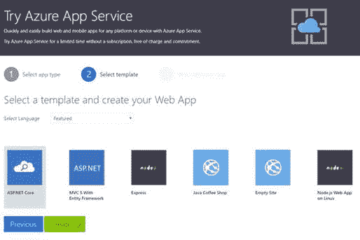

图 11-9

Try Azure App Service: Select web app template

在与我们选择的提供商登录后，我们会看到一个菜单，详细说明我们刚刚创建的 Azure web 应用的工作方式，如图 [11-10](#Fig10) 所示。

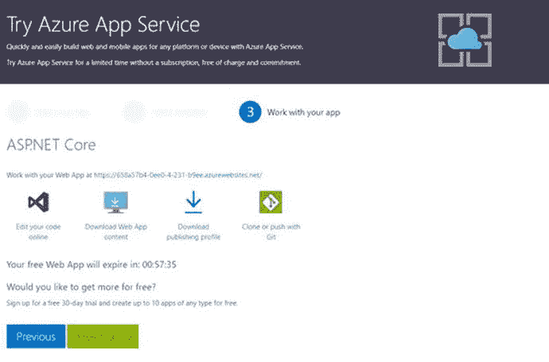

图 11-10

Try Azure App Service : Work with your web app

在这里，我们可以在线编辑代码，下载 web 应用内容，下载发布配置文件，或者使用 Git 克隆和推送更改。通过单击下载发布配置文件来下载发布配置文件。发布配置文件是包含用于部署到特定网站的所有设置的文件。

记下生成的 web 应用 URL。它只在过期前的一个小时内有效，因为它仅用于实验目的。

回到 Visual Studio 2017，打开示例项目，右键单击该项目并选择发布。这样做将打开项目的发布部分，如图 [11-11](#Fig11) 所示。

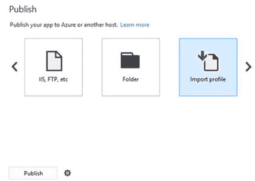

图 11-11

The publish section of the project

一直滚动到右侧，选择导入配置文件，然后单击发布并选择之前从 Azure 下载的发布配置文件。

Note

如果您有 Azure 订阅，您也可以通过单击 Microsoft Azure 应用服务项目从该菜单直接发布到 Azure。

选择发布配置文件后，Visual Studio 将继续将应用发布到发布配置文件中配置的 web 应用。发布概要文件也被添加到项目中，以供将来使用。

发布过程完成后，我们可以在新部署的 Azure web 应用中请求`/ping`端点:

[T2`http://e78c1c6d-0ee0-4-231-b9ee.azurewebsites.net/ping`](http://e78c1c6d-0ee0-4-231-b9ee.azurewebsites.net/ping)

## 持续集成和部署

如前所述，任何应用的最终目标都是在生产环境中运行。为了帮助实现自动化，比如将开发人员的机器上的变更纳入源代码控制、构建和测试，然后最终部署到环境中，我们可以利用持续集成(CI)和持续部署(CD)。

持续集成是将所有开发人员的工作副本合并到一个共享分支中的过程，可以构建该分支来验证其质量。连续交付是将合并编译后的代码自动交付给特定环境使用的过程。

Visual Studio Team Services (VSTS)提供了一个平台来创建 CI 和 CD 管道，以自动将 ASP.NET Core 应用交付到您选择的主机，例如 Microsoft Azure。图 [11-12](#Fig12) 显示了使用 VSTS 将代码放入源代码控制、构建和部署到 Azure 的过程。

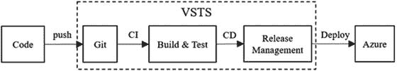

图 11-12

The process of code to Azure using VSTS Note

要继续学习本教程，您需要有一个 VSTS 帐户和 Azure 订阅。前往 [`https://go.microsoft.com/fwlink/?LinkId=307137`](https://go.microsoft.com/fwlink/%3FLinkId=307137) 获得免费的 VSTS 账户。

在上一节中，我们使用微软 Azure 提供的有限免费服务创建了一个 web 应用。在本节中，我们将使用 Azure 门户构建一个 web 应用。

登录 Azure 门户后，点击新建，选择 Web+移动，然后点击 Web App，如图 [11-13](#Fig13) 所示。

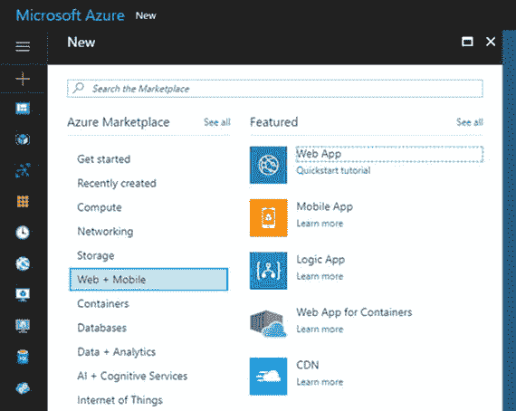

图 11-13

Creating a new web app in Azure

在下一个屏幕上，我们将被提示填写有关 web 应用的详细信息。这里，我们需要为 web 应用命名，选择要运行的相关订阅，提供或创建一个新的资源组以及应用服务，然后单击 create。图 [11-14](#Fig14) 显示了一个正在构建的示例 web 应用。

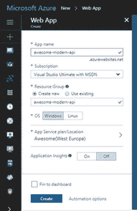

图 11-14

An example web app being created

当 Azure 完成提供新的 web 应用时，我们可以通过点击所有资源部分下的资源名称来打开资源。我们现在准备在 web 应用上配置连续交付，我们通过选择连续交付部分，然后单击配置，如图 [11-15](#Fig15) 所示。

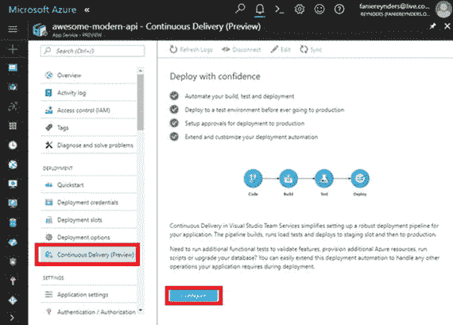

图 11-15

Configure CD for Azure web app

对于下一步，假设我们已经有了一个团队项目的已配置的 VSTS 帐户。在配置连续交付界面上，将源代码提供者设置为 VSTS，如图 [11-16](#Fig16) 所示，点击确定。

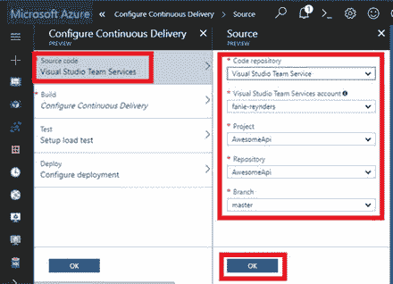

图 11-16

Configure source code provider

在 Build 部分，选择 ASP.NET Core 作为应用框架，如图 [11-17](#Fig17) 所示，然后点击 OK。

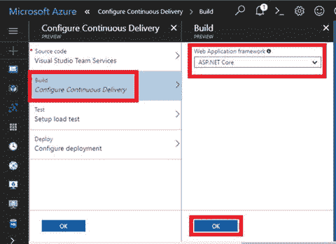

图 11-17

Configure application framework for the build

最后两个部分——测试和部署——被认为超出了本例的范围，因此我们将接受提供的缺省值并单击 OK。

过了一会儿，我们有了一个配置好的 CD 管道，出现了一个如图 [11-18](#Fig18) 所示的屏幕。

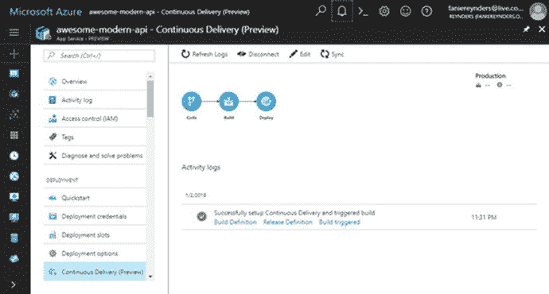

图 11-18

The CD pipeline log

我们可以单击刷新日志来查看在 web 应用的 CI/CD 管道上发生的活动。最后要做的事情是将包含`/ping`端点的 Awesome API 推送到 VSTS 的源代码控制中。

在 shell 窗口的根目录中，我们执行以下命令来启动本地 Git 存储库:

```cs
git init

```

接下来，我们需要将本地 Git 存储库连接到 VSTS 上的远程设备，执行下面的命令就可以做到这一点:

```cs
$ git remote add origin <VSTS Repository URL>

```

现在遥控器已经连接好了，让我们做一个 pull 来获取最新版本的`master`分支:

```cs
$ git pull origin master

```

在下载最新版本后，我们需要将本地文件添加到存储库中，提交并将更改推送到远程:

```cs
$ git add .
$ git commit -m "Yay! First commit"
$ git push

```

在我们的更改被推送后，我们可以回到 Azure 中 web 应用的 CD 活动日志，坐下来，看着我们的应用发布到生产环境。

Tip

如果构建成功，但是发布失败，并显示消息“没有找到具有指定模式 azure 的包”，那么很可能没有作为项目的一部分包含的`web.config`或`wwwroot`文件夹。我们所遵循的默认配置自动设置了一个选项来查找基于 web 的应用，这需要存在`web.config`文件或`wwwroot`文件夹。您可以将这些工件添加到存储库中，或者取消选中 VSTS 中的选项。

## 包扎

我们已经到了另一个章节的结尾，也给这本书划上了一个圆满的句号。回头来看，这一章是关于以多种不同的方式将 ASP.NET Core 应用托管和部署到各种主机上。

我们已经看到了如何通过使用 IIS 或作为 Windows 服务在 Windows 上托管 ASP.NET Core 应用，然后通过在 Ubuntu 上部署与 Nginx 无缝运行的 ASP.NET Core 应用，直接进入 Linux 世界。我们简要介绍了 Docker 的基础知识以及如何在 Docker 容器中托管 ASP.NET Core 应用，然后通过将我们的应用发布到 Azure 中的云中结束了这一章，并完成了一个配置的 CI/CD 管道，该管道会自动将代码中的任何更改部署到生产环境中。