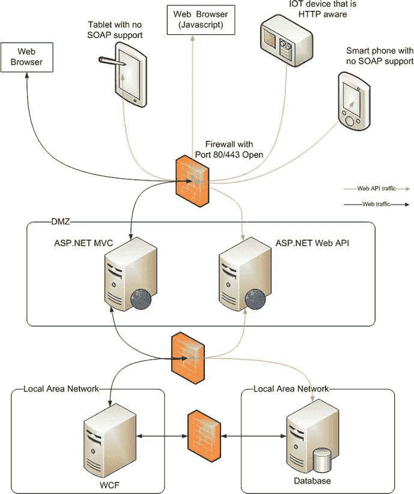
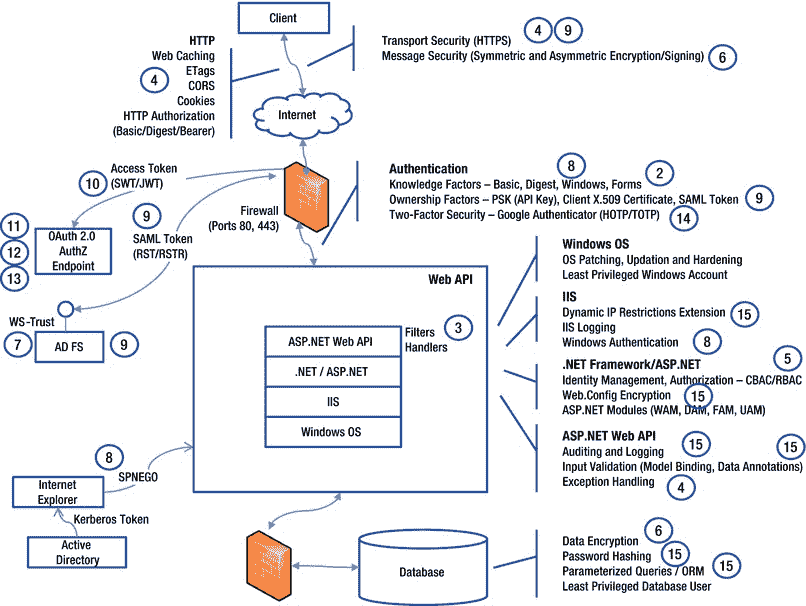

# 一、欢迎来到 ASP.NET Web API

“从头开始，”国王严肃地说，“一直走到尽头，然后停下来。”

——刘易斯·卡罗尔，*爱丽丝梦游仙境*

如果你选择了阅读这本书，它是关于 ASP.NET Web API 安全性的，那么你很有可能熟悉 ASP.NET Web API。如果你不是，或者只是想让我从头开始，这一介绍性章节和下一章将帮助你快速了解 ASP.NET Web API 的基础知识，并帮助你理解强调 ASP.NET Web API 应用安全性的必要性。

ASP.NET Web API 安全:如果我们把它分解，我们会得到多个术语——Web API、ASP.NET Web API 和安全。我们首先了解什么是 web API，然后继续学习 RESTful Web API 初级读本，接着回顾微软 ASP.NET Web API 框架如何帮助您构建 Web API。我们用一个关于安全性的初级读本来结束这一章，它着眼于安全性的所有方面，而不仅仅是接受用户名和密码的登录屏幕，这对许多人来说是安全的同义词。

到底什么是 Web API？

这一切都始于 1957 年苏联发射的第一颗人造卫星。鉴于*号人造卫星*的发射，美国在时任总统艾森豪威尔的领导下，启动了高级研究计划局(ARPA)以推动美国在技术竞赛中的进步。ARPA 资助的项目之一是 ARPANET，它是世界上第一个可操作的分组交换网络。阿帕网引领了协议的发展，允许网络连接成一个网络的网络，演变成今天无处不在的**互联网**。

术语 *互联网*和*万维网*或简称为 *Web、*通常可以互换使用，但它们是分开的，尽管它们是相关的事物。互联网是万维网建立的基础设施。互联网将越来越小的网络连接成一个巨大的网络。

万维网建立在这个网络之上，它提供了一个与互联网上的计算机用户共享数据或信息的模型。服务器或 web 服务器以文档或网页的形式向客户端提供数据，称为 web 浏览器，它以人类可读的格式显示文档。典型地，网页是用一种叫做超文本标记语言(HTML)的语言创建的，并且由于双方遵循一种协议，即超文本传输协议(HTTP)，由网络服务器提供给浏览器。网络只是通过互联网分享信息的方式之一。就像 HTTP 一样，有用于电子邮件的简单邮件传输协议(SMTP)，用于以形式传输信息的文件传输协议(FTP)，等等。

最初，网页只是存在于某台计算机的文件系统中的静态页面，其中的数据几乎不变。随着万维网的发展和用户群的扩大，需要即时生成网页。Web 服务器开始将这一职责委托给通用网关接口(CGI)等引擎，以便动态生成网页。动态网页和客户端 JavaScript 脚本语言的引入导致了被称为**网络应用**的新一代软件应用。web 应用的最终用户是以执行任务为目标的人。

因为 web 应用的最终用户是人，所以有一个与 web 应用相关联的用户界面。浏览器就是为用户提供这种交互界面的东西。此外，还需要非人类实体，如运行某些软件的机器，通过万维网进行通信和交换数据。进入 **web 服务**。虽然不是强制性的，但是 web 服务使用 HTTP 来交换数据。与主要是基于 HTTP 的 HTML 的 web 应用不同，对于 web 服务，它主要是基于 HTTP 的可扩展标记语言(XML)。客户端发送 XML 格式的请求，服务器用 XML 响应进行响应。这个 XML 可以是**普通的旧 XML** (POX)，它通常是一个非标准的 XML，只有客户端和服务器能够理解它，或者它可以是标准的简单对象访问协议**(SOAP)。**

为了理解 SOAP 带来的价值，让我们假设我们得到了一些代表组织中雇主的 XML 响应，如清单 1-1 所示。

[***清单 1-1。***](#_list1) 响应 XML

```cs
<employee>
        <firstname>John</firstname>
        <lasttname>Human</lastname>
        <salary>2000</salary>
        <doj>06/01/1998<doj>
        <lastlogin>10/20/2012 09:30:00</lastlogin>
</employee>
```

为了在我们的应用中做任何有用的事情，这个 XML 可能需要被加载到某个数据结构中，比如说在使用面向对象编程(OOP)语言的情况下，一个由类定义的对象。如果我正在编程，我将如何定义字段的数据类型来存储薪水？会是整数还是分数？如果我获取员工的请求因为没有这样的员工或有其他问题而失败，该怎么办？如果请求失败了，我如何知道在 XML 的什么地方查找呢？SOAP 通过提供一个可以构建 web 服务的基本消息传递框架来帮助我们解决这些问题。SOAP 有微软的根源，尽管它目前由万维网联盟(W3C)维护。

微软的技术，比如目前是遗留技术的基于 ASMX 的 web 服务，以及它的继任者 Windows 通信基金会(WCF)都对 SOAP 有很大的吸引力。基于 ASMX 的 web 服务允许通过 HTTP 交换 SOAP 消息，差不多就是这样。WCF 以此为基础，试图将基础设施从编程中抽象出来。如果我有一个返回雇员详细信息的雇员服务，我可以托管该服务，通过 HTTP、传输控制协议(TCP)、通过微软消息队列(MSMQ)或它们的任意组合来消费。通过与客户签订相同的合同，我可以通过多种方式为我的服务提供多个绑定。不过，在这两种情况下，默认情况下，有效负载都是 SOAP。基于 SOAP 的 web 服务的一个重要方面是 Web 服务定义语言(WSDL) 文件的可用性，它允许构建有助于服务消费的工具。例如，Microsoft Visual Studio 可以生成读取 WSDL 定义的代理类，试图使用服务的客户端(即编写客户端代码的程序员)可以直接使用生成的类，而整个 web 服务的存在对程序员是隐藏的。

一个 **web API** 是一个服务。技术上来说，没有区别。不同的是 web API 的使用方式。假设我有一个 web 应用，用户可以用短消息的形式发表自己的想法。用户可以从浏览器登录到我的应用，添加新帖子或更新她最近发布的帖子，甚至删除旧帖子。换句话说，用户可以使用我的 web 应用对他们的帖子执行创建、读取、更新和删除(CRUD) 操作。我的应用变得如此受欢迎，以至于有些人希望将这种 CRUD 功能集成到他们的移动应用中，以便用户可以在远离他们的普通计算机时，在他们的移动设备上执行 CRUD 操作，而无需登录到我的 web 应用。

我现在可以创建一个 web 服务来支持 CRUD 操作。从技术上来说，它是一个 web 服务，但它是一个 API(API ),用于与我的 web 应用进行交互，只不过它是通过 Web 进行的。传统上，API 是一堆具有属性和方法的类，它们是可重用组件的一部分，用于与另一个应用进行交互。这个场景正是如此，除了我的 API 不是以软件组件的形式提供，而是通过 Web 提供。它是一个 web API！

尽管它从根本上说是一个 web 服务，但其目的是用它来操纵应用数据，这就是它成为 API 的原因。大多数正在使用的典型 web API 的一个重要特征是，与基于 SOAP 的 web 服务相比，web API 更倾向于 RESTful web 服务，尽管这不是一个决定性的特征。web 服务很可能是基于 REST 的，所以这不是决定性的特征。通过使用 REST，web API 趋向于轻量级，并支持 HTTP。例如，web API 利用 HTTP 方法来表示用户想要执行的操作，应用实体将成为这些 HTTP 方法可以操作的资源。虽然没有使用 SOAP，但是消息——请求和响应——要么是 XML 格式，要么是 JavaScript Object Notation(JSON)。

RESTful Web API 初级读本

RESTful Web API，顾名思义，是使用 HTTP 实现的 Web API 或 Web 服务，基于 REST 架构风格。确切地说，一个 RESTful 服务必须满足 Roy T. Fielding 博士论文中定义的约束。 [<sup>1</sup>](#Fn1) 我们将在[第 2 章](02.html)中探讨 RESTful 服务和所有约束，但这里是 RESTful Web API 的初级读本。

REST 的一个核心概念是可以通过统一资源标识符(URI)识别的资源的存在。如果你把资源等同于名词，那么资源上的动作就是动词，由 HTTP 方法表示，比如 GET、POST、PUT 和 DELETE。RESTful Web API 的一个关键特征是 URI 或请求消息不包含动词。让我们看几个例子，看看什么是不宁静的。

1.  检索一个员工的详细信息，URI 是
    `http://server/hrapp/getemployee?id=12345`
2.  检索一个员工的详细信息，URI 是
    `http://server/hrapp/employee?id=12345&action=GET`
3.  要检索雇员的详细信息，URI 是
    `http://server/hrapp/employee`，请求消息决定要执行的操作。例如，请求中的 XML 片段 <getemployeedetails><id>12345</id></getemployeedetails> 指示服务获取标识符为 12345 的雇员的详细信息。

现在，让我们看看如何用 RESTful 服务检索雇员的详细信息。URI 将于`http://server/hrapp/employees/12345`。URI 本身将包含雇员 ID，并作为资源的标识符，在本例中是雇员。对该资源的操作是通过 HTTP 动词完成的。我们试图对资源执行的操作是检索详细信息。因此，请求将是 URI `http://server/hrapp/employees/12345`上的一个 HTTP GET。

要更新这个雇员，请求将是一个放在同一个 URI 上的 HTTP。类似地，要删除这个雇员，请求将是一个 HTTP 删除请求，也是在同一个 URI 上。要创建一个新员工，请求将是一个到`http://server/hrapp/employees`的 HTTP POST(没有标识符)。

在 POST 和 PUT 的情况下，必须向服务传递雇员数据或资源表示。作为 HTTP 请求消息体发送的通常是 XML 或 JSON。

RESTful 服务用指示成功或失败的 HTTP 状态代码进行响应。例如，如果标识符为 12345 的雇员不存在，将返回 HTTP 状态代码 404 - Not found。如果请求成功，将返回 HTTP 状态代码 200 - OK。

RESTful 服务以 XML 或 JSON 的形式发送响应，类似于请求。例如，GET to `http://server/hrapp/employees/12345`产生一个包含 JSON 的响应，表示 ID 为 12345 的雇员。

你好，ASP.NET Web API！

现在你已经对 RESTful Web API 有了 10，000 英尺的概述，让我们看看 ASP.NET Web API 如何帮助你构建 RESTful Web API 或 Web 服务。

ASP.NET Web API 是一个框架，用于在。NET 框架。因此，我们有了这个 URI `http://server/hrapp/employees/12345`,一个客户端发布了一个 GET。为了响应这个请求，我们需要在某个地方编写代码来检索 12345 的雇员详细信息。显然，代码必须存在于某个 C# 类的某个方法中(C# 是本书选择的语言)。这就是路由概念发挥作用的地方。

在这种情况下，该类将是从 ASP.NET Web API 框架的一部分`ApiController` 类派生的类。你需要做的就是用方法`Get(int id)`创建`ApiController`的子类，比如说`EmployeesController`。然后，ASP.NET Web API 框架将所有 GET 请求路由到该方法，并将 URI 中的雇员 ID 作为参数传递。

在该方法中，您可以编写代码来检索雇员的详细信息，并返回一个类型为`Employee`的对象。在未来，ASP.NET Web API 将处理雇员对象到 JSON 或 XML 的序列化。web API 具有内容协商的能力:请求可以随响应表示的选择一起进入，这是客户端所偏好的。web API 将尽最大努力以请求的格式发送响应。

对于带有消息有效负载的请求，比如 POST，您需要定义的方法将是 Post(Employee emp ),带有类型为`Employee`的参数。ASP.NET Web API 会将请求(XML 或 JSON)反序列化为`Employee`参数对象，供您在方法内部使用。如果你有使用 ASP.NET MVC 框架的经验，微软的 web 应用框架实现了模型-视图-控制器(MVC)模式，你可以把前面的段落和 ASP.NET MVC 中的路由和模型绑定联系起来。

ASP.NET Web API 使您能够通过许多开发人员熟悉的强大的 ASP.NET MVC 编程模型来创建基于 HTTP 的服务。ASP.NET MVC 的一些优秀特性，如路由、模型绑定和验证，也是 ASP.NET Web API 的一部分。

像 MVC 一样，有一些可扩展点可以利用并扩展处理管道，比如动作过滤器。还有其他可用的扩展点，最值得注意的是消息处理程序。像 MVC 一样，web API 非常适合自动化单元测试。

在 ASP.NET MVC 的例子中，所有的控制器类都继承自 MVC 框架的`Controller`类。类似地，web API 中的所有控制器类都继承自 web API 框架的`ApiController`。MVC 通过将统一资源定位符(URL) 映射到一个动作方法，将请求分派给控制器内部的一个动作方法。web API 根据 HTTP 动词而不是 URL 中的动作名称将请求分派给动作方法。

ASP.NET MVC 4 作为 Visual Studio 2012 的一部分和 Visual Studio 2010 SP1 版的附加组件提供。ASP.NET Web API 是 MVC 4.0 的一部分。有一个名为 WebAPI 的新项目模板可用于创建 web API 项目。在同一个项目中，您可以同时拥有 API 控制器和 MVC 控制器。

 **注意**MVC 控制器基类是`System.Web.Mvc.Controller`，而 API 控制器基类是`System.Web.Http.ApiController`。两个框架中的类位于不同的名称空间中。即使类名相同，就像在`AuthorizeAttribute`的情况下，它们也将是不同名称空间的一部分。

ASP.NET vs WCF Web API

ASP.NET Web API 是在中创建 RESTful 服务的唯一方法吗？NET？答案是否定的。你也可以用 WCF。如果您与。NET 框架已经有相当长的一段时间了，您肯定已经遇到了术语 WCF(Dub-See-Eff ),它是一个一站式的框架，可以满足。NET 框架，包括 RESTful 服务。那么，为什么要有一个新的框架呢？

简而言之，ASP.NET Web API 是从零开始设计和构建的，只有一个想法——HTTP——而 WCF 主要是根据 SOAP 和 WS-*设计的，REST 是通过 WCF REST 初学者工具包改进的。嗯，如果你对做一种工作感兴趣，比如开啤酒瓶，你更喜欢哪一种:简单的开瓶器还是 Victorinox SwissChamp？

ASP.NET Web API 的编程模型类似于 ASP.NET MVC，因为与定义接口、创建实现类并用几个属性修饰它们相比，它是简单的和基于约定的。然而，ASP.NET Web API 不应该取代 WCF。想开酒瓶，用简单的开瓶器是不行的吧？

理解 ASP.NET 和 WCF Web API 的共存是很重要的。ASP.NET Web API 在 WCF 已经存在了一段时间，它还是一个新生事物，但这并不意味着 ASP.NET Web API 会取代 WCF。ASP.NET 和 WCF 的 Web API 在大局中都有自己的位置。

ASP.NET Web API 是轻量级的，但在某些情况下无法与 WCF 的功能和灵活性相媲美。如果您的服务使用 HTTP 作为传输方式，并且如果您想转移到其他传输方式，比如 TCP，或者甚至支持多种传输机制，那么 WCF 将是一个更好的选择。WCF 也非常支持 WS-*。

然而，当涉及到客户端时，并不是所有的平台都支持 SOAP 和 WS-*。ASP.NET Web API 支持的 RESTful 服务可以覆盖包括移动设备在内的广泛的客户端。底线是这都是关于权衡的，任何架构都是如此。

编程模式差异

让我们通过看一个简单的例子来理解编程模型的区别:一个雇员服务根据雇员 ID 获取一个组织的雇员。ASP.NET 的 Web API 代码(见[清单 1-3](#list3) )很简洁，而且能完成任务。

[***清单 1-2。***](#_list2) WCF 道

```cs
[ServiceContract]
public interface IEmployeeService
{
        [OperationContract]
        [WebGet(UriTemplate = "/Employees/{id}")]
        Employee GetEmployee(string id);
}

public class EmployeeService : IEmployeeService
{
        public Employee GetEmployee(string id)
        {
                return new Employee() { Id = id, Name = "John Q Human" };
        }
}

[DataContract]
public class Employee
{
        [DataMember]
        public int Id { get; set; }

        [DataMember]
        public string Name { get; set; }

        // other members
}
```

[***清单 1-3。***](#_list3)ASP.NET Web API 方式

```cs
public class EmployeeController : ApiController
{
        public Employee Get(string id)
        {
                return new Employee() { Id = id, Name = "John Q Human" };
        }
}
```

这里有几件事值得一提:首先，除了基类是`ApiController`之外，web API 与普通的 MVC 控制器完全相同。

用户喜欢的 MVC 特性，比如通常通过注入存储库实现的绑定和可测试性，也都适用于 web API。ASP.NET Web API 中的路由与 ASP.NET MVC 非常相似。唯一的区别是，与 MVC 中的 URI 路径相比， HTTP 方法用于选择要执行的动作方法。命名方法时遵循的命名约定足以让框架将该方法映射到 HTTP GET。当然，方法的名字必须以 Get 开头。因此，它可以是`Get`，也很可能是`GetEmployeeByIdentifier`，ASP.NET Web API 仍然会将操作方法映射到 HTTP GET。

如果你有 ASP.NET MVC 的经验，你可能想知道当 MVC 控制器的动作方法可以返回`JsonResult`时，web API 有多大的不同。使用`JsonResult`动作方法，一个动词被添加到 URI(例如`http://server/employees/get/1234`)，从而使它看起来更像 RPC 而不是 REST。诸如 GET、POST、PUT 和 DELETE 之类的操作将通过 HTTP 方法来完成，而不是通过 URI 或查询字符串中的任何东西来完成。

ASP.NET Web API 还有更优越的特性，比如内容协商。ASP.NET MVC 对`JsonResult`的支持仅仅是从支持来自 JavaScript 客户端的 AJAX 调用的角度出发，与致力于构建 RESTful 服务的框架 ASP.NET Web API 不可同日而语。

ASP.NET Web API 大放异彩的场景

现在让我们回顾一下 ASP.NET Web API 可以为应用或系统架构增加价值的场景。以下是 ASP.NET Web API 作为后端为桌面带来最大价值的场景。

*   富客户端 web 应用:ASP.NET Web API 非常适合大量使用 AJAX 来访问业务或数据层的富客户端 Web 应用。客户端应用可以是能够理解 HTTP 的任何东西。它可以是 Silverlight 应用、基于 Adobe Flash 的应用或使用 JavaScript 库(如 JQuery、Knockout 等)构建的单页应用(SPA ),以利用 JavaScript 和 HTML5 功能的强大功能。
*   本地移动和非移动应用:ASP.NET Web API 可以作为在不支持 SOAP 的移动设备上运行的本地应用的后端。因为 HTTP 是所有平台的共同特征，所以即使是本地应用也可以通过 web API 的服务外观使用. NET 后端应用。当一个移动应用是第二用户界面(UI) 通道，而一个 ASP.NET MVC 应用是第一用户界面通道时，这一点尤其有用。此外，在 Windows 以外的平台上运行的本机应用(如在 Mac 上运行的 Cocoa 应用)可以使用 ASP.NET Web API 作为后端。
*   **物联网平台(IOT):** 例如，带有以太网控制器或全球移动通信系统(GSM) 调制解调器的 IOT 设备可以通过 HTTP 与 ASP.NET Web API 服务对话。一个建立在。NET 可以接收数据和做生意。不仅仅是 IOT 设备，其他支持 HTTP 的设备如射频识别(RFID)阅读器也可以与 ASP.NET Web API 通信。

 **注意**ASP.NET Web API 是为开发 Web API 而设计的。换句话说，尽管它在技术上可行，但它并不适合补充您的 web 应用的 AJAX 需求，尤其是在 AJAX 用例非常少的情况下。

从性能角度来看，ASP.NET Web API 作为一个服务层不一定总是最佳解决方案，因为每个调用都有一个 HTTP 开销。对于由表示层使用的服务层，两个层都在防火墙安全范围内的同一网络中，TCP 或命名管道可能是更好的选择，WCF 在这一领域可以胜过 web API。

. NET 技术堆栈中的典型服务层或层是通过 WCF 实现的。此类 WCF 服务由前端应用使用，如 web 应用(ASP.NET web forms 或 MVC)或胖客户端应用(WPF 或 WinForms)。除了使用 WCF 服务的 Silverlight 应用之外，大多数典型的架构场景都认为 WCF 服务舒适地位于隔离区之外的防火墙之后，而运行前端或 web 应用的 web 服务器位于隔离区内，更容易受到攻击。web API 倾向于类似于 web 应用，因为它们通常像 Internet web 应用一样在 Internet 上使用，因此托管在 DMZ 中的服务器上。

图 1-1 展示了一个与 ASP.NET Web API 相关的典型部署。值得注意的是，ASP.NET Web API 非常适合于跨防火墙的通信，特别是考虑到端口 80 与公司防火墙策略的友好关系。本地移动应用、浏览器和其他设备通常位于防火墙之外，这基本上可以归结为一个事实，即 ASP.NET Web API 必须位于企业防火墙提供的保护之外，并暴露于互联网。安全性将是架构和设计 ASP.NET Web API 的一个主要因素。



[图 1-1。](#_Fig1)部署图说明了与 ASP.NET Web API 相关的的典型部署

安全入门

我们已经看到了很多 RESTful Web API 和 ASP.NET Web API 框架。最后，我们转到主要话题，安全性。这是一个非常宽泛的术语，但一般来说，它表示安全的状态，或免于危险。这本书是关于 ASP.NET Web API 安全的，所以显然我们在这里的重点是信息安全。根据美国法律，术语*信息安全* 是指保护信息和信息系统免受未经授权的访问、使用、披露、破坏、修改或破坏，以提供中情局层级的要素。

*   保密性，这意味着保留对访问和披露的授权限制，包括保护个人隐私和专有信息的方法。
*   完整性，指防止不正当的信息修改或破坏，包括确保信息的不可否认性和真实性。
*   可用性，即确保及时可靠地获取和使用信息。

**保密性**是关于防止向未经授权的实体披露信息。加密敏感数据和存储散列密码是确保机密性的例子。我们在[第 6 章](06.html)中看加密，在[第 15 章](15.html)中看散列。

**完整性**是指防止未经授权的实体对数据进行修改(实体是指使用应用的用户或外部系统)。这首先意味着一个实体必须被识别。**识别** 就是简单地识别实体的过程。它不同于**认证**，，后者是关于确保用户确实拥有她声称拥有的身份。

作为一个例子，考虑一个应用，其中一个用户 John Q. Human 使用用户 ID jq Human 和某个密码试图登录该应用。一旦应用获得用户输入的 jqhuman 标识符，它就可以识别用户。此时，用户是一个已识别的用户，但尚未经过身份验证。一旦 John 输入了密码，应用就将用户输入的密码与其记录中的密码进行比较；如果它们匹配，则被识别的用户被认为是真实用户。请务必注意，身份识别必须先于身份验证，因为只有在用户被识别之后，应用才能从数据存储中检索密码，以便与用户输入的密码进行比较，从而完成身份验证过程。

认证可以基于三个因素: **知识**，**所有权，**，**继承**。在前面的示例中，用户 John 使用他的用户 ID 和密码。密码是用户知道或记得的东西，因此密码是一个知识因素。身份验证可以基于用户拥有的东西，如安全令牌或客户端证书，这些都是所有权因素。第三个因素，即固有因素，是用户的身份，比如指纹或 DNA 序列。也可以将这些因素中的一个或多个结合起来进行认证。如果涉及两个因素，则为 **双因素认证** (TFA 或 2FA)。TFA 的一个例子是基于 X.509 客户端证书和用户 ID-密码组合的身份验证。我们将在第 8 章中介绍基于知识因素的安全性，在第 9 章和第 10 章中介绍基于所有权因素的安全性。双因素安全包含在第 14 章的[中。](14.html)

一旦实体被认证，该实体希望在应用上执行的动作可以被访问控制。 **授权**是确保只有那些被许可执行任务的实体才执行该任务的过程。我们深入研究**身份管理**，主要是从。NET 框架以及认证和授权的概念，在第 5 章中。

授权确保实体能够看到并操作他们被允许访问的内容，但是在某些情况下，一个实体希望将自己在一个应用中的数据或信息开放给另一个应用，大多数情况下是临时的。这方面有可用的标准，如 **OAuth** ，我们将在[第 11 章](11.html)、[第 12 章](12.html)和[第 13 章](13.html)中深入探讨。

身份验证和授权对于确保完整性非常重要，但是仅仅这两个因素并不能构成确保完整性所需的全部内容。还有其他要求。例如，假设我们的应用是一个 web 应用，一个用户发布一个 HTML 表单，表单中的数据基于哪个应用数据存储将被更新。当然，应用执行身份验证和授权，但是如果中间有人篡改传输中的数据怎么办？然后，诚信被说成是妥协了。

通常通过保护传输数据的层来处理这种情况；对于 web 应用，这意味着通过 HTTPS/TLS 使用传输安全性。我们在[第四章](04.html)中深入探讨 **HTTPS** 。传输安全的另一种方法是消息安全，在这种方法中，消息受到保护，但不保护传输层。消息安全通常包括消息或传输数据的加密和签名，这将在[第 6 章](06.html)中深入讨论。

类似于中间人攻击，即处于中间的对手试图篡改数据，还有多种其他形式的攻击和相关的安全风险。开放 Web 应用安全项目( **OWASP** ) 是一个全球性的非营利性组织，它发布了当前十大安全风险的列表。此列表中与 ASP.NET Web API 相关的风险包含在[第 15 章](15.html)中。

到目前为止，我们关注的是中情局三人组的保密性和完整性。第三个方面，可用性，是关于合法用户可以使用的应用。有多种形式的攻击，如拒绝服务攻击，都是为了让用户无法使用应用。DoS 和暴力攻击在[第 15 章](15.html)中讨论，但是从安全角度来看，可用性主要归因于涉及专用硬件和软件的 IT 管理和操作活动，通常与应用编程无关。

与此相关，安全性是 IT 管理、运营和开发团队的共同努力。要保证系统或应用的安全，需要涵盖所有方面。您可能煞费苦心地构建、设计和实现了一个安全的应用，但是如果运行该软件的平台没有得到强化或修补，您的系统就很容易受到攻击。类似地，如果您有一个可靠且安全的平台和基础设施，但是您没有以正确的方式设计或编码，那么您同样容易受到攻击。与 SQL 注入相关的一个编码错误是，即使你的设计、架构和基础设施是一流的，你的应用也很容易受到攻击。然而，这本书是为软件开发人员、设计人员和架构师而写的，在它的所有章节中，你会发现它的重点是从编程的角度来看 CIA triad 的完整性和保密性。

从 IT 运营的角度来看，审计是一个重要的方面。我们已经有了身份验证、授权和其他保护机制，但是可能会有法律或业务要求来跟踪应用中的活动，比如谁做了什么。这就是所称的**安全审计，[第十五章](15.html)所涵盖的**。

最后，简要说明一下**不可否认性**，这个术语通常出现在法律上下文中。否定就是否认，所以不可否认基本上是确保某人不能否认某事。基于 X.509 证书的数字签名非常常用于确保不可否认性。使用证书的签名和加密在[第 6 章](06.html)中有所涉及，但是由于法律要求可能会有所不同，所以没有专门针对不可否认性的内容。[图 1-2](#Fig2) 提供了整本书讨论的安全主题的概述，以及它们所涵盖的章节。



[图 1-2。](#_Fig2)安全概述及章节参考

摘要

我们看了什么是 Web API，什么是 ASP.NET Web API，以及为什么我们需要这个新的 ASP.NET Web API，当有 WCF 的时候。我们看了一个简单的例子，以体验用很少的代码创建一个 web API 是多么容易，更喜欢约定胜于配置。然后，我们回顾了 ASP.NET Web API 为应用或系统架构带来价值的典型场景。最后，我们回顾了安全入门，特别是信息安全，重点是 CIA 三人组的保密性和完整性。

[<sup>1</sup>](#_Fn1) 守备，罗伊·托马斯。"架构风格和基于网络的软件架构的设计."加州大学欧文分校博士论文，2000 年。