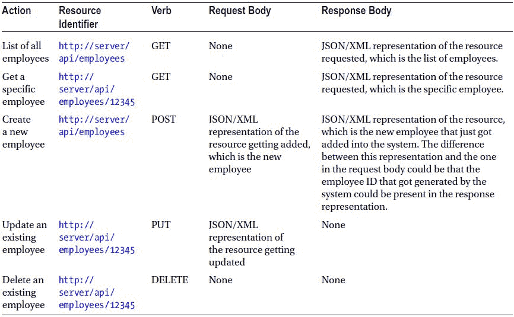
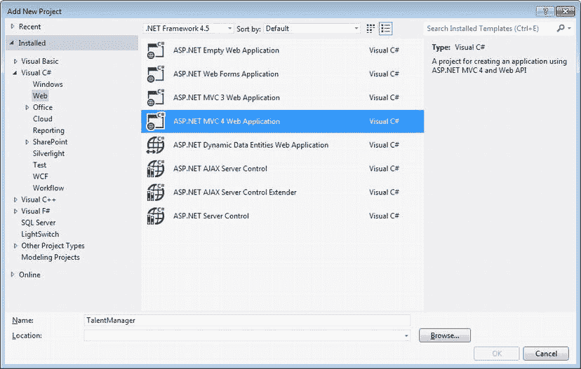
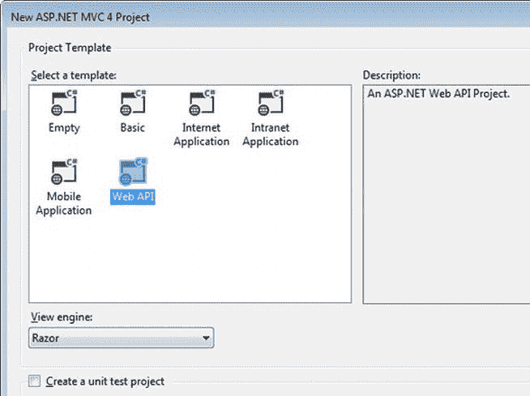
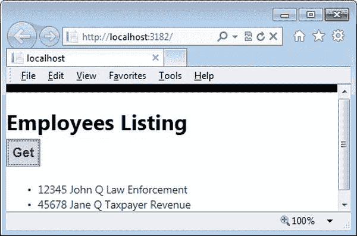
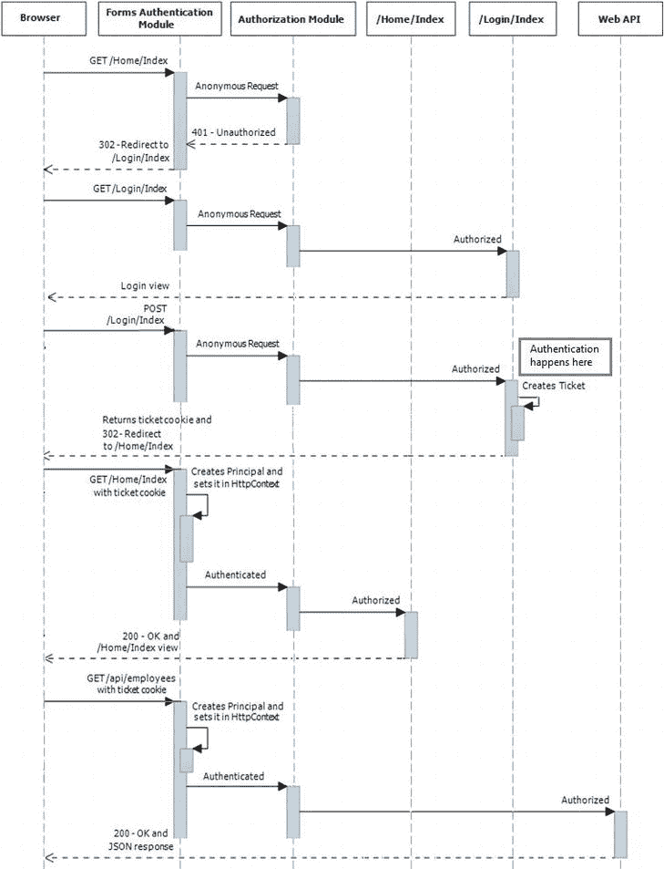

# 二、构建 RESTful 服务

当今流行的 web APIs 的一个重要特征是它们是 RESTful 服务，或者至少它们不是基于 SOAP 的。

仅仅因为我构建了一个 HTTP 服务来处理 XML 或 JSON 负载并响应 HTTP 方法，比如 GET 、POST 、PUT 和 DELETE ，我就不能说我构建了一个 RESTful 服务。在这一章中，我们将看到一个 HTTP 服务如何被称为 RESTful。然后我们构建我们的第一个 web API，一个简单的 Hello-World API。

什么是 RESTful 服务？

具象状态转移(休息) 是的一种建筑风格。Roy T. Fielding 在 2000 年的博士论文中提出并定义了术语 REST。符合 REST 约束的服务被称为 RESTful。为了实现 RESTful，服务必须符合以下强制性约束。

1.  **客户端-服务器约束**，基于关注点分离，是关于将用户界面关注点与数据存储关注点分离。客户机不关心数据存储，这是服务器关心的问题，而服务器不关心用户界面或用户状态，这是客户机关心的问题。
2.  **无状态约束**是关于每个请求是一个独立的自包含单元，具有服务器服务请求的所有必要信息，而不需要查看上下文的任何其他内容。
3.  **缓存约束**是关于服务器能够将响应标记为可缓存或不可缓存的，以便客户端从以后使用的角度适当地处理响应。
4.  **分层约束** 是将系统分成几层，每层只能看到它的近邻并与之交互。一个层看不透它的邻居。在客户机和服务器之间，可以有任意数量的中介——缓存、隧道、代理等等。
5.  **统一接口约束** 是关于提供一个统一的接口来识别资源，通过表示、自描述消息和作为应用状态引擎的超媒体来操纵资源。

我们如何使用 ASP.NET Web API 框架来构建满足给定约束的服务呢？客户机-服务器约束是一个现成的容易满足的约束。ASP.NET Web API 完全是用数据响应客户端请求，而不关心客户端状态或数据如何呈现给最终用户。

无状态约束也很容易满足，除非做了一些可怕的事情，比如从 web API 使用 ASP.NET 会话状态。

ASP.NET MVC 支持`OutputCache` 属性，可以用来控制输出缓存。ASP.NET Web API 不支持开箱即用，但很容易推出我们自己的动作过滤器属性。底线是缓存控制响应头是 ASP.NET Web API 用来标记响应是否可缓存的杠杆。默认情况下，Cache-Control 设置为 no-cache，并且不缓存响应。[第 4 章](04.html)涵盖了 web 缓存的主题，包括 ETags。

分层限制更多地是沿着基础设施线—代理、防火墙等等。ASP.NET Web API 不需要做什么特别的事情来满足这个约束。

统一接口约束包括以下四个约束，并且是决定 HTTP 服务是否是 RESTful 的关键因素。

1.  资源的识别
2.  通过表示操纵资源
3.  自我描述的消息
4.  作为应用状态引擎的超媒体(HATEOAS)

我们现在通过四个约束中的每一个来详细研究统一接口约束。

资源的识别

资源是 web API 发送给其客户端的任何数据。例如，您公司销售的产品、从买方处收到的订单、您公司的员工名单或部门的单个员工。在现实世界中，一个产品或一个雇员可以通过一个标识符来唯一地标识，比如一个产品 ID 或一个雇员 ID。

在 RESTful web 服务的情况下，资源由一个 URI 标识。标识符为 12345 的雇员将由`http://server/employees/12345`表示。在 ASP.NET Web API 的情况下，URI 可能略有不同，它默认包含 URI 中的 API，因此它将更像`http://server/api/employees/12345`。如果您启动一个 Internet Explorer 实例，在地址栏中键入 URI，然后按 Enter，Internet Explorer 将执行一个 HTTP GET，您将获得资源的 JSON 表示，在本例中是一个 ID 为 12345 的雇员。

从。NET 代码的观点(参见[清单 2-1](#list1) )，对应的类将是`EmployeesController`，它是`ApiController`的子类，并且执行该方法以创建要在其`Get(int)`方法中发送回客户端的资源表示。

[***清单 2-1。***](#_list1) 鉴定资源

```cs
public class EmployeesController : ApiController
  {
        public Employee Get(int id)
        {
                // return employee
        }

        public IEnumerable<Employee> GetAllEmployees()
        {
                // return all employees
        }
  }
```

在[清单 2-1](#list1) 中，作为名词的资源具有`http://server/api/employees/12345`的 URI 表示。该资源是通过 GET HTTP 方法(动词)访问的。像单个雇员一样，雇员列表也是一种资源，它的标识符是`http://server/api/employees`。对应的方法是返回`IEnumerable<Employee>`的`GetAllEmployees(),`。

通过表现操纵资源

用户在 Internet Explorer 中键入`http://server/api/employees/12345`的例子可以描述为用户使用 GET 动词请求一个资源并获取 employee JSON，这是资源的表示。GET 被保证不会引起任何副作用，并被称为无效；即使多次调用或根本不调用，系统状态也不会发生任何变化。换句话说，对于以下所有场景，系统状态都是相同的:(1)根本没有调用方法，(2)调用了一次方法，以及(3)调用了多次方法。

其他重要的动词有 POST，PUT ，DELETE。POST 用于创建新资源，PUT 用于更新现有资源，DELETE 用于删除现有资源。PUT 和 DELETE 是幂等的；对系统状态的影响将与第一次调用的影响相同，即使在第一次调用之后被多次调用。

为了创建一个新雇员，客户机发送一个 POST 请求，在请求体中包含新雇员(JSON 或 XML 表示)。这个请求被映射到一个名称以 Post 开头的方法，在本例中是`Post(Employee)`。

更新员工与创建新员工相同，只是使用了 Put 动词，并且映射基于以 PUT 开头的名称。与 POST 相比，一个重要的区别是 PUT 是幂等的。如果用户发送多个请求将员工更新到相同的状态，则不必发回任何错误。

除了不需要资源表示之外，删除雇员是类似的。针对 URI 的删除请求足以删除该资源。类似于 PUT，DELETE 方法也是幂等的。即使基础数据源在要删除的雇员不再存在时发回错误，因为在响应前一个请求时已经删除了该雇员，也不必发回错误。

关于 ASP.NET Web API 如何通过不同的动作方法支持资源操作的例子，请参见清单 2-2 。

[***清单 2-2。***](#_list2) 操纵资源

```cs
public class EmployeesController : ApiController
  {
        public Employee Post(Employee human)
        {
                // Add employee to the system
        }

        public void Delete(int id)
        {
                // Delete employee from the system
        }

        public void Put (Employee employee)
        {
                // Update employee in the system
        }
  }
```

表 2-1。操纵资源



对于所有前面的操作，状态代码是一种手段，通过它操作的状态被传达回来。默认情况下，它是 200–OK，表示成功。作为一个特例，当创建一个资源时，201-Created 被发送用于 POST。401–当用户请求对资源执行某项操作时，如果该操作要求对用户进行身份验证，而该用户未提供凭据或提供了无效凭据，则会发送“未授权”消息。404–当用户请求对不存在的资源执行操作时，会发送 Not Found。还有多种其他状态代码。

我们将在第 4 章中详细了解 ASP.NET Web API 如何支持这些状态代码。

自我描述消息

一个资源可以有多种表示，JSON 和 XML 只是两个例子。具有资源的特定表示的请求体必须具有该表示的自描述，以便它被正确地解析和处理。这同样适用于响应。

在 ASP.NET Web API 中，多用途 Internet 邮件扩展(MIME)类型决定了 Web API 如何序列化或反序列化邮件正文。有对 XML、JSON 和 form-url 编码数据的内置支持。

让我们以创建一个新雇员的请求为例，清单 2-3 中显示了相应的动作方法，来回顾几个场景。

[***清单 2-3。***](#_list3) 自叙消息

```cs
public Employee Post(Employee value)
{
       // Create the new employee and return the same
}
```

场景 1: JSON 表示

下面是一个请求-响应消息对的例子，JSON 是这两个消息的内容类型。web API 根据内容类型确定要使用的媒体类型格式化程序。因为是 JSON，所以它使用`JsonMediaTypeFormatter`在类型`Employee`命名值的 CLR 对象中反序列化 JSON。同样，要返回的 CLR 对象(在本例中是 Employee 类型的对象)被序列化到 JSON 中。

如果请求内容类型以 XML 的形式出现，`XmlMediaTypeFormatter`将被用于反序列化，并且整个过程对于动作方法代码是无缝的，因为它总是接收`Employee`对象。这是 ASP.NET Web API 的强大功能之一。

```cs
Request Sent
POST /api/employees HTTP/1.1
Content-Type: application/json; charset=utf-8
Content-Length: 49

{"Name":"John Q Law", "Department":"Enforcement"}

Response Received
HTTP/1.1 200 OK
Content-Type: application/json; charset=utf-8

{"Department":"Enforcement","Id":"123","Name":"John Q Law"}
```

场景 2:没有内容类型

如果请求头中没有指定内容类型会怎样？ASP.NET Web API 不知道如何处理该消息。web API 返回 500–内部服务器错误，并显示一条消息，指出没有`MediaTypeFormatter`可用于读取媒体类型未定义的类型为`Employee`的对象。

```cs
Request Sent
POST /api/employees HTTP/1.1
Content-Length: 49

{"Name":"John Q Law", "Department":"Enforcement"}

Response Received
HTTP/1.1 500 Internal Server Error
Content-Type: application/json; charset=utf-8

{"ExceptionType":"System.InvalidOperationException","Message":"No 'MediaTypeFormatter' is available
to read an object of type 'Employee' with the media type ''undefined''.","StackTrace":"   at
System.Net.Http.ObjectContent.SelectAndValidateReadFormatter(..."}
```

场景 3: XML 表示

如果为 XML 指定了内容类型，并且在请求消息体中发送了资源的 XML 表示，那么它将再次开始工作。web API 使用`XmlMediaTypeFormatter`，尽管这次响应中发回的资源也变成了 XML。

```cs
Request Sent
POST /api/employees HTTP/1.1
Content-Type: application/xml; charset=utf-8
Content-Length: 80

<Employee><Name>John Q Law</Name><Department>Enforcement</Department></Employee>

Response Received
HTTP/1.1 200 OK
Content-Type: application/xml; charset=utf-8

<?xml version="1.0" encoding="utf-8"?><Employee xmlns:xsi=" http://www.w3.org/2001/XMLSchema-instance
" xmlns:xsd=" http://www.w3.org/2001/XMLSchema "><Id>123</Id><Name>John Q Law</Name>
<Department>Enforcement</Department></Employee>
```

场景 4:混合搭配

可以混合使用，即在请求体中发送资源的 XML 表示，并要求返回 JSON，反之亦然。如果 web API 能够处理 Accept 头中指定的内容类型，它将发送该表示形式的资源。在下面的请求示例中，客户端将请求正文作为 XML 发送，并通过在 Content-Type 中指定 application/xml 来表示请求正文。但是，客户端更喜欢将响应作为 JSON 返回，并通过在 Accept 头中指定 application/json 来表明这种偏好。

```cs
Request
POST /api/employees HTTP/1.1
Content-Type: application/xml; charset=utf-8
Accept: application/json
Content-Length: 80

<Employee><Name>John Q Law</Name><Department>Enforcement</Department></Employee>

Response
HTTP/1.1 200 OK
Content-Type: application/json; charset=utf-8

{"Department":"Enforcement","Id":"123","Name":"John Q Law"}
```

在这个交易中需要注意的关键点是客户端**询问**而不是**告诉**服务器。如果在请求中发送了 application/pdf，application/json 的 Accept 标头，默认情况下，ASP.NET Web API 将无法将响应作为 pdf 发回，因此切换到第二个选项，json。这个过程因此被称为内容协商。

有趣的是，如果 Accept 头只有 application/pdf，web API 会切换到 XML。它不能确定地发送 PDF，但是没有其他东西被指定为第二选择，所以它切换到请求的 MIME 类型，在本例中是 XML。

超媒体作为应用状态的引擎

HATEOAS 约束要求客户端通过固定的 URL 进入 RESTful 服务。从这一点开始，客户端采取的任何未来行动都将基于客户端在服务返回的资源表示中发现的内容。

我们举个例子。客户端向标识符为`http://server/api/employees`的资源发出 GET 请求。换句话说，客户需要一份雇员名单。下一步，如果客户需要一名员工，该如何着手呢？一种选择是客户端“知道”它！然后，客户必须对服务有相当多的了解。另一种选择是超媒体，或超文本。满足 HATEOAS 约束的服务不仅返回数据，还返回数据和链接。

在前面的雇员列表示例中，每个雇员可以有多个链接:例如，一个链接可以查看雇员的详细信息，或者一个链接可以解雇他。当然，可用的链接将基于客户被授权做什么。对于一个无权解雇员工的用户来说，发送解雇链接是没有意义的。下面是一个带有链接的员工资源的 JSON 表示示例。

```cs
{
   "Department":"Enforcement",
   "Id":"123",
   "Links":[
      {
         "Rel":"GetDetails",
         "Url":"/api/employees/56789"
      },
      {
         "Rel":"Fire",
         "Url":"/api/employees/56789"
      }
   ],
   "Name":"John Q Law"
}
```

一个明显的问题是客户端将如何处理这些链接。要获得细节，必须执行 get，下一个可能是 DELETE，但是客户端怎么知道呢？这个问题的答案是表单，它将包含客户下一步行动所需的所有信息。

如果你希望一个 Web API 智能地提供链接或表单，而不需要写一行代码，ASP.NET Web API 不支持 HATEOAS 开箱即用。但是，通过编写自己的自定义代码，可以将它们包含在返回的资源表示中。

实现和使用 ASP.NET Web API

现在让我们来看一下创建一个返回雇员列表的 ASP.NET Web API 的步骤。在这种情况下，我们的 web API 将由 ASP.NET MVC Razor 视图通过 JQuery AJAX 使用。启动 Visual Studio 并创建一个新的 web 项目，如图 2-1 所示。我把它命名为 TalentManager。



[图 2-1。](#_Fig1)新 ASP.NET MVC 4 项目

在下一个屏幕中选择 web API 模板，如图[图 2-2](#Fig2) 所示。



[图 2-2。](#_Fig2) Web API 模板

 **注意**我用的是 ASP.NET MVC 4.0 开箱即用的 Visual Studio 2012。另外，我正在使用。NET 框架 4.5。本书中的所有示例都将针对。NET 框架 4.5。

如果您使用的是 Visual Studio 2010 并且目标是。NET Framework 4.0，你需要从`www.asp.net/web-api`下载 ASP.NET MVC 4.0 并安装。如果您这样做了，您将得到一个创建 ASP.NET MVC 4 Web 应用的选项。如果您还没有下载 MVC 4.0，现在是时候了！

删除 Visual Studio 添加的 `ValuesController`，在解决方案资源管理器中右键单击控制器文件夹，在弹出菜单中选择添加控制器，创建一个新的 WebAPI 控制器。在 Scaffolding Options 中选择 Empty API Controller 作为模板，并指定一个名称，如`EmployeesController.`复制并粘贴清单 2-4 中的代码。在模型文件夹下创建`Employee`类。

[***清单 2-4。***](#_list4) 获取员工-ASP.NET Web API

```cs
public class EmployeesController : ApiController
   {
        public Employee Get(int id)
        {
                return new Employee()
                {
                        Id = id,
                        Name = "John Q Law",
                        Department = "Enforcement"
                };
        }

        public IEnumerable<Employee> GetAllEmployees()
        {
                return new Employee[]
                {
                        new Employee()
                        {
                                Id = 12345,
                                Name = "John Q Law",
                                Department = "Enforcement"
                        },
                        new Employee()
                        {
                                Id = 45678,
                                Name = "Jane Q Taxpayer",
                                Department = "Revenue"
                        }
                };
        }
   }

public class Employee
{
        public int Id { get; set; }
        public string Name { get; set; }
        public string Department { get; set; }
}
```

 **注意**不同于一般的命名惯例。NET 中，控制器名是复数。这样做是为了使资源的结果 URI 遵循 REST 约定。这里我们有两个动作方法:一个使用标识符处理特定雇员资源上的 GET，另一个处理具有相应返回类型的所有雇员上的 GET 请求，前一种情况是*雇员*，后一种情况是 *IEnumerable <雇员>* 。

当 Visual Studio 创建 web 项目时，它用名为 Index 的操作方法创建了一个`HomeController`。让我们转到相应的视图 View/Home/Index.cshtml，用清单 2-5 中的代码替换内容。

[***清单 2-5。***](#_list5) 获取员工-查询

```cs
@section scripts{
    <script type="text/javascript">
        $(document).ready(function () {
            $('#search').click(function () {
                $('#employees').empty();

                $.getJSON("/api/employees", function (data) {
                $.each(data, function (i, employee) {
                      var content = employee.Id + ' ' + employee.Name;
                      content = content + ' ' + employee.Department;

                      $('#employees').append($('<li/>', { text: content }));
               });
          });
            });
        });
    </script>
}
<div>
    <div>
        <h1>
            Employees Listing
        </h1>
        <input id="search" type="button" value="Get" />
    </div>
    <div>
        <ul id="employees" />
    </div>
</div>
```

如果你现在转到 MVC 应用的/Home/Index 并点击 Get 按钮，它将从 Web API /api/employees 获取 JSON，并以无序列表的形式呈现数据(见[图 2-3](#Fig3) )。



[图 2-3。](#_Fig3)员工列表用户界面

我们第一次尝试保护 Web API

我们到目前为止开发的 web API 和 web 应用，当部署在对互联网开放的互联网信息服务(IIS)服务器中时，任何知道 URL 的人都可以访问。这对于大多数(如果不是全部的话)web 应用来说是不可取的。对于面向公众的网站，这是可以接受的，但是 web 应用通常具有受限的访问权限。至少需要一种认证用户的机制。

认证用户有多种方式。如果 ASP.NET web 应用专门面向企业用户群，那么基于 Windows Active Directory 的身份验证是一个很好的选择。如果用户群可以扩展到 Active Directory 的范围之外，那么窗体身份验证是 ASP.NET MVC 和 ASP.NET web Forms 的一个流行选择，用户凭证通常存储在一个数据库中，根据该数据库执行身份验证。

表单认证

表单身份验证是一种基于票证的机制。身份验证票证在用户登录时创建，被填充到 cookie 中(通常情况下)，然后被发送回浏览器，以便浏览器在所有后续请求中继续发送 cookie 和票证，直到 cookie 过期。只要 cookie 是由浏览器发送的，并且 cookie 包含有效的票证，用户就被认为是经过身份验证的用户。

表单认证适用于任何类型的 ASP.NET 应用:WebForms、MVC，甚至 web APIs。在 TalentManager 应用中，我们在同一个项目或应用中有 MVC 控制器和 web API 控制器，所以我们试图用表单认证来保护它们。

当 IIS 收到请求时，它会尝试对用户进行身份验证。如果选择了匿名身份验证(默认情况下)，IIS 将创建一个令牌来代表匿名用户，并将其传递给 ASP.NET。接下来，ASP.NET 将尝试基于 Web.config 中定义的`authentication`元素的`mode`属性进行身份验证。默认配置是`<authentication mode="None" />`，这意味着 ASP.NET 也不会对用户进行身份验证。

为了启用表单认证，我们需要确保一个特定的 IIS 模块`FormsAuthenticationModule,` 与我们的 ASP.NET 应用的生命周期挂钩。这可以通过删除默认的`authentication`元素并添加一个新条目来实现，如[清单 2-6](#list6) 所示。

拒绝匿名用户的访问并强制认证还需要一个步骤:增加一个元素`authorization`(见[清单 2-6](#list6) )。

[***清单 2-6。***](#_list6) Web.config 条目

```cs
<authentication mode="Forms">
      <forms loginUrl="Login"/>
 </authentication>

<authorization>
         <deny users="?"/>
</authorization>
```

有了这两个配置元素，表单身份验证开始生效。管道中的另一个模块`UrlAuthorizationModule`确定当前用户是否有权访问所请求的 URL。这就是清单 2-6 中的第二个配置设置发挥作用的地方。

通过指定拒绝未经身份验证的用户访问所有路径， `UrlAuthorizationModule`会在未经身份验证的用户访问任何路径时发送 401-未授权响应。然而，带有 401 状态代码的响应永远不会被发送回客户端，因为在前面的示例配置中，`FormsAuthenticationModule`会读取该响应并重定向到`LoginController's`默认操作，如 loginUrl 属性中所指定的。

此时，用户提供凭证(用户 ID 和密码)并提交表单。`LoginController`验证凭证，创建票证，并将 cookie 写入响应。

浏览器收到这个 cookie 后，开始在所有后续请求中发送 cookie。`FormsAuthenticationModule`读取 cookie 并根据 cookie 中的身份验证票建立身份。

[图 2-4](#Fig4) 显示了表单认证相关交互的序列图 。`FormsAuthenticationModule`和`AuthorizationModule`来自 ASP.NET 框架。



[图 2-4。](#_Fig4)表单认证序列

要为 Talent Manager 应用启用表单认证，首先要修改 Web.config 文件，如清单 2-6 所示。然后，添加一个名为`LoginController`的空 MVC 控制器，如[清单 2-7](#list7) 所示。

[***清单 2-7。***](#_list7) 登录控制器

```cs
public class LoginController : Controller
  {
    public ActionResult Index(string returnurl)
    {
        return View(); // present the login page to the user
    }

    // Login page gets posted to this action method
    [HttpPost]
    public ActionResult Index(string userId, string password)
    {
        if (userId.Equals(password)) // dumb check for illustration
        {
            // Create the ticket and stuff it in a cookie
            FormsAuthentication.SetAuthCookie("Badri", false);
            return RedirectToAction("Index", "Home");
        }

        return View();
    }
  }
```

处理 HTTP POST 的操作方法是实际身份验证(即，将用户输入的凭据与存储的凭据进行比较)发生的地方。如果凭证有效，则通过调用`FormsAuthentication.SetAuthCookie()`创建一个身份验证票并将其填充到 cookie 中。为了简洁起见，我所做的认证只是确保用户 ID 和密码是相同的。

右键单击“索引操作方法”,在快捷菜单中选择“添加视图”,然后在随后的对话框中单击“添加”。将[清单 2-8](#list8) 中的代码复制并粘贴到登录文件夹下的 Index.cshtml 中。登录控制器的索引动作对应的视图将是登录页面；它从用户处获取用户 ID 和密码，并将其发送回自身。

[***清单 2-8。***](#_list8) 逻辑控制器的索引视图

```cs
<h1>Sign In</h1>
  @using (Html.BeginForm())
  {
    <div class="editor-label">
        @Html.Label("userId")
    </div>
    <div class="editor-field">
        @Html.TextBox("userId")
    </div>

    <div class="editor-label">
        @Html.Label("password")
    </div>
    <div class="editor-field">
        @Html.Password("password")
    </div>

    <input type="submit" value="Login" />
  }
```

现在，随着对 Web.config 的更改和`LoginController`的添加，该应用不再是免费的应用。当您转到 Home/Index(主页)时，会被重定向到登录页面。输入正确的凭证(在我们的例子中，任何字符串都可以作为用户 ID，并且与密码相同)，然后返回到主页。如果您随后单击 Get，该视图将调用 ASP.NET Web API 并正确显示员工列表。非常好！

从安全角度来看，这也不好。

在与表单认证相关的序列中，需要注意的一个要点是`FormsAuthenticationModule`创建`GenericPrincipal`对象并将其附加到`HttpContext`和`Thread.CurrentPrincipal`。与主体相关联的身份将是`System.Web.Security.FormsIdentity`，其名称与创建票证时传入的名称相同。

这一切似乎都工作得很好，只是因为 ASP.NET Web API 只有在访问主页后才被访问。没有什么可以阻止直接 HTTP GET 到/api/employees。有多种方法可以做到这一点。最简单的方法是直接在浏览器中输入`http://localhost:<port>/talentmanager/api/employees`的 URI。如果你这样做，你会被引导到登录页面，这一点也不好！你正在访问一个 API——一个服务——你被重定向到一个网页。如果你不使用浏览器，而是使用一个使用`HttpClient`的 C# 程序，你将得到一个 302 重定向。这对 web 应用来说很好，但对 web API 来说就不那么好了。

尽管在前面通过 web 应用访问 API 的例子中，表单身份验证很好地服务了我们，但它并不总是保护 ASP.NET Web API 的理想解决方案。对于非浏览器客户端来说，表单身份验证就像是把一个方形的木栓装进了一个圆孔！

通过 ASP.NET Web API 使用表单身份验证的问题不仅仅是获得 302。302 重定向的问题可以通过在 Web.config 中不指定`authorization`元素，而是添加一个`System.Web.Http.AuthorizeAttribute`到`HttpFilterCollection`的实例和一个`System.Web.Mvc.AuthorizeAttribute`到 `GlobalFilterCollection`的实例来解决，如[清单 2-9](#list9) 所示。

[***清单 2-9。***](#_list9) 启用全局级授权过滤

```cs
public static class WebApiConfig
  {
    public static void Register(HttpConfiguration config)
    {
        config.Routes.MapHttpRoute(
            name: "DefaultApi",
            routeTemplate: "api/{controller}/{id}",
            defaults: new { id = RouteParameter.Optional }
        );

        config.Filters.Add(new AuthorizeAttribute());
    }
}

public class FilterConfig
{
    public static void RegisterGlobalFilters(GlobalFilterCollection filters)
    {
        filters.Add(new HandleErrorAttribute());
        filters.Add(new AuthorizeAttribute());
    }
  }
```

这与在 MVC 的情况下将所有未授权的请求重定向到登录页面以及在 web API 的情况下发送回 401 响应代码具有相同的效果。

然而，真正的问题是表单身份验证本身。这是一种为支持 cookie 和重定向的 web 应用设计的机制，并不适合 RESTful、无状态的 ASP.NET Web API。Cookies 确实也带来了跨站点伪造请求(CSRF)攻击(见第 15 章关于 CSRF 的更多信息)。我们需要比表单认证更好的安全机制，以更好地适应 ASP.NET Web API！

摘要

并非所有的 HTTP 服务都是 RESTful 服务。仅仅因为处理 XML 或 JSON 负载的 HTTP 服务响应 GET、POST、PUT 和 DELETE 之类的 HTTP 方法，并不总是说这个服务是 RESTful 的。我们看了 Roy Fielding 的约束，HTTP 服务必须满足这些约束才能称为 RESTful。

我们构建了我们的第一个 web API，并使用 JQuery AJAX 从 ASP.NET MVC 应用中使用该 API。我们试图使用流行的表单认证来保护我们的 web API。从这一尝试中得出的结论是，在其他 ASP.NET 应用中流行的技术——WebForm 和 MVC——尤其是表单认证，可能不适合 ASP.NET Web API。