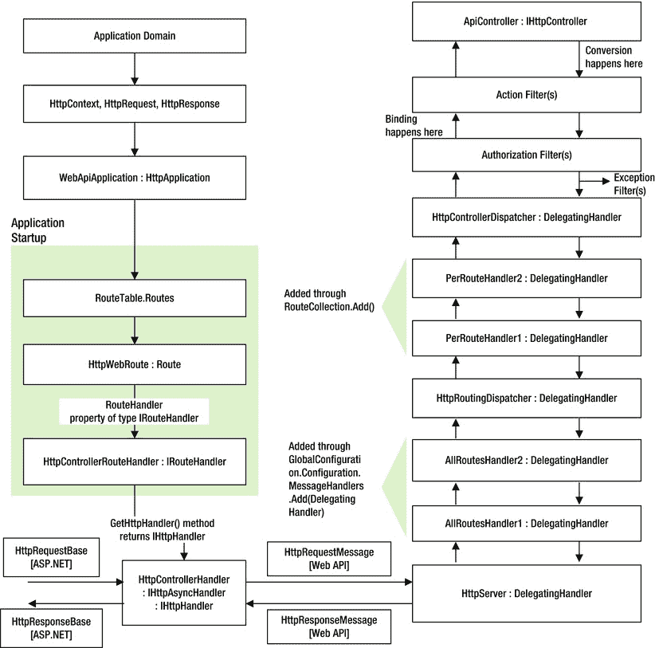
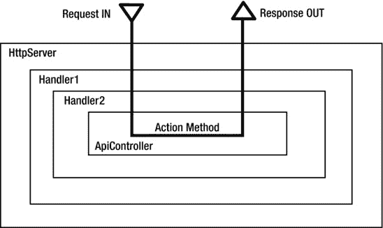

# 三、扩展性要点

ASP.NET Web API 是一个框架。一个框架的关键定义属性是，它控制着执行流程，并在适当的时候调用由我们这样的开发人员编写的特定于应用的代码。我们不调用框架代码，但它调用我们，符合好莱坞原则。在构建服务时，我们用来利用 ASP.NET Web API 框架的最基本的杠杆是我们编写的`ApiController`子类。它是所有特定于应用的操作发生的业务端。

ASP.NET Web API 框架接收一个 HTTP 请求并着手处理它。在处理过程中的某个时间点，它调用我们在`ApiController`子类中实现的方法，传递参数(如果有的话),并获取我们特定于应用的代码返回的输出，继续处理，最终将 HTTP 响应发送回客户端。从收到请求到发回响应的一系列步骤定义了 ASP.NET Web API 的处理架构。

作为一个框架，ASP.NET Web API 有各种内置的扩展点，让我们可以挂接代码并扩展处理。在这一章中，我们着眼于 ASP.NET Web API 框架的处理架构，重点是可扩展性。

扩展点是什么和为什么

为什么您需要担心处理架构呢？你对某事了解得越多，就越容易得到它。保护黑匣子是一项非常困难的任务，因为我们不知道它做什么。对处理架构、可用的可扩展性点和步骤顺序的良好理解使我们能够在最早的机会处理恶意意图。

您可能还想知道为什么需要理解可扩展性点。ASP.NET Web API 支持的服务的核心关注点在于`ApiController`子类的动作方法。安全性是一个跨领域的问题，并不直接归入`ApiController`子类。

实现安全性的最简单的方法(这太简单了，不能被认为是生产强度)是将代码放在单独的类中，并从 action 方法中调用它们。通过这样做，我们正在混合关注。这种混合导致代码库难以管理，到处都是重复的代码。最重要的是，由于缺乏知识或者仅仅是粗心大意而导致的调用适当类的方法的失败会导致安全漏洞。

另一种可能的方法是创建一个带有安全相关代码的基类`ApiController`，所有控制器都从这个类继承，而不是直接从`ApiController`继承。继承在灵活性方面有它自己的缺点，总会有开发者直接从`ApiController`继承他的控制器类。

我们还有其他选择吗？输入扩展点。他们提供了一组标准的扩展点来连接我们的安全代码。团队中的所有开发人员都不需要担心特定于安全性的代码。指定的一个或几个可以通过这些点扩展 web API 处理。ASP.NET Web API 框架在适当的时间点调用这段代码，就像它调用`ApiController`中的 action 方法一样。通过利用可扩展性点，我们确保安全代码不会重复，并且整个应用代码保持整洁和模块化。将调用安全相关代码的责任从开发人员转移到 ASP.NET Web API 意味着我们在更大程度上保护了我们的应用。毕竟，ASP.NET Web API 是一个框架，调用我们的代码是它擅长的！

最后，我们可以使用的所有扩展点是什么？有几种，但我们主要关注其中的两种——过滤器和消息处理程序——因为从安全性的角度来看，它们是最相关的。两者各有利弊。手头的需求通常决定了选择哪一个。

ASP.NET Web API 生命周期

首先，在我们深入过滤器和消息处理程序之前，让我们看一下 ASP.NET Web API 虚拟主机生命周期(ASP.NET)。首先创建应用域。然后，ASP.NET 创建核心对象，如`HttpContext`、`HttpRequest`和`HttpResponse`。ASP.NET Web API 应用是通过创建一个`WebApiApplication`类的实例来启动的，这个类是从`HttpApplication`类派生而来的。触发`Application_Start`事件，并调用 Global.asax.cs 中相应的处理程序。到目前为止，这个流程就像任何其他 ASP.NET 应用一样。

应用启动通过调用`RouteCollection`的扩展方法`WebApiConfig.Register(GlobalConfiguration.Configuration). MapHttpRoute`，将路由模板映射到`RouteTable.Routes`，如[清单 3-1](#list1) 所示，添加一个新的`HttpWebRoute`对象，将`Handler`属性设置为`HttpControllerRouteHandler`单例。

[***清单 3-1。***](#_list1) 绘制路线

```cs
config.Routes.MapHttpRoute(
                name: "DefaultApi",
                routeTemplate: "api/{controller}/{id}",
                defaults: new { id = RouteParameter.Optional }
            );
```

应用对象以通常的 ASP.NET 风格处理请求，并到达必须选择路由处理程序的点。`RouteTable`用于获取请求对应的匹配路由处理程序(`HttpControllerRouteHandler)`)，处理程序调用`GetHttpHandler()`方法，返回`HttpControllerHandler`的新实例。

`HttpControllerHandler`将 ASP。特定于. NET 的`HttpRequest`转换成`HttpRequestMessage`的 web API 抽象，并将其分派给`HttpServer`的一个实例，这是一个`DelegatingHandler`。图 3-1 展示了 Web API 生命周期和处理程序管道。



[图 3-1。](#_Fig1)ASP.NET Web API 生命周期和处理程序管道

`HttpServer`是 web API 管道的关键类之一，因为这是主机不可知处理的起点，`HttpServer`只处理请求和响应的 web API 抽象，`HttpRequestMessage`和`HttpResponseMessage,`。`HttpServer`获取在 Global.asax 启动中配置的委托消息处理程序(所有路由通用)的列表，并通过设置每个处理程序的`InnerHandler`属性来创建处理程序的中文盒子(或者俄罗斯套娃，如果你喜欢它们胜过盒子的话),处理程序是以自上而下的方式调用的:第一个接收请求的处理程序是最后一个被传递响应的处理程序，反之亦然。`HttpServer`确保所有路由消息处理程序管道中的最后一个消息处理程序是`HttpRoutingDispatcher`。

首先是每个路由的消息处理程序管道。 `HttpRoutingDispatcher`分派到路由中指定的消息处理程序。如果为路由指定了多个处理程序(通过 InnerHandler 进行中文装箱)，则所有消息处理程序都以与所有路由处理程序相同的方式调用。`HttpRoutingDispatcher`确保管道中的最后一个消息处理程序是`HttpControllerDispatcher`。

`HttpControllerDispatcher`急件到`IHttpController` ( `ApiController`)。`ApiController`的 `ExecuteAsync()`方法运行授权过滤器，执行模型绑定，运行动作过滤器，调用控制器中的动作方法，运行异常过滤器。从[图 3-1](#Fig1) 中可以看到，有两条管道可用:过滤器和消息处理程序(`DelegatingHandler`)。消息处理程序在`HttpServer`之后立即运行，因此它们在请求中具有早期可见性。过滤器正好在 action 方法之前运行，因此当请求到达过滤器时，该请求可能已经通过了多个其他类。这两个管道都是可扩展的，我们现在深入研究过滤器和消息处理程序。

过滤器

过滤器是封装安全等跨领域问题并将其应用于操作方法的好方法。通过将过滤器配置为全局过滤器，过滤器可应用于单个动作方法、`ApiController,`中的所有方法或所有控制器中的所有方法。如图 3-1 中的[所示，过滤器在管道中的动作方法之前运行。如果您希望在管道中较早地阻止恶意请求，这种行为会被认为是不利的。过滤器的一个优点是粒度或它们可以应用的级别，也就是操作方法级别。](#Fig1)

授权过滤器

`The Authorize`过滤器是一种特殊的现成过滤器，因为它运行在正常动作过滤器之前。每个动作可以定义多个`Authorize`过滤器。可以在动作级别或控制器级别指定一个`Authorize`过滤器。也可以添加到`GlobalFilters.Filters.Add (new AuthorizeAttribute())`这样的全局过滤器中。参见清单 3-2 中的`Authorize`过滤器示例。

[***清单 3-2。***](#_list2) 授权过滤

```cs
[Authorize(Roles = "HumanResourceTeamMember")]
public class EmployeesController : ApiController
{
    public IEnumerable<Employee> Get()
    {
            return new List<Employee>()
            {
                    new Employee() { Id = 12345, Name = "John Q Human" },
                    new Employee() { Id = 23456, Name = "Jane Q Public" }
            };
    }

    public Employee Post(Employee human)
    {
        // Add employee to the system
        human.Id = 12345; // Id produced as a result of adding the employee to data store
        return human;
    }

    [Authorize(Roles = "ManagementTeamMember")]
    public void Delete(int id)
    {
        // Delete employee from the system
    }

    public void Put(Employee employee)
    {
        // Update employee in the system
    }
}
```

`The Authorize` filter 属性接受授权执行操作的用户或角色的 CSV。当没有指定用户或角色时，它只是确保与主体对象相关联的身份是经过身份验证的身份。指定用户或角色后，它会执行额外的步骤，以确保与主体关联的身份名称在允许的用户列表中，或者至少有一个与主体关联的角色出现在角色列表中。如果任何授权检查失败，401-未授权将被设置为响应状态代码。

子类授权过滤器

开箱即用的,`Authorize`过滤器接受 CSV 形式的用户和角色。除非一个应用有其中的一两个，否则它将很难管理，甚至不切实际。

此外，您不希望为了进行授权调整而在生产中进行编译和部署，对吗？继承现成的过滤器并实现特定于应用的逻辑是一个选项。参见[列表 3-3](#list3) 的子类过滤器示例。

由于子类过滤器派生自`Authorize`过滤器，子类过滤器继承了父过滤器的缺点。正如我前面提到的，安全检查发生在 ASP.NET Web API 管道中实际操作方法执行之前。

[***清单 3-3。***](#_list3) 子类授权过滤器

```cs
public class TimeShareAttribute : AuthorizeAttribute
{
        protected override bool IsAuthorized(HttpActionContext context)
        {
                IPrincipal principal = Thread.CurrentPrincipal;
                // If principal.IsInRole("TimeSharer")
                // Check if current time is between allocated slot start and end times
                // If not, return false
                return true;
        }

        // If 401 – Unauthorized is okay for you, no need to override
        protected override void HandleUnauthorizedRequest(HttpActionContext actionContext)
        {
               base.HandleUnauthorizedRequest(actionContext);
        }
}
```

选择性允许匿名访问

`Authorize`过滤器授权访问单个动作方法(如果在动作方法级别应用)或控制器中的所有方法(如果在控制器级别应用)。通过全局指定`Authorize`过滤器，可以对所有控制器上的所有动作方法调用进行授权检查。想象一下这样一个场景，您希望在一个总括的基础上对所有方法实施授权，比如说，除了两个方法之外。从维护和安全的角度来看，将`Authorize`过滤器分别应用于除了两个以外的所有动作方法，这难道不是一场噩梦吗？幸运的是，有一种叫做`AllowAnonymous`的特殊标记滤镜可以与`Authorize`滤镜配合使用，帮助你摆脱这种不愉快的局面。`AllowAnonymous`过滤器允许我们在全局范围内应用`Authorize`过滤器，并在单独的基础上指定这两种方法，以免除一揽子授权。需要注意的重要一点是`AllowAnonymous`滤镜只能与`Authorize`滤镜配合使用。

动作过滤器

动作过滤器是通用过滤器，而`Authorize`过滤器是专门针对授权的现成过滤器。动作过滤器足够通用，可以用来封装任何横切关注点。动作过滤器是从`FilterAttribute`继承的类。

安全不仅仅是授权。有些情况下，您需要编写一个动作过滤器。这种动作过滤器的一个用例是为一些动作方法选择性地启用 CORS。第四章中讲述了 CORS。关于动作过滤器的示例实现，请参考[第 4 章](04.html)中的[清单 4-7](04.html#_list7) ，其中我使用了一个动作过滤器来启用 ETags。

在自定义操作过滤器中进行身份验证和授权是完全可能的。如果`Authorize`过滤器运行过于接近您的舒适水平，请注意该运行仅在行动前一步进行。`ApiController`运行所有的`Authorize`过滤器，执行绑定，并开始运行动作过滤器。在执行之前，应用中编写的许多代码可能已经被执行了，所有这些代码行都暴露在未经授权的用户请求之下。

消息处理程序

授权过滤器由`ApiController`的方法运行。换句话说，如果您依靠这些过滤器来阻止未经授权的访问，那么您需要理解，未经授权的请求是通过委托处理程序一路进来的，并且是在执行操作的前几步才被阻止的。

当然，迟到总比不到好，但是如果你不想让某个不速之客进入你的房子，你会允许他一路走到卧室门口，仅仅因为那时你碰巧在卧室里吗？你可能希望在他踏上你的土地之前就阻止他。如果是这种情况，您将需要在其他地方处理身份验证和授权，最好是在消息处理程序中，它有机会在管道的早期处理未经授权的请求。

尽管在管道中较早运行的消息处理程序在尽早处理恶意请求方面可能是有利的，但是消息处理程序为所有动作方法运行，或者至少为一个路由的所有动作方法运行。这是在选择消息处理程序来解决问题时要考虑的事情。

在 ASP.NET Web API 管道中，第一个运行的消息处理程序是 `HttpServer`。所有其他定制消息处理程序都在`that`之后运行。自定义消息处理程序是从类`DelegatingHandler`继承的一个类。理想情况下，处理身份验证或授权等重要安全问题的定制消息处理程序应该在`HttpServer`之后立即运行，作为管道中的第二个消息处理程序。现在让我们深入了解一下消息处理程序。你在这部分的每一秒都是值得的。

在 ASP.NET Web API 消息处理程序管道中，传入的请求从`HttpServer`开始按顺序通过处理程序。换句话说，`HttpServer`在其他人之前查看请求。对于传出的响应，链中的最后一个处理程序首先看到输出，而`HttpServer`最后看到响应。

这是一个很好的模型，因为您的重要处理程序首先看到请求，而他们是最后一个对响应做任何事情的。如果一个坏请求(无论该请求被归类为坏请求的标准是什么)到来，您的重要处理程序会首先看到它，并且它们可以决定是否应该允许内部处理程序看到该请求，或者是否应该在管道中的该点停止该请求。

类似地，在离开时，重要的处理程序决定在管道中尽可能晚地发送响应、停止响应或者对响应进行最后的修改。[图 3-2](#Fig2) 是调用顺序的示意图。



[图 3-2。](#_Fig2)消息处理器的中国盒子

要创建消息处理程序，我们必须从`DelegatingHandler`类继承并覆盖`SendAsync`方法。如果我们必须编写一些在接收请求时执行的代码和一些在发送响应时执行的其他代码，那么很自然会有两个方法需要重写:一个用于请求处理，一个用于响应处理。然而，`Task`的力量帮助我们用一种方法为两种情况编写代码，如[清单 3-4](#list4) 所示。

[***清单 3-4。***](#_list4) 委托处理者

```cs
public class MyHandler40 : DelegatingHandler // Handler for .NET 4.0
{
        protected override Task<HttpResponseMessage> SendAsync(HttpRequestMessage request,
                                                               CancellationToken cancellationToken)
        {
                // Inspect and do your stuff with request here

                // If you are not happy for any reason,
                // you can reject the request right here like this

                bool isBadRequest = false;
                if (isBadRequest)
                {
                        return Task<HttpResponseMessage>.Factory.StartNew(() =>
                        {
                                return request.CreateResponse(HttpStatusCode.BadRequest);
                        });
                }

                return base.SendAsync (request, cancellationToken)
                       .ContinueWith((task) =>
                        {
                                var response = task.Result;

                                // Inspect and do your stuff with response here
                                return response;
                        });
        }
}
```

在。NET Framework 4.5 中，[清单 3-4](#list4) 中所示的处理程序可以用更少的代码行编写，这要感谢`async`和`await`关键字，如[清单 3-5](#list5) 所示。从现在开始，对于编码消息处理程序，我们将坚持使用。NET Framework 4.5 风格使用了`async`和`await`关键字，因为。NET Framework 4.5 代码简洁易读。此外，在本文发布时。NET Framework 4.5 是最新版本。

[***清单 3-5。***](#_list5) DelegatingHandler。NET 框架 4.5

```cs
public class MyHandler : DelegatingHandler
{
    protected override async Task<HttpResponseMessage> SendAsync(HttpRequestMessage request,
                                                                 CancellationToken cancellationToken)
    {
        // Inspect and do your stuff with request here

        // If you are not happy for any reason,
        // you can reject the request right here like this

        bool isBadRequest = false;
        if (isBadRequest)
            return request.CreateResponse(HttpStatusCode.BadRequest);

        var response = await base.SendAsync(request, cancellationToken);

        // Inspect and do your stuff with response here

        return response;
    }
}
```

要在配置中挂接处理程序，使其成为委托处理程序中文框的一部分，需要将处理程序添加到 App_Start 文件夹下的 WebApiConfig.cs 中的`MessageHandlers`集合中，如[清单 3-6](#list6) 所示。当以这种方式设置时，处理程序成为全路由处理程序，它对所有请求和响应执行，而不考虑路由。可以通过添加更多的处理程序来指定多个处理程序，如清单 3-7 所示。

[***清单 3-6。***](#_list6) 单路处理器

```cs
public static class WebApiConfig
{
    public static void Register(HttpConfiguration config)
    {
            config.Routes.MapHttpRoute(
                    name: "DefaultApi",
                    routeTemplate: "api/{controller}/{id}",
                    defaults: new { id = RouteParameter.Optional }
            );

            config.MessageHandlers.Add(new MyHandler());
    }
}
```

[***清单 3-7。***](#_list7) 多个全路线处理程序

```cs
config.MessageHandlers.Add(new MySecurityHandler());
config.MessageHandlers.Add(new MyHandler());
```

添加处理程序的顺序**与**无关。在这种情况下，首先添加`MySecurityHandler, which is a more important message handler that deals with security,`，然后添加`MyHandler`。这个命令确保`MySecurityHandler`在`MyHandler`之前检查请求，反之亦然。这样，`MySecurityHandler`可以在允许请求传递到`MyHandler`之前执行必要的安全检查，比如认证和授权。如果需要，`MySecurityHandler`可以缩短恶意或不良请求的处理过程，并防止`MyHandler`或管道下游的任何其他代码看到该请求。在退出过程中，`MySecurityHandler`由于是链中的第一个处理程序，所以可以将响应视为最后一个处理程序。这样，它就拥有了传递响应的最终决定权，或者在最后一刻决定不发送带有 200 - OK 状态代码的响应，而是发送一个错误。

为了连接一个特定于路由的处理程序，该处理程序可以被传递到 WebApiConfig 中的`MapHttpRoute`(在 App_Start 下)，如[清单 3-8](#list8) 所示。

[***清单 3-8。***](#_list8) 路线专用处理程序

```cs
public static class WebApiConfig
{
        public static void Register(HttpConfiguration config)
        {
            var handler = new MyPremiumSecurityHandler()
            {
                InnerHandler = new MyOtherPremiumSecurityHandler()
                {
                    InnerHandler = new HttpControllerDispatcher(config)
                }
            };

            config.Routes.MapHttpRoute(
                name: "premiumApi",
                routeTemplate: "premium/{controller}/{id}",
                defaults: new { id = RouteParameter.Optional },
                constraints: null,
                handler: handler
            );

            config.Routes.MapHttpRoute(
                name: "DefaultApi",
                routeTemplate: "api/{controller}/{id}",
                defaults: new { id = RouteParameter.Optional }
            );
        }
}
```

[清单 3-8](#list8) 用`MyOtherPremiumHandler`指定`MyPremiumSecurityHandler`作为内部处理程序，所以执行的顺序将与所有路线的例子相同。这里的处理程序只针对高级路线。例如，GET `http://server/premium/employees`将导致处理程序参与管道，而 GET `http://server/api/products`将不会参与处理程序。

HTTP 模块

有一些扩展点可以用来扩展 ASP.NET 管道本身，HTTP 模块就是这样一个点。通过实现 HTTP 模块，您甚至可以在第一个全路由消息处理程序运行之前执行您的身份验证代码。如果您在同一个应用中有一个 web API 和其他资源，如 HTTP 处理程序、页面或 MVC 控制器，并且您想在一个地方建立身份并共享它，那么 HTTP 模块是一个很好的选择。

以下列表显示了在设计身份验证机制之前必须考虑的要点。这个列表来自微软的 ASP.NET Web API 网站(`http://www.asp.net/web-api/overview/security/authentication-and-authorization-in-aspnet-web-api`)。

HTTP 模块可以看到通过 ASP.NET 管道的所有请求。消息处理程序只看到路由到 Web API 的请求。

您可以设置每个路由的消息处理程序，这允许您将身份验证方案应用于特定的路由。

HTTP 模块特定于 IIS。消息处理程序是主机不可知的，因此它们可以用于虚拟主机和自主机。

HTTP 模块参与 IIS 日志记录、审计等等。

HTTP 模块在管道中运行较早。如果在消息处理程序中处理身份验证，则在处理程序运行之前不会设置主体。此外，当响应离开消息处理程序时，主体恢复到以前的主体。

在使用 ASP.NET 管道中的组件时，最后两点是非常重要的考虑因素，这些组件期望在 ASP.NET 管道中更早地进行身份验证，即在触发`AuthenticateRequest`事件时，并且在 ASP.NET 管道的整个处理过程中保持相同的身份。

消息处理程序确实在 ASP.NET Web API 管道中运行得更早，但是从 ASP.NET 管道中运行的组件的角度来看，它可能已经晚了。如果您使用自己编写的自定义 HTTP 模块或 ASP.NET 的现成模块，而这些模块需要经过身份验证才能工作，那么在消息处理程序中进行身份验证就太晚了。例如，`ResolveRequestCache`事件紧接在`AuthenticateRequest`和`AuthorizeRequest`事件之后被触发。ASP.NET`OutputCacheModule`或您自己定制的监听`ResolveRequestCache`事件的 HTTP 模块甚至可以在 ASP.NET Web API 管道开始运行之前从输出缓存中为请求提供服务。值得注意的是，在撰写本书时，ASP.NET Web API 还没有可用的`OutputCacheAttribute`。

此外，IIS 不会记录您可能从消息处理程序在`Thread.CurrentPrincipal`中设置的主体。因此，如果虚拟主机是已知的，并且您希望通过其可扩展性点充分利用 ASP.NET，那么在 HTTP 模块中实现您的身份验证和授权逻辑是很有意义的。另一方面，如果您不希望扩展或利用 ASP.NET 管道，而是让请求到达 ASP.NET

在任何处理开始之前，使用消息处理程序来执行身份验证是一个很好的选择。使用 HTTP 模块的另一面是，您的设计不再是主机无关的，而是依赖于 web 主机(IIS)。我在本书中通篇使用消息处理程序，因为它是与主机无关的，但是您必须意识到选择消息处理程序还是 HTTP 模块之间的权衡。[清单 3-9](#list9) 显示了一个与`AuthenticateRequest`和`EndRequest`事件挂钩的 HTTP 处理程序。

[***清单 3-9。***](#_list9) HTTP 处理程序

```cs
public class MyHttpModule : IHttpModule
{
public void Init(HttpApplication context)
{
context.AuthenticateRequest += OnApplicationAuthenticateRequest;
context.EndRequest += OnApplicationEndRequest;
}
private static void OnApplicationAuthenticateRequest(object sender, EventArgs e)
{
var request = HttpContext.Current.Request;
var authHeader = request.Headers["Authorization"];
if (authHeader != null)
{
// Authenticate here using the credentials from authorization header
// On successful authentication, set principal
var identity = new ClaimsIdentity(new[] {
new Claim("type", "value") }, "AuthnType");
var principal = new ClaimsPrincipal(identity);
Thread.CurrentPrincipal = principal;
if (HttpContext.Current != null)
HttpContext.Current.User = principal;
}
}
private static void OnApplicationEndRequest(object sender, EventArgs e)
{
var response = HttpContext.Current.Response;
```

```cs
// Do anything with response such as checking status code and
// adding response headers
}
public void Dispose() { }
}
```

为了让这个模块在 ASP.NET 管道(集成)中运行，在 Web.config 中创建一个条目，如[清单 3-10](#list10) 所示。

[***清单 3-10。***](#_list10) Web.config 修改

```cs
<system.webServer>
...
<modules>
<add name="MyHttpModule"
type="namespace.MyHttpModule, assembly"/>
</modules>
...
<system.webServer>
```

摘要

在这一章中，我们研究了 web 托管的 ASP.NET Web API 的处理架构，并探索了 ASP.NET Web API 管道中可用的两个重要扩展点，即过滤器和消息处理程序。

过滤器稍后在管道中运行，但是可以在操作方法的更细粒度级别上应用。开箱即用的,`Authorize`过滤器可以应用于动作方法，或者在控制器级别实施授权。如果需要，可以通过子类化来扩展`Authorize`过滤器，以添加更多的功能。虽然`Authorize`过滤器是特定于授权的，但是通用的动作过滤器也可以用于添加其他与安全相关的功能。

消息处理程序在管道中较早运行，可以链接在一起形成消息处理程序的中国盒子，链中的第一个处理程序首先检查请求，然后将请求传递给链中的第二个处理程序。在退出时，第一个处理程序将是最后一个检查响应的处理程序，因此对响应有最终的发言权。

我们研究了所有路由消息处理程序，这些处理程序可以检查所有路由上所有操作方法的请求和响应。我们还研究了特定于路由的处理程序，这些处理程序可以检查特定路由中动作方法的请求和响应。

我们利用从本章中获得的理解来实现所有后续章节中与安全相关的代码，因为这些可扩展性点是插入安全方面的基础，而安全方面是一个横切关注点。