# 四、HTTP 剖析与安全

创建 HTTP 服务的主要好处是可达性。不同平台上的各种客户端都可以使用您的 HTTP 服务。运行 iOS 的苹果 iPhone 上的客户端应用可以与运行微软 Windows 2012 操作系统的 HP ProLiant 服务器上托管的 ASP.NET Web API 进行对话。同样，运行 Windows 8 Pro 的微软 Surface 平板电脑上的应用可以与 IBM System z 上托管的 HTTP 服务进行对话，HTTP 是这些不同设备平台交互背后的秘密武器。

ASP.NET Web API 是一个使构建 HTTP 服务变得容易的框架。ASP.NET Web API 框架拥抱 HTTP，而不是反对它或将其抽象掉。因为 HTTP 服务的基础是 HTTP 协议，所以理解该协议是保护 ASP.NET Web API 支持的 HTTP 服务的先决条件。毕竟，一栋房子的地基有多坚固就有多坚固！

在实现符合 HTTP 的服务时，对 HTTP 的良好理解是必不可少的。例如，开发人员不希望 HTTP 服务发送一个带有 200 - OK 状态代码的响应，并且在响应体中包含一条消息，声明由于无效的凭证，身份验证失败。相反，对 HTTP 有很好理解的开发人员希望 HTTP 服务发送 401 -未授权状态码，这是传达身份验证失败的标准方式，因此被所有客户端理解。

在本章中，您将学习如何应用 HTTP 的基本原理来创建安全的 HTTP 兼容服务。您还将学习一些高级概念，如缓存、ETags、CORS 和 HTTPS，这些概念对于创建产品级、高性能和安全的 web API 至关重要。

HTTP 交易

HTTP 是基于可靠传输层协议(读 TCP)的应用层协议。基于 HTTP 的通信的两个端点是服务器和客户端。客户端向服务器发送请求；服务器处理该请求，并向客户端发回一个响应，该响应包含一个指示处理是否成功的状态代码。这些步骤构成了一个 HTTP 事务。客户端通常是 web 浏览器，如 Internet Explorer，而服务器是 web 服务器，如 IIS。web 服务器同时为多个客户端提供服务。HTTP 客户端通过连接到 web 服务器上的一个端口(通常为 80)来发起 HTTP 请求。

Web 服务器托管的资源通过称为统一资源标识符(URI)的标识符进行唯一标识。统一资源定位符(URL)是一个 URI，它标识一个资源，但也指定如何获得资源的表示。例如，`http://www.server.com/home.html`是一个包含三部分的 URL。

1.  方案，也就是`http://`。该方案表示所使用的协议(HTTP)。
2.  服务器，也就是`www.server.com`。服务器是托管资源的服务器。
3.  资源路径，即/home.html。资源路径是资源在服务器上的路径。

[图 4-1](#Fig1) 说明了一个典型的 HTTP 事务。

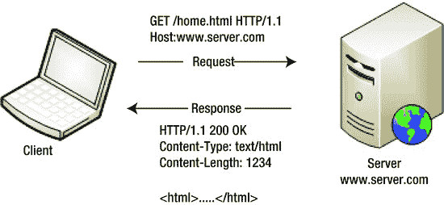

[图 4-1。](#_Fig1) HTTP 交易

客户端请求服务器对资源采取行动。有一个名词和一个动词与请求相关联。名词是由 URI 确定的资源。动词是动作或 HTTP 方法。在[图 4-1](#Fig1) 中，客户端请求 GET on /home.html，服务器以 200 OK 状态码响应，并发送资源的文本/html 表示。服务器在内容类型响应头中指定表示形式(文本/html)。内容类型也称为媒体类型。

HTTP 请求

HTTP 请求将请求行作为请求的第一行。请求行以 HTTP 方法开头，后面跟一个空格，然后是所请求资源的 URI、一个空格，最后是 HTTP 版本。请求行以回车(CR)和换行(LF)字符结束，如图[图 4-2](#Fig2) 所示。

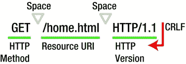

[图 4-2。](#_Fig2)请求行

请求行之后是请求头。头字段是冒号分隔的键值对，以 CRLF 结束，就像请求行一样。标题字段的结尾由一个空字段指示——两个连续的 CRLF 对——如图[图 4-3](#Fig3) 所示。

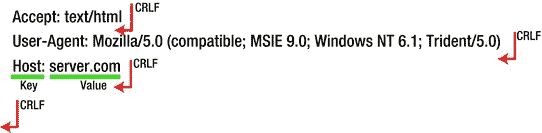

[图 4-3。](#_Fig3)请求标题

最后，请求头后面是可选的请求体。根据使用的 HTTP 方法，请求主体可以存在也可以不存在。

请求标题

请求头允许客户端向服务器发送关于请求的附加信息或关于客户端本身的信息。尽管对于报头的数量或报头的长度没有规定限制，但是出于实际原因，参与事务的客户端和服务器施加了限制。主机是 HTTP 1.1 的唯一强制请求头。User-Agent 头包含用户代理字符串，并标识发出请求的用户代理。虽然这不是强制性的，但是这个头几乎总是存在的。

在第 2 章中，我们检查了一些请求头。我们看到了 ASP.NET Web API 如何在内容协商中使用 Accept 和 Content-Type 头。从安全性的角度来看，最重要的头是 Authorization 头，它用于发送身份验证的凭证。我们将在后面的章节中看到这个头是如何用于保护 ASP.NET Web API 的。有许多标题与 web 缓存和 ETags 相关。我们将在本章的后半部分研究它们的作用。在写这本书的时候，ASP.NET Web API 还不支持 Accept-Language 和 Accept-Encoding 头。

除了标准头之外，按照惯例，还有以 X 前缀命名的非标准头。最常见的是 X-Requested-With:XMLHttpRequest，大多数 JavaScript 框架(如 JQuery)都使用它来标识 AJAX 请求。

HTTP 方法

HTTP 方法表示客户端在资源上请求的动作。[表 4-1](#Tab1) 显示了 HTTP 1.1 规范中定义的八种方法。

[表 4-1](#_Tab1) 。HTTP 方法比较

| 方法 | 描述 | 副作用 |
| --- | --- | --- |
| 得到 | 获取资源的表示形式 | 无效；没有副作用 |
| 放 | 更新资源 | 是的，但是幂等的 |
| 邮政 | 创建新资源或更新资源 | 是 |
| 删除 | 删除资源 | 是的，但是幂等的 |
| 头 | 与 GET 相同，但没有响应正文 | 无效；没有副作用 |
| 选择 | URI 支持的方法 | 无效；没有副作用 |
| 连接 | 将请求连接转换为 TCP 隧道，通常是为了便于通过 HTTP 代理进行 HTTP 支持这种方法存在安全隐患 | 无效；没有副作用 |
| 微量 | 取回服务器收到的请求，包括中间服务器引入的所有更改；从安全角度来看，一般不推荐 | 无效；没有副作用 |

目前，ASP.NET Web API 通过约定支持除连接和跟踪之外的所有方法。通过在`ApiController`子类中实现一个名称以 HTTP 方法开头的方法，您可以让 ASP.NET Web API 框架将 HTTP 请求路由到控制器类中相应的方法。例如，通过在`EmployeesController`中实现一个方法`GetEmployee()`或者仅仅是`Get()`，你可以处理一个 HTTP GET 请求。

对于 CONNECT 和 TRACE 方法，您必须在 action 方法上应用`AcceptVerbs`属性来适当地路由请求。[清单 4-1](#list1) 展示了如何通过向`ApiController`添加一个特定的动作方法并在动作方法上应用`AcceptVerbs`属性来支持跟踪。

[***清单 4-1。***](#_list1) 描法

```cs
[AcceptVerbs("TRACE")]
public void Echo(){}
```


图 4-4 显示了当我们把 HTTP 请求的所有部分放在一起时，一个典型的请求消息是什么样子的。因为是 GET，所以没有消息体。

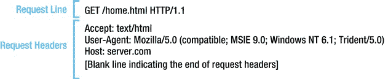

[图 4-4。](#_Fig4)请求消息

方法覆盖

RESTful 服务允许客户端通过 GET、POST、PUT、DELETE 等方法对资源进行操作。GET 和 POST 是最常用的方法。

大多数公司防火墙都允许端口 80，这是 HTTP 的典型端口。但是，有些确实在允许的 HTTP 方法方面有限制。GET 和 POST 方法非常常见，但是其他方法(如 DELETE)可能是不允许的。

X-HTTP-Method-Override 头可以帮助您解决这个问题。涉及该头的典型解决方案是在请求中发送 X-HTTP-Method-Override 和实际的动词(DELETE 或 PUT ),并使用 POST 提交请求；也就是说，带有伪 POST 动词的请求行欺骗防火墙允许该请求。

在 ASP.NET Web API 中，一个消息处理程序，如清单 4-2 中的[所示，可以用 X-HTTP-Method-Override 中指定的方法替换 POST。消息处理程序在管道的早期运行，是适合这一目的的最佳扩展点。](#list2)

[***清单 4-2。***](#_list2) 方法覆盖

```cs
public class MethodOverrideHandler : DelegatingHandler
{
    protected override async Task<HttpResponseMessage> SendAsync(HttpRequestMessage request,
CancellationToken cancellationToken)
    {
        if (request.Method == HttpMethod.Post && request.Headers.Contains("X-HTTP-Method-Override"))
        {
            var method = request.Headers.GetValues("X-HTTP-Method-Override").FirstOrDefault();

            bool isPut = String.Equals(method, "PUT", StringComparison.OrdinalIgnoreCase);
            bool isDelete = String.Equals(method, "DELETE", StringComparison.OrdinalIgnoreCase);

            if (isPut || isDelete)
            {
                request.Method = new HttpMethod(method);
            }
        }

        return await base.SendAsync(request, cancellationToken);
    }
}
```

为了测试前面的`MethodOverrideHandler`，你需要一个像 Fiddler 这样的工具，在本章后面会深入讨论。Fiddler 在捕获和分析 HTTP 流量方面非常有用。此外，它还允许您手工编写一个带有请求头的请求，并使用您选择的 HTTP 方法将其发送到一个端点。[图 4-5](#Fig5) 展示了如何使用设置为 PUT 的 X-HTTP-Method-Override 头进行 POST 请求。如果通过在 App_Start 下的 WebApiConfig.cs 文件中创建一个条目将`MethodOverrideHandler`插入到管道中，这个请求将调用控制器中的 PUT action 方法，而不是 POST。

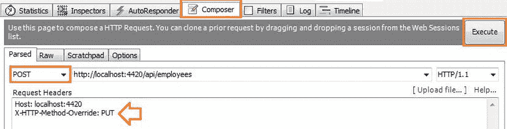

[图 4-5。](#_Fig5)提琴手作曲家

HTTP 响应

HTTP 响应将状态行作为响应的第一行。如图[图 4-6](#Fig6) 所示，状态行以 HTTP 版本开头，后面是一个空格，再后面是状态码和一个空格，然后是原因短语。请求行以一个 CR 和一个 LF 字符结束。

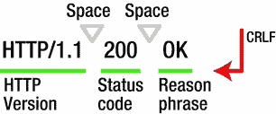

[图 4-6。](#_Fig6)状态行

状态代码

HTTP 响应状态代码是一个三位数。第一个数字定义了响应的类别:1—信息，2—成功，3—重定向，4—客户端错误，5—服务器端错误。表 4-2 显示了一些最常见的状态代码。针对这种情况发送适当的状态代码是采用 HTTP 的一个重要方面。通过这样做，您可以利用 HTTP 的广泛接受。

[表 4-2。](#_Tab2) HTTP 状态代码

| 状态代码 | 描述 |
| --- | --- |
| 200 好的 | 请求已成功处理。 |
| 201 已创建 | 该请求已被满足，并导致一个新的资源被创建。新资源的 URI 在位置响应报头中返回。在 ASP.NET Web API 中，这样的响应可以这样创建:`Request.CreateResponse<Employee>` `(HttpStatusCode.Created, employee);` |
| 204 无内容 | 请求已成功处理，但没有返回任何内容。ASP.NET Web API 中的 void 操作方法返回此状态代码。此外，删除操作方法可以发送此代码来表示资源已被删除。 |
| 400 个错误请求 | 由于语法不正确，服务器无法理解该请求。 |
| 401 未经授权 | 该请求需要用户身份验证。如果已经提供了凭据，状态代码 401 表示提供的凭据无效。 |
| 403 禁止 | 服务器理解该请求，但拒绝执行。即使提供了有效凭据，也可以使用此状态代码；例如，如果对应于提交的凭证的用户不被允许访问资源。通常，服务器会发回拒绝满足请求的原因以及该状态代码。 |
| 404 未找到 | 服务器没有找到任何与请求 URI 匹配的内容。404 状态代码也可以用在 403 场景中，当服务器不想发送回拒绝服务请求的原因时。一个很好的例子是当服务器检测到某种攻击时，这可能是暴力攻击。在这种情况下，服务器的响应是 404 Not found，而不是 403 Forbidden 和一个解释。 |

一个未处理异常的奇怪案例

当异常被抛出且未被处理时，ASP.NET Web API 返回 500 内部服务器错误。清单 4-3 显示了一个抛出`ArgumentException`的动作方法，但是没有处理程序来捕捉这个异常。

[***清单 4-3。***](#_list3) 未处理的异常

```cs
public class EmployeesController : ApiController
{
        public IEnumerable<Employee> Get(string department)
        {
                if(!String.Equals(department, "HR", StringComparison.OrdinalIgnoreCase))
                        throw new ArgumentException("Bad Department");

                return new List<Employee>()
                {
                        new Employee() { Id = 12345, Name = "John Q Human" }
                };
        }
}
```

当对“HR”部门发出 GET 请求时，将返回响应状态代码 500。在这种情况下，响应体具有堆栈跟踪详细信息。

```cs
{"Message":"An error has occurred.","ExceptionMessage":"Bad Department","ExceptionType":"System.ArgumentException","StackTrace":"   at ...
```

发送堆栈跟踪有安全风险。通过在 App_Start 文件夹下的 WebApiConfig.cs 中为错误详细信息包含策略指定`Never`选项，可以阻止堆栈跟踪到达客户端。

```cs
config.IncludeErrorDetailPolicy = IncludeErrorDetailPolicy.Never;
```

然而，从客户端的角度来看，这是没有用的。客户端的状态代码为 500，这基本上表明服务有问题。这是显而易见的，而且对确定什么是错的没有用。通过抛出一个`HttpResponseException`，我们可以更好地控制发送给客户端的内容，并且可以控制状态代码和其他更有意义的东西，如[清单 4-4](#list4) 所示。

[***清单 4-4。***](#_list4)HttpResponseException

```cs
public Employee Get(int id)
{
        if (id > 999999)
        {
                throw new HttpResponseException
                         (
                                new HttpResponseMessage()
                                {
                                        Content = new StringContent("Invalid employee id"),
                                        StatusCode = HttpStatusCode.BadRequest
                                }
                         );
        }
}
```

不是一般状态 500，而是 400-错误请求与声明该员工无效的消息一起被发回。

```cs
HTTP/1.1 400 Bad Request
Headers go here

Invalid employee id
```

这就完成了工作，但是有一个以`ExceptionFilterAttribute`形式的扩展点可用于 map standard。标准 HTTP 状态代码的. NET 异常(见[清单 4-5](#list5) )。添加到全局过滤器集合中的这样一个过滤器将使代码保持干燥，因为必须在不同的地方用不同的状态代码构建 HTTP 响应。

[***清单 4-5。***](#_list5) 异常过滤

```cs
public class ExceptionFilter : ExceptionFilterAttribute
{
    private IDictionary<Type, HttpStatusCode> map = null;

    public ExceptionFilter()
    {
        map = new Dictionary<Type, HttpStatusCode>();
        map.Add(typeof(ArgumentException), HttpStatusCode.BadRequest);
        map.Add(typeof(SecurityException), HttpStatusCode.Unauthorized);
        map.Add(typeof(NotImplementedException), HttpStatusCode.NotImplemented);
    }

    public override void OnException(HttpActionExecutedContext context)
    {
        if (!(context.Exception is HttpException))
        {
            context.Response = new HttpResponseMessage(map[context.Exception.GetType()])
                               {
                                   Content = new StringContent(context.Exception.Message)
                               };
        }
    }
}
```

 **注意**对于那些注重细节的人，我使用 400-Bad Request 来表示传入的 id 不是有效 ID 或错误 ID 的情况。这可以用 404 很好地处理，这意味着对于传入的 ID 没有雇员。

响应标题

响应头使服务器能够传递关于响应的任何附加信息，这些信息既不属于状态行，也不属于响应正文。例如，Content-Type 头具有响应内容的 MIME 或媒体类型。作为另一个例子，HTTP/1.1 要求服务器在每个响应中发送的日期头包含响应生成的日期和时间(GMT)。

响应头看起来与图 4-3 所示的请求头完全一样，因为头字段是冒号分隔的键值对，以 CRLF 结束。报头字段的结尾由空字段指示:两个连续的 CRLF 对。

从安全角度来看，WWW-Authenticate 头是一个重要的响应头。当对 ASP.NET Web API 的请求带有无效凭据或者缺少必需的凭据时，标准响应状态代码是 401-未授权。在这种情况下，按照 HTTP 规范，WWW-Authenticate 头必须包含在响应中。这个头表示 web API 支持的身份验证方案。

征求意见稿(RFC) 2617 (HTTP 认证:基本和摘要访问认证)提供了 HTTP 认证框架的规范、原始的基本访问认证方案和基于加密哈希的方案，称为摘要访问认证。基本身份验证方案基于一种模型，该模型要求客户端使用每个领域的用户 ID 和密码对自身进行身份验证。例如，如果请求中缺少身份验证头，或者指定的凭据无效，要求基本身份验证的 web API 将发送以下头。

```cs
WWW-Authenticate: Basic
```

除了方案信息之外，WWW-Authenticate 头还可以包含客户端的附加信息，例如领域。

```cs
WWW-Authenticate: Basic realm="GreenPlanet"
```

与基本访问身份验证一样，摘要式访问身份验证会验证通信双方是否知道共享机密(密码)。与基本身份验证不同，这种验证是在不明文发送密码的情况下完成的，这是基本身份验证的最大弱点。摘要方案使用一个随机数。客户端根本不发送密码。相反，它发送用户名、密码、给定随机数、HTTP 方法和请求的 URI 的摘要或散列(具体来说是 MD5 散列)。nonce 由服务器生成，并与 WWW-Authenticate 标头一起发送，如以下示例所示。

```cs
WWW-Authenticate: Digest realm="MagicalRealm", qop="auth", nonce="abcd98b7102ee2f0e9f26d0d600bfb0c562"
```

web API 可以同时支持基本和摘要式身份验证方案。在这种情况下，作为 401-未授权响应的一部分，将向客户端发送两个 WWW-Authenticate 头，如下例所示。

```cs
WWW-Authenticate: Basic realm="MagicalRealm"
WWW-Authenticate: Digest realm="MagicalRealm", qop="auth", nonce="abcd98b7102fd600bfb0c562"
```

当客户端收到这两个报头时，它可以选择使用最适合其能力的方案。如果客户端能够使用这两种方案，那么可以选择摘要式身份验证，因为它更安全。例如，如果 Internet Explorer 既有基本方案又有摘要方案，它会自动选择摘要方案而不是基本方案。我们将在第 8 章中更详细地介绍基本认证方案和摘要认证方案。

响应正文

响应体具有资源的表示，如 Content-Type 头所定义的。对于网页，这将是 HTML。对于 ASP.NET Web API，这可能是 JSON、XML 或任何表示返回响应的格式。

将 HTTP 响应的所有片段放在一起，[图 4-7](#Fig7) 显示了典型的响应消息。为简洁起见，删除了一些标题。

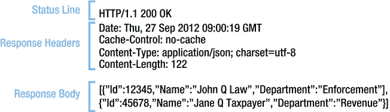

[图 4-7。](#_Fig7)响应消息

网络缓存

web 缓存是 web 服务器响应(如网页、图像和样式表)的缓存，供以后使用。Web 缓存可以减少往返行程、网络带宽和 web 服务器资源的使用。最终用户也感受到了更好的性能。缓存可以位于 web 浏览器中(如果涉及的话),也可以位于任何中间服务器(如 ISP)或中间的任何代理服务器中。如果使用 HTTPS，则不会缓存任何内容。

过期和验证是与缓存相关的两个主要机制。到期机制允许重复使用响应，而无需与服务器进行核对，从而减少了往返行程，验证机制最大限度地减少了带宽使用。

缓存的内容不一定总是图像或层叠样式表(CSS)之类的文件。甚至 ASP.NET Web API 响应也可以被缓存。这种情况的一个例子是 web API 返回任何主列表，比如很少更改或者更改不频繁的代码列表。默认情况下，ASP.NET Web API 框架通过将 Cache-Control 头的值设置为 no-cache 来标记不缓存响应。

Cache-Control: max-age 指令指定缓存过期前可以使用的持续时间(秒)。要查看这个响应头的运行情况，请回到第 2 章的[中使用的`ApiController`–`EmployeesController`。`GetAllEmployess`方法返回 JSON 表示中的雇员列表资源，由 MVC 视图通过 JQuery Ajax 使用。通过返回带有特定值的 cache-control 响应头，可以覆盖被标记为不缓存的响应的默认行为。在](02.html)[清单 4-6](#list6) 中，我们使用 6 秒的最大年龄值。您可能知道，对于任何实际的实现来说，6 秒的到期时间都太短了；此处仅用于说明目的。

[***清单 4-6。***](#_list6) 缓存控制:最大年龄

```cs
public class EmployeesController : ApiController
{
    public HttpResponseMessage GetAllEmployees()
    {
            var employees = new Employee[]
            {
                    new Employee()
                    {
                            Id = 12345,
                            Name = "John Q Law",
                            Department = "Enforcement"
                    },
                    new Employee()
                    {
                            Id = 45678,
                            Name = "Jane Q Taxpayer",
                            Department = "Revenue"
                    }
            };

            var response = Request.CreateResponse<IEnumerable<Employee>>
                                                                (HttpStatusCode.OK, employees);

            response.Headers.CacheControl = new CacheControlHeaderValue()
            {
                MaxAge = TimeSpan.FromSeconds(6) ,
                MustRevalidate = true,
                Private = true
            };

            return response;
    }
}
```

清单 4-7 显示了一个/Home/Index 视图来调用前面例子中显示的 web API。对于每个无序列表项，提供当前日期和时间来证明 JavaScript 在每次单击按钮时运行并更新无序列表项。

[***清单 4-7。***](#_list7) 首页/索引视图

```cs
@section scripts{
    <script type="text/javascript">
        $(document).ready(function () {
            $('#search').click(function () {
                $('#employees').empty();
                $.getJSON("/api/employees", function (data) {
                    $.each(data, function (i, employee) {
                        var now = new Date();
                        var ts = now.getHours() + ':' + now.getMinutes() + ':' + now.getSeconds();

                        var content = employee.Id + ' ' + employee.Name;
                        content = content + ' ' + employee.Department + ' ' + ts ;

                        $('#employees').append($('<li/>', { text: content }));
                    });
                });
            });
        });
    </script>
}
<div>
    <div>
        <h1>Employees Listing</h1>
        <input id="search" type="button" value="Get" />
    </div>
    <div>
        <ul id="employees" />
    </div>
</div>
```

当第一次单击 Get 按钮时，会向 web API 发出一个请求。在接下来的六秒钟内，这是为缓存选择的到期时间，无论您点击按钮多少次，都不会向 web API 发出请求；缓存中的数据用于重建列表。

只有 JSON 表示被缓存。每次单击按钮时，JQuery 都会运行并构建无序列表。如您所见，每次单击按钮时，项目的日期和时间戳都会发生变化，这证明脚本正在为每个单击事件运行。通过使用像 Fiddler 这样的工具(本章后面会详细介绍),您可以验证 JQuery 是在 web 缓存之外构建列表的，而不是调用 web API。

一旦缓存变得陈旧(即，六秒钟后)，客户端可以通过验证机制向服务器检查缓存是否仍然有效，并获得另一个六秒钟的新租约。在下一节中，我们将从验证的角度来看 ETag(实体标签)。

平衡速度和安全性

以代理服务器后面有多个用户的公司网络为例。合法用户 Alice 通过代理服务器向 Internet 上的 web API 发出请求，并获得响应。如果 web API 在消息头中指出可以缓存响应，代理将缓存响应。

如果 Mallory，一个在同一个代理后面的恶意用户，重放 Alice 的请求怎么办？如果 Mallory 的请求到达 web API，认证消息处理器将使请求失败，感知重放。但是这个请求会被代理通过它的缓存服务吗？如果缓存控制表示它是公共的，那么答案是肯定的。

通过指定 private，我们 **"** 请求 **"** 代理等中介不缓存，只允许最终用户的浏览器缓存。它不能为您的数据提供任何保护，因为中介，无论是好的还是坏的，仍然可以看到响应。任何不愿意遵守规则或者对规则一无所知的中介都可以缓存 web API 响应中的数据并对其做任何事情。

从性能的角度出发，在决定缓存 web API 响应之前，请回顾一下安全性的含义。一般来说，只允许将通用的、非特定于用户的数据和不敏感的数据公开缓存。

实体标签

实体标签(ETag )是由 web 服务器分配的唯一标识符，用于标识资源表示的特定版本。如果表示在任何时候改变，则分配一个新的 ETag。

如[图 4-8](#Fig8) 所示，服务器随响应一起发送 ETag 头。客户端缓存响应和 ETag。随后，当客户端请求相同的资源时，服务器将在 If-None-Match 请求头中发送先前保存的 ETag。

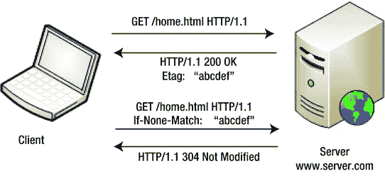

[图 4-8。](#_Fig8) ETag

如果服务器中的资源没有更改，服务器可以简单地用状态代码 304-Not modified 进行响应，而不发回完整的响应。当资源表示已经改变时，服务器发送具有对应于改变的表示的新 ETag 的新表示。

发送 304-未修改状态背后的基本思想是节省网络带宽。如果响应没有改变，就没有必要重新发送整个响应。服务器可以简单地返回状态代码，并告诉客户机您上次得到的仍然有效。这里重要的是，响应必须在客户端缓存，这样才能工作。尽管可以在没有 web 缓存的情况下使用 ETag(就像您将在下面看到的实现开放式并发的情况一样)，但是 ETag 和 web 缓存是携手并进的。

在混合使用缓存的情况下，顺序在很大程度上与前面的相同。当 ETag 在 200–OK 响应中被发送时，Cache-Control 头也被发回。假设最大年龄为 6 秒，就像前面的例子一样。也就是说，在接下来的六秒钟内，直到缓存过期，浏览器不会向服务器发送任何请求。六秒钟后，在缓存过期后，浏览器发送一个包含 If-None-Match 请求头的请求。如果资源表示形式没有改变，服务器会以 304 状态代码作为响应。在接下来的六秒钟内，浏览器将从缓存中工作，不再向服务器发出任何请求。

在 ASP.NET Web API 中实现 ETag

ETag 功能可以通过`ActionFilter`添加到 web API 中，如[清单 4-8](#list8) 所示。我选择`ActionFilter`有以下两个原因。

1.  `ActionFilter`确保 ETag 相关代码尽可能接近实际操作方法运行。假设在消息处理程序中实现了身份验证和授权，那么在过滤器开始执行时，与安全相关的代码将已经运行，并且未授权的请求将在管道的早期失败。
2.  `ActionFilter`让我们能够指定在特定操作方法的响应中包含 ETag。通常，您不希望缓存所有内容。几乎不变或变化不频繁的数据，如代码的主列表，是很好的候选。然而，并不是 web API 的每个动作方法都可以被缓存。

[***清单 4-8。***](#_list8) ETag 动作过滤器

```cs
public class EnableETag : ActionFilterAttribute
{
    private static ConcurrentDictionary<string, EntityTagHeaderValue> etags = new
ConcurrentDictionary<string, EntityTagHeaderValue>();

    public override void OnActionExecuting(HttpActionContext context)
    {
        var request = context.Request;

        if (request.Method == HttpMethod.Get)
        {
            var key = GetKey(request);

            ICollection<EntityTagHeaderValue> etagsFromClient = request.Headers.IfNoneMatch;

            if (etagsFromClient.Count > 0)
            {
                EntityTagHeaderValue etag = null;
                if (etags.TryGetValue(key, out etag) && etagsFromClient.Any(t => t.Tag == etag.Tag))
                {
                    context.Response = new HttpResponseMessage(HttpStatusCode.NotModified);
                    SetCacheControl(context.Response);
                }
            }
        }
    }
```

```cs
   public override void OnActionExecuted(HttpActionExecutedContext context)
    {
        var request = context.Request;
        var key = GetKey(request);

        EntityTagHeaderValue etag;

        if (!etags.TryGetValue(key, out etag) || request.Method == HttpMethod.Put ||
request.Method == HttpMethod.Post)
        {
            etag = new EntityTagHeaderValue("\"" + Guid.NewGuid().ToString() + "\"");
            etags.AddOrUpdate(key, etag, (k, val) => etag);
        }

        context.Response.Headers.ETag = etag;
        SetCacheControl(context.Response);
    }

    private string GetKey(HttpRequestMessage request)
    {
        return request.RequestUri.ToString();
    }

    private void SetCacheControl(HttpResponseMessage response)
    {
        response.Headers.CacheControl = new CacheControlHeaderValue()
        {
            MaxAge = TimeSpan.FromSeconds(6),
            MustRevalidate = true,
            Private = true
        };
    }
}
```

ETag 动作过滤器

ETag `ActionFilter`需要跟踪它生成的 ETag，以便在客户端在请求中发回 ETag 时验证这些 ETag。为此，我使用了`ConcurrentDictionary`。密钥是 URI，值是随响应一起发送的 ETag。例如，如果您为`http://server.com/api/employees/12345`创建一个 GET，在字典中创建一个条目，将关键字设为`http://server.com/api/employees/12345`，将值设为 123456789，然后 web API 在响应中发回一个 ETag，表示 123456789。这个值是 EntityTagHeaderValue，但是为了简洁起见，我在这里只是做了一个近似。

有两个主要的组成部分`ActionFilter:``OnActionExecuted`和`OnActionExecuting`方法。

1.  `OnActionExecuted`运行后的动作方法。如果 HTTP 方法是 PUT 或 POST，就会生成一个新的 ETag。我在这里使用 GUID 作为 ETag。生成的 ETag 存储在字典中，并在 ETag 响应头中发送。字典存储操作是一个`AddOrUpdate`。旧标签被更新，新标签被插入。
2.  `OnActionExecuting`运行在动作方法之前。它在 If-non-Match 请求头中寻找 ETag。如果客户端在这个头中传递的 ETag 值与字典中存储的请求 URI 值相匹配，则返回 304–Not modified 状态代码，并且操作方法的执行被中断。

ETag `ActionFilter`基于这样一个假设，即所有的更新和插入都通过 web API，因此`OnActionExecuted`可以正确地调整 ETag。如果实体存储在数据库中，有人直接更新了数据库，web API 将不会知道底层数据已经更改。在这种情况下，最好让 ETag 基于与数据库记录相关联的版本或时间戳。web API 必须从数据库中获取版本，并将其与对应于 ETag 的版本进行比较。

如果您向 web API 请求一个 JSON 响应，并在 If-None-Match 头中使用您在以前的 JSON 响应中获得的 ETag 发出后续请求，但是您第二次通过 Accept 头聪明地请求一个 XML 表示，web API 仍然会向您发送一个 304 而不是一个 XML 响应！

测试 ETag ActionFilter

为了测试前面的过滤器，你可以在`Get(int id)`动作方法上应用它，如[清单 4-9](#list9) 所示。此外，您可以修改主页/索引视图以包含另一个按钮和调用该方法的 JavaScript(参见[清单 4-10](#list10) )。

[***清单 4-9。***](#_list9) ETag 滤镜在行动

```cs
[EnableETag]
public Employee Get(int id)
{
    return new Employee()
    {
        Id = id, Name = "John Q Human", Department = "Enforcement"
    };
}
```

[***清单 4-10。***](#_list10) 首页/索引视图修改调用获取方法

```cs
@section scripts{
    <script type="text/javascript">
        $(document).ready(function () {
            $('#search').click(function () {
                // Removed for brevity
            });

            $('#details').click(function () {
                $('#employee').empty();
                $.getJSON("/api/employees/12345", function (employee) {
                    var now = new Date();
                    var ts = now.getHours() + ':' + now.getMinutes() + ':' + now.getSeconds();

                    var content = employee.Id + ' ' + employee.Name;
                    content = content + ' ' + employee.Department + ' ' + ts;

                    $('#employee').append($('<li/>', { text: content }));
                });
            });
        });
    </script>
}
<div>
    <div>
        <h1>Employees Listing</h1>
        <input id="search" type="button" value="Get" />
        <input id="details" type="button" value="Details" />
    </div>
    <div>
        <ul id="employees" />
    </div>
    <div>
        <ul id="employee" />
    </div>
</div>
```

用于管理并发性的标签

ETags 还可以用于以乐观的方式管理并发性，而不需要与 web 缓存相结合。在多用户环境(如 web)中，并发管理对于确保数据完整性至关重要。因为 HTTP 是无状态的，所以在更新之前锁定资源不是一个可行的选择。乐观方法确保在读取和后续更新之间不会有中间更改。如果存在中间更改，更新将会失败。这是无状态 HTTP 服务的最佳方法。作为 GET 响应的一部分，web API 发送一个 ETag。在此之后，如果必须通过 PUT 更新相同的资源，客户机在 If-Match 请求头中发送相同的 ETag。[图 4-9](#Fig9) 显示了这个过程。

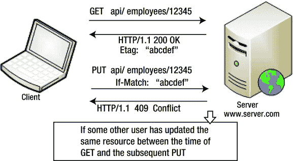

[图 4-9。](#_Fig9)用于管理并发的 ETag

如果客户端发送的 ETag 与持久性存储(如数据库或并发字典)中的 ETag 相匹配，则用新值更新存储。如果存在不匹配，状态代码 409–冲突将被发送回客户端。客户端可以在此之后执行一次新的 GET 并重试更新。[清单 4-11](#list11) 显示了一个动作过滤器的代码，它与上一节中的`EnableETag`过滤器非常相似。

[***清单 4-11。***](#_list11) ETag 用于管理并发

```cs
public class ConcurrencyChecker : ActionFilterAttribute
{
    private static ConcurrentDictionary<string, EntityTagHeaderValue> etags = new
ConcurrentDictionary<string, EntityTagHeaderValue>();

    public override void OnActionExecuting(HttpActionContext context)
    {
        var request = context.Request;

        if (request.Method == HttpMethod.Put)
        {
            var key = request.RequestUri.ToString();

            EntityTagHeaderValue etagFromClient = request.Headers.IfMatch.FirstOrDefault();

            if (etagFromClient != null)
            {
                EntityTagHeaderValue etag = null;
                if (etags.TryGetValue(key, out etag) && !etag.Equals(etagFromClient))
                {
                    context.Response = new HttpResponseMessage(HttpStatusCode.Conflict);
                }
            }
        }
    }

    public override void OnActionExecuted(HttpActionExecutedContext context)
    {
        var request = context.Request;
        var key = request.RequestUri.ToString();

        EntityTagHeaderValue etag;

        if (!etags.TryGetValue(key, out etag) || request.Method == HttpMethod.Put ||
        request.Method == HttpMethod.Post)
        {
            etag = new EntityTagHeaderValue("\"" + Guid.NewGuid().ToString() + "\"");
            etags.AddOrUpdate(key, etag, (k, val) => etag);
        }

        context.Response.Headers.ETag = etag;
    }
}
```

要测试该过滤器，请按照下列步骤操作。

1.  将动作方法`public void Put(Employee employee) {}`添加到`EmployeesController`中。
2.  `A`在这个`Put()`方法上应用`ConcurrencyChecker`过滤器。
3.  单击/Home/Index 视图的 Details 按钮，发出 GET 并获取 ETag。
4.  在 If-Match 头中使用相同的 ETag，并从 Fiddler 发出 PUT 请求。如果 PUT 成功，web API 将返回 204——没有内容，因为我们将`Put()`留空了。
5.  重放相同的 PUT 请求，您将得到 409-Conflict。

 **注意** *启用 ETag* 清单 4-8 中的[过滤器](#list8)和[清单 4-11 中的*并发检查器*](#list11)使用一个并发字典来存储 ETag，该字典位于应用域级别。在实际的生产环境中，尤其是当涉及到网络花园或网络农场部署时，必须从数据库或所有服务器共用的其他地方检索标签。否则，不同应用域中的字典将无法同步以有意义的方式实现这种 ETag 或并发检查。

 **提示**如果你在微软 Visual Studio 2010 附带的 web 服务器 Cassini 中尝试这个例子，ETag 头不会被写到响应中。前一个过滤器工作，因为我们也写缓存控制，这是缺乏在这个过滤器。出于这个原因，卡西尼号正在压制 ETag 头。必须使用 IIS Express 或 IIS 来运行此示例。

跨产地资源共享

跨源资源共享(Cross-Origin Resource Sharing，CORS)是一种规范，它定义了 web 服务器(ASP.NET Web API)允许其资源被来自不同域的网页中运行的脚本访问的方式。服务器和客户端协同工作，使用 HTTP 头使得访问跨源资源成为可能。

同源策略是与浏览器端脚本语言(如 JavaScript)相关的一个重要安全概念，它限制脚本从不同的来源访问资源。源由 URL 的方案、主机和端口定义。例如，来自 server.com 的网页不能运行 JavaScript 并访问来自 anotherserver.com 的网页。该策略对涉及网页访问互联网上的共享或公共 ASP.NET Web API 的情况有直接影响。

在第 2 章的[中，我们看了一个 ASP.NET MVC 视图访问一个托管在同一服务器上的 web API。在 Visual Studio 中，如果我将 web API 片段分成一个单独的应用，该应用运行的端口不同于 MVC 应用运行的端口，JQuery AJAX 将停止工作。这个问题有几个解决方法。一个变通办法是 CORS。当然，CORS 不是跨来源资源访问的唯一解决方案。还有其他机制，如 JSONP、代理和通过 IFRAME 传递消息，但 CORS 是一个更现代、更好的替代方案。例如，JSONP 只支持 GET 方法。](02.html)

如果你选择 CORS，一个关键的考虑是旧的浏览器可能缺乏对 CORS 的支持。以下浏览器支持 CORS:Firefox 3.5+，Internet Explorer 10+，谷歌 Chrome 4.0+，Safari 4.0+，Opera 12.0+，Opera Mobile 12.0+(来源:`http://caniuse.com/cors`)。

简单的颜色

对于像 GET 这样的无效方法，客户机发送带有原始值的原始请求头。web API 检查是否允许该源访问资源。对于响应，web API 返回客户端发送的具有相同值的 Access-Control-Allow-Origin 头或*，如果所有人都可以无限制地使用该资源。如果 web API 发送了响应，但没有发送标头，或者发送的来源与接收的来源不匹配，则客户端浏览器会丢弃响应，不再继续。

要理解 CORS，首先需要理解浏览器是如何执行同源策略的。以下步骤说明了工作中的同源策略。

1.  Configure the earlier project, ‘TalentManager,’ that we worked on in [Chapter 2](02.html) to use Visual Studio Development Server and run on a specific port 5214\. Go to the project properties ‘Web’ tab, and specify the port as shown in [Figure 4-10](#Fig10).

    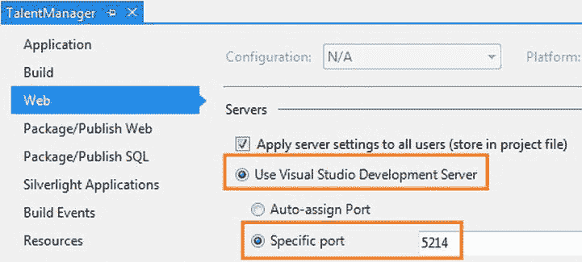

    [图 4-10。](#_Fig10)为 Visual Studio 开发服务器指定端口

2.  创建新的 Web API 项目。在这里，我们用名称“Cors”创建它，并将其配置为使用 Visual Studio Development Server 并在端口 6504 上运行。从 TalentManager 中的网页访问 Cors 中的 web API 是一个跨源请求。这就是你想要测试的。
3.  Take the MVC view from [Listing 4-10](#list10) and change the URL of the `getJSON(),` making the GET request of a specific employee to an absolute path of `http://localhost:6504/api/employees/12345`, as shown in [Listing 4-12](#list12).

    [***清单 4-12。***](#_list12) CORS 获取–MVC 视图

    ```cs
    @section scripts{
        <script type="text/javascript">
            $(document).ready(function () {
                $('#search').click(function () {
                    // Removed for brevity
                });

                $('#details').click(function () {
                    $('#employee').empty();
                    $.getJSON( " [http://localhost:6504/api/employees/12345](http://localhost:6504/api/employees/12345) " , function (employee) {
                        var now = new Date();
                        var ts = now.getHours() + ':' + now.getMinutes() + ':' + now.getSeconds();

                        var content = employee.Id + ' ' + employee.Name;
                        content = content + ' ' + employee.Department + ' ' + ts;

                          $('#employee').append($('<li/>', { text: content }));
                    });
                });
            });
        </script>
    }
    <div>
        <div>
            <h1>Employees Listing</h1>
            <input id="search" type="button" value="Get" />
            <input id="details" type="button" value="Details" />
        </div>
        <div>
            <ul id="employees" />
        </div>
        <div>
            <ul id="employee" />
        </div>
    </div>
    ```

4.  向“Cors”项目添加一个名为`EmployeesController`的新`ApiController`，并实现`Get(int id)`动作方法，与[清单 4-12](#list12) 中的视图要使用的“TalentManager”完全相同。通过这一更改，在端口 5214 上运行的项目“TalentManager”的 Home/Index 视图将尝试使用在同一本地主机的端口 6504 上运行的 web API。
5.  在 Internet Explorer 中运行“TalentManager ”,然后在/Home/Index 页面中单击“详细信息”按钮。单击按钮似乎没有任何效果，无序列表中不会显示任何内容。也就是说，Internet Explorer 强制执行同源策略。
6.  如果您想确定 Internet Explorer 执行的同源策略是没有显示雇员列表的真正原因，您可以回滚 URL 更改，使 getJSON 的 URL 为/api/employees/12345。web API 在同一个项目中，因此使用同一个端口。因此，这次应该在 URL 更改回滚之后开始工作。
7.  最后，不要使用 Internet Explorer，而是使用 Mozilla Firefox 浏览器。转到`http://localhost:5214`并点击详细信息按钮。火狐也不让步。出于安全原因，默认情况下没有浏览器允许跨来源请求。

为了让这个工作，改变`Get(int)`动作方法，如[清单 4-13](#list13) 所示。

[***清单 4-13。***](#_list13) CORS 获取-Web API

```cs
public class EmployeesController : ApiController
{
    public HttpResponseMessage Get(int id)
    {
        var employee = new Employee()
        {
            Id = id,
            Name = "John Q Human",
            Department = "Enforcement"
        };

        var response = Request.CreateResponse<Employee>(HttpStatusCode.OK, employee);
        response.Headers.Add("Access-Control-Allow-Origin", "*");

        return response;
    }
}
```

有了这个改变，重新构建“Cors”项目，用 Firefox(不是 Internet Explorer)再试一次。这次成功了！这是 CORS 在行动。

值为*的响应头 Access-Control-Allow-Origin 是让跨来源请求工作的秘密武器。当然，在[清单 4-13](#list13) 中，响应头被盲目地用*发回。但是，通常会检查可通过`Request.Headers.GetValues("Origin").FirstOrDefault()`获得的源头，并决定是否允许该请求。在前面的例子中，Origin 头的值为`http://localhost:5214`,请求就是从这里发出的。

 **注意**验证请求中的 Origin 头和设置响应中的 Access-Control-Allow-Origin 头可以移动到动作过滤器。只有那些可能成为 CORS 候选的 GET 方法可以用 filter 属性来修饰。

THINKTECTURE 的 CORS 支持。身份模型

在前面的例子中，我在 Access-Control-Allow-Origin 响应头中返回了*，这意味着资源可以被任何域访问。然而，通常要检查包括 Origin 报头在内的几个参数，并决定是否允许该请求。

Thinktecture。例如，IdentityModel 支持丰富的配置 API，以更细粒度的方式控制访问:您希望允许访问的资源；允许哪些来源、HTTP 方法和请求或响应头；如果允许吃饼干。

```cs
// Allow all CORS requests to the Employees controller from the http://foo.com origin.
 corsConfig.ForResources("Employees")
.ForOrigins("http://foo.com")
.AllowAll();

// Allow http://foo.com to use any method, pass cookies, send the request headers
// of Content-Type, Foo and Authorization and read the Foo response header for
// the Employees and Products controllers
corsConfig
.ForResources("Employees", "Products")
.ForOrigins("http://foo.com")
.AllowAllMethods()
.AllowCookies()
.AllowRequestHeaders("Content-Type", "Foo", "Authorization")
.AllowResponseHeaders("Foo");
```

Thinktecture 的 CORS 实现。IdentityModel 将成为系统的一部分。ASP.NET Web API 中的 Web.Cors 命名空间。(`http://aspnetwebstack.codeplex.com/SourceControl/changeset/4284ca5270b9`)。

预检请求

接下来，我们看看 CORS 是如何使用具有副作用的方法(比如 PUT)的。当浏览器发出一个额外的请求，称为预检请求时，事情就变得有点复杂了。这个特殊的请求使用 HTTP OPTIONS 方法并发送两个头。

1.  **源**请求头(与涉及 GET 的简单 CORS 相同)。
2.  **Access-Control-Request-Method**头，带有客户端想要使用的方法，在本例中是 PUT。

OPTIONS 方法响应有两个头。

1.  **Access-Control-Allow-Methods**头包含服务器支持的方法的逗号分隔值。
2.  **Access-Control-Allow-Origin**头，其值与 Origin 或 a *相同。

基于飞行前响应，浏览器继续实际的上传请求。当然，PUT action 方法必须为浏览器中运行的脚本返回 Access-Control-Allow-Origin 头，以显示 PUT action 方法返回的任何数据。以下序列显示了带有标头的 HTTP 事务。

1.  客户端发送预检请求，即 JQuery 显式 PUT 请求，该请求被转换为 Firefox 发出的隐式选项。

    ```cs
    OPTIONS http://localhost:6504/api/employees HTTP/1.1
    Access-Control-Request-Method: PUT
    Origin: http://localhost:5214
    ```

2.  web API 用适当的头响应选项请求。没有响应体。

    ```cs
    HTTP/1.1 200 OK
    Access-Control-Allow-Origin: *
    Access-Control-Allow-Methods: PUT
    ```

3.  因为 web API 允许 PUT，正如 OPTIONS 响应中的 Access-Control-Allow-Methods 响应头所指示的，所以 Firefox 浏览器向 web API 发送一个 PUT 请求。

    ```cs
    PUT http://localhost:6504/api/employees HTTP/1.1
    Origin: http://localhost:5214
    ```

4.  web API 响应 PUT。

    ```cs
    HTTP/1.1 200 OK
    Access-Control-Allow-Origin: *
    ```

在 ASP.NET Web API 中实现预检 CORS

以下是在 ASP.NET Web API 中实现预燃 CORS 的步骤。

1.  向“TalentManager”项目中的`HomeController`添加一个新的操作方法。

    ```cs
    public ActionResult Preflight()
    {
            return View();
    }
    ```

2.  Right-click the action method created in the previous step and add a view. Copy and paste the code in [Listing 4-14](#list14).

    清单 4-15 显示了 web API 代码和处理 PUT 和 OPTIONS 请求的动作方法。

    [***清单 4-14。***](#_list14) 颜色预检–jquery

    ```cs
    @section scripts{
        <script type="text/javascript">
            $(document).ready(function () {
                $('#details').click(function () {
                    $('#employee').empty();

                    $.ajax({
                        type: "PUT",
                        url: " http://localhost.:6504/api/employees/12345 ",
                        data: { "Name": "John Q Law", "Department": "Legal" },
                        success: function (data) {
                            $('#employee').append($('<li/>', { text: data }));
                        },
                        error: function (error) {
                            console.log("ERROR:", error);
                        }
                    });
                });
            });
        </script>
    }
    <div>
        <div>
            <input id="details" type="button" value="Details" />
        </div>
        <div>
            <ul id="employee" />
        </div>
    </div>
    ```

     **注意**因为 CORS 与客户端或者浏览器有关，所以你可以在 Firefox 中从你的文件系统中打开一个本地 HTML 文件并进行测试。MVC 应用不是强制性的。然而，在这种情况下，在选项请求消息中，源报头将为空或不存在。

    [***清单 4-15。***](#_list15) CORS 预检–网络 API

    ```cs
    public HttpResponseMessage Put(Employee employee)
    {
        // Update logic goes here

        var response = Request.CreateResponse<Employee>(HttpStatusCode.OK, employee);
        response.Headers.Add("Access-Control-Allow-Origin", "*");
        return response;
    }

    public HttpResponseMessage Options()
    {
        var response = new HttpResponseMessage();
        response.StatusCode = HttpStatusCode.OK;
        response.Headers.Add("Access-Control-Allow-Origin", "*");
        response.Headers.Add("Access-Control-Allow-Methods", "PUT");
        return response;
    }
    ```

3.  有了这些改变，请访问 Firefox 中的`http://localhost.:5214/Home/preflight` URL。单击详细信息按钮。
4.  由`Put(Employee)`动作返回的 JSON 响应显示在无序列表中。这是 CORS 起飞前的行动。Firefox 会发出一个选项请求，即飞行前请求，然后是实际的后台 PUT 请求。您可以使用 Fiddler 工具或 Firefox Web 控制台来验证这一点，这可以在 Web Developer 菜单下找到。

前面的代码示例向您展示了在操作方法中添加标题的代码，这只是为了使代码简单，从而更容易理解。正如 CORS GET 一样，可以创建一个过滤器来支持请求头检查和响应头添加。但是，Option 方法不能通过筛选器处理。在管道的早期，如果 action 方法不可用于处理 HTTP 选项，则 405-Method Not Allowed 被发送回客户端。

最好的办法是使用一个消息处理程序，类似于清单 4-16 中的那个。在为 CORS 印前检查设计消息处理程序时要记住的一点是，消息处理程序为所有请求(或至少路由中的所有请求)运行，而过滤器只为应用了过滤器的操作方法运行。在下面的例子中，响应头是硬编码的，但是在现实世界中，它们必须基于手边的需求。一些基于配置的数据和`ApiExplorer`可以用来创建一般的处理程序来处理多个控制器的选项方法。如果消息处理程序不符合要求，只有那些需要支持 CORS 的控制器才能单独实现 action 方法来处理选项。

[***清单 4-16。***](#_list16) CORS 预检委托处理程序

```cs
public class CorsPreflightHandler : DelegatingHandler
{
    protected override async Task<HttpResponseMessage> SendAsync(HttpRequestMessage request,
                                                                CancellationToken cancellationToken)
    {
        if (request.Headers.Contains("Origin") && request.Method == HttpMethod.Options)
        {
            var response = new HttpResponseMessage(HttpStatusCode.OK);

            response.Headers.Add("Access-Control-Allow-Origin", "*");
            response.Headers.Add("Access-Control-Allow-Methods", "PUT");

            return response;
        }

        return await base.SendAsync(request, cancellationToken);
    }
}
```

微软公司出品的 web 浏览器

到目前为止，我们看到的与 CORS 相关的例子不能在 Internet Explorer 9 或更早的版本中使用。对于跨源请求，您必须使用 Internet Explorer 8 中引入的`XDomainRequest`对象。Internet Explorer 中的 XMLHttpRequest 不支持 CORS，因此 JQuery AJAX 无法在 Internet Explorer 中使用。随着 Internet Explorer 10 的出现，这种情况可能会改变。ajax 应该也可以。但是，使用 XDomainRequest 非常简单，如下面的 HTML/JavaScript 代码所示。我们修改后的动作方法`Get(int id)`只需要在响应中返回 Access-Control-Allow-Origin 头就可以了。

```cs
<!DOCTYPE html>
<html>
        <head>
                     <title>XDR</title>
                     <script type="text/javascript">
                                   var xdr = new XDomainRequest();
                                   xdr.open("get", " http://localhost:6504/api/employees/12345 ");
                                   xdr.onload=function()
                                   {
                                                alert(xdr.responseText);
                                   }

                                   xdr.send();
                     </script>
        </head>
<body>
</body>
</html>

```

`XDomainRequest`仅支持 POST 和 GET。Internet Explorer 中不存在预先检查请求的概念。此外，即使生成的 HTML 和 JavaScript 一起保存为本地 HTML 文件，我们在 Firefox 中使用的 MVC 视图也可以工作得很好。但是 XDR 严格要求 URL 前缀必须相同。因此，从本地 HTML 文件，AJAX 请求将不会工作。

HTTP cookie

HTTP 是无状态的，但是 HTTP 规范包含一种状态管理机制，它使用报头在服务器和带有用户代理(读浏览器)的客户机之间来回传输数据。用户代理无缝地执行这个动作，给整个无状态模型一种有状态的感觉。这种机制的基础是一个 cookie。

cookie 是 web 服务器在 Set-Cookie 响应头中发送给客户机的键值对形式的数据。从那时起，支持 cookie 机制的客户机开始在来自同一个用户代理的每个请求的 cookie 请求头中发回这些数据，直到 Cookie 过期。cookie 的到期时间由服务器在创建 cookie 时决定。

为了设置一个 cookie，服务器在响应中发送 Set-Cookie 头，如下所示:`Set-Cookie: sesstoken=token=12345&token-type=general; expires=Wed, 26 Sep 2012 15:35:17 GMT`

为了发回 cookie，客户端在请求中发送 Cookie 头，类似于:`Cookie: sesstoken=token=12345&token-type=general`

Cookies 和 ASP.NET Web API

cookie 与用户使用用户代理(如浏览器)导航的页面的 web 应用更相关。如果服务器返回一个 cookie 作为对第一个请求的响应的一部分，用户代理会一直向服务器发送相同的数据，直到 cookie 过期。在客户端的网页中，不需要以编程方式完成任何事情，因为 cookie 的实现是由 HTTP 规范标准化的，并且浏览器知道如何处理 cookie。

另一方面，ASP.NET Web API 支持的 RESTful 服务不是使用用户代理导航的，并且在实现 cookie 支持方面没有太多价值，尽管它是可能的。如果 web API 托管在与 web 页面相同的域中，并且 web 页面通过 AJAX 访问 web API，那么包含身份验证票的 web 页面 cookie 就可以与 web API 共享，就像表单身份验证一样。换句话说，web API 可以搭载在 web 应用的会话或认证机制上。

无论 cookie 是在浏览器关闭时过期的内存中 cookie，还是存储在最终用户计算机磁盘中的持久性 cookie，这都是一种边际效益，而且风险要大得多。即使浏览器窗口关闭，持久 cookies 仍然保持活动状态，直到过期。与此相比，普通的 HTTP 头永远不会比事务存在时间长。用于存储敏感信息(如会话)的 cookie，无论是在内存中还是在其他地方，都会使应用容易受到跨站点请求伪造(CSRF)的攻击，这将在第 15 章中深入讨论。此外，在 REST 风格的体系结构中，cookies 通常是不受欢迎的。

在普通 HTTP 头和 cookie 的两种情况下，如果发送未加密的文本，恶意用户就可以看到它，并有能力嗅探流量。如果由于某种原因必须使用 cookie，则必须对 cookie 中发送的数据进行加密，并明智地设置到期期限，以便将滥用的可能性降至最低。

web API 设计应该考虑到 cookie 数据可能被篡改以及 cookie 可能被完全删除的事实。因此，cookie 数据一定不可信。在 cookie 丢失的情况下，必须有一个后备机制。

清单 4-17 展示了如何在 ASP.NET Web API 的消息处理器中设置和获取一个 cookie。

[***清单 4-17。***](#_list17) 设置并获取一个 Cookie

```cs
public class CookiesHandler : DelegatingHandler
{
    protected override async Task<HttpResponseMessage> SendAsync(HttpRequestMessage request,
                                                                CancellationToken cancellationToken)
    {
        // Getting a cookie
        CookieHeaderValue cookie = request.Headers.GetCookies("sesstoken").FirstOrDefault();
        if (cookie != null)
        {
            CookieState cookieState = cookie["sesstoken"];

            string token = cookieState["token"];
            string tokenType = cookieState["token-type"];
        }

        var response = await base.SendAsync(request, cancellationToken);

        // Setting a cookie
        var pairs = new NameValueCollection();
        pairs["token"] = "12345";
        pairs["token-type"] = "general";

        response.Headers.AddCookies(new CookieHeaderValue[]
        {
            new CookieHeaderValue("sesstoken", pairs)
            {
                Expires = DateTimeOffset.Now.AddSeconds(30),
                Path = "/"
            }
        });

        return response;
    }
}
```

http only cookie

浏览器中运行的 JavaScript 可以读取 ASP.NET Web API 创建的 cookie。如果 cookie 包含重要的安全信息，它就会成为需要处理的重要威胁。HttpOnly cookies 仅由浏览器通过限制 JavaScript 访问的 HTTP 和 HTTPS 请求进行传输，从而减轻了通过跨站点脚本(XSS)窃取 cookie 的威胁。

为了理解 JavaScript 访问 cookie 的安全风险，让我们创建一个带有动作方法`Read()`的 MVC 控制器`CookieReaderController`。我们将为`Read()`创建视图，如[清单 4-18](#list18) 所示。

[***清单 4-18。***](#_list18) JavaScript 访问 Cookie

```cs
@section scripts{
    <script type="text/javascript">
        $(document).ready(function () {
            $('#details').click(function () {
                $('#employee').empty();

                $.ajax({
                    type: "GET",
                    url: "/api/employees/12345",
                    success: function (response) {
                        alert(document.cookie);
                        $('#employee').append($('<li/>', { text: response.Id + ' ' + response.Name }));
                    }
                });
            });
        });
    </script>
}
<div>
    <div>
        <input id="details" type="button" value="Details" />
    </div>
    <div>
        <ul id="employee" />
    </div>
</div>
```

单击 Details 按钮，您会看到一个带有 cookie 详细信息的警告框。因此，来自 MVC 视图页面的 JavaScript 能够访问由 web API 创建的 cookie。当然，当您在前面的代码清单中创建 cookie 时，会指定一个“/”路径，这将为 web API 和 MVC 应用打开 cookie。不过，我想说明的一点是，通过 XSS 偷饼干的可能性是存在的。

如果使用 web API 的 web 应用有一个 XSS 漏洞，恶意用户可以利用这个漏洞注入一些脚本，打开一个弹出窗口，其中有一个外部 URL 作为查询字符串传递`document.cookie`。然而，由于同源策略的限制，无缝地将 cookie 发布到其他来源是不可能的。

为了缓解这个问题，在创建 cookie 时将`HttpOnly`属性设置为 true。在这种情况下，`document.cookie`将无法读取 web API 创建的 cookie。然而，最好的方法是完全避免 cookies，除非有非常强烈的需求。

非浏览器客户端

Cookies 不仅限于 web 浏览器。任何支持 cookie 的 HTTP 感知客户端都可以处理发送 ASP.NET Web API 的 cookie。下面的代码示例展示了一个从`WebClient`扩展而来的类。它覆盖了虚拟方法`GetWebRequest`,将`CookieContainer`的一个实例附加到请求上。`CookieContainer`对象实例必须在请求间重用，以便在后续请求中推送 cookies。因此，它是一个类级别的字段，web 客户端的同一个实例用于发送多个请求。这里，我们使用地址为 localhost、端口为 8888 的代理(Fiddler 的代理)来检查请求和响应。

```cs
public class CookieWebClient : WebClient
 {
    private CookieContainer jar = new CookieContainer();

    protected override WebRequest GetWebRequest(Uri address)
    {
        WebRequest request = base.GetWebRequest(address);

        HttpWebRequest webRequest = request as HttpWebRequest;
        if (webRequest != null)
            webRequest.CookieContainer = jar;

        return request;
    }
 }

 string url = " http://localhost:7077/api/employees/12345 ";

 CookieWebClient client = new CookieWebClient()
 {
    Proxy = new WebProxy("localhost", 8888)    // Fiddler
 };

 Console.WriteLine(client.DownloadString(url)); // Cookie is created here
 Console.WriteLine(client.DownloadString(url)); // In this request, the cookie gets sent back to the web API
```

代理服务器

典型的公司网络包括一个 web 代理服务器，所有的互联网流量都通过该服务器进行定向。当网络内部的用户请求位于互联网上的 web 服务器上的资源时，该请求首先到达代理服务器。代理代表用户向 web 服务器发出请求，获得响应，并将响应返回给发出请求的用户。

web 服务器只能看到代理的 IP 地址，而看不到代理后面的单个用户的 IP 地址。代理服务器可以缓存响应，并使用响应为后续请求提供服务。

代理服务器通常要求对用户进行身份验证，以执行公司对互联网使用的政策。在这种情况下，当代理服务器收到凭据缺失或无效的请求时，它会发回一个 407-需要代理授权的状态代码，并启动一个流程，如以下步骤所示。

1.  客户端发送初始请求。

    ```cs
    GET /Protocols/rfc2616/rfc2616.html HTTP/1.1
    Host: www.w3.org
    ```

2.  代理以 407 状态代码响应。

    ```cs
    HTTP/1.1 407 Proxy Authorization Required
    Date: Thu, 27 Sep 2012 08:05:47 GMT
    Proxy-Authenticate: NTLM
    Proxy-Authenticate: Basic realm="Magical"
    Content-Length: 322
    Proxy-Support: Session-Based-Authentication
    ```

3.  客户端发送凭据。

    ```cs
    GET /Protocols/rfc2616/rfc2616.html HTTP/1.1
    Host: www.w3.org
    Proxy-Authorization: NTLM TlRMTVNTUAABAAAAB7IIogACbd0xU2MTg5Q1RT
    ```

4.  代理发送 NTLM 挑战。

    ```cs
    HTTP/1.1 407 Proxy Authorization Required
    Date: Thu, 27 Sep 2012 08:05:47 GMT
    Proxy-Authenticate: NTLM TlRMTVNTUAACAAAFggAAUsIPcwnFBiwAAAAA==
    Content-Length: 322
    Proxy-Support: Session-Based-Authentication
    ```

5.  客户端发送质询响应。

    ```cs
    GET /Protocols/rfc2616/rfc2616.html HTTP/1.1
    Proxy-Authorization: NTLM TlRMTVNTUhWRXsX+BwCt918SLJSdOzv8KAuloqVcQhWRXsX+BwCt918Q=
    Host: www.w3.org
    ```

6.  最后，发送响应。

    ```cs
    HTTP/1.1 200 OK
    Date: Thu, 27 Sep 2012 08:05:47 GMT
    ```

如果使用浏览器，它会无缝地执行前面的步骤并返回响应。如果使用非浏览器客户端，则需要处理 407 状态。这通常发生在从代理后面访问互联网上的 web API 的情况下。

那个。NET Framework 有一些类可以很容易地处理这种情况。[清单 4-19](#list19) 展示了如何使用`WebClient`类通过代理服务器与 web API 通信。`DefaultCredentials`使用运行代码的帐户作为验证代理的帐户。这意味着，如果您将它作为控制台应用运行，将使用您登录 Windows 时使用的帐户。如果在 ASP.NET 应用中运行，则使用运行工作进程的帐户。在必须使用特定账户的情况下，也可以使用`new NetworkCredential("userId", "p@s5w0rd", "MyDomain")`代替`CredentialCache.DefaultCredentials`。

[***清单 4-19。***](#_list19) 客户端通过代理与 Web API 通信

```cs
WebClient client = new WebClient()
{
    Proxy = new WebProxy("proxy.server.com", 6666)
    {
        Credentials = CredentialCache.DefaultCredentials
    }
};

var response = client.DownloadString(" http://localhost:12532/api/employees ");
```

当然，这里涉及到安全风险的因素，因为应用必须存储 Windows 帐户凭证。如果由于某种原因，应用必须存储 Windows 凭据，则必须注意确保凭据受到保护。对于使用。NET Framework 中，应用级凭据等数据通常存储在配置文件中。在这种情况下，加密配置部分是确保凭据安全的一种有效方法。第 15 章提供了加密配置文件的细节。

HTTPS

HTTP 的一个优点是它对人友好:请求和响应消息是更容易阅读的纯文本。另一方面，它使得 HTTP 不太安全，并且容易成为中间人(MITM)和窃听攻击的目标。HTTPS 通过让 HTTP 在 SSL/TLS 协议上运行来确保 HTTP 的安全。HTTPS URL 以“https://”开头，默认情况下使用端口 443。

使用 HTTPS 有两个重要方面:首先，它保证用户与她想要的网站进行通信，并且用户连接的网站不会伪装成用户信任的其他网站。

第二，它防止中间的任何人阅读或修改交换的消息。HTTPS 通过加密整个消息来实现后者，包括请求 URI、报头和 cookies。出于这个原因，我们之前研究过的一些东西，比如缓存，将无法在 HTTPS 上使用。

HTTPS 是为 web 浏览器开发的，但也可以用于其他客户端。同样，HTTPS 不仅限于提供 HTML 网页的 web 应用。ASP.NET Web API 也能被 HTTPS 保护。首先，您将看到 HTTPS 如何使用 web 浏览器。这里介绍的一些关键概念，比如加密，将在后面的章节中详细阐述，特别是第 6 章。

为了理解这一部分，假设加密是一种接受两个参数的函数:一个密钥和一个明文，它返回加密文本或密文作为输出。这里的纯文本是交换的消息，密钥是服务器和浏览器共享的一些随机文本，但其他任何人都没有。解密只是加密的逆过程。给定密钥和加密文本，解密产生明文。

你能马上感觉到的一个问题是，一个用户想要访问不止一个网站，而一个网站不能有一个供所有用户使用的公共密钥；它必须由每个用户来处理。否则，恶意用户很容易获得网站的密钥，解密消息，并查看交换的消息。

对于网站，尤其是面向公众的网站，跟踪所有用户并为单个用户分配和维护密钥是不可行的。类似地，对于用户来说，拥有和管理他或她想要访问的所有网站的专用密钥是不现实的。因此，当用户试图连接到 HTTPS 网站时，必须动态生成一个随机密钥。这个过程被称为握手，是 HTTPS 交流中最重要的部分。一旦网站和浏览器有了共享密钥，交换加密消息就更容易了。以下步骤总结了握手过程。

1.  浏览器通过 HTTPS 向网站发出请求。
2.  网站发送包含其公钥的证书。
3.  浏览器生成一个随机密钥，使用网站的公钥对其进行加密，然后将其发送到网站。
4.  网站和浏览器现在都有一个共享密钥来进行加密消息交换。

在前面的步骤中，我引入了几个到目前为止还没有涉及到的新术语:证书和公钥。

证书由知名机构颁发给网站，并且可以追溯到颁发证书的站点。没有人可以篡改证书。如果证书是发给 my-server.com 的，没有人能够篡改它，使它看起来像是发给 another-server.com 的。

证书有两个数学上关联的密钥，一个私钥和一个公钥。证书的公钥可以与任何人共享。私钥由向其颁发证书的网站秘密持有。用公钥加密的纯文本只能用私钥解密。

有了这样的理解，现在让我们重温前面的步骤。网站将公钥发送到浏览器。给谁都可以接受；它毕竟是一个公钥。即使是恶意用户也可以拥有相同的公钥，但它不能用于解密。私钥在网站的安全保管范围内，是解密所必需的。只有网站可以解密并获得浏览器发送的密钥。

您可能会预料到的一个漏洞是，恶意用户获得一个包含公钥和私钥的有效证书，然后作为中间人将公钥发送给浏览器。浏览器会高兴地加密它刚刚生成的随机密钥，并将其发送给恶意用户使用他的私钥进行拦截和解密吗？

答案是否定的。这个漏洞是通过浏览器进行以下两项检查来防止的。

1.  浏览器对照证书(包含它接收到的公钥)所发布到的网站来检查它所连接到的网站。
2.  证书必须由它信任的证书颁发机构(CA)颁发，如 VeriSign、Thawte 或 GeoTrust。

如果恶意用户发送一个颁发给他的域的有效证书，就像用户正在连接的网站发送它一样，第一个验证步骤将失败。如果恶意用户创建一个证书，就好像它是颁发给一个流行的电子商务网站一样，浏览器仍然会在验证步骤中失败，因为该证书不是由浏览器信任的 ca 之一颁发的。

如果这些检查中有任何一项失败，浏览器会进行投诉并警告用户，如图[图 4-11](#Fig11) 所示。

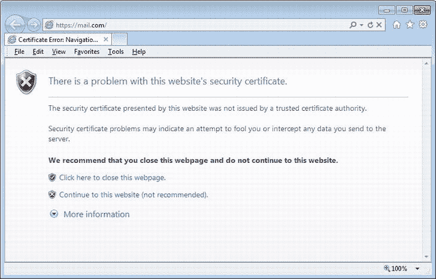

[图 4-11。](#_Fig11)浏览器警告

为托管在 IIS 中的 ASP.NET Web API 配置 HTTPS

为 web 托管的 ASP.NET Web API 配置 HTTPS 与启用任何其他 ASP.NET 应用的 HTTPS 相同。从客户端来看，任何支持 HTTPS 的设备或应用都可以使用 web API。那里也没有什么特别的。

现在，要让 HTTPS 执行处理敏感数据的特定操作方法，您可以使用类似于清单 4-20 所示的操作过滤器。如果所有方法都需要 HTTPS，可以将此过滤器配置为全局过滤器。作为另一种选择，如果您的 web API 是 web 托管的，您可以编写一个使用上述代码的消息处理程序，或者简单地将 IIS 配置为强制 HTTPS。

[***清单 4-20。***](#_list20)http only 过滤器

```cs
public class HttpsOnly : ActionFilterAttribute
{
    public override void OnActionExecuting(HttpActionContext context)
    {
        var request = context.Request;

        if (request.RequestUri.Scheme != Uri.UriSchemeHttps)
        {
            var response = request.CreateResponse(HttpStatusCode.Forbidden);
            response.Content = new StringContent("HTTPS Required");
            context.Response = response;
        }
    }
}
```

 **注意**您已经在前面的章节中看到了 cookies，并且刚刚看到了 HTTPS。可以在创建 cookie 时指定它必须只通过 HTTPS 传输。通过将 *CookieHeaderValue* 对象的布尔*安全*属性设置为 true，您可以创建一个安全的 cookie。

fiddler:Web 调试工具

Fiddler 是一个 web 调试代理，它是一个非常有用的工具，可以捕获和分析 HTTP 以及运行 Fiddler 的计算机与外部之间的 HTTPS 流量。Fiddler 还有一个特性，可以构建一个完整的带有头的请求，将其发送到一个 HTTP 端点，比如 web API，并检查 web API 返回的响应。如果不使用 Fiddler 这样的调试器，开发生产级 web API 几乎是不可能的。基于您使用的版本，Fiddler 用户界面可能与图 4-12 中显示的略有不同。

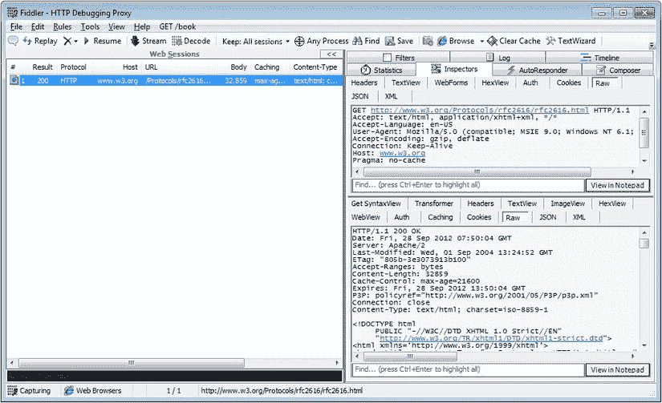

[图 4-12。](#_Fig12)提琴手(4.4.1.1 测试版)

左窗格列出了捕获的请求。选择特定请求后，右侧窗格中的 Inspectors 选项卡会在顶部显示该请求，在底部显示相应的响应。Composer 选项卡允许手工制作请求，并使用您选择的 HTTP 方法提交。

Fiddler 的旧版本不能捕获来自本地主机的流量。一种常见的解决方法是使用带有点后缀(`http://localhost.:<port>`)的 localhost，使用计算机名而不是 localhost，或者在 127.0.0.1 的 C:\ Windows \ System32 \ drivers \ etc \ hosts 文件中添加一个条目并使用相同的名称。

下面的列表详细说明了如何配置 Fiddler 来捕获不同类型的应用的流量。任何应用都可以使用 web API。因此，学习配置 Fiddler 来捕获以下所有场景的流量是很重要的。

1.  Internet Explorer: 当 Fiddler 工具启动时，它将自己注册为系统代理。因此，Fiddler 会自动拦截来自使用 WinInet 的应用(如 Internet Explorer)的请求。不需要进行设置或配置更改。
2.  其他浏览器如 Firefox: Fiddler 可以配置为浏览器的 web 代理，这样 Fiddler 就可以开始拦截请求。Fiddler 运行在端口 8888 上，因此代理可以配置为 localhost:8888 或 127.0.0.1:8888。
3.  **非浏览器应用，如. NET 框架 WPF 应用:**通常，这些应用使用`WebClient`进行 HTTP 通信。`WebClient`的`Proxy`属性必须设置为`WebProxy`的实例，主机为 localhost，端口为 8888，如下:`Proxy = new WebProxy("localhost", 8888)` 。
4.  **ASP.NET web application:** If you need to look at the HTTP client requests made by your code in an ASP.NET application or maybe a third-party library you are using in your ASP.NET application, it is possible to configure Fiddler as the proxy in the web.config file, as shown in [Listing 4-21](#list21).

    [***清单 4-21。***](#_list21) Web.config 配置 Fiddler 为代理

    ```cs
    <configuration>
            <system.net>
                <defaultProxy>
                      <proxy usesystemdefault="False" bypassonlocal="True"
                                          proxyaddress=" http://127.0.0.1:8888 " />
                </defaultProxy>
            </system.net>
    </configuration>
    ```

捕获和解密 HTTPS 流量

Fiddler 可以捕获甚至解密 HTTPS 流量。要启用该选项，请选择工具拨号器选项。。。并选中[图 4-13](#Fig13) 所示的【解密 HTTPS 流量】复选框。

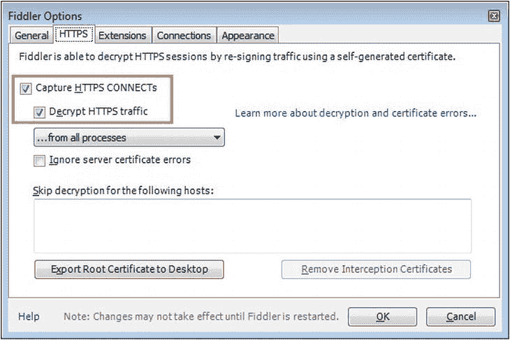

[图 4-13。](#_Fig13)提琴手选项

当您选中“解密 HTTP 流量”复选框时，Fiddler 会询问您是否愿意将 Fiddler 生成的根证书添加到您机器上的可信 CA 列表中。选择否，然后单击确定。Fiddler 现在已经准备好捕获和解密 HTTPS 流量。

要查看 Fiddler 捕获 HTTPS 流量的过程，请在运行 Fiddler 的情况下，在 Internet Explorer 中进入`https://www.google.com`。作为捕获的一部分，Fiddler 将刚刚生成的证书的公钥发送到 Internet Explorer，就好像它是来自`www.google.com`的证书一样。Internet Explorer 立即显示“此网站的安全证书有问题。”

如果您不理会 Internet Explorer 的警告就访问该网站，Internet Explorer 会继续显示该页面。如果你现在去 Fiddler，你可以看到它捕获的所有明文流量，尽管是通过 HTTPS 发送的。Internet Explorer 以红色显示地址栏。如果看证书错误，显示证书是发给`www.google.com`的，但它是由 DO_NOT_TRUST_Fiddler_Root 发出的，不是 Internet Explorer 信任的 CA(见[图 4-14](#Fig14) )。

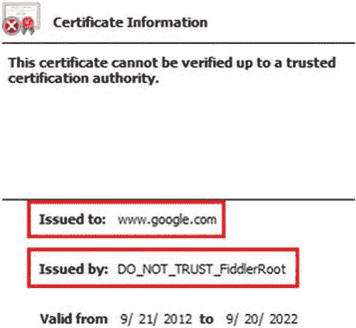

[图 4-14。](#_Fig14)证书错误

作为中间人的小提琴手

Fiddler 的 HTTPS 捕获和解密功能可用于模拟对受传输安全(HTTPS)保护的 ASP.NET Web API 的 MITM 攻击。上一节介绍了浏览器如何应对 Fiddler 试图获取 HTTPS 流量的行为。在本节中，我们使用一个非浏览器客户端，一个使用`WebClient`类进行 HTTP 通信的 C# 控制台应用。本节的目标是理解关注导致 HTTPS 的错误是多么重要，并强调不要为了让事情正常运行而忽略或绕过这些错误的重要性。以下步骤显示了如何模拟 MITM 攻击。

1.  在本地 IIS 中部署我们在第 2 章的[中创建的“talent manager”ASP.NET Web API 应用。IIS Express 不支持 HTTPS。](02.html)
2.  以管理员身份启动 Visual Studio。在 Visual Studio 中的 ASP.NET Web API 应用的“Web”选项卡上选择“使用本地 IIS Web 服务器”选项，并让它为您创建虚拟目录。
3.  使用 IIS 管理器，创建一个自签名证书(从与您的计算机对应的根节点，IIS >服务器证书)。
4.  使用此证书，创建一个到 web API 应用所属网站的 HTTPS 绑定。这样，您就可以通过 HTTPS 向 web API 提交请求了。参见第 9 章中的“通过自签名证书在 IIS 中启用 HTTPS”一节，了解更多信息以及截图。
5.  Create a console application and make a request to our web API, as shown in [Listing 4-22](#list22). Because the certificate used to create HTTPS binding in the preceding step is issued to the local machine name, you need to use the machine name to connect instead of `https://localhost`.

    [***清单 4-22。***](#_list22) 客户端与 HTTPS Web API(控制台 App)通信

    ```cs
    WebClient client = new WebClient();
    var response = client.DownloadString(" https://mymachine/talentmanager/api/employees/1234 ");
    ```

6.  此时，您的控制台应用必须成功地进行 web API 调用，没有任何错误。现在在前面的代码中加入一行代码，让 Fiddler 拦截通过 HTTPS 的呼叫:`client.Proxy = new WebProxy("localhost", 8888);`
7.  确保 Fiddler 从所有进程中捕获流量，而不仅仅是 web 浏览器。如果你查看任务栏，Fiddler 必须显示“捕获所有进程”如果 Fiddler 在任务栏中显示“Web Browsers”，点击它并将其更改为“All Processes”
8.  选择 Fiddler 运行并解密 HTTPS 流量，运行控制台应用。抛出异常:“基础连接已关闭:无法为 SSL/TLS 安全通道建立信任关系。”还有一个内部异常:“根据验证过程，远程证书是无效的。”显然，`WebClient`能够感觉到证书出了问题，提琴手编造了这个证书来解密 HTTPS 流量。
9.  In the case of a web browser, you can go ahead and view the page, despite the browser’s warning. What about `WebClient`? Yes, it is possible. You will need to modify the code, as shown in [Listing 4-23](#list23).

    [***清单 4-23。***](#_list23) 修改客户端与 HTTPS Web API 通信(1 控制台)

    ```cs
    ServicePointManager.ServerCertificateValidationCallback =
    (object sender, X509Certificate cert, X509Chain chain, SslPolicyErrors error) =>
    {
            Console.WriteLine(chain.ChainStatus.First().StatusInformation);
            return true;
    };

    WebClient client = new WebClient();
    var response = client.DownloadString(" https://mymachine/talentmanager/api/employees/1234 ");
    ```

10.  现在`ServicePointManager`回调打印出“一个证书链被处理，但是终止于一个不被信任提供者信任的根证书。”显然，根证书是 DO_NOT_TRUST_FIDDLER_ROOT。因为返回 true，所以它继续处理。但是，像这样绕过证书检查并不是好的做法。当有人对您的 web API 发起 MITM 攻击时，会因为错误的证书而抛出异常。简单地忽略错误会使您的 web API 容易受到 MITM 攻击。

 **警告**在生产环境中，用类似于[清单 4-23](#list23) 的代码绕过证书检查是非常危险的。我们倾向于选择阻力最小的道路，尤其是在紧张的项目进度的影响下。在开发过程中采取类似前面代码的快捷方式是可以接受的，但是您必须有合理的软件开发过程，以确保这些代码不会被提升到生产环境中，并成为您的用户的一大风险。

这里有一个关于 web 调试的小技巧:web 浏览器确实有内置的工具来查看请求和响应。例如，如[图 4-15](#Fig15) 所示，Internet Explorer 的工具菜单上有 F12 开发工具。如果您想快速检查请求和响应，当您的客户端是 web 浏览器时，您可以使用这样的工具，而不必运行 Fiddler。

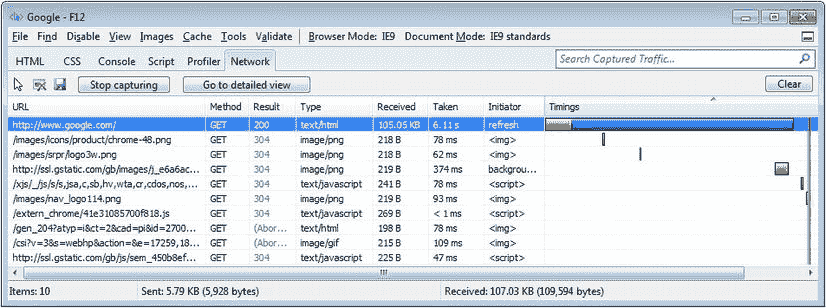

[图 4-15。](#_Fig15) Internet Explorer F12 开发工具

摘要

在这一章中，我们从通过 ASP.NET web API 构建符合 HTTP 规范的 Web API 的角度来看 HTTP 的基础知识。通过坚持 HTTP 规范，我们确保任何符合 HTTP 的设备或软件都可以使用该服务。

我们还研究了一些高级的 HTTP 概念，比如缓存、ETags 和 CORS。根据缓存的数据，缓存更适合于速度，而不是安全性。ETags 与缓存一起使用时，可以减少带宽使用。如果没有缓存，ETags 可以用于并发检查。

CORS 是一个帮助我们克服同源策略所带来的限制的规范。只有现代浏览器支持 CORS。没有 CORS 的支持，仍然有恐龙留在野外。仅在绝对必要时使用 CORS。

然后，我们研究了 HTTPS 或安全 HTTP，即传输层安全性。最后，我们探索了如何使用 Fiddler(HTTP 调试的终极工具)来捕获和解密 HTTPS 流量。