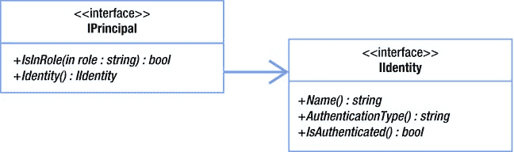
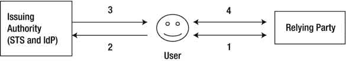
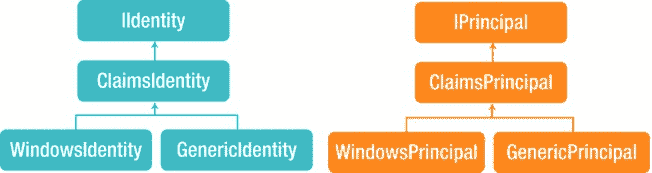
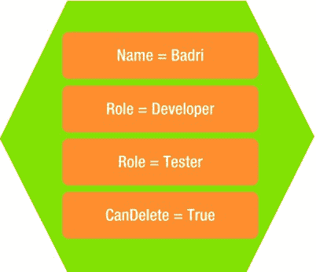
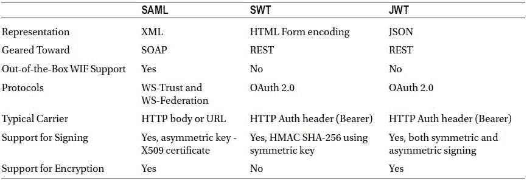

# 五、身份管理

在本章中，我将介绍保护应用的一个重要方面:身份管理。该术语有更广泛的含义，但我们的重点仅限于主题或实体如何获得身份验证，以及实体试图执行的操作如何在。NET 框架。

可以是人、组织、硬件设备或应用软件的实体请求访问资源。根据应用的上下文，资源可以是 web 服务、网站、网站中的网页，甚至是网页中的 UI 元素。除非资源是公共的，每个人都可以使用，否则拥有资源的应用将实现某种访问控制。为了实施访问控制，必须首先识别和验证发出请求的实体。

认证和授权

身份管理有两个重要方面:身份验证和授权。

*   认证是通过标识符发现实体的身份，并通过验证实体向权威机构提供的凭证来验证身份的过程。
*   授权是确定一个身份是否被允许执行所请求的动作的过程。

应用通过标识符或用户 ID 来标识实体或用户。例如，假设您是一个用户，正在尝试建立一个应用的身份。假设您通知应用您的标识符是 lbadri(实际上是我的标识符)。此时，系统可以根据您提供的标识符为您建立一个身份。但是，要成为一个值得信赖的应用，它必须验证您确实是您所声称的那个人。这个过程称为认证，有时缩写为 AuthN。这是通过接受凭证(通常是密码)并根据应用数据存储中的用户 ID 存储的密码进行验证来实现的。希望你不知道我的密码，也猜不到，这样你使用我的凭证进行验证的尝试将会被应用拒绝。这是应用安全性的最基本的构建块之一。

用户可以通过三种类型的凭证进行身份验证。

1.  基于用户所知道的(知识)；例如，密码或 PIN。
2.  基于用户拥有的东西(所有权)；例如，证书或 USB 加密狗。
3.  基于用户是什么(固有)；例如指纹或 DNA 序列。

对于一个应用来说，通常基于前面列出的三个因素中的一个来实现身份验证机制，知识因素是最常用的。具有较高安全性需求的应用基于列表中的两个因素实现身份验证机制；这种机制被称为双因素认证(TFA 或 2FA) 。TFA 的一个例子是需要使用硬件令牌或 USB 加密狗以及密码的企业网络。另一个众所周知的例子是自动柜员机:自动柜员机需要您拥有的借记卡和您知道的个人识别码，才能允许您完成交易。至少在企业环境中，实现三因素安全性的应用并不常见。

一旦建立了经过身份验证的身份，应用就可以基于该身份控制对应用资源的访问。这个过程称为授权，有时缩写为 AuthZ。一个极其简单和琐碎的应用可能完全基于身份来授权资源访问。但是大多数实际应用基于与身份相关联的属性(如角色)来授权访问。

基于角色的安全性

基于角色的安全是业务或企业应用中最常用的安全模型。使用基于角色的安全模型的主要好处是易于安全管理。访问权限不是授予单个用户，而是授予一个称为角色的抽象概念。用户被分配一个或多个角色，用户通过这些角色获得访问权限。

使用这种模型，安全管理变成了通过向用户分配和取消分配角色来管理角色(通常比用户少得多)的问题。通过向角色分配访问权限，管理员可以在一次操作中向数百个用户分配相同的访问权限。此外，通过为用户分配角色，用户可以立即获得为该角色定义的所有访问权限。同样易于管理也适用于取消分配操作。

基于角色的安全性在。NET 框架，从 1.0 版开始。标识和主体是由。NET 框架来实现基于角色的安全性。

身份和委托人

在。NET Framework 中，identity 对象表示代码运行所代表的用户。主体对象表示代码以其名义运行的用户的安全上下文，包括用户的标识和该用户被分配的角色。`IIdentity`和`IPrincipal`接口构成了中基于角色的访问控制(RBAC) 实现的基础。NET 框架。`IIdentity`代表用户的身份。`IPrincipal`表示与用户相关联的身份和角色。`IPrincipal`具有`Identity`属性和`IsInRole(string)`方法，该方法接受一个角色，如果主体是该角色的成员，则返回 true。

[图 5-1](#Fig1) 显示了`IIdentity and IPrincipal`界面。



[图 5-1。](#_Fig1)身份和原则

中的每个线程。NET Framework 具有类型为`IPrincipal`的`CurrentPrincipal`属性。`CurrentPrincipal`属性更像是一个挂主要对象的钥匙挂架。如果家里有一个钥匙挂架，就很容易把钥匙挂在那里，这样无论谁需要钥匙，都能很容易地找到。

通常，负责认证的模块会创建主体对象，并将主体挂在密钥挂架上，也就是`Thread.CurrentPrincipal`。这通常在主线程中完成，任何新创建的线程都会自动获得相同的主体。主体对象是由实现的基于角色的安全性的基础。NET 框架。

中的标识和主体抽象有两种现成的实现。NET 框架。

1.  `GenericIdentity`和`GenericPrincipal`，用于自定义场景`.`
2.  `WindowsIdentity`和`WindowsPrincipal`，用于基于 Windows 身份验证的场景。

`GenericIdentity`和`WindowsIdentity`类实现了`IIdentity`接口，而`GenericPrincipal`和`WindowsPrincipal`类实现了`IPrincipal`接口。

在 WinForms 应用中使用通用身份

`The GenericIdentity`和`GenericPrincipal`类分别代表一个通用用户和一个通用主体。虽然。NET Framework 允许创建实现`IIdentity`和`IPrincipal`接口的自定义类，当特定于应用的数据和行为不需要成为标识和主体对象的一部分时，使用现成的通用实现比创建自定义类更方便。现在我将向您展示如何在一个简单的 WinForms 应用中使用这些类。我选择 WinForms 只是为了让这个例子一目了然。您在这里看到的概念适用于任何。NET 框架应用。

如[清单 5-1](#list1) 所示，Program.cs 以`Main`方法作为入口点。`Main`方法弹出一个模态对话框 LoginForm，它验证并设置`Thread.CurrentPrincipal`,以便其他应用部分执行 RBAC。`Main`方法要求用户处于“普通用户”角色才能显示主屏幕。`MainForm`是主屏幕，它有删除功能，这需要用户在“管理员”的角色。

[***清单 5-1。***](#_list1) Program.cs

```cs
static void Main()
{
    Application.EnableVisualStyles();
    Application.SetCompatibleTextRenderingDefault(false);

    DialogResult result = DialogResult.None;
    using (var loginForm = new LoginForm())
        result = loginForm.ShowDialog();

    if (result == DialogResult.OK)
    {
        // By the time execution comes here, user has been shown the login screen, authentication
        // process completed and principal object created and set in Thread.CurrentPrincipal
        var permission = new PrincipalPermission(null,"General User");
        permission.Demand();

        Application.Run(new MainForm());
    }
}
```

登录屏幕有两个文本框，`txtUserId`和`txtPassword`，用于接收用户的凭证。如果您单击 Login 按钮，登录屏幕将验证凭证(为了简洁起见，我没有在示例中实现它)，创建一个通用主体，并将其挂在`Thread.CurrentPrincipal`键挂钩中，供其他类使用。[清单 5-2](#list2) 显示了 LoginForm 代码。

[***清单 5-2。***](#_list2) LoginForm.cs

```cs
public partial class LoginForm : Form
{
    public LoginForm()
    {
        InitializeComponent();
    }

    private void btnLogin_Click(object sender, EventArgs e)
    {
        // Authenticate using this.txtUserId and this.txtPassword

        Thread.CurrentPrincipal = new GenericPrincipal
        (
            new GenericIdentity(this.txtUserId.Text),
            new[] { "General User", "Admin" } // roles hard-coded for the purpose of illustration
        );

        this.DialogResult = DialogResult.OK;
        this.Close();
    }
}
```

`MainForm`加载时，如果当前主体不属于“管理员”角色，则禁用删除按钮。此外，事件处理程序用需要“Admin”角色的`PrincipalPermission`属性来修饰。前一步是可视化提示，后一步是确保删除代码只为“Admin”角色执行，即使应用的其他部分直接调用该方法。使用属性是进行 RBAC 的声明方式。同样的事情也可以在代码中完成，就像在`Main`方法中一样，这是完成 RBAC 的必要方式。

[清单 5-3](#list3) 显示了`MainForm`代码。

[***清单 5-3。***](#_list3) MainForm.cs

```cs
public partial class MainForm : Form
{
    public MainForm()
    {
        InitializeComponent();
    }

    private void MainForm_Load(object sender, EventArgs e)
    {
        btnDelete.Enabled = Thread.CurrentPrincipal.IsInRole("Admin");
    }

    [PrincipalPermission(SecurityAction.Demand, Role="Admin")]
    private void btnDelete_Click(object sender, EventArgs e)
    {
        // Do some important admin stuff here
    }
}
```

在前面的示例中，我使用了一个具有通用身份的通用主体，该主体在应用启动时成功登录时得到身份验证，然后下游类使用它来实施 RBAC。即使您的应用有数百个表单，访问控制也只是根据动作指定角色，如使用`PrincipalPermission`属性声明的示例所示。

在控制台应用中使用 Windows 身份

类似于`GenericIdentity`和`GenericPrincipal classes`,`WindowsIdentity`和`WindowsPrincipal`类分别实现`IIdentity`和`IPrincipal,`，并且是。NET 框架库。但是，`WindowsIdentity`和`WindowsPrincipal`是 Windows 认证特有的。

`WindowsIdentity`代表 Windows 用户或帐户，`WindowsPrincipal`允许通过 Windows 组进行访问控制。我使用清单 5-4 中的[控制台应用来展示这两个类的运行。](#list4)

[***清单 5-4。***](#_list4) WindowsIdentity 和 WindowsPrincipal 控制台应用

```cs
WindowsIdentity id = WindowsIdentity.GetCurrent();
Console.WriteLine(id.Name);
Console.WriteLine(id.User);

foreach (var group in id.Groups)
    Console.WriteLine(group.Value);

foreach (var group in id.Groups.Translate(typeof(NTAccount)))
    Console.WriteLine(group);

WindowsPrincipal principal = new WindowsPrincipal(id);
Console.WriteLine(principal.IsInRole("Builtin\\Users"));
```

[清单 5-4](#list4) 中的代码可以作为任何应用的一部分运行:控制台、WinForms、Windows 服务，甚至是 web 应用。最终，它在 Windows 帐户下创建的进程空间中执行。静态方法`WindowsIdentity.GetCurrent()`返回该 Windows 帐户所代表的身份。如果您在以 my domain \ my some 登录的计算机上的控制台应用中运行这段代码，那么`WindowsIdentity`代表这个帐户。Name 属性就是这样:my domain \ my some。

我使用静态方法`GetCurrent()`来获取代码当前运行的 Windows 帐户。通过使用 Windows 帐户令牌创建`WindowsIdentity`类的实例，也可以使用其他 Windows 帐户的`WindowsIdentity`，而不是运行应用的帐户。可以通过调用 Win API `LogonUser()`传递用户名、域和密码来获得令牌。

清单 5-5 展示了如何手工创建一个`WindowsIdentity`实例。

[***清单 5-5。***](#_list5) 使用令牌创建 WindowsIdentity

```cs
[DllImport("advapi32.dll", SetLastError = true)]
public static extern bool LogonUser(String lpszUsername, String lpszDomain, String lpszPassword,
    int dwLogonType, int dwLogonProvider, ref IntPtr phToken);

[DllImport("kernel32.dll", CharSet = CharSet.Auto)]
public extern static bool CloseHandle(IntPtr handle);

static void Main(string[] args)
{
    string userName = "jqhuman";
    string password = "p@ssw0rd!";
    string domain = "Magic";
    IntPtr token = IntPtr.Zero;

    try
    {
        if (LogonUser(userName, domain, password, 3, 0, ref token))
        {
            using (var idBasedonToken = new WindowsIdentity(token))
            {
                // We now have the WindowsIdentity for username here!
            }
        }
    }
    finally
    {
        if (token != IntPtr.Zero)
            CloseHandle(token);
    }
}
```

你可以这样使用`WindowsIdentity`来创建`WindowsPrincipal`，可以用于访问控制。作为`LogonUser()`调用的一部分，用户的凭证被认证。在某些情况下，这不是必需的。仅仅为 RBAC 创建一个`WindowsPrincipal`实例就足够了。对于这些情况，`WindowsIdentity`支持一个接受用户主体名(UPN)的构造函数，如[清单 5-6](#list6) 所示。

[***清单 5-6。***](#_list6) WindowsIdentity 使用 UPN 创作

```cs
var idUpn = new WindowsIdentity("Myself@MyDomain.com");
var principalUpn = new WindowsPrincipal(id);
bool isInRole = principalUpn.IsInRole("MyDomain\\SomeGroup");
```

扮演

模拟是线程在不同于拥有该线程的进程上下文的安全上下文中执行的能力。在幕后，接受 UPN 的`WindowsIdentity`构造函数调用`LsaLogonUser()`，它使用 Kerberos S4U。作为`LsaLogonUser()`调用的一部分，没有认证发生。因此，由`LsaLogonUser()`返回的令牌将具有“身份”的模拟级别，而不是由`LogonUser()`返回的“模拟”级别。这可以通过查看使用令牌创建的`WindowsIdentity`对象的`ImpersonationLevel`属性来验证。通过使用由`LoginUser()`返回的令牌创建的`WindowsIdentity`对象，可以模拟一个用户，如[清单 5-7](#list7) 所示。

[***清单 5-7。***](#_list7) 冒充

```cs
Console.WriteLine("Before: " + WindowsIdentity.GetCurrent().Name);

using (WindowsIdentity id = new WindowsIdentity(token)) // LogonUser() token
{
    using (WindowsImpersonationContext impersonatedUser = id.Impersonate())
    {
        // WindowsIdentity.GetCurrent().Name will be that of impersonated identity
        Console.WriteLine("After: " + WindowsIdentity.GetCurrent().Name);

        impersonatedUser.Undo(); // Undo the impersonation, once done
    }
}
```

奇怪的线团。当前原则

通常，负责认证的模块会创建主体对象，并将主体挂在密钥挂架上，也就是`Thread.CurrentPrincipal`。这通常在主线程中完成，任何新创建的线程都会自动获得相同的主体。主体对象是由实现的基于角色的安全性的基础。NET 框架。

如果你根本不使用这些接口或者`Thread.CurrentPrincipal`而只是简单地使用你自己的定制对象会怎么样？虽然你是在重新发明轮子，但这种方法是可行的。然而，一些。NET 框架和第三方组件期望从`Thread.CurrentPrincipal`中检索主体对象，因为这是标准。例如，`ApiController`中的属性用户返回`Thread.CurrentPrincipal`。如果您的身份验证机制没有设置它，用户属性将返回由 ASP.NET Web API 管道中的`HttpServer`设置的通用虚拟主体。

然而，如果您在 web 上托管您的 ASP.NET Web API，仅仅在`Thread.CurrentPrincipal`中设置您的主体对象是不够的。ASP.NET Web API 可以使用 IIS/ASP 进行 Web 托管。NET 基础结构或自托管在任何进程(如 Windows 服务)上。无论哪种情况，都必须在`Thread.CurrentPrincipal`中设置本金。对于虚拟主机，你还必须在`HttpContext.Current.User`设置委托人。如果您希望以两种方式托管您的代码，您必须在访问用户属性之前检查`HttpContext.Current.User`是否为 null，因为在自托管的情况下它将为 null。

ASP.NET Web API 中还有另一个与`Thread.CurrentPrincipal`相关的重要场景。从 ASP.NET Web API 动作方法返回`IQueryable<T>`是可能的。如果在查询中引用在`Thread.CurrentPrincipal`中设置的身份，当查询延迟执行时，主体将不再在线程上，导致意外的结果。当媒体类型格式化程序运行时，查询实际上被执行，消息处理程序在`Thread.CurrentPrincipal`中设置的主体将已经被清除。在 ASP.NET Web API 的未来版本中，这种行为可能会变得更好。与此同时，一个潜在的解决方法是从`Thread.CurrentPrincipal`中检索身份相关信息，并将其存储在本地。例如，您可以使用下面的代码片段来检索基于报告经理(即经过身份验证的用户)的员工列表。

```cs
public IQueryable<EmployeeDto> GetEmployees()
{
        string manager = User.Identity.Name;
        return context.Employees
                                  .Where(e => e.ManagerId == manager)
                                       .Select(e => new EmployeeDto(e));
}
```

不要使用`Thread.CurrentPrincipal`或者内部返回`Thread.CurrentPrincipal`的 ApiController 的用户属性，在你的表达式树中直接这样:`Where` ( `e => e.ManagerId == User.Identity.Name`)。

有关`Thread.CurrentPrincipal`的更多信息，请访问 Dominick Baier 的博客:“重要:在 ASP.NET Web API 中设置客户端主体”(`http://leastprivilege.com/2012/06/25/important-setting-the-client-principal-in-asp-net-web-api/`)和“线程的替代方案”。ASP.NET Web API 中的 current principal”(`http://leastprivilege.com/2013/03/11/alternative-to-thread-currentprincipal-in-asp-net-web-api/`)。

基于索赔的证券

到目前为止，我们讨论的身份模型主要关注用户向应用提供标识符和凭证，以及应用为用户建立身份。根据所提供的凭证，如果应用能够验证用户就是他所声称的那个人，那么这个身份就成为一个经过验证的身份。根据用户所属的角色，用户有权访问资源。

另一种建立证券模型的方法是基于索赔。基于声明的身份最基本的方面是声明集。声明只是一个声明，它是一个实体(一个用户或另一个应用)对自己的声明。以下列表显示了索赔的示例。

*   这个用户的名字是巴德里。
*   evelyn.mallory@evilandmalicious.com 的电子邮件是巴德里的。
*   巴德里的年龄是四岁半。
*   巴德里可以删除用户。

与用户直接向应用提供凭据的早期模型相比，在基于声明的模型中，用户只向应用提供声明，而不提供凭据。为了使声明具有实用价值，它必须来自应用信任的实体。

基于声明的体系结构的基础是信任。如果我声称我的电子邮件是`evelyn.mallory@evilandmalicious.com`，人们马上就会知道我的说法是不成立的。应用不具备做出这一决定的智能，因此它必须依赖信任。如果我向应用提交由该应用信任的实体创建的声明，那么该应用会接受该信任并接受该声明。在这种情况下，应用依赖于另一个实体。这种应用被称为依赖方(RP) 应用。

RP 应用所依赖的实体称为颁发机构。颁发机构颁发安全令牌(不同于上一节中介绍的 Windows 令牌)。在本章的最后一节，我提供了更多关于安全令牌的细节，但是现在，就把令牌想象成一个容器，它保存了一组安全传输的声明。

接受令牌请求并发布令牌的发布机构的端点被称为安全令牌服务(STS) 。当用户请求令牌时，颁发机构必须确保用户是她所声称的那个人。换句话说，颁发机构必须根据凭证对用户进行身份验证。因此，即使在基于声明的安全性中也会进行身份验证，但区别在于身份验证的责任被委托给了颁发机构，而不再属于应用。

STS 可以选择将身份验证的责任保留在自己内部(基于其设计方式),或者委托给另一个称为身份提供者(IdP)的实体。IdP 验证用户凭证，并将凭证的有效性反馈给 STS。如果凭证有效，STS 会颁发一个带有声明的令牌。用户将令牌提交给 RP 应用，RP 应用验证令牌，提取声明，根据声明建立身份，然后根据声明控制访问。因为声明是该模型的基础，所以它被称为基于声明的安全性。

图 5-2 说明了基于声明的安全模型中的一系列步骤。



[图 5-2。](#_Fig2)基于债权的担保

1.  用户请求一个动作。RP 请求令牌。
2.  用户向 RP 应用信任的颁发机构提交凭证。
3.  在对用户的凭证进行身份验证之后，颁发机构颁发带有声明的签名令牌。
4.  用户将令牌提交给 RP 应用。应用验证令牌签名，提取声明，并根据声明接受或拒绝请求。

真实世界类比

基于声明的安全性不同于传统的安全性建模方式，但它更自然，因为它非常类似于我们在现实世界中所做的事情。

以航空旅行为例。我通过网站预订机票，并在网上办理登机手续。我到达机场，走向登机柜台，声称我是根据我手中的机票和登机牌应该旅行的人。登机柜台的航空公司代理人有责任检查我是否确实是可以使用该机票旅行的人。代理商自己不验证。相反，他要我的驾照，驾照是由机动车管理局(DMV)颁发的，这是航空公司信任的一个实体。车管所已经验证了我的证件，并颁发了有效期至某一特定日期的许可证。我向航空代理出示我的执照。他接受了它，通过确保许可证没有被篡改来验证许可证的真实性，并查看了许可证的详细信息，所有这些都是在让我登机之前完成的。

在这个例子中，航空公司是依赖于 DMV 的 RP，DMV 是发行机构。车管所发放许可证，也就是令牌。许可证包括我的照片、姓名和年龄等信息，这些信息代表了航空公司或 RP 感兴趣的声明。此外，我的驾照包含全息图等机制，以确保有人不会篡改驾照信息。全息图相当于发行机构的签名，以确保令牌不能被伪造。

在现实世界中，RPs 通常信任政府机构。这类机构发放像驾照、身份证或护照这样的文件。还有许多其他类型的现实世界场景涉及到 RPs，例如供应仅限于特定年龄组的酒精饮料的餐馆或酒吧、销售只能卖给特定年龄以上人群的商品的零售店，或者放映不适合所有人的电影的电影院。

我已经提供了前面的真实例子来说明基于声明的安全性的主要概念。当然，这些示例并不严格对应于基于 web 的软件应用中基于声明的安全的实际过程。例如，在基于声明的安全模型中，当 RP 应用请求安全令牌时，通常会立即请求并获得它。在航空场景中，一个人不会去航空公司的登机柜台，收到身份证的请求，然后跳进他的车，开到 DMV 去拿他的驾照。另一个区别是，驾照的有效期是几年，但没有一个安全令牌有这么长的寿命。

基于声明的访问控制 与基于角色的访问控制

RBAC 和基于声明的访问控制之间的根本区别是获得执行某个操作的授权所必需的标准。

*   在 RBAC，进入角色是获得授权的必要标准。
*   在基于声明的访问控制中，具有应用所期望的正确值的声明是获得授权的必要标准。

以一个业务需求为例，该业务需求规定只有商店经理可以对商店中销售的商品的标价进行折扣。如果折扣逻辑是在一个方法中实现的，比如说`MakeDiscount()`，那么基于角色的访问控制方法就是检查用户是否属于一个角色，比如说“StoreManager”，以允许或拒绝方法调用。在基于声明的方法的情况下，只有当用户提供一个有效的声明类型，比如“canmakefoundation”和值为“true”时，才允许调用方法`MakeDiscount`

发证机构创建值为“true”的“canmakefoundation”声明的依据是什么？它可以是任何东西，包括处于“商店经理”角色的用户！如果声明最终将取决于角色，那么基于声明的安全性会带来什么价值呢？嗯，通过在角色上增加一个抽象层次，应用中的访问控制检查逻辑得到了简化。此外，当访问控制逻辑改变时，应用不需要改变。这类似于通过 ODBC 驱动程序从应用访问数据库所获得的好处。即使底层数据库引擎发生变化，比如从 Oracle 服务器到 Microsoft SQL Server，您的应用代码也不会受到这种变化的影响。

实现基于声明的模型还有其他好处。该应用将身份验证和相关模块外包给发行机构。因此，应用不需要提供帐户管理机制，如帐户和密码创建、重置和其他相关功能。此外，该应用可以支持多个身份提供商(例如，Windows Live、Google、Yahoo！和 Windows 身份验证)。用户不需要创建特定于应用的帐户，并且可以重用他们现有的帐户。

使用基于债权的担保

声明是。NET 框架 4.5。基本声明类如`Claim`、`ClaimsIdentity`和`ClaimsPrincipal`都是 mscorlib 的一部分。默认情况下，标识基于声明。`WindowsIdentity`和`GenericIdentity`继承自`ClaimsIdentity`。主体对象继承自`ClaimsPrincipal`。[图 5-3](#Fig3) 说明了。NET 框架 4.5。



[图 5-3。](#_Fig3)中的身份和主体类。NET 框架 4.5

来自 Windows Identity Foundation (WIF)的类都被吸收到了。NET 框架 4.5。WIF 类主要分布在三个组件上:`System.Security.Claims`、`System.IdentityModel`和`System.IdentityModel.Services`。

使用声明 实现基于角色的访问控制

中对标识类和主体类所做的更改。NET Framework 4.5 旨在向后兼容，并且只要有可用的角色声明，就可以很好地与传统的 RBAC 一起工作。即使在拥有底层`ClaimsIdentity`对象的主体对象上，也可以继续调用`IsInRole()`方法。无论是命令式还是声明式，你都可以自由使用`PrincipalPermission`。在清单 5-8 中，我展示了一个使用基于声明的身份实现 RBAC 的例子。

[***清单 5-8。***](#_list8) 自称与 RBAC 同宗

```cs
static void Main(string[] args)
{
    var claims = new List<Claim>()
    {
        new Claim(ClaimTypes.Name, "badri"),
        new Claim(ClaimTypes.Email, "badri@nowhere.com"),
        new Claim(ClaimTypes.Role, "StoreManager"),
        new Claim(ClaimTypes.Role, "BackOfficeClerk")
    };

    var id = new ClaimsIdentity(claims, "Dummy"); // Non-empty string is needed as authentication type
    var principal = new ClaimsPrincipal(new[] { id });
    Thread.CurrentPrincipal = principal;

    MakeDiscount(); // Call the method that needs authorization
}

[PrincipalPermission(SecurityAction.Demand, Role = "StoreManager")] // Declarative
private static void MakeDiscount()
{
    new PrincipalPermission(null, "BackOfficeClerk").Demand();      // Imperative
    Console.WriteLine(Thread.CurrentPrincipal.IsInRole("StoreManager"));
    Console.WriteLine("Discount of 10% has been applied");
}
```

在前面的代码中，`ClaimsPrincipal`对象是用声明而不是角色创建的，并在`Thread.CurrentPrincipal`中进行设置。然而 RBAC(声明性的和命令性的)起作用，并且该方法输出 True 和“已经应用了 10%的折扣”。

 **注**中的。NET Framework 4.5 中，当您创建一个新的`ClaimsIdentity`时，您必须使用您用来进行身份验证的方法将身份验证类型设置为一个非空字符串。在[清单 5-8](#list8) 中，我使用了“Dummy”。这会将`ClaimsIdentity`的`IsAuthenticated`属性设置为真。否则，所有访问控制检查都将失败。

使用声明 实现基于声明的访问控制

基于声明的访问控制允许授权规则与核心业务逻辑更好地分离。当授权规则需要更改时，核心业务逻辑不受影响。要执行基于声明的访问控制，使用子类`ClaimsAuthorizationManager`并将其配置为与应用一起使用。然后，不使用`PrincipalPermission`，而是使用`ClaimsPrincipalPermission`。您可以自由地声明或强制使用它。[清单 5-9](#list9) 展示了如何修改我在[清单 5-8](#list8) 中展示的代码来使用基于声明的访问控制。

[***清单 5-9。***](#_list9) 基于声明的身份和基于声明的访问控制

```cs
static void Main(string[] args)
{
    var claims = new List<Claim>()
    {
        new Claim(ClaimTypes.Name, "badri"),
        new Claim(ClaimTypes.Email, "badri@nowhere.com"),
        new Claim(ClaimTypes.Role, "StoreManager"),
        new Claim(ClaimTypes.Role, "BackOfficeClerk")
    };

    var id = new ClaimsIdentity(claims, "Dummy");
    var principal = new ClaimsPrincipal(new[] { id });
    Thread.CurrentPrincipal = principal;

    MakeDiscount(); // Call the method that needs authorization
}

[ClaimsPrincipalPermission(SecurityAction.Demand, Operation = "MakeDiscount", Resource = "ListPrice")]
private static void MakeDiscount()
{
    Console.WriteLine("Discount of 10% has been applied");
}
```

要将`ClaimsPrincipalPermission`属性用于基于声明的访问控制，您需要创建`ClaimsAuthorizationManager`的子类，并通过更改配置将其插入声明管道。以下是涉及的两个步骤。

1.  Create a subclass of `ClaimsAuthorizationManager`, as shown in [Listing 5-10](#list10).

    [***清单 5-10。***](#_list10)ClaimsAuthorizationManager 子类

    ```cs
    public class AuthorizationManager : ClaimsAuthorizationManager
    {
        public override bool CheckAccess(AuthorizationContext context)
        {
            string resource = context.Resource.First().Value;
            string action = context.Action.First().Value;

            if (action == "MakeDiscount" && resource == "ListPrice")
            {
                ClaimsIdentity id = (context.Principal.Identity as ClaimsIdentity);

                if (id.Claims.Any(c => c.Type == ClaimTypes.Role &&
                                                        c.Value.Equals("StoreManager")))
                    if (id.Claims.Any(c => c.Type == ClaimTypes.Role &&
                                                        c.Value.Equals("BackOfficeClerk")))
                        return true;
            }

            return false;
        }
    }
    ```

2.  Configure it in app.config, as shown in [Listing 5-11](#list11).

    [***清单 5-11。***T5】app . config](#_list11)

    ```cs
    <?xml version="1.0" encoding="utf-8" ?>
    <configuration>
            <configSections>
                <section name="system.identityModel"
                         type="System.IdentityModel.Configuration.SystemIdentityModelSection,
                         System.IdentityModel, Version=4.0.0.0, Culture=neutral,
                                                  PublicKeyToken=B77A5C561934E089"/>
            </configSections>
            <system.identityModel>
                <identityConfiguration>
                    <claimsAuthorizationManager
    type="ClaimsBasedIdentityConsoleApp.AuthorizationManager,
    ClaimsBasedIdentityConsoleApp"/>
                </identityConfiguration>
            </system.identityModel>
    </configuration>
    ```

子类化`ClaimsAuthorizationManager`涉及一个主要任务:覆盖`CheckAccess(AuthorizationContext)`方法，如果允许访问，提供您的实现返回 true，否则返回 false。输入参数是一个类型为`AuthorizationContext`的对象。它拥有所有必要的数据，让您根据三个属性做出授权决定:`Principal`、`Action`和`Resource`。`Principal`表示请求授权的主题。`Action`和`Resource`是一组声明，表示主题想要执行的动作和将要被操作的资源。

在[清单 5-10](#list10) 中，逻辑假设资源和动作声明的计数都是 1。为了授权，它检查主体的身份是否有两个角色声明，一个用于 StoreManager，另一个用于 BackOfficeClerk。

通过前面的两个步骤，在控制台应用中实现了基于声明的访问控制。与前面基于角色的示例类似，授权完全基于两个角色，StoreManager 和 BackOfficeClerk。需要注意的重要一点是，与直接在实现业务规则的代码中指定角色的 RBAC 不同，在基于声明的访问控制中，授权规则被移到了`ClaimsAuthorizationManager`子类中。对授权的唯一引用是使用`ClaimsPrincipalPermission`属性以及传入的资源名和操作名。然而，角色会随着来自业务用户的新规则的出现而改变，一次又一次地影响代码。

为了说明基于声明的模型有多大的弹性，让我们假设有一个新规则出现:授权逻辑中必须考虑当前月份；也就是说，从 9 月到 12 月不允许打折。为了处理这个规则变化，代码中只需要两个变化:获取一个额外的季节声明，并在`ClaimsAuthorizationManager`子类中检查该声明。核心业务逻辑根本没有改变，因为`CheckAccess()`继续返回 true 或 false。

实现基于声明的 ASP.NET Web API

在这一节中，我将向您展示如何实现一个声明感知的 ASP.NET Web API。我使用我一直使用的示例 API，雇员 API。这里的业务规则是，要删除员工，用户必须是“人力资源经理”角色，并且必须与被删除的员工来自同一个部门和国家。这条规则相对复杂，因为它不仅取决于用户声明，还取决于资源声明(雇员的属性，即资源)。

1.  As shown in [Listing 5-12](#list12), create a global message handler and add it to the message handlers collection in WebApiConfig under the App_Start folder. A claim is hard-coded here for illustration. Getting the claims from a token issued by STS is covered in [Chapter 7](07.html). A claims principal is created using this single hard-coded claim, which is a name claim, and passed to the `Authenticate()` method of `ClaimsAuthenticationManager`. The principal object returned by the `Authenticate()` method is set in `Thread.CurrentPrincipal` and `HttpContext.Current.User`.

    [***清单 5-12。***](#_list12) 认证处理程序

    ```cs
    public class AuthHandler : DelegatingHandler
    {
        protected override async Task<HttpResponseMessage> SendAsync(
                                    HttpRequestMessage request,
                                    CancellationToken cancellationToken)
        {
            // Pretend this claim comes from a token minted by an STS
            var claims = new List<Claim>() { new Claim(ClaimTypes.Name,
                                                "jqhuman") }; // User Id of John Q Human

            var id = new ClaimsIdentity(claims, "dummy");
            var principal = new ClaimsPrincipal(new[] { id });

            var config = new IdentityConfiguration();
            var newPrincipal = config.ClaimsAuthenticationManager
                                                .Authenticate(request.RequestUri.ToString(),
    principal);
    Thread.CurrentPrincipal = newPrincipal;

    if (HttpContext.Current != null)
    HttpContext.Current.User = newPrincipal;

            return await base.SendAsync(request, cancellationToken);

        }
    }
    ```

2.  Create a subclass of `ClaimsAuthenticationManager` so that the initial principal object created with the hard-coded claim can be enriched with more local claims. In this example, the claim is hard-coded. However, even if an STS is used it might not have access to the human resources database. So, based on the value of the name claim, get the department, country, and the role and add those as additional claims. Of course, for brevity, values of those three additional claims are hard-coded in [Listing 5-13](#list13).

    [***清单 5-13。***](#_list13)claims authenticationmanager

    ```cs
    public class AuthenticationManager : ClaimsAuthenticationManager
    {
        public override ClaimsPrincipal Authenticate(string resourceName, ClaimsPrincipal incomingPrincipal)
        {
            if (incomingPrincipal == null ||
    String.IsNullOrWhiteSpace(incomingPrincipal.Identity.Name))
                throw new SecurityException("Name claim missing");

            // Go to HR database and get the department to which user is assigned
            // Also, get the role of the user and the country user is based out of
            string department = "Engineering";
            var deptClaim = new Claim(" http://badri/claims/department ", department);
            var roleClaim = new Claim(ClaimTypes.Role, "Human Resources Manager");
            var countryClaim = new Claim(ClaimTypes.Country, "US");

            ClaimsIdentity identity = (ClaimsIdentity)incomingPrincipal.Identity;
            identity.AddClaim(deptClaim);
            identity.AddClaim(roleClaim);
            identity.AddClaim(countryClaim);

            return incomingPrincipal;
        }
    }
    ```

3.  Create a subclass of `ClaimsAuthorizationManager` and implement the authorization rules in the `CheckAccess()` method in [Listing 5-14](#list14). This is similar to the previous subclass in [Listing 5-10](#list10), but this code handles multiple resource and action claims. You will need two resource claims in addition to the name claim: the department claim of the resource (read employee) and the country claim of the resource.

    [***清单 5-14。***](#_list14) 索赔授权经理

    ```cs
    public class AuthorizationManager : ClaimsAuthorizationManager
    {
        public override bool CheckAccess(AuthorizationContext context)
        {
            var resource = context.Resource;
            var action = context.Action;

            string resourceName = resource.First(c => c.Type == ClaimTypes.Name).Value;
            string actionName = action.First(c => c.Type == ClaimTypes.Name).Value;

            if (actionName == "Delete" && resourceName == "Employee")
            {
                ClaimsIdentity identity = (context.Principal.Identity as ClaimsIdentity);
                if (!identity.IsAuthenticated)
                       return false;
                var claims = identity.Claims;

                string employeeDepartment = resource.First(c => c.Type ==
                                                     "http://badri/claims/department ”).Value;
                string employeeCountry = resource.First(c => c.Type == ClaimTypes.Country).Value;

                if (claims.Any(c => c.Type == " http://badri/claims/department " &&
                                                  c.Value.Equals(employeeDepartment)))
                    if (claims.Any(c => c.Type == ClaimTypes.Country &&
                                                  c.Value.Equals(employeeCountry)))
                        if (claims.Any(c => c.Type == ClaimTypes.Role &&
                                                  c.Value.Equals("Human Resources Manager")))
                            return true;
            }
            return false;
        }
    }
    ```

4.  Register the `ClaimsAuthenticationManager` subclass and the `ClaimsAuthorizationManager` subclass in web.config, as shown in [Listing 5-15](#list15).

    [***清单 5-15。***](#_list15) Web.config 条目

    ```cs
    <configuration>
            <configSections>
            ...
            <section name="system.identityModel"
                     type="System.IdentityModel.Configuration.SystemIdentityModelSection,
                                    System.IdentityModel, Version=4.0.0.0, Culture=neutral,
                                    PublicKeyToken=B77A5C561934E089"/>
            </configSections>
            ...
            <system.identityModel>
                    <identityConfiguration>
                            <claimsAuthenticationManager
    type="ClaimsBasedWebApi.AuthenticationManager,
                                                                        ClaimsBasedWebApi"/>
                            <claimsAuthorizationManager
    type="ClaimsBasedWebApi.AuthorizationManager,
                                                                        ClaimsBasedWebApi"/>
                    </identityConfiguration>
            </system.identityModel>
    ```

5.  Implement the `ApiController` action method, as shown in [Listing 5-16](#list16). Because the `ClaimsAuthorizationManager` subclass needs the resource claims to implement the authorization logic, the `ClaimsPrincipalPermission` attribute cannot be used. Create an instance of `AuthorizationContext`, attach resource claims to it, and call the `CheckAccess()` method, explicitly passing the context (done in the extension method defined in the `PrincipalHelper` class for the `IPrincipal` type). Unlike the case of using `ClaimsPrincipalPermission`, flow is controlled through a logical bool check and not by catching a `SecurityException`.

    [***清单 5-16。***](#_list16) 员工管理员删除

    ```cs
    public HttpResponseMessage Delete(int id)
    {
        // Based on ID, retrieve employee details and create the list of resource claims
        var employeeClaims = new List<Claim>()
        {
            new Claim(ClaimTypes.Country, "US"),
            new Claim(" http://badri/claims/department ", "Engineering")
        };

        if (User.CheckAccess("Employee", "Delete", employeeClaims))
        {
            //repository.Remove(id);
            return new HttpResponseMessage(HttpStatusCode.NoContent);
        }
        else
            return new HttpResponseMessage(HttpStatusCode.Unauthorized);
    }

    public static class PrincipalHelper
    {
        public static bool CheckAccess(this IPrincipal principal, string resource, string action,
                                                                 IList<Claim> resourceClaims)
        {
            var context = new AuthorizationContext(principal as ClaimsPrincipal,
    resource, action);
            resourceClaims.ToList().ForEach(c => context.Resource.Add(c));

            var config = new IdentityConfiguration();
            return config.ClaimsAuthorizationManager.CheckAccess(context);
        }
    }
    ```

6.  To test the security implementation, submit a DELETE request to `EmployeesController`. You can either use Fiddler to do that or have the /Home/Index view changed to the code shown in [Listing 5-17](#list17).

    [***清单 5-17。***](#_list17) 指标视图

    ```cs
    @section scripts{
        <script type="text/javascript">
            $(document).ready(function () {
                $('#delete').click(function () {
                    $.ajax({
                        type: " DELETE ",
                        url: "api/employees/12345",
                        success: function (data) {
                            alert('Employee deleted');
                        }
                    });
                });
            });
        </script>
    }
    <div>
            <input id="delete" type="button" value="Delete" />
    </div>
    ```

这里重要的一点是，基于代码的访问控制写起来很优雅，也更容易维护。除非授权可以完全通过是否处于某个角色来强制执行，这在实际场景中是不太可能的，否则授权逻辑在 RBAC 中是分散的。

安全令牌

前面基于声明的 ASP.NET Web API 实现中缺少的部分是包含 STS 发出的声明的安全令牌。在这一节中，我将介绍什么是安全令牌以及不同类型的令牌。令牌和创建自定义 STS 将在接下来的章节中深入讨论。

安全令牌基本上是一组声明。在。NET Framework 4.5 中，声明由`System.Security.Claims.Claim`类表示，其属性显示在[清单 5-18](#list18) 中。

[***清单 5-18。***](#_list18) 索赔属性

```cs
public string Type { get; }
public string Value { get; }
public string ValueType { get; }
public string Issuer { get; }
public string OriginalIssuer { get; }
public ClaimsIdentity Subject { get; internal set; }
public IDictionary<string, string> Properties { get; }
```

*   `Type`属性是一个字符串，通常是一个 URI。例如，名称声明类型为`http://schemas.xmlsoap.org/ws/2005/05/identity/claims/name`。声明类型可以是在`ClaimTypes`类中定义的众所周知的声明类型之一，也可以是由颁发机构定义的自定义 URI。在前面的例子中，名称声明的类型是众所周知的声明类型`ClaimTypes.Name`。`AuthenticationManager`添加的部门索赔为自定义类型。我用过网址`http://badri/claims/department`。
*   `Value`属性包含索赔的实际价值，如部门索赔的“工程”。它是一个字符串，因此即使声明是一个数字，如年龄，也将是一个字符串，即“32”而不是 32。
*   `ValueType`属性，顾名思义，就是声明值的类型，这将有助于反序列化复杂类型。
*   `Subject`属性是一个`ClaimsIdentity`对象，它表示声明的主题——发出声明的实体(通常是用户)。
*   `Issuer`属性具有发布机构的名称，而`OriginalIssuer`具有原始发布机构的名称，并且在索赔通过多个发布机构的情况下具有重要性。从断言发布此声明的发布机构是 RP 应用信任的人的角度来看，`Issuer`很重要。

索赔通常是成组的。对于要通过网络发送的一堆声明，它们需要被序列化。安全令牌是一组序列化声明的容器。为了确保索赔保持安全，也就是说，除了预期的人之外，其他任何人都不会看到索赔，或者在运输过程中被篡改，索赔需要进行数字签名和加密。[图 5-4](#Fig4) 显示了一个令牌的图示。



[图 5-4。](#_Fig4)安全令牌

令牌格式

有三种标准令牌格式:安全断言标记语言(SAML)、简单 Web 令牌(SWT)和 JSON Web 令牌(JWT)。表 5-1 显示了这些格式的比较。

[表 5-1](#_Tab1) 。令牌格式比较



清单 5-19 显示了一个 SAML 令牌样本，它只包含一个声明，一个名称声明。令牌还包含签名和发布机构的公钥，以便 RP 验证令牌的真实性。

[***清单 5-19。***](#_list19) SAML 令牌

```cs
<saml:Assertion MajorVersion="1" MinorVersion="1"
                AssertionID="_05d9930e-a4d0-4678-bcc1-7b754223fb71"
                Issuer="PassiveSigninSTS" IssueInstant="2012-10-03T03:58:20.018Z"
                xmlns:saml="urn:oasis:names:tc:SAML:1.0:assertion">
  <saml:Conditions NotBefore="2012-10-03T03:58:20.018Z" NotOnOrAfter="2012-10-03T04:58:20.018Z">
    <saml:AudienceRestrictionCondition>
            <saml:Audience> http://localhost:62177/ </saml:Audience>
    </saml:AudienceRestrictionCondition>
  </saml:Conditions>
  <saml:AttributeStatement>
    <saml:Subject>
      <saml:SubjectConfirmation>
<saml:ConfirmationMethod> urn:oasis:names:tc:SAML:1.0:cm:bearer </saml:ConfirmationMethod>
      </saml:SubjectConfirmation>
    </saml:Subject>
    <saml:Attribute AttributeName="name" AttributeNamespace=" http://schemas.xmlsoap.org/ws/2005/05/ identity/claims ">

      <saml:AttributeValue>jqhuman</saml:AttributeValue>
    </saml:Attribute>
  </saml:AttributeStatement>
  <ds:Signature xmlns:ds=" http://www.w3.org/2000/09/xmldsig# ">
    <ds:SignatureValue>G5GXu+D/zPRvTSPRA/Z04WjeD7UK28o...7v4afGo=</ds:SignatureValue>
    <KeyInfo FontName1">http://www.w3.org/2000/09/xmldsig# ">
      <X509Data>
           <X509Certificate>MIIBrTCCAVugAwIBAgIQ2eYG/dM...kKjNV6A==</X509Certificate>
      </X509Data>
    </KeyInfo>
  </ds:Signature>
</saml:Assertion>
```

下面的 SWT 示例显示了两个角色声明。不像 SAML，它是 XML，它只是一堆形式编码的键值对。接收此令牌的 RP 可以通过将 HMACSHA256 密钥的值与它使用共享密钥生成的值进行比较来验证真实性。我们将在第 10 章中深入探讨 SWT。

```cs
Audience=http%3a%2f%2flocalhost%2fmyservice&ExpiresOn=1255913549&Issuer=https%3a%2f%2fmyservice.
accesscontrol.windows.net%2f&role=Admin%2cUser&&HMACSHA256=sT7Hr9z%2b3t1oDFLpq5GOToVsu6Dyxpq7hHsSAznmwnI%3d
```

下面的示例 JWT 基本上是 JSON。在该示例中，第一部分是标头，后面是带有声明的有效负载。尽管为了便于阅读，下面以 JSON 格式显示了这个标记，但是 JWT 的实际表示由三部分组成，中间用句点(.).第一部分是 base64 编码的标头，第二部分是 base64 编码的有效负载，第三部分是签名，即编码的标头和用 SHA-256 算法签名的编码的有效负载。我们将在第 10 章中深入探讨 JWT。s

```cs
{"typ":"JWT", "alg":"HS256"}
{
    "aud":" https://my-server.com/relyingparty ", "iss":" https://my-server.acs.windows.net/ ",
    "nbf":1336067338,
    "exp":1336070938,
    "nameid":"jqhuman", "identityprovider":"idp.com",
    "role": [ "admin", "user" ]
}
```

摘要

认证和授权是身份管理的两个重要方面。身份验证是发现实体身份并通过验证凭据来验证身份的过程。授权是确定是否允许身份执行请求的操作的过程。

基于角色的安全性是业务或企业应用中最常用的访问控制安全模型。标识和主体是由。NET 框架来实现基于角色的安全性。您可以在。适用于自定义方案的. NET Framework 4.5。对于 Windows 身份验证，您可以使用`WindowsIdentity`和`WindowsPrincipal`类。

与用户直接向应用提供凭据的传统模型相比，在基于声明的安全模型中，用户只向应用提供声明，而不提供凭据。基于角色的访问控制和基于声明的访问控制之间的根本区别在于，对于基于角色的控制，用户必须被分配到一个角色才能被授权执行某个操作，而对于基于声明的控制，用户必须拥有一个声明，该声明必须具有应用所期望的正确值才能被授权。基于声明的访问控制易于编写，也更易于维护。

声明由发布机构以安全令牌的形式发布给应用。安全令牌基本上是一组声明，这些声明经过签名，并且可能为了安全传输而加密。有三种类型的安全令牌:SAML、SWT 和 JWT。