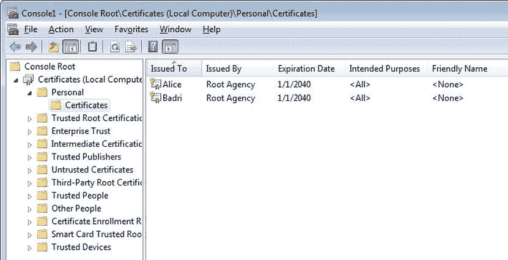
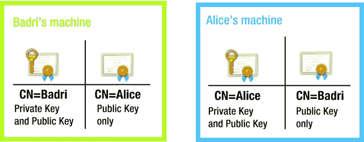
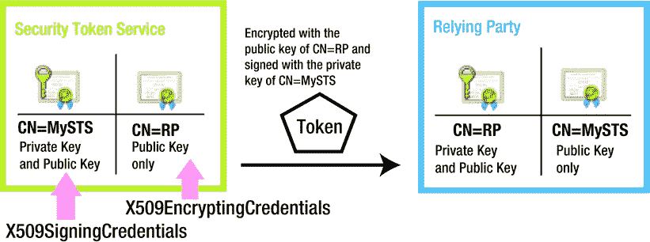

# 六、加密和签名

加密是将数据转换为纯文本并使其对除了本应读取数据的人之外的所有人不可读的过程，其目标是机密性。签名，或者更具体地说是数字签名，是创建数字签名以证明数据真实性和完整性的过程。有效的签名使接收方确信收到的数据确实来自正确的发送方，并且数据在传输过程中没有被篡改。

例如，假设我想专门向爱丽丝发送一条机密消息。我把信息加密，这样只有她才能解密和读取数据。现在我想给鲍勃发一条信息。我在消息上签名是因为 Bob 关心数据的真实性；也就是说，他想确定消息是来自我而不是冒名顶替者，并且来自我的原始消息在传输过程中没有被更改。

加密和签名并不相互排斥。消息既可以加密，也可以数字签名。例如，假设我想给 Charlie 发送一条机密消息，这样只有他可以阅读这条消息。我还想确保查理只接受来自我而不是冒名顶替者的消息。在这种情况下，我对消息进行加密和签名。

如果消息在通信信道的一端被加密，则在另一端被解密。如果消息是在通道的一端签名的，则签名在另一端进行验证。

在本章中，我将向您展示如何使用对称和非对称密钥 手动加密和签名数据。我还将向您展示 Windows Identity Foundation(WIF)如何对令牌进行加密和签名，以帮助您理解 WIF 为您所做的繁重的加密工作。如果您在 WIF 之外工作，就像 REST 中使用的 web 令牌经常出现的情况一样，那么您需要对加密和签名的概念有一个扎实的理解，以构建一个安全的 ASP.NET Web API。

密码术

加密有助于保护移动中的数据。它有助于提供安全的通信方式，防止非预期方查看机密数据(加密/解密)，并为预期接收方提供检测数据是否在传输过程中被篡改的方法(签名/验证)。除了机密性和完整性方面，加密还有助于身份验证和不可否认性。

加密密钥是随机生成的数据，除了算法试图保护的实际数据之外，它还是加密算法的重要输入。根据密钥的使用方式，加密算法可以分为两个主要领域。

1.  使用一个密钥的对称密钥或秘密密钥加密，发送端和接收端使用相同的密钥。
2.  非对称密钥或公钥加密，使用一对数学关联的密钥，一个密钥在发送端使用，另一个在接收端使用。

对称密钥加密的定义特征是在发送方和接收方两端使用相同的密钥。对称密钥也称为秘密密钥，因为这种机制要求密钥是仅由发送方和接收方共享的秘密。在对称密钥加密的情况下，用于加密的密钥也用于解密。同样，用于签名的密钥也用于验证消息。基于对称钥匙的方法听起来更自然，因为我们用一把钥匙锁门，用同一把钥匙开门。您可以使用。NET Framework 来生成用于对称算法的密钥。

对于非对称加密，有两个密钥，一个公钥和一个私钥。这些键以数学方式连接在一起。为了加密消息，发送方使用接收方的公钥。这样加密的消息只能用接收者的私钥解密。为了对消息进行签名，发送方使用发送方的私钥。这样签名的消息可以由接收者使用发送者的公钥来验证。私钥决不能共享，而公钥可以与任何人共享。

您可以使用。NET 框架来生成非对称密钥。此外，X.509 数字证书中的公钥-私钥对也可用于此目的。证书不仅仅是密钥的容器。它是由证书颁发机构(CA)颁发的，它确保其中包含的密钥属于向其颁发证书的实体；所以是证明自己身份的一种手段。这是考虑不可否认性需求的一个重要方面。否认就是否认。用 X.509 证书的私钥签名的消息的来源可以追踪到发送者的身份，满足认可要求。与此相比，使用`RNGCryptoServiceProvider`生成的公钥-私钥对不能用于不可否认的目的。

[表 6-1](#Tab1) 显示了对称和非对称密钥算法的比较。

[表 6-1](#_Tab1) 。对称密钥与非对称密钥

| 因素 | 对称密钥算法 | 非对称密钥算法 |
| --- | --- | --- |
| 表演 | 比不对称算法快得多。 | 相对较慢。 |
| 数据卷宗 | 可以处理大量数据。 | 可以处理的数据量的数学限制。 |
| 密钥保密 | 密钥必须在发送者和接收者之间共享，并且双方都必须保护密钥，与只有一方必须保守秘密相比，这通常更难并且风险加倍。 | 您必须严格保护您的私钥，但是可以自由地将同一个公钥分发给所有的通信伙伴。你的钥匙安全不在别人手里。 |
| 一生 | 实际上，对称密钥是定期轮换的。用新密钥替换旧密钥、向相关方传达这一变化以及让通信方适应这一变化都存在管理和操作开销。 | 非对称密钥通常是长期的。维护非对称密钥是有开销的，但是密钥通常不会像对称密钥那样频繁地改变。 |
| 易受强力攻击 | 选择的密钥大小决定了易感性，但是对称密钥相对更易受影响。 | 与对称密钥相比，非对称密钥的可能值范围要大得多，因此非对称密钥不太容易受到暴力攻击。 |
| 费用 | 不涉及像 CA 这样的外部代理，因此不涉及获取算法所需密钥的成本。 | 尽管生成密钥是可能的，但在实践中，不对称算法与 X.509 数字证书一起使用。从 CA 获得它们以及随后更新和管理它们都是要花钱的。 |

有趣的是，对称密钥和非对称密钥都可以一起使用，尤其是在发起通信时必须即时生成对称密钥的情况下。在这种情况下，一方可以生成对称密钥，使用非对称密钥加密算法对其进行加密，并安全地与另一方共享。一旦共享，进一步的消息交换可以通过对称密钥算法来保护。

使用对称密钥 加密消息

为了说明使用对称密钥进行加密的过程，假设我必须向客户服务代表 Alice 发送一条包含我的信用卡详细信息的消息，以便进行支付。我不想让除了爱丽丝之外的任何人看到这条消息，因为它包含敏感数据。为了确保机密性，我对消息进行了加密。然而，在我和爱丽丝开始交换任何加密信息之前，我们必须就两件事达成一致。

1.  用于加密和解密消息的密钥。我和爱丽丝共享密钥，加密和解密用同一个密钥；因此，它是一个对称密钥。
2.  要使用的加密算法。因为我们使用对称密钥，所以必须使用对称算法。那个。NET Framework 支持几种开箱即用的算法，如[表 6-2](#Tab2) 所示。

[表 6-2。](#_Tab2)提供的对称加密类。NET 框架

| 班级 | 描述 |
| --- | --- |
| `RC2CryptoServiceProvider` | RC2 是罗恩·里维斯特在 20 世纪 80 年代末设计的一种分组密码。这是一个弱密码，不能使用。 |
| `DESCryptoServiceProvider` | 20 世纪 70 年代的数据加密标准(密钥大小为 56 位)也不适合当今的加密需求。 |
| `TripleDESCryptoServiceProvider` | 顾名思义，这是 DES 运行三次。即使以今天的标准来看，这也是一种强大的加密技术。 |
| `RijndaelManaged` | Rijndael(发音为 rain-dahl)是美国国家标准与技术研究所(NIST)选择的算法，作为高级加密标准(AES)的候选算法，AES 是 DES 的官方替代算法，并最终成为三重 DES。那个。NET Framework 还有一个`AesManaged`类，本质上是 Rijndael 算法，块大小为 128 位，不允许反馈模式。 |

Alice 和我决定使用 Rijndael，块大小为 128 位，密钥大小为 256 位，这是`RijndaelManaged`类的默认值。以下步骤显示了如何实现加密。

1.  [Listing 6-1](#list1) shows the code to generate a random key of size 256 bits and an initialization vector (IV) of size 128 bits using `RNGCryptoServiceProvider`. The IV is just a random input with a fixed size, generally the same as the block size. The randomness of the IV allows the same key to be used to encrypt the messages repeatedly, even the messages with sequences of repeating bytes, preventing an attacker from inferring relationships between segments of the encrypted message. For illustration purposes, the code in [Listing 6-1](#list1) shows the generation of the key and IV. In practice, the shared key is typically generated and shared between the communicating parties out of band and not as part of the message exchange.

    [***清单 6-1。***](#_list1) 加密密钥生成

    ```cs
    using (RijndaelManaged provider = new RijndaelManaged())
    {
        byte[] initVector = new byte[provider.BlockSize / 8]; // Converting 128 bits to bytes
        byte[] key = new byte[provider.KeySize / 8];          // Converting 256 bits to bytes

        using (var rngProvider = new RNGCryptoServiceProvider())
        {
            rngProvider.GetBytes(initVector);
            rngProvider.GetBytes(key);
        }

        // Encryption code goes here - See Listing 6-2.
    }
    ```

     **小心**提供的`RNGCryptoServiceProvider class`。NET Framework 实现了加密随机数生成器(RNG ),最适合为加密生成随机密钥。切勿将`System.Random`用于此目的。它可能会更快，但不适合专门的密钥生成工作。

2.  [Listing 6-2](#list2) shows the code for encrypting my message to Alice. My plain text message of “1234 5678 9012 3456 06/13” contains the credit card number and the expiry date. My message is a string or text. I get the byte array representation of this string by calling `Encoding.UTF8.GetBytes()` and pass the resulting byte array onto the `Transform` method. The input to an encryption or a decryption function is an array of bytes and so is the output.

    [***清单 6-2。***](#_list2) 共享密钥或对称密钥加密

    ```cs
    // Credit card data that I want to send Alice
    string creditCard = "1234 5678 9012 3456 06/13";
    byte[] clearBytes = Encoding.UTF8.GetBytes(creditCard);

    byte[] foggyBytes = Transform(clearBytes,
                            provider.CreateEncryptor(key, initVector));
    ```

3.  The `Transform` method shown in [Listing 6-3](#list3) is used for both encryption and decryption. It encrypts or decrypts based on the cryptographic transformation object that is passed in. For encryption, I pass the encryptor object returned by the `CreateEncryptor` method, which is used to create a `CryptoStream` object, the contents of which are returned as a byte array. This is the cipher text or the encrypted message.

    [***清单 6-3。***](#_list3) 变换方法

    ```cs
    private byte[] Transform(byte[] textBytes, ICryptoTransform transform)
    {
        using (var buf = new MemoryStream())
        {
            using (var stream = new CryptoStream(buf, transform,
                                                      CryptoStreamMode.Write))
            {
                stream.Write(textBytes, 0, textBytes.Length);
                stream.FlushFinalBlock();
                return buf.ToArray();
            }
        }
    }
    ```

4.  Convert the cipher text to a base64-encoded string. This is necessary in scenarios like sending cipher text as part of HTML, such as in a hidden field, a cookie, or in an HTTP header. See [Listing 6-4](#list4). The cipher text in base64 encoding that gets written to the console is “naoJ1WaoyI8Ra0bviykBT23o5M0iEWhF56ojcJskQ/8=”. Of course, this output will not be same as yours, if you run this code, because the key generated in the first step for me will be different from yours.

    [***清单 6-4。***](#_list4) 发送密文

    ```cs
    // This is the string that gets sent to Alice
    string encryptedData = Convert.ToBase64String(foggyBytes);
    Console.WriteLine(encryptedData);
    ```

5.  Finally, [Listing 6-5](#list5) shows the code Alice runs to decrypt my message and extract the credit card. Note that the same `Transform` method is used here as well. However, by passing in the decryptor object created by `CreateDecryptor`, I instruct the method to assume the input as cipher text and decrypt to clear text.

    [***清单 6-5。***](#_list5) 共享密钥或对称密钥解密

    ```cs
    var foggyBytes = Convert.FromBase64String(messageFromBadri);

    Console.WriteLine(
        Encoding.UTF8.GetString(
            Transform(foggyBytes, provider.CreateDecryptor(key, initVector))));
    ```

使用对称密钥 签署消息

现在我们已经看到了加密的实际应用，让我们继续讨论数字签名。签名的目的是确保真实性(接收到的数据来自接收方认为来自的人)和完整性(数据在传输过程中不会被篡改)。

假设我必须给鲍勃发一条信息，请他在镇广场和我见面。鲍勃担心数据的真实性。他想确定这条消息是我发的，而不是冒名顶替的。在这个例子中，我不关心机密性，因为我没有发送任何机密数据。发送纯文本对我来说是可以接受的。

和加密一样，Bob 和我有一个共享的密钥。可以像前面部分一样生成密钥。然而，只需要一个密钥而不需要 IV，因为 IV 是加密而不是签名的要求。我使用共享密钥创建一个基于散列的代码，并将其作为我的签名发送。

哈希是将字符串或文本数据转换为代表原始字符串的较短的固定长度字符串。我将在第 15 章中详细介绍散列，作为一种保护 REST 中数据的机制。一个基于哈希的消息认证码 (HMAC) 可以作为签名，这是本节的重点。

在密码学中，消息认证码(MAC)是使用散列函数结合密钥计算出来的。它用于验证消息的数据完整性和真实性。如果我用一个密钥为我打算发送给 Bob 的消息创建一个 HMAC，它会产生一个散列码。我会把这个消息和这个代码(我的签名)一起发给鲍勃。收到消息后，Bob 也可以使用他拥有的密钥为消息创建 HMAC，这当然与我的密钥相同。如果消息在传输过程中没有被篡改，Bob 创建的代码和我发送的代码将完全匹配。此外，因为 Bob 和我共享密钥，所以唯一能够从消息中创建相同代码的人必须是我。通过比较代码，Bob 可以确定消息的真实性和完整性。就像加密一样，也支持几种哈希算法。NET 框架生成一个 HMAC 代码(如[表 6-3](#Tab3) 所示)。

[表 6-3](#_Tab3) 。由提供的类。创建 HMAC 的. NET 框架

| 班级 | 描述 |
| --- | --- |
| HMACMD5 | 使用消息摘要算法 5 (MD5)哈希函数。输出哈希长度为 128 位。MD5 算法是由 Ron Rivest 在 20 世纪 90 年代早期设计的，现在并不是首选。 |
| 海贼王角色列表 | 使用 1995 年发布的安全哈希算法(SHA1)哈希。输出哈希长度为 160 位。尽管使用最广泛，但这并不是当今的首选。 |
| HMACSHA256、MACSHA384 和 HMACSHA512 | 使用 SHA-2 家族的 SHA-256、SHA-384 和 SHA-512 函数。《SHA-2》出版于 2001 年。正如哈希函数的名称所示，输出哈希长度分别为 256、384 和 512 位。 |

下列步骤显示了如何实现签名和验证。

1.  Similar to encryption, the participants (Bob and I) agree on the algorithm to be used and the key. We decide to use the hashing algorithm SHA256\. [Listing 6-6](#list6) shows the code to generate a 32-byte key. As with encryption, the generation code is shown here for illustration purposes. In practice, it is created and shared out of band.

    [***清单 6-6。***](#_list6) 签约密钥生成

    ```cs
    using (var provider = new RNGCryptoServiceProvider())
    {
        byte[] secretKeyBytes = new byte[32];
        provider.GetBytes(secretKeyBytes);

        return Convert.ToBase64String(secretKeyBytes);
    }
    ```

2.  The message for which I need to create the HMAC signature is “Meet me in the town square.” I use the secret key generated in the previous step to create an instance of the `HMACSHA256` class. I convert the text message into a byte array by calling `Encoding.UTF8.GetBytes` and pass that on to the `ComputeHash` method of the `HMACSHA256` object. The result of the method call is the signature, which is a byte array. See [Listing 6-7](#list7). It prints FI0rhihM5nVisyT6X8TrtifBbbl4xGx6wxm4m9MmdVs=, which is the base64-encoded representation of the signature.

    [***清单 6-7。***](#_list7) 对称密钥签名

    ```cs
    byte[] dataToJoe = Encoding.UTF8.GetBytes("Meet me in the town square");
    using (HMACSHA256 hmac = new HMACSHA256(secretKeyBytes))
    {
        byte[] signatureBytes = hmac.ComputeHash(dataToJoe);

        string signature = Convert.ToBase64String(signatureBytes);
        Console.WriteLine(signature);
    }
    ```

3.  现在我有了签名，我可以用明文和相应的签名向 Bob 发送消息“在城镇广场见”。鲍勃知道消息是我发的。因此，他知道要使用的特定密钥，因为我们有一个公共的共享密钥。他使用密钥并自己创建了 HMAC256 签名，与我发送给他的消息相对应。如果他创建的签名与我随邮件发送的签名相匹配，Bob 就知道数据在传输过程中没有被篡改。因为只有 Bob 和我知道这个共享密钥，所以他确信数据来自我。当然，要实现这一点，共享密钥必须是 Bob 和我之间的秘密。
4.  Finally comes the validation. [Listing 6-8](#list8) shows the code that Bob can use to validate the message and signature.

    [***清单 6-8。***](#_list8) 对称密钥签名验证

    ```cs
    string signatureOfBadri = "FI0rhihM5nVisyT6X8TrtifBbbl4xGx6wxm4m9MmdVs=";
    byte[] dataFromBadri = Encoding.UTF8
                                     .GetBytes("Meet me in the town square");

    using (HMACSHA256 hmac = new HMACSHA256(secretKeyBytesOfBadri))
    {
        byte[] signatureBytes = hmac.ComputeHash(dataFromBadri);
        string computedSignature = Convert.ToBase64String(signatureBytes);

        if (computedSignature.Equals(signatureOfBadri,
                                           StringComparison.Ordinal))
            Console.WriteLine("Authentic");
    }
    ```

 **注意**简单 Web 令牌(SWT)，你将在[第十章](10.html)中看到，使用我们在这里使用的相同的 HMAC SHA256 散列来确保真实性。

使用非对称密钥 加密消息

在这一节中，我将向您展示如何通过来自 X.509 证书的非对称密钥(一个公钥和一个私钥对)执行加密和签名。为了说明加密过程，我使用了前面的场景，其中我将信用卡数据发送给 Alice。

制作证书最简单的方法是使用像 Makecert.exe 这样的工具。出于测试目的，它生成带有公钥和私钥对的 X.509 证书，但出于说明目的，这是可以接受的。您可以从 Visual Studio 2010 中的 Visual Studio 工具下的 Visual Studio 命令提示符或 Visual Studio 2012 的开发人员命令提示符运行 Makecert.exe。您必须以管理员身份启动 Visual Studio 命令提示符，Makecert 才能工作。一旦你准备好了，你就可以用清单 6-9 中的命令行参数运行这个工具。

[***清单 6-9。***](#_list9) 通过 Makecert 生成证书

```cs
makecert.exe -sr LocalMachine -ss My -a sha1 -n CN=Badri -sky exchange -pe
makecert.exe -sr LocalMachine -ss My -a sha1 -n CN=Alice -sky exchange -pe
```

以下步骤显示了如何查看由 Makecert.exe 生成的证书。

1.  通过在“运行”框中键入 mmc 来运行 Microsoft 管理控制台。
2.  选择文件添加/删除管理单元，然后选择左侧可用管理单元下的证书管理单元。
3.  单击添加，然后选择计算机帐户、本地计算机以查看您计算机上的证书。

[图 6-1](#Fig1) 显示了 Makecert 运行两次后的结果。创建了两个证书，巴德里和爱丽丝，它们都有私钥。我选择对这些证书使用 SHA1 算法，这是默认选项，比 MD5 好，MD5 是唯一的其他选项。通过为 sky switch 指定“exchange”，如[清单 6-9](#list9) 所示，我确保了证书可以用于加密和签名。



[图 6-1。](#_Fig1) MMC 证书管理单元

现在我们已经创建了必要的证书，我们可以使用新的证书加密包含信用卡数据的消息。因为我们要进行非对称加密和解密，所以让我们使用 RSA 算法，它是公钥加密的算法。中实现此算法的类。NET 框架是`RSACryptoServiceProvider`。

1.  The `X509Certificate2` class in the .NET Framework represents an X.509 certificate. I use an extension method to the string to create an X509Certificate2 instance from the subject name (see [Listing 6-10](#list10)). We locate a certificate in the certificate store using the subject name. First create and open an `X509Store` object. Using the `Certificates` collection of the store object, narrow down to the certificate you are looking for, using the subject name. The final result will be an `X509Certificate2` object.

    [***清单 6-10。***](#_list10) 领取证书

    ```cs
    static class CertificateHelper
    {
        public static X509Certificate2 ToCertificate(
    this string subjectName,
                                      StoreName name = StoreName.My,
                                         StoreLocation location = StoreLocation.LocalMachine)
        {
            X509Store store = new X509Store(name, location);
            store.Open(OpenFlags.ReadOnly);

            try
            {
                var cert = store.Certificates.OfType<X509Certificate2>()
                            .FirstOrDefault(c => c.SubjectName.Name.Equals(subjectName,
                                                    StringComparison.OrdinalIgnoreCase));

                return (cert != null) ? new X509Certificate2(cert) : null;
            }
            finally
            {
                store.Certificates.OfType<X509Certificate2>().ToList().ForEach(c => c.Reset());
                store.Close();
            }
        }
    }
    ```

2.  Let’s go ahead and encrypt the data “1234 5678 9012 3456 06/13” just as we did for the symmetric key. I’m encrypting the message to be read by Alice. It is important that I use Alice’s public key. Alice could have given her public key to many, but her private key is a secret and only Alice has it. She will use the private key to decrypt my message. By using Alice’s public key, I’m making sure only Alice, who has the private key, can read the data and not anyone else. This is the most important part of the asymmetric key encryption: The sender uses the public key of the receiver’s certificate to encrypt and the receiver uses the private key of their own certificate to decrypt. See [Listing 6-11](#list11).

    [***清单 6-11。***](#_list11) 非对称密钥加密

    ```cs
    string dataToAlice = "1234 5678 9012 3456 06/13";
    var cert = "CN=Alice".ToCertificate();
    var provider = (RSACryptoServiceProvider)cert.PublicKey.Key; // Note the use of public key

    byte[] cipherText = provider
                           .Encrypt(Encoding.UTF8
                               .GetBytes(dataToAlice), true);

    Console.WriteLine(Convert.ToBase64String(cipherText));

    // What gets sent to Alice is cipherText
    ```

3.  [Listing 6-12](#list12) shows the code Alice can use to decrypt the message and get the credit card information. Alice uses the private key of her certificate.

    [***清单 6-12。***](#_list12) 非对称密钥解密

    ```cs
    // Alice receives cipherText here

    // Alice decrypts the cipherText using her private key
    var cert = "CN=Alice".ToCertificate();
    var provider = (RSACryptoServiceProvider)cert.PrivateKey;

    Console.WriteLine(
        Encoding.UTF8.GetString(
            provider.Decrypt(cipherText, true)));
    ```

我在我的机器上生成了这两个证书，因此我有这两个证书的私钥。然而，实际上情况并非如此。我将拥有两个证书，但是 CN =巴德里的证书将拥有一个公钥和一个私钥。CN=Alice 的证书将只有公钥。与爱丽丝的情况正好相反，如图[图 6-2](#Fig2) 所示。



[图 6-2。](#_Fig2)证书和密钥分发:发送方和接收方机器

 **注意**在[清单 6-11](#list11) 中，我用爱丽丝的公钥加密数据，爱丽丝用她的私钥解密，这是典型的方法。如果我可以访问 Alice 的私钥并使用它来加密数据，会怎么样？爱丽丝现在可以用她的公钥解密吗？答案是否定的。无论在非对称密钥加密中使用公钥还是私钥，都只能使用私钥进行解密。但是，使用私钥进行加密并不是正确的方法。非对称密钥加密的正确实现在发送方使用接收方的公钥进行加密，在接收方使用接收方的私钥进行解密。

可以使用由`RSACryptoServiceProvider`类生成的非对称密钥进行加密和解密，而无需使用 X.509 证书。与上一节不同，在上一节中，我们按照实际生活中必须使用的方式生成了两个证书，为了简单起见，我们现在只生成一个密钥对。[清单 6-13](#list13) 显示了生成密钥的代码，而[清单 6-14](#list14) 显示了加密和解密。

[***清单 6-13。***](#_list13)RSA cryptoserviceprovider 生成私钥-公钥对

```cs
string publicKey = String.Empty;
string privateKey = String.Empty;

using (RSACryptoServiceProvider rsa = new RSACryptoServiceProvider())
{
        publicKey = rsa.ToXmlString(false);
        privateKey = rsa.ToXmlString(true);
}
```

 **注意**通过`ToXmlString()`方法生成的密钥是纯文本 XML 格式的，但是出于安全原因，您不应该将它们存储在文件系统中。必须改用密钥容器。`System.Security.Cryptography.CspParameters`可以帮助你使用密钥容器来存储密钥。

[***清单 6-14。***](#_list14) 使用 RSACryptoServiceProvider 生成的密钥进行加密

```cs
byte[] encryptedData = null;
byte[] secretData = Encoding.UTF8.GetBytes("1234 5678 9012 3456 06/13");

// Sender's end
using (RSACryptoServiceProvider rsa = new RSACryptoServiceProvider())
{
        rsa.FromXmlString(publicKey); // encrypt using public key
        encryptedData = rsa.Encrypt(secretData, true);
}

// Receiver's end
using (RSACryptoServiceProvider rsa = new RSACryptoServiceProvider())
{
        rsa.FromXmlString(privateKey); // decrypt using private key
        Console.WriteLine(Encoding.UTF8.GetString(rsa.Decrypt(encryptedData, true)));
}
```

使用非对称密钥对消息进行签名

现在我们已经看到了如何使用非对称密钥进行加密/解密，让我们继续进行签名。关于密钥使用的主要区别是，我使用我的私钥对数据进行签名。接收者，在我们的例子中是 Bob，使用我的证书的公钥来验证签名。我在签署数据时传递 SHA1，因为这是我在使用 Makecert 创建证书时选择的算法。[清单 6-15](#list15) 显示了使用我的私钥签署消息的代码。

[***清单 6-15。***](#_list15) 非对称密钥签名

```cs
byte[] dataFromBadri = Encoding.UTF8
.GetBytes("Meet me in the town square");
var cert = "CN=Badri".ToCertificate();

var provider = (RSACryptoServiceProvider)cert.PrivateKey; // Note the use of private key here
byte[] signatureOfBadri = provider.SignData(dataFromBadri,
                                                CryptoConfig.MapNameToOID("SHA1"));

Console.WriteLine(Convert.ToBase64String(signatureOfBadri));

// What gets sent to Bob are the data and signature
// dataFromBadri and signatureOfBadri
```

[清单 6-16](#list16) 显示了 Bob 可以用来验证数据真实性的代码。鲍勃知道数据来自我，所以他将使用主题名为 CN =巴德里的证书。他将只有我的证书的公钥，这是他将用来验证数据和签名。

[***清单 6-16。***](#_list16) 非对称密钥签名验证

```cs
// Bob receives my data and signature here
// dataFromBadri and signatureOfBadri

// Bob validates the signature using my public key
var cert = "CN=Badri".ToCertificate();
var provider = (RSACryptoServiceProvider)cert.PublicKey.Key; // Note the use of public key here

if (provider.VerifyData(dataFromBadri,
                            CryptoConfig.MapNameToOID("SHA1"),
                                 signatureOfBadri))
    Console.WriteLine("Verified");
```

下面是在我们的场景中如何使用这些键的快速回顾:

*   对于加密，我使用了证书 CN=Alice 的公钥。
*   对于解密，Alice 使用证书 CN=Alice 的私钥。
*   对于签名，我使用了证书 CN =巴德里的私钥。
*   为了验证签名，鲍勃使用了证书 CN =巴德里的公钥。

认可

假设 Bob 从我这里收到消息，并使用我的证书的公钥验证我的签名。这个场景只涉及两个人，但是这个场景也适用于组织。

如果两个组织使用由 CA 颁发的真正的 X.509 证书(而不是使用由 Makecert 生成的测试证书)，一旦接收者使用发送者证书的公钥验证了消息，发送者就不可能否认消息不是来自他们的组织。消息必须使用发送方的私钥进行签名，该私钥必须由发送方安全保存。因此，使用 X.509 证书创建的签名有助于认可方面。

使用由类`RSACryptoServiceProvider`生成的非对称密钥进行签名是可能的(参见[清单 6-17](#list17) )。密钥生成逻辑如前面章节中的[清单 6-13](#list13) 所示。

[***清单 6-17。***](#_list17) 使用 RSACryptoServiceProvider 生成的密钥签名

```cs
byte[] signature = null;
byte[] secretData = Encoding.UTF8.GetBytes("Mum's the word");

// Sender's end
using (RSACryptoServiceProvider rsa = new RSACryptoServiceProvider())
{
        rsa.FromXmlString(privateKey); // sign using private key
        signature = rsa.SignData(secretData, "SHA256");
}

// Receiver's end
using (RSACryptoServiceProvider rsa = new RSACryptoServiceProvider())
{
        rsa.FromXmlString(publicKey);  // validate using public key
        Console.Write(rsa.VerifyData(secretData, "SHA256", signature)); // Outputs True, if
signature is valid
}
```

令牌加密 和签名

在本章中，到目前为止，我们一直在加密和签名数据，只是作为理解令牌发放者如何加密和签名安全令牌的前奏。

在前面的示例中，我的角色与令牌发布者的角色相同，因为我在发送消息之前对消息进行加密和签名。加密原型 Alice 和 Bob 代表依赖方，因为他们对我发送的消息进行解密和验证。前面示例中交换的消息类似于令牌颁发者和依赖方(RP)之间交换的令牌。

通常，令牌颁发者是 WS-Trust 协议指定的安全令牌服务(STS)端点。使用 WIF 创建我们自己的定制 STS 是可能的，我们将在第 7 章中深入探讨。

与 WIF 的密码处理进行比较

如果你利用 WIF 提供的类，加密和签名的基本细节都会被考虑进去。您需要做的只是指定一个加密和签名凭证。[图 6-3](#Fig3) 展示了一个使用 X.509 加密和签名凭证的场景；换句话说，X.509 证书。



[图 6-3。](#_Fig3)证书和密钥分发:STS 和 RP 应用

在接下来的部分中，我将简要介绍 WIF 如何帮助我们完成到目前为止手工完成的加密和签名。如果您不熟悉下面几节中的类和属性，不要担心。我在第 7 章中详细介绍了自定义 STS 的创建。在通过 WIF 实现的定制 STS 场景中，数据是需要加密和签名的令牌。爱丽丝、鲍勃和我的角色都由 WIF 扮演。WIF 根据它运行的位置知道需要做什么——发送方还是接收方。发送方是 STS，接收方是 RP 应用。

令牌加密

WIF 使用 RP 应用的证书。这就好比我用爱丽丝的证书加密。实际上，可以有多个依赖 RP 使用同一个 STS。在我们之前的加密示例中，通信仅在 Alice 和我之间进行，我在选择正确的证书时没有任何困难，因为除了我自己的证书之外，我唯一可用的证书是 Alice 的证书。但是，在 STS 的情况下，可以有多个 RP 应用。因此，STS 必须设计得足够智能，能够为加密选择正确的证书。

在 STS 类中覆盖的`GetScope`方法中，基于传入的`RequestSecurityToken`对象，STS 可以获得与发出令牌请求的 RP 相对应的证书，并在作用域的`EncryptingCredentials`属性中设置证书。WIF 通过使用分配给`EncryptingCredentials`的证书的公钥加密令牌来完成剩下的工作。

**RP 应用:** WIF 使用 RP 应用证书的私钥解密令牌。这类似于 Alice 在本章前面的场景中读取我发送给她的加密数据的操作。WIF 基于应用配置文件的`<system.serviceModel>`部分的`<serviceCertificate>`元素来获取证书，如[清单 6-18](#list18) 所示。

[***清单 6-18。***](#_list18) 应用配置服务证书

```cs
<serviceCertificate>
        <certificateReference x509FindType="FindBySubjectName"
                findValue="RP"
                storeLocation="LocalMachine" storeName="My" />
</serviceCertificate>
```

令牌签名

**STS:** STS 使用它自己的证书，就像我在签署要发送给 Bob 的数据时使用自己的证书一样。与加密证书不同，这里没有任何混淆的余地。要使用的证书是 STS 证书，它不会根据请求而改变。对于所有请求，要使用的证书是相同的。因此它被设置在`SecurityTokenServiceConfiguration`的构造函数中。

当调用`GetScope()`方法时，作用域对象的签名凭证已经设置好了，证书被传递到`SecurityTokenServiceConfiguration`构造函数中。WIF 跳了进来，用 STS 证书的私钥对令牌进行了签名。这类似于我在签署要发送给 Bob 的数据时所做的事情。

**依赖方应用:** WIF 使用 STS 的公钥验证签名。WIF 基于配置文件中的`<trustedIssuers>`获得证书(如清单 6-19 中的[所示)，并使用公钥来验证签名。这类似于 Bob 使用我的证书的公钥来验证我的签名。](#list19)

[***清单 6-19。***](#_list19) Web.config 可信发行机构

```cs
<issuerNameRegistry type="System.IdentityModel.Tokens.ConfigurationBasedIssuerNameRegistry,
             System.IdentityModel, Version=4.0.0.0, Culture=neutral, PublicKeyToken=b77a5c561934e089">
        <trustedIssuers>
                <add thumbprint="A6155968B7BBB9C35421B19FA9E14D4DCEF3FC5A"

name=" http://mysts " />
        </trustedIssuers>
</issuerNameRegistry>
```

类似于我和 Alice 交换公钥但保留私钥的方式，带有私钥的 STS 证书将只保存在运行 STS 的服务器上，而只有公钥的证书将发布给 RP 应用。类似地，RP 应用用私钥保存自己的证书，只向 STS 发布公钥。

摘要

加密和签名是密码学的两个重要方面。加密是将数据转换为纯文本并使其对除了本应读取数据的人之外的所有人不可读的过程，其目标是机密性。签名，或者更具体地说，数字签名是创建数字签名以向接收者证明数据真实性的过程。

根据密钥的使用方式，可以使用对称密钥或非对称密钥进行加密和签名。在前一种情况下，发送方和接收方共享同一个密钥。在后一种情况下，有两个数学上相关联的密钥:一个公钥和一个私钥。私钥是保密的，公钥是共享的。

如果您利用 WIF 提供的类，加密和安全令牌签名的具体细节会自动为您处理。您所需要做的就是指定一个加密和签名凭证。WIF 通过在 STS 端对令牌进行加密和签名，在 RP 应用端对令牌进行解密和验证，来完成加密的重任。

通过理解加密和签名的基本概念，您可以在需要时放心地在 WIF 领域之外工作，比如处理 REST 友好的 web 令牌。